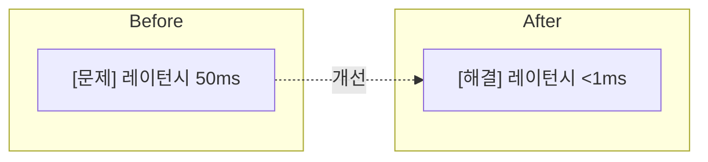

# AGENT.md
> Forward Engineering Blog - Technical Writing Guide

---

## Project Overview

**Forward Engineering Blog** - Astro Paper 기반 기술 블로그

```
Tech Stack:
├── Framework: Astro 5.x
├── Styling: TailwindCSS v4 + Typography plugin
├── Language: TypeScript
├── Search: Pagefind
├── Package Manager: bun (preferred) / pnpm
└── i18n: Korean (default) / English
```

### Commands

```bash
bun run dev      # 개발 서버 시작
bun run build    # 프로덕션 빌드
bun run preview  # 빌드 미리보기
bun run format   # 코드 포맷팅
bun run lint     # 린트 검사
```

### Git Workflow

**커밋 메시지는 항상 한글로 작성**

```bash
# 좋은 예
git commit -m "feat: 목차 컴포넌트 추가 및 블로그 콘텐츠 개선"
git commit -m "fix: Vite watch 중복 이벤트 방지 설정 추가"
git commit -m "chore: 패키지 매니저를 bun으로 마이그레이션"

# 나쁜 예
git commit -m "feat: add TableOfContents component"
git commit -m "fix: prevent duplicate watch events"
```

**커밋 메시지 구조:**
- `feat:` 새로운 기능 추가
- `fix:` 버그 수정
- `chore:` 빌드/설정 변경
- `docs:` 문서 수정
- `refactor:` 코드 리팩토링
- `style:` 코드 포맷팅
- `test:` 테스트 추가/수정

### Directory Structure

```
src/
├── components/     # Reusable Astro components
├── layouts/        # Page layouts
├── pages/          # Route pages
│   ├── *.astro     # Korean pages (default locale)
│   └── en/         # English pages
├── data/blog/      # Blog posts (Markdown)
│   ├── ko/         # Korean posts
│   └── en/         # English posts
├── i18n/           # Internationalization
├── styles/         # Global styles, typography
├── utils/          # Helper functions
└── assets/         # Images, icons
```

---

## Writing Philosophy | 글쓰기 철학

### 핵심

**"엔지니어링은 선택에 대한 설명이다"**

이 블로그는 무엇을 만들었는지가 아니라 **왜 그렇게 선택했는지**를 기록합니다.

---

### 톤과 태도

**독자를 동료 엔지니어로 대한다**
- 가르치려 들지 않는다
- 함께 고민을 나누는 톤
- "~입니다"보다 "~했습니다", "~겪었습니다"처럼 경험을 공유하는 어투

**거리감을 줄인다**
- 막연한 질문이나 어려움을 먼저 인정한다
- 자조적인 표현도 괜찮다 ("우물 안 개구리였다", "손 안 대고 코 푸는 격이었다")
- 완벽한 전문가가 아니라 같이 배워가는 사람으로 다가간다

**겸손하되 깊이 있게**
- "완벽한 답"을 주장하지 않는다
- "이 맥락에서는 이 선택이 합리적이었다"를 설명한다
- 틀렸던 가정, 예상과 다른 결과도 솔직히 공유한다

---

### 깊이와 구체성

**표면이 아닌 근본을 파고든다**
- "이렇게 쓰면 됩니다" (X)
- "왜 이렇게 설계되었는지, 어떤 트레이드오프가 있는지" (O)
- 공식 문서, 소스코드를 직접 확인하고 인용한다

**추상적 개념을 구체적 사례로 설명한다**
- "성능이 중요하다" (X)
- "배달앱에서 주문 피크 시간에 P99 레이턴시가 3초를 넘으면..." (O)
- 독자가 자신의 상황에 대입해볼 수 있는 예시를 든다

**추측이 아닌 측정으로 말한다**
- 주장에는 데이터가 뒷받침되어야 한다
- 프로파일링 결과, 벤치마크, 실제 운영 수치
- "빠르다/느리다"가 아니라 "P99 45ms → 38ms"

---

### 맥락의 존중

**같은 기술도 상황에 따라 답이 다르다**
- 팀 규모, 서비스 트래픽, 운영 역량에 따라 선택이 달라진다
- 독자가 "우리 상황에 적용 가능한가?" 판단할 수 있도록 맥락을 명시한다
- 외부 사례를 인용할 때는 우리와의 차이점을 함께 언급한다

---

### 플랫폼/회사 익명화 규칙

외부 플랫폼이나 회사를 언급할 때는 **간접적으로 익명화**하여 작성합니다.

**배달 플랫폼:**
| 실제 이름 | 익명 표기 | 비고 |
|----------|----------|------|
| 배달의민족 | **B사** | Baemin의 B |
| 쿠팡이츠 | **C사** | Coupang의 C |
| 요기요 | **Y사** | Yogiyo의 Y |
| 땡겨요 | **D사** | Ddangyo의 D |

**보안 솔루션:**
| 실제 이름 | 익명 표기 |
|----------|----------|
| Akamai | **A사** |

**작성 예시:**
```markdown
# 좋은 예
배달 플랫폼 C사의 리뷰 데이터를 수집해야 했습니다.
A사의 Anti-Bot 솔루션이 적용되면서 차단이 시작되었습니다.

# 나쁜 예
쿠팡이츠의 리뷰 데이터를 수집해야 했습니다.
Akamai Bot Manager가 적용되면서...
```

**이유:**
- 특정 회사의 보안 취약점을 직접적으로 노출하지 않음
- 법적 리스크 최소화
- 기술적 내용에 집중할 수 있음
- 독자가 자신의 상황에 일반화하여 적용하기 쉬움

---

### 피해야 할 것

- 단순 튜토리얼 ("설치하고 실행하면 끝")
- 근거 없는 주장 ("이게 더 좋습니다")
- 맥락 없는 벤치마크 ("A가 B보다 10배 빠름")
- 완벽주의적 톤 ("이것이 정답입니다")

### 지향해야 할 것

- 실제 프로덕션 경험 기반의 인사이트
- "왜 선택하지 않았는가"에 대한 설명
- 측정 가능한 결과와 구체적인 수치
- 다음 엔지니어가 참고할 수 있는 의사결정 기록
- 희망과 영감을 주는 마무리

---

## Content Structure | 콘텐츠 구조

### 기술 문서에 포함되어야 할 것

1. **맥락 (Context)** — 서비스 규모, 팀 구성, 제약사항. 왜 이 문제를 풀어야 했는지.

2. **문제 정의 (Problem)** — 증상이 아닌 구조적 문제. 비즈니스에 미친 영향.

3. **탐색 과정 (Exploration)** — 검토한 대안들, 선택하지 않은 이유, 외부 사례와의 차이점.

4. **결정과 트레이드오프 (Decision)** — 최종 선택과 그 이유. 이 선택으로 포기한 것들.

5. **결과 (Outcome)** — 정량/정성 지표. 예상과 달랐던 점.

6. **참고자료 (References)** — 공식 문서 우선. 모든 핵심 주장에 출처.

---

## Architecture Diagrams

### Mermaid Diagrams (Preferred)

**모든 다이어그램에 Mermaid 사용 권장**

- Markdown에 직접 삽입 가능
- 버전 관리 용이 (텍스트 기반)
- 일관된 스타일 유지
- 수정 및 유지보수 간편
- **라이트/다크 모드 자동 지원** (테마 전환 시 자동 재렌더링)

> **중요**: `%%{init: {'theme':'base'}}%%` 지시어는 사용하지 마세요!
> 블로그가 자동으로 테마를 감지하여 라이트/다크 모드에 맞는 색상을 적용합니다.

**다크 모드 자동 지원 원리:**

블로그의 Mermaid 렌더러가 자동으로:
1. 현재 테마 감지 (`data-theme` 속성)
2. 라이트/다크 모드에 맞는 색상 팔레트 적용
3. 테마 전환 시 다이어그램 자동 재렌더링

**시각적 디자인 원칙:**

```markdown
# 인라인 style 사용 금지 (테마 자동 적용을 위해)
- ❌ style A fill:#ff6b6b,color:#fff
- ✅ 기본 노드/subgraph 스타일 사용

# 이모지 사용 금지
- ❌ 이모지 아이콘 사용 금지
- ✅ 텍스트 레이블 사용: [문제], [결과], [OK], [WARN] 등

# 시각적 계층
- 점선 (-.): 개선 관계, 변환 관계
- 화살표: 인과 관계, 프로세스 흐름
```

**다이어그램 예시 (권장):**

````markdown

````

**참고**: 인라인 스타일 없이 작성하면 블로그가 자동으로 라이트/다크 테마에 맞는 색상을 적용합니다.

### Excalidraw — 정성스러운 다이어그램

**ASCII 박스 다이어그램 대신 Excalidraw 사용**

> **중요**: Excalidraw 다이어그램은 반드시 **라이트 모드용**과 **다크 모드용** 두 벌을 제작합니다.

블로그에서 구조를 설명할 때, 코드 블록 안에 ASCII 문자로 그린 박스 다이어그램은 피합니다:

```
# 피해야 할 것 — AI스러운 ASCII 다이어그램

┌─────────────────────────────────────────┐
│ FIL Header (38 bytes)                   │  ← 이런 스타일
│  - Checksum (무결성 검증)               │
│  - Page Number                          │
├─────────────────────────────────────────┤
│ INDEX Header (36 bytes)                 │
└─────────────────────────────────────────┘
```

이런 다이어그램은 **Excalidraw**로 직접 그려서 이미지로 대체합니다.

**왜 Excalidraw인가?**

| ASCII 다이어그램 | Excalidraw |
|------------------|------------|
| 기계적이고 차가운 느낌 | 손으로 그린 듯한 따뜻한 느낌 |
| 텍스트 정렬에 한계 | 자유로운 레이아웃 |
| 색상 표현 불가 | 색상으로 구분/강조 가능 |
| 복잡한 구조 표현 어려움 | 화살표, 그룹핑 자유로움 |
| AI가 생성한 느낌 | **정성 들인 느낌** |

**Excalidraw 사용 원칙:**

1. **파일 저장 위치**: `src/assets/images/{주제}/`
   ```
   src/assets/images/
   └── innodb/
       ├── page-structure-light.svg  # 라이트 모드용
       ├── page-structure-dark.svg   # 다크 모드용
       ├── record-format-light.svg
       ├── record-format-dark.svg
       └── ...
   ```

2. **파일 형식**: SVG 우선 (PNG은 고해상도 필요 시)
   - Excalidraw에서 "Export" → "SVG" 선택
   - "Embed scene" 체크 (나중에 수정 가능하도록)

3. **스타일 가이드**:

   **라이트 모드용 색상 팔레트:**
   | 용도 | 색상 | HEX |
   |------|------|-----|
   | 배경 | 흰색/투명 | `transparent` 또는 `#ffffff` |
   | 텍스트/선 | 진한 회색 | `#1e1e1e` |
   | 문제/에러/Before | 빨간색 | `#e03131` |
   | 주의/경고/신규 | 노란색 | `#f08c00` |
   | 해결책/After/성공 | 초록색 | `#2f9e44` |
   | 정상 흐름/정보 | 파란색 | `#1971c2` |
   | 비활성/콜드 데이터 | 회색 | `#868e96` |

   **다크 모드용 색상 팔레트:**
   | 용도 | 색상 | HEX |
   |------|------|-----|
   | 배경 | 다크 배경 | `#212737` (블로그 다크 배경색) |
   | 텍스트/선 | 밝은 회색 | `#eaedf3` |
   | 문제/에러/Before | 연한 빨간색 | `#ff6b6b` |
   | 주의/경고/신규 | 연한 노란색 | `#ffd43b` |
   | 해결책/After/성공 | 연한 초록색 | `#51cf66` |
   | 정상 흐름/정보 | 연한 파란색 | `#4dabf7` |
   | 비활성/콜드 데이터 | 중간 회색 | `#adb5bd` |

   - **폰트**: Excalidraw 기본 손글씨 스타일 유지
   - **선 스타일**: 손으로 그린 느낌의 "Architect" 스타일

4. **네이밍 규칙**: `{내용}-{light|dark}.svg`
   - 예: `page-structure-light.svg`, `page-structure-dark.svg`
   - 예: `lru-algorithm-light.svg`, `lru-algorithm-dark.svg`
   - **반드시 light/dark 쌍으로 생성**

**블로그에서 사용 (Markdown):**

마크다운 파일에서는 HTML 태그로 직접 사용:

```html


```

**Astro 컴포넌트에서 사용:**

```astro
---
import ThemeImage from '@/components/ThemeImage.astro';
import pageStructureLight from '@/assets/images/innodb/page-structure-light.svg';
import pageStructureDark from '@/assets/images/innodb/page-structure-dark.svg';
---
<ThemeImage
  lightSrc={pageStructureLight}
  darkSrc={pageStructureDark}
  alt="InnoDB Page 내부 구조"
/>
```

**작동 원리:**
- 라이트 모드: `-light.svg` 표시, `-dark.svg` 숨김
- 다크 모드: `-dark.svg` 표시, `-light.svg` 숨김
- CSS `[data-theme]` 속성 기반으로 즉시 전환
- 깜빡임 없이 부드러운 전환

**CSS 클래스:**
- `theme-img-light`: 라이트 모드에서만 표시
- `theme-img-dark`: 다크 모드에서만 표시

**Excalidraw로 대체해야 하는 것들:**

| 기존 표현 방식 | Excalidraw로 대체 |
|---------------|------------------|
| `┌───┬───┐` 형태의 ASCII 박스 | 손그림 스타일 다이어그램 |
| 텍스트 기반 구조 설명 | 시각적 계층 구조 |
| Step 1 → Step 2 텍스트 흐름 | 화살표와 타임라인 |
| 크기/비율 수치 나열 | 비례 시각화 |

**Excalidraw 편집 팁:**

1. [excalidraw.com](https://excalidraw.com)에서 직접 작업
2. `.excalidraw` 파일을 `docs/diagrams/` 폴더에 원본 저장 (선택)
3. 블로그용은 SVG로 export하여 `src/assets/images/`에 저장

---

## Recent Posts

### 멀티 플랫폼 데이터베이스 설계 (2026-01-07)

**파일:**
- 한글: `src/data/blog/multi-platform-database-design-deep-dive.md`
- 영어: `src/data/blog/multi-platform-database-design-deep-dive-en.md`

**핵심 내용:**
- 새로운 외부 플랫폼 연동을 위한 DB 아키텍처 설계
- God Table 안티패턴 → Bounded Context 분리
- AI Debate를 활용한 설계 검증 프로세스
- 고성능 로깅 시스템 (버퍼링, 배치 처리)
- 인덱스 전략과 EXPLAIN 기반 의사결정
- 데이터 라이프사이클 관리 (파티셔닝, 아카이브)
- Observability를 고려한 스키마 설계

**다이어그램 (10개):**
1. God Table 문제 시각화
2. Bounded Context 분리 (DDD)
3. 3-Table ERD
4. 성능 비교 (Before/After - 50배 개선)
5. 버퍼링 시스템 Sequence Diagram
6. 인덱스 의사결정 플로우
7. 세션 안정성 등급 (STABLE/UNSTABLE/CRITICAL)
8. 파티션 프루닝
9. 데이터 라이프사이클 (Hot→Cold→Delete)
10. 비용 비교 (67% 절감)

**주요 수치:**
- 약 4,000줄의 코드
- 95% 테스트 커버리지
- 50배 성능 개선 (레이턴시, DB 커넥션)
- 100배 처리량 개선 (100 → 10,000+ logs/sec)
- 67% 스토리지 비용 절감

**사용된 원칙:**
- "추측하지 말고 측정하라" (EXPLAIN 기반)
- 정규화 우선, 비정규화는 측정 후
- 인덱스는 가설 → Production 검증 후 제거
- 트레이드오프를 명시적으로 문서화

---

## Bilingual Posts

한국어와 영어 버전을 각각 작성:

```
src/data/blog/
├── ko/
│   └── my-post.md    # 한국어
└── en/
    └── my-post.md    # English
```

### Frontmatter

```yaml
---
author: 김면수
pubDatetime: 2024-01-15T10:00:00Z
title: "제목"
slug: my-post-slug
featured: true
draft: false
tags:
  - Backend
  - Kotlin
description: |
  한두 문장으로 핵심 내용 요약
---
```

---

## References | 참고자료 원칙

1. 모든 핵심 주장에는 출처를 남긴다
2. 공식 문서를 1순위로 사용한다
3. 기술 블로그는 보조 근거로 활용한다

**자주 참고하는 소스:**
- 공식 문서 (Kotlin, JVM, Framework docs)
- GitHub 소스코드 직접 확인
- Netflix/Uber/배민/네이버 기술 블로그
- 서적 (Effective Java, DDIA 등)
