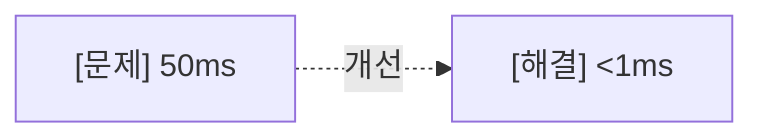

# AGENT.md
> Forward Engineering Blog - Technical Writing Guide

---

## Project Overview

**Forward Engineering Blog** - Astro Paper 기반 기술 블로그

```
Tech Stack:
├── Framework: Astro 5.x
├── Styling: TailwindCSS v4 + Typography plugin
├── Language: TypeScript
├── Search: Pagefind
├── Package Manager: bun (preferred) / pnpm
└── i18n: Korean (default) / English
```

### Commands

```bash
bun run dev      # 개발 서버 시작
bun run build    # 프로덕션 빌드
bun run preview  # 빌드 미리보기
bun run format   # 코드 포맷팅
bun run lint     # 린트 검사
```

### Git Workflow

**커밋 메시지는 항상 한글로 작성**

```bash
# 좋은 예
git commit -m "feat: 목차 컴포넌트 추가 및 블로그 콘텐츠 개선"
git commit -m "fix: Vite watch 중복 이벤트 방지 설정 추가"
git commit -m "chore: 패키지 매니저를 bun으로 마이그레이션"

# 나쁜 예
git commit -m "feat: add TableOfContents component"
git commit -m "fix: prevent duplicate watch events"
```

**커밋 메시지 구조:**
- `feat:` 새로운 기능 추가
- `fix:` 버그 수정
- `chore:` 빌드/설정 변경
- `docs:` 문서 수정
- `refactor:` 코드 리팩토링
- `style:` 코드 포맷팅
- `test:` 테스트 추가/수정

### Directory Structure

```
src/
├── components/     # Reusable Astro components
├── layouts/        # Page layouts
├── pages/          # Route pages
│   ├── *.astro     # Korean pages (default locale)
│   └── en/         # English pages
├── data/blog/      # Blog posts (Markdown)
│   ├── ko/         # Korean posts
│   └── en/         # English posts
├── i18n/           # Internationalization
├── styles/         # Global styles, typography
├── utils/          # Helper functions
└── assets/         # Images, icons
```

---

## Writing Philosophy | 글쓰기 철학

### 핵심

**"엔지니어링은 선택에 대한 설명이다"**

이 블로그는 무엇을 만들었는지가 아니라 **왜 그렇게 선택했는지**를 기록합니다.

---

### 톤과 태도

**독자를 동료 엔지니어로 대한다**
- 가르치려 들지 않는다
- 함께 고민을 나누는 톤
- "~입니다"보다 "~했습니다", "~겪었습니다"처럼 경험을 공유하는 어투

**거리감을 줄인다**
- 막연한 질문이나 어려움을 먼저 인정한다
- 자조적인 표현도 괜찮다 ("우물 안 개구리였다", "손 안 대고 코 푸는 격이었다")
- 완벽한 전문가가 아니라 같이 배워가는 사람으로 다가간다

**겸손하되 깊이 있게**
- "완벽한 답"을 주장하지 않는다
- "이 맥락에서는 이 선택이 합리적이었다"를 설명한다
- 틀렸던 가정, 예상과 다른 결과도 솔직히 공유한다

---

### 깊이와 구체성

**표면이 아닌 근본을 파고든다**
- "이렇게 쓰면 됩니다" (X)
- "왜 이렇게 설계되었는지, 어떤 트레이드오프가 있는지" (O)
- 공식 문서, 소스코드를 직접 확인하고 인용한다

**추상적 개념을 구체적 사례로 설명한다**
- "성능이 중요하다" (X)
- "배달앱에서 주문 피크 시간에 P99 레이턴시가 3초를 넘으면..." (O)
- 독자가 자신의 상황에 대입해볼 수 있는 예시를 든다

**추측이 아닌 측정으로 말한다**
- 주장에는 데이터가 뒷받침되어야 한다
- 프로파일링 결과, 벤치마크, 실제 운영 수치
- "빠르다/느리다"가 아니라 "P99 45ms → 38ms"

---

### 맥락의 존중

**같은 기술도 상황에 따라 답이 다르다**
- 팀 규모, 서비스 트래픽, 운영 역량에 따라 선택이 달라진다
- 독자가 "우리 상황에 적용 가능한가?" 판단할 수 있도록 맥락을 명시한다
- 외부 사례를 인용할 때는 우리와의 차이점을 함께 언급한다

---

### 플랫폼/회사 익명화 규칙

외부 플랫폼이나 회사를 언급할 때는 **간접적으로 익명화**하여 작성합니다.

**배달 플랫폼:**
| 실제 이름 | 익명 표기 | 비고 |
|----------|----------|------|
| 배달의민족 | **B사** | Baemin의 B |
| 쿠팡이츠 | **C사** | Coupang의 C |
| 요기요 | **Y사** | Yogiyo의 Y |
| 땡겨요 | **D사** | Ddangyo의 D |

**보안 솔루션:**
| 실제 이름 | 익명 표기 |
|----------|----------|
| Akamai | **A사** |

**작성 예시:**
```markdown
# 좋은 예
배달 플랫폼 C사의 리뷰 데이터를 수집해야 했습니다.
A사의 Anti-Bot 솔루션이 적용되면서 차단이 시작되었습니다.

# 나쁜 예
쿠팡이츠의 리뷰 데이터를 수집해야 했습니다.
Akamai Bot Manager가 적용되면서...
```

**이유:**
- 특정 회사의 보안 취약점을 직접적으로 노출하지 않음
- 법적 리스크 최소화
- 기술적 내용에 집중할 수 있음
- 독자가 자신의 상황에 일반화하여 적용하기 쉬움

---

### 피해야 할 것

- 단순 튜토리얼 ("설치하고 실행하면 끝")
- 근거 없는 주장 ("이게 더 좋습니다")
- 맥락 없는 벤치마크 ("A가 B보다 10배 빠름")
- 완벽주의적 톤 ("이것이 정답입니다")

### 지향해야 할 것

- 실제 프로덕션 경험 기반의 인사이트
- "왜 선택하지 않았는가"에 대한 설명
- 측정 가능한 결과와 구체적인 수치
- 다음 엔지니어가 참고할 수 있는 의사결정 기록
- 희망과 영감을 주는 마무리

---

## Content Structure | 콘텐츠 구조

### 기술 문서에 포함되어야 할 것

1. **맥락 (Context)** — 서비스 규모, 팀 구성, 제약사항. 왜 이 문제를 풀어야 했는지.

2. **문제 정의 (Problem)** — 증상이 아닌 구조적 문제. 비즈니스에 미친 영향.

3. **탐색 과정 (Exploration)** — 검토한 대안들, 선택하지 않은 이유, 외부 사례와의 차이점.

4. **결정과 트레이드오프 (Decision)** — 최종 선택과 그 이유. 이 선택으로 포기한 것들.

5. **결과 (Outcome)** — 정량/정성 지표. 예상과 달랐던 점.

6. **참고자료 (References)** — 공식 문서 우선. 모든 핵심 주장에 출처.

---

### 심도 있는 개념은 토글로 격리한다

본문 흐름은 **사건 중심**(시간순/문제순)으로 끌고 가되, 한 단계 더 깊은 개념·내부 구조·곁가지 가설은 **`<details>` 토글로 접어둔다**. 글의 메인 라인을 따라가는 독자는 토글을 펴지 않아도 끝까지 읽을 수 있어야 하고, 더 알고 싶은 독자는 토글 한 번으로 깊이 들어갈 수 있어야 한다.

**토글을 써야 하는 신호:**
- 사다리(개념 빌드업) 본문에는 다 못 담는 **추가 디테일/설계 이유** (예: "왜 이 구조가 일반 malloc/free 가 아닌가")
- 메인 가설과 **별개의 곁가지 가설** (대안 시나리오, 반례 검토)
- 운영적으로 본문엔 빼고 싶지만 누군가는 반드시 찾아볼 **참조용 사실**(메트릭 정의, 정확한 옵션값, 호환 매트릭스)

**토글을 쓰지 말아야 하는 것:**
- 메인 흐름에 필수인 정의/사다리 (그건 펼쳐서 본문에 둔다)
- 단순 코드 인용 (그건 그냥 코드 블록)
- 결론/액션 아이템 (그건 항상 본문에)

**작성 규칙 (Markdown):**

```markdown
<details>
<summary><b>(심도) 슬롯이 일반 malloc/free 가 아닌 이유</b> (펼치기)</summary>

여기에 한 단계 더 깊은 설명을 작성합니다. 본문을 따라온 독자가
"왜 V8 이 이렇게 설계했지?" 라고 궁금해할 때 펴서 보는 부록입니다.

</details>
```

- `<summary>` 의 첫 머리에 **`(심도)`** 또는 **`(곁가지)`** 같은 라벨로 토글 성격을 분명히 한다.
- `<summary>` 끝에 **`(펼치기)`** 마커를 일관되게 붙인다.
- 토글 본문도 **정중체** 와 **한 칸씩 올라가는 사다리** 규칙을 그대로 따른다 (토글이라고 거칠게 쓰면 안 된다).
- 한 글에 토글 5개 이상이면 본문 흐름을 다시 의심한다 — 메인 라인이 너무 얇거나 토글 남용일 가능성이 높다.

---

## Deep-Dive Post Anatomy | "왜" 키워드 글의 해부도

> **기준 사례**: `src/data/blog/ko/jpa-dirty-checking-snapshot-cost.md`
>
> 단순 튜토리얼이 아니라 **"왜 이렇게 설계되었는가"** 를 풀어내는 글에는 아래 8 개 장치를 *체크리스트* 로 강제한다. frontmatter 에 `depth: deep-dive` 라벨을 두고, 그 라벨이 붙은 글은 발행 전 이 8 개 항목을 직접 점검한다.

### 8 개 필수 장치 (최소 6 개 충족)

#### 1. Sceneful TL;DR — 비교 기준 분리

수치 하나당 *어떤 시나리오 vs 어떤 시나리오* 인지 명시한다. 같은 숫자라도 비교축이 다르면 의미가 다르다.

**좋은 예** — 비교 기준이 분리됨
> S1 vs S2 ≈ 132× — *readOnly 가 빠진 메서드가 부담하는 비용*
> S4 vs S6 ≈ 68× — *@DynamicUpdate 만으로는 dirty checking dominant 비용을 못 줄인다*
> S5 vs S6 ≈ 1.32× — *JPA 추상화 오버헤드는 30% 수준*

**나쁜 예** — 단일 배수로 뭉뚱그림
> "readOnly 를 붙이면 132 배 빨라진다"

비교축이 흐려질 수 있는 케이스는 "단, ~ 이므로 의미상 다른 비교다" 같은 보강 문장으로 본문에 들어가기 *전에* 차단한다.

#### 2. 0번 절 — Cold Open (사건 중심 도입)

가상/실제 운영 사고, 이슈 보고서, 인터뷰 답변, 코드 리뷰 코멘트 같은 **장면** 으로 시작한다. 독자가 1 분 안에 "이거 내 일이다" 라고 끌려와야 한다.

```markdown
## 0. 시작 — 흔한 운영 사고 시나리오

> **[가상의 이슈 보고서]** "어제 저녁부터 /orders/recent 응답시간 p99 가
> 평소 80ms 에서 3,400ms 로 튀었다. 트래픽은 그대로. 직전 배포의 새 메서드에
> @Transactional 만 붙어 있고 readOnly = true 가 빠져 있었다 — 그 한 줄을
> 추가하니 26ms 로 떨어졌다."
```

#### 3. "왜 이렇게 설계됐나" 챕터

표면 동작 설명에서 멈추지 않고 — spec / 패턴 / 역사적 배경까지 거슬러 올라간다.

- **spec 인용**: JSR 220 (JPA 1.0, 2006), JLS, RFC, Hibernate User Guide 절번호
- **패턴 인용**: Identity Map / Unit of Work / CQRS / Saga 의 *원전* (Fowler PoEAA, DDIA)
- **이슈 인용**: Spring SPR-XXXXX, JDK-XXXXX, Hibernate HHH-XXXXX

결론은 "버려라" 가 아니라 **"지금 이 작업이 그 비용을 낼 가치가 있는가"** 로 향한다.

#### 4. 한 줄 → 여러 단계 In-place Expansion

`repo.findById(id)` 같은 *마법처럼 보이는 한 줄* 안에서 실제 무엇이 일어나는지 들여쓰기 트리로 펼친다. 독자가 마법으로 여기던 부분을 알고리즘으로 보게 만든다.

```
repo.findById(id)
  └─ Spring Data JPA → Hibernate Session
       └─ SELECT … FROM ... WHERE id = ?  (JDBC PreparedStatement)
            └─ JDBC 가 ResultSet 으로 응답
                 └─ Hibernate 가 ResultSet → Entity 변환 (= "hydrate")
                      └─ 같은 값을 한 번 더 복사 → loadedState (= snapshot)
```

#### 5. 추상 → 클래스 풀패스 매핑 표

추상 개념(snapshot, dirty checking, write-behind)을 *실제 라이브러리 클래스 FQN* 에 1:1 매핑한다. 독자가 IDE Go-to-Definition 으로 바로 따라갈 수 있어야 한다.

| 역할 | 클래스 (FQN) | 무엇을 보관/수행하나 |
|---|---|---|
| 영속성 컨텍스트 | `org.hibernate.engine.internal.StatefulPersistenceContext` | 1차 캐시 + EntityEntry 매핑 |
| Snapshot 보관 | `org.hibernate.engine.spi.EntityEntry#loadedState` | Object[] 형태로 변경 전 값 |
| Flush 시 비교 | `org.hibernate.event.internal.DefaultFlushEntityEventListener` | dirty check loop 실행 |

#### 6. 측정 N-시나리오 비교 (최소 4 개 + baseline)

- **baseline 1 개** (raw JDBC, native call 등) 를 `1.0×` 로 두고 정규화
- 최소 4 개 시나리오로 *비교축이 다른* 케이스를 분리
- bar chart 는 ASCII 로도 충분 (`████████ 3,450ms`)
- 각 비교축마다 "이 차이의 *의미*" 를 한 줄로 (위 첫 번째 장치의 비교 기준 분리표가 곧 이 부분)

#### 7. 자가진단 체크리스트 + 의사결정 매트릭스

독자가 글을 닫고 자기 코드에 *바로 적용할 수 있는* 절차를 제공한다.

- **자가진단**: 5–7 단계 (로그 켜는 법 → 측정 명령 → 판정 기준)
- **의사결정 매트릭스**: 상황별 권장을 표로 (단 row / hot path / bulk / wide table…)

#### 8. 한계와 FAQ

본 측정/주장의 *한계* 를 글 *안에서* 명시한다.

- 측정 환경 제약 (single-thread, batch_size 미지정, dialect, 버전)
- 일반화 못 하는 경계 (concurrency, network, 프로덕션 vs 로컬)
- 자주 받을 질문 3–5 개 선제 답변

---

### 단정 톤 회피 룰

검증되지 않은 일반화는 본문에 단정형으로 박지 않는다. *직접 측정한 케이스* 와 *문서/원전이 단정한 케이스* 만 단정형으로 쓴다.

| 단정 (피한다) | 톤다운 (권장) |
|---|---|
| "X 는 항상 Y 이다" | "X 는 보통 Y 이지만, 매핑/버전/설정에 따라 달라진다" |
| "이 옵션을 쓰면 메모리도 줄어든다" | "CPU 비용은 확실히 줄지만, 메모리는 매핑/옵션에 따라 다르다" |
| "절대 UPDATE 가 안 나간다" | "기본 흐름에선 silent 하게 무시되며, 그래서 더 위험하다" |
| "벤치마크 10 배 빠르다" | "이 환경(버전/스레드/dataset)에서 10 배 — 운영에선 직접 측정 권장" |

---

### 표기 규칙 — 본문 안의 절 참조 (절대 룰)

> **`§` (section sign) 기호는 어떤 경우에도 사용하지 않는다 — 외부 spec 좌표 인용도 예외 없다.**
> 한국어 본문 흐름에 부자연스럽고, 마크다운의 자연스러운 anchor 링크와도 분리되어 있으며, 자동 점검 스크립트가 이 기호를 발견하면 **CI 를 깨뜨린다** (`scripts/check-post-anatomy.mjs`).

#### 한국어 글 — 변환 규칙

| 피한다 | 권장 |
|---|---|
| `§1.1 끝의 "3,450ms"` | `1.1 절 끝의 "3,450ms"` 또는 `앞서 1.1 에서 본 "3,450ms"` |
| `§5 참조` | `5 절 참조` 또는 `아래 "진짜 답은 그 위 단계" 절 참조` |
| `§3~5 의 우회법` | `3 절부터 5 절까지의 우회법` 또는 `뒤이어 다룰 우회법` |
| `(§1.5 참조)` | `(1.5 절 참조)` 또는 `(1.5 의 bytecode enhancement 절 참조)` |
| `§3·§5·§8 다시 정독` | `3 절·5 절·8 절 다시 정독` |

조사 결합 시 띄어쓰기 — `5 절에서`, `5 절을`, `5 절의` 처럼 *조사는 붙여 쓴다*. `절` 의 받침이 ㄹ 이므로 `이/은/을/과` 가 표준 (`5 절이`, `5 절은`, `5 절을`, `5 절과`).

#### 영문 글 — 변환 규칙

| 피한다 | 권장 |
|---|---|
| `§3 walks down…` | `Section 3 walks down…` |
| `Recall the §2.4 chain` | `Recall the chain in Section 2.4` 또는 `Recall the Section 2.4 chain` |
| `covered in §6.` | `covered in Section 6.` |
| `§3~5 cover…` | `Sections 3 to 5 cover…` |

#### 외부 spec 좌표 인용도 절 번호만

다음과 같은 spec 좌표 인용도 section sign 없이 절 번호만 적는다 — anchor URL 이 외부 좌표를 정확히 가리키므로 추적성은 유지된다.

| 피한다 | 권장 |
|---|---|
| `JLS §15.21 Equality Operators` | `JLS 15.21 Equality Operators` |
| `(JSR 338) §3.2 "Entity Lifecycle"` | `(JSR 338) 3.2 절 "Entity Lifecycle"` |
| `RFC 7230 §3.1` | `RFC 7230 3.1 절` |

URL 의 anchor (`#jls-15.21`, `#section-3.1` 등) 가 이미 외부 좌표를 정확히 가리키므로 출처 추적성은 유지된다.

#### 마크다운 anchor 링크 권장

내부 절 참조가 필요하면 마크다운 anchor 를 쓰는 게 더 좋다.

```markdown
[bytecode enhancement 절](#15-diff-based-dirty-checking-vs-bytecode-enhancement)
```

#### 서사적 참조 우선

본문에 절 번호가 너무 자주 등장한다면 글의 흐름이 절 번호에 의존하고 있다는 신호다. 가능하면 다음과 같은 서사적 참조로 바꾸고, 절 번호는 정말 필요한 곳에만 남긴다.

- `앞서 ~ 에서 본 ~` / `위에서 다룬 ~`
- `뒤이어 다룰 ~` / `다음 절에서 보겠지만 ~`
- `이 글의 마지막 부분에서 ~`

#### 자동 일괄 변환 (기존 글)

기존 글의 일괄 변환은 perl 정규식으로 처리한다. spec 인용을 토큰으로 보호 → `§N.M` → `N.M 절` (한글) / `Section N.M` (영문) 치환 → 받침 ㄹ 조사 정정 (`5 절 가` → `5 절이`) → 보호 해제 순서. 함정: perl byte 모드에서 `§?` 는 multi-byte 의 마지막 바이트만 옵션화하므로 `(?:§)?` 로 그룹화 한다. 실제 룰은 커밋 `5e3e161` 의 perl one-liner 참조.

---

### 표기 규칙 — 한국어 본문 강조 (italic 금지)

> **한국어 본문에서 `*텍스트*` (italic) 는 사용하지 않는다.**
> 한글은 글자 형태가 기하학적으로 정형이라 기울이면 *부자연스럽게 흐릿* 해 보인다. italic 은 라틴 문자 위주 표기법이지 한글 가독성에는 맞지 않는다. 강조가 5 ~ 10 줄마다 반복되면 강조의 의미 자체가 사라진다.

#### 강조의 4 단계

| 의도 | 표기 |
|---|---|
| 진짜 핵심 (글 전체에서 5 ~ 10 곳) | `**굵게**` |
| 새 용어 도입 / 개념 인용 | `"따옴표"` 또는 굵게 |
| 식별자·명령어·코드·옵션값 | `` `백틱` `` |
| 외래어 원어 보존 (영어 단어 그대로) | 평문 (예: dirty checking, snapshot) |

#### italic (`*텍스트*`) 사용이 허용되는 4 가지 예외

1. **영문 라틴 단어** 가 한글 문장에 *섞여 들어가는* 도서명·논문명 — 예: *High-Performance Java Persistence*
2. **외래 인용구·라틴 약어** — 예: *transparent persistence*, *write-behind* 같은 *원전 용어* 의 첫 도입
3. **수식·변수** — 예: *N* = entity 수
4. **영문 글 본문** — 영문에서는 italic 이 자연스러우므로 그대로

#### Before / After 예시

**Before** (italic 5 회 — 가독성 저하)
```markdown
JPA 는 이걸 없애기 위해 만들어졌다. `r.setRetryCount(…)` *한 줄로 끝나려면*
누군가가 *변경을 알아채고* *commit 시점에 자동으로 UPDATE 를 발사* 해야 한다 —
그 "누군가" 가 dirty check loop 이고, *변경 전 상태* 를 비교 기준으로 들고 있어야
하니 snapshot 이 필요하다. transparent persistence 라는 약속을 지키면서 변경을
알아내는 *가장 보편적인 방식* 이 — entity 본체를 직접 수정하지 않고 *별도 메모리에
비교 기준을 두는* 것이다.
```

**After** (italic 0, 굵게 1 ~ 2 — 진짜 핵심만 강조)
```markdown
JPA 는 이걸 없애기 위해 만들어졌다. `r.setRetryCount(…)` 한 줄로 끝나려면
누군가가 변경을 알아채고 commit 시점에 자동으로 UPDATE 를 발사해야 한다 —
그 "누군가" 가 dirty check loop 이고, **변경 전 상태**를 비교 기준으로 들고
있어야 하니 snapshot 이 필요하다. transparent persistence 라는 약속을 지키면서
변경을 알아내는 가장 보편적인 방식이 — entity 본체를 직접 수정하지 않고
**별도 메모리에 비교 기준을 두는 것**이다.
```

#### 자동 점검

`scripts/check-post-anatomy.mjs` 가 *italic 밀도* 를 검사한다 — 한 글당 italic 이 50 개를 넘으면 warning 을 띄운다 (한국어 글 한정, 영문 글은 예외). 새 글은 처음부터 굵게/따옴표 위주로 쓰고, 기존 글은 점진적으로 정리한다.

#### 강조 문법의 렌더링 검증

Markdown 원문에 `**`를 썼다는 사실만으로 굵게 렌더링된다고 가정하지 않는다. 닫는 `**` 앞이 `)`, `]` 같은 문장부호이고 바로 뒤에 한국어 조사나 어미가 붙으면 Markdown 파서가 닫는 구분자로 해석하지 못해 `**` 자체가 화면에 노출될 수 있다.

```markdown
<!-- 나쁜 예: 최종 화면에 **가 남을 수 있음 -->
**계약 드리프트(contract drift)**라고 부른다.

<!-- 좋은 예: 조사까지 강조하거나 HTML strong을 사용 -->
**계약 드리프트(contract drift)라고** 부른다.
<strong>계약 드리프트(contract drift)</strong>라고 부른다.
```

frontmatter의 `title`과 `description`은 Markdown으로 렌더링되지 않는 곳에서도 사용되므로 `**`, `*`, 백틱 같은 Markdown 강조 문법을 넣지 않는다. 강조가 필요하면 본문에서만 적용한다.

글을 수정한 뒤에는 원문만 확인하지 않고 다음 순서로 검증한다.

1. `bun run build`로 실제 HTML을 생성한다.
2. 수정한 글의 `dist/posts/{slug}/index.html`에서 `**`가 텍스트로 남았는지 검색한다.
3. 강조 대상이 `<strong>...</strong>`으로 변환됐는지 확인한다.
4. 홈, 글 목록과 태그 페이지에 노출되는 `description`에도 Markdown 문법이 보이지 않는지 확인한다.

`scripts/check-post-anatomy.mjs`는 문장부호로 끝나는 굵은 강조 뒤에 한국어가 바로 붙는 위험 패턴과 frontmatter 설명의 Markdown 강조 문법을 경고한다. 경고가 없어도 발행 전에는 생성된 HTML을 확인한다.

---

### 작성 워크플로우 (권장 순서)

글의 기술적 정확성뿐 아니라 대표작·저자 정체성·운영 증거·이력서 활용과 외부 배포 기준은 [`docs/editorial-reputation-strategy.md`](docs/editorial-reputation-strategy.md)를 함께 확인한다.

1. 측정 데이터를 먼저 모은다 (코드 + 결과 파일을 commit 으로 남김)
2. **비교 기준 분리표** 를 *제일 먼저* 짠다 — 이게 TL;DR 의 골격
3. "왜 이렇게 설계됐나" 챕터를 측정 *해석* 보다 앞에 끼운다
4. In-place Expansion / 클래스 매핑 표 / 메모리 레이아웃 다이어그램을 채운다
5. 자가진단 / 의사결정 매트릭스 / 한계 / FAQ 를 *발행 전* 강제 점검
6. 모든 인용에 **References & Source Verification** (아래 섹션) 워크플로우를 적용한다

---

## Architecture Diagrams

### 도구 선택

| 용도 | 도구 |
|---|---|
| 핵심 개념·아키텍처·메모리 레이아웃 (오래 기억할 시각화) | **Excalidraw** (손그림 SVG) |
| 플로우차트·시퀀스·의사결정 트리 (자주 수정 / 빠른 작성) | **Mermaid** |

**ASCII 박스 다이어그램(`┌─┐│ │└─┘`) 은 금지** — AI 스러운 차가운 느낌. Excalidraw 로 대체한다.

### Mermaid

- 인라인 `style` 지시어 / `%%{init:{'theme':...}}%%` 사용 금지 — 블로그가 `data-theme` 으로 라이트/다크 자동 전환을 처리한다
- 이모지 대신 `[문제]` / `[해결]` / `[OK]` / `[WARN]` 같은 텍스트 레이블
- 점선(`-.`)은 개선/변환 관계, 화살표는 인과/프로세스 흐름


```mermaid
graph LR
    A1["[문제] 50ms"] -.개선.-> B1["[해결] <1ms"]
```

### Excalidraw

라이트/다크 두 벌을 *반드시* 제작한다.

- **저장**: `src/assets/images/{주제}/{내용}-{light|dark}.svg` — SVG 우선, "Embed scene" 체크
- **사용 (Markdown)**: `class="theme-img-light"` / `theme-img-dark` 로 HTML img 태그 직접 삽입. 또는 `<ThemeImage lightSrc={...} darkSrc={...} alt="..." />` 컴포넌트
- **선/폰트 스타일**: 손글씨 기본 + "Architect" 선

색상 팔레트:

| 용도 | Light | Dark |
|---|---|---|
| 배경 | `transparent` / `#ffffff` | `#212737` (블로그 다크 배경) |
| 텍스트·선 | `#1e1e1e` | `#eaedf3` |
| 문제·에러·Before | `#e03131` | `#ff6b6b` |
| 주의·경고·신규 | `#f08c00` | `#ffd43b` |
| 해결·After·성공 | `#2f9e44` | `#51cf66` |
| 정상·정보 | `#1971c2` | `#4dabf7` |
| 비활성·콜드 | `#868e96` | `#adb5bd` |

원본 `.excalidraw` 파일은 `docs/diagrams/` 에 둔다 (선택).

---

## Bilingual Posts

한국어와 영어 버전을 각각 작성:

```
src/data/blog/
├── ko/
│   └── my-post.md    # 한국어
└── en/
    └── my-post.md    # English
```

### Frontmatter

```yaml
---
author: 김면수
pubDatetime: 2024-01-15T10:00:00Z
title: "제목"
featured: true
draft: false
tags:
  - Backend
  - Kotlin
description: |
  한두 문장으로 핵심 내용 요약
---
```

> **중요: `slug:` 필드는 절대 frontmatter 에 넣지 않습니다.**
>
> Astro 5 의 `glob()` 로더는 frontmatter 에 `slug:` 가 있으면 그 값을 파일 ID 로 강제합니다 (`node_modules/astro/dist/content/loaders/glob.js` 의 `generateIdDefault` 참조). 이 블로그는 `ko/`/`en/` 두 폴더에 같은 글을 두는 다국어 구조라서, 양쪽에 같은 `slug:` 가 박히면 두 파일이 동일한 ID 로 충돌합니다 (`Duplicate id "..."` 워닝, 그리고 `id.startsWith("ko/")` 같은 라우팅 필터가 글을 누락시키는 부작용).
>
> ID 는 파일 경로(`ko/my-post`, `en/my-post`)에서 자동으로 도출되므로 frontmatter 에 따로 적을 필요가 없습니다. URL 슬러그를 바꾸고 싶으면 **파일명** 자체를 바꾸세요.

---

## References & Source Verification | 참고자료와 출처 검증 원칙

> **글을 쓸 때마다, 인용하는 모든 사실을 *원전에서 직접* 확인한다.** 블로그/AI 답변에 등장한 사실은 출발점이지 결론이 아니다. 단정형으로 본문에 박기 전에 반드시 아래 검증 절차를 거친다.

### 기본 원칙

1. **모든 핵심 주장에는 출처를 남긴다** — 단정형 문장 옆에는 항상 인용 가능한 근거가 있어야 한다
2. **공식 spec / 문서 / 원전 소스코드를 1 순위로 쓴다**
3. **기술 블로그·아티클은 보조 근거로만 활용한다** — 그것조차 *그 글이 인용한 원전* 까지 한 단계 더 따라간다
4. **AI 가 생성한 내용을 그대로 인용하지 않는다** — AI 답변에 등장한 사실/수치/링크/이슈번호는 *반드시* 원전에서 재확인 (환각 가능성)

---

### 출처 우선순위

| 등급 | 소스 | 사용법 |
|---|---|---|
| **S** | 공식 spec / RFC (JSR, JEP, RFC, ECMA) | 단정형으로 인용 가능 |
| **A** | 라이브러리 공식 문서 (Hibernate User Guide, Spring docs, Kotlin docs) | 단정형, *버전 명시 필수* |
| **A** | 원전 소스코드 (GitHub 릴리즈 태그) | 클래스/메서드 풀패스 + 라인 번호로 인용 |
| **B** | 표준 서적 (*Effective Java*, *DDIA*, *PoEAA*, *High-Performance Java Persistence*) | 챕터/페이지까지 명시 |
| **B** | canonical 작가 블로그 (Vlad Mihalcea, Brian Goetz, Martin Fowler) | 보조 근거 |
| **C** | 빅테크 기술블로그 (Netflix, Uber, 배민, 네이버, 카카오, 토스) | *맥락 차이 명시 후* 인용 |
| **C** | 일반 기술 블로그 (Baeldung, dev.to, Medium) | 출발점으로만, *단정형 인용 금지* |
| **D** | StackOverflow / 커뮤니티 답변 | 그 답변이 인용한 원전을 따로 확인. 답변 자체는 인용하지 않음 |

---

### "이게 진짜인가" — 인용 전 검증 체크리스트

블로그/아티클/AI 답변에서 본 사실을 글에 옮기기 전에 *반드시* 다음을 거친다.

#### 1. 원전 추적 (Trace to Source)

- 그 블로그가 인용한 *공식 문서 / spec / 소스코드* 를 직접 연다
- 원전에 그 내용이 *문자 그대로* 적혀 있는지 확인
- 원전이 없거나 추적이 안 되면 그 주장은 글에 못 들어간다 — *제거하거나 톤다운*

#### 2. 버전 일치 (Version Match)

- 인용 대상의 버전과 본 글의 환경이 같은가
- Hibernate 5.x 동작을 6.x 글에 옮겨 쓰지 않는다
- Spring 5.0 의 readOnly 동작 vs 5.1+ (SPR-16956 이후) 동작 같은 *경계점* 을 명시
- 다른 버전을 인용할 때는 "버전 X 에선 ~, Y 에선 ~" 으로 분기해서 쓴다

#### 3. 맥락 일치 (Context Match)

- 빅테크 사례를 인용할 때 우리(블로그 독자) 와의 *차이* 를 함께 명시
  - 트래픽 규모 / 팀 규모 / 운영 역량 / 인프라 / 도메인 특성
- "Netflix 가 X 를 쓴다 → 우리도 써야 한다" 식 추론은 금지
- 외부 사례는 *왜 그 선택을 했는지* 까지 설명되어야 인용 가능

#### 4. 측정값 재현성 (Reproducibility)

- 인용된 벤치마크는 *환경 (JVM, OS, CPU, dataset, 동시성)* 이 명시되어 있는가
- 명시 안 된 수치는 글에 들고 오지 않는다 ("10 배 빠르다" 류)
- 가능하면 *직접 재현한 결과만* 단정으로 인용한다 — 직접 측정값과 외부 인용을 명확히 구분

#### 5. 출처의 출처 (Source-of-Source)

- 한국어 블로그를 인용할 때, 그 블로그가 *영문 원전* 을 어떻게 옮겼는지 확인
- 번역 과정에서 의미가 변형됐다면 영문 원전을 *직접* 인용
- 한국어 자료는 별도 섹션 (`### 한국어 자료`) 으로 분리 — 일종의 *2 차 자료* 라는 표시

#### 6. 시간 일치 (Freshness)

- 5 년 이상 된 블로그 글을 *현재 버전 글* 에 그대로 인용하지 않는다 — API/동작이 바뀌었을 가능성
- 인용 시점을 명시하거나, 현재 버전에서도 같은지 직접 확인

---

### 인용의 안티패턴

| 안티패턴 | 왜 안 되는가 |
|---|---|
| "Vlad Mihalcea 가 그렇게 말했다" 만 적고 링크 없음 | 검증 불가능 |
| AI 답변에 등장한 GitHub 이슈 번호 / 커밋 해시 / 라인 번호를 그대로 박기 | 환각 가능성 — 직접 열어 확인 필수 |
| Baeldung 글의 결론을 단정형으로 옮김 | Baeldung 은 입문 레벨 — 원전 확인 후에만 |
| "벤치마크 10 배 차이" 만 적고 환경 누락 | 재현 불가 — 일반화 위험 |
| 5 년 전 블로그 글을 현재 버전 글에 그대로 인용 | API/동작 변경 가능 |
| StackOverflow 답변을 그대로 인용 | 답변 자체가 검증 안 됨 — 그 답변의 원전을 찾아간다 |
| 한국어 번역 블로그만 인용하고 영문 원전 누락 | 번역 변형 가능 — 원전 직접 인용 |

---

### 참고자료 섹션 작성 규칙

글 끝의 `## 참고 자료` 는 단순 링크 나열이 아니라 *주제별로 분리* 한다. 가능하면 각 항목 옆에 *어떤 주장을 뒷받침하는지* 한 줄을 붙인다.

```markdown
## 참고 자료

### 설계 의도 / 패턴의 근거
- Martin Fowler, *Patterns of Enterprise Application Architecture* (Addison-Wesley, 2002)
  — Identity Map / Unit of Work 패턴 (영속성 컨텍스트의 개념적 기반)
- JPA Specification (JSR 338) 3.2 절 "Entity Instance's Life Cycle Management"
  — managed entity 의 변경이 commit/flush 시점에 반영되어야 한다는 spec 요구사항

### 공식 문서 (라이브러리 / spec)
- [Hibernate ORM 6.6 User Guide — Flushing](...) — transactional write-behind 메커니즘
- [Spring Framework SPR-16956](...) — readOnly 가 Hibernate Session 까지 전파된 변경점

### Canonical 작가
- [Vlad Mihalcea — anatomy of Hibernate dirty checking](...) — loadedState / flush listener 설명의 원전

### 보조 자료 (입문 / 요약)
- [Baeldung — Hibernate Dirty Checking](...) — 입문 레벨 요약 (원전 확인 후 인용)

### 한국어 자료
- [우아한형제들 기술블로그 — JPA 적용 사례](...) — 도입 동기 / 코드 라인 감소 사례

### 외부 사례 / 측정
- [Spring Boot JPA Bulk Insert 100x](...) — IDENTITY 대신 SEQUENCE generator 사용 시 batch 활성화
```

---

### 자주 참고하는 소스 (출발점)

- **공식 문서**: Kotlin docs, JVM specs, Spring docs, Hibernate User Guide, JPA spec (JSR 338)
- **원전 코드**: GitHub *릴리즈 태그* 기준 (예: `hibernate-orm/tree/6.6` — `main` 이 아니라 *고정된 버전 태그*)
- **빅테크 기술블로그**: Netflix, Uber, 배민, 네이버, 카카오, 토스 (맥락 차이 명시 후 인용)
- **서적**: *Effective Java*, *Designing Data-Intensive Applications*, *High-Performance Java Persistence*, *Patterns of Enterprise Application Architecture*
