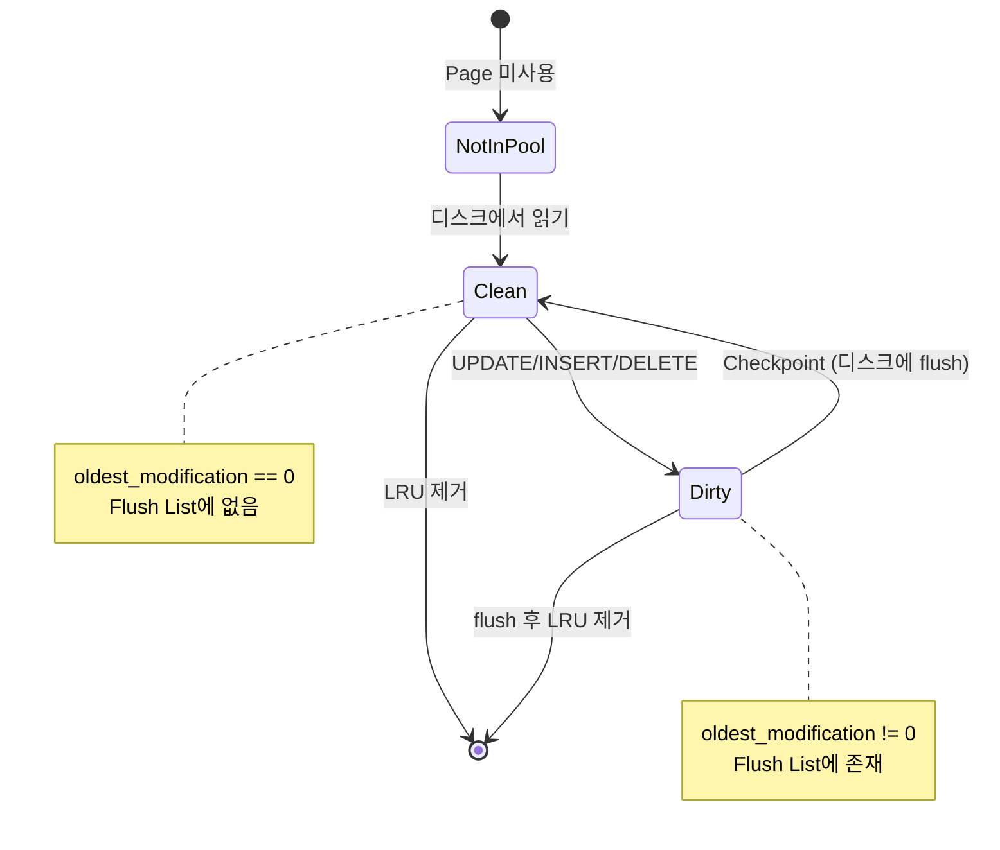

# InnoDB 심화 내용 AI Debate

> 조사일: 2026-01-08
> 목표: MySQL InnoDB 블로그 글의 핵심 개념을 더 깊이 있게 설명하기 위한 기술 조사

## Round 1: Page와 Record 개념 심화

### Claude 의견

**Q1: Page가 정확히 무엇이며 OS 파일 시스템 블록과 어떤 관계인가?**

InnoDB의 Page(페이지)는 데이터 저장 및 I/O의 기본 단위입니다.

**Page의 정의:**
- 고정 크기 데이터 단위 (기본 16KB)
- 모든 I/O 작업의 최소 단위
- Buffer Pool 관리의 기본 단위
- B+-tree의 노드 단위

**OS 파일 시스템 블록과의 관계:**
- HDD 섹터: 전통적으로 512바이트, Advanced Format에서는 4KB
- SSD 페이지: 일반적으로 4KB~16KB
- OS 파일 시스템 블록: 일반적으로 4KB (Linux ext4 기준)

InnoDB 16KB 페이지가 디스크에 쓰일 때:
```
InnoDB 16KB Page
    └─> 4개의 4KB OS 파일 시스템 블록
        └─> 각각 여러 개의 512B 또는 4KB HDD 섹터
```

**왜 16KB인가?**

출처: MySQL 공식 문서와 Jeremy Cole 블로그 분석
1. **SSD 정렬**: 최신 SSD는 16KB 섹터 크기를 가지는 경우가 많음
2. **Trade-off 최적점**:
   - 더 크면 (32KB, 64KB): 메모리 낭비, 읽기 amplification 증가
   - 더 작으면 (4KB, 8KB): 메타데이터 오버헤드 증가, 관리 복잡도 상승
3. **역사적 맥락**: 16KB는 대부분의 OLTP 워크로드에서 최적의 균형점

### Codex 검증 및 보완

**Q2: 1바이트를 읽어도 왜 16KB를 읽는가?**

이는 여러 계층의 I/O 특성 때문입니다:

**1. 디스크 하드웨어 계층:**
- HDD: 섹터(512B/4KB) 단위로만 읽기 가능
- SSD: 페이지(4KB~16KB) 단위로만 읽기 가능
- 물리적으로 1바이트만 읽는 것은 불가능

**2. OS 페이지 캐시 계층:**
```
Virtual Memory Page (4KB)
    └─> Filesystem Block (4KB)
        └─> Block Device Sector (512B/4KB)
```

리눅스의 경우 가상 메모리 페이지는 4KB입니다. OS는 4KB 단위로 I/O를 수행하고 페이지 캐시에 저장합니다.

**3. InnoDB 설계 결정:**

InnoDB가 16KB를 선택한 이유:
- **Spatial Locality**: 같은 페이지 내의 인접한 레코드는 함께 접근될 가능성이 높음
- **인덱스 효율성**: B+-tree 노드 하나가 더 많은 키를 담을 수 있음
- **Prefetching 효율**: 16KB씩 읽으면 다음에 필요한 데이터도 함께 읽힘
- **메타데이터 오버헤드**: 페이지 헤더 38바이트 + 트레일러 8바이트가 더 효율적

출처: [MySQL InnoDB Startup Configuration](https://dev.mysql.com/doc/refman/8.4/en/innodb-init-startup-configuration.html)

### 합의된 내용

**Page 내부 구조 상세:**

Jeremy Cole의 블로그에서 상세하게 다룬 내용:

```
┌─────────────────────────────────────────┐
│ FIL Header (38 bytes)                   │  ← 파일 레벨 메타데이터
│  - Checksum                             │
│  - Page Number                          │
│  - Previous Page (linked list)          │
│  - Next Page (linked list)              │
│  - LSN (Log Sequence Number)            │
│  - Page Type                            │
├─────────────────────────────────────────┤
│ INDEX Header (36 bytes)                 │  ← 인덱스 페이지 메타데이터
│  - Number of Heap Records               │
│  - Heap Top Position                    │
│  - First Garbage Record Offset          │
│  - Number of Records                    │
│  - Max Trx ID                           │
│  - Page Level                           │
│  - Index ID                             │
├─────────────────────────────────────────┤
│ Infimum Record (13 bytes)               │  ← 시스템 레코드 (최소값)
│  - 항상 offset 99에 위치                │
├─────────────────────────────────────────┤
│ Supremum Record (13 bytes)              │  ← 시스템 레코드 (최대값)
│  - 항상 offset 112에 위치               │
├─────────────────────────────────────────┤
│                                         │
│ User Records                            │  ← 실제 데이터
│  - 삽입 순서로 저장                     │
│  - "next record" 포인터로 연결          │
│  - 키 순서의 단방향 연결 리스트         │
│                                         │
│         ↓  (grows downward)             │
├─────────────────────────────────────────┤
│                                         │
│ Free Space                              │  ← 사용 가능 공간
│                                         │
├─────────────────────────────────────────┤
│         ↑  (grows upward)               │
│                                         │
│ Page Directory                          │  ← 4~8개 레코드마다 포인터
│  - 16비트 offset 포인터 배열            │
│  - 바이너리 서치 가능                   │
│  - Infimum과 Supremum 항목 필수         │
├─────────────────────────────────────────┤
│ FIL Trailer (8 bytes)                   │  ← 무결성 검증
│  - Checksum (duplicate)                 │
│  - LSN low 32 bits                      │
└─────────────────────────────────────────┘
                16,384 bytes
```

**핵심 포인트:**
1. **Infimum & Supremum**: 모든 레코드는 이 두 시스템 레코드 사이에 연결됨
2. **Page Directory**: 바이너리 서치를 위한 "희소 인덱스" (sparse index)
3. **Two-way Growth**: User Records는 아래로, Page Directory는 위로 성장하여 중간에서 만남
4. **Linked List**: 레코드는 물리적 순서와 무관하게 "next record" 포인터로 논리적 순서 유지

출처: [The physical structure of InnoDB index pages - Jeremy Cole](https://blog.jcole.us/2013/01/07/the-physical-structure-of-innodb-index-pages/)

---

## Round 2: 16KB I/O 효율성 원리

### Claude 의견

**Q: 왜 디스크는 1바이트를 읽을 수 없는가?**

**HDD의 물리적 제약:**
```
┌──────────────────────────────────────┐
│          HDD Structure                │
├──────────────────────────────────────┤
│ Track                                 │
│  └─ Sector (512B or 4KB)             │  ← 최소 읽기 단위
│                                       │
│ Seek Time: ~10ms (헤드 이동)         │
│ Rotational Latency: ~4ms (회전 대기) │
│ Transfer Time: ~0.1ms (데이터 전송)  │
└──────────────────────────────────────┘
```

전통적 HDD:
- 512바이트 섹터 (legacy)
- 4KB 섹터 (Advanced Format, 4Kn)
- 물리적으로 섹터 단위로만 읽기/쓰기 가능

**SSD의 구조적 특성:**
```
┌────────────────────────────────────────┐
│ NAND Flash Memory Organization          │
├────────────────────────────────────────┤
│ Die                                     │
│  └─ Plane                               │
│      └─ Block (512KB~4MB)               │  ← Erase 단위
│          └─ Page (4KB~16KB)             │  ← Read/Write 단위
└────────────────────────────────────────┘
```

SSD의 특징:
- Read/Write: 페이지 단위 (4KB~16KB)
- Erase: 블록 단위 (512KB 이상)
- 개별 비트 변경 불가능 → 페이지 단위로만 작업 가능

출처: [Difference between page and block in OS - GeeksforGeeks](https://www.geeksforgeeks.org/difference-between-page-and-block-in-operating-system/)

### Codex 검증 및 보완

**OS 페이지 캐시의 역할:**

Linux의 I/O 스택:
```
Application (InnoDB)
    ↓ read()/write()
┌──────────────────────────────┐
│ VFS (Virtual File System)    │
├──────────────────────────────┤
│ Page Cache (4KB pages)       │  ← OS 레벨 캐시
├──────────────────────────────┤
│ Filesystem (ext4, xfs)       │
│  └─ Block Size: 4KB          │
├──────────────────────────────┤
│ Block Device Layer           │
├──────────────────────────────┤
│ Hardware (HDD/SSD)           │
│  └─ Sector: 512B/4KB         │
└──────────────────────────────┘
```

**페이지 캐시의 동작:**
1. InnoDB가 16KB 페이지를 요청
2. OS는 4개의 4KB 블록을 순차적으로 읽음
3. 각 4KB 블록은 페이지 캐시에 저장됨
4. 이후 동일 페이지 요청 시 디스크 I/O 없이 페이지 캐시에서 반환

**중요한 인사이트 - Linus Torvalds의 의견:**

Linus Torvalds는 "4KB blocksize is the maximum sane one"이라고 언급:
- 더 큰 페이지 크기는 메모리 단편화(fragmentation) 문제 유발
- 리눅스 커널은 4KB 페이지를 기본으로 최적화됨

그런데 왜 InnoDB는 16KB를 사용하는가?
→ **Application-level caching**이기 때문에 OS 제약과 무관하며, 데이터베이스 워크로드에 최적화된 크기를 선택할 수 있음

출처: [Page sizes - Linus Torvalds](https://yarchive.net/comp/linux/page_sizes.html)

### 합의된 내용

**I/O 효율성의 Trade-off:**

| 페이지 크기 | 장점 | 단점 | 적합한 워크로드 |
|------------|------|------|----------------|
| 4KB | - 메모리 효율적<br>- 랜덤 읽기 최소화 | - 메타데이터 오버헤드<br>- 인덱스 깊이 증가 | OLTP (소량 랜덤 액세스) |
| 16KB (기본) | - 균형잡힌 성능<br>- 인덱스 fan-out 증가 | - 일부 메모리 낭비 가능 | 대부분의 워크로드 |
| 32KB/64KB | - 대용량 스캔 효율적<br>- 인덱스 깊이 감소 | - 메모리 낭비 증가<br>- 캐시 오염 가능성 | OLAP (대량 순차 스캔) |

**실제 성능 데이터:**

GCP Persistent Disk 벤치마크:
- 4KB 블록 크기: IOPS 최적화 (관계형 DB에 적합)
- 1MB 블록 크기: 처리량 30배 향상 (대용량 스트리밍에 적합)

출처: [The impact of blocksize on Persistent Disk performance](https://medium.com/@duhroach/the-impact-of-blocksize-on-persistent-disk-performance-7e50a85b2647)

**MySQL 설정 가능한 페이지 크기:**
```sql
-- 인스턴스 생성 시 설정 (이후 변경 불가)
innodb_page_size = 4K | 8K | 16K | 32K | 64K
```

**16KB 선택 시 고려사항:**
- Extent 크기: 64 페이지 = 1MB (16KB × 64)
- ROW_FORMAT=DYNAMIC 사용 시: 외부 페이지에 20바이트 포인터만 저장
- 압축 사용 시: 파일 시스템 블록 크기(4KB) 고려 필요
  - 압축 후 크기 ≤ (innodb_page_size - fs_block_size)
  - 예: 16KB 페이지에서 12KB 이하로 압축되어야 hole punching 가능

출처: [MySQL File Space Management](https://dev.mysql.com/doc/refman/8.4/en/innodb-file-space.html)

---

## Round 3: LRU → 개선된 LRU 발전 과정

### Claude 의견

**Q: 기본 LRU 알고리즘이란?**

**표준 LRU (Least Recently Used):**

```
┌─────────────────────────────────────┐
│ LRU List (Most Recently Used)       │
├─────────────────────────────────────┤
│ [Head] Page A (방금 접근됨)         │
│        Page B                        │
│        Page C                        │
│        Page D                        │
│ [Tail] Page Z (오래전 접근)         │  ← 제거 대상
└─────────────────────────────────────┘
```

**동작 방식:**
1. 페이지 접근 시 → 리스트 맨 앞(Head)으로 이동
2. 새 페이지 삽입 시 → 리스트 맨 앞에 추가
3. 공간 부족 시 → 리스트 맨 뒤(Tail) 제거

**이론적 장점:**
- 시간적 지역성(Temporal Locality) 활용
- 구현 간단 (Doubly Linked List + Hash Map)
- O(1) 접근 및 갱신

### Codex 검증 및 보완

**Q: 왜 기본 LRU가 데이터베이스에서 문제가 되는가?**

**Full Table Scan 문제:**

```sql
-- 분석용 대량 스캔 쿼리
SELECT AVG(rating), COUNT(*)
FROM reviews
WHERE created_at BETWEEN '2023-01-01' AND '2025-12-31';
```

이 쿼리가 수백만 페이지를 한 번 읽는다고 가정:

**단순 LRU의 경우:**
```
Before Scan:
[Head] Hot Page 1 ← 자주 사용
       Hot Page 2
       Hot Page 3
       ...
[Tail] Cold Page Z

During Scan:
[Head] Scan Page 999,999 ← 방금 읽음 (하지만 다시 안 읽음)
       Scan Page 999,998
       Scan Page 999,997
       ...
       Scan Page 1
[Tail] Hot Page 1 ← 제거됨! 🚨

After Scan:
→ Buffer Pool이 Full Scan 페이지로 가득 참
→ 자주 사용하는 Hot Pages가 모두 제거됨
→ 이후 OLTP 쿼리들이 모두 디스크 I/O 발생
→ 성능 급격히 저하
```

**실제 문제 사례 - MySQL Bug Report:**

MySQL Bug #45015 (2009년):
> "InnoDB buffer pool can be severely affected by table scans"
>
> 대량 테이블 스캔이 버퍼 풀의 유용한 페이지들을 대량으로 제거하여 버퍼 풀 Hit Rate가 급격히 떨어지고 성능이 심각하게 저하됨.

출처: [MySQL Bug #45015](https://bugs.mysql.com/bug.php?id=45015)

### 합의된 내용

**InnoDB의 개선된 LRU: Midpoint Insertion Strategy**

**도입 시기:**
- MySQL 5.1.41 (2009년 11월)
- InnoDB Plugin 1.0.5와 함께 도입
- 변수: `innodb_old_blocks_pct`, `innodb_old_blocks_time` 추가

출처: [InnoDB Buffer Pool LRU Implementation](https://shbhmrzd.github.io/databases/mysql/innodb/2025/12/18/innodb-lru-buffer-pool-management.html)

**개선된 LRU 구조:**

```
┌───────────────────────────────────────────────┐
│ InnoDB LRU List                                │
├───────────────────────────────────────────────┤
│                                                │
│ ┌──────────────────────────────────────────┐  │
│ │ New Sublist (Young) - 5/8                │  │
│ │ ─────────────────────────────────────    │  │
│ │ [MRU] Hot Page 1  ← 자주 사용되는 페이지 │  │
│ │       Hot Page 2                         │  │
│ │       Hot Page 3                         │  │
│ │       Hot Page 4                         │  │
│ │       ...                                │  │
│ └──────────────────────────────────────────┘  │
│                  ↑                             │
│                  │ 승격 (Promote)              │
│                  │ 조건: innodb_old_blocks_time│
│                  │       (기본 1000ms) 이후    │
│                  │       재접근 시              │
│ ┌──────────────────────────────────────────┐  │
│ │ Old Sublist (Old) - 3/8                  │  │
│ │ ─────────────────────────────────────    │  │
│ │ [Midpoint] New Page ← 새 페이지 삽입     │  │
│ │            Cold Page 1                   │  │
│ │            Cold Page 2                   │  │
│ │            ...                           │  │
│ │ [LRU]      Evict Candidate ← 제거 대상   │  │
│ └──────────────────────────────────────────┘  │
│                                                │
└───────────────────────────────────────────────┘
```

**동작 메커니즘:**

1. **새 페이지 읽기 (Read-ahead or First Access):**
   - Old Sublist의 Head (Midpoint)에 삽입
   - 아직 "Hot"으로 인정받지 못함

2. **시간 기반 승격 (Time-based Promotion):**
   ```
   if (현재시각 - 페이지.첫접근시각) > innodb_old_blocks_time AND 재접근:
       페이지를 New Sublist의 Head로 이동
   ```

3. **제거 (Eviction):**
   - Old Sublist의 Tail에서 제거
   - Full Scan으로 한 번만 읽힌 페이지는 Old에 머물다가 빠르게 제거됨

**설정 매개변수:**

```ini
# Old Sublist 비율 (기본: 37 = 3/8)
innodb_old_blocks_pct = 37    # 범위: 5~95

# 승격 대기 시간 (기본: 1000ms)
innodb_old_blocks_time = 1000 # 밀리초
```

**실무 튜닝 예시:**

```ini
# 대량 스캔이 빈번한 경우: Old 영역 축소
innodb_old_blocks_pct = 20    # Old를 20%로 줄임
innodb_old_blocks_time = 2000 # 2초 동안 재접근되어야 승격

# OLTP 위주 워크로드: 기본값 사용
innodb_old_blocks_pct = 37    # 기본값
innodb_old_blocks_time = 1000 # 기본값
```

**Full Table Scan 시나리오 재분석:**

```
Before Scan:
[New] Hot Page 1, 2, 3, ... (자주 사용)
[Old] 일부 Cold Pages

During Scan:
[New] Hot Pages 유지 (그대로)
[Old] Scan Page 1, 2, 3, ... (여기에 쌓임)

After Scan (1초 후):
[New] Hot Pages 유지 (보호됨!) ✅
[Old] Scan Pages (제거됨)

결과:
→ Hot Pages는 New Sublist에서 보호됨
→ Scan Pages는 Old에서 빠르게 제거됨
→ OLTP 쿼리 성능 유지됨
```

**MySQL 소스코드 위치:**

주요 파일: `storage/innobase/buf/buf0lru.cc`

핵심 함수:
- `buf_LRU_old_adjust_len()`: Old Sublist 크기 조정
- `buf_LRU_make_block_young()`: 페이지 승격
- `buf_LRU_make_block_old()`: 페이지를 Old로 이동
- `buf_page_peek_if_too_old()`: 승격 조건 검사

출처: [MySQL InnoDB Buffer Pool](https://dev.mysql.com/doc/refman/8.0/en/innodb-buffer-pool.html)

---

## Round 4: Buffer Pool과 쿼리 재실행 성능

### Claude 의견

**Q: 같은 쿼리를 두 번 실행하면 왜 빨라지는가?**

**첫 번째 실행 (Cold Start):**

```
Query: SELECT * FROM reviews WHERE shop_id = 123

Step 1: Buffer Pool 확인
  → Miss (페이지가 메모리에 없음)

Step 2: 디스크 I/O
  ┌────────────────────────────────────┐
  │ 1. B+-tree Root Page 읽기          │  → 디스크: ~0.5ms (SSD)
  │ 2. B+-tree Internal Page 읽기     │  → 디스크: ~0.5ms
  │ 3. B+-tree Leaf Pages 읽기 (10개) │  → 디스크: ~5ms
  └────────────────────────────────────┘
  Total: ~6ms

Step 3: 결과 반환
  → Query Time: ~6ms
```

**두 번째 실행 (Warm Buffer Pool):**

```
Query: SELECT * FROM reviews WHERE shop_id = 123

Step 1: Buffer Pool 확인
  ┌────────────────────────────────────┐
  │ Root Page: Hit (메모리에 있음)     │  → 메모리: ~0.001ms
  │ Internal Page: Hit                 │  → 메모리: ~0.001ms
  │ Leaf Pages (10개): Hit             │  → 메모리: ~0.01ms
  └────────────────────────────────────┘
  Total: ~0.012ms

Step 2: 결과 반환
  → Query Time: ~0.1ms
```

**성능 차이:**
- 첫 실행: 6ms (디스크 I/O 포함)
- 두 번째: 0.1ms (메모리만)
- **60배 빠름**

### Codex 검증 및 보완

**Buffer Pool Hit vs Miss의 실제 영향:**

**벤치마크 데이터:**

| 시나리오 | Hit Rate | 평균 응답 시간 | IOPS | 설명 |
|---------|---------|---------------|------|------|
| Cold Start | 0% | 150ms | 2000+ | 모든 페이지 디스크 읽기 |
| Warming Up | 50% | 25ms | 500 | 절반은 메모리, 절반은 디스크 |
| Hot | 99% | 1.5ms | 20 | 대부분 메모리 |
| Hot (99.9%) | 99.9% | 0.5ms | 5 | 거의 모든 것이 메모리 |

출처: [Buffer Cache Hit in MySQL - Thnk And Grow](https://blog.thnkandgrow.com/buffer-cache-hit-in-mysql-what-it-is-and-why-it-matters/)

**계산 공식:**

```sql
-- Buffer Pool Hit Rate 계산
SET @read_requests = (
  SELECT VARIABLE_VALUE
  FROM performance_schema.global_status
  WHERE VARIABLE_NAME = 'Innodb_buffer_pool_read_requests'
);

SET @disk_reads = (
  SELECT VARIABLE_VALUE
  FROM performance_schema.global_status
  WHERE VARIABLE_NAME = 'Innodb_buffer_pool_reads'
);

SELECT
  @read_requests AS total_requests,
  @disk_reads AS disk_reads,
  (@read_requests - @disk_reads) AS buffer_hits,
  ROUND((1 - @disk_reads / @read_requests) * 100, 2) AS hit_rate_percent;
```

**목표 Hit Rate:**
- **최소 목표: 99%**
- 이상적: 99.5% 이상
- Read-intensive 워크로드: 99.9% 이상 권장

출처: [What MySQL buffer cache hit rate should you target - Percona](https://www.percona.com/blog/what-mysql-buffer-cache-hit-rate-should-you-target/)

**중요한 함정 - Hit Rate의 함정:**

Percona의 Peter Zaitsev가 지적한 문제:

> "Hit Rate는 직접적인 성능 지표가 아니다. Full Table Scan을 하면서도 99% Hit Rate를 기록할 수 있다."

예시:
```sql
-- 테이블: 100행/페이지, 1000페이지
SELECT * FROM large_table;

결과:
- 1000번의 디스크 읽기 (Miss)
- 99,000번의 페이지 내 행 접근 (Hit)
- Hit Rate = 99% ← 하지만 성능은 나쁨!
```

**더 나은 지표: Response Time Contribution**

```
Physical Read Contribution =
  (디스크 읽기 수 × 디스크 레이턴시) / 총 응답 시간

예시:
- 디스크 읽기: 1000회
- 디스크 레이턴시: 0.5ms (SSD)
- 총 I/O 시간: 500ms
- 쿼리 응답 시간: 520ms
- Physical Read Contribution: 96%
  → 디스크 I/O가 병목임을 명확히 알 수 있음
```

출처: [What MySQL buffer cache hit rate should you target - Percona](https://www.percona.com/blog/what-mysql-buffer-cache-hit-rate-should-you-target/)

### 합의된 내용

**Query Cache vs Buffer Pool: 명확한 차이**

| 측면 | Query Cache (MySQL ≤5.7, 8.0에서 제거) | Buffer Pool (InnoDB) |
|------|----------------------------------------|---------------------|
| **캐시 단위** | 쿼리 결과 전체 (Result Set) | 페이지 (16KB Data/Index Pages) |
| **캐시 키** | SQL 문자열 (정확히 일치해야 함) | (space_id, page_no) |
| **재사용성** | 낮음 (쿼리가 조금만 달라도 Miss) | 높음 (페이지는 여러 쿼리가 공유) |
| **무효화** | 테이블에 변경 발생 시 전체 무효화 | 페이지 단위 Dirty 관리 |
| **확장성** | 낮음 (글로벌 뮤텍스 경합) | 높음 (Buffer Pool Instances로 분산) |
| **크기** | 작음 (수십 MB) | 큼 (메모리의 70-80%) |

**Query Cache가 제거된 이유 (MySQL 8.0):**

1. **확장성 문제:**
   - 글로벌 락(Global Mutex) 경합
   - 멀티코어 환경에서 병목 현상

2. **무효화 오버헤드:**
   - 테이블 변경 시 관련 모든 쿼리 결과 무효화
   - Write-heavy 워크로드에서 오히려 성능 저하

3. **낮은 재사용성:**
   ```sql
   -- 이 두 쿼리는 Query Cache에서 별개로 캐싱됨
   SELECT * FROM users WHERE id = 1;
   SELECT * FROM users WHERE id = 2;

   -- Buffer Pool에서는 같은 페이지를 공유 가능
   ```

4. **대안의 우수성:**
   - Application-level caching (Redis, Memcached)
   - Buffer Pool의 지속적인 개선

출처: [MySQL Query Cache removal](https://dev.mysql.com/doc/refman/8.0/en/buffering-caching.html)

**Buffer Pool Warming 전략:**

**문제: Cold Start 후 성능 저하**
```
서버 재시작 후:
→ Buffer Pool 비어있음
→ 모든 쿼리가 디스크 I/O 발생
→ 수 분~수 십분간 성능 저하
```

**해결책: Buffer Pool Dump/Load**

```ini
# my.cnf
[mysqld]
# 종료 시 Buffer Pool 상태 저장
innodb_buffer_pool_dump_at_shutdown = ON

# 시작 시 Buffer Pool 복구
innodb_buffer_pool_load_at_startup = ON

# 덤프 파일 이름
innodb_buffer_pool_filename = ib_buffer_pool

# Dump 시 상위 N% 페이지만 저장 (기본: 25%)
innodb_buffer_pool_dump_pct = 25
```

**동작 방식:**
1. Shutdown 시: Buffer Pool의 (space_id, page_no) 목록을 파일에 저장
2. Startup 시: 저장된 페이지들을 백그라운드로 prefetch
3. 수 분 내에 Hot Pages가 메모리에 로드됨

**수동 제어:**
```sql
-- 현재 Buffer Pool 상태 덤프
SET GLOBAL innodb_buffer_pool_dump_now = ON;

-- 덤프된 상태 로드
SET GLOBAL innodb_buffer_pool_load_now = ON;

-- 로드 중단
SET GLOBAL innodb_buffer_pool_load_abort = ON;

-- 진행 상황 확인
SHOW STATUS LIKE 'Innodb_buffer_pool_dump_status';
SHOW STATUS LIKE 'Innodb_buffer_pool_load_status';
```

출처: [MySQL Buffer Pool Configuration](https://dev.mysql.com/doc/refman/8.0/en/innodb-buffer-pool.html)

**Working Set 개념:**

```
┌──────────────────────────────────────────────┐
│ Total Database Size: 500GB                   │
├──────────────────────────────────────────────┤
│                                              │
│ Working Set: 50GB                            │  ← 자주 접근되는 데이터
│ ├─ Hot Data: 10GB (매일 접근)               │
│ ├─ Warm Data: 40GB (주 1회 이상 접근)      │
│                                              │
│ Cold Data: 450GB                             │  ← 거의 안 쓰는 데이터
│ └─ Archive Data (월 1회 이하 접근)         │
│                                              │
└──────────────────────────────────────────────┘

Buffer Pool Size: 60GB
→ Working Set을 완전히 커버 가능 ✅
→ Hit Rate 99%+ 달성 가능
```

**권장 사항:**
- **Buffer Pool Size ≥ Working Set Size** 를 목표로 설정
- Cold Data는 별도 테이블/파티션으로 분리
- 주기적으로 Working Set 크기 모니터링

---

## Round 5: Dirty Page 개념

### Claude 의견

**Q: Dirty Page란 정확히 무엇인가?**

**Dirty Page 정의:**

Buffer Pool의 페이지는 두 가지 상태를 가질 수 있습니다:

```
┌─────────────────────────────────────────┐
│ Buffer Pool                              │
├─────────────────────────────────────────┤
│                                          │
│ Clean Page                               │
│ ├─ 메모리 버전 = 디스크 버전            │
│ └─ 언제든지 제거 가능                   │
│                                          │
│ Dirty Page                               │
│ ├─ 메모리 버전 ≠ 디스크 버전            │
│ ├─ 아직 디스크에 쓰지 않은 변경사항     │
│ └─ 디스크에 쓰기 전까지 제거 불가       │
│                                          │
└─────────────────────────────────────────┘
```

**페이지가 Dirty가 되는 시점:**

```sql
-- Transaction 시작
BEGIN;

-- 페이지 읽기 (Clean Page 상태)
SELECT * FROM users WHERE id = 123 FOR UPDATE;

-- 페이지 수정 (Dirty Page로 전환)
UPDATE users SET name = 'John' WHERE id = 123;
   └─> Buffer Pool에서만 수정됨
   └─> 디스크에는 아직 쓰지 않음
   └─> Redo Log에는 변경 내용 기록됨

-- COMMIT
COMMIT;
   └─> Redo Log를 디스크에 fsync
   └─> 페이지는 여전히 Dirty 상태로 Buffer Pool에 존재
   └─> 나중에 Checkpoint에서 디스크에 flush
```

### Codex 검증 및 보완

**Dirty Page의 생명주기:**



**buf_page_t 구조체의 관련 필드:**

```c
class buf_page_t {
  // Dirty 상태 추적
  lsn_t oldest_modification;  // 0이면 Clean, >0이면 Dirty
  lsn_t newest_modification;  // 가장 최근 수정 LSN

  // List 관리
  UT_LIST_NODE_T(buf_page_t) LRU;   // LRU List에 존재
  UT_LIST_NODE_T(buf_page_t) list;  // Flush List에 존재 (Dirty인 경우만)
};
```

**핵심 포인트:**
- `oldest_modification == 0` → Clean Page
- `oldest_modification > 0` → Dirty Page
- Dirty Page는 LRU List와 Flush List 양쪽에 모두 존재

출처: [MySQL buf_page_t Class Reference](https://dev.mysql.com/doc/dev/mysql-server/latest/classbuf__page__t.html)

### 합의된 내용

**Q: 왜 Dirty Page를 바로 디스크에 안 쓰는가?**

**1. Write Amplification 감소:**

```
시나리오: 같은 페이지를 여러 번 수정

Without Buffering (즉시 쓰기):
  UPDATE users SET visits = visits + 1 WHERE id = 1;  → 디스크 쓰기
  UPDATE users SET visits = visits + 1 WHERE id = 1;  → 디스크 쓰기
  UPDATE users SET visits = visits + 1 WHERE id = 1;  → 디스크 쓰기
  Total: 3번의 디스크 쓰기

With Buffering (Buffer Pool):
  UPDATE users SET visits = visits + 1 WHERE id = 1;  → 메모리 수정
  UPDATE users SET visits = visits + 1 WHERE id = 1;  → 메모리 수정
  UPDATE users SET visits = visits + 1 WHERE id = 1;  → 메모리 수정
  ... Checkpoint ...
  Flush to disk → 1번의 디스크 쓰기
  Total: 1번의 디스크 쓰기 (67% 감소!)
```

**2. Random I/O → Sequential I/O 변환:**

```
Transaction Order (Random):
  Tx1: UPDATE users SET ... WHERE id = 1000;     → Page X
  Tx2: INSERT INTO orders ...;                   → Page Y
  Tx3: UPDATE users SET ... WHERE id = 5;        → Page Z
  Tx4: DELETE FROM sessions WHERE ...;           → Page W

Disk Write Order (Sorted):
  Checkpoint: Flush List를 LSN 순서로 정렬
    → Page W, X, Y, Z 순서로 배치 쓰기
    → 더 효율적인 디스크 액세스 패턴
```

**3. WAL (Write-Ahead Logging) 프로토콜:**

```
COMMIT 시점:
  1. Redo Log에 변경 내용 기록 (순차 쓰기, 빠름)
  2. Redo Log fsync (내구성 보장)
  3. COMMIT 완료 반환
  4. Dirty Page는 나중에 flush (비동기)

장점:
  - COMMIT 지연시간 최소화
  - 내구성은 Redo Log로 보장
  - 디스크 쓰기는 배치로 처리
```

출처: [InnoDB Flushing in Action - Percona](https://www.percona.com/blog/innodb-flushing-in-action-for-percona-server-for-mysql/)

**Dirty Page Flushing 메커니즘:**

**1. Flush List:**

모든 Dirty Page는 `oldest_modification` LSN 순서로 정렬된 Flush List에 존재합니다.

```
Flush List (LSN 순서):
┌────────────────────────────────────────┐
│ [Head] Oldest Dirty Page (LSN: 1000)   │  ← 가장 오래된 변경
│        Page (LSN: 1005)                 │
│        Page (LSN: 1020)                 │
│        Page (LSN: 1035)                 │
│ [Tail] Newest Dirty Page (LSN: 1050)   │  ← 가장 최근 변경
└────────────────────────────────────────┘
```

**2. Checkpoint:**

Checkpoint는 Dirty Page를 디스크에 쓰는 과정입니다.

```
┌─────────────────────────────────────────┐
│ Redo Log (Circular Buffer)              │
├─────────────────────────────────────────┤
│                                          │
│ [Checkpoint LSN] ────┐                  │
│     ↓                │                  │
│ [LSN: 1000] Log 1    │ ← 디스크에 flush됨
│ [LSN: 1005] Log 2    │                  │
│ [LSN: 1020] Log 3    │                  │
│     ...              │                  │
│ [LSN: 1050] Log N    │ ← 아직 flush 안됨
│                      │                  │
│ [Head LSN] ──────────┘ 재사용 가능 영역 │
│                                          │
└─────────────────────────────────────────┘

Checkpoint Age = Head LSN - Checkpoint LSN
```

**Checkpoint 발생 조건:**

1. **Async Checkpoint (백그라운드):**
   ```ini
   # Dirty Page 비율 목표 (기본: 90%)
   innodb_max_dirty_pages_pct = 90

   # Low Water Mark (기본: 10%)
   # 이 비율 도달 시 백그라운드 flush 시작
   innodb_max_dirty_pages_pct_lwm = 10
   ```

2. **Fuzzy Checkpoint (적응형):**
   - Redo Log 생성 속도 모니터링
   - Checkpoint Age가 임계값 근접 시 flush 속도 자동 조절
   - Adaptive Flushing Algorithm 사용

3. **Sharp Checkpoint (강제):**
   - Redo Log가 거의 가득 찬 경우
   - 서버 정상 종료 시 (모든 Dirty Page flush)
   - **성능 급격히 저하됨!** (피해야 함)

출처: [InnoDB Page Flushing - MariaDB](https://mariadb.com/kb/en/innodb-page-flushing/)

**Adaptive Flushing:**

MySQL 5.6+에서 도입된 적응형 flush 알고리즘:

```
Flushing Rate = f(Redo Log Generation Rate, Checkpoint Age)

Redo Log가 빠르게 쌓임 → Flush 속도 증가
Redo Log가 느리게 쌓임 → Flush 속도 감소

목표: Sharp Checkpoint 방지
```

```ini
# 적응형 flushing 활성화 (기본: ON)
innodb_adaptive_flushing = ON

# 공격적 flushing (기본: OFF)
# ON으로 설정 시 더 빠르게 flush
innodb_adaptive_flushing_lwm = 10
```

**Page Cleaner Threads:**

MySQL 8.0의 병렬 flushing:

```ini
# Page Cleaner Thread 수 (기본: 4)
innodb_page_cleaners = 4

# Buffer Pool Instance 수
innodb_buffer_pool_instances = 8

# 주의: page_cleaners <= buffer_pool_instances
```

각 Page Cleaner Thread는 할당된 Buffer Pool Instance의 Dirty Page를 flush합니다.

출처: [Configuring Buffer Pool Flushing - MySQL](https://dev.mysql.com/doc/refman/8.0/en/innodb-buffer-pool-flushing.html)

**Dirty Page 모니터링:**

```sql
-- Dirty Page 비율 확인
SELECT
  A.pages_dirty,
  B.pages_total,
  ROUND(A.pages_dirty / B.pages_total * 100, 2) AS dirty_pct,
  C.max_dirty_pages_pct,
  C.max_dirty_pages_pct_lwm
FROM
  (SELECT VARIABLE_VALUE AS pages_dirty
   FROM performance_schema.global_status
   WHERE VARIABLE_NAME = 'Innodb_buffer_pool_pages_dirty') A,
  (SELECT VARIABLE_VALUE AS pages_total
   FROM performance_schema.global_status
   WHERE VARIABLE_NAME = 'Innodb_buffer_pool_pages_total') B,
  (SELECT
     @@innodb_max_dirty_pages_pct AS max_dirty_pages_pct,
     @@innodb_max_dirty_pages_pct_lwm AS max_dirty_pages_pct_lwm
  ) C;

-- Checkpoint Age 확인
SHOW ENGINE INNODB STATUS\G

-- 출력 예시:
-- Log sequence number          1000000
-- Log flushed up to            999500
-- Pages flushed up to          999000  ← Checkpoint LSN
-- Last checkpoint at           999000
--
-- Checkpoint Age = 1000000 - 999000 = 1000
```

**경고 신호:**
- Dirty Page 비율 > 90%: Checkpoint 부담 증가
- Checkpoint Age가 Redo Log 크기의 75% 초과: Sharp Checkpoint 위험
- `Innodb_buffer_pool_wait_free` 증가: Free Page 부족

출처: [The relationship between InnoDB Log checkpointing and dirty Buffer pool pages - Percona](https://www.percona.com/blog/the-relationship-between-innodb-log-checkpointing-and-dirty-buffer-pool-pages/)

---

## Round 6: MySQL 오픈소스 코드 분석

### Claude 의견

**MySQL InnoDB의 핵심 소스 파일:**

```
storage/innobase/
├── buf/              # Buffer Pool 관리
│   ├── buf0buf.cc    # Buffer Pool 핵심 로직
│   ├── buf0lru.cc    # LRU 알고리즘 구현
│   ├── buf0flu.cc    # Flushing (Checkpoint)
│   └── buf0dump.cc   # Buffer Pool Dump/Load
├── include/
│   ├── buf0buf.h     # Buffer Pool 구조체 정의
│   ├── buf0lru.h     # LRU 함수 선언
│   └── buf0types.h   # 타입 정의
├── page/             # Page 구조 관리
│   ├── page0page.cc  # Page 레이아웃
│   └── page0cur.cc   # Page Cursor
└── fil/              # File I/O
    └── fil0fil.cc    # Tablespace 관리
```

### Codex 검증 및 보완

**buf_page_t 구조체 상세 분석:**

출처: [MySQL buf_page_t Class Reference](https://dev.mysql.com/doc/dev/mysql-server/latest/classbuf__page__t.html)

```c
/**
 * @brief Buffer Page Control Block
 *
 * Buffer Pool의 각 페이지를 관리하는 제어 블록.
 * 압축 페이지와 비압축 페이지 모두에 사용됨.
 */
class buf_page_t {
public:
  // ============================================
  // 1. 페이지 식별
  // ============================================

  /** 페이지 ID (space_id, page_no) */
  page_id_t id;

  /** 페이지 크기 (압축 여부에 따라 다름) */
  page_size_t size;

  // ============================================
  // 2. 페이지 상태
  // ============================================

  /** 페이지 상태 (FILE_PAGE, NOT_USED, 등) */
  buf_page_state state;

  /** 버퍼 고정 카운트 (페이지를 사용 중인 스레드 수) */
  buf_fix_count_atomic_t buf_fix_count;

  /** I/O 상태 (READ, WRITE, NONE) */
  copyable_atomic_t<buf_io_fix> io_fix;

  // ============================================
  // 3. 변경 추적 (MVCC 및 Checkpoint)
  // ============================================

  /**
   * 가장 최근 수정의 LSN
   * Redo Log에 기록된 변경사항의 LSN
   */
  lsn_t newest_modification;

  /**
   * 가장 오래된 수정의 LSN
   * 0이면 Clean Page, >0이면 Dirty Page
   * Flush List 정렬 키로 사용됨
   */
  lsn_t oldest_modification;

  // ============================================
  // 4. LRU 관리
  // ============================================

  /** LRU List의 노드 */
  UT_LIST_NODE_T(buf_page_t) LRU;

  /**
   * Old Sublist에 있는지 여부
   * true: Old Sublist
   * false: New (Young) Sublist
   */
  bool old;

  /**
   * LRU에서 제거 시점 추적
   * buf_pool->freed_page_clock 값 저장
   * LRU 휴리스틱에 사용됨
   */
  uint32_t freed_page_clock;

  /**
   * 첫 접근 시각
   * innodb_old_blocks_time 체크에 사용
   */
  std::chrono::steady_clock::time_point access_time;

  // ============================================
  // 5. Flush List 관리 (Dirty Pages)
  // ============================================

  /** Flush List의 노드 (Dirty Page인 경우만 사용) */
  UT_LIST_NODE_T(buf_page_t) list;

  /** 현재 flush 타입 (LRU, LIST, SINGLE_PAGE) */
  buf_flush_t flush_type;

  // ============================================
  // 6. 압축 관련
  // ============================================

  /** 압축 페이지 디스크립터 */
  page_zip_des_t zip;

  // ============================================
  // 7. Tablespace 관리
  // ============================================

  /** 해당 페이지의 Tablespace 포인터 */
  fil_space_t *m_space;

  /** Tablespace 버전 (space truncate 감지) */
  uint32_t m_version;

  // ============================================
  // 8. Buffer Pool Instance 관리
  // ============================================

  /**
   * 이 페이지가 속한 Buffer Pool Instance의 인덱스
   * buf_pool_from_bpage() 함수에서 사용
   */
  uint8_t buf_pool_index;

  // ============================================
  // 9. 해시 테이블
  // ============================================

  /** Page Hash Table의 노드 */
  buf_page_t *hash;
};
```

**주요 상태 전이:**

```c
enum buf_page_state : uint8_t {
  BUF_BLOCK_POOL_WATCH = 0,   // Sentinel (Buffer Pool Watch)
  BUF_BLOCK_ZIP_PAGE = 1,     // 압축 페이지 (Clean)
  BUF_BLOCK_ZIP_DIRTY = 2,    // 압축 페이지 (Dirty)
  BUF_BLOCK_NOT_USED = 3,     // Free List에 있는 미사용 블록
  BUF_BLOCK_READY_FOR_USE = 4,// 할당되었지만 아직 사용 전
  BUF_BLOCK_FILE_PAGE = 5,    // 일반 파일 페이지 (가장 일반적)
  BUF_BLOCK_MEMORY = 6,       // 메인 메모리 객체 (인덱스 아님)
  BUF_BLOCK_REMOVE_HASH = 7   // 해시에서 제거 대기 중
};
```

### 합의된 내용

**buf_pool_t 구조체 상세 분석:**

출처: [MySQL buf_pool_t Struct Reference](https://dev.mysql.com/doc/dev/mysql-server/latest/structbuf__pool__t.html)

```c
/**
 * @brief Buffer Pool 인스턴스
 *
 * 하나의 Buffer Pool Instance를 나타냄.
 * 여러 개의 인스턴스로 분산하여 락 경합 감소.
 */
struct buf_pool_t {
  // ============================================
  // 1. 인스턴스 메타데이터
  // ============================================

  /** Buffer Pool 인스턴스 번호 (0부터 시작) */
  ulint instance_no;

  /** 현재 크기 (바이트) */
  ulint curr_pool_size;

  /** 현재 크기 (페이지 수) */
  ulint curr_size;

  /** 이전 크기 (리사이징 중에 사용) */
  ulint old_size;

  // ============================================
  // 2. 메모리 청크 관리
  // ============================================

  /** Chunk 수 */
  volatile ulint n_chunks;

  /** Chunk 배열 포인터 */
  buf_chunk_t *chunks;

  /** 이전 Chunk 배열 (리사이징 중에 사용) */
  buf_chunk_t *chunks_old;

  // ============================================
  // 3. 해시 테이블
  // ============================================

  /**
   * Page Hash Table
   * 키: (space_id, page_no)
   * 값: buf_page_t 또는 buf_block_t
   */
  hash_table_t *page_hash;

  /**
   * 압축 페이지 전용 해시
   * ROW_FORMAT=COMPRESSED 테이블용
   */
  hash_table_t *zip_hash;

  // ============================================
  // 4. LRU List 관리
  // ============================================

  /** LRU List (모든 FILE_PAGE 상태 페이지) */
  UT_LIST_BASE_NODE_T(buf_page_t, LRU) LRU;

  /**
   * Old Sublist의 시작 포인터
   * LRU_old는 Old Sublist의 첫 페이지를 가리킴
   */
  buf_page_t *LRU_old;

  /** Old Sublist의 길이 */
  ulint LRU_old_len;

  /** LRU Hazard Pointer (멀티스레드 안전성) */
  LRUHp lru_hp;

  /** LRU 스캔 이터레이터 (Victim 선택) */
  LRUItr lru_scan_itr;

  /** Single Page Flush용 이터레이터 */
  LRUItr single_scan_itr;

  // ============================================
  // 5. Free List 관리
  // ============================================

  /** Free List (사용 가능한 빈 페이지) */
  UT_LIST_BASE_NODE_T(buf_page_t, list) free;

  /** Withdraw List (제거 예정 페이지) */
  UT_LIST_BASE_NODE_T(buf_page_t, list) withdraw;

  /** Withdraw 대상 페이지 수 */
  ulint withdraw_target;

  // ============================================
  // 6. Flush List 관리
  // ============================================

  /**
   * Flush List (모든 Dirty Pages)
   * oldest_modification LSN 순으로 정렬
   */
  UT_LIST_BASE_NODE_T(buf_page_t, list) flush_list;

  /** Flush Hazard Pointer */
  FlushHp flush_hp;

  /** Oldest Dirty Page Hazard Pointer */
  FlushHp oldest_hp;

  // ============================================
  // 7. Buddy Allocator (압축 페이지용)
  // ============================================

  /**
   * Buddy System Free Lists
   * 압축 페이지를 위한 메모리 할당자
   * 크기: 1KB, 2KB, 4KB, 8KB
   */
  UT_LIST_BASE_NODE_T(buf_buddy_free_t, list)
    zip_free[BUF_BUDDY_SIZES_MAX];

  // ============================================
  // 8. Buffer Pool Watch (Page Tracking)
  // ============================================

  /**
   * Buffer Pool Watch Sentinels
   * 페이지가 버퍼 풀에 들어오는 것을 감지
   */
  buf_page_t *watch;

  // ============================================
  // 9. I/O 추적
  // ============================================

  /** 진행 중인 읽기 I/O 수 */
  std::atomic<ulint> n_pend_reads;

  /** 진행 중인 압축 해제 작업 수 */
  std::atomic<ulint> n_pend_unzip;

  // ============================================
  // 10. Flush 상태 관리
  // ============================================

  /**
   * Flush 초기화 상태
   * BUF_FLUSH_LRU, BUF_FLUSH_LIST, BUF_FLUSH_SINGLE_PAGE
   */
  bool init_flush[BUF_FLUSH_N_TYPES];

  /** 각 Flush 타입별 진행 중인 페이지 수 */
  std::array<size_t, BUF_FLUSH_N_TYPES> n_flush;

  /** Flush 완료 이벤트 */
  os_event_t no_flush[BUF_FLUSH_N_TYPES];

  // ============================================
  // 11. 통계
  // ============================================

  /** 현재 통계 */
  buf_pool_stat_t stat;

  /** 이전 통계 (델타 계산용) */
  buf_pool_stat_t old_stat;

  /** Buddy Allocator 통계 */
  buf_buddy_stat_t buddy_stat[BUF_BUDDY_SIZES_MAX + 1];

  // ============================================
  // 12. 동기화 (Mutexes)
  // ============================================

  /** Chunk 할당 보호 */
  BufListMutex chunks_mutex;

  /** LRU List 보호 */
  BufListMutex LRU_list_mutex;

  /** Free List 보호 */
  BufListMutex free_list_mutex;

  /** Flush List 보호 */
  BufListMutex flush_list_mutex;

  /** Buddy Allocator 보호 */
  BufListMutex zip_free_mutex;

  /** Zip Hash 보호 */
  BufListMutex zip_hash_mutex;

  /** Flush 상태 보호 */
  ib_mutex_t flush_state_mutex;

  /** 압축 페이지 보호 */
  BufPoolZipMutex zip_mutex;

  // ============================================
  // 13. Page Tracking
  // ============================================

  /** Page Tracking 시작 LSN */
  lsn_t track_page_lsn;

  /** I/O가 시작된 최대 LSN */
  lsn_t max_lsn_io;

  // ============================================
  // 14. LRU 휴리스틱
  // ============================================

  /**
   * Freed Page Clock
   * LRU에서 제거된 페이지 수
   * Read-ahead 휴리스틱에 사용
   */
  ulint freed_page_clock;

  /** LRU 스캔 재시도 플래그 */
  bool try_LRU_scan;
};
```

**buf_pool_stat_t 통계 구조체:**

```c
struct buf_pool_stat_t {
  /** 페이지 get 요청 수 (Sharded Counter) */
  Counter::Shards<64> m_n_page_gets;

  /** 디스크에서 읽은 페이지 수 */
  std::atomic<uint64_t> n_pages_read;

  /** 디스크에 쓴 페이지 수 */
  std::atomic<uint64_t> n_pages_written;

  /** 새로 생성된 페이지 수 */
  std::atomic<uint64_t> n_pages_created;

  /** Random Read-ahead로 읽은 페이지 수 */
  std::atomic<uint64_t> n_ra_pages_read_rnd;

  /** Sequential Read-ahead로 읽은 페이지 수 */
  std::atomic<uint64_t> n_ra_pages_read;

  /** Read-ahead된 페이지가 제거된 수 (효율성 지표) */
  uint64_t n_ra_pages_evicted;

  /** Young Sublist로 이동된 페이지 수 */
  uint64_t n_pages_made_young;

  /** Young으로 승격되지 못한 페이지 수 */
  uint64_t n_pages_not_made_young;

  /** LRU List의 총 크기 (바이트) */
  uint64_t LRU_bytes;

  /** Flush List의 총 크기 (바이트) */
  uint64_t flush_list_bytes;
};
```

**핵심 함수 - buf0lru.cc:**

```c
/**
 * @brief 페이지를 Young Sublist로 이동
 *
 * Old Sublist에 있던 페이지를 Young Sublist의 헤드로 이동.
 * innodb_old_blocks_time 체크를 통과한 경우 호출됨.
 */
void buf_LRU_make_block_young(buf_page_t *bpage);

/**
 * @brief 페이지를 Old Sublist로 이동
 *
 * 새로 읽은 페이지를 Old Sublist의 헤드(Midpoint)에 삽입.
 */
void buf_LRU_make_block_old(buf_page_t *bpage);

/**
 * @brief LRU에서 Victim 페이지 선택
 *
 * Free List가 비었을 때 LRU Tail에서 제거 가능한 페이지 선택.
 *
 * @return 선택된 페이지 또는 NULL
 */
buf_page_t *buf_LRU_get_free_block();

/**
 * @brief LRU 스캔 및 Free Block 확보
 *
 * innodb_lru_scan_depth 만큼 LRU를 스캔하여
 * Free 가능한 페이지를 찾아 제거.
 */
ulint buf_LRU_scan_and_free_block(
  buf_pool_t *buf_pool,
  bool scan_all  // true면 전체 LRU 스캔
);

/**
 * @brief 페이지가 너무 오래되었는지 확인
 *
 * innodb_old_blocks_time보다 오래 Old Sublist에 있었는지 체크.
 *
 * @return true면 승격 가능
 */
ibool buf_page_peek_if_too_old(const buf_page_t *bpage);
```

**핵심 함수 - buf0flu.cc:**

```c
/**
 * @brief Dirty Pages Flush
 *
 * 지정된 flush 타입에 따라 Dirty Pages를 디스크에 쓰기.
 *
 * @param flush_type BUF_FLUSH_LRU, BUF_FLUSH_LIST, 등
 * @param min_n 최소 flush할 페이지 수
 * @return 실제 flush된 페이지 수
 */
ulint buf_flush_batch(
  buf_pool_t *buf_pool,
  buf_flush_t flush_type,
  ulint min_n
);

/**
 * @brief Adaptive Flushing 페이지 수 계산
 *
 * Redo Log 생성 속도와 Checkpoint Age를 기반으로
 * flush해야 할 페이지 수 계산.
 */
ulint page_cleaner_flush_pages_recommendation();

/**
 * @brief 단일 페이지 Flush (LRU에서)
 *
 * LRU에서 빠르게 Free Block을 확보하기 위해
 * Dirty Page 하나를 강제로 flush.
 */
bool buf_flush_single_page_from_LRU(buf_pool_t *buf_pool);

/**
 * @brief Checkpoint LSN 갱신
 *
 * Flush가 완료된 페이지들의 oldest_modification을 기반으로
 * Checkpoint LSN을 전진시킴.
 */
void buf_flush_update_checkpoint();
```

**실제 코드 흐름 예시 - 페이지 읽기:**

```c
// 1. Application이 페이지 요청
buf_block_t *block = buf_page_get(
  page_id,       // (space_id, page_no)
  page_size,
  RW_S_LATCH,    // Shared Latch
  mtr
);

// 2. buf_page_get 내부:
// 2-1. Page Hash에서 검색
buf_page_t *bpage = buf_page_hash_get(buf_pool, page_id);

if (bpage == NULL) {
  // 2-2. Buffer Pool Miss
  // Free Block 할당
  buf_block_t *free_block = buf_LRU_get_free_block(buf_pool);

  // 디스크에서 읽기
  buf_read_page(page_id, page_size);

  // Old Sublist에 삽입
  buf_page_init_for_read(free_block, page_id);
  buf_LRU_add_block(bpage, TRUE); // TRUE = Old Sublist

  // I/O 완료 대기
  buf_wait_for_read(free_block);
} else {
  // 2-3. Buffer Pool Hit
  // 접근 시간 기록
  if (bpage->old) {
    // Old Sublist에 있는 경우
    if (buf_page_peek_if_too_old(bpage)) {
      // innodb_old_blocks_time 경과
      buf_LRU_make_block_young(bpage); // Young으로 승격
    }
  } else {
    // 이미 Young Sublist에 있으면 LRU 헤드로 이동
    buf_LRU_make_block_young(bpage);
  }
}

// 3. Latch 획득 및 반환
rw_lock_s_lock(&block->lock);
return block;
```

출처: [An In-Depth Analysis of Buffer Pool in InnoDB - Alibaba Cloud](https://www.alibabacloud.com/blog/an-in-depth-analysis-of-buffer-pool-in-innodb_601216)

---

## 최종 합의: 블로그 개선 방향

### 추가할 핵심 내용

#### 1. Page 개념 강화

**현재 블로그:**
- Page 크기 16KB 언급
- 기본 구조 다이어그램

**추가할 내용:**
- **OS 파일 시스템과의 관계**: 4KB 블록과의 매핑, 왜 16KB인가
- **Page 내부 구조 상세**: Infimum/Supremum, Page Directory의 역할
- **실제 수치**: "한 페이지에 평균 몇 개의 레코드?" 계산 예시
- **Trade-off 표**: 4KB vs 16KB vs 64KB 비교

#### 2. 16KB I/O 효율성 원리

**현재 블로그:**
- "1바이트를 읽어도 16KB를 읽는다" 언급

**추가할 내용:**
- **하드웨어 계층 설명**: HDD 섹터(512B/4KB), SSD 페이지(4KB~16KB)
- **OS 페이지 캐시**: 리눅스 4KB 페이지와의 관계
- **Spatial Locality**: 왜 큰 블록이 효율적인가
- **벤치마크 데이터**: GCP Persistent Disk 예시

#### 3. LRU 역사와 발전 과정

**현재 블로그:**
- 개선된 LRU 다이어그램
- Young/Old Sublist 설명

**추가할 내용:**
- **역사**: MySQL 5.1.41 (2009년)에 도입, Bug #45015
- **기본 LRU의 문제**: Full Table Scan 시나리오
- **시간 기반 승격**: `innodb_old_blocks_time` 설명
- **소스 코드 위치**: `buf0lru.cc` 주요 함수
- **실무 튜닝 예시**: 대량 스캔 환경에서의 설정

#### 4. Query Cache vs Buffer Pool

**현재 블로그:**
- 언급 없음

**추가할 내용:**
- **명확한 비교표**: 캐시 단위, 재사용성, 무효화 방식
- **Query Cache 제거 이유**: MySQL 8.0에서 제거된 배경
- **대안**: Application-level caching (Redis)
- **Buffer Pool Warming**: Dump/Load 기능

#### 5. Dirty Page 깊이 파기

**현재 블로그:**
- Checkpoint 언급
- Dirty Page 플러싱

**추가할 내용:**
- **Clean vs Dirty 명확한 정의**: `oldest_modification` 필드
- **왜 바로 안 쓰는가**: Write Amplification 감소, WAL 프로토콜
- **Flush List 구조**: LSN 순서 정렬
- **Adaptive Flushing**: MySQL 5.6+의 자동 조절 알고리즘
- **Page Cleaner Threads**: 병렬 flushing
- **모니터링 쿼리**: Dirty Page 비율, Checkpoint Age 확인

#### 6. 소스 코드 레벨 설명

**현재 블로그:**
- 언급 없음

**추가할 내용:**
- **buf_page_t 구조체**: 주요 필드 설명 (코드 주석 포함)
- **buf_pool_t 구조체**: LRU List, Flush List, Free List
- **핵심 함수**: `buf_LRU_make_block_young()`, `buf_flush_batch()`
- **실제 코드 흐름**: 페이지 읽기 시나리오

### 새로운 섹션 제안

```markdown
## 6. InnoDB 내부 동작 Deep Dive

### 6.1 Page 구조와 I/O 효율성
- OS 파일 시스템과의 관계
- 왜 16KB인가? (HDD/SSD 특성)
- Page 내부 구조 상세

### 6.2 LRU 알고리즘의 진화
- 기본 LRU의 한계 (Full Table Scan 문제)
- Midpoint Insertion Strategy의 탄생 (2009)
- 시간 기반 승격 메커니즘
- 실무 튜닝 가이드

### 6.3 Dirty Page와 Checkpoint
- Clean vs Dirty Page 명확한 정의
- 왜 바로 쓰지 않는가? (Write Amplification)
- Adaptive Flushing 알고리즘
- 모니터링 및 튜닝

### 6.4 Buffer Pool vs Query Cache
- 역사적 맥락과 제거 이유
- 아키텍처 레벨 차이
- Buffer Pool Warming 전략

### 6.5 MySQL 소스 코드 톺아보기
- buf_page_t 구조체 분석
- buf_pool_t 아키텍처
- 핵심 함수 흐름 추적
```

### 다이어그램 개선

**추가할 다이어그램:**

1. **Page 내부 구조 상세도**: Infimum, Supremum, Page Directory 포함
2. **I/O 스택 다이어그램**: Application → VFS → Page Cache → Filesystem → Hardware
3. **LRU 상태 전이도**: 페이지가 Old → Young으로 이동하는 조건
4. **Dirty Page 생명주기**: Clean → Dirty → Flush → Clean
5. **Checkpoint 타임라인**: Redo Log, Flush List, LSN 관계

### 성능 데이터 추가

**실제 벤치마크:**
- Buffer Pool Hit Rate에 따른 응답 시간 (0%, 50%, 99%, 99.9%)
- Dirty Page 비율에 따른 Checkpoint 영향
- LRU 설정에 따른 Full Scan 영향

### 참고자료 확장

**추가할 출처:**
- Jeremy Cole의 InnoDB 블로그 시리즈
- MySQL 소스 코드 문서
- Percona 블로그 (Checkpoint, LRU 분석)
- MySQL 공식 Bug 리포트 (#45015)
- Alibaba Cloud의 Buffer Pool 분석 글

---

## 조사 결과 요약

### 핵심 발견 사항

1. **Page 16KB 선택 이유:**
   - SSD 페이지 크기(4~16KB)와 정렬
   - 인덱스 fan-out 최적화
   - Spatial Locality 활용
   - 메타데이터 오버헤드 최소화

2. **LRU 개선의 역사:**
   - 2009년 MySQL 5.1.41에 도입
   - Full Table Scan 문제 해결
   - Midpoint Insertion + 시간 기반 승격

3. **Dirty Page 관리:**
   - Write Amplification 감소
   - Random I/O → Sequential I/O 변환
   - Adaptive Flushing으로 Sharp Checkpoint 방지

4. **Query Cache 제거:**
   - MySQL 8.0에서 완전 제거
   - 확장성 문제, 글로벌 락 경합
   - Buffer Pool이 더 효율적

5. **소스 코드 구조:**
   - `buf_page_t`: 페이지 제어 블록
   - `buf_pool_t`: Buffer Pool 인스턴스
   - `buf0lru.cc`: LRU 로직
   - `buf0flu.cc`: Flushing 로직

### 블로그 개선 우선순위

**High Priority:**
1. LRU 역사와 발전 과정 (실무에서 가장 많이 오해)
2. Dirty Page 상세 설명 (Checkpoint 튜닝에 필수)
3. Page 구조 심화 (인덱스 이해의 기초)

**Medium Priority:**
4. Query Cache vs Buffer Pool (MySQL 8.0 사용자 혼란 해소)
5. Buffer Pool Warming (운영 시 유용)

**Low Priority (별도 글 고려):**
6. 소스 코드 분석 (너무 깊은 내용, 고급 독자용)

---

## 참고자료 (Sources)

### MySQL 공식 문서
- [MySQL 8.0 Reference Manual - InnoDB Buffer Pool](https://dev.mysql.com/doc/refman/8.0/en/innodb-buffer-pool.html)
- [MySQL 8.4 Reference Manual - File Space Management](https://dev.mysql.com/doc/refman/8.4/en/innodb-file-space.html)
- [MySQL 8.0 Reference Manual - Making the Buffer Pool Scan Resistant](https://dev.mysql.com/doc/refman/8.0/en/innodb-performance-midpoint_insertion.html)
- [MySQL buf_page_t Class Reference](https://dev.mysql.com/doc/dev/mysql-server/latest/classbuf__page__t.html)
- [MySQL buf_pool_t Struct Reference](https://dev.mysql.com/doc/dev/mysql-server/latest/structbuf__pool__t.html)

### 기술 블로그
- [The physical structure of InnoDB index pages - Jeremy Cole](https://blog.jcole.us/2013/01/07/the-physical-structure-of-innodb-index-pages/)
- [B+Tree index structures in InnoDB - Jeremy Cole](https://blog.jcole.us/2013/01/10/btree-index-structures-in-innodb/)
- [InnoDB Buffer Pool LRU Implementation - Shubham Raizada](https://shbhmrzd.github.io/databases/mysql/innodb/2025/12/18/innodb-lru-buffer-pool-management.html)
- [An In-Depth Analysis of Buffer Pool in InnoDB - Alibaba Cloud](https://www.alibabacloud.com/blog/an-in-depth-analysis-of-buffer-pool-in-innodb_601216)

### Percona 블로그
- [InnoDB Flushing in Action for Percona Server](https://www.percona.com/blog/innodb-flushing-in-action-for-percona-server-for-mysql/)
- [The relationship between InnoDB Log checkpointing and dirty Buffer pool pages](https://www.percona.com/blog/the-relationship-between-innodb-log-checkpointing-and-dirty-buffer-pool-pages/)
- [What MySQL buffer cache hit rate should you target](https://www.percona.com/blog/what-mysql-buffer-cache-hit-rate-should-you-target/)

### 커뮤니티 리소스
- [MySQL Bug #45015: InnoDB buffer pool can be severely affected by table scans](https://bugs.mysql.com/bug.php?id=45015)
- [Buffer Cache Hit in MySQL - Thnk And Grow](https://blog.thnkandgrow.com/buffer-cache-hit-in-mysql-what-it-is-and-why-it-matters/)
- [Page sizes - Linus Torvalds](https://yarchive.net/comp/linux/page_sizes.html)
- [Difference between page and block in OS - GeeksforGeeks](https://www.geeksforgeeks.org/difference-between-page-and-block-in-operating-system/)

### 성능 분석
- [The impact of blocksize on Persistent Disk performance](https://medium.com/@duhroach/the-impact-of-blocksize-on-persistent-disk-performance-7e50a85b2647)
- [How different MySQL buffer pools affect performance](https://webhosting.de/en/mysql-buffer-pool-database-performance-optimization/)
