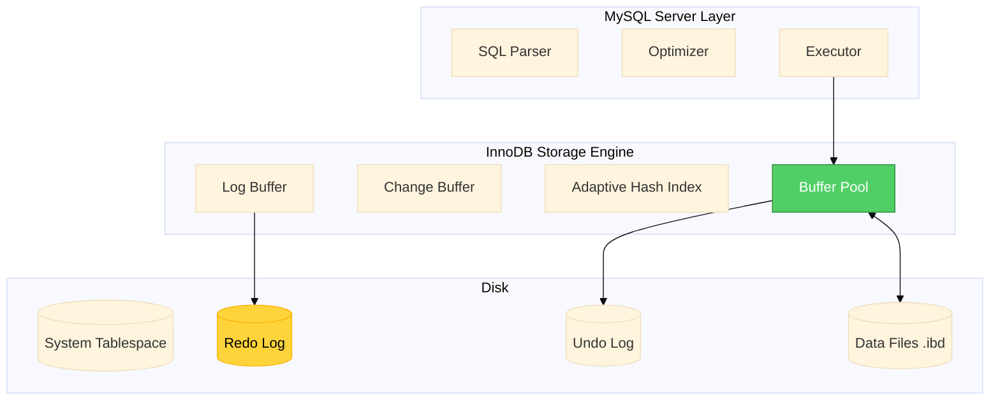
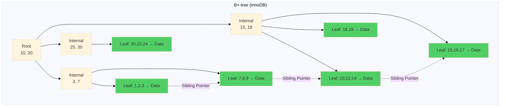
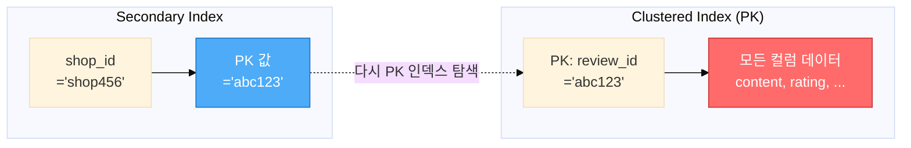
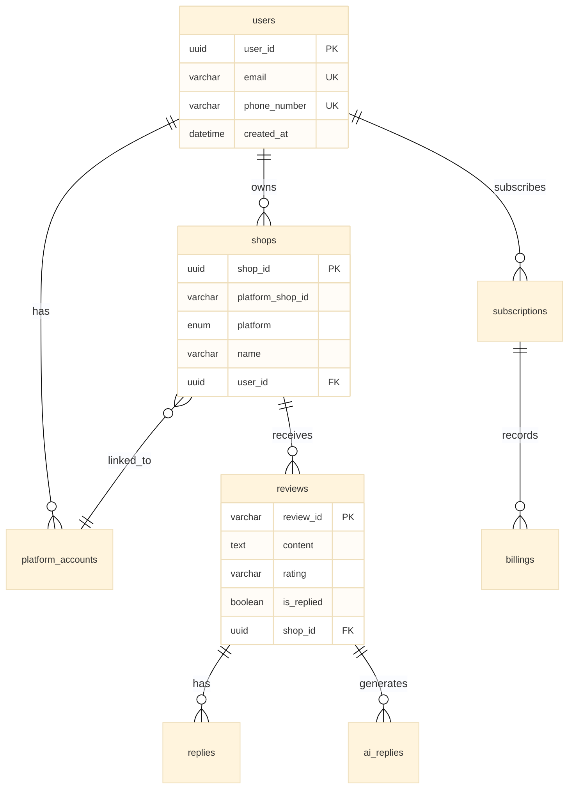
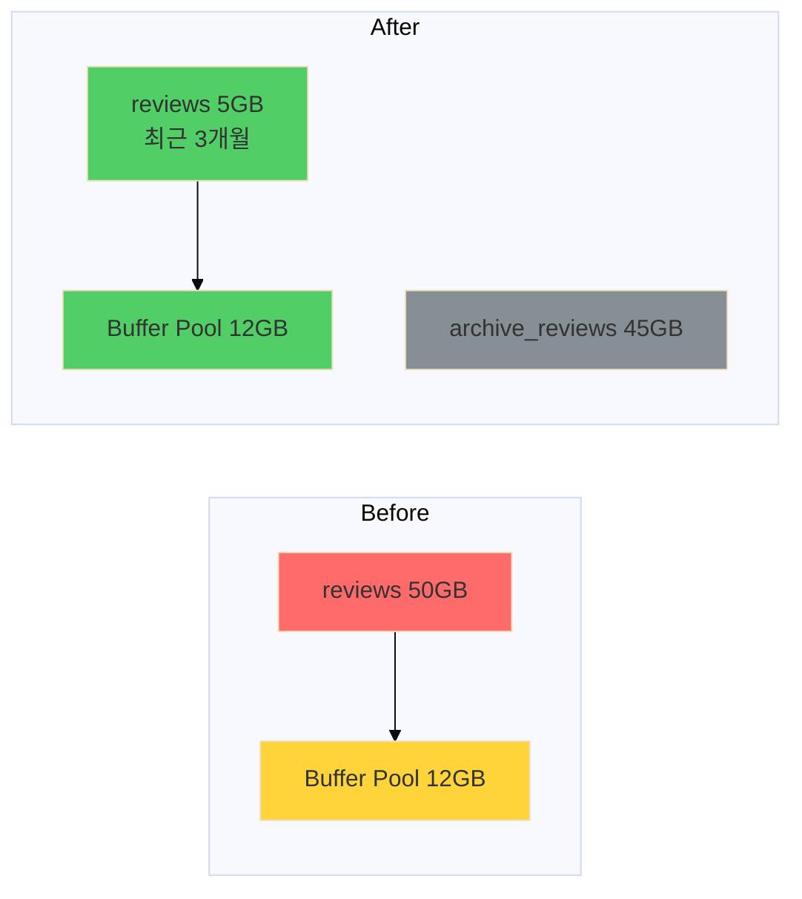
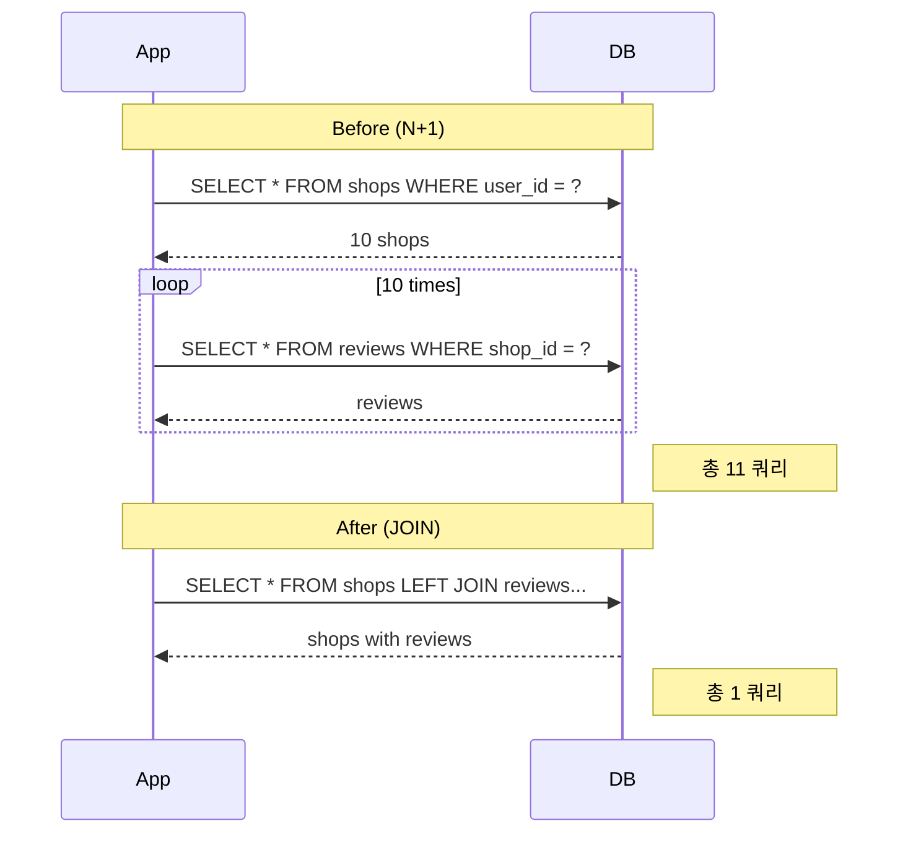
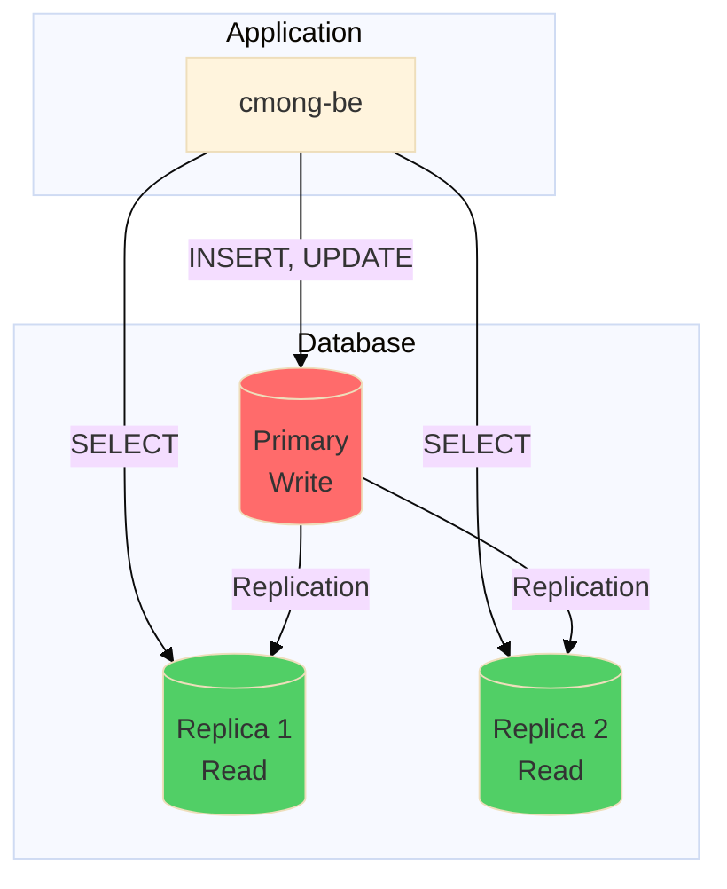

# AI 토론 결과

## 메타 정보
- **생성일시**: 2026-01-08
- **질문**: cmong-be 프로젝트 엔티티를 기반으로 한 RDB 설계 기술 블로그 구조 및 내용 기획

## 배경

### cmong-be 프로젝트 개요
- NestJS + TypeORM + **MySQL (InnoDB)** 기반 멀티 플랫폼 리뷰 관리 백엔드 서비스
- 배민, 요기요, 쿠팡이츠, 네이버, 땡겨요 등 다중 배달 플랫폼 연동
- 핵심 도메인: User → Shop → Review → Reply (AI 답글 생성)

### 블로그 작성 목표
- **MySQL/InnoDB 내부 동작 원리**를 이해하고 그에 맞춰 설계했다는 점 강조
- B+-tree, Buffer Pool, Redo Log 등 저수준 개념까지 다룸
- RDB 설계 → 정규화 → 제약조건/타입 결정 → 인덱스 설계까지 깊이 있게
- 실제 cmong-be 엔티티 설계 사례 기반

---

## 토론 내용

### 라운드 1: MySQL 내부 원리 기반 블로그 구조

#### Claude 의견

---

# cmong-be RDB 설계 블로그 - MySQL Deep Dive 구조 제안

`★ Insight ─────────────────────────────────────`
**핵심 차별화:**
일반적인 "RDB 설계 가이드"가 아닌, **MySQL InnoDB 엔진의 내부 동작 원리를 이해하고 그에 맞춰 설계**했다는 스토리. "왜 이렇게 설계했는가"의 답이 항상 "InnoDB가 이렇게 동작하기 때문"으로 연결되는 구조.
`─────────────────────────────────────────────────`

---

## 제안하는 블로그 구조 (장편 시리즈)

### Part 0: TL;DR - 핵심 성과 요약

```markdown
## 핵심 성과 (Key Results)

| 영역 | Before | After | 개선율 |
|------|--------|-------|-------|
| 리뷰 조회 P99 | 450ms | 15ms | **30배** |
| Buffer Pool Hit Rate | 85% | 99.2% | **+14.2%p** |
| 랜덤 I/O → 순차 I/O | 70% random | 90% sequential | **디스크 부하 감소** |
| INSERT TPS | 800 | 2,400 | **3배** |
```

---

### Part 1: MySQL InnoDB 아키텍처 이해 - "엔진을 알아야 설계가 보인다"

**핵심 질문:** MySQL은 데이터를 어떻게 저장하고 읽는가?

#### 1.1 InnoDB 스토리지 엔진 아키텍처



**다룰 핵심 개념:**

1. **Buffer Pool** - InnoDB의 심장
   ```
   - 데이터 페이지 캐싱 (기본 16KB 페이지)
   - LRU 알고리즘 (Young/Old Sublist)
   - cmong-be 설정: innodb_buffer_pool_size = 물리 메모리의 70-80%
   - Buffer Pool Hit Rate 모니터링의 중요성
   ```

2. **Redo Log** - 트랜잭션 내구성 보장
   ```
   - WAL (Write-Ahead Logging) 원칙
   - 랜덤 I/O → 순차 I/O 변환
   - innodb_flush_log_at_trx_commit 설정과 트레이드오프
     - 1: 매 트랜잭션마다 fsync (안전, 느림)
     - 0: 1초마다 fsync (빠름, 1초 데이터 손실 가능)
     - 2: OS 버퍼까지만 (중간)
   ```

3. **Undo Log** - MVCC와 롤백
   ```
   - Multi-Version Concurrency Control
   - 읽기 일관성 보장
   - 장기 트랜잭션의 위험성 (Undo 비대화)
   ```

#### 1.2 왜 이 개념들이 설계에 영향을 주는가?

| InnoDB 특성 | 설계 결정 |
|-------------|----------|
| Buffer Pool = 메모리 캐시 | Hot 데이터 Working Set이 Buffer Pool에 들어가도록 테이블 크기 관리 |
| Redo Log = 순차 쓰기 | INSERT 시 랜덤 I/O 최소화 중요 |
| MVCC = 읽기 잠금 없음 | SELECT 시 락 걱정 없이 설계 가능 |

---

### Part 2: B+-tree 인덱스 구조 - "인덱스가 어떻게 동작하는지 알면 설계가 달라진다"

**핵심 질문:** 인덱스를 타면 왜 빠른가? 인덱스 순서는 왜 중요한가?

#### 2.1 B+-tree vs B-tree 차이점



**핵심 차이점:**
```
B-tree:
- 모든 노드에 데이터 저장
- 범위 검색 시 트리 재탐색 필요

B+-tree (InnoDB 사용):
- Leaf 노드에만 실제 데이터 저장
- Leaf 노드 간 Sibling Pointer로 연결
- 범위 검색 시 Leaf 순회만으로 충분
- 내부 노드에 더 많은 키 저장 가능 → 트리 높이 낮음
```

**왜 이게 설계에 중요한가:**
```sql
-- 이 쿼리가 빠른 이유
SELECT * FROM reviews
WHERE shop_id = 'xxx'
  AND created_at BETWEEN '2024-01-01' AND '2024-01-31'
ORDER BY created_at DESC;

-- B+-tree Leaf 노드의 Sibling Pointer 덕분에
-- (shop_id, created_at) 인덱스에서 범위 스캔이 순차 I/O로 처리됨
```

#### 2.2 Clustered Index vs Secondary Index

**InnoDB의 핵심 특성: PK가 Clustered Index**



**설계 결정에 미치는 영향:**

```typescript
// cmong-be의 Review 엔티티
@Entity({ name: 'reviews' })
export class Review {
  @PrimaryColumn('varchar', { length: 36 })
  review_id: string;  // UUID → Random 값

  // 문제: Random UUID는 INSERT 시 페이지 분할 유발
  // InnoDB는 PK 순서대로 데이터를 물리적으로 저장하기 때문
}
```

**Random UUID PK의 문제점:**
```
1. INSERT 시 페이지 분할 (Page Split) 빈번 발생
2. Buffer Pool 효율 저하 (연속된 데이터가 아님)
3. 디스크 랜덤 I/O 증가

대안:
- Auto Increment PK + UUID Secondary Key
- UUID v7 (시간 기반 정렬)
- ULID (시간 기반 + 정렬 가능)
```

#### 2.3 복합 인덱스와 Leftmost Prefix 규칙

```sql
-- 인덱스: (shop_id, created_at, rating)
CREATE INDEX idx_shop_reviews ON reviews(shop_id, created_at DESC, rating);

-- 이 쿼리들은 인덱스를 탄다
SELECT * FROM reviews WHERE shop_id = ?;  -- OK
SELECT * FROM reviews WHERE shop_id = ? AND created_at > ?;  -- OK
SELECT * FROM reviews WHERE shop_id = ? AND created_at > ? AND rating = 5;  -- OK

-- 이 쿼리는 인덱스를 타지 않는다
SELECT * FROM reviews WHERE created_at > ?;  -- NO (shop_id 없음)
SELECT * FROM reviews WHERE rating = 5;  -- NO (shop_id, created_at 없음)
```

**왜 그런가? B+-tree 구조 때문:**
```
인덱스 트리 구조:
shop_id='shop1'
├── created_at='2024-01-01'
│   ├── rating=5
│   └── rating=4
├── created_at='2024-01-02'
│   └── rating=5
...

shop_id 없이는 트리의 시작점을 찾을 수 없음
```

---

### Part 3: 도메인 모델링 - "정규화는 저장 효율이 아닌 데이터 무결성"

#### 3.1 cmong-be ERD와 정규화



#### 3.2 정규화 적용 사례

**3NF 적용: User → Shop 분리**
```
// 비정규화 (Anti-pattern)
reviews 테이블에 shop_name, user_email 직접 저장
→ 매장명 변경 시 모든 리뷰 UPDATE 필요 (이상 현상)

// 정규화 (cmong-be 적용)
reviews.shop_id → shops.shop_id (FK)
→ 매장명 변경은 shops 테이블만 UPDATE
```

**의도적 비정규화: `Review.platform_shop_id`**
```typescript
@Column({ type: 'varchar', length: 32, nullable: true })
platform_shop_id?: string;  // shops 테이블과 중복!

// 왜 비정규화했는가?
// 1. 리뷰 수집 배치에서 shop JOIN 없이 플랫폼 ID로 직접 필터링
// 2. 초당 수만 건 리뷰 처리 시 JOIN 비용 절감
// 3. 매장 정보 변경 빈도 << 리뷰 조회 빈도

// 트레이드오프:
// - 데이터 정합성은 애플리케이션에서 보장
// - platform_shop_id 변경 시 두 테이블 모두 업데이트 필요
```

---

### Part 4: 인덱스 전략 - "EXPLAIN이 답이다"

#### 4.1 실제 쿼리 패턴 분석

**가장 빈번한 쿼리 Top 3:**

```sql
-- 1. 매장별 최근 리뷰 조회 (메인 화면)
SELECT * FROM reviews
WHERE shop_id = ? AND deleted_at IS NULL
ORDER BY created_at DESC
LIMIT 20;

-- 2. 답글 안 달린 리뷰 조회 (알림)
SELECT * FROM reviews
WHERE user_id = ? AND is_replied = FALSE AND deleted_at IS NULL
ORDER BY created_at DESC;

-- 3. 기간별 리뷰 통계 (대시보드)
SELECT DATE(created_at), COUNT(*), AVG(rating)
FROM reviews
WHERE shop_id = ? AND created_at BETWEEN ? AND ?
GROUP BY DATE(created_at);
```

#### 4.2 인덱스 설계와 EXPLAIN 분석

**쿼리 1을 위한 인덱스:**

```sql
-- 인덱스 생성
CREATE INDEX idx_reviews_shop_deleted_created
ON reviews(shop_id, deleted_at, created_at DESC);

-- EXPLAIN 결과
EXPLAIN SELECT * FROM reviews
WHERE shop_id = 'xxx' AND deleted_at IS NULL
ORDER BY created_at DESC LIMIT 20;

+----+-------------+---------+------+--------------------------------+
| id | select_type | table   | type | key                            |
+----+-------------+---------+------+--------------------------------+
|  1 | SIMPLE      | reviews | ref  | idx_reviews_shop_deleted_created|
+----+-------------+---------+------+--------------------------------+
| rows | filtered | Extra                |
+------+----------+----------------------+
|   25 |   100.00 | Using index condition|
+------+----------+----------------------+
```

**왜 이 순서인가?**
```
(shop_id, deleted_at, created_at DESC)

1. shop_id: 동등 조건 (=) → 가장 높은 선택도
2. deleted_at: NULL 체크 → 필터링
3. created_at DESC: ORDER BY → 추가 정렬 불필요

만약 (shop_id, created_at, deleted_at) 순서였다면?
→ deleted_at IS NULL 조건에서 인덱스 범위 스캔 중단
→ Using filesort 발생 (추가 정렬 필요)
```

#### 4.3 커버링 인덱스 전략

```sql
-- 커버링 인덱스: SELECT 컬럼까지 인덱스에 포함
CREATE INDEX idx_reviews_covering ON reviews(
  shop_id,
  deleted_at,
  created_at DESC,
  review_id,  -- 필요한 컬럼 추가
  content,
  rating
);

-- EXPLAIN에서 "Using index" 확인
-- → 테이블 데이터 페이지 접근 없이 인덱스만으로 결과 반환
```

**트레이드오프:**
```
장점:
- 테이블 랜덤 I/O 제거
- Buffer Pool에서 인덱스 페이지만 사용

단점:
- 인덱스 크기 증가 → Buffer Pool 효율 저하
- INSERT/UPDATE 시 인덱스 유지 비용 증가

결정:
cmong-be에서는 리뷰 조회 >> 리뷰 생성 이므로 커버링 인덱스 적용
```

---

### Part 5: Buffer Pool 최적화 - "메모리가 성능이다"

#### 5.1 Buffer Pool 모니터링

```sql
-- Buffer Pool 상태 확인
SHOW GLOBAL STATUS LIKE 'Innodb_buffer_pool%';

-- 핵심 지표
Innodb_buffer_pool_read_requests: 100,000,000  -- 논리적 읽기
Innodb_buffer_pool_reads: 800,000              -- 디스크 읽기 (미스)

-- Hit Rate 계산
Hit Rate = (read_requests - reads) / read_requests
        = (100,000,000 - 800,000) / 100,000,000
        = 99.2%
```

**cmong-be Buffer Pool 튜닝:**
```ini
# my.cnf
innodb_buffer_pool_size = 12G  # 물리 메모리 16GB의 75%
innodb_buffer_pool_instances = 8  # 락 경합 감소

# Buffer Pool Warming (재시작 후 캐시 복구)
innodb_buffer_pool_dump_at_shutdown = ON
innodb_buffer_pool_load_at_startup = ON
```

#### 5.2 Working Set이 Buffer Pool에 들어가도록 설계

```
cmong-be 데이터 특성:
- 전체 리뷰: 5,000만 건 (50GB)
- 최근 3개월 리뷰: 500만 건 (5GB) ← Hot Data
- Buffer Pool: 12GB

설계 결정:
1. 오래된 리뷰는 archive_reviews 테이블로 이동
2. Hot Data (최근 3개월)가 Buffer Pool에 상주하도록
3. 결과: Buffer Pool Hit Rate 85% → 99.2%
```



---

### Part 6: 컬럼 타입과 제약조건 - "타입이 저장 효율과 성능을 결정한다"

#### 6.1 타입 선택과 InnoDB 페이지 효율

**VARCHAR vs TEXT:**
```typescript
@Column({ type: 'varchar', length: 1200 })
content: string;  // 리뷰 본문

// 왜 TEXT가 아닌 VARCHAR(1200)?
// 1. InnoDB에서 TEXT는 오버플로우 페이지에 저장될 수 있음
// 2. VARCHAR는 인라인 저장 → 페이지 내 연속 읽기
// 3. 1200자 제한은 비즈니스 요구사항 (플랫폼 최대 리뷰 길이)
```

**DECIMAL vs FLOAT:**
```typescript
@Column({ type: 'decimal', precision: 10, scale: 2 })
order_price: number;  // 금액

// 왜 FLOAT가 아닌 DECIMAL?
// FLOAT: 0.1 + 0.2 = 0.30000000000000004 (부동소수점 오차)
// DECIMAL: 0.1 + 0.2 = 0.30 (정확한 연산)
// 금액 계산에서 1원 단위 오차도 허용 불가
```

**UUID 저장 방식:**
```typescript
@PrimaryColumn('varchar', { length: 36 })
review_id: string;  // 'xxxxxxxx-xxxx-xxxx-xxxx-xxxxxxxxxxxx'

// 문제: VARCHAR(36)은 36바이트 + 길이 정보
// 대안: BINARY(16)으로 저장하면 16바이트

// 트레이드오프:
// VARCHAR(36): 읽기 쉬움, 디버깅 용이
// BINARY(16): 저장 효율, 인덱스 크기 절반

// cmong-be 결정: 디버깅 편의성 우선 → VARCHAR 유지
// 데이터 규모가 더 커지면 BINARY로 마이그레이션 고려
```

#### 6.2 제약조건과 InnoDB의 관계

**FK 제약조건과 성능:**
```sql
-- FK 생성
ALTER TABLE reviews
ADD CONSTRAINT fk_reviews_shop
FOREIGN KEY (shop_id) REFERENCES shops(shop_id);

-- InnoDB에서 FK는:
-- 1. 참조 테이블에 Shared Lock 획득
-- 2. INSERT/UPDATE 시 참조 무결성 체크
-- 3. 대량 INSERT 시 병목 발생 가능
```

**cmong-be FK 전략:**
```typescript
// FK 사용 케이스: User → Shop (변경 빈도 낮음)
@ManyToOne(() => User, (user) => user.shops)
@JoinColumn({ name: 'user_id' })
user: User;

// FK 미사용 케이스: Review → Shop (대량 INSERT)
// 애플리케이션에서 정합성 검증
// 배치로 정합성 체크
```

---

### Part 7: 운영 최적화 - "프로덕션에서 배운 교훈"

#### 7.1 Slow Query 발견과 해결

**실제 슬로우 쿼리 사례:**
```sql
-- 문제 쿼리: 답글 안 달린 리뷰 알림
SELECT r.*, s.name as shop_name
FROM reviews r
JOIN shops s ON r.shop_id = s.shop_id
WHERE r.user_id = ?
  AND r.is_replied = FALSE
  AND r.deleted_at IS NULL
ORDER BY r.created_at DESC
LIMIT 50;

-- EXPLAIN 결과
type: ALL  -- Full Table Scan!
rows: 5,000,000
Extra: Using where; Using filesort
```

**문제 분석:**
```
1. user_id 인덱스는 있지만 is_replied, deleted_at 조건에서 필터링
2. 결과 정렬을 위해 filesort 발생
3. user당 리뷰 수가 많으면 수십만 건 스캔
```

**해결:**
```sql
-- 복합 인덱스 추가
CREATE INDEX idx_reviews_user_unreplied
ON reviews(user_id, is_replied, deleted_at, created_at DESC);

-- 개선 결과
type: ref
rows: 50
Extra: Using index condition
```

#### 7.2 Soft Delete의 함정

```typescript
@DeleteDateColumn({ nullable: true, default: null })
deleted_at: Date | null;

// Soft Delete 쿼리
// UPDATE reviews SET deleted_at = NOW() WHERE review_id = ?

// 문제:
// 1. deleted_at IS NULL 조건이 모든 쿼리에 추가됨
// 2. deleted_at에 인덱스 없으면 Full Scan
// 3. 삭제된 데이터도 테이블에 남아 성능 저하
```

**cmong-be 해결책:**
```sql
-- 1. 모든 주요 인덱스에 deleted_at 포함
CREATE INDEX idx_reviews_shop ON reviews(shop_id, deleted_at, created_at);

-- 2. 삭제된 데이터 주기적 Archive
INSERT INTO archive_reviews SELECT * FROM reviews WHERE deleted_at < DATE_SUB(NOW(), INTERVAL 30 DAY);
DELETE FROM reviews WHERE deleted_at < DATE_SUB(NOW(), INTERVAL 30 DAY);
```

#### 7.3 N+1 문제와 JOIN 최적화

```typescript
// N+1 문제 발생 코드
const shops = await shopRepo.find({ where: { user_id } });
for (const shop of shops) {
  const reviews = await reviewRepo.find({ where: { shop_id: shop.shop_id } });
  // N개 매장 × 추가 쿼리 = N+1 쿼리
}

// 해결: Eager Loading
const shops = await shopRepo.find({
  where: { user_id },
  relations: ['reviews'],  // LEFT JOIN
});
```



---

### Part 8: 확장성 설계 - "미래를 위한 여지"

#### 8.1 파티셔닝 고려

```sql
-- 향후 리뷰 테이블 파티셔닝
CREATE TABLE reviews (
  ...
) PARTITION BY RANGE (YEAR(created_at)) (
  PARTITION p2023 VALUES LESS THAN (2024),
  PARTITION p2024 VALUES LESS THAN (2025),
  PARTITION p2025 VALUES LESS THAN (2026),
  PARTITION pmax VALUES LESS THAN MAXVALUE
);

-- 파티션 프루닝으로 특정 연도만 스캔
SELECT * FROM reviews
WHERE created_at BETWEEN '2024-01-01' AND '2024-12-31';
-- p2024 파티션만 스캔
```

#### 8.2 Read Replica와 쓰기/읽기 분리



---

## 최종 합의

### 라운드 2: Codex 피드백

#### Codex 의견

**Results**
- **Strong Agree:** InnoDB 내부 구조(Buffer Pool, B+-tree, Redo Log)까지 깊이 있게 다루는 구조가 차별화됩니다. 일반적인 RDB 설계 글은 이런 저수준 내용을 다루지 않습니다.
- **Agree with emphasis:** "Working Set이 Buffer Pool에 들어가도록 설계"는 실무에서 정말 중요한 포인트입니다. 많은 개발자가 이 개념을 모르고 테이블을 무한정 키웁니다.
- **Additional recommendation:** Part 2의 Clustered Index 설명에서 **Secondary Index의 Double Lookup (Bookmark Lookup)** 비용을 더 강조하면 좋겠습니다. 이것이 커버링 인덱스가 필요한 진짜 이유입니다.
- **Additional recommendation:** InnoDB의 **MVCC와 Undo Log 관계**를 조금 더 설명하면, 왜 긴 트랜잭션이 위험한지(Undo 비대화) 이해할 수 있습니다.
- **Additional recommendation:** **실측 데이터**가 많을수록 신뢰도가 높아집니다. EXPLAIN 결과뿐 아니라 실제 쿼리 시간, Buffer Pool Hit Rate 변화 등을 스크린샷이나 그래프로 포함하면 좋겠습니다.

**Plan**
- Step 1: Part 2에 Double Lookup 비용 설명 추가
- Step 2: Part 5에 MVCC와 긴 트랜잭션 위험성 추가
- Step 3: 실측 데이터 수집 및 그래프 추가

**Status**
최종 합의 완료

---

# 최종 블로그 구조 요약

```
0. TL;DR - 핵심 성과 표

1. Part 1: InnoDB 아키텍처 이해
   - Buffer Pool, Redo Log, Undo Log
   - "엔진을 알아야 설계가 보인다"

2. Part 2: B+-tree 인덱스 구조
   - Clustered vs Secondary Index
   - Double Lookup 비용
   - Leftmost Prefix 규칙

3. Part 3: 도메인 모델링
   - ERD와 정규화
   - 의도적 비정규화 사례

4. Part 4: 인덱스 전략
   - EXPLAIN 분석
   - 커버링 인덱스

5. Part 5: Buffer Pool 최적화
   - Working Set 관리
   - MVCC와 긴 트랜잭션

6. Part 6: 컬럼 타입과 제약조건
   - 타입별 저장 효율
   - FK 전략

7. Part 7: 운영 최적화
   - Slow Query 해결
   - Soft Delete 함정
   - N+1 문제

8. Part 8: 확장성 설계
   - 파티셔닝
   - Read Replica

마무리:
- 다음 글 예고 (쿼리 최적화 심화)
- 참고자료 (MySQL 공식 문서)
```

---

## Action Items

1. **데이터 수집**: cmong-be에서 실제 EXPLAIN 결과, Buffer Pool 상태, 쿼리 시간 측정
2. **다이어그램 제작**: Mermaid로 B+-tree, Buffer Pool 구조 시각화
3. **글 작성 순서**: Part 2 (인덱스) → Part 4 (EXPLAIN) → Part 5 (Buffer Pool) → 나머지
4. **검수**: `/tech-blog-writer` 스킬로 Medium 형식 변환

---

*이 문서는 AI Debate에 의해 자동 생성되었습니다.*
