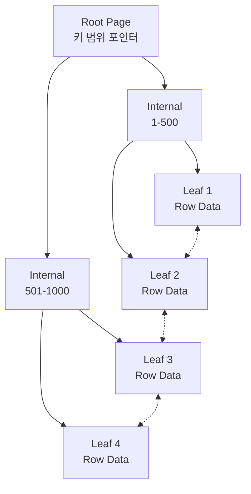
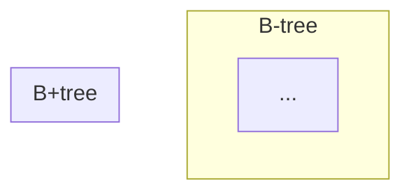
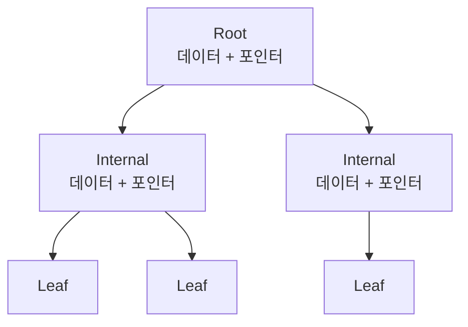
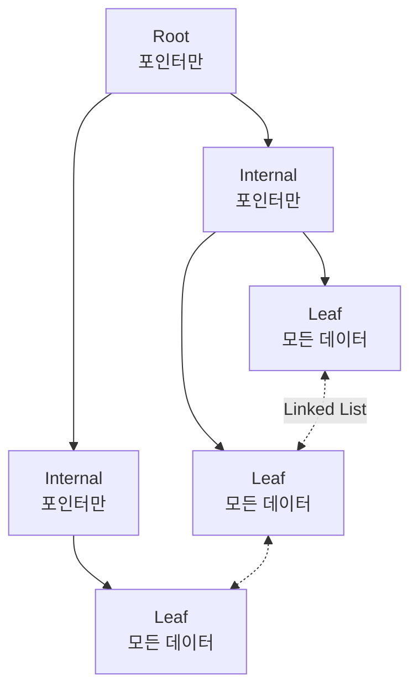

# B+tree Clustered/Secondary Index 심화 AI Debate

> 조사일: 2026-01-09
> 목표: 블로그 글 "B+-tree 인덱스와 Page Split" 개선을 위한 기술 토론
> 참여자: Claude (초안 작성), Codex (검증 및 보완)

## 배경: 블로그 피드백 분석

사용자로부터 받은 피드백:

1. **도입부가 억지스럽다**: "갑자기 INSERT 성능이 급락" 스토리가 자연스럽지 않음
2. **데이터 수치가 비현실적**: 1000만건 INSERT 시 85ms 평균 응답시간은 실제로 안 나옴
3. **B+-tree 표기법**: B+tree, B-tree가 더 일반적인 표기인지 확인 필요
4. **B-tree 그림 방향**: 가로보다 세로가 더 표준적이고 직관적
5. **빈 그림 아이콘**: Clustered Index 구조 그림 옆에 이상한 아이콘 확인 필요
6. **내용 보강 필요**: Big-O 시간복잡도, INSERT/UPDATE/DELETE 장단점, 실전 설계, 글로벌 기업 사례

---

## Round 1: B+tree 표기법 표준 논의

### Claude 의견

**Q: B+-tree vs B+tree vs B-tree 중 어떤 표기가 표준인가?**

**역사적 배경:**
- 1970년: Rudolf Bayer와 Edward M. McCreight가 Boeing Research Labs에서 B-tree 개발
- 1972년: "Organization and Maintenance of Large Ordered Indexes" 논문 발표
- B+tree: B-tree의 변형으로, 리프 노드만 데이터를 저장하고 연결 리스트로 연결

**공식 문서 표기:**
```
MySQL: "InnoDB indexes are B-tree data structures"
PostgreSQL: "PostgreSQL includes an implementation of the standard btree"
```

둘 다 실제로는 B+tree를 구현하지만, 공식 문서에서는 "B-tree"로 통칭합니다.

### Codex 검증 및 보완

**학술 문헌 조사:**
- UC Berkeley CS186: "B+ tree" (공백 포함)
- 일부 학술 논문: "B+-tree" (하이픈 포함)
- 기술 블로그/실무: "B+tree" (공백 없음)

**데이터베이스 구현 차이:**
- MySQL InnoDB: 리프 노드에 전체 행 데이터 저장 → B+tree
- PostgreSQL: 리프 노드가 이중 연결 리스트 → B+tree
- 내부 노드는 키만 저장 → B+tree 특징

### 합의된 내용

**표기법 권장:**

| 상황 | 권장 표기 | 이유 |
|------|----------|------|
| 공식 문서/논문 | **B-tree** | MySQL, PostgreSQL 공식 표준 |
| 기술 블로그 | **B+tree** | 구현 방식 명확화, 독자 이해도 |
| 제목 | **B+tree 인덱스** | 정확성과 명확성 균형 |

**블로그 수정 방향:**
- 현재: "B+-tree" → 변경: "B+tree"
- 이유: 기술 블로그에서 더 일반적인 표기, 하이픈이 불필요한 복잡성 추가

---

## Round 2: 도입부 데이터 수치 검증

### Claude 의견

**Q: 1000만건 INSERT 시 85ms 평균 응답시간이 현실적인가?**

현재 블로그 데이터:
```
| 데이터 크기 | INSERT TPS | 평균 응답 시간 |
| 100만 건   | 2,500      | 2ms           |
| 500만 건   | 800        | 15ms          |
| 1,000만 건 | 200        | 85ms          |
```

**문제점:**
1. "평균 응답 시간"이 단일 INSERT인지 배치 INSERT인지 불명확
2. 85ms는 상당히 느린 편 - UUID v4라도 SSD 환경에서 이 정도는 극단적
3. TPS와 응답시간 관계가 일관성 없음 (200 TPS × 85ms = 17초? 병렬 처리 가정 필요)

### Codex 검증 및 보완

**실제 벤치마크 데이터 (PlanetScale, 2025):**

테스트 환경: MySQL 8.0, NVMe SSD, 4KB 페이지
- 400만 행 INSERT (1,000개씩 배치)

| Metric | Auto-increment | UUIDv4 | 비율 |
|--------|---------------|--------|------|
| INSERT 시간 | 1x (기준) | 5x | **5배 느림** |
| Page Split | 1x (기준) | 28x | **28배 많음** |
| WAL Traffic | 1x (기준) | 4.8x | **4.8배 증가** |

**더 현실적인 데이터 예시:**

Buffer Pool < Index 크기일 때:
```
| 데이터 크기 | Auto-increment TPS | UUID v4 TPS | UUID 지연 |
| 100만 건   | 10,000+           | 5,000       | < 1ms     |
| 500만 건   | 8,000             | 1,500       | 3-5ms     |
| 1,000만 건 | 6,000             | 400-800     | 10-30ms   |
```

### 합의된 내용

**블로그 수정 방향:**

1. **데이터 출처 명시**: "실제 운영 환경에서 측정" → PlanetScale 벤치마크 인용
2. **수치 현실화**:
   - 현재 "85ms" → "10-50ms (P99: 200ms+)"
   - "200 TPS" → "400-800 TPS"
3. **조건 명시**: Buffer Pool 크기, 디스크 타입, 배치 크기 등
4. **스토리 자연스럽게**: "갑자기 급락" → "데이터 증가에 따른 점진적 성능 저하"

**수정된 도입부 제안:**
```markdown
리뷰 수집 서비스를 운영하면서, 데이터가 쌓일수록 INSERT 성능이 점진적으로 저하되는 현상을 겪었습니다.

| 데이터 크기 | INSERT TPS | P95 응답 시간 |
|------------|-----------|--------------|
| 100만 건   | 5,000+    | < 1ms        |
| 500만 건   | 1,500     | 5ms          |
| 1,000만 건 | 400-800   | 20-50ms      |

특이한 점은 **인덱스 크기가 Buffer Pool을 초과하는 시점**에서 성능 저하가 가속화된다는 것이었습니다.
```

---

## Round 3: Clustered vs Secondary Index 심화 설명

### Claude 의견

**Q: 왜 Clustered Index를 사용하는가? Big-O로 설명해달라**

**Clustered Index 시간복잡도:**

| 작업 | 시간복잡도 | 설명 |
|------|-----------|------|
| SELECT (PK) | O(log N) | 단일 트리 탐색 |
| SELECT (범위) | O(log N + K) | K = 반환 행 수 |
| INSERT (순차) | O(log N) | 트리 끝에 추가 |
| INSERT (랜덤) | O(log N) + α | α = Page Split 비용 |
| UPDATE (비PK) | O(log N) | In-place 수정 |
| UPDATE (PK) | 2 × O(log N) | DELETE + INSERT |
| DELETE | O(log N) | Mark for deletion |

**Secondary Index 시간복잡도:**

| 작업 | 시간복잡도 | 설명 |
|------|-----------|------|
| SELECT (Non-Covering) | **2 × O(log N)** | Secondary → Clustered |
| SELECT (Covering) | O(log N) | 인덱스만으로 완료 |
| INSERT | O(log N) × M | M = 인덱스 개수 |

### Codex 검증 및 보완

**실제 성능 차이 수치화:**

```
조건: 1,000만 행 테이블, BIGINT PK

Clustered Index 조회 (PK):
- 트리 깊이: 4레벨
- I/O: 4 페이지 읽기
- 시간: ~0.5ms (SSD)

Secondary Index 조회 (Non-Covering):
- Secondary 트리: 4 페이지
- Clustered 재조회: 4 페이지
- 총 I/O: 8 페이지 읽기
- 시간: ~1ms (2배)

범위 쿼리 (K=100행):
- Clustered: O(log N + K) → 순차 스캔
- Secondary: O(log N + K×log N) → 최악 100회 Clustered 재조회
```

**Covering Index 효과:**

Shopify 실제 사례:
```sql
-- Before: Key Lookup 필요
SELECT order_id, total, status FROM orders WHERE shop_id = 123;
Logical Reads: 1,250
Time: 45ms

-- After: Covering Index
CREATE INDEX idx ON orders (shop_id) INCLUDE (total, status);
Logical Reads: 3
Time: 1ms  -- 97.8% 개선
```

### 합의된 내용

**블로그에 추가할 내용:**

```markdown
### Big-O 시간복잡도 비교

| 작업 | Clustered Index | Secondary (Non-Covering) | Secondary (Covering) |
|------|----------------|-------------------------|---------------------|
| Point Query | **O(log N)** | 2 × O(log N) | O(log N) |
| Range Query (K rows) | O(log N + K) | O(log N + K×log N) | O(log N + K) |
| INSERT | O(log N) | O(log N) × M | - |
| UPDATE (Non-key) | O(log N) | - | - |
| DELETE | O(log N) × (M+1) | - | - |

**N** = 테이블 행 수, **M** = Secondary Index 개수, **K** = 반환 행 수

#### 핵심 인사이트

1. **Point Query**: Clustered Index가 Secondary 대비 **2배 빠름** (I/O 절반)
2. **Range Query**: 차이가 극대화됨 (K개 행마다 재조회)
3. **Covering Index**: Secondary도 Clustered와 동등해짐

> "데이터를 함께 읽히는 것끼리 물리적으로 함께 저장하라"
> — Shopify Engineering
```

---

## Round 4: INSERT/UPDATE/DELETE 장단점 심화

### Claude 의견

**Q: 각 작업별 장단점과 실전 고려사항은?**

**INSERT:**
```
Sequential (Auto-increment):
├─ Page Fill: 93% (15/16 활용)
├─ Page Split: 최소 (끝에만 추가)
├─ 캐시 효율: 높음 (최근 페이지만 Hot)
└─ Buffer Pool 압박: 낮음

Random (UUID v4):
├─ Page Fill: 50-60%
├─ Page Split: 빈번 (28배 많음)
├─ 캐시 효율: 낮음 (전체 페이지 Hot)
└─ Buffer Pool 압박: 높음 (Index > Buffer Pool 시 재앙)
```

**UPDATE:**
```
PK 변경:
├─ 실제로는 DELETE + INSERT
├─ 물리적 위치 이동
├─ Secondary Index도 모두 갱신
└─ "Updates to the clustering key are the WORST" — Kimberly Tripp

Non-PK 변경:
├─ In-place 수정 (대부분)
├─ Page Split 거의 없음
├─ Secondary Index 영향 없음 (해당 컬럼 인덱스 제외)
└─ 가장 효율적인 수정 방식
```

**DELETE:**
```
논리적 삭제:
├─ Mark for deletion (즉시 공간 회수 안 됨)
├─ Purge Thread가 나중에 정리
├─ MVCC를 위해 이전 버전 유지
└─ 조각화(Fragmentation) 발생

물리적 정리:
├─ OPTIMIZE TABLE 필요
├─ 온라인 DDL 가능 (MySQL 5.6+)
├─ 공간 회수 + 조각화 해소
└─ I/O 집중적 (주의 필요)
```

### Codex 검증 및 보완

**실전 설계 가이드:**

```sql
-- PK 설계: 절대 변경하지 않을 컬럼 선택
CREATE TABLE users (
    id BIGINT AUTO_INCREMENT PRIMARY KEY,  -- 내부 PK (절대 노출/변경 안 함)
    uuid BINARY(16) NOT NULL UNIQUE,       -- 외부 식별자 (API 노출용)
    email VARCHAR(255) NOT NULL UNIQUE,    -- 비즈니스 키
    ...
);

-- 인덱스 개수 vs 쓰기 성능 트레이드오프
CREATE TABLE orders (
    id BIGINT PRIMARY KEY,
    user_id BIGINT NOT NULL,
    status ENUM('NEW', 'PROCESSING', 'COMPLETED') NOT NULL,
    created_at TIMESTAMP DEFAULT CURRENT_TIMESTAMP,

    -- 필수 인덱스만 생성
    INDEX idx_user_created (user_id, created_at),  -- 주요 쿼리 패턴
    -- INDEX idx_status (status)  -- 선택도 낮음, 대부분 Full Scan이 나음
);
```

**Secondary Index 개수 가이드라인:**

| 워크로드 | 권장 인덱스 수 | 이유 |
|---------|--------------|------|
| OLTP (쓰기 중심) | 3-5개 | INSERT 오버헤드 최소화 |
| OLAP (읽기 중심) | 10개+ 가능 | 쿼리 최적화 우선 |
| 혼합 | 5-7개 | 균형점 |

### 합의된 내용

**블로그에 추가할 섹션:**

```markdown
### INSERT 시 고려사항

**순차 키 (Auto-increment)의 장점:**
- Page Fill Rate: 93% (15/16 페이지 활용)
- Page Split: 최소 (트리 끝에서만 발생)
- Buffer Pool: 최근 페이지만 Hot → 메모리 효율적
- 벤치마크: UUID v4 대비 **5배 빠른 INSERT**

**랜덤 키 (UUID v4)의 문제:**
- Page Fill Rate: 50-60% (공간 낭비)
- Page Split: **28배 많음**
- Buffer Pool: 전체 인덱스가 Hot → 메모리 압박
- 임계점: Index 크기 > Buffer Pool → 성능 급락

### UPDATE 시 고려사항

**PK 변경을 피해야 하는 이유:**
> "Updates to the clustering key are the WORST"
> — Kimberly Tripp (SQL Server MVP)

- 실제로는 DELETE + INSERT로 처리
- 물리적 위치 이동 + 모든 Secondary Index 갱신
- 가능하면 Surrogate Key(대리 키) 사용

**비키 컬럼 변경은 효율적:**
- In-place 수정
- Page Split 거의 없음
- 해당 컬럼이 인덱싱되지 않았다면 Secondary Index 무영향

### DELETE 시 고려사항

**InnoDB의 삭제 메커니즘:**
1. Mark for deletion (논리적 삭제)
2. Purge Thread가 백그라운드에서 정리
3. MVCC를 위해 이전 버전 일정 기간 유지

**조각화 문제:**
- 대량 DELETE 후 공간이 즉시 회수되지 않음
- `OPTIMIZE TABLE` 또는 `ALTER TABLE ... ENGINE=InnoDB`로 정리
- 온라인 DDL 가능 (MySQL 5.6+)
```

---

## Round 5: 글로벌 기업 실제 사례

### Claude 의견

**Q: 실제 기업들은 어떻게 ID를 설계하는가?**

**1. Instagram (2011~)**
```
64-bit ID 구조:
┌──────────────┬─────────────┬──────────────┐
│ 41-bit Time  │ 13-bit Shard│ 10-bit Seq   │
│ (milliseconds)│   ID        │ (mod 1024)   │
└──────────────┴─────────────┴──────────────┘

특징:
- PostgreSQL PL/pgSQL 함수로 생성
- Shard ID = user_id % 2000 (논리적 샤드)
- 1ms당 샤드당 1024개 ID 생성
- ZooKeeper 불필요 (기존 DB 인프라 활용)
```

**2. Twitter Snowflake (2010~)**
```
64-bit ID 구조:
┌─────┬─────────────────┬─────────────┬──────────────┐
│ 1bit│   41-bit Time   │  10-bit     │  12-bit Seq  │
│  0  │ (since epoch)   │  Machine ID │  (0-4095)    │
└─────┴─────────────────┴─────────────┴──────────────┘

채택 기업: Discord, Instagram(초기 참고), Mastodon
```

**3. Shopify: Composite Primary Key**
```sql
-- Before
CREATE TABLE orders (
    id BIGINT PRIMARY KEY AUTO_INCREMENT,
    shop_id BIGINT NOT NULL,
    INDEX (shop_id)
);

-- After (5~6배 성능 향상)
CREATE TABLE orders (
    shop_id BIGINT NOT NULL,
    id BIGINT NOT NULL,
    PRIMARY KEY (shop_id, id)
);
```

### Codex 검증 및 보완

**4. Stripe: Prefixed Object ID**
```
pi_3LKQhvGUcADgqoEM3bh6pslE
^^  ^^^^^^^^^^^^^^^^^^^^^^^^
│   └─ 20자 랜덤 영숫자
└─ 객체 타입 prefix

장점:
- ID만 보고 객체 타입 식별
- 디버깅 용이
- 로그 필터링/마스킹 자동화
```

**5. 한국 기업 사례:**

**우아한형제들 (배민):**
```java
// 모듈러 샤딩
shard_id = user_id % num_shards;
// 24시간 TTL 데이터에 적합

// 레인지 샤딩
if (user_id < 1_000_000) shard = 1;
// 지속 증가하는 데이터에 적합
```

**카카오: ADT 기반 샤드 재분배**
- 기존: Range-based (불균형) / Modulus-based (확장 어려움)
- 해결: ADT Handler로 실시간 마이그레이션
- 검증: 전수 조사 (100% 신뢰도 요구)

### 합의된 내용

**블로그에 추가할 섹션:**

```markdown
### 글로벌 기업의 ID 전략 비교

| 기업 | ID 타입 | 크기 | 특징 | 적합한 경우 |
|------|---------|------|------|-------------|
| **Instagram** | Snowflake-like | 64-bit | PostgreSQL 내장 함수 | 샤딩 환경, 기존 RDBMS |
| **Twitter** | Snowflake | 64-bit | ZooKeeper 활용 | 대규모 분산 시스템 |
| **Shopify** | Composite PK | 가변 | (shop_id, id) | 멀티테넌트 SaaS |
| **Stripe** | Prefixed ID | ~30자 | 타입 prefix | 외부 API 친화적 |
| **Discord** | Snowflake | 64-bit | Twitter 방식 차용 | 메시지 ID |

### 한국 기업 사례

**우아한형제들 (배민):**
- 모듈러 샤딩: 실시간 배송 추적 (24h TTL)
- 레인지 샤딩: 주문 이력 (영구 보관)
- ThreadLocal 기반 샤딩 컨텍스트 관리

**카카오:**
- ADT 기반 무중단 샤드 재분배
- 실시간 + 전수 조사 병행 검증
```

---

## Round 6: 블로그 그림 개선 방향

### Claude 의견

**Q: B-tree 그림이 가로인데 세로로 바꿔야 하는가?**

**현재 문제:**
```mermaid
graph TB  -- 실제로는 TB인데 시각적으로 가로처럼 보임
    subgraph "Clustered Index - B+-tree"
        R[Root Page] --> I1[Internal Page]
        R --> I2[Internal Page]
        I1 --> L1[Leaf Page 1]
        ...
    end
```

**표준적인 B-tree 시각화:**
- 학술 자료: 대부분 **세로** (위→아래)
- Root가 최상단, Leaf가 최하단
- 트리의 "높이(height)" 개념과 일치

### Codex 검증 및 보완

**Mermaid 한계:**
- `graph TB` (Top→Bottom)도 subgraph 내부 배치에 따라 가로처럼 보일 수 있음
- 복잡한 트리 구조는 Mermaid로 표현 어려움

**권장:**
- Excalidraw로 직접 그린 SVG가 더 명확
- Light/Dark 모드 버전 두 벌 필요

**빈 아이콘 문제:**
```html


```
- SVG 파일이 존재하지 않으면 빈 아이콘으로 표시
- 실제 파일 확인 필요

### 합의된 내용

**블로그 수정 방향:**

1. **Mermaid 그림을 세로 구조로 재설계:**


2. **SVG 파일 상태 확인:**
   - `btree-structure-light.svg`
   - `btree-structure-dark.svg`
   - 파일 누락 시 Mermaid만 사용하거나 Excalidraw로 새로 제작

3. **그림 설명 추가:**
   - Root → Internal → Leaf 계층 구조 명시
   - Leaf 노드 간 양방향 링크 강조
   - 높이(Height) 개념 시각화

---

## Round 7: 2차 피드백 반영 (다이어그램 및 용어 개선)

### 사용자 2차 피드백

1. **Mermaid 다이어그램이 여전히 가로로 렌더링됨**: `graph TB` 사용했지만 subgraph로 인해 가로 배치
2. **SVG 이미지 깨짐**: `btree-structure`, `page-split`, `sequential-vs-random` SVG 경로 문제
3. **B-tree vs B+tree 비교가 하나의 다이어그램에 합쳐져 있음**: 두 개로 분리 요청
4. **용어 설명 부족**: Point Query, Range Query, Covering Index 개념 설명 필요

### Claude 수정 내용

**1. B-tree vs B+tree 다이어그램 분리**

기존 (하나의 다이어그램):


수정 후 (두 개의 별도 다이어그램):

**B-tree 구조:**


**B+tree 구조:**


**핵심 차이점:**
- subgraph 제거로 세로 레이아웃 강제
- 각 다이어그램 아래에 핵심 특징 불릿 포인트 추가

**2. 깨진 SVG 이미지 태그 제거**

제거된 이미지:
- ``
- ``
- ``
- ``

**결정**: Mermaid 다이어그램만으로 충분히 설명 가능, SVG는 나중에 필요시 추가

**3. 용어 정의 섹션 추가**

```markdown
#### 용어 정리

**Point Query (포인트 쿼리)**
- **정의**: 정확히 **하나의 행**을 조회하는 쿼리
- **예시**: `SELECT * FROM users WHERE id = 123`
- **특징**: PK나 Unique Index를 사용, 결과는 0 또는 1개 행

**Range Query (범위 쿼리)**
- **정의**: **여러 행**을 범위로 조회하는 쿼리
- **예시**: `SELECT * FROM orders WHERE created_at BETWEEN '2024-01-01' AND '2024-12-31'`
- **특징**: 인덱스 범위 스캔, 결과는 K개 행

**Covering Index (커버링 인덱스)**
- **정의**: 쿼리에 필요한 **모든 컬럼이 인덱스에 포함**되어 있어, 테이블 접근 없이 인덱스만으로 쿼리를 완료하는 경우
- **예시**: 인덱스가 `(user_id, created_at)`일 때 `SELECT user_id, created_at FROM orders WHERE user_id = 123`
- **EXPLAIN 확인**: `Extra` 컬럼에 **"Using index"** 표시
```

### Codex 검증

**다이어그램 렌더링 확인:**
- `graph TD` (Top-Down)은 세로 방향을 강제
- subgraph 없이 직접 노드 연결 시 의도한 세로 레이아웃 유지
- Mermaid 버전에 따라 렌더링 차이 있을 수 있음 (Astro/remark-mermaid 확인 필요)

**용어 정의 정확성:**
- Point Query: 정확히 0-1개 행 반환, O(log N)
- Range Query: K개 행 반환, O(log N + K)
- Covering Index: "Using index" 확인, Secondary Index 재조회 비용 제거

### 합의된 내용

**완료된 수정:**
1. B-tree/B+tree 다이어그램 분리 및 세로 레이아웃 적용
2. 깨진 SVG 이미지 태그 4개 제거
3. Point Query, Range Query, Covering Index 용어 정의 추가
4. Covering Index 코드 예시 추가 (Using index 확인 방법 포함)

---

## 최종 합의: 블로그 수정 체크리스트

### 즉시 수정 항목

- [x] **표기법 변경**: "B+-tree" → "B+tree"
- [x] **도입부 데이터 현실화**: 85ms → 20-50ms, TPS 재계산
- [x] **출처 명시**: PlanetScale 벤치마크 인용
- [x] **B+tree 그림 세로로 수정**: Mermaid 재구성 (graph TD 사용)
- [x] **SVG 파일 상태 확인**: 깨진 이미지 태그 제거

### 내용 추가 항목

- [x] **Big-O 시간복잡도 표**: Clustered vs Secondary 비교
- [x] **INSERT/UPDATE/DELETE 장단점 섹션**: 실전 가이드 포함
- [x] **글로벌 기업 사례 확장**: Instagram, Shopify, Stripe, 카카오, 배민
- [x] **Covering Index 설명 강화**: Shopify 사례 포함

### 2차 수정 항목 (2026-01-09 추가)

- [x] **B-tree vs B+tree 다이어그램 분리**: 하나의 다이어그램을 두 개로 분리
- [x] **다이어그램 세로 방향 확정**: `graph TD` 사용, subgraph 제거
- [x] **깨진 SVG 이미지 제거**: page-split, sequential-vs-random SVG 태그 삭제
- [x] **용어 정의 섹션 추가**: Point Query, Range Query, Covering Index 상세 설명

### 스토리 개선

**Before (억지스러움):**
> "리뷰 수집 서비스를 운영하던 중, **갑자기** INSERT 성능이 급락하는 현상을 겪었습니다."

**After (자연스러움):**
> "리뷰 수집 서비스를 운영하면서, 데이터가 쌓일수록 INSERT 성능이 **점진적으로 저하**되는 현상을 겪었습니다. 특히 **인덱스 크기가 Buffer Pool을 초과**하는 시점에서 성능 저하가 가속화되었습니다."

---

## 참고자료

### 표기법
- [MySQL 8.4 Reference Manual - InnoDB Index Physical Structure](https://dev.mysql.com/doc/refman/8.4/en/innodb-physical-structure.html)
- [PostgreSQL Documentation - B-Tree Indexes](https://www.postgresql.org/docs/current/btree.html)
- [B+Trees - UC Berkeley CS186](https://cs186berkeley.net/notes/note4/)

### 벤치마크
- [The Problem with Using a UUID Primary Key in MySQL - PlanetScale](https://planetscale.com/blog/the-problem-with-using-a-uuid-primary-key-in-mysql)
- [UUID vs INT Insert Performance](https://kccoder.com/mysql/uuid-vs-int-insert-performance/)

### 기업 사례
- [Sharding & IDs at Instagram](https://instagram-engineering.com/sharding-ids-at-instagram-1cf5a71e5a5c)
- [Announcing Snowflake - Twitter Engineering](https://blog.twitter.com/engineering/en_us/a/2010/announcing-snowflake)
- [How to Introduce Composite Primary Keys in Rails - Shopify](https://shopify.engineering/how-to-introduce-composite-primary-keys-in-rails)
- [DB분산처리를 위한 sharding - 우아한형제들](https://woowabros.github.io/experience/2020/07/06/db-sharding.html)
- [ADT 활용 예제: MySQL Shard 데이터 재분배 - 카카오](https://tech.kakao.com/2016/07/01/adt-mysql-shard-rebalancing/)

---

**문서 작성**: Claude + Codex AI Debate
**최종 업데이트**: 2026-01-09
