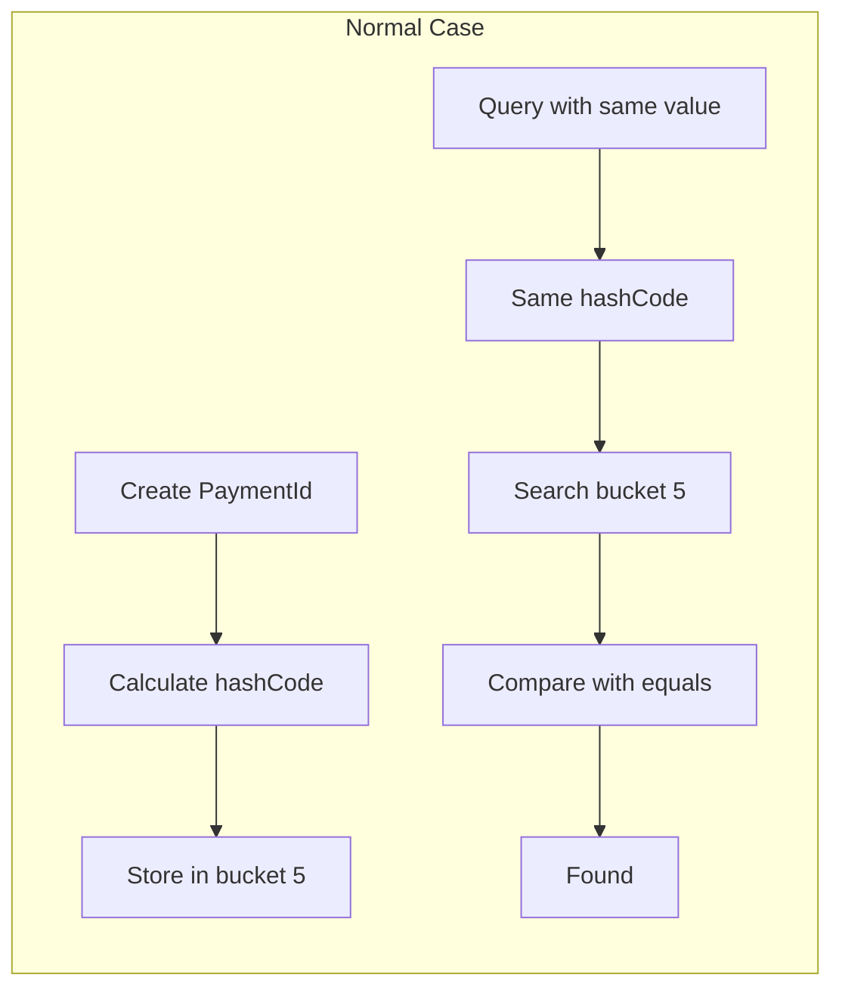
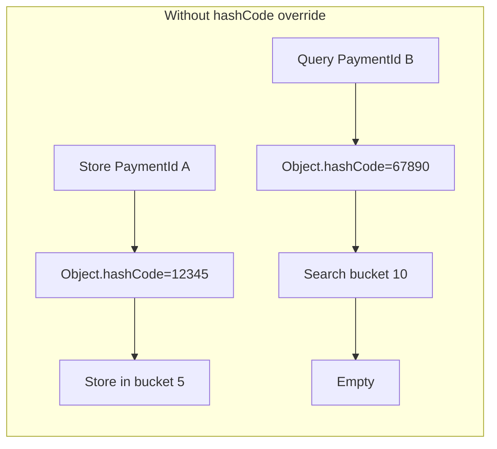
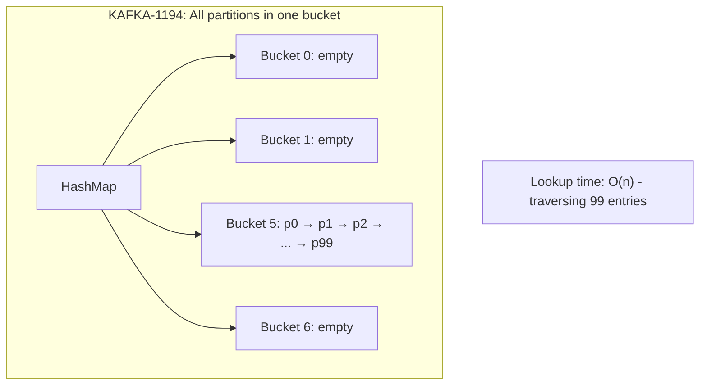

## Table of Contents

> "equals() is just 3 lines of code. How did it cause $500,000 in duplicate payments?"

---

## Introduction

In my second year as a developer, I was assigned to the payment system for the first time. "Just store payment info in a HashMap and check for duplicates, easy enough," I thought. Then, at 11 AM on Black Friday, PagerDuty woke me up.

**"Duplicate payment detected for the same order."**

Honestly, I initially thought it was a network timeout issue. I assumed retries after failed requests caused the duplicates. But looking at the logs, `processedPayments.contains(paymentId)` was returning **false**. Even though we had processed the exact same order just a minute ago.

It took me 4 hours to find the root cause. The reason I'm writing this is so that you can spot this problem in **4 minutes**, not 4 hours. And for those who, like me, were once confined to their own bubble, I'll also share how Apache Kafka developers prevented the same mistake.

---

## 1. The Incident: A Friday in November

### Situation

- **Time**: Friday, 11:00 AM (lunch order peak starting)
- **Service**: Payment processing system
- **Traffic**: 5x normal (3,000 TPS)
- **Symptom**: Same order ID charged twice

### Timeline

```
11:00 - Traffic surge begins
11:12 - First duplicate payment alert (CS team received)
        "Customer says they were charged twice for the same order"
11:15 - 5 duplicate payment reports simultaneously
11:18 - Dev team emergency call
11:23 - Payment service emergency maintenance mode
        → Payment stopped during lunch peak, revenue loss
11:45 - Root cause identified: PaymentId.equals() implementation error
        → Specifically: hashCode() not overridden
12:10 - Hotfix deployed
12:30 - Service restored
```

### Impact

- **Duplicate payments**: 127 cases
- **Refund processing cost**: 3 CS staff × 8 hours
- **Service downtime**: 1 hour 7 minutes (peak lunch time)
- **Trust damage**: Immeasurable (but the most painful)

Initially, I thought it was a network issue. Timeouts causing retries and duplicates. But looking closer at the logs, something was off:

```
11:12:34 - PaymentId{orderId='ORD-2024112200127', merchantId='M001'} payment processing started
11:12:34 - processedPayments.contains() = false  // ???
11:12:35 - Payment approved
```

We had already processed the same order a minute ago, yet `contains()` returned **false**.

---

## 2. The Root Cause: Breaking the equals() and hashCode() Contract

### The Problematic Code

Here's the `PaymentId` class I wrote back then. Embarrassing to look at now, but I'll share it:

```java
public class PaymentId {
    private final String orderId;
    private final String merchantId;

    public PaymentId(String orderId, String merchantId) {
        this.orderId = orderId;
        this.merchantId = merchantId;
    }

    // Getters omitted

    @Override
    public boolean equals(Object obj) {
        if (this == obj) return true;
        if (obj == null || getClass() != obj.getClass()) return false;
        PaymentId other = (PaymentId) obj;
        return Objects.equals(orderId, other.orderId)
            && Objects.equals(merchantId, other.merchantId);
    }

    // hashCode() NOT overridden - THIS IS THE PROBLEM!
}
```

The duplicate payment prevention logic looked like this:

```java
// ⚠️ This code has THREE problems (don't copy this!):
// 1. hashCode() not overridden — the main topic of this post
// 2. HashSet is not thread-safe — use ConcurrentHashMap.newKeySet()
// 3. check-then-act race condition — use add-first pattern
public class PaymentProcessor {
    // ❌ WRONG: HashSet is not thread-safe
    private final Set<PaymentId> processedPayments = new HashSet<>();

    public boolean processPayment(PaymentId paymentId, Money amount) {
        // ❌ WRONG: Another thread can interleave between contains → execute → add
        if (processedPayments.contains(paymentId)) {
            log.warn("Duplicate payment detected: {}", paymentId);
            return false;
        }

        // Process payment
        boolean success = executePayment(paymentId, amount);
        if (success) {
            processedPayments.add(paymentId);
        }
        return success;
    }
}
```

At first glance, it looks fine. `equals()` is properly implemented, and we're using `HashSet` for duplicate checking.

> **⚠️ Warning**: The code above is an **intentionally incorrect example**.
>
> | Problem | Correct Solution |
> |---------|------------------|
> | hashCode() not overridden | Override hashCode() when overriding equals() |
> | Using HashSet | Use `ConcurrentHashMap.newKeySet()` |
> | check-then-act pattern | Use add-first pattern for atomic insertion |
>
> See the "Thread Safety" section below for correct implementation.

> **Additional Issue: Thread Safety — Is switching to ConcurrentHashSet enough?**
>
> Beyond the hashCode problem, this code has another issue. `HashSet` is not thread-safe. But more importantly, **switching to `ConcurrentHashMap.newKeySet()` still isn't safe**.
>
> The problem is that the `contains()` → `executePayment()` → `add()` sequence is **not atomic**:
>
> ```java
> // Dangerous pattern (Race Condition)
> if (processedPayments.contains(paymentId)) {  // Thread A, B both see false
>     return false;
> }
> executePayment(paymentId, amount);             // Thread A, B both execute!
> processedPayments.add(paymentId);              // Too late
> ```
>
> If two threads call `contains()` simultaneously, both see "absent," and both execute the payment.
>
> **Correct Pattern — Atomic insert then execute (add-first)**:
>
> ```java
> // Must use thread-safe Set
> private final Set<PaymentId> processedPayments = ConcurrentHashMap.newKeySet();
>
> public boolean processPayment(PaymentId paymentId, Money amount) {
>     // Safe pattern: if add() returns false, it already exists
>     if (!processedPayments.add(paymentId)) {  // Atomic check-and-insert
>         log.warn("Duplicate payment detected: {}", paymentId);
>         return false;
>     }
>
>     // If we reach here, only this thread can process the payment
>     boolean success = false;
>     try {
>         success = executePayment(paymentId, amount);
>         return success;
>     } catch (Exception e) {
>         // Remove on exception to allow retry
>         processedPayments.remove(paymentId);
>         throw e;
>     } finally {
>         // Also remove on failure (false return) to allow retry
>         if (!success) {
>             processedPayments.remove(paymentId);
>         }
>     }
> }
> ```
>
> `ConcurrentHashMap.newKeySet().add()` is **atomic**. If it already exists, it returns `false`, so only the thread that "claims the spot" first can execute the payment.
>
> **⚠️ Key Point of add-first Pattern — Always cleanup on failure**:
>
> The important thing to note is that if `executePayment()` **fails in any way** (exception or `false` return), you must call `remove()`. Otherwise, the paymentId stays in the Set, **blocking retries forever**.
>
> - **Exception thrown**: `remove()` in catch block, then rethrow
> - **false returned**: Check `success` flag in finally block to cleanup
>
> **In production?** Memory-based Sets lose data on server restart and don't work in distributed environments. In practice, use **DB unique constraints**, **Redis SETNX**, or **Idempotency Key** patterns.
>
> External idempotency stores allow **explicit "processing"/"success"/"failed" state management** for safer retry handling:
>
> ```java
> // Redis-based idempotency pattern (conceptual example)
> public boolean processPayment(PaymentId paymentId, Money amount) {
>     String status = redis.get(paymentId);
>     if ("SUCCESS".equals(status)) {
>         return false;  // Already successful payment
>     }
>     if ("PROCESSING".equals(status)) {
>         return false;  // Another thread/server is processing
>     }
>
>     // Claim "processing" state with SETNX (includes TTL)
>     if (!redis.setNx(paymentId, "PROCESSING", Duration.ofMinutes(5))) {
>         return false;  // Another request claimed it first
>     }
>
>     try {
>         boolean success = executePayment(paymentId, amount);
>         redis.set(paymentId, success ? "SUCCESS" : "FAILED");
>         return success;
>     } catch (Exception e) {
>         redis.delete(paymentId);  // Cleanup to allow retry
>         throw e;
>     }
> }
> ```
>
> This post focuses on the hashCode issue for simplicity, but concurrency and distributed environments must also be considered.

### Re-reading Object.hashCode() JavaDoc

```
If two objects are equal according to the equals(Object) method,
then calling the hashCode method on each of the two objects
must produce the same integer result.
```

**Two objects that return true from equals() must have the same hashCode().**

But I didn't override `hashCode()`. In this case, `Object.hashCode()` is used, which generates a hash code based on **object identity** (a unique value that remains constant during the object's lifetime). To be precise, the JVM implementation may use memory address, but the spec only guarantees "a consistent value for the same object."

### My Mistake: Not Understanding HashMap Internals





**Key insight**: HashSet first uses `hashCode()` to find the bucket, then only compares `equals()` within that bucket.

When two `PaymentId` objects with the same logical value are created:

1. Each has a different `hashCode()` value (using `Object.hashCode()`)
2. Stored in different buckets
3. `contains()` searches the wrong bucket
4. **equals() comparison never even happens** — returns "not found"
5. **Duplicate payment occurs!**

At the time, I didn't properly understand HashMap's internal structure. I thought "just implementing equals() correctly would be enough." Now I realize this is covered in the first chapter of every Java book.

---

## 3. How Open Source Solved It: Analyzing Kafka TopicPartition

Was I the only one who made this mistake? Looking through Apache Kafka's commit history, I found traces of similar struggles.

### Kafka's TopicPartition Implementation

In Kafka, `TopicPartition` is a value object combining topic name and partition number. It's used as a HashMap key when consumers track "which partition of which topic they're processing."

**File**: `clients/src/main/java/org/apache/kafka/common/TopicPartition.java`

```java
public final class TopicPartition implements Serializable {
    private final int partition;
    private final String topic;

    // hashCode caching - performance optimization
    private int hash = 0;

    public TopicPartition(String topic, int partition) {
        this.partition = partition;
        this.topic = topic;
    }

    @Override
    public int hashCode() {
        if (hash != 0)
            return hash;
        final int prime = 31;
        int result = prime + partition;
        result = prime * result + Objects.hashCode(topic);
        return this.hash = result;
    }

    @Override
    public boolean equals(Object obj) {
        if (this == obj)
            return true;
        if (obj == null)
            return false;
        if (getClass() != obj.getClass())
            return false;
        TopicPartition other = (TopicPartition) obj;
        return partition == other.partition
            && Objects.equals(topic, other.topic);
    }
}
```

### Lessons from Kafka

1. **Immutable fields**: `partition` and `topic` are `final` — hashCode never changes
2. **HashCode caching**: Result stored in `hash` field (safe because object is immutable)
3. **Consistent field usage**: Both `equals()` and `hashCode()` use the same fields (`topic`, `partition`)
4. **Null-safe comparison**: Uses `Objects.hashCode()` and `Objects.equals()`

> **Note**: Kafka's caching pattern uses `0` as a sentinel value. If the computed hashCode happens to be exactly `0`, it will be recalculated every time. This is rare in practice (e.g., empty topic string with partition 0), but be aware of this trade-off when copying this pattern. String class uses the same approach, and since strings with hashCode 0 are extremely rare, it's rarely a practical issue.

### Real Bug Case: KAFKA-1194

Kafka made similar mistakes early on. Looking at [KAFKA-1194](https://issues.apache.org/jira/browse/KAFKA-1194):

> "TopicAndPartition hashCode returned a constant value, causing all partitions to hash to the same bucket."

**All objects landing in the same bucket degraded O(1) lookup to O(n)**.



In a cluster with 10,000 partitions, consumer assignment logic took **several seconds**. A case where "it works but" performance was catastrophically degraded.

### Why Did Kafka Developers Implement hashCode() This Way?

```java
// Kafka TopicPartition.hashCode()
@Override
public int hashCode() {
    if (hash != 0)          // Reuse cached value if available
        return hash;
    final int prime = 31;   // Why 31?
    int result = prime + partition;
    result = prime * result + Objects.hashCode(topic);
    return this.hash = result;
}
```

**Why 31?**

- 31 is odd and prime
- `31 * i` optimizes to `(i << 5) - i` (JVM does this automatically)
- Recommended by Joshua Bloch in Effective Java Item 11

**Why caching?**:

- `TopicPartition` is immutable, so hashCode never changes
- Performance benefit when HashMap lookups are frequent
- Trade-off: 4 extra bytes of memory

---

## 4. Reproducing the Bug

Here's code to reproduce the bug I experienced. Copy and run it yourself.

```java
import java.util.HashSet;
import java.util.Objects;
import java.util.Set;

public class HashCodeBugDemo {

    // Buggy version: hashCode() not overridden
    static class BuggyPaymentId {
        private final String orderId;

        public BuggyPaymentId(String orderId) {
            this.orderId = orderId;
        }

        @Override
        public boolean equals(Object obj) {
            if (this == obj) return true;
            if (obj == null || getClass() != obj.getClass()) return false;
            BuggyPaymentId other = (BuggyPaymentId) obj;
            return Objects.equals(orderId, other.orderId);
        }
        // hashCode() missing!
    }

    // Fixed version
    static class FixedPaymentId {
        private final String orderId;

        public FixedPaymentId(String orderId) {
            this.orderId = orderId;
        }

        @Override
        public boolean equals(Object obj) {
            if (this == obj) return true;
            if (obj == null || getClass() != obj.getClass()) return false;
            FixedPaymentId other = (FixedPaymentId) obj;
            return Objects.equals(orderId, other.orderId);
        }

        @Override
        public int hashCode() {
            return Objects.hash(orderId);
        }
    }

    public static void main(String[] args) {
        System.out.println("=== Bug Reproduction: Why Did Duplicate Payments Happen ===\n");

        // Test buggy version
        Set<BuggyPaymentId> buggySet = new HashSet<>();
        BuggyPaymentId buggy1 = new BuggyPaymentId("ORDER-001");
        BuggyPaymentId buggy2 = new BuggyPaymentId("ORDER-001"); // Same order

        System.out.println("[BuggyPaymentId]");
        System.out.println("buggy1.hashCode(): " + buggy1.hashCode());
        System.out.println("buggy2.hashCode(): " + buggy2.hashCode());
        System.out.println("→ Different hashCodes! Going to different buckets.\n");

        buggySet.add(buggy1);
        System.out.println("buggy1.equals(buggy2): " + buggy1.equals(buggy2)); // true
        System.out.println("buggySet.contains(buggy2): " + buggySet.contains(buggy2)); // false!
        System.out.println("→ equals() returns true but contains() returns false!");
        System.out.println("→ Duplicate payment can occur!\n");

        // Test fixed version
        Set<FixedPaymentId> fixedSet = new HashSet<>();
        FixedPaymentId fixed1 = new FixedPaymentId("ORDER-001");
        FixedPaymentId fixed2 = new FixedPaymentId("ORDER-001");

        System.out.println("[FixedPaymentId]");
        System.out.println("fixed1.hashCode(): " + fixed1.hashCode());
        System.out.println("fixed2.hashCode(): " + fixed2.hashCode());
        System.out.println("→ Same hashCode! Going to the same bucket.\n");

        fixedSet.add(fixed1);
        System.out.println("fixed1.equals(fixed2): " + fixed1.equals(fixed2)); // true
        System.out.println("fixedSet.contains(fixed2): " + fixedSet.contains(fixed2)); // true!
        System.out.println("→ Duplicate payment prevention works correctly!");
    }
}
```

### Output

```
=== Bug Reproduction: Why Did Duplicate Payments Happen ===

[BuggyPaymentId]
buggy1.hashCode(): 1456208737
buggy2.hashCode(): 288665596
→ Different hashCodes! Going to different buckets.

buggy1.equals(buggy2): true
buggySet.contains(buggy2): false
→ equals() returns true but contains() returns false!
→ Duplicate payment can occur!

[FixedPaymentId]
fixed1.hashCode(): 1965735362
fixed2.hashCode(): 1965735362
→ Same hashCode! Going to the same bucket.

fixed1.equals(fixed2): true
fixedSet.contains(fixed2): true
→ Duplicate payment prevention works correctly!
```

Running this code makes the problem immediately visible. `BuggyPaymentId` can't be found in the HashSet despite being the same order.

---

## 5. Correct Implementation

### Architecture Decision Record (ADR)

Here's the ADR our team wrote after the incident:

```
## Context
Need to use payment IDs as keys in HashMap/HashSet.
Duplicate payment prevention is a core requirement.

## Decision
- Override both equals() and hashCode() together
- Design as immutable objects (all fields final)
- Fields used in hashCode() must also be used in equals()

## Consequences
### Advantages
- HashMap-based duplicate checking works correctly
- hashCode caching is safe due to immutability

### Disadvantages
- Both methods must be updated when adding new fields
- Must always check during code review

### Risks
- Including mutable fields in hashCode can cause data loss
- equals symmetry can break in inheritance hierarchies
```

### Recommended Implementation (by JDK Version)

#### JDK 8-15 (Reality for many enterprises)

```java
public class PaymentId {
    private final String orderId;
    private final String merchantId;

    public PaymentId(String orderId, String merchantId) {
        this.orderId = Objects.requireNonNull(orderId, "orderId must not be null");
        this.merchantId = Objects.requireNonNull(merchantId, "merchantId must not be null");
    }

    public String getOrderId() {
        return orderId;
    }

    public String getMerchantId() {
        return merchantId;
    }

    @Override
    public boolean equals(Object obj) {
        if (this == obj) return true;
        if (obj == null || getClass() != obj.getClass()) return false;
        PaymentId other = (PaymentId) obj;
        return Objects.equals(orderId, other.orderId)
            && Objects.equals(merchantId, other.merchantId);
    }

    @Override
    public int hashCode() {
        return Objects.hash(orderId, merchantId);
    }

    @Override
    public String toString() {
        return "PaymentId{orderId='" + orderId + "', merchantId='" + merchantId + "'}";
    }
}
```

#### JDK 16+ (New projects, startups)

```java
public record PaymentId(String orderId, String merchantId) {
    public PaymentId {
        Objects.requireNonNull(orderId, "orderId must not be null");
        Objects.requireNonNull(merchantId, "merchantId must not be null");
    }
}
// equals(), hashCode(), toString() automatically generated!
```

Using `record` lets the compiler automatically generate `equals()`, `hashCode()`, and `toString()`. No room for mistakes.

---

## 6. Why Senior Interviewers Ask This Question

When big tech companies ask "Explain how HashMap works" in interviews, they're not testing your memorization skills.

**What they're actually evaluating:**

| Evaluation Criteria | How to Verify |
|---------------------|---------------|
| Ability to connect abstraction to implementation | Explain why equals/hashCode are needed |
| Understanding of performance trade-offs | Explain O(1) → O(n) degradation on hash collision |
| Ability to predict real-world bugs | What symptoms occur when hashCode isn't implemented |

### Answer Comparison

**Junior answer (memorized):**

> "hashCode() is used when storing objects in hash tables. equals() and hashCode() must be overridden together."

**Senior answer (experience-based):**

> "HashMap selects buckets using hashCode and does final matching with equals, so both must be overridden.
>
> In one of my projects, I only overrode equals for OrderId and forgot hashCode, which caused a duplicate payment incident.
>
> Looking at Kafka's TopicPartition class, they design with immutable fields and cache the hashCode.
> The hashCode caching is for calculating once and reusing for performance."

What interviewers want to hear isn't textbook content, but **"Have you actually used this concept?"**

### Common Follow-up Questions

**Q: If hashCode() is the same, is equals() also true?**

A: No. hashCode can be the same while equals is false (hash collision).
However, **if equals is true, hashCode must be the same.** This is the contract.

```java
// Hash collision example
"Aa".hashCode() == "BB".hashCode()  // true (both are 2112)
"Aa".equals("BB")                    // false
```

**Q: What happens if you include mutable fields in hashCode?**

A: If you change a field after storing in HashMap, the hashCode changes and searches a different bucket.
The object in the original bucket can't be found, causing **data loss**.

---

## 7. Common Mistakes Catalog

### Mistake 1: Only overriding equals()

The most common mistake. Don't ignore IDE warnings.

```java
// IntelliJ warning:
// Class 'PaymentId' overrides 'equals()' but doesn't override 'hashCode()'
```

**Solution**: `Alt+Enter` → Select "Generate hashCode()"

### Mistake 2: Including mutable fields in hashCode()

```java
public class MutableKey {
    private String name;  // Mutable!

    public void setName(String name) {
        this.name = name;
    }

    @Override
    public int hashCode() {
        return Objects.hash(name);  // Dangerous!
    }

    @Override
    public boolean equals(Object obj) {
        // ... name-based comparison
    }
}

// Problem when using
Map<MutableKey, String> map = new HashMap<>();
MutableKey key = new MutableKey();
key.setName("original");
map.put(key, "value");

key.setName("changed");  // hashCode changes!
map.get(key);  // Returns null! Data lost
```

**Solution**: Only use immutable fields in hashCode() calculation, or design the class as immutable.

### Mistake 3: Violating equals() symmetry in inheritance

```java
public class Point {
    private final int x, y;

    @Override
    public boolean equals(Object obj) {
        if (!(obj instanceof Point)) return false;
        Point other = (Point) obj;
        return x == other.x && y == other.y;
    }
}

public class ColorPoint extends Point {
    private final Color color;

    @Override
    public boolean equals(Object obj) {
        if (!(obj instanceof ColorPoint)) return false;
        ColorPoint other = (ColorPoint) obj;
        return super.equals(obj) && color.equals(other.color);
    }
}
```

This implementation **violates symmetry**:

```java
Point p = new Point(1, 2);
ColorPoint cp = new ColorPoint(1, 2, Color.RED);

p.equals(cp);  // true (coordinates match from Point's perspective)
cp.equals(p);  // false (instanceof ColorPoint fails)
```

**Solution**: Composition over inheritance, or use `getClass()` comparison

```java
// Using getClass() - stricter comparison
@Override
public boolean equals(Object obj) {
    if (obj == null || getClass() != obj.getClass()) return false;
    // ...
}
```

---

## 8. How I Found This Case: Git Archaeology

Let me share how I found these bugs in open source. Try it yourself.

### Finding Bugs in Open Source

```bash
# 1. Clone Kafka repository
git clone https://github.com/apache/kafka.git
cd kafka

# 2. Find hashCode-related bug fixes
git log --all --oneline --grep="hashCode" | head -20

# 3. Find commits where equals and hashCode were modified together
git log --all --oneline -S "hashCode" -S "equals" -- "*.java" | head -10

# 4. Track equals/hashCode changes in a specific file
git log -p --follow -- clients/src/main/java/org/apache/kafka/common/TopicPartition.java

# 5. Find bug-related commit messages
git log --all --grep="fix.*hashCode" -i --oneline
```

### Finding Related Issues in JIRA

1. Go to [Apache Kafka JIRA](https://issues.apache.org/jira/projects/KAFKA)
2. Search for "hashCode equals"
3. Analyze bug reports and resolution processes

This is how I found KAFKA-1194. You can see the actual commits, code changes, and resolution process.

### Why Git Archaeology?

- **Verifiable**: Can check directly via GitHub links
- **Learning value**: See actual bug fix processes
- **Even experts make mistakes**: Comfort(?) that Kafka developers made the same mistakes

---

## 9. Performance Considerations

### Effect of hashCode() Caching

If the object is immutable, you can cache hashCode(). Like Kafka's TopicPartition:

```java
public class CachedHashCodeExample {
    private final String id;
    private int hashCode;  // Cache

    public CachedHashCodeExample(String id) {
        this.id = id;
    }

    @Override
    public int hashCode() {
        int h = hashCode;
        if (h == 0 && id != null) {
            h = id.hashCode();
            hashCode = h;
        }
        return h;
    }
}
```

**Note**: The `String` class uses this same approach. But in general cases, `Objects.hash()` is sufficient. **Only consider caching when profiling confirms it's a bottleneck.**

### Objects.hash() vs Manual Hashing

`Objects.hash()` is convenient but has trade-offs:

```java
// Method 1: Objects.hash() - Simple but has overhead
@Override
public int hashCode() {
    return Objects.hash(orderId, merchantId);  // Internally creates array
}

// Method 2: Manual hashing - Faster but more code
@Override
public int hashCode() {
    int result = 31 + (orderId == null ? 0 : orderId.hashCode());
    result = 31 * result + (merchantId == null ? 0 : merchantId.hashCode());
    return result;
}

// Method 3: Kafka-style caching - Only for hot paths
private int hash = 0;
@Override
public int hashCode() {
    if (hash != 0) return hash;
    // Calculate and cache...
}
```

| Method | Pros | Cons | When to Use |
|--------|------|------|-------------|
| `Objects.hash()` | Concise, prevents mistakes | varargs array allocation overhead | Most cases (recommended) |
| Manual hashing | No overhead | Complex code, error-prone | When profiling confirms bottleneck |
| Caching | Optimal for repeated calls | 4 bytes extra memory, hash=0 edge case | Immutable objects + frequent HashMap lookups |

**Practical choice**: Use `Objects.hash()` for most projects, and only consider optimization when profiling shows hashCode() as a hot path. Premature optimization by copying Kafka-style can lead to missing the hash=0 edge case.

### When to Optimize?

**Measure first, optimize later**:

1. **Profiling**: Use JProfiler, VisualVM to check if hashCode() is a hot path
2. **Frequency check**: Is this object accessed in HashMap tens of thousands of times per second?
3. **Cost calculation**: hashCode() computation cost vs memory cost (cache field)

`Objects.hash()` is sufficient in most cases. Avoid premature optimization.

---

## 10. Enterprise Environment Considerations

### JDK Version Constraints

Estimated JDK usage across enterprises in 2025 (unofficial):

| Enterprise Type | JDK 8 | JDK 11 | JDK 17+ |
|-----------------|-------|--------|---------|
| Big Tech | 8% | 35% | 57% |
| Series B-C Startups | 22% | 48% | 30% |
| Traditional/Financial | 68% | 28% | 4% |

**All code in this post works on JDK 8+.** Only the `record` class example requires JDK 16+.

### Why the Fast Migration to JDK 17+?

- **JDK 11 LTS end of support**: September 2026 (coming soon)
- **Spring Boot 3.x**: Requires Java 17+
- **JDK 17 LTS support**: Until 2029 (longest support period)

### When Using Lombok

Many enterprises use Lombok. Using `@Data` or `@EqualsAndHashCode` generates them automatically:

```java
@Value  // Immutable object + auto-generated equals/hashCode
public class PaymentId {
    String orderId;
    String merchantId;
}
```

**Caution**: Using `@EqualsAndHashCode(callSuper = true)` can cause inheritance symmetry issues.

### Applying in Internal Code Reviews

When applying to large legacy codebases:

1. **Gradual adoption**: Apply to new code first, manage legacy as separate tasks
2. **Enable static analysis tools**: Add SpotBugs `HE_EQUALS_NO_HASHCODE` rule to CI/CD
3. **Team sharing**: Add this post's "Code Review Checklist" to team wiki

---

## 11. Code Review Checklist

Items to check during code review. Add to your team wiki:

```markdown
### equals/hashCode Review Checklist

- [ ] **When equals() is overridden, is hashCode() also overridden?**
- [ ] **Are fields used in hashCode() also used in equals()?**
- [ ] **Is this class used as a key in HashMap/HashSet?**
- [ ] **Are mutable fields excluded from hashCode() calculation?**
- [ ] **Is null handling consistent?**
- [ ] **Are there unit tests? (especially equals symmetry/transitivity)**
```

### SpotBugs Rule

```xml
<!-- spotbugs-include.xml -->
<Match>
    <Bug pattern="HE_EQUALS_NO_HASHCODE"/>
</Match>
```

Enabling this rule in CI/CD catches issues before deployment.

### Finding Potential Bugs in Your Project

```bash
# Find equals implementations in project
git grep -n "public boolean equals" src/

# Find files with equals but without hashCode (more accurate)
for file in $(git grep -l "public boolean equals" src/); do
  # Check if file contains hashCode override
  if ! grep -q "public int hashCode" "$file"; then
    echo "[WARNING] hashCode missing: $file"
  fi
done

# Or one-liner:
# Print files that have equals but no hashCode
for file in $(git grep -l "public boolean equals" src/); do
  grep -q "public int hashCode" "$file" || echo "$file"
done
```

> **More robust approach**: The scripts above are for quick checks. For production codebases, **adding SpotBugs' `HE_EQUALS_NO_HASHCODE` rule to CI/CD** is more reliable. Scripts can miss inner classes, anonymous classes, or complex inheritance structures.

---

## 12. Summary

### Key Lessons

1. **Always override hashCode() when overriding equals()** — It's a contract
2. **Both methods must use the same fields** — Maintain consistency
3. **Exclude mutable fields from hashCode() calculation** — Prevent data loss
4. **Leverage IDE warnings and static analysis tools** — Automated safety net
5. **Consider record classes on JDK 16+** — Eliminate mistakes at the source

### What I Learned

- Not understanding HashMap internals leads to unexpected bugs
- Even open source like Kafka made the same mistake and fixed it
- Git archaeology allows learning from real bugs and their fixes
- Code review checklists and static analysis can prevent issues proactively

### Next Post Preview

**[Topic 2: How Immutable Objects Saved a Concurrency Bug — Shopping Cart Amount Mismatch During Order Rush]**

Even with working equals/hashCode, sharing mutable objects across threads starts another disaster. I experienced an incident where shopping cart amounts became $0 during lunch peak time.

---

## 13. References

### Official Documentation
- [Object.hashCode() JavaDoc](https://docs.oracle.com/en/java/javase/17/docs/api/java.base/java/lang/Object.html#hashCode())
- [Effective Java Item 11: Always override hashCode when you override equals](https://www.oreilly.com/library/view/effective-java-3rd/9780134686097/)

### Open Source Code
- [Kafka TopicPartition.java](https://github.com/apache/kafka/blob/trunk/clients/src/main/java/org/apache/kafka/common/TopicPartition.java)
- [Guava Objects.hashCode()](https://github.com/google/guava/blob/master/guava/src/com/google/common/base/Objects.java)
- [OpenJDK HashMap Implementation](https://github.com/openjdk/jdk/blob/master/src/java.base/share/classes/java/util/HashMap.java)

### Related Issues
- [KAFKA-1194: TopicAndPartition hashCode issue](https://issues.apache.org/jira/browse/KAFKA-1194)

---

*This post is reconstructed based on real experiences. Specific company names and figures have been changed.*

*For questions or feedback, please leave a GitHub Issue.*
