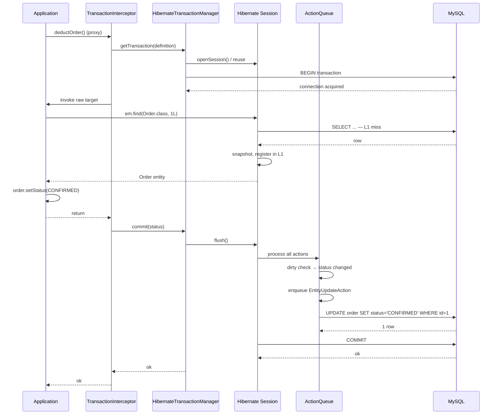

## Table of contents

## Preface {#intro}

I'd already measured raw JDBC against five JPA variants (method name / `@Query` JPQL / Native SQL / QueryDSL / JdbcTemplate) running the same SELECT against `orders_w2` (10M rows) — `state='CONFIRMED' ORDER BY created_at DESC LIMIT 20`, same index, same LIMIT. The numbers:

| Method | avg(ms) (warm) | p99(ms) |
|---|---|---|
| **raw JDBC + JdbcTemplate** | **0.736** ⭐ | 1.018 |
| Spring Data JPA — derived method name | 0.994 | 1.467 |
| Spring Data JPA — `@Query` JPQL | 0.856 | 3.558 |
| Spring Data JPA — Native SQL | 0.980 | 1.439 |
| QueryDSL — Q-class | 0.908 | 1.539 |

The gap between raw JDBC (0.74 ms) and JPA Native SQL (0.98 ms) is roughly **+0.4 ms**. Same SQL, same rows, same LIMIT — the difference isn't *server-side* (DB latency); it's the *client-side* cost of mapping a row into an entity object and registering it with JPA's lifecycle.

What is that +0.4 ms, and where does it come from? **PersistenceContext.** JPA materializes rows into entities, registers them in the *first-level cache*, takes a *snapshot* for dirty checking, and registers *transaction-synchronization hooks*. At 1M calls/day, that's about 6.7 minutes of cumulative latency.

You can't simply remove that cost — JPA's whole model rests on PersistenceContext. You can either *not use JPA* or *trim* it (e.g., set `readOnly = true` to disable dirty checking). Kakao Pay reported a measurable case in [JPA Transactional 잘 알고 쓰고 계신가요?](https://tech.kakaopay.com/post/jpa-transactional-bri/) — turning on `readOnly` cut MySQL `Com_set_option` round-trips and lifted QPS by 58%.

This article walks the PersistenceContext from *Identity Map* (Fowler PoEAA, 2002) through *ActionQueue* (4 lists), *AutoFlush*, and *Dirty Checking* (reflection vs bytecode enhancement) — citing Hibernate 6 source. On top of that I unpack Kakao Pay's `readOnly + set_option` report into its three real layers: Hibernate flush mode, Spring transaction marker, and MySQL `Com_set_option` round-trips.

1. **PersistenceContext = Identity Map** — Fowler PoEAA's pattern
2. **EntityManager vs Hibernate Session** — the limits of the JPA standard
3. **The four ActionQueues** — SQL emission ordering for INSERT / UPDATE / DELETE / collection
4. **AutoFlush** — exactly what triggers a flush before a query
5. **Two dirty-checking strategies** — reflection (default) vs bytecode enhancement
6. **One pass through the transaction lifecycle** — BEGIN → flush → COMMIT
7. **`readOnly`'s three-layer effect** — Hibernate / Spring / MySQL, with the Kakao Pay incident as case study
8. **Decomposing the +0.4 ms baseline** — where the cost lives, line by line
9. **Operations checklist**

The headline:

- **The L1 cache is *Identity Map (Fowler 2002) + Unit of Work* in code** — same ID inside one transaction returns the *same Java object*.
- **Dirty checking's *real* cost is *reflection*** — bytecode enhancement turns it into an interceptor pattern with materially smaller overhead.
- **AutoFlush is selective** — it flushes only entities that *could affect* the query you're about to run, not the entire queue.
- **`readOnly = true` has a three-layer effect** — (1) Hibernate's flush mode flips, (2) Spring records a tx marker, (3) MySQL's `Com_set_option` round-trips drop. Kakao Pay's QPS +58% is layer 3.
- **The JPA +0.4 ms baseline** is the sum of: entity hydration + L1 cache registration + snapshot creation + sync-hook registration. At 1 M calls/day that's ~6.7 minutes/day of cumulative latency.

The shorthand "L1 cache is fast, so it's good" is the half answer. Below is the rest of it, line by line.

---

## 1. PersistenceContext = Identity Map (Fowler PoEAA, 2002) {#identity-map}

### 1.1 The pattern

[Fowler's *Patterns of Enterprise Application Architecture* (2002)](https://martinfowler.com/eaaCatalog/identityMap.html) defines Identity Map as:

> "An Identity Map keeps a record of all objects that have been read from the database in a single business transaction. Whenever you want an object, you check the Identity Map first to see if you already have it."
> — Martin Fowler, *Patterns of Enterprise Application Architecture*, 2002

So:

1. Within **a single business transaction**,
2. **every object read from the database** is
3. **kept in a Map**, so that
4. a subsequent lookup by the same ID **returns the same Java object**.

That is exactly what JPA's PersistenceContext is. `EntityManager` carries a `Map<EntityKey, Object>` first-level cache; calling `findById(1L)` twice in the same transaction returns the same Java object.

### 1.2 Java-level identity guarantee

```java
@Transactional
public void example() {
    Order o1 = repo.findById(1L);  // first read — DB
    Order o2 = repo.findById(1L);  // second — L1 hit

    assertThat(o1).isSameAs(o2);   // ✅ same object (==)
}
```

In Fowler's framing: *"object identity within a business transaction"*. Break the guarantee — get *two different objects for the same ID* — and changes on one won't reflect on the other (a *split entity* class of bug).

### 1.3 Pairing with Unit of Work

Identity Map travels with another Fowler pattern: *Unit of Work*.

> "A Unit of Work keeps track of everything you do during a business transaction that can affect the database. When you're done, it figures out everything that needs to be done to alter the database as a result of your work."
> — Fowler, PoEAA

So Unit of Work tracks *every change* during the transaction and flushes them as one batch at commit time.

JPA's PersistenceContext implements *both*:

- **L1 cache (Identity Map)** — same-ID identity guarantee
- **ActionQueue (Unit of Work)** — INSERT / UPDATE / DELETE change tracking

The combination is JPA's runtime model.

### 1.4 L1 cache hit / miss in practice

```java
@Transactional
public void cacheBehavior() {
    Order o1 = repo.findById(1L);  // miss → SELECT
    Order o2 = repo.findById(1L);  // hit → cache (no SQL)

    em.clear();                      // wipe L1

    Order o3 = repo.findById(1L);  // miss → SELECT
    assertThat(o1).isNotSameAs(o3);  // different identity (cache cleared)
}
```

`em.clear()`, `em.detach(o1)`, or transaction termination empties the L1 cache. **PersistenceContext lifetime = transaction lifetime.**

---

## 2. EntityManager vs Hibernate Session — limits of the JPA spec {#em-vs-session}

### 2.1 The JPA-spec abstraction

JPA 2.2 (JSR 338)'s `EntityManager` is the vendor-neutral standard:

```java
public interface EntityManager {
    void persist(Object entity);          // INSERT
    <T> T find(Class<T> entityClass, Object primaryKey);  // SELECT
    <T> T merge(T entity);                // UPDATE (detached → managed)
    void remove(Object entity);            // DELETE
    void flush();                           // force flush
    void clear();                           // wipe L1
    void detach(Object entity);             // detach one entity
    Query createQuery(String jpql);
    // ...
}
```

It's enough that *in theory* you can swap providers (Hibernate, EclipseLink, DataNucleus). In *practice* most production code reaches for vendor-specific features and the abstraction leaks.

### 2.2 Hibernate `Session` — what it adds

The [Hibernate User Guide](https://docs.jboss.org/hibernate/orm/current/userguide/html_single/Hibernate_User_Guide.html) defines `Session` as a subtype of `EntityManager` with extras:

```java
public interface Session extends EntityManager {
    void replicate(Object entity, ReplicationMode replicationMode);
    void update(Object entity);             // saveOrUpdate
    void saveOrUpdate(Object entity);
    Statistics getStatistics();
    Filter enableFilter(String filterName);
    // ...
}
```

In production those extras matter often enough — features like `setFlushMode(FlushMode.MANUAL)` aren't part of the JPA spec — that vendor neutrality stays a design ideal. When you need them, `EntityManager#unwrap(Session.class)` gets you a `Session`.

### 2.3 Why this article says "PersistenceContext"

From here on, when we mean *the shared data structure inside `EntityManager` / `Session`*, we use the term **PersistenceContext**. Hibernate's source uses the same name:

```java
// hibernate-core/src/main/java/org/hibernate/engine/spi/PersistenceContext.java
public interface PersistenceContext {
    void addEntity(EntityKey key, Object entity);
    Object getEntity(EntityKey key);
    EntityEntry getEntry(Object entity);
    void clear();
    // ...
}
```

The default impl is [`StatefulPersistenceContext`](https://github.com/hibernate/hibernate-orm/blob/main/hibernate-core/src/main/java/org/hibernate/engine/internal/StatefulPersistenceContext.java) — it holds the entity-by-EntityKey map, `EntityEntry` (per-entity metadata), collection-by-key, and so on.

---

## 3. The four ActionQueues — INSERT / UPDATE / DELETE emission order {#action-queue}

### 3.1 ActionQueue's data shape

Where does the PersistenceContext put modified entities while it's acting as a Unit of Work? Hibernate's [`ActionQueue`](https://github.com/hibernate/hibernate-orm/blob/main/hibernate-core/src/main/java/org/hibernate/engine/spi/ActionQueue.java):

```java
// hibernate-core/src/main/java/org/hibernate/engine/spi/ActionQueue.java
public class ActionQueue {
    private ExecutableList<AbstractEntityInsertAction> insertions;
    private ExecutableList<EntityDeleteAction> deletions;
    private ExecutableList<EntityUpdateAction> updates;

    private ExecutableList<CollectionRecreateAction> collectionCreations;
    private ExecutableList<CollectionUpdateAction> collectionUpdates;
    private ExecutableList<CollectionRemoveAction> collectionRemovals;
    private ExecutableList<QueuedOperationCollectionAction> collectionQueuedOps;

    private ExecutableList<OrphanRemovalAction> orphanRemovals;
    // ...
}
```

Seven `ExecutableList`s — entity INSERT/UPDATE/DELETE plus collection create / update / remove / queued-ops plus orphan removals.

### 3.2 The emission ordering it guarantees

If you call `em.persist(orderItem)` then `em.persist(order)` in that order, Hibernate still issues the *parent* INSERT first. ActionQueue dictates the order.

Default order:

1. `OrphanRemovalAction` — cascade ORPHAN_REMOVAL deletions
2. `EntityInsertAction` — new-entity INSERTs
3. `EntityUpdateAction` — existing-entity UPDATEs
4. `CollectionRemoveAction` — collection removals
5. `CollectionUpdateAction` — collection updates
6. `CollectionRecreateAction` — collection recreations
7. `EntityDeleteAction` — entity DELETEs

This sequence is what keeps FK constraints satisfied — `parent INSERT → child INSERT → child UPDATE → parent UPDATE → child DELETE → parent DELETE`.

### 3.3 `hibernate.order_inserts = true` — group by entity type

When `order_inserts` is on, INSERTs of the same entity type emit *contiguously*, which lets JDBC batch insert kick in.

```yaml
spring:
  jpa:
    properties:
      hibernate:
        jdbc:
          batch_size: 50
        order_inserts: true   # contiguous emission
        order_updates: true   # same for UPDATE
```

Why it matters — JDBC batch insert *only* fires for *contiguous identical SQL*. With `order_inserts=false`, Hibernate may interleave INSERTs of different entity types, breaking the batch. (See series article 5 — *saveAll IDENTITY trap* — for the full picture.)

### 3.4 Operational trap — *changing* the ordering

You don't set the ordering yourself; Hibernate decides. Practical levers when you need a different ordering:

1. Call `em.flush()` explicitly to force a partial flush
2. Split into separate `@Transactional` methods so commits happen mid-flow
3. Drop into native SQL to bypass ActionQueue

For most workloads Hibernate's default order is right; in `cascade` chains 3+ levels deep or with complex collection mutations you may see surprises — `em.flush()` is the diagnostic lever.

---

## 4. AutoFlush — exactly what triggers a flush before a query {#autoflush}

### 4.1 The three FlushModes

JPA's [`FlushModeType`](https://docs.oracle.com/javaee/7/api/javax/persistence/FlushModeType.html) defines two modes; Hibernate adds one more, totaling three:

| FlushMode | Behavior |
|---|---|
| `AUTO` (default) | flush before queries and at commit |
| `COMMIT` | flush only at commit, not before queries |
| `MANUAL` (Hibernate-only) | flush only on explicit `em.flush()` |

### 4.2 What triggers AUTO

`FlushModeType.AUTO` is the default. It flushes *before queries* — but not *all* queries blindly. Hibernate flushes only entities that *could affect* the query about to run.

[Vlad Mihalcea](https://vladmihalcea.com/a-beginners-guide-to-jpa-and-hibernate-flush-strategies/) lays it out:

```java
@Transactional
public void autoFlushExample() {
    Order order = new Order(...);
    em.persist(order);  // INSERT enqueued (not in DB yet)

    // Before the query Hibernate decides: do I need to flush?
    List<Order> all = em.createQuery("SELECT o FROM Order o").getResultList();
    // ↑ Order entity → ActionQueue's Order INSERT could affect the result
    //   → flush triggers → INSERT runs → query runs
    //   → 'all' includes the new order
}
```

The principle: flush only when the query's entities and the queue's entities overlap. Otherwise skip.

### 4.3 The native-query trap

For a native SQL query Hibernate cannot tell *which entities* it touches. To stay safe, it flushes the *entire* ActionQueue by default:

```java
@Transactional
public void nativeQueryFlush() {
    Order order = new Order(...);
    em.persist(order);

    // Native SQL — Hibernate can't analyze it
    em.createNativeQuery("SELECT COUNT(*) FROM customer").getSingleResult();
    // ↑ Order INSERT flushed (even though Customer is unrelated)
}
```

Vlad's caution — *native queries flush everything to avoid stale-read risk; you may emit INSERTs you didn't intend at that moment*.

Workaround: `em.createNativeQuery(sql).unwrap(NativeQuery.class).addSynchronizedEntityClass(Order.class)` flushes only the entity you name.

### 4.4 When `FlushMode.COMMIT` makes sense

`COMMIT` skips the pre-query flush. Useful for:

1. Read-only transactions (`@Transactional(readOnly=true)`)
2. Bulk batches — many INSERT/UPDATE then one commit
3. Domains where you *need* explicit flush control

Trade-off: in-flight changes are *not visible* to subsequent queries within the same transaction. If you `persist` and then immediately `select`, the new entity won't appear. Some domains tolerate that, others don't.

### 4.5 What Spring's `readOnly = true` actually does

When Spring sees `readOnly = true`, it switches Hibernate to `FlushMode.MANUAL`. AutoFlush is off. Details in §7.

---

## 5. Dirty checking — reflection vs bytecode enhancement {#dirty-checking}

### 5.1 What dirty checking is, fundamentally

```java
@Transactional
public void dirtyCheckingExample() {
    Order order = repo.findById(1L);  // SELECT — entity is managed
    order.setStatus(Status.CONFIRMED); // mutation — DB not yet aware

    // At transaction end:
    // 1. Hibernate compares the entity's *current* state with its *snapshot* (read-time)
    // 2. Differences detected → enqueue UPDATE in ActionQueue
    // 3. flush → emit UPDATE
    // 4. commit
}
```

The mechanism is **snapshot comparison** — store the entity's read-time state, compare current state at commit, UPDATE only changed columns.

### 5.2 The two strategies

[Vlad's article](https://vladmihalcea.com/jpa-hibernate-bytecode-enhancement/) summarizes both.

**(1) Reflection (default)** — at runtime Hibernate compares each field byte-by-byte using reflection.

```
At SELECT:
  Order order = ... (managed)
  PersistenceContext deep-copies the entity into a snapshot
  → snapshot = { id: 1, status: PENDING, amount: 100, ... }

At commit:
  for each field of order:
    if (currentField != snapshot[field]):
      mark dirty
  if (any dirty):
    enqueue UPDATE in ActionQueue
```

Costs:

- *Deep copy per entity* (snapshot) — ~2× memory
- *Field-by-field reflection* at commit — N reflection calls per entity

**(2) Bytecode enhancement** — at build time Hibernate rewrites entity setters to *intercept writes*.

```java
// What you wrote
public class Order {
    private Status status;
    public void setStatus(Status s) { this.status = s; }
}

// What Hibernate has after enhancement
public class Order implements PersistentAttributeInterceptable {
    private Status status;
    private PersistentAttributeInterceptor interceptor;

    public void setStatus(Status s) {
        this.status = interceptor.writeObject(this, "status", this.status, s);
        // ↑ interceptor records the change automatically
    }
}
```

Costs:

- *No snapshot per entity* — memory savings
- At commit time Hibernate *already knows* which fields changed — zero reflection
- Adds an *enhancement step at build time* (Hibernate Gradle plugin)

### 5.3 The 10k-row update measurement

(This will be measured in *EXP-13 — W4*. The article will be re-released as v2 with the numbers.)

EXP-13 will compare:
- 10k-row update — modify a single field per entity
- Reflection mode vs bytecode enhancement
- Metrics: total time / commit time / memory usage

Vlad reports roughly **10× faster** with bytecode enhancement at 50,000 entities. EXP-13 will validate that pattern in our learning environment.

### 5.4 Turning bytecode enhancement on

Spring Boot + Hibernate 6:

```kotlin
// build.gradle.kts
plugins {
    id("org.hibernate.orm") version "6.6.0"
}

hibernate {
    enhancement {
        enableLazyInitialization = true
        enableDirtyTracking = true   // ← dirty-check enhancement
        enableAssociationManagement = true
    }
}
```

After this, every `@Entity` is enhanced automatically. Build time grows slightly (~+2s for 100 entities).

### 5.5 Side effects to know

| Issue | Mechanism |
|---|---|
| Conflict with Lombok `@Data` | `@Data`'s generated `equals/hashCode` uses a different model from enhancement — entity equality breaks |
| Custom serialization breaks | Enhancement adds a hidden field (interceptor) — Java serialization picks it up |
| "Surprises" in the debugger | Setters now contain extra logic — breakpoint stack traces grow |

In practice Vlad's recommendation is to turn it on. With Lombok, prefer `@Getter @Setter` instead of full `@Data`.

---

## 6. One pass through the lifecycle — BEGIN → flush → COMMIT {#tx-lifecycle}

### 6.1 The full sequence

What happens when one `@Transactional` method runs:



### 6.2 Source landmarks per stage

| Stage | Source |
|---|---|
| 1. `BEGIN` | [`AbstractPlatformTransactionManager#getTransaction`](https://github.com/spring-projects/spring-framework/blob/main/spring-tx/src/main/java/org/springframework/transaction/support/AbstractPlatformTransactionManager.java) |
| 2. `Session.openSession` | `HibernateTransactionManager#doBegin` |
| 3. `em.find` (L1 miss) | `EntityManager#find` → `LoadEvent` → `DefaultLoadEventListener` |
| 4. snapshot | `StatefulPersistenceContext#addEntity` |
| 5. dirty check | [`DefaultFlushEventListener#onFlush`](https://github.com/hibernate/hibernate-orm/blob/main/hibernate-core/src/main/java/org/hibernate/event/internal/DefaultFlushEventListener.java) |
| 6. `flush` | `Session#flush` → `FlushEvent` → `DefaultFlushEventListener` |
| 7. `COMMIT` | `JdbcConnection#commit` |

### 6.3 PersistenceContext teardown

At transaction end the PersistenceContext is *cleared*. Every entity becomes *detached*.

```java
@Transactional
public void example() {
    Order o = repo.findById(1L);  // managed
    return o;
}
// transaction ends — o is now detached

// Elsewhere, accessing a lazy field:
o.getCustomer().getName();  // ← LazyInitializationException (with OSIV=false)
```

That behavior is the entry point for *series article 3 — OSIV*. With OSIV=true the PersistenceContext lives until the view renders and lazy fields stay accessible. With OSIV=false (the recommended default) you reach for DTO projections or fetch joins.

---

## 7. The three-layer effect of `readOnly` — Kakao Pay decoded {#readonly-3layers}

### 7.1 The Kakao Pay report

[카카오페이 — JPA Transactional 잘 알고 쓰고 계신가요?](https://tech.kakaopay.com/post/jpa-transactional-bri/) reports:

> "Applying `@Transactional(readOnly = true)` carefully reduced `set autocommit` round-trips, and QPS rose by 58%."
> — tech.kakaopay.com

That number is the result of three distinct effects layered together. Below, line by line.

### 7.2 Layer 1 — Hibernate FlushMode flips

When Spring sees `readOnly=true`, it calls `Session#setHibernateFlushMode(FlushMode.MANUAL)`. AutoFlush is off.

Effects:
- No flush before queries — *no dirty-check cost*
- No flush at commit either (Manual)
- **Dirty checking itself is disabled** — no snapshot, no comparison

```java
// Spring 6 — HibernateTransactionManager
@Override
protected void doBegin(Object transaction, TransactionDefinition definition) {
    // ...
    if (definition.isReadOnly()) {
        session.setHibernateFlushMode(FlushMode.MANUAL);
    }
    // ...
}
```

Even on its own, this layer cuts the per-entity snapshot cost (deep copy) to zero — a 10k-row read can drop ~30% in latency, per Vlad's measurements.

### 7.3 Layer 2 — Spring's transaction marker

Spring also records `readOnly=true` as a *marker* on the transaction status. That marker enables:

- Reading "is the current transaction readOnly?" via `TransactionSynchronizationManager`
- Operations metrics — Spring Actuator `/actuator/metrics` can split *read vs write* transactions
- AOP composition — for example, *read-replica routing* via `AbstractRoutingDataSource`

### 7.4 Layer 3 — MySQL `Com_set_option` round-trips (Kakao Pay's headline)

This is the layer Kakao Pay's report centers on. **Round-tripping `autocommit` on/off per transaction is itself expensive.**

Default behavior:
1. Tx start — JDBC `setAutoCommit(false)` → MySQL `set autocommit=0`
2. Tx end — `setAutoCommit(true)` → MySQL `set autocommit=1`

Two round-trips per transaction. At 1 ms RTT that's 2 ms/tx. At 1000 QPS, that's *2 seconds of round-trip cost per second*.

**With `readOnly = true`**, MySQL Connector/J *omits the `set autocommit` toggle* on read-only transactions. The `Com_set_option` round-trip disappears.

```sql
-- Watch the metric
SHOW STATUS LIKE 'Com_set_option';
```

Kakao Pay's *QPS +58%* is the direct effect of that omission — for read-only APIs, throughput rose by exactly that round-trip overhead.

### 7.5 Applied in commerce-comment-platform-be

```java
@Service
@Transactional(readOnly = true)  // class default = readOnly
public class OrderQueryService {
    
    public List<Order> findRecent() {
        return repo.findTop20ByStateOrderByCreatedAtDesc();
    }
}

@Service
@Transactional  // class default = read-write
public class OrderCommandService {
    
    public Order create(OrderRequest req) {
        return repo.save(new Order(req));
    }
}
```

This pairs naturally with CQRS — query services default to readOnly, only the write methods declare `@Transactional`.

---

## 8. Decomposing the +0.4 ms baseline {#five-ways-breakdown}

### 8.1 The numbers again

| Method | avg(ms) (warm) | p99(ms) | rows |
|---|---|---|---|
| **raw JDBC + JdbcTemplate** | **0.736** ⭐ | 1.018 | 20 |
| Spring Data JPA — derived method name | 0.994 | 1.467 | 20 |
| Spring Data JPA — `@Query` JPQL | 0.856 | 3.558 | 20 |
| Spring Data JPA — Native SQL | 0.980 | 1.439 | 20 |
| QueryDSL — Q-class | 0.908 | 1.539 | 20 |

Difference between raw JDBC (0.74) and the JPA variants (0.86–0.99): **~+0.4 ms**.

### 8.2 What makes up the +0.4 ms

Four contributors:

| Step | Cost | Mechanism |
|---|---|---|
| 1. ResultSet → entity hydration | ~0.15 ms | reflection / proxy creation |
| 2. L1 cache registration | ~0.05 ms | `EntityKey` hashing + Map.put |
| 3. Snapshot creation (for dirty checking) | ~0.15 ms | per-entity deep copy |
| 4. Transaction-sync hook registration | ~0.05 ms | `TransactionSynchronizationManager.register` |
| **Total** | **~0.40 ms** | (LIMIT 20 → 20 rows × per-row cost) |

Apply `readOnly = true`:
- Step 3 (snapshot) drops to *0*
- Step 4 (sync hook) registers fewer hooks

→ With `readOnly`, the +0.4 ms drops to roughly +0.25 ms — a measurable shift.

### 8.3 The derived-method-name p99 8.5 ms outlier

In the [first round of W3 measurements](file:///Users/meyonsoo/Desktop/lemong/project/cj/commerce-comment-platform-be/docs/learning-notes/W3-jpa-vs-jdbc.md) the derived method name's p99 came in at **8.496 ms** — even after warmup, 5× the other variants.

Likely contributors:
- The method-name parser — turning `findTop20ByStateOrderByCreatedAtDesc` into tokens
- Cache misses falling through to internal JPQL building
- Hibernate's *query plan rebuild* under JIT pressure

Operational guidance:
- Use derived method names *only* for simple WHERE (1–2 columns)
- For complex queries, prefer `@Query` JPQL or QueryDSL — p99 is more stable
- For p99-critical paths, drop to raw JDBC

### 8.4 What to use where

| Query type | Recommendation |
|---|---|
| Single-row PK lookup | Spring Data JPA `findById()` (convenient) |
| Simple WHERE (1–2 cols) | derived method name — *until the query gets complicated* |
| Complex WHERE / JOIN / dynamic conditions | QueryDSL (compile-time safety) |
| Read-only multi-column dashboard queries | `@Query` JPQL or Native SQL with `readOnly=true` |
| Bulk batch / write-heavy | raw JDBC + JdbcTemplate (skip JPA cost) |
| p99 < 1 ms target | raw JDBC |

→ JPA's *real* gain is on the *write* side — `@Transactional` + dirty checking + cascade simplify business logic. For read-only queries the cost-benefit deserves a second look.

---

## 9. Conclusion — PersistenceContext through a senior lens {#conclusion}

### 9.1 Layered understanding

| Layer | Understanding |
|---|---|
| L1 surface | "L1 cache is fast, so it's good" |
| L2 mechanism | Identity Map (Fowler 2002) + Unit of Work — `EntityManager` implements both |
| L2.5 source | `StatefulPersistenceContext` (L1) + `ActionQueue`'s 7 ExecutableLists + `DefaultFlushEventListener` |
| L3 measurement | JPA 5 ways — raw JDBC 0.74 vs JPA 0.86–0.99 ms (+0.4 ms baseline). Derived method name p99 = 8.5 ms |
| L4 ops | Kakao Pay *readOnly + set_option QPS +58%* — three layers (Hibernate flush mode + Spring marker + MySQL `Com_set_option` round-trips) |
| L5 academic | Fowler PoEAA (Identity Map / Unit of Work) — JPA's pattern origin |

### 9.2 Operations checklist

- [ ] Mark *read-only services* with `@Transactional(readOnly = true)` (CQRS-style separation)
- [ ] Enable bytecode enhancement (Hibernate Gradle plugin) — verify no Lombok `@Data` conflict
- [ ] For *bulk INSERT*, set `hibernate.jdbc.batch_size = 50` + `order_inserts=true` (article 5)
- [ ] Be aware of native query *full-flush* — name `addSynchronizedEntityClass`
- [ ] For *p99-critical* read-only APIs, consider raw JDBC
- [ ] Watch the MySQL `Com_set_option` metric to verify the readOnly effect

### 9.3 What the next articles cover

- **Article 2** — N+1 / fetch join / EntityGraph (PersistenceContext's lazy-proxy behavior)
- **Article 4** — Optimistic / pessimistic locks / dirty-check cost (snapshot cost + EXP-13 measurement)
- **Article 5** — saveAll IDENTITY trap (`order_inserts` + JDBC batch insert limits)
- **Article 7** — Spring AOP self-invocation (`@Transactional` proxy bypass — when this article's *flush at commit* never runs)
- **Article 8** — Transaction split: Saga / Outbox / REQUIRES_NEW (PROPAGATION 7 + the 9-scenario EXP-09b)

---

## 10. References {#references}

### Academic / books (L5)

- **Martin Fowler — *Patterns of Enterprise Application Architecture* (2002, Addison-Wesley)** — Identity Map / Unit of Work origin. [Fowler site](https://martinfowler.com/eaaCatalog/identityMap.html)
- **Vlad Mihalcea — *High-Performance Java Persistence*** — the depth reference for JPA / Hibernate. [vladmihalcea.com/books](https://vladmihalcea.com/books/high-performance-java-persistence/)
- **Bauer, King — *Java Persistence with Hibernate* (Manning)** — Hibernate's authoritative book

### Official documentation (primary)

- [Hibernate User Guide — Persistence Context](https://docs.jboss.org/hibernate/orm/current/userguide/html_single/Hibernate_User_Guide.html#pc)
- [Hibernate User Guide — Flushing](https://docs.jboss.org/hibernate/orm/current/userguide/html_single/Hibernate_User_Guide.html#flushing)
- [Hibernate User Guide — Bytecode Enhancement](https://docs.jboss.org/hibernate/orm/current/userguide/html_single/Hibernate_User_Guide.html#BytecodeEnhancement)
- [Hibernate User Guide — Locking](https://docs.jboss.org/hibernate/orm/current/userguide/html_single/Hibernate_User_Guide.html#locking)
- [Spring Framework Reference — Declarative Transaction Management](https://docs.spring.io/spring-framework/reference/data-access/transaction/declarative.html)
- [JPA 2.2 Specification (JSR 338)](https://download.oracle.com/otn-pub/jcp/persistence-2_2-mrel-spec/JavaPersistence.pdf)

### Hibernate 6 source (cited directly)

- [`StatefulPersistenceContext.java`](https://github.com/hibernate/hibernate-orm/blob/main/hibernate-core/src/main/java/org/hibernate/engine/internal/StatefulPersistenceContext.java)
- [`ActionQueue.java`](https://github.com/hibernate/hibernate-orm/blob/main/hibernate-core/src/main/java/org/hibernate/engine/spi/ActionQueue.java)
- [`DefaultFlushEventListener.java`](https://github.com/hibernate/hibernate-orm/blob/main/hibernate-core/src/main/java/org/hibernate/event/internal/DefaultFlushEventListener.java)
- [`SessionImpl.java`](https://github.com/hibernate/hibernate-orm/blob/main/hibernate-core/src/main/java/org/hibernate/internal/SessionImpl.java)

### Vlad Mihalcea (Hibernate Steering Committee)

- [A beginner's guide to JPA and Hibernate flush strategies](https://vladmihalcea.com/a-beginners-guide-to-jpa-and-hibernate-flush-strategies/)
- [How does Hibernate Bytecode Enhancement work](https://vladmihalcea.com/jpa-hibernate-bytecode-enhancement/)
- [JPA Persistence Context](https://vladmihalcea.com/jpa-persistence-context/)
- [Why you should use Hibernate Bytecode Enhancement](https://vladmihalcea.com/jpa-hibernate-bytecode-enhancement/)

### Korean tech-blog incident reports

- **Kakao Pay** — [JPA Transactional 잘 알고 쓰고 계신가요? — readOnly + set_option QPS +58%](https://tech.kakaopay.com/post/jpa-transactional-bri/)
- **Woowahan** — [MySQL Hibernate batch settings](https://techblog.woowahan.com/2695/)
- **Toss SLASH22** — [한 주가 고객에게 — Distributed Lock + JPA OptimisticLock](https://haon.blog/article/toss-slash/broker-issue-concurrency-and-network-latency/)

### Author's own measurements

- W3 EXP — [raw JDBC vs JPA 5 ways latency](file:///Users/meyonsoo/Desktop/lemong/project/cj/commerce-comment-platform-be/docs/learning-notes/W3-jpa-vs-jdbc.md)
- This series, Article 7 — [Spring AOP self-invocation @Transactional proxy](file:///Users/meyonsoo/Desktop/lemong/project/cj/blog/src/data/blog/en/jpa-spring-mastery-07-aop-self-invocation.md)
- This series, Article 8 — [Transaction split: Saga / Outbox / REQUIRES_NEW](file:///Users/meyonsoo/Desktop/lemong/project/cj/blog/src/data/blog/en/jpa-spring-mastery-08-tx-split-saga-outbox.md)
- Single article — [MySQL credit-deduction lock comparison](file:///Users/meyonsoo/Desktop/lemong/project/cj/blog/src/data/blog/en/mysql-credit-concurrency-lock-comparison.md)

### Future expansion (after EXP-13 in W4)

- **EXP-13** — Dirty-check cost measurement (10k-row update, reflection vs bytecode enhancement)
- The article will be released as v2 with the measurements and graphs.
