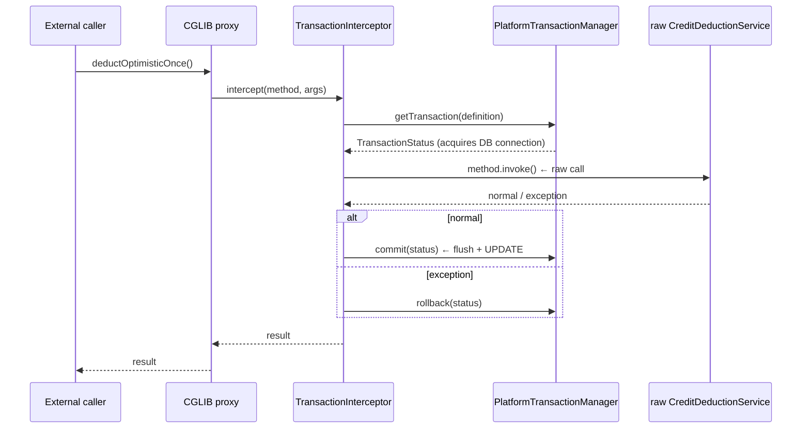

## Table of contents

## Preface {#intro}

I was comparing four credit-deduction lock strategies. Same scenario — a balance of 100, 100 workers each deducting 1, run under each lock (optimistic / pessimistic / MySQL `GET_LOCK` / Redisson). Pessimistic and `GET_LOCK` and Redisson all produced clean numbers. Then **the optimistic-lock run stopped me dead**.

```
Strategy: Optimistic (@Version)
totalMs: 549
successes: 100   ← 100% success
fails: 0         ← zero failure
finalBalance: 100  ← ?? balance unchanged
```

`successes=100` and `finalBalance=100`. **All 100 workers reported success, yet the balance never moved**. I went back to the code — `acc.deduct(amount)` was clearly subtracting. JPA's dirty-checking should have flushed an UPDATE on commit. The DB had not seen a single UPDATE.

The reason `@Transactional` never fired was that **a same-class internal call bypassed Spring AOP's proxy**. The textbook *self-invocation trap* — I knew it existed; I had not expected to find it through a *measurement contradiction* (100% success + 0 effect).

This article takes the trap apart down to the bone. **How `@Transactional` really works** — how Spring AOP's proxy intercepts calls, what the 6 stages of `TransactionInterceptor#invoke` are, why `MethodInvocation.proceed()` ends up calling the raw target. Plus the *six* other annotations that fall into the same trap.

The article in shape:

1. **The incident** — finding self-invocation by the contradiction `successes=100 / finalBalance=100`
2. **Spring AOP proxy mechanics** — JDK Dynamic Proxy vs CGLIB, the `ProxyFactory` call graph
3. **`TransactionInterceptor#invoke` decomposed** — Spring 6 source, line-by-line
4. **Why self-invocation bypasses the proxy** — where `MethodInvocation.proceed()` calls the raw target
5. **Six annotations sharing the trap** — `@Async` / `@Cacheable` / `@Validated` / `@Retryable` / `@PreAuthorize`
6. **Four workarounds** — separate bean / `getBean(self)` / `AopContext.currentProxy` / AspectJ weaving
7. **Operational diagnosis** — how to find this through *measurement contradictions*
8. **Combination with Woowahan's *why is this rolling back?* incident** — REQUIRED rollback-only

The headline:

- **Self-invocation is not a logic bug — it is the result of *bytecode dispatch*.** Java's `this.method()` compiles to `invokevirtual`, which calls the raw target directly, bypassing the proxy chain
- **All six annotations share the trap** — `@Transactional` / `@Async` / `@Cacheable` / `@Validated` / `@Retryable` / `@PreAuthorize` are all built on Spring AOP proxies
- **The diagnostic is *measurement contradiction*** — successes=100 + 0 effect *is* the proxy-bypass signal
- **Of the four workarounds, *separate bean* is the safest** — `AopContext.currentProxy` carries ThreadLocal coupling; AspectJ raises build complexity

Let's unpack, line by line, why the textbook line "same-class internal calls bypass the proxy" is true — and how that exact bypass *shows up in measurements*.

---

## 1. The incident — successes=100 with balance unchanged {#incident}

### 1.1 The measurement scenario

I was comparing four lock strategies for credit deduction. Same scenario across four locks (optimistic, pessimistic, MySQL `GET_LOCK`, Redisson) — 100 workers each subtracting 1 from a starting balance of 100, measuring throughput and correctness.

Pessimistic finished cleanly:

```
Strategy: Pessimistic (FOR UPDATE)
totalMs: 180          ⭐
successes: 100
fails: 0
finalBalance: 0       ✅ correct
```

`GET_LOCK` and Redisson produced their numbers. Then optimistic returned **something off**.

```
Strategy: Optimistic (@Version)
totalMs: 549
successes: 100         ← 100% success reported
fails: 0
finalBalance: 100      ← ?? balance unchanged
```

All 100 workers reported success, but the balance hadn't moved by a cent. Compared with pessimistic's `finalBalance: 0`, the contradiction was **plain**.

### 1.2 First suspicion — the code logic

I started by suspecting the code:

```java
@Service
public class CreditDeductionService {

    public void deductOptimistic(long accountId, long amount) {
        boolean done = false;
        int retry = 0;
        while (!done && retry < 50) {
            try {
                deductOptimisticOnce(accountId, amount);  // ← key line
                done = true;
            } catch (ObjectOptimisticLockingFailureException e) {
                retry++;
            }
        }
    }

    @Transactional(propagation = Propagation.REQUIRES_NEW)
    public void deductOptimisticOnce(long accountId, long amount) {
        AccountBalance acc = repo.findByAccountId(accountId);
        if (acc.getBalance() < amount) {
            throw new InsufficientBalanceException();
        }
        acc.deduct(amount);  // entity setter — balance -= amount
        // expecting dirty checking to issue UPDATE on commit
    }
}
```

`acc.deduct(amount)` clearly subtracts. JPA's dirty-checking mechanism should have detected the change at commit time and issued the corresponding UPDATE.

But the measurement showed *0 deductions*. Suspicious, I turned on Hibernate's SQL log.

### 1.3 The SQL log — UPDATE was never issued

```
Hibernate: select ab.id, ab.account_id, ab.balance, ab.version, ab.updated_at
           from account_balance ab where ab.account_id = ?
Hibernate: select ab.id, ab.account_id, ab.balance, ab.version, ab.updated_at
           from account_balance ab where ab.account_id = ?
... (repeated 100 times)
```

**100 SELECTs / 0 UPDATEs**. All 100 workers had run the SELECT and stopped there. JPA's dirty-checking simply didn't fire.

That shifted the suspicion. `acc.deduct(amount)` was mutating *only the in-memory Java object*; **`@Transactional` had never started, so commit never flushed**. In other words, the call had run *without* an `EntityManager`.

### 1.4 The find — same-class call

The line that did it lives inside `deductOptimistic`, calling `deductOptimisticOnce`:

```java
@Service
public class CreditDeductionService {

    public void deductOptimistic(...) {
        // ↓ here — same-class internal call
        deductOptimisticOnce(...);  // = this.deductOptimisticOnce(...)
    }

    @Transactional(propagation = REQUIRES_NEW)
    public void deductOptimisticOnce(...) { ... }
}
```

Java compiles `deductOptimisticOnce(...)` as `this.deductOptimisticOnce(...)`, and `this` is **the raw target object — not the Spring AOP proxy**. The call jumps straight to the raw method, **skipping the proxy chain entirely**.

So even with the `@Transactional` annotation present, the `TransactionInterceptor` that *implements* the annotation is *never invoked*. No transaction starts, no `EntityManager` opens, no dirty-checking fires, no UPDATE is issued.

That is the **self-invocation trap**. I knew the rule. I had not expected to find it via a measurement contradiction (`successes=100 + 0 effect`).

The rest of this article unpacks why this happens and how to diagnose it.

---

## 2. Spring AOP — how an advice slips into a call {#spring-aop-proxy}

### 2.1 Two proxy types — JDK Dynamic Proxy vs CGLIB

Spring AOP supports two kinds of proxies.

**(1) JDK Dynamic Proxy** — built on `java.lang.reflect.Proxy`. It generates a proxy object *at runtime* that implements the target's *interface*. A single entry point — `InvocationHandler#invoke(proxy, method, args)` — intercepts every call.

```java
// requires an interface
interface AccountService {
    void deduct(long id, long amount);
}

// Spring generates this proxy at runtime
AccountService proxy = (AccountService) Proxy.newProxyInstance(
    classLoader,
    new Class[] { AccountService.class },
    new TransactionInterceptor()  // InvocationHandler
);
```

**(2) CGLIB** — built on `org.springframework.cglib.proxy.Enhancer`. It generates a *subclass* of the target class at runtime. `MethodInterceptor#intercept(obj, method, args, methodProxy)` intercepts every call.

```java
// no interface required — subclass the class itself
public class CreditDeductionService { ... }  // raw

// Spring generates this CGLIB proxy at runtime
public class CreditDeductionService$$EnhancerByCGLIB extends CreditDeductionService {
    @Override
    public void deductOptimistic(...) {
        // intercept() runs — TransactionInterceptor fires
    }
}
```

### 2.2 Spring 6's default — `proxyTargetClass=true`

Up to Spring Framework 5, the default was `proxyTargetClass=false` — JDK proxy if there was an interface, CGLIB otherwise. **Spring Boot 2.x and later force the default to `proxyTargetClass=true`** — always CGLIB. The change is documented in the [Spring Boot 2.0 release notes](https://github.com/spring-projects/spring-boot/wiki/Spring-Boot-2.0-Release-Notes#proxying-strategy). The rationale was *consistency* — JDK proxies can only intercept methods declared on the interface, leading to surprising behavior when public methods on the target weren't on the interface.

In our setup (Spring Boot 3.4) **CGLIB** is in effect. A subclass of `CreditDeductionService` is generated at runtime; that subclass intercepts every external call and delegates to `TransactionInterceptor`.

<details>
<summary><b>(deep) Why does Spring weave proxies *at runtime*?</b> (expand)</summary>

Spring chose runtime weaving for *non-invasiveness*. At code-write time you can't know which advices will apply, but at *bean-registration time* a `BeanPostProcessor` (`AnnotationAwareAspectJAutoProxyCreator`) inspects every bean and wraps only the matching ones in a proxy.

```
Spring ApplicationContext bootstrap:
  1. BeanFactory registers all BeanDefinitions
  2. BeanFactoryPostProcessors mutate definitions
  3. Beans are instantiated (constructor)
  4. BeanPostProcessor#postProcessAfterInitialization runs
       └─ AnnotationAwareAspectJAutoProxyCreator inspects each bean
       └─ matches @Transactional / @Async / @Cacheable annotations
       └─ wraps matching beans with ProxyFactory → bean replaced
  5. The container injects the *proxy*
```

Alternatives are *compile-time weaving* (AspectJ CTW) and *load-time weaving* (LTW) — covered in Section 6.

</details>

### 2.3 The `ProxyFactory` call graph

When Spring builds a proxy, the call graph looks like this:

```
ProxyFactory
  └─ DefaultAopProxyFactory#createAopProxy(AdvisedSupport)
       ├─ if (interface present, proxyTargetClass=false)
       │    └─ JdkDynamicAopProxy
       └─ else
            └─ ObjenesisCglibAopProxy
                 └─ Enhancer.create() → subclass generation
```

The decision lives in [`DefaultAopProxyFactory.java`](https://github.com/spring-projects/spring-framework/blob/main/spring-aop/src/main/java/org/springframework/aop/framework/DefaultAopProxyFactory.java) — about 35 lines. Short, but it dictates everything that follows in our measurement.

```java
// DefaultAopProxyFactory.java (simplified)
public AopProxy createAopProxy(AdvisedSupport config) throws AopConfigException {
    if (config.isOptimize() || config.isProxyTargetClass()
            || hasNoUserSuppliedProxyInterfaces(config)) {
        Class<?> targetClass = config.getTargetClass();
        if (targetClass.isInterface() || Proxy.isProxyClass(targetClass)) {
            return new JdkDynamicAopProxy(config);
        }
        return new ObjenesisCglibAopProxy(config);  // ← our path
    }
    return new JdkDynamicAopProxy(config);
}
```

`CreditDeductionService` has no interface, and Spring Boot's `proxyTargetClass=true` is in effect — so **CGLIB**.

### 2.4 The proxied call flow

When the runtime CGLIB proxy (`CreditDeductionService$$EnhancerByCGLIB`) receives a method call:



The shape: **external caller → proxy → `TransactionInterceptor` → raw target**. No step in this chain intercepts *another method call inside the raw target on the same object*. The proxy lives on the *outside*, the raw target's `this` is on the *inside* — `this.method()` bypasses the chain.

That is self-invocation, in one sentence. Section 3 walks down inside `TransactionInterceptor#invoke` line by line.

---

## 3. `TransactionInterceptor#invoke` — six stages decomposed {#transaction-interceptor}

`@Transactional` is implemented by [`TransactionInterceptor`](https://github.com/spring-projects/spring-framework/blob/main/spring-tx/src/main/java/org/springframework/transaction/interceptor/TransactionInterceptor.java). Its `invoke(MethodInvocation)` handles every `@Transactional` call.

### 3.1 The entry point

```java
// TransactionInterceptor.java
@Override
public Object invoke(MethodInvocation invocation) throws Throwable {
    Class<?> targetClass = (invocation.getThis() != null
        ? AopUtils.getTargetClass(invocation.getThis()) : null);

    return invokeWithinTransaction(
        invocation.getMethod(),     // method called
        targetClass,                // raw target class
        new CoroutinesInvocationCallback() {
            @Override
            public Object proceedWithInvocation() throws Throwable {
                return invocation.proceed();  // ← raw target call site
            }
        }
    );
}
```

`invocation.proceed()` is the line that matters here. The AOP Alliance spec for [`MethodInvocation`](https://aopalliance.sourceforge.net/doc/org/aopalliance/intercept/MethodInvocation.html) says: `proceed()` invokes the *next* advice if any remain, or **the raw target's method when the chain is exhausted**. The end of the advice chain is the jump into the raw target.

### 3.2 The six-stage sequence

The core of `invokeWithinTransaction`, in six stages:

```java
// TransactionAspectSupport#invokeWithinTransaction (simplified)
protected Object invokeWithinTransaction(Method method, Class<?> targetClass,
        InvocationCallback invocation) throws Throwable {

    TransactionAttributeSource tas = getTransactionAttributeSource();
    TransactionAttribute txAttr = (tas != null
        ? tas.getTransactionAttribute(method, targetClass) : null);
    PlatformTransactionManager tm = determineTransactionManager(txAttr);
    String joinpointIdentification = methodIdentification(method, targetClass, txAttr);

    if (txAttr == null || !(tm instanceof CallbackPreferringPlatformTransactionManager)) {
        // (1) start the transaction
        TransactionInfo txInfo = createTransactionIfNecessary(tm, txAttr, joinpointIdentification);

        Object retVal;
        try {
            // (2) call the raw target ← business logic runs here
            retVal = invocation.proceedWithInvocation();
        }
        catch (Throwable ex) {
            // (3) decide rollback on exception
            completeTransactionAfterThrowing(txInfo, ex);
            throw ex;
        }
        finally {
            // (4) restore TransactionInfo (ThreadLocal)
            cleanupTransactionInfo(txInfo);
        }

        // (5) handle async / Coroutines results
        if (retVal != null && txAttr != null) {
            TransactionStatus status = txInfo.getTransactionStatus();
            if (status != null) {
                if (retVal instanceof CompletableFuture<?> future) {
                    retVal = future.whenComplete((v, t) -> {
                        if (t == null) status.flush();
                    });
                }
            }
        }

        // (6) commit on normal return
        commitTransactionAfterReturning(txInfo);
        return retVal;
    }
    // ... CallbackPreferring branch (omitted)
}
```

| Stage | Action | Effect |
|:-:|---|---|
| 1 | `createTransactionIfNecessary` | Acquire DB connection, apply `@Transactional(propagation)`, open `EntityManager`, register `TransactionInfo` in ThreadLocal |
| 2 | `invocation.proceedWithInvocation()` | **Calls the raw target's method** (end of advice chain) |
| 3 | `completeTransactionAfterThrowing` | Roll back if the exception matches `rollbackFor`; otherwise commit |
| 4 | `cleanupTransactionInfo` | Restore the prior `TransactionInfo` in ThreadLocal |
| 5 | `CompletableFuture` post-processing | Async-result transaction-completion hooks |
| 6 | `commitTransactionAfterReturning` | **flush + commit** (this is where dirty-check-driven UPDATEs are issued) |

In our measurement, stage 6 — `commitTransactionAfterReturning` — was never reached. Self-invocation meant `invoke` itself was never called, so all 6 stages were skipped.

### 3.3 Stage 1's propagation branch

`createTransactionIfNecessary` ends up in the 7-way branch in [`AbstractPlatformTransactionManager#handleExistingTransaction`](https://github.com/spring-projects/spring-framework/blob/main/spring-tx/src/main/java/org/springframework/transaction/support/AbstractPlatformTransactionManager.java):

```java
// AbstractPlatformTransactionManager.java
private TransactionStatus handleExistingTransaction(
        TransactionDefinition definition, Object transaction, boolean debugEnabled)
        throws TransactionException {

    if (definition.getPropagationBehavior() == TransactionDefinition.PROPAGATION_NEVER) {
        throw new IllegalTransactionStateException(...);  // error if a Tx already exists
    }
    if (definition.getPropagationBehavior() == TransactionDefinition.PROPAGATION_NOT_SUPPORTED) {
        Object suspendedResources = suspend(transaction);  // suspend existing Tx
        return prepareTransactionStatus(...);
    }
    if (definition.getPropagationBehavior() == TransactionDefinition.PROPAGATION_REQUIRES_NEW) {
        SuspendedResourcesHolder suspendedResources = suspend(transaction);  // suspend
        try {
            return startTransaction(definition, transaction, false, debugEnabled, suspendedResources);
            // ↑ start a brand-new Tx — *separate* DB connection
        } catch (RuntimeException | Error beginEx) {
            resumeAfterBeginException(transaction, suspendedResources, beginEx);
            throw beginEx;
        }
    }
    if (definition.getPropagationBehavior() == TransactionDefinition.PROPAGATION_NESTED) {
        if (!isNestedTransactionAllowed()) { ... }
        if (useSavepointForNestedTransaction()) {
            // Use savepoints (JDBC 3.0)
            DefaultTransactionStatus status = prepareTransactionStatus(definition, transaction,
                false, false, debugEnabled, null);
            status.createAndHoldSavepoint();
            return status;
        }
        // ...
    }
    // PROPAGATION_REQUIRED / SUPPORTS / MANDATORY (omitted)
}
```

Our code used `REQUIRES_NEW`. Self-invocation meant this code was *never reached* — none of the seven branches ran, no new transaction started, dirty-checking never fired.

### 3.4 The commit sequence in stage 6

```
TransactionInterceptor.commitTransactionAfterReturning(txInfo)
  └─ AbstractPlatformTransactionManager.commit(status)
       ├─ prepareForCommit(status)
       ├─ triggerBeforeCommit(status)  ← @TransactionalEventListener(BEFORE_COMMIT)
       ├─ doCommit(status)
       │    └─ HibernateTransactionManager.doCommit()
       │         └─ Session.flush()  ← dirty checking + UPDATE issuance
       │              └─ Session.getTransaction().commit()
       ├─ triggerAfterCommit(status)  ← @TransactionalEventListener(AFTER_COMMIT)
       └─ triggerAfterCompletion(status, COMMIT)
```

`Session.flush()` is the line that fires dirty-checking. Self-invocation skipped commit entirely, so flush never ran, so `acc.deduct(amount)` never reached the DB. The measurement (`successes=100 / finalBalance=100`) is exactly what that mechanism produces.

Section 4 explains why self-invocation skips these six stages, at the bytecode level.

---

## 4. Why self-invocation bypasses the proxy — at the bytecode level {#why-bypassed}

### 4.1 One line of code, two dispatch shapes

Two ways to call another method from inside a method:

```java
// (a) same-class internal call — self-invocation
public void deductOptimistic(...) {
    deductOptimisticOnce(...);  // = this.deductOptimisticOnce(...)
}

// (b) external bean call
public void deductOptimistic(...) {
    optimisticExecutor.deductOnce(...);  // different bean
}
```

(a) and (b) differ by one line at the source level — and **completely at the bytecode level**.

### 4.2 (a)'s bytecode — `invokevirtual` direct dispatch

`javac` for (a):

```
public void deductOptimistic(long, long);
  Code:
    0: aload_0                        // push this
    1: lload_1                        // accountId
    2: lload_3                        // amount
    3: invokevirtual #X               // CreditDeductionService.deductOptimisticOnce(long, long)V
    6: return
```

`invokevirtual`'s receiver is `this`'s *runtime class*. But `this` is the *raw `CreditDeductionService`* (not the CGLIB proxy) — because `deductOptimistic` is currently executing *inside the raw target*.

Therefore `invokevirtual` calls the **raw target's `deductOptimisticOnce` directly**, never visiting the CGLIB proxy's `intercept`. `TransactionInterceptor#invoke` never runs.

### 4.3 (b)'s bytecode — call through an injected bean

```
public void deductOptimistic(long, long);
  Code:
    0: aload_0                        // push this
    1: getfield #Y                    // CreditDeductionService.optimisticExecutor (field)
    4: lload_1
    5: lload_3
    6: invokevirtual #Z               // OptimisticDeductExecutor.deductOnce(long, long)V
    9: return
```

`optimisticExecutor` is the *proxy* injected by Spring. The runtime class on the dispatch is `OptimisticDeductExecutor$$EnhancerByCGLIB`, so the call lands in `intercept` and walks the chain into `TransactionInterceptor#invoke`. The 6-stage sequence runs normally — transaction begins, raw target runs, commit, flush, UPDATE.

### 4.4 Where exactly the bypass happens

Recall the Section 2.4 chain — **caller → proxy → `TransactionInterceptor` → raw target**. Self-invocation happens *inside the raw target*, so we are already at the chain's tail.

```
[caller]
   ↓
[CGLIB proxy] ← TransactionInterceptor intercepts here
   ↓
[raw target] ← currently executing. this.method() calls?
   ↓
[another method on the same raw target] ← no proxy ❌
```

This shape can't be patched away. Spring's runtime weaving means the raw target's `this` will *always* be the raw object. From inside the same class, *no* mechanism can route the call back through the proxy without explicit help.

Section 6 covers four ways to provide that help. First, Section 5 shows just how broad this trap is.

---

## 5. The same trap in six annotations — anything on Spring AOP {#six-annotations}

Self-invocation is not exclusive to `@Transactional`. **Every Spring AOP–based annotation suffers from it.** Six common ones:

| Annotation | AOP Interceptor | What breaks |
|---|---|---|
| `@Transactional` | `TransactionInterceptor` | Tx never starts → flush never runs → no DB write |
| `@Async` | `AsyncExecutionInterceptor` | Synchronous execution — caller thread runs the body |
| `@Cacheable` | `CacheInterceptor` | Cache lookup and store both skipped |
| `@Validated` | `MethodValidationInterceptor` | Parameter validation does not run |
| `@Retryable` | `RetryOperationsInterceptor` | Retry logic does not fire |
| `@PreAuthorize` / `@PostAuthorize` | `MethodSecurityInterceptor` | Authorization check bypassed ⚠️ security incident |

Different interceptors, **same proxy-based foundation**. Same self-invocation bypass.

### 5.1 `@Async` self-invocation

```java
@Service
public class NotificationService {
    
    public void sendBulk() {
        for (Notification n : list) {
            sendOne(n);  // ← self-invocation. not async
        }
    }

    @Async
    public void sendOne(Notification n) { ... }
}
```

Expected: 100 items sent in parallel, finishing in ~200 ms.
Actual: 100 items sent serially on the caller thread; a possible pool-exhaustion vector.

### 5.2 `@Cacheable` self-invocation

```java
@Service
public class ProductService {

    public Product getWithDiscount(long id) {
        Product p = getProduct(id);  // ← self-invocation. not cached
        return applyDiscount(p);
    }

    @Cacheable("product")
    public Product getProduct(long id) { return repo.findById(id); }
}
```

Expected: same `id` hits cache.
Actual: every call hits the DB; load multiplies by N.

### 5.3 `@PreAuthorize` self-invocation — security incident

```java
@Service
public class AdminService {

    public void bulkDelete(List<Long> ids) {
        for (Long id : ids) {
            deleteUser(id);  // ← self-invocation. authorization bypassed ⚠️
        }
    }

    @PreAuthorize("hasRole('SUPER_ADMIN')")
    public void deleteUser(long id) { ... }
}
```

Expected: non-SUPER_ADMIN gets `AccessDeniedException`.
Actual: a regular ADMIN can call `bulkDelete`, which then calls `deleteUser` with no authorization check — **privilege escalation**.

This case is the dangerous one. The contradiction does not show in functional behavior — the call returns successfully, the user appears deleted. The trap surfaces only at security audit.

### 5.4 The shared mechanism

```
@Transactional        → TransactionInterceptor       → AOP proxy
@Async                → AsyncExecutionInterceptor    → AOP proxy
@Cacheable            → CacheInterceptor             → AOP proxy
@Validated            → MethodValidationInterceptor  → AOP proxy
@Retryable            → RetryOperationsInterceptor   → AOP proxy
@PreAuthorize         → MethodSecurityInterceptor    → AOP proxy
```

**All six rest on Spring AOP** → all bypass on self-invocation. The workarounds are therefore the same. Section 6.

---

## 6. Four workarounds — which is safest? {#workarounds}

### 6.1 (1) Separate bean — extract to a dedicated `@Service` ⭐ (chosen)

The most explicit and the safest. Move the self-invoked method out into its own bean.

```java
@Service
public class CreditDeductionService {
    private final OptimisticDeductExecutor optimisticExecutor;

    public void deductOptimistic(long accountId, long amount) {
        boolean done = false;
        int retry = 0;
        while (!done && retry < 50) {
            try {
                optimisticExecutor.deductOnce(accountId, amount);  // ← external bean
                done = true;
            } catch (ObjectOptimisticLockingFailureException e) {
                retry++;
            }
        }
    }
}

@Service
public class OptimisticDeductExecutor {
    private final AccountBalanceJpaRepository repo;

    @Transactional(propagation = REQUIRES_NEW)
    public void deductOnce(long accountId, long amount) {
        AccountBalance acc = repo.findByAccountId(accountId);
        if (acc.getBalance() < amount) {
            throw new InsufficientBalanceException();
        }
        acc.deduct(amount);
    }
}
```

**Pros**:
- Explicit — the call is obviously to an *external bean*
- Test-friendly — `OptimisticDeductExecutor` is testable in isolation
- Separation of concerns — retry (service) vs single deduction (executor)

**Cons**:
- One more class
- One more dependency to inject

After applying this fix, the run produced `successes=100 / finalBalance=0 / 100 deductions` — the textbook outcome. **Use this first.**

### 6.2 (2) `ApplicationContext#getBean(self)` — explicit self-proxy lookup

Pull the self-proxy from the container.

```java
@Service
public class CreditDeductionService implements ApplicationContextAware {
    private ApplicationContext ctx;

    @Override
    public void setApplicationContext(ApplicationContext ctx) {
        this.ctx = ctx;
    }

    public void deductOptimistic(long accountId, long amount) {
        CreditDeductionService self = ctx.getBean(CreditDeductionService.class);
        self.deductOptimisticOnce(accountId, amount);  // through the proxy
    }

    @Transactional(propagation = REQUIRES_NEW)
    public void deductOptimisticOnce(...) { ... }
}
```

**Pros**:
- No new class

**Cons**:
- Inverted dependency — the class now knows about `ApplicationContext` (harder to test)
- Readability — `self.method()` does not say "go through the proxy" out loud
- Explicit Spring container coupling

A last resort.

### 6.3 (3) `AopContext.currentProxy()` — proxy via ThreadLocal

Lift the current proxy from `AopContext`'s ThreadLocal:

```java
@Service
@EnableAspectJAutoProxy(exposeProxy = true)  // ← exposeProxy required
public class CreditDeductionService {

    public void deductOptimistic(long accountId, long amount) {
        CreditDeductionService self = (CreditDeductionService) AopContext.currentProxy();
        self.deductOptimisticOnce(accountId, amount);
    }

    @Transactional(propagation = REQUIRES_NEW)
    public void deductOptimisticOnce(...) { ... }
}
```

**Pros**:
- Works without injecting anything

**Cons**:
- Requires `exposeProxy = true` (default false)
- ThreadLocal-bound — mixes badly with async/Coroutines work
- ThreadLocal leak risk in some contexts (Spring usually cleans up)

Works in our single-thread measurement, but a runtime hazard once async hops appear. **Avoid.**

### 6.4 (4) AspectJ Compile-Time / Load-Time Weaving

Use [AspectJ](https://www.eclipse.org/aspectj/) to *modify the bytecode itself*.

**Compile-Time Weaving (CTW)**: AspectJ compiler (`ajc`) inlines the interceptor logic into the method body at build time. Self-invocation or external — the advice runs.

**Load-Time Weaving (LTW)**: A Java agent (`-javaagent:aspectjweaver.jar`) rewrites the class as it's loaded.

```java
@Configuration
@EnableLoadTimeWeaving(aspectjWeaving = AUTODETECT)
public class AspectJConfig { }
```

**Pros**:
- Self-invocation is *fully* solved — `this.method()` runs the advice
- Works on interfaces, classes, even final methods

**Cons**:
- Build complexity (CTW needs the AspectJ Maven/Gradle plugin)
- Runtime change (LTW requires a Java agent)
- Harder to debug — you can't see at a glance which advice runs where
- Spring AOP and AspectJ have different ordering rules

In most production environments the build/runtime change is unwelcome, so teams pick *separate bean*. AspectJ's niche is `@Configurable` (advising objects Spring doesn't manage) — beyond Spring AOP's reach.

### 6.5 Comparison matrix

| Workaround | Safety | Explicitness | Build impact | Testability | Recommendation |
|---|:-:|:-:|:-:|:-:|:-:|
| (1) Separate bean | ⭐⭐⭐⭐⭐ | ⭐⭐⭐⭐⭐ | none | ⭐⭐⭐⭐⭐ | **first** |
| (2) `getBean(self)` | ⭐⭐⭐ | ⭐⭐ | none | ⭐⭐ | last resort |
| (3) `AopContext.currentProxy()` | ⭐⭐ | ⭐⭐ | `exposeProxy=true` | ⭐⭐ | avoid |
| (4) AspectJ CTW/LTW | ⭐⭐⭐⭐ | ⭐⭐ | high | ⭐⭐⭐ | special cases (`@Configurable`) |

---

## 7. Operational diagnosis — finding it through *measurement contradictions* {#diagnosis}

The real danger of self-invocation is that **you find it through measurement contradictions**, not through code review. Same-class method calls *look* perfectly normal in a diff.

### 7.1 The contradiction in our measurement

| Measurement | Meaning |
|---|---|
| `successes=100 / fails=0` | 100% success reported |
| `finalBalance=100` | 0 deductions |
| The contradiction | **Function ran but had zero effect** = AOP-bypass signal |

Same shape across all six annotations.

### 7.2 Contradiction signals per annotation

| Annotation | Contradiction signal |
|---|---|
| `@Transactional` | Method success + DB unchanged (this article) |
| `@Async` | Method success + thread name == caller's (no `-async-1`) |
| `@Cacheable` | Same args twice + two DB queries |
| `@Validated` | Bad input + no `ConstraintViolationException` |
| `@Retryable` | Exception + zero retries |
| `@PreAuthorize` | Unauthorized user + method ran (only found in audit) |

### 7.3 A diagnostic workflow

```
1. Check whether the metric contradicts itself
   - success counter vs actual effect
2. Enable SQL log / Hibernate trace
   - SELECT only / 0 UPDATE
   - no transaction begin/commit
3. Inspect call stacks
   - any this.method() shapes?
   - do those targets carry advice annotations?
4. Extract the suspect method to an external bean
   - re-run the measurement
   - if the contradiction disappears, self-invocation is confirmed
```

### 7.4 PR review checklist — item zero

After this incident I added a *zeroth* item to the PR review checklist (i.e., to be checked *before* anything else):

> **[Self-invocation Check]** Inside any class touched by the PR, does the method directly call another method *on the same class*? If that method carries any of `@Transactional` / `@Async` / `@Cacheable` / `@Validated` / `@Retryable` / `@PreAuthorize`, **extract to an external bean**.

Why item zero: this trap costs more the later it's caught. Code review is the cheapest layer.

---

## 8. Combined trap with Woowahan's *why is this rolling back?* {#combined-trap}

Self-invocation gets *really* nasty when it combines with another trap. Look at Woowahan's [응? 이게 왜 롤백되는거지?](https://techblog.woowahan.com/2606/) post (translated: "Wait, why is this rolling back?").

### 8.1 Scenario — REQUIRED rollback-only

```java
@Service
public class OuterService {

    @Transactional  // PROPAGATION_REQUIRED
    public void process() {
        try {
            innerService.failingMethod();
        } catch (Exception e) {
            // swallow and continue
            logger.warn("inner failed, continuing", e);
        }
        // ↓ UnexpectedRollbackException fires here
        repo.save(...);  // looks fine, but rolls back at commit
    }
}

@Service
public class InnerService {

    @Transactional  // PROPAGATION_REQUIRED — joins the same Tx
    public void failingMethod() {
        throw new RuntimeException();
    }
}
```

Expected: outer catches the inner exception, saves, commits.
Actual: `UnexpectedRollbackException` — the *whole* transaction rolls back.

### 8.2 Why — REQUIRED's rollback-only marker

When a `PROPAGATION_REQUIRED` inner throws:

```
1. innerService.failingMethod() called
2. CGLIB proxy → TransactionInterceptor#invoke
3. existing Tx found → joined (PROPAGATION_REQUIRED)
4. raw target called → RuntimeException
5. completeTransactionAfterThrowing
   └─ marks the existing Tx's status as rollback-only
6. RuntimeException propagates
7. process() catches it — logs, continues
8. on process() return, the framework attempts commit
9. PlatformTransactionManager sees rollback-only on the status
10. UnexpectedRollbackException → full rollback
```

The mechanism: **inner throwing marks the *existing Tx's status* as rollback-only**. Catching the exception in the outer doesn't clear the marker. Commit time discovers it and fails — `UnexpectedRollbackException`.

### 8.3 Combined with self-invocation

```java
@Service
public class CombinedService {

    @Transactional  // outer Tx
    public void process() {
        try {
            innerMethod();  // ← self-invocation. same Tx?
        } catch (Exception e) {
            logger.warn("inner failed", e);
        }
        repo.save(...);
    }

    @Transactional(propagation = REQUIRES_NEW)  // intends a new Tx
    public void innerMethod() {
        throw new RuntimeException();
    }
}
```

Expected: `innerMethod` runs in its *own* Tx → independent rollback → outer continues normally.
Actual: self-invocation skips the `@Transactional(REQUIRES_NEW)` entirely → it runs in the *outer* Tx → exception → outer Tx flagged rollback-only → `UnexpectedRollbackException`.

That is the *combined* trap. Each individually is unpleasant; together they make debugging far harder.

### 8.4 Diagnostic + remedy

```
1. Read the UnexpectedRollbackException stack trace
2. Identify which method's commit blew up
3. Find what exceptions that method swallowed
4. The throwing method —
   (a) same-class call → self-invocation trap (REQUIRES_NEW didn't apply)
   (b) external bean call but PROPAGATION_REQUIRED → rollback-only marker trap
5. Fix: (a) extract bean / (b) change to PROPAGATION_REQUIRES_NEW
```

---

## 9. Conclusion — self-invocation through a senior lens {#conclusion}

### 9.1 Layered understanding

| Layer | Understanding |
|---|---|
| L1 surface | "Same-class internal calls don't trigger `@Transactional`" |
| L2 mechanism | Spring AOP weaves at runtime; the raw target's `this` is the raw object; the CGLIB proxy chain is bypassed |
| L2.5 source | Of `TransactionInterceptor#invoke`'s 6 stages, stages 1 and 6 (begin / commit) are skipped — flush never runs |
| L3 measurement | W3 ⑤ run produced `successes=100 / finalBalance=100` — a *contradiction* that surfaced the bypass |
| L4 ops | Six annotations (`@Transactional` / `@Async` / `@Cacheable` / `@Validated` / `@Retryable` / `@PreAuthorize`) share the trap. Combined with Woowahan's *rolling-back* incident, debugging cost explodes |

### 9.2 Workaround priority

1. **Separate bean** (safest) — extract to an external bean. Explicit and testable.
2. AspectJ CTW/LTW (specific cases) — `@Configurable` and other Spring-AOP-impossible cases
3. `getBean(self)` (last resort) — inverts dependency
4. `AopContext.currentProxy()` (avoid) — ThreadLocal-coupled

### 9.3 Operational checklist

- [ ] PR review item 0 — same-class call check
- [ ] Monitor *measurement contradictions* on suspect annotations (successes vs effect)
- [ ] Enable SQL log / Hibernate trace in dev
- [ ] *Security-critical* annotations like `@PreAuthorize` should be enforced into separate beans by static analysis
- [ ] When AspectJ is in use, declare advice ordering explicitly (`@Order` / `@Priority`)

### 9.4 What the next articles cover

This article isolates *self-invocation*. Up next in the series:

- **Article 1** — JPA L1 cache / flush / transaction lifecycle (the detail of *flush at commit*, stage 6 here)
- **Article 3** — OSIV + transaction propagation (REQUIRED rollback-only's full anatomy + Vlad's OSIV anti-pattern)
- **Article 8** — Transaction split patterns: Saga / Outbox / REQUIRES_NEW (PROPAGATION 7 + academic origins + EXP-09b 9-scenario [measurement])

---

## 10. References {#references}

### Official documentation (primary)

- [Spring Framework Reference — AOP Proxies](https://docs.spring.io/spring-framework/reference/core/aop/proxying.html)
- [Spring Framework Reference — Declarative Transaction Management](https://docs.spring.io/spring-framework/reference/data-access/transaction/declarative.html)
- [Spring Boot 2.0 Release Notes — Proxying Strategy](https://github.com/spring-projects/spring-boot/wiki/Spring-Boot-2.0-Release-Notes#proxying-strategy)
- [AOP Alliance — `MethodInvocation` interface spec](https://aopalliance.sourceforge.net/doc/org/aopalliance/intercept/MethodInvocation.html)

### Spring 6 / Hibernate 6 source (cited directly)

- [`TransactionInterceptor.java`](https://github.com/spring-projects/spring-framework/blob/main/spring-tx/src/main/java/org/springframework/transaction/interceptor/TransactionInterceptor.java)
- [`AbstractPlatformTransactionManager.java`](https://github.com/spring-projects/spring-framework/blob/main/spring-tx/src/main/java/org/springframework/transaction/support/AbstractPlatformTransactionManager.java)
- [`DefaultAopProxyFactory.java`](https://github.com/spring-projects/spring-framework/blob/main/spring-aop/src/main/java/org/springframework/aop/framework/DefaultAopProxyFactory.java)
- [`AnnotationAwareAspectJAutoProxyCreator.java`](https://github.com/spring-projects/spring-framework/blob/main/spring-aop/src/main/java/org/springframework/aop/aspectj/annotation/AnnotationAwareAspectJAutoProxyCreator.java)

### Korean tech-blog incident reports

- Woowahan — [응? 이게 왜 롤백되는거지?](https://techblog.woowahan.com/2606/) (REQUIRED + rollback-only)
- Woowahan — [JPA 강의 적용 사례](https://techblog.woowahan.com/2598/)
- Toss SLASH22 — [한 주가 고객에게 — Distributed Lock + JPA Optimistic Lock](https://haon.blog/article/toss-slash/broker-issue-concurrency-and-network-latency/)

### Vlad Mihalcea (Hibernate Steering Committee)

- [Spring `@Transactional` self-invocation](https://vladmihalcea.com/spring-transactional/)
- [How does Spring `@Transactional` really work](https://vladmihalcea.com/a-beginners-guide-to-jpa-and-hibernate-flush-strategies/)
- [High-Performance Java Persistence](https://vladmihalcea.com/books/high-performance-java-persistence/) (book)

### Author's own measurements

- W3 ⑤ EXP-02 4-lock comparison [measurement] — `mysql-credit-concurrency-lock-comparison.md` (single article)
- This series, Article 1 — JPA L1 cache / flush lifecycle
- This series, Article 8 — Transaction split: Saga / Outbox / REQUIRES_NEW

### AOP academic origins

- Kiczales et al. — *Aspect-Oriented Programming* (ECOOP 1997)
- Filman, Friedman — *Aspect-Oriented Programming is Quantification and Obliviousness* (Workshop on Advanced Separation of Concerns, 2000)
