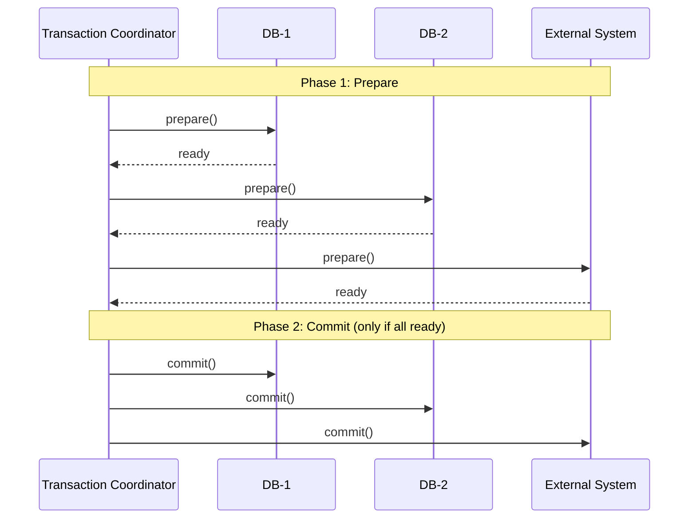
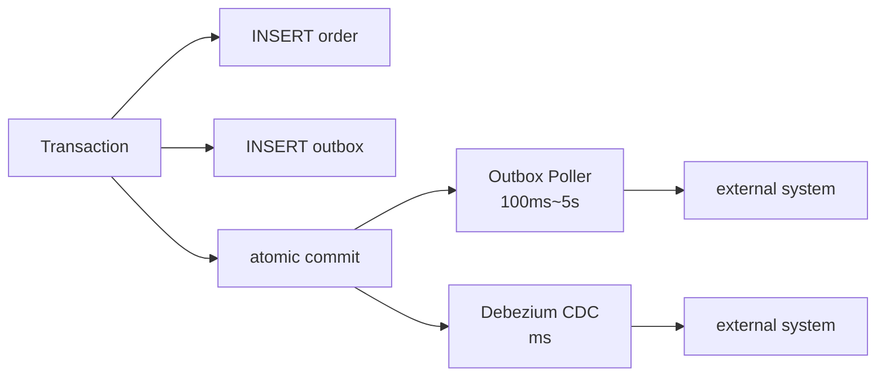

## Table of contents

## Preface {#intro}

The prior measurement (EXP-09) showed the pitfall of *calling external APIs inside a transaction*, line by line. With HikariCP `pool=10`, `extDelay=3,000ms`, `concurrent=60`, and `connection-timeout=1s`, only 16.7% of requests passed; 50 calls hit `SQLTimeoutException`. The pool-occupation time stretched in lockstep with the external call.

The cure is obvious: **move the external call outside the transaction**. The *how* is the hard part. StackOverflow answers scatter across plain split (call externally first, then INSERT), Saga's compensating transactions, Transactional Outbox, and more. Few articles answer *which pattern fits which domain* with measurements.

So I ran a 9-scenario matrix — three patterns (A: plain split / B: Saga / C: Outbox) × three chaos modes (OFF / DB_FAIL / EXT_FAIL). The result: **the three patterns carry fundamentally different trade-offs**. Plain split lets external success diverge from local DB failure — 60 calls to the external PG, 0 rows in our DB. Saga's *triple safety net* (worker compensation + sweeper) keeps consistency. Outbox shortens *user-visible response* by 41×, at the cost of *making completion 30× slower*.

These patterns are not new. **Saga lives in Garcia-Molina's 1987 ACM SIGMOD paper.** **Outbox lives in Pat Helland's 2005 CIDR paper *Data on the Outside vs Data on the Inside*.** Korean tech blogs (Toss SLASH24, 29CM, Ridi) have written operational reflections on these. Stitching academic → operational → my own measurement together makes it line-by-line clear *why each pattern fits its domain*.

This article is that three-layer record:

1. **The incident** — EXP-09's pool exhaustion; plain split alone is not enough
2. **PROPAGATION 7** — REQUIRED / REQUIRES_NEW / NESTED / SUPPORTS / MANDATORY / NOT_SUPPORTED / NEVER, with their precise meanings
3. **The limits of 2PC (XA)** — why microservices can't use it; Helland's *Life Beyond Distributed Transactions*
4. **Saga — Garcia-Molina 1987** — Choreography vs Orchestration / compensating transactions
5. **Outbox — Helland CIDR 2005** — academic origin + Korean operational reports
6. **EXP-09b 9-scenario measurement matrix** — A/B/C × OFF/DB_FAIL/EXT_FAIL
7. **Two latencies, separated** — *user response* vs *processing completion* (different metrics)
8. **Domain mapping** — payments → Saga, notifications → Outbox, cache only → plain split
9. **`@TransactionalEventListener`** — `AFTER_COMMIT` / `BEFORE_COMMIT` precise semantics + Spring source

The headline:

- **Plain split alone is insufficient** — A/DB_FAIL [measurement] ends with 60 mismatches. Wrong fit for payments / orders.
- **Saga's triple safety net** — B/EXT_FAIL [measurement]: worker compensates 60. B/DB_FAIL [measurement]: sweeper recovers 60. The two safety nets together preserve consistency.
- **Outbox carries three latencies** — ACK 72ms / completion avg 92,573ms / max 181,935ms. 41× faster user response, *at the cost of* 30× slower completion.
- **Payments → Saga, notifications → Outbox** — Outbox is for "ACK is enough" domains; Saga is for "completion-consistency must hold" domains.
- **2PC won't work in microservices** — Helland's CIDR 2007 makes the case: blocking commit halts the system under availability/partition stress.

The maxim "just split the transaction" is half an answer. Three layers — academic, operational, measured — get the rest of it.

---

## 1. The incident — EXP-09's pool exhaustion, plain split as a starting point {#incident}

### 1.1 EXP-09's two runs

The prior measurement (EXP-09) examined the pool-exhaustion mechanism in two runs.

**Run #1 — silent latency blowup** (timeout 5,000ms / concurrent 30 / extDelay 2,000ms):
- 30/30 success (100%)
- P50 / P90 / P99 = 2,200 / 4,300 / 6,350 ms
- Pool stats: active=10 / awaiting=20 (sustained ~6s)
- A success-rate-only monitor would call this "healthy"

**Run #2 — fail-fast** (timeout 1,000ms / concurrent 60 / extDelay 3,000ms):
- 10/60 success (16.7%)
- 50 SQLTimeoutException
- Theory check: pool / extDelay = 10/3s = 3.33 req/s ≈ measured 3.03 req/s (91%)

Same exhaustion; the connection-timeout decides the *system character*. Operations sees opposite signals — Run #1 looks slow, Run #2 looks broken.

### 1.2 The intuitive fix — pull external calls out of the transaction

```java
// Before — EXP-09's anti-pattern
@Transactional
public void process(OrderRequest req) {
    Order order = repo.save(req);          // INSERT
    paymentClient.charge(order.getId());   // external PG (3s)
    // pool occupied = INSERT + external + commit ≈ 3,005ms
}

// After — plain split (pattern A)
public void process(OrderRequest req) {
    paymentClient.charge(req.getId());     // external first (outside Tx)
    saveOrder(req);                         // new transaction
}

@Transactional
public void saveOrder(OrderRequest req) {
    repo.save(req);                         // INSERT only
    // pool occupied ≈ 5ms
}
```

Is pattern A *the* answer? The matrix in EXP-09b says: it depends.

### 1.3 EXP-09b — the 9-scenario matrix's key finding

| # | Pattern | chaos | OK | Inconsist. | Compen. | ExtFail | Meaning |
|:-:|---|---|:-:|:-:|:-:|:-:|---|
| 1 | A | OFF | 60 | 0 | 0 | 0 | normal path |
| 2 | A | DB_FAIL | 0 | **60** | 0 | 0 | **60 charged externally / 0 saved locally** ⚠️ |
| 3 | A | EXT_FAIL | 0 | 0 | 0 | 60 | external failed — no losses |
| 4 | B | OFF | 60 | 0 | 0 | 0 | Saga normal |
| 5 | B | DB_FAIL | 0 | 0 | 0 | 60 (sweeper) | sweeper cleans 60 ✅ |
| 6 | B | EXT_FAIL | 0 | 0 | **60** | 0 | worker compensates 60 ✅ |
| 7 | C | OFF | 60 (ACK) | 0 | 0 | 0 | Outbox normal |
| 8 | C | DB_FAIL | 60 (ACK) | 0 | 0 | 0 | Outbox auto-retry |
| 9 | C | EXT_FAIL | 60 (ACK) | 0 | 0 | 0 | Outbox auto-retry |

**The key finding**: scenario 2 — A/DB_FAIL — produces **60 external charges with 0 local rows**. Plain split alone breaks consistency on the *external OK / local DB failure* failure mode. **Wrong fit for payments / orders.**

The remainder of this article unpacks *why* — academically and in measurements. First, the precise meanings of PROPAGATION's seven values.

---

## 2. PROPAGATION 7 — Spring's transaction-propagation semantics {#propagation}

The seven values look enum-like, but each is a *different transactional model*. Spring 6's [`AbstractPlatformTransactionManager`](https://github.com/spring-projects/spring-framework/blob/main/spring-tx/src/main/java/org/springframework/transaction/support/AbstractPlatformTransactionManager.java) handles them as a 7-way branch in `handleExistingTransaction`.

### 2.1 The semantics, precise

| Propagation | With existing Tx | Without existing Tx | Behavior |
|---|---|---|---|
| `REQUIRED` (default) | join | start new | the most common choice |
| `REQUIRES_NEW` | suspend + start new | start new | **separate connection** |
| `NESTED` | create savepoint | start new | JDBC 3.0 savepoint |
| `SUPPORTS` | join | run without Tx | optional |
| `MANDATORY` | join | **error** | enforced |
| `NOT_SUPPORTED` | suspend + run without Tx | run without Tx | avoid Tx |
| `NEVER` | **error** | run without Tx | forbid Tx |

### 2.2 REQUIRED vs REQUIRES_NEW — the decisive difference

```java
@Service
public class OrderService {
    @Transactional  // PROPAGATION_REQUIRED
    public void process() {
        repo.save(order);
        notificationService.send(order);  // joins same Tx
        // notificationService throwing? — this Tx rolls back too
    }
}

@Service
public class NotificationService {
    @Transactional(propagation = REQUIRES_NEW)  // separate Tx
    public void send(Order order) {
        // separate connection / commit / rollback
        // exceptions here don't affect OrderService Tx
    }
}
```

`REQUIRED`'s inner throwing creates the Woowahan *why is this rolling back?* incident pattern. `REQUIRES_NEW` keeps the failure isolated. (See series article 7, §8 for the self-invocation combination.)

### 2.3 NESTED's *real* meaning — Savepoints

`NESTED` is *not* a new transaction. It is a **JDBC 3.0 Savepoint** — same connection, same transaction, with a partial-rollback marker.

```sql
-- NESTED's SQL sequence
BEGIN;
INSERT INTO orders ...;        -- outer's work
SAVEPOINT nested_1;             -- enter inner
INSERT INTO order_items ...;   -- inner's work
ROLLBACK TO SAVEPOINT nested_1; -- roll back inner only
INSERT INTO orders ...;         -- outer continues
COMMIT;                          -- outer commits (orders persisted)
```

The point: **NESTED commits as a whole at the outer commit point.** Inner does not commit independently. It is the wrong fit for payments — you cannot commit at the external-call boundary.

### 2.4 Operational traps

| Trap | Mechanism | Workaround |
|---|---|---|
| `REQUIRED` rollback-only | inner throws → status flagged → outer commit hits `UnexpectedRollbackException` | switch inner to `REQUIRES_NEW` |
| `REQUIRES_NEW` self-invocation | same-class call → proxy bypassed → new Tx never starts | extract a separate bean (article 7) |
| `NESTED` misunderstanding | mistaken for separate Tx → expect external-system commit | switch to `REQUIRES_NEW` |
| `SUPPORTS` ⇄ `NOT_SUPPORTED` | reverse behavior — `SUPPORTS` joins existing, `NOT_SUPPORTED` suspends | one-line guide: *use existing Tx if present? → SUPPORTS / don't? → NOT_SUPPORTED* |

These seven are *Spring's abstraction*. In the database it boils down to connection / transaction / savepoint combinations. §3 shows how that abstraction breaks in distributed environments.

---

## 3. The limits of 2PC (XA) — why microservices can't use it {#2pc-limitations}

### 3.1 How 2PC works

Java EE's [JTA](https://download.oracle.com/javaee/7/api/javax/transaction/UserTransaction.html) standardized **2-Phase Commit (2PC)** as the way to coordinate distributed transactions:



**Phase 1 — Prepare**: the coordinator asks all participants whether they can commit. Once all reply "ready", *no one* can abort.

**Phase 2 — Commit**: all commit. Or if any participant fails, all roll back.

### 3.2 Pat Helland's critique — *Life Beyond Distributed Transactions* (CIDR 2007)

[Pat Helland's CIDR 2007 paper](https://www.ics.uci.edu/~cs223/papers/cidr07p15.pdf) makes the case that 2PC does not scale to large systems.

> "In production systems, distributed transactions don't seem to be needed because applications are designed without them. **In the absence of distributed transactions, application designers focus on lower forms of consistency.**"
> — Pat Helland, *Life Beyond Distributed Transactions*, CIDR 2007

The thrust:

1. **Cost of blocking** — between Prepare and Commit/Abort, *every* participant is blocked. If the coordinator dies, *everyone* hangs indefinitely. Under availability or partition stress, the system halts.
2. **Scalability ceiling** — N participants → *N² messages, N round trips*. 100 microservices means 100×100 = 10,000 messages and 100× round trips.
3. **Operational cost** — the coordinator's persistent recovery log is a single point of failure with operational cost beyond ordinary RDB transaction logs.
4. **The P in CAP** — under partition, 2PC sacrifices *availability*. Microservices treat partitions as ordinary; full rollback per partition isn't viable.

### 3.3 Last Resource Gambit — XA 1.3's hack

The [JTA 1.3 spec](https://www.eclipse.org/jakartaee/) defines a *Last Resource Gambit* — treat one resource as non-XA to reduce overhead. **It carries a critical-bug risk** — coordinator crash leaves the Last Resource's commit/rollback in an *unknown* state.

In production this pattern often loses money. It's the reason Helland recommends "lower forms of consistency".

### 3.4 The conclusion — *eventually consistent* over 2PC

[Werner Vogels' ACM Queue 2008 article](https://queue.acm.org/detail.cfm?id=1466448) names the standard:

> "Several inconsistency models exist: causal consistency, read-your-writes consistency, session consistency, monotonic read consistency, monotonic write consistency. **Eventual consistency** is the most relaxed of these."

For the microservices era, transactions are **eventually consistent**. *Saga* (Garcia-Molina 1987) and *Outbox* (Helland 2005) sit on top of that model.

---

## 4. Saga — Garcia-Molina 1987 origin {#saga}

### 4.1 Academic origin

Saga's origin is **Hector Garcia-Molina, Kenneth Salem — *Sagas* (ACM SIGMOD 1987)**.

> "A saga is a long lived transaction that can be written as a sequence of transactions that can be **interleaved** with other transactions. Each transaction in the sequence is associated with a **compensating transaction** that semantically undoes its effects."
> — Garcia-Molina, Salem, *Sagas*, ACM SIGMOD 1987

The definition:

1. **A saga is a sequence of transactions** — T1 → T2 → ... → Tn
2. **Each Ti has a compensating transaction Ci** — semantically undoing Ti
3. **Compensation is *not* commutative** — Ci doesn't fully erase Ti's effects (e.g., a sent notification can't be unsent)

### 4.2 Two flavors — Choreography vs Orchestration

[Microsoft's Saga pattern docs](https://learn.microsoft.com/en-us/azure/architecture/patterns/saga) summarize the two variants.

**(1) Choreography** — each service listens for events and emits the next event after its step:

```
[Order Service] -- OrderCreated --> [Payment Service]
                                      ↓ (charge OK)
                              -- PaymentCharged --> [Inventory]
                                                     ↓ (reserve OK)
                                              -- InventoryReserved --> [Shipping]
```

**(2) Orchestration** — a Saga Coordinator commands every step and consumes responses:

```
[Saga Coordinator] -- Charge --> [Payment Service]
                  <-- Charged ----
                  -- Reserve --> [Inventory]
                  <-- Reserved ---
                  -- Ship --> [Shipping]
```

| Axis | Choreography | Orchestration |
|---|---|---|
| Coupling | loose (event-based) | tight (Coordinator knows all) |
| Debugging | harder (events fan out) | easier (Coordinator is the single point) |
| SPOF | none | the Coordinator |
| Fits | event-based domains (DDD) | command-based (RPC-style) |

### 4.3 Toss SLASH24 — *Saga distributed-transaction compensation*

[Toss SLASH24](https://haon.blog/article/toss-slash/msa-reward-transaction/) is the Korean operational counterpart:

- compensating transactions are *explicit steps*
- each step guarantees idempotency (an idempotency key)
- compensations that *also* fail escalate to *manual operations*
- Saga state machines are persisted (DB or Kafka)

A telling quote from the talk:

> "Compensating transactions can themselves fail. Manual operations have to be designed in. Assuming Saga handles every failure automatically is dangerous."

### 4.4 EXP-09b pattern B — three safety nets

Pattern B is a minimal Saga implementation with three safety nets.

```java
// 3 transactions — Tx1 reserve / Tx2 confirm / Tx3 cancel
@Transactional
public OrderId reserve(OrderRequest req) {  // Tx1
    Order order = new Order(req, Status.PENDING);
    return repo.save(order).getId();
}

public void process(OrderId orderId, OrderRequest req) {
    try {
        paymentClient.charge(req);  // external (outside Tx)
        confirm(orderId);            // Tx2
    } catch (Exception e) {
        cancel(orderId);             // Tx3 (compensating)
        throw e;
    }
}

@Transactional
public void confirm(OrderId orderId) {  // Tx2
    Order o = repo.findById(orderId);
    o.setStatus(Status.CONFIRMED);
}

@Transactional
public void cancel(OrderId orderId) {  // Tx3 — compensating
    Order o = repo.findById(orderId);
    o.setStatus(Status.CANCELLED);
}
```

`SagaSweeper` adds the time-based safety net — auto-cancel any *PENDING* that didn't get confirmed/compensated:

```java
@Scheduled(fixedDelay = 5000)
public void sweep() {
    repo.findPendingOlderThan(Duration.ofSeconds(5))
        .forEach(o -> cancel(o.getId()));
}
```

### 4.5 Measured — pattern B across the 9 scenarios

| Scenario | Result | Safety net |
|---|---|---|
| B/OFF | 60 ✅ | normal path |
| B/DB_FAIL | sweeper recovers 60 → CANCELLED | **sweeper recovers what worker compensation couldn't** |
| B/EXT_FAIL | worker compensates 60 → CANCELLED | **worker compensation fires immediately** |

**Triple safety net**: (1) try/catch worker compensation / (2) time-based sweeper recovery / (3) audit trail (CANCELLED rows). The two operational safety nets fire *in turn*; looking at one scenario in isolation hides the value.

`P99 = 3,106ms` — external call + Tx2 commit. Close to EXP-09 (3,302ms), but pool occupation is now 5ms × 2 (Tx1 + Tx2). Pool exhaustion gone.

---

## 5. Outbox — Helland CIDR 2005 origin {#outbox}

### 5.1 Origin — *Data on the Outside vs Data on the Inside*

The Outbox pattern's academic origin is **Pat Helland — *Data on the Outside vs Data on the Inside* (CIDR 2005)**.

> "Data on the **inside** is the data that is private to a service... Data on the **outside** is the data that flows between services."
> "We need a **mechanism** to publish *outside data* atomically with *inside data* changes."
> — Pat Helland, *Data on the Outside vs Data on the Inside*, CIDR 2005

The insights:

1. **Inside the transaction = inside data** (your own DB)
2. **Message queues / API calls = outside data** (other systems)
3. We need a *mechanism* to publish outside data *atomically* with inside changes
4. **Outbox** — write the outside message to an inside *outbox table* in the *same* transaction → atomic → a separate poller / CDC publishes it

### 5.2 Mechanism — Polling vs CDC



| Variant | Latency | Operational cost |
|---|---|---|
| Polling | 100ms~5s | simple (Spring `@Scheduled`) |
| CDC (Debezium) | <100ms | binlog access + Kafka Connect operations |

### 5.3 Korean operational reports — 29CM, Ridi

**[29CM Transactional Outbox in production](https://medium.com/@greg.shiny82/transactional-outbox-29cm)**:

- polling (5-second cadence)
- state machine: `pending` → `send_success` / `send_fail`
- retry-count limit + DLQ

**[Ridi's Transactional Outbox](https://ridicorp.com/story/transactional-outbox-pattern-ridi/)**:

- polling + idempotency key
- distributed lock (ShedLock) to prevent duplicate execution across instances

Both reports stay *practical* — no academic citation. What this article adds is the three-layer thread: *academic origin (Helland CIDR 2005) → operational reports → my own measurement*.

### 5.4 EXP-09b pattern C — measured implementation

```java
@Transactional
public OrderId acceptAndQueue(OrderRequest req) {
    Order order = new Order(req, Status.PENDING);
    OrderId id = repo.save(order).getId();
    outboxRepo.save(new OutboxEvent(id, "CHARGE_REQUEST", req));  // same Tx
    return id;
}

@Scheduled(fixedDelay = 200)  // 200ms polling
public void pollOutbox() {
    List<OutboxEvent> batch = outboxRepo.findUnprocessed(10);  // FOR UPDATE SKIP LOCKED
    for (OutboxEvent e : batch) {
        try {
            paymentClient.charge(e);
            confirmOrder(e.getOrderId());
            outboxRepo.markProcessed(e);
        } catch (Exception ex) {
            outboxRepo.bumpRetry(e);
        }
    }
}
```

Design choices:
- `FOR UPDATE SKIP LOCKED` — prepared for multi-poller deployment
- `locked_until` column — prevents duplicate work in flight
- `bumpRetry` — increments retry counter on external failure

### 5.5 *Three* latencies — the finding from this measurement

(Mirrors the [original measurement note](file:///Users/meyonsoo/Desktop/lemong/project/cj/commerce-comment-platform-be/docs/learning-notes/W1-exp09b.md), §5.4.)

C/OFF (the "happy path") decomposes into *three different metrics*:

| Latency type | C/OFF [measurement] | Meaning |
|---|---|---|
| ACK latency | **72ms** | worker tells the user "queued for processing" |
| Completion latency (avg) | **92,573ms** | orders.PENDING → CONFIRMED (external + poller-cycle position) |
| Completion latency (max) | 181,935ms | the last cycle's row |

**The same pattern carries two latencies:**
- *User-perceived* — **41× faster** than EXP-09 (3,302ms)
- *Completion* — **30× slower** than EXP-09 (92,573 / 3,071)

**The real Outbox trade-off**: separating user response from external call costs you in *time-to-completion*. A poor fit for payments where the user *waits* for completion. A great fit for notifications where *ACK is enough*.

Three ways to shorten completion latency:
- (a) multi-poller (ShedLock + EXP-12 in W6)
- (b) parallel batch external calls (`CompletableFuture.allOf`)
- (c) evolve to CDC (Debezium, ADR-005)

---

## 6. EXP-09b 9-scenario matrix — the *measurements* that compare the patterns {#exp09b-matrix}

### 6.1 Core indicators across nine scenarios

| # | Pattern | chaos | OK | Inconsist. | Compen. | ExtFail | sweeper | P99 (ms) | awaiting peak |
|---|---|---|---|---|---|---|---|---|---|
| 1 | A | OFF | **60** | 0 | 0 | 0 | — | **3,071** | 57 ⚠️ |
| 2 | A | DB_FAIL | 0 | **60** | 0 | 0 | — | — | 0 |
| 3 | A | EXT_FAIL | 0 | 0 | 0 | **60** | — | — | 0 |
| 4 | B | OFF | **60** | 0 | 0 | 0 | 0 | **3,106** | 0 |
| 5 | B | DB_FAIL | 0 | 0 | 0 | 0 | **60** | — | 0 |
| 6 | B | EXT_FAIL | 0 | 0 | **60** | 0 | 0 | — | 0 |
| 7 | C | OFF | 60 (ACK) | 0 | 0 | 0 | — | **72** ⭐ | 0 |
| 8 | C | DB_FAIL | 60 (ACK) | 0 | 0 | 0 | — | 67 | 0 |
| 9 | C | EXT_FAIL | 60 (ACK) | 0 | 0 | 0 | — | 66 | 0 |

### 6.2 Final DB state

| # | Pattern | chaos | orders distribution | outbox |
|---|---|---|---|---|
| 1 | A | OFF | A.CONFIRMED=60 | 0 |
| 2 | A | DB_FAIL | (none) | 0 |
| 3 | A | EXT_FAIL | (none) | 0 |
| 4 | B | OFF | B.CONFIRMED=60 | 0 |
| 5 | B | DB_FAIL | B.CANCELLED=60 (sweeper) | 0 |
| 6 | B | EXT_FAIL | B.CANCELLED=60 (worker compensation) | 0 |
| 7 | C | OFF | C.CONFIRMED=59 / PENDING=1 | 1 |
| 8 | C | DB_FAIL | C.CONFIRMED=9 / PENDING=51 | 51 |
| 9 | C | EXT_FAIL | C.PENDING=60 | 60 |

### 6.3 Pattern A's awaiting=57 spike

A/OFF's P99 of 3,071ms beats EXP-09's 3,302ms because pool occupation drops to 5ms × wave. But `awaiting peak=57` — once the external `sleep(3,000ms)` returns, all 60 workers race to INSERT *simultaneously* → pool of 10 fills → awaiting spikes.

**Implication**: pool occupation per call is short (5ms × wave), but the *instantaneous concurrency spike* still matters. It can affect *other APIs* during that ~10ms window. Surfacing it requires *millisecond-resolution pool metrics* — Prometheus + Hikari's metrics binder.

### 6.4 Pattern B's *triple safety net*, validated by scenarios 5+6

- Scenario 5 (DB_FAIL): worker compensation cannot fire → **sweeper recovers 60** → CANCELLED audit trail
- Scenario 6 (EXT_FAIL): worker compensation fires immediately → sweeper has nothing to do

**Both safety nets work in turn.** Looking at one scenario in isolation hides their value. *Both* must be measured.

### 6.5 Code line ↔ measurement mapping

| Measurement | Code location | Verified |
|---|---|---|
| A/DB_FAIL Inconsistent=60 | `PatternARunner.java` chaos branch | ✅ |
| A/EXT_FAIL ExtFail=60 | `PlatformAStub.java` sleep then throw | ✅ |
| B/OFF P99=3,106ms | `PatternBRunner.java` reserve + external + confirm | ✅ |
| B/DB_FAIL sweeper=60 | `SagaSweeper.java` UPDATE HOLD>5s | ✅ |
| B/EXT_FAIL Compensated=60 | `PatternBRunner.java` catch → cancel | ✅ |
| C ACK P99=72ms | `PatternCRunner.java` orders+outbox in one Tx | ✅ |
| C/OFF processed=59 (180s) | `OutboxPoller.java` serial batch | ✅ |
| C/DB_FAIL chaosSkipped=50 | `OutboxPoller.java` deterministic orderId%2 | ✅ |
| C/EXT_FAIL retries=19 | `OutboxPoller.java` bumpRetry | ✅ |

→ **All nine measurements map 1:1 to code lines.**

---

## 7. Two latencies, separated — *user response* vs *completion* {#two-latencies}

### 7.1 What the latencies mean per pattern

| Pattern | User response ↔ completion | Sync/Async |
|---|---|---|
| A | **same** (external + INSERT on same worker thread) | sync |
| B | **same** (reserve + external + confirm on same worker thread) | sync |
| C | **different** (worker = ACK / poller = completion) | **async** |

### 7.2 User response latency

| Indicator | EXP-09 #2 | A/OFF | B/OFF | C/OFF |
|---|---|---|---|---|
| Success rate | 16.7% | 100% | 100% | 100% (ACK) |
| User response P99 | 3,302ms | 3,071ms | 3,106ms | **72ms** ⭐ |
| Pool occupation per Tx | ~3,000ms | ~5ms | ~5ms × 2 | ~10ms |

### 7.3 Completion latency

| Pattern | Completion min | Completion avg | Completion max |
|---|---|---|---|
| A/OFF | 3,071ms (= user response) | 3,071ms | 3,071ms |
| B/OFF | 3,106ms (= user response) | 3,106ms | 3,106ms |
| **C/OFF** | **3,233ms** | **92,573ms** | **181,935ms** |

→ Compared on completion latency, **C is on average 30× slower** than A.

### 7.4 Domain mapping flows from these two latencies

| Domain | User response priority | Completion priority | Recommended pattern |
|---|---|---|---|
| Payment confirm | △ | **⭐⭐⭐** | Saga (B) — completion consistency required |
| Notifications (SMS / Push) | **⭐⭐⭐** | △ | Outbox (C) — ACK is enough |
| Cache invalidation | **⭐⭐⭐** | ⭐ | Plain split (A) — DB consistency tolerant |
| Order creation | ⭐⭐ | **⭐⭐⭐** | Saga (B) — consistency |
| Search index update | ⭐ | △ | Outbox (C) |
| Idempotent retry-state update | ⭐⭐ | **⭐⭐** | Saga or Outbox (per domain) |

### 7.5 Why completion latency is *volatile*

C's completion latency varies by *cycle position*:

```
poller cycle 200ms × 60 rows × batch=10 ≈ 60 × 200 / 10 = 1,200ms (theory)
measured average = 92,573ms (77× theory)
```

The gap is the *external call sleep(3,000ms)* serialized *inside* the batch. With batch=10, one cycle takes 30,000ms (10 × 3,000) — the external call dominates the cycle.

### 7.6 Three paths to shrink completion latency

1. **Multi-poller** (ShedLock distributed lock + N instances)
2. **Parallel-in-batch** (`CompletableFuture.allOf` for concurrent external calls)
3. **CDC evolution** (Debezium binlog-based — polling cost goes to zero)

These three paths are measured in W6's commerce-batch-orchestrator, ShedLock + EXP-12 / EXP-12b.

---

## 8. Domain mapping — payments to Saga, notifications to Outbox {#domain-mapping}

### 8.1 Decision tree

```
Q1: External call requires *synchronous* consistency?
  YES → Saga (B)
  NO  → Q2

Q2: User response can absorb the external-call duration?
  YES → Plain split (A) — but accept the external-OK / DB-fail risk
  NO  → Outbox (C)

Q3: Completion can be slower without harm?
  YES → Outbox (C) is enough
  NO  → Outbox + multi-poller / parallel / CDC
```

### 8.2 Per-domain fit

| Domain | Recommended pattern | Reason |
|---|---|---|
| **Payment confirm** | Saga (B) | Completion consistency + compensation |
| **Refund** | Saga (B) | External PG idempotency + DB reconciliation |
| **Notifications (SMS / Push / Email)** | Outbox (C) | Fast ACK; completion can lag |
| **Search index update** | Outbox (C) | Async tolerated, weak consistency |
| **Cache invalidation** | Plain split (A) | Stale cache acceptable; the next read fixes it |
| **Order creation** | Saga (B) | External inventory + local DB consistency |
| **Domain notification (event-driven)** | Outbox (C) | DDD domain-event canonical |
| **Order cancel (self-decided)** | Plain split (A) | No external call |
| **Order cancel (with PG refund)** | Saga (B) | External PG + local DB |
| **Operations dashboard updates** | Plain split (A) | Read-only cache |

### 8.3 Applied to commerce-comment-platform-be

```
Domain                     → Pattern
Credit deduction (payment) → Saga (B)
Auto-comment notification  → Outbox (C)
Operator-dashboard update  → Plain split (A)
Order refund               → Saga (B)
Search index sync          → Outbox (C)
```

This is the mapping ADR-BE-008 codifies — validated by the 9-scenario EXP-09b.

---

## 9. `@TransactionalEventListener` — Spring's commit-after hook {#transactional-event-listener}

### 9.1 Behavior

`@TransactionalEventListener` publishes events *at the transaction's commit point*. Spring's [`TransactionalEventListener`](https://github.com/spring-projects/spring-framework/blob/main/spring-tx/src/main/java/org/springframework/transaction/event/TransactionalEventListener.java) defines it.

```java
@Service
public class OrderEventPublisher {
    private final ApplicationEventPublisher publisher;

    @Transactional
    public void confirmOrder(Order order) {
        order.confirm();
        repo.save(order);
        publisher.publishEvent(new OrderConfirmedEvent(order));  // publish
        // listener fires after commit (default = AFTER_COMMIT)
    }
}

@Component
public class NotificationListener {
    @TransactionalEventListener  // default = AFTER_COMMIT
    public void onOrderConfirmed(OrderConfirmedEvent event) {
        // notify externally after commit
        notificationClient.send(event);
    }
}
```

### 9.2 Four phases

| Phase | When | Use |
|---|---|---|
| `BEFORE_COMMIT` | just before commit | DB validation / extra INSERTs |
| `AFTER_COMMIT` (default) | just after commit | external notification / cache invalidation |
| `AFTER_ROLLBACK` | just after rollback | compensation / audit |
| `AFTER_COMPLETION` | after commit OR rollback | cleanup |

### 9.3 The Spring source — `TransactionSynchronizationManager`

[`TransactionSynchronizationManager`](https://github.com/spring-projects/spring-framework/blob/main/spring-tx/src/main/java/org/springframework/transaction/support/TransactionSynchronizationManager.java) is the engine. `registerSynchronization` registers the callback:

```java
// TransactionalEventListenerFactory calls this internally
TransactionSynchronizationManager.registerSynchronization(
    new TransactionSynchronization() {
        @Override
        public void afterCommit() {
            // listener fires
        }
    }
);
```

### 9.4 The trap — RuntimeException inside `AFTER_COMMIT`

If an `AFTER_COMMIT` listener throws — **the transaction is already committed** → no rollback possible → external system inconsistency is on the table.

**The remedy**:
- inside the listener, *only* INSERT into the outbox (= pattern C)
- a separate polling worker handles the external call (= pattern C)
- alternatively, `@Async` + an idempotency key (a simpler pattern with weaker guarantees)

This trap is *why Outbox is academically sound*. External calls inside `AFTER_COMMIT` don't match Helland's *outside-data publication mechanism* — Outbox is the answer.

---

## 10. Conclusion — transaction split through a senior lens {#conclusion}

### 10.1 Layered understanding — academic → operational → measured

| Layer | Understanding |
|---|---|
| L1 surface | "Don't call external APIs inside a transaction" |
| L2 mechanism | PROPAGATION 7 + `TransactionSynchronizationManager` + `@TransactionalEventListener` |
| L2.5 source | `AbstractPlatformTransactionManager#handleExistingTransaction` 7-way / `TransactionalEventListenerFactory` |
| L3 measurement | EXP-09 two runs + EXP-09b 9-scenario matrix — 9 measurements mapped 1:1 to code lines |
| L4 ops (Korea) | Toss SLASH24 SAGA / 29CM·Ridi Outbox / Woowahan *why is this rolling back?* |
| L4 ops (global) | Stripe Idempotency / Microsoft Saga pattern docs |
| L5 academic | Garcia-Molina 1987 (Saga) / Helland CIDR 2005 (Outbox) / Helland CIDR 2007 (2PC limits) / Vogels 2008 (Eventually Consistent) |

### 10.2 Domain-mapping decisions

- **Payment / order / refund** → Saga (B) — *completion consistency required*
- **Notification / search index / async events** → Outbox (C) — *fast ACK + slow completion is fine*
- **Cache / operator dashboard** → Plain split (A) — *external-OK / DB-fail risk acknowledged*
- **Don't use** — 2PC (XA) — *Helland's critique + bad fit for availability/partition*

### 10.3 Operational checklist

- [ ] PR review — flag external calls inside `@Transactional` methods
- [ ] Be explicit about PROPAGATION — don't depend on the default
- [ ] Idempotency for Saga / Outbox (idempotency key + DB UNIQUE)
- [ ] Monitor Outbox completion latency (poller lag)
- [ ] Define an escalation path for compensation-fails-too in Saga (manual ops + alerting)
- [ ] Audit RuntimeException paths inside `@TransactionalEventListener(AFTER_COMMIT)`

### 10.4 What the next articles cover

- **Article 1** — JPA L1 cache / flush lifecycle (the specifics of *flush at commit*)
- **Article 3** — OSIV + transaction propagation (REQUIRED rollback-only + Vlad's OSIV anti-pattern)
- **Article 7** — Spring AOP self-invocation (PROPAGATION's self-invocation combination trap)

---

## 11. References {#references}

### Academic (L5)

- **Garcia-Molina, Salem — *Sagas* (ACM SIGMOD 1987)** — Saga's origin. [ACM DL](https://dl.acm.org/doi/10.1145/38713.38742)
- **Pat Helland — *Life Beyond Distributed Transactions* (CIDR 2007)** — 2PC limits. [PDF](https://www.ics.uci.edu/~cs223/papers/cidr07p15.pdf)
- **Pat Helland — *Data on the Outside vs Data on the Inside* (CIDR 2005)** — Outbox's academic origin. [PDF](http://cidrdb.org/cidr2005/papers/P12.pdf)
- **Werner Vogels — *Eventually Consistent* (ACM Queue 2008)** — eventual-consistency model. [ACM Queue](https://queue.acm.org/detail.cfm?id=1466448)
- **Bernstein, Hadzilacos, Goodman — *Concurrency Control and Recovery in Database Systems* (1987)** — the textbook on transaction theory
- **Gray, Reuter — *Transaction Processing: Concepts and Techniques* (1992)** — transactions / Saga / recovery, canonical
- **Newman — *Building Microservices* (2nd ed.)** — operational guide for Saga / choreography vs orchestration

### Official documentation (primary)

- [Spring Framework Reference — Declarative Transaction Management](https://docs.spring.io/spring-framework/reference/data-access/transaction/declarative.html)
- [Spring Framework Reference — Transaction Propagation](https://docs.spring.io/spring-framework/reference/data-access/transaction/declarative.html#tx-propagation)
- [JTA 1.3 Specification](https://download.oracle.com/javaee/7/api/javax/transaction/UserTransaction.html)
- [Microsoft — Saga distributed transactions pattern](https://learn.microsoft.com/en-us/azure/architecture/patterns/saga)
- [Microsoft — Compensating Transaction pattern](https://learn.microsoft.com/en-us/azure/architecture/patterns/compensating-transaction)
- [Microsoft — Transactional Outbox pattern](https://microservices.io/patterns/data/transactional-outbox.html)

### Spring 6 source (cited directly)

- [`AbstractPlatformTransactionManager.java`](https://github.com/spring-projects/spring-framework/blob/main/spring-tx/src/main/java/org/springframework/transaction/support/AbstractPlatformTransactionManager.java)
- [`TransactionSynchronizationManager.java`](https://github.com/spring-projects/spring-framework/blob/main/spring-tx/src/main/java/org/springframework/transaction/support/TransactionSynchronizationManager.java)
- [`TransactionalEventListener.java`](https://github.com/spring-projects/spring-framework/blob/main/spring-tx/src/main/java/org/springframework/transaction/event/TransactionalEventListener.java)
- [`TransactionalEventListenerFactory.java`](https://github.com/spring-projects/spring-framework/blob/main/spring-tx/src/main/java/org/springframework/transaction/event/TransactionalEventListenerFactory.java)

### Korean tech-blog incident reports

- **Toss SLASH24** — [SAGA distributed transaction compensation](https://haon.blog/article/toss-slash/msa-reward-transaction/)
- **29CM** — [Transactional Outbox in production](https://medium.com/@greg.shiny82/%ED%8A%B8%EB%9E%9C%EC%9E%AD%EC%85%94%EB%84%90-%EC%95%84%EC%9B%83%EB%B0%95%EC%8A%A4-%ED%8C%A8%ED%84%B4%EC%9D%98-%EC%8B%A4%EC%A0%9C-%EA%B5%AC%ED%98%84-%EC%82%AC%EB%A1%80-29cm-0f822fc23edb)
- **Ridi** — [Transactional Outbox adoption](https://ridicorp.com/story/transactional-outbox-pattern-ridi/)
- **Woowahan** — [응? 이게 왜 롤백되는거지? (Wait, why is this rolling back?)](https://techblog.woowahan.com/2606/)
- **Kakao Pay** — [JPA Transactional readOnly + set_option](https://tech.kakaopay.com/post/jpa-transactional-bri/)

### Global production reports

- **Stripe** — [Designing robust and predictable APIs with idempotency](https://stripe.com/blog/idempotency)
- **Stripe API** — [Idempotent requests](https://docs.stripe.com/api/idempotent_requests)
- **Adyen** — [API idempotency](https://docs.adyen.com/development-resources/api-idempotency)
- **Confluent** — [Exactly-Once Semantics in Apache Kafka](https://www.confluent.io/blog/exactly-once-semantics-are-possible-heres-how-apache-kafka-does-it/)
- **Martin Fowler** — [Patterns of Distributed Systems](https://martinfowler.com/articles/patterns-of-distributed-systems/)

### Vlad Mihalcea (Hibernate Steering Committee)

- [How to implement transactional outbox with Spring Boot](https://vladmihalcea.com/transactional-outbox-pattern-spring-boot/)
- [The best way to implement equals, hashCode for JPA entities](https://vladmihalcea.com/the-best-way-to-implement-equals-hashcode-and-tostring-with-jpa-and-hibernate/)
- [High-Performance Java Persistence](https://vladmihalcea.com/books/high-performance-java-persistence/) (book)

### Author's own measurements

- W1 EXP-09 — [Pool exhaustion from external calls inside a transaction](file:///Users/meyonsoo/Desktop/lemong/project/cj/blog/src/data/blog/en/spring-transaction-external-api-pool-exhaustion.md)
- W1 EXP-09b — [Pattern A/B/C 9-scenario matrix](file:///Users/meyonsoo/Desktop/lemong/project/cj/commerce-comment-platform-be/docs/learning-notes/W1-exp09b.md)
- This series, Article 7 — [Spring AOP self-invocation @Transactional proxy](file:///Users/meyonsoo/Desktop/lemong/project/cj/blog/src/data/blog/en/jpa-spring-mastery-07-aop-self-invocation.md)
