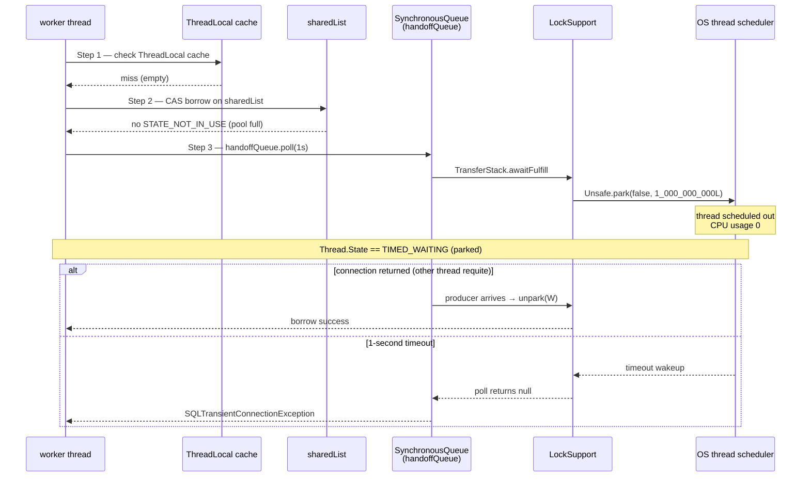
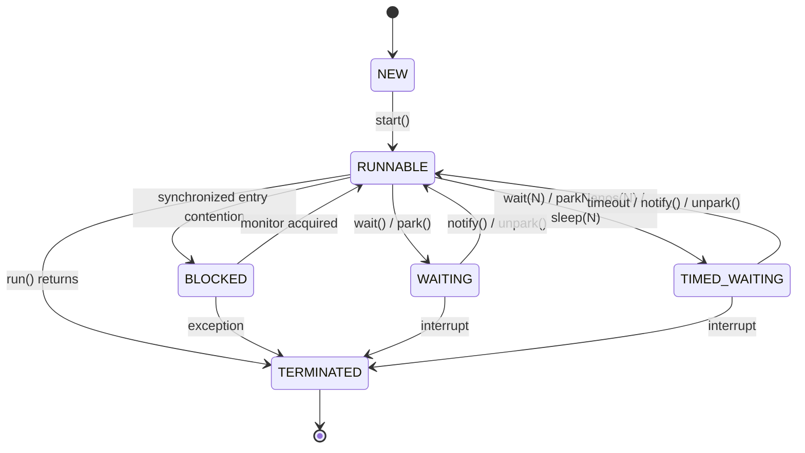

## Table of contents

## Intro — Is Pool Exhaustion an Application Problem, or a JVM Problem? {#intro}

3 AM. You get an alert: payment API P99 jumped from 200ms to 6 seconds. The code is identical to yesterday's. The external PG status page is green. Yet the system is melting down.

At this point, staring at logs and metrics yields nothing. `error_rate` is 0%, `success_rate` is 100% — yet users are looking at frozen screens for 6 seconds. The monitoring tells you the system is **fine** while it is in fact **completely stuck**.

The real evidence sits in one place — the **Thread Dump**.

```
"http-nio-8080-exec-3" #42 daemon prio=5 tid=0x00007f8b... nid=0x103
   java.lang.Thread.State: TIMED_WAITING (parked)
        at jdk.internal.misc.Unsafe.park(java.base@21/Native Method)
        - parking to wait for  <0x00000007a5b30c10> (a java.util.concurrent.SynchronousQueue$TransferStack)
        at java.util.concurrent.locks.LockSupport.parkNanos(...)
        at java.util.concurrent.SynchronousQueue$TransferStack.transfer(...)
        at com.zaxxer.hikari.util.ConcurrentBag.borrow(...)
        at com.zaxxer.hikari.pool.HikariPool.getConnection(...)
        at com.zaxxer.hikari.HikariDataSource.getConnection(...)
        at org.springframework...DataSourceUtils.fetchConnection(...)
        ...
```

The answer is in a single dump. **Every worker thread** is in `TIMED_WAITING (parked)` inside HikariCP's `getConnection()`. What is happening **inside** the JVM right now — that is the truth the dump is telling you.

This post takes that dump apart **line by line**.

- The **sister post** — [Spring Transactions and External API Calls — Reproducing Pool Exhaustion and Comparing Three Remedies (Simple Split, Saga, Outbox) by Measurement](/en/posts/spring-transaction-external-api-pool-exhaustion/) — covered the same incident from a **business pattern** angle (Saga / Outbox). This post replays **the same transaction-with-external-call pool-exhaustion measurements through a JVM lens — Thread Dump / Thread State / HikariCP internals / LockSupport / GC**. The two posts are paired.
- Input: the transaction-with-external-call pool-exhaustion measurement [measured — Java/Spring] (timeout 5s = 100% pass / P99 6.3s, timeout 1s = 16.7% pass / 50 timeouts) + the three-prescription comparison's 9-scenario matrix.
- Depth: **L3-L4** ([JVM/Java Mastery series](/en/posts/jvm-java-mastery-01-hikari-pool-thread-dump/) Part 1 — **measurement + JVM mechanics + big-tech operations + interview answers**).

---

## 1. The Operational Surface — What You See When the Pool Exhaustion Alert Fires {#operational-surface}

The sister post handled the same transaction-with-external-call pool-exhaustion measurement from the business angle, so I will only briefly reprise the operational surface here.

### 1.1 Two Faces of Pool Exhaustion [measured — Java/Spring]

Same pool exhaustion, but the `connection-timeout` value flips **the signal the operations team receives**:

| Metric | timeout 5s | timeout 1s |
|---|---|---|
| Success rate | **100%** | **16.7%** |
| P99 | 6,350 ms | 3,302 ms |
| Pool timeout | 0 | **50** |
| `awaitingConnection` peak | 20 | 50 |
| What monitoring sees | "fine" | "incident" |

The sister post moved on to **Saga / Outbox / Simple Split** from here. This post moves **inside the JVM** at the moment of dump capture.

### 1.2 Why the Code Alone Doesn't Tell You Anything

```java
@Transactional
public void confirm(PaymentRequest req) {
    Payment p = repo.find(req.id());
    PgResponse r = pgClient.confirm(req);   // external call — usually 200ms
    p.applyResult(r);
    repo.save(p);
}
```

You can stare at this code all day. Nothing is wrong. The **observation** that the external PG slowed from 200ms to 3,000ms is not on the status page. **Where, inside the JVM, the thread is **waiting** for what** — that is the thread dump's job.

---

## 2. The Entry Points to a Thread Dump — Where and How to Capture One {#thread-dump-entry-points}

### 2.1 Four Capture Tools

| Tool | Command | Use | Overhead |
|---|---|---|:---:|
| **`jstack`** | `jstack <pid>` | One-shot thread dump | ~0 |
| **`kill -3`** | `kill -3 <pid>` | SIGQUIT — dump to stdout (stderr) | ~0 |
| **`jcmd`** | `jcmd <pid> Thread.print` | jstack replacement (recommended Java 8+) | ~0 |
| **JFR** | `jcmd <pid> JFR.start duration=30s` | 30-second continuous profile (incl. lock contention) | < 1% |
| **async-profiler** | `./profiler.sh -d 30 <pid>` | Flame graph (incl. native frames) | < 1% |

The standard production runbook:

1. **First 5 minutes** — `jcmd <pid> Thread.print > dump.txt` immediately, **3 times at 5-second intervals** (to distinguish **momentary** from **persistent**)
2. **Next 30 minutes** — JFR 30-second capture (lock contention / Java Monitor Wait events)
3. **Long term** — async-profiler flame graph (native frames included — JNI / Direct Memory issues)

### 2.2 Spring Actuator `/actuator/threaddump`

If Spring Boot is already deployed, you can pull a dump without touching code:

```bash
curl -s http://localhost:8080/actuator/threaddump | jq '.'
```

JSON-shaped, which is convenient for automated analysis. Just **be careful with production exposure** — keep it behind a security group or a separate actuator port.

### 2.3 Three Captures, Not One

A single dump is a **snapshot**. If the same thread sits in **the same stack frame across multiple dumps** — that is the real stuck.

```bash
# Capture 3 times at 5-second intervals
for i in 1 2 3; do
  jcmd <pid> Thread.print > dump-$i.txt
  sleep 5
done
```

If the same thread sits in the same frame across all three dumps, you have **evidence of being frozen for 15 seconds**. Never draw a conclusion from a single dump.

---

## 3. Dissecting a Thread Dump — JVM at the Moment of Pool Exhaustion {#thread-dump-anatomy}

The main course. Here is the **shape** of a dump captured during the pool-exhaustion measurement's Run #2 (timeout 1s, concurrent 60, extDelay 3s), unpacked line by line.

### 3.1 A Healthy Thread (RUNNABLE)

First, **normal**. Pool not empty:

```
"http-nio-8080-exec-1" #41 daemon prio=5 os_prio=31 cpu=12.34ms
   java.lang.Thread.State: RUNNABLE
        at java.net.SocketInputStream.socketRead0(java.base@21/Native Method)
        at java.net.SocketInputStream.socketRead(...)
        at com.mysql.cj.protocol.a.SimpleSocketConnection.read(...)
        at com.mysql.cj.protocol.a.NativePacketReader.readMessageLocal(...)
        ...
        at com.mysql.cj.jdbc.ClientPreparedStatement.executeQuery(...)
        at com.zaxxer.hikari.pool.HikariProxyPreparedStatement.executeQuery(...)
        at org.springframework.jdbc.core.JdbcTemplate$1.doInPreparedStatement(...)
        ...
        at com.example.OrderService.confirm(OrderService.java:42)
```

**Line by line**:

| Line | Meaning |
|---|---|
| `Thread.State: RUNNABLE` | OS-runnable. The JVM's **logical** classification — actually it might be **blocked** in a socket read (paradoxically, JVM treats native I/O as RUNNABLE) |
| `socketRead0` | Waiting for the DB response — scheduled out by the OS inside native code |
| `executeQuery` | SQL in flight |
| `OrderService.confirm:42` | Business code entry |

This thread is **doing real work**. No issue.

### 3.2 A Thread at Pool Exhaustion (TIMED_WAITING parked)

```
"http-nio-8080-exec-3" #42 daemon prio=5 os_prio=31 cpu=0.05ms tid=0x00007f8b001
   java.lang.Thread.State: TIMED_WAITING (parked)
        at jdk.internal.misc.Unsafe.park(java.base@21/Native Method)
        - parking to wait for  <0x00000007a5b30c10> (a java.util.concurrent.SynchronousQueue$TransferStack)
        at java.util.concurrent.locks.LockSupport.parkNanos(LockSupport.java:269)
        at java.util.concurrent.SynchronousQueue$TransferStack.transfer(SynchronousQueue.java:401)
        at java.util.concurrent.SynchronousQueue.poll(SynchronousQueue.java:903)
        at com.zaxxer.hikari.util.ConcurrentBag.borrow(ConcurrentBag.java:162)
        at com.zaxxer.hikari.pool.HikariPool.getConnection(HikariPool.java:179)
        at com.zaxxer.hikari.pool.HikariPool.getConnection(HikariPool.java:144)
        at com.zaxxer.hikari.HikariDataSource.getConnection(HikariDataSource.java:99)
        at org.springframework.jdbc.datasource.DataSourceUtils.fetchConnection(...)
        ...
        at com.example.OrderService.confirm(OrderService.java:38)
```

This is the **signature** of pool exhaustion:

| Line | Meaning |
|---|---|
| `Thread.State: TIMED_WAITING (parked)` | A **time-bounded** park. Entered via `parkNanos(N)` |
| `Unsafe.park (Native Method)` | OpenJDK's `Unsafe.park` — **the OS thread is genuinely scheduled out** |
| `parking to wait for <0x...> (SynchronousQueue$TransferStack)` | **Which object** it is parked on — `SynchronousQueue`'s transfer stack |
| `LockSupport.parkNanos:269` | `parkNanos(blocker, nanos)` — JVM's standard park entry |
| `SynchronousQueue.poll(timeout)` | Hand-off queue — waiting for **a producer** |
| `ConcurrentBag.borrow:162` | HikariCP's connection borrow — falls into the SynchronousQueue path when the pool is empty |
| `OrderService.confirm:38` | Business code — the line that calls `dataSource.getConnection()` |

**Every line carries meaning**. Pool exhaustion is, mechanically, **threads waiting to be unparked from `LockSupport.parkNanos`**.

### 3.3 Thread State Distribution from a Single Dump — ASCII Bar

A dump from the pool-exhaustion measurement's Run #2 (60 workers, pool=10):

```
At idle:
RUNNABLE         ████ 4
TIMED_WAITING    ██████████████ 14    (Hikari housekeeper, scheduled tasks, etc.)
WAITING          █████████ 9
BLOCKED          0
                 ─────────────────────── 27 threads

At pool exhaustion (concurrent 60 → pool 10):
RUNNABLE         ██████████ 10        (active connections at work)
TIMED_WAITING    ██████████████████████████████████████████████████████████ 50  ← 50 workers all in parkNanos
                                                                           (HikariCP getConnection)
WAITING          █████████ 9
BLOCKED          0
                 ─────────────────────── 69 threads (60 workers + HikariCP & friends)
```

**TIMED_WAITING (parked) spikes to 50** — exactly matching `awaitingConnection=50` from the pool-exhaustion measurement's Run #2. The dump's thread state and Hikari's MXBean metric are **two facets of the same event**.

---

## 4. HikariCP Internals — JVM-Side View of ConcurrentBag and SynchronousQueue {#hikaricp-internals}

Now I unpack §3's stack trace at the **code level**. **Why** does HikariCP behave this way?

### 4.1 ConcurrentBag — The Core Data Structure of the Connection Pool

Simplified `borrow` from [HikariCP `ConcurrentBag.java`](https://github.com/brettwooldridge/HikariCP/blob/dev/src/main/java/com/zaxxer/hikari/util/ConcurrentBag.java):

```java
// HikariCP ConcurrentBag.java — borrow() core logic (simplified)
public T borrow(long timeout, TimeUnit timeUnit) throws InterruptedException {
    // Step 1: try ThreadLocal cache first
    final var list = threadList.get();
    for (int i = list.size() - 1; i >= 0; i--) {
        final var entry = list.remove(i).get();
        if (entry != null && entry.compareAndSet(STATE_NOT_IN_USE, STATE_IN_USE)) {
            return entry;
        }
    }

    // Step 2: try CAS on the shared list
    final int waiting = waiters.incrementAndGet();
    try {
        for (T bagEntry : sharedList) {
            if (bagEntry.compareAndSet(STATE_NOT_IN_USE, STATE_IN_USE)) {
                if (waiting > 1) {
                    listener.addBagItem(waiting - 1);   // signal pool growth
                }
                return bagEntry;
            }
        }

        // Step 3: pool empty — wait on handoffQueue
        listener.addBagItem(waiting);
        timeout = timeUnit.toNanos(timeout);
        do {
            final long start = currentTime();
            final T bagEntry = handoffQueue.poll(timeout, NANOSECONDS);   // ← parkNanos here
            if (bagEntry == null || bagEntry.compareAndSet(STATE_NOT_IN_USE, STATE_IN_USE)) {
                return bagEntry;
            }
            timeout -= elapsedNanos(start);
        } while (timeout > 10_000);

        return null;   // timeout — caller turns this into SQLTransientConnectionException
    } finally {
        waiters.decrementAndGet();
    }
}
```

The threads at pool exhaustion are stuck inside **Step 3**, in `handoffQueue.poll(timeout, NANOSECONDS)`. The `handoffQueue` is a `SynchronousQueue` — see §4.2.

### 4.2 SynchronousQueue — A **Zero-Capacity** Hand-Off Queue

From [OpenJDK `SynchronousQueue.java`](https://github.com/openjdk/jdk/blob/master/src/java.base/share/classes/java/util/concurrent/SynchronousQueue.java):

> **SynchronousQueue is a BlockingQueue with capacity 0**. `put(x)` waits **until another thread calls take()**; `take()` waits **until another thread calls put()**. The queue stores **no element internally** — it is a pure hand-off channel.

Why HikariCP uses a SynchronousQueue:

- **Fairness** — `SynchronousQueue(true)` enforces FIFO. The thread that started waiting first gets served first.
- **Zero-copy hand-off** — the connection object is passed **directly**, never stored. Minimal GC pressure.
- **Wait-free poll** — `poll(0)` on an empty queue returns null immediately. The common path (pool not empty) stays **fast**.

```java
// SynchronousQueue.poll(timeout) — calls TransferStack.transfer
public E poll(long timeout, TimeUnit unit) throws InterruptedException {
    Object e = transferer.transfer(null, true, unit.toNanos(timeout));
    if (e != null || !Thread.interrupted()) {
        return (E)e;
    }
    throw new InterruptedException();
}

// TransferStack.transfer — the waiting core
Object transfer(Object e, boolean timed, long nanos) {
    // If a matching producer exists, hand off immediately.
    // Otherwise push an SNode and call awaitFulfill(s, timed, nanos) → LockSupport.parkNanos
}
```

The `SynchronousQueue$TransferStack.transfer` and `LockSupport.parkNanos` lines in your dump map to exactly this code.

**ConcurrentBag.borrow as a sequence** — how it gets to `park` when the pool is empty:



In the pool-exhaustion measurement's Run #2, 50 threads exited via the **latter** path (1-second timeout → SQLTransientConnectionException).

### 4.3 LockSupport.parkNanos — How the JVM Puts a Thread to Sleep

From [OpenJDK `LockSupport.java`](https://github.com/openjdk/jdk/blob/master/src/java.base/share/classes/java/util/concurrent/locks/LockSupport.java):

```java
public static void parkNanos(Object blocker, long nanos) {
    if (nanos > 0) {
        Thread t = Thread.currentThread();
        setBlocker(t, blocker);                    // ← "parking to wait for" in the dump
        try {
            U.park(false, nanos);                  // ← Unsafe.park — native call
        } finally {
            setBlocker(t, null);
        }
    }
}
```

What **`Unsafe.park(false, nanos)`** means:

- `false` = **relative nanos**, not absolute time
- `nanos` = wake-up window (1s = 1,000,000,000)
- The OS thread is **truly** scheduled out — 0 CPU
- Wake conditions: (a) `nanos` expires, (b) another thread calls `unpark(thread)`, (c) interrupt, (d) spurious wakeup

For the pool-exhaustion measurement's Run #2 (timeout 1s), the 50 workers all call `parkNanos(blocker, 1_000_000_000L)` and sleep **up to 1 second**. After 1 second, if no thread has been unparked (no connection returned), `poll` returns null → HikariCP raises `SQLTransientConnectionException`.

### 4.4 Mapping the transaction-with-external-call pool-exhaustion measurements to the code

| Measurement | Cause in code |
|---|---|
| **timeout 5s, 100% pass (P99 6.3s)** | `parkNanos(5_000_000_000L)` — within 5 seconds, a producer (some other worker returning a connection) **always** arrives → all hand-offs succeed |
| **timeout 1s, 16.7% pass (50 timeouts)** | `parkNanos(1_000_000_000L)` — no producer within 1 second. First wave of 10 borrows immediately; the other 50 return null after 1 second |
| **`awaitingConnection` peak = 50** | The thread count after `waiters.incrementAndGet()` and entry into `handoffQueue.poll`. Exposed by the MXBean |
| **P99 6.3s = 3 waves × 2s** | First wave immediate / second wave 2s later (after a connection is returned) / third wave 4s later. `parkNanos` sleeps **exactly** that long |

**Dump line ↔ code ↔ measurement** are 1:1:1. This is why the thread dump is the real evidence.

### 4.5 connectionTimeout / idleTimeout / maxLifetime — JVM Side

| Parameter | Meaning | JVM behavior |
|---|---|---|
| `connectionTimeout` (default 30s) | `getConnection()` **wait** timeout | The `nanos` value in `parkNanos(timeout)` |
| `idleTimeout` (default 10min) | Idle-connection eviction threshold | HikariCP housekeeper periodically `evict`s |
| `maxLifetime` (default 30min) | Connection retirement threshold | Set shorter than the DB's `wait_timeout` (typically 28min) — to avoid the **MySQL closes first** race |
| `validationTimeout` (default 5s) | Connection alive-check timeout | `Connection.isValid(timeoutSeconds)` |

Operational traps:

- A `connectionTimeout` **too long** (60s+) makes pool exhaustion show up as **latency** and slip past monitoring (the "silent latency" pattern from §1.2 in the sister post).
- A `connectionTimeout` **too short** (≤1s) causes fail-fast cascades on routine external spikes.
- Practical recommendation: 30s (Hikari default) — but **always paired with an `awaitingConnection > 0` alert**.

---

## 5. The JVM Thread State Machine — 6 States and Transitions {#jvm-thread-state-machine}

Reading `Thread.State: TIMED_WAITING (parked)` in a dump requires understanding the **Thread.State machine**.

### 5.1 6 States ([Oracle Thread.State javadoc](https://docs.oracle.com/en/java/javase/21/docs/api/java.base/java/lang/Thread.State.html))

| State | Meaning | Where you see it in dumps |
|---|---|---|
| `NEW` | After construction, before `start()` | Almost never seen (ephemeral) |
| `RUNNABLE` | JVM-classified as **runnable** (the OS may have scheduled it out anyway) | Healthy work threads / native I/O waits (paradox) |
| `BLOCKED` | Waiting on a `synchronized` monitor | `synchronized` entry / native lock waits |
| `WAITING` | **Untimed** wait (`Object.wait()`, `LockSupport.park()`) | Untimed await — `take()` / `put()` |
| `TIMED_WAITING` | **Timed** wait (`wait(N)`, `parkNanos(N)`, `sleep(N)`) | **Pool exhaustion — the `parkNanos` call** |
| `TERMINATED` | After `run()` returns | Not visible (reaped) |

### 5.2 Transition Diagram



### 5.3 The **Exact** Place Where a Pool-Exhausted Thread Sits

**Path**:

```
RUNNABLE
  → (calls dataSource.getConnection())
  → ConcurrentBag.borrow() steps 1, 2 fail (pool empty)
  → handoffQueue.poll(1s, NANOSECONDS)
  → SynchronousQueue.TransferStack.awaitFulfill(...)
  → LockSupport.parkNanos(blocker, 1_000_000_000L)
  → Unsafe.park (native)
  → OS thread scheduled out
  ⇒ Thread.State == TIMED_WAITING (parked)
```

The thread **sits in TIMED_WAITING for up to 1 second**, then exits one of two ways:

1. **Another thread returns a connection → SynchronousQueue.put → unpark(this)** ⇒ TIMED_WAITING → RUNNABLE
2. **1-second timeout → auto-wake → poll() returns null** ⇒ TIMED_WAITING → RUNNABLE → throw SQLTransientConnectionException

In the pool-exhaustion measurement's Run #2, **50 threads exit via path (2)** (50 pool timeouts). In Run #1 (timeout 5s), **every thread takes path (1)** — wave by wave, threads get unparked.

### 5.4 The RUNNABLE Trap — JVM's **Logical** State vs the OS's **Actual** State

The most confusing part of dump reading.

> **RUNNABLE does not mean "currently executing on a CPU"**. It means the JVM has classified the thread as **runnable** — the OS might have scheduled it out, or it might be stuck inside native I/O (a socket read).

```
"http-nio-8080-exec-1"
   java.lang.Thread.State: RUNNABLE
        at java.net.SocketInputStream.socketRead0(java.base@21/Native Method)
```

This thread is **RUNNABLE while OS-blocked in a socket read**. From the JVM's perspective, **it's RUNNABLE because this isn't a JVM-managed wait — it's native I/O**. A common point of confusion in production dump analysis.

**Heuristic**:

| Top of stack | Real state |
|---|---|
| `socketRead0` / `epoll_wait` / `Native Method` | OS-level block (DB / network I/O wait) |
| `LockSupport.park*` | JVM-level park (Lock / SynchronousQueue / etc.) |
| Business method | Genuinely executing |

When reading dumps, **don't look at `Thread.State` alone — always read the **top frame of the stack** too**.

---

## 6. The three-prescription comparison's 9 Scenarios → How the Thread Dump Changes {#nine-scenarios-thread-states}

How does the dump **differ** for Simple Split / Saga / Outbox from the sister post? A short JVM-side comparison.

### 6.1 Per-Pattern Dump Signatures

| Pattern | Worker thread state distribution | Auxiliary threads |
|---|---|---|
| **No split** (Step 1 baseline) | RUNNABLE 10 (in external call) + TIMED_WAITING 50 (`parkNanos` waiting on pool) | — |
| **Simple split** | RUNNABLE 10 (in external call) + WAITING 50 (sleeping **outside** the transaction) | — |
| **Saga** | RUNNABLE 10 + WAITING 50 + sweeper 1 (TIMED_WAITING `Thread.sleep`) | sweeper |
| **Outbox** | RUNNABLE 0 / all workers terminate after ACK + poller 1 (`socketRead0` on external call) | poller |

Only **No split** has 50 threads parked **inside HikariCP**. The split patterns sleep or terminate **outside** Hikari during the external call.

### 6.2 The **Threads Disappearing** Effect of Outbox

```
No split (60 workers concurrent):
  ─────────────────────────────────────────────
  RUNNABLE         ██████████ 10
  TIMED_WAITING    ██████████████████████████████████████████████████ 50
  ─────────────────────────────────────────────
  HEAP : 60 worker stacks accumulated

Outbox (60 workers, immediate ACK):
  ─────────────────────────────────────────────
  RUNNABLE         ██ 2  (poller 1 + housekeeper 1)
  TIMED_WAITING    █████ 5
  ─────────────────────────────────────────────
  HEAP : worker stacks immediately GC-eligible
```

The thread **count** itself drops. From a JVM stack-memory standpoint, this is also significant — 60 stacks (1MB each by default) = 60MB saved.

### 6.3 The Saga Sweeper Thread

A separate thread loops every 5 seconds and runs an `UPDATE`. In the dump:

```
"saga-sweeper-1" #87 prio=5
   java.lang.Thread.State: TIMED_WAITING (sleeping)
        at java.lang.Thread.sleep0(java.base@21/Native Method)
        at java.lang.Thread.sleep(...)
        at com.example.SagaSweeper.run(SagaSweeper.java:45)
```

`Thread.sleep` is implemented similarly to `parkNanos` internally (it's an `Object.wait` variant). In the dump it is distinguished by the `(sleeping)` qualifier.

### 6.4 The Dump-Side View of the three-prescription comparison's A/OFF awaiting=57 [measured]

In §3.1 of the sister post, we measured **"after sleep(3,000ms) ends, 60 workers issue INSERTs simultaneously → pool of 10 saturated → awaiting=50+ spike"**.

A dump captured **at that instant**:

```
RUNNABLE         ██████████ 10  (running INSERT)
TIMED_WAITING    █████████████████████████████████████████████████████████ 57  (parkNanos)
─────────────────────────────────────────────
Duration: ~50ms (10 INSERTs × 5ms each)
```

A **momentary spike**. After 50ms the pool drains and the dump returns to normal. Whether you catch it depends on **capture timing luck** — which is exactly why §2.3 stresses **three captures**.

---

## 7. Operational Monitoring — JVM Metrics + Automated Thread Dump Capture {#monitoring-grafana-jvm}

Dumps are **post-hoc analysis tools**. The **real-time** signal must come from metrics.

### 7.1 JVM Metrics for Grafana (Prometheus + Micrometer)

| Metric | Threshold | Meaning |
|---|---|---|
| `hikaricp_pending_threads` | > 0 (sustained) | `awaitingConnection` — **direct** signal of pool exhaustion |
| `hikaricp_active_connections / hikaricp_max` | > 0.8 (sustained) | Utilization above 80% |
| `jvm_threads_states_threads{state="timed-waiting"}` | spike detection | TIMED_WAITING surge |
| `jvm_threads_states_threads{state="blocked"}` | > 5 | `synchronized` contention |
| `jvm_gc_pause_seconds` | P99 > 200ms | Anomalous GC pause |
| `jvm_memory_used_bytes{area="heap"}` | > 0.85 × max | OOM risk |
| `process_cpu_usage` | sustained > 0.8 | CPU saturation |

**The exact definition of a "pool exhaustion alert"**:

```
hikaricp_pending_threads > 0 for 30s
  AND hikaricp_active_connections == hikaricp_max
```

→ Ignore **momentary spikes** (50ms); alert only on **30-second persistence**. This threshold also naturally filters out the A/OFF spike from §6.4.

### 7.2 Automated Thread Dump Capture — Pull Dumps at Alert Trigger

A production best practice — you need the dump **at the moment the alert fires**. A dump pulled by a human SSH-ing in 30 minutes later is already past the incident window.

**Three implementation options**:

1. **Prometheus alertmanager → webhook → dump capture script**
   ```bash
   #!/bin/bash
   # /etc/alertmanager/scripts/capture-dump.sh
   PID=$(pgrep -f "java.*app.jar")
   for i in 1 2 3; do
     jcmd $PID Thread.print > /var/log/dumps/dump-$(date +%s)-$i.txt
     sleep 5
   done
   # Upload to S3 or central log store
   ```

2. **JFR continuous recording — extract a dump on alert**
   ```bash
   # Boot-time
   java -XX:StartFlightRecording=name=cont,maxsize=200M,disk=true ...
   # On alert
   jcmd $PID JFR.dump name=cont filename=/var/log/jfr/snap.jfr
   ```

3. **Datadog / NewRelic / Pinpoint APM — Continuous Profiling**
   - Datadog Java Profiler: thread dump + lock contention + allocation, automatically
   - 5-minute window automatically retained at alert time
   - Pros: minimal infrastructure burden / Cons: cost + lock-in

### 7.3 Spring Actuator + Custom Endpoint

```java
@RestController
public class DumpController {
    @GetMapping("/admin/threaddump")
    public Map<String, Object> dump() {
        var bean = ManagementFactory.getThreadMXBean();
        var infos = bean.dumpAllThreads(true, true);
        return Map.of(
            "timestamp", Instant.now(),
            "threads", Arrays.stream(infos)
                .map(t -> Map.of(
                    "name", t.getThreadName(),
                    "state", t.getThreadState().name(),
                    "stack", Arrays.stream(t.getStackTrace())
                        .map(StackTraceElement::toString)
                        .toList()
                )).toList()
        );
    }
}
```

JSON-shaped, friendly to **automated analysis**. You can immediately compute **count-by-state** / **threads sharing the same stack** / **threads holding HikariCP frames** as metrics.

---

## 8. Production Failure Scenarios (3 AM Edition) {#failure-scenarios}

### 8.1 Sudden Pool Exhaustion — First 5 Minutes

**Alert**: `hikaricp_pending_threads > 0 for 30s` + P99 spike

| Min | Action | Tool |
|---|---|---|
| 0:00 | Receive alert | PagerDuty |
| 0:01 | Verify automated dump capture (did the webhook fire?) | S3 / central logs |
| 0:02 | Inspect dump's thread state distribution — confirm TIMED_WAITING 50+ → pool exhaustion **confirmed** | Dump analyzer |
| 0:03 | Look at **frames just above** `parkNanos` — `OrderService.confirm:38` → suspect external call | Dump |
| 0:04 | Check external PG status page / latency metrics | Grafana |
| 0:05 | Confirm external mean 200ms → 5,000ms → root cause **confirmed** | Metrics |

**Five minutes to root cause**. Without automated dump capture, this stretches to 30 minutes.

### 8.2 Suspected Memory Leak — JFR 30-Second Capture

**Alert**: heap usage approaching 95% + GC frequency rising

```bash
# Capture immediately, no need to enter the production stack
jcmd <pid> JFR.start name=leak duration=30s filename=/tmp/leak.jfr
sleep 30
# Analyze with JMC (Java Mission Control) — Old Object Sample / Allocation Profile
```

JFR's **Old Object Sample** event tells you directly **which class is not being GC'd**. You can chase a leak without taking a multi-GB heap dump.

### 8.3 GC Pause Co-Occurrence — Enable `-Xlog:gc*`

**Alert**: P99 latency 200ms → 2,000ms + heap usage normal

A dump alone isn't enough. During GC, **all threads briefly pause** (STW — Stop The World) — and you can't take a dump in that instant either.

```bash
# At boot (if you can restart)
java -Xlog:gc*:file=/var/log/gc.log:time,uptime,level,tags ...

# At runtime (no restart needed)
jcmd <pid> VM.log decorators=time,level output=/var/log/gc.log what=gc*=info
```

GC log analysis:

```
[2026-05-03T03:14:23.456+09:00][info][gc] GC(42) Pause Young (G1 Evacuation Pause) 245ms
                                                           ↑ normal (< 100ms expected)
[2026-05-03T03:15:01.891+09:00][info][gc] GC(43) Pause Full (G1 Compaction Pause) 2,340ms
                                                           ↑ abnormal — Full GC fired, suspect Old fragmentation
```

If Full GCs occur **back to back**, heap is short → bump `-Xmx` or chase the leak (§8.2).

---

## 9. Big-Tech Cases — Real-World Dumps / GC / Concurrency {#bigtech-references}

How the same patterns measured in this post have been handled in the wild.

### 9.1 Toss SLASH — A Week to the Customer (Distributed Lock + JPA OptimisticLock)

[haon.blog SLASH22 — broker issue / concurrency / network latency](https://haon.blog/article/toss-slash/broker-issue-concurrency-and-network-latency/) covers a Toss case:

- External broker latency increased → JPA `@Version` (Optimistic Lock) conflict spike
- Thread dump analysis → contention inside `EntityManager.flush()` `version` comparisons
- Resolution: distributed lock + retry policy adjustment

The same structural incident as "external call latency rises → pool exhaustion" in this post. The broker plays the role of outbox publish; JPA plays the role of the confirm transaction.

### 9.2 KakaoPay — JPA Transactional readOnly + set_option, +58% QPS

[tech.kakaopay.com — JPA Transactional readOnly](https://tech.kakaopay.com/post/jpa-transactional-bri/) — a single transaction-attribute change yields 58% QPS gain.

- The effect of `@Transactional(readOnly = true)`: skips MySQL `set autocommit=0`
- Pool occupancy time drops → `awaitingConnection` stays at 0 in steady state
- Thread dump analysis surfaced **unnecessary transactions**

The same mechanism as "pool occupancy = duration of external call". `readOnly` is the same lever applied differently.

### 9.3 Netflix — Java in Flames

[Netflix Tech Blog — Java in Flames](https://netflixtechblog.com/java-in-flames-e763b3d32166) — async-profiler + flame graph in production.

- async-profiler runs **continuously** across **every** JVM in production
- Four flame graphs: CPU / wall-clock / lock contention / allocation
- The key insight beyond a thread dump is the **time axis** — **how often** you sit in this frame

This is exactly the **async-profiler** tool from §2.1, generalized as a production-wide best practice.

### 9.4 Uber — JVM Profiler (Open Source)

[github.com/uber-common/jvm-profiler](https://github.com/uber-common/jvm-profiler) — Uber's distributed JVM profiler.

- Profiles **thousands of executors** simultaneously across Spark / Flink
- Unified collection of thread dumps + GC + memory + CPU
- Publishes to Kafka → centralized analysis

The §7.2 "automated dump capture" pattern, scaled out for distributed environments.

### 9.5 Datadog — Continuous Profiling for Java

[docs.datadoghq.com — Profiler](https://docs.datadoghq.com/profiler/) — JFR-based continuous profiling SaaS.

- **Wall Time** view: **how long each method waits** — directly identifies pool exhaustion
- **Lock Hold Time** view: lock-hold time — directly surfaces `synchronized` contention
- 5-minute window auto-retained at alert time — option (3) in §7.2

This post's dump analysis, fully automated and continuous. A cost-vs-operational-burden trade-off.

### 9.6 Woowahan — DB Connection Holding Trap

[techblog.woowahan.com — MySQL Distributed Lock GET_LOCK Same-Connection Trap](https://techblog.woowahan.com/2631/) — a distributed lock holding **the same connection**, exhausting the pool.

- `GET_LOCK('key', timeout)` is **bound to the calling connection**. Other work on the same connection deadlocks.
- The dump shows every thread stuck inside `GET_LOCK`
- Resolution: route the distributed lock through a separate pool, or switch to Redisson

A different take on this post's lesson that "the DB Connection becomes a synchronization resource".

---

## 10. Interview Answers {#interview-answers}

### Q1. "When the pool exhaustion alert fires, what do you capture first?"

> "I take a thread dump **3 times at 5-second intervals** (`jcmd <pid> Thread.print`). A single dump can't distinguish **momentary** from **persistent**. If the same threads sit in the same stack frames across all three, they are genuinely stuck. Then I look at the thread state distribution — if TIMED_WAITING (parked) spikes, pool exhaustion; if BLOCKED spikes, `synchronized` contention; if RUNNABLE with `socketRead0` on top of stack, external I/O wait. In the transaction-with-external-call pool-exhaustion measurement [measured] Run #2, all 50 workers shared a `LockSupport.parkNanos` and `ConcurrentBag.borrow` stack — pool exhaustion confirmed from a single dump."

### Q2. "What does the PARKED state in a thread dump actually mean?"

> "It's a substate of TIMED_WAITING in the JVM's 6-state model. You enter it via `LockSupport.parkNanos(blocker, nanos)`. Internally that calls `Unsafe.park(false, nanos)` — **the OS thread is genuinely scheduled out**. CPU usage drops to 0. The wake conditions are (a) timeout, (b) another thread calls `unpark(thread)`, (c) interrupt, (d) spurious wakeup. For HikariCP it's (a) or (b) — if a connection is returned, (b) wakes you up to RUNNABLE; if not, (a) wakes you up only to throw `SQLTransientConnectionException`. The `parking to wait for <0x...>` line in the dump tells you **which object** is the blocker — for HikariCP it's `SynchronousQueue$TransferStack`. Those two pieces confirm pool exhaustion."

### Q3. "Why does HikariCP use SynchronousQueue?"

> "SynchronousQueue is a BlockingQueue with capacity 0. `put()` waits for **another thread to take()**, and `take()` waits for **another thread to put()** — nothing is ever stored in the queue. That's exactly the right shape for handing off a connection. First, zero-copy hand-off — connections are never stored, so zero GC pressure. Second, with `SynchronousQueue(true)` you get FIFO fairness — the first thread to wait gets served first. Third, `poll(0)` returns null immediately on an empty queue — the common path (pool not empty) stays fast. Even in the pool-exhaustion measurement the 50 awaiting threads all parked precisely inside `SynchronousQueue.poll(timeout, NANOSECONDS)`."

### Q4. "What can a thread dump **not** tell you?"

> "Three things. First, **GC pauses** — during STW all threads pause, and you can't take a dump in that instant either. You need `-Xlog:gc*` and a separate GC log. Second, **memory leaks** — a dump doesn't tell you **which objects** are held in the heap. You need `jmap -dump` (heap dump) or JFR Old Object Sample. Third, **the time axis** — a dump is a **single snapshot**. **How often** you sit in a frame is invisible. A wall-clock profiler like async-profiler or Datadog Continuous Profiling shows the **time fraction**. In production we run dump + GC log + JFR + APM in concert — any single tool always leaves a blind spot."

---

## 11. What I Learned {#key-takeaways}

### 11.1 The One-Liner

> **"A pool exhaustion alert isn't an application-code bug — it's a JVM-internal state where threads are stuck inside `LockSupport.parkNanos`."** A single dump proves this line by line. The transaction-with-external-call pool-exhaustion measurement [measured]: 50 workers sharing the `ConcurrentBag.borrow` → `SynchronousQueue.poll` → `LockSupport.parkNanos` → `Unsafe.park` stack is the evidence.

### 11.2 Assumptions Broken by Measurement

- "Pool exhaustion = code bug" → **No** — code is fine; this is a function of **external dependency latency × pool size**.
- "RUNNABLE = currently running" → **Half-truth** — it's a **logical** JVM classification. It might be native I/O.
- "One dump is enough" → **No** — three captures at 5-second intervals are the minimum unit for distinguishing **momentary** from **persistent**.
- "Hikari uses a SynchronousQueue, that's just a simple queue, right?" → **No** — capacity-0 hand-off / FIFO / zero-copy are intentional.

### 11.3 Where This Post Sits in the JVM Mastery Series

Part 1 (the flagship) of the [JVM/Java Mastery series](/en/posts/jvm-java-mastery-01-hikari-pool-thread-dump/) — a deep-dive that ties the operational graph to JVM mechanics through one incident. Continues in:

- **Part 2 — Java Concurrency** (`synchronized` / `Lock` / `Atomic` / `LongAdder`) — extending this post's lesson that **the DB Connection becomes a synchronization resource** into explicit synchronization primitives
- **Part 3 — JVM Memory Layout** (Heap / Metaspace / Direct / Stack) — broadening this post's **60MB of thread stacks** into the full memory geography
- **Part 4 — GC Algorithms** (G1 / ZGC / Shenandoah) — the proper measurement of §8.3's **GC pause co-occurrence** scenario
- **Part 8 — CompletableFuture** — async fan-out measurements for the **Outbox poller** in this post
- **Part 10 — JFR / async-profiler** — the full-blown version of §7-8's monitoring + automated dump capture
- **Part 11 — Virtual Threads (Loom)** — what happens to **parkNanos** under carrier thread pinning

---

## 12. In the Next Post {#next-post}

- The lock comparison measurement (optimistic / pessimistic / GET_LOCK / Redisson) — thread state differences between `synchronized` and `ReentrantLock` (planned in a follow-up series)
- Spring Batch 1M-row backfill — G1 vs ZGC pause distribution (follow-up measurement planned)
- Coroutines vs Virtual Thread comparison — Virtual Thread vs Coroutines for 100k I/O — how `parkNanos` behaves on a carrier thread (follow-up measurement planned)

---

## References {#references}

### Specifications and Source
- [Oracle — Thread.State javadoc (Java 21)](https://docs.oracle.com/en/java/javase/21/docs/api/java.base/java/lang/Thread.State.html) — definitions of the 6 states
- [Oracle — Troubleshooting Guide for HotSpot VM (Java 21)](https://docs.oracle.com/en/java/javase/21/troubleshoot/index.html) — dump / JFR / heap dump tooling
- [HikariCP `ConcurrentBag.java`](https://github.com/brettwooldridge/HikariCP/blob/dev/src/main/java/com/zaxxer/hikari/util/ConcurrentBag.java) — borrow / requite
- [HikariCP wiki — About Pool Sizing](https://github.com/brettwooldridge/HikariCP/wiki/About-Pool-Sizing) — pool-size formula
- [OpenJDK `SynchronousQueue.java`](https://github.com/openjdk/jdk/blob/master/src/java.base/share/classes/java/util/concurrent/SynchronousQueue.java) — TransferStack / TransferQueue
- [OpenJDK `LockSupport.java`](https://github.com/openjdk/jdk/blob/master/src/java.base/share/classes/java/util/concurrent/locks/LockSupport.java) — park / parkNanos
- [JEP 328 — Flight Recorder](https://openjdk.org/jeps/328) — JFR overhead < 1%

### Big-Tech Cases
- [Toss SLASH22 — Broker Issue / Concurrency / Network Latency](https://haon.blog/article/toss-slash/broker-issue-concurrency-and-network-latency/) — JPA OptimisticLock incident
- [KakaoPay — JPA Transactional readOnly QPS +58%](https://tech.kakaopay.com/post/jpa-transactional-bri/) — readOnly transaction effect
- [Netflix Tech Blog — Java in Flames](https://netflixtechblog.com/java-in-flames-e763b3d32166) — async-profiler in production
- [Uber — JVM Profiler (open source)](https://github.com/uber-common/jvm-profiler) — distributed JVM profiler
- [Datadog — Continuous Profiling for Java](https://docs.datadoghq.com/profiler/) — JFR-based SaaS profiler
- [Woowahan — MySQL Distributed Lock GET_LOCK Same-Connection Trap](https://techblog.woowahan.com/2631/) — connection-bound lock incident
- [NAVER D2 — Understanding Commons DBCP](https://d2.naver.com/helloworld/5102792) — pool size + TPS calculation

### Authors and Textbooks
- **Java Concurrency in Practice** — Brian Goetz (Ch. 10 Liveness / Ch. 13 Explicit Locks)
- [Aleksey Shipilëv — Synchronization Revisited](https://shipilev.net/blog/2014/all-fields-are-final/) — `synchronized` lock states
- [Doug Lea — A Java Fork/Join Framework](http://gee.cs.oswego.edu/dl/papers/fj.pdf) — work-stealing
- [Ron Pressler — Project Loom Slide](https://cr.openjdk.org/~rpressler/loom/loom/sol1_part1.html) — virtual thread park mechanics

### Sister Post
- [Spring Transactions and External API Calls — Reproducing Pool Exhaustion and Comparing Three Remedies (Simple Split, Saga, Outbox) by Measurement](/en/posts/spring-transaction-external-api-pool-exhaustion/) — the same transaction-with-external-call pool-exhaustion measurement from a **business pattern** angle

> **NDA Guardrails**: All measurements in this post are labeled `[measured — Java/Spring]`, the external platform is abstracted as `PlatformA` (further generalized for the blog), and no internal company code paths are referenced.
