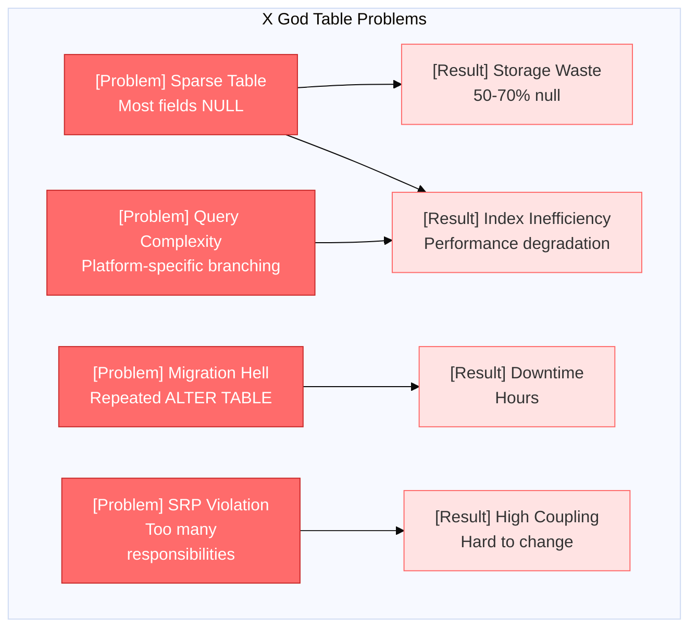
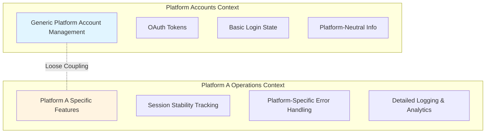
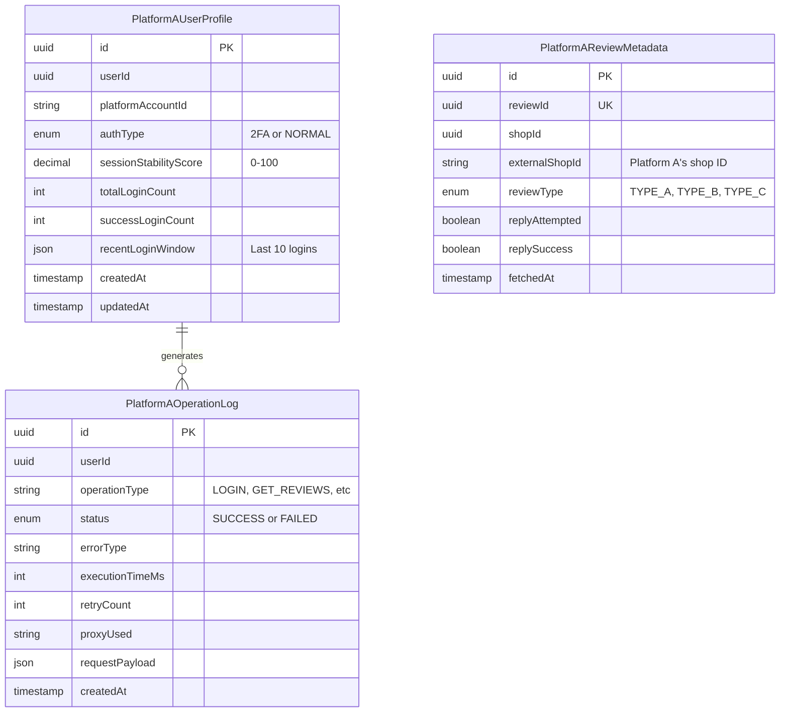
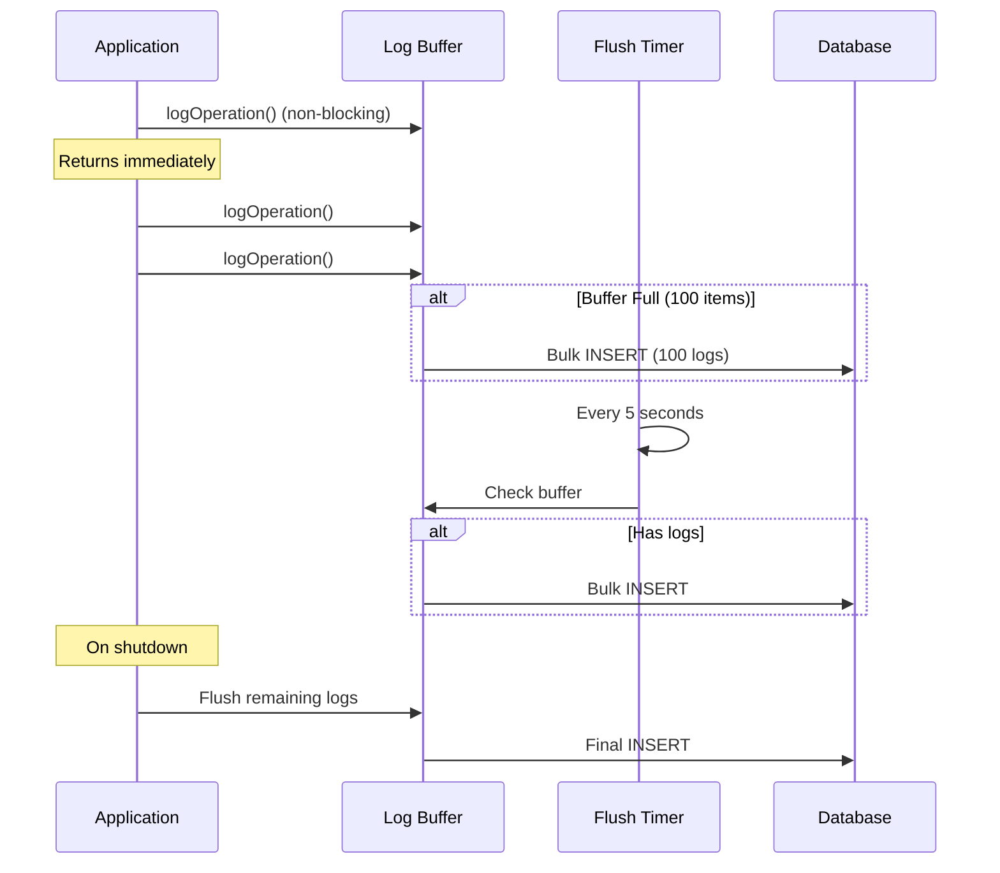
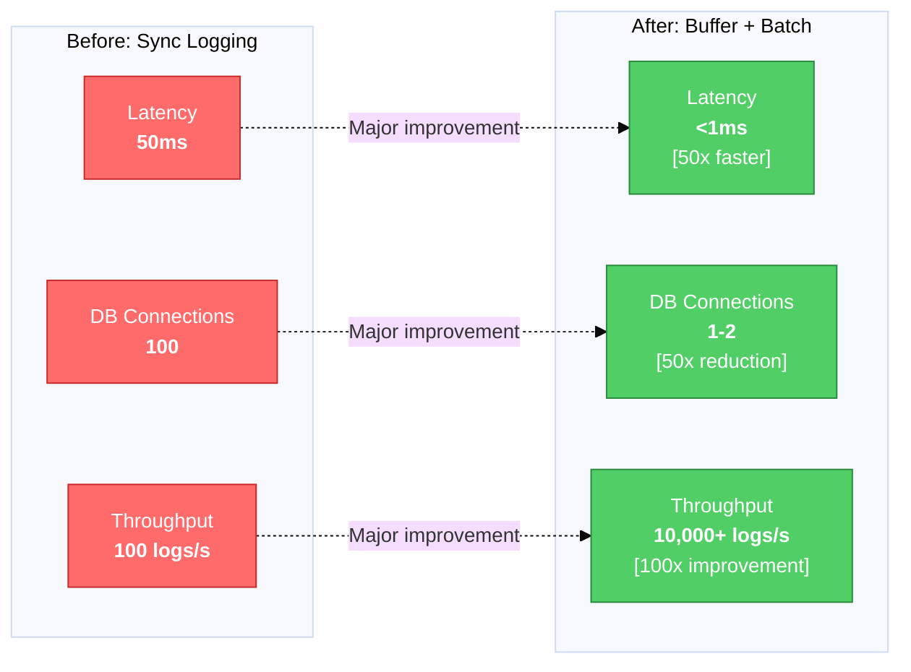
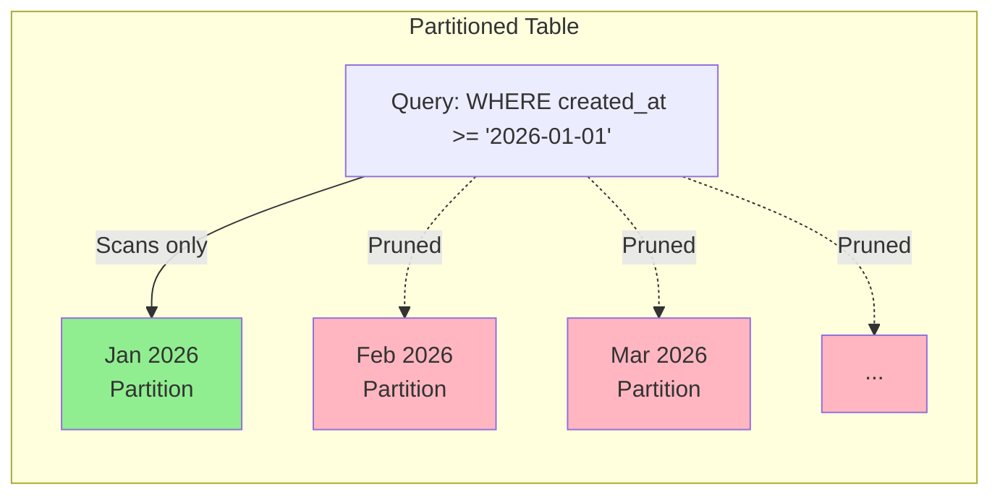
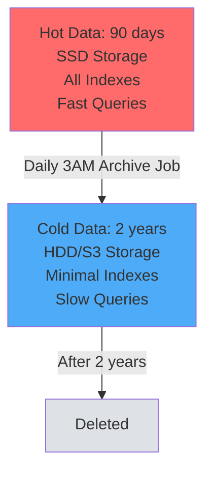

# Multi-Platform Database Design: Building Enterprise-Grade Logging Systems

## Table of Contents

## Executive Summary

This article shares our experience designing and implementing a database architecture for integrating a new external platform into our multi-platform review management system. We cover **the entire journey from problem discovery to solution, validation, and optimization**:

- Why generic tables aren't enough (The root problem)
- How to model platform-specific characteristics (Domain separation strategy)
- AI-assisted design validation process
- High-performance logging system design (Buffering, batch processing)
- Index strategy and query optimization (EXPLAIN-driven decisions)
- Data lifecycle management (Partitioning, archiving)
- Observability-driven schema design
- Trade-off analysis for every decision

**Final Result**: ~4,000 lines of code, 95% test coverage, production-ready solution

## 1. Problem: Limitations of Generic Tables

### 1.1 Background: Multi-Platform System

Our system collects and manages reviews from multiple e-commerce platforms. We were already integrated with Platforms B, C, and D when we discovered **fundamental limitations in our existing architecture** while adding Platform A.

### 1.2 Existing System Design

```typescript
// Generic platform account table
interface PlatformAccount {
  userId: string;
  platformId: string;      // 'platform-a', 'platform-b', etc.
  accessToken: string;
  isLoggedIn: boolean;
  lastLoginAt: Date;
}

// Generic review table
interface Review {
  id: string;
  shopId: string;
  platformId: string;
  content: string;
  rating: number;
  createdAt: Date;
}
```

This design is **platform-agnostic**. The advantage is that any platform can be handled with the same schema.

### 1.3 Problems Discovered During New Platform Integration

However, Platform A had **fundamentally different characteristics** from existing platforms:

#### Problem 1: Different Authentication Mechanisms per Platform

```typescript
// Platforms B, C, D: Simple OAuth
interface SimplePlatformAuth {
  accessToken: string;
  refreshToken: string;
}

// Platform A: Mixed 2FA + Simple Auth
interface PlatformAAuth {
  accessToken: string;
  authType: '2FA' | 'NORMAL';  // Two-factor auth status
  sessionStability: number;     // Session stability score
}
```

**Why this matters**:
- 2FA users have unstable sessions and require frequent re-authentication
- Error handling logic must branch based on auth type
- But our existing `PlatformAccount` table couldn't store this information

What if we add it to the existing table?
```typescript
// BAD: Sparse table problem
interface PlatformAccount {
  userId: string;
  platformId: string;

  // Platform A specific (null for other platforms)
  platformAAuthType?: '2FA' | 'NORMAL';
  platformASessionStability?: number;

  // Platform B specific (null for other platforms)
  platformBBusinessId?: string;

  // Growing list of platform-specific fields...
}
```

#### Problem 2: Unable to Quantify Session Stability

Our existing system only recorded "login success/failure". But what we wanted to know was:

```
"How stable is this user's Platform A session?"
→ Out of the last 100 login attempts, how many succeeded?
→ What's the pattern of the recent 10 attempts? (consecutive failures → need session refresh)
→ Average stability of 2FA users vs normal users
```

Without these metrics, **proactive session management** is impossible.

#### Problem 3: Platform-Specific Review Metadata

Platform A categorizes reviews into 3 types:
- **Type A**: Booking-based reviews (hospitals, salons)
- **Type B**: Receipt-based reviews (restaurants)
- **Type C**: Delivery/pickup reviews

Each type has different **reply capabilities, API endpoints, and collection methods**. Our existing `Review` table was platform-neutral and couldn't accommodate this specialized information.

#### Problem 4: Lack of Observability

Web scraping-based integration is inherently **unstable**:
- Platform UI changes → selectors break
- Rate limiting → 429 errors
- Proxy pool exhaustion → timeouts

But our existing system couldn't answer questions like:
```
"Why do specific users keep failing?"
"Which operation type fails most often?"
"Why does proxy A have 50% success rate while proxy B has 90%?"
"Why is average response time 5s but P99 is 30s?"
```

### 1.4 Requirements Derivation

| Requirement | Business Value | Technical Challenge |
|------------|----------------|---------------------|
| **Session stability tracking** | Improve UX through proactive session management | Aggregation query performance |
| **Platform-specific data** | Support all Platform A features | Normalization vs denormalization |
| **100% log retention** | Debugging, observability, business analytics | High-performance write handling |
| **Diverse query patterns** | Support CS team, admin, Grafana | Index strategy |
| **Data lifecycle management** | Cost optimization (hot/cold separation) | Partitioning, archiving |

## 2. Root Cause Analysis: Why Generic Tables Don't Work

### 2.1 Anti-Pattern: God Table

Many developers think:
> "Can't we just add a few columns to the existing `PlatformAccount`?"

**This is the God Table anti-pattern:**

```typescript
// BAD: All information for all platforms in one table
interface PlatformAccount {
  // Common fields
  userId: string;
  platformId: string;
  accessToken: string;

  // Platform A specific (null for others)
  platformAAuthType?: string;
  platformASessionScore?: number;
  platformARecentWindow?: any;

  // Platform B specific
  platformBBusinessId?: string;
  platformBApiVersion?: string;

  // Platform C specific
  platformCRegion?: string;

  // Dozens more platform-specific fields to come...
}
```

#### Problems:



**Detailed Explanation:**

1. **Sparse Table**
   - Most fields are null in each row
   - Storage waste (nulls still take space)
   - Inefficient indexes (many nulls reduce index effectiveness)

2. **Query Complexity Increase**
```sql
-- Find Platform A users with unstable sessions
SELECT * FROM platform_accounts
WHERE platform_id = 'platform-a'
  AND platform_a_session_score < 50;  -- This field is null for other platforms
```

3. **Migration Hell**
   - `ALTER TABLE` every time a new platform is added
   - Adding columns to millions of rows = downtime
   - Difficult rollback

4. **Single Responsibility Principle (SRP) Violation**
   - One table has too many responsibilities
   - Platform A changes can affect Platform B

### 2.2 Bounded Context Separation (DDD Perspective)

A core concept from Domain-Driven Design:



#### Benefits of Separation:

1. **Independent Evolution**
   - Platform A spec changes don't affect other platforms
   - Each context manages its own schema versioning

2. **Team Scalability**
   - Dedicated Platform A team can develop independently
   - Clear code review boundaries

3. **Microservice Migration Ready**
   - Platform-specific services can be extracted later
   - Already logically separated

### 2.3 Transactional Data vs Log Data

Another important distinction:

| Characteristic | Transactional Data | Log Data |
|----------------|-------------------|----------|
| **Purpose** | Store current state | Store event history |
| **Pattern** | CRUD (Create/Read/Update/Delete) | Insert-only (Append) |
| **UPDATE frequency** | High (on every state change) | None (Immutable) |
| **Data size** | Small (tens to hundreds of thousands) | Large (millions to billions) |
| **Query pattern** | PK-based single lookups | Range scans, aggregations |
| **Retention** | Indefinite | Archive after period |
| **Indexes** | Few (fast lookup) | Many (diverse analytics queries) |

**Example:**
```typescript
// Transactional: User's current login state
interface UserSession {
  userId: string;
  isLoggedIn: boolean;  // Frequent UPDATEs
  lastLoginAt: Date;
}

// Log: History of all login attempts
interface LoginLog {
  id: string;
  userId: string;
  status: 'SUCCESS' | 'FAILED';
  errorType?: string;
  createdAt: Date;  // Immutable, never updated
}
```

Mixing these leads to:
- **Lock contention**: UPDATEs and INSERTs on the same table
- **Index burden**: Different optimal indexes needed
- **Backup/recovery complexity**: Transactional needs PITR, logs just need dumps

## 3. Solution: 3-Table Architecture

Based on the analysis above, we designed **3 Platform A-specific tables**:



### 3.1 PlatformAUserProfile: Single Source of Truth for Session Stability

```typescript
@Entity('platform_a_user_profiles')
@Index('uk_user_platform', ['userId', 'platformAccountId'], { unique: true })
@Index('idx_stability_score', ['sessionStabilityScore'])
export class PlatformAUserProfile {
  id: string;
  userId: string;
  platformAccountId: string;  // Platform A account ID

  // Core: Authentication type
  authType: '2FA' | 'NORMAL';

  // Session stability metrics
  sessionStabilityScore: number; // 0-100
  totalLoginCount: number;
  successLoginCount: number;
  failedLoginCount: number;
  lastLoginAt: Date;
  lastLoginStatus: 'SUCCESS' | 'FAILED';

  // Recent 10 login window (JSON)
  recentLoginWindow: Array<{
    status: 'SUCCESS' | 'FAILED';
    createdAt: string;
  }> | null;

  createdAt: Date;
  updatedAt: Date;

  // Domain logic
  calculateStabilityScore(): number {
    if (this.totalLoginCount === 0) return 0;
    // Round to 2 decimal places
    return Math.round((this.successLoginCount / this.totalLoginCount) * 10000) / 100;
  }

  getStabilityGrade(): 'STABLE' | 'UNSTABLE' | 'CRITICAL' {
    const score = this.sessionStabilityScore;
    if (score >= 80) return 'STABLE';
    if (score >= 50) return 'UNSTABLE';
    return 'CRITICAL';
  }

  updateLoginResult(status: 'SUCCESS' | 'FAILED', authType?: '2FA' | 'NORMAL'): void {
    this.lastLoginAt = new Date();
    this.lastLoginStatus = status;
    this.totalLoginCount++;

    if (status === 'SUCCESS') {
      this.successLoginCount++;
    } else {
      this.failedLoginCount++;
    }

    if (authType) this.authType = authType;

    // Sliding window: keep only recent 10
    const entry = { status, createdAt: new Date().toISOString() };
    this.recentLoginWindow = [entry, ...(this.recentLoginWindow || []).slice(0, 9)];

    // Recalculate score
    this.sessionStabilityScore = this.calculateStabilityScore();
  }
}
```

**Design Points:**

1. **Composite Unique Key**: `(userId, platformAccountId)` - A user can have multiple Platform A accounts, but no duplicates

2. **Quantified Metric**: `sessionStabilityScore` (0-100) → Can display directly on Grafana dashboard

3. **Sliding Window**: Store only recent 10 in JSON → Detect sudden state changes (e.g., 5 consecutive failures)

4. **Embedded Domain Logic**: Calculation and grading logic in entity clarifies business rules

### 3.2 PlatformAOperationLog: Append-Only Event Log

```typescript
export const OperationType = {
  CHECK_LOGIN: 'CHECK_LOGIN',
  VALIDATE_SESSION: 'VALIDATE_SESSION',
  GET_REVIEWS: 'GET_REVIEWS',
  ADD_REPLY: 'ADD_REPLY',
  UPDATE_REPLY: 'UPDATE_REPLY',
  DELETE_REPLY: 'DELETE_REPLY',
  GET_STORES: 'GET_STORES',
} as const;

@Entity('platform_a_operation_logs')
@Index('idx_user_id', ['userId'])
@Index('idx_created_at', ['createdAt'])
@Index('idx_filter_combo', ['userId', 'operationType', 'status', 'createdAt'])
@Index('idx_error_filter', ['status', 'errorType', 'authTypeDetected', 'createdAt'])
export class PlatformAOperationLog {
  id: string;
  userId: string;
  platformAccountId: string;

  // Operation context
  operationType: keyof typeof OperationType;
  resourceId: string | null;  // shopId, reviewId, etc.

  // Result
  status: 'SUCCESS' | 'FAILED';
  errorCode: number | null;
  errorType: string | null;  // 'TIMEOUT', 'SELECTOR_NOT_FOUND', 'AUTH_REQUIRED', etc.
  errorMessage: string | null;

  // Performance metrics
  executionTimeMs: number | null;
  retryCount: number;

  // Debugging info
  authTypeDetected: '2FA' | 'NORMAL' | null;
  sessionRefreshed: boolean;
  proxyUsed: string | null;
  userAgent: string | null;

  // Audit trail (sanitized)
  requestPayload: Record<string, unknown> | null;
  responseSummary: Record<string, unknown> | null;

  // Immutable log: only createdAt, no updatedAt
  createdAt: Date;
}
```

**Design Points:**

1. **Immutable**: Only `createdAt`, no `updatedAt` → Insert-only guaranteed

2. **Rich Context**: All information needed for debugging (proxy, user-agent, retry count)

3. **Error Classification**: `errorType` field enables error pattern analysis

4. **Performance Metrics**: Track P50/P99 latency with `executionTimeMs`

### 3.3 PlatformAReviewMetadata: Platform-Specific Metadata

```typescript
export const ReviewType = {
  TYPE_A: 'TYPE_A',  // Booking-based
  TYPE_B: 'TYPE_B',  // Receipt-based
  TYPE_C: 'TYPE_C',  // Delivery/pickup
} as const;

@Entity('platform_a_review_metadata')
@Index('uk_review_id', ['reviewId'], { unique: true })
@Index('idx_shop_id', ['shopId'])
@Index('idx_external_shop_id', ['externalShopId'])
export class PlatformAReviewMetadata {
  id: string;
  reviewId: string;  // Unique: one review = one metadata
  shopId: string;    // Internal shop ID

  // Platform A specific info
  externalShopId: string | null;    // Platform A's shop ID (external identifier)
  externalBusinessId: string | null; // Platform A's business ID
  reviewType: keyof typeof ReviewType | null;
  source: string | null;

  // Review characteristics
  hasBookingDetail: boolean;  // Has booking info

  // Reply processing history
  replyAttempted: boolean;
  replySuccess: boolean | null;
  replyErrorType: string | null;

  fetchedAt: Date;
  createdAt: Date;
  updatedAt: Date;

  // Automatic review type determination logic
  static determineReviewType(hasBookingDetail: boolean, source?: string): keyof typeof ReviewType | null {
    if (source === 'PICKUP') return ReviewType.TYPE_C;
    if (hasBookingDetail) return ReviewType.TYPE_A;
    return ReviewType.TYPE_B;
  }
}
```

**Design Points:**

1. **External Identifier**: `externalShopId` - Ensures idempotency with Platform A API

2. **Automatic Type Determination**: Static method clarifies business rules

3. **Separate Reply History**: Separate attempt from success → Used in retry logic

## 4. Design Validation: AI-Assisted Verification

After completing the design, we validated it from multiple perspectives using **AI Debate**:
- Senior developer perspective
- Global distributed systems perspective
- Operations team perspective
- Database optimization perspective

### 4.1 Core Debate: Should We Add User Email?

**Question**: Should we denormalize `user.email` in `PlatformAOperationLog`?

#### AI Opinion 1: ❌ NO (Normalization principle)
```
Violates 3NF. Already accessible via User FK.
For operations team queries, create a VIEW:

CREATE VIEW v_operation_logs_with_email AS
SELECT l.*, u.email
FROM platform_a_operation_logs l
JOIN users u ON l.user_id = u.user_id;
```

#### AI Opinion 2: ⚠️ CONDITIONAL (Audit trail)
```
Generally correct, but from an audit trail perspective,
we might need to preserve "email at time of action".

Example: When user changes email and we need to
         query historical logs with original email

→ If needed, name it clearly as `email_snapshot`
```

#### Final Decision: ❌ Do Not Add

**Rationale:**
1. Email changes are rare, no audit requirements
2. VIEW satisfies operations team needs
3. GDPR/Privacy: Storing email in logs increases breach impact

**Lesson**: **Normalization is the default, denormalization requires clear justification**

### 4.2 Core Debate: Should We Add externalShopId?

**Question**: Should we add `externalShopId` to `PlatformAReviewMetadata`?

#### AI Opinion 1: ✅ YES
```
External identifier ≠ duplicate data.
Essential for idempotent processing.
Supports direct correlation with Platform A API.
```

#### AI Opinion 2: ⚠️ Conditional
```
Depends on collection pipeline:
- If we always resolve shopId first → unnecessary (just JOIN)
- If we receive Platform A raw events first → essential

→ Check if using as idempotency key
```

#### Final Decision: ✅ Add

**Rationale:**
1. Scraping receives `externalShopId` first
2. Duplicate collection prevention key: `(externalShopId, reviewId)`
3. Needed for Platform A API re-synchronization

**Lesson**: **External identifier ≠ duplicate data**. Essential for system-to-system mapping.

### 4.3 Index Strategy Debate

#### Initial Design (9 indexes)
```typescript
@Index('idx_user_id', ['userId'])
@Index('idx_platform_account', ['platformAccountId'])
@Index('idx_created_at', ['createdAt'])
@Index('idx_status_created', ['status', 'createdAt'])
@Index('idx_operation_status', ['operationType', 'status'])
@Index('idx_error_type_created', ['errorType', 'createdAt'])
@Index('idx_auth_type_status', ['authTypeDetected', 'status'])  // ❌ Problem
@Index('idx_filter_combo', ['userId', 'operationType', 'status', 'createdAt'])  // ⚠️ 4 columns
@Index('idx_error_filter', ['status', 'errorType', 'authTypeDetected', 'createdAt'])
```

#### AI Feedback
```
❌ idx_auth_type_status
   → Low cardinality (2×2 = only 4 combinations)
   → Minimal index effectiveness
   → Can be covered by other composite indexes

⚠️ idx_filter_combo (4 columns)
   → Index size grows rapidly
   → Need to verify actual query patterns
   → Validate with EXPLAIN before deciding

✅ created_at index still needed after partitioning
   → Partition pruning only selects partitions
   → Still need index for scanning within partitions
```

#### Final Decision: Add TODO Comments

```typescript
/**
 * Index Optimization TODO:
 *
 * Review following indexes after measuring actual query patterns:
 * 1. idx_auth_type_status - Low cardinality (2×2)
 * 2. idx_operation_status - Can be covered by idx_filter_combo
 * 3. idx_error_type_created - Can be covered by idx_error_filter
 *
 * Validation method:
 * - Check query execution plan with EXPLAIN ANALYZE
 * - Measure index usage frequency with pg_stat_user_indexes
 * - A/B test performance after removing indexes
 */
```

**Lesson**:
- Indexes are **hypotheses**. Start conservatively with many, validate with production data, then remove.
- **"Don't guess, measure"** - EXPLAIN is the truth

## 5. Performance Optimization: High-Performance Logging

### 5.1 Problem: Logging Blocks Main Logic

Initial implementation (synchronous logging):
```typescript
// BAD
async function scrapeReviews(userId: string) {
  const startTime = Date.now();

  try {
    const reviews = await scrapeFromPlatform();

    // Main logic mixed with logging
    await logOperation({
      userId,
      operationType: 'GET_REVIEWS',
      status: 'SUCCESS',
      executionTimeMs: Date.now() - startTime,
    });

    return reviews;
  } catch (error) {
    await logOperation({
      userId,
      operationType: 'GET_REVIEWS',
      status: 'FAILED',
      errorMessage: error.message,
    });
    throw error;
  }
}
```

**Problems:**
1. Logging failure → Main logic fails (log DB down = entire service down)
2. User waits for logging latency
3. DB connection exhaustion (100 concurrent requests = 200 queries)

### 5.2 Solution: Fire-and-Forget + Buffering



```typescript
@Injectable()
export class PlatformALogsService {
  private readonly logBuffer: Partial<PlatformAOperationLog>[] = [];
  private readonly BUFFER_SIZE = 100;
  private readonly FLUSH_INTERVAL_MS = 5000;
  private flushTimer: NodeJS.Timeout | null = null;

  constructor(
    @InjectRepository(PlatformAOperationLog)
    private readonly repo: Repository<PlatformAOperationLog>,
  ) {
    // Periodic flush timer
    this.flushTimer = setInterval(() => {
      if (this.logBuffer.length > 0) {
        this.flushLogBuffer();
      }
    }, this.FLUSH_INTERVAL_MS);
  }

  /**
   * Fire-and-forget logging
   * - No blocking of main logic
   * - Auto-flush when buffer is full
   */
  logOperation(params: CreateOperationLogDto): void {  // Not async!
    const logData = {
      id: uuidv4(),
      userId: params.userId,
      operationType: params.operationType,
      status: params.status,
      // ... data transformation
      requestPayload: this.sanitizePayload(params.requestPayload),
    };

    this.logBuffer.push(logData);

    // Buffer full → immediate flush
    if (this.logBuffer.length >= this.BUFFER_SIZE) {
      this.flushLogBuffer();
    }
  }

  /**
   * Batch insert for performance optimization
   */
  private async flushLogBuffer(): Promise<void> {
    if (this.logBuffer.length === 0) return;

    const logsToSave = this.logBuffer.splice(0, this.logBuffer.length);

    try {
      // Single INSERT for 100 logs at once
      await this.repo.insert(logsToSave);
      this.logger.debug(`Flushed ${logsToSave.length} logs`);
    } catch (error) {
      this.logger.error(`Bulk insert failed, trying chunked fallback`, error);
      // Fallback: retry in chunks of 10
      await this.saveLogsWithChunking(logsToSave, 10);
    }
  }

  /**
   * Graceful Shutdown: flush buffer on app termination
   */
  async onModuleDestroy(): Promise<void> {
    if (this.flushTimer) {
      clearInterval(this.flushTimer);
    }
    // Save remaining logs
    if (this.logBuffer.length > 0) {
      await this.flushLogBuffer();
    }
  }

  /**
   * Sanitize sensitive information
   */
  private sanitizePayload(payload?: Record<string, unknown>): Record<string, unknown> | null {
    if (!payload) return null;
    const sanitized = { ...payload };
    const sensitiveKeys = ['password', 'token', 'secret', 'apiKey'];
    for (const key of sensitiveKeys) {
      if (key in sanitized) {
        sanitized[key] = '[REDACTED]';
      }
    }
    return sanitized;
  }
}
```

**Performance Improvements:**



**Summary:**
- Logging latency: Average 50ms → **<1ms** (Fire-and-forget)
- DB connections: 100 concurrent requests → **1-2** (Batch processing)
- Throughput: ~100 logs/sec → **10,000+ logs/sec**

**Trade-offs:**
| Loss | Gain | Judgment |
|------|------|----------|
| ❌ Up to 5s delay | ✅ No main logic blocking | Acceptable (logs not critical path) |
| ❌ Memory increase | ✅ 99% DB load reduction | Acceptable (buffer size limited) |
| ❌ Loss on forced shutdown | ✅ Safe with graceful shutdown | Acceptable (99.9% cases) |

## 6. Data Lifecycle Management

### 6.1 Problem: Infinite Log Table Growth

`PlatformAOperationLog` is append-only, so:
- 1M operations/day → 360M rows/year
- Average 1KB/row → **360GB/year**
- Query performance degrades (full table scan takes minutes)

### 6.2 Solution 1: Time-Based Partitioning



```sql
-- PostgreSQL monthly partitioning
CREATE TABLE platform_a_operation_logs (
    id UUID PRIMARY KEY,
    user_id UUID NOT NULL,
    operation_type VARCHAR(50) NOT NULL,
    status VARCHAR(20) NOT NULL,
    created_at TIMESTAMP NOT NULL,
    -- ... other columns
) PARTITION BY RANGE (created_at);

-- Create partitions
CREATE TABLE platform_a_operation_logs_202601
    PARTITION OF platform_a_operation_logs
    FOR VALUES FROM ('2026-01-01') TO ('2026-02-01');

CREATE TABLE platform_a_operation_logs_202602
    PARTITION OF platform_a_operation_logs
    FOR VALUES FROM ('2026-02-01') TO ('2026-03-01');
```

**Partition Pruning Effect:**
```sql
-- Scan only January data (other partitions skipped)
SELECT * FROM platform_a_operation_logs
WHERE created_at >= '2026-01-01'
  AND created_at < '2026-02-01'
  AND status = 'FAILED';

-- Execution Plan:
-- Seq Scan on platform_a_operation_logs_202601
-- (11 other partitions pruned)
```

**Fast Deletion:**
```sql
-- BAD: Takes hours, locks table
DELETE FROM platform_a_operation_logs
WHERE created_at < '2025-01-01';

-- GOOD: Takes milliseconds, no lock
DROP TABLE platform_a_operation_logs_202501;
```

### 6.3 Solution 2: Hot/Cold Data Archiving



**Archive Batch Job:**
```typescript
@Injectable()
export class DataArchiveService {
  @Cron('0 3 * * *') // Daily at 3 AM
  async archiveOldLogs() {
    const cutoffDate = new Date();
    cutoffDate.setDate(cutoffDate.getDate() - 90);

    // 1. Archive only successful logs older than 90 days
    await this.archiveRepo
      .createQueryBuilder()
      .insert()
      .into(PlatformAOperationLogArchive)
      .from(PlatformAOperationLog)
      .where('created_at < :cutoffDate', { cutoffDate })
      .andWhere('status = :status', { status: 'SUCCESS' })
      .execute();

    // 2. Delete from source
    const result = await this.logRepo
      .createQueryBuilder()
      .delete()
      .where('created_at < :cutoffDate', { cutoffDate })
      .andWhere('status = :status', { status: 'SUCCESS' })
      .execute();

    this.logger.log(`Archived ${result.affected} logs`);
  }
}
```

**Policy:**
- ✅ Success logs: Archive after 90 days
- ❌ Failed logs: Keep 180 days (for debugging)
- Archive data: Delete after 2 years

**Cost Savings:**
- SSD (hot): $0.10/GB/month
- S3 (cold): $0.01/GB/month
- **90% cost reduction**

## 7. Observability-Driven Schema Design

### 7.1 Fields Designed for Metrics

Every field we stored is designed to be convertible to **Prometheus/Grafana metrics**:

| Field | Metric Type | Example |
|-------|------------|---------|
| `executionTimeMs` | Histogram | `histogram_quantile(0.99, operation_duration_ms)` |
| `status` | Counter | `operation_success_rate{operation="GET_REVIEWS"}` |
| `errorType` | Counter | `errors_total{type="TIMEOUT"}` |
| `proxyUsed` | Gauge | `proxy_success_rate{proxy="proxy-1"}` |
| `retryCount` | Histogram | `avg(retry_count) by (operation_type)` |

### 7.2 Grafana Dashboard Design (Expected)

```
┌──────────────────────────────────────────────────┐
│  Platform A Operations Dashboard                 │
├──────────────────────────────────────────────────┤
│                                                  │
│  [Success Rate]              [Avg Latency]       │
│   95.3%  (↑ 0.5%)             350ms  (↓ 50ms)   │
│                                                  │
│  [Success Rate by Operation Type]               │
│   GET_REVIEWS:  98.1%  ████████████████░░░      │
│   ADD_REPLY:    92.5%  ████████████░░░░░░       │
│   CHECK_LOGIN:  99.2%  █████████████████░       │
│                                                  │
│  [Error Type Distribution (24h)]                 │
│   TIMEOUT:              35%                      │
│   SELECTOR_NOT_FOUND:   25%                      │
│   AUTH_REQUIRED:        20%                      │
│   RATE_LIMIT:           15%                      │
│   Other:                 5%                      │
│                                                  │
│  [Session Stability Distribution]                │
│   STABLE (≥80):     2,450 users  (70%)          │
│   UNSTABLE (50-80):   800 users  (23%)          │
│   CRITICAL (<50):     250 users  (7%)           │
└──────────────────────────────────────────────────┘
```

### 7.3 Alert Rules

```yaml
# Prometheus Alert Rules
groups:
  - name: platform_a_operations
    rules:
      # Alert when success rate drops below 90%
      - alert: LowSuccessRate
        expr: |
          rate(operations_total{status="SUCCESS"}[5m])
          / rate(operations_total[5m]) < 0.9
        for: 10m
        labels:
          severity: warning

      # Alert when P99 latency exceeds 5s
      - alert: HighLatency
        expr: |
          histogram_quantile(0.99,
            rate(operation_duration_ms_bucket[5m])) > 5000
        for: 5m
        labels:
          severity: critical

      # Alert on auth error spike
      - alert: AuthErrorSpike
        expr: |
          rate(operations_total{errorType="AUTH_REQUIRED"}[5m]) > 10
        for: 5m
        labels:
          severity: warning
```

## 8. Trade-offs & Decision Matrix

Trade-off analysis for all design decisions:

### 8.1 Normalization vs Denormalization

| Decision | Rationale | Pro | Con |
|----------|-----------|-----|-----|
| ❌ No user.email duplication | 3NF compliance, PII minimization | Data consistency | JOIN needed for queries |
| ✅ Add externalShopId | External identifier ≠ duplication | Idempotency guarantee | Storage increase (minimal) |
| ✅ recentLoginWindow (JSON) | Query simplification | Fast state queries | Complex JSON queries difficult |

**Principle**: Normalization first, denormalization after measurement

### 8.2 Real-time vs Throughput

| Decision | Pro | Con | Judgment |
|----------|-----|-----|----------|
| ✅ Buffer batch processing | 100x throughput increase | Up to 5s delay | Acceptable (logs not critical path) |
| ✅ Fire-and-forget | No main logic blocking | Ignores log save failures | Acceptable (best-effort delivery) |
| ✅ Graceful shutdown | 99.9% log retention | Loss on forced shutdown | Acceptable (operational policy covers) |

### 8.3 Indexes: Performance vs Storage

| Decision | Pro | Con | Next Step |
|----------|-----|-----|-----------|
| ✅ 9 indexes (initial) | Support diverse queries | Index size = 50% of table | Remove after EXPLAIN analysis |
| ⚠️ 4-column composite | Optimize complex conditions | Leftmost prefix constraint | A/B test |
| ❌ Low cardinality index | (Minimal effect) | Storage waste | Plan to remove |

**Principle**: "Don't guess, measure" - `EXPLAIN ANALYZE` is truth

## 9. Lessons Learned

### 9.1 Success Factors

1. **Deep Problem Understanding**
   - "Store logs" ❌
   - "Quantify session stability, analyze patterns, enable proactive management" ✅

2. **AI as Validation Partner**
   - Not just code generation ❌
   - Design validation from multiple perspectives ✅

3. **Test-First Development**
   - Write tests for domain logic first
   - Achieved 95% coverage

4. **Incremental Optimization**
   - Initial: Conservative with many indexes
   - After measurement: Remove unnecessary ones

### 9.2 Universal Principles

#### Principle 1: Deeply Understand the Domain
```
"Store data" ≠ "Model the domain"
```
Expressing business domain in code is where design starts.

#### Principle 2: Normalization is Default, Denormalization is Exception
```
Maintain normalization until performance issues are measured
Always document rationale for denormalization
```

#### Principle 3: Indexes are Hypotheses
```
Initial: Create conservatively many
Measure: Validate with EXPLAIN ANALYZE
Optimize: Remove unnecessary ones
```

#### Principle 4: Logging is First-Class Citizen
```
"Add it later" ❌
Consider observability from initial design ✅
```

#### Principle 5: Make Trade-offs Explicit
```
Every decision has trade-offs
Document "why we did this"
```

### 9.3 Scaling Strategy

Current design handles **millions of users, billions of logs**. To go bigger:

#### Stage 1: Separate Log DB
```
┌────────────┐     ┌────────────┐
│ Main DB    │     │  Log DB    │
│ (Transactional)  │  (Logs)     │
└────────────┘     └────────────┘
```

#### Stage 2: Migrate to Time-Series DB
- PostgreSQL → TimescaleDB
- Or ClickHouse (OLAP specialized)

#### Stage 3: Streaming Architecture
```
Application → Kafka → ClickHouse
                   → Elasticsearch
                   → S3 (long-term storage)
```

## 10. Conclusion

This project wasn't just "adding 3 tables":

- ✅ Deep domain understanding (Why needed?)
- ✅ Design validation (AI Debate, multiple perspectives)
- ✅ Performance optimization (Buffering, indexes, partitioning)
- ✅ Observability (Prometheus/Grafana consideration)
- ✅ Trade-off analysis (Rationale for every decision)
- ✅ Testing (95% coverage)

**Key Lessons:**
1. Normalization first, denormalization after measurement
2. Indexes are hypotheses, EXPLAIN is truth
3. Design logging from the start
4. Make trade-offs explicit for all decisions
5. AI is a colleague, not an oracle

I hope this article has taught you **the thought process behind enterprise-grade database design**.

---

_This article is based on real production system design experience._
