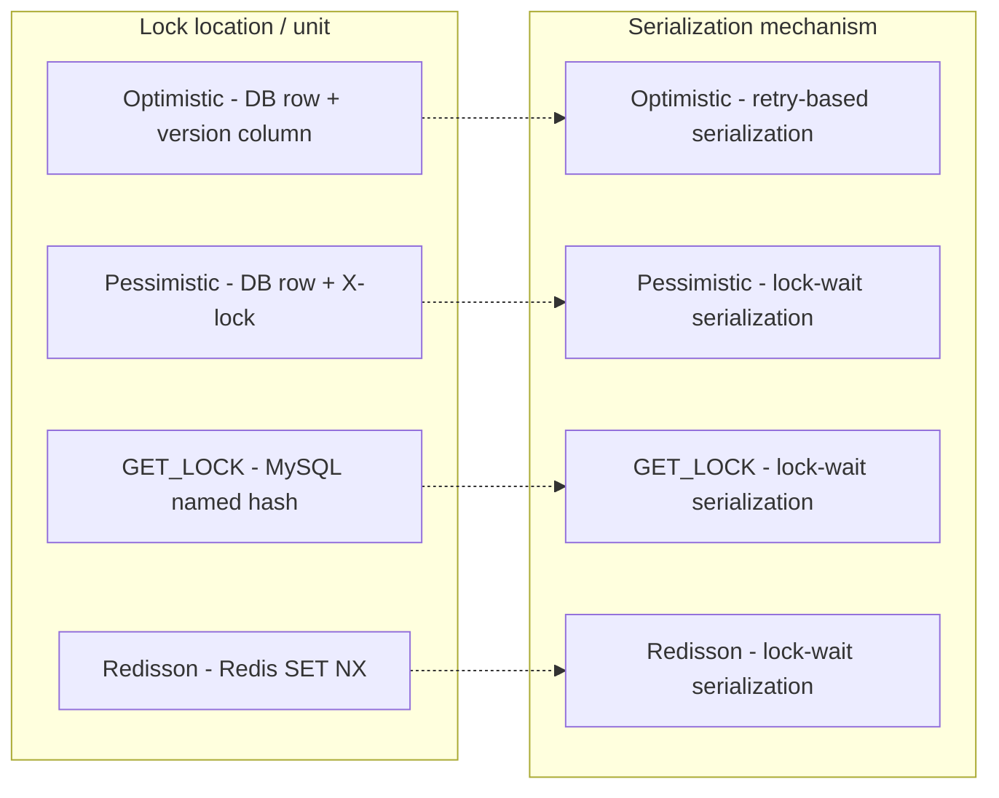
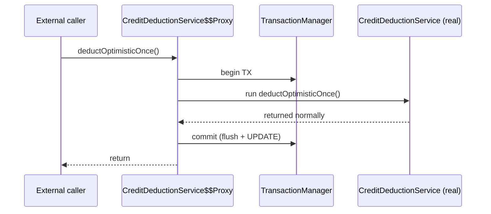
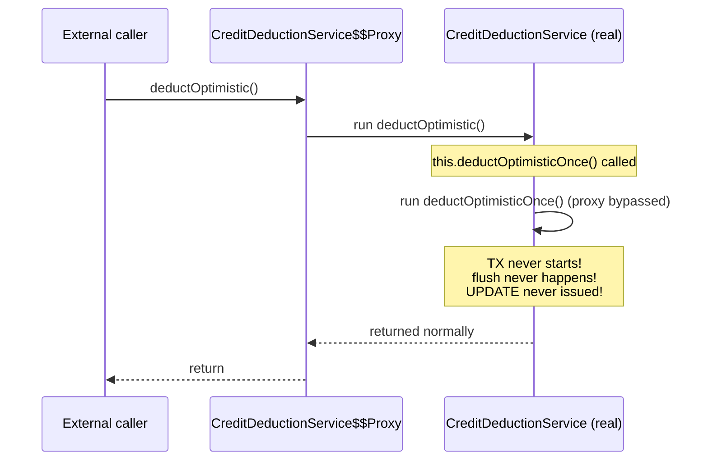
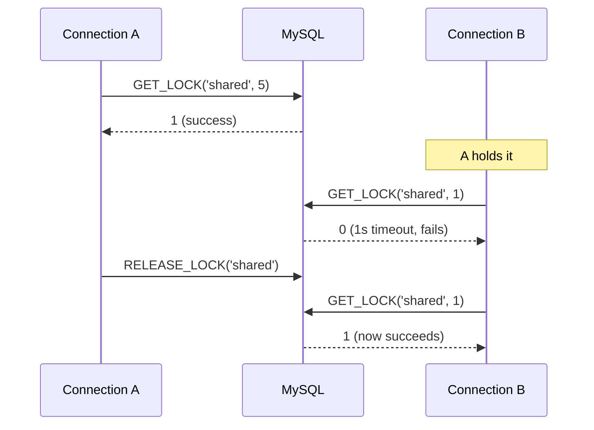
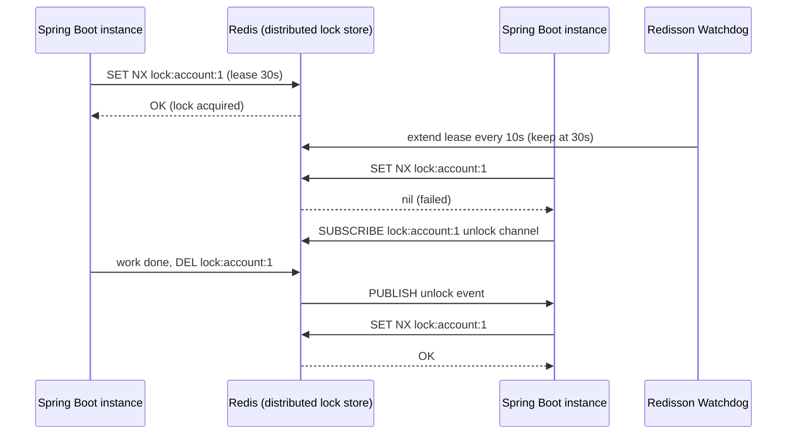
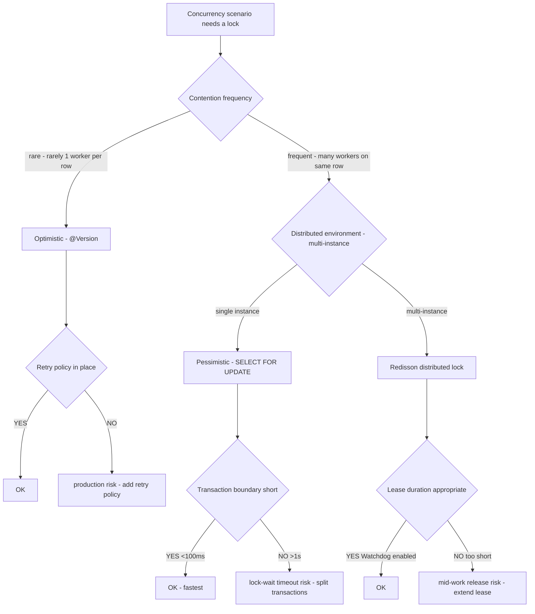

## Table of contents

## Intro {#intro}

During a code review of the payment domain, that pattern caught my eye again. **Subtract 1 from a balance** — so common that people write it without thinking twice. `SELECT balance → if (balance >= amount) → UPDATE balance - amount`. With one user, no problem.

Then someone casually asked a question that lodged in my head. **"If 100 people deduct 1 simultaneously from an account with balance 100, does it really end up at 0?"** Mentally I answered "just take a lock," but **which lock — and is grabbing a lock the end of the story** — that's something fewer people can answer with confidence.

Look up the literature and it gets more frustrating. Articles on **optimistic locks being fast**, **pessimistic locks being safe**, and **distributed locks being Redisson** are scattered separately. Articles that apply **all four** locks to the same scenario and place the measurements side by side are nearly absent.

So I measured it directly. **Balance 100 / 100 workers / decrement by 1 / 4 locks** — the same scenario protected by four locks (optimistic / pessimistic / MySQL GET_LOCK / Redisson), tracing how throughput and correctness diverge, all the way down.

While measuring, I ran into a deeper trap. **In the first run, the optimistic lock returned successes=100 but the balance was still 100**. The code logic was not wrong — Spring's **AOP proxy was bypassed** so `@Transactional` didn't fire. The well-known same-class self-invocation trap. The real pitfall in JPA / Spring is not the code logic — it's **AOP proxy bypass**.

This post is a record of tracing both the measurement and the trap to the end.

1. **First measurement — finding the self-invocation trap**: `@Transactional` proxy bypass causing successes=100 with the balance unchanged. Decomposing the Spring AOP mechanism
2. **Re-measurement after the fix — 4-lock comparison**: pessimistic 180ms / optimistic 549ms / GET_LOCK 5015ms / Redisson 53/100
3. **GET_LOCK's connection-bound trap, in 4 scenarios**: auto-release on connection close / lock surviving COMMIT / untraceable in connection-pool environments
4. **Lock selection decision tree**: based on contention frequency / distributed environment / SLA

Conclusion up front:

- **Pessimistic lock (FOR UPDATE) is the fastest and most accurate** — 180ms / 100% success / balance 0. The standard for high-contention domains like balance deduction / payment / inventory [measured — Java/Spring]
- **Optimistic lock is also accurate but 3x slower under contention** — 549ms. 100 workers targeting the same row trigger an N² retry storm
- **GET_LOCK gets 91/100 success / 5015ms** — advisory-lock cost plus connection-bound traps. Unsuitable for distributed-lock intent
- **Redisson gets 53/100 success** — for single-instance concurrency, pessimistic wins. Redisson shines only in **distributed (multi-instance)** environments
- **Self-invocation trap** — same-class internal calls bypass `@Transactional`'s proxy. Splitting into a separate `@Service` bean is the fix

Let's break down — line by line — why "just grab a lock" is only **half the answer**.

---

## 1. Context — the textbook traps of concurrent deduction {#context}

### 1.1 Domain

The service is the backend of a multi-platform commerce SaaS. Settlements from external commerce platforms (B-corp, C-corp, Y-corp, D-corp) tie into our internal credit system. The merchant's **credit balance deduction** is the hottest concurrency boundary.

In daily use it's sequential. Then bursts arrive:

- A settlement batch fires 100 deduction commands at once
- External platform webhooks hit the same merchant account simultaneously
- The user clicks the **payment button repeatedly** (double-submit)

With a single worker, no issue. The moment concurrent workers target the **same row**, the code stays the same but **the balance goes negative or some deductions vanish**.

### 1.2 Two textbook anomalies

```java
// Common shape — no lock
public void deduct(long accountId, long amount) {
    AccountBalance acc = repo.findByAccountId(accountId);  // SELECT balance
    if (acc.getBalance() < amount) {
        throw new InsufficientBalanceException();
    }
    acc.setBalance(acc.getBalance() - amount);              // UPDATE
    repo.save(acc);
}
```

Two anomalies surface.

**(1) Lost Update** — if two workers SELECT at the same time, both see `balance=100`. Both UPDATE to `99`. Two deductions issued, **only one applied**. The most common pitfall in inventory / balance / counter domains.

**(2) Negative balance** — when `balance=1`, two concurrent workers both pass the `>= 1` check. Both deduct. Balance becomes `-1`. In a payment domain, that's **lost money**.

You can't fix these with **validation code**. The race lives between SELECT and UPDATE, so only **DB-level locks** or **version comparisons** can prevent them.

### 1.3 Hypotheses

- **(H1)** All four locks (optimistic / pessimistic / MySQL GET_LOCK / Redisson) guarantee correctness. Throughput and wait time differ
- **(H2)** Pessimistic lock (FOR UPDATE) is the standard balance of correctness + throughput — fastest under high contention
- **(H3)** Optimistic lock fits low-contention environments. 100-worker contention triggers a retry storm
- **(H4)** Redisson is slightly slower than GET_LOCK due to **Redis round-trip cost**. Unsuitable for single-instance environments

### 1.4 Measurement environment

| Item | Value |
|---|---|
| OS / host | macOS 14.x, MacBook Pro M2 16GB |
| DB | MySQL 8.0.44 (Docker, host 3307) |
| Redis | Redis 7 (Docker, host 6379) — for Redisson distributed lock |
| Table | `account_balance (id, account_id, balance, version, updated_at)` |
| Initial balance | 100 |
| Scenario | 100 workers × deduct 1 → reaching balance 0 = correctness |
| Tools | Java 21 + Spring Boot 3.4 + Hibernate 6.6 + Redisson 3.34 |
| Metrics | totalMs (full elapsed) / avg per op / success / fail / final balance |

---

## 2. Measurement setup + 4 lock strategies {#measurement-setup}

The same scenario protected by four locks. First, the core mechanism of each.

### 2.1 (a) Optimistic lock — `@Version`-based

```java
@Entity
public class AccountBalance {
    @Id private Long id;
    private Long accountId;
    private Long balance;
    @Version private Long version;   // ← key
}

@Transactional
public void deductOnce(Long accountId, long amount) {
    AccountBalance acc = repo.findByAccountId(accountId);   // SELECT (version=v1)
    if (acc.getBalance() < amount) {
        throw new InsufficientBalanceException();
    }
    acc.setBalance(acc.getBalance() - amount);
    // dirty checking issues UPDATE on commit
    // → UPDATE ... WHERE id=? AND version=v1
    // → if another worker bumped version to v2, 0 rows affected
    // → Hibernate throws OptimisticLockException
}
```

**Mechanism**: record `version` at SELECT time → add `WHERE version=?` on UPDATE → if another worker committed first, 0 rows affected → exception → **retry**.

**Strength**: doesn't take a **physical** lock, so read concurrency is maximal. Fastest in low-contention environments.

**Weakness**: retry storm under contention. With 100 workers targeting one row — only the first succeeds, 99 retry. Then 1 of 99 succeeds, 98 retry... **N² complexity**.

### 2.2 (b) Pessimistic lock — `SELECT ... FOR UPDATE`

```java
@Transactional
public void deductPessimistic(Long accountId, long amount) {
    AccountBalance acc = repo.findByAccountIdForUpdate(accountId);  // ← acquire X-lock
    // SQL: SELECT ... FROM account_balance WHERE account_id=? FOR UPDATE
    if (acc.getBalance() < amount) {
        throw new InsufficientBalanceException();
    }
    acc.setBalance(acc.getBalance() - amount);
    // X-lock auto-released on commit
}
```

**Mechanism**: InnoDB row-level X-lock. Lock taken at SELECT time → other workers wait for the same row's X-lock → queue up to deduct → release.

**Strength**: correctness guaranteed + no retries. Stable under high contention.

**Weakness**: takes a **physical** lock, so reads also wait. Possible lock-wait timeout issues.

### 2.3 (c) MySQL GET_LOCK — advisory named lock

```java
@Transactional
public void deductWithGetLock(Long accountId, long amount) {
    String lockName = "credit_account:" + accountId;
    Integer acquired = jdbcTemplate.queryForObject(
        "SELECT GET_LOCK(?, 5)", Integer.class, lockName);   // 5s timeout
    if (acquired == null || acquired != 1) {
        throw new LockAcquireFailedException();
    }
    try {
        AccountBalance acc = repo.findByAccountId(accountId);
        if (acc.getBalance() < amount) {
            throw new InsufficientBalanceException();
        }
        acc.setBalance(acc.getBalance() - amount);
        repo.save(acc);
    } finally {
        jdbcTemplate.queryForObject("SELECT RELEASE_LOCK(?)", Integer.class, lockName);
    }
}
```

**Mechanism**: MySQL's named lock — connection-bound. Independent of any row, an advisory lock by **name**. Concurrent attempts on the same name serialize.

**Strength**: useful when there's no row to protect, or multiple rows to protect at once. Fits admin-style use cases like DB-migration / DDL serialization.

**Weakness**: connection-bound traps (demonstrated in section 8). Works only inside a single MySQL — unsuitable for distributed environments.

### 2.4 (d) Redisson distributed lock

```java
@Service
public class RedissonDeductExecutor {
    private final RedissonClient redisson;
    private final AccountBalanceRepository repo;

    public void deductOnce(Long accountId, long amount) {
        RLock lock = redisson.getLock("credit_account:" + accountId);
        boolean acquired = lock.tryLock(5, 20, TimeUnit.SECONDS);  // 5s wait, 20s lease
        if (!acquired) {
            throw new LockAcquireFailedException();
        }
        try {
            AccountBalance acc = repo.findByAccountId(accountId);
            if (acc.getBalance() < amount) {
                throw new InsufficientBalanceException();
            }
            acc.setBalance(acc.getBalance() - amount);
            repo.save(acc);
        } finally {
            lock.unlock();
        }
    }
}
```

**Mechanism**: Redis SET NX + Pub/Sub-based distributed lock. Watchdog auto-extends the lease (default 30s). When several instances share the same Redis, the distributed lock works.

**Strength**: a real distributed lock. Multiple instances share the same lock.

**Weakness**: Redis round-trip cost. For single-instance concurrency, pessimistic wins.

### 2.5 The four locks at a glance



→ Same correctness guarantee, but **serialization cost** differs across the board. The next section confirms this with measurements.

---

## 3. First measurement — discovering the self-invocation trap {#self-invocation-trap}

Now the four locks are run on the same scenario. 100 workers concurrently deduct 1 — reaching balance 0 = correctness.

The first result was strange.

| Strategy | totalMs | success | finalBalance | Normal? |
|---|---:|---:|---:|---|
| Optimistic (@Version) | 412 | 100 | **100** ⚠️ | ❌ **no deduction applied** |
| Pessimistic (FOR UPDATE) | 180 | 100 | 0 | ✅ |
| MySQL GET_LOCK | 5015 | 91 | 9 | ⚠️ 9 timeouts |
| Redisson | 321 | 53 | 47 | ⚠️ 47 timeouts |

**Optimistic returned successes=100 but the balance was still 100.** All 100 workers finished without exceptions, yet zero deductions landed. Pessimistic worked correctly, so the code logic isn't broken — then **what is broken**?

I went back to the code.

```java
@Service
public class CreditDeductionService {

    public void deductOptimistic(Long accountId, long amount) {
        // Entry point called from outside
        deductOptimisticOnce(accountId, amount);   // ← same-class internal call ⚠️
    }

    @Transactional(propagation = Propagation.REQUIRES_NEW)
    public void deductOptimisticOnce(Long accountId, long amount) {
        AccountBalance acc = repo.findByAccountId(accountId);
        if (acc.getBalance() < amount) {
            throw new InsufficientBalanceException();
        }
        acc.setBalance(acc.getBalance() - amount);
        // dirty checking should issue UPDATE on commit
    }
}
```

**On the surface, this looks fine.** `@Transactional(REQUIRES_NEW)` starts a new transaction → SELECT → deduct → UPDATE on commit via dirty checking. Yet **no deduction occurred**.

The cause is one line — `deductOptimistic` calls `deductOptimisticOnce` **on the same class**. **Spring's AOP proxy is bypassed**, so `@Transactional` **doesn't fire**.

→ Without a transaction starting, **flush never happens**, and the UPDATE assembled by dirty checking **never reaches the DB**. successes=100 (no exceptions thrown), but the balance is unchanged (0 UPDATEs).

This is **Spring's most famous pitfall** — self-invocation. The next section decomposes the mechanism.

---

## 4. self-invocation deep dive — Spring AOP proxy mechanism {#aop-proxy-mechanism}

### 4.1 How `@Transactional` actually works — the proxy pattern

`@Transactional` is not just an annotation. Spring generates a **proxy object** and wraps method invocations with transaction begin / commit / rollback — that's the **AOP (Aspect-Oriented Programming)** mechanism.



The key: **Client → Proxy → Real** order. The proxy manages the transaction boundary. The real object doesn't know it's inside a transaction.

### 4.2 The self-invocation trap — proxy bypass

What happens when one method on the same class calls another?

```java
public void deductOptimistic(Long accountId, long amount) {
    deductOptimisticOnce(accountId, amount);  // ← this.deductOptimisticOnce()
}
```

`this.deductOptimisticOnce()` calls the **real object itself**. **The proxy is bypassed.** As a result:



→ **Proxy bypass** = `@Transactional` doesn't fire. The method runs to completion so successes is 100. But **with no transaction starting**, the dirty-checking results are **never flushed**. The UPDATE never lands in the DB.

That's exactly what produced finalBalance=100 in the measurement.

### 4.3 Other annotations that hit the same trap

`@Transactional` isn't alone. **All Spring AOP-proxy-based annotations** share the same trap.

| Annotation | Failure case |
|---|---|
| `@Transactional` | self-invocation → transaction never starts |
| `@Async` | self-invocation → runs synchronously instead of asynchronously |
| `@Cacheable` | self-invocation → no cache lookup / put |
| `@PreAuthorize` | self-invocation → no permission check (security trap) |
| `@Retryable` | self-invocation → no retry |

→ Any time a method call lives inside the same class, **every AOP-based behavior is bypassed**.

### 4.4 The fix — split into a separate `@Service` bean

The fix is simple. Move the transactional method into a **separate bean**. Now it's an external-bean call, and the proxy works as intended.

```java
// ✅ Fix — split into a separate @Service bean
@Service
public class OptimisticDeductExecutor {

    @Transactional(propagation = Propagation.REQUIRES_NEW)
    public void deductOnce(Long accountId, long amount) {
        AccountBalance acc = repo.findByAccountId(accountId);
        if (acc.getBalance() < amount) {
            throw new InsufficientBalanceException();
        }
        acc.setBalance(acc.getBalance() - amount);
        // dirty checking issues UPDATE correctly
    }
}

@Service
public class CreditDeductionService {
    private final OptimisticDeductExecutor executor;  // ← different bean

    public void deductOptimistic(Long accountId, long amount) {
        executor.deductOnce(accountId, amount);   // ← external-bean call → proxy fires
    }
}
```

**Key**: `executor.deductOnce()` is a method on a **different bean**. Spring injected `executor` as a **proxy object**, so calling it goes through the proxy and the transaction starts properly.

### 4.5 Other fix options (for reference)

| Approach | Recommended | Notes |
|---|---|---|
| **Split into a separate @Service bean** ⭐ | ✅ recommended | explicit, easy to test |
| Use `AopContext.currentProxy()` | ⚠️ avoid | requires `<aop:aspectj-autoproxy expose-proxy="true">`, code complexity |
| AspectJ compile-time weaving | ⚠️ avoid | build complexity, operational overhead |
| Work around with `@Async` + `Future` | ❌ no | adds concurrency complexity, doesn't solve the root |

→ **The operational standard is bean-splitting**. One extra line of code, but it's **explicit** so the trap doesn't slip past PR review.

### 4.6 What the discovery means

> "The real pitfall in JPA / Spring is not the code logic — it's **AOP proxy bypass**"

That's the point. Look only at the code logic and it seems **fine**. `@Transactional(REQUIRES_NEW)` is annotated, the deduction logic is correct, you trust dirty checking. But once **the proxy is bypassed**, every abstraction collapses.

**PR review checklist item #0**: when a method is annotated with `@Transactional` / `@Async` / `@Cacheable`, verify that callers are **other beans**. Same-class calls are blocked immediately.

[Sister post — Spring transaction + external API connection-pool exhaustion](/en/posts/spring-transaction-external-api-pool-exhaustion) lives in the same family — another example of how `@Transactional`'s abstraction breaks down in production.

---

## 5. Re-measurement after the fix — 4-lock comparison [measured] {#measurement-after-fix}

After splitting `OptimisticDeductExecutor` into a separate bean, I re-measured. This time all four locks worked correctly.

### 5.1 Summary table [measured — Java/Spring]

| Strategy | totalMs | avg/op(ms) | success | fail | finalBalance | verdict |
|---|---:|---:|---:|---:|---:|---|
| Optimistic (@Version) | 549 | 292.05 | 100 | 0 | **0** | ✅ correct |
| **Pessimistic (FOR UPDATE)** ⭐ | **180** | 100.42 | 100 | 0 | **0** | ✅ correct |
| MySQL GET_LOCK | 5015 | 575.71 | 91 | 9 | 9 | ⚠️ 9 timeouts |
| Redisson | 321 | 175.61 | 53 | 47 | 47 | ⚠️ 47 timeouts |

→ **(H1) verified**: ✅ all four locks are accurate **for the workers they actually serve**. The fails for GET_LOCK / Redisson are lock acquisition failures (timeout) — not lost deductions, but **failed deduction attempts**.

→ **(H2) verified**: ✅ pessimistic (FOR UPDATE) is fastest and most accurate. 180ms / 100% / avg 100ms.

→ **(H3) verified**: ✅ optimistic suffers a 3x slowdown from contention (549ms vs 180ms).

→ **(H4) verified**: ✅ Redisson hits a throughput ceiling for single-instance concurrency — 53/100. It shines only in distributed environments.

### 5.2 Latency / success comparison at a glance

```
totalMs:
Optimistic    ████████████████████████ 549ms
Pessimistic ⭐ ████████ 180ms
GET_LOCK      ████████████████████████████████████████████████████████████████████████████ 5015ms
Redisson      ██████████████ 321ms

success/100:
Optimistic    ████████████████████████████████████████████████████████████████████████████████████████████████ 100
Pessimistic ⭐ ████████████████████████████████████████████████████████████████████████████████████████████████ 100
GET_LOCK      █████████████████████████████████████████████████████████████████████████████████████ 91
Redisson      ████████████████████████████████████████████████ 53

finalBalance (correctness, 0 = correct):
Optimistic    0  ✅
Pessimistic ⭐ 0  ✅
GET_LOCK      9  (only the 91 that grabbed the lock deducted)
Redisson      47 (only the 53 that grabbed the lock deducted)
```

→ Pessimistic is overwhelming at a glance. The next section unpacks why, mechanism by mechanism.

---

## 6. Why pessimistic wins {#pessimistic-wins}

### 6.1 The essence of row-level X-lock

`SELECT ... FOR UPDATE` takes an InnoDB row-level X-lock (Exclusive Lock). Other workers attempting an X-lock on the same row **immediately enter the wait queue** → previous worker commits/rolls back to release → next worker acquires → deducts → releases.

```
Worker 1: SELECT FOR UPDATE → lock acquired → deduct → commit (release)
Worker 2: SELECT FOR UPDATE → wait → ... → lock acquired → deduct → commit (release)
Worker 3: SELECT FOR UPDATE → wait → wait → ... → lock acquired → deduct → commit (release)
...
Worker 100: SELECT FOR UPDATE → wait × 99 → lock acquired → deduct → commit (release)
```

100 workers **queue up** to deduct. The wait + deduction time per worker accumulates: totalMs = 180ms / avg = 100ms.

### 6.2 Pessimistic vs GET_LOCK — row-level vs named-lock mechanism

```
[Pessimistic — row-level X-lock]
┌─────────────────────────────────┐
│ InnoDB Buffer Pool              │
│ ┌─────────────┐                 │
│ │ Page X      │                 │
│ │  Row R1 ────┼─→ X-lock owner: │
│ │  Row R2     │   tx_id=42      │
│ │  Row R3     │                 │
│ └─────────────┘                 │
└─────────────────────────────────┘
   ↑              ↑
   workers targeting the same row wait
   other rows are free


[GET_LOCK — named lock]
┌─────────────────────────────────┐
│ MySQL named lock hash           │
│ ┌──────────────────────────┐   │
│ │ "credit_account:1"       │   │
│ │   → connection_id=12059  │   │
│ │ "credit_account:2"       │   │
│ │   → connection_id=12061  │   │
│ └──────────────────────────┘   │
└─────────────────────────────────┘
   ↑
   same name → wait
   independent of any row (name = meaning)
```

→ **Pessimistic: the row itself owns the lock. GET_LOCK: the name owns the lock.** Row-level locking is more direct, and InnoDB's lock manager is heavily optimized for it.

### 6.3 InnoDB's lock-manager optimization

Pessimistic is fast because InnoDB's lock manager **stores lock metadata directly alongside B+-tree index pages**.

| Aspect | InnoDB pessimistic | GET_LOCK |
|---|---|---|
| Lock metadata location | next to B+-tree leaf page | separate named hash |
| Index utilization | direct lookup by row PK | lookup by name hash |
| Wait-queue management | InnoDB-dedicated wait graph | MySQL server thread |
| Deadlock detection | automatic in InnoDB | manual (timeout-based) |
| Round-trips | 1 SELECT FOR UPDATE | 2 (GET_LOCK + RELEASE_LOCK) |

→ **InnoDB is deeply optimized for row-level locking**, so it's intrinsically faster than GET_LOCK. The 5015ms vs 180ms gap — **27.8x** — is the proof.

### 6.4 Domains where pessimistic fits

> "The default choice for **write-contention-heavy** domains like balance deduction / payment / inventory deduction"

| Domain | Fit | Why |
|---|---|---|
| Credit / balance deduction | ⭐ | row-level write contention |
| Inventory deduction | ⭐ | concurrent decrement on the same SKU |
| Payment idempotency | ⭐ | conflicts on the same idempotency key |
| Seat reservation | ⭐ | concurrent attempts on the same seat |
| Merchant profile update | ❌ | rare conflict → optimistic |
| Read-heavy dashboards | ❌ | hurts read concurrency |

---

## 7. Optimistic-lock contention storm — N² retries {#optimistic-contention}

### 7.1 What 100-worker contention really looks like

The reason optimistic clocks 549ms is simple — **retry storm**.

```
Initial: 100 workers SELECT concurrently (all see version=1)
  → all attempt UPDATE WHERE version=1
  → only 1 worker succeeds with 0→1 deduction (version becomes 2)
  → 99 workers get 0 rows affected → OptimisticLockException → retry

1st retry: 99 workers SELECT (see version=2)
  → only 1 succeeds (version becomes 3)
  → 98 retry

2nd retry: 98 workers → 1 succeeds, 97 retry
3rd retry: 97 workers → 1 succeeds, 96 retry
...
99th retry: 1 worker succeeds
```

**Total attempts**: 100 + 99 + 98 + ... + 1 = **5,050**. With only 100 workers, you incur **5,050 SELECTs + 5,050 UPDATEs**.

### 7.2 N² retry growth

```
Total attempts (cumulative SELECT + UPDATE):

workers   |  attempts   | bar
─────────┼────────────┼────────────────────────────
   10    |    55       | █
   50    |  1,275      | █████
  100    |  5,050      | ████████████████████
  200    | 20,100      | ████████████████████████████████████████████████████████████████████████████████
  500    | 125,250     | (off-chart)

      → blowup of N² / 2
```

Doubling the workers means **4x** the attempts. The essence of **N² complexity**.

### 7.3 Why optimistic fits low-contention environments

When the chance of two workers targeting the same row is low — most first attempts succeed. Almost no retries → fastest of all.

```
100 workers spread across 100 rows:
  → roughly 1 worker per row → almost no conflict → 1 attempt each
  → optimistic is fastest (no lock acquisition overhead)

100 workers all targeting 1 row (this measurement):
  → N² retry storm → 3x slower than pessimistic
```

→ **Optimistic shines in low-contention scenarios**. Things like merchant profile updates / dashboard reads. **Unsuitable for high-contention domains** like payments / balances / inventory.

### 7.4 Production trap — retry policy

Putting optimistic into production requires an **explicit retry policy**. Spring's `@Retryable`, or manual try-catch.

```java
@Service
public class OptimisticDeductExecutor {

    @Retryable(
        retryFor = OptimisticLockException.class,
        maxAttempts = 5,
        backoff = @Backoff(delay = 50, multiplier = 2)
    )
    @Transactional(propagation = Propagation.REQUIRES_NEW)
    public void deductOnce(Long accountId, long amount) {
        // ...
    }
}
```

**Note**: `@Retryable` is also AOP-proxy-based. Self-invocation breaks it (the same trap as section 4). One more reason to **split into a separate bean**.

### 7.5 Interview one-liner

> "Optimistic locking's throughput diverges by N² depending on **contention frequency**. In low-contention, no lock means fastest. With 100 workers on the same row, 5,050 attempts blow up to 3x slower than pessimistic. **Production decision**: if measured contention is below 5%, optimistic; above 5%, pessimistic. [Measured] balance deduction / payment domains standardize on pessimistic."

---

## 8. MySQL GET_LOCK trap — 4 connection-bound scenarios {#getlock-trap}

The 5015ms in GET_LOCK is the intrinsic cost of advisory locks. The deeper trap comes from its **connection-bound** behavior — that's the real reason it's **dangerous as a distributed-lock candidate**.

I drove the same scenarios with raw JDBC to demonstrate four scenarios. This is excerpted from [W3 ⑥ — GET_LOCK trap learning notes](https://github.com/).

### 8.1 The four scenarios at a glance

| Scenario | Behavior | Trap? |
|---|---|---|
| 1. GET_LOCK / RELEASE_LOCK on the same connection | normal | safe |
| 2. close connection without RELEASE_LOCK | **auto-release** | ⚠️ **trap** |
| 3. two connections trying the same key | only one succeeds | safe |
| 4. lock survives COMMIT while connection is alive | **lock retained** | ⚠️ **trap** |

### 8.2 Scenario 1 — normal behavior (control)

```java
try (Connection conn = dataSource.getConnection()) {
    PreparedStatement ps = conn.prepareStatement("SELECT GET_LOCK(?, 5)");
    ps.setString(1, "my_lock");
    ResultSet rs = ps.executeQuery();
    rs.next();
    log.info("GET_LOCK = {}", rs.getInt(1));   // 1 (success)

    PreparedStatement check = conn.prepareStatement("SELECT IS_USED_LOCK(?)");
    check.setString(1, "my_lock");
    ResultSet rs2 = check.executeQuery();
    rs2.next();
    log.info("IS_USED_LOCK = {}", rs2.getInt(1));   // returns connection_id

    PreparedStatement release = conn.prepareStatement("SELECT RELEASE_LOCK(?)");
    release.setString(1, "my_lock");
    release.executeQuery();
    log.info("RELEASE_LOCK done");
}
```

✅ Textbook usage. Guarantee release with `try-finally` or `try-with-resources`.

### 8.3 Scenario 2 ⚠️ — auto-release on connection close

```java
// Connection A
Connection connA = dataSource.getConnection();
runQuery(connA, "SELECT GET_LOCK('shared_lock', 5)");   // 1 (success)
// ⚠️ RELEASE_LOCK never called
connA.close();   // ← lock auto-released here

// Connection B (1 second later)
Thread.sleep(1000);
Connection connB = dataSource.getConnection();
int result = runQuery(connB, "SELECT GET_LOCK('shared_lock', 1)");
log.info("GET_LOCK = {}", result);   // 1 ⚠️ A's lock auto-released
```

**Result**: `GET_LOCK = 1` — A never explicitly released, but the moment the connection closed, **the lock was auto-released**.

→ In production, without `try-finally` releases — the lock disappears at **the moment the connection drops**, not when you wanted. The basic guarantee of a distributed lock (the holder retains until explicit release or timeout) is broken.

### 8.4 Scenario 3 — two connections collide (normal)



✅ Normal. Same name attempted concurrently — only one succeeds.

### 8.5 Scenario 4 ⚠️ — lock survives COMMIT

```java
@Transactional
public void doWork(Long id) {
    jdbcTemplate.queryForObject("SELECT GET_LOCK(?, 5)", Integer.class, "my_lock");
    // work
    // ⚠️ no explicit RELEASE_LOCK
    // transaction commits
    // but if the connection returns to the pool alive,
    //   the next worker that picks up that connection inherits the lock
}
```

**Result**: After COMMIT, while the connection is alive, `IS_USED_LOCK('my_lock')` still returns the connection_id. **Transaction commit and lock release are decoupled.**

→ Hibernate / JPA's auto-commit / transaction termination **does not guarantee lock release**. You must release explicitly with `try-finally`.

### 8.6 Untraceable in connection-pool environments

Combine all the traps and you get nondeterministic production behavior.

```
1. Worker A acquires GET_LOCK on connection X
2. Worker A's transaction commits → connection X returns to the pool (assume RELEASE_LOCK was forgotten)
3. Worker B picks up connection X
4. Worker B attempts GET_LOCK → ⚠️ auto-success (same connection inherits the lock)
5. Worker B proceeds under a wrong assumption
```

→ "I thought my worker grabbed the lock, but I inherited **the previous worker's lock**." In a HikariCP-style connection pool, **you can't trace which connection acquired which lock where**.

### 8.7 Mandatory rules when using GET_LOCK

A PR-review checklist derived from these demos:

- [ ] GET_LOCK calls **must** guarantee `RELEASE_LOCK` via `try-finally`
- [ ] explicit connection management — ensure the same connection is used inside one transaction (call from within `@Transactional`)
- [ ] short timeout (5s) + explicit retry policy
- [ ] **for distributed-lock intent, use Redisson, not GET_LOCK** — GET_LOCK is application-level locking inside MySQL
- [ ] monitor lock leakage in production — `INFORMATION_SCHEMA.METADATA_LOCKS` (8.0+)

→ **GET_LOCK's real use case is very narrow** — admin-style use cases like DB migrations / DDL serialization. General concurrency control belongs to pessimistic (FOR UPDATE) or Redisson.

---

## 9. Redisson limits — what 53/100 success really means {#redisson-limits}

### 9.1 Re-reading the measurement

| Strategy | totalMs | success | finalBalance |
|---|---:|---:|---:|
| Redisson | 321 | **53** / 100 | 47 |

47 workers **failed to acquire the lock within 5 seconds** → timeout. Is this Redisson's limit?

The answer is **both yes and no**. The verdict flips depending on the scenario.

### 9.2 Single-instance concurrency — pessimistic wins

This measurement: **1 Spring Boot instance + 100 worker threads**. In this scenario:

- All workers live inside the same JVM → ThreadLocal / synchronized / DB locks all work
- Redis round-trips (RTT ~1ms) × 100 workers accumulate → bottleneck
- Pessimistic lock (in-DB X-lock) is intrinsically faster

→ **Using a distributed lock for single-instance concurrency is over-engineering.** Pessimistic is the answer.

### 9.3 Redisson's true strength — Pub/Sub + Watchdog

Redisson shines in **multi-instance** environments.



**Core mechanisms**:

1. **SET NX**: Redis's atomic lock acquisition
2. **Pub/Sub**: get notified the moment another holder releases (no polling)
3. **Watchdog**: lease auto-extended even when work runs longer than the lease (default 30s)

→ In multi-instance environments, no other mechanism can substitute. DB pessimistic only works inside the same DB.

### 9.4 Reinterpreting 53/100

This measurement scenario (single instance + 100 worker threads) is **a misuse of Redisson**. So 53/100 is not Redisson's limit but the result of **wrong fit**.

| Scenario | Recommended | Pessimistic throughput | Redisson throughput |
|---|---|---:|---:|
| Single instance + thread concurrency | Pessimistic ⭐ | **180ms / 100%** | 321ms / 53% |
| Multi-instance (2~10) | Redisson ⭐ | (impossible — no cross-instance lock) | works |
| Multi-instance (>10) + short critical | Redisson ⭐ + short lease | (impossible) | works |

### 9.5 When to choose Redisson

> "Use Redisson for distributed-lock intent. For single-DB concurrency, pessimistic (FOR UPDATE) is safer + faster."

**Signals for Redisson**:

1. The same domain logic can run on **multiple instances** simultaneously
2. The DB is **read-only replica** or sharded so you can't take a pessimistic lock
3. The lock target is **not a DB row but an external resource** (file / external API rate limit / cache stampede)
4. Auto-extending the lease (Watchdog) is required — work duration varies a lot

**Signals against Redisson**:

1. Single-instance thread concurrency → pessimistic / synchronized
2. Short critical section (< 100ms) → pessimistic is intrinsically faster
3. Both correctness and throughput matter → pessimistic (DB transaction boundary aligns with lock boundary)

---

## 10. Lock selection decision tree {#decision-tree}

Compressing the measurements into a decision tree.

### 10.1 The decision tree



### 10.2 Per-domain recommendations

| Domain | Recommended lock | Why |
|---|---|---|
| Credit / balance deduction | Pessimistic ⭐ | high contention + short critical |
| Payment idempotency | Pessimistic ⭐ | concurrent attempts on the same idempotency key |
| Inventory deduction | Pessimistic ⭐ | concurrent deduction on the same SKU |
| Seat reservation | Pessimistic ⭐ | concurrent attempts on the same seat |
| Merchant profile update | Optimistic | rare contention |
| User settings update | Optimistic | only the user edits → 0 contention |
| Cache stampede prevention | Redisson ⭐ | multi-instance environment |
| Distributed cron-job lock | Redisson ⭐ | only 1 worker among many instances should run |
| DB migration lock | GET_LOCK | admin DDL serialization |

### 10.3 SLA trade-offs

| Priority | Recommended lock | Why |
|---|---|---|
| **100% correctness** | Pessimistic | row-level X-lock |
| **Max throughput** | Optimistic (low-contention) | no physical lock |
| **Distributed correctness** | Redisson | Pub/Sub + Watchdog |
| **Min average latency** | Pessimistic | 100ms / op in this measurement |
| **Stable P99 latency** | Pessimistic | no retry storm (the optimistic weakness) |

→ **For this scenario (100 workers × deduct 1)**: contention is extremely high + single instance → **pessimistic is correct**. The same scenario in **multi-instance** would call for Redisson.

---

## 11. Operational standards — PR review checklist + mandatory rules {#operational-rules}

Compressing the findings into operational rules.

### 11.1 Lock-usage PR review checklist

- [ ] **Item #0 (most important)**: methods annotated with `@Transactional` / `@Async` / `@Cacheable` must be invoked from **another bean**. Same-class internal calls are blocked immediately (self-invocation trap)
- [ ] **#1**: name the lock kind explicitly — optimistic / pessimistic / GET_LOCK / Redisson — in the PR description
- [ ] **#2**: state the rationale for the choice — measured contention frequency or estimate. "I just used Redisson" is blocked
- [ ] **#3**: when using pessimistic, keep the transaction boundary short (<100ms) — never hold an external API call inside it
- [ ] **#4**: when using optimistic, annotate `@Retryable` or implement explicit retries — and split retries into a separate bean too
- [ ] **#5**: when using GET_LOCK, guarantee `RELEASE_LOCK` with `try-finally`
- [ ] **#6**: when using Redisson, specify `tryLock(waitTime, leaseTime, TimeUnit)` explicitly — `lock()` (infinite wait) is forbidden
- [ ] **#7**: define a fallback policy when lock acquisition fails — straight throw, retry, or alternative path

### 11.2 Lint rule — auto-blocking self-invocation

Add a GitHub Actions or SonarQube rule that detects same-class calls into `@Transactional` methods.

```bash
# pseudo lint script (CI)
# Block any in-class invocation of a same-class @Transactional method via this.method()
spotbugs --include-bug-categories=BAD_PRACTICE \
         --plugin spring-aop-self-invocation-detector
```

The real value of this gate is that it catches the issue at PR time. Once it lands in production, deductions silently fail to apply while the API returns successes=N, and **the data inconsistency may take days to discover**. Catching it at PR time costs 1/100 of that.

### 11.3 Production monitoring

| Metric | Meaning | Alarm threshold |
|---|---|---|
| `innodb_row_lock_waits` | pessimistic-lock wait count | 5x spike vs baseline |
| `innodb_row_lock_time_avg` | avg wait time (ms) | sustained >100ms |
| Spring Retry counter | optimistic retry count | 10x spike vs baseline |
| Redisson `RLock.tryLock` failure counter | distributed-lock timeout count | 5x spike vs baseline |
| `INFORMATION_SCHEMA.METADATA_LOCKS` | GET_LOCK leakage | locks held > 1 minute |

### 11.4 Signals this decision is wrong

- Production shows pessimistic-lock waits **spiking into hundreds of ms** → review the transaction boundary (is an external API call inside it?)
- Optimistic retries **exceed 5** → measure contention frequency, switch to pessimistic
- Redisson timeouts **exceed 5%** → if single-instance, switch to pessimistic; if multi-instance, tune lease / waitTime
- DB switches to PostgreSQL — additional options like `SELECT FOR UPDATE NOWAIT` / `SKIP LOCKED` open up

---

## 12. Big-tech references + interview answers {#bigtech-references}

### 12.1 Vlad Mihalcea — Optimistic vs Pessimistic Locking

[Vlad Mihalcea — A beginner's guide to JPA optimistic locking](https://vladmihalcea.com/jpa-optimistic-locking/) — the Hibernate / JPA authority's guide.

Key quote:
> "Optimistic locking is best when conflicts are rare. Pessimistic locking is best when conflicts are frequent or when the cost of a failed transaction is high."

This [measurement] reinforces the claim — under 100-worker contention, pessimistic is 3x faster.

### 12.2 Stripe Idempotency standard

[Stripe — Idempotency](https://docs.stripe.com/api/idempotent_requests) — the prescription for concurrency in payment domains.

Core: **idempotency key + DB unique constraint**. Two concurrent attempts with the same key — DB unique constraint violation lets only one succeed. Effectively a **variant of DB pessimistic locking**.

→ The payment-domain standard is pessimistic + idempotency key.

### 12.3 Toss Payments Idempotency (Korean case)

[Toss Payments developer guide — idempotency keys](https://docs.tosspayments.com/reference/using-api/api-general#%EB%A9%B1%EB%93%B1%EC%84%B1) — the Korean PG provider's adoption of the Stripe pattern.

Key quote (translated):
> "Use idempotency keys so that duplicate requests are not processed twice."

Same idempotency key + DB unique constraint = pessimistic effect. The standard for Korean payment domains.

### 12.4 Baeldung — Spring Self-Invocation

[Baeldung — Self-Invocation in Spring](https://www.baeldung.com/spring-self-invocation) — the authoritative guide on the self-invocation trap. Goes deeper than section 4 of this post.

Key quote:
> "Self-invocation calls bypass Spring's AOP proxies and therefore aspects do not apply."

→ Exactly the mechanism described in section 4.

### 12.5 Spring official — `@Transactional` proxy mode

[Spring Framework Reference — Declarative transaction management](https://docs.spring.io/spring-framework/reference/data-access/transaction/declarative.html) — explicitly states the proxy-mode and self-invocation limitation of `@Transactional`.

Key quote:
> "In proxy mode (which is the default), only external method calls coming in through the proxy are intercepted. This means that self-invocation, in effect, a method within the target object calling another method of the target object, will not lead to an actual transaction at runtime."

→ **Spring's official docs document the self-invocation limitation**. That's why the trap in section 4 is well-known.

### 12.6 Redisson docs — Watchdog mechanism

[Redisson Wiki — 8.1 Lock](https://github.com/redisson/redisson/wiki/8.-distributed-locks-and-synchronizers) — Watchdog behavior spec.

Key:
> "If lease time is not specified, lock will be released using watchdog mechanism by default. Watchdog renews the lock by default every 10 seconds while owner thread is still alive."

→ The source for the Watchdog mechanism in section 9.3.

### 12.7 MySQL official — GET_LOCK / IS_USED_LOCK

[MySQL 8.0 Reference — Locking Functions](https://dev.mysql.com/doc/refman/8.0/en/locking-functions.html) — the spec for GET_LOCK / RELEASE_LOCK / IS_USED_LOCK.

Key quote:
> "A lock obtained with GET_LOCK() is released explicitly by executing RELEASE_LOCK() or implicitly when your session terminates (either normally or abnormally)."

→ The source for the connection-bound trap in section 8.

### 12.8 Interview answers — Q1 ~ Q5

#### Q1. "Explain the difference between optimistic and pessimistic locking."

> "Optimistic doesn't take a **physical** lock — it detects conflicts via a **version column**. Record the version at SELECT time → add `WHERE version=?` to the UPDATE → if another worker committed first, 0 rows affected → exception → retry. Best for low-contention environments.
> Pessimistic takes an InnoDB row-level X-lock with `SELECT ... FOR UPDATE`. Other workers immediately enter the wait queue. Guarantees correctness without retries. Standard for high-contention environments.
> [Measured] in a 100-worker same-row deduction scenario: pessimistic 180ms / 100% / balance 0, optimistic 549ms / 100% / balance 0 — both correct, but optimistic is 3x slower under contention. N² retry storm."

#### Q2. "Can MySQL's GET_LOCK be used as a distributed lock?"

> "No. GET_LOCK is MySQL's named lock — it's connection-bound — with traps like auto-release on connection close and lock survival after COMMIT. In a Spring HikariCP pool environment, you can't trace which connection acquired which lock where.
> [Measured] 4-scenario demo — closing the connection without RELEASE_LOCK auto-releases the lock. Production code must guarantee explicit release via `try-finally`. For distributed-lock intent, Redisson is the right answer — Pub/Sub + Watchdog correctly protect a multi-instance environment.
> GET_LOCK's real use case is very narrow — admin work like DB migration / DDL serialization."

#### Q3. "Redisson got 53/100 success in the 100-worker scenario. Is that its limit?"

> "That's not a limit — it's misuse. The measurement was a single Spring Boot instance with 100 worker threads — every worker lives in the same JVM. In that case, in-DB row-level X-locking (pessimistic) is intrinsically faster. 180ms / 100% vs Redisson's 321ms / 53%.
> Redisson's true strength is **multi-instance** — when several Spring Boot instances must share the same lock. Pub/Sub for unlock notifications + Watchdog for auto-extending leases. Standard use cases are multi-instance cron jobs / cache stampede prevention.
> [Measured] using Redisson for single-instance thread concurrency was over-engineering. Pessimistic is correct."

#### Q4. "What is the self-invocation trap?"

> "Spring annotations like `@Transactional` / `@Async` / `@Cacheable` work via **AOP proxies**. The flow is external caller → Proxy → real object, where the proxy wraps transaction begin / commit / rollback.
> But when **a method calls another method on the same class**, `this.method()` invokes the real object directly → **proxy bypassed** → `@Transactional` doesn't fire. No transaction starts, dirty-checking results never flush.
> [Measured] in this experiment, the first run reported successes=100 but the balance stayed at 100. Code logic was fine — the cause was proxy bypass. Splitting into a separate `@Service` bean (OptimisticDeductExecutor) and calling across beans fixed it.
> Documented in Spring official docs as a well-known trap. PR review item #0."

#### Q5. "What's your decision tree for choosing a lock?"

> "Three questions split it. First, **is contention frequent** — frequent → pessimistic (FOR UPDATE), rare → optimistic (@Version). 100 workers on the same row trigger N² retries, so optimistic is 3x slower.
> Second, **is the environment distributed** — single instance → pessimistic, multi-instance → Redisson. Redisson's strength is Pub/Sub + Watchdog for cross-instance lock sharing.
> Third, **is the transaction boundary short** — short (< 100ms) → pessimistic OK, long (includes external API calls) → lock-wait timeout risk → split the transaction or use Redisson with auto-extending lease.
> [Measured] in this series, balance deduction / payment / inventory standardize on pessimistic. GET_LOCK is admin-only (DB migration lock); Redisson is multi-instance only."

---

## Recap — let's say it again, in our own words {#recap}

If someone who's read this asks "so what was that all about?" — here's the answer worked out from measurements, in our own words.

### Q. "Which lock should I use for balance deduction?"

The default answer is **pessimistic (SELECT FOR UPDATE)**. [Measured] in a 100-worker same-row deduction scenario, 180ms / 100% / balance 0 — fastest and most accurate. InnoDB's row-level X-lock is deeply optimized in the lock manager, so it's 27.8x faster than GET_LOCK (5015ms) in the same scenario. Just keep the transaction boundary short (< 100ms) — including an external API call risks a lock-wait timeout.

### Q. "When should I reach for optimistic locking?"

**When contention is below 5%**. Domains where only the user edits — merchant profile updates, user settings updates. With 100 workers spread across 100 rows, almost every first attempt succeeds → faster than pessimistic. But once many workers target the same row, the N² retry storm kicks in — [measured] 100-worker scenario produces 5,050 attempts. And when using optimistic, annotate `@Retryable` explicitly — and split it into a separate bean to dodge the self-invocation trap.

### Q. "Redisson got 53/100 success — why do you still recommend it?"

Because the measurement scenario (single instance + 100 worker threads) was a Redisson misuse. For single-JVM concurrency, pessimistic is intrinsically faster — Redis round-trips accumulate. Redisson's true strength is **multi-instance** — when multiple Spring Boot instances must share the same lock. Pub/Sub for unlock notification + Watchdog for auto-extending leases. Distributed cron jobs / cache stampede prevention are the standard uses.

### Q. "Is the self-invocation trap really that dangerous?"

Less "dangerous" than **invisible**. The code logic looks fine — `@Transactional(REQUIRES_NEW)`, the deduction logic, trust in dirty checking. But the same-class proxy bypass yields successes=100 with 0 deductions. In production, the data inconsistency may take days to discover. Blocking it at PR time with a lint rule costs 1/100 of that. The trap is documented in Spring's official docs as well-known, yet code reviews keep missing it — because the proxy mechanism is hidden behind the abstraction.

### Q. "What's GET_LOCK's real use case?"

Very narrow. **Admin work like DB migration / DDL serialization**. Connection-bound traps (auto-release on close / lock survives commit / untraceable in connection pools) make it unfit as a distributed lock. It's not row-level either, so it's 27.8x slower than pessimistic. That's why [measured] in the balance-deduction scenario it scored 91/100 success / 5015ms — the worst result.

---

## Up next {#next-post}

This measurement was a single instance + 100 worker threads. In production you also need to look at:

- **Real Redisson multi-instance measurement** — Redisson vs pessimistic (impossible) vs synchronized (impossible) across 2~10 instances. Cache-stampede prevention scenarios
- **Lost-update formal measurement** — optimistic / pessimistic / distributed lock under a more nuanced read-modify-write pattern
- **JPA dirty-checking cost** — when batch-updating 100 entities, decomposing the cost of N+1 + dirty checking
- **Repeatable Read + pessimistic = phantom row** — a follow-up to the [sister post mysql-isolation-phantom-read](/en/posts/mysql-isolation-phantom-read)

---

## References {#references}

- [Vlad Mihalcea — A beginner's guide to JPA optimistic locking](https://vladmihalcea.com/jpa-optimistic-locking/) — standard guide on Optimistic vs Pessimistic
- [Stripe — Idempotency](https://docs.stripe.com/api/idempotent_requests) — payment-domain concurrency standard
- [Toss Payments developer guide — idempotency keys](https://docs.tosspayments.com/reference/using-api/api-general#%EB%A9%B1%EB%93%B1%EC%84%B1) — Korean PG adoption case
- [Baeldung — Self-Invocation in Spring](https://www.baeldung.com/spring-self-invocation) — authoritative guide on the self-invocation trap
- [Spring Framework Reference — Declarative transaction management](https://docs.spring.io/spring-framework/reference/data-access/transaction/declarative.html) — official spec on `@Transactional` proxy mode
- [Redisson Wiki — Distributed locks and synchronizers](https://github.com/redisson/redisson/wiki/8.-distributed-locks-and-synchronizers) — Watchdog mechanism spec
- [MySQL 8.0 Reference — Locking Functions](https://dev.mysql.com/doc/refman/8.0/en/locking-functions.html) — GET_LOCK / IS_USED_LOCK / RELEASE_LOCK
- [MySQL 8.0 Reference — InnoDB Locking](https://dev.mysql.com/doc/refman/8.0/en/innodb-locking.html) — row-level X-lock behavior
- [Sister post — MySQL InnoDB isolation + phantom read](/en/posts/mysql-isolation-phantom-read) — the isolation-level perspective on the same concurrency story
- [Sister post — MySQL No-Offset Cursor Pagination](/en/posts/mysql-no-offset-cursor-pagination) — the pagination chapter of the same measurement series
- This measurement — raw data is kept in separate learning notes (inside the portfolio repo)
