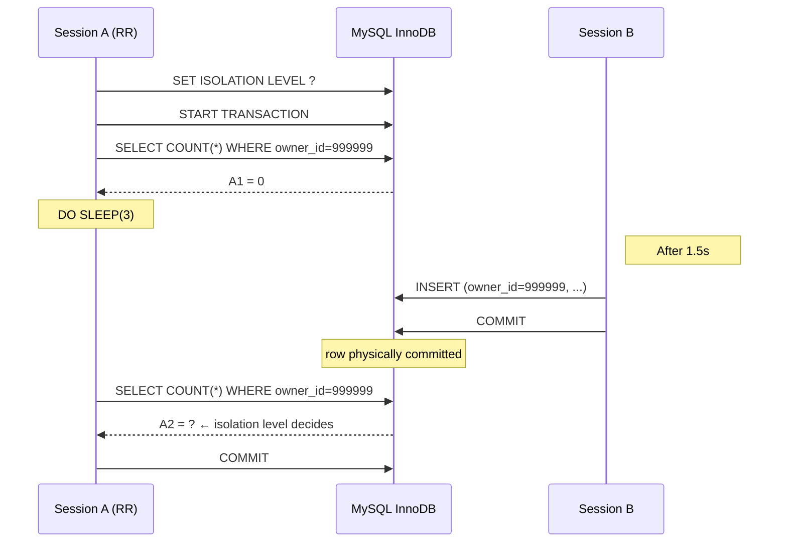
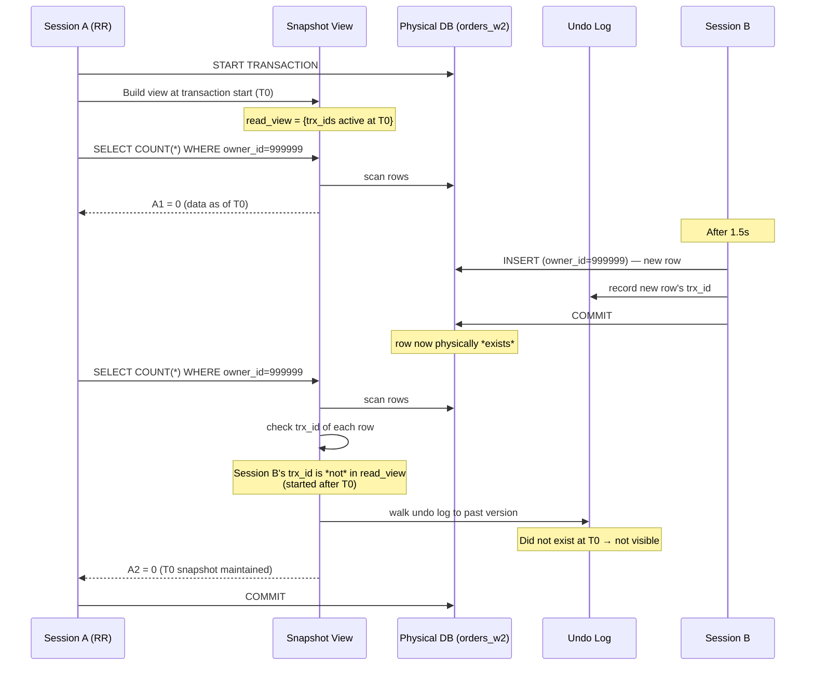
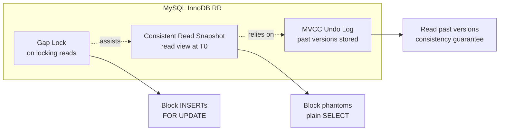
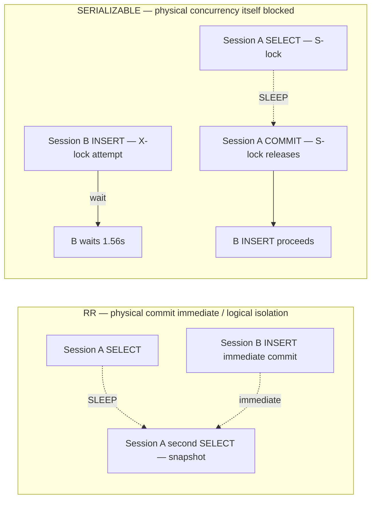

## Table of contents

## Introduction

During a code review, another method in the payment domain caught my eye. Inside a `@Transactional` block, it queried a balance twice and decided the deduction amount based on the difference — a common shape. The code had been running fine in production.

But a casual question someone tossed out kept rattling around in my head. **"Can the same SELECT in the same transaction return different results?"** My head answered, "Not under RR," but few people can confidently point to **where in the ANSI SQL standard that's *guaranteed***.

When I dug into the references, it got worse. The **ANSI SQL standard's RR (REPEATABLE READ) does **not** guarantee blocking phantom reads** — that's the standard, verbatim. Yet "MySQL InnoDB RR blocks phantoms" is a common claim. **Why?** — most articles end with "MySQL just does that" and no further explanation.

This post is a record of running that **why?** down to the metal with raw MySQL commands.

1. **Step 1 — Measure all 4 isolation levels**: how phantoms behave differently under RU / RC / RR / SERIALIZABLE in the same scenario
2. **Step 2 — Decompose the mechanism**: **why** MySQL RR is stronger than the ANSI standard, via **consistent read snapshot / gap lock / MVCC undo log**
3. **Step 3 — Domain mapping**: which isolation level fits payments / credits / dashboards / pagination / settlement batches / idempotency — 6 domains

Bottom line up front:

- **RU / RC trigger phantoms** — A1=0 → Session B INSERT → A2=1. Strictly off-limits for payment domains.
- **RR blocks phantoms** — A2=0. Consistent read snapshot **covers** the ANSI standard's phantom allowance.
- **SERIALIZABLE has explicit concurrency cost** — INSERT itself waits 1.56s. No reason to escalate when RR suffices.
- **MySQL RR ≈ Snapshot Isolation** — comparable in strength to PostgreSQL's Serializable Snapshot Isolation (SSI).

We'll unpack how the head-shrug "RR means no phantoms, right?" is **actually guaranteed** down to the mechanism.

---

## 1. Context — Why I dug into this again

### 1.1 The domain

The service is the backend of a multi-platform payment / credit / settlement SaaS. External commerce platforms — anonymized as Company B / Company C / Company Y / Company D — and our own PG flow into a single transactional path.

The problematic pattern is simple:

```java
@Transactional
public void chargeCredit(long userId, BigDecimal amount) {
    BigDecimal before = repo.findBalance(userId);   // SELECT 1
    // ... validation / external call / brief delay ...
    BigDecimal after  = repo.findBalance(userId);   // SELECT 2
    if (!before.equals(after)) {
        // ↑ if the balance differs in the same transaction,
        // we can't decide the deduction amount
        throw new ConcurrentBalanceException();
    }
    repo.deduct(userId, amount);
}
```

Normal operation: fine. But if another transaction slips an INSERT or UPDATE **between the two SELECTs in the same transaction**, the code stays the same yet the business logic breaks.

### 1.2 Hypotheses

- **(H1)** Phantom reads **occur** under READ COMMITTED. The same query in the same transaction returns different results.
- **(H2)** MySQL InnoDB's REPEATABLE READ **blocks** phantoms via **consistent read snapshot** — stronger protection than the ANSI standard RR.
- **(H3)** Under SERIALIZABLE, SELECT acquires a **shared lock**, making concurrent INSERTs **wait**. Concurrency cost is explicit.

### 1.3 Measurement environment

| Item | Value |
|---|---|
| OS / host | macOS 14.x, MacBook Pro M2 16GB |
| DB | MySQL 8.0.44 (Docker, host port 3307) |
| Test table | `orders_w2` (10 million dummy rows, indexed on `owner_id`) |
| Target rows | `WHERE owner_id=999999` — 0 rows at start |
| Scenario | Session A SELECT × 2 with SLEEP 3s in between / Session B INSERT at 1.5s |
| Label | `[measured — Java/Spring Stage 1]` |

I ran the measurements through the raw `mysql` CLI. To compare **what Spring hides** later when JPA is introduced, you need to handle **isolation level / consistent read / gap lock** directly first, without the `@Transactional` abstraction in the way.

---

## 2. The 4 ANSI SQL isolation levels — what the standard **guarantees** and what it does **not**

Before measurements, let's pin down what the ANSI SQL standard actually guarantees. The standard is what gives the measurements their **meaning**.

### 2.1 Definition of the 4 isolation levels

The ANSI SQL-92 standard defines the 4 levels by **which of three anomalies they allow or block**.

| Isolation level | Dirty Read | Non-Repeatable Read | Phantom Read |
|---|:---:|:---:|:---:|
| READ UNCOMMITTED | Allowed | Allowed | Allowed |
| READ COMMITTED | Blocked | Allowed | Allowed |
| **REPEATABLE READ** | Blocked | Blocked | **Allowed** ⚠️ |
| SERIALIZABLE | Blocked | Blocked | Blocked |

### 2.2 Distinguishing the three anomalies

| Anomaly | Definition | Example |
|---|---|---|
| **Dirty Read** | Reads an **uncommitted** change | Session B INSERTs and **rolls back**. Session A reads that uncommitted row in between. |
| **Non-Repeatable Read** | Same **row** read twice has different values | Session B UPDATEs an **existing row** and commits. Session A reading that row twice sees different values. |
| **Phantom Read** | Same **predicate** read twice returns a different **row count** | Session B INSERTs a **new row** and commits. Session A's repeated SELECT with the same WHERE returns a different number of rows. |

→ The crux of phantom reads is changes to **the **result set**, not individual rows**. Non-repeatable reads are about an existing row's **value** changing; phantom reads are about **new rows appearing**.

### 2.3 The standard's **most dangerous line**

> **REPEATABLE READ allows phantom reads** (ANSI SQL-92).

That is verbatim from the standard. Concretely:

- Session A starts a transaction at RR
- `SELECT COUNT(*) WHERE owner_id=X` → 0
- Session B INSERTs and commits
- Session A repeats `SELECT COUNT(*) WHERE owner_id=X` → **1 is permitted**

Nowhere does the standard list "blocks phantoms" as part of RR's guarantees. Hence **PostgreSQL's RR allows phantoms, per the standard**.

But it's common knowledge that MySQL InnoDB blocks phantoms under RR. **Why?** — that's the central question of this post.

---

## 3. Designing the measurement

### 3.1 Scenario

We repeat the same scenario at each of the 4 isolation levels.

```
Session A                              Session B
──────────────                          ──────────────
SET ISOLATION LEVEL ?
START TRANSACTION
SELECT COUNT(*) WHERE owner_id=999999  → A1
                                       INSERT (owner_id=999999, ...) commit  ← after 1.5s
DO SLEEP(3)
SELECT COUNT(*) WHERE owner_id=999999  → A2
COMMIT
```

Key measurement points:

- **A1** = SELECT result **before** Session B's INSERT (0 across all isolation levels)
- **A2** = SELECT result **after** Session B's INSERT
- **A1 ≠ A2** ⇒ **phantom read occurred**
- **B INSERT wait time** = how long Session B's INSERT took to commit (lock wait under SERIALIZABLE)

### 3.2 Sequence diagram



The crux: **Session B's commit **physically** happens — that is undisputed**. The question is **whether Session A sees that change** — which is what isolation level is fundamentally about.

### 3.3 Raw command — common skeleton across all 4 levels

```bash
# Session A — heredoc all-in-one
docker exec -i commerce-comment-platform-be-mysql \
    mysql -uroot -prootpw -B -N commerce_comment_platform_be <<EOF
SET SESSION TRANSACTION ISOLATION LEVEL <ISOLATION>;
START TRANSACTION;
SELECT CONCAT('A1=', COUNT(*)) FROM orders_w2 WHERE owner_id=999999;
DO SLEEP(3);
SELECT CONCAT('A2=', COUNT(*)) FROM orders_w2 WHERE owner_id=999999;
COMMIT;
EOF

# Session B — INSERT after 1.5s delay
sleep 1.5
docker exec commerce-comment-platform-be-mysql \
    mysql -uroot -prootpw commerce_comment_platform_be \
    -e "INSERT INTO orders_w2 (owner_id, status, amount, created_at) \
        VALUES (999999, 'NEW', 1000, NOW())"
```

Substitute `<ISOLATION>` with `READ UNCOMMITTED` / `READ COMMITTED` / `REPEATABLE READ` / `SERIALIZABLE` in turn.

---

## 4. Measurement results — all 4 isolation levels [measured]

### 4.1 Summary table [measured — Java/Spring Stage 1]

| Isolation level | A1 | A2 | Phantom? | B INSERT wait time | Verdict |
|---|:---:|:---:|:---:|---|---|
| READ UNCOMMITTED | 0 | **1** | ⚠️ **Yes** | Immediate commit | Off-limits |
| READ COMMITTED | 0 | **1** | ⚠️ **Yes** | Immediate commit | Read-only / mildly stale-OK domains only |
| **REPEATABLE READ** ⭐ | 0 | **0** | ✅ **Blocked** | Immediate commit (consistent read snapshot) | **Default for this repo** |
| SERIALIZABLE | 0 | 0 | ✅ Blocked | **1.56s wait** (until Session A's shared lock releases) | Short critical sections only |

### 4.2 RU — phantom occurs (control 1)

```bash
SET SESSION TRANSACTION ISOLATION LEVEL READ UNCOMMITTED;
START TRANSACTION;
SELECT CONCAT('A1=', COUNT(*)) FROM orders_w2 WHERE owner_id=999999;
-- A1=0
DO SLEEP(3);
-- (Session B INSERT + commit during this window)
SELECT CONCAT('A2=', COUNT(*)) FROM orders_w2 WHERE owner_id=999999;
-- A2=1   ← phantom occurred
COMMIT;
```

`A1=0 → INSERT → A2=1`. The same query in the same transaction returned different results — exactly the ANSI SQL phantom read definition.

RU additionally permits dirty reads (uncommitted rows visible). Strictly off-limits for payment domains.

### 4.3 RC — phantom occurs (control 2)

```bash
SET SESSION TRANSACTION ISOLATION LEVEL READ COMMITTED;
START TRANSACTION;
SELECT CONCAT('A1=', COUNT(*)) FROM orders_w2 WHERE owner_id=999999;
-- A1=0
DO SLEEP(3);
SELECT CONCAT('A2=', COUNT(*)) FROM orders_w2 WHERE owner_id=999999;
-- A2=1   ← phantom here too
COMMIT;
```

RC reads only **committed** rows, but **each SELECT builds a **fresh** snapshot at **that** moment**. So the second SELECT sees Session B's committed row.

→ Querying a balance twice in the same transaction and getting different values = business logic broken. **Off-limits for payment / order domains**.

### 4.4 RR — phantom blocked (matches hypothesis) ⭐

```bash
SET SESSION TRANSACTION ISOLATION LEVEL REPEATABLE READ;
START TRANSACTION;
SELECT CONCAT('A1=', COUNT(*)) FROM orders_w2 WHERE owner_id=999999;
-- A1=0
DO SLEEP(3);
SELECT CONCAT('A2=', COUNT(*)) FROM orders_w2 WHERE owner_id=999999;
-- A2=0   ← Session B did commit, but Session A's view doesn't see it
COMMIT;
```

Key finding: **Session B's INSERT **physically** committed**. Other sessions querying see 1. But **it doesn't appear in Session A's *view*** — Session A only sees the snapshot from its transaction's start.

And **Session B's INSERT itself committed **immediately** (no lock wait)**. RR achieves **physical commit immediate / logical isolation** simultaneously.

This is the heart of "MySQL InnoDB RR ≈ Snapshot Isolation" — mechanism breakdown in §5.

### 4.5 SERIALIZABLE — INSERT itself waits

```bash
SET SESSION TRANSACTION ISOLATION LEVEL SERIALIZABLE;
START TRANSACTION;
SELECT CONCAT('A1=', COUNT(*)) FROM orders_w2 WHERE owner_id=999999;
-- A1=0   ← this SELECT acquires a shared lock (S-lock)
DO SLEEP(3);
-- (Session B's INSERT attempt → conflicts with S-lock → waits)
SELECT CONCAT('A2=', COUNT(*)) FROM orders_w2 WHERE owner_id=999999;
-- A2=0
COMMIT;
-- ↑ S-lock releases on commit. Only then can Session B's INSERT proceed
```

Under SERIALIZABLE, Session A's SELECT acquires a **shared lock** (S-lock). Session B's INSERT needs an X-lock on the same row range → conflicts with the S-lock → waits.

Measurement: **B's INSERT waited 1.56s** [measured]. Within Session A's 3-second SLEEP, B attempted INSERT at 1.5s → could only commit after A committed (~1.5s later).

→ **Concurrency cost is explicit**. RR has **immediate physical commit / logical isolation**; SERIALIZABLE **blocks physical concurrency itself**.

---

## 5. The core finding — three mechanisms by which MySQL InnoDB RR is **stronger** than the ANSI standard

This is the heart of the post. The measurements confirm RR blocks phantoms, but a weak **why?** leaves you with a one-liner answer in interviews.

There are three mechanisms by which MySQL InnoDB RR **covers** the ANSI standard's phantom allowance.

### 5.1 Mechanism 1 — Consistent Read Snapshot (most important)

> **A **snapshot** is created at transaction start; every SELECT sees only data as of that moment**.
> Even if Session B's commit **physically** happens, it **doesn't appear** in Session A's **view**.

This is the central mechanism of the post — the essence of Snapshot Isolation.

#### Diagram



The crux:

1. The **read view** = **trx_ids active at transaction start** + **highest trx_id**. This view dictates **which rows are visible**.
2. Session B's commit happens **physically**, but B's trx_id is **not** in Session A's read view → from A's perspective, the row **does not exist**.
3. **Past versions** of rows are pulled from the undo log. Even if a more recent committed row exists, the version visible at T0 is what gets returned.

→ **Consistency + zero concurrency cost** simultaneously. Unlike SERIALIZABLE which blocks via locks, the **reader walks back to a past version**.

#### Why it's stronger than ANSI standard RR

The ANSI standard RR only blocks **non-repeatable reads** (changing values on the same row). Phantoms (new rows appearing) are permitted by the standard. But **consistent read snapshot fixes the **entire view**, not row-by-row** — **any** change after T0, whether a new row or a value change, is **covered**.

### 5.2 Mechanism 2 — Gap Lock (auxiliary)

> **next-key lock = record lock + gap lock**.
> Snapshot alone makes SELECT results safe. When you also need to **block other sessions' INSERTs**, gap locks add the protection.

When you use a **locking read** under RR — `SELECT ... FOR UPDATE` or `SELECT ... LOCK IN SHARE MODE` — what gets acquired is not just a record lock but a **next-key lock**.

```
Index: ... [owner_id=998] ... [owner_id=1000] ...
                          ↑
              "from owner_id=999 to just before 1000" gap

SELECT ... WHERE owner_id BETWEEN 999 AND 1001 FOR UPDATE
↓
- record lock: owner_id=1000 row
- gap lock: gap between (998, 1000)
= next-key lock
```

→ While this lock is held, a Session B trying `INSERT owner_id=999` **conflicts with the gap lock** and waits. The INSERT itself is blocked.

#### Division of labor with the snapshot

| Mechanism | Anomaly protected | Cost |
|---|---|---|
| **Consistent Read Snapshot** | Phantom in SELECT results (new rows invisible) | Zero concurrency cost |
| **Gap Lock** | INSERT itself (when locking reads are used) | Concurrent INSERTs wait |

→ Plain SELECTs are phantom-safe via snapshot alone. Gap locks only kick in when **locking reads** (`FOR UPDATE`) are used. **The two mechanisms *divide labor*** — the elegance of MySQL RR.

### 5.3 Mechanism 3 — MVCC undo log

> **InnoDB stores **past versions** of rows in the undo log**.
> Snapshot reads need this as their **data source for past versions**.

Each InnoDB row has hidden columns `DB_TRX_ID` (last-modifying trx_id) and `DB_ROLL_PTR` (undo log pointer).

```
row v3 (current):  owner_id=999, trx_id=T_b, roll_ptr → v2
                                                ↓
row v2:            owner_id=999, trx_id=T_a, roll_ptr → v1
                                                ↓
row v1:            (initial INSERT)
```

When Session A (RR) runs SELECT:

1. Inspect the row's `DB_TRX_ID`
2. If the trx_id is not in the read view (e.g., T_b is Session B's trx_id created after the read view) → **do not read**
3. Follow `DB_ROLL_PTR` to read the **past version** in the undo log
4. Walk the chain until reaching a version **visible** to the read view

→ Without the undo log, snapshot isolation is impossible. MVCC is the **physical foundation** of RR.

#### The cost — long-lived RR transactions

Undo log entries must remain available so that **active transactions** can still see **past versions**. So **the undo log is retained until the oldest transaction ends**. If an RR transaction lives for an hour, undo log entries for every row change in that hour pile up.

→ A monitoring target (covered in §9).

### 5.4 Three mechanisms in summary



The crux:

- **Consistent Read Snapshot** is RR's body (the **primary** mechanism for blocking phantoms)
- **Gap Lock** is auxiliary (blocks INSERTs themselves, only on locking reads)
- **MVCC Undo Log** is the physical foundation (the **reason** snapshot reads to past versions are possible)

→ **MySQL InnoDB RR = "ANSI SQL RR + part of Snapshot Isolation"**. That's why some compare it in strength to **PostgreSQL's SERIALIZABLE**.

---

## 6. SERIALIZABLE's concurrency cost — INSERT wait of 1.56s

Let's deep-dive into the 1.56s INSERT wait observed in §4.5 under SERIALIZABLE. This is the **decisive** difference between RR and SERIALIZABLE.

### 6.1 Mechanism — Shared Lock + Exclusive Lock

Under SERIALIZABLE, SELECT acquires a **shared lock** (S-lock).

```
Session A: SELECT COUNT(*) WHERE owner_id=999999
↓
S-lock on (owner_id=999999 range)
- Other sessions' SELECT: same S-lock OK (S+S compatible)
- Other sessions' INSERT/UPDATE/DELETE: need X-lock → conflicts with S-lock → wait
```

Session B's INSERT attempts X-lock → conflicts with Session A's S-lock → waits. Session A's transaction (until commit) must end before B can INSERT.

### 6.2 Measurement [measured]

| Scenario | Session A transaction length | B INSERT wait |
|---|---|---|
| SLEEP 3s, B INSERT at 1.5s | 3s | **1.56s** |

→ **Linear with Session A's transaction length**. Stretching SLEEP to 30s would make B's INSERT wait **roughly 28.5s** (not measured but mechanically clear).

### 6.3 RR vs SERIALIZABLE — two latencies in the same scenario



The crux:

- **RR** preserves **100% physical concurrency**; only Session A's view is isolated. Session B commits immediately.
- **SERIALIZABLE** **blocks physical concurrency itself**. Session B waits for Session A's transaction to end.

→ SERIALIZABLE makes sense for **short critical transactions like payment confirm**. Apply it to a transaction over 1 second long, and wait time scales linearly with transaction length — throughput collapses.

---

## 7. RR's limit — Write skew (an anomaly RR snapshot **cannot** prevent)

From here we acknowledge **RR isn't a silver bullet**. This is why "RR + pessimistic / optimistic / distributed lock" augmentation is necessary.

### 7.1 Definition of write skew

> **Two transactions **each** read a row and update **different rows** without knowing about each other**.
> Each is **consistent in its own view**, but **combined the invariant breaks**.

Classic example: a doctor on-call system. Suppose the invariant is "at least 1 doctor must be on-call":

```
Doctor A and Doctor B both have on-call=true
invariant: count(on-call=true) >= 1

Session 1 (Doctor A's transaction):
  SELECT count(on-call=true)  → 2 (>= 1, OK)
  UPDATE Doctor A: on-call=false
  COMMIT

Session 2 (Doctor B's transaction, concurrent):
  SELECT count(on-call=true)  → 2 (>= 1, OK)
  UPDATE Doctor B: on-call=false
  COMMIT

Result: both off-call. Invariant broken.
```

### 7.2 Why RR snapshot can't prevent it

RR's consistent read snapshot only guarantees consistency at **read time**. **Consistency immediately *before write*** is not guaranteed.

- Session 1's SELECT moment: count=2 (OK)
- Session 2's SELECT moment: count=2 (OK)
- Session 1's UPDATE: only Doctor A (doesn't touch B)
- Session 2's UPDATE: only Doctor B (doesn't touch A)

→ Because they update **different rows**, **there's no lock conflict**. RR has no way to detect this.

### 7.3 Augmentation — pessimistic / optimistic / distributed lock

This anomaly must be protected by additional mechanisms **layered on top** of RR.

| Augmentation | How | Trade-off |
|---|---|---|
| **Pessimistic lock** (`SELECT ... FOR UPDATE`) | X-lock at SELECT time → other sessions' **reads/writes** both wait | Higher concurrency cost |
| **Optimistic lock** (version column) | At UPDATE time check `WHERE version=?`. Retry on conflict | Higher application complexity |
| **Distributed lock** (Redisson, etc.) | Acquire lock at the application level | External dependency |

In this repo, payment uses **RR + pessimistic lock**, idempotency-key transitions use **RR + distributed lock** (ADR-BE-007 §4.2). PostgreSQL's SSI (Serializable Snapshot Isolation) auto-detects write skew, but on MySQL you must augment at the application layer.

→ **Acknowledging RR's limit and augmenting it** is the **depth** of an interview answer. "RR blocks all anomalies" is **wrong**.

---

## 8. Domain mapping — which isolation level goes where

Let's revisit ADR-BE-007 §4.2's domain mapping alongside the measurements.

| Domain | Isolation level | Augmentation | Rationale |
|---|---|---|---|
| **Payment confirm / refund** | **RR** (default) | — | Same-tx balance read consistency + phantom blocked. No need to escalate to SERIALIZABLE (§4.4 [measured]) |
| **Credit deduction** | **RR** | + pessimistic lock (`SELECT FOR UPDATE`) | RR alone can't prevent write skew (§7) → augment |
| **Owner dashboard** (read-only) | **RC** (explicit) | — | Reduce snapshot cost; mildly stale OK. Avoid RR's long-running snapshot burden |
| **Order list pagination** | **RC** (explicit) | — | Eventual OK. New orders appearing between pages feel natural to users |
| **Settlement batch** (bulk read) | **RC** (explicit) | — | Keep transactions short + reduce snapshot cost |
| **Idempotency table update** | **RR** | + distributed lock (Redisson) | Protect INIT → PROCESSING transitions. Write skew possible → distributed lock |

### 8.1 Two decision criteria

1. **Do we need **consistency of identical queries** in the same transaction?**
   - YES → **RR** (payment / credit / idempotency transitions)
   - NO → **explicit RC** (dashboard / pagination / settlement)

2. **Is write skew possible?**
   - YES → **RR + pessimistic / distributed lock** (credit / idempotency transitions)
   - NO → **RR alone is sufficient** (payment confirm — single-row update)

### 8.2 Why we use RC **explicitly**

The repo's **default** is RR (MySQL InnoDB default). RC is used only via **explicit declaration** — `@Transactional(isolation = READ_COMMITTED)`.

Reason: when another engineer reads the code, **why RC?** must be visible to recognize intent. It also enforces **up-front review** that RC's phantom semantics don't break correctness.

### 8.3 SERIALIZABLE is barely used

As §4.5 / §6 showed, SERIALIZABLE is for **short critical sections only**. In practice, this repo doesn't use it — most cases are well-served by RR + pessimistic / distributed lock.

---

## 9. Operational monitoring

Metrics to watch when RR is the default. The undo log cost from §5.3 is the central monitoring target.

### 9.1 Verify the current isolation level

```sql
-- Current session
SELECT @@SESSION.transaction_isolation;
-- +--------------------------------+
-- | @@SESSION.transaction_isolation |
-- +--------------------------------+
-- | REPEATABLE-READ                 |
-- +--------------------------------+

-- Global default
SELECT @@GLOBAL.transaction_isolation;
```

At deploy time, confirm the application property and DB default agree. If `@Transactional(isolation = ...)` isn't explicit on Spring's side, **the DB default** is what applies.

### 9.2 Long-running transactions — the **root cause** of undo log explosion

```sql
-- Transactions older than 30 seconds
SELECT
    trx_id,
    trx_state,
    trx_started,
    TIMESTAMPDIFF(SECOND, trx_started, NOW()) AS age_sec,
    trx_mysql_thread_id,
    trx_query
FROM information_schema.innodb_trx
WHERE trx_started < NOW() - INTERVAL 30 SECOND
ORDER BY trx_started ASC;
```

This query identifies the **root cause** behind §5.3's undo log explosion. While an RR transaction lives long, **past-version undo log entries** pile up until that transaction ends.

→ When found, the playbook:
1. Use `trx_query` to identify which query holds the lock
2. `KILL` the `trx_mysql_thread_id` (can be automated)
3. Trace application code — **why** did that transaction live so long? (External call inside the tx?)

### 9.3 Innodb_history_list_length — undo log depth

```sql
SHOW ENGINE INNODB STATUS\G
-- ...
-- TRANSACTIONS
-- ------------
-- Trx id counter 0 1234567890
-- Purge done for trx's n:o < 0 1234567880 undo n:o < 0 0
-- History list length 12345   ← this value
-- ...

-- Or directly
SELECT name, count
FROM information_schema.innodb_metrics
WHERE name = 'trx_rseg_history_len';
```

`History list length` = number of **past versions of deleted rows** retained in the undo log. In healthy operation it's in the hundreds to low thousands. **Tens of thousands or higher → suspect long-running transactions**.

→ Threshold alert: `History list length > 100,000` (tune by domain).

### 9.4 Lock waits — when SERIALIZABLE or pessimistic locks are in use

```sql
-- Sessions currently in lock wait
SELECT
    waiting_pid,
    waiting_query,
    blocking_pid,
    blocking_query,
    wait_age_secs
FROM sys.innodb_lock_waits;

-- Or lower-level
SELECT * FROM performance_schema.data_lock_waits;
```

Zero rows = healthy. **Persistent** rows mean:
- A SERIALIZABLE transaction is running too long → consider switching to RR + pessimistic lock
- Too many `SELECT FOR UPDATE` → consider narrowing lock scope

### 9.5 Active transaction count

```sql
-- Active transactions older than 5 seconds
SELECT COUNT(*) AS active_long_trx
FROM information_schema.innodb_trx
WHERE trx_started < NOW() - INTERVAL 5 SECOND;
```

Normally 0 to a few. **Tens persistently** points to application transaction-lifecycle issues (uncommitted, or connection leaks).

---

## 10. Big-tech references

### 10.1 MySQL official docs — RR's mechanism in two lines

[MySQL 8.0 — Consistent Nonlocking Reads](https://dev.mysql.com/doc/refman/8.0/en/innodb-consistent-read.html), first paragraph:

> "A consistent read means that InnoDB uses multi-versioning to present to a query a snapshot of the database at a point in time. The query sees the changes made by transactions that committed before that point in time, and no changes made by later or uncommitted transactions."

The crux: **snapshot at a point in time**. That's the read view from §5.1.

[MySQL 8.0 — Phantom Rows](https://dev.mysql.com/doc/refman/8.0/en/innodb-next-key-locking.html):

> "InnoDB uses an algorithm called next-key locking that combines index-row locking with gap locking. ... When InnoDB searches or scans an index, it can set shared or exclusive locks on the index records it encounters. Thus, the row-level locks are actually index-record locks. In addition, a next-key lock on an index record also affects the gap before that index record."

The crux: **next-key lock = record lock + gap lock**. That's the gap lock from §5.2.

### 10.2 PostgreSQL comparison — same RR, but phantoms allowed

[PostgreSQL — Transaction Isolation](https://www.postgresql.org/docs/current/transaction-iso.html):

> "Note that in PostgreSQL it is possible to request any of the four standard transaction isolation levels, but internally only three distinct isolation levels are implemented, namely Read Committed, Repeatable Read, and Serializable. ..."

The crux: PostgreSQL's RR is also snapshot-based, but **anomalies like write skew require escalating to SERIALIZABLE (SSI) to block**. PostgreSQL's RR offers slightly weaker **write**-side guarantees than MySQL's; in exchange, its SERIALIZABLE is implemented as **efficient SSI**, making the escalation a viable trade-off.

→ **Re-measure isolation behavior when migrating MySQL → PostgreSQL**. Same name, different behavior.

### 10.3 Vlad Mihalcea — MVCC depth

[Vlad Mihalcea — How does MVCC work](https://vladmihalcea.com/how-does-mvcc-multi-version-concurrency-control-work/):

> "Multi-Version Concurrency Control (MVCC) is a technique used to provide isolation in concurrent transactions, while preventing the readers from blocking the writers and vice versa."

The crux: **readers don't block writers, and vice versa**. This is the essence of "zero concurrency cost" from §5.1. SERIALIZABLE has readers and writers **blocking each other** — hence the throughput collapse.

### 10.4 Hermitage — comprehensive isolation-level anomaly tests

[Hermitage — Testing the "I" in ACID](https://github.com/ept/hermitage) is a test suite that **tabulates** anomaly behavior across MySQL / PostgreSQL / Oracle / SQL Server's isolation levels. The same scenario style as EXP-06 in this post, applied to **every anomaly**.

→ "Don't just trust my measurement" — Hermitage offers a cross-validation against this post's [measured] results.

---

## 11. Operational failure scenarios (3 AM scenarios)

### 11.1 Scenario 1 — RR transaction lives too long, **snapshot cost** explodes

3 AM alert: `Innodb_history_list_length > 100,000`. Undo log disk usage rising.

| Step | Playbook |
|---|---|
| First alert | `Innodb_history_list_length` over threshold + undo log size up |
| First 5 minutes | Identify long-running transactions via `information_schema.innodb_trx WHERE trx_started < now() - INTERVAL 30 SECOND` |
| After identification | `KILL <thread_id>` to terminate. Undo log purge starts automatically |
| User impact | None or a brief latency spike |
| Rollback option | Auto-recovery after kill. Application's retry logic handles it |
| Postmortem | Trace application code — **why** was the transaction long? External call inside the transaction? OSIV? |

A common cause: **external API calls inside transactions** (the exact pattern from the [companion post EXP-09](/en/spring-transaction-external-api-pool-exhaustion)). Combine RR with that, and you get pool exhaustion **and** undo log explosion at once.

### 11.2 Scenario 2 — Write skew occurs (the anomaly RR **did not** prevent)

3 AM alert: negative balance or duplicate credit deduction.

| Step | Playbook |
|---|---|
| First alert | Negative balance / duplicate credit deduction (monitoring query) |
| First 5 minutes | Trace concurrent transactions in the last N minutes (binlog or `general_log`). Confirm the write-skew pattern |
| After identification | Apply pessimistic lock (`SELECT FOR UPDATE`) or distributed lock (Redisson) |
| User impact | Trust damage from bad data — operator audits and compensates |
| Rollback option | No auto-recovery. **Manual** data correction + code fix |

The crux: **RR alone allows write skew**. The first time you encounter it, it's tempting to blame the isolation level — the right answer is **augmenting at the application layer**, not changing the isolation level.

### 11.3 Scenario 3 — SERIALIZABLE drags critical-transaction throughput down

3 AM alert: payment P99 spike (lock wait).

| Step | Playbook |
|---|---|
| First alert | Payment P99 up. `data_lock_waits` non-empty |
| First 5 minutes | Identify transactions using SERIALIZABLE (grep code for `isolation = SERIALIZABLE`) |
| After identification | Measure those transactions' lengths. Over 1 second is **dangerous** |
| Temporary fix | Consider moving to RR + pessimistic lock. Shorten transactions themselves |
| User impact | Payment latency rises. `lock wait timeout` may fail some transactions |
| Rollback option | Code change + redeploy. Consider transaction split / saga pattern |

A common trap: **using SERIALIZABLE outside of *short critical sections***. Strictly off-limits for transactions over 1 second — wait time scales linearly with transaction length (§6.2).

---

## 12. What I learned

### 12.1 Assumptions broken by measurement

- "RR means no phantoms" → **half answer**. ANSI standard RR allows phantoms; only **MySQL InnoDB RR** blocks them. PostgreSQL RR allows phantoms.
- "You need SERIALIZABLE to block phantoms" → **NO**. MySQL RR's consistent read snapshot suffices (§4.4 [measured]).
- "RR blocks all anomalies" → **NO**. Write skew slips through (§7). Augment with pessimistic / optimistic / distributed locks.
- "SERIALIZABLE is the safest" → **half answer**. It blocks **physical concurrency itself** → throughput collapses (§6.2 [measured] 1.56s wait).

### 12.2 Measurements as drivers of **follow-up learning**

Without these measurements, the **why?** behind subsequent decisions is anemic.

| Measurement | Follow-up decision |
|---|---|
| RU/RC phantoms occur (§4.2~4.3) | RU/RC off-limits rule for payment domain (ADR-BE-007 §4.2) |
| RR blocks phantoms (§4.4) | Repo default RR adopted (ADR-BE-007 §4.1) |
| SERIALIZABLE INSERT wait 1.56s (§4.5) | "SERIALIZABLE only for short critical" rule (§4.3 enforcement) |
| Write skew unblocked by RR (§7) | Credit deduction RR + pessimistic lock (ADR-BE-007 §4.2) |
| Long-running RR + undo log explosion (§11.1) | Operational threshold alert design (§9.3) |

### 12.3 The one-liner

> **"MySQL InnoDB RR differs from ANSI standard RR"** is **half an answer**. ***Why* it differs, mechanism by mechanism**, is the depth.
> - Mechanism 1: **Consistent Read Snapshot** (T0 view fixed — the body of phantom blocking)
> - Mechanism 2: **Gap Lock** (auxiliary — blocks INSERTs themselves on locking reads)
> - Mechanism 3: **MVCC Undo Log** (the physical foundation — past versions are how snapshots work)
> - Result: **MySQL RR ≈ Snapshot Isolation**. RR alone suffices for payment domains. SERIALIZABLE is for short critical sections only.

---

## 13. Interview answers

### Q1. "How did you decide on a MySQL isolation level?"

> "Based on EXP-06 [measured] across all 4 isolation levels in the same scenario — Session A SELECTs twice with Session B INSERTing in between. RU/RC trigger phantoms (A1=0 → INSERT → A2=1), RR blocks them (A2=0), SERIALIZABLE has the INSERT itself wait (1.56s). Payment / credit domains break their business logic if **same-query consistency in the same transaction** fails, so we adopted **MySQL InnoDB's default RR**. Measurements make it clear there's no need to escalate to SERIALIZABLE."

### Q2. "Are MySQL's RR and PostgreSQL's RR different?"

> "Yes. The ANSI SQL standard's RR doesn't **guarantee** blocking phantoms — so PostgreSQL RR allows phantoms per the standard. But MySQL InnoDB RR uses three mechanisms — (1) consistent read snapshot, (2) gap lock, (3) MVCC undo log — to block phantoms, effectively close to Snapshot Isolation. That's why ADR-BE-007's **re-measure on migration** criterion exists — when migrating MySQL → PostgreSQL, isolation behavior must be re-measured."

### Q3. "When do you actually use SERIALIZABLE?"

> "In this repo, only **short critical** sections — one step of balance deduction or an idempotency-key INIT → PROCESSING transition. Strictly off-limits for transactions over 1 second. The reason is [measured] — during Session A's 3-second SLEEP, Session B's INSERT waited 1.56s. Wait time scales **linearly** with transaction length, so throughput collapses. Most cases are well-served by RR + pessimistic lock or RR + distributed lock."

### Q4. "What anomaly does RR fail to prevent?"

> "Write skew. Two transactions **each** read rows and update **different rows** without knowing about each other — both consistent in their own view, but combined the invariant breaks. RR's consistent read snapshot only guarantees consistency at **read time**; updating **different rows** causes no lock conflict, so detection is impossible. In this repo, credit deduction uses RR + pessimistic lock (`SELECT FOR UPDATE`) and idempotency-key transitions use RR + distributed lock (Redisson) to augment (ADR-BE-007 §4.2). PostgreSQL's SSI auto-detects this; on MySQL you augment at the application layer."

### Q5. "How do you monitor RR in production?"

> "Three things. First, `Innodb_history_list_length` — undo log depth. The longer an RR transaction runs, the longer **past versions** are retained. Alert when it crosses 100,000. Second, `information_schema.innodb_trx WHERE trx_started < NOW() - INTERVAL 30 SECOND` — long-running transaction detection. Once found, `KILL` and trace the application code (external call inside the transaction?). Third, `performance_schema.data_lock_waits` — lock wait monitoring when pessimistic locks or SERIALIZABLE are in use. These three metrics are **direct signals** that RR's foundation — MVCC — is healthy."

---

## References

- [MySQL 8.0 — Consistent Nonlocking Reads](https://dev.mysql.com/doc/refman/8.0/en/innodb-consistent-read.html) — official definition of RR's snapshot mechanism
- [MySQL 8.0 — Phantom Rows / Next-Key Locking](https://dev.mysql.com/doc/refman/8.0/en/innodb-next-key-locking.html) — phantom blocking via gap lock + next-key lock
- [MySQL 8.0 — Locks Set by Different SQL Statements](https://dev.mysql.com/doc/refman/8.0/en/innodb-locks-set.html) — lock semantics of `SELECT FOR UPDATE` / `LOCK IN SHARE MODE`
- [PostgreSQL — Transaction Isolation](https://www.postgresql.org/docs/current/transaction-iso.html) — PostgreSQL's RR behavior (phantoms allowed) + SSI
- [Vlad Mihalcea — How does MVCC work](https://vladmihalcea.com/how-does-mvcc-multi-version-concurrency-control-work/) — MVCC depth
- [Hermitage — Testing the "I" in ACID](https://github.com/ept/hermitage) — cross-validation of anomaly behavior across isolation levels
- [Jepsen — Consistency Models](https://jepsen.io/consistency) — relationship between Snapshot Isolation and Serializable
- This measurement — raw data preserved in a separate learning note (within the portfolio repo)
