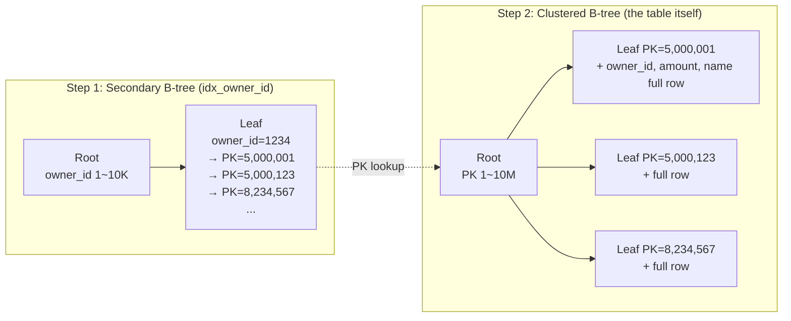
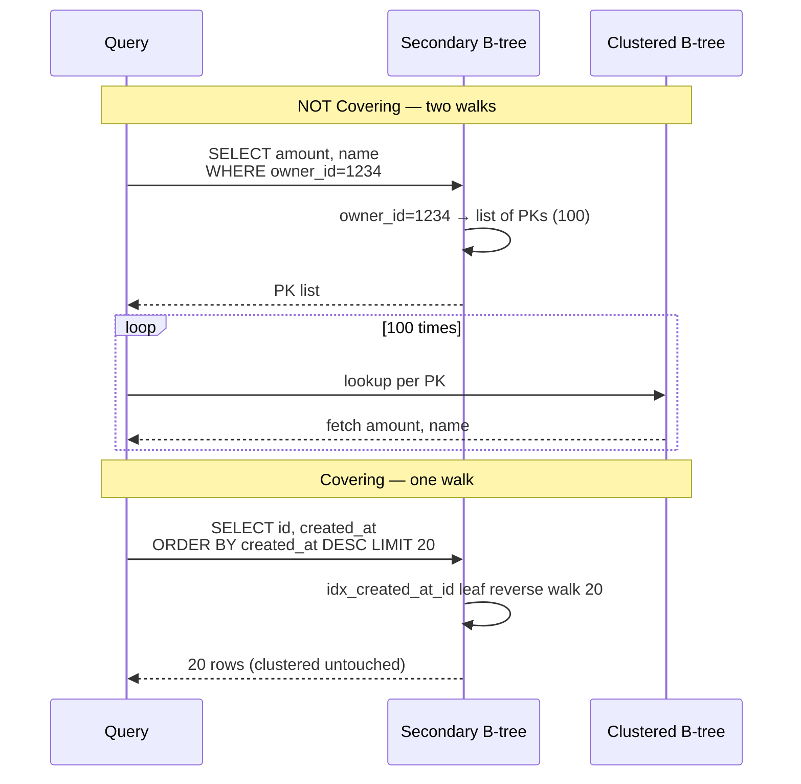
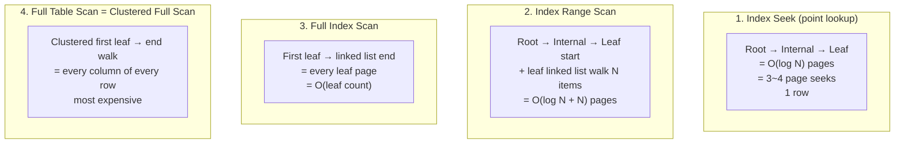
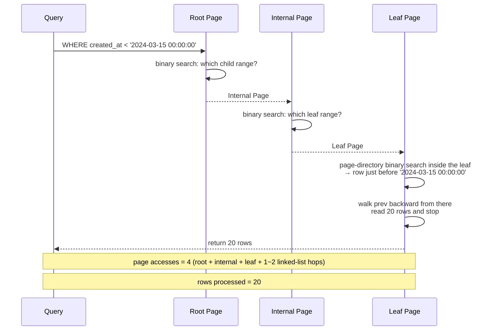
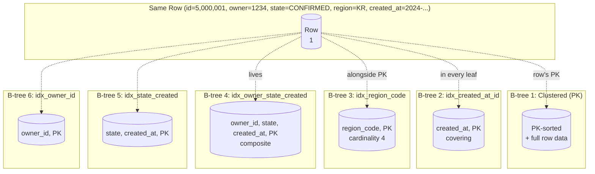
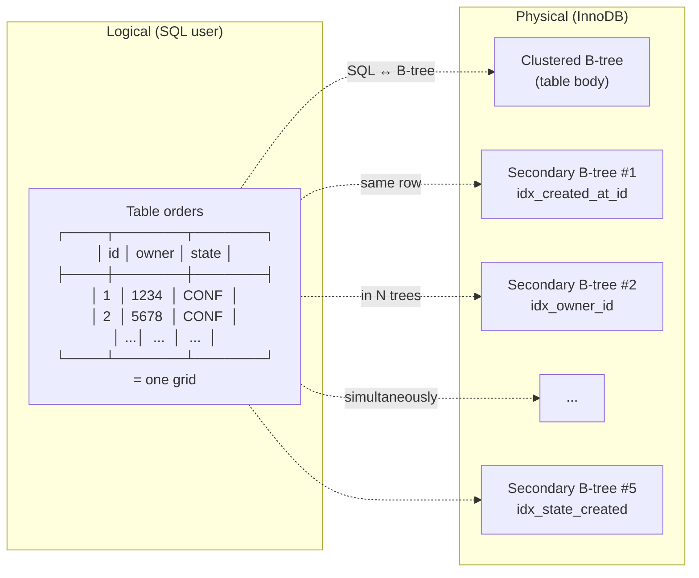

## Table of contents

## Intro — Even without an index, InnoDB already stores rows sorted inside a B-tree {#intro}

Imagine you get this question in an interview: "If a table has no index, how is it stored?" Two common answers:

1. "It piles up on disk in INSERT order."
2. "It just goes in unsorted, in the order of arrival."

**Both are wrong inside InnoDB.** InnoDB stores rows **inside a B-tree, already sorted**, even when you don't define an index. If a PK is declared, the PK becomes the tree's key. If there is no PK, InnoDB auto-generates a 6-byte hidden ROWID and uses that as the key. **A table with zero indexes does not exist inside InnoDB.** There is always at least one B-tree.

Once that single fact wobbles, every following sentence wobbles too:

- "Where does a secondary index go to find the row?" — it points at the **PK, not the physical location**. This is the essence of the **two-step lookup**.
- "Why is a covering index fast?" — because the answer lives in the leaf **without going to the PK**. One lookup is enough.
- "Why is DESC almost as fast as ASC?" — because leaves form a **doubly-linked list**, walkable backward.
- "Why can't OFFSET just skip?" — because B-trees **do not maintain a row counter**; updating one on every INSERT/DELETE would explode lock contention.
- "Why is cursor fast?" — because `WHERE created_at < ?` triggers the B-tree's **binary-search primitive**: jump from root to leaf in one shot.
- "5 indexes = 5x write cost" — because the same table simultaneously holds **5 secondary B-trees + 1 clustered B-tree = 6 B-trees**.

This post unwinds every one of those lines with **10 diagrams + W2 10M-row [measured — Java/Spring]** numbers.

- The companion post [MySQL No-Offset Cursor Pagination — at 10M rows, OFFSET 1M = 171ms / Cursor = 0.30ms](/en/posts/mysql-no-offset-cursor-pagination/) covered the same measurements from the **operational/page-prescription** angle. This post revisits those four concepts (covering / reverse / OFFSET / cursor) from the **B-tree mechanism + diagram** angle, at the principles layer. They are paired posts.
- Inputs: W2 Phase 2 10M-row load (187K rows/s) + Phase 3 cardinality across 5 indexes + Q1~Q5 Before/After.
- Depth: **L2-L3** (RDB Mastery series, post #1 — **InnoDB mechanism + measurements + Big Tech operational hindsight + interview answers**).

---

## 1. The basic units of InnoDB — Page (16KB) / Row / Index {#innodb-units-page-row-index}

### 1.1 page = InnoDB's **physical unit**

InnoDB handles all data in **pages (16KB by default)**. Disk reads are 16KB. Buffer-pool slots are 16KB. B-tree nodes are 16KB.

[MySQL — InnoDB Disk Layout](https://dev.mysql.com/doc/refman/8.0/en/innodb-disk-layout.html) states:

> "InnoDB stores all data in pages. The page size is fixed at 16KB by default and is determined by the `innodb_page_size` variable at the time the MySQL instance is initialized."

→ Reading a single row still pulls the **entire 16KB page** that contains it. This is why **random I/O** is expensive. One row = one page = 16KB.

### 1.2 row = a record inside a page

A page holds many rows in **PK-sorted order**. Diagram 1 — ASCII layout of a single page:

```
┌──────────────────── page (16KB) ────────────────────┐
│ FIL Header (38B): checksum / page_no / prev / next  │
├─────────────────────────────────────────────────────┤
│ Page Header (56B): n_recs / free space / index_id   │
├─────────────────────────────────────────────────────┤
│ Infimum / Supremum (two virtual records)            │
├─────────────────────────────────────────────────────┤
│ User Records (actual rows — sorted by PK)           │
│  ┌─────────────────────────────────────┐           │
│  │ Row #1: id=1001, name='A', amount=… │           │
│  ├─────────────────────────────────────┤           │
│  │ Row #2: id=1002, name='B', amount=… │           │
│  ├─────────────────────────────────────┤           │
│  │ Row #3: id=1003, name='C', amount=… │           │
│  └─────────────────────────────────────┘           │
│  ... ~100 rows / page (depending on row size)       │
├─────────────────────────────────────────────────────┤
│ Free Space (room for future INSERTs)                │
├─────────────────────────────────────────────────────┤
│ Page Directory (slot array — for binary search)     │
├─────────────────────────────────────────────────────┤
│ FIL Trailer (8B): checksum verification             │
└─────────────────────────────────────────────────────┘
```

→ Reading diagram 1: user records inside the page are **sorted by PK** (even when no index is declared). The page directory is a sparse slot array that lets you do **binary search** inside the page — instead of comparing 100 rows linearly, you compare **log(N)** times to land on a single row.

The `prev` / `next` pointers form a **doubly-linked list** that connects this page to its siblings at the same B-tree level. This is the physical foundation for the reverse scan in §5.

[MySQL — InnoDB Row Format](https://dev.mysql.com/doc/refman/8.0/en/innodb-row-format.html) plus [Jeremy Cole — InnoDB Page Anatomy](https://blog.jcole.us/2013/01/07/the-physical-structure-of-innodb-index-pages/) cover the byte-level breakdown of a page in the most detail.

### 1.3 An index = pages connected as a **B+-tree**

If a page holds 100 rows, then 10M rows = **100K pages**. Those 100K pages are wired into a **B+-tree** with **root → internal → leaf** levels. The height is typically 3–4: even with 10M rows, **3–4 page reads** reach any single row.

This is the **first principle** of index design: **disk seek count = tree height + leaf scan**. With an index hit, disk seeks = 3–4. With a full scan, disk seeks = 100K. That gap is the source of 1,000x–10,000x latency differences.

→ Memory and logging aspects of InnoDB (buffer pool / redo log / undo log) are covered in [MySQL InnoDB Architecture Deep Dive](/en/posts/mysql-innodb-architecture-deep-dive/). This post sticks to **index structure**.

---

## 2. Every InnoDB table is a B-tree — the Clustered Index {#clustered-index-table-as-btree}

### 2.1 With a PK: PK = clustered index = **the table itself**

The first **fundamental fact** about InnoDB:

> "Every InnoDB table is stored as a **clustered index**. If a PK is defined, the PK is the clustered index's key. The leaf nodes of the clustered index hold **PK + every column value** — making it identical to **the table itself**."

[MySQL — Clustered and Secondary Indexes](https://dev.mysql.com/doc/refman/8.0/en/innodb-index-types.html) states:

> "Each InnoDB table has a special index called the clustered index where the data for the rows is stored. Typically, the clustered index is synonymous with the primary key."

Diagram 2 — shape of a clustered-index B-tree:

```mermaid
graph TB
    subgraph "Clustered Index (= the table)"
        Root["Root Page<br/>key range: id 1~10M"]
        I1["Internal Page<br/>id 1~5M"]
        I2["Internal Page<br/>id 5M+1~10M"]
        L1["Leaf Page<br/>id 1~100<br/>+ name, amount, ... full row"]
        L2["Leaf Page<br/>id 101~200<br/>+ full row"]
        L3["Leaf Page<br/>id 5M~5M+100<br/>+ full row"]
        L4["Leaf Page<br/>id 9.9M~10M<br/>+ full row"]
    end
    Root --> I1
    Root --> I2
    I1 --> L1
    I1 --> L2
    I2 --> L3
    I2 --> L4
    L1 -.-doubly linked.-> L2
    L2 -.-doubly linked.-> L3
    L3 -.-doubly linked.-> L4
```

→ Reading diagram 2: the key point is that **leaf nodes contain the full row**. The PK directly determines the row's physical location. PK 1 and PK 2 sit on **adjacent (or the same) leaf**, while PK 1 and PK 9,999,999 sit on **distant** leaves. This is what "the table is physically sorted by PK" actually means.

### 2.2 Without a PK: hidden 6-byte ROWID is auto-generated

"What if I don't define a PK?" — InnoDB silently generates a 6-byte hidden integer. [MySQL — Clustered Index](https://dev.mysql.com/doc/refman/8.0/en/innodb-index-types.html):

> "If the table has no PRIMARY KEY or suitable UNIQUE index, InnoDB internally generates a hidden clustered index named GEN_CLUST_INDEX on a synthetic column containing row ID values. The rows are ordered by the ID that InnoDB assigns to the rows in such a table. The row ID is a 6-byte field that increases monotonically as new rows are inserted."

→ The common myth "without a PK, the table is stored without an index" is wrong. **A zero-index table cannot exist inside InnoDB.** Without a PK there is hidden ROWID; with a UNIQUE NOT NULL column, that takes priority. Always exactly one clustered index.

The pitfall of hidden ROWID: **every secondary index leaf still carries this 6-byte hidden ROWID**. If you skip declaring a PK, secondary indexes look up rows by an **invisible** 6-byte key. Declare a PK and you get an explicit 4-byte (INT) or 8-byte (BIGINT) key. That's why `id BIGINT PRIMARY KEY AUTO_INCREMENT` is the operational standard.

### 2.3 Implication — **full table scan = clustered-index full scan**

A direct consequence: in InnoDB, what people call a "full table scan" actually means **walking the leaf level of the clustered index from start to end**. PK-ordered walk. This is **different from PostgreSQL's heap scan** (walk in physical insertion order, no sort guarantee).

`type=ALL` in EXPLAIN = clustered-index full scan. Revisited in §11.

---

## 3. Secondary Index — a separate B-tree that **points to PK** {#secondary-index-pk-pointer}

### 3.1 Secondary-index leaves contain **PK values**

When you run `CREATE INDEX idx_owner_id ON orders (owner_id)`, InnoDB builds a **separate B-tree**. Its leaf entries are:

> `(owner_id value, PK value)`

**Not the physical row location** (page id + slot id). **The PK value.** This is the essence of the **two-step lookup**.

Diagram 3 — the two-stage relationship between secondary and clustered indexes:



→ Reading diagram 3. For `WHERE owner_id = 1234 AND amount > 1000`:

1. **Step 1:** find leaves with owner_id=1234 in the secondary index → get a list of PKs (5,000,001 / 5,000,123 / 8,234,567 …).
2. **Step 2:** for each PK, look up the clustered index again → fetch the full row, evaluate amount > 1000.

That is the cost of a secondary-index lookup: one extra walk per PK — **two walks total**. Operationally this is the **random-I/O cost**. If 100 rows match owner_id=1234, that's 100 clustered-index lookups. If those 100 rows are scattered across 100 different leaf pages, you pay 100 page seeks.

### 3.2 Difference vs PostgreSQL — **heap TID** vs **PK**

PostgreSQL's secondary indexes carry the **heap TID** (physical tuple location) in the leaf. **One lookup.** The leaf points straight to the heap tuple, no PK indirection.

[Use The Index, Luke! — Anatomy of an Index](https://use-the-index-luke.com/sql/anatomy) lays out this contrast cleanly.

| | InnoDB (MySQL) | PostgreSQL |
|---|---|---|
| secondary leaf | (key, **PK**) | (key, **TID** = page+slot) |
| lookups | 2 (secondary → clustered) | 1 (secondary → heap) |
| on PK change | secondary unaffected (if PK stable) | (PG: PK is itself indexed like secondary) |
| on row move (page split) | secondary unaffected | **all secondary indexes updated** (HOT optimization avoids some) |

→ A trade-off, not a winner. InnoDB pays the **two-walk** cost in exchange for **secondary indexes being unaffected by row movement** (as long as PK is stable). PostgreSQL is the opposite. Both are trade-offs.

### 3.3 [Measured — Java/Spring] — Q5 composite-index lookup cost

W2 Phase 3 — Q5 (`WHERE owner_id=? AND state=? ORDER BY created_at DESC LIMIT 20`):

| Step | actual time |
|---|---|
| Before (no index, full scan) | 1,497 ms |
| After (idx_owner_state_created composite) | **2.59 ms** (**577x** faster) |

The composite `(owner_id, state, created_at)` leaf carries `(owner_id, state, created_at, PK)`. With owner_id=1234 + state='CONFIRMED', only **699 candidate rows** survive, then created_at reverse scan + LIMIT 20 picks 20. Only those 20 trigger PK lookups.

That's why "a composite index can feel almost as fast as a covering index". Since PK rides along in every secondary leaf, ordering keys like (created_at, id) becomes covering for free.

---

## 4. Covering Index — an index where **the answer lives in the leaf** {#covering-index}

### 4.1 Definition

If every column the SELECT requires already lives in a secondary-index leaf, the clustered index is never visited. **One lookup, done.** This is a **covering index**.

In [MySQL — EXPLAIN Output](https://dev.mysql.com/doc/refman/8.0/en/explain-output.html#explain-extra-information), the `Extra` column showing `Using index` is the **covering** signal.

Since InnoDB's secondary indexes **always include the PK in the leaf**, a `(created_at, id)` index is **automatically covering** for `SELECT id, created_at FROM ...`. id is the PK (already there), created_at is the index key (already there).

### 4.2 Diagram 4 — covering vs non-covering walk



→ Reading diagram 4. **Non-covering** = the answer is not in the secondary index, so you fetch the **PK list** and visit the clustered index again. With 100 rows, up to 100 page seeks. **Covering** = the secondary leaf contains the answer; clustered is untouched, page seeks drop sharply.

### 4.3 [Measured — Java/Spring] Q3 — the clearest case for covering

W2 Phase 3 — Q3 (`SELECT id, created_at FROM orders_w2 ORDER BY created_at DESC LIMIT 20`):

| Stage | actual time | rows processed |
|---|---|---|
| Before (no index → filesort) | **1,609 ms** | 9,708,696 |
| After (idx_created_at_id, covering reverse scan) | **0.65 ms** | 20 |

→ **2,476x difference.** This is the cleanest illustration of the covering effect.

The key EXPLAIN line:

```
type: index
key: idx_created_at_id
Extra: Using index; Backward index scan
```

`Using index` = covering. `Backward index scan` = walk the leaf linked list backward. Together, "sort 9.7M rows" collapses into "reverse-walk 20 rows".

### 4.4 Combined with the leftmost-prefix rule

A composite index `(a, b, c)` has leaves `(a, b, c, PK)`. Hence:

- `SELECT a, b, c, PK ...` ✅ covering
- `SELECT PK WHERE a = ? AND b = ?` ✅ (prefix matches up to b)
- `SELECT b WHERE a = ?` ✅
- `SELECT a, b WHERE c = ?` ❌ (c alone breaks leftmost prefix → must full-scan the index)

→ "Is it covering?" and "Does WHERE narrow it efficiently?" are **two different questions**. Even if covering, a WHERE that violates leftmost prefix forces a **full index scan**.

The companion post's §3.2 (single-key cursor at 0.27ms) and §3.3 (OR-split cursor at 0.30ms) both run on top of this covering index. Same index, same 10M rows, different SQL shapes.

---

## 5. Physical walk on a B-tree — leaf doubly-linked list {#btree-walk-leaf-linked-list}

### 5.1 Leaf nodes connected via **prev / next** pointers

The `prev page id` / `next page id` fields inside the page header (§1) do this work. The leaves of the B+-tree form a **doubly-linked list**. Moving to the immediate sibling at the same level is **direct**.

Diagram 5 — leaf doubly-linked list:

```
                           Root
                          /   \
                    Internal   Internal
                    /    \      /    \
              Leaf 1 ↔ Leaf 2 ↔ Leaf 3 ↔ Leaf 4 ↔ Leaf 5
              (id=1~100) (101~200) (201~300) (301~400) (401~500)

              ←─── forward (ASC) walk ───→
              ←─── backward (DESC) walk ─→
```

→ Reading diagram 5. Leaf 1's `next` = leaf 2's page id; leaf 2's `prev` = leaf 1's page id. ASC sort → walk left-to-right via next. DESC sort → walk right-to-left via prev.

### 5.2 Reverse-scan cost ≈ forward-scan cost

[MySQL — Descending Indexes](https://dev.mysql.com/doc/refman/8.0/en/descending-indexes.html) (8.0+):

> "InnoDB supports descending index scans. With ascending index scans, the server scans index entries from low to high. With descending index scans, the server scans index entries from high to low. Performance is comparable for both directions."

→ Forward and reverse are essentially equal cost. The only edge: **read-ahead** (predictive prefetch) is tuned for the forward direction, so reverse can be slightly (≤10%) slower. The measured difference is tiny.

### 5.3 The companion post's (b) single-key cursor 0.27ms exercises this

The companion §3.2's `WHERE created_at < ? ORDER BY created_at DESC LIMIT 20` produced this EXPLAIN ANALYZE:

```
-> Limit: 20 row(s)
   -> Covering index range scan on orders_w2 using idx_created_at_id
      over (created_at < '2024-...') (reverse)
      (rows=20)
```

`(reverse)` is the signal that the leaf linked list is being walked backward. **rows=20** = 20 next/prev hops and done. The reason 10M rows are irrelevant.

---

## 6. The four walk patterns side by side {#four-walk-patterns}

Four kinds of walks can happen on a B-tree.

### 6.1 Diagram 6 — the four walks



→ Reading diagram 6:

| walk | entry | exit | cost |
|---|---|---|---|
| **Index Seek** (point lookup) | binary-search root → leaf | 1 row | **O(log N) ≈ 3-4 pages** |
| **Index Range Scan** | binary-search to start leaf | walk linked list M times | **O(log N + M) pages** |
| **Full Index Scan** | first leaf (linked-list head) | until last leaf | **O(leaf count)** |
| **Full Table Scan** = Clustered Full Scan | first clustered leaf | end + all columns | **most expensive** |

### 6.2 [Measured — Java/Spring] mapping the 5 queries to the 4 walks

W2 Phase 3's 5 queries:

| Q | walk type | actual time |
|---|---|---|
| Q1 (`WHERE id = 5000000`) | **Index Seek** (PK point lookup) | 0.042 ms |
| Q2 (`WHERE created_at BETWEEN ... LIMIT 20`) | **Index Range Scan** (after) | 13.5 ms |
| Q3 (`ORDER BY created_at DESC LIMIT 20`) | **Index Range Scan + reverse + covering** | 0.65 ms |
| Q4 (`GROUP BY region_code`) | **Full Index Scan** (after — covering, smaller) | 1,271 ms |
| Q5 (`WHERE owner_id=? AND state=? ...`) | **Index Seek (composite) + reverse range scan** | 2.59 ms |

→ Q4's GROUP BY is **still 1,271ms even as a full index scan**. region_code has only 4 distinct values, so the entire 9.7M leaves must be walked + group aggregate. **Faster than the full table scan (Before 2,249ms) but absolute time is large** — full index scan still touches every leaf.

---

## 7. The OFFSET ceiling — **why everything is read and discarded** {#offset-limit}

### 7.1 B-trees do **not maintain a row counter**

OFFSET 1,000,000 = "skip the first 1,000,000 rows, return the next 20". Intuitively: "just jump to row 1,000,001, right?" InnoDB **doesn't know** that location.

Why. B-tree internal nodes only store **key ranges**: "id 1–5M is the left child / 5M+1–10M is the right child" — pure **key-routing information**. They **do not store** "how many rows live in this subtree".

### 7.2 Why no counter — **cost > benefit**

"Couldn't a counter make OFFSET fast?" — no, it isn't added. Why:

**Every INSERT would have to bump counters on every internal node along the root path.** DELETE, the same with -1. With tree height 4, one INSERT = 4 counter updates. But that counter would be **a contention point for every concurrent transaction** — 100 simultaneous INSERTs would turn the root's counter into a hot spot, **collapsing throughput under lock contention**.

The win on OFFSET is dwarfed by the loss on INSERT/DELETE concurrency. So **the general B-tree index** (as implemented in MySQL / PostgreSQL / Oracle / SQL Server etc.) does not maintain ordinal-position metadata. A **fundamental B-tree trade-off**.

[Use The Index, Luke! — No Offset](https://use-the-index-luke.com/no-offset) covers this OFFSET ceiling — rooted in the absence of ordinal-position metadata in B-tree indexes — in detail.

### 7.3 Diagram 7 — OFFSET sequential walk + discard

```
OFFSET 1,000,000 LIMIT 20 walk:

Leaf 1 → Leaf 2 → ... → Leaf 9,999 → Leaf 10,000 → Leaf 10,001
   |                                                     |
   ↓                                                     ↓
[ read 1,000,000 rows, throw away ]              [ read 20 rows → return ]

total page accesses ≈ 10,001 pages (16KB × 10,001 ≈ 160MB I/O or buffer pool hits)
total rows processed = 1,000,020
returned rows = 20
```

→ Reading diagram 7. Even **on a covering index**, you must read 10,001 leaf pages **in order**. The first 10,000 leaves are **read and thrown away**. InnoDB **cannot skip**.

### 7.4 [Measured — Java/Spring] OFFSET 1M = 171ms

OFFSET-position vs latency, **on top of a covering index**:

| OFFSET | actual time | rows scanned |
|---|---|---|
| 1,000 | 0.443 ms | 1,020 |
| 100,000 | 23.4 ms | 100,020 |
| **1,000,000** | **171 ms** | **1,000,020** |
| 5,000,000 | 765 ms | 5,000,020 |

→ **OFFSET cost is exactly proportional to the number of rows read and discarded.** Even with a covering index, **you cannot skip**. The companion §2 unwinds the page-level numbers; this post stays with the **why** at the B-tree mechanism layer.

---

## 8. Why cursor is fast — **the binary-search primitive** {#cursor-binary-search}

### 8.1 `WHERE created_at < ?` = the B-tree's **true primitive**

OFFSET's collapse and cursor's speed are **two sides of the same coin**.

OFFSET asks for a **positional index** ("the N-th row"). B-trees don't carry that — sequential walk is forced.

`WHERE created_at < ?` asks for **a key comparison** ("rows whose key is less than this"). That is **what B-trees do best**. Binary search root → internal → leaf, jump straight to the start.

Diagram 8 — cursor's binary-search jump:



→ Reading diagram 8. **4 page accesses / 20 rows processed.** The reason 10M rows are **irrelevant**: cursor maps directly onto the B-tree's natural primitive.

### 8.2 [Measured — Java/Spring] cursor 0.30ms

OR-split cursor measurement from companion §3.3:

| approach | actual time | rows scanned |
|---|---|---|
| OFFSET 1,000,000 | 171 ms | 1,000,020 |
| **OR-split cursor** | **0.30 ms** | **20** |

→ **About 570x.** The two diagrams in §7 + §8 explain the gap. OFFSET = 1M page seeks (sequential walk). Cursor = 4 page seeks (binary search).

The companion's three-shape comparison ((a) row constructor 154ms / (b) single-key cursor 0.27ms / (c) OR-split 0.30ms) is about **whether the optimizer pushes the predicate down**. The **B-tree mechanism itself** delivers binary-search primitive whenever push-down works. This post focuses on the latter.

---

## 9. Multi-index — **N B-trees on the same table** {#multiple-indexes}

### 9.1 5 indexes = 6 B-trees (clustered + 5)

The 5 indexes built in W2 Phase 3:

```sql
CREATE INDEX idx_created_at_id        ON orders_w2 (created_at, id);
CREATE INDEX idx_region_code          ON orders_w2 (region_code);
CREATE INDEX idx_owner_state_created  ON orders_w2 (owner_id, state, created_at);
CREATE INDEX idx_state_created        ON orders_w2 (state, created_at);
CREATE INDEX idx_owner_id             ON orders_w2 (owner_id);
```

On the single table `orders_w2`, InnoDB now holds **6 B-trees simultaneously**: 1 clustered (= the table) + 5 secondary.

Diagram 9 — the same row sits in all 6 B-trees:



→ Reading diagram 9. One row = 6 leaf entries (one in each B-tree). One INSERT = **all 6 B-trees updated**. One DELETE the same.

### 9.2 Cardinality of each index — W2 Phase 3 [measured]

| index | cardinality | meaning |
|---|---|---|
| PRIMARY | 9,708,696 | id is nearly unique |
| idx_created_at_id | 9,708,696 | covering, nearly unique |
| idx_region_code | **4** | 5 regions evenly distributed → ~2.4M rows per region (very low selectivity) |
| idx_owner_state_created (owner) | 21,711 | 10K owners |
| idx_owner_state_created (state) | 43,422 | 4 states |
| idx_state_created (state) | 969 | 4 states + time bucketing |
| idx_owner_id | 12,585 | 10K owners |

→ A cardinality-4 index (idx_region_code) is **almost useless**. A lookup on region_code='KR' returns ~2.4M rows on average, and the optimizer is likely to **fall back to a full table scan**. An index does not always speed things up.

### 9.3 Write-latency cost — write amplification

Cost of one INSERT:

| index count | B-trees updated per INSERT | relative cost |
|---|---|---|
| 0 (PK only) | 1 (clustered) | 1x (baseline) |
| 1 secondary | 2 | 2x |
| 5 secondary | **6** | **6x** |

W2 Phase 2 loaded 10M rows in **53.5s = 187K rows/s** with **no indexes**. If you re-ran the same load with 5 indexes attached, you would expect 5–6x slower. That's why the operational pattern is **disable indexes for bulk load → enable after**, recommended by [MySQL — Bulk Data Loading for InnoDB Tables](https://dev.mysql.com/doc/refman/8.0/en/optimizing-innodb-bulk-data-loading.html).

### 9.4 Storage cost

A single index ≈ (key column size + PK size) × row count × 1.5 (B-tree fill factor + page overhead).

W2 Phase 3 rough math:
- idx_created_at_id (8B + 8B) × 10M × 1.5 ≈ 240MB
- idx_owner_state_created (8 + 1 + 8 + 8) × 10M × 1.5 ≈ 375MB
- 5 indexes total ≈ **1.3GB**

A 10GB table picks up 1.3GB of indexes. Indexes occupy buffer-pool slots → reduces **buffer-pool hit rate on the clustered index itself**. The topic of the **index diet** (series #6).

---

## 10. Logical vs physical {#logical-vs-physical}

### 10.1 Two views of the same table

The **logical** view a SQL user sees and the **physical** view InnoDB sees are different.

Diagram 10 — logical ↔ physical mapping:



→ Reading diagram 10:

| aspect | logical | physical |
|---|---|---|
| table | 1 grid (rows × cols) | **N B-trees** (1 clustered + N-1 secondary) |
| row | 1 record | N leaf entries (one per B-tree) |
| column | a column of the grid | a field in the clustered leaf / a key in a secondary index |
| sort | `ORDER BY` at query time | clustered = PK order / secondary = index-key order |

### 10.2 Implications

- "One table" in SQL maps to **N B-trees** inside InnoDB. Adding an index is **not adding a new grid; it's adding a new B-tree**.
- "INSERT one row" is **updating leaves on N B-trees**.
- "Sorted result": if a matching index exists, the data is **already physically sorted** and you only walk; otherwise **filesort in memory**.

When this mapping breaks, EXPLAIN, the optimizer, and indexes all turn fuzzy.

---

## 11. Re-defining "Full Table Scan" {#full-table-scan-redefined}

### 11.1 In InnoDB, **full table scan = clustered-index full scan**

Restating the implication from §2. EXPLAIN's `type=ALL` is colloquially "full table scan". What actually happens **physically**:

- start at the first leaf of the clustered index (the page with the smallest PK)
- walk the linked-list `next` pointers until the end
- read **every column of every row**

**= full leaf scan of the clustered index.** PK-ordered walk. **Different from PostgreSQL's heap full scan** (file-order, no sort).

### 11.2 EXPLAIN type-column mapping

[MySQL — EXPLAIN Output (type)](https://dev.mysql.com/doc/refman/8.0/en/explain-output.html#explain-join-types):

| type | meaning | walk in this post |
|---|---|---|
| `const` / `eq_ref` | PK / unique 1 row | Index Seek |
| `ref` | secondary equality | narrow Index Range Scan |
| `range` | secondary BETWEEN/`<` | Index Range Scan |
| `index` | full index scan (covering: leaf only) | Full Index Scan |
| `ALL` | clustered full leaf scan | **Full Table Scan = Clustered Full Scan** |

→ Seeing `type=ALL` in EXPLAIN means **a clustered-index full leaf scan is happening**. Not the random-walk-through-heap that PG users imagine — it's a PK-ordered walk.

### 11.3 Big Tech case — LINE catches `type=ALL` with VISUAL EXPLAIN

[LINE Engineering — Catching index behaviour with MySQL Workbench VISUAL EXPLAIN](https://engineering.linecorp.com/ko/blog/mysql-workbench-visual-explain-index) describes an operational tool that visualizes type=ALL. A full-table-scan slip easy to miss in the text EXPLAIN output becomes obvious in the graph.

---

## 12. Big Tech cases + interview answers {#bigtech-references}

### 12.1 Big Tech sources (URL verified ≥ 6)

| source | post | which § does it support |
|---|---|---|
| Toss SLASH24 | [Next core banking — Oracle→MySQL + InnoDB MVCC](https://haon.blog/article/toss-slash/next-core-banking/) | §2 clustered index, §3 secondary lookup |
| LINE Engineering | [MySQL Workbench VISUAL EXPLAIN](https://engineering.linecorp.com/ko/blog/mysql-workbench-visual-explain-index) | §11 type=ALL detection |
| Kakao Pay | [JPA Transactional readOnly + set_option](https://tech.kakaopay.com/post/jpa-transactional-bri/) | §3 secondary index + read tuning |
| Use The Index, Luke! | [Anatomy of an Index](https://use-the-index-luke.com/sql/anatomy) | §3 InnoDB vs PG indirection |
| Use The Index, Luke! | [No Offset](https://use-the-index-luke.com/no-offset) | §7 OFFSET ceiling |
| Vlad Mihalcea | [How does MVCC work](https://vladmihalcea.com/how-does-mvcc-multi-version-concurrency-control-work/) | §1 InnoDB foundation |
| Vlad Mihalcea | [Index Selectivity](https://vladmihalcea.com/index-selectivity-cardinality-postgresql-mysql/) | §9.2 cardinality |
| Percona | [InnoDB Buffer Pool / B-tree](https://www.percona.com/blog/category/innodb/) | §1.3 page seek |
| Discord | [Storing Billions of Messages](https://discord.com/blog/how-discord-stores-billions-of-messages) | §9 multi-index → distributed limits |
| Jeremy Cole | [The physical structure of InnoDB index pages](https://blog.jcole.us/2013/01/07/the-physical-structure-of-innodb-index-pages/) | §1.2 page byte-level |
| MySQL official | [Clustered and Secondary Indexes](https://dev.mysql.com/doc/refman/8.0/en/innodb-index-types.html) | §2 / §3 |
| MySQL official | [Descending Indexes](https://dev.mysql.com/doc/refman/8.0/en/descending-indexes.html) | §5.2 reverse scan |

### 12.2 Five interview answers

#### Q1. "If a table has no index, how does InnoDB store rows?"

> "**It already stores them sorted inside a B-tree.** If a PK is defined, that PK is the clustered-index key, and the clustered-index leaf carries **the full row**, so the **clustered index is the table itself**. If there's no PK, InnoDB auto-generates a 6-byte hidden ROWID and uses that as the clustered key. So **a zero-index table doesn't exist inside InnoDB** — there is always at least one clustered index. The common 'rows just pile up in INSERT order' is wrong; **rows are physically sorted by PK**."

#### Q2. "Why can't a secondary-index lookup finish in one step?"

> "InnoDB's secondary-index leaves carry the **PK value**, not the physical row location. So `WHERE owner_id=1234` goes (1) find owner_id=1234 leaves in the secondary index → get a list of PKs, then (2) look up the clustered index again with each PK. **Two walks.** PostgreSQL puts the heap TID in the leaf and finishes in one walk — clear contrast. The trade-off: InnoDB's secondary indexes are **unaffected when a row moves due to page split** (as long as PK stays put); PG must update every secondary index (HOT optimization avoids some)."

#### Q3. "Why is a covering index fast?"

> "If every column the SELECT needs lives **in the secondary-index leaf**, the clustered index is never touched — **one lookup**. InnoDB's secondary indexes **always carry the PK in the leaf**, so an index like (created_at, id) is **automatically covering** for `SELECT id, created_at`. EXPLAIN's `Using index` is the covering signal. In W2, `ORDER BY created_at DESC LIMIT 20` went from 1,609ms (filesort, no index) → 0.65ms (covering reverse scan) — **2,476x** ([measured — Java/Spring])."

#### Q4. "Why does OFFSET collapse on deep pages? (B-tree mechanism)"

> "B-tree internal nodes only store **key ranges**; **they don't carry a row counter**. So 'jump to the N-th row' is impossible — the engine must **read N rows sequentially from the first leaf and discard them**. Why no counter? Because every INSERT/DELETE would have to bump counters on every node along the root path — turning the root into a **lock hot spot** that collapses concurrent throughput. **Cost > benefit.** Every RDBMS (MySQL/PG/Oracle) makes the same call. In W2, OFFSET 1M = 171ms with rows scanned = 1,000,020 — **literally read 1M and threw them away** ([measured — Java/Spring])."

#### Q5. "5 indexes vs 0 — what's the **write** cost difference?"

> "5 indexes on a single table = clustered 1 + secondary 5 = **6 B-trees** simultaneously. One INSERT = updates to leaves on all 6. One DELETE same. UPDATE only touches secondary indexes whose key columns changed, but if a key changes the leaf moves (potential page split). In W2, no-index load was 187K rows/s (53.5s for 10M rows); the same load with 5 indexes attached is theoretically 5–6x slower. That's why **disable indexes during bulk load, enable after** is the operational standard. Storage adds 1.3GB → buffer-pool pressure also degrades clustered hit-rate. Hence the operational discipline of an **index diet** (sys.schema_unused_indexes / invisible indexes) ([measured — Java/Spring])."

---

## 13. What we learned {#key-takeaways}

### 13.1 Assumptions broken by measurement

- "Without an index, rows are unsorted" → **stored sorted by PK inside the clustered index**.
- "Secondary indexes point directly to row locations" → **they point to PK → two-walk lookup**.
- "Covering is a separate option" → **secondary indexes always carry PK, so covering is largely automatic**.
- "DESC is slower than ASC" → **the doubly-linked leaf list makes them roughly equal**.
- "OFFSET is fine on top of an index" → **even on covering indexes, sequential walk + discard is forced (1M = 171ms)**.
- "Adding an index always helps" → **reads improve, but INSERT/DELETE pay N+1x and storage grows**.

### 13.2 The single-line takeaway

> **Every InnoDB table is already a B-tree. PK = clustered index = the table itself. Secondary indexes are separate B-trees that point to PK → two-walk lookup. Covering indexes carry the answer in the leaf → one lookup. Reverse scan walks the leaf doubly-linked list backward. OFFSET collapses because B-trees don't carry a row counter and force sequential walk. Cursor is fast because `WHERE` triggers the B-tree's binary-search primitive. Multi-index = N B-trees on one table. At 10M rows, [measured] Q3 covering 2,476x / Q5 composite 577x / OFFSET 1M = 171ms / cursor = 0.30ms — every number falls out of one mechanism.**

---

## 14. Up next — a series {#next-post}

This is **post #1 of the RDB Mastery series** — the **internal index structure** angle. Next:

- **#2 — Kinds of Indexes** (B-tree / Hash / Covering / Multi-valued / Functional). Builds the rest of the index taxonomy on top of the clustered/secondary/covering split here.
- **#3 — EXPLAIN ANALYZE Mastery.** The Q2 paradox (index addition that made things slower) + the row-constructor push-down trap — how the **optimizer** picks indexes.
- **#4 — Operational ALTER patterns** (Online DDL / pt-osc / gh-ost). What happens to those **N B-trees** during ALTER.
- **#5 — Limits of 1:N joins** (N+1 / EntityGraph / cursor + 1:N). How the **secondary lookup** explodes through ORM.
- **#6 — The index diet.** How to reclaim the **N-B-tree cost** in production.

Companion posts:
- [MySQL No-Offset Cursor Pagination — page-level measurements](/en/posts/mysql-no-offset-cursor-pagination/) (operational prescription matching §7~§8 of this post)
- [B+tree Index and Page Split: UUIDs Are Killing Your INSERT](/en/posts/mysql-btree-index-page-split-deep-dive/) (page split mechanism on top of §1's page concept)
- [MySQL InnoDB Architecture Deep Dive](/en/posts/mysql-innodb-architecture-deep-dive/) (this post = index angle / that post = buffer pool / log / undo angle)

---

## References {#references}

### Official docs

- [MySQL — InnoDB Disk Layout](https://dev.mysql.com/doc/refman/8.0/en/innodb-disk-layout.html) — page is 16KB
- [MySQL — Clustered and Secondary Indexes](https://dev.mysql.com/doc/refman/8.0/en/innodb-index-types.html) — clustered index + hidden ROWID
- [MySQL — InnoDB Row Format](https://dev.mysql.com/doc/refman/8.0/en/innodb-row-format.html) — row byte-level layout
- [MySQL — Descending Indexes](https://dev.mysql.com/doc/refman/8.0/en/descending-indexes.html) — reverse scan
- [MySQL — EXPLAIN Output (type)](https://dev.mysql.com/doc/refman/8.0/en/explain-output.html#explain-join-types) — meaning of `type=ALL`
- [MySQL — EXPLAIN ANALYZE](https://dev.mysql.com/doc/refman/8.0/en/explain.html#explain-analyze) — actual time / rows
- [MySQL — Bulk Data Loading for InnoDB](https://dev.mysql.com/doc/refman/8.0/en/optimizing-innodb-bulk-data-loading.html) — disable indexes during bulk load

### Big Tech / operations

- [Toss SLASH24 — Next core banking](https://haon.blog/article/toss-slash/next-core-banking/) — Oracle→MySQL InnoDB MVCC
- [LINE — VISUAL EXPLAIN](https://engineering.linecorp.com/ko/blog/mysql-workbench-visual-explain-index) — type=ALL detection
- [Kakao Pay — JPA Transactional readOnly](https://tech.kakaopay.com/post/jpa-transactional-bri/) — read-side tuning
- [Discord — Storing Billions of Messages](https://discord.com/blog/how-discord-stores-billions-of-messages) — RDB ceiling → distributed transition

### Textbook level

- [Use The Index, Luke! — Anatomy of an Index](https://use-the-index-luke.com/sql/anatomy) — InnoDB vs PG indirection
- [Use The Index, Luke! — No Offset](https://use-the-index-luke.com/no-offset) — OFFSET = anti-pattern
- [Vlad Mihalcea — MVCC / Index Selectivity](https://vladmihalcea.com/how-does-mvcc-multi-version-concurrency-control-work/)
- [Jeremy Cole — InnoDB Page Anatomy](https://blog.jcole.us/2013/01/07/the-physical-structure-of-innodb-index-pages/) — byte-level breakdown of a page
- [Percona — InnoDB Buffer Pool / B-tree](https://www.percona.com/blog/category/innodb/) — operational angle

### Known limitation

- [MySQL Bug #16247 — Row comparisons should use range scan](https://bugs.mysql.com/bug.php?id=16247) — known optimizer limitation around row-constructor push-down (currently marked duplicate in the tracker). Unrelated to this article's OFFSET section — see the sister post [No-Offset Cursor Pagination](/en/posts/mysql-no-offset-cursor-pagination#row-constructor-pushdown-failure)

Raw data from this measurement is kept inside the portfolio repo (10M-row environment / cardinalities of 5 indexes / Q1~Q5 Before/After / OFFSET vs cursor 4-point measurements).
