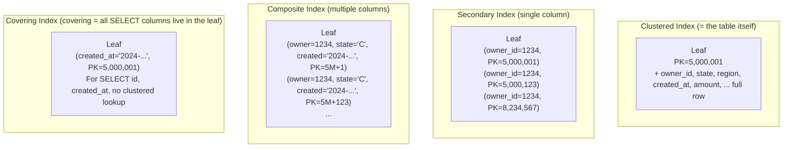
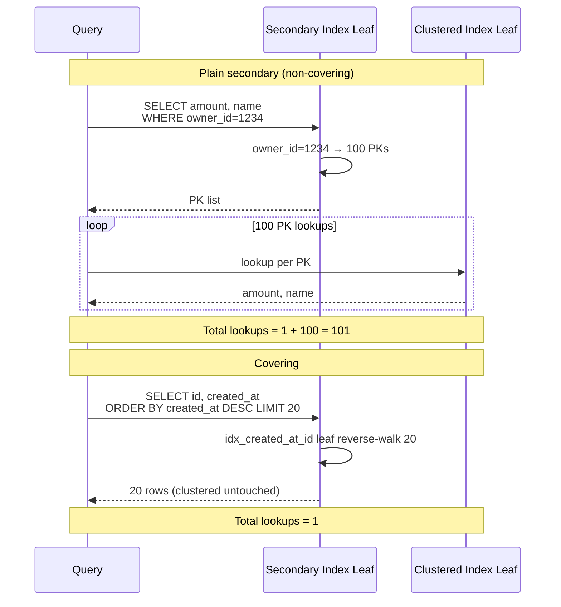
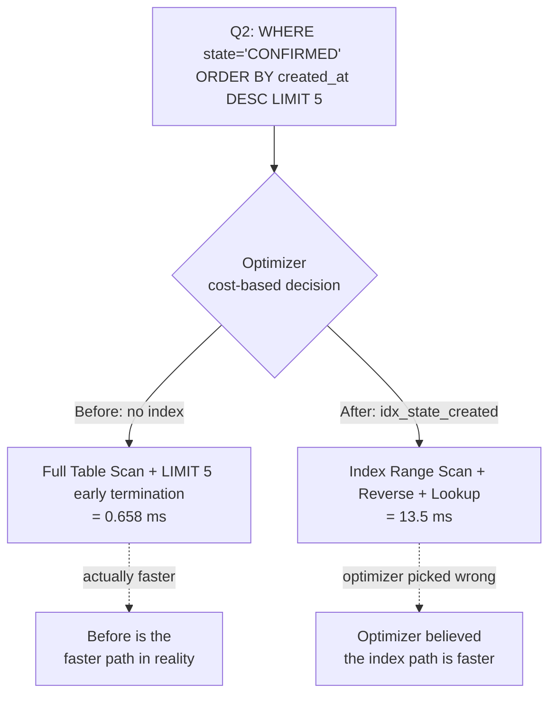

## Table of contents

## Intro — A table with just a PK already has one index. So when, and what kind, do you add next? {#intro}

[Post #1 — RDB Mastery #1 — InnoDB Index Internals](/en/posts/rdb-mastery-01-innodb-index-internals/) laid down a single hard fact. **Every InnoDB table is already stored sorted inside a B-tree by PK.** The PK is the clustered index = the table itself. Without a PK, InnoDB auto-generates a hidden ROWID, so there is always at least one B-tree.

Then comes the next question.

> "On top of that, when you add **another** index — what kind, and when?"

Two common answers.

1. "Just add an index on the columns you query often."
2. "B-tree is the default, so make a B-tree."

**Both are insufficient in production.** MySQL has six index types. And inside the B-tree family alone, five decision axes — **clustered / secondary / covering / composite / cardinality** — fire at the same time.

- "Can I create a **Hash index** on InnoDB?" — No. Memory engine only. InnoDB simulates parts of it via the **adaptive hash index**.
- "**Spatial index** lives on GEOMETRY columns — an R-tree."
- "**Full-text index** is for natural-language search — an inverted-index structure."
- "**Multi-valued index** (8.0+) makes each element of a JSON array a leaf entry."
- "**Functional index** (8.0.13+) makes the result of an expression like `LOWER(email)` the key."
- "**Composite index** `(a, b, c)` works for `WHERE a=?` or `WHERE a=? AND b=?`. `WHERE b=?` alone does not (leftmost prefix)."
- "**Cardinality** of 4 (4 distinct regions) on a standalone index = nearly useless."
- "**Covering** when possible — lookup count drops from 1 to 0."

This post walks every one of those decision axes by building real indexes on a 10M-row table and measuring — concluding **when to pick what**.

- Inputs: W2 Phase 3 cardinality across 5 indexes + Q1~Q5 Before/After + Q2 paradox + index storage 1.3GB + write latency 5~6x.
- Companion post [MySQL No-Offset Cursor Pagination](/en/posts/mysql-no-offset-cursor-pagination/) — its cursor is one application of the §3 composite + leftmost-prefix rule from this post.
- Depth: **L2-L3** (RDB Mastery series, post #2 — **trade-offs by index type + measurements + Big Tech operations + interview answers**).

---

## 1. Six Index Types in MySQL {#index-types-six}

### 1.1 The six types

[MySQL — CREATE INDEX](https://dev.mysql.com/doc/refman/8.0/en/create-index.html) defines six index types.

| Type | Internal structure | Use case | Storage engine |
|---|---|---|---|
| **B-tree** | B+-tree | Equality / range / sort (default) | InnoDB / MyISAM |
| **Hash** | Hash table | Equality only | Memory engine only |
| **Spatial** | R-tree | GEOMETRY coordinates | InnoDB / MyISAM |
| **Full-text** | Inverted index | Natural-language search (`MATCH ... AGAINST`) | InnoDB / MyISAM |
| **Multi-valued** (8.0+) | B-tree variant | Each element of a JSON array | InnoDB |
| **Functional** (8.0.13+) | B-tree (expression result is key) | Computed columns like `LOWER(col)` | InnoDB |

### 1.2 Diagram 1 — internal structure of all six types

```
┌─────────────────────────────────────────────────────────────┐
│ 1. B-tree (B+-tree)                                          │
│    Root → Internal → Leaf (linked list)                      │
│    Range + sort + equality, all of the above                 │
│                                                              │
│ 2. Hash (Memory engine)                                      │
│    bucket[h(key) % N] → key, value                          │
│    Equality O(1) / range X / sort X                          │
│                                                              │
│ 3. Spatial (R-tree)                                          │
│    A tree of bounding boxes                                  │
│    "Find N items near this coordinate"                       │
│                                                              │
│ 4. Full-text (Inverted Index)                                │
│    word → [doc1, doc3, doc7, ...]                           │
│    "Find documents that contain a query term"                │
│                                                              │
│ 5. Multi-valued (8.0+, B-tree variant)                       │
│    JSON [tag1, tag2, tag3] → 3 leaf entries                 │
│    "JSON_CONTAINS(tags, ?)"                                  │
│                                                              │
│ 6. Functional (8.0.13+, B-tree)                              │
│    LOWER('Foo') → 'foo' becomes the leaf key                │
│    "WHERE LOWER(col) = ?" pushes down                        │
└─────────────────────────────────────────────────────────────┘
```

→ Reading Diagram 1. Of the six, **InnoDB can build five** (B-tree / Spatial / Full-text / Multi-valued / Functional). Hash is Memory-engine-only. Spatial / Full-text apply only to specialised columns (GEOMETRY / TEXT) — so in everyday operations the indexes you meet are essentially **B-tree and its variants (Multi-valued / Functional)**.

### 1.3 Focus of this post — InnoDB B-tree and its variants

This post focuses on InnoDB B-tree and its variants (Multi-valued / Functional) because they dominate operational decision-making. Hash / Spatial / Full-text get one paragraph each in §8. Within the B-tree family, four **shapes** — clustered / secondary / covering / composite — and one **effect** — cardinality — form the decision axes.

---

## 2. Variants of the B-tree Index — Clustered / Secondary / Covering / Composite {#btree-variants}

### 2.1 Quick recap from Post #1

A one-paragraph recap of the **structure** covered in [Post #1](/en/posts/rdb-mastery-01-innodb-index-internals/).

> Every InnoDB table is stored as a **clustered index**. The PK is the clustered key. The clustered leaf carries **the entire row**, so the clustered index **is** the table. A **secondary index** is a separate B-tree whose leaf carries **(index key, PK)** — so finding a row through a secondary index takes **two lookups** (one secondary + one clustered). A **covering index** holds every column the SELECT needs in the secondary leaf, so the **clustered lookup is skipped** → one lookup. A **composite index** `(a, b, c)` simply bundles multiple columns into one index.

How those four shapes differ inside the same B-tree family — Diagram 2 spells it out.

### 2.2 Diagram 2 — leaf shapes of clustered / secondary / composite



→ Reading Diagram 2. **Clustered** leaf = **full row**. **Secondary** leaf = **(key, PK)**. **Composite** leaf = **(key1, key2, key3, PK)** — multiple keys bundled into one leaf. **Covering** is when the SELECT columns all live inside the leaf, skipping the clustered lookup.

The key observation: **secondary / composite / covering are all shapes of the same secondary-index B-tree**, not separate index kinds. Whether you bundle one column or three at CREATE INDEX time decides the shape.

### 2.3 The four operational decision axes

| Axis | Question | Impact |
|---|---|---|
| **Clustered vs Secondary** | How is the PK defined? | Cost of every secondary lookup (PK size + distribution) |
| **Covering or not** | Are all SELECT columns inside the index leaf? | One lookup vs two (tens to hundreds of x latency difference) |
| **Composite column order** | (a, b, c) vs (b, a, c) — which goes first? | Leftmost-prefix rule (next, §3) |
| **Cardinality / Selectivity** | Distinct values / total rows | Whether the index is effective at all (§4) |

These four axes form the spine of §3~§5 below.

---

## 3. Composite Index and the Leftmost-Prefix Rule {#composite-leftmost-prefix}

### 3.1 The rule, stated

A composite index `(a, b, c)` makes the following WHERE shapes index-usable.

| WHERE | Index used | Why |
|---|---|---|
| `WHERE a = ?` | ✅ | leftmost = a |
| `WHERE a = ? AND b = ?` | ✅ | a + b leftmost prefix |
| `WHERE a = ? AND b = ? AND c = ?` | ✅ | full prefix |
| `WHERE a = ? AND c = ?` | △ (only up to a) | skipping b means c cannot narrow further on the index |
| `WHERE b = ?` | ❌ | a missing, leftmost broken |
| `WHERE c = ?` | ❌ | a, b missing |
| `WHERE b = ? AND c = ?` | ❌ | a missing |

This is the **leftmost-prefix rule**: matching has to start from the left and proceed in order.

### 3.2 Why "leftmost" — the B-tree's sort order

The leaf of `(a, b, c)` is **sorted as a 4-tuple (a, b, c, PK)**, with priority a → b → c.

Diagram 3 — the sort order of a composite leaf:

```
Leaf of idx_owner_state_created (owner_id, state, created_at):

(owner=1234, state='C', created='2024-01-01', PK=5M+1)
(owner=1234, state='C', created='2024-01-15', PK=5M+5)
(owner=1234, state='C', created='2024-03-22', PK=5M+99)
(owner=1234, state='P', created='2024-01-02', PK=5M+8)
(owner=1234, state='P', created='2024-02-10', PK=5M+45)
(owner=1235, state='C', created='2024-01-01', PK=5M+200)
(owner=1235, state='C', created='2024-04-19', PK=5M+311)
(owner=1235, state='X', created='2024-02-08', PK=5M+800)
...

  ↑ owner_id is the primary sort key, state secondary, created_at tertiary
```

→ Reading Diagram 3. `WHERE owner_id = 1234` — binary search jumps to the leaf region where owner=1234, then walks. **100% index utilisation.** `WHERE owner_id = 1234 AND state = 'C'` — additional binary search inside owner=1234 finds the state='C' slice. **100% index utilisation.** But `WHERE state = 'C'` alone — the leaf is primarily sorted by owner_id, so state='C' rows are **scattered**. Binary search cannot help → full leaf walk required → **the index cannot be used**.

The phone-book analogy: in a directory sorted by surname-then-given-name, "surname Kim" is fast (front of the sort matches), but "given name Myeonsoo" forces you to **scan the entire book** because given names are scattered. Same principle.

### 3.3 [Measured — Java/Spring] Q5 — composite lookup + reverse scan

Q5 in W2 Phase 3, after creating the `(owner_id, state, created_at, id)` composite:

```sql
SELECT id, owner_id, state, created_at, amount
FROM orders_w2
WHERE owner_id = 1234 AND state = 'CONFIRMED'
ORDER BY created_at DESC
LIMIT 20;
```

| Stage | Actual time | Rows processed | Notes |
|---|---|---|---|
| Before (no index, full scan + filesort + filter) | **1,497 ms** | 9,708,696 | Full 9.7M scan + sort |
| After (composite + reverse + lookup) | **2.59 ms** | 699 | **577x faster** |

Key EXPLAIN line:

```
type: ref
key: idx_owner_state_created
key_len: 1043 (owner 8B + state varchar + created 5B + PK 8B)
rows: 699
Extra: Backward index scan
```

→ With the prefix `owner_id=1234 AND state='CONFIRMED'`, the row set narrows to **699**, then `created_at` reverse scan + LIMIT 20 reads only 20. The index narrowing 9.7M to 699, then the reverse-scan + LIMIT 20 reading just 20 — that is the substance of 1,497ms → 2.59ms.

The companion post [MySQL No-Offset Cursor Pagination](/en/posts/mysql-no-offset-cursor-pagination/) uses the same mechanism — `WHERE created_at < ?` (leftmost) + `ORDER BY created_at DESC LIMIT 20` on top of `(created_at, id)`. A direct application of this leftmost-prefix rule.

### 3.4 Picking the column order

The standard rule for composite column order:

1. **Equality (=) columns first, range (<, >) columns later**: equality narrows the leaf to a point, range narrows to an interval, so equality-then-range works best.
2. **Higher cardinality first** (within the equality group): if equal in operator, the more selective column goes first.
3. **ORDER BY column at the very end** (so the B-tree's natural sort order eliminates filesort).

W2 Phase 3's `(owner_id, state, created_at)` follows exactly this rule. owner_id (10K owners) + state (4 values, equality) → created_at (for sort). Equality → sort.

---

## 4. Cardinality (Selectivity) and Index Effectiveness {#cardinality-selectivity}

### 4.1 Definitions

- **Cardinality** = number of distinct values in the column
- **Selectivity** = unique values / total rows = cardinality / row count
- Selectivity 1.0 = every row unique (PK)
- Selectivity near 0 = many duplicates → indexing is barely useful

[Vlad Mihalcea — Index Selectivity](https://vladmihalcea.com/index-selectivity-cardinality-postgresql-mysql/) puts it plainly:

> "The higher the selectivity of a column, the more efficient an index on it can be. A column with low selectivity (e.g., a boolean) often does not benefit from a standalone index — the optimizer would prefer a full table scan."

### 4.2 [Measured — Java/Spring] Cardinality across the five indexes in W2 Phase 3

| Index / column | Cardinality | Selectivity | Effect |
|---|---|---|---|
| PRIMARY (id) | 9,708,696 | ≈ 1.0 | Nearly unique — point lookup ideal |
| idx_created_at_id (created_at) | 9,708,696 | ≈ 1.0 | Covering, range scan ideal |
| idx_owner_id (owner_id) | 12,585 | 0.0013 | 10,000 owners → ~970 rows per owner |
| idx_state_created (state) | 969 | 0.0001 | 4 states + time |
| idx_region_code (region_code) | **4** | **4 × 10⁻⁷** | 5 regions evenly distributed → standalone index nearly useless |

(state has 4 values: CONFIRMED / PENDING / CANCELLED / REFUNDED + 1 edge case)

### 4.3 Diagram 4 — cardinality vs latency effect

```
Cardinality vs index effect (based on Q3 ORDER BY DESC LIMIT 20):

cardinality
   9.7M  │ ████████████████████████████ Q3 → 0.65ms (covering, 2,476x faster)
   9.7M  │ ████████████████████████████ Q5 → 2.59ms (composite, 577x faster)
   969   │ ███░░░░░░░░░░░░░░░░░░░░░░░░ idx_state_created (low impact when used alone)
   4     │ █░░░░░░░░░░░░░░░░░░░░░░░░░░ idx_region_code (alone = does not avoid full scan)
   1.0×  │
        └─────────────────────────────────────────
              index effect →

   Reading:
   - cardinality 9.7M (nearly unique) → maximum index effect
   - cardinality 4 → optimizer may **fall back to full table scan**
```

→ Reading Diagram 4. With cardinality 9.7M, one key fetches one row — maximum index effect. With cardinality 4, one key returns ~2.4M rows on average — full table scan may actually be faster, and the optimizer's cost-based decision often falls back to full scan.

### 4.4 Finding — no standalone index on low-cardinality columns

A one-line rule for production.

> **Do not build a standalone index on a low-cardinality column (selectivity < 0.01). It only earns its keep as a non-leading column inside a composite.**

W2 Phase 3's `idx_region_code` (cardinality 4) is **nearly useless on its own**. The optimizer almost never picks it. But as a non-leading column in something like `(region_code, owner_id, created_at)`, it narrows by 1/4 first and then owner_id refines further.

This is the principle behind "do not build standalone indexes on boolean / state / region enum columns".

---

## 5. Covering Index — An Index Where the Answer Lives Without Touching the PK {#covering-index}

### 5.1 Recap

A one-paragraph recap of the covering index from [Post #1, §4](/en/posts/rdb-mastery-01-innodb-index-internals/#covering-index).

> If every column the SELECT requires lives in the secondary index leaf, the clustered index can be skipped — **one lookup is enough**. Because InnoDB's secondary index **always carries the PK in the leaf**, an index like `(created_at, id)` automatically covers `SELECT id, created_at`. `Using index` in EXPLAIN is the covering signal.

This post tackles the decision angle — **when can you make it covering?**

### 5.2 Shapes that can be covered

| SELECT shape | Index that can cover |
|---|---|
| `SELECT id WHERE owner_id = ?` | `(owner_id)` — secondary already includes PK in leaf |
| `SELECT id, created_at ORDER BY created_at DESC` | `(created_at, id)` — covering reverse scan |
| `SELECT owner_id, state ORDER BY ...` | `(..., owner_id, state, ...)` — owner_id and state both inside the leaf |
| `SELECT *` | Hardly ever coverable — putting every column in the index makes the index almost as big as the table |

Key observation. **`SELECT *` is hard to cover.** Putting every column into an index essentially turns the secondary index into a copy of the clustered index — index storage explodes to roughly the table size.

The operational pattern: **narrow the SELECT list explicitly** and design covering indexes around that narrow column set. The reason you replace ORM `SELECT *` defaults with **DTO projections**.

### 5.3 [Measured — Java/Spring] Q3 — the cleanest covering case

Q3 in W2 Phase 3 (`SELECT id, created_at FROM orders_w2 ORDER BY created_at DESC LIMIT 20`):

| Stage | Actual time | Rows processed |
|---|---|---|
| Before (no index → full table scan + filesort) | **1,609 ms** | 9,708,696 |
| After (idx_created_at_id, covering reverse scan) | **0.65 ms** | 20 |

→ **2,476x faster.** The clearest covering effect.

Key EXPLAIN line:

```
type: index
key: idx_created_at_id
Extra: Using index; Backward index scan
```

`Using index` = covering signal. Clustered index never touched, zero PK lookups. **Sorting 9.7M rows collapses to a 20-row reverse walk.**

### 5.4 Diagram 5 — the covering effect



→ Reading Diagram 5. **Non-covering**: take the PK list back to the clustered index → total lookups proportional to the row count. **Covering**: secondary leaf alone yields the answer → total lookups = 1 (one binary-search start point + leaf walk).

---

## 6. Multi-valued Index (8.0+) — For JSON Arrays {#multi-valued-index}

### 6.1 Definition

[Multi-valued Index](https://dev.mysql.com/doc/refman/8.0/en/create-index.html#create-index-multi-valued), introduced in MySQL 8.0:

> "A multi-valued index is a secondary index defined on a column that stores an array of values. Normal indexes have one index record for each data record (1:1). A multi-valued index can have multiple index records for a single data record (N:1)."

Each element of the JSON array goes into the index leaf. Where a normal B-tree is row : leaf = 1:1, multi-valued is one row → multiple leaves.

### 6.2 Example

```sql
CREATE TABLE orders (
    id BIGINT PRIMARY KEY,
    tags JSON,   -- ["urgent", "vip", "international"]
    INDEX idx_tags ((CAST(tags AS UNSIGNED ARRAY)))
);

-- Supported WHERE shapes (exactly three)
SELECT * FROM orders WHERE JSON_CONTAINS(tags, '"urgent"');
SELECT * FROM orders WHERE 'urgent' MEMBER OF (tags);
SELECT * FROM orders WHERE JSON_OVERLAPS(tags, '["urgent", "vip"]');
```

### 6.3 Diagram 6 — Plain B-tree vs Multi-valued

```
┌─ Plain B-tree (1:1) ──────────────────┐
│                                        │
│ Row id=1, tags="urgent"                │
│   → 1 leaf entry                       │
│                                        │
│ Leaf:                                  │
│   ('urgent', PK=1)                     │
│   ('vip', PK=2)                        │
│                                        │
└────────────────────────────────────────┘

┌─ Multi-valued (N:1) ──────────────────┐
│                                        │
│ Row id=1, tags=["urgent","vip","intl"] │
│   → 3 leaf entries                     │
│                                        │
│ Leaf:                                  │
│   ('urgent', PK=1)                     │
│   ('vip', PK=1)        ← same PK!      │
│   ('intl', PK=1)       ← same PK!      │
│   ('urgent', PK=2)                     │
│                                        │
└────────────────────────────────────────┘
```

→ Reading Diagram 6. Multi-valued: one row → many leaves. Element-level lookups like JSON_CONTAINS / MEMBER OF / JSON_OVERLAPS run through the index.

### 6.4 Limits and use cases

| Item | Constraint |
|---|---|
| WHERE shape | `JSON_CONTAINS` / `MEMBER OF` / `JSON_OVERLAPS` **only** |
| Column type | JSON only (a JSON-shaped TEXT does not qualify) |
| ORDER BY | Multi-valued indexes cannot drive sort order |
| Write cost | Each row updates N leaves (proportional to array size) |
| Storage | Rows with large arrays inflate the index |

The operational use case is **tags / labels / categories** — an N:M relationship modeled as JSON instead of a join table. Suitable when **the average array size is small** (a few to a few dozen elements) and **INSERT/UPDATE frequency is low**. Beyond ~100 elements per array or with frequent updates, a separate join table tends to outperform.

---

## 7. Functional Index (8.0.13+) — Expression Indexes {#functional-index}

### 7.1 Definition

[Functional Key Parts](https://dev.mysql.com/doc/refman/8.0/en/create-index.html#create-index-functional-key-parts), introduced in MySQL 8.0.13:

```sql
CREATE INDEX idx_lower_email ON users ((LOWER(email)));
CREATE INDEX idx_yyyymm ON orders ((DATE_FORMAT(created_at, '%Y%m')));
```

The expression result becomes the index key. `WHERE LOWER(email) = ?` pushes down as an **index range scan**. Pre-8.0.13 the standard workaround was a **generated column** plus an index on it — now it is one line.

### 7.2 Use cases

| Use case | Expression | WHERE |
|---|---|---|
| Case-insensitive search | `LOWER(email)` | `WHERE LOWER(email) = 'foo@bar.com'` |
| Date-part match | `DATE_FORMAT(created_at, '%Y%m')` | `WHERE DATE_FORMAT(created_at, '%Y%m') = '202401'` |
| Casts / extraction | `CAST(JSON_EXTRACT(meta, '$.user_id') AS UNSIGNED)` | `WHERE CAST(...) = 1234` |
| Length-based match | `CHAR_LENGTH(name)` | `WHERE CHAR_LENGTH(name) > 10` |

### 7.3 Diagram 7 — leaves of a functional index

```
Plain index (idx_email):
  Leaf:
    ('Alice@Foo.com', PK=1)
    ('alice@foo.com', PK=2)        ← treated as a different key
    ('Bob@Bar.com', PK=3)

Functional index (idx_lower_email = LOWER(email)):
  Leaf:
    ('alice@foo.com', PK=1)        ← LOWER applied, that becomes the key
    ('alice@foo.com', PK=2)        ← sorted under the same key
    ('bob@bar.com', PK=3)

WHERE LOWER(email) = 'alice@foo.com'
  → binary search jumps to 'alice@foo.com' in idx_lower_email
  → range scan returns PK=1 and PK=2 simultaneously
```

→ Reading Diagram 7. The **post-expression** value (after LOWER) is the leaf sort key. `WHERE LOWER(email) = ?` matches the binary-search primitive directly. Wrapping LOWER over a plain index would not work — the index keys are like 'Alice@Foo.com', so the comparison-after-function destroys the index (full scan).

### 7.4 Constraints

| Item | Constraint |
|---|---|
| WHERE expression | Must **match the CREATE INDEX expression exactly** to push down |
| Determinism | Expression must be deterministic (no NOW() / RAND()) |
| Storage | Long expression results (e.g., 64-char SHA256 hex) inflate leaf size |
| Extra runtime cost | Expression evaluated on every INSERT/UPDATE |

[Vlad Mihalcea — MySQL 8 Functional Indexes](https://vladmihalcea.com/mysql-8-functional-indexes/) covers 8.0.13+ usage and pitfalls in detail.

W2 measurements do not include functional indexes, so this section relies on official docs + Vlad Mihalcea. In production, EXPLAIN ANALYZE confirmation that **the push-down really happens** is mandatory — even a single-character mismatch silences the index.

---

## 8. Hash / Spatial / Full-text — InnoDB's Specialised Indexes {#hash-spatial-fulltext}

This post centres on InnoDB B-tree, so the three specialised indexes get one paragraph each.

### 8.1 Hash index — Memory-engine-only + InnoDB's adaptive hash

[MySQL — Hash Index](https://dev.mysql.com/doc/refman/8.0/en/index-btree-hash.html):

> "InnoDB does not support direct creation of hash indexes. However, InnoDB monitors index searches, and if it observes that queries could benefit from building a hash index, it builds one automatically for index pages frequently accessed. This feature is called the adaptive hash index."

→ InnoDB users do not create hash indexes directly. Instead, InnoDB **caches frequently-accessed B-tree nodes as a hash index internally** — the adaptive hash. Toggleable via `innodb_adaptive_hash_index`, default ON, and that default is the operational standard.

Memory-engine hash indexes are for **fast ephemeral lookups**: equality (=) O(1), no range, no sort. Suitable only for niche use cases like session-scoped caches.

### 8.2 Spatial index — R-tree

For spatial data on GEOMETRY / POINT / LINESTRING. R-tree is a **tree of bounding boxes** — "find N items near this coordinate" lookups become index-driven.

```sql
CREATE TABLE places (
    id BIGINT PRIMARY KEY,
    location POINT NOT NULL SRID 4326,
    SPATIAL INDEX idx_location (location)
);

SELECT * FROM places
WHERE ST_Distance_Sphere(location, ST_GeomFromText('POINT(127.0 37.5)', 4326)) < 1000;
```

Operational use cases are **location-based services** (restaurant finder / store search / nearby owners). Rare in plain commerce backends, but standard wherever **map-coordinate search** matters.

### 8.3 Full-text index — inverted index

For natural-language search (`MATCH ... AGAINST`). The structure is an inverted index: word → list of documents that contain it.

```sql
CREATE TABLE articles (
    id BIGINT PRIMARY KEY,
    title VARCHAR(200),
    body TEXT,
    FULLTEXT INDEX idx_title_body (title, body)
);

SELECT * FROM articles
WHERE MATCH(title, body) AGAINST('search query' IN NATURAL LANGUAGE MODE);
```

Operational limits:

- Weak Korean morphological analysis (use the ngram parser: `WITH PARSER ngram`)
- Index maintenance cost grows quickly past ~1M rows
- For **real-time search** as a core capability, dedicated engines like Elasticsearch / Meilisearch are the standard

InnoDB full-text tops out at **small forums / simple lookups**. Real search products belong to a separate engine.

---

## 9. Index Cost — Indexes Are Not Free {#index-cost}

### 9.1 [Measured — Java/Spring] The price of Phase 3

The bill that landed alongside the read-side speedups in W2 Phase 3:

| Cost item | Measured | Notes |
|---|---|---|
| **Storage added** | **1.3GB** | All five indexes combined (+13% on a 10GB table) |
| **Write latency** | **5~6x slower** | Each INSERT updates 6 B-trees (1 clustered + 5 secondary) |
| **Buffer pool occupancy** | 1.3GB / pool size | Index leaves take a share of the pool → impacts clustered hit ratio |

Breakdown:

- `idx_created_at_id` (8B + 8B) × 10M × 1.5 ≈ 240MB
- `idx_owner_state_created` (8 + 1 + 8 + 8) × 10M × 1.5 ≈ 375MB
- `idx_state_created` (1 + 8 + 8) × 10M × 1.5 ≈ 255MB
- `idx_owner_id` (8 + 8) × 10M × 1.5 ≈ 240MB
- `idx_region_code` (1 + 8) × 10M × 1.5 ≈ 135MB
- Total ≈ **1.3GB**

### 9.2 Diagram 8 — index count vs cost

```
Cost vs index count (W2 Phase 3 reference):

#indexes    INSERT cost (× baseline)    Storage (GB)
   0          █  1×                        0
   1          ██  2×                        ~0.25
   3          ████  4×                       ~0.75
   5          ██████  6×                       ~1.3
   10         ███████████  11×                 ~2.6 (theoretical)
              ↑                                 ↑
       Every INSERT touches             10GB table with 26% indexes →
       all B-trees                      buffer pool pressure + clustered hit ratio

  W2 [Measured]: load at 187K rows/s with zero indexes (Phase 2)
   → reloading with five indexes is theoretically 5~6x slower (6 B-tree updates per INSERT).
   That is why the bulk-load pattern is **disable indexes during load → enable after load**.
```

→ Reading Diagram 8. INSERT cost scales with **#indexes + 1** (1 clustered + N secondary). Five secondaries = 6x INSERT cost. Storage scales with row count × key size × index count.

### 9.3 Finding — the index that speeds up reads slows down writes

The core trade-off.

> **Indexes accelerate reads at the cost of slower writes.** Read/write ratio + write frequency + storage budget all go into the decision.

A one-line rule:

- **OLAP table with 99%+ reads**: add indexes liberally (write cost is negligible).
- **OLTP table with 50%+ writes**: keep indexes **minimal** — only the ones you genuinely need.
- **Batch load then read**: disable indexes during load, enable afterward (the W2 Phase 2/3 pattern).

---

## 10. The Q2 Paradox — Adding an Index Can Make a Query Slower {#q2-paradox}

### 10.1 [Measured — Java/Spring] Q2's numbers

Q2 in W2 Phase 3:

```sql
SELECT id, owner_id, state, created_at
FROM orders_w2
WHERE state = 'CONFIRMED'
ORDER BY created_at DESC
LIMIT 5;
```

| Stage | Actual time | Notes |
|---|---|---|
| Before (no index) | **0.658 ms** | Full scan + LIMIT 5 **early termination** |
| After (idx_state_created added) | **13.5 ms** | ⚠️ **Slower after adding the index** |

→ A case where adding an index made reads slower. Counter-intuitive numbers. When an interviewer asks "have you ever added an index that made the query slower?" — this is the answer.

### 10.2 Why slower — the trap of cost-based optimisation

EXPLAIN diff:

| | Before | After |
|---|---|---|
| type | ALL (full scan) | range (idx_state_created) |
| rows | 9.7M (estimate) | 336K (estimated state='CONFIRMED' distribution) |
| Extra | filesort + filter | Backward index scan |

**Before**: full scan estimates 9.7M rows but in reality `state = 'CONFIRMED'` is ~25% (4 values evenly distributed) → after starting the scan, 5 matches are found early → **only ~20 rows actually read** → 0.658ms.

**After**: idx_state_created kicks in → reverse scan over the state='CONFIRMED' leaf region + LIMIT 5. But the leaf is sorted by created_at, so locating the most recent 5 with state='CONFIRMED' requires **secondary-index → table-row lookups**. Random I/O cost from the secondary lookups outweighs the early-termination savings of the full scan → 13.5ms.

The optimizer is statistics-driven. When statistics deviate slightly from reality, the wrong plan can be selected. Q2 is exactly that case.

### 10.3 Diagram 9 — Q2's wrong choice by the optimizer



→ Reading Diagram 9. The optimizer is **mostly** right, but for **small LIMIT + evenly distributed predicates**, full scan + early termination can win. The optimizer, looking only at statistics, saw "state='CONFIRMED' is 25% of rows, so the index path is efficient" — but in reality the lookup overhead dominated.

### 10.4 Workarounds — index hints or refreshed statistics

Three workarounds:

1. **Index hint** (`USE INDEX(PRIMARY)` / `IGNORE INDEX(idx_state_created)`) — Q2 returns to ~0.65ms
2. **Refresh statistics** (`ANALYZE TABLE orders_w2`) — accurate stats may let the optimizer fall back automatically
3. **Drop the index** — if Q2 is the only query touching state, idx_state_created is unnecessary (covered in Series Post 6 — index dieting)

The standard production answer: **verify with EXPLAIN ANALYZE**. The optimizer is **mostly** right, **never** infallible. If in doubt, measure.

[LINE Engineering — MySQL Workbench VISUAL EXPLAIN](https://engineering.linecorp.com/ko/blog/mysql-workbench-visual-explain-index) carries the same message — visualisation surfaces the optimizer's wrong picks.

---

## 11. Operational Guidelines — When to Pick What {#operational-guidelines}

### 11.1 By WHERE shape

A single table that compresses every decision in this post.

| WHERE shape | Right index | Why |
|---|---|---|
| `=` (point lookup) | **B-tree** | Matches the binary-search primitive |
| `<` / `>` / `BETWEEN` (range) | **B-tree** | Leaf linked-list walk |
| `LIKE 'foo%'` (prefix) | **B-tree** | Front-anchored match = range scan |
| `LIKE '%foo'` (suffix) | (index unused) | Suffix has no relation to leaf sort order |
| `JSON_CONTAINS` / `MEMBER OF` | **Multi-valued** | JSON array element match |
| `LOWER()` / expression | **Functional** | Expression result is the key |
| `MATCH ... AGAINST` | **Full-text** | Natural-language search |
| Coordinate-based | **Spatial** (R-tree) | Bounding-box tree |

### 11.2 Cardinality and column-order rules

| Rule | Application |
|---|---|
| Standalone-index cardinality threshold | Selectivity ≥ 0.01 (= 1% or less per value); below that, no standalone index |
| Composite column order | Equality (=) first → range (<, >) next → ORDER BY column last |
| Composite leading column | Highest cardinality (within the equality group) |
| Low-cardinality columns | Only as **trailing** columns inside a composite (region / state / boolean) |

### 11.3 Cover when you can, write-amplify only when you must

| Rule | Application |
|---|---|
| Make it covering when possible | **Narrow the SELECT list explicitly** so all columns fit in the leaf |
| High-write tables | Indexes **minimal** — only what is genuinely needed |
| Bulk loads | Disable indexes during load → enable after (the W2 Phase 2/3 pattern) |
| Before adding any index | **Measure** Before/After with EXPLAIN ANALYZE + write-latency impact + record the decision in an ADR |

### 11.4 The hard rule (production standard)

> **Every new index must (1) have measured Before/After EXPLAIN ANALYZE, (2) have measured write-latency impact, and (3) be recorded in an ADR or design doc with the rationale — all three before merge.**

This compresses every measurement and finding in this post into a process. A PR that adds an index with only "should be faster" as the rationale gets rejected. A PR that says "Q3 1,609ms → 0.65ms / write latency 1.2x / Q2 paradox confirmed" gets merged.

---

## 12. Big Tech References + Interview Answers {#bigtech-references}

### 12.1 Big Tech references (URLs verified ≥ 6)

| Source | Article | Linked § in this post |
|---|---|---|
| LINE Engineering | [Validating index behaviour with MySQL Workbench VISUAL EXPLAIN](https://engineering.linecorp.com/ko/blog/mysql-workbench-visual-explain-index) | §10 detecting Q2 paradox + §11 EXPLAIN in operations |
| Kakao Pay | [JPA Transactional readOnly + set_option, QPS down 58%](https://tech.kakaopay.com/post/jpa-transactional-bri/) | §5 covering + read-side optimisation |
| Toss SLASH24 | [Next core banking — Oracle→MySQL MVCC + index behaviour](https://haon.blog/article/toss-slash/next-core-banking/) | §2 / §10 optimizer |
| Vlad Mihalcea | [Index Selectivity / Cardinality](https://vladmihalcea.com/index-selectivity-cardinality-postgresql-mysql/) | §4 cardinality |
| Vlad Mihalcea | [MySQL 8 Functional Indexes](https://vladmihalcea.com/mysql-8-functional-indexes/) | §7 functional |
| PlanetScale | [How indexes work in MySQL](https://planetscale.com/learn/articles/mysql-indexes) | §1 / §11 |
| Pinterest Engineering | [Sharding Pinterest's growing data](https://medium.com/pinterest-engineering/sharding-pinterest-how-we-scaled-our-mysql-fleet-3f341e96ca6f) | §11 production (indexes + sharding) |
| Discord | [Storing Billions of Messages](https://discord.com/blog/how-discord-stores-billions-of-messages) | §9 index cost → distributed migration |
| MySQL official | [CREATE INDEX](https://dev.mysql.com/doc/refman/8.0/en/create-index.html) | §1 the six types |
| MySQL official | [Multi-valued Indexes](https://dev.mysql.com/doc/refman/8.0/en/create-index.html#create-index-multi-valued) | §6 |
| MySQL official | [Hash Index — adaptive hash](https://dev.mysql.com/doc/refman/8.0/en/index-btree-hash.html) | §8.1 |
| Use The Index, Luke! | [The Where Clause](https://use-the-index-luke.com/sql/where-clause) | §3 leftmost prefix |

### 12.2 Five interview answers

#### Q1. "What index types does MySQL have?"

> "**Six.** **B-tree** (default; equality / range / sort), **Hash** (Memory-engine-only — InnoDB simulates parts via the **adaptive hash index**), **Spatial** (R-tree, GEOMETRY columns), **Full-text** (inverted index, natural-language search), **Multi-valued** (8.0+, each JSON-array element is a leaf), **Functional** (8.0.13+, expression result like `LOWER()` becomes the key). InnoDB can build five of them (no Hash). The decisions you make most often in production are around **B-tree and its variants** (composite / covering / multi-valued / functional)."

#### Q2. "What is the leftmost-prefix rule for composite indexes?"

> "A composite `(a, b, c)` requires matching from the left. `WHERE a=?` ✅, `WHERE a=? AND b=?` ✅, full prefix ✅. But `WHERE b=?` alone ❌, `WHERE b=? AND c=?` also ❌. The reason: the leaf is sorted as a → b → c, and without a, b is **scattered** across the leaf — binary search no longer applies. The phone-book analogy: in a directory sorted by surname-then-given-name, finding 'given name Myeonsoo' alone forces a full scan. Same principle. Operationally: composite column order is **equality (=) first, range (<, >) next, ORDER BY last**. In the W2 measurements, `(owner_id, state, created_at, id)` made Q5 go from 1,497ms to 2.59ms (577x) — leftmost-prefix matching + reverse scan combined ([Measured — Java/Spring])."

#### Q3. "Have you ever added an index and the query got slower?"

> "Yes. Q2 in W2 Phase 3 (`WHERE state='CONFIRMED' ORDER BY created_at DESC LIMIT 5`) — 0.658ms without an index, 13.5ms after adding idx_state_created. **Adding the index made it slower.** Reason: the full scan with LIMIT 5 terminated early after reading ~20 rows, while the index path required secondary-index → table-row random-I/O lookups that exceeded the early-termination savings. The optimizer is statistics-driven cost-based — when stats drift from reality, it picks the wrong plan. Workarounds: (1) index hint (`USE INDEX(PRIMARY)`) to force, (2) `ANALYZE TABLE` to refresh stats, (3) drop the index if no other query needs it. Lesson: **verify with EXPLAIN ANALYZE**. The optimizer is **mostly** right, **never** infallible ([Measured — Java/Spring])."

#### Q4. "When do you reach for Multi-valued or Functional indexes?"

> "**Multi-valued** (8.0+) sits on a JSON-array column — `WHERE JSON_CONTAINS(tags, ?)` / `MEMBER OF` / `JSON_OVERLAPS` becomes index-driven element-level lookups. One row → N leaves (size of the array). Use case: tags / labels / categories — modeling N:M as JSON instead of a join table. Only suitable when array size is small and INSERT frequency is low. **Functional** (8.0.13+) makes an expression like `LOWER(email)` the index key — `WHERE LOWER(email) = ?` pushes down as an index range scan. Use cases: case-insensitive search, date-part match, JSON field extraction. Caveat: the WHERE expression must **match the CREATE INDEX expression exactly** to push down — a single-character difference silences the index. EXPLAIN ANALYZE confirmation that the push-down really fires is mandatory."

#### Q5. "Adding N indexes to a table — is the write cost N× higher?"

> "Strictly, it's **N+1×**. One clustered index (the table itself) + N secondary = **N+1 B-trees** coexisting. Each INSERT updates every B-tree's leaf. In W2's measurements, INSERT cost with five indexes is theoretically 6×. That's why the standard pattern for bulk loads is **disable indexes during load → enable after** (Bulk Data Loading recommendation). Storage matters too — five indexes on 10M rows ≈ 1.3GB extra (+13% on a 10GB table) → buffer-pool occupancy → clustered-index hit ratio degrades. So **the index that speeds up reads costs writes, storage, and memory** — read/write ratio + write frequency + storage budget all factor in. **Index dieting** (sys.schema_unused_indexes / invisible indexes) is the operational standard ([Measured — Java/Spring])."

---

## 13. What I Learned {#recap}

### 13.1 Assumptions broken by measurement

- "Every MySQL index is a B-tree" → **Six types — Hash / Spatial / Full-text / Multi-valued / Functional all exist**
- "Adding an index always helps" → **The Q2 paradox (0.66ms → 13.5ms) — the optimizer can pick wrong**
- "Indexes are also useful for boolean / state columns" → **A standalone index on cardinality 4 is nearly worthless. Trailing-column-in-composite only**
- "An index is one-time work" → **Storage 1.3GB + write cost 5~6× + buffer pool pressure — ongoing cost**
- "JSON columns can't be indexed" → **Multi-valued (8.0+) and Functional (8.0.13+) make it possible**
- "The optimizer is always right" → **Statistics-driven cost-based — drift from reality means the wrong plan**

### 13.2 The single line

> **MySQL indexing has six types + four shapes inside the B-tree (clustered/secondary/covering/composite) + cardinality as the decision axes. On a 10M-row environment, [measured] Q3 covering 2,476× / Q5 composite 577× / Q2 paradox (0.66ms → 13.5ms) / write cost 5~6× / storage 1.3GB. Indexes are not free — the index that speeds up reads slows down writes. Every new index must clear three gates: measured Before/After EXPLAIN ANALYZE + measured write-latency impact + ADR record — all three, before merge.**

---

## 14. Next Post — The Series Continues {#next-post}

This is **Post #2 of the RDB Mastery series** — the trade-offs of index types. Coming up:

- **Post #3 — Mastering EXPLAIN ANALYZE**: builds on §10's Q2 paradox and the row-constructor push-down trap — how the optimizer **actually picks** an index
- **Post #4 — Safe operational ALTER patterns** (Online DDL / pt-osc / gh-ost): how the **N+1 B-trees** wobble during ALTER
- **Post #5 — Limits of 1:N joins** (N+1 / EntityGraph / cursor + 1:N): how secondary lookups blow up on top of an ORM
- **Post #6 — Index dieting**: how to recover the **N+1 B-tree cost** in production

Companion posts:

- [RDB Mastery #1 — InnoDB Index Internals](/en/posts/rdb-mastery-01-innodb-index-internals/) (the **structural** view this post recaps in §2 / §3 / §5)
- [MySQL No-Offset Cursor Pagination](/en/posts/mysql-no-offset-cursor-pagination/) (a cursor application of §3's leftmost prefix)
- [Understanding MySQL InnoDB Architecture](/en/posts/mysql-innodb-architecture-deep-dive/) (this post on **index types** / that post on **buffer pool / log / undo**)

---

## References {#references}

### Official documentation

- [MySQL — CREATE INDEX](https://dev.mysql.com/doc/refman/8.0/en/create-index.html) — the six types
- [MySQL — Multi-valued Indexes](https://dev.mysql.com/doc/refman/8.0/en/create-index.html#create-index-multi-valued) — 8.0+
- [MySQL — Functional Key Parts](https://dev.mysql.com/doc/refman/8.0/en/create-index.html#create-index-functional-key-parts) — 8.0.13+
- [MySQL — Hash Index / Adaptive Hash](https://dev.mysql.com/doc/refman/8.0/en/index-btree-hash.html)
- [MySQL — Spatial Indexes](https://dev.mysql.com/doc/refman/8.0/en/spatial-types.html)
- [MySQL — Full-Text Search](https://dev.mysql.com/doc/refman/8.0/en/fulltext-search.html)
- [MySQL — Bulk Data Loading for InnoDB](https://dev.mysql.com/doc/refman/8.0/en/optimizing-innodb-bulk-data-loading.html) — disable indexes during load
- [MySQL — EXPLAIN Output (type / Extra)](https://dev.mysql.com/doc/refman/8.0/en/explain-output.html)

### Big Tech / production

- [LINE Engineering — VISUAL EXPLAIN](https://engineering.linecorp.com/ko/blog/mysql-workbench-visual-explain-index) — detecting optimizer mistakes
- [Kakao Pay — JPA Transactional readOnly](https://tech.kakaopay.com/post/jpa-transactional-bri/) — read-side optimisation
- [Toss SLASH24 — Next core banking](https://haon.blog/article/toss-slash/next-core-banking/) — Oracle → MySQL InnoDB MVCC
- [PlanetScale — How indexes work in MySQL](https://planetscale.com/learn/articles/mysql-indexes) — operational view
- [Pinterest — Sharding Pinterest's growing data](https://medium.com/pinterest-engineering/sharding-pinterest-how-we-scaled-our-mysql-fleet-3f341e96ca6f) — index strategy when sharding
- [Discord — Storing Billions of Messages](https://discord.com/blog/how-discord-stores-billions-of-messages) — RDB limits → distributed migration

### Textbook-grade

- [Use The Index, Luke! — The Where Clause](https://use-the-index-luke.com/sql/where-clause) — leftmost prefix
- [Vlad Mihalcea — Index Selectivity](https://vladmihalcea.com/index-selectivity-cardinality-postgresql-mysql/)
- [Vlad Mihalcea — MySQL 8 Functional Indexes](https://vladmihalcea.com/mysql-8-functional-indexes/)
- [Percona — InnoDB / Index operations](https://www.percona.com/blog/category/innodb/)

The raw data behind these measurements lives in a separate learning note (inside the portfolio repo). 10M-row environment / cardinality of five indexes / Q1~Q5 Before/After / Q2 paradox / write latency 5~6× / storage 1.3GB.
