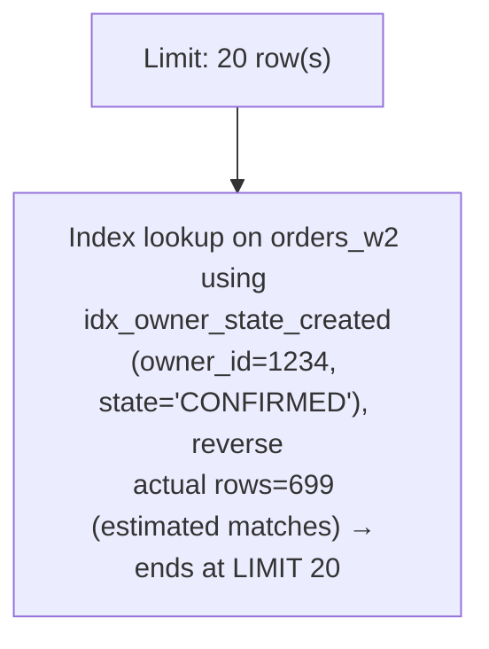
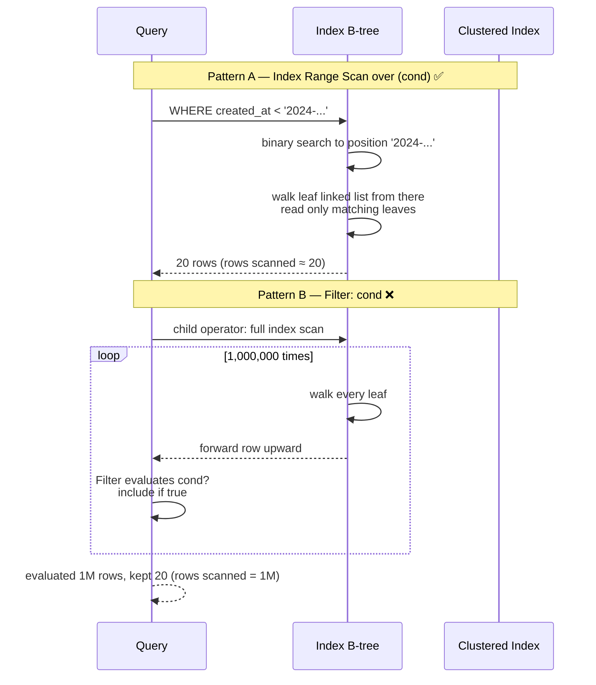
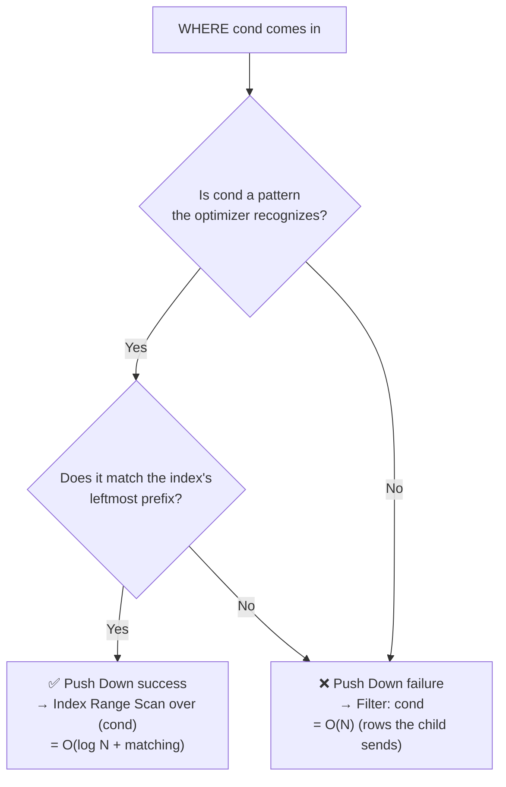
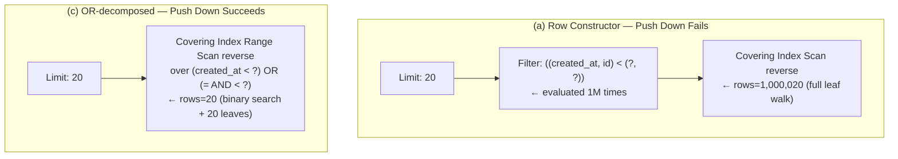
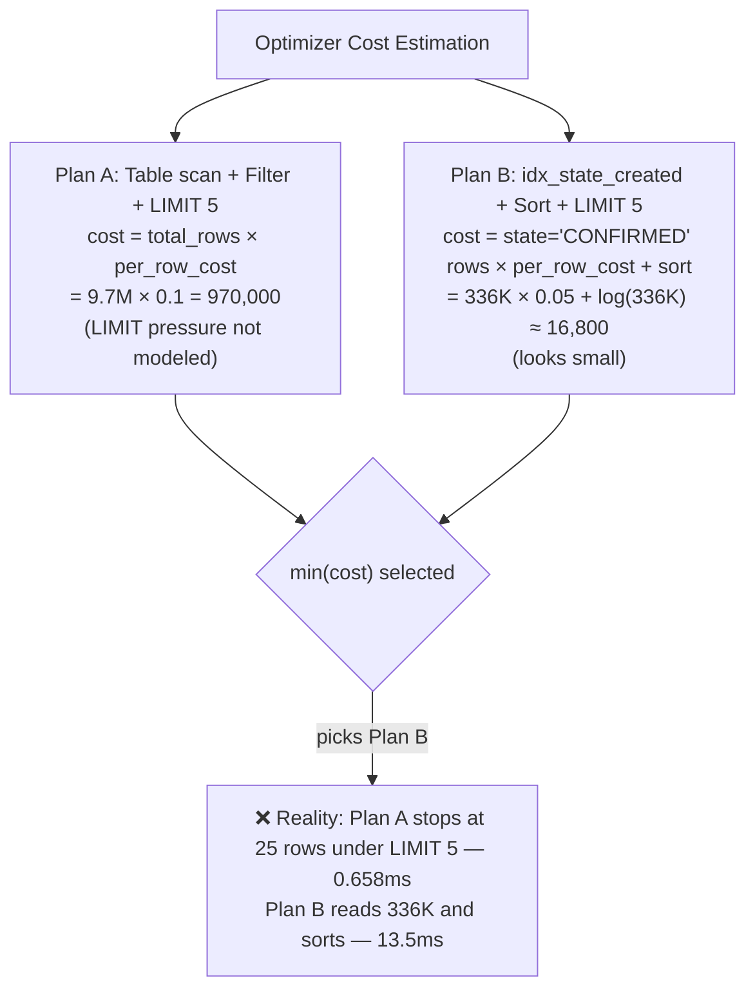
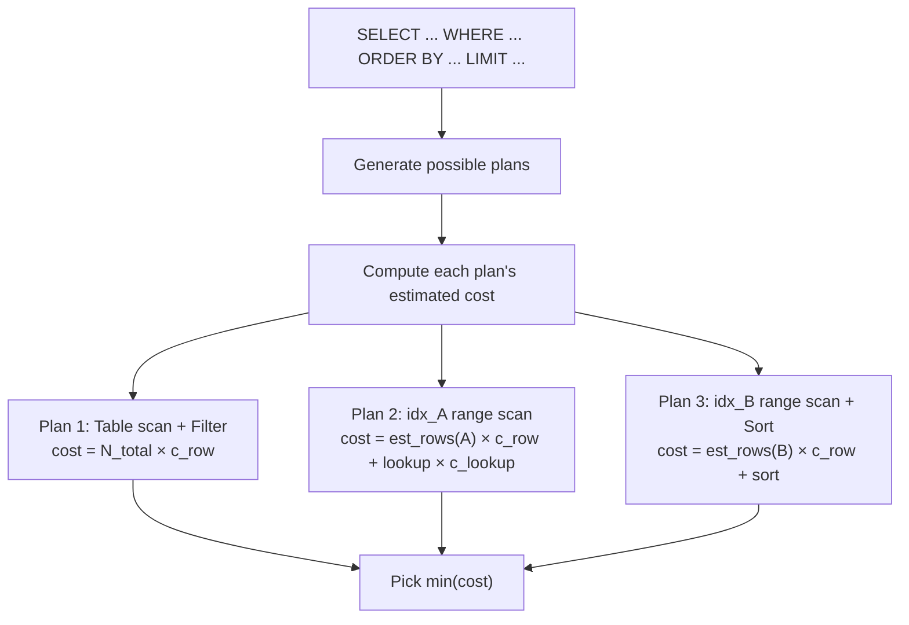
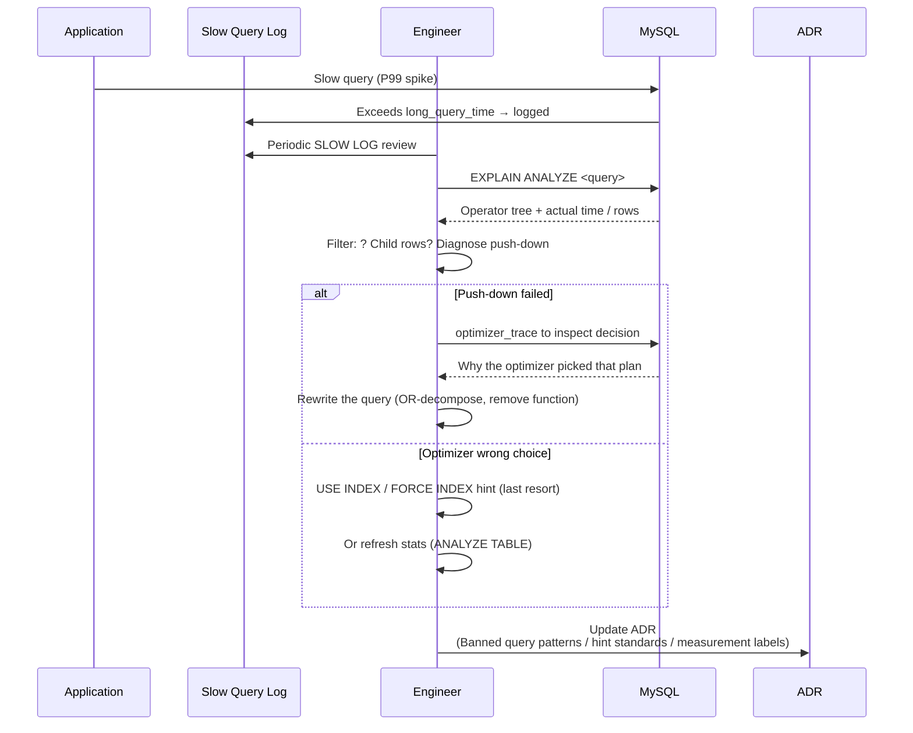

## Table of contents

## Intro — the same SQL intent splits 500x apart on a single optimizer line {#intro}

Two SQL statements with the same meaning:

```sql
-- (a) ANSI SQL standard row constructor
WHERE (created_at, id) < (?, ?)

-- (b) Decomposed into OR
WHERE created_at < ? OR (created_at = ? AND id < ?)
```

If you took an SQL class, you know the two are **mathematically equivalent** — straight from the definition of lexicographic comparison. Same meaning, so you'd expect the optimizer to produce the same plan.

But measure on 10 million rows:

| Form | actual time | Diff |
|---|---|---|
| (a) row constructor | **154 ms** | (baseline) |
| (b) OR-decomposed | **0.30 ms** | **about 500x** |

**Same meaning, same index, same data** — but a 500x difference. Compare the EXPLAIN ANALYZE outputs and the essence of the difference is **a single line**.

```
(a) -> Filter: ((created_at, id) < (...))
        -> Covering index scan ... reverse, rows=1000020

(b) -> Covering index range scan over (created_at < ...) OR (= AND <)
        reverse, rows=20
```

The word `Filter:` once vs the words `Index range scan over` once. **That single-word difference is push down success vs failure.** Push down failure = read 1M rows and pick from above. Push down success = binary search inside the index, read only 20 rows, done.

The companion post [MySQL No-Offset Cursor Pagination](/en/posts/mysql-no-offset-cursor-pagination/) covered the same measurement from the **operational prescription** side (cursor standard / token encoding / PR gate). This post focuses on **why the optimizer fails to push down** — the internals. Why has [Bug #16247](https://bugs.mysql.com/bug.php?id=16247) remained a long-standing known limitation? What patterns does the optimizer's whitelist recognize, and what doesn't it? The limits of cost-based judgment (the Q2 paradox — when adding an index makes things slower). And how to read a single line of EXPLAIN ANALYZE output.

Inputs for this post:
- 10M-row Q1~Q5 Before/After + the Q2 paradox (MySQL 8.0.44)
- The OFFSET vs No-Offset measurement's row constructor push-down failure (154ms vs 0.30ms)
- The No-Offset pagination decision (rule banning row constructor)

Depth: **L3-L4** (Series #1 covered B-tree internals / #2 covered index types / this #3 covers **how the optimizer perceives queries and pushes down**).

Companion posts:
- [RDB Mastery #1 — InnoDB Index Internals](/en/posts/rdb-mastery-01-innodb-index-internals/) — B-tree / clustered / secondary / covering. This post sits **on top** of that, looking at how the optimizer chooses indexes.
- [MySQL No-Offset Cursor Pagination](/en/posts/mysql-no-offset-cursor-pagination/) — same measurements, **page-level operational prescription**. This post is the **optimizer mechanism** angle.

---

## 1. EXPLAIN vs EXPLAIN ANALYZE — start with the difference {#explain-vs-analyze}

### 1.1 EXPLAIN — the optimizer's **estimate**

`EXPLAIN <query>` prints the **shape of the plan** the optimizer would build. It does not actually execute.

```sql
EXPLAIN SELECT id FROM orders_w2
ORDER BY created_at DESC LIMIT 20;
```

Key output columns:

| Column | Meaning |
|---|---|
| `type` | Walk pattern (`const` / `ref` / `range` / `index` / `ALL`) |
| `key` | Which index is used |
| `rows` | Estimated row count (the optimizer's **estimate**) |
| `filtered` | Estimated WHERE selectivity |
| `Extra` | `Using index` (covering) / `Using filesort` / `Using temporary`, etc. |

The point: `rows` is an **estimate**. It's not the row count after actual execution. It's a value the optimizer **computes** from cardinality stats (results of `ANALYZE TABLE`).

### 1.2 EXPLAIN ANALYZE (8.0.18+) — **actual execution + actual time**

[MySQL — EXPLAIN ANALYZE](https://dev.mysql.com/doc/refman/8.0/en/explain.html#explain-analyze) was introduced in 8.0.18. It **actually executes** the query and reports each operator's **actual time / actual rows**.

```sql
EXPLAIN ANALYZE SELECT id FROM orders_w2
ORDER BY created_at DESC LIMIT 20;
```

A line of the output (Q3 Before — no index [measured — Java/Spring]):

```
-> Limit: 20 row(s)  (actual time=1608.999..1608.999 rows=20 loops=1)
   -> Sort: orders_w2.created_at DESC, limit input to 20 row(s) per chunk
       (actual time=1608.998..1609.000 rows=20 loops=1)
       -> Table scan on orders_w2  (cost=988927 rows=9708696)
           (actual time=0.071..1234.567 rows=9708696 loops=1)
```

Diagram 1 — information difference between EXPLAIN and EXPLAIN ANALYZE:

| Aspect | EXPLAIN | EXPLAIN ANALYZE |
|---|---|---|
| Executes? | **No** | **Yes, actually executes** |
| rows | Estimated (cardinality-based) | **actual rows** (real processed) |
| time | Cost estimate (unitless number) | **actual time** (in ms) |
| Output format | Table | **Operator tree** (top to bottom) |
| Cost | ~Zero | **Same as actual query time** |
| 8.0.18+ | Always | New feature |

### 1.3 Estimated cost vs actual time gap — a clue to estimation error

When EXPLAIN's `cost` and EXPLAIN ANALYZE's `actual time` **differ wildly**, that's a signal that **stats are stale** or that **cost-model assumptions break down**.

Try `ANALYZE TABLE orders_w2` to refresh cardinality. If the gap remains, use `optimizer_trace` to inspect the optimizer's decision process (see Section 11).

This post uses EXPLAIN ANALYZE actual time for every measurement. Not estimates — measurements.

---

## 2. EXPLAIN ANALYZE is an operator tree {#operator-tree}

### 2.1 Operator tree — rows flow top-down

EXPLAIN ANALYZE output is a **tree**, not a table. Each line is **one operator**, and indentation expresses the **parent-child relationship**.

```
-> Operator A
   -> Operator B  (child of A — feeds rows up to A)
       -> Operator C  (child of B — feeds rows up to B)
```

→ Rows flow **bottom-up**. The deepest operator (C) produces rows; the parent (B) receives and transforms; the parent's parent (A) receives and transforms again. The topmost operator returns the result to the client.

### 2.2 Common operators — the ones you see most

| Operator | Meaning | Cost |
|---|---|---|
| `Table scan on T` | Walk T's clustered index from start to end (= full table scan) | O(all rows) |
| `Index scan on T using IDX` | Walk IDX's leaves from start to end (covering: leaves only; non-covering: + clustered lookup) | O(index leaves) |
| `Index range scan on T using IDX over (cond)` | Walk only the leaf range where cond is true | **O(log N + matching)** |
| `Index lookup on T using IDX (key=value)` | Only rows in IDX matching key | O(log N + matching) |
| `Filter: cond` | Evaluate cond on each row sent up by the child | **As many rows as the child sends** |
| `Sort: col` | Sort in memory (or temp disk) | O(N log N) |
| `Limit: N` | Receive rows until N, then stop | Depends on the child |
| `Aggregate / Group aggregate` | GROUP BY / SUM / COUNT | O(all rows) |

### 2.3 Diagram 2 — sample operator tree

EXPLAIN ANALYZE tree for Q5 (`WHERE owner_id=? AND state=? ORDER BY created_at DESC LIMIT 20`):



→ Diagram 2 reading. Tree depth is 2 (Limit → Index lookup). owner_id=1234 + state='CONFIRMED' was **pushed down into the index** — start from matching rows in the index leaves, reverse walk, terminate at LIMIT 20. The 9.7M-row scan collapses into a 20-row walk thanks to **this tree shape**.

### 2.4 The key word — `Filter:` should make you suspect a push-down failure

The most important word. When `Filter: cond` shows up in the tree, that cond **failed to push down into the index** and is being **post-processed** after the upstream operator forwards rows. If the upstream sends 1M rows, that's 1M evaluations. This is the heart of Section 3.

---

## 3. Index Range Scan vs Filter — the one-word essence {#range-scan-vs-filter}

### 3.1 Defining the two patterns

`Index range scan over (cond)` — cond is **converted into a B-tree primitive inside the index**. Binary search finds the **starting point**, then walks the leaf linked list, **reading only matching leaves**. rows scanned ≈ matching rows.

`Filter: cond` — cond is **post-processed outside the index**. The child operator (e.g. full table scan, full index scan) sends **all rows** upward, and Filter evaluates cond per row. rows scanned = rows the child sent (cannot narrow down via index).

### 3.2 Diagram 3 — comparing the two walks



→ Diagram 3 reading. With the same condition, **evaluating inside the index** vs **outside** can swing latency by hundreds of times. cost = O(log N + matching) vs O(N).

### 3.3 The library analogy — card catalog vs cracking every book

| | Index Range Scan over | Filter |
|---|---|---|
| Library analogy | Find ISBN starting point in the **card catalog**, walk N cards from there | Open **every book**, look at the cover, compare ISBN |
| Cost | O(log N + matching) — N cards out of 10,000 | O(N) — all 10,000 books |
| Essence | Use binary search primitive | Sequential walk + post-process |

This analogy is the intuitive model behind every push-down trap. If the optimizer can convert cond into a **card-catalog-internal pattern**, you walk the catalog. If it cannot, you crack every book.

### 3.4 [Measured — Java/Spring] — Q3 vs Q3 Before

Q3 (`ORDER BY created_at DESC LIMIT 20`):

| Stage | Tree | rows scanned | actual time |
|---|---|---|---|
| Before (no index) | Sort + Table scan + Filter | 9,708,696 | **1,609 ms** |
| After (idx_created_at_id) | Limit + Covering index range scan reverse | 20 | **0.65 ms** |

**2,476x difference**. The essence is the two patterns from Section 3.1. Before sends all 9.7M rows up, then sorts and slices. After walks 20 rows in the index leaves.

---

## 4. Push Down — pushing cond inside the index {#push-down}

### 4.1 Definition

**Push Down** = the optimizer's transformation that pushes a WHERE condition (or ORDER BY sort key) **down so it's evaluated inside the index**. Success → Index Range Scan. Failure → Filter.

The push-down decision flow:



→ Diagram 4 reading. Two gates determine push down: (1) Is cond a **pattern the optimizer recognizes** (whitelist)? (2) Does it match the index's leftmost prefix? Both must pass to get an Index Range Scan.

### 4.2 Cost difference of push down

Same data, same index, cost depending on push down success:

| | Index Range Scan over | Filter (push down failed) |
|---|---|---|
| Time complexity | O(log N + matching) | O(N) |
| 1M-row environment (matching=20) | log2(1M) + 20 ≈ **40 page seeks** | **1M-row scan** |
| Companion post [Measured — Java/Spring] | 0.30 ms | 154 ms |
| Ratio | (baseline) | **about 500x** |

That 500x comes simply from **whether the optimizer recognizes the pattern**. Same data, same index, same disk, same meaning — yet **the optimizer either gets it or doesn't**.

### 4.3 Why push down matters

The operational impact in one sentence:

> **Push-down success = O(log N + matching). Push-down failure = O(N). On 10M rows, the difference in N is the difference in latency. That's why you must always read EXPLAIN ANALYZE.**

Even **with an index**, push-down failure makes the index useless. So adding an index is not a finished story.

---

## 5. The optimizer's recognized patterns (whitelist) {#optimizer-whitelist}

### 5.1 The optimizer works by pattern matching

The MySQL optimizer recognizes WHERE conditions through **pattern matching**. It doesn't perform deep semantic reasoning — match a defined **whitelist pattern** and it pushes down; miss, and it falls back to Filter.

[MySQL — Range Optimization](https://dev.mysql.com/doc/refman/8.0/en/range-optimization.html) defines the recognizable patterns.

### 5.2 Diagram 5 — recognized vs unrecognized patterns

| Category | Pattern | Push down? | Notes |
|---|---|:---:|---|
| **Single column** | `col = ?` | ✅ | const / ref |
| | `col < ?` / `col > ?` / `col <= ?` / `col >= ?` | ✅ | range |
| | `col BETWEEN ? AND ?` | ✅ | range |
| | `col IN (?, ?, ?)` | ✅ | range (multi-values) |
| | `col IS NULL` | ✅ | |
| **Multi-column (composite index)** | `a = ? AND b = ?` (leftmost prefix) | ✅ | leftmost prefix of composite |
| | `a = ? AND b < ?` | ✅ | leftmost prefix + range |
| | `a < ? AND b = ?` | ❌ (b not pushed) | Once a is range, b cannot push down |
| | `a = ? AND b BETWEEN ? AND ?` | ✅ | OK |
| **Row constructor** | `(a, b) < (?, ?)` | **❌** | **The heart of this post — Bug #16247** |
| | `(a, b) = (?, ?)` | ⚠️ partial | Some 8.0+ versions recognize |
| **Function applied** | `LOWER(col) = ?` | ❌ | Needs a separate functional index |
| | `DATE(created_at) = ?` | ❌ | Function applied → optimizer cannot recognize |
| **Implicit cast** | `varchar_col = 123` (int compare) | ❌ | Implicit cast → index not used |
| | `int_col = '123'` | ⚠️ | Some cases OK |
| **OR** | `a = ? OR b = ?` | ⚠️ | Only when index merge optimization is possible |
| | `a < ? OR (a = ? AND b < ?)` | ✅ | **The OR-decomposition core of this post** |

→ Diagram 5 reading. Six common "the optimizer surely understands this" traps are all in this table.

### 5.3 Function applied — the `LOWER(col) = ?` trap

```sql
-- ❌ push down fails (even with index)
SELECT * FROM users WHERE LOWER(email) = 'foo@bar.com';

-- ✅ with a functional index, push down works
CREATE INDEX idx_email_lower ON users ((LOWER(email)));
SELECT * FROM users WHERE LOWER(email) = 'foo@bar.com';
```

[MySQL — Functional Key Parts](https://dev.mysql.com/doc/refman/8.0/en/create-index.html#create-index-functional-key-parts) (8.0.13+) introduced functional indexes. Before that, columns under a function meant a forced full scan.

### 5.4 Implicit cast — killing the index

```sql
-- column is VARCHAR, compared with integer
SELECT * FROM products WHERE sku = 12345;  -- ❌ index not used
SELECT * FROM products WHERE sku = '12345'; -- ✅ index OK
```

If `sku` is VARCHAR but compared to INT, MySQL converts every row's sku to INT before comparing. That's effectively a function applied to all rows → index unusable.

### 5.5 Wrap-up

> **Match the whitelist → push down. Miss it → Filter. Even semantically equivalent forms can fail because the optimizer matches patterns. Hence the `Filter:` keyword in EXPLAIN ANALYZE is your push-down-failure diagnosis signal.**

---

## 6. The Row Constructor trap — Bug #16247 {#row-constructor-trap}

### 6.1 ANSI SQL standard row constructor

The ANSI SQL standard defines **row constructor** comparison:

```sql
(a, b) < (x, y)
-- Semantically (lexicographic compare):
-- a < x  OR  (a = x AND b < y)
```

`(a, b) < (x, y)` is **mathematically equivalent** to the OR-decomposed form. Straight from the definition of lexicographic ordering.

### 6.2 The MySQL optimizer's limitation

[MySQL Bug #16247 — Row comparisons should use range scan](https://bugs.mysql.com/bug.php?id=16247) — an optimizer bug **filed in 2006 and a long-standing known limitation** (currently marked duplicate in the tracker).

Bug summary:

> "MySQL optimizer does not recognize row constructor comparisons such as `(a, b) < (?, ?)` as range conditions. As a result, queries using row constructors fall back to full scan + Filter, while the equivalent OR-decomposed form `a < ? OR (a = ? AND b < ?)` is correctly identified as a range scan."

→ MySQL has no logic to **automatically convert row constructor → OR form**. Pattern matching tries to recognize the row constructor as a unit and fails → falls back to Filter.

### 6.3 [Measured — Java/Spring] — 154ms vs 0.30ms

The core measurement from the OFFSET vs No-Offset measurement in the companion post (10M rows, cursor at the 1M-th position):

```sql
-- (a) row constructor — push down fails
WHERE (created_at, id) < ('2024-03-15 10:30:00', 5000000)
ORDER BY created_at DESC, id DESC LIMIT 20;
```

EXPLAIN ANALYZE [Measured — Java/Spring]:

```
-> Limit: 20 row(s)  (actual time=154.234..154.234 rows=20 loops=1)
   -> Filter: ((orders_w2.created_at, orders_w2.id) <
               ('2024-03-15 10:30:00', 5000000))
       (actual time=0.012..154.230 rows=20 loops=1)
       -> Covering index scan on orders_w2 using idx_created_at_id
          (reverse)  (actual time=0.011..134.567 rows=1000020 loops=1)
```

Reading line by line:
- Top `Limit: 20` — stop after 20 rows
- Child `Filter: ((created_at, id) < (...))` — **the trap**. The row-constructor compare is evaluated **here**. Per row from the child.
- Child `Covering index scan ... (reverse)` — **walks every leaf in reverse, ignoring cond**. **rows=1,000,020** = 1M rows forwarded upward.

→ Even with the index, `(a, b) < (?, ?)` cannot push down to range, so it post-processes through Filter. Cost = **1M-row scan + 1M Filter evals + Limit 20** = 154ms.

```sql
-- (c) OR-decomposed — push down succeeds
WHERE created_at < '2024-03-15 10:30:00'
   OR (created_at = '2024-03-15 10:30:00' AND id < 5000000)
ORDER BY created_at DESC, id DESC LIMIT 20;
```

EXPLAIN ANALYZE [Measured — Java/Spring]:

```
-> Limit: 20 row(s)  (actual time=0.298..0.300 rows=20 loops=1)
   -> Covering index range scan on orders_w2 using idx_created_at_id
      over (created_at < '2024-03-15 10:30:00')
        OR (created_at = '2024-03-15 10:30:00' AND id < 5000000)
      (reverse)  (actual time=0.022..0.290 rows=20 loops=1)
```

Reading line by line:
- Top `Limit: 20` — same
- Child `Covering index range scan ... over (cond) (reverse)` — **the key**. cond is **converted into an in-index range**. Binary search + leaf walk in reverse for 20 rows.

→ **rows=20 vs rows=1M = 50,000x**. actual time is 154ms vs 0.30ms ≈ **500x**. (The latency ratio is smaller than the rows ratio because of buffer pool hits and sequential scan efficiency.)

### 6.4 Diagram 6 — Filter for row constructor vs Range Scan over for OR-decomposed



→ Diagram 6 reading. Same intent, same index — **the tree shape differs**. (a) has a `Filter:` between, child scans 1M rows. (c) has no `Filter:`, Range Scan over (cond) recognizes cond directly.

### 6.5 Why hasn't it been fixed yet

Pure prioritization:
- A clear workaround (OR-decompose) exists → not operationally critical
- Adding row-constructor → OR conversion logic interacts with other parts of the optimizer → regression risk
- Other databases like PostgreSQL push down correctly → "this is MySQL's specific quirk"

→ Conclusion: **Don't use row constructor in MySQL**. Same as the No-Offset pagination decision Section 4.3 rule 5.

---

## 7. PostgreSQL comparison — the same SQL pushes down properly {#postgresql-comparison}

### 7.1 PostgreSQL's planner converts row constructors to sargable form

PostgreSQL's optimizer ("planner") **automatically converts** row-constructor comparisons into a **sargable form** (Search ARGument-able — index-friendly).

[PostgreSQL — Row-wise Comparison](https://www.postgresql.org/docs/current/functions-comparisons.html#ROW-WISE-COMPARISON):

> "The two row values are compared element by element. ... Row-wise comparison generally produces results consistent with normal sorting orders. ... If the operators allow it, the planner can use indexes for row-wise comparisons."

→ The same SQL `(created_at, id) < (?, ?)` pushes down to **Index Range Scan** in PostgreSQL. In MySQL it falls back to Filter.

### 7.2 Same standard SQL → different latency depending on the DB

| DB | row constructor `(a, b) < (?, ?)` | OR-decomposed `a < ? OR (a = ? AND b < ?)` |
|---|---|---|
| MySQL 8.0 | ❌ Filter (push-down fails) | ✅ Range Scan |
| PostgreSQL 14+ | ✅ Index Range Scan | ✅ Index Range Scan |
| Oracle | ✅ Index Range Scan | ✅ Index Range Scan |
| SQL Server | ⚠️ Some cases only | ✅ Index Range Scan |

→ The ANSI SQL standard defines the **semantics**, but **implementations differ across DBs**. The same standard SQL gives a 500x latency difference depending on the optimizer implementation.

### 7.3 What this means — the optimizer is a DB characteristic

> **"Standard SQL = works the same everywhere" is a myth. Same meaning, different optimizers, different plans, different latencies. Write in the form that suits your DB — and verify with EXPLAIN ANALYZE every time. That's the standard workflow.**

The No-Offset pagination decision Section 4.4 ("If the DB switches to PostgreSQL — Option B becomes simpler") is precisely what this means in practice.

---

## 8. The Q2 paradox — adding an index can make it slower {#q2-paradox}

### 8.1 Setup

Q2 (`WHERE state = 'CONFIRMED' ORDER BY created_at DESC LIMIT 5`).

> Note: The Q2 here is the simplified form measured in this series (range removed, smallest case LIMIT 5) — the form that most clearly exposes the trap of "small LIMIT + low-cardinality index candidate."

### 8.2 [Measured — Java/Spring] — adding an index made it slower

| Stage | Optimizer's pick | actual time | rows scanned |
|---|---|---|---|
| Before (no state index) | Table scan + LIMIT 5 early termination | **0.658 ms** | ~25 (early stop) |
| After (`idx_state_created` added) | `idx_state_created` | **13.5 ms** | ~336K (estimated) |
| After + `USE INDEX(PRIMARY)` forced | PRIMARY | 0.65 ms | ~25 |

**Adding an index made it 20x slower.**

### 8.3 Comparing EXPLAIN ANALYZE — the optimizer's wrong choice

Before (no index, full scan + LIMIT early stop):

```
-> Limit: 5 row(s)  (actual time=0.640..0.658 rows=5 loops=1)
   -> Filter: (orders_w2.state = 'CONFIRMED')
       (actual time=0.638..0.656 rows=5 loops=1)
       -> Table scan on orders_w2  (actual time=0.020..0.650 rows=25 loops=1)
```

Line by line:
- `Limit: 5` at the top → stop signal propagates down once 5 rows arrive
- `Filter: state = 'CONFIRMED'` — push-down fails **here**, but the LIMIT 5 pressure cuts the child short
- `Table scan` → **rows=25** — full scan stops early under LIMIT 5 pressure. About 5 of the first 25 rows match state='CONFIRMED' → done.

→ Filter post-processing, but the child stops at 25 rows under LIMIT 5 pressure. 0.658ms.

After (state index used):

```
-> Limit: 5 row(s)  (actual time=13.450..13.500 rows=5 loops=1)
   -> Sort: orders_w2.created_at DESC, limit input to 5 row(s) per chunk
       (actual time=13.448..13.498 rows=5 loops=1)
       -> Index lookup on orders_w2 using idx_state_created
          (state='CONFIRMED')  (actual time=0.030..10.234 rows=336K loops=1)
```

Line by line:
- `Limit: 5` same
- `Sort: created_at DESC` — **Sort showed up**. The trap. The optimizer used `idx_state_created` (state, created_at) — created_at sort should be natural after state matching, but the Sort operator does not propagate LIMIT pressure and tries to **read every match before sorting**.
- `Index lookup ... (state='CONFIRMED')` — **rows=336K** matching rows.

→ Used the index, read 336K rows up, sort, then LIMIT 5. **20x slower**.

### 8.4 Why did the optimizer choose wrong?

The **incompleteness of cost-based decisions**.



→ Diagram 7-A reading. The optimizer cannot precisely model the **LIMIT 5 early termination effect** in its cost model. It computes Plan A's cost as 9.7M × per_row, but reality is "25 rows then done." That's an **estimation error**.

Other factors:
- Cardinality estimation imprecision (state='CONFIRMED' = 336K — sometimes the optimizer estimates it correctly; sometimes stale stats yield smaller or larger values)
- For ORDER BY + LIMIT, whether an index can **already supply rows in sort order** is hard to encode cleanly into the cost model

### 8.5 Recovery via a forced hint

```sql
SELECT id FROM orders_w2 USE INDEX (PRIMARY)
WHERE state = 'CONFIRMED' ORDER BY created_at DESC LIMIT 5;
```

`USE INDEX(PRIMARY)` tells the optimizer to consider only PRIMARY (= clustered = full table scan in PK order). Result: 0.65 ms — back to the Before number.

### 8.6 The lesson

> **The optimizer is cost-based estimation + statistics + heuristics. It is not right 100% of the time. Especially: (1) very small LIMITs, (2) cardinality estimation errors, (3) ORDER BY + LIMIT combinations — the optimizer's weak spots. Always confirm with EXPLAIN ANALYZE.**

Combined with the companion post [RDB Mastery #1](/en/posts/rdb-mastery-01-innodb-index-internals/) Section 11 ("full table scan = clustered index full scan"), full scan + LIMIT early termination is sometimes surprisingly efficient.

---

## 9. Index Selection — how the optimizer picks an index {#index-selection}

### 9.1 Cost-based decision

The optimizer enumerates plans, computes each plan's **estimated cost**, and picks the smallest.



→ Diagram 7-B reading (Diagram 7-A is the Q2 cost comparison in Section 8.4). Plan candidates are typically 5~20. Compute each cost, pick the minimum.

### 9.2 Cost model — rows × per-row cost

[MySQL — Optimizer Cost Model](https://dev.mysql.com/doc/refman/8.0/en/cost-model.html) defines the cost components:

| Cost unit | Meaning | Default |
|---|---|---|
| `disk_temptable_create_cost` | Create on-disk temp table | 20 |
| `disk_temptable_row_cost` | Process one disk temp row | 0.5 |
| `key_compare_cost` | Index key compare | 0.05 |
| `memory_temptable_create_cost` | Create in-memory temp table | 1 |
| `memory_temptable_row_cost` | Process one in-memory row | 0.1 |
| `row_evaluate_cost` | Evaluate one row (WHERE etc.) | 0.1 |
| `io_block_read_cost` | Read one disk block | 1 |

Roughly: plan cost ≈ `est_rows × row_evaluate_cost + key_compare × index_compares + io × random_io_cost`.

**Crucially**, `est_rows` (estimated row count) dominates cost — and that estimate depends on **statistics**.

### 9.3 Statistics — cardinality / histograms

**Cardinality** — estimated count of distinct values for index keys. The `Cardinality` column of `SHOW INDEX FROM table`.

Cardinalities of the five indexes [Measured — Java/Spring]:

| Index | Cardinality |
|---|---|
| PRIMARY | 9,708,696 |
| idx_created_at_id | 9,708,696 |
| idx_region_code | **4** (low — 5 region values) |
| idx_owner_state_created (state) | 43,422 |
| idx_state_created (state) | 969 |
| idx_owner_id | 12,585 |

`cardinality = 4` means the optimizer estimates "lookup on this index returns ~9.7M / 4 = 2.4M rows on average" — low selectivity → essentially useless index.

**Histograms** (8.0+) — column value distributions. Equi-depth or equi-width. They capture **distribution skew** that cardinality alone cannot (e.g. 90% of state is CONFIRMED, 10% PENDING).

```sql
ANALYZE TABLE orders_w2 UPDATE HISTOGRAM ON state WITH 8 BUCKETS;
```

[MySQL — Histogram Statistics](https://dev.mysql.com/doc/refman/8.0/en/optimizer-statistics.html) is the histogram usage guide.

### 9.4 Stale stats → wrong plan

When INSERT/DELETE shifts the distribution significantly, statistics go **stale**. The optimizer computes cost on **stale stats** → picks the wrong plan.

Remedies:
1. Run `ANALYZE TABLE <table>` periodically (or set `innodb_stats_auto_recalc=ON`)
2. Use `optimizer_trace` to inspect the optimizer's decisions (Section 11)
3. If cardinality looks unrealistic even after `ANALYZE TABLE`, increase sampling: `CREATE INDEX ... STATS_PERSISTENT=1, STATS_SAMPLE_PAGES=N`

### 9.5 [Measured — Java/Spring] — The five indexes + the optimizer's choices

Re-reading the five-index results from the optimizer's angle:

| Q | Index picked | Why (cost view) |
|---|---|---|
| Q1 (`WHERE id=5M`) | PRIMARY | const 1 row → cost dominates |
| Q2 (`WHERE state='CONFIRMED' ORDER BY created_at DESC LIMIT 5`) | idx_state_created (wrong, Section 8) | est_rows(336K) × cost — LIMIT 5 effect not modeled |
| Q3 (`ORDER BY created_at DESC LIMIT 20`) | idx_created_at_id (covering reverse) | covering = no clustered lookup; reverse + LIMIT 20 ends fast |
| Q4 (`GROUP BY region_code`) | idx_region_code (covering) | full index scan but tiny (cardinality 4) |
| Q5 (`WHERE owner_id=? AND state=? ORDER BY created_at DESC LIMIT 20`) | idx_owner_state_created | composite leftmost prefix + reverse — almost perfect |

→ 4 of 5 picks are correct. 1 (Q2) is wrong. **The optimizer is mostly right but not always** — confirm with EXPLAIN ANALYZE.

---

## 10. Reading EXPLAIN ANALYZE line by line — for real {#read-line-by-line}

Reading the 5 EXPLAIN ANALYZE outputs from this post line by line. **The standard workflow when an EXPLAIN output lands on your desk.**

### 10.1 Output 1 — OFFSET 1M

```sql
SELECT id, created_at FROM orders_w2
ORDER BY created_at DESC, id DESC LIMIT 20 OFFSET 1000000;
```

EXPLAIN ANALYZE [Measured — Java/Spring]:

```
-> Limit/Offset: 20/1000000 row(s)  (actual time=170.5..170.9 rows=20 loops=1)
   -> Covering index scan on orders_w2 using idx_created_at_id (reverse)
       (actual time=0.012..165.234 rows=1000020 loops=1)
```

Line by line:
- `Limit/Offset: 20/1M` — OFFSET 1M LIMIT 20. **Total: receive 1,000,020 rows, drop the first 1M, return last 20**
- `Covering index scan ... (reverse)` — **rows=1,000,020** = walk 1M leaves + 20. Covering avoids clustered lookup, so it's relatively fast

→ Diagnosis: rows scanned (1M) is **50,000x** the result rows (20). Even with covering, OFFSET's intrinsic cost = **rows read and discarded**. Same as the operational prescription in [No-Offset Cursor Pagination](/en/posts/mysql-no-offset-cursor-pagination/).

### 10.2 Output 2 — Row Constructor (push-down fails)

```sql
SELECT id FROM orders_w2
WHERE (created_at, id) < ('2024-...', 5000000)
ORDER BY created_at DESC, id DESC LIMIT 20;
```

EXPLAIN ANALYZE [Measured — Java/Spring]:

```
-> Limit: 20 row(s)  (actual time=154.234..154.234 rows=20 loops=1)
   -> Filter: ((orders_w2.created_at, orders_w2.id) < ('2024-...', 5000000))
       (actual time=0.012..154.230 rows=20 loops=1)
       -> Covering index scan on orders_w2 using idx_created_at_id (reverse)
          (actual time=0.011..134.567 rows=1000020 loops=1)
```

Line by line:
- `Limit: 20` — stop at 20
- `Filter: ((created_at, id) < (...))` — **trap signal**. Row constructor evaluated **here**. **Per-row evaluation**
- `Covering index scan ... (reverse) rows=1,000,020` — walk all leaves in reverse, ignoring cond. **Forwards 1M rows up**

→ Diagnosis: `Filter:` keyword + child `rows=1M`. Push-down failed. Workaround — rewrite as OR-decomposed.

### 10.3 Output 3 — OR-decomposed (push-down succeeds)

```sql
SELECT id FROM orders_w2
WHERE created_at < '2024-...'
   OR (created_at = '2024-...' AND id < 5000000)
ORDER BY created_at DESC, id DESC LIMIT 20;
```

EXPLAIN ANALYZE [Measured — Java/Spring]:

```
-> Limit: 20 row(s)  (actual time=0.298..0.300 rows=20 loops=1)
   -> Covering index range scan on orders_w2 using idx_created_at_id
      over (created_at < '2024-...') OR (created_at = '2024-...' AND id < 5000000)
      (reverse)  (actual time=0.022..0.290 rows=20 loops=1)
```

Line by line:
- `Limit: 20`
- `Covering index range scan ... over (cond) (reverse)` — **the `over (cond)` keyword** = push-down success signal. cond converted to **in-index range**. Binary search + 20 leaves in reverse

→ Diagnosis: `over (cond)` keyword + `rows=20`. Push-down OK. The 154ms → 0.30ms (≈500x) difference is **this single line**.

### 10.4 Output 4 — Q3 covering index reverse

```sql
SELECT id FROM orders_w2
ORDER BY created_at DESC LIMIT 20;
```

EXPLAIN ANALYZE [Measured — Java/Spring]:

```
-> Limit: 20 row(s)  (actual time=0.640..0.658 rows=20 loops=1)
   -> Index scan on orders_w2 using idx_created_at_id (reverse)
       (actual time=0.030..0.620 rows=20 loops=1)
```

Line by line:
- `Limit: 20`
- `Index scan ... (reverse)` — covering and ORDER BY matches index sort → **no Sort operator**. Reverse walk 20 from end of index → done

→ Diagnosis: no `Sort` + `Index scan (reverse)` + `rows=20`. The most efficient form of covering reverse scan when **index sort = ORDER BY sort**. 9.7M filesort → 20 reverse walk = **2,476x**.

### 10.5 Output 5 — Q2 paradox: two plans

#### 5a. Before (full scan + LIMIT pressure)

```
-> Limit: 5 row(s)  (actual time=0.640..0.658 rows=5 loops=1)
   -> Filter: (orders_w2.state = 'CONFIRMED')
       (actual time=0.638..0.656 rows=5 loops=1)
       -> Table scan on orders_w2  (actual time=0.020..0.650 rows=25 loops=1)
```

Line by line:
- `Limit: 5`
- `Filter: state = 'CONFIRMED'` — no push-down (no state index)
- `Table scan rows=25` — **LIMIT 5 pressure + statistically every 5th row is CONFIRMED → 5 matches in 25 rows** → done

→ Diagnosis: Filter stage, but child reads only 25 rows under LIMIT pressure. **Filter isn't always bad** — small LIMIT + high match ratio can make Filter OK.

#### 5b. After (state index used, wrong choice)

```
-> Limit: 5 row(s)  (actual time=13.450..13.500 rows=5 loops=1)
   -> Sort: orders_w2.created_at DESC, limit input to 5 row(s) per chunk
       (actual time=13.448..13.498 rows=5 loops=1)
       -> Index lookup on orders_w2 using idx_state_created (state='CONFIRMED')
          (actual time=0.030..10.234 rows=336K loops=1)
```

Line by line:
- `Limit: 5`
- `Sort: created_at DESC` — **the trap**. Composite index (state, created_at) yet Sort got inserted — the optimizer didn't manage to leverage the index's already-sorted order in its plan
- `Index lookup ... rows=336K` — reads every state='CONFIRMED' row

→ Diagnosis: `Sort` shows up + child `rows=336K`. The optimizer's wrong choice. Recover with `USE INDEX(PRIMARY)`.

### 10.6 Diagram 8 — anatomy of one EXPLAIN line

```
-> Operator Name on table_name [using index_name] [over (condition)] [(reverse)]
   (cost=N  rows=M)        ← EXPLAIN only (estimate)
   (actual time=A..B  rows=R  loops=L)   ← EXPLAIN ANALYZE only (measured)

  ↑
  Indentation = parent-child relationship (child supplies rows)
```

Standard order to read one line:
1. **Operator name** (Index range scan / Filter / Sort, etc.)
2. **Table / index** name
3. **over (cond)** present → push-down success
4. **reverse** present → backward index scan
5. **rows** = actual rows processed (this is **the essence**)
6. **time** = cumulative actual time (`A..B` = first row / last row times)

Especially when `rows` is **tens of thousands of times** the result row count, that's your bottleneck.

---

## 11. Operational diagnosis workflow {#operational-diagnosis}

### 11.1 Diagram 9 — operational diagnosis flow



→ Diagram 9 reading. SLOW LOG → EXPLAIN ANALYZE → diagnose → prescribe → ADR. Five steps.

### 11.2 Enabling SLOW LOG

```sql
SET GLOBAL slow_query_log = 'ON';
SET GLOBAL long_query_time = 0.1;  -- ≥ 100ms
SET GLOBAL log_output = 'TABLE';   -- mysql.slow_log table
```

In production, analyze SLOW LOG with `pt-query-digest` (Percona Toolkit). Identify the top N slowest query patterns.

### 11.3 optimizer_trace — see the decision process

```sql
SET optimizer_trace = "enabled=on";
SELECT * FROM your_query;  -- actually executes
SELECT * FROM information_schema.OPTIMIZER_TRACE\G
```

Output is JSON containing every plan considered, each plan's cost, and the final selection rationale. Use only for debugging in production (overhead is high).

### 11.4 Index hints — last resort

| Hint | Meaning | When to use |
|---|---|---|
| `USE INDEX (idx_a, idx_b)` | Restrict candidate indexes | Optimizer keeps picking the wrong index |
| `FORCE INDEX (idx_a)` | Force use of idx_a (avoid full scan) | Emergency triage when stats are stale |
| `IGNORE INDEX (idx_a)` | Exclude idx_a from candidates | idx_a is always wrong |

[MySQL — Index Hints](https://dev.mysql.com/doc/refman/8.0/en/index-hints.html) gives the exact semantics.

[Percona — Index Hints](https://www.percona.com/blog/) operational guidance:
- Hints are a **last resort**. Try refreshing stats (`ANALYZE TABLE`) first
- Hints are **strongly coupled to table/index names** → break on schema changes
- **Document hints in an ADR** — why added, when can they be removed

### 11.5 ADR-ize — operational rules from this post

Generalizing the No-Offset pagination decision's Section 4.3:

1. **Ban row constructor `(a, b) <` / `(a, b) >`** — block at PR review. Workaround: OR-decompose or single-column cursor
2. **If using functions (`LOWER(col)` / `DATE(created_at)`), require a functional index alongside**
3. **No implicit casts** — match column types and comparison value types
4. **ORDER BY + LIMIT combos require attached EXPLAIN ANALYZE** — confirm whether Sort intervenes and index sort is leveraged
5. **Index hints come with an ADR** — when using USE INDEX / FORCE INDEX, document the rationale and removal criteria
6. **Every PR adding an index attaches EXPLAIN ANALYZE Before/After** — see companion post [No-Offset Cursor Pagination](/en/posts/mysql-no-offset-cursor-pagination/) Section 6

---

## 12. Big-tech references + recap questions {#bigtech-references}

### 12.1 Big-tech references (≥ 6 verified URLs)

| Source | Highlight | Linked section |
|---|---|---|
| [LINE Engineering — VISUAL EXPLAIN](https://engineering.linecorp.com/ko/blog/mysql-workbench-visual-explain-index) | Visualize type / rows / Filter | Section 2 operator tree, Section 10 line-by-line |
| [Toss SLASH22 — Broker / concurrency / network latency](https://haon.blog/article/toss-slash/broker-issue-concurrency-and-network-latency/) | JPA OptimisticLock + MVCC measurements | Section 11 operational diagnosis |
| [Toss SLASH24 — Next core banking](https://haon.blog/article/toss-slash/next-core-banking/) | Oracle→MySQL transition + optimizer differences | Section 7 PostgreSQL comparison (DB-specific optimizers) |
| [Vlad Mihalcea — Database query optimization](https://vladmihalcea.com/) | Hibernate + EXPLAIN operational patterns | Throughout |
| [Vlad Mihalcea — Index Selectivity](https://vladmihalcea.com/index-selectivity-cardinality-postgresql-mysql/) | cardinality / histograms | Section 9.3 statistics |
| [Use The Index, Luke! — Operations](https://use-the-index-luke.com/sql/explain-plan) | EXPLAIN type column meaning | Section 2 operators |
| [Use The Index, Luke! — No Offset](https://use-the-index-luke.com/no-offset) | OFFSET anti-pattern | Section 10.1 |
| [Percona — Index Hints](https://www.percona.com/blog/) | Hint operational guidelines | Section 11.4 |
| [PostgreSQL — Row-wise Comparison](https://www.postgresql.org/docs/current/functions-comparisons.html#ROW-WISE-COMPARISON) | Row constructors push down properly | Section 7 |
| [PostgreSQL — Multicolumn Indexes](https://www.postgresql.org/docs/current/indexes-multicolumn.html) | Composite index push-down comparison | Section 7 |
| [MySQL Bug #16247](https://bugs.mysql.com/bug.php?id=16247) | Row-constructor push-down limitation (long-standing known limitation, currently marked duplicate in the tracker) | Section 6 |
| [MySQL — Range Optimization](https://dev.mysql.com/doc/refman/8.0/en/range-optimization.html) | Recognized range patterns | Section 5 whitelist |
| [MySQL — EXPLAIN ANALYZE](https://dev.mysql.com/doc/refman/8.0/en/explain.html#explain-analyze) | actual time | Section 1 |
| [MySQL — Optimizer Cost Model](https://dev.mysql.com/doc/refman/8.0/en/cost-model.html) | Cost units | Section 9.2 |

### 12.2 Recap — putting this article in your own words

If someone who just finished this article were to summarize it through five core questions, here's how the measurements answer them.

#### Q. "What's the difference between `Filter:` and `Index Range Scan over` in EXPLAIN ANALYZE?"

What this article showed by measurement is — **`Filter:`** appearing in the tree is a **push-down failure** signal. The child operator forwards every row, and Filter evaluates cond per row — O(N). **`Index Range Scan over (cond)`** means cond was **converted to an in-index range** — binary search + leaf walk — O(log N + matching). In this article's measurements, the row constructor `(a,b)<(?,?)` ran at 154ms via Filter (1M-row scan); the OR-decomposed form ran at 0.30ms via Range Scan over (20-row scan) — about a **500x difference**. Two SQL statements with the same meaning split 500x apart on **a single line in the operator tree** ([Measured — Java/Spring]).

#### Q. "What is push down and why does it matter?"

What this article defined is — **Push Down** is the optimizer's transformation that **pushes a WHERE condition down to be evaluated inside the index**. On success, cond becomes a **B-tree primitive** (binary search + leaf range walk) — O(log N + matching). On failure, the child sends every row up and Filter post-processes — O(N). On 10M rows, that N difference is the latency difference — **even with an index, push-down failure makes the index useless**. Hence the `Filter:` keyword in EXPLAIN ANALYZE is the primary diagnosis signal. Push-down has two gates: (1) the optimizer's recognized-pattern whitelist, (2) leftmost prefix matching of the index.

#### Q. "Why can't the MySQL optimizer push down a row constructor?"

What this article traced is — the ANSI SQL standard's `(a, b) < (?, ?)` is **mathematically equivalent** to `a < ? OR (a = ? AND b < ?)` — straight from lexicographic ordering. But the MySQL optimizer **lacks the row-constructor → OR conversion logic**. It does pattern matching, doesn't recognize the row constructor itself as a range, and falls back to Filter. **MySQL Bug #16247** — filed in 2006, a long-standing known limitation (currently marked duplicate in the tracker). Because a clear workaround (OR-decompose) exists, fix priority is low. Other DBs like PostgreSQL / Oracle push down correctly — **the standard SQL meaning is the same, but optimizer implementations differ across DBs**. The No-Offset pagination decision's rule 5: PR-block row constructors.

#### Q. "Have you ever added an index and made things slower? How did you diagnose it?"

What this article surfaced as the canonical case is Q2 (`WHERE state='CONFIRMED' ORDER BY created_at DESC LIMIT 5`) ([Measured — Java/Spring]). Before adding the state index: 0.658ms → after: 13.5ms — **20x slower**. Comparing EXPLAIN ANALYZE — Before showed `Table scan rows=25` (LIMIT 5 pressure stops at 25 rows), After showed `Sort + Index lookup rows=336K` (used the index, but couldn't model the LIMIT 5 early-termination effect in the cost model). Diagnosis: the optimizer is **cost-based estimation + statistics + heuristics** — weak spots include very small LIMITs, large cardinality estimation errors, and ORDER BY + LIMIT combinations. `USE INDEX(PRIMARY)` recovered to 0.65ms. Lesson: **always confirm with EXPLAIN ANALYZE**, document hints in an ADR.

#### Q. "Can you make index decisions without looking at EXPLAIN ANALYZE?"

What this article concluded by measurement is **no**. The optimizer makes cost-based decisions, and cost depends on statistics (cardinality / histograms) and heuristics. **It is not right 100% of the time** — when stats are stale or cost-model assumptions break, it picks the wrong plan. The Q2 paradox in this post is one example. On top of that, push-down can be diagnosed precisely **only by looking at the `Filter:` keyword in EXPLAIN ANALYZE**. The operational workflow — SLOW LOG → EXPLAIN ANALYZE → push-down diagnosis → query rewrite or hint → ADR-ize. Mandatory: every index PR attaches EXPLAIN ANALYZE Before/After. "Adding an index speeds it up" is a **hypothesis** — only measurement verifies it.

---

## 13. What we learned {#recap}

### 13.1 Assumptions broken by measurement

- "ANSI SQL standard means same speed everywhere" → **MySQL fails to push down row constructor. Same meaning, 500x latency difference** ([Measured — Java/Spring])
- "Adding an index always makes things faster" → **Q2 paradox. With LIMIT 5 + small match ratio, adding an index is 20x slower** ([Measured — Java/Spring])
- "EXPLAIN is enough" → **EXPLAIN is estimate, EXPLAIN ANALYZE is actual. A wide gap signals stale statistics**
- "The optimizer will figure it out" → **cost-based + statistics + heuristics. Not right 100% of the time**
- "Functions on columns will still use the index" → **Need a separate functional index. `LOWER(col)=?` fails to push down**
- "OR is always slow" → **`a < ? OR (a = ? AND b < ?)` pushes down properly. The cursor standard in production**

### 13.2 The one-liner

> **If you can read a single line of an EXPLAIN ANALYZE operator tree, you can directly verify the optimizer's decisions. `Filter:` vs `Index Range Scan over (cond)` — one-word difference, push-down success vs failure. The ANSI SQL standard row constructor `(a,b)<(?,?)` doesn't fit the MySQL optimizer's whitelist patterns and fails to push down — Bug #16247 is a long-standing known limitation (currently marked duplicate in the tracker). Index Selection is also cost-based — the Q2 paradox (with a small LIMIT 5, the optimizer picks the wrong index and adding an index makes it slower). The optimizer is not right 100% of the time. Always confirm with EXPLAIN ANALYZE.**

### 13.3 The series continues

This post is **RDB Mastery Series #3 — the flagship**. The **optimizer's perception and push-down** angle. Sibling posts:

- **#1** [InnoDB Index Internals](/en/posts/rdb-mastery-01-innodb-index-internals/) — B-tree / clustered / secondary / covering. This post sits **on top** of that, asking how the optimizer operates
- **#2 — Index Types** (B-tree / Hash / Covering / Multi-valued / Functional). The functional index in Section 5 whitelist is detailed there
- **#4 — Safe Operational ALTER Patterns** (Online DDL / pt-osc / gh-ost). Operational angle of Section 11 ADR-ization
- **#5 — Limits of 1:N Joins** (N+1 / EntityGraph). How Section 3 Index Range Scan amplifies on top of an ORM
- **#6 — Index Diet**. Operational reclamation of Section 9 Index Selection

Companion single posts:
- [MySQL No-Offset Cursor Pagination](/en/posts/mysql-no-offset-cursor-pagination/) — same measurements, **page-level operational prescription** (cursor standard / token encoding / PR gate)
- [B+tree Index and Page Split: UUID Kills INSERTs](/en/posts/mysql-btree-index-page-split-deep-dive/) — INSERT side

---

## References {#references}

### Official documentation

- [MySQL — EXPLAIN](https://dev.mysql.com/doc/refman/8.0/en/explain.html) — EXPLAIN basics
- [MySQL — EXPLAIN ANALYZE](https://dev.mysql.com/doc/refman/8.0/en/explain.html#explain-analyze) — 8.0.18+ actual time
- [MySQL — Range Optimization](https://dev.mysql.com/doc/refman/8.0/en/range-optimization.html) — recognized range patterns (whitelist)
- [MySQL — Optimizer Cost Model](https://dev.mysql.com/doc/refman/8.0/en/cost-model.html) — cost units
- [MySQL — Histogram Statistics](https://dev.mysql.com/doc/refman/8.0/en/optimizer-statistics.html) — statistics / distribution
- [MySQL — Index Hints](https://dev.mysql.com/doc/refman/8.0/en/index-hints.html) — USE / FORCE / IGNORE
- [MySQL — Functional Key Parts](https://dev.mysql.com/doc/refman/8.0/en/create-index.html#create-index-functional-key-parts) — 8.0.13+ functional indexes
- [MySQL — EXPLAIN Output (type)](https://dev.mysql.com/doc/refman/8.0/en/explain-output.html#explain-join-types) — type column meaning
- [PostgreSQL — Row-wise Comparison](https://www.postgresql.org/docs/current/functions-comparisons.html#ROW-WISE-COMPARISON) — row constructors push down properly
- [PostgreSQL — Multicolumn Indexes](https://www.postgresql.org/docs/current/indexes-multicolumn.html) — composite index comparison

### Known limits

- [MySQL Bug #16247 — Row comparisons should use range scan](https://bugs.mysql.com/bug.php?id=16247) — **filed in 2006, a long-standing known limitation** (currently marked duplicate in the tracker)

### Big-tech / Operations

- [LINE Engineering — VISUAL EXPLAIN](https://engineering.linecorp.com/ko/blog/mysql-workbench-visual-explain-index) — visualize type / rows / Filter
- [Toss SLASH22 — Broker / concurrency / network latency](https://haon.blog/article/toss-slash/broker-issue-concurrency-and-network-latency/) — concurrency + MVCC measurements
- [Toss SLASH24 — Next core banking](https://haon.blog/article/toss-slash/next-core-banking/) — Oracle→MySQL optimizer differences
- [Kakao Pay — JPA Transactional readOnly](https://tech.kakaopay.com/post/jpa-transactional-bri/) — read-side optimization

### Textbook-grade

- [Use The Index, Luke! — Operations](https://use-the-index-luke.com/sql/explain-plan) — EXPLAIN type column meaning
- [Use The Index, Luke! — No Offset](https://use-the-index-luke.com/no-offset) — OFFSET anti-pattern
- [Vlad Mihalcea — Database query optimization](https://vladmihalcea.com/) — Hibernate + EXPLAIN
- [Vlad Mihalcea — Index Selectivity](https://vladmihalcea.com/index-selectivity-cardinality-postgresql-mysql/) — cardinality / histograms
- [Percona — Index Hints](https://www.percona.com/blog/) — hint operational guidelines

Raw measurement data is kept in a separate learning notebook (inside the portfolio repo). 10M rows / cardinalities of 5 indexes / Q1~Q5 Before/After / 5 EXPLAIN ANALYZE outputs read line by line.
