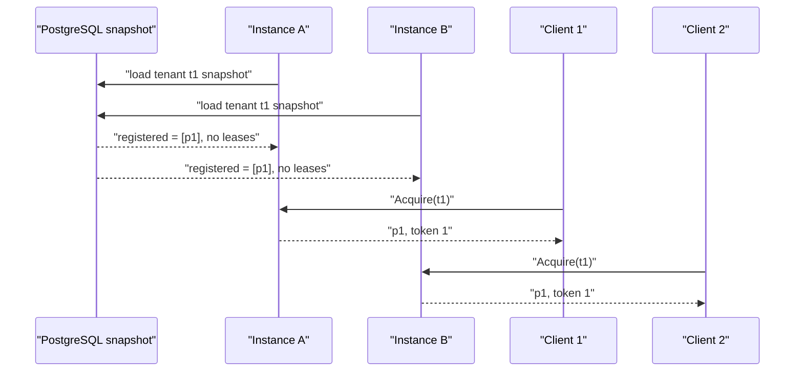
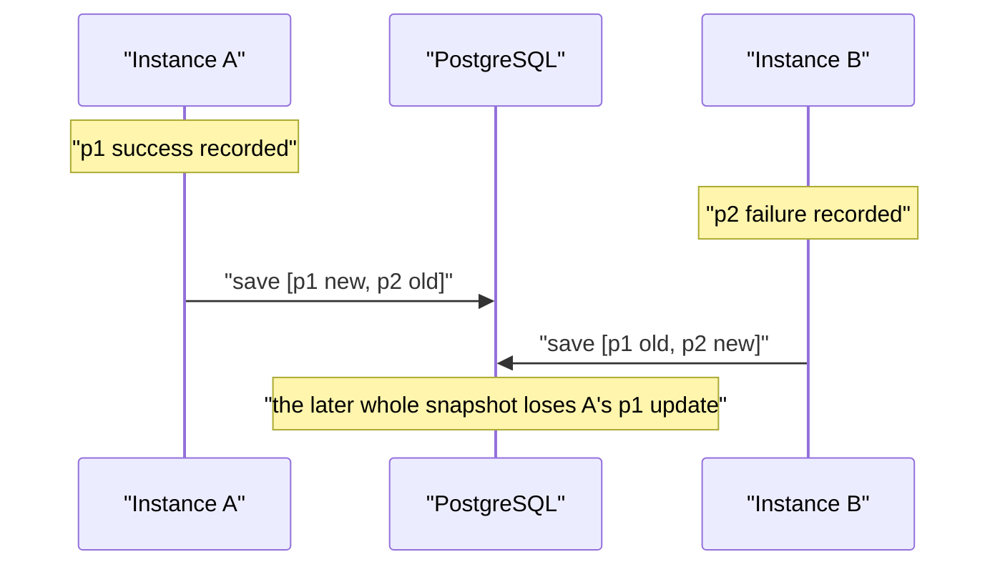

## Table of contents

> **TL;DR**
>
> `reputation-pool-cloud` keeps its intended contract in one application instance. Within one `ResourcePool`, `ConcurrentHashMap.compute` serializes leases for one resource and `AtomicLong` increments fencing tokens.
>
> A second instance creates a second map and a second counter. Both instances can restore the same PostgreSQL snapshot, see no persisted in-flight lease, and grant the same resource. Both counters can start at zero and issue token `1`. A whole-snapshot checkpoint can also overwrite another instance's changes. JVM-local memory budgets and tenant rate limiters multiply with the replica count.
>
> This is not a claim about a measured two-instance outage. It is a deterministic design counterexample assembled from the current code path. The correct current boundary is one active instance. If availability later requires more instances, the first candidate is one state owner per tenant through sharding. When one hot tenant exceeds one instance, lease acquisition and fencing must move to an authoritative store that performs the check, token allocation, and write atomically.

### Evidence card

| Field | Evidence |
| --- | --- |
| Current deployment assumption | one application instance and one JVM |
| Lease-exclusivity scope | JVM-local `ConcurrentHashMap` in `LeaseRegistry` |
| Token scope | an `AtomicLong` created per `LeaseRegistry` |
| Checkpoint scope | a pool-wide PostgreSQL snapshot replaced with delete then insert |
| State absent from a snapshot | in-flight leases |
| Limits that also break | JVM-local global budget and tenant token bucket |
| Evidence type | code-path counterexample and public issue #85 |
| Not yet measured | two-instance load, failover, and recovery time |

## 0. Adding a replica runs the same program one more time

Horizontal scaling means running the same application two or more times and letting a load balancer distribute requests. It is useful for capacity and availability, but every process receives its own heap.

```text
Client ── load balancer ──> Instance A ── ResourcePool A
                       └─> Instance B ── ResourcePool B
```

Those pools are separate Java objects. A lock, map, counter, cache, or session kept by A is not visible to B. A stateless API can usually read the same durable database from either instance. `reputation-pool`, however, currently owns selection state and leases in JVM memory.

The real question is therefore not whether the program can be run twice:

> Can two processes that own the same tenant behave as one pool?

At present, the answer is no.

## 1. Where single-JVM exclusivity comes from

After `ResourcePool.acquire()` selects a candidate, `LeaseRegistry.tryAcquire()` grants the actual right to use it. The relevant state is local:

```java
private final ConcurrentHashMap<ResourceId, Lease> active =
    new ConcurrentHashMap<>();
private final AtomicLong fencing = new AtomicLong();
```

`active.compute(resource, ...)` updates one key atomically. Among threads that share this map, the first successful call creates a lease and later calls observe it.

```java
active.compute(resource, (key, current) -> {
    if (current == null || current.isExpired(now)) {
        created[0] = new Lease(resource, context,
            fencing.incrementAndGet(), now, now.plus(ttl));
        return created[0];
    }
    return current;
});
```

The guarantee is exactly the set of threads that share this map. Two instances have two maps, and both can see `p1` as free. Thread-safe is not distributed-safe.

## 2. The deterministic double-grant sequence

This sequence is derived from the current implementation, not from scheduler luck or a production measurement.



`ResourcePool.snapshot()` persists reputation cells, the blocklist, and registered resources. It intentionally does not persist an in-flight lease: restoring a dead process's lease could hold a resource until its TTL even when the original client is gone. That is a reasonable restart choice for one instance, but it makes two concurrently restored copies both believe the resource is free.

| Moment | Instance A sees | Instance B sees | System reality |
| --- | --- | --- | --- |
| after restore | `p1` free | `p1` free | two copies that look free |
| first acquire | leased with token 1 | free | A knows only its lease |
| second acquire | leased with token 1 | leased with token 1 | `p1` granted twice |

Both requests obey their local contract. The failure is that the state used to decide the contract has two owners. That is split-brain: both instances make externally valid decisions while neither can observe the other's lease.

## 3. A JVM-local fencing token cannot fence another JVM

A fencing token is a monotonically increasing generation number. It lets a receiver reject an old operation after a newer lease has been issued. Locally, it protects a late `renew` or `release`:

```text
token 7 expires
token 8 is granted
a late release(token 7) arrives
→ reject it because token 8 is current
```

With one `AtomicLong` per instance, both instances can issue token `1`. Changing only the counter to a PostgreSQL sequence would make the numbers comparable, but it would not undo the double grant that already occurred. Nor does a token help unless the system receiving the side effect rejects tokens older than the last one it accepted.

Distributed fencing requires both conditions:

1. every instance receives globally comparable, increasing tokens; and
2. the authoritative resource or store rejects a write with a lower token.

The current token is an internal `LeaseRegistry` safety mechanism, not a distributed guarantee that reaches the external resource.

## 4. A checkpoint is a recovery copy, not shared state

The PostgreSQL store replaces one pool's whole snapshot:

```text
begin transaction
→ delete cells, blocklist, and registered resources for pool t1
→ insert the current JVM snapshot
→ update snapshot metadata
commit
```

That is straightforward for one periodic writer. With two writers, the later transaction can erase an unrelated change from the earlier writer.



An atomic delete-and-insert transaction does not decide who is allowed to write the tenant, or whether another writer saved a newer version since this snapshot was read. `REPEATABLE READ` does not decide that ownership either. Before choosing a storage granularity, the system must decide where authoritative state lives and how many writers it permits.

## 5. Budgets and rate limits multiply too

Part 3 limits JVM-wide resources and cells with `GlobalResourceBudget`, and limits each tenant's request rate with a token bucket. Both scopes are one JVM.

```text
maxResources = 100,000
Instance A budget = 100,000
Instance B budget = 100,000
effective two-instance limit = 200,000
```

The same tenant routed to A and B receives from two in-memory token buckets. Scaling cannot therefore mean moving only leases to Redis. Every stateful correctness boundary needs an explicit ownership model.

| Contract | One instance | Two active instances |
| --- | --- | --- |
| resource lease | one map grants exclusively | two maps can each grant |
| fencing token | one counter | colliding local counters |
| memory budget | one JVM cap | cap can double |
| tenant rate limit | one bucket | two buckets |
| checkpoint | one writer | two whole-snapshot writers |

## 6. Sticky routing is not ownership

Routing all of a tenant's normal requests to one instance can hide the problem, but it is not an ownership protocol. A load balancer can fail over, change routes during deployment, or expose two owners while routing tables converge. A former owner can also resume without knowing that ownership moved.

The required invariant is stronger:

> At every moment, one owner has write authority for a tenant, and the store rejects late writes from an earlier owner.

## 7. Three redesign directions

### 7.1 Tenant sharding: one owner per tenant

Assign each tenant to exactly one instance. Other instances do not create that tenant's in-memory pool. This preserves the fast JDK-only core and scales the aggregate service as tenants grow.

Failover still needs an owner epoch in durable storage. If owner epoch 17 belongs to A and failover assigns epoch 18 to B, a delayed checkpoint from A carrying epoch 17 must be rejected. Tenant sharding is the smallest likely first step when high availability becomes a real requirement.

It does not solve a hot tenant. When one tenant alone exceeds one JVM's CPU, heap, or throughput, its requests must be handled by multiple instances. Then lease acquisition must become one atomic shared-store operation: verify no valid lease, allocate the next fencing token, and save the new lease as one success or one failure.

### 7.2 Externalized authoritative state

PostgreSQL or Redis can own leases and reputation state while each instance performs conditional atomic operations against it. This permits arbitrary request routing, but introduces network latency, store contention, failure policy, and a larger change to the current in-memory aggregate boundary.

The product choice alone is not the design. `acquire`, `renew`, `release`, `block`, and `report` each need a defined atomicity condition. A Redis `GET` followed by a separate `SET` can still double-grant; a Lua script, transaction, or conditional SQL statement must perform validation and change together.

A hybrid is possible: keep expensive ranking and reputation calculations cached in each JVM, while externalizing the lease existence, expiry, and fencing token that require global coordination.

### 7.3 Single writer and leader election

Several instances can run while only a leader handles writes and checkpoints. This keeps one writer but cannot scale write throughput, and it must still fence an old leader after failover. Kubernetes Lease records can coordinate election; they do not by themselves make stale writes impossible.

| Direction | Core change | Write scaling | Failover | Hot-path cost | Best fit |
| --- | --- | --- | --- | --- | --- |
| tenant sharding | low to medium | by tenant; hot-tenant limit | medium | remains local | many tenants and HA need |
| externalized state | high | also within one tenant | delegated to store | network and store cost | arbitrary routing and strong shared state |
| single writer | medium | low | leader handoff | fast inside leader | fast recovery matters more than write scale |

The expected evolution is: one instance; then one owner per tenant; then externalized leases and fencing for a hot tenant; then resource or context partitioning if that tenant's state itself grows too large.

## 8. The current decision

There is not yet a measured multi-instance workload, failover target, or tenant scale that justifies adding Redis or a consensus layer. The current choice is therefore to keep one replica, document the JVM scope of leases, checkpoints, budgets, and limits, and define the evidence that would trigger a redesign.

Start that work when sustained CPU, heap, or throughput reaches its target ceiling; active-standby is necessary; required recovery time is shorter than restart; tenant-level distribution is demonstrably useful; or a single hot tenant reaches one instance's limits. Any implementation must first have a failure-injection environment for partitions, delayed checkpoints, owner handoff, and duplicate acquisition.

## 9. What must be verified before implementation

| Failure scenario | Required invariant |
| --- | --- |
| owner stops during checkpoint | new owner recovers and rejects old snapshot |
| old owner returns after partition | lower-epoch write and renew are rejected |
| two instances acquire ownership | only one succeeds |
| routing lags ownership | forwarding or explicit retry is safe |
| owner fails during a lease | duplicate-use policy and reacquisition time are defined |
| rate-limit store fails | chosen fail-open or fail-closed behavior remains intact |
| report arrives during tenant movement | no silent loss or double application |

Checking only that there is one leader is insufficient. Tests must let an old leader continue running and show that the authoritative store rejects its lower epoch.

## 10. What this article proves, and does not prove

The current lease exclusivity covers threads sharing one `LeaseRegistry`; snapshots omit leases; counters, budgets, and buckets are independent per JVM; and whole-snapshot checkpointing has no multi-writer owner/version condition. Therefore two active owners of one tenant are outside the present contract.

It does not measure real double-grant frequency, checkpoint-loss rate, latency or cost of sharding and Redis, failover RTO/RPO, or the final production design. Code can establish a necessary counterexample; it cannot claim operational performance for an unbuilt alternative.

## 11. FAQ

### Why can the same resource be granted twice when `ConcurrentHashMap` is used?

It is atomic only among threads sharing that object. Instance A and B have separate JVMs and separate maps, so A's lease is absent from B's map.

### Is persisting the lease in PostgreSQL enough?

No. The store must atomically enforce "insert or update only when no valid lease exists," and it must define expiry, renew, release, and token comparison in the same contract.

### Does a PostgreSQL advisory lock solve it?

It can be a candidate coordination mechanism, but the application must define and enforce its key and lifetime rules. It also does not replace fencing for an old operation that reaches an external side effect late.

### Does StatefulSet solve application state ownership?

No. It gives Pods stable identity, ordering, and storage attachment. It does not decide the one writer for a tenant or reject a former Pod's stale write.

### Is the current architecture wrong?

Not while its deployment assumption remains one active instance and the boundary is stated clearly. It becomes wrong when replica count changes without changing the ownership model.

### Why not add Redis now?

Cross-instance throughput and HA requirements are not yet measured. Redis would introduce new atomicity, durability, outage-policy, and operational responsibilities. A single owner is simpler and more verifiable until the need is real.

## 12. Next verification

1. Fix the two-instance same-tenant acquire counterexample as an executable test.
2. Prototype tenant sharding with an owner registry and epoch.
3. Inject owner stops, partitions, and delayed checkpoints.
4. Measure failover time, duplicate grants, and lost updates.
5. Measure aggregate multi-tenant load and a single hot tenant separately.
6. If a hot tenant exceeds one instance, measure shared-lease throughput and contention.

The hard part of a distributed system is not starting more servers. It is deciding who truly owns state and where a former owner's late action is rejected.

## References

### Project evidence

- [LeaseRegistry — JVM-local lease map and fencing counter](https://github.com/PreAgile/reputation-pool/blob/fdb0115bc911c238e271cc5ccc3a3c841665a17d/reputation-pool-core/src/main/java/io/github/preagile/reputationpool/core/pool/LeaseRegistry.java)
- [ResourcePool — snapshot contract that omits leases](https://github.com/PreAgile/reputation-pool/blob/fdb0115bc911c238e271cc5ccc3a3c841665a17d/reputation-pool-core/src/main/java/io/github/preagile/reputationpool/core/pool/ResourcePool.java)
- [PostgresResourceStore — pool-wide snapshot persistence](https://github.com/PreAgile/reputation-pool/blob/fdb0115bc911c238e271cc5ccc3a3c841665a17d/reputation-pool-persistence/src/main/java/io/github/preagile/reputationpool/persistence/PostgresResourceStore.java)
- [Issue #85 — multi-instance state ownership spike](https://github.com/PreAgile/reputation-pool-cloud/issues/85)
- [GlobalResourceBudget — the scope of global is one JVM](https://github.com/PreAgile/reputation-pool-cloud/blob/f83afaca5124e50d5405121317fa11dc9788624c/src/main/java/io/github/preagile/reputationpool/cloud/engine/GlobalResourceBudget.java)
- [RateLimiter — tenant token buckets in JVM heap](https://github.com/PreAgile/reputation-pool-cloud/blob/f83afaca5124e50d5405121317fa11dc9788624c/src/main/java/io/github/preagile/reputationpool/cloud/security/RateLimiter.java)

### Official documentation

- [Kubernetes Leases — leader election and workload coordination](https://kubernetes.io/docs/concepts/architecture/leases/)
- [Kubernetes StatefulSet — stable identity and its limits](https://kubernetes.io/docs/concepts/workloads/controllers/statefulset/)
- [PostgreSQL advisory locks — application-defined semantics](https://www.postgresql.org/docs/current/explicit-locking.html#ADVISORY-LOCKS)
- [Redis distributed locks — fencing tokens for correctness](https://redis.io/docs/latest/develop/clients/patterns/distributed-locks/)
