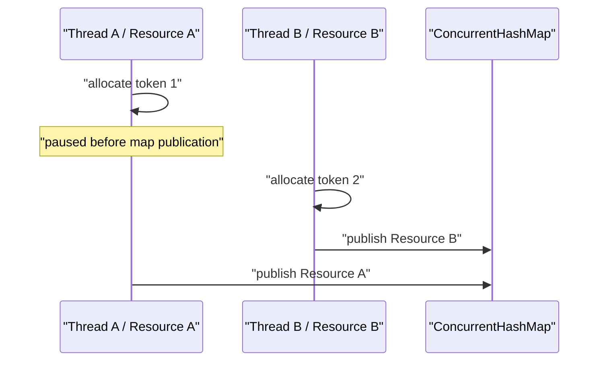

## Table of contents

> **Direct answer**
>
> A 32-thread stress test showed that one observed set of JVM schedules did not double-grant a resource. It could not tell us whether every generated history matched the API contract or reproduce the schedule that violated it. Lincheck added controlled interleaving exploration and a sequential specification—but its first result was that our specification, not the implementation, was wrong.

### Evidence card

| Field              | Evidence                                                              |
| ------------------ | --------------------------------------------------------------------- |
| System under test  | `LeaseRegistry` and `ResourcePool`                                    |
| Baseline           | `reputation-pool` PR #49, Lincheck 3.6, Java 25                       |
| Methods            | model checking, stress mode, intentional mutation                     |
| Reproduced failure | double grant after replacing `compute` with get-then-put              |
| Revised contract   | fencing order is per resource; selected identity is scheduling policy |
| Verified boundary  | declared operations within bounded single-JVM exploration             |
| Not verified       | databases, networks, or multi-process exclusion                       |

---

## 0. The test passed, but it could not explain why

`reputation-pool` lends reputation-bearing resources such as proxies, accounts, and sessions. If two callers receive the same live resource, their behavior is mixed and one caller can damage the reputation observed by the other.

The central invariant is simple:

> At most one live lease may exist for a resource.

`LeaseRegistry` used `ConcurrentHashMap.compute` to combine “is this slot free?” and “publish the new lease” into one atomic map operation. A test also started 32 threads against one resource and asserted that exactly one call succeeded.

That test was useful, but its evidence was narrower than it looked. The JVM scheduler chose the interleavings. A passing run meant only that the schedules observed during that run preserved the invariant.

I wanted to ask a stronger question:

> Can every observed concurrent result be explained by a legal sequential execution of the public operations?

That is the question the Lincheck harness was designed to answer.

## 1. What Lincheck checked

The harness exposed real operations rather than reimplementing the registry:

```java
@Operation
public boolean tryAcquire() {
    return registry.tryAcquire(RESOURCE, CONTEXT, NOW, TTL).isPresent();
}

@Operation
public boolean renew(@Param(name = "token") int token) {
    return registry.renew(RESOURCE, token, NOW, TTL).isPresent();
}

@Operation
public boolean release(@Param(name = "token") int token) {
    return registry.release(RESOURCE, token);
}
```

Lincheck generated concurrent scenarios and compared their return values with sequential executions of the same object. If no sequential ordering could explain a history while respecting real-time order, the history was not linearizable.

This does not make Lincheck an automatic contract generator. The operations and observable return values supplied by the test are the specification. An over-strong observation can reject a correct implementation.

<details>
<summary><b>Linearizability in one example</b></summary>

Suppose `tryAcquire()` and `isLeased()` overlap:

```text
Thread A: |------ tryAcquire ------|
Thread B:       |--- isLeased ---|
```

The result is linearizable if it can be explained as either:

1. `tryAcquire` took effect first and `isLeased` returned `true`, or
2. `isLeased` returned `false` first and `tryAcquire` succeeded afterward.

If two `tryAcquire()` calls on the same free resource both return `true`, no legal sequential ordering exists. Once the first call succeeds, the second must observe a live lease and fail.

</details>

## 2. Removing conditions that changed between runs

A sequential replay needs repeatable inputs. `ResourcePool` contained three environmental inputs that could change the result without indicating a concurrency defect:

| Variable condition  | Harness choice              | Reason                                          |
| ------------------- | --------------------------- | ----------------------------------------------- |
| Current time        | fixed `Clock` and `Instant` | prevent TTL expiration during a scenario        |
| Candidate selection | smallest-ID strategy        | avoid schedule-dependent random consumption     |
| Event delivery      | no-op `EventSink`           | keep external side effects outside the contract |

A seeded `Random` was not enough. The number sequence would be stable, but competing threads could consume its values in different orders. Injected time and replaceable selection policy made a deterministic harness possible without adding test-only branches to production code.

## 3. First rejection: fencing order was not global

A fencing token is an increasing number issued with a lease. A stale holder must present its old token when it tries to renew or release; the registry accepts the operation only if the token still matches the current lease.

The first specification observed tokens across multiple resources. Because one global `AtomicLong` issued them, I assumed token 1 had become visible before token 2.

Lincheck produced the counterexample:



Token allocation occurs inside `compute`, but before the new mapping is visible. Computes on different keys can progress independently. Token order can therefore disagree with cross-resource publication order.

This was not a registry defect. Callers use a token to protect the lifecycle of the same resource. They do not compare the tokens of two unrelated proxies.

The harness was split:

- one-resource tests observe the complete acquire, renew, release, and token contract;
- multi-resource tests verify independence without exposing token values.

The specification became narrower, but more accurate: monotonic fencing is a per-resource promise, not a global serialization order.

## 4. Second rejection: selected identity was policy, not contract

The next specification compared the exact resource ID returned by `acquire`. With a deterministic smallest-ID strategy, it seemed reasonable to expect the smallest resource every time.

Concurrency introduced a transient claim:

```mermaid
sequenceDiagram
    participant A as "Acquire A"
    participant B as "Acquire B"
    participant R1 as "Resource 1"
    participant R2 as "Resource 2"
    A->>R1: "temporary claim"
    B->>R1: "observes claimed"
    B->>R2: "claims next candidate"
    A->>A: "later condition fails; undo R1"
```

B can legitimately choose Resource 2 after observing A's temporary claim, even if A later undoes it. The safety contract is that successful calls do not hold the same live resource. “Always return the smallest ID” is a single-threaded selection policy.

Making exact identity a concurrent contract would require serializing selection and lease publication. That would trade away the fine-grained atomic boundary to preserve an observation no caller needed.

## 5. Third rejection: a safe acquisition may fail conservatively

The hardest race involved `block` and `acquire`.

An acquire can claim a resource, re-check the block state, discover that a concurrent block completed, and undo the claim. A second acquire may observe the temporary claim and return empty. After the undo, both acquires have failed and the resource is free.

No sequential execution of two acquires on a free resource produces two failures. The history is not expressible as a standard linearizable specification.

Safety was still preserved. The system preferred a conservative empty result over handing out a resource that might already be blocked. The caller can try another candidate or retry.

The meaningful real-time property was extracted:

> An acquire that starts after `block()` has returned must not grant that resource.

`Lincheck.runConcurrentTest` encoded that boundary over 50,000 invocations. It prohibited a post-block grant while allowing a conservative denial during the race.

## 6. What black-box history could not observe

After claiming, `acquire` checks the block state again and undoes the lease if necessary. Removing this re-check still left return-value histories that a black-box checker could linearize: the grant could be described as taking effect immediately before the block.

Operationally, that explanation was insufficient. Once `block()` returns, an in-flight acquisition must not turn into real use of the burned resource.

The tests were divided by observability:

- Lincheck verifies public lease-lifecycle results.
- A deterministic unit test opens the selection-to-claim window and verifies the internal undo.

“Lincheck proves it” would have been a stronger claim than the evidence supported.

## 7. Testing the tests with mutation

I intentionally replaced the atomic `compute` path with get-then-put:

```java
Lease current = active.get(resource);
if (current == null) {
    active.put(resource, newLease);
    return Optional.of(newLease);
}
```

Two threads can both observe `null`. Lincheck reduced the failure to the result that matters:

```text
Thread 1: tryAcquire() → true
Thread 2: tryAcquire() → true
```

Removing the blocklist gate also made the post-block acquisition test fail within seconds.

The exercise exposed a harness bug as well: an `AssertionError` thrown inside a spawned thread does not automatically fail the JUnit test thread. Results were moved into atomic holders and asserted after both threads joined.

## 8. The contract after the traces

| Area            | Guaranteed                                                   | Not guaranteed                            |
| --------------- | ------------------------------------------------------------ | ----------------------------------------- |
| Lease exclusion | at most one live holder per resource                         | every racing caller succeeds              |
| Fencing         | stale token cannot mutate the new lease of the same resource | global publication order across resources |
| Selection       | a granted resource satisfies acquisition safety              | exact resource identity under contention  |
| Blocking        | later-started acquire cannot bypass a returned block         | no conservative denial during a race      |
| Verification    | bounded single-JVM histories for declared operations         | distributed exclusion                     |

The strongest output was not another green badge. It was a contract that separated observable promises from incidental scheduling behavior.

## 9. Limitations

Passing these tests does not prove the absence of concurrency defects.

- Only declared operations and return values are checked.
- Exploration is bounded by configured threads, scenarios, and iterations.
- Model checking and stress mode have different blind spots.
- A wrong sequential specification can still produce a misleading result.
- Databases, networks, and multiple processes are outside this harness.

The defensible statement is:

> Within the declared operations and explored bounds, histories matched the revised sequential contract; removing the core atomicity produced a detected violation.

## 10. FAQ

### Q. Why keep the original stress test?

It is a cheap, always-on regression test under the real JVM scheduler. Lincheck model checking explores controlled switches and produces a reproducible trace. They cover different failure modes.

### Q. Did the test get weakened to fit the implementation?

No condition was removed merely because it failed. Each failed observation was checked against real caller data flow. Double grants and post-block grants remained prohibited and were mutation-tested. Cross-resource token order and exact selected identity were not consumed contracts.

### Q. Does Lincheck prove thread safety?

No. It provides strong counterexample search relative to the supplied operations, sequential specification, and exploration bounds. Distributed behavior and unobserved side effects require different tests.

## References

- [reputation-pool PR #49](https://github.com/PreAgile/reputation-pool/pull/49)
- [LeaseRegistryLincheckTest](https://github.com/PreAgile/reputation-pool/blob/main/reputation-pool-core/src/lincheckTest/java/io/github/preagile/reputationpool/core/pool/LeaseRegistryLincheckTest.java)
- [ResourcePoolBlockBypassLincheckTest](https://github.com/PreAgile/reputation-pool/blob/main/reputation-pool-core/src/lincheckTest/java/io/github/preagile/reputationpool/core/pool/ResourcePoolBlockBypassLincheckTest.java)
- [JetBrains Lincheck](https://github.com/JetBrains/lincheck)
- [Official Lincheck guide](https://kotlinlang.org/docs/lincheck-guide.html)
