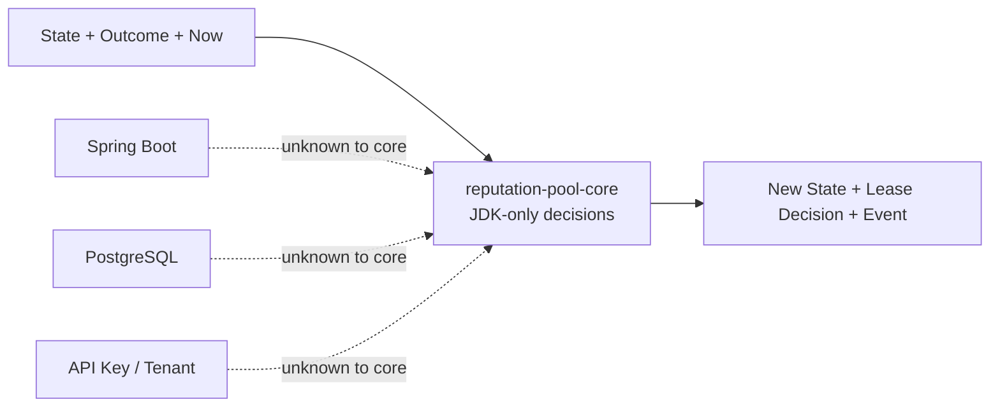
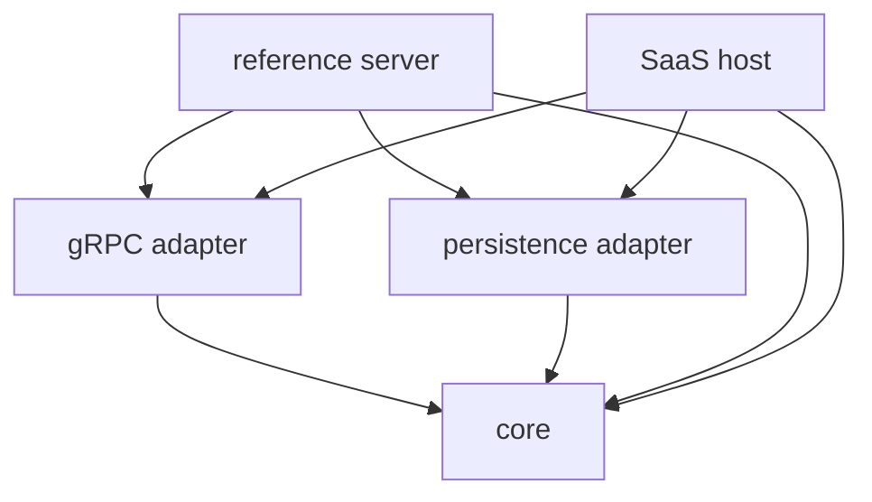
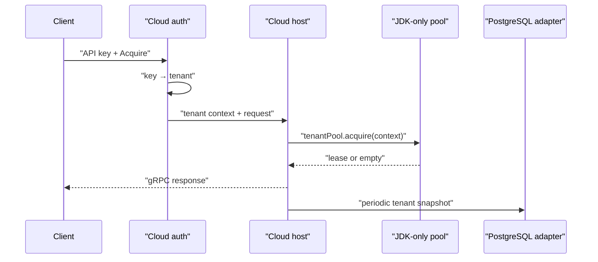

## Table of contents

> **Direct answer**
>
> Separating domain logic from SaaS was not enough. The gRPC contract, mapping, and handlers were still trapped inside an executable reference server, so a second host had to copy them. Extracting `reputation-pool-grpc` made both hosts consume one transport contract while leaving authentication, tenant routing, metering, and operations in the SaaS host.

### Evidence card

| Field               | Evidence                                                                 |
| ------------------- | ------------------------------------------------------------------------ |
| Boundary under test | JDK-only core, shared gRPC adapter, two hosts                            |
| Baseline            | public artifacts 0.5.0, gRPC 1.82.2, Java 25                             |
| Structural change   | server-owned gRPC code extracted into `reputation-pool-grpc`             |
| Verification        | full build, mapping mutation, publication dry run, Docker RPC round trip |
| Observed result     | 25 mapping mutations killed; `Register → Acquire → granted: true`        |
| Verified boundary   | reference server and Spring Boot cloud as JVM hosts                      |
| Remaining limit     | multi-process leases and the cloud admission/decode seam                 |

---

## 0. If reuse requires copying, the boundary is wrong

The public `reputation-pool` repository already included an executable reference server. It exposed resource registration, acquisition, outcome reporting, lease renewal, release, and event subscription over gRPC.

`reputation-pool-cloud` needed the same operations inside a different host:

- the reference server was a minimal executable example;
- cloud used Spring Boot and added authentication, tenant routing, PostgreSQL operations, metrics, and a dashboard.

The first cloud implementation copied `advisor.proto` and its handlers from the reference server. That was fast, but it created two sources of truth:

```text
reputation-pool-server/advisor.proto
reputation-pool-cloud/advisor.proto
```

Adding a field to one schema now required a coordinated edit in another repository. Mapping errors and event-stream shutdown behavior could drift even when both services claimed to expose the same API.

The core was shared, but the official way to expose it was not.

## 1. Why the engine is JDK-only

`reputation-pool-core` answers a deliberately narrow question:

> Given the current immutable state, an input, and the current time, what should the next state and lease decision be?

It contains the reputation engine, resource pool, lease registry, selection policies, and domain values. It does not decide:

- who sent a request,
- which tenant owns it,
- which PostgreSQL row stores the state,
- how usage is billed,
- or where an alert is delivered.

These concerns are not less important. They change for different reasons.

Reputation rules change with failure classification and recovery policy. Authentication changes with key-management policy. Persistence changes with schema and recovery requirements. Keeping them in one module would make a SaaS policy change expand the release and verification scope of the decision engine.

The core runtime therefore uses JDK APIs only. Test dependencies such as JUnit, jqwik, Lincheck, ArchUnit, and PIT do not become runtime dependencies of an application consuming the jar.



JDK-only was not a claim that third-party libraries are bad. It was a constraint that prevented host concepts from becoming engine inputs.

## 2. The first module boundary mixed two responsibilities

The early public structure was:

| Module                        | Responsibility                                  |
| ----------------------------- | ----------------------------------------------- |
| `reputation-pool-core`        | decisions, selection, leases, blocklist, events |
| `reputation-pool-persistence` | PostgreSQL snapshots and audit events           |
| `reputation-pool-server`      | gRPC execution and application assembly         |

The server owned two things that changed for different reasons:

1. a composition root that started one executable application;
2. a gRPC contract and adapter every JVM host needed to reuse.

Hosts may assemble an application differently. The reference server can register a service with raw `ServerBuilder`; cloud can use Spring `@GrpcService`.

The following pieces should not differ:

- `advisor.proto`,
- protobuf-to-domain mapping,
- decode → one core call → encode handlers,
- event-stream broadcasting,
- event-sink fan-out.

Cloud needed the adapter, not the executable server. Depending on the whole application was wrong, and copying the useful classes was also wrong.

## 3. Extracting the missing adapter boundary

PR #66 introduced the published `reputation-pool-grpc` module and moved:

- `advisor.proto`,
- `ProtoMapping`,
- `ReputationAdvisorService`,
- `EventBroadcaster`,
- `CompositeEventSink`.

The dependency direction became:



The arrows do not point back outward. Core does not know that gRPC or Spring exists. The adapter depends on public core types. Each host chooses and assembles the adapters it needs.

The shared base service is framework-neutral. Cloud subclasses it, adds `@GrpcService`, and selects the pool for the authenticated tenant:

```java
@GrpcService
public class ReputationAdvisorService
    extends io.github.preagile.reputationpool.grpc.ReputationAdvisorService {

    @Override
    protected ResourcePool pool() {
        String tenantId = TenantContext.TENANT_ID.get();
        return registry.poolFor(tenantId);
    }
}
```

The base owns decoding, invoking the engine, encoding, and error mapping. Cloud owns which tenant the call is allowed to affect.

## 4. The placement rule

I used four questions when deciding where a capability belonged:

1. Does the domain invariant break without it?
2. Must the rule remain the same across execution environments?
3. Can it be represented as an input to the decision?
4. Does it change because of a customer, deployment, or commercial policy?

| Capability                       | Location               | Reason                                   |
| -------------------------------- | ---------------------- | ---------------------------------------- |
| score and cooldown calculation   | core                   | environment-independent decision         |
| lease exclusion and fencing      | core                   | resource-safety invariant                |
| selection policy                 | core interface/default | replaceable decision policy              |
| state-storage need               | core port              | required capability without a technology |
| PostgreSQL snapshot/audit        | persistence adapter    | database-specific                        |
| protobuf mapping and RPC handler | gRPC adapter           | transport-specific but shared            |
| API-key authentication           | cloud                  | SaaS access policy                       |
| per-tenant pool routing          | cloud                  | customer isolation model                 |
| usage metering and limits        | cloud                  | operational and commercial policy        |
| dashboard, alerting, backup      | cloud                  | service operation                        |

The persistence port living in core does not make PostgreSQL a core concern. Core expresses the operation it needs; an outer module implements it.

## 5. “Thin host” did not mean “few lines of code”

Cloud now contains authentication, tenant lifecycle, metering, metrics, alerting, a dashboard, backups, and control-plane code. Calling it thin can sound dishonest if thin is interpreted as a line count.

The actual rule is:

> The host must not reimplement a domain decision the public engine already owns.

`ApiKeyAuthInterceptor` resolves an API key to a tenant. The cloud gRPC service selects that tenant's pool. Score updates, cooldown, selection, block decisions, and lease semantics return to core.



The SaaS has substantial code because the SaaS has substantial responsibilities. It remains thin at the decision boundary.

## 6. Evidence beyond compilation

The extraction was verified through scenarios rather than the dependency graph alone:

| Scenario                     | Observed result                                    | Purpose                                            |
| ---------------------------- | -------------------------------------------------- | -------------------------------------------------- |
| public repository build      | server used the new module without internal copies | catch source and dependency omissions              |
| `ProtoMapping` mutation      | 25 mutations killed, 0 survived                    | verify mapping assertions had teeth                |
| publication dry run          | gRPC artifact and dependencies were present        | avoid local-project-only success                   |
| cloud Docker round trip      | `Register → Acquire → granted: true`               | test Spring registration, runtime, and DB assembly |
| authenticated container call | missing key rejected; valid key granted            | verify the interceptor sat before the real RPC     |

This mattered because gRPC and protobuf modules can compile and still fail at startup when transitive versions split. Cloud now aligns the gRPC runtime with a BOM and consumes immutable public artifacts from Maven Central.

## 7. Costs and remaining friction

### Release ordering

A shared contract change now requires releasing public artifacts before cloud upgrades. This is slower than editing one repository, but it also forces compatibility to become an explicit gate.

### Host extension seams

The original base service accepted one pool. Multi-tenancy required a `pool()` hook. Tenant-scoped event streams later required `subscriptionPoolId()`. Framework neutrality did not remove host requirements; it required the smallest reusable extension points.

### A small decode duplication

Cloud applies a shared-JVM resource budget before delegating `register` and `report`. It must determine whether the request would create new state, but part of `ProtoMapping` is not accessible to the subclass. Cloud currently duplicates the minimum decode needed for admission.

This is evidence of boundary friction, not immediate proof that every mapper should become public. The next design should ask:

- Does another host need the same pre-delegation check?
- Should the base service expose an admission hook?
- Would moving the budget inward leak a SaaS deployment policy into core?

One duplication was recorded instead of being generalized prematurely.

## 8. Decision checklist

1. Find domain decisions copied across controllers or services.
2. Identify framework requests, database connections, and session state mixed into their inputs.
3. Make time, randomness, and external behavior injectable.
4. Look for reusable adapters trapped inside executable applications.
5. Verify that source dependencies point inward toward the core.
6. Test a real transport-and-storage round trip after extraction.
7. Record release ordering and compatibility costs.

| Situation                                    | Boundary to consider                   |
| -------------------------------------------- | -------------------------------------- |
| one application, one framework lifecycle     | a package boundary may be enough       |
| batch, server, and SaaS share decisions      | framework-neutral core                 |
| transport mapping repeats across hosts       | shared adapter module                  |
| auth, billing, tenant policy vary by product | SaaS host                              |
| storage changes behind one state contract    | core port + persistence adapter        |
| one small duplication                        | observe before widening the public API |
| repeated host extension need                 | add a minimal shared hook              |

## 9. Limitations

The current cloud keeps tenant pools inside one JVM and routes calls in the host. The boundary must be revisited when:

- pools span multiple processes,
- lease ownership moves to a database or coordinator,
- a non-Java consumer needs local decisions,
- admission becomes a requirement shared by multiple hosts,
- or another transport must share the same handler semantics.

This is not a finished “clean architecture.” It is the current boundary that best separates change reasons for three known consumers and a single-process deployment.

## 10. FAQ

### Q. Would using Spring in core be faster to develop?

Possibly for one application. Here, a library, reference server, and SaaS consume the same decisions. Spring types in core would force every consumer onto the same framework lifecycle. Cloud still uses Spring wherever it owns the responsibility.

### Q. Is zero dependency a performance optimization?

No performance improvement is claimed or measured. The constraint exists for portability, deterministic testing, and separation of release reasons.

### Q. Is cloud still thin if it contains so much code?

Thin describes the absence of duplicated domain decisions, not the total number of lines. Authentication, tenancy, metering, observability, and deployment are legitimate SaaS responsibilities.

### Q. Why was the gRPC module not designed from day one?

The initial boundary was incomplete. However, extracting every possible adapter before a second host existed could also have produced unused abstractions. The real copy in cloud exposed exactly which parts were shared and which remained host-specific.

## References

- [reputation-pool PR #66 — extract the gRPC surface](https://github.com/PreAgile/reputation-pool/pull/66)
- [reputation-pool-cloud PR #20 — consume the shared adapter](https://github.com/PreAgile/reputation-pool-cloud/pull/20)
- [reputation-pool-cloud PR #22 — authentication and tenant seam](https://github.com/PreAgile/reputation-pool-cloud/pull/22)
- [reputation-pool](https://github.com/PreAgile/reputation-pool)
- [reputation-pool-cloud](https://github.com/PreAgile/reputation-pool-cloud)
