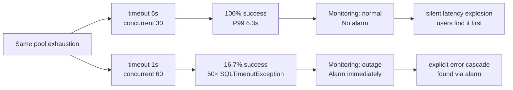
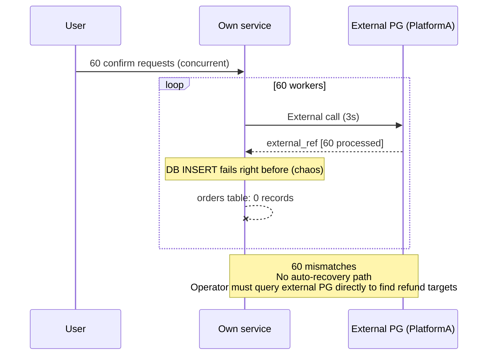
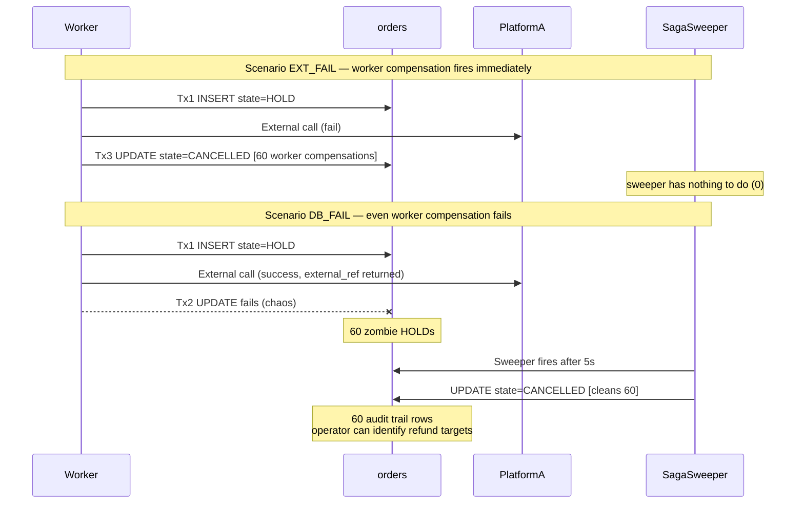
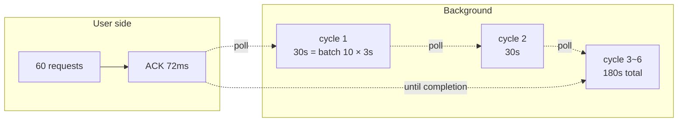

## Table of contents

## Introduction

I noticed a method in the payment domain during a code review. Inside `@Transactional`, it called the external PG to confirm and then UPDATEd the `payment` row with the result — a familiar shape. Normally it ran fine because the external call took ~200ms.

But what happens when that external call slows down to 3 seconds? With pool size 10 and 60 concurrent requests, head-knowledge says "pool will be exhausted," but few people can confidently explain **how fast / in what shape / through what alarm** it surfaces.

A harder question follows — **"How should we split it then?"** "Separate the transaction from the external call" is common advice, but in domains where *the external call result determines whether to save* (payments, orders), simple separation breaks consistency. *How* it breaks, and whether the popular remedies — **Saga** and **Outbox** — actually solve the problem, are hard to answer with confidence without measurement.

This post is the record of pursuing both questions to the end with raw JDBC.

1. **Phase 1 — Reproduce pool exhaustion**: how the external call inside a transaction eats the pool, dissected through two runs
2. **Phase 2 — Compare remedies**: is splitting enough — comparing **Simple Split / Saga / Outbox** across 60 workers × 9 chaos scenarios

To start with the conclusion:

- **Simple Split** unblocks pool exhaustion but *breaks consistency* — caught as 60 mismatched records
- **Saga's three-tier safety net** (compensation → sweeper → reconciliation) shown to operate *in sequence over time* across two scenarios
- **Outbox** shortens user-perceived response, but *processing-completion time* gets 30× slower — the same dataset yields opposite conclusions depending on which metric you read

I'll walk through how the assumption "splitting is enough" breaks, line by line.

---

## 1. Context — Why I revisited this

### 1.1 Domain

The service is a multi-platform review/payment SaaS backend. External commerce platforms (B Co., C Co., Y Co., D Co.) and self-hosted PG payment flow through the same transactional path.

The problematic shape is simple:

```java
@Transactional
public void confirm(PaymentRequest req) {
    Payment p = repo.find(req.id());
    PgResponse r = pgClient.confirm(req);   // external call — ~200ms normally
    p.applyResult(r);
    repo.save(p);
}
```

Under normal conditions it works. But the moment the external PG slows down to 3 seconds and concurrent payments exceed pool size — same code, system collapses.

### 1.2 Hypotheses

- (H1) Pool occupancy time = external call duration
- (H2) When `connection-timeout` is shorter than *external call × wave count*, fail-fast; longer, silent latency explosion

### 1.3 Measurement Environment

| Item | Value |
|---|---|
| OS / Host | macOS 14.x, MacBook Pro M2 16GB |
| DB | MySQL 8.0.44 (Docker, host 3307) |
| App | Java 21, Spring Boot 3.4.1, **raw JDBC** (deliberate — JPA not introduced) |
| HikariCP | maxPoolSize=10, minIdle=2 |
| External call | `Thread.sleep(extDelay)` — abstracted as PlatformA per NDA |
| Load | `ExecutorService` N workers, 3-latch (ready/go/done) simultaneous start |
| Observation | `HikariPoolMXBean` (active/idle/awaiting), polled every 0.5s |

I deliberately skipped JPA. Handling *connection borrow / commit / rollback / close* directly without `@Transactional` abstraction is necessary to later compare *what Spring hides* once JPA is introduced.

---

## 2. Phase 1 — Reproducing pool exhaustion in two shapes

The same pool exhaustion looks *completely different* depending on `connection-timeout`. Two runs to compare.

### 2.1 Run #1 — silent latency explosion

**Parameters**: pool=10, **timeout=5,000ms**, concurrent=30, extDelay=2,000ms

| Metric | Value |
|---|---|
| OK | **30/30 (100%)** |
| Pool timeout | 0 |
| Total elapsed | 6,351 ms |
| Latency P50 / P90 / P99 | 2,200 / 4,300 / **6,350 ms** |
| Pool stats peak | active=10 / awaiting=20 (sustained 6s) |

The 30 requests landed cleanly across *three waves*.

| Wave | Count | Latency range | Meaning |
|---|---|---|---|
| 1 | 10 | 2,000~2,300 ms | Connection acquired immediately |
| 2 | 10 | 4,000~4,400 ms | After 2-second wait |
| 3 | 10 | 6,000~6,400 ms | After 4-second wait |

→ **Monitoring sees "normal" if it only watches success rate**. Yet users feel *6 seconds of slowness*. The most dangerous form — pool exhaustion that fires no alarms.

### 2.2 Run #2 — fail-fast

**Parameters**: pool=10, **timeout=1,000ms**, concurrent=60, extDelay=3,000ms

| Metric | Value |
|---|---|
| OK | **10/60 (16.7%)** |
| Pool timeout | **50** |
| Total elapsed | 3,304 ms |
| Success latency | 3,031~3,302 ms (single wave) |
| Failure timeout | 1,003~1,016 ms (all spike within 1 second) |

This time `timeout(1s) < extDelay(3s)`, so only the first wave (10 requests) passed and the remaining 50 died with `SQLTimeoutException` exactly at the 1-second mark.

**Theory check**:
- Throughput ceiling = pool / extDelay = 10/3s = **3.33 req/s** [theory]
- Measured = 10 / 3.30s = **3.03 req/s** ⇒ 91% of theory
- Pass rate = pool / concurrent = 10/60 = **16.7%** ⇒ measured matches exactly

### 2.3 The fundamental difference — what signal ops sees



→ "Fail-fast is safe" — that common reply is **half-true**. Long timeouts surface pool exhaustion as *delay*, short timeouts as *error* — but **the underlying pool exhaustion is identical**.

<details>
<summary><b>Why HikariCP's awaitingConnection metric is the real signal</b> (expand)</summary>

Both `success_rate` and `error_rate` view Run #1 as healthy. **Only `awaitingConnection > 0` is a direct signal**.

```java
HikariPoolMXBean.getThreadsAwaitingConnection()
```

This single-line metric is the truth of pool exhaustion. In both runs `awaiting > 0` *persisted for several seconds*.

A common operational trap is **setting timeout too long**. At 30/60 seconds, pool exhaustion *doesn't surface in alarms* — it only surfaces when user P99 explodes. Setting timeout short means — under normal 200ms external calls everything's fine — but the moment the external SLA breaks, fail-fast cascades immediately. Both policies require deeper monitoring to be safe.

**HikariCP official guidance**:
- `connection-timeout`: 30 seconds recommended (pool acquisition wait). This experiment uses 1s/5s for learning-driven variation.
- `awaitingConnection > 0`: 0 in steady state. Sustained 1+ means pool exhaustion.
- `active == max`: 100% utilization. Transient OK, sustained means revisit pool size.

</details>

---

## 3. Three remedies — Simple Split / Saga / Outbox

If Phase 1 was "problem measurement," from here it's *remedy measurement*. Three patterns under the same load (`concurrent=60, extDelay=3,000ms, pool=10, timeout=1,000ms` — same as the Phase 1 fail-fast run).

Each pattern × 3 chaos modes = **9 scenarios**:
- `OFF`: normal
- `DB_FAIL_AFTER_EXTERNAL`: forced DB failure right before save *after external call succeeded* — the operational incident scenario
- `EXTERNAL_FAIL`: the external call itself fails — verifies compensation/retry

For each pattern: *concept → code → tests → measurement*.

---

### 3.1 Simple Split

#### Concept

```
1) (no transaction) external API call
2) (Tx) DB save
```

The most intuitive answer. The common advice "separate the transaction from the external call" looks exactly like this.

<details>
<summary><b>When is Simple Split safe</b> (expand)</summary>

For Simple Split to be safe, *one of these* must hold:

1. **External call is idempotent and partial failures self-recover via retry** — external OAuth token cache, statistics cache. If external OK / DB fail, the client retries with the same key for the same result.
2. **Partial failure is acceptable for the domain** — losing one notification doesn't cause business loss.

Unsuitable for payments / orders / refunds — domains where *partial failure equals an incident*. Section 3.1.4 catches that unsuitability directly as 60 mismatched records.

[Microsoft's Compensating Transaction Pattern](https://learn.microsoft.com/en-us/azure/architecture/patterns/compensating-transaction) opens with the same point: "In a distributed environment without distributed transactions, you need a pattern to *compensate* for each step's failure" — Simple Split is structurally weak in that *it has no compensation step*.

</details>

#### Code — How it's written

`PatternARunner.java` (raw JDBC):

```java
public void handle(int requestId) {
    String idemKey = "A-" + UUID.randomUUID();

    // 1) External call — no pool occupancy
    String externalRef = platformA.call(idemKey);

    // 2) Tx — INSERT
    try (Connection c = ds.getConnection()) {
        if (cfg.chaos == ChaosMode.DB_FAIL_AFTER_EXTERNAL) {
            // External succeeded / forced own DB save failure (operational incident sim)
            counters.inconsistent.incrementAndGet();
            return;
        }
        insertOrder(c, requestId, idemKey, externalRef);
        counters.ok.incrementAndGet();
    }
}
```

Key invariant: **the external call lives *outside* the transaction**. Connection holds for INSERT only (~5ms).

#### How tested

3 chaos modes, 60 workers concurrent:

```bash
./gradlew :runExp09b --args="pattern=A chaos=false totalTimeout=60"          # normal
./gradlew :runExp09b --args="pattern=A chaos=db_fail totalTimeout=60"        # DB fail
./gradlew :runExp09b --args="pattern=A chaos=external_fail totalTimeout=60"  # external fail
```

DB state checked right after each scenario:

```sql
SELECT pattern, state, COUNT(*) FROM orders GROUP BY pattern, state;
```

#### Measurement — Simple Split

| chaos | OK | Inconsistent | ExtFail | P99 (ms) | DB orders | external idem cache |
|---|---|---|---|---|---|---|
| OFF | **60** | 0 | 0 | 3,071 | 60 CONFIRMED | 60 |
| **DB_FAIL** | 0 | **60** ⚠️ | 0 | — | **0** | **60** |
| EXT_FAIL | 0 | 0 | 60 | — | 0 | 0 |

#### Finding — A consistency incident caught as 60 mismatches

The `DB_FAIL` scenario is the heart of this. **External holds 60 transactions / own DB holds 0** — user cards are charged 60 times but the order system has none.



**Zero auto-recovery path**. An operator must query the external PG directly and *manually* refund or *manually* INSERT the 60 records. The "absolutely don't use Simple Split for payment" rule becomes concrete with this single number — 60.

The control case (`EXT_FAIL`) leaves own DB clean (the throw never reaches INSERT). That's the *only* safe case for this pattern — and the operational risk is exactly at `DB_FAIL`.

→ **Pool exhaustion solved, but a new consistency problem introduced**. The next two patterns are the answer.

---

### 3.2 Saga (Reserve-Confirm)

#### Concept

> Saga is a pattern that ensures consistency through *compensating transactions* per step in environments *without distributed transactions*.
> The variant in this post is **Reserve-Confirm** — leave a "reservation (HOLD)" trace in DB *before* the external call, then issue confirm or cancel transactions based on the result.

```
(Tx1) reserve  — orders state=HOLD INSERT
(no transaction) external API call (with idempotency key)
  success → (Tx2) confirm — state=CONFIRMED
  failure → (Tx3) cancel  — state=CANCELLED (compensation)
+ separate sweeper thread — auto-RELEASE HOLD older than N seconds
```

The key: **leave a reservation trace *before* the external call**. That's what makes any-step-death recoverable.

<details>
<summary><b>Saga deep dive — Choreography vs Orchestration, compensation, Stripe/Toss standards</b> (expand)</summary>

**Two Saga variants**:

| Variant | Flow | Relation to this post |
|---|---|---|
| **Orchestration** | A central coordinator explicitly calls each step + compensation step | Same shape — `PatternBRunner.handle()` is the coordinator |
| **Choreography** | Each service triggers the next step via events. No coordinator | Considered when message broker is introduced |

[microservices.io — Saga](https://microservices.io/patterns/data/saga.html) explains the trade-offs — Orchestration is *easy state tracking* but *coordinator becomes single point of failure*. Choreography has *low service coupling* but *flow is scattered across multiple codebases*.

This post uses single-service Orchestration. Choreography becomes interesting once message-broker-based distribution is introduced.

**Compensating Transaction**:

[Microsoft's Compensating Transaction Pattern](https://learn.microsoft.com/en-us/azure/architecture/patterns/compensating-transaction) defines it as *an action that *logically undoes* a prior action's effect*. Notes:

- Not a physical rollback — *business-logic-level undo*. Example: the compensation of payment confirm is a refund call (an external system call, not a DB UPDATE).
- The premise that *compensation itself can fail* is core — that's exactly why this post needs a sweeper.
- Idempotency required — repeated compensation must yield the same result.

**Stripe/Toss idempotency 4-piece combo**:

Standard pattern from [Stripe Engineering — Idempotency](https://stripe.com/blog/idempotency) and [TossPayments — Idempotency](https://docs.tosspayments.com/blog/what-is-idempotency):

1. **Idempotency Key** (V4 UUID, HTTP header) — `idemKey` in this post
2. **Payment Intent / domain row** — `orders` (state ENUM) in this post
3. **Webhook idempotency** — out of scope here
4. **Reconciliation batch** — daily reconciliation of external PG against own DB

This post covers 1~2. Items 3~4 will be covered in a follow-up.

**Why is the *Reserve* step the heart**:

If INSERT happens *after* the external call? → external succeeds → JVM crash → no DB trace → *the system never knows* = same consistency problem as Simple Split.

INSERT HOLD *before* the external call → HOLD row becomes the source of truth (audit trail) → any-step-death is traceable. That's what Saga *uniquely adds* over Simple Split.

</details>

#### Code — How it's written

`PatternBRunner.java` core flow:

```java
public void handle(int requestId) {
    String idemKey = "B-" + UUID.randomUUID();

    // Tx1 — reserve (HOLD INSERT)
    long orderId = reserve(requestId, idemKey);

    // No transaction — external call
    String externalRef;
    try {
        externalRef = platformA.call(idemKey);
    } catch (Exception e) {
        // Tx3 — compensation (CANCELLED)
        cancel(orderId);
        counters.compensated.incrementAndGet();
        return;
    }

    // Tx2 — confirm
    confirm(orderId, externalRef);
    counters.ok.incrementAndGet();
}
```

Expiration sweeper (`SagaSweeper.java`) — separate thread:

```sql
UPDATE orders SET state='CANCELLED'
WHERE state='HOLD' AND pattern='B'
  AND created_at < (CURRENT_TIMESTAMP(3) - INTERVAL ? MICROSECOND)
```

→ Auto-cleans HOLD rows older than N seconds. Threshold 5s for learning purposes (production should set it longer than PG timeout).

#### How tested

`PatternBRunner` + `SagaSweeper` running together. 3 chaos modes:

```bash
./gradlew :runExp09b --args="pattern=B chaos=false"          # normal
./gradlew :runExp09b --args="pattern=B chaos=db_fail"        # confirm fail → swept
./gradlew :runExp09b --args="pattern=B chaos=external_fail"  # external fail → compensate
```

Verification points:

- `chaos=false`: all 60 workers confirm → orders.B.CONFIRMED=60
- `chaos=db_fail`: confirm fail → 60 zombie HOLDs → sweeper cleans to CANCELLED after 5s
- `chaos=external_fail`: external throw → catch block's `cancel()` immediate → 60 CANCELLED

#### Measurement — Saga

| chaos | OK | Compensated | sweeper | P99 (ms) | DB orders |
|---|---|---|---|---|---|
| OFF | **60** | 0 | 0 | 3,106 | 60 CONFIRMED |
| DB_FAIL | 0 | 0 | **60** | — | 60 CANCELLED |
| EXT_FAIL | 0 | **60** | 0 | — | 60 CANCELLED |

#### Finding — Three-tier safety net firing in *time order*

Saga's consistency guarantee makes sense **only when looking at two scenarios together**.



| Scenario | Worker compensation | sweeper | Final DB |
|---|---|---|---|
| EXT_FAIL | **60** immediate | 0 | B.CANCELLED=60 |
| DB_FAIL | 0 (fail) | **60** | B.CANCELLED=60 |

→ **Two safety nets fire *in sequence***. Looking at one scenario only validates half the story.

The decisive difference vs Simple Split — `DB_FAIL` *still leaves 60 audit-trail rows in own DB*:

| | Simple Split / DB_FAIL | **Saga / DB_FAIL** |
|---|---|---|
| External processing | 60 | 60 |
| **Own DB trace** | **0** | **60 CANCELLED** |
| Refund target identification | Direct external PG query | `WHERE state='CANCELLED'` one-liner |
| Operational burden | Manual external↔own-DB mapping | Audit trail handles it |

**1/10 the operational cost** comes from this single thing — audit trail. Saga's real value is that *records survive even when compensation fails*.

<details>
<summary><b>What audit trail actually means</b> (expand)</summary>

I used the term *audit trail* multiple times without defining it. To pin it down:

**General definition**: *records that make actions traceable in time-order — who did what when*. A formal term in accounting / finance / security.

**This post's context**: *the row itself* in `orders` + the `state` column + `created_at` / `updated_at` timestamps.

```sql
SELECT id, state, idem_key, created_at, updated_at FROM orders WHERE pattern='B';
```

```
id  state       idem_key       created_at        updated_at
1   CANCELLED   B-aaaa-...     22:30:12.345      22:30:17.891
2   CANCELLED   B-bbbb-...     22:30:12.347      22:30:17.892
... (all 60)
```

These 60 rows *are* the audit trail. Each row testifies to:
- The order existed (`created_at`)
- What state transitions happened (HOLD → CANCELLED, `updated_at` is when sweeper fired)
- Which idempotency key was used for the external call

**Why operationally important**:

1. **External system independence** — refund targets identifiable *purely from own DB*. Even if external PG API is *down at that moment*, `WHERE state='CANCELLED'` works.
2. **Time tracking** — incident timestamps / scope / mean recovery time become operational metrics.
3. **Legal/regulatory requirements** — payment domains have audit trail as *requirement* under ISO 27001 / SOC 2 / PCI-DSS. "Prove transaction X happened, even 6 months later."
4. **Discoverability** — operators find incidents *they didn't know about* via routine queries. *Before* user complaints.

**Strong vs weak audit trail**:

| Form | How | Relation to this post's Saga |
|---|---|---|
| **State machine** (this post) | state column changes. Only the latest state visible | ✅ This post |
| **State change log** | INSERT *every transition* into a separate `order_state_history` table | ↑ Stronger |
| **Event Sourcing** | Append-only event log. Store all domain events; rebuild state | Strongest form |

This post's Saga is *minimal* audit trail. Stronger tracking calls for state-change-log tables or Event Sourcing.

</details>

---

### 3.3 Outbox (Transactional Outbox)

#### Concept

> Outbox INSERTs the *domain row + the external-call intent (outbox row)* in **the same transaction**, and a separate worker polls outbox to make external calls *asynchronously*.
> Users get an immediate ACK; the external call happens *later* via the worker.

```
(Tx1) orders(state=PENDING) + outbox(event=CALL_PLATFORM_A) — same connection
ACK to user immediately
Separate thread poller — outbox poll → (no Tx) external call → (Tx2) state=CONFIRMED + outbox row DELETE
```

<details>
<summary><b>Outbox deep dive — same-Tx invariant, FOR UPDATE SKIP LOCKED, Polling vs CDC</b> (expand)</summary>

**Why *same transaction* is the core invariant**:

If domain INSERT and message-queue publish were separate? → DB commit succeeds, then crash before publish → *domain shows PENDING but queue is empty* = external call never happens.

INSERTing both in the same transaction means *both commit or both rollback* — *the partial-success case is structurally eliminated*. That's why *outbox is the source of truth*.

[microservices.io — Transactional Outbox](https://microservices.io/patterns/data/transactional-outbox.html) emphasizes this in its first paragraph: "Use a transactional outbox to *atomically* update the database and publish a message".

**Meaning of FOR UPDATE SKIP LOCKED** (MySQL 8.0+, PostgreSQL 9.5+):

```sql
SELECT id, order_id, idem_key, retry_count
FROM outbox
WHERE locked_until IS NULL OR locked_until < NOW()
ORDER BY id LIMIT ?
FOR UPDATE SKIP LOCKED
```

- `FOR UPDATE` — row-level lock
- **`SKIP LOCKED`** — locked rows are *skipped* → other pollers grab other rows = **safe distributed processing**
- `locked_until` field — if a poller dies, another poller reclaims via *time-based* logic. Lock-timeout fallback.

→ **Single-poller learning code** but **safe under multi-poller**. Naturally extends when distributed locks like ShedLock are added.

**Polling vs CDC evolution**:

| Method | Tool | Trade-off |
|---|---|---|
| Polling (this post) | Spring `@Scheduled` or separate thread | Simple / lag = polling interval |
| **CDC** (Change Data Capture) | Debezium + Kafka | Immediate (ms) / infrastructure complexity ↑ |

This post uses 200ms polling. As lag tolerance grows in production, increasing the polling interval (lower DB load) is typical; for ms-grade lag, evolve to CDC.

**Outbox under multi-instance**:

Larger setups add a *partition key* to outbox so each poller instance handles only its partition. Higher throughput than single-lock approaches (e.g., ShedLock).

</details>

#### Code — How it's written

`PatternCRunner.java` (worker — immediate ACK):

```java
public void handle(int requestId) {
    String idemKey = "C-" + UUID.randomUUID();

    try (Connection c = ds.getConnection()) {
        c.setAutoCommit(false);
        long orderId = insertPendingOrder(c, requestId, idemKey);
        insertOutboxRow(c, orderId, idemKey, requestId);
        c.commit();   // ← both commit in the same transaction
        counters.ok.incrementAndGet();
    }
}
```

`OutboxPoller.java` (separate thread — external call + confirm):

```java
private void processBatch() {
    List<Row> claimed = claim();   // FOR UPDATE SKIP LOCKED
    for (Row row : claimed) {
        String externalRef = platformA.call(row.idemKey);  // no Tx
        confirm(row.orderId, externalRef, row.id);          // (Tx2) UPDATE + DELETE
    }
}
```

I deliberately wrote it as a **separate thread** for learning — to handle thread lifecycle / concurrency / shutdown directly instead of leaning on Spring `@Scheduled`'s abstraction.

#### How tested

worker (60 ACCEPTs) + poller (separate thread) running together. 3 chaos modes:

```bash
./gradlew :runExp09b --args="pattern=C chaos=false totalTimeout=180"          # normal (drain finishes)
./gradlew :runExp09b --args="pattern=C chaos=db_fail totalTimeout=180"        # 50% confirm fail → auto-retry
./gradlew :runExp09b --args="pattern=C chaos=external_fail totalTimeout=30"   # external permanent fail → outbox piles up
```

Key verifications:

- `chaos=false`: all rows reach CONFIRMED (but completion time accumulates by cycle)
- `chaos=db_fail`: even orderIds fail confirm → bumpRetry → next cycle retries → eventually all processed
- `chaos=external_fail`: external throw → only retry_count grows → outbox piles up (operational alarm signal)

Completion-latency measured via SQL:

```sql
SELECT
  state,
  COUNT(*) AS cnt,
  MIN(TIMESTAMPDIFF(MICROSECOND, created_at, updated_at) DIV 1000) AS min_ms,
  ROUND(AVG(TIMESTAMPDIFF(MICROSECOND, created_at, updated_at) DIV 1000), 0) AS avg_ms,
  MAX(TIMESTAMPDIFF(MICROSECOND, created_at, updated_at) DIV 1000) AS max_ms
FROM orders WHERE pattern='C' GROUP BY state;
```

#### Measurement — Outbox

| chaos | ACK ok | ACK P99 (ms) | poller processed | poller retries | DB final |
|---|---|---|---|---|---|
| OFF | **60** | **72** ⭐ | 60 | 0 | 60 CONFIRMED |
| DB_FAIL | 60 | 67 | 9 (timeout @ 180s) | 50 | 9 CONFIRMED + 51 PENDING |
| EXT_FAIL | 60 | 66 | 0 | 19 | 60 PENDING (outbox piling) |

**Completion latency distribution** (`chaos=false`, totalTimeout=200, all 60 processed):

| Metric | Value |
|---|---|
| min | 3,233 ms |
| **avg** | **92,573 ms ≈ 93s** |
| **max** | **181,935 ms ≈ 182s** |

#### Finding — *Two latencies* split inside the same dataset

My first analysis concluded "ACK is fast" from the 72ms P99 alone — but that was **an unfair comparison**. Simple Split / Saga's P99 (3,071/3,106 ms) is *external call + DB write completion*; Outbox's 72ms is *up to ACK with the external call not yet happening* — different metrics placed side by side.

**Splitting two latencies on the same scenario**:

| Latency type | Value | Meaning |
|---|---|---|
| ACK P99 (user-perceived) | **72 ms** | User receives "processing" response |
| Completion min | 3,233 ms | First-cycle row (one external call) |
| **Completion avg** | **92,573 ms ≈ 93s** | Average across 60 |
| **Completion max** | **181,935 ms ≈ 182s** | Last-cycle row |



→ Reading only the ACK metric leads to the conclusion "Outbox is fast", but **completion-metric-wise it's 30× *slower*** (92,573 / 3,071 ≈ 30). **The same dataset yields opposite conclusions depending on which metric you read**.

That's Outbox's real trade-off — **decoupling response from external call comes at the cost of *longer completion time***. Unsuitable for payment confirms where users *wait for completion* — *fast response but the user has no idea whether the payment actually went through*. Fit for notifications / emails where *ACK alone is enough*.

#### Additional finding — *Monitoring blind spot* under permanent external failure

The `EXT_FAIL` scenario directly demonstrates an operational trap:

```
ACK P99 66ms          ← user sees normal response
processed: 0          ← actual processing 0
pending: 60           ← outbox piling
retries: 19           ← poller retried 19×, all failed
```

Users see 100% normal, business is at 0% processed — invisible to ops unless they *monitor outbox depth*.

```sql
-- Direct alarm signal for ops
SELECT COUNT(*) FROM outbox WHERE retry_count > 5;
```

This single query is the alarm basis — same architectural slot as Hikari's `awaitingConnection`. The pattern differs but *the need for direct signals* is identical.

---

## 4. Three-pattern overview

### 4.1 Splitting two latency axes — the most important comparison

| Pattern | User response latency | Completion latency | Same? |
|---|---|---|---|
| **Simple Split** | 3,071 ms | 3,071 ms | ✅ Same (synchronous) |
| **Saga** | 3,106 ms | 3,106 ms | ✅ Same (synchronous) |
| **Outbox** | **72 ms (ACK)** | **avg 92,573 ms / max 181,935 ms** | ❌ **Decoupled (async)** |

→ "Outbox is fast" only on the user-perceived metric. On completion metric, it's 30× slower.

### 4.2 Consistency guarantee

| Pattern | On DB_FAIL | On EXT_FAIL | Auto-recovery |
|---|---|---|---|
| **Simple Split** | **60 mismatches** ⚠️ | Safe (control case) | None — operator manual |
| **Saga** | sweeper cleans 60 | 60 immediate compensation | compensation → sweeper → reconciliation (3-tier) |
| **Outbox** | Auto-retry | Infinite retry → alarm | poller automatic |

### 4.3 Pool occupancy

| Pattern | Per-Tx pool occupancy | Wave-accumulated P99 (60 workers) |
|---|---|---|
| No split (Phase 1 baseline) | ~3,000 ms (during external call) | 6,350 ms (3 waves) |
| **Simple Split** | ~5 ms (INSERT) | 3,071 ms |
| **Saga** | ~5 ms × 2 (reserve+confirm) | 3,106 ms |
| **Outbox** | ~10 ms (orders+outbox single Tx) | 72 ms (ACK) / 92,573 ms (completion avg) |

→ All patterns: 0 pool timeouts. Phase 1 fail-fast run's 50 timeouts are gone.

### 4.4 Saga vs Outbox — what's actually different

In the three-pattern comparison, Simple Split is, well, simple. The confusing pair is **Saga and Outbox** — both safely handle external calls, both leave audit trails, both use idempotency keys. Yet they're fundamentally different patterns.

#### Where the record lives

| Pattern | Recording location | This post's code |
|---|---|---|
| **Saga** | Domain row itself (`orders.state` ENUM) | HOLD / CONFIRMED / CANCELLED |
| **Outbox** | Domain row + **separate outbox table** | `orders` (state) + `outbox` (event message) |

→ Saga has *no separate table*. Progress is tracked via the state column on the domain row. Outbox is the pattern that *introduces a separate table for external publishing*.

#### Comparison along 4 axes

| Axis | **Saga** | **Outbox** |
|---|---|---|
| Sync / async | **Sync** (worker waits for external response) | **Async** (worker stops at outbox INSERT; external call in separate thread) |
| Does external call *participate in domain decision* | **Yes** — confirm or cancel decided by external result | **No** — domain decision already complete at outbox INSERT |
| Transaction shape | **Split** (Tx1 reserve / Tx2 confirm or Tx3 cancel) | **Combined** (orders + outbox single Tx) |
| Failure recovery | **Compensating transaction** (*undo* prior step) | **Retry** (try again next cycle) |
| User response timing | After external call completes | Immediately after outbox INSERT (ACK) |
| Consistency | **Strong** (immediate) | **Eventual** (after time) |

#### The deepest difference — one line

> **Saga ensures "consistency of the entire business flow"**.
> ("Payment = both external charge + own-DB record complete, or both undone")
>
> **Outbox ensures "atomic coupling of domain change and external publishing"**.
> ("If order INSERTed, the message is *guaranteed* to be published")

Different goals — but both serve *domains that handle external calls*, hence the confusion.

#### Compensation vs retry — *different kinds* of recovery

This is the deepest difference between the two patterns.

**Saga's compensating transaction** — when external call *already succeeded* and own-DB step then failed, **work to *undo* on the external system**.

```
Tx1: orders state=HOLD INSERT  ✅
External call: PG charge ✅     ← *actually happened* on external system
Tx2: orders state=CONFIRMED ❌  ← own DB failure
↓
Compensation: PG refund call    ← *undo* on external system
Tx3: orders state=CANCELLED ✅
```

**Outbox's retry** — external call *hasn't happened yet* or *attempted but failed*. **Try the *same* call again**.

```
Tx1: orders state=PENDING + outbox INSERT  ✅
External call: notification ❌                ← external itself failed (not delivered)
↓
Retry: same external call next cycle         ← *same* work repeated
Retry: again... ✅                            ← external recovers
Tx2: orders state=CONFIRMED + outbox DELETE
```

| | Saga's compensation | Outbox's retry |
|---|---|---|
| External system state | **Already happened** (cannot rollback) | Not yet, or failed |
| Recovery action | **Reverse business action** (refund, cancel) | **Repeat the same call** |
| Idempotency key role | "Identify transaction to undo" | "Prevent duplicate processing" |
| Code complexity | Separate compensation methods (e.g., `cancel()`) | Just retry loop (no separate business code) |

Key: **Saga's compensation needs *reverse business code*** (a separate method like a PG refund call). **Outbox's retry just *repeats the same call*** (safe with idempotency keys).

#### Decision framework — which pattern

Three questions:

1. **Does the external call *participate directly in domain decisions*?**
   - YES (PG response decides whether order is confirmed) → **Saga**
   - NO (domain decision already made; external call is a *side effect*) → **Outbox**

2. **Does the user *wait for completion*?**
   - YES → **Saga**
   - NO ("processing" ACK is enough) → **Outbox**

3. **Is there a chance of *needing to undo something already done* on external?**
   - YES (refund possibility) → **Saga** (compensation mandatory)
   - NO (retry suffices) → **Outbox**

#### What the measurement showed — same external failure, different shapes

In the `EXT_FAIL` scenario, the two patterns handle permanent external failure *differently*:

| | Saga / EXT_FAIL | Outbox / EXT_FAIL |
|---|---|---|
| External call result | 60 fail | 60 fail |
| Own DB processing | **Immediate compensation 60** (state=CANCELLED) | **outbox piles up 60** (state=PENDING) |
| User response | Clear "payment failed" (60 EXTERNAL_FAIL) | "processing" ACK (external failure *can be hidden*) |
| Operational signal | Compensation throughput ↑ → external-down alarm | outbox accumulates → *different* alarm (`COUNT > threshold`) |

→ Same external failure produces **completely different user-facing experience and operational signals**.

#### Common ground worth naming

Goals differ but commonalities are many — that's why they get conflated:

| Common ground | Meaning |
|---|---|
| Distributed-transaction avoidance | Both ensure consistency *without 2PC* between external system and own DB |
| Idempotency key required | Both attach idempotency keys to external calls (safe under retry/compensation) |
| Audit trail | Both leave traces in own DB (Saga as state, Outbox as outbox rows) |
| Short pool occupancy | Both place the external call *outside* the DB transaction |

#### One-line summary

> **Saga = "Stage-by-stage consistency in business flow, ensured via *compensation*"**
>   When external result *participates in business decision* (payment, order)
>
> **Outbox = "Atomic domain change + external publish, with *automatic retry recovery*"**
>   When external call is a *side effect* (notification, event)

---

## 5. Domain mapping — which pattern goes where

| Domain scenario | Idempotent | Partial-fail OK | Consistency | **Selected** | Measurement basis |
|---|:---:|:---:|---|---|---|
| **Payment confirm (PG charge)** | Idempotent (idem key) | Not allowed | Strong | **Saga** | Simple Split 60 mismatches / Saga sweeper 60 |
| Credit deduction (external balance → deduct) | Idempotent | Not allowed | Strong | **Saga** | Same |
| Refund (external PG refund) | Idempotent | Not allowed | Strong | **Saga** | Same |
| **Notification dispatch** (email, message) | Idempotent | Allowed | Eventual | **Outbox** | ACK 72ms — user response decoupled |
| Auto-reply queue publishing | Idempotent | Allowed | Eventual | **Outbox** | Same |
| External OAuth token cache | Idempotent | Allowed | Eventual | Simple Split | Normal-case P99 3,071ms |
| Statistics / cache refresh | Any | Allowed | Eventual | Simple Split | Same |

→ **Payments / orders → Saga**, **Notifications → Outbox**, **Caches → Simple Split only**.

Two key decision criteria:
1. **Does the user wait for *completion response*?** — YES → Saga (or sync split), NO → Outbox
2. **Does partial failure equal an incident?** — YES → Saga, NO → Simple Split possible

---

## 6. Operational failure scenarios (3 AM scenarios)

### 6.1 External PG slows from 200ms to 5s

| Pattern | What alarm? | First 5 minutes | User impact |
|---|---|---|---|
| No split | Hikari `awaiting > 0` + P99 spike | Identify pool exhaustion → external status page → no rollback option in code | Every payment delayed or cascades to timeout |
| **Saga** | External PG timeout + HOLD-row sweeper firing more | Hikari healthy → PG status → `SELECT COUNT(*) FROM orders WHERE state='HOLD'` | Payment response delayed only. Other APIs unaffected. |
| **Outbox** | outbox row pile-up alarm (`COUNT > threshold`) | Poller worker healthy → PG status → outbox depth monitoring | ACK normal. Notification dispatch delayed. |

### 6.2 Saga compensation *also* fails

Cases like `processed by PlatformA / own-DB cancel transaction deadlock`.

- First alarm: `state=HOLD AND created_at > 5 minutes ago` threshold (sweeper not firing?)
- Steps:
  1. Check DB state (lock wait timeout / deadlock trace)
  2. Direct GET to external PG with reserveId's idem key — confirm processing status
  3. Processed → manual CONFIRMED + audit log
  4. Not processed → manual CANCELLED
  5. Daily reconciliation batch validates later
- = **The third tier of the safety net: reconciliation**. Compensation → sweeper → reconciliation.

### 6.3 Outbox poller dies

- First alarm: outbox row count surge
- Steps: poller process status → restart → backlog auto-processed
- = Idempotent external calls make retries safe — Outbox's real value is exactly this *automatic recovery*

---

## 7. Lessons

### 7.1 Assumptions broken by measurement

- "Splitting the transaction is enough" → **NO** (Simple Split / DB_FAIL = 60 mismatches)
- "Fail-fast is safe" → **half-true** (timeout policy gives ops opposite signals for the same exhaustion)
- "Outbox's 72ms ACK is fast" → **only on user-perceived metric**. Completion-metric is 93s average — *slower* than Simple Split / Saga. Same dataset, opposite conclusions depending on which metric you read.
- "Saga is too expensive" → **user-latency difference is negligible** (3,071 vs 3,106 ms)

### 7.2 Measurements that justify *follow-up learning*

Without these measurements, the *why?* of these decisions is thin.

| Measurement | Follow-up decision |
|---|---|
| Outbox / OFF processed=59 (180s) | Multi-poller (ShedLock) introduction |
| Simple Split / DB_FAIL Inconsist=60 | idempotency_records + reconciliation (Stripe/Toss standard) |
| Saga / DB_FAIL sweeper=60 | Sweeper threshold (longer than external PG timeout) |
| Outbox / EXT_FAIL pending=60 | Outbox-depth alarm threshold |

### 7.3 The one line

> **"Separate the transaction from the external call"** is exactly *half* the answer. **Where you split it** decides the domain.
> - Payments / orders → **Saga** (audit trail before external + compensation + sweeper)
> - Notifications / emails → **Outbox** (decoupled user response, but completion is slower)
> - Caches / OAuth → **Simple Split** (only when external is idempotent and partial failure is acceptable)

---

## 8. Up next

This measurement was on raw JDBC. Reimplementing the same patterns with `@Transactional(REQUIRES_NEW)` after JPA introduction trims code to ~1/3 the lines, but *what Spring hides* changes. In the next post:

- `@Transactional` propagation traps (reproducing `UnexpectedRollbackException`)
- Where pool occupancy reappears under OSIV=true / false
- When Saga compensation *itself* fails (the third tier: reconciliation batch)

---

## References

- [HikariCP — Pool Sizing](https://github.com/brettwooldridge/HikariCP/wiki/About-Pool-Sizing) — pool sizing formula
- [Stripe Engineering — Idempotency in Distributed Systems](https://stripe.com/blog/idempotency) — 4-piece idempotency combo
- [TossPayments — What is Idempotency?](https://docs.tosspayments.com/blog/what-is-idempotency) — payment-domain idempotency standard
- [microservices.io — Saga Pattern](https://microservices.io/patterns/data/saga.html) — Choreography vs Orchestration
- [microservices.io — Transactional Outbox](https://microservices.io/patterns/data/transactional-outbox.html) — same-Tx invariant
- [Microsoft — Compensating Transaction Pattern](https://learn.microsoft.com/en-us/azure/architecture/patterns/compensating-transaction) — defining compensation
- [AWS — Saga Pattern in Cloud Design](https://docs.aws.amazon.com/prescriptive-guidance/latest/cloud-design-patterns/saga.html) — compensation + expiration
- [Naver D2 — Understanding Commons DBCP](https://d2.naver.com/helloworld/5102792) — pool sizing + TPS calculation
- This measurement — raw data kept in separate learning notes (in portfolio repo)
