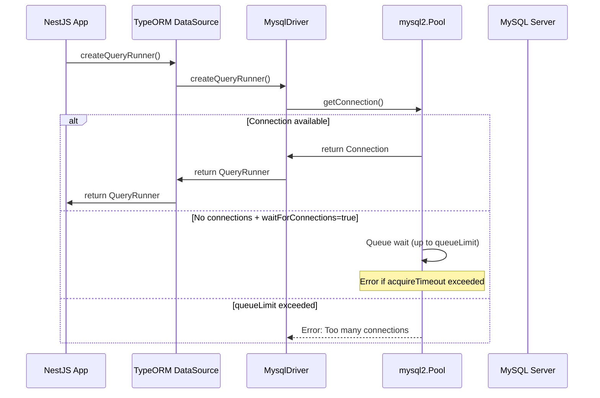
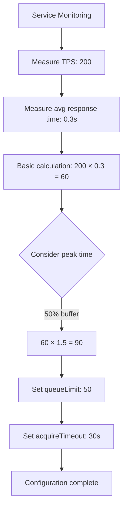
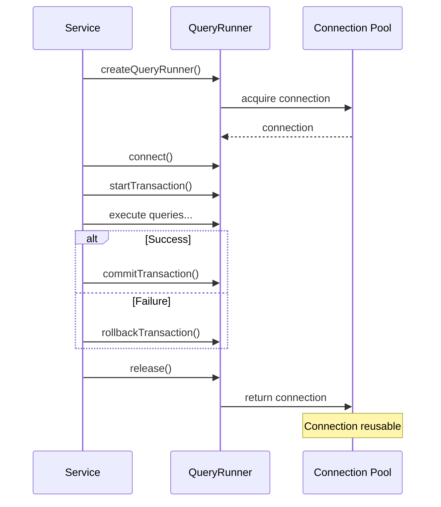

## Table of contents

## Introduction

I discovered it by chance during a code review. While reviewing cmong-be's TypeORM configuration file, I noticed there was absolutely no connection pool configuration. The `extra` option was missing, meaning we were relying solely on mysql2's default value of 10 connections.

No major issues had occurred yet. But I knew this was a problem we'd eventually face as the service grew and traffic increased. Reading Naver D2's ["Understanding Commons DBCP"](https://d2.naver.com/helloworld/5102792) article, I realized how critical connection pool configuration is and what problems can arise from improper settings.

In this article, I'll share how to apply Commons DBCP concepts to TypeORM and mysql2 environments, how to calculate appropriate connection counts using TPS formulas, and compare actual production code Before/After while explaining each configuration option in depth.

---

## 1. Context: Current Situation Analysis

### 1.1. About the cmong-be Service

cmong-be is a **multi-platform review management backend service**. It integrates review data from multiple platforms like Baemin and Coupang Eats, providing AI-powered automated response functionality.

**Tech Stack:**
- NestJS 10.4.11
- TypeORM 0.3.20
- mysql2 3.10.0
- SSH tunneling support (tunnel-ssh)

**Expected Traffic:**
- Peak TPS: 200~300
- Average TPS: 80~120
- General query response time: 50~100ms
- Complex transactions (payments, subscriptions): 200~500ms

### 1.2. Problem Discovery: No Connection Pool Configuration

During code review, I was shocked when I saw the TypeORM configuration in `app.module.ts`.

```typescript
// app.module.ts (lines 120-163)
TypeOrmModule.forRootAsync({
  type: 'mysql',
  host: dbHost,
  port: dbPort,
  username: configService.get<string>('DB_USERNAME'),
  password: configService.get<string>('DB_PASSWORD'),
  database: configService.get<string>('DB_DATABASE'),
  entities: [__dirname + '/entities/**/*.entity{.ts,.js}'],
  autoLoadEntities: true,
  namingStrategy: new SnakeNamingStrategy(),
  connectTimeout: 60000,  // ⚠️ 60 seconds is excessive
  timezone: 'Z',
  // ❌ No connection pool configuration (missing extra option)
  // ❌ Logging disabled (commented out)
})
```

**Issues Found:**

1. **Missing connection pool configuration**: No `extra` option, so only mysql2's default `connectionLimit: 10` is used
2. **Excessive connectTimeout**: 60 seconds is too long to wait during network instability
3. **Logging disabled**: No way to detect slow queries in production
4. **No acquireTimeout**: No limit on connection acquisition wait time

Initially, I thought "Wouldn't the default values be sufficient?" But my perspective changed after reading the Naver D2 article.

### 1.3. Why Improve Now?

**Why Preventive Improvement Matters:**

> "By properly using connection pool libraries, you can prevent issues from spreading throughout the application and database, and prevent temporary problems from persisting."
> — Naver D2, Understanding Commons DBCP

Currently, cmong-be uses many complex transaction patterns. Looking at `payment-db.service.ts`, there are transactions that update more than 5 tables in a single payment process. These transactions hold connections for an average of 300~500ms.

What if we receive TPS 200 requests during peak time? **By simple calculation, we need 200 × 0.3 seconds = 60 connections.** But we currently only have 10.

We also need to consider the SSH tunneling environment. In local development, we connect to the remote database through SSH tunnel, which adds approximately 50ms of additional latency.

---

## 2. Exploration: Commons DBCP vs mysql2 Connection Pool Architecture

### 2.1. Commons DBCP Internal Structure (Java Environment)

Let's first understand the core concepts of Commons DBCP explained in the Naver D2 article.

**GenericObjectPool Structure:**
- Commons DBCP uses Apache commons-pool's `GenericObjectPool`
- Manages connections using **LIFO (Last In First Out)** `CursorableLinkedList`
- Each connection is stored in `ObjectTimestampPair` structure (timestamp + connection reference)

**Evictor Thread:**
- Runs periodically in the background to manage idle connections
- Removes long-unused connections
- Performs validation checks (`testWhileIdle`)
- Maintains minimum number of connections (`minIdle`)

**Key Configuration Values:**
- `maxActive`: Maximum number of connections that can be used simultaneously
- `maxIdle`: Maximum number of connections that can be maintained when returned to pool
- `maxWait`: Wait time (milliseconds) when connection pool is exhausted
- `testWhileIdle`: Whether to validate idle connections

### 2.2. mysql2 Connection Pool Structure (Node.js Environment)

How is the mysql2 library's connection pool, used by TypeORM, different?

**PoolConnection Structure:**
- Based on Node.js `EventEmitter`
- Manages connections asynchronously with event-based approach
- Automatic management mechanism for connection reuse

**Internal Operation Flow:**



**Key Configuration Values:**
- `connectionLimit`: Maximum connections (Commons DBCP's maxActive)
- `waitForConnections`: Whether to wait when connections are depleted (default: true)
- `queueLimit`: Queue size (0 = unlimited)
- `acquireTimeout`: Connection acquisition timeout (milliseconds)

### 2.3. Core Concept Mapping: Commons DBCP ↔ mysql2

| Commons DBCP (Java) | mysql2 (Node.js) | Meaning |
|---------------------|------------------|---------|
| maxActive | connectionLimit | Maximum connections usable simultaneously |
| maxIdle | (auto-managed) | mysql2 internally manages idle connections |
| maxWait | acquireTimeout + waitForConnections | Connection acquisition wait time |
| testOnBorrow | (N/A) | mysql2 automatically validates |
| testWhileIdle | (auto-reconnect) | mysql2 automatically reconnects broken connections |
| Evictor thread | (internal mgmt) | mysql2 internally manages pool |

**Key Differences:**

1. **Java is synchronous, Node.js is asynchronous**: Commons DBCP uses thread-based synchronous processing, mysql2 uses event loop-based asynchronous processing
2. **Explicit vs automatic**: Commons DBCP requires many explicit configurations, mysql2 automatically manages most aspects
3. **Reconnection mechanism**: mysql2 automatically detects and reconnects broken connections

---

## 3. Decision: TPS-Based Connection Count Calculation

### 3.1. Applying Naver D2's TPS Calculation Formula

The most impressive part of the Naver D2 article was the **specific calculation formula**.

> "Since one request's response time is 500 milliseconds, when 5 idle connections are available in the pool, 5 requests can be processed simultaneously for 500 milliseconds. Therefore, 10 requests can be processed in 1 second, yielding a performance metric of 10 TPS."

**Formula: Required connections = TPS × Average response time (seconds)**

Let's apply this to cmong-be:



**Calculation Process:**

1. **Expected peak TPS**: 200
2. **Average response time**: 0.3 seconds (300ms)
   - General queries: 50~100ms
   - Complex transactions: 200~500ms
   - Weighted average: ~300ms
3. **Basic required connections**: 200 × 0.3 = **60**
4. **Add buffer**: 60 × 1.5 = **90**

Why add a 50% buffer? A lesson from the Naver D2 article:

> "When users suddenly surge or DBMS failures occur, improper configuration can greatly amplify the disaster, so caution is needed."

### 3.2. Detailed Analysis of mysql2 Connection Pool Options

Now let's deeply understand what each option means.

#### connectionLimit: Maximum Connection Count

```typescript
connectionLimit: 90  // TPS 200 × 0.3s × 1.5 buffer
```

**Meaning**: Maximum number of connections that can be opened simultaneously

**Tradeoffs**:
- ✅ Can handle high concurrency, reduced wait time
- ❌ Increased DB server memory usage (~4MB per connection, 90 = 360MB additional)
- ❌ Increased server resource consumption

**Considerations**:
- Must check MySQL server's `max_connections` setting
- Consider number of application server instances (3 instances = total 270 connections)

#### waitForConnections: Whether to Allow Waiting

```typescript
waitForConnections: true  // Allow waiting for connections
```

**Meaning**: Decides whether to wait or immediately throw error when connections are depleted

**If set to false**:
- Immediately throws error when no connections available
- Fail-fast strategy
- Users immediately receive "service unavailable" message

**If set to true**:
- Waits within `queueLimit` and `acquireTimeout` range
- Possible recovery from temporary overload
- Users may receive normal response after brief wait

#### queueLimit: Queue Size

```typescript
queueLimit: 50  // Queue size (for fast failure)
```

**Meaning**: Maximum number of requests that can enter the connection wait queue

**Why set to 50?**:
- About 55% of connectionLimit of 90
- Too large: Excessive response wait time
- Too small: Errors even during temporary overload

Lesson from Naver D2:

> "How you set the maxWait value determines the overall robustness of the system when it's temporarily overloaded."

#### acquireTimeout: Connection Acquisition Timeout

```typescript
acquireTimeout: 30000  // 30 seconds
```

**Meaning**: Maximum wait time to acquire a connection

**Why 30 seconds?**

The most impressive part from the Naver D2 article:

> "In the end, resources are wasted responding to requests that no one is waiting for. A maxWait value exceeding what users can tolerate is meaningless."

- Users typically leave if there's no response within 2-3 seconds
- But **30 seconds** is set to allow "intermittent errors"
- Sometimes it's better to wait a bit and receive a normal response than to immediately error

### 3.3. Additional TypeORM Options

#### connectTimeout: TCP Connection Timeout

```typescript
connectTimeout: 10000  // 10 seconds (60 was excessive)
```

**Meaning**: Timeout when attempting TCP connection to MySQL server

**Why reduced to 10 seconds?**:
- 60 seconds is too long to wait during network instability
- Even in SSH tunneling environments, 10 seconds is sufficient
- Faster failure provides retry opportunity

#### maxQueryExecutionTime: Slow Query Detection

```typescript
maxQueryExecutionTime: 1000  // Warn for queries over 1 second
```

**Meaning**: Logs warning when query execution time exceeds this value

**Why needed?**:
- Early detection of missing indexes, N+1 problems
- Monitor performance issues in production
- 1 second is appropriate threshold for typical web requests

#### logging: Production Logging

```typescript
logging: ['error', 'warn']  // Log only errors and warnings
```

**Why not log all queries?**:
- Logging all queries in production causes excessive I/O
- Only errors and warnings are sufficient for diagnostics
- Can change to `['query', 'error']` for debugging when needed

### 3.4. Tradeoff Analysis

**When increasing connection count:**
- ✅ Can handle high concurrency
- ✅ Reduced wait time
- ❌ Increased DB server memory usage (90 × 4MB = 360MB)
- ❌ Increased server resource consumption

**When setting queueLimit:**
- ✅ Fast failure during overload → protects entire system
- ❌ Possible errors even during temporary overload

**In SSH tunneling environment:**
- ⚠️ Additional ~50ms latency
- ⚠️ Local port constraints (possible ephemeral port shortage)
- ⚠️ Reconnection needed when tunnel disconnects

---

## 4. Implementation: Before/After Code

### 4.1. Before: Current Configuration (Issues Highlighted)

Actual code from `app.module.ts`. Lines 120-163 show completely missing connection pool configuration.

```typescript
// app.module.ts (lines 120-163)
TypeOrmModule.forRootAsync({
  imports: [SSHTunnelModule],
  useFactory: async (sshTunnelService: SSHTunnelService, configService: ConfigService) => {
    // SSH tunneling logic
    let dbHost = configService.get<string>('DB_HOST');
    let dbPort = Number(configService.get<string>('DB_PORT'));

    if (sshTunnelService.isSSHTunnelEnabled()) {
      const { port: localPort } = await sshTunnelService.createTunnel(
        dbHost,
        dbPort,
      );
      dbHost = '127.0.0.1';
      dbPort = localPort;
    }

    return {
      type: 'mysql',
      host: dbHost,
      port: dbPort,
      username: configService.get<string>('DB_USERNAME'),
      password: configService.get<string>('DB_PASSWORD'),
      database: configService.get<string>('DB_DATABASE'),
      entities: [__dirname + '/entities/**/*.entity{.ts,.js}'],
      autoLoadEntities: true,
      namingStrategy: new SnakeNamingStrategy(),
      connectTimeout: 60000,  // ❌ Excessively long timeout (60s)
      timezone: 'Z',
      // ❌ No connection pool config → uses mysql2 default of 10
      // ❌ Logging disabled (commented out)
    };
  },
  inject: [SSHTunnelService, ConfigService],
})
```

**Issues Summary:**

1. **No `extra` option**: Uses mysql2's default `connectionLimit: 10`
   - Far below the 60~90 connections needed for peak TPS 200
2. **`connectTimeout: 60000`**: Waits 60 seconds during network instability
   - Users may have already left the page
3. **Logging disabled**: Cannot detect slow queries
4. **No `acquireTimeout`**: No limit on connection acquisition wait time

### 4.2. After: Improved Configuration (Recommended)

```typescript
// app.module.ts - Improved version
TypeOrmModule.forRootAsync({
  imports: [SSHTunnelModule],
  useFactory: async (sshTunnelService: SSHTunnelService, configService: ConfigService) => {
    // SSH tunneling logic (same)
    let dbHost = configService.get<string>('DB_HOST');
    let dbPort = Number(configService.get<string>('DB_PORT'));

    if (sshTunnelService.isSSHTunnelEnabled()) {
      const { port: localPort } = await sshTunnelService.createTunnel(
        dbHost,
        dbPort,
      );
      dbHost = '127.0.0.1';
      dbPort = localPort;
    }

    return {
      type: 'mysql',
      host: dbHost,
      port: dbPort,
      username: configService.get<string>('DB_USERNAME'),
      password: configService.get<string>('DB_PASSWORD'),
      database: configService.get<string>('DB_DATABASE'),
      entities: [__dirname + '/entities/**/*.entity{.ts,.js}'],
      autoLoadEntities: true,
      namingStrategy: new SnakeNamingStrategy(),

      // ✅ Explicit connection pool configuration
      extra: {
        connectionLimit: 90,          // TPS 200 × 0.3s = 60 + 50% buffer
        waitForConnections: true,     // Allow waiting for connections
        queueLimit: 50,               // Queue size (fast failure)
        acquireTimeout: 30000,        // Error if not acquired within 30s
      },

      // ✅ Appropriate timeout settings
      connectTimeout: 10000,          // Reduced to 10s (60s was excessive)

      // ✅ Enable production logging
      logging: ['error', 'warn'],     // Log only errors and warnings
      maxQueryExecutionTime: 1000,    // Warn for queries over 1 second

      timezone: 'Z',
    };
  },
  inject: [SSHTunnelService, ConfigService],
})
```

**Improvements Summary:**

| Item | Before | After | Reason |
|------|--------|-------|--------|
| connectionLimit | 10 (default) | 90 | TPS 200 × 0.3s × 1.5 |
| acquireTimeout | None | 30000ms | Clear error if not acquired within 30s |
| queueLimit | 0 (unlimited) | 50 | Fast failure during overload |
| connectTimeout | 60000ms | 10000ms | Faster failure for retry opportunity |
| logging | Disabled | ['error', 'warn'] | Enable diagnostics |
| maxQueryExecutionTime | None | 1000ms | Auto-detect slow queries |

### 4.3. TransactionManagerService Pattern

cmong-be already has an excellent transaction management pattern. Looking at `transaction-manager.service.ts`, it's implemented to **always call `queryRunner.release()` in a finally block**.

```typescript
// transaction-manager.service.ts (lines 22-51)
async executeInTransaction<T>(operation: (queryRunner: QueryRunner) => Promise<T>): Promise<T> {
  const queryRunner = this.dataSource.createQueryRunner();

  try {
    await queryRunner.connect();
    await queryRunner.startTransaction();

    this.logger.debug('Transaction started');

    const result = await operation(queryRunner);

    await queryRunner.commitTransaction();
    this.logger.debug('Transaction committed');

    return result;
  } catch (error) {
    await queryRunner.rollbackTransaction();

    this.logger.error('Transaction rolled back', {
      error: error.message,
      stack: error.stack,
    });

    throw error;
  } finally {
    // ✅ Always release in finally block
    await queryRunner.release();
    this.logger.debug('Transaction connection released');
  }
}
```

**Key Points:**

1. **Using finally block**: Returns connection regardless of success/failure
2. **Preventing connection leaks**: Always calls release even when exceptions occur
3. **Logging**: Logs all transaction start/commit/rollback/release

**What if there's no finally block?**

```typescript
// ❌ Bad example
async badTransaction() {
  const queryRunner = this.dataSource.createQueryRunner();
  await queryRunner.connect();
  await queryRunner.startTransaction();

  // ... operations

  await queryRunner.commitTransaction();
  await queryRunner.release();  // ❌ Won't be called if error occurs!
}
```

If an exception occurs, `release()` won't be called, causing a **connection leak**. Even with connectionLimit of 90, leaks will eventually exhaust all connections.

### 4.4. Complex Transaction Example

Looking at the payment process in `payment-db.service.ts`, we can see why connection pool configuration is critical.

```typescript
// payment-db.service.ts (simplified)
async paymentDBprocess(paymentAnnotation: PaymentAnnotation): Promise<Billing> {
  const queryRunner = this.dataSource.createQueryRunner();

  try {
    await queryRunner.connect();
    await queryRunner.startTransaction();

    // 1. Create billing key
    await queryRunner.manager.save(newBillingKey);

    // 2. Deactivate existing subscription
    await queryRunner.manager.save(updatePrevSubscription);

    // 3. Create new subscription
    const _subscription = await queryRunner.manager.save(newSubscription);

    // 4. Create new billing
    const savedBilling = await queryRunner.manager.save(newBilling);

    // 5. Activate shop
    await queryRunner.manager.update(Shop, displayOnlyShop.shop_id, {
      is_active: SHOP_IS_ACTIVE.ACTIVE,
    });

    await queryRunner.commitTransaction();

    return savedBilling;
  } catch (e) {
    await queryRunner.rollbackTransaction();

    // Cancel payment
    await this.portonePaymentService.cancelPayment({
      imp_uid: paymentAnnotation.imp_uid,
      reason: 'Payment cancelled due to save failure',
    });

    throw e;
  } finally {
    // ✅ Guarantee connection release
    await queryRunner.release();
  }
}
```

**Why are such transactions problematic?**

1. **Long holding time**: 5 table updates + external API call → average 300~500ms
2. **High frequency**: Payment is core business functionality → many concurrent requests
3. **Rollback + external API on error**: Additional time for Portone API call on failure

If connectionLimit is only 10, **only 10 people can pay simultaneously**. The 11th user onwards will wait or receive errors.

---

## 5. Advanced: Deep Dive Topics

### 5.1. SSH Tunneling Environment Specifics

cmong-be connects to the remote database through SSH tunneling in development environment. Looking at `ssh-tunnel.service.ts`, it uses the `tunnel-ssh` library.

```typescript
// ssh-tunnel.service.ts (lines 54-144)
async createTunnel(
  dstHost: string = 'localhost',
  dstPort: number = 3306,
): Promise<{ host: string; port: number }> {
  // ... Load SSH configuration

  // Find available local port
  this.localPort = await this.findAvailablePort(0);

  // Create SSH tunnel
  const [server, conn] = await createTunnel(
    tunnelOptions,
    serverOptions,
    sshOptions,
    forwardOptions,
  );

  this.logger.log(
    `SSH tunnel established: localhost:${this.localPort} -> ${sshHost}:${sshPort} -> ${dstHost}:${dstPort}`,
  );

  return {
    host: '127.0.0.1',
    port: this.localPort,
  };
}
```

**Additional Considerations for SSH Tunneling:**

1. **Additional latency (~50ms)**:
   - Local → SSH server → Database server
   - Already reflected in average response time

2. **Local port allocation**:
   - `findAvailablePort(0)` for OS auto-allocation
   - Assigned from ephemeral port range

3. **Tunnel disconnection**:
   - Tunnel reconnection needed during network instability
   - `connectTimeout: 10000` for fast failure → retry

### 5.2. QueryRunner and Connection Relationship

What happens internally when calling `createQueryRunner()` in TypeORM?



**Important Facts:**

- `createQueryRunner()` doesn't immediately acquire connection
- Only when `connect()` is called does it actually get connection from pool
- `release()` returns connection to pool (doesn't close it!)

**DataSource.driver.pool Structure:**

```typescript
// mysql2 Pool internal structure (simplified)
{
  _allConnections: [],          // All connection array
  _freeConnections: [],         // Available connections
  _acquiringConnections: [],    // In-use connections
  _connectionQueue: [],         // Waiting requests
  config: {
    connectionLimit: 90,
    waitForConnections: true,
    queueLimit: 50,
    acquireTimeout: 30000,
  }
}
```

### 5.3. Batch Processing Optimization

Looking at `TransactionManagerService.executeBatchInTransaction`, the default batch size is 100.

```typescript
// transaction-manager.service.ts (lines 86-106)
async executeBatchInTransaction<T, R>(
  items: T[],
  operation: (queryRunner: QueryRunner, batch: T[]) => Promise<R>,
  batchSize: number = 100,  // ⚠️ Default 100
): Promise<R[]> {
  return await this.executeInTransaction(async (queryRunner) => {
    const results: R[] = [];

    for (let i = 0; i < items.length; i += batchSize) {
      const batch = items.slice(i, i + batchSize);
      const batchResult = await operation(queryRunner, batch);
      results.push(batchResult);

      this.logger.debug(
        `Batch processed: ${i + 1}-${Math.min(i + batchSize, items.length)}/${items.length}`,
      );
    }

    return results;
  });
}
```

**Why batch size of 100?**

- **Too small**: Increased transaction overhead
- **Too large**: Increased memory usage, longer connection holding time

**Connection holding time during batch processing:**
- Processing 1,000 items: 10 batches × 100ms each = ~1 second
- Holds 1 connection for this 1 second
- If 10 batch jobs run simultaneously → holds 10 connections

### 5.4. Monitoring and Debugging

Let's create a service to monitor connection pool status.

```typescript
@Injectable()
export class DatabaseHealthService {
  constructor(private readonly dataSource: DataSource) {}

  async getPoolStatus() {
    const pool = (this.dataSource.driver as any).pool;

    return {
      totalConnections: pool._allConnections.length,
      activeConnections: pool._acquiringConnections.length,
      idleConnections: pool._freeConnections.length,
      queuedRequests: pool._connectionQueue.length,
      connectionLimit: pool.config.connectionLimit,
      utilizationRate: (pool._acquiringConnections.length / pool.config.connectionLimit) * 100,
    };
  }

  @Cron('*/5 * * * *') // Check every 5 minutes
  async checkPoolHealth() {
    const status = await this.getPoolStatus();

    if (status.utilizationRate > 80) {
      // Warn if over 80% usage
      this.logger.warn('High connection pool utilization', status);
    }

    if (status.queuedRequests > 10) {
      // Warn if over 10 queued requests
      this.logger.warn('Connection wait queue increasing', status);
    }
  }
}
```

**Monitoring Metrics:**

1. **utilizationRate**: Connection usage rate (warn if over 80%)
2. **queuedRequests**: Number of waiting requests (warn if over 10)
3. **idleConnections**: Number of idle connections (wasteful if too many)

**Stack trace during pool exhaustion:**

Like the example in the Naver D2 article, you'll see stack traces like this during connection exhaustion:

```
Error: Connection acquisition timeout
    at Pool.<anonymous> (mysql2/lib/pool.js:42:21)
    at Object.onceWrapper (events.js:421:28)
    at Pool.emit (events.js:315:20)
    at Pool._acquireConnection (mysql2/lib/pool.js:85:10)
```

---

## 6. Outcome: Recommended Settings and Checklist

### 6.1. Final Recommended Settings Summary

**Settings by Environment:**

| Environment | connectionLimit | queueLimit | acquireTimeout | connectTimeout |
|-------------|-----------------|------------|----------------|----------------|
| Development | 20 | 10 | 10000 | 5000 |
| QA | 50 | 30 | 20000 | 10000 |
| Production | 90 | 50 | 30000 | 10000 |

**Guide by Service Scale:**

| Scale | TPS | Avg Response Time | Required Connections | Recommended |
|-------|-----|-------------------|----------------------|-------------|
| Small | ~50 | 0.2s | 10 | 15 (50% buffer) |
| Medium | 50~200 | 0.3s | 60 | 90 (50% buffer) |
| Large | 200~500 | 0.3s | 150 | 200 (30% buffer) |

### 6.2. Configuration Checklist

When configuring connection pool, verify these items:

**Required Items:**
- [ ] Measured TPS and average response time?
- [ ] Calculated using `Required connections = TPS × Avg response time (seconds)`?
- [ ] Added peak time buffer (30~50%)?
- [ ] Checked MySQL server's `max_connections` setting?
- [ ] Considered number of application server instances?

**Recommended Items:**
- [ ] Explicitly set `extra.connectionLimit`?
- [ ] Set `extra.waitForConnections = true`?
- [ ] Appropriately set `extra.queueLimit`? (50~60% of connectionLimit)
- [ ] Set `extra.acquireTimeout` considering user wait time? (20~30s)
- [ ] Set `connectTimeout` to 10s or less?
- [ ] Enabled `logging`? (at least ['error', 'warn'])
- [ ] Set `maxQueryExecutionTime` to detect slow queries? (1000ms)

**Code Patterns:**
- [ ] Guarantee `queryRunner.release()` in finally block?
- [ ] Minimizing transaction holding time?
- [ ] Using appropriate batch size for batch processing? (100~500)

**Monitoring:**
- [ ] Periodically monitoring connection pool status?
- [ ] Warning when utilization exceeds 80%?
- [ ] Warning when wait queue increases?

### 6.3. Lessons Learned

The most important lessons from this process:

1. **"Don't rely on defaults, configure explicitly"**
   - mysql2's default of 10 is insufficient for most production environments
   - Must explicitly configure based on service characteristics

2. **"Understanding Commons DBCP helps understand mysql2"**
   - Commons DBCP contains long-standing know-how from Java ecosystem
   - Core concepts apply equally to mysql2

3. **"TPS calculation formula must be verified with actual traffic"**
   - `Required connections = TPS × Average response time (seconds)`
   - Calculate with measured values, not estimates

4. **"Consider user patience time"**
   - acquireTimeout that's too long is meaningless
   - Fast failure is sometimes the better choice

5. **"Consider additional latency in SSH tunneling"**
   - About 50ms additional latency
   - Reflect in connectTimeout and acquireTimeout settings

6. **"Prevent connection leaks with finally blocks"**
   - Always call release even when exceptions occur
   - Utilize TransactionManagerService pattern

---

## 7. References

### 7.1. Official Documentation

1. **TypeORM Data Source Options**
   - URL: [https://typeorm.io/data-source-options](https://typeorm.io/data-source-options)
   - Explains `extra`, `logging`, `maxQueryExecutionTime` options

2. **mysql2 Pool Options**
   - URL: [https://github.com/sidorares/node-mysql2#pool-options](https://github.com/sidorares/node-mysql2#pool-options)
   - Detailed explanation of `connectionLimit`, `waitForConnections`, `queueLimit`, `acquireTimeout`

3. **NestJS Database Integration**
   - URL: [https://docs.nestjs.com/techniques/database](https://docs.nestjs.com/techniques/database)
   - `forRootAsync` pattern, dynamic configuration methods

4. **MySQL Connection Pooling**
   - URL: [https://dev.mysql.com/doc/refman/8.0/en/connection-pooling.html](https://dev.mysql.com/doc/refman/8.0/en/connection-pooling.html)
   - Server-side connection limits (`max_connections`)

### 7.2. Reference Materials

5. **Naver D2 - Understanding Commons DBCP**
   - URL: [https://d2.naver.com/helloworld/5102792](https://d2.naver.com/helloworld/5102792)
   - TPS calculation formula, GenericObjectPool structure, Evictor thread, maxWait philosophy

6. **Node.js Event Loop and Concurrency Model**
   - URL: [https://nodejs.org/en/docs/guides/event-loop-timers-and-nexttick/](https://nodejs.org/en/docs/guides/event-loop-timers-and-nexttick/)
   - Understanding asynchronous event-based connection management

7. **HikariCP - About Pool Sizing**
   - URL: [https://github.com/brettwooldridge/HikariCP/wiki/About-Pool-Sizing](https://github.com/brettwooldridge/HikariCP/wiki/About-Pool-Sizing)
   - `connections = ((core_count) × 2) + effective_spindle_count` formula
   - Methods for determining appropriate pool size

8. **TypeORM GitHub Issues**
   - #3388: Connection pool exhaustion
   - #6327: acquireTimeout not working
   - Real user problem cases and solutions

---

## Conclusion

Initially, I thought "Wouldn't the default values be sufficient?" But my perspective changed after reading the Naver D2 article and analyzing cmong-be's complex transaction logic.

Connection pool configuration is a prime example of **preventive improvement**. No problems have occurred yet, but it's an issue we'll inevitably face as the service grows. It's far better to take the time now to properly understand and configure it rather than rushing to respond when problems arise.

The TPS calculation formula (`Required connections = TPS × Average response time (seconds)`) is simple yet powerful. Remembering just this one formula enables you to reasonably determine the appropriate connection count for your service.

Finally, what I learned from applying Commons DBCP philosophy to the TypeORM/mysql2 environment is that **fundamental principles transcend languages and frameworks**. Java's GenericObjectPool and Node.js's mysql2 Pool differ in implementation, but share the core goal of efficiently managing connections.

I hope this article helps your service as well. If you're struggling with connection pool configuration, check through the above checklist one by one. And above all, **don't rely on defaults, configure explicitly.**
