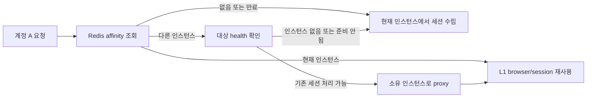

## Table of contents

> **TL;DR**
>
> 여러 스크래퍼 인스턴스가 있을 때 같은 계정의 요청을 아무 인스턴스나 처리하게 두면, 기존 브라우저 세션을 못 찾아 다시 로그인하고, 같은 page를 여러 요청이 동시에 조작할 수 있습니다.
>
> 처음에는 로그인만 single-flight로 합치면 된다고 생각했습니다. 하지만 로그인 뒤의 조회·댓글 등록·관리 작업도 같은 브라우저와 세션을 공유했습니다. 로그인 하나만 합쳐서는 공유 page에서 일어나는 동시 작업을 막지 못했습니다.
>
> 그래서 이 구조는 두 경계를 분리했습니다.
>
> 1. Redis의 affinity는 `플랫폼 + 계정`을 기존 세션이 있는 **인스턴스**로 보냅니다.
> 2. 인스턴스 안의 account lock은 같은 계정의 **세션 작업**을 REST·메시징·관리 경로 전체에서 한 번에 하나씩 실행합니다.
>
> 소유 인스턴스가 사라지면 Redis에 남은 위치 정보만 믿지 않습니다. health check로 기존 세션을 처리할 수 있는지 확인하고, 불가능하면 새 인스턴스에서 세션을 다시 수립합니다. 죽은 프로세스의 L1 메모리 세션을 옮겨 쓰는 것이 아니라, 잘못된 위치로 계속 보내지 않는 failover입니다.

### 이 글에서 확인한 범위

| 항목 | 검증 근거 |
| --- | --- |
| 출발 문제 | 로그인만 coalesce한 뒤에도 계정별 후속 작업이 공유 browser/page에서 동시 실행됨 |
| 라우팅 키 | `플랫폼 + 계정 ID` → `instanceId`, `sessionId`, TTL을 Redis에 저장 |
| 재사용 경로 | affinity 대상 인스턴스가 health check를 통과하면 HTTP proxy로 기존 세션을 사용 |
| 직렬화 경계 | REST·메시징·관리 작업이 같은 계정 lock을 공유 |
| lock의 범위 | 로그인뿐 아니라 조회·댓글 등록·검증 등 세션을 사용하는 전체 작업 경계 |
| 장애 전환 | 기존 인스턴스가 건강하지 않으면 local fallback에서 새 세션을 수립 |
| 확인하지 않은 범위 | 죽은 인스턴스의 in-memory 세션 자체를 다른 인스턴스로 이전하는 것 |

---

## 0. 시작 — 세션은 Redis에 있지 않고, worker의 메모리에 있었다

브라우저 자동화의 세션은 단순한 cookie 문자열이 아닙니다. browser process, context, page, 로그인 뒤의 화면 상태와 연결돼 있습니다. 그래서 같은 계정으로 요청이 들어왔을 때 이미 로그인한 인스턴스가 있다면, 그 인스턴스를 활용하는 편이 새 browser와 로그인을 만드는 것보다 훨씬 안전하고 빠릅니다.

문제는 load balancer가 세션의 위치를 알지 못한다는 점입니다.

```text
계정 A의 첫 요청 → 인스턴스 blue에서 로그인 → blue의 L1 메모리에 세션 존재
계정 A의 다음 요청 → 인스턴스 green으로 라우팅
                     → green은 A의 세션을 모름
                     → 새 browser / 새 login / 기존 세션과 충돌 가능성
```

여기서 필요한 것은 모든 세션을 Redis에 직렬화하는 일이 아니었습니다. browser object와 page는 프로세스 메모리에 남아야 합니다. 필요한 것은 **세션이 어느 인스턴스에 있는지 알려 주는 작은 directory**였습니다.

## 1. Redis affinity는 세션 저장소가 아니라 위치 안내자다

로그인에 성공한 인스턴스는 다음처럼 계정별 위치 정보를 Redis에 기록합니다.

```text
key:   instance-affinity:{platform}:{accountId}
value: { instanceId, sessionId, lastSeenAt }
TTL:   세션 재사용 정책에 맞춘 제한 시간
```

다음 요청이 어느 인스턴스에 도착하든 먼저 이 key를 조회합니다.



여기서 Redis 값은 session body가 아닙니다. `instanceId`와 `sessionId`는 “현재 세션을 찾을 가능성이 있는 곳”을 가리키는 pointer입니다. 실제 browser와 가장 빠른 세션 cache는 그 인스턴스의 L1 메모리에 있습니다.

이 구분은 장애 때 특히 중요합니다. blue가 종료됐다면 blue의 L1 메모리는 함께 사라집니다. green이 Redis pointer를 읽었다고 blue의 browser session을 이어받을 수는 없습니다. health check가 실패하면 green은 잘못된 pointer로 proxy하지 않고, 자기 browser에서 계정 A의 세션을 새로 수립합니다.

> affinity는 세션을 복제하는 장치가 아니라, 살아 있는 세션을 찾을 때까지 같은 위치로 보내고 죽은 위치는 포기하는 장치다.

## 2. 로그인만 single-flight로 합치면 충분하다고 생각했다

같은 계정의 동시 로그인 요청을 하나로 합치는 single-flight는 처음에는 합리적으로 보였습니다.

```text
요청 10개 동시 도착
→ 첫 요청만 로그인 실행
→ 나머지는 첫 로그인 Promise를 기다림
→ 로그인 완료 뒤 각 요청이 후속 작업 수행
```

하지만 문제는 마지막 줄이었습니다. 로그인 이후의 리뷰 조회, 주문 조회, 댓글 등록, 검증 작업도 같은 account session과 browser page를 사용합니다. 로그인 Promise 하나를 공유한 뒤 10개 요청이 동시에 후속 작업을 실행하면, page navigation·cookie 갱신·화면 상태가 서로 섞입니다.

실제 변경에서는 로그인 single-flight를 제거하고, 세션을 쓰는 **작업 경계 전체**를 계정 ID 기준으로 직렬화했습니다. 동시에 많은 요청이 들어온 상황에서 로그인만 합치는 방식이 공유 page의 후속 작업 폭주를 막지 못했고, 일부 조회 흐름에는 무제한 fan-out도 있었기 때문입니다.

## 3. lock은 로그인 함수가 아니라 진입 경계에 뒀다

세션 직렬화는 특정 서비스 메서드 하나에만 붙이면 쉽게 우회됩니다. HTTP API는 lock을 잡지만 메시지 consumer나 운영용 관리 API가 같은 계정을 직접 호출하면, 다시 page를 동시에 조작할 수 있습니다.

그래서 lock을 도메인 구현이 아니라 세션 작업의 진입 경계에 적용했습니다.

```text
REST 요청 ───────┐
메시지 consumer ─┼─→ accountId lock → 세션/브라우저 작업 → release
관리·검증 요청 ─┘
```

같은 계정은 하나의 queue로 직렬화하고, 다른 계정은 서로 막지 않습니다. 이 방식은 단일 전역 mutex보다 병렬성을 훨씬 덜 훼손합니다.

| 요청 조합 | 결과 |
| --- | --- |
| 계정 A 리뷰 조회 + 계정 A 댓글 등록 | 순차 실행 |
| 계정 A 리뷰 조회 + 계정 B 댓글 등록 | 병렬 실행 가능 |
| REST의 계정 A 요청 + 메시지의 계정 A 요청 | 같은 lock을 공유해 순차 실행 |
| owner 인스턴스로 proxy된 계정 A 요청 | owner의 동일 경계에서 처리 |

### 3.1 긴 작업에서 timeout은 취소가 아니다

세션 작업은 browser login, page load, 외부 응답 때문에 오래 걸릴 수 있습니다. lock이 영원히 잡히는 것을 막기 위한 timeout backstop은 필요하지만, timeout이 기존 browser 작업을 실제로 취소하지는 못합니다.

```text
worker A: 계정 A lock 보유, 외부 응답 대기
timeout: lock 강제 해제
worker B: 계정 A lock 획득, 다음 작업 시작
worker A: 실제 browser 작업은 아직 끝나지 않음
```

따라서 강제 해제는 정상적인 동시성 제어가 아니라 가용성을 위한 마지막 장치입니다. 구현은 획득 세대별 owner를 구분해, 늦게 끝난 A의 release가 B의 lock 회계나 상태를 지우지 못하게 했고, 강제 해제 자체를 관측 지표로 남깁니다.

이것은 “timeout이 있으니 안전하다”가 아니라, timeout이 발화한 순간 직렬화 보장이 약해졌다는 운영 신호입니다. 이 수치가 지속된다면 timeout만 늘릴 일이 아니라 browser 작업의 timeout·취소·용량을 다시 봐야 합니다.

## 4. affinity와 직렬화는 대체 관계가 아니다

둘 다 계정 ID를 쓰지만 역할은 다릅니다.

| 설계 | 답하는 질문 | 실패하면 생기는 일 |
| --- | --- | --- |
| instance affinity | 이 계정의 기존 세션은 어느 인스턴스에 있나? | session reuse를 놓치고 새 로그인 비용이 생김 |
| account lock | 이 계정의 세션 작업을 지금 누가 실행 중인가? | 공유 browser/page 작업이 충돌할 수 있음 |
| L1 session cache | owner 인스턴스에서 세션을 가장 빠르게 찾을 수 있는가? | Redis·새 browser 경로로 내려가 지연이 커짐 |

affinity만 있다면 같은 owner 인스턴스 안에서 두 요청이 동시에 browser를 조작할 수 있습니다. 반대로 lock만 있다면 요청이 매번 다른 인스턴스로 갈 수 있어 기존 browser session을 계속 버리게 됩니다. L1 cache만 있다면 다른 인스턴스는 그 cache의 존재 자체를 알 수 없습니다.

세 층을 같이 둔 이유는 각 층이 다음 층의 일을 대신하지 못하기 때문입니다.

```text
Redis affinity:       어디로 보낼까?
account lock:         그곳에서 누가 먼저 쓸까?
L1 session cache:     이미 만든 세션을 어떻게 빨리 찾을까?
```

## 5. 장애 전환에서 보장하는 것과 보장하지 않는 것

소유 인스턴스가 사라졌을 때의 목표는 “원래 browser를 계속 사용한다”가 아닙니다. 불가능한 약속입니다. 목표는 stale affinity가 새 요청을 죽은 인스턴스로 계속 보내지 않게 하는 것입니다.

| 상황 | 처리 | 결과 |
| --- | --- | --- |
| owner가 healthy, 기존 세션 처리 가능 | owner로 proxy | L1 session 재사용 |
| owner가 healthy지만 새 browser를 받을 여유 없음 | 기존 세션 요청만 owner로 proxy | 기존 세션과 새 launch의 admission을 분리 |
| owner health check 실패 | local fallback | 새 인스턴스에서 세션 수립 |
| affinity key 없음·만료 | local 처리 | 필요하면 새 session과 새 affinity 기록 |

이 경로에서 Redis TTL과 refresh는 중요합니다. owner만 자신이 가진 `instanceId + sessionId` 조합과 일치할 때 TTL을 갱신하거나 key를 삭제하게 해서, 이전 owner가 새 owner의 pointer를 지우는 것을 막습니다.

## 6. 이 글에서 request token을 중심에 두지 않은 이유

메시지 재전달에서 같은 외부 쓰기를 두 번 실행하지 않기 위한 request-level idempotency는 별도의 문제입니다. 하지만 여기서 그것을 세션 lock의 핵심으로 설명하면 두 역할을 섞게 됩니다.

- account affinity와 account lock은 **세션·browser 재사용과 충돌 방지**를 다룹니다.
- request idempotency는 **동일한 업무 요청의 외부 효과 중복**을 다룹니다.

현재 운영 경로에서 먼저 드러난 병목은 같은 세션을 여러 요청이 동시에 만지는 문제였고, 그 해결의 중심은 affinity와 계정 단위 직렬화였습니다. request token은 이 글의 주장이 아니라, broker 재전달 같은 더 좁은 failure window에서 고려할 수 있는 보조 안전망으로 남겨 두는 편이 정확합니다.

## 7. 면접에서 설명한다면

이 구조를 “Redis cache를 붙여 세션을 재사용했습니다”로 말하면 중요한 판단이 사라집니다. 다음 순서가 더 정확합니다.

1. browser session은 process-local state라 인스턴스를 무작위로 고르면 재사용할 수 없었다.
2. Redis에는 세션 본문이 아니라 owner location만 저장해, 기존 세션이 있는 인스턴스로 요청을 보냈다.
3. 로그인 single-flight만으로는 이후 page 작업의 동시 실행을 막지 못했다.
4. REST·메시징·관리 경로를 하나의 account lock으로 모아 세션 작업 경계를 직렬화했다.
5. owner가 죽으면 L1을 옮겨 쓴다고 주장하지 않고, health check 실패 뒤 새 인스턴스에서 세션을 다시 수립하도록 했다.
6. lock timeout의 강제 해제는 정상 해법이 아니라 관측·조사가 필요한 backstop으로 취급했다.

## 8. 마치며 — 세션을 공유하지 않고, 세션의 소유권을 공유했다

여러 인스턴스에 browser session을 복제하려 하면 cookie, page, proxy, 로그인 상태의 일관성 문제가 따라옵니다. 이 구조는 세션 자체를 공유하려 하지 않았습니다.

대신 계정별로 “현재 세션은 어디에 있는가”를 공유하고, 그 소유 인스턴스 안에서는 같은 세션 작업을 직렬화했습니다. owner가 사라진 경우에도 죽은 메모리를 되살리려 하지 않고, 건강한 인스턴스가 새 세션을 수립하도록 실패 경계를 분명히 했습니다.

다음 글에서는 이 세션 소유권을 유지해도 남는 문제, 즉 browser process와 proxy가 만드는 실제 용량 경계를 다룹니다.

## References

### 구현과 검증 기록

- 계정별 Redis instance affinity와 owner health check 기반 proxy
- 계정별 session lock을 REST·메시징·관리 경계에 적용한 변경
- 로그인 single-flight 제거와 후속 작업 boundary 직렬화
- lock 세대 guard, mutex prune, force-release 관측 지표

### 참고 자료

- [Redis key expiration](https://redis.io/docs/latest/commands/expire/) — TTL 기반 location pointer의 만료 정책
- [Redis Lua scripting](https://redis.io/docs/latest/develop/programmability/eval-intro/) — owner 일치 조건을 포함한 원자적 refresh와 clear
