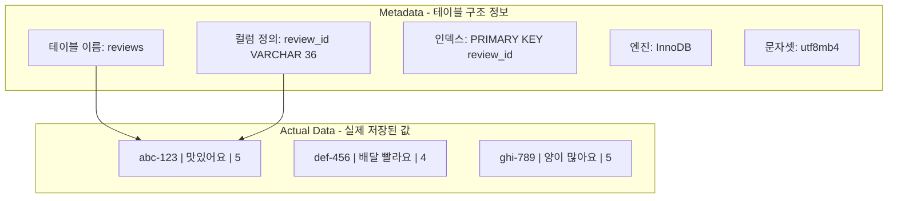
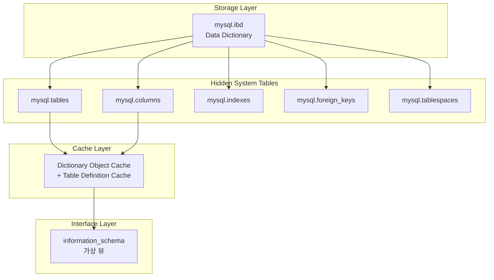
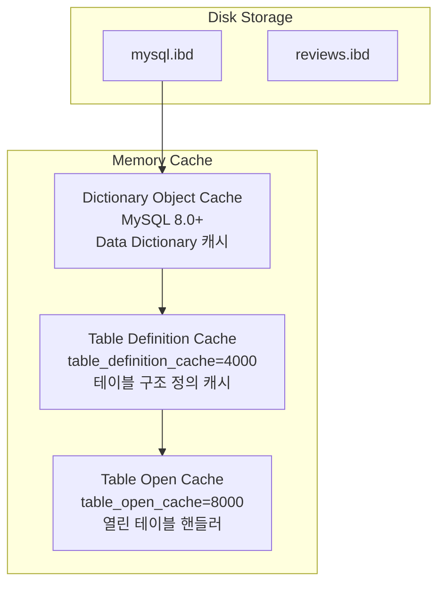
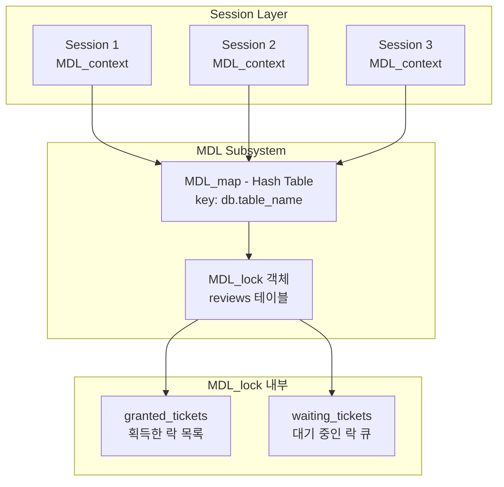
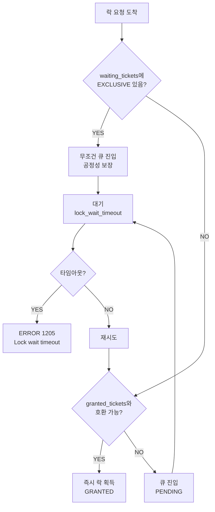
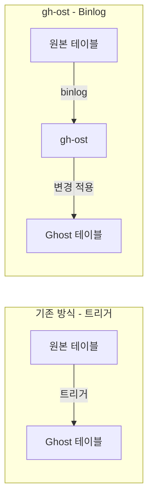
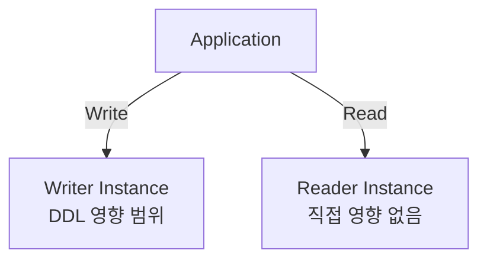
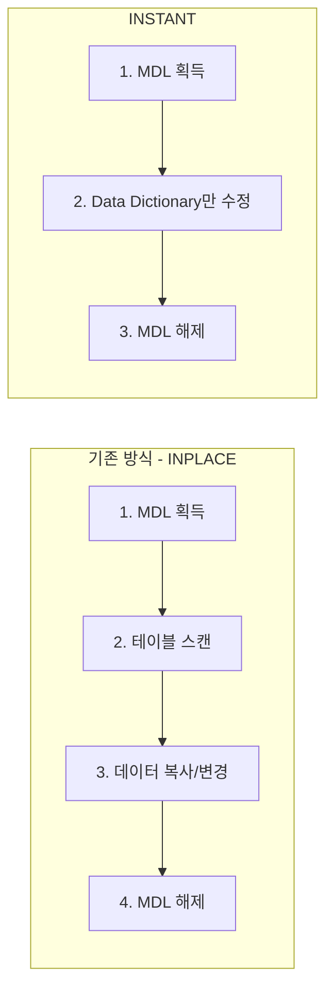

## Table of Contents

## Executive Summary

> **환경 정보**: 이 글은 **Aurora MySQL 3.x (MySQL 8.0 호환)** 환경을 기준으로 작성되었습니다. Aurora MySQL 2.x (MySQL 5.7 호환)에서도 MDL 동작은 동일하지만, Online DDL의 `ALGORITHM=INSTANT` 지원 범위 등 세부 사항이 다를 수 있습니다.

어느 평화로운 오후, 백엔드 API 서버의 응답 시간이 갑자기 치솟기 시작했습니다. Performance Insights를 확인하니 Aurora MySQL의 DB Load가 평소 0.1 수준에서 **18.65까지 급등**해 있었습니다. 정상의 180배.

원인은 단 한 줄의 SQL이었습니다:

```sql
ALTER TABLE reviews ADD platform_order_id VARCHAR(50) NULL;
```

"단순한 컬럼 추가인데 왜?" 처음엔 이해가 안 됐습니다. ALTER TABLE 자체는 1-2초면 끝나는 작업이었거든요. 하지만 문제의 본질은 DDL 문 자체가 아니라 **메타데이터 잠금(Metadata Lock)**이라는, 평소에는 존재감 없는 MySQL 내부 메커니즘에 있었습니다.

이 글은 그 장애를 분석하며 배운 것들을 정리한 기록입니다:

- **메타데이터(Metadata)**란 정확히 무엇이고, MySQL이 어떻게 관리하는지
- **MySQL 8.0 Data Dictionary** 아키텍처와 SDI(Serialized Dictionary Information)
- **MDL 내부 구조**와 락 획득 알고리즘 (공정성 정책, FIFO 큐)
- 왜 단순한 SELECT 쿼리까지 모두 블로킹되었는지 (**Convoy Effect**)
- **INSTANT DDL**로 밀리초 만에 스키마 변경하는 방법
- GitHub, Facebook, Shopify 같은 빅테크는 이 문제를 어떻게 해결하는지
- 다음에 같은 실수를 반복하지 않기 위한 체크리스트

## 1. 장애 상황 재현

### 1.1 발견

슬랙 알림이 쏟아지기 시작했습니다. API 타임아웃, 사용자 불만, CS 문의 급증.

Performance Insights의 Top SQL을 확인한 순간, 원인을 찾았습니다. DB 관리 도구에서 실행한 ALTER TABLE 문이 수십 개의 세션을 대기 상태로 만들고 있었습니다.

<!-- TODO: 실제 스크린샷으로 교체 필요
- Performance Insights DB Load 그래프 (스파이크 시점)
- Performance Insights Top SQL 목록 (ALTER TABLE이 보이는 화면)
-->

### 1.2 혼란

처음엔 납득이 안 됐습니다:

- ALTER TABLE은 1-2초면 끝나는 작업인데?
- 컬럼 추가는 Online DDL로 처리되지 않나?
- 왜 SELECT까지 막히지?

로그를 더 파보니 실마리가 보였습니다. 메시지 큐 워커에서 오래 실행되는 트랜잭션이 있었고, 그 트랜잭션이 `reviews` 테이블에 대한 **메타데이터 잠금을 보유**하고 있었습니다.

ALTER TABLE은 이 잠금이 해제되기를 기다렸고, 그 뒤에 도착한 모든 쿼리는 ALTER TABLE 뒤에서 줄을 서게 된 것입니다.

## 2. 메타데이터(Metadata)란 무엇인가?

MDL을 이해하기 전에, **메타데이터**가 정확히 무엇인지 알아야 합니다.

### 2.1 데이터와 메타데이터의 구분

**메타데이터(Metadata) = "데이터에 대한 데이터"**



쉽게 말해:
- **Metadata**: "이 테이블은 어떻게 생겼는가?" (설계도)
- **Data**: "실제로 저장된 값" (내용물)

### 2.2 메타데이터가 포함하는 정보

`reviews` 테이블을 예로 들면:

**테이블 레벨 메타데이터:**

```sql
SELECT * FROM information_schema.TABLES
WHERE TABLE_NAME = 'reviews'\G
```

```
TABLE_SCHEMA: cmong                    -- 데이터베이스 이름
TABLE_NAME: reviews                    -- 테이블 이름
ENGINE: InnoDB                         -- 스토리지 엔진
ROW_FORMAT: Dynamic                    -- 행 저장 포맷
TABLE_ROWS: 1523847                    -- 추정 행 수
DATA_LENGTH: 628015104                 -- 데이터 크기 (bytes)
INDEX_LENGTH: 89456640                 -- 인덱스 크기 (bytes)
CREATE_TIME: 2024-01-15 10:30:00       -- 테이블 생성 시간
TABLE_COLLATION: utf8mb4_unicode_ci    -- 기본 Collation
```

**컬럼 레벨 메타데이터:**

```sql
SELECT COLUMN_NAME, DATA_TYPE, IS_NULLABLE, COLUMN_KEY
FROM information_schema.COLUMNS
WHERE TABLE_NAME = 'reviews';
```

| COLUMN_NAME | DATA_TYPE | IS_NULLABLE | COLUMN_KEY |
|-------------|-----------|-------------|------------|
| review_id | varchar | NO | PRI |
| content | varchar | NO | |
| rating | varchar | YES | |
| shop_id | varchar | NO | MUL |
| ... | ... | ... | ... |

**인덱스 메타데이터:**

```sql
SELECT INDEX_NAME, COLUMN_NAME, NON_UNIQUE, INDEX_TYPE
FROM information_schema.STATISTICS
WHERE TABLE_NAME = 'reviews';
```

| INDEX_NAME | COLUMN_NAME | NON_UNIQUE | INDEX_TYPE |
|------------|-------------|------------|------------|
| PRIMARY | review_id | 0 | BTREE |
| idx_shop_id | shop_id | 1 | BTREE |
| idx_user_id | user_id | 1 | BTREE |

### 2.3 메타데이터의 역할

메타데이터가 없다면 MySQL은 아무것도 할 수 없습니다:

1. **쿼리 파싱**: `SELECT content FROM reviews` → `content`가 어떤 타입인지 모름
2. **실행 계획 수립**: 어떤 인덱스를 사용할지 결정 불가
3. **데이터 읽기**: 디스크에서 어떻게 데이터를 해석할지 모름
4. **제약조건 검증**: FK, UNIQUE 등 제약조건 확인 불가

## 3. MySQL 8.0 Data Dictionary 아키텍처

### 3.1 버전별 메타데이터 저장 방식의 변화

**MySQL 5.7 이전 - 파일 기반 (이중 관리 문제)**

```
/var/lib/mysql/cmong/
├── reviews.frm    ← 테이블 구조 (메타데이터)
├── reviews.ibd    ← 실제 데이터 + 인덱스
└── ...
```

문제점:
- `.frm` 파일과 InnoDB 내부 딕셔너리의 **이중 관리**
- 크래시 시 불일치 가능
- DDL 작업의 원자성 보장 어려움

**MySQL 8.0+ - Data Dictionary 통합**

```
/var/lib/mysql/
├── cmong/
│   └── reviews.ibd    ← 데이터 + 인덱스 + SDI(메타데이터)
├── mysql.ibd          ← Data Dictionary (모든 메타데이터의 원본)
└── ...
```

핵심 변화:
- `.frm` 파일 제거
- 모든 메타데이터를 `mysql.ibd`에 통합 저장
- InnoDB 트랜잭션으로 DDL 원자성 보장

### 3.2 Data Dictionary 내부 구조



**숨겨진 시스템 테이블들** (직접 접근 불가):

| 테이블 | 저장 내용 |
|--------|----------|
| `mysql.tables` | 테이블 정의 |
| `mysql.columns` | 컬럼 정의 |
| `mysql.indexes` | 인덱스 정의 |
| `mysql.foreign_keys` | 외래키 정의 |
| `mysql.tablespaces` | 테이블스페이스 |
| `mysql.schemata` | 스키마(데이터베이스) |

### 3.3 SDI (Serialized Dictionary Information)

MySQL 8.0에서는 각 `.ibd` 파일에 **SDI**가 포함됩니다. 테이블 메타데이터의 JSON 직렬화 버전입니다.

```bash
# .ibd 파일에서 SDI 추출
ibd2sdi /var/lib/mysql/cmong/reviews.ibd
```

```json
{
  "dd_object_type": "Table",
  "dd_object": {
    "name": "reviews",
    "columns": [
      {
        "name": "review_id",
        "type": 16,
        "char_length": 36,
        "is_nullable": false,
        "comment": "리뷰 고유 ID"
      },
      {
        "name": "content",
        "type": 16,
        "char_length": 1200,
        "comment": "리뷰 내용"
      }
    ],
    "indexes": [
      {
        "name": "PRIMARY",
        "type": 1,
        "is_visible": true
      }
    ],
    "engine": "InnoDB",
    "collation_id": 255
  }
}
```

**SDI의 용도**:
- 테이블 복구/이동 시 메타데이터 복원
- `mysql.ibd` 손상 시 백업 복구 지원
- 테이블 구조의 자체 문서화

### 3.4 메모리에서의 메타데이터 캐싱

디스크에서 매번 메타데이터를 읽으면 느립니다. MySQL은 두 가지 캐시를 사용합니다:



**캐시 설정 확인:**

```sql
SHOW VARIABLES LIKE 'table%cache%';
```

| Variable | 기본값 | 설명 |
|----------|-------|------|
| table_definition_cache | 2000 | 테이블 정의 캐시 개수 |
| table_open_cache | 4000 | 열린 테이블 캐시 개수 |
| table_open_cache_instances | 16 | 캐시 파티션 수 (동시성) |

## 4. 메타데이터 잠금(Metadata Lock)이란?

### 4.1 MySQL 잠금의 계층 구조

흔히 우리가 아는 Row Lock은 사실 가장 하위 계층에 불과합니다. MySQL은 데이터 무결성을 보장하기 위해 여러 계층의 잠금을 사용합니다.


### 4.2 메타데이터 잠금이 필요한 이유

메타데이터 잠금(MDL)은 **MySQL 5.5.3**에서 도입되었습니다. 그 이유는 명확합니다.

MDL이 없다면 어떤 일이 벌어질까요?

```sql
-- Session A
BEGIN;
SELECT * FROM users WHERE id = 1;
-- 아직 트랜잭션 진행 중...

-- Session B (동시에)
DROP TABLE users;  -- 테이블 삭제!

-- Session A (계속)
UPDATE users SET name = 'John' WHERE id = 1;
-- 테이블이 사라졌다!
```

한 세션에서 쿼리를 실행하는 도중에 다른 세션이 테이블 구조를 변경하거나 삭제할 수 있습니다. 이는 **데이터 무결성**과 **복제(Replication) 일관성**을 심각하게 훼손합니다.

**MDL이 보장하는 것:**
- 트랜잭션 내에서 테이블 구조가 변경되지 않음
- DDL과 DML 간의 충돌 방지
- 바이너리 로그(binlog)의 일관성 유지

### 4.3 잠금 타입과 호환성

MDL에는 여러 가지 타입이 있습니다. 아래는 핵심 타입만 간략화한 표입니다:

| Lock Type | 획득 시점 | 설명 |
|-----------|----------|------|
| **MDL_SHARED (S)** | SELECT 시작 시 | 테이블 구조 읽기, 가장 약한 잠금 |
| **MDL_SHARED_WRITE (SW)** | INSERT/UPDATE/DELETE | 데이터 변경 시 획득 |
| **MDL_SHARED_UPGRADABLE (SU)** | ALTER TABLE 초기 단계 | X로 업그레이드 가능한 잠금. SW와 호환되어 Online DDL 중 DML 허용 |
| **MDL_EXCLUSIVE (X)** | DDL 최종 커밋 시* | 배타적, **모든 접근 차단** (테이블 교체 순간) |

\* Online DDL(`ALGORITHM=INPLACE/INSTANT`) 기준. `ALGORITHM=COPY`나 일부 DDL은 시작부터 X 잠금 획득

> **참고**: 실제 MDL 타입은 `MDL_SHARED_HIGH_PRIO`, `MDL_SHARED_READ`, `MDL_SHARED_NO_WRITE` 등 더 세분화되어 있습니다. 전체 목록은 [MySQL 공식 문서](https://dev.mysql.com/doc/refman/8.0/en/metadata-locking.html)를 참조하세요.

**핵심은 호환성 매트릭스입니다 (간략화):**

| 보유 \ 요청 | S | SW | SU | X |
|-------------|---|----|----|---|
| **S** | O | O | O | **X** |
| **SW** | O | O | O | **X** |
| **SU** | O | O | X | **X** |
| **X** | **X** | **X** | **X** | **X** |

`MDL_EXCLUSIVE (X)`는 **어떤 잠금과도 호환되지 않습니다**. ALTER TABLE이 X 잠금을 요청하면 해당 테이블에 대한 **모든 작업이 대기**해야 합니다.

### 4.4 Row Lock vs Metadata Lock

| 구분 | Row Lock | Metadata Lock |
|------|----------|---------------|
| **잠금 대상** | 개별 행 | 테이블 구조 (스키마) |
| **획득 시점** | InnoDB 쿼리 실행 시 | 모든 테이블 접근 시 |
| **해제 시점** | 트랜잭션 종료 | **아래 참조** |
| **확인 방법** | SHOW ENGINE INNODB STATUS | performance_schema.metadata_locks |
| **주요 충돌** | 동일 행 업데이트 | **DDL vs DML** |

**MDL 해제 시점 (중요!):**
- `autocommit=1` (기본값): **문장 종료 시** 즉시 해제
- 명시적 트랜잭션 (`BEGIN`/`START TRANSACTION`): **COMMIT/ROLLBACK 시** 해제

우리 장애의 원인이 된 것은 후자입니다. ORM이나 커넥션 풀에서 명시적 트랜잭션을 열고 외부 API 호출 등 오래 걸리는 작업을 하면, 그 동안 MDL이 유지됩니다.

중요한 점은 MDL이 Row Lock과 **독립적으로 작동**한다는 것입니다. Row Lock이 전혀 없는 단순 SELECT도 MDL_SHARED를 획득합니다.

## 5. MDL 내부 구조와 락 획득 알고리즘

### 5.1 MDL 서브시스템 아키텍처

MySQL 내부에서 MDL은 어떻게 관리될까요?



**MDL_lock 객체의 핵심 필드:**

| 필드 | 설명 |
|------|------|
| `granted_tickets` | 현재 락을 보유 중인 티켓(세션) 목록 |
| `waiting_tickets` | 락을 대기 중인 티켓 큐 (FIFO) |
| `granted_types_bitmap` | 보유 중인 락 타입 비트맵 (빠른 호환성 체크용) |
| `waiting_types_bitmap` | 대기 중인 락 타입 비트맵 |

### 5.2 락 획득 알고리즘

새로운 락 요청이 들어오면 MySQL은 다음 과정을 거칩니다:



**핵심 포인트 - 공정성(Fairness) 정책:**

```
if (EXCLUSIVE 락이 대기 중이면) {
    // 새로운 SHARED 락도 무조건 큐에 넣음
    // → EXCLUSIVE 락의 기아(Starvation) 방지
}
```

이것이 바로 **Convoy Effect**의 원인입니다. EXCLUSIVE 락이 대기 중이면, 그 뒤의 모든 요청(심지어 호환 가능한 SHARED도)이 줄을 서게 됩니다.

### 5.3 performance_schema.metadata_locks 테이블 상세

MDL 상태를 모니터링하는 핵심 테이블입니다. 각 컬럼의 의미를 정확히 이해해야 장애 분석이 가능합니다.

**실제 장애 시 조회 결과 예시:**

```sql
SELECT * FROM performance_schema.metadata_locks
WHERE OBJECT_NAME = 'reviews';
```

| LOCK_TYPE | LOCK_DURATION | LOCK_STATUS | OWNER_THREAD_ID |
|-----------|---------------|-------------|-----------------|
| SHARED_READ | TRANSACTION | **GRANTED** | 12345 |
| SHARED_WRITE | TRANSACTION | **GRANTED** | 12346 |
| **EXCLUSIVE** | STATEMENT | **PENDING** | 99999 |
| SHARED_READ | TRANSACTION | **PENDING** | 12347 |
| SHARED_READ | TRANSACTION | **PENDING** | 12348 |

**각 컬럼의 의미:**

| 컬럼 | 값 | 의미 |
|------|-----|------|
| **LOCK_TYPE** | SHARED_READ | SELECT 쿼리가 획득하는 락 |
| | SHARED_WRITE | INSERT/UPDATE/DELETE가 획득하는 락 |
| | EXCLUSIVE | ALTER/DROP/RENAME이 요청하는 락 |
| **LOCK_DURATION** | STATEMENT | 해당 SQL 문 실행 완료 시 해제 |
| | TRANSACTION | COMMIT/ROLLBACK 시 해제 |
| | EXPLICIT | UNLOCK TABLES 또는 세션 종료 시 해제 |
| **LOCK_STATUS** | GRANTED | 락 획득 완료, 작업 수행 중 |
| | PENDING | 락 대기 중, 블로킹됨 |
| **OWNER_THREAD_ID** | 숫자 | MySQL 내부 스레드 ID |

**위 예시 해석:**

1. Thread 12345, 12346이 `SHARED_READ`, `SHARED_WRITE`를 **보유 중** (GRANTED)
2. Thread 99999 (ALTER TABLE)가 `EXCLUSIVE`를 **대기 중** (PENDING)
3. Thread 12347, 12348 (새 SELECT)이 EXCLUSIVE 뒤에서 **대기 중**

### 5.4 블로커 추적 쿼리

장애 상황에서 "누가 막고 있는지" 찾는 핵심 쿼리입니다:

```sql
SELECT
    -- 대기 중인 세션
    waiting.LOCK_TYPE AS waiting_lock,
    waiting_thd.PROCESSLIST_ID AS waiting_pid,
    waiting_thd.PROCESSLIST_TIME AS waiting_seconds,
    LEFT(waiting_thd.PROCESSLIST_INFO, 50) AS waiting_query,

    -- 블로킹 세션
    blocking.LOCK_TYPE AS blocking_lock,
    blocking_thd.PROCESSLIST_ID AS blocking_pid,
    blocking_thd.PROCESSLIST_TIME AS blocking_seconds,
    blocking_thd.PROCESSLIST_STATE AS blocking_state

FROM performance_schema.metadata_locks waiting
JOIN performance_schema.metadata_locks blocking
    ON waiting.OBJECT_SCHEMA = blocking.OBJECT_SCHEMA
    AND waiting.OBJECT_NAME = blocking.OBJECT_NAME
    AND waiting.LOCK_STATUS = 'PENDING'
    AND blocking.LOCK_STATUS = 'GRANTED'
JOIN performance_schema.threads waiting_thd
    ON waiting.OWNER_THREAD_ID = waiting_thd.THREAD_ID
JOIN performance_schema.threads blocking_thd
    ON blocking.OWNER_THREAD_ID = blocking_thd.THREAD_ID
WHERE waiting.OBJECT_TYPE = 'TABLE';
```

**결과 예시:**

| waiting_lock | waiting_pid | waiting_seconds | blocking_lock | blocking_pid | blocking_seconds | blocking_state |
|--------------|-------------|-----------------|---------------|--------------|------------------|----------------|
| EXCLUSIVE | 999 | 45 | SHARED_READ | 123 | 420 | **Sleep** |

해석: PID 123이 7분(420초) 동안 SHARED_READ를 잡고 **Sleep 상태** (트랜잭션 미종료). ALTER TABLE(PID 999)이 45초째 대기 중.

## 6. 문제 발생 메커니즘

### 6.1 Timeline으로 보는 장애 발생 과정

실제로 무슨 일이 벌어졌는지 타임라인으로 살펴보겠습니다.


**핵심 문제**: ALTER TABLE 자체는 1-2초면 끝나는 작업이었습니다. 하지만 **선행 트랜잭션이 7분간 MDL을 보유**하고 있었기 때문에, 그 동안 모든 후속 쿼리가 대기 상태에 빠진 것입니다.

### 6.2 Convoy Effect (호송 효과)

Convoy Effect는 원래 운영체제의 스케줄링에서 나온 개념입니다. 느린 프로세스 뒤에 빠른 프로세스들이 줄지어 대기하는 현상을 말합니다.

MDL에서도 동일한 현상이 발생합니다:


**왜 이런 설계인가?**

만약 SHARED 잠금 요청이 EXCLUSIVE 요청을 계속 추월할 수 있다면, 트래픽이 많은 테이블에서 ALTER TABLE은 영원히 실행되지 못합니다. DDL 작업이 무한정 연기되는 **기아(Starvation)**가 발생하죠.

따라서 MySQL은 **공정성(Fairness)**을 위해 FIFO 방식을 채택했습니다. 하지만 이로 인해 Convoy Effect라는 부작용이 생긴 것입니다.

### 6.3 왜 SELECT도 블로킹되는가?

많은 개발자들이 혼란스러워하는 부분입니다. "SELECT는 읽기만 하는데 왜 막히지?"

```sql
-- 이 쿼리도 막힌다!
SELECT COUNT(*) FROM reviews;
```

이유를 정리하면:

1. **모든 테이블 접근은 MDL을 획득해야 합니다**
   - SELECT → MDL_SHARED
   - INSERT/UPDATE/DELETE → MDL_SHARED_WRITE
   - ALTER TABLE → MDL_EXCLUSIVE

2. **MDL은 FIFO 큐 방식으로 동작합니다**
   - EXCLUSIVE 요청이 큐에 있으면, 그 뒤의 모든 요청은 대기

3. **EXCLUSIVE는 현재 보유 중인 모든 MDL이 해제될 때까지 대기합니다**
   - 그동안 새로운 요청도 큐에 쌓임

## 7. Aurora MySQL 아키텍처와 잠금

### 7.1 Aurora 클러스터 구조

Amazon Aurora MySQL은 기존 MySQL과 다른 아키텍처를 가지고 있습니다. 하지만 **MDL 동작 방식은 동일**합니다.


### 7.2 Writer/Reader와 MDL

**핵심 포인트**: MDL은 **인스턴스 로컬**입니다!

| 구분 | Writer Instance | Reader Instance |
|------|-----------------|-----------------|
| DDL 실행 | 가능 | 불가 |
| MDL 대기 | 발생 | 직접 영향 없음 |
| 읽기 쿼리 | MDL 대기 영향 | 대부분 정상 |

**이것이 의미하는 바:**

Writer에서 ALTER TABLE로 인해 MDL 대기가 발생해도, **Reader에서의 SELECT는 대부분 정상 동작**합니다.

**단, 주의할 점:**
- **애플리케이션 라우팅**: 앱이 읽기 쿼리를 Writer로 보내면 그대로 MDL 대기에 걸립니다. Reader 엔드포인트로 실제 분리되어 있는지 확인 필요
- **DDL 적용 순간**: DDL이 완료되어 메타데이터가 Reader로 전파되는 시점에 아주 짧은 영향이 있을 수 있습니다 (보통 수십 ms)
- **Replication lag**: DDL 적용 후 Reader에서 새 스키마가 반영되기까지 약간의 지연

읽기 트래픽을 Reader로 분산했다면 장애 영향을 **최소화**할 수 있었을 것입니다. 완전 무영향은 아니지만, 서비스 전체 마비는 피할 수 있습니다.

### 7.3 Performance Insights로 진단하기

문제를 진단할 때 유용한 쿼리들입니다:

```sql
-- 현재 MDL 대기 상태 확인
SELECT
    OBJECT_SCHEMA,
    OBJECT_NAME,
    LOCK_TYPE,
    LOCK_STATUS,
    OWNER_THREAD_ID
FROM performance_schema.metadata_locks
WHERE OBJECT_NAME = 'reviews';

-- 장기 실행 트랜잭션 확인 (핵심!)
SELECT
    trx_id,
    trx_state,
    trx_started,
    TIMESTAMPDIFF(SECOND, trx_started, NOW()) AS duration_sec,
    trx_mysql_thread_id,
    trx_query
FROM information_schema.innodb_trx
ORDER BY trx_started;
```

## 8. 빅테크 기업들의 해결 사례

대규모 서비스를 운영하는 기업들은 어떻게 이 문제를 해결했을까요?

### 8.1 GitHub - gh-ost

GitHub은 매일 **수백만 개의 스키마 변경**을 처리합니다. 기존 pt-online-schema-change의 트리거 기반 방식의 한계를 극복하기 위해 **gh-ost(GitHub Online Schema Transmogrifier)**를 개발했습니다.

**핵심 원리:**



gh-ost는 트리거 대신 binlog를 직접 파싱합니다. 원본 테이블에 부하를 주지 않고, 실시간 스로틀링이 가능합니다.

```bash
gh-ost \
  --host=aurora-writer.cluster-xxx.rds.amazonaws.com \
  --database=mydb \
  --table=reviews \
  --alter="ADD COLUMN platform_order_id VARCHAR(50) NULL" \
  --allow-on-master \
  --chunk-size=1000 \
  --max-load="Threads_running=25" \
  --execute
```

### 8.2 Facebook - OSC

Facebook은 세계 최대 규모의 MySQL 클러스터를 운영합니다. 그들의 OSC(Online Schema Change)는:

- Shadow 테이블 + 트리거 기반
- 대용량 테이블에서도 안정적
- 진행률 모니터링 및 자동 롤백 지원

### 8.3 Percona - pt-online-schema-change

가장 널리 사용되는 Online DDL 도구입니다:

```sql
-- pt-osc의 작동 방식 (개념)
-- 1. 새 테이블 생성
CREATE TABLE reviews_new LIKE reviews;
ALTER TABLE reviews_new ADD COLUMN platform_order_id VARCHAR(50);

-- 2. 트리거로 변경사항 동기화
-- 3. 청크 단위로 데이터 복사
-- 4. 테이블 이름 교체 (매우 짧은 순간)
RENAME TABLE reviews TO reviews_old, reviews_new TO reviews;
```

### 8.4 Shopify의 전략

Shopify는 **1.5PB 규모의 데이터베이스**를 운영하며, 블랙 프라이데이 같은 피크 시즌에도 무중단으로 스키마 변경을 수행합니다.

**핵심 전략:**
- 피크 시간대 DDL 자동 차단 (새벽 2-6시만 허용)
- 모든 DDL은 CI/CD 파이프라인을 통해서만 실행
- `lock_wait_timeout`을 5초로 설정하여 빠른 실패 → 재시도
- 스키마 변경도 코드 리뷰 필수

### 8.5 도구 비교

| 도구 | 방식 | 장점 | 단점 | Aurora 호환 |
|------|------|------|------|-------------|
| **gh-ost** | Binlog 파싱 | 트리거 없음, 낮은 부하 | 복잡한 설정 | 제한적 |
| **pt-osc** | 트리거 기반 | 검증됨, 안정적 | 트리거 오버헤드 | O |
| **MySQL Native** | ALGORITHM=INPLACE | 내장, 간단 | 일부 변경만 지원 | O |
| **Blue/Green** | 클러스터 복제 | 완전 무중단 | 비용 증가 | 최적 |

## 9. 해결책과 Best Practices

### 9.1 즉시 조치 방법

문제 상황 발생 시:

```sql
-- 1. 문제의 ALTER 세션 확인
SELECT * FROM information_schema.processlist
WHERE info LIKE 'ALTER%';

-- 2. 장기 실행 트랜잭션 확인 (핵심!)
SELECT
    trx_mysql_thread_id,
    TIMESTAMPDIFF(SECOND, trx_started, NOW()) AS duration_sec,
    trx_query
FROM information_schema.innodb_trx
ORDER BY trx_started;

-- 3. 필요시 문제 세션 종료
-- 주의: 업무에 영향을 줄 수 있음
KILL <thread_id>;
```

### 9.2 Aurora Blue/Green 배포

Aurora Blue/Green 배포는 **가장 안전한** 스키마 변경 방법입니다.


- DDL 실행 중에도 운영 환경에 **전혀 영향 없음**
- 스위치오버는 **1분 이내** (엔드포인트 변경만)
- 문제 발생 시 **즉시 롤백** 가능

### 9.3 lock_wait_timeout 튜닝

`lock_wait_timeout`의 기본값은 놀랍게도 **31536000초(1년)**입니다.

```sql
-- 권장 설정
SET GLOBAL lock_wait_timeout = 30;  -- 30초

-- DDL 실행 전 세션별 설정
SET SESSION lock_wait_timeout = 5;  -- 5초
ALTER TABLE reviews ADD COLUMN ...;
```

5-30초로 설정하면 DDL이 잠금을 빨리 획득하지 못할 경우 빠르게 실패하고 재시도할 수 있습니다.

> **`lock_wait_timeout` vs `innodb_lock_wait_timeout` 차이:**
> - `lock_wait_timeout`: **MDL(메타데이터 잠금)** 대기 시간. DDL이 테이블 접근을 기다리는 시간
> - `innodb_lock_wait_timeout`: **Row Lock** 대기 시간. DML이 행 잠금을 기다리는 시간 (기본값 50초)
>
> 이번 장애와 관련된 것은 `lock_wait_timeout`입니다.

### 9.4 Read Replica 분리

MDL 문제의 영향을 최소화하는 아키텍처입니다:



읽기 트래픽을 Reader로 분산하면 Writer의 MDL 문제 영향을 최소화할 수 있습니다.

### 9.5 INSTANT DDL 활용하기 (MySQL 8.0+)

MySQL 8.0에서 도입된 `ALGORITHM=INSTANT`는 게임 체인저입니다. **테이블 데이터를 전혀 건드리지 않고** 메타데이터만 변경합니다.

**INSTANT DDL의 동작 원리:**



**실행 과정 상세:**

1. **MDL EXCLUSIVE 획득** (짧은 시간)
2. **Data Dictionary 업데이트** (`mysql.ibd`의 columns 테이블에 새 컬럼 추가)
3. **테이블 메타데이터 버전 증가**
4. **Table Definition Cache 무효화**
5. **.ibd 파일의 SDI 업데이트**
6. **MDL 해제**

핵심은 **실제 데이터 페이지는 건드리지 않는다**는 것입니다. 새 컬럼의 기본값은 Data Dictionary에만 기록되고, 기존 행을 읽을 때 Dictionary에서 기본값을 적용합니다.

**INSTANT DDL 실행 예시:**

```sql
-- 세션 타임아웃 설정
SET SESSION lock_wait_timeout = 5;

-- INSTANT DDL 실행 (테이블 크기와 무관하게 밀리초 단위 완료)
ALTER TABLE reviews
ADD COLUMN platform_order_id VARCHAR(50) NULL,
ALGORITHM=INSTANT;
```

**INSTANT DDL 지원 조건 (MySQL 8.0):**

| 작업 | INSTANT 지원 | 비고 |
|------|-------------|------|
| 테이블 **끝**에 컬럼 추가 | O | 가장 일반적인 케이스 |
| 테이블 **중간**에 컬럼 추가 | O (8.0.29+) | `AFTER` 절 사용 시 |
| NOT NULL + DEFAULT 컬럼 추가 | X | INPLACE 필요 |
| 컬럼 삭제 | O (8.0.29+) | |
| 컬럼 이름 변경 | O | |
| 인덱스 추가 | X | INPLACE 필요 |
| 테이블 이름 변경 | O | |

**버전 확인 및 INSTANT 가능 여부 체크:**

```sql
-- 버전 확인
SELECT VERSION();  -- 8.0.39 → INSTANT 지원

-- INSTANT 가능 여부 확인 (dry-run)
ALTER TABLE reviews
ADD COLUMN test_col VARCHAR(50) NULL,
ALGORITHM=INSTANT,
LOCK=NONE;
-- 성공하면 INSTANT 가능, 에러 발생 시 INPLACE 필요
```

**왜 INSTANT가 빠른가?**

```
INPLACE (기존):
┌────────────────────────────────────────┐
│ 테이블 크기: 10GB                       │
│ 예상 시간: 수 분 ~ 수십 분              │
│ MDL 점유: 작업 전체 기간                 │
└────────────────────────────────────────┘

INSTANT:
┌────────────────────────────────────────┐
│ 테이블 크기: 10GB                       │
│ 예상 시간: 밀리초                       │
│ MDL 점유: 밀리초                        │
│                                        │
│ → 테이블 크기와 무관!                   │
└────────────────────────────────────────┘
```

> **실전 가이드**: INSTANT DDL 실행 시 MDL timeout이 발생했다면 ["INSTANT DDL인데 왜 timeout?"](/posts/mysql-instant-ddl-mdl-troubleshooting)에서 2-세션 진단 방법과 안전한 KILL 판단 기준을 확인하세요.

## 10. 결론

### 배운 것들

1. **MDL은 모든 테이블 접근에 필요합니다**
   - SELECT도 MDL_SHARED를 획득
   - `autocommit=1`이면 문장 종료 시, 명시적 트랜잭션이면 COMMIT/ROLLBACK 시 해제

2. **ALTER TABLE의 MDL_EXCLUSIVE는 모든 것을 차단합니다**
   - FIFO 큐 방식으로 인해 Convoy Effect 발생

3. **장기 실행 트랜잭션이 진짜 원인입니다**
   - ALTER TABLE 자체는 빠르게 끝남
   - 앞선 트랜잭션이 MDL을 보유하고 있으면 대기

4. **Reader Replica를 활용하면 영향을 최소화할 수 있습니다**
   - Writer의 MDL 대기가 Reader를 직접 막지는 않음
   - 단, 앱 라우팅 확인 필수 (Writer로 읽기 쿼리 가면 동일하게 대기)

### DDL 실행 전 체크리스트

- [ ] 피크 시간대인가? → 피크 시간 피하기
- [ ] 해당 테이블에 장기 실행 트랜잭션이 있는가?
- [ ] `lock_wait_timeout` 설정 확인 (권장: 30초 이하)
- [ ] Online DDL 도구 사용 가능한가?
- [ ] Aurora Blue/Green 배포 고려했는가?
- [ ] 롤백 계획이 있는가?
- [ ] 팀에 DDL 실행 공유했는가?

### 마무리

운영 환경에서의 DDL은 **항상 위험합니다**. 특히 트래픽이 있는 상황에서는 더욱 그렇습니다.

이번 장애를 통해 배운 것:
- 모든 DDL은 계획적으로 - 즉흥적인 ALTER TABLE은 금물
- 모니터링은 필수 - Performance Insights를 항상 주시
- 도구를 활용하자 - 바퀴를 다시 발명하지 말자

다음에 ALTER TABLE을 실행하기 전에, 이 글을 한번 더 읽어보시길 바랍니다.

## References

1. [MySQL 8.0 Metadata Locking](https://dev.mysql.com/doc/refman/8.0/en/metadata-locking.html)
2. [GitHub Engineering - gh-ost: GitHub's Online Migration Tool for MySQL](https://github.blog/engineering/infrastructure/gh-ost-github-s-online-migration-tool-for-mysql/)
3. [Percona Toolkit - pt-online-schema-change](https://docs.percona.com/percona-toolkit/pt-online-schema-change.html)
4. [AWS Aurora Blue/Green Deployments](https://docs.aws.amazon.com/AmazonRDS/latest/AuroraUserGuide/blue-green-deployments.html)
