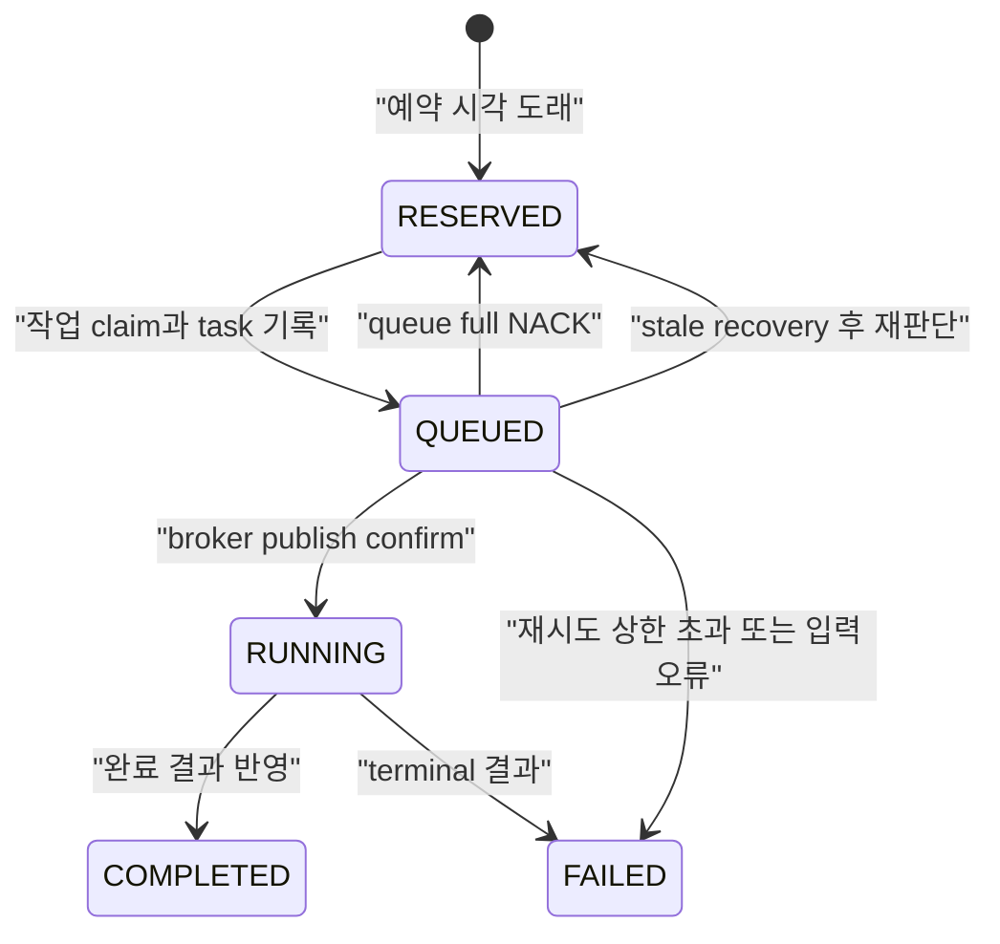

## Table of contents

> **TL;DR**
>
> 브라우저를 사용하는 외부 작업은 늦어질 수 있습니다. 로그인에 시간이 걸릴 수도 있고, 외부 서비스가 느려질 수도 있으며, worker의 CPU와 메모리가 먼저 포화될 수도 있습니다. 이때 producer가 작업을 무한히 받으면 queue는 안전망이 아니라 **언제 실행될지 알 수 없는 약속 목록**이 됩니다. 오래 기다린 작업은 세션이 만료되고, 예약 조건이 바뀌며, 외부 상태도 달라집니다.
>
> 실제 운영에서 이 한도에 걸린 3일 동안 6,397건의 publish가 거절됐습니다. 중요한 것은 거절 자체가 아닙니다. broker가 거절한 작업을 DB에서 `RESERVED` 상태로 되돌려 다음 dispatch에서 다시 판단할 수 있게 했습니다. 반대로 connection error처럼 broker가 이미 메시지를 받았을 가능성이 있는 경우에는 즉시 재발행하지 않았습니다. 빠른 복구보다 외부 쓰기 중복 위험을 낮추는 선택입니다.
>
> 이 글은 그 운영 사건을 출발점으로, 수용 불가·전달 확인 불가·consumer 중단을 서로 다른 상태 전이로 남겨 조용한 유실을 피한 방법을 설명합니다. mock 부하 시험은 이 정책을 배포 전에 재현하는 보조 검증일 뿐, 이 글의 근거는 아닙니다.

## 0. 시작 — 실제로 queue가 가득 찼다

예약된 외부 작업을 처리하는 배치가 있습니다. DB에서 처리 대상을 고르고 메시지 broker에 publish하면, worker는 메시지를 하나씩 받아 로그인·브라우저 실행·외부 요청을 수행합니다.

운영 중 worker가 이 속도를 따라가지 못한 구간이 있었습니다. queue의 ready message 상한은 10,000건이었고, 6월 13일부터 15일까지 새 publish **6,397건**이 `queue full`로 거절됐습니다.

| 날짜 | queue-full publish 거절 |
| --- | ---: |
| 6월 13일 | 2,405건 |
| 6월 14일 | 3,262건 |
| 6월 15일 | 730건 |
| 합계 | **6,397건** |

처음에는 6,397건을 모두 broker에 넣는 편이 좋아 보일 수 있습니다. 입력을 빠르게 끝내고 worker가 자기 속도로 나중에 처리하도록 두는 방식입니다. 그러나 브라우저 로그인과 외부 호출이 병목이 되는 작업에서는 이 직관이 위험합니다.

```text
처리 능력보다 많은 작업을 무제한으로 수용
  → worker는 처리할 수 있는 속도보다 늦게 drain
  → queue에서 기다리는 시간이 계속 증가
  → 예약 시각, 세션, 외부 대상의 상태가 바뀜
  → “나중에 실행”이 원래 요청과 같은 의미인지 알 수 없음
```

여기서 queue depth가 커졌다는 것은 단순히 숫자가 커졌다는 뜻이 아닙니다. 아직 처리되지 않은 작업의 **불확실성 부채**가 쌓인 것입니다. 시간이 지나도 외부 상태가 변하지 않는 idempotent read라면 이 부채가 비교적 작을 수 있습니다. 하지만 예약된 외부 쓰기나 세션 의존 작업은 오래 기다릴수록 실패 비용과 중복 위험이 커집니다.

그래서 이 경우에는 다음 작업을 더 받지 않는 것이 실패가 아니라 안전한 답이었습니다. 이 사건에서 거절은 유실이 아니라, 시스템이 현재 감당할 수 있는 약속의 경계를 드러낸 신호였습니다.

<details>
<summary><b>(입문) queue는 왜 처리 속도를 자동으로 늘려주지 않는가</b> (펼치기)</summary>

queue는 producer와 consumer의 속도 차이를 잠시 흡수합니다. worker가 초당 100건을 처리하고 producer가 짧은 시간에 1,000건을 넣는 경우, queue가 있어야 worker가 순서대로 처리할 수 있습니다.

하지만 producer가 계속 초당 1,000건을 넣고 worker가 계속 초당 100건만 처리하면, queue는 속도 차이를 없애지 못합니다. 대기 시간만 계속 늘립니다. 그래서 queue에는 “얼마까지 기다리는 작업을 받아도 되는가”라는 제품·운영 결정이 필요합니다.

</details>

## 1. 처음에는 세 가지 선택지가 있었다

queue에 상한을 두기로 했을 때, 가능한 선택지는 세 가지였습니다.

| 선택 | queue가 가득 찼을 때 | 장점 | 이 작업에서의 문제 |
| --- | --- | --- | --- |
| 무한 적재 | 계속 수용 | producer 구현이 단순 | 오래된 작업의 의미와 복구 시간이 무한히 나빠짐 |
| 오래된 작업 폐기 | 앞쪽 메시지를 버림 | 최신 요청을 빨리 받음 | 예약·외부 쓰기 결과가 조용히 사라질 수 있음 |
| 새 작업 거절 | 새 publish를 실패로 돌려보냄 | 수용 불가를 호출자가 즉시 알 수 있음 | 재예약·실패 처리라는 상태 전이가 필요 |

이 시스템은 세 번째를 택했습니다. queue가 10,000개의 ready message를 넘으면 새 publish를 `reject-publish`로 거절합니다.

이는 “작업을 잃어도 된다”는 뜻이 아닙니다. 오히려 반대입니다. 작업이 broker에 들어가지 못했다는 사실을 producer가 정확히 알고, DB 상태를 다시 `RESERVED`로 돌리거나 재시도 상한을 넘으면 실패로 확정해야 합니다.

> 수용할 수 없는 작업을 성공으로 기록하는 것보다, 수용하지 못했다고 명시적으로 기록하는 편이 낫다.

RabbitMQ의 `x-max-length`는 ready message 수에 적용됩니다. worker가 이미 받아 처리 중인 unacknowledged message는 이 상한에 포함되지 않습니다. 이 차이는 중요합니다. 10,000이라는 값은 시스템 전체 동시 처리량이 아니라 **broker 안에서 아직 consumer에게 전달되지 않은 backlog의 상한**입니다.

## 2. 거절을 유실로 만들지 않는 상태 전이

거절을 선택하면 broker 설정만으로는 부족합니다. DB에 남는 작업 상태가 broker의 결과와 일치해야 합니다.

이 글에서 다루는 작업 상태는 단순화하면 다음과 같습니다.



여기서 가장 중요한 질문은 “publish가 실패했는가?”가 아닙니다.

> broker가 메시지를 받지 못했다는 사실을 지금 확실히 아는가?

답에 따라 상태 전이가 달라집니다.

| publish 결과 | broker 수용 여부 | DB에서 하는 일 | 즉시 재발행 여부 |
| --- | --- | --- | --- |
| publisher confirm | 확실히 수용 | `RUNNING` | 하지 않음 |
| queue-full NACK | 확실히 미수용 | `RESERVED`로 되돌림 | 하지 않음; 다음 dispatch에서 재판단 |
| 잘못된 입력 | 보낼 수 없음 | `FAILED` | 하지 않음 |
| connection error | 모름 | `QUEUED`를 남김 | 하지 않음; stale 경계 후 복구 |

### 2.1 queue-full NACK은 비교적 쉬운 실패다

queue가 가득 차서 broker가 NACK을 보냈다면, 해당 메시지가 queue에 들어가지 않았다는 사실을 producer가 압니다. 이 경우에는 `QUEUED` task를 실패로 확정하지 않고, 원래 예약 상태로 되돌릴 수 있습니다.

다음 dispatch는 queue가 비었는지 다시 확인하는 것이 아니라, 새 publish를 다시 시도합니다. 그 사이에도 가득 차 있다면 다시 NACK을 받고, 재시도 횟수를 올립니다. 정해진 상한을 넘으면 영구 실패로 확정해 무한 재투입 loop를 막습니다.

### 2.2 connection error는 가장 위험한 실패다

connection error는 NACK과 다릅니다. 메시지를 보낸 뒤 broker가 수용했지만 confirm이 돌아오기 전에 연결이 끊겼을 수 있습니다. 이때 producer가 “실패했으니 다시 보내자”고 판단하면, broker에는 같은 task가 두 번 있을 수 있습니다.

외부 읽기라면 중복이 비교적 덜 위험할 수 있습니다. 하지만 외부 댓글 등록처럼 side effect가 있는 작업은 동일한 요청이 두 번 실행될 수 있습니다. 그래서 현재 dispatcher는 connection error 뒤 남은 batch publish를 중단하고, 이미 만든 task를 `QUEUED`로 남깁니다.

나중에 완료 결과가 도착하면 정상적으로 terminal state로 갑니다. 결과가 도착하지 않고 충분한 stale 시간이 지나면 그때 재예약합니다. 이 지연은 불편하지만, “전달 여부를 모르는 순간의 즉시 재발행”보다 안전합니다.

<details>
<summary><b>(심도) publisher confirm과 consumer ack은 무엇을 각각 확인하는가</b> (펼치기)</summary>

publisher confirm은 producer와 broker 사이의 약속입니다. broker가 publish를 수용했는지 확인합니다. consumer가 작업을 실행했는지, 외부 서비스가 요청을 성공시켰는지, 결과를 DB에 썼는지는 확인하지 않습니다.

consumer ack은 consumer와 broker 사이의 약속입니다. consumer가 메시지를 처리했다고 판단한 뒤에만 broker가 그 delivery를 지울 수 있게 합니다. consumer가 ack 전에 종료되면 broker는 메시지를 다시 전달할 수 있습니다.

두 확인은 서로를 대신하지 않습니다. 그래서 broker 수용, 외부 실행, 결과 반영을 같은 성공으로 부르면 안 됩니다.

</details>

## 3. 왜 즉시 재시도하지 않았는가

queue가 가득 찼거나 connection이 끊겼을 때, 흔한 반응은 `retry`입니다. 하지만 “언제”, “어떤 실패를”, “누가” 재시도하는지가 없으면 retry는 압력을 증폭합니다.

```text
consumer가 느려 queue가 가득 참
  → producer가 즉시 재시도
       → 같은 queue에 다시 publish
            → 같은 NACK 또는 connection pressure
                 → retry storm
```

이 시스템은 재시도를 세 계층으로 나눴습니다.

| 실패 | 재시도 주체 | 시점 | 이유 |
| --- | --- | --- | --- |
| queue-full NACK | 다음 dispatch | 재예약 후 | 지금은 수용 불가라는 확실한 신호 |
| broker connection error | stale recovery | 충분한 관찰 시간 뒤 | 이미 수용됐을 가능성이 있음 |
| 결과 처리의 DB/forwarding 오류 | 결과 consumer | 제한된 재전달 | 외부 작업은 끝났고 결과 반영만 다시 하면 됨 |
| 입력 형식 오류 | 아무도 재시도하지 않음 | 즉시 terminal | 같은 입력으로는 성공할 수 없음 |

여기서 이 글이 깊게 다루는 것은 첫 두 행뿐입니다. 결과 consumer의 retry와 외부 side effect 멱등성은 다음 글의 주제입니다. 범위를 좁혀야 현재 선택의 이유가 보입니다.

## 4. 운영 사건에서 무엇을 회수했고, 무엇을 포기했는가

이 사건에서 보려던 것은 queue depth 하나가 아니었습니다. `queue full`을 받은 row가 다음 실행 기회로 돌아갔는지, publish 직전 중단으로 `QUEUED`에 남은 row가 영원히 고립되지 않았는지, 그리고 같은 외부 쓰기를 성급하게 두 번 보내지 않았는지를 함께 봐야 했습니다.

### 4.1 첫 번째 대응 — 거절된 작업을 다시 예약 상태로 돌렸다

queue-full NACK은 broker가 **받지 않았다**고 명확히 알려 주는 실패입니다. 그래서 이 경우에는 작업을 실패 처리하지 않고 `RESERVED`로 되돌렸습니다. 다음 dispatch가 broker 여유를 확인하는 별도 API를 호출하는 대신, 다시 publish하여 수용 여부를 broker의 confirm으로 판정합니다.

운영 로그에서 같은 3일 동안 이 경로로 재예약된 작업은 **5,345건**이었습니다.

| 날짜 | queue-full 거절 | 재예약 |
| --- | ---: | ---: |
| 6월 13일 | 2,405건 | 2,020건 |
| 6월 14일 | 3,262건 | 2,717건 |
| 6월 15일 | 730건 | 608건 |

두 숫자가 항상 같을 필요는 없습니다. 한 번의 dispatch는 여러 작업을 다루고, 재예약은 retry 상한과 row의 현재 상태를 다시 확인한 뒤에만 일어납니다. 중요한 불변식은 더 단순합니다. **NACK을 받은 작업이 성공처럼 사라지지 않고, DB에서 다음 판단이 가능한 상태로 남아야 한다**는 것입니다.

### 4.2 두 번째 대응 — publish 직전 중단은 곧바로 재발행하지 않았다

connection error는 NACK보다 어렵습니다. broker가 메시지를 수용한 뒤 confirm만 돌려주지 못했을 수도 있기 때문입니다. 이때 즉시 재발행하면 외부 쓰기가 중복될 수 있습니다.

그래서 `QUEUED`로 오래 남은 작업만 stale recovery 대상으로 삼았습니다. 이 경로는 기존 task를 실패로 마감한 뒤 reply를 다시 예약하며, 재시도 횟수 상한을 같이 적용합니다. 같은 운영 구간에서 stale `QUEUED`로부터 복구되어 다시 dispatch된 작업은 **27,205건**이었습니다.

| 날짜 | stale recovery |
| --- | ---: |
| 6월 13일 | 23,882건 |
| 6월 14일 | 2,560건 |
| 6월 15일 | 763건 |

이 수치는 “27,205건이 유실됐다”는 뜻이 아닙니다. publish 이전 프로세스 중단, confirm 미확인, 배포 경계 등으로 `QUEUED`에 오래 머문 작업을 운영 정책에 따라 다시 판단한 횟수입니다. 오히려 이 계측이 없었다면, 큰 backlog 뒤에 남은 작업이 처리 지연인지 고립인지 구분할 수 없었습니다.

### 4.3 recovery가 새 병목이 되지 않게 한 경계

stale recovery는 강력하지만 위험합니다. 정상적으로 오래 걸리는 작업까지 되살리면 동일한 외부 호출을 두 번 만들 수 있습니다. 그래서 현재 경계는 다음과 같습니다.

- `RUNNING` 작업은 자동 재발행하지 않는다. 이미 broker가 수용했을 가능성이 있기 때문이다.
- `QUEUED`만 일정 시간 뒤 회수한다. publish 전 중단으로 고립되는 창을 닫기 위해서다.
- 회수도 retry 상한을 통과해야 한다. broker가 계속 포화됐다고 무한히 재예약하지 않는다.
- 결과 처리 실패는 원래 외부 작업을 다시 실행하는 대신, 결과 consumer에서 제한적으로 재전달한다.

이것은 “빨리 다시 돌린다”보다 “어느 단계의 실패를 어떤 근거로 다시 돌릴지 안다”에 가까운 설계입니다.

### 4.4 mock 부하 시험은 운영 사건을 재현하는 회귀 장치다

저장소의 3,000건 burst·12,000건 queue-full·consumer crash runbook은 삭제하지 않았습니다. 다만 이제 역할은 분명합니다. 운영의 6,397건 거절을 대신 증명하는 자료가 아니라, 다음 변경이 이 경계를 깨지 않는지 확인하는 회귀 장치입니다.

- 12,000건 입력에서 상한 초과 publish가 NACK으로 보이는가
- NACK row가 재예약 또는 명시적 terminal failure로 남는가
- consumer가 ack 전에 중단돼도 broker delivery가 사라지지 않는가

운영 로그는 실제로 어떤 압력이 왔는지를 말하고, mock은 다음 코드 변경에서도 같은 실패를 안전하게 반복할 수 있게 합니다. 둘은 대체재가 아닙니다.

## 5. 현재 선택의 대가

bounded queue는 작업을 더 빨리 처리하는 기능이 아닙니다. 받지 못하는 순간을 더 빨리 드러내는 기능입니다. 따라서 다음 비용이 생깁니다.

| 선택 | 얻는 것 | 대가 |
| --- | --- | --- |
| 새 publish 거절 | 무한 backlog 방지, 빠른 과부하 신호 | 재예약·실패 상태와 사용자 피드백 필요 |
| publisher confirm | broker 수용 여부 구분 | publish latency와 connection-error 모호성 |
| stale recovery | 즉시 중복 재발행 감소 | 실제 유실의 복구가 늦어짐 |
| manual ack | consumer crash 뒤 재전달 | handler가 중복 전달을 감당해야 함 |
| retry 상한 | 무한 loop 방지 | 사람이 조사할 terminal failure가 생김 |

특히 stale 시간은 임의의 timeout이 되어서는 안 됩니다. 가장 느린 정상 worker 처리 시간, 외부 호출 timeout, 결과 전달 지연, consumer 재시작 시간을 합쳐도 정상 작업을 재발행하지 않을 만큼 길어야 합니다. 반대로 너무 길면 실제 유실을 늦게 발견합니다. 이 값은 코드 상수가 아니라 운영 측정으로 다시 조정해야 하는 정책입니다.

## 6. 자가진단 체크리스트

1. queue가 가득 찼을 때 메시지를 버리는지, 오래된 것을 버리는지, 새 publish를 거절하는지 명시한다.
2. broker가 명시적으로 거절한 경우와 connection error를 같은 publish failure로 취급하지 않는다.
3. queue-full에서 원래 DB row가 어떤 상태로 남는지 한 장의 상태 다이어그램으로 그린다.
4. 재시도 횟수·다음 재시도 시점·terminal failure 전환 주체를 각각 정한다.
5. queue depth만 보지 말고 queue age, NACK 수, stale recovery 수, terminal failure 수를 같이 본다.
6. consumer crash를 ack 이전과 이후로 나누어 주입해 본다.
7. “수용 불가”를 사용자가 다시 시도할 수 있는 결과로 보여줄지, 시스템이 재예약할지 결정한다.

### 의사결정 매트릭스

| 상황 | queue 정책 | publish 실패 뒤 상태 | 즉시 재시도 | 주의할 점 |
| --- | --- | --- | --- | --- |
| 오래돼도 의미가 같은 읽기 | 제한 또는 TTL | 재시도 가능 | 제한적으로 가능 | 최신성 기준 필요 |
| 예약된 외부 쓰기 | bounded + reject-publish | 재예약 또는 terminal failure | 피함 | side effect 중복 |
| broker 수용이 확인됨 | confirm 후 실행 상태 | `RUNNING` | 하지 않음 | 결과 유실 경로 별도 처리 |
| 수용 여부가 모호함 | 상태 보존 | `QUEUED` 유지 | 피함 | stale recovery가 필요 |
| 입력이 잘못됨 | queue 진입 전 검증 | `FAILED` | 하지 않음 | DLQ와 구별 |

## 7. 한계 — 이 글은 댓글을 한 번만 등록했다고 증명하지 않는다

현재 설계가 증명하는 것은 broker와 worker 사이의 작업 lifecycle입니다. 다음은 아직 이 글의 답이 아닙니다.

- 외부 플랫폼에 동일한 댓글이 정확히 한 번만 등록되는가
- DB 상태 변경과 broker publish 사이의 crash window를 어떻게 없앨 것인가
- worker가 몇 개일 때 browser host가 포화되는가
- 서로 다른 플랫폼이 같은 queue를 공유해도 되는가
- 여러 dispatcher instance가 동시에 같은 작업을 claim하지 않는가

이 한계는 실패가 아닙니다. 범위입니다. 다음 글은 “메시지가 두 번 오고 응답이 사라져도 외부 효과와 DB 상태를 한 번만 남길 수 있는가”를 다룹니다. 그 글에서 task ID, 상태 전이 compare-and-set, 외부 요청 식별자와 재시도 정책을 별도로 검증해야 합니다.

## 8. FAQ

### Q. queue를 크게 잡으면 거절할 일이 줄어들지 않나요?

거절 시점은 늦출 수 있습니다. 하지만 consumer 처리율보다 producer 유입이 계속 빠르면 backlog와 대기 시간은 결국 다시 증가합니다. queue 크기는 처리량을 만들지 않습니다. 작업이 의미를 유지할 수 있는 최대 대기 시간에 맞춰 정해야 합니다.

### Q. queue-full이면 바로 재시도하는 편이 더 빠르지 않나요?

가득 찬 이유가 consumer 저하라면 즉시 재시도는 같은 압력을 더합니다. 재예약과 다음 dispatch, 혹은 명시적 backoff로 수용 여지를 기다려야 합니다. 반복 횟수 상한도 없으면 retry storm이 됩니다.

### Q. publisher confirm이 있으면 작업이 안전하게 실행된 것 아닌가요?

아닙니다. confirm은 broker 수용 확인입니다. worker 실행, 외부 호출 성공, DB 결과 반영은 별도 단계입니다. 이 구분이 없으면 connection error와 외부 side effect의 중복 위험을 잘못 처리하게 됩니다.

### Q. consumer crash 뒤 재전달되면 중복 실행이 생기지 않나요?

생길 수 있습니다. manual ack는 유실보다 중복 전달을 택하는 계약입니다. 중복 효과를 막는 방법은 다음 글에서 task ID와 외부 side effect의 멱등성으로 다룹니다.

### Q. DLQ가 있으면 모든 실패를 거기로 보내면 되지 않나요?

아닙니다. queue-full은 수용 불가이므로 재예약할 수 있고, connection error는 전달 여부가 모호하므로 관찰 시간이 필요하며, 입력 오류는 재시도해도 성공하지 않습니다. DLQ는 같은 입력을 다시 처리해도 회복되지 않는 terminal failure를 조사하기 위한 경로입니다.

## 9. 마치며 — queue의 크기가 아니라 약속의 크기를 제한했다

이 설계에서 10,000은 성능 목표가 아닙니다. worker가 아직 받지 않은 작업을 얼마나 오래 “언젠가 실행하겠다”고 약속할지 정한 상한입니다.

무한 backlog는 실패를 늦춥니다. 하지만 늦춘 실패는 세션, 예약 시각, 외부 상태가 변한 뒤 돌아오므로 원인을 더 찾기 어렵고 복구 비용도 큽니다. 반대로 명시적 거절은 불편하지만, 지금 수용할 수 없다는 사실을 상태 전이와 관측 지표로 남깁니다.

> queue를 제한한 이유는 작업을 덜 받기 위해서가 아니라, 감당할 수 없는 약속을 성공처럼 기록하지 않기 위해서였습니다.

## References

### 내부 구현과 검증 기록

- bounded queue와 publisher-confirmed publish 정책
- 예약 작업 claim, queue-full 재예약, stale recovery 상태 전이
- 3,000건 burst, 12,000건 queue-full, consumer crash, DLQ audit 실패 주입 시나리오
- 결과 처리의 제한 재시도와 terminal failure 분류

### RabbitMQ 공식 문서

- [Queue Length Limit](https://www.rabbitmq.com/docs/maxlength) — ready message 기준 queue length와 `reject-publish`
- [Consumer Acknowledgements and Publisher Confirms](https://www.rabbitmq.com/docs/confirms) — broker 수용 확인과 consumer 처리 확인의 분리
- [Consumer Prefetch](https://www.rabbitmq.com/docs/consumer-prefetch) — ack 이전 in-flight delivery 상한
- [Dead Letter Exchanges](https://www.rabbitmq.com/docs/dlx) — terminal failure를 위한 dead-letter 경로
