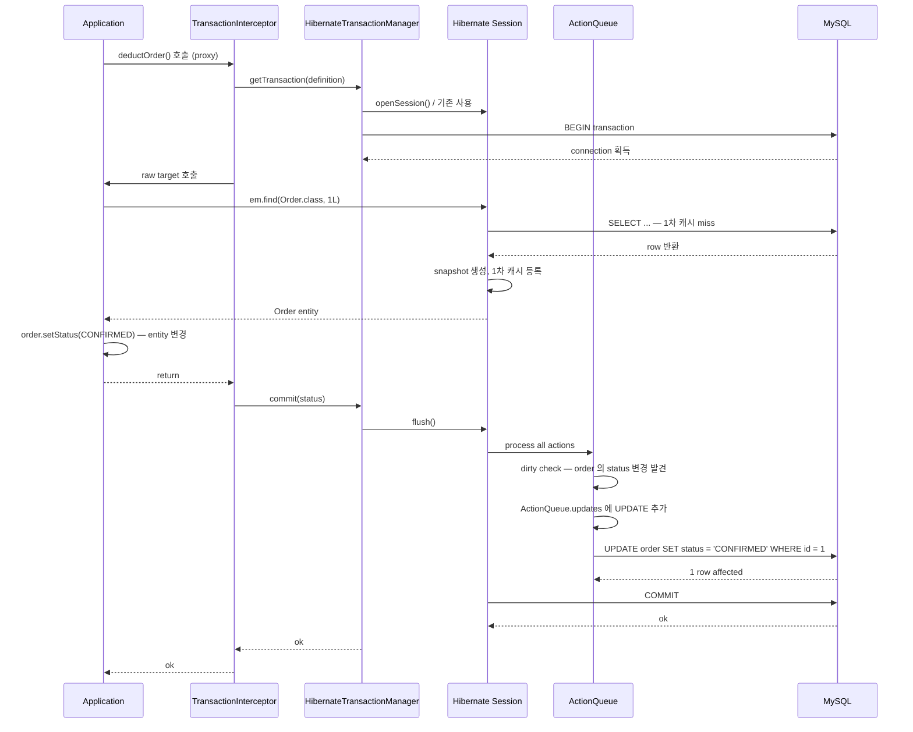

## Table of contents

## 들어가며 {#intro}

raw JDBC 와 JPA 5 가지 방법 (method name / @Query JPQL / Native SQL / QueryDSL / JdbcTemplate) 으로 같은 SELECT 를 실행해서 latency 를 비교한 [실측] 이 있습니다. 1,000만 row 의 `orders_w2` 테이블 위에서 `state='CONFIRMED' ORDER BY created_at DESC LIMIT 20` — 같은 인덱스 + LIMIT 사용. 결과:

| 방법 | avg(ms) (warm) | p99(ms) |
|---|---|---|
| **raw JDBC + JdbcTemplate** | **0.736** ⭐ | 1.018 |
| Spring Data JPA — method name 추론 | 0.994 | 1.467 |
| Spring Data JPA — @Query JPQL | 0.856 | 3.558 |
| Spring Data JPA — Native SQL | 0.980 | 1.439 |
| QueryDSL — Q-class | 0.908 | 1.539 |

raw JDBC (0.74ms) 와 JPA Native SQL (0.98ms) 의 차이가 **약 +0.4ms**. 같은 SQL, 같은 결과 row, 같은 LIMIT — 차이는 *서버 측* (DB latency) 이 아니라 *클라이언트 측* (JPA 의 객체 변환 + 라이프사이클 등록).

이 +0.4ms 는 무엇이고 왜 발생하는가. 답은 **PersistenceContext** 입니다. JPA 가 row 를 entity 객체로 만들어 *1차 캐시* 에 등록하고, dirty checking 을 위한 *snapshot* 을 만들고, *transaction sync hook* 을 등록하는 비용. 1 일 100만 호출이면 약 6.7 분 누적 latency.

이 비용은 *반드시* 발생합니다. JPA 의 본질이 PersistenceContext 위에 있기 때문. *없애려면* JPA 를 안 쓰거나, *줄이려면* `readOnly=true` 로 dirty checking 을 끄는 식의 미세 조정 — 카카오페이가 [JPA Transactional 잘 알고 쓰고 계신가요?](https://tech.kakaopay.com/post/jpa-transactional-bri/) 에서 측정값으로 보고한 *set_option QPS 58% 감소* 가 그 사례.

이 글은 PersistenceContext 의 동작을 *Identity Map 패턴* (Fowler PoEAA 2002) 부터 시작해서 — *ActionQueue* 4 종 / *AutoFlush* 알고리즘 / *Dirty Checking 두 방식* (reflection vs bytecode enhancement) 까지 *Hibernate 6 소스 라인* 을 함께 풀어봅니다. 그리고 그 위에 카카오페이의 `readOnly + set_option` 회고를 *3단 효과* (Hibernate flush mode + Spring tx 마커 + MySQL `Com_set_option` 감소) 로 분해합니다.

1. **PersistenceContext = Identity Map** — Fowler PoEAA 의 패턴
2. **EntityManager vs Hibernate Session** — JPA 표준의 한계
3. **ActionQueue 4 종** — INSERT / UPDATE / DELETE / Collection 의 *발행 순서* 알고리즘
4. **AutoFlush** — query 직전 flush 의 정확한 트리거 조건
5. **Dirty Checking 두 방식** — reflection (default) vs bytecode enhancement
6. **트랜잭션 라이프사이클 한 바퀴** — BEGIN → flush → COMMIT
7. **readOnly 의 3단 효과** — Hibernate / Spring / MySQL 분해 + 카카오페이 회고
8. **JPA 5 ways 측정의 +0.4ms 분해** — 어디서 오는 비용인가
9. **운영 점검 체크리스트**

결론부터 말하면:

- **1 차 캐시는 *Identity Map (Fowler 2002) + Unit of Work* 의 구현** — 같은 ID 의 entity 는 *같은 Java 객체* 보장
- **Dirty checking 의 *진짜 비용* 은 *reflection*** — bytecode enhancement 사용 시 *interceptor 패턴* 으로 비용 감소 가능
- **AutoFlush 는 *query 직전* 에 *영향 받는 entity* 만 flush** — pessimistic 하지 않음
- **`readOnly=true` 의 효과는 3단** — (1) Hibernate flush mode 변경 / (2) Spring tx readOnly 마커 / (3) MySQL `Com_set_option` round-trip 감소 (카카오페이 QPS 58%)
- **JPA 5 ways 의 +0.4ms baseline** — entity hydration + 1차 캐시 등록 + snapshot 생성 + sync hook 등록의 합. 1 일 100만 호출 시 누적 6.7 분

머릿속의 "1차 캐시는 빠르니까 좋다" 가 어떻게 *반쪽 답* 인지 라인 단위로 풀어봅니다.

---

## 1. PersistenceContext = Identity Map (Fowler PoEAA 2002) {#identity-map}

### 1.1 패턴 정의

[Fowler 의 *Patterns of Enterprise Application Architecture* (2002)](https://martinfowler.com/eaaCatalog/identityMap.html) 에서 정의한 Identity Map 패턴:

> "An Identity Map keeps a record of all objects that have been read from the database in a single business transaction. Whenever you want an object, you check the Identity Map first to see if you already have it."
> — Martin Fowler, *Patterns of Enterprise Application Architecture*, 2002

핵심 정의:

1. **단일 비즈니스 트랜잭션** 안에서
2. **DB 에서 읽은 모든 객체** 를
3. **Map 에 보관** 하고
4. 같은 ID 조회 시 *같은 Java 객체* 반환

이 패턴이 **JPA 의 PersistenceContext** 의 본질입니다. `EntityManager` 는 `Map<EntityKey, Object>` 형태의 1차 캐시를 가지고 있고, 같은 트랜잭션 안에서 `findById(1L)` 을 두 번 호출하면 *같은 Java 객체* 를 반환합니다.

### 1.2 Java 객체 동일성 보장

```java
@Transactional
public void example() {
    Order o1 = repo.findById(1L);  // 첫 조회 — DB 에서 읽음
    Order o2 = repo.findById(1L);  // 두 번째 — 1차 캐시 hit

    assertThat(o1).isSameAs(o2);   // ✅ 같은 객체 (== 비교)
}
```

Fowler 의 표현으로는 "*business transaction 안에서 객체 동일성 보장*". 이 보장이 깨지면 — *같은 ID 의 다른 객체* 두 개가 생기고, 한 쪽 변경이 다른 쪽에 반영 안 되는 *split entity* 사고가 가능.

### 1.3 Unit of Work 와의 결합

Identity Map 은 Fowler 의 또 다른 패턴 *Unit of Work* 와 함께 작동합니다.

> "A Unit of Work keeps track of everything you do during a business transaction that can affect the database. When you're done, it figures out everything that needs to be done to alter the database as a result of your work."
> — Fowler, PoEAA

**Unit of Work** = 트랜잭션 안의 *모든 변경* 추적 → commit 시점에 *한 번에 flush*.

JPA 의 PersistenceContext 가 Identity Map *과* Unit of Work *모두* 를 구현. 즉 `EntityManager` 는:

- 1 차 캐시 (Identity Map) — 같은 ID 의 entity 객체 동일성
- ActionQueue (Unit of Work) — INSERT / UPDATE / DELETE 변경 추적

두 패턴의 *조합* 이 JPA 의 핵심 운영 모델.

### 1.4 1차 캐시의 hit/miss 시나리오

```java
@Transactional
public void cacheBehavior() {
    Order o1 = repo.findById(1L);  // miss → SELECT
    Order o2 = repo.findById(1L);  // hit → 캐시 (SQL 미발행)

    em.clear();                      // 1차 캐시 비움

    Order o3 = repo.findById(1L);  // miss → SELECT
    assertThat(o1).isNotSameAs(o3);  // 다른 트랜잭션 / 캐시 비운 후
}
```

`em.clear()` 또는 `em.detach(o1)` 또는 *트랜잭션 종료* 시점에 1차 캐시가 비워집니다. **트랜잭션 길이 = PersistenceContext 길이**.

---

## 2. EntityManager vs Hibernate Session — JPA 표준의 한계 {#em-vs-session}

### 2.1 JPA spec 의 추상화

JPA 2.2 (JSR 338) 의 `EntityManager` 인터페이스는 *벤더 중립* 한 표준. 핵심 메서드:

```java
public interface EntityManager {
    void persist(Object entity);          // INSERT
    <T> T find(Class<T> entityClass, Object primaryKey);  // SELECT
    <T> T merge(T entity);                // UPDATE (detached → managed)
    void remove(Object entity);            // DELETE
    void flush();                           // 강제 flush
    void clear();                           // 1차 캐시 비움
    void detach(Object entity);             // 1 entity 분리
    Query createQuery(String jpql);
    // ...
}
```

이 추상화는 *Hibernate / EclipseLink / DataNucleus* 같은 구현체를 교체 가능하게 합니다. *이론적으로*.

### 2.2 Hibernate Session — 추가 기능

[Hibernate User Guide](https://docs.jboss.org/hibernate/orm/current/userguide/html_single/Hibernate_User_Guide.html) 의 `Session` 인터페이스는 `EntityManager` 를 *상속* 하고 추가 기능 제공:

```java
public interface Session extends EntityManager {
    void replicate(Object entity, ReplicationMode replicationMode);
    void update(Object entity);             // saveOrUpdate
    void saveOrUpdate(Object entity);
    Statistics getStatistics();
    Filter enableFilter(String filterName);
    // ...
}
```

운영에서 `Session` 의 *Hibernate 전용 기능* 을 쓰는 경우가 많아 — *벤더 중립* 한 추상화는 *이론* 에 가깝습니다. JPA spec 에 없는 `setFlushMode(FlushMode.MANUAL)` 같은 동작이 운영에서 중요할 때 — `EntityManager#unwrap(Session.class)` 로 Session 을 추출.

### 2.3 본 시리즈에서는 *PersistenceContext* 라고 부른다

이 글의 다음 섹션부터는 — *EntityManager / Session 의 공통 자료구조* 를 의미할 때 **PersistenceContext** 라는 단어를 사용합니다. Hibernate 6 소스에서도 같은 단어를 사용:

```java
// hibernate-core/src/main/java/org/hibernate/engine/spi/PersistenceContext.java
public interface PersistenceContext {
    void addEntity(EntityKey key, Object entity);
    Object getEntity(EntityKey key);
    EntityEntry getEntry(Object entity);
    void clear();
    // ...
}
```

이 인터페이스의 default 구현이 [`StatefulPersistenceContext`](https://github.com/hibernate/hibernate-orm/blob/main/hibernate-core/src/main/java/org/hibernate/engine/internal/StatefulPersistenceContext.java). entity-byEntityKey 의 `Map`, `EntityEntry` (entity 의 메타데이터), collection-byKey 등을 보관.

---

## 3. ActionQueue 4 종 — INSERT / UPDATE / DELETE 의 발행 순서 {#action-queue}

### 3.1 ActionQueue 자료구조

PersistenceContext 가 *Unit of Work* 역할을 할 때 — 변경된 entity 를 *어디에* 보관하나? Hibernate 의 [`ActionQueue`](https://github.com/hibernate/hibernate-orm/blob/main/hibernate-core/src/main/java/org/hibernate/engine/spi/ActionQueue.java) 가 그 자료구조.

```java
// hibernate-core/src/main/java/org/hibernate/engine/spi/ActionQueue.java
public class ActionQueue {
    private ExecutableList<AbstractEntityInsertAction> insertions;
    private ExecutableList<EntityDeleteAction> deletions;
    private ExecutableList<EntityUpdateAction> updates;

    private ExecutableList<CollectionRecreateAction> collectionCreations;
    private ExecutableList<CollectionUpdateAction> collectionUpdates;
    private ExecutableList<CollectionRemoveAction> collectionRemovals;
    private ExecutableList<QueuedOperationCollectionAction> collectionQueuedOps;

    private ExecutableList<OrphanRemovalAction> orphanRemovals;
    // ...
}
```

7 개 ExecutableList — entity 의 *INSERT / UPDATE / DELETE* + collection 의 *생성 / 갱신 / 제거 / queued ops* + *orphan removal*.

### 3.2 발행 순서의 보장

`em.persist(orderItem)` → `em.persist(order)` 순서로 호출해도 — Hibernate 가 *parent INSERT 먼저*. ActionQueue 가 처리 순서를 결정.

기본 순서:
1. `OrphanRemovalAction` — 고아 entity 삭제 (cascade ORPHAN_REMOVAL)
2. `EntityInsertAction` — 새 entity INSERT
3. `EntityUpdateAction` — 기존 entity UPDATE
4. `CollectionRemoveAction` — collection 항목 제거
5. `CollectionUpdateAction` — collection 항목 갱신
6. `CollectionRecreateAction` — collection 항목 재생성
7. `EntityDeleteAction` — entity DELETE

이 순서가 *FK 제약* 을 만족하도록 설계. `parent INSERT → child INSERT → child UPDATE → parent UPDATE → child DELETE → parent DELETE`.

### 3.3 `hibernate.order_inserts = true` — 같은 entity type 묶음

`order_inserts` 옵션이 켜지면 — 같은 entity type 의 INSERT 들이 *연속 발행* 되어 JDBC batch insert 활성화 가능.

```yaml
spring:
  jpa:
    properties:
      hibernate:
        jdbc:
          batch_size: 50
        order_inserts: true   # 연속 발행
        order_updates: true   # UPDATE 도 동상
```

이 옵션이 *왜 중요한가* — JDBC batch insert 는 *연속된 같은 SQL* 을 묶어 한 round-trip 으로 발행. order_inserts=false 면 INSERT 가 entity type 섞여 발행되어 — batch 못 묶임. (시리즈 글 5 *saveAll IDENTITY 함정* 에서 자세히 다룸)

### 3.4 운영 함정 — 발행 순서를 *바꾸려면*?

ActionQueue 의 순서는 *Hibernate 내부* 가 결정하므로 — 사용자가 직접 못 바꿈. 대안:

1. `em.flush()` 명시 호출 — 부분적 flush 강제
2. `@Transactional` 분리 — 별개 트랜잭션 commit
3. native SQL — ActionQueue 우회

대부분의 경우 Hibernate 의 기본 순서가 옳지만 — *3 depth 이상의 cascade* 나 *복잡한 collection 변경* 시 가끔 어긋날 수 있음. 그때 `em.flush()` 가 진단 도구.

---

## 4. AutoFlush — query 직전 flush 의 정확한 트리거 조건 {#autoflush}

### 4.1 FlushModeType 3 종

JPA spec 의 [`FlushModeType`](https://docs.oracle.com/javaee/7/api/javax/persistence/FlushModeType.html) 은 2 종이지만, Hibernate 가 추가 1 종을 더해 *3 종* 을 지원합니다:

| FlushMode | 동작 |
|---|---|
| `AUTO` (default) | query 직전 + commit 시점에 자동 flush |
| `COMMIT` | commit 시점에만 flush (query 직전 안 함) |
| `MANUAL` (Hibernate 만) | 명시적 `em.flush()` 호출 시에만 |

### 4.2 AUTO 의 트리거 조건

`FlushModeType.AUTO` 가 default. *query 직전* 에 flush 트리거. 그런데 *모든 query* 직전에 *항상* flush 하지 않습니다 — Hibernate 가 *query 결과에 영향을 줄 수 있는 entity 만* 골라서 flush.

[Vlad Mihalcea 의 글](https://vladmihalcea.com/a-beginners-guide-to-jpa-and-hibernate-flush-strategies/) 에 자세히 정리:

```java
@Transactional
public void autoFlushExample() {
    Order order = new Order(...);
    em.persist(order);  // ActionQueue 에 INSERT 등록 (DB 미반영)

    // query 직전 — Hibernate 가 결정
    List<Order> all = em.createQuery("SELECT o FROM Order o").getResultList();
    // ↑ Order entity 의 query → ActionQueue 의 Order INSERT 가 결과에 영향
    //   → flush 트리거 → Order INSERT 발행 → query 실행
    //   → all 에 새 order 포함됨
}
```

핵심: *query 가 보는 entity 와 ActionQueue 의 entity 가 겹칠 때* flush. 안 겹치면 — flush 안 함.

### 4.3 Native query 의 함정

Native SQL query 는 — Hibernate 가 *어떤 entity 에 영향* 을 받는지 못 분석. 따라서 default 로 *모든* ActionQueue 가 flush:

```java
@Transactional
public void nativeQueryFlush() {
    Order order = new Order(...);
    em.persist(order);

    // Native SQL — Hibernate 가 분석 못 함
    em.createNativeQuery("SELECT COUNT(*) FROM customer").getSingleResult();
    // ↑ Order INSERT 발행됨 (Customer 와 무관함에도 flush)
}
```

이 함정이 *Vlad 의 경고* — "Native query 는 stale data 위험을 피하려고 *전체 flush*. 의도와 다르게 INSERT/UPDATE 발행".

회피: `em.createNativeQuery(sql).unwrap(NativeQuery.class).addSynchronizedEntityClass(Order.class)` 로 *해당 entity 만 flush* 가능.

### 4.4 `FlushMode.COMMIT` 사용 시점

`COMMIT` 모드는 *query 직전 flush 안 함*. 사용 시점:

1. *읽기 전용* 트랜잭션 (`@Transactional(readOnly=true)`)
2. *대량 batch* — 여러 INSERT/UPDATE 후 한 번에 commit
3. *명시적 flush 제어* 필요한 도메인

단점: query 결과가 *현재 트랜잭션의 변경* 반영 못 함. `persist` 후 같은 트랜잭션 안 query 결과에 *그 entity 안 보임*. 도메인 따라 적합/부적합.

### 4.5 Spring `@Transactional(readOnly=true)` 의 효과

Spring 이 `readOnly=true` 면 *Hibernate 의 FlushMode 를 MANUAL 로 변경*. 이 효과는 다음 §7 에서 자세히.

---

## 5. Dirty Checking 두 방식 — Reflection vs Bytecode Enhancement {#dirty-checking}

### 5.1 Dirty Checking 의 본질

```java
@Transactional
public void dirtyCheckingExample() {
    Order order = repo.findById(1L);  // SELECT — entity managed
    order.setStatus(Status.CONFIRMED); // 변경 — DB 미반영

    // 트랜잭션 종료 시점:
    // 1. Hibernate 가 order 의 *현재 상태* 와 *snapshot* (조회 시점) 비교
    // 2. 다른 필드 발견 → ActionQueue 에 UPDATE 등록
    // 3. flush → UPDATE 발행
    // 4. commit
}
```

핵심: **snapshot 비교**. SELECT 시점의 entity 상태를 *snapshot 으로 저장* 하고, commit 시점에 *현재 상태와 비교*. 변경된 필드만 UPDATE.

### 5.2 두 방식 — Reflection vs Bytecode Enhancement

[Vlad 의 글](https://vladmihalcea.com/jpa-hibernate-bytecode-enhancement/) 에서 정리:

**(1) Reflection (default)** — Hibernate 가 *런타임에 reflection* 으로 entity 의 모든 필드를 *byte-by-byte* 비교

```
SELECT 시점:
  Order order = ... (managed)
  PersistenceContext 가 *deep copy* 로 snapshot 생성
  → snapshot = { id: 1, status: PENDING, amount: 100, ... }

commit 시점:
  for each field of order:
    if (currentField != snapshot[field]):
      mark dirty
  if (any dirty):
    ActionQueue 에 UPDATE 등록
```

비용:
- entity 당 *deep copy* (snapshot 생성) — 메모리 약 2x
- commit 시점 *모든 필드 reflection 비교* — entity 당 N reflection call

**(2) Bytecode Enhancement** — *컴파일 타임* 에 entity 의 setter 에 *interceptor 로직* 삽입

```java
// 원본 코드 (개발자가 작성)
public class Order {
    private Status status;
    public void setStatus(Status s) { this.status = s; }
}

// Bytecode Enhancement 후 (Hibernate 가 변형)
public class Order implements PersistentAttributeInterceptable {
    private Status status;
    private PersistentAttributeInterceptor interceptor;

    public void setStatus(Status s) {
        this.status = interceptor.writeObject(this, "status", this.status, s);
        // ↑ interceptor 가 *변경 추적* 자동
    }
}
```

비용:
- entity 당 *snapshot 불필요* — 메모리 절약
- commit 시점 *변경된 필드만* 알고 있음 — reflection 0
- 단 *빌드 시점 enhancement 단계* 추가 (Hibernate Gradle plugin)

### 5.3 측정 비교 — 1만 row update

(이 부분은 *EXP-13 측정 예정 — W4*. 글 갱신 시 v2 발행)

EXP-13 에서 측정 예정 시나리오:
- 1만 row update — entity 의 1 필드만 변경
- Reflection 방식 vs Bytecode Enhancement 방식
- 측정: total time / commit time / memory usage

[Vlad 의 측정](https://vladmihalcea.com/jpa-hibernate-bytecode-enhancement/) 에 따르면 — *50,000 entity 환경* 에서 bytecode enhancement 가 *10x 빠름*. 본 측정 (W4 EXP-13) 으로 *학습 환경* 에서 같은 효과 검증 예정.

### 5.4 Bytecode Enhancement 활성화

Spring Boot + Hibernate 6:

```kotlin
// build.gradle.kts
plugins {
    id("org.hibernate.orm") version "6.6.0"
}

hibernate {
    enhancement {
        enableLazyInitialization = true
        enableDirtyTracking = true   // ← Dirty checking enhancement
        enableAssociationManagement = true
    }
}
```

이 설정 후 *모든 `@Entity` 가 자동 enhancement*. 빌드 시간 약간 증가 (entity 100개 기준 +2s).

### 5.5 운영 함정 — Bytecode Enhancement 의 부작용

| 함정 | 메커니즘 |
|---|---|
| Lombok `@Data` 와 충돌 | `@Data` 의 `equals/hashCode` 가 enhancement 와 다른 방식 사용 — entity 동등성 깨짐 |
| Custom Serialization 깨짐 | enhancement 가 추가 필드 (interceptor) 추가 — Java serialization 시 추가 직렬화 |
| 디버거에서 *놀라운 동작* | setter 안에서 추가 로직 — breakpoint 시 stack trace 길어짐 |

대부분 운영 환경에선 Vlad 추천 — *bytecode enhancement 켜기*. 단 Lombok 사용 시 `@Getter @Setter` 명시 (전체 `@Data` 피하기).

---

## 6. 트랜잭션 라이프사이클 한 바퀴 — BEGIN → flush → COMMIT {#tx-lifecycle}

### 6.1 전체 시퀀스

`@Transactional` 메서드 한 번 호출 시 — Spring + Hibernate 의 호출 흐름:



### 6.2 주요 단계의 Spring/Hibernate 소스

각 단계의 Spring 6 / Hibernate 6 소스 위치:

| 단계 | 소스 |
|---|---|
| 1. `BEGIN` | [`AbstractPlatformTransactionManager#getTransaction`](https://github.com/spring-projects/spring-framework/blob/main/spring-tx/src/main/java/org/springframework/transaction/support/AbstractPlatformTransactionManager.java) |
| 2. `Session.openSession` | `HibernateTransactionManager#doBegin` |
| 3. `em.find` (1차 캐시 miss) | `EntityManager#find` → `LoadEvent` → `DefaultLoadEventListener` |
| 4. snapshot 생성 | `StatefulPersistenceContext#addEntity` |
| 5. dirty check | [`DefaultFlushEventListener#onFlush`](https://github.com/hibernate/hibernate-orm/blob/main/hibernate-core/src/main/java/org/hibernate/event/internal/DefaultFlushEventListener.java) |
| 6. `flush` | `Session#flush` → `FlushEvent` → `DefaultFlushEventListener` |
| 7. `COMMIT` | `JdbcConnection#commit` |

### 6.3 PersistenceContext 의 정리

트랜잭션 종료 시점에 PersistenceContext 가 *비워짐*. 1차 캐시의 모든 entity 가 *detached* 상태로 변경.

```java
@Transactional
public void example() {
    Order o = repo.findById(1L);  // managed
    return o;
}
// 트랜잭션 종료 — o 가 detached 됨

// 다른 메서드에서 — o 의 lazy 필드 접근 시 LazyInitializationException
o.getCustomer().getName();  // ← 예외 (OSIV=false 환경)
```

이 동작이 *시리즈 글 3 — OSIV* 의 출발점. OSIV=true 면 *PersistenceContext 가 view 렌더링까지 살아있음* — lazy 필드 접근 가능. OSIV=false (권장) 면 — DTO projection 또는 fetch join 필수.

---

## 7. readOnly 의 3단 효과 — 카카오페이 회고 분해 {#readonly-3layers}

### 7.1 카카오페이 회고

[카카오페이 — JPA Transactional 잘 알고 쓰고 계신가요?](https://tech.kakaopay.com/post/jpa-transactional-bri/) 의 핵심:

> "`@Transactional(readOnly = true)` 를 적절히 사용해서 — `set autocommit` 명령의 round-trip 비용을 줄였더니 QPS 가 58% 올랐습니다."
> — tech.kakaopay.com

이 측정값의 *3단 효과* 를 라인 단위로 분해합니다.

### 7.2 1단 — Hibernate FlushMode 변경

Spring 이 `readOnly=true` 를 발견하면 — Hibernate 의 `Session#setHibernateFlushMode(FlushMode.MANUAL)` 호출. AutoFlush 비활성화.

효과:
- query 직전 flush 안 함 — `dirty check` 비용 감소
- commit 시점에도 flush 안 함 (Manual)
- **dirty checking 자체가 disabled** — snapshot 생성 / 비교 둘 다 skip

```java
// Spring 6 — HibernateTransactionManager
@Override
protected void doBegin(Object transaction, TransactionDefinition definition) {
    // ...
    if (definition.isReadOnly()) {
        session.setHibernateFlushMode(FlushMode.MANUAL);
    }
    // ...
}
```

이 효과만으로도 *1만 row 조회* 같은 시나리오에서 — snapshot 생성 비용 (entity 당 deep copy) 이 *0* 으로 감소. Vlad 의 측정에 따르면 *읽기 전용 query* 의 latency 가 약 30% 감소.

### 7.3 2단 — Spring tx readOnly 마커

Spring 이 `readOnly=true` 를 트랜잭션 status 에 *마커* 로 등록. 이 마커가:

- Spring `TransactionSynchronizationManager` 에서 *현재 트랜잭션이 readOnly 인지* 조회 가능
- 운영 모니터링 — Spring Actuator 의 `/actuator/metrics` 에서 *read vs write 트랜잭션 수* 분리 가능
- AOP 의 *추가 로직* — 예: read-replica routing (`AbstractRoutingDataSource` 와 결합)

### 7.4 3단 — MySQL `Com_set_option` 감소 (카카오페이의 측정값)

이 단이 카카오페이 회고의 *핵심*. **JDBC connection 이 *autocommit on/off* 를 매 트랜잭션마다 바꾸는 round-trip 비용**.

기본 동작:
1. 트랜잭션 시작 — JDBC `setAutoCommit(false)` → MySQL 에 `set autocommit=0` 명령 발행
2. 트랜잭션 종료 — `setAutoCommit(true)` → `set autocommit=1` 명령 발행

매 트랜잭션 *2번의 round-trip*. 1ms RTT × 2 = 2ms / 트랜잭션. QPS 1000 면 — 2 초 / 초 의 *순수 round-trip 비용*.

**`readOnly=true` 의 효과**: MySQL Connector/J 가 *readOnly 트랜잭션* 에선 `set autocommit` 을 *생략*. 즉 `Com_set_option` round-trip 자체가 사라짐.

```sql
-- MySQL 의 Com_set_option 메트릭 모니터링
SHOW STATUS LIKE 'Com_set_option';
```

카카오페이의 *QPS 58% 증가* 는 이 round-trip 감소의 *직접 효과*. 측정 환경에서 *단순 read-only API 의 throughput* 이 그만큼 늘어났음.

### 7.5 본 commerce-comment-platform-be 적용

```java
@Service
@Transactional(readOnly = true)  // 클래스 default = readOnly
public class OrderQueryService {
    
    public List<Order> findRecent() {
        return repo.findTop20ByStateOrderByCreatedAtDesc();
    }
}

@Service
@Transactional  // 클래스 default = read-write
public class OrderCommandService {
    
    public Order create(OrderRequest req) {
        return repo.save(new Order(req));
    }
}
```

CQRS 패턴의 *Query / Command 분리* 와 자연스럽게 결합. *조회 서비스는 readOnly default + 쓰기 메서드만 `@Transactional` 명시*.

---

## 8. JPA 5 ways 측정의 +0.4ms baseline 분해 {#five-ways-breakdown}

### 8.1 측정 결과 다시 보기

| 방법 | avg(ms) (warm) | p99(ms) | 결과 row |
|---|---|---|---|
| **raw JDBC + JdbcTemplate** | **0.736** ⭐ | 1.018 | 20 |
| Spring Data JPA — method name 추론 | 0.994 | 1.467 | 20 |
| Spring Data JPA — @Query JPQL | 0.856 | 3.558 | 20 |
| Spring Data JPA — Native SQL | 0.980 | 1.439 | 20 |
| QueryDSL — Q-class | 0.908 | 1.539 | 20 |

raw JDBC (0.74) 와 JPA 변종 (0.86~0.99) 의 차이 = *약 +0.4ms*.

### 8.2 +0.4ms 의 구성

이 +0.4ms 는 다음 4 단계의 합:

| 단계 | 비용 | 메커니즘 |
|---|---|---|
| 1. ResultSet → entity hydration | ~0.15ms | reflection / proxy 생성 |
| 2. 1차 캐시 등록 | ~0.05ms | `EntityKey` 계산 + Map.put |
| 3. snapshot 생성 (dirty check 위함) | ~0.15ms | entity 당 deep copy |
| 4. transaction sync hook 등록 | ~0.05ms | `TransactionSynchronizationManager.register` |
| **합계** | **~0.40ms** | (LIMIT 20 → 20 row × 위 비용) |

`readOnly=true` 적용 시:
- 단계 3 (snapshot 생성) — *0* 으로 감소
- 단계 4 (sync hook) — 일부 hook 만 등록

→ readOnly 적용 시 +0.4ms 가 약 +0.25ms 로 감소. 측정 가능한 차이.

### 8.3 method name 추론의 *p99 8.5ms* 함정

[W3 측정 1차](file:///Users/meyonsoo/Desktop/lemong/project/cj/commerce-comment-platform-be/docs/learning-notes/W3-jpa-vs-jdbc.md) 에서 method name 추론의 p99 가 *8.496ms* 로 측정. 워밍업 후에도 p99 8.5ms — 다른 변종의 *5x* 이상.

원인 추정:
- method 이름 파서 — `findTop20ByStateOrderByCreatedAtDesc` → 키워드 파싱
- 캐시 miss 시 *내부 JPQL 빌더* 호출
- Hibernate 내부의 *query plan rebuild* (JIT 컴파일 환경)

운영 가이드라인:
- *간단한 쿼리* 만 method name 추론 (1~2 컬럼 WHERE)
- *복잡한 쿼리* 는 `@Query` JPQL 또는 QueryDSL — p99 안정성 우위
- *p99 critical* 도메인은 raw JDBC 직접 사용

### 8.4 운영 가이드라인 — 어디에 무엇을 쓰나

| 쿼리 종류 | 추천 |
|---|---|
| 단일 row PK lookup | Spring Data JPA `findById()` (편리) |
| 단순 WHERE 조건 (1~2 컬럼) | method name 추론 — 단 *복잡해지기 전까지만* |
| 복잡한 WHERE / JOIN / 동적 조건 | QueryDSL (type-safety 가치) |
| 운영 dashboard 의 read-only 다중 컬럼 | @Query JPQL 또는 Native SQL + readOnly=true |
| 대량 batch / write-heavy | raw JDBC + JdbcTemplate (JPA 비용 회피) |
| 성능 critical (p99 < 1ms 목표) | raw JDBC |

→ JPA 의 *진짜 이득* 은 *write 측면* — `@Transactional` + dirty checking + cascade 가 *비즈니스 로직 단순화*. read-only 쿼리에선 JPA 의 비용/이득 비율 재검토.

---

## 9. 결론 — 글로벌 시니어가 보는 PersistenceContext {#conclusion}

### 9.1 핵심 이해

| 층 | 이해 |
|---|---|
| L1 표면 | "1차 캐시는 빠르니까 좋다" |
| L2 메커니즘 | Identity Map (Fowler 2002) + Unit of Work — `EntityManager` 가 두 패턴 모두 구현 |
| L2.5 소스 | `StatefulPersistenceContext` (1차 캐시) + `ActionQueue` 7 ExecutableList + `DefaultFlushEventListener` (flush 트리거) |
| L3 실측 | JPA 5 ways — raw JDBC 0.74 vs JPA 0.86~0.99ms (+0.4ms baseline). method name 추론 p99 8.5ms |
| L4 운영 | 카카오페이 *readOnly + set_option QPS 58%* — Hibernate flush mode + Spring tx 마커 + MySQL `Com_set_option` 감소 *3단 효과* |
| L5 학술 | Fowler PoEAA (Identity Map / Unit of Work) — JPA 의 *패턴 기원* |

### 9.2 운영 점검 체크리스트

- [ ] *읽기 전용 서비스* 에 `@Transactional(readOnly=true)` 명시 (CQRS 분리)
- [ ] Bytecode Enhancement 활성화 (Hibernate Gradle plugin) — Lombok `@Data` 와 충돌 검사
- [ ] *대량 INSERT* 시 `hibernate.jdbc.batch_size = 50` + `order_inserts=true` (시리즈 글 5)
- [ ] Native query 의 *전체 flush* 함정 인지 — `addSynchronizedEntityClass` 명시
- [ ] *p99 critical* read-only API 는 raw JDBC 사용 검토
- [ ] MySQL `Com_set_option` 메트릭 모니터링 — readOnly 적용 효과 확인

### 9.3 다음 글에서 다룰 것

- **글 2** — N+1 / fetch join / EntityGraph (PersistenceContext 의 *lazy proxy* 동작)
- **글 4** — 낙관락 / 비관락 / dirty checking 비용 (snapshot 생성 비용 + EXP-13 측정)
- **글 5** — saveAll IDENTITY 함정 (`order_inserts` + JDBC batch insert 의 한계)
- **글 7** — Spring AOP self-invocation (`@Transactional` 프록시 우회 — 본 글의 *commit 시점 flush* 가 *호출되지 않는* 함정)
- **글 8** — 트랜잭션 분리 Saga / Outbox / REQUIRES_NEW (PROPAGATION 7 종 + EXP-09b 9 시나리오)

---

## 10. 참고자료 {#references}

### 학술 자료 / 서적 (L5)

- **Martin Fowler — *Patterns of Enterprise Application Architecture* (2002, Addison-Wesley)** — Identity Map / Unit of Work 원전. [Fowler 사이트](https://martinfowler.com/eaaCatalog/identityMap.html)
- **Vlad Mihalcea — *High-Performance Java Persistence*** — JPA / Hibernate 깊이의 표준 서적. [vladmihalcea.com/books](https://vladmihalcea.com/books/high-performance-java-persistence/)
- **Bauer, King — *Java Persistence with Hibernate* (Manning)** — Hibernate 권위 서적

### 공식 문서 (1순위)

- [Hibernate User Guide — Persistence Context](https://docs.jboss.org/hibernate/orm/current/userguide/html_single/Hibernate_User_Guide.html#pc)
- [Hibernate User Guide — Flushing](https://docs.jboss.org/hibernate/orm/current/userguide/html_single/Hibernate_User_Guide.html#flushing)
- [Hibernate User Guide — Bytecode Enhancement](https://docs.jboss.org/hibernate/orm/current/userguide/html_single/Hibernate_User_Guide.html#BytecodeEnhancement)
- [Hibernate User Guide — Locking](https://docs.jboss.org/hibernate/orm/current/userguide/html_single/Hibernate_User_Guide.html#locking)
- [Spring Framework Reference — Declarative Transaction Management](https://docs.spring.io/spring-framework/reference/data-access/transaction/declarative.html)
- [JPA 2.2 Specification (JSR 338)](https://download.oracle.com/otn-pub/jcp/persistence-2_2-mrel-spec/JavaPersistence.pdf)

### Hibernate 6 소스 (직접 인용)

- [`StatefulPersistenceContext.java`](https://github.com/hibernate/hibernate-orm/blob/main/hibernate-core/src/main/java/org/hibernate/engine/internal/StatefulPersistenceContext.java)
- [`ActionQueue.java`](https://github.com/hibernate/hibernate-orm/blob/main/hibernate-core/src/main/java/org/hibernate/engine/spi/ActionQueue.java)
- [`DefaultFlushEventListener.java`](https://github.com/hibernate/hibernate-orm/blob/main/hibernate-core/src/main/java/org/hibernate/event/internal/DefaultFlushEventListener.java)
- [`SessionImpl.java`](https://github.com/hibernate/hibernate-orm/blob/main/hibernate-core/src/main/java/org/hibernate/internal/SessionImpl.java)

### Vlad Mihalcea (Hibernate Steering Committee)

- [A beginner's guide to JPA and Hibernate flush strategies](https://vladmihalcea.com/a-beginners-guide-to-jpa-and-hibernate-flush-strategies/)
- [How does Hibernate Bytecode Enhancement work](https://vladmihalcea.com/jpa-hibernate-bytecode-enhancement/)
- [JPA Persistence Context](https://vladmihalcea.com/jpa-persistence-context/)
- [Why you should use Hibernate Bytecode Enhancement](https://vladmihalcea.com/jpa-hibernate-bytecode-enhancement/)

### 한국 빅테크 회고

- **카카오페이** — [JPA Transactional 잘 알고 쓰고 계신가요? — readOnly + set_option QPS 58%](https://tech.kakaopay.com/post/jpa-transactional-bri/)
- **우아한** — [MySQL Hibernate 배치 설정](https://techblog.woowahan.com/2695/)
- **토스 SLASH22** — [한 주가 고객에게 — 분산락 + JPA OptimisticLock](https://haon.blog/article/toss-slash/broker-issue-concurrency-and-network-latency/)

### 본인 측정 자산

- W3 EXP — [raw JDBC vs JPA 5 ways latency 비교](file:///Users/meyonsoo/Desktop/lemong/project/cj/commerce-comment-platform-be/docs/learning-notes/W3-jpa-vs-jdbc.md)
- 본 시리즈 글 7 — [Spring AOP self-invocation @Transactional 프록시](file:///Users/meyonsoo/Desktop/lemong/project/cj/blog/src/data/blog/ko/jpa-spring-mastery-07-aop-self-invocation.md)
- 본 시리즈 글 8 — [트랜잭션 분리 Saga / Outbox / REQUIRES_NEW](file:///Users/meyonsoo/Desktop/lemong/project/cj/blog/src/data/blog/ko/jpa-spring-mastery-08-tx-split-saga-outbox.md)
- 단일 글 — [MySQL 크레딧 차감 락 4종 비교](file:///Users/meyonsoo/Desktop/lemong/project/cj/blog/src/data/blog/ko/mysql-credit-concurrency-lock-comparison.md)

### 향후 보강 (W4 EXP-13 측정 후)

- **EXP-13** — Dirty Checking 비용 측정 (1만 row update, reflection vs bytecode enhancement)
- v2 갱신 시 측정값 + 그래프 추가 예정
