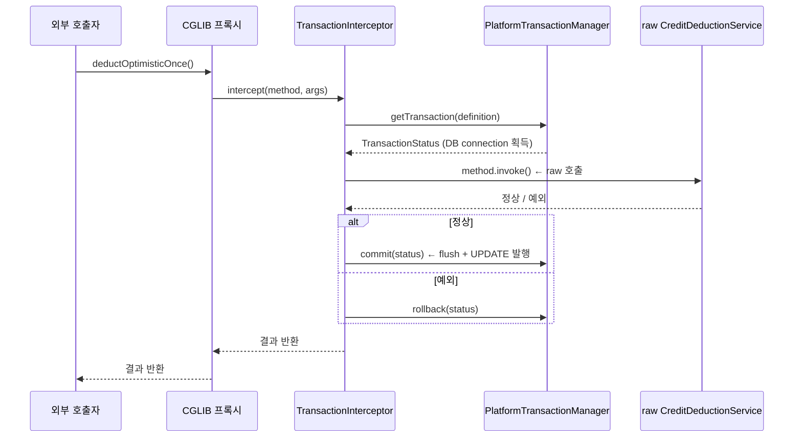

## Table of contents

## 들어가며 {#intro}

크레딧 차감 락 4종을 비교하던 중이었습니다. 잔액 100 인 계정에 100 worker 가 동시에 1씩 차감하는 시나리오. 비관락 / GET_LOCK / Redisson 까지 차례로 측정하다 **낙관락 차례에서 멈췄습니다**.

```
Strategy: 낙관락 (@Version)
totalMs: 549
successes: 100   ← 100% 성공
fails: 0         ← 실패 0
finalBalance: 100  ← ?? 잔액 그대로
```

`successes=100` 인데 `finalBalance=100`. **100 worker 가 모두 성공했다고 보고하는데 잔액이 그대로**. 코드 logic 을 다시 봐도 `acc.deduct(amount)` 는 명백히 차감하고 있었습니다. JPA dirty checking 으로 commit 시 UPDATE 가 나갈 줄 알았는데 — DB 에는 한 줄도 안 갔습니다.

원인은 `@Transactional` 이 발동하지 않은 것. 그리고 그 이유는 **같은 클래스 내부 호출이 Spring AOP 프록시를 우회**한 것이었습니다. 교과서에 나오는 그 *self-invocation* 함정 — 알고 있다고 생각했는데 측정값의 *모순*으로 발견할 줄은 몰랐습니다.

이 함정을 뼈대까지 풀어봤습니다. **`@Transactional` 이 어떻게 작동하는지** — Spring AOP 프록시가 어떻게 끼어드는지, `TransactionInterceptor#invoke` 가 어떤 6단계를 거치는지, AOP Alliance 의 `MethodInvocation.proceed()` 가 왜 raw target 을 호출하는지. 그리고 같은 함정에 걸리는 어노테이션이 6개나 더 있다는 것까지.

이 글은 그 분해의 기록입니다.

1. **사건** — `successes=100 / finalBalance=100` 측정값으로 self-invocation 발견
2. **Spring AOP 프록시 메커니즘** — JDK Dynamic Proxy vs CGLIB / `ProxyFactory` 호출 그래프
3. **`TransactionInterceptor#invoke` 6단계** — Spring 6 소스 라인 단위
4. **self-invocation 이 *왜* 우회되는가** — `MethodInvocation.proceed()` 의 raw target 호출 위치
5. **같은 함정에 걸리는 6 어노테이션** — `@Async` / `@Cacheable` / `@Validated` / `@Retryable` / `@PreAuthorize`
6. **4 가지 워크어라운드** — 분리 빈 / `getBean(self)` / `AopContext.currentProxy` / AspectJ weaving
7. **운영 진단법** — 측정값의 *모순* 으로 발견하는 패턴
8. **우아한 *이게 왜 롤백돼?* 사례와의 결합** — REQUIRED rollback-only 의 함정

결론부터 말하면:

- **self-invocation 은 logic 버그가 아니라 *바이트코드 dispatch* 의 결과** — Java 의 `this.method()` 가 invokevirtual 로 raw target 을 직접 호출하므로 프록시 chain 우회
- **6 개 어노테이션이 모두 같은 함정** — `@Transactional` / `@Async` / `@Cacheable` / `@Validated` / `@Retryable` / `@PreAuthorize` 모두 Spring AOP 프록시 기반
- **운영 진단의 핵심은 *측정값의 모순*** — successes=100 + 0 effect 같은 모순이 *프록시 우회 신호*
- **워크어라운드 4종 중 *분리 빈* 이 가장 안전** — `AopContext.currentProxy` 는 ThreadLocal 의존, AspectJ 는 빌드 복잡도 증가

머릿속의 "같은 클래스 내부 호출은 프록시 우회된다"가 *왜* 그런지, 그리고 그게 어떻게 *측정값으로 드러나는지* 라인 단위로 풀어봅니다.

---

## 1. 사건 — successes=100 인데 잔액이 그대로 {#incident}

### 1.1 측정 시나리오

크레딧 차감 도메인의 락 4종 비교 측정 중이었습니다. 같은 시나리오 (잔액 100 / 100 worker / 1씩 차감) 를 4 락 (낙관 / 비관 / MySQL `GET_LOCK` / Redisson) 으로 보호해서 처리량 + 정확성을 비교하는 [실측] 입니다.

비관락은 깔끔히 끝났습니다.

```
Strategy: 비관락 (FOR UPDATE)
totalMs: 180          ⭐
successes: 100
fails: 0
finalBalance: 0       ✅ 정확
```

GET_LOCK 도, Redisson 도 결과가 나왔습니다. 그런데 **낙관락 차례에서 측정값이 이상**했습니다.

```
Strategy: 낙관락 (@Version)
totalMs: 549
successes: 100         ← 100% 성공 보고
fails: 0
finalBalance: 100      ← ?? 잔액 그대로
```

100 worker 가 모두 *성공* 했다고 보고하는데 잔액이 한 푼도 안 줄었습니다. 비관락 결과 (`finalBalance: 0`) 와 비교하면 **명백한 모순**.

### 1.2 1차 의심 — 코드 logic

먼저 코드를 의심했습니다.

```java
@Service
public class CreditDeductionService {

    public void deductOptimistic(long accountId, long amount) {
        boolean done = false;
        int retry = 0;
        while (!done && retry < 50) {
            try {
                deductOptimisticOnce(accountId, amount);  // ← 핵심
                done = true;
            } catch (ObjectOptimisticLockingFailureException e) {
                retry++;
            }
        }
    }

    @Transactional(propagation = Propagation.REQUIRES_NEW)
    public void deductOptimisticOnce(long accountId, long amount) {
        AccountBalance acc = repo.findByAccountId(accountId);
        if (acc.getBalance() < amount) {
            throw new InsufficientBalanceException();
        }
        acc.deduct(amount);  // entity 의 setter — balance -= amount
        // dirty checking 으로 commit 시 UPDATE 발행 예상
    }
}
```

`acc.deduct(amount)` 는 명백히 잔액을 감소시킵니다. JPA 의 dirty checking 메커니즘으로 — `@Transactional` 메서드가 끝나면 `EntityManager` 가 변경된 entity 를 감지해서 UPDATE 쿼리를 발행해야 합니다.

그런데 측정값은 *0 deductions*. 의심이 들어 Hibernate SQL 로그를 켰습니다.

### 1.3 SQL 로그 — UPDATE 가 *발행되지 않았다*

```
Hibernate: select ab.id, ab.account_id, ab.balance, ab.version, ab.updated_at
           from account_balance ab where ab.account_id = ?
Hibernate: select ab.id, ab.account_id, ab.balance, ab.version, ab.updated_at
           from account_balance ab where ab.account_id = ?
... (100번 반복)
```

**SELECT 만 100번 / UPDATE 0번**. 100 worker 가 모두 SELECT 만 하고 끝났습니다. JPA 의 dirty checking 이 작동하지 않은 것.

여기서 의심의 방향이 바뀌었습니다. `acc.deduct(amount)` 는 *Java 객체 안에서만* 변경되고 있었고, **`@Transactional` 이 발동하지 않아 commit 시 flush 가 일어나지 않은 것**. 즉 `EntityManager` 자체가 *없는 상태* 에서 호출된 것이라는 뜻.

### 1.4 발견 — same-class call

`deductOptimistic` 안에서 `deductOptimisticOnce` 를 호출하는 *그 위치* 가 문제였습니다.

```java
@Service
public class CreditDeductionService {

    public void deductOptimistic(...) {
        // ↓ 여기 — 같은 클래스 내부 호출
        deductOptimisticOnce(...);  // = this.deductOptimisticOnce(...)
    }

    @Transactional(propagation = REQUIRES_NEW)
    public void deductOptimisticOnce(...) { ... }
}
```

Java 에서 `deductOptimisticOnce(...)` 는 컴파일러가 `this.deductOptimisticOnce(...)` 로 해석합니다. 그리고 `this` 는 **Spring AOP 프록시가 아닌 raw target 객체** — 이 호출은 *프록시 chain 을 거치지 않고* 직접 raw method 로 jump 합니다.

즉 `@Transactional` 어노테이션이 붙어 있어도 — 그 어노테이션을 실행하는 `TransactionInterceptor` 가 *호출되지 않는다*. 그래서 트랜잭션이 시작되지 않고, `EntityManager` 가 열리지 않고, dirty checking 도 작동하지 않고, UPDATE 가 발행되지 않습니다.

이것이 **self-invocation 함정**. 알고는 있었지만, 측정값의 *모순* (successes=100 + 0 effect) 으로 *발견* 한 건 처음이었습니다.

이제 이 함정을 *왜 그런지* 부터 *어떻게 진단하는지* 까지 풀어봅니다.

---

## 2. Spring AOP — 프록시로 어떻게 advice 가 끼어드는가 {#spring-aop-proxy}

### 2.1 두 종류의 프록시 — JDK Dynamic Proxy vs CGLIB

Spring AOP 가 사용하는 프록시는 두 종류입니다.

**(1) JDK Dynamic Proxy** — `java.lang.reflect.Proxy` 기반. *인터페이스* 를 구현한 프록시 객체를 런타임에 생성. `InvocationHandler#invoke(proxy, method, args)` 가 모든 호출을 가로채는 단일 진입점.

```java
// 인터페이스 필요
interface AccountService {
    void deduct(long id, long amount);
}

// Spring 이 런타임에 생성하는 프록시
AccountService proxy = (AccountService) Proxy.newProxyInstance(
    classLoader,
    new Class[] { AccountService.class },
    new TransactionInterceptor()  // InvocationHandler
);
```

**(2) CGLIB** — `org.springframework.cglib.proxy.Enhancer` 기반. *구체 클래스* 를 상속받는 서브클래스를 런타임에 생성. `MethodInterceptor#intercept(obj, method, args, methodProxy)` 가 모든 호출을 가로챔.

```java
// 인터페이스 불필요 — 클래스 자체를 상속
public class CreditDeductionService { ... }  // raw

// Spring 이 런타임에 생성하는 프록시 (CGLIB)
public class CreditDeductionService$$EnhancerByCGLIB extends CreditDeductionService {
    @Override
    public void deductOptimistic(...) {
        // intercept() 호출 → TransactionInterceptor 실행
    }
}
```

### 2.2 Spring 6 의 기본값 변경 — `proxyTargetClass=true`

Spring Framework 5 까지는 기본값이 `proxyTargetClass=false` — 인터페이스가 있으면 JDK Dynamic Proxy, 없으면 CGLIB. **Spring Boot 2.x 부터 기본값을 `proxyTargetClass=true` 로 강제** — 항상 CGLIB 사용.

이 변경은 [Spring Boot 2.0 release notes](https://github.com/spring-projects/spring-boot/wiki/Spring-Boot-2.0-Release-Notes#proxying-strategy) 에 명시되어 있습니다. 이유는 *AOP 동작의 일관성*. JDK Dynamic Proxy 는 인터페이스에 정의된 메서드만 가로챌 수 있고, 인터페이스에 없는 public 메서드는 가로채지 못해서 *놀라운 행동* 을 만듭니다.

본 측정 환경 (Spring Boot 3.4) 에서는 **CGLIB** 가 사용됩니다. 즉 `CreditDeductionService` 의 서브클래스가 런타임에 생성되어 있고, 그 서브클래스가 모든 외부 호출을 가로채서 `TransactionInterceptor` 로 위임합니다.

<details>
<summary><b>(심도) 왜 Spring 이 *런타임* 에 프록시를 만드는가</b> (펼치기)</summary>

Spring 의 AOP 가 *런타임 위빙* (runtime weaving) 을 선택한 이유는 *비침습성*. 코드 작성 시점에 어떤 advice 가 붙을지 알 수 없어도, *Bean 등록 시점* 에 `BeanPostProcessor` (`AnnotationAwareAspectJAutoProxyCreator`) 가 모든 빈을 검사해서 — 어노테이션이 매칭되는 빈만 프록시로 감쌉니다.

```
Spring ApplicationContext 부팅:
  1. BeanFactory 가 모든 BeanDefinition 등록
  2. BeanFactoryPostProcessor 들이 정의 변경
  3. Bean 인스턴스화 (constructor 호출)
  4. BeanPostProcessor#postProcessAfterInitialization 호출
       └─ AnnotationAwareAspectJAutoProxyCreator 가 빈 검사
       └─ @Transactional / @Async / @Cacheable 어노테이션 매칭
       └─ 매칭되면 ProxyFactory 로 프록시 생성 → 빈 교체
  5. 컨테이너가 *프록시* 를 의존성 주입에 사용
```

대안은 *컴파일 타임 위빙* (AspectJ Compile-Time Weaving) 이나 *로드 타임 위빙* (Load-Time Weaving). 그 차이는 §6 에서 다룹니다.

</details>

### 2.3 `ProxyFactory` 호출 그래프

Spring 이 프록시를 만들 때 호출하는 클래스 그래프는 다음과 같습니다.

```
ProxyFactory
  └─ DefaultAopProxyFactory#createAopProxy(AdvisedSupport)
       ├─ if (interface 있고 proxyTargetClass=false)
       │    └─ JdkDynamicAopProxy
       └─ else
            └─ ObjenesisCglibAopProxy
                 └─ Enhancer.create() → 서브클래스 생성
```

이 호출 그래프는 [Spring source `DefaultAopProxyFactory.java`](https://github.com/spring-projects/spring-framework/blob/main/spring-aop/src/main/java/org/springframework/aop/framework/DefaultAopProxyFactory.java) 에 정의되어 있습니다. 핵심 로직은 35줄 정도로 짧지만, 이 결정이 본 측정의 결과를 좌우합니다.

```java
// DefaultAopProxyFactory.java (간략화)
public AopProxy createAopProxy(AdvisedSupport config) throws AopConfigException {
    if (config.isOptimize() || config.isProxyTargetClass()
            || hasNoUserSuppliedProxyInterfaces(config)) {
        Class<?> targetClass = config.getTargetClass();
        if (targetClass.isInterface() || Proxy.isProxyClass(targetClass)) {
            return new JdkDynamicAopProxy(config);
        }
        return new ObjenesisCglibAopProxy(config);  // ← 본 측정에서는 이 경로
    }
    return new JdkDynamicAopProxy(config);
}
```

본 측정에서 `CreditDeductionService` 는 인터페이스가 없는 구체 클래스 + Spring Boot 의 `proxyTargetClass=true` 기본값 — **CGLIB 경로**.

### 2.4 프록시 객체의 호출 흐름

런타임에 생성된 CGLIB 프록시 (`CreditDeductionService$$EnhancerByCGLIB`) 가 메서드를 호출받으면 다음 흐름이 실행됩니다.



핵심: **외부 호출자가 프록시를 통해 호출** → `TransactionInterceptor` 가 트랜잭션을 시작 → raw target 호출 → 결과 반환 → `TransactionInterceptor` 가 commit/rollback.

이 chain 의 어느 단계도 *raw target 안에서 같은 객체의 다른 메서드 호출* 을 가로채지 않습니다. 프록시는 *외부* 에 있고, raw target 의 `this` 는 *내부* 라서 — `this.method()` 는 프록시 chain 을 우회합니다.

이게 self-invocation 의 본질입니다. 다음 §3 에서 `TransactionInterceptor#invoke` 안을 라인 단위로 들어갑니다.

---

## 3. `TransactionInterceptor#invoke` — 6단계 분해 {#transaction-interceptor}

`@Transactional` 의 실체는 [`TransactionInterceptor`](https://github.com/spring-projects/spring-framework/blob/main/spring-tx/src/main/java/org/springframework/transaction/interceptor/TransactionInterceptor.java) 클래스입니다. 이 클래스의 `invoke(MethodInvocation)` 메서드가 모든 `@Transactional` 호출을 처리합니다.

### 3.1 호출 진입점

```java
// TransactionInterceptor.java
@Override
public Object invoke(MethodInvocation invocation) throws Throwable {
    Class<?> targetClass = (invocation.getThis() != null
        ? AopUtils.getTargetClass(invocation.getThis()) : null);

    return invokeWithinTransaction(
        invocation.getMethod(),     // 호출된 메서드
        targetClass,                // raw 타겟 클래스
        new CoroutinesInvocationCallback() {
            @Override
            public Object proceedWithInvocation() throws Throwable {
                return invocation.proceed();  // ← raw target 호출 위치
            }
        }
    );
}
```

`invocation.proceed()` — 이 한 줄이 본 글의 핵심입니다. AOP Alliance 의 [`MethodInvocation`](https://aopalliance.sourceforge.net/doc/org/aopalliance/intercept/MethodInvocation.html) 인터페이스 spec 에 따르면, `proceed()` 는 *다음 advice 가 있으면 그것을 호출하고, 마지막 advice 면 raw target 의 method 를 호출* 합니다. 즉 advice chain 의 *끝* 에서 raw target 으로 jump.

### 3.2 6단계 시퀀스

`invokeWithinTransaction` 안의 핵심 로직을 6단계로 분해하면:

```java
// TransactionAspectSupport#invokeWithinTransaction (간략화)
protected Object invokeWithinTransaction(Method method, Class<?> targetClass,
        InvocationCallback invocation) throws Throwable {

    TransactionAttributeSource tas = getTransactionAttributeSource();
    TransactionAttribute txAttr = (tas != null
        ? tas.getTransactionAttribute(method, targetClass) : null);
    PlatformTransactionManager tm = determineTransactionManager(txAttr);
    String joinpointIdentification = methodIdentification(method, targetClass, txAttr);

    if (txAttr == null || !(tm instanceof CallbackPreferringPlatformTransactionManager)) {
        // (1) 트랜잭션 시작
        TransactionInfo txInfo = createTransactionIfNecessary(tm, txAttr, joinpointIdentification);

        Object retVal;
        try {
            // (2) raw target 호출 ← 여기서 실제 비즈니스 로직 실행
            retVal = invocation.proceedWithInvocation();
        }
        catch (Throwable ex) {
            // (3) 예외 시 rollback 결정
            completeTransactionAfterThrowing(txInfo, ex);
            throw ex;
        }
        finally {
            // (4) TransactionInfo 정리 (ThreadLocal 복원)
            cleanupTransactionInfo(txInfo);
        }

        // (5) 비동기 / Coroutines 결과 처리
        if (retVal != null && txAttr != null) {
            TransactionStatus status = txInfo.getTransactionStatus();
            if (status != null) {
                if (retVal instanceof CompletableFuture<?> future) {
                    retVal = future.whenComplete((v, t) -> {
                        if (t == null) status.flush();
                    });
                }
            }
        }

        // (6) commit (정상 종료 시)
        commitTransactionAfterReturning(txInfo);
        return retVal;
    }
    // ... CallbackPreferring 분기 (생략)
}
```

| 단계 | 동작 | 효과 |
|:-:|---|---|
| 1 | `createTransactionIfNecessary` | DB connection 획득, `@Transactional(propagation)` 적용, `EntityManager` 열기, `TransactionInfo` ThreadLocal 등록 |
| 2 | `invocation.proceedWithInvocation()` | **raw target 의 메서드 실제 호출** (advice chain 의 끝) |
| 3 | `completeTransactionAfterThrowing` | 예외가 `rollbackFor` 에 매칭되면 rollback, 아니면 commit |
| 4 | `cleanupTransactionInfo` | ThreadLocal 의 `TransactionInfo` 복원 |
| 5 | `CompletableFuture` 결과 처리 | 비동기 결과의 트랜잭션 완료 hook |
| 6 | `commitTransactionAfterReturning` | **flush + commit** (여기서 dirty checking 으로 인한 UPDATE 발행) |

본 측정에서 **단계 6 의 `commitTransactionAfterReturning` 이 *호출되지 않은 것*** 이 `finalBalance=100` 의 직접 원인이었습니다. self-invocation 으로 `invoke` 자체가 호출되지 않았으니 *6 단계 모두* skip.

### 3.3 단계 1 의 전파 (propagation) 분기

`createTransactionIfNecessary` 안에서 `PROPAGATION` 7 종이 분기됩니다. 핵심은 [`AbstractPlatformTransactionManager#handleExistingTransaction`](https://github.com/spring-projects/spring-framework/blob/main/spring-tx/src/main/java/org/springframework/transaction/support/AbstractPlatformTransactionManager.java) 의 7 분기:

```java
// AbstractPlatformTransactionManager.java
private TransactionStatus handleExistingTransaction(
        TransactionDefinition definition, Object transaction, boolean debugEnabled)
        throws TransactionException {

    if (definition.getPropagationBehavior() == TransactionDefinition.PROPAGATION_NEVER) {
        throw new IllegalTransactionStateException(...);  // 기존 Tx 있으면 에러
    }
    if (definition.getPropagationBehavior() == TransactionDefinition.PROPAGATION_NOT_SUPPORTED) {
        Object suspendedResources = suspend(transaction);  // 기존 Tx 보류
        return prepareTransactionStatus(...);
    }
    if (definition.getPropagationBehavior() == TransactionDefinition.PROPAGATION_REQUIRES_NEW) {
        SuspendedResourcesHolder suspendedResources = suspend(transaction);  // 기존 보류
        try {
            return startTransaction(definition, transaction, false, debugEnabled, suspendedResources);
            // ↑ 새 Tx 시작 — *별개의* DB connection
        } catch (RuntimeException | Error beginEx) {
            resumeAfterBeginException(transaction, suspendedResources, beginEx);
            throw beginEx;
        }
    }
    if (definition.getPropagationBehavior() == TransactionDefinition.PROPAGATION_NESTED) {
        if (!isNestedTransactionAllowed()) { ... }
        if (useSavepointForNestedTransaction()) {
            // Savepoint 사용 (JDBC 3.0)
            DefaultTransactionStatus status = prepareTransactionStatus(definition, transaction,
                false, false, debugEnabled, null);
            status.createAndHoldSavepoint();
            return status;
        }
        // ...
    }
    // PROPAGATION_REQUIRED / SUPPORTS / MANDATORY 분기 (생략)
}
```

이 7 분기 중 본 측정 코드는 `REQUIRES_NEW` 를 사용했습니다. self-invocation 으로 이 코드 자체가 *호출되지 않았으니* — 7 분기 어디로도 가지 않고, 새 트랜잭션도 시작되지 않고, dirty checking 도 작동하지 않았습니다.

### 3.4 단계 6 의 commit 시퀀스

`commitTransactionAfterReturning` 의 commit 시퀀스는 다음과 같습니다.

```
TransactionInterceptor.commitTransactionAfterReturning(txInfo)
  └─ AbstractPlatformTransactionManager.commit(status)
       ├─ prepareForCommit(status)
       ├─ triggerBeforeCommit(status)  ← @TransactionalEventListener(BEFORE_COMMIT)
       ├─ doCommit(status)
       │    └─ HibernateTransactionManager.doCommit()
       │         └─ Session.flush()  ← dirty checking + UPDATE 발행
       │              └─ Session.getTransaction().commit()
       ├─ triggerAfterCommit(status)  ← @TransactionalEventListener(AFTER_COMMIT)
       └─ triggerAfterCompletion(status, COMMIT)
```

`Session.flush()` 가 dirty checking 을 트리거하는 위치. self-invocation 으로 commit 자체가 호출되지 않았으니 — flush 도 안 일어나고, `acc.deduct(amount)` 의 변경이 DB 에 반영되지 않습니다. `successes=100 / finalBalance=100` 의 측정값이 *정확히 이 메커니즘의 결과* 입니다.

다음 §4 에서 *왜* self-invocation 이 이 6 단계를 우회하는지 — 바이트코드 수준에서 봅니다.

---

## 4. self-invocation 이 *왜* 우회되는가 — 바이트코드 수준 {#why-bypassed}

### 4.1 한 줄 코드의 두 모습

같은 메서드 안에서 다른 메서드를 호출하는 두 가지 방식.

```java
// (a) 같은 클래스 내부 호출 — self-invocation
public void deductOptimistic(...) {
    deductOptimisticOnce(...);  // = this.deductOptimisticOnce(...)
}

// (b) 외부 빈 호출
public void deductOptimistic(...) {
    optimisticExecutor.deductOnce(...);  // 다른 빈
}
```

(a) 와 (b) 는 코드 한 줄 차이지만, **바이트코드 수준에서 완전히 다른 동작**.

### 4.2 (a) 의 바이트코드 — `invokevirtual` direct dispatch

`javac` 로 (a) 를 컴파일하면 다음 바이트코드가 생성됩니다.

```
public void deductOptimistic(long, long);
  Code:
    0: aload_0                        // this 를 스택에
    1: lload_1                        // accountId
    2: lload_3                        // amount
    3: invokevirtual #X               // CreditDeductionService.deductOptimisticOnce(long, long)V
    6: return
```

핵심은 `invokevirtual` 의 타겟. `this` 의 *런타임 클래스* 의 메서드를 호출합니다. 그런데 `this` 는 *raw `CreditDeductionService` 객체* 입니다 (CGLIB 프록시가 아닌). 왜냐하면 `deductOptimistic` 메서드가 *raw target 안에서 실행 중* 이라 `this` 가 raw 객체를 가리키기 때문.

따라서 `invokevirtual` 은 **raw target 의 `deductOptimisticOnce` 를 직접 호출** — CGLIB 프록시의 `intercept` 를 거치지 않음. 즉 `TransactionInterceptor#invoke` 가 호출되지 않습니다.

### 4.3 (b) 의 바이트코드 — 외부 빈 호출

```
public void deductOptimistic(long, long);
  Code:
    0: aload_0                        // this 를 스택에
    1: getfield #Y                    // CreditDeductionService.optimisticExecutor (필드)
    4: lload_1
    5: lload_3
    6: invokevirtual #Z               // OptimisticDeductExecutor.deductOnce(long, long)V
    9: return
```

`optimisticExecutor` 필드는 Spring 이 의존성 주입한 *프록시 객체* 입니다. `invokevirtual` 의 타겟은 *런타임 클래스* — 즉 `OptimisticDeductExecutor$$EnhancerByCGLIB` 의 `deductOnce` 메서드.

이 호출은 CGLIB 프록시의 `intercept` 를 거쳐 `TransactionInterceptor#invoke` 로 들어갑니다. 6 단계 시퀀스가 정상 작동하고, 트랜잭션 시작 → raw target 호출 → commit → flush → UPDATE 발행.

### 4.4 정확히 어디서 우회되는가

§2.4 의 시퀀스 다이어그램을 다시 보면, **외부 호출자 → 프록시 → `TransactionInterceptor` → raw target** 의 chain 이 있습니다. self-invocation 은 *raw target 안에서 발생* 하므로 이미 chain 의 끝 (raw target 단계) 에 와 있는 상태입니다.

```
[외부 호출자]
   ↓
[CGLIB 프록시] ← TransactionInterceptor 가 여기서 가로챔
   ↓
[raw target] ← 현재 실행 중. 여기서 this.method() 호출하면?
   ↓
[같은 raw target 의 다른 method] ← 프록시 거치지 않음 ❌
```

이 구조는 *수정 불가능* — Spring 의 AOP 가 *런타임 위빙* 이라 raw target 의 `this` 는 *영원히* raw 객체를 가리킵니다. 같은 클래스 내부에서 *어떻게 해도* 프록시를 거치게 만들 수 없습니다.

§6 에서 이 한계를 *우회하는* 4 가지 방법을 봅니다. 그 전에 §5 에서 *같은 함정이 어디까지 퍼져 있는지* 봅니다.

---

## 5. 같은 함정 6 어노테이션 — Spring AOP 기반 모두 동일 {#six-annotations}

self-invocation 함정은 `@Transactional` 만의 문제가 아닙니다. **Spring AOP 프록시 기반의 모든 어노테이션이 같은 함정에 걸립니다**. 본 측정에서 발견한 6개:

| 어노테이션 | AOP Interceptor | 함정 시 효과 |
|---|---|---|
| `@Transactional` | `TransactionInterceptor` | 트랜잭션 미시작 → flush 미발생 → DB 반영 안 됨 |
| `@Async` | `AsyncExecutionInterceptor` | 동기 실행 → 호출 thread 가 그대로 실행 |
| `@Cacheable` | `CacheInterceptor` | 캐시 조회 / 저장 모두 skip |
| `@Validated` | `MethodValidationInterceptor` | 파라미터 validation 실행 안 됨 |
| `@Retryable` | `RetryOperationsInterceptor` | 재시도 로직 미작동 |
| `@PreAuthorize` / `@PostAuthorize` | `MethodSecurityInterceptor` | 권한 체크 우회 ⚠️ 보안 사고 |

각 어노테이션은 *서로 다른 Interceptor* 를 사용하지만, **모두 Spring AOP 프록시 위에 빌드**. 따라서 self-invocation 시 *모두 같은 방식으로 우회* 됩니다.

### 5.1 `@Async` 의 self-invocation 함정

```java
@Service
public class NotificationService {
    
    public void sendBulk() {
        for (Notification n : list) {
            sendOne(n);  // ← self-invocation. 비동기 안 됨
        }
    }

    @Async
    public void sendOne(Notification n) { ... }
}
```

기대: 100건이 *동시에* 비동기 처리되어 200ms 안에 끝남.
실제: 100건이 *순차* 동기 처리되어 100건 × 외부 호출 시간 누적. 풀 점유 + 사용자 대기 + 풀 고갈 가능.

### 5.2 `@Cacheable` 의 self-invocation 함정

```java
@Service
public class ProductService {

    public Product getWithDiscount(long id) {
        Product p = getProduct(id);  // ← self-invocation. 캐시 안 됨
        return applyDiscount(p);
    }

    @Cacheable("product")
    public Product getProduct(long id) { return repo.findById(id); }
}
```

기대: 같은 `id` 에 대해 캐시 히트.
실제: 매번 DB 조회 — 캐시 발동 안 됨. 부하 N배 증가.

### 5.3 `@PreAuthorize` 의 self-invocation 함정 — 보안 사고

```java
@Service
public class AdminService {

    public void bulkDelete(List<Long> ids) {
        for (Long id : ids) {
            deleteUser(id);  // ← self-invocation. 권한 체크 우회 ⚠️
        }
    }

    @PreAuthorize("hasRole('SUPER_ADMIN')")
    public void deleteUser(long id) { ... }
}
```

기대: `SUPER_ADMIN` 권한 없으면 `AccessDeniedException`.
실제: 일반 ADMIN 도 `bulkDelete` 호출 가능 → `deleteUser` 가 권한 체크 없이 실행 → **권한 escalation 사고**.

이 함정이 가장 위험합니다. `@PreAuthorize` 의 권한 체크가 우회되는데 — 측정값에 *모순* 이 안 드러납니다 (성공 응답 + 정상 동작 처럼 보임). 보안 감사 시점에야 발견되는 패턴.

### 5.4 함정의 공통 메커니즘

6개 어노테이션이 모두 같은 함정에 걸리는 이유:

```
@Transactional        → TransactionInterceptor → AOP 프록시
@Async                → AsyncExecutionInterceptor → AOP 프록시
@Cacheable            → CacheInterceptor → AOP 프록시
@Validated            → MethodValidationInterceptor → AOP 프록시
@Retryable            → RetryOperationsInterceptor → AOP 프록시
@PreAuthorize         → MethodSecurityInterceptor → AOP 프록시
```

**모두 Spring AOP 위에 빌드** → 모두 self-invocation 시 우회. 따라서 *워크어라운드도 같음*. §6 에서 4 가지 우회 방법.

---

## 6. 워크어라운드 4종 — 어느 게 가장 안전한가 {#workarounds}

### 6.1 (1) 분리 빈 — 별도 `@Service` 로 추출 ⭐ (본 측정 채택)

가장 안전하고 명시적인 방법. self-invocation 이 발생하는 메서드를 *별도 빈* 으로 추출.

```java
@Service
public class CreditDeductionService {
    private final OptimisticDeductExecutor optimisticExecutor;

    public void deductOptimistic(long accountId, long amount) {
        boolean done = false;
        int retry = 0;
        while (!done && retry < 50) {
            try {
                optimisticExecutor.deductOnce(accountId, amount);  // ← 외부 빈 호출
                done = true;
            } catch (ObjectOptimisticLockingFailureException e) {
                retry++;
            }
        }
    }
}

@Service
public class OptimisticDeductExecutor {
    private final AccountBalanceJpaRepository repo;

    @Transactional(propagation = REQUIRES_NEW)
    public void deductOnce(long accountId, long amount) {
        AccountBalance acc = repo.findByAccountId(accountId);
        if (acc.getBalance() < amount) {
            throw new InsufficientBalanceException();
        }
        acc.deduct(amount);
    }
}
```

**장점**:
- 명시적 — 코드 보면 *외부 빈 호출* 임이 즉시 보임
- 테스트 분리 — `OptimisticDeductExecutor` 를 단독 테스트 가능
- *책임 분리* — retry 로직 (서비스) vs 단일 차감 (executor) 분리

**단점**:
- 클래스 1개 추가
- 의존성 주입 1줄 추가

본 측정에서 이 방법으로 fix → `successes=100 / finalBalance=0 / 100 deductions` 으로 정상 작동. **추천 워크어라운드 1순위**.

### 6.2 (2) `ApplicationContext#getBean(self)` — self 프록시 명시 획득

같은 클래스 안에서 *프록시 자기 자신* 을 명시적으로 획득.

```java
@Service
public class CreditDeductionService implements ApplicationContextAware {
    private ApplicationContext ctx;

    @Override
    public void setApplicationContext(ApplicationContext ctx) {
        this.ctx = ctx;
    }

    public void deductOptimistic(long accountId, long amount) {
        CreditDeductionService self = ctx.getBean(CreditDeductionService.class);
        self.deductOptimisticOnce(accountId, amount);  // 프록시 통한 호출
    }

    @Transactional(propagation = REQUIRES_NEW)
    public void deductOptimisticOnce(...) { ... }
}
```

**장점**:
- 클래스 추가 없이 같은 클래스 안에서 해결

**단점**:
- 의존성 역전 — 클래스가 ApplicationContext 를 알고 있음 (테스트 어려움)
- 코드 가독성 — `self.method()` 가 *왜 self 를 거치는지* 즉시 안 보임
- *Spring 컨테이너 의존* 명시화

테스트가 어려워서 *최후의 수단*.

### 6.3 (3) `AopContext.currentProxy()` — ThreadLocal 프록시 획득

`AopContext` 의 ThreadLocal 에서 현재 프록시를 가져오는 방법.

```java
@Service
@EnableAspectJAutoProxy(exposeProxy = true)  // ← exposeProxy 필수
public class CreditDeductionService {

    public void deductOptimistic(long accountId, long amount) {
        CreditDeductionService self = (CreditDeductionService) AopContext.currentProxy();
        self.deductOptimisticOnce(accountId, amount);
    }

    @Transactional(propagation = REQUIRES_NEW)
    public void deductOptimisticOnce(...) { ... }
}
```

**장점**:
- 의존성 주입 없이 사용 가능

**단점**:
- `exposeProxy = true` 설정 필요 (기본값 false)
- ThreadLocal 의존 — *스레드 컨텍스트 안에서만* 작동 (비동기 / Coroutines 환경에서 문제)
- 운영 회고: ThreadLocal 누수 가능성 (Spring 이 정리하지만)

본 측정 환경 (단일 스레드 측정) 에선 작동하지만, *운영 시 비동기 호출* 이 섞이면 NPE 가능. **비추천**.

### 6.4 (4) AspectJ Compile-Time / Load-Time Weaving

Spring AOP 가 아닌 [AspectJ](https://www.eclipse.org/aspectj/) 를 사용해서 *바이트코드 자체를 변경*.

**Compile-Time Weaving (CTW)**: AspectJ Compiler (`ajc`) 가 빌드 시점에 `@Transactional` 메서드의 바이트코드를 *직접 수정* — Interceptor 로직을 method body 에 inline. self-invocation 이건 외부 호출이건 *모든* 호출에서 advice 작동.

**Load-Time Weaving (LTW)**: 클래스 로딩 시점에 Java agent (`-javaagent:aspectjweaver.jar`) 가 바이트코드를 변경.

```java
@Configuration
@EnableLoadTimeWeaving(aspectjWeaving = AUTODETECT)
public class AspectJConfig { }
```

**장점**:
- self-invocation 이 *완전히* 해결됨 — `this.method()` 도 advice 작동
- 인터페이스 / 클래스 / final method 모두 지원

**단점**:
- 빌드 복잡도 증가 (CTW: AspectJ Maven plugin / Gradle plugin)
- 실행 환경 변경 (LTW: Java agent 필수)
- 디버깅 어려움 — *어떤 advice 가 어디서 작동하는지* 즉시 안 보임
- Spring AOP 와 AspectJ 의 *advice 우선순위* 가 다름 (Vlad 회고)

대부분 운영 환경에선 빌드/실행 환경 변경이 부담이라 *분리 빈* 을 선호. AspectJ 는 `@Configurable` (Spring 이 관리하지 않는 객체에 advice 적용) 같은 *Spring AOP 가 못 하는 영역* 에서만 사용.

### 6.5 비교 매트릭스

| 워크어라운드 | 안전성 | 명시성 | 빌드 영향 | 테스트 용이성 | 추천 |
|---|:-:|:-:|:-:|:-:|:-:|
| (1) 분리 빈 | ⭐⭐⭐⭐⭐ | ⭐⭐⭐⭐⭐ | 없음 | ⭐⭐⭐⭐⭐ | **1순위** |
| (2) `getBean(self)` | ⭐⭐⭐ | ⭐⭐ | 없음 | ⭐⭐ | 최후의 수단 |
| (3) `AopContext.currentProxy()` | ⭐⭐ | ⭐⭐ | `exposeProxy=true` | ⭐⭐ | 비추천 |
| (4) AspectJ CTW/LTW | ⭐⭐⭐⭐ | ⭐⭐ | 큼 | ⭐⭐⭐ | 특수 상황 (e.g. `@Configurable`) |

---

## 7. 운영 진단법 — 측정값의 *모순* 으로 발견 {#diagnosis}

self-invocation 함정의 *진짜* 위험은 **측정값에 모순이 있어야 발견된다는 점**. 코드 리뷰만으로는 거의 못 잡습니다 — 같은 클래스 안에서 메서드 두 개 호출하는 게 *자연스러워 보이기* 때문.

### 7.1 본 측정의 모순 패턴

| 측정값 | 의미 |
|---|---|
| `successes=100 / fails=0` | 100% 성공 보고 |
| `finalBalance=100` | 0 차감 |
| 두 측정값의 모순 | **함수가 호출됐는데 효과가 0** = AOP 우회 신호 |

이 패턴은 어떤 어노테이션이건 동일하게 나타납니다.

### 7.2 6 어노테이션의 모순 신호

| 어노테이션 | 모순 신호 |
|---|---|
| `@Transactional` | 메서드 성공 + DB 반영 안 됨 (본 측정) |
| `@Async` | 메서드 성공 + thread name 호출 thread 와 동일 (`-async-1` 안 나옴) |
| `@Cacheable` | 같은 인자 두 번 호출 + DB 쿼리 두 번 발행 |
| `@Validated` | 잘못된 인자 + `ConstraintViolationException` 안 발생 |
| `@Retryable` | 예외 발생 + 재시도 0번 |
| `@PreAuthorize` | 권한 없는 사용자 + 메서드 정상 실행 (보안 감사로만 발견) |

### 7.3 진단 워크플로

```
1. 메트릭이 모순되는지 확인
   - 성공 카운터 vs 실제 효과
2. SQL 로그 / Hibernate trace 활성화
   - SELECT 만 / UPDATE 0
   - 트랜잭션 begin/commit 미발생
3. 호출 stack 검사
   - this.method() 형태가 있는지
   - 같은 클래스 안에서 advice 어노테이션 메서드 호출하는지
4. 의심 메서드를 외부 빈으로 분리
   - 측정 재실행
   - 모순 사라지면 self-invocation 확진
```

### 7.4 PR 리뷰 체크리스트 0번 항목

본 측정 이후 추가한 PR 리뷰 체크리스트 0번:

> **[Self-invocation Check]** PR 의 변경된 클래스 안에서 같은 클래스의 다른 메서드를 *직접 호출* 하는가? 그 메서드에 `@Transactional` / `@Async` / `@Cacheable` / `@Validated` / `@Retryable` / `@PreAuthorize` 중 *하나라도* 있으면 — **외부 빈으로 분리**.

체크리스트 0번 (다른 항목보다 *우선* 검토) 으로 둔 이유는, 이 함정은 *나중에 발견될수록 비용이 커지기* 때문. 코드 리뷰 단계에서 잡아야 합니다.

---

## 8. 우아한 *이게 왜 롤백돼?* — 다른 함정과의 결합 {#combined-trap}

self-invocation 함정은 *다른 함정과 결합* 될 때 진짜 무서워집니다. 우아한이 공유한 [응? 이게 왜 롤백되는거지?](https://techblog.woowahan.com/2606/) 사례를 봅니다.

### 8.1 시나리오 — REQUIRED rollback-only

```java
@Service
public class OuterService {

    @Transactional  // PROPAGATION_REQUIRED
    public void process() {
        try {
            innerService.failingMethod();
        } catch (Exception e) {
            // 예외 무시하고 진행
            logger.warn("inner failed, continuing", e);
        }
        // ↓ 여기서 UnexpectedRollbackException 발생
        repo.save(...);  // 정상처럼 보이지만 commit 시 rollback
    }
}

@Service
public class InnerService {

    @Transactional  // PROPAGATION_REQUIRED — 같은 Tx 참여
    public void failingMethod() {
        throw new RuntimeException();
    }
}
```

기대: `failingMethod` 의 예외를 catch 하고 `process` 가 정상 commit.
실제: `UnexpectedRollbackException` 으로 *전체 트랜잭션 rollback*.

### 8.2 왜 그런가 — REQUIRED 의 rollback-only 마킹

`PROPAGATION_REQUIRED` 의 inner 가 예외 발생 시:

```
1. innerService.failingMethod() 호출
2. CGLIB 프록시 → TransactionInterceptor#invoke
3. 기존 Tx 발견 → 같은 Tx 참여 (PROPAGATION_REQUIRED)
4. raw target 호출 → RuntimeException
5. completeTransactionAfterThrowing
   └─ 기존 Tx 의 status 를 rollback-only 로 *마킹*
6. 외부에 RuntimeException 던짐
7. process() 가 catch — 예외 무시
8. process() 종료 시 commit 시도
9. PlatformTransactionManager 가 status 의 rollback-only 발견
10. UnexpectedRollbackException 발생 → 전체 rollback
```

핵심: **inner 가 예외를 던지면 *기존 Tx 의 status* 가 rollback-only 로 마킹**. outer 가 catch 해도 — *마킹은 지워지지 않음*. commit 시점에 발견되어 `UnexpectedRollbackException`.

### 8.3 self-invocation 과 결합되면

```java
@Service
public class CombinedService {

    @Transactional  // outer Tx
    public void process() {
        try {
            innerMethod();  // ← self-invocation. 같은 Tx ?
        } catch (Exception e) {
            logger.warn("inner failed", e);
        }
        repo.save(...);
    }

    @Transactional(propagation = REQUIRES_NEW)  // 새 Tx 의도
    public void innerMethod() {
        throw new RuntimeException();
    }
}
```

기대: `innerMethod` 가 *별개* Tx 에서 실행 → rollback 도 *별개* → outer 가 catch → outer 정상 commit.

실제: self-invocation 으로 `innerMethod` 의 `@Transactional(REQUIRES_NEW)` 가 발동 안 함 → outer Tx 안에서 직접 실행 → `RuntimeException` → outer Tx rollback-only → `UnexpectedRollbackException`.

이것이 우아한 회고에서 본 *결합 함정* 의 본질. 두 함정이 따로 있을 때보다 *함께 있을 때* 디버깅이 훨씬 어렵습니다.

### 8.4 진단 + 처방

```
1. UnexpectedRollbackException stack trace 보기
2. 어느 메서드의 commit 시점에 터졌는지 확인
3. 그 메서드 안에서 catch 한 예외가 있는지
4. 그 예외를 던진 메서드가
   (a) 같은 클래스 내부 호출이라면 → self-invocation 함정 (REQUIRES_NEW 가 발동 안 함)
   (b) 외부 빈 호출이지만 PROPAGATION_REQUIRED 라면 → rollback-only 마킹 함정
5. (a) 면 분리 빈 / (b) 면 PROPAGATION_REQUIRES_NEW 로 변경
```

---

## 9. 결론 — 글로벌 시니어가 보는 self-invocation {#conclusion}

### 9.1 핵심 이해

| 층 | 이해 |
|---|---|
| L1 표면 | "같은 클래스 내부 호출은 `@Transactional` 안 먹힘" |
| L2 메커니즘 | Spring AOP 가 *런타임 위빙* 이라 raw target 의 `this` 는 raw 객체. CGLIB 프록시 chain 우회 |
| L2.5 소스 | `TransactionInterceptor#invoke` 의 6 단계 중 단계 1, 6 (begin / commit) skip — flush 미발생 |
| L3 실측 | W3 ⑤ 측정에서 `successes=100 / finalBalance=100` *모순* 으로 발견 |
| L4 운영 | 6 어노테이션 (`@Transactional` / `@Async` / `@Cacheable` / `@Validated` / `@Retryable` / `@PreAuthorize`) 모두 동일 함정. 우아한 *이게 왜 롤백돼?* 사례와 결합 시 디버깅 비용 폭증 |

### 9.2 워크어라운드 우선순위

1. **분리 빈** (가장 안전) — 외부 빈으로 추출. 명시적 + 테스트 용이
2. AspectJ CTW/LTW (특수 상황) — `@Configurable` 같이 Spring AOP 한계 영역
3. `getBean(self)` (최후) — 의존성 역전 부담
4. `AopContext.currentProxy()` (비추천) — ThreadLocal 의존

### 9.3 운영 점검 체크리스트

- [ ] PR 리뷰 0번 항목 — same-class call 검사
- [ ] 의심 어노테이션 메서드의 *측정값 모순* 모니터링 (successes vs effect)
- [ ] SQL 로그 / Hibernate trace 활성화 (개발 환경)
- [ ] `@PreAuthorize` 등 *보안 어노테이션* 은 외부 빈 분리 강제 — 정적 분석 도구로 검증
- [ ] AspectJ 사용 시 advice 우선순위 명시 (`@Order` / `@Priority`)

### 9.4 다음 글에서 다룰 것

본 글은 *self-invocation* 단일 함정 분해. 시리즈의 다음 글들:

- **글 1** — JPA 1차 캐시 / flush / 트랜잭션 라이프사이클 (본 글의 *commit 시점에 flush 가 발행한다* 는 단계 6 의 자세한 동작)
- **글 3** — OSIV + 트랜잭션 전파 (REQUIRED rollback-only 의 상세 + Vlad OSIV anti-pattern)
- **글 8** — 트랜잭션 분리 패턴 Saga / Outbox / REQUIRES_NEW (PROPAGATION 7 종 + 학술 기원 + EXP-09b 9 시나리오 [실측])

---

## 10. 참고자료 {#references}

### 공식 문서 (1순위)

- [Spring Framework Reference — AOP Proxies](https://docs.spring.io/spring-framework/reference/core/aop/proxying.html)
- [Spring Framework Reference — Declarative Transaction Management](https://docs.spring.io/spring-framework/reference/data-access/transaction/declarative.html)
- [Spring Boot 2.0 Release Notes — Proxying Strategy](https://github.com/spring-projects/spring-boot/wiki/Spring-Boot-2.0-Release-Notes#proxying-strategy)
- [AOP Alliance — `MethodInvocation` 인터페이스 spec](https://aopalliance.sourceforge.net/doc/org/aopalliance/intercept/MethodInvocation.html)

### Spring 6 / Hibernate 6 소스 (직접 인용)

- [`TransactionInterceptor.java`](https://github.com/spring-projects/spring-framework/blob/main/spring-tx/src/main/java/org/springframework/transaction/interceptor/TransactionInterceptor.java)
- [`AbstractPlatformTransactionManager.java`](https://github.com/spring-projects/spring-framework/blob/main/spring-tx/src/main/java/org/springframework/transaction/support/AbstractPlatformTransactionManager.java)
- [`DefaultAopProxyFactory.java`](https://github.com/spring-projects/spring-framework/blob/main/spring-aop/src/main/java/org/springframework/aop/framework/DefaultAopProxyFactory.java)
- [`AnnotationAwareAspectJAutoProxyCreator.java`](https://github.com/spring-projects/spring-framework/blob/main/spring-aop/src/main/java/org/springframework/aop/aspectj/annotation/AnnotationAwareAspectJAutoProxyCreator.java)

### 한국 빅테크 회고

- 우아한형제들 — [응? 이게 왜 롤백되는거지?](https://techblog.woowahan.com/2606/) (REQUIRED 전파 + rollback-only)
- 우아한형제들 — [JPA 강의 적용 사례](https://techblog.woowahan.com/2598/)
- 토스 SLASH22 — [한 주가 고객에게 — 분산락 + JPA OptimisticLock](https://haon.blog/article/toss-slash/broker-issue-concurrency-and-network-latency/)

### Vlad Mihalcea (Hibernate Steering Committee)

- [Spring `@Transactional` self-invocation 분석](https://vladmihalcea.com/spring-transactional/)
- [How does Spring `@Transactional` really work](https://vladmihalcea.com/a-beginners-guide-to-jpa-and-hibernate-flush-strategies/)
- [High-Performance Java Persistence](https://vladmihalcea.com/books/high-performance-java-persistence/) (서적)

### 본인 측정 자산

- W3 ⑤ EXP-02 4 락 비교 [실측] — `mysql-credit-concurrency-lock-comparison.md` (단일 글)
- 본 시리즈 글 1 — JPA 1차 캐시 / flush 라이프사이클
- 본 시리즈 글 8 — 트랜잭션 분리 Saga / Outbox / REQUIRES_NEW

### AOP 학술 기원

- Kiczales et al. — *Aspect-Oriented Programming* (ECOOP 1997) — AOP 패러다임의 원전
- Filman, Friedman — *Aspect-Oriented Programming is Quantification and Obliviousness* (Workshop on Advanced Separation of Concerns 2000)
