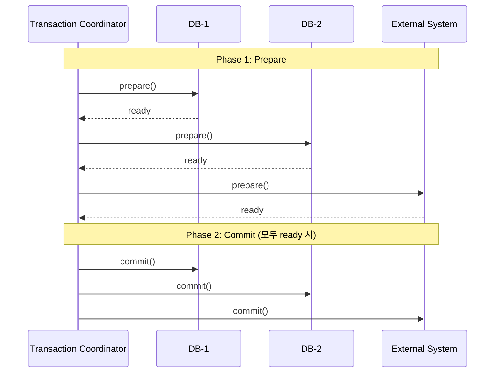
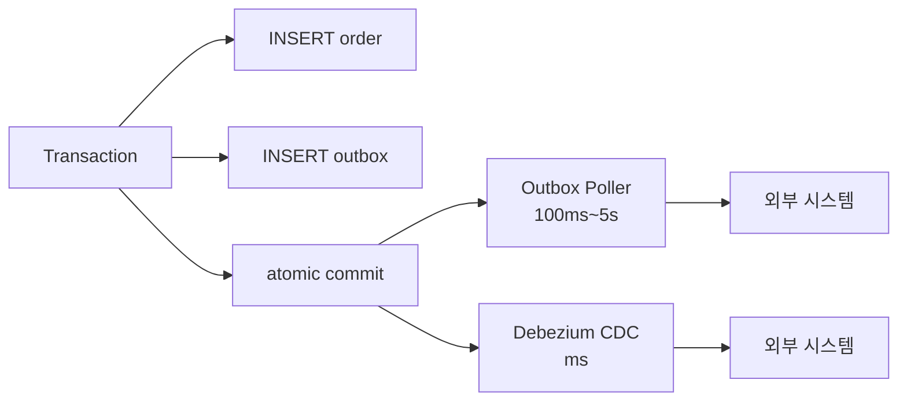

## Table of contents

## 들어가며 {#intro}

선행 측정 (EXP-09) 에서 *트랜잭션 안 외부 API 호출* 의 함정을 라인 단위로 봤습니다. HikariCP pool=10, extDelay=3,000ms, concurrent=60 — connection-timeout=1초로 설정하면 16.7% 만 통과하고 50건이 `SQLTimeoutException`. 풀 점유 시간이 *외부 호출 시간만큼 늘어나는 구조* 때문이었습니다.

처방은 명확합니다. **외부 호출을 트랜잭션 밖으로 빼라**. 그런데 "어떻게 빼는가" 가 문제. 스택오버플로 답변은 *외부 호출 후 INSERT* 라는 단순 분리부터 *Saga compensating transaction*, *Transactional Outbox* 까지 흩어져 있습니다. 어느 패턴이 *어느 도메인* 에 맞는지를 *측정값*으로 답한 글은 거의 없었습니다.

그래서 9 시나리오 매트릭스를 측정했습니다 — 3 패턴 (A: 단순 분리 / B: Saga / C: Outbox) × 3 chaos (OFF / DB_FAIL / EXT_FAIL). 결과는 *세 패턴이 *근본적으로 다른 trade-off* 를 가진다* 였습니다. 단순 분리는 외부 OK + 자기 DB 실패 시 *60건이 어긋남* (외부 PG 60건 처리 / 자기 DB 0건). Saga 는 *3중 안전망* (worker 보상 + sweeper) 으로 정합성. Outbox 는 *사용자 응답을 41배 단축*하지만 *처리 완료까지의 시간이 30배 느림*.

이 패턴들은 *최근에 만들어진 게 아닙니다*. **Saga 는 1987년 Garcia-Molina 의 ACM SIGMOD 논문**, **Outbox 는 2005년 Pat Helland 의 *Data on the Outside vs Data on the Inside*** 가 학술적 기원입니다. 한국 빅테크 (토스 SLASH24, 29CM, 리디) 가 운영에서 회고로 풀어낸 것을 — 학술 → 운영 → 본인 측정의 3박자로 묶어보면, *왜 그 패턴이 그 도메인에 맞는지* 가 라인 단위로 보입니다.

이 글은 그 3박자의 기록입니다.

1. **사건** — EXP-09 의 풀 고갈, 단순 분리만으론 끝이 아님
2. **PROPAGATION 7종** — REQUIRED / REQUIRES_NEW / NESTED / SUPPORTS / MANDATORY / NOT_SUPPORTED / NEVER 정확한 의미
3. **2PC (XA) 의 한계** — 왜 MSA 에서 못 쓰나, Pat Helland 의 *Life Beyond Distributed Transactions*
4. **Saga — Garcia-Molina 1987 원전** — Choreography vs Orchestration / compensating transaction
5. **Outbox — Helland CIDR 2005 *Data on the Outside vs Inside*** — 학술 기원 + 한국 운영 사례
6. **EXP-09b 9 시나리오 실측 매트릭스** — A/B/C × OFF/DB_FAIL/EXT_FAIL
7. **두 가지 latency 분리** — *사용자 응답* vs *처리 완료* (단위가 다른 metric)
8. **도메인 매핑** — 결제는 Saga, 알림은 Outbox, 캐시류만 단순 분리
9. **`@TransactionalEventListener`** — `AFTER_COMMIT` / `BEFORE_COMMIT` 의 정확한 동작 + Spring source

결론부터 말하면:

- **단순 분리만으론 부족** — A/DB_FAIL [실측] 에서 60건 어긋남. 결제 / 주문 도메인엔 부적합
- **Saga 의 *3중 안전망*** — B/EXT_FAIL [실측] worker 보상 60건 / B/DB_FAIL [실측] sweeper 60건. 두 안전망 합쳐서 정합성 보장
- **Outbox 의 *3가지 latency*** — ACK 72ms / 처리 완료 avg 92,573ms / max 181,935ms. 사용자 응답 41배 단축 *대신* 처리 완료 30배 느림
- **결제는 Saga, 알림은 Outbox** — Outbox 의 가치는 "ACK 만 받으면 되는 도메인", Saga 의 가치는 "처리 완료 일관성 필수 도메인"
- **2PC 는 MSA 에서 못 씀** — Helland *Life Beyond Distributed Transactions* (CIDR 2007) 의 핵심 — 가용성 / 파티션 환경에서 blocking commit 은 시스템 정지 요인

머릿속의 "그냥 트랜잭션 분리하면 되지" 가 어떻게 *반쪽 답* 인지, 학술 → 운영 → 실측 3박자로 풀어봅니다.

---

## 1. 사건 — EXP-09 의 풀 고갈, 단순 분리는 *시작점* {#incident}

### 1.1 EXP-09 의 두 측정

선행 측정 (EXP-09) 에서 트랜잭션 안 외부 호출의 함정을 두 run 으로 봤습니다.

**Run #1 — silent latency 폭발** (timeout 5,000ms / concurrent 30 / extDelay 2,000ms):
- 30/30 성공 (100%)
- P50 / P90 / P99 = 2,200 / 4,300 / 6,350 ms
- 풀 stats: active=10 / awaiting=20 (지속 ~6초)
- 모니터링이 success rate 만 보면 "정상" 으로 보임

**Run #2 — fail-fast** (timeout 1,000ms / concurrent 60 / extDelay 3,000ms):
- 10/60 성공 (16.7%)
- 50 건 SQLTimeoutException
- 이론치 검증: pool / extDelay = 10/3s = 3.33 req/s ≈ 실측 3.03 req/s (91%)

같은 풀 고갈인데 connection-timeout 값이 *시스템 성격*을 결정. 운영팀이 보는 신호가 정반대 — Run #1 은 "느려짐", Run #2 는 "에러".

### 1.2 단순 처방 — 외부 호출 *밖* 으로 빼기

직관적 해법: 외부 호출을 트랜잭션 밖으로 빼면 풀 점유 시간이 INSERT 길이만 남음.

```java
// Before — EXP-09 의 안티패턴
@Transactional
public void process(OrderRequest req) {
    Order order = repo.save(req);          // INSERT
    paymentClient.charge(order.getId());   // 외부 PG 호출 (3초)
    // 풀 점유 = INSERT + 외부 호출 + commit ≈ 3,005ms
}

// After — 단순 분리 (패턴 A)
public void process(OrderRequest req) {
    paymentClient.charge(req.getId());     // 외부 호출 먼저 (트랜잭션 밖)
    saveOrder(req);                         // 새 트랜잭션
}

@Transactional
public void saveOrder(OrderRequest req) {
    repo.save(req);                         // INSERT 만
    // 풀 점유 ≈ 5ms
}
```

이 패턴 A 가 *맞는가* — 측정해보면 답이 갈립니다. EXP-09b 의 9 시나리오 매트릭스 [실측] 으로 확인했습니다.

### 1.3 EXP-09b — 9 시나리오 매트릭스의 핵심 발견

| # | 패턴 | chaos | OK | Inconsist. | Compen. | ExtFail | 의미 |
|:-:|---|---|:-:|:-:|:-:|:-:|---|
| 1 | A | OFF | 60 | 0 | 0 | 0 | 정상 path |
| 2 | A | DB_FAIL | 0 | **60** | 0 | 0 | **외부 PG 60건 / 자기 DB 0건** ⚠️ |
| 3 | A | EXT_FAIL | 0 | 0 | 0 | 60 | 외부 실패 — 양쪽 손실 없음 |
| 4 | B | OFF | 60 | 0 | 0 | 0 | Saga 정상 |
| 5 | B | DB_FAIL | 0 | 0 | 0 | 60 (sweeper 회수) | sweeper 60건 정리 ✅ |
| 6 | B | EXT_FAIL | 0 | 0 | **60** | 0 | worker 보상 60건 ✅ |
| 7 | C | OFF | 60 (ACK) | 0 | 0 | 0 | Outbox 정상 |
| 8 | C | DB_FAIL | 60 (ACK) | 0 | 0 | 0 | Outbox 자동 재시도 |
| 9 | C | EXT_FAIL | 60 (ACK) | 0 | 0 | 0 | Outbox 자동 재시도 |

**핵심 발견**: 시나리오 2 — A/DB_FAIL — 에서 **외부 PG 60건 처리 / 자기 DB 0건** 의 어긋남. 단순 분리만으로는 *외부 OK / 자기 DB 실패* 시 정합성 깨짐. **결제 / 주문 도메인엔 부적합**.

이제 이 결과를 *학술적으로 왜 그런지* 부터 풀어봅니다. 그 전에 PROPAGATION 7 종의 정확한 의미.

---

## 2. PROPAGATION 7종 — Spring 의 트랜잭션 전파 {#propagation}

`@Transactional(propagation = ...)` 의 7 종은 단순 enum 처럼 보이지만 *각각이 다른 트랜잭션 모델*을 의미합니다. Spring 6 의 [`AbstractPlatformTransactionManager`](https://github.com/spring-projects/spring-framework/blob/main/spring-tx/src/main/java/org/springframework/transaction/support/AbstractPlatformTransactionManager.java) 소스의 `handleExistingTransaction` 메서드에서 7 분기로 처리됩니다.

### 2.1 정확한 의미 표

| Propagation | 기존 Tx 있음 | 기존 Tx 없음 | 핵심 동작 |
|---|---|---|---|
| `REQUIRED` (default) | 참여 | 새로 시작 | 가장 흔한 선택 |
| `REQUIRES_NEW` | 보류 + 새로 시작 | 새로 시작 | **별개 connection** |
| `NESTED` | savepoint 생성 | 새로 시작 | JDBC 3.0 savepoint |
| `SUPPORTS` | 참여 | 트랜잭션 없이 실행 | 선택적 |
| `MANDATORY` | 참여 | **예외** | 강제 |
| `NOT_SUPPORTED` | 보류 후 트랜잭션 없이 | 트랜잭션 없이 | 트랜잭션 회피 |
| `NEVER` | **예외** | 트랜잭션 없이 | 트랜잭션 금지 |

### 2.2 REQUIRED vs REQUIRES_NEW — 결정적 차이

```java
@Service
public class OrderService {
    @Transactional  // PROPAGATION_REQUIRED
    public void process() {
        repo.save(order);
        notificationService.send(order);  // 같은 Tx 참여
        // notificationService 가 예외 던지면? — 본 Tx 도 rollback
    }
}

@Service
public class NotificationService {
    @Transactional(propagation = REQUIRES_NEW)  // 별개 Tx
    public void send(Order order) {
        // 별개 connection / 별개 commit / 별개 rollback
        // 본 메서드의 예외는 OrderService Tx 영향 X
    }
}
```

`REQUIRED` 의 inner 가 예외 던지면 — 우아한 *이게 왜 롤백돼?* 사고 패턴. `REQUIRES_NEW` 면 격리됨. (시리즈 글 7 의 8 절 self-invocation 결합 함정 참조)

### 2.3 NESTED 의 *진짜* 의미 — Savepoint

`NESTED` 는 *새 트랜잭션* 이 아닙니다. **JDBC 3.0 의 Savepoint** — 같은 connection / 같은 트랜잭션 안에서 *부분 rollback 지점* 을 표시.

```sql
-- NESTED 의 SQL 시퀀스
BEGIN;
INSERT INTO orders ...;        -- outer 의 작업
SAVEPOINT nested_1;             -- inner 진입
INSERT INTO order_items ...;   -- inner 의 작업
ROLLBACK TO SAVEPOINT nested_1; -- inner 만 rollback
INSERT INTO orders ...;         -- outer 계속
COMMIT;                          -- outer 정상 commit (orders 살아있음)
```

핵심: **`NESTED` 는 outer commit 시점에 *전체* 가 commit**. inner 가 별개 commit 되지 않습니다. 결제처럼 *외부 시스템 연동* 에는 부적합 — 외부 호출 시점에 commit 못 함.

### 2.4 운영 함정 — 헷갈리는 영역

| 함정 | 메커니즘 | 워크어라운드 |
|---|---|---|
| `REQUIRED` rollback-only | inner 예외 → 기존 Tx status 마킹 → outer commit 시 `UnexpectedRollbackException` | inner 를 `REQUIRES_NEW` 로 변경 |
| `REQUIRES_NEW` self-invocation | 같은 클래스 내부 호출 → 프록시 우회 → 새 Tx 발동 안 함 | 분리 빈으로 추출 (시리즈 글 7) |
| `NESTED` 이해 오류 | 별개 Tx 로 오해 → 외부 시스템 commit 기대 | `REQUIRES_NEW` 로 변경 |
| `SUPPORTS` ⇄ `NOT_SUPPORTED` | 동작이 *반대* — `SUPPORTS` 는 기존 참여, `NOT_SUPPORTED` 는 보류 | 한 줄 가이드: *기존 Tx 가 있으면 사용? → SUPPORTS / 사용 안 함? → NOT_SUPPORTED* |

이 7 종 모두 *Spring 의 추상화* — DB 차원에선 connection / transaction / savepoint 의 조합. 다음 3 절에서 *분산 환경* 에선 이 추상화가 어떻게 깨지는지 봅니다.

---

## 3. 2PC (XA) 의 한계 — 왜 MSA 에서 못 쓰나 {#2pc-limitations}

### 3.1 2PC 의 동작

전통적으로 분산 트랜잭션은 **2-Phase Commit (2PC)** 로 풀었습니다. Java EE 의 [JTA](https://download.oracle.com/javaee/7/api/javax/transaction/UserTransaction.html) spec 표준.



**Phase 1 Prepare**: Coordinator 가 모든 참여자에게 *commit 가능한가* 확인. 모두 ready 응답 시 *아무도 abort 못 함*.

**Phase 2 Commit**: 모두 commit. 또는 누가 fail 시 모두 rollback.

### 3.2 Pat Helland 의 비판 — *Life Beyond Distributed Transactions* (CIDR 2007)

[Pat Helland 의 CIDR 2007 논문](https://www.ics.uci.edu/~cs223/papers/cidr07p15.pdf) 은 2PC 가 *대규모 시스템에서 작동하지 않는다* 는 핵심 비판을 담습니다.

> "In production systems, distributed transactions don't seem to be needed because applications are designed without them. **In the absence of distributed transactions, application designers focus on lower forms of consistency.**"
> — Pat Helland, *Life Beyond Distributed Transactions*, CIDR 2007

핵심 논점:

1. **Blocking 의 비용** — Prepare 후 Commit/Abort 결정까지 *모든 참여자가 blocked*. Coordinator 가 죽으면 *모두 indefinite hang*. 가용성 / 파티션 시 시스템 정지 요인.

2. **확장성 한계** — 참여자 수 N 에 대해 *N² 메시지 + N round-trip*. 마이크로서비스 100개면 100×100 = 10,000 메시지 / round-trip 100×.

3. **운영 복잡도** — Coordinator 의 영속 상태 (recovery log) 가 *단일 장애점*. 일반 RDB transaction 로그보다 운영 비용 큼.

4. **CAP 의 P** — partition 발생 시 2PC 는 *availability* 를 포기. 마이크로서비스는 partition 일상화 — 매번 rollback 불가능.

### 3.3 Last Resource Gambit — XA 1.3 의 우회

[JTA 1.3 spec](https://www.eclipse.org/jakartaee/) 의 *Last Resource Gambit* — XA 자원 1개는 non-XA 로 처리해서 비용 줄이기. **하지만 critical bug 위험** — Coordinator crash 시 Last Resource 의 commit/rollback 결과를 *알 수 없는 상태* 가능.

운영 회고로 이 패턴이 종종 *돈을 잃는* 결과로 이어집니다. Helland 가 "lower forms of consistency" 를 추천하는 이유.

### 3.4 결론 — 2PC 대신 *eventually consistent* 로

[Werner Vogels 의 ACM Queue 2008](https://queue.acm.org/detail.cfm?id=1466448) *Eventually Consistent* 가 그 *lower form* 의 학술적 정리:

> "Several inconsistency models exist: causal consistency, read-your-writes consistency, session consistency, monotonic read consistency, monotonic write consistency. **Eventual consistency** is the most relaxed of these."

마이크로서비스 시대의 트랜잭션 = **eventually consistent**. 이 모델 위에 *Saga* (Garcia-Molina 1987) 와 *Outbox* (Helland 2005) 가 위치합니다.

---

## 4. Saga — Garcia-Molina 1987 원전 {#saga}

### 4.1 학술 기원

Saga 패턴의 원전은 **Hector Garcia-Molina, Kenneth Salem — *Sagas* (ACM SIGMOD 1987)** 입니다.

> "A saga is a long lived transaction that can be written as a sequence of transactions that can be **interleaved** with other transactions. Each transaction in the sequence is associated with a **compensating transaction** that semantically undoes its effects."
> — Garcia-Molina, Salem, *Sagas*, ACM SIGMOD 1987

핵심 정의:

1. **Saga = 긴 트랜잭션의 sequence** — T1 → T2 → ... → Tn
2. **각 Ti 마다 compensating transaction Ci** — Ti 의 의미를 *되돌리는* 트랜잭션
3. **compensating 은 *of* commutative 가 아님** — Ti 의 결과를 *완전히 지우지 않음*. Ti 가 보낸 알림은 못 되돌림

### 4.2 두 종류 — Choreography vs Orchestration

[Microsoft Saga pattern docs](https://learn.microsoft.com/en-us/azure/architecture/patterns/saga) 에서 정리한 두 변형:

**(1) Choreography** — 각 서비스가 *이벤트를 듣고* 자기 단계 + 다음 이벤트 발행

```
[Order Service] -- OrderCreated --> [Payment Service]
                                      ↓ (charge OK)
                              -- PaymentCharged --> [Inventory]
                                                     ↓ (reserve OK)
                                              -- InventoryReserved --> [Shipping]
```

**(2) Orchestration** — Saga Coordinator 가 모든 단계 *명령 + 응답*

```
[Saga Coordinator] -- Charge --> [Payment Service]
                  <-- Charged ----
                  -- Reserve --> [Inventory]
                  <-- Reserved ---
                  -- Ship --> [Shipping]
```

| 차원 | Choreography | Orchestration |
|---|---|---|
| 결합도 | 느슨 (이벤트 기반) | 강함 (Coordinator 가 모두 알아야) |
| 디버깅 | 어려움 (이벤트 흐름 분산) | 쉬움 (Coordinator 단일 지점) |
| 단일 장애점 | 없음 | Coordinator |
| 적합 도메인 | 도메인 이벤트 기반 (DDD) | 명령 기반 (RPC 스타일) |

### 4.3 토스 SLASH24 — *SAGA 분산 트랜잭션 보상*

[토스 SLASH24 SAGA 발표](https://haon.blog/article/toss-slash/msa-reward-transaction/) 가 한국 빅테크의 운영 회고:

- 보상 트랜잭션을 *명시적 step* 으로 정의
- 각 step 의 *idempotency* 보장 (멱등키)
- compensating 이 *또 실패* 시 *수동 운영* 으로 escalate
- *Saga state machine* 영속화 (DB 또는 Kafka)

핵심 인용:

> "보상 트랜잭션이 또 실패하는 경우를 위해 *수동 운영* 단계까지 설계되어 있어야 합니다. Saga 가 자동으로 모든 실패를 처리한다는 가정은 위험합니다."

### 4.4 EXP-09b 패턴 B — 3중 안전망

본 측정의 패턴 B 는 Saga 의 단순 구현:

```java
// 3 트랜잭션 — Tx1 reserve / Tx2 confirm / Tx3 cancel
@Transactional
public OrderId reserve(OrderRequest req) {  // Tx1
    Order order = new Order(req, Status.PENDING);
    return repo.save(order).getId();
}

public void process(OrderId orderId, OrderRequest req) {
    try {
        paymentClient.charge(req);  // 외부 호출 (Tx 밖)
        confirm(orderId);            // Tx2
    } catch (Exception e) {
        cancel(orderId);             // Tx3 (compensating)
        throw e;
    }
}

@Transactional
public void confirm(OrderId orderId) {  // Tx2
    Order o = repo.findById(orderId);
    o.setStatus(Status.CONFIRMED);
}

@Transactional
public void cancel(OrderId orderId) {  // Tx3 — compensating
    Order o = repo.findById(orderId);
    o.setStatus(Status.CANCELLED);
}
```

추가로 `SagaSweeper` — Tx2/Tx3 모두 실패한 *고립된 PENDING* 을 일정 시간 후 자동 cancel:

```java
@Scheduled(fixedDelay = 5000)
public void sweep() {
    repo.findPendingOlderThan(Duration.ofSeconds(5))
        .forEach(o -> cancel(o.getId()));
}
```

### 4.5 측정값 — B 패턴 9 시나리오

| 시나리오 | 결과 | 안전망 |
|---|---|---|
| B/OFF | 60 ✅ | 정상 path |
| B/DB_FAIL | 60건 sweeper 정리 → CANCELLED | **sweeper 가 worker 보상 못 한 것 회수** |
| B/EXT_FAIL | 60건 worker 보상 → CANCELLED | **worker 가 즉시 보상** |

**3중 안전망**: (1) try/catch 의 worker 보상 / (2) sweeper 의 시간 기반 회수 / (3) audit trail (CANCELLED 상태 기록). 두 안전망이 *차례로* 동작하는 구조 — 한 시나리오만 보면 의미 안 보임.

`P99 = 3,106ms` — 외부 호출 시간 + Tx2 commit 합. EXP-09 (3,302ms) 와 비슷하지만 풀 점유는 5ms × 2 (Tx1 + Tx2). 풀 고갈 사라짐.

---

## 5. Outbox — Helland CIDR 2005 원전 {#outbox}

### 5.1 학술 기원 — *Data on the Outside vs Data on the Inside*

Outbox 패턴의 학술적 기원은 **Pat Helland — *Data on the Outside vs Data on the Inside* (CIDR 2005)**:

> "Data on the **inside** is the data that is private to a service... Data on the **outside** is the data that flows between services."
> "We need a **mechanism** to publish *outside data* atomically with *inside data* changes."
> — Pat Helland, *Data on the Outside vs Data on the Inside*, CIDR 2005

핵심 통찰:

1. **트랜잭션 안 = inside data** (자기 DB)
2. **메시지 큐 / API 호출 = outside data** (다른 시스템)
3. inside 와 outside 를 *atomically* 일관되게 만드는 *mechanism* 필요
4. **Outbox 패턴** — outside 메시지를 *inside table* (outbox 테이블) 에 INSERT → *같은 트랜잭션* 안에서 atomic → 별도 polling/CDC 가 발행

### 5.2 메커니즘 — Polling vs CDC



| 변형 | latency | 운영 비용 |
|---|---|---|
| Polling | 100ms~5s | 단순 (Spring `@Scheduled`) |
| CDC (Debezium) | <100ms | binlog 권한 + Kafka Connect 운영 |

### 5.3 한국 운영 사례 — 29CM, 리디

**[29CM Transactional Outbox 실제 구현](https://medium.com/@greg.shiny82/transactional-outbox-29cm)**:

- 폴링 방식 (5초 주기)
- 상태 머신: `pending` → `send_success` / `send_fail`
- 재시도 횟수 limit + DLQ

**[리디 Transactional Outbox](https://ridicorp.com/story/transactional-outbox-pattern-ridi/)**:

- 폴링 + idempotency key
- 분산 환경 lock (ShedLock) 으로 멀티 인스턴스 중복 방지

두 사례의 공통점: *학술 인용 없이* 실용적으로 풀어냄. 본 글이 추가하는 것은 *학술 기원 (Helland CIDR 2005) → 운영 사례 → 본인 측정* 의 3박자 연결.

### 5.4 EXP-09b 패턴 C — 측정 구현

```java
@Transactional
public OrderId acceptAndQueue(OrderRequest req) {
    Order order = new Order(req, Status.PENDING);
    OrderId id = repo.save(order).getId();
    outboxRepo.save(new OutboxEvent(id, "CHARGE_REQUEST", req));  // 같은 Tx
    return id;
}

@Scheduled(fixedDelay = 200)  // 200ms 주기 폴링
public void pollOutbox() {
    List<OutboxEvent> batch = outboxRepo.findUnprocessed(10);  // FOR UPDATE SKIP LOCKED
    for (OutboxEvent e : batch) {
        try {
            paymentClient.charge(e);
            confirmOrder(e.getOrderId());
            outboxRepo.markProcessed(e);
        } catch (Exception ex) {
            outboxRepo.bumpRetry(e);
        }
    }
}
```

핵심 디자인:
- `FOR UPDATE SKIP LOCKED` — 멀티 poller 환경 대비
- `locked_until` 컬럼 — 처리 중 다른 poller 중복 방지
- `bumpRetry` — 외부 실패 시 재시도 카운터 증가

### 5.5 *3 가지 latency* — 본 측정의 발견

(이 부분은 [원 측정 기록](file:///Users/meyonsoo/Desktop/lemong/project/cj/commerce-comment-platform-be/docs/learning-notes/W1-exp09b.md) 의 5.4 절과 동일)

C/OFF (정상 시나리오) 의 latency 를 분해하면 *3가지가 다른 metric*:

| latency 종류 | C/OFF [실측] | 의미 |
|---|---|---|
| ACK latency | **72ms** | worker 가 사용자에게 "처리 중" 응답 |
| 처리 완료 latency (avg) | **92,573ms** | orders.PENDING → CONFIRMED 까지 (외부 호출 + poller cycle 위치) |
| 처리 완료 latency (max) | 181,935ms | 마지막 cycle row |

**같은 패턴이 두 다른 latency 를 가짐**:
- 사용자 *인지* 로는 EXP-09 (3,302ms) 대비 **41배 단축**
- 처리 *완료* 로는 EXP-09 대비 **30배 *느림*** (92,573 / 3,071)

**Outbox 의 진짜 trade-off**: 응답을 외부 호출에서 분리하는 *대가*로 *처리 완료까지의 시간*이 길어짐. 결제 confirm 같이 사용자가 *처리 완료를 기다리는* 도메인엔 부적합. 알림처럼 *ACK 만 받으면 OK* 인 도메인용.

처리 완료 latency 단축 경로:
- (a) 멀티 poller (W6 ShedLock + EXP-12)
- (b) batch 내 병렬 호출 (`CompletableFuture.allOf`)
- (c) CDC 진화 (Debezium, ADR-005)

---

## 6. EXP-09b 9 시나리오 매트릭스 — 패턴 비교의 *측정값* {#exp09b-matrix}

### 6.1 핵심 지표 9 시나리오

| # | 패턴 | chaos | OK | Inconsist. | Compen. | ExtFail | sweeper | P99 (ms) | awaiting peak |
|---|---|---|---|---|---|---|---|---|---|
| 1 | A | OFF | **60** | 0 | 0 | 0 | — | **3,071** | 57 ⚠️ |
| 2 | A | DB_FAIL | 0 | **60** | 0 | 0 | — | — | 0 |
| 3 | A | EXT_FAIL | 0 | 0 | 0 | **60** | — | — | 0 |
| 4 | B | OFF | **60** | 0 | 0 | 0 | 0 | **3,106** | 0 |
| 5 | B | DB_FAIL | 0 | 0 | 0 | 0 | **60** | — | 0 |
| 6 | B | EXT_FAIL | 0 | 0 | **60** | 0 | 0 | — | 0 |
| 7 | C | OFF | 60 (ACK) | 0 | 0 | 0 | — | **72** ⭐ | 0 |
| 8 | C | DB_FAIL | 60 (ACK) | 0 | 0 | 0 | — | 67 | 0 |
| 9 | C | EXT_FAIL | 60 (ACK) | 0 | 0 | 0 | — | 66 | 0 |

### 6.2 DB 최종 상태

| # | 패턴 | chaos | orders 분포 | outbox |
|---|---|---|---|---|
| 1 | A | OFF | A.CONFIRMED=60 | 0 |
| 2 | A | DB_FAIL | (없음) | 0 |
| 3 | A | EXT_FAIL | (없음) | 0 |
| 4 | B | OFF | B.CONFIRMED=60 | 0 |
| 5 | B | DB_FAIL | B.CANCELLED=60 (sweeper) | 0 |
| 6 | B | EXT_FAIL | B.CANCELLED=60 (worker 보상) | 0 |
| 7 | C | OFF | C.CONFIRMED=59 / PENDING=1 | 1 |
| 8 | C | DB_FAIL | C.CONFIRMED=9 / PENDING=51 | 51 |
| 9 | C | EXT_FAIL | C.PENDING=60 | 60 |

### 6.3 패턴 A 의 awaiting=57 spike

A/OFF 의 P99 3,071ms 가 EXP-09 의 3,302ms 보다 빠른 건 *풀 점유 시간이 5ms × wave* 로 줄었기 때문. 그런데 `awaiting peak=57` — 외부 호출 sleep(3,000ms) *끝난 직후* 60 worker 가 *동시에* INSERT 요청 → 풀 10 가득 → awaiting spike.

**의미**: 풀 점유 시간은 짧지만 (5ms × wave) **순간적 동시성 spike** 는 여전. 운영에서 *다른 API 영향* 가능 (10ms 동안). 이 spike 가 *드러나려면 ms 단위 풀 메트릭 측정* 이 필요 — Prometheus + Hikari Metrics binder.

### 6.4 패턴 B 의 *3중 안전망* 시나리오 5+6 으로 검증

- 시나리오 5 (DB_FAIL): worker 보상 못 함 → **sweeper 60건 정리** → CANCELLED audit trail
- 시나리오 6 (EXT_FAIL): worker 보상 즉시 동작 60건 → sweeper 할 일 없음

**두 안전망이 차례로** 동작. 한 시나리오만 보면 의미 안 보입니다. *둘 다 측정* 해야 안전망의 진짜 가치 보임.

### 6.5 코드 라인 ↔ 측정값 매핑

| 측정값 | 코드 위치 | 검증 |
|---|---|---|
| A/DB_FAIL Inconsistent=60 | `PatternARunner.java` chaos 분기 | ✅ |
| A/EXT_FAIL ExtFail=60 | `PlatformAStub.java` sleep 후 throw | ✅ |
| B/OFF P99=3,106ms | `PatternBRunner.java` reserve+외부+confirm | ✅ |
| B/DB_FAIL sweeper=60 | `SagaSweeper.java` UPDATE HOLD>5초 | ✅ |
| B/EXT_FAIL Compensated=60 | `PatternBRunner.java` catch → cancel | ✅ |
| C ACK P99=72ms | `PatternCRunner.java` orders+outbox 한 Tx | ✅ |
| C/OFF processed=59 (180초) | `OutboxPoller.java` batch 순차 | ✅ |
| C/DB_FAIL chaosSkipped=50 | `OutboxPoller.java` orderId%2 결정론적 | ✅ |
| C/EXT_FAIL retries=19 | `OutboxPoller.java` bumpRetry | ✅ |

→ **9개 측정값 모두 코드 라인과 1:1 매핑**.

---

## 7. 두 가지 latency 분리 — *사용자 응답* vs *처리 완료* {#two-latencies}

### 7.1 패턴 별 latency 의 의미

| 패턴 | 사용자 응답 ↔ 처리 완료 | 동기/비동기 |
|---|---|---|
| A | **같음** (외부 호출 + INSERT 동일 worker thread) | 동기 |
| B | **같음** (reserve + 외부 + confirm 동일 worker thread) | 동기 |
| C | **다름** (worker = ACK / poller = 처리) | **비동기** |

### 7.2 사용자 응답 latency

| 지표 | EXP-09 #2 | A/OFF | B/OFF | C/OFF |
|---|---|---|---|---|
| 성공률 | 16.7% | 100% | 100% | 100% (ACK) |
| 사용자 응답 P99 | 3,302ms | 3,071ms | 3,106ms | **72ms** ⭐ |
| 풀 점유 시간 (Tx 1회) | ~3,000ms | ~5ms | ~5ms × 2 | ~10ms |

### 7.3 처리 완료 latency

| 패턴 | 처리 완료 min | 처리 완료 avg | 처리 완료 max |
|---|---|---|---|
| A/OFF | 3,071ms (= 사용자 응답) | 3,071ms | 3,071ms |
| B/OFF | 3,106ms (= 사용자 응답) | 3,106ms | 3,106ms |
| **C/OFF** | **3,233ms** | **92,573ms** | **181,935ms** |

→ 처리 완료 기준 비교 시 **C 가 A 대비 평균 30배 *느림***.

### 7.4 도메인 매핑 — 두 latency 가 결정

이 *두 latency 의 차이* 가 도메인 매핑의 핵심:

| 도메인 | 사용자 응답 우선 | 처리 완료 우선 | 추천 패턴 |
|---|---|---|---|
| 결제 confirm | △ | **⭐⭐⭐** | Saga (B) — 처리 완료 일관성 필수 |
| 알림 (SMS / Push) | **⭐⭐⭐** | △ | Outbox (C) — ACK 만 받으면 됨 |
| 캐시 갱신 | **⭐⭐⭐** | ⭐ | 단순 분리 (A) — DB 일관성 부담 적음 |
| 주문 생성 | ⭐⭐ | **⭐⭐⭐** | Saga (B) — 정합성 |
| 검색 인덱스 | ⭐ | △ | Outbox (C) |
| 멱등 retry 상태 update | ⭐⭐ | **⭐⭐** | Saga or Outbox (도메인별) |

### 7.5 *처리 완료 latency 의 폭발성*

C 패턴의 처리 완료 latency 는 *cycle 위치* 에 따라 변동:

```
poller cycle 200ms × 60 row × batch=10 ≈ 60 × 200 / 10 = 1,200ms 이론
실측 평균 = 92,573ms (이론치의 77배)
```

이론치와 실측 차이 = *외부 호출 sleep(3,000ms)* 이 batch 내 순차 호출. batch=10 이면 한 cycle 에 30,000ms (10 × 3,000) — *외부 호출이 cycle 의 dominant cost*.

### 7.6 처리 완료 단축 — 3 경로

1. **멀티 poller** (ShedLock 으로 분산 lock + N 인스턴스 분산)
2. **batch 내 병렬** (`CompletableFuture.allOf` 로 외부 호출 동시)
3. **CDC 진화** (Debezium binlog 기반 — polling 비용 0)

이 3 경로의 측정은 W6 commerce-batch-orchestrator 의 ShedLock + EXP-12 / EXP-12b 짝.

---

## 8. 도메인 매핑 — 결제는 Saga, 알림은 Outbox {#domain-mapping}

### 8.1 매핑 결정 트리

```
질문 1: 외부 호출이 *동기적으로 일관성 보장* 필요?
  YES → Saga (B)
  NO  → 질문 2

질문 2: 사용자 *응답* 이 외부 호출 시간만큼 길어져도 OK?
  YES → 단순 분리 (A) — 단 외부 OK / DB 실패 위험 인지
  NO  → Outbox (C)

질문 3: *처리 완료* 까지의 시간이 길어져도 OK?
  YES → Outbox (C) 그대로
  NO  → Outbox + 멀티 poller / 병렬 / CDC 진화
```

### 8.2 도메인 별 적합 패턴

| 도메인 | 추천 패턴 | 이유 |
|---|---|---|
| **결제 confirm** | Saga (B) | 처리 완료 일관성 + 보상 가능 |
| **결제 환불** | Saga (B) | 외부 PG 의 멱등성 + DB 환불 동기화 |
| **알림 (SMS / Push / Email)** | Outbox (C) | ACK 빠름 + 처리 완료 늦어도 OK |
| **검색 인덱스 갱신** | Outbox (C) | 비동기 OK, 일관성 약하게 |
| **캐시 invalidation** | 단순 분리 (A) | 캐시 inconsistent OK, 다음 read 에서 정정 |
| **주문 생성** | Saga (B) | 외부 재고 + 자기 DB 일관성 |
| **이벤트 기반 도메인 알림** | Outbox (C) | DDD 도메인 이벤트 표준 |
| **주문 취소 (자체 결정)** | 단순 분리 (A) | 외부 호출 없음 |
| **주문 취소 (PG 환불 동반)** | Saga (B) | 외부 PG + 자기 DB |
| **사장님 대시보드 update** | 단순 분리 (A) | read-only 조회용 캐시 |

### 8.3 본 commerce-comment-platform-be 적용

```
도메인               → 패턴
크레딧 차감 (결제)    → Saga (B)
자동 댓글 발행 알림   → Outbox (C)
사장님 대시보드 update → 단순 분리 (A)
주문 환불             → Saga (B)
검색 인덱스 sync      → Outbox (C)
```

이 매핑이 ADR-BE-008 의 결정 근거. 측정값 (EXP-09b 9 시나리오) 으로 검증된 매핑.

---

## 9. `@TransactionalEventListener` — Spring 의 commit-after hook {#transactional-event-listener}

### 9.1 동작

`@TransactionalEventListener` 는 *트랜잭션 commit 시점* 에 이벤트 발행하는 Spring 메커니즘. [Spring source `TransactionalEventListener`](https://github.com/spring-projects/spring-framework/blob/main/spring-tx/src/main/java/org/springframework/transaction/event/TransactionalEventListener.java) 가 정의:

```java
@Service
public class OrderEventPublisher {
    private final ApplicationEventPublisher publisher;

    @Transactional
    public void confirmOrder(Order order) {
        order.confirm();
        repo.save(order);
        publisher.publishEvent(new OrderConfirmedEvent(order));  // 발행
        // commit 시점에 listener 가 호출됨 (AFTER_COMMIT default)
    }
}

@Component
public class NotificationListener {
    @TransactionalEventListener  // default = AFTER_COMMIT
    public void onOrderConfirmed(OrderConfirmedEvent event) {
        // commit 후에 외부 알림 발행
        notificationClient.send(event);
    }
}
```

### 9.2 4 가지 phase

| Phase | 호출 시점 | 사용처 |
|---|---|---|
| `BEFORE_COMMIT` | commit *직전* | DB 검증 / 추가 INSERT |
| `AFTER_COMMIT` (default) | commit *직후* | 외부 알림 / 캐시 invalidation |
| `AFTER_ROLLBACK` | rollback *직후* | 보상 / audit |
| `AFTER_COMPLETION` | commit OR rollback 후 | cleanup |

### 9.3 Spring source — `TransactionSynchronizationManager`

[`TransactionSynchronizationManager`](https://github.com/spring-projects/spring-framework/blob/main/spring-tx/src/main/java/org/springframework/transaction/support/TransactionSynchronizationManager.java) 가 핵심. `registerSynchronization` 으로 callback 등록:

```java
// TransactionalEventListenerFactory 가 내부적으로 호출
TransactionSynchronizationManager.registerSynchronization(
    new TransactionSynchronization() {
        @Override
        public void afterCommit() {
            // listener 호출
        }
    }
);
```

### 9.4 함정 — `AFTER_COMMIT` 안의 RuntimeException

`AFTER_COMMIT` listener 안에서 RuntimeException 던지면 — **트랜잭션은 이미 commit 됨** → rollback 불가 → 외부 시스템 일관성 깨짐 가능.

**처방**:
- listener 안에서는 *Outbox INSERT 만* 수행 (= 패턴 C)
- 외부 호출은 *별도 polling worker* 가 (= 패턴 C)
- 또는 `@Async` + 멱등키 (= 손쉬운 패턴이지만 보장 약함)

이 함정이 *Outbox 패턴이 학술적으로 정당한 이유*. `AFTER_COMMIT` 안 외부 호출은 *Helland 의 outside data 발행 mechanism* 과 일치하지 않음 — Outbox 가 정답.

---

## 10. 결론 — 글로벌 시니어가 보는 트랜잭션 분리 {#conclusion}

### 10.1 핵심 이해 — 학술 → 운영 → 실측

| 층 | 이해 |
|---|---|
| L1 표면 | "트랜잭션 안 외부 호출 하지 마라" |
| L2 메커니즘 | PROPAGATION 7 종 + `TransactionSynchronizationManager` + `@TransactionalEventListener` |
| L2.5 소스 | `AbstractPlatformTransactionManager#handleExistingTransaction` 7 분기 / `TransactionalEventListenerFactory` |
| L3 실측 | EXP-09 두 run + EXP-09b 9 시나리오 매트릭스 — 9개 측정값 코드 라인과 1:1 매핑 |
| L4 운영 (한국) | 토스 SLASH24 SAGA 보상 / 29CM·리디 Outbox / 우아한 *이게 왜 롤백돼?* |
| L4 운영 (해외) | Stripe Idempotency / Microsoft Saga pattern docs |
| L5 학술 | Garcia-Molina 1987 (Saga) / Helland CIDR 2005 (Outbox) / Helland CIDR 2007 (2PC 한계) / Vogels 2008 (Eventually Consistent) |

### 10.2 도메인 매핑 결정

- **결제 / 주문 / 환불** → Saga (B) — *처리 완료 일관성 필수*
- **알림 / 검색 인덱스 / 비동기 이벤트** → Outbox (C) — *ACK 빠름 + 처리 완료 늦어도 OK*
- **캐시 / 사장님 대시보드** → 단순 분리 (A) — *외부 OK / DB 실패 risk 인지*
- **사용 안 함** → 2PC (XA) — *Helland 비판 + 가용성 / 파티션 부적합*

### 10.3 운영 점검 체크리스트

- [ ] PR 리뷰 — 트랜잭션 안 외부 호출 검사 (`@Transactional` 메서드 안 외부 client 호출)
- [ ] PROPAGATION 명시 — `@Transactional(propagation = ...)` 기본값 의존 X
- [ ] Saga / Outbox 의 *멱등성* 보장 (멱등키 + DB UNIQUE)
- [ ] Outbox 의 *처리 완료 latency* 모니터링 (poller lag)
- [ ] Saga 의 *compensating 실패 시 escalation* 경로 (수동 운영 + 알림)
- [ ] `@TransactionalEventListener(AFTER_COMMIT)` 안 RuntimeException 검사

### 10.4 다음 글에서 다룰 것

- **글 1** — JPA 1차 캐시 / flush 라이프사이클 (commit 시점 flush 의 자세한 동작)
- **글 3** — OSIV + 트랜잭션 전파 (REQUIRED rollback-only + Vlad OSIV anti-pattern)
- **글 7** — Spring AOP self-invocation (PROPAGATION 의 self-invocation 결합 함정)

---

## 11. 참고자료 {#references}

### 학술 자료 (L5)

- **Garcia-Molina, Salem — *Sagas* (ACM SIGMOD 1987)** — Saga 원전. [ACM DL](https://dl.acm.org/doi/10.1145/38713.38742)
- **Pat Helland — *Life Beyond Distributed Transactions* (CIDR 2007)** — 2PC 한계. [PDF](https://www.ics.uci.edu/~cs223/papers/cidr07p15.pdf)
- **Pat Helland — *Data on the Outside vs Data on the Inside* (CIDR 2005)** — Outbox 학술 기원. [PDF](http://cidrdb.org/cidr2005/papers/P12.pdf)
- **Werner Vogels — *Eventually Consistent* (ACM Queue 2008)** — eventual consistency 모델. [ACM Queue](https://queue.acm.org/detail.cfm?id=1466448)
- **Bernstein, Hadzilacos, Goodman — *Concurrency Control and Recovery in Database Systems* (1987)** — 트랜잭션 이론 표준 교재
- **Gray, Reuter — *Transaction Processing: Concepts and Techniques* (1992)** — 트랜잭션 / Saga / Recovery 표준
- **Newman — *Building Microservices* 2nd ed.** — Saga / Choreography vs Orchestration 운영 가이드

### 공식 문서 (1순위)

- [Spring Framework Reference — Declarative Transaction Management](https://docs.spring.io/spring-framework/reference/data-access/transaction/declarative.html)
- [Spring Framework Reference — Transaction Propagation](https://docs.spring.io/spring-framework/reference/data-access/transaction/declarative.html#tx-propagation)
- [JTA 1.3 Specification](https://download.oracle.com/javaee/7/api/javax/transaction/UserTransaction.html)
- [Microsoft — Saga distributed transactions pattern](https://learn.microsoft.com/en-us/azure/architecture/patterns/saga)
- [Microsoft — Compensating Transaction pattern](https://learn.microsoft.com/en-us/azure/architecture/patterns/compensating-transaction)
- [Microsoft — Transactional Outbox pattern](https://microservices.io/patterns/data/transactional-outbox.html)

### Spring 6 소스 (직접 인용)

- [`AbstractPlatformTransactionManager.java`](https://github.com/spring-projects/spring-framework/blob/main/spring-tx/src/main/java/org/springframework/transaction/support/AbstractPlatformTransactionManager.java)
- [`TransactionSynchronizationManager.java`](https://github.com/spring-projects/spring-framework/blob/main/spring-tx/src/main/java/org/springframework/transaction/support/TransactionSynchronizationManager.java)
- [`TransactionalEventListener.java`](https://github.com/spring-projects/spring-framework/blob/main/spring-tx/src/main/java/org/springframework/transaction/event/TransactionalEventListener.java)
- [`TransactionalEventListenerFactory.java`](https://github.com/spring-projects/spring-framework/blob/main/spring-tx/src/main/java/org/springframework/transaction/event/TransactionalEventListenerFactory.java)

### 한국 빅테크 회고

- **토스 SLASH24** — [SAGA 분산 트랜잭션 보상](https://haon.blog/article/toss-slash/msa-reward-transaction/)
- **29CM** — [Transactional Outbox 실제 구현](https://medium.com/@greg.shiny82/%ED%8A%B8%EB%9E%9C%EC%9E%AD%EC%85%94%EB%84%90-%EC%95%84%EC%9B%83%EB%B0%95%EC%8A%A4-%ED%8C%A8%ED%84%B4%EC%9D%98-%EC%8B%A4%EC%A0%9C-%EA%B5%AC%ED%98%84-%EC%82%AC%EB%A1%80-29cm-0f822fc23edb)
- **리디** — [Transactional Outbox 적용](https://ridicorp.com/story/transactional-outbox-pattern-ridi/)
- **우아한** — [응? 이게 왜 롤백되는거지?](https://techblog.woowahan.com/2606/)
- **카카오페이** — [JPA Transactional readOnly + set_option](https://tech.kakaopay.com/post/jpa-transactional-bri/)

### 해외 운영 사례

- **Stripe** — [Designing robust and predictable APIs with idempotency](https://stripe.com/blog/idempotency)
- **Stripe API** — [Idempotent requests](https://docs.stripe.com/api/idempotent_requests)
- **Adyen** — [API idempotency](https://docs.adyen.com/development-resources/api-idempotency)
- **Confluent** — [Exactly-Once Semantics in Apache Kafka](https://www.confluent.io/blog/exactly-once-semantics-are-possible-heres-how-apache-kafka-does-it/)
- **Martin Fowler** — [Patterns of Distributed Systems](https://martinfowler.com/articles/patterns-of-distributed-systems/)

### Vlad Mihalcea (Hibernate Steering Committee)

- [How to implement transactional outbox with Spring Boot](https://vladmihalcea.com/transactional-outbox-pattern-spring-boot/)
- [The best way to implement equals, hashCode for JPA entities](https://vladmihalcea.com/the-best-way-to-implement-equals-hashcode-and-tostring-with-jpa-and-hibernate/)
- [High-Performance Java Persistence](https://vladmihalcea.com/books/high-performance-java-persistence/) (서적)

### 본인 측정 자산

- W1 EXP-09 — [트랜잭션 안 외부 API 호출 → 풀 고갈](file:///Users/meyonsoo/Desktop/lemong/project/cj/blog/src/data/blog/ko/spring-transaction-external-api-pool-exhaustion.md)
- W1 EXP-09b — [패턴 A/B/C 9 시나리오 매트릭스](file:///Users/meyonsoo/Desktop/lemong/project/cj/commerce-comment-platform-be/docs/learning-notes/W1-exp09b.md)
- 본 시리즈 글 7 — [Spring AOP self-invocation @Transactional 프록시](file:///Users/meyonsoo/Desktop/lemong/project/cj/blog/src/data/blog/ko/jpa-spring-mastery-07-aop-self-invocation.md)
