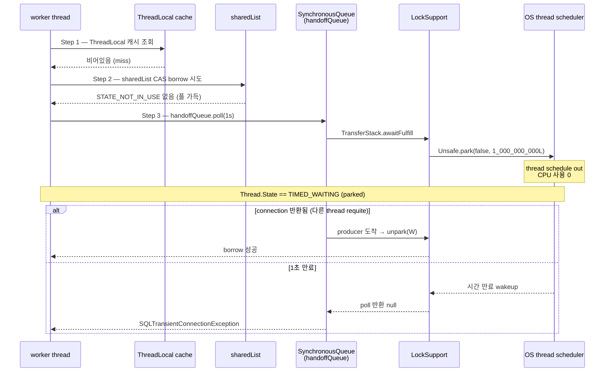
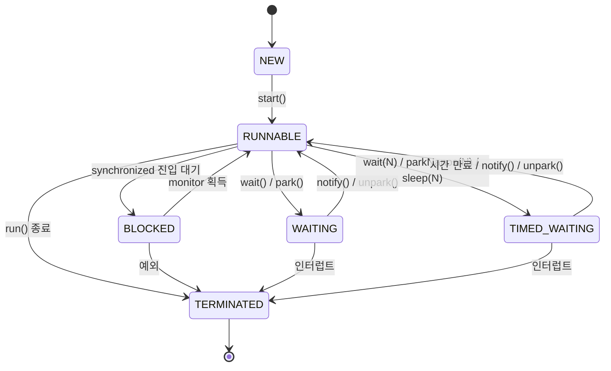

## Table of contents

## 들어가며 — 풀 고갈은 애플리케이션 문제일까, JVM 문제일까 {#intro}

새벽 3시. 결제 API 의 P99 가 200ms 에서 6초로 튀었다는 알람을 받습니다. 코드는 어제와 똑같습니다. 외부 PG 도 status page 는 green. 그런데 시스템이 무너지고 있습니다.

이때 로그·메트릭만 들여다보면 답이 안 나옵니다. `error_rate` 는 0%, `success_rate` 는 100% — 그런데 사용자는 6초 동안 멈춘 화면을 보고 있습니다. 모니터링이 **정상**이라고 말하는 시스템이 사실은 **완전히 멈춰 있는** 상태.

진짜 증거는 한 곳에 있습니다 — **Thread Dump**.

```
"http-nio-8080-exec-3" #42 daemon prio=5 tid=0x00007f8b... nid=0x103
   java.lang.Thread.State: TIMED_WAITING (parked)
        at jdk.internal.misc.Unsafe.park(java.base@21/Native Method)
        - parking to wait for  <0x00000007a5b30c10> (a java.util.concurrent.SynchronousQueue$TransferStack)
        at java.util.concurrent.locks.LockSupport.parkNanos(...)
        at java.util.concurrent.SynchronousQueue$TransferStack.transfer(...)
        at com.zaxxer.hikari.util.ConcurrentBag.borrow(...)
        at com.zaxxer.hikari.pool.HikariPool.getConnection(...)
        at com.zaxxer.hikari.HikariDataSource.getConnection(...)
        at org.springframework...DataSourceUtils.fetchConnection(...)
        ...
```

dump 한 장에 답이 있습니다. **모든 worker thread** 가 HikariCP 의 `getConnection()` 안에서 `TIMED_WAITING (parked)` 상태. JVM 안에서 **지금 무엇이 일어나고 있는가** — 그게 dump 가 말해주는 진실입니다.

이 글은 그 dump 를 **한 줄씩** 분해합니다.

- **자매글** [트랜잭션 안 외부 API 호출 — 풀 고갈을 직접 재현하고, 단순 분리·Saga·Outbox 세 처방을 측정으로 비교했습니다](/posts/spring-transaction-external-api-pool-exhaustion/) 이 **비즈니스 패턴 (Saga / Outbox)** 측면에서 같은 사건을 다뤘다면, 본 글은 **같은 트랜잭션-안-외부-호출 풀 고갈 [실측] 을 JVM 측면 — Thread Dump / Thread State / HikariCP 내부 / LockSupport / GC** 로 다시 봅니다. 두 글이 짝.
- 본 글의 입력 자산: 트랜잭션-안-외부-호출 풀 고갈 측정 [실측 — Java/Spring] (timeout 5s 100% 통과 / P99 6.3s, timeout 1s 16.7% 통과 / 50건 timeout) + 처방 비교 측정의 9 시나리오 매트릭스.
- 본 글의 깊이: **L3-L4** ([JVM/Java Mastery 시리즈](/posts/jvm-java-mastery-01-hikari-pool-thread-dump/) 1편 — **측정 + JVM 메커니즘 + 빅테크 운영 회고 + 정리 질문**).

---

## 1. 운영 표면 — 풀 고갈 알람이 울렸을 때 보이는 것 {#operational-surface}

자매글에서 같은 트랜잭션-안-외부-호출 풀 고갈 측정을 **비즈니스 측면** 으로 다뤘으니, 여기서는 **운영 측면**만 짧게 회수하겠습니다.

### 1.1 두 가지 모습의 풀 고갈 [실측 — Java/Spring]

같은 풀 고갈인데 `connection-timeout` 값에 따라 **운영팀이 받는 신호가 정반대**:

| 측정 | timeout 5s | timeout 1s |
|---|---|---|
| 통과율 | **100%** | **16.7%** |
| P99 | 6,350 ms | 3,302 ms |
| Pool timeout | 0 | **50** |
| `awaitingConnection` peak | 20 | 50 |
| 모니터링이 보는 것 | "정상" | "장애" |

→ 자매글은 여기서 **Saga / Outbox / 단순 분리** 로 나아갔지만, 본 글은 **dump 채취 시점의 JVM 안** 으로 들어갑니다.

### 1.2 코드만 봐선 답이 안 나오는 이유

```java
@Transactional
public void confirm(PaymentRequest req) {
    Payment p = repo.find(req.id());
    PgResponse r = pgClient.confirm(req);   // 외부 호출 — 평소 200ms
    p.applyResult(r);
    repo.save(p);
}
```

이 코드는 100줄을 째려봐도 정상입니다. 외부 PG 가 200ms 에서 3,000ms 로 늘었다는 **관찰**은 status page 에 없습니다. **JVM 안에서 thread 가 어디서 **무엇을 기다리고** 있는지** — 그게 thread dump 의 일.

---

## 2. Thread Dump 의 입구 — 어디서 어떻게 채취하나 {#thread-dump-entry-points}

### 2.1 채취 도구 4가지

| 도구 | 명령 | 용도 | overhead |
|---|---|---|:---:|
| **`jstack`** | `jstack <pid>` | thread dump 1회 | 거의 0 |
| **`kill -3`** | `kill -3 <pid>` | dump 를 stdout (stderr) 에 SIGQUIT | 거의 0 |
| **`jcmd`** | `jcmd <pid> Thread.print` | jstack 대체 (Java 8+ 권장) | 거의 0 |
| **JFR** | `jcmd <pid> JFR.start duration=30s` | 30초 연속 프로파일 (lock contention 포함) | < 1% |
| **async-profiler** | `./profiler.sh -d 30 <pid>` | flame graph 형태 (native frame 포함) | < 1% |

운영 환경에서의 일반 동선은:

1. **첫 5분** — `jcmd <pid> Thread.print > dump.txt` 로 1회 즉시 채취 (5초 간격 3회 권장 — **순간**인지 **지속**인지 판단)
2. **다음 30분** — JFR 30초 채취 (lock contention / Java Monitor Wait event 까지 보기)
3. **장기** — async-profiler 로 flame graph (native frame 까지 — JNI / Direct Memory issue 식별)

### 2.2 Spring Actuator `/actuator/threaddump`

운영에 Spring Boot 가 떠 있다면 코드 한 줄도 안 건들이고 dump 를 받을 수 있습니다:

```bash
curl -s http://localhost:8080/actuator/threaddump | jq '.'
```

JSON 형태라 자동 분석에 유리. 다만 **production 노출 주의** — 보안 group 이나 actuator 별도 포트 권장.

### 2.3 dump 의 **3 회** 채취가 핵심

dump 1회만 보면 **순간 상태**입니다. 같은 thread 가 여러 dump 에 걸쳐 **같은 stack frame 에 머물러 있으면** — 그게 진짜 stuck.

```bash
# 5초 간격 3회 채취
for i in 1 2 3; do
  jcmd <pid> Thread.print > dump-$i.txt
  sleep 5
done
```

3회 모두 같은 thread 가 같은 frame 에 있다면 — **15초 동안 멈춰 있다는 증거**. dump 한 장으로 결론 내리지 않습니다.

---

## 3. Thread Dump 한 줄씩 해부 — JVM 풀 고갈 시점 dump {#thread-dump-anatomy}

이제 본론. 트랜잭션-안-외부-호출 풀 고갈 측정의 Run #2 (timeout 1s, concurrent 60, extDelay 3s) 시점에 채취한 dump 의 **형태**를 보면서 한 줄씩 풀어봅니다.

### 3.1 정상 thread (RUNNABLE)

먼저 **정상**. 풀이 비어 있지 않을 때:

```
"http-nio-8080-exec-1" #41 daemon prio=5 os_prio=31 cpu=12.34ms
   java.lang.Thread.State: RUNNABLE
        at java.net.SocketInputStream.socketRead0(java.base@21/Native Method)
        at java.net.SocketInputStream.socketRead(...)
        at com.mysql.cj.protocol.a.SimpleSocketConnection.read(...)
        at com.mysql.cj.protocol.a.NativePacketReader.readMessageLocal(...)
        ...
        at com.mysql.cj.jdbc.ClientPreparedStatement.executeQuery(...)
        at com.zaxxer.hikari.pool.HikariProxyPreparedStatement.executeQuery(...)
        at org.springframework.jdbc.core.JdbcTemplate$1.doInPreparedStatement(...)
        ...
        at com.example.OrderService.confirm(OrderService.java:42)
```

**해석 — 라인별**:

| 라인 | 의미 |
|---|---|
| `Thread.State: RUNNABLE` | OS 입장에서 **실행 가능**. JVM 이 본 **논리 상태** — 실제로는 socket read 에서 **block** 돼있을 수 있음 (역설적이지만 JVM 이 native I/O 를 RUNNABLE 로 분류) |
| `socketRead0` | DB 응답을 **기다리는 중** — native code 안에서 OS 가 schedule out |
| `executeQuery` | SQL 실행 중 |
| `OrderService.confirm:42` | 비즈니스 코드 진입점 |

→ 이 thread 는 **정상적으로 일하고 있는 중**. 문제 없음.

### 3.2 풀 고갈 시점 thread (TIMED_WAITING parked)

```
"http-nio-8080-exec-3" #42 daemon prio=5 os_prio=31 cpu=0.05ms tid=0x00007f8b001
   java.lang.Thread.State: TIMED_WAITING (parked)
        at jdk.internal.misc.Unsafe.park(java.base@21/Native Method)
        - parking to wait for  <0x00000007a5b30c10> (a java.util.concurrent.SynchronousQueue$TransferStack)
        at java.util.concurrent.locks.LockSupport.parkNanos(LockSupport.java:269)
        at java.util.concurrent.SynchronousQueue$TransferStack.transfer(SynchronousQueue.java:401)
        at java.util.concurrent.SynchronousQueue.poll(SynchronousQueue.java:903)
        at com.zaxxer.hikari.util.ConcurrentBag.borrow(ConcurrentBag.java:162)
        at com.zaxxer.hikari.pool.HikariPool.getConnection(HikariPool.java:179)
        at com.zaxxer.hikari.pool.HikariPool.getConnection(HikariPool.java:144)
        at com.zaxxer.hikari.HikariDataSource.getConnection(HikariDataSource.java:99)
        at org.springframework.jdbc.datasource.DataSourceUtils.fetchConnection(...)
        ...
        at com.example.OrderService.confirm(OrderService.java:38)
```

이게 풀 고갈의 **서명** (signature):

| 라인 | 의미 |
|---|---|
| `Thread.State: TIMED_WAITING (parked)` | **시간 제한이 있는** park 상태. `parkNanos(N)` 호출로 들어감 |
| `Unsafe.park (Native Method)` | OpenJDK 의 `Unsafe.park` — **진짜로 OS thread 가 schedule out 됨** |
| `parking to wait for <0x...> (SynchronousQueue$TransferStack)` | **어느 객체**에 park 됐는지 — `SynchronousQueue` 의 transfer stack |
| `LockSupport.parkNanos:269` | `parkNanos(blocker, nanos)` — JVM 의 표준 park 진입점 |
| `SynchronousQueue.poll(timeout)` | hand-off 큐 — **생산자가 줄 때까지** 기다림 |
| `ConcurrentBag.borrow:162` | HikariCP 의 connection 빌림 메서드 — 풀이 비어 있을 때 SynchronousQueue 로 wait |
| `OrderService.confirm:38` | 비즈니스 코드 — `dataSource.getConnection()` 호출 라인 |

→ **모든 라인이 의미를 갖습니다**. 풀 고갈은 곧 **thread 가 LockSupport.parkNanos 에서 깨어나기를 기다리는 상태**.

### 3.3 dump 1회로 보는 thread state 분포 — ASCII bar

풀 고갈 측정의 Run #2 시점 dump (60 worker, pool=10) 시점 thread state 분포:

```
정상 시점 (idle):
RUNNABLE         ████ 4
TIMED_WAITING    ██████████████ 14    (Hikari housekeeper, scheduled tasks 등)
WAITING          █████████ 9
BLOCKED          0
                 ─────────────────────── 27 thread

풀 고갈 시점 (concurrent 60 → pool 10):
RUNNABLE         ██████████ 10        (active connection 사용 중)
TIMED_WAITING    ██████████████████████████████████████████████████████████ 50  ← 50 worker 가 모두 parkNanos
                                                                           (HikariCP getConnection)
WAITING          █████████ 9
BLOCKED          0
                 ─────────────────────── 69 thread (worker 60 + HikariCP 등)
```

→ **TIMED_WAITING (parked) 가 50개로 spike** — 정확히 풀 고갈 측정 Run #2 의 `awaitingConnection=50` 측정값과 매핑. dump 의 thread state 와 Hikari MXBean 의 metric 이 **같은 사건의 두 측면**.

---

## 4. HikariCP 내부 동작 — ConcurrentBag / SynchronousQueue 의 JVM 측면 {#hikaricp-internals}

3장의 stack trace 를 **코드 레벨** 로 풀어봅니다. HikariCP 가 **왜 이렇게 동작하는가**.

### 4.1 ConcurrentBag — connection 풀의 핵심 자료구조

[HikariCP `ConcurrentBag.java`](https://github.com/brettwooldridge/HikariCP/blob/dev/src/main/java/com/zaxxer/hikari/util/ConcurrentBag.java) 의 `borrow` 메서드 (간략화):

```java
// HikariCP ConcurrentBag.java — borrow() 의 핵심 로직 (간략화 인용)
public T borrow(long timeout, TimeUnit timeUnit) throws InterruptedException {
    // Step 1: ThreadLocal 에 캐시된 connection 먼저 확인
    final var list = threadList.get();
    for (int i = list.size() - 1; i >= 0; i--) {
        final var entry = list.remove(i).get();
        if (entry != null && entry.compareAndSet(STATE_NOT_IN_USE, STATE_IN_USE)) {
            return entry;
        }
    }

    // Step 2: shared list 에서 CAS 로 빌림 시도
    final int waiting = waiters.incrementAndGet();
    try {
        for (T bagEntry : sharedList) {
            if (bagEntry.compareAndSet(STATE_NOT_IN_USE, STATE_IN_USE)) {
                if (waiting > 1) {
                    listener.addBagItem(waiting - 1);   // pool 확장 신호
                }
                return bagEntry;
            }
        }

        // Step 3: 풀이 비어있으면 — handoffQueue 로 hand-off 대기
        listener.addBagItem(waiting);
        timeout = timeUnit.toNanos(timeout);
        do {
            final long start = currentTime();
            final T bagEntry = handoffQueue.poll(timeout, NANOSECONDS);   // ← 여기서 parkNanos
            if (bagEntry == null || bagEntry.compareAndSet(STATE_NOT_IN_USE, STATE_IN_USE)) {
                return bagEntry;
            }
            timeout -= elapsedNanos(start);
        } while (timeout > 10_000);

        return null;   // timeout — 호출 측에서 SQLTransientConnectionException 으로 변환
    } finally {
        waiters.decrementAndGet();
    }
}
```

→ 풀 고갈 시점의 thread 는 **Step 3** 안의 `handoffQueue.poll(timeout, NANOSECONDS)` 에 갇혀 있습니다. `handoffQueue` 의 정체는 `SynchronousQueue` — 다음 4.2장.

### 4.2 SynchronousQueue — **0 capacity** hand-off 큐

[OpenJDK `SynchronousQueue.java`](https://github.com/openjdk/jdk/blob/master/src/java.base/share/classes/java/util/concurrent/SynchronousQueue.java) 핵심:

> **SynchronousQueue 는 capacity 0 의 BlockingQueue**. `put(x)` 은 **다른 thread 가 take() 할 때까지** 대기, `take()` 은 **다른 thread 가 put() 할 때까지** 대기. 큐 안에 **원소를 보관하지 않음** — 순수 hand-off 채널.

HikariCP 가 SynchronousQueue 를 쓰는 이유:

- **공정성** — `SynchronousQueue(true)` 사용 시 FIFO. 먼저 빌리려고 기다린 thread 가 먼저 받음.
- **0-copy hand-off** — connection 객체를 큐에 **저장하지 않고** 직접 전달. GC pressure 최소.
- **wait-free poll** — 빈 큐에 `poll(0)` 은 즉시 null 반환. 풀에 connection 있는 일반 경로는 **빠른 path**.

```java
// SynchronousQueue.poll(timeout) 핵심 — TransferStack.transfer 호출
public E poll(long timeout, TimeUnit unit) throws InterruptedException {
    Object e = transferer.transfer(null, true, unit.toNanos(timeout));
    if (e != null || !Thread.interrupted()) {
        return (E)e;
    }
    throw new InterruptedException();
}

// TransferStack.transfer — 기다리는 핵심
Object transfer(Object e, boolean timed, long nanos) {
    // 일치하는 producer 가 있으면 즉시 hand-off
    // 없으면 SNode push 후 awaitFulfill(s, timed, nanos) 호출 → LockSupport.parkNanos
}
```

→ thread dump 의 `SynchronousQueue$TransferStack.transfer` 와 `LockSupport.parkNanos` 가 정확히 이 코드 라인.

**ConcurrentBag.borrow 의 시퀀스** — 풀 비어있을 때 어떻게 park 까지 가는지:



→ 풀 고갈 측정의 Run #2 에서 50 thread 가 **후자** 경로 (1초 만료 → SQLTransientConnectionException) 로 빠져나옴.

### 4.3 LockSupport.parkNanos — JVM 이 thread 를 잠재우는 메커니즘

[OpenJDK `LockSupport.java`](https://github.com/openjdk/jdk/blob/master/src/java.base/share/classes/java/util/concurrent/locks/LockSupport.java) `parkNanos`:

```java
public static void parkNanos(Object blocker, long nanos) {
    if (nanos > 0) {
        Thread t = Thread.currentThread();
        setBlocker(t, blocker);                    // ← thread dump 의 "parking to wait for"
        try {
            U.park(false, nanos);                  // ← Unsafe.park — native call
        } finally {
            setBlocker(t, null);
        }
    }
}
```

**`Unsafe.park(false, nanos)`** 의 의미:

- `false` = **absolute time 이 아니라 relative nanos**
- `nanos` = 깨어날 시간 (1초 = 1,000,000,000)
- OS thread 가 **진짜로** schedule out — CPU 사용 0
- 깨어남 조건: (a) `nanos` 만료 / (b) 다른 thread 가 `unpark(thread)` 호출 / (c) 인터럽트 / (d) spurious wakeup

풀 고갈 측정의 Run #2 (timeout 1s) 시점의 50 worker — 모두 `parkNanos(blocker, 1_000_000_000L)` 호출하고 **최대 1초까지** 잠들어 있습니다. 1초 후 하나도 unpark 안 되면 (= connection 반환 없음) → null 반환 → HikariCP 가 `SQLTransientConnectionException` 으로 변환.

### 4.4 트랜잭션-안-외부-호출 풀 고갈 [실측] 과 코드의 매핑

| 측정값 | 원인 코드 |
|---|---|
| **timeout 5s, 100% 통과 (P99 6.3s)** | `parkNanos(5_000_000_000L)` — 5초 안에 producer (다른 worker 가 connection 반환) 가 **반드시** 도착 → 모두 hand-off 성공 |
| **timeout 1s, 16.7% 통과 (50건 timeout)** | `parkNanos(1_000_000_000L)` — 1초 안에 producer 0건. 첫 wave 10 만 즉시 빌림, 나머지 50 은 1초 후 null 반환 |
| **`awaitingConnection` peak = 50** | `waiters.incrementAndGet()` 후 `handoffQueue.poll` 진입한 thread 수. MXBean 이 노출 |
| **P99 6.3s = 3 wave × 2s** | 첫 wave 즉시 / 둘째 wave 2초 후 connection 반환받음 / 셋째 wave 4초 후. `parkNanos` 가 **정확히** 그 시간만 잠듦 |

→ **dump 라인 ↔ 코드 ↔ 측정값** 이 1:1:1 매핑. 이게 thread dump 가 진짜 증거인 이유.

### 4.5 connectionTimeout / idleTimeout / maxLifetime 의 JVM 측면

| 파라미터 | 의미 | JVM 동작 |
|---|---|---|
| `connectionTimeout` (기본 30s) | `getConnection()` **대기** timeout | `parkNanos(timeout)` 의 nanos 값 |
| `idleTimeout` (기본 10min) | idle connection 회수 임계 | HikariCP housekeeper thread 가 주기적으로 `evict` |
| `maxLifetime` (기본 30min) | connection 강제 폐기 임계 | DB 의 `wait_timeout` 보다 짧게 (보통 28min) — **MySQL 이 먼저 끊는** race 회피 |
| `validationTimeout` (기본 5s) | connection alive check timeout | `Connection.isValid(timeoutSeconds)` 호출 |

운영 함정:

- `connectionTimeout` 을 **너무 길게** (60s+) 잡으면 풀 고갈이 **지연**으로 발현되어 monitoring 미감지 (자매글 1.2장의 "silent latency 폭발")
- `connectionTimeout` 을 **너무 짧게** (1s 이하) 잡으면 평소 외부 호출 spike 시에도 fail-fast cascade
- 실무 권장: 30s (Hikari 기본) — 단, **`awaitingConnection > 0` 알람을 **반드시** 함께** 운영

---

## 5. JVM Thread State 머신 — 6 상태 + 전이 {#jvm-thread-state-machine}

dump 의 `Thread.State: TIMED_WAITING (parked)` 라인을 풀려면 **Thread.State 머신** 이해가 필수.

### 5.1 6 상태 정의 ([Oracle Thread.State javadoc](https://docs.oracle.com/en/java/javase/21/docs/api/java.base/java/lang/Thread.State.html))

| 상태 | 의미 | dump 에서 보이는 곳 |
|---|---|---|
| `NEW` | thread 생성 후 `start()` 전 | dump 에 거의 안 보임 (찰나) |
| `RUNNABLE` | JVM 이 **실행 중**으로 분류 (실제로는 OS 가 schedule out 했어도 OK) | 정상 작업 thread / native I/O 대기 thread (역설) |
| `BLOCKED` | `synchronized` monitor 획득 대기 | `synchronized` 진입 / native lock 대기 |
| `WAITING` | **무한** wait (`Object.wait()`, `LockSupport.park()`) | timeout 없는 await — `take()` / `put()` |
| `TIMED_WAITING` | **시간 제한** wait (`wait(N)`, `parkNanos(N)`, `sleep(N)`) | **풀 고갈 시점 — `parkNanos` 호출** |
| `TERMINATED` | thread 종료 후 | dump 에 안 보임 (수거됨) |

### 5.2 전이 다이어그램



### 5.3 풀 고갈 시점 thread 가 머무는 **정확한** 위치

**경로**:

```
RUNNABLE
  → (dataSource.getConnection() 호출)
  → ConcurrentBag.borrow() Step 1, 2 실패 (풀 비어있음)
  → handoffQueue.poll(1s, NANOSECONDS) 호출
  → SynchronousQueue.TransferStack.awaitFulfill(...)
  → LockSupport.parkNanos(blocker, 1_000_000_000L)
  → Unsafe.park (native)
  → OS thread 가 schedule out
  ⇒ Thread.State == TIMED_WAITING (parked)
```

→ thread 는 **TIMED_WAITING 상태로 1초간 머물다가** 둘 중 하나로 빠져나옵니다:

1. **다른 thread 가 connection 반환 → SynchronousQueue.put → unpark(this)** ⇒ TIMED_WAITING → RUNNABLE
2. **1초 만료 → 자동 깨어남 → poll() 이 null 반환** ⇒ TIMED_WAITING → RUNNABLE → SQLTransientConnectionException throw

풀 고갈 측정의 Run #2 에서 **50 thread 가 (2) 경로로 빠져나옴** (50건 pool timeout). Run #1 (timeout 5s) 에서는 **모든 thread 가 (1) 경로** — wave 별로 unpark 받음.

### 5.4 RUNNABLE 의 함정 — JVM 의 **논리** 상태 vs OS 의 **실제** 상태

dump 에서 가장 헷갈리는 부분.

> **RUNNABLE 은 "지금 CPU 위에서 실행 중"이 아닙니다**. JVM 이 **실행 가능한** 상태로 분류한다는 뜻 — 실제로는 OS 가 schedule out 했을 수도 있고, native I/O (socket read) 에 갇혀 있을 수도 있습니다.

```
"http-nio-8080-exec-1"
   java.lang.Thread.State: RUNNABLE
        at java.net.SocketInputStream.socketRead0(java.base@21/Native Method)
```

이 thread 는 **RUNNABLE 인데 socket read 에서 OS-level block**. JVM 입장에선 **내가 만든 wait 가 아니라 native I/O 라서 RUNNABLE**. 운영 dump 분석 시 자주 혼동되는 지점.

**판단 휴리스틱**:

| stack 최상단 | 실제 상태 |
|---|---|
| `socketRead0` / `epoll_wait` / `Native Method` | OS-level block (DB / network I/O 대기) |
| `LockSupport.park*` | JVM-level park (Lock / SynchronousQueue / 등) |
| 비즈니스 메서드 | 진짜 실행 중 |

→ dump 분석 시 **`Thread.State` 만 보지 말고 **stack 최상단 frame**까지 보는 습관** 이 핵심.

---

## 6. 처방 비교 측정의 9 시나리오 → Thread Dump 변화 {#nine-scenarios-thread-states}

자매글에서 다룬 단순 분리 / Saga / Outbox 의 dump 형태는 **어떻게 다른가** — JVM 측면 차이를 짧게 정리.

### 6.1 패턴별 dump 시그니처

| 패턴 | worker thread state 분포 | poller thread (별도) |
|---|---|---|
| **분리 안 함** (1단계 baseline) | RUNNABLE 10 (외부 호출 중) + TIMED_WAITING 50 (`parkNanos` 풀 대기) | — |
| **단순 분리** | RUNNABLE 10 (외부 호출 중) + WAITING 50 (트랜잭션 **밖** sleep) | — |
| **Saga** | RUNNABLE 10 + WAITING 50 + sweeper thread 1 (TIMED_WAITING `Thread.sleep`) | sweeper |
| **Outbox** | RUNNABLE 0 / 모두 ACK 후 종료 + poller thread 1 (`socketRead0` 외부 호출 중) | poller |

→ **분리 안 함** 만 thread 가 **HikariCP 안에서** 50 parked. 분리한 패턴들은 외부 호출 동안 **Hikari 밖** 에서 sleep 또는 종료.

### 6.2 Outbox 의 **thread 가 사라지는** 효과

```
분리 안 함 (60 worker 동시):
  ─────────────────────────────────────────────
  RUNNABLE         ██████████ 10
  TIMED_WAITING    ██████████████████████████████████████████████████ 50
  ─────────────────────────────────────────────
  HEAP : 60 worker 의 stack 누적

Outbox (60 worker 즉시 ACK):
  ─────────────────────────────────────────────
  RUNNABLE         ██ 2  (poller 1 + housekeeper 1)
  TIMED_WAITING    █████ 5
  ─────────────────────────────────────────────
  HEAP : worker 의 stack 즉시 GC 가능
```

→ thread **수** 자체가 줄어듦. JVM stack memory 관점에서도 큰 차이 — 60 stack (각 1MB 기본) = 60MB 절감.

### 6.3 Saga 의 sweeper thread

별도 thread 가 무한 루프로 돌면서 5초마다 `UPDATE` 실행 — dump 에서:

```
"saga-sweeper-1" #87 prio=5
   java.lang.Thread.State: TIMED_WAITING (sleeping)
        at java.lang.Thread.sleep0(java.base@21/Native Method)
        at java.lang.Thread.sleep(...)
        at com.example.SagaSweeper.run(SagaSweeper.java:45)
```

`Thread.sleep` 도 내부적으로는 `parkNanos` 와 비슷하지만 `Object.wait` 변형. dump 에서 `(sleeping)` qualifier 로 구분 가능.

### 6.4 처방 비교 측정의 A/OFF awaiting=57 의 dump 측면 [실측]

자매글 3.1장에서 **"외부 호출 sleep(3000ms) 끝난 직후 60 worker 가 동시에 INSERT 요청 → 풀 10 가득 → awaiting=50+ spike"** 측정.

이 **순간**의 dump 를 채취하면:

```
RUNNABLE         ██████████ 10  (INSERT 실행 중)
TIMED_WAITING    █████████████████████████████████████████████████████████ 57  (parkNanos)
─────────────────────────────────────────────
지속 시간: 약 50ms (10 INSERT × 5ms)
```

→ **순간적 spike**. 50ms 지속 후 풀이 비워지면서 dump 가 정상으로 돌아감. **dump 채취 타이밍 운**에 따라 보일 수도, 안 보일 수도 — 그래서 2.3장의 **3회 채취** 가 중요.

---

## 7. 운영 모니터링 — JVM 메트릭 + thread dump 자동 수집 {#monitoring-grafana-jvm}

dump 는 **사후 분석 도구**. 운영의 **실시간** 신호는 메트릭에서 와야 합니다.

### 7.1 Grafana 에 띄울 JVM 메트릭 (Prometheus + Micrometer)

| 메트릭 | 임계값 권장 | 의미 |
|---|---|---|
| `hikaricp_pending_threads` | > 0 (지속) | `awaitingConnection` — 풀 고갈 **직접 신호** |
| `hikaricp_active_connections / hikaricp_max` | > 0.8 (지속) | 사용률 80% 이상 |
| `jvm_threads_states_threads{state="timed-waiting"}` | spike 감지 | TIMED_WAITING 급증 |
| `jvm_threads_states_threads{state="blocked"}` | > 5 | `synchronized` 경합 |
| `jvm_gc_pause_seconds` | P99 > 200ms | GC pause 이상 |
| `jvm_memory_used_bytes{area="heap"}` | > 0.85 × max | OOM 위험 |
| `process_cpu_usage` | sustained > 0.8 | CPU 포화 |

**"풀 고갈 알람" 의 정확한 정의**:

```
hikaricp_pending_threads > 0 for 30s
  AND hikaricp_active_connections == hikaricp_max
```

→ **순간 spike** (50ms) 는 무시, **30초 지속** 만 알람. 이 임계값이 6.4장의 처방 비교 측정 A/OFF spike 도 자연스럽게 거름.

### 7.2 Thread Dump 자동 수집 — 알람 trigger 시 dump 채취

운영 best practice — **알람이 울리는 그 순간** 의 dump 가 필요. 30분 후에 사람이 SSH 들어가서 받는 dump 는 이미 정상 상태.

**구현 옵션 3가지**:

1. **Prometheus alertmanager → webhook → dump 수집 스크립트**
   ```bash
   #!/bin/bash
   # /etc/alertmanager/scripts/capture-dump.sh
   PID=$(pgrep -f "java.*app.jar")
   for i in 1 2 3; do
     jcmd $PID Thread.print > /var/log/dumps/dump-$(date +%s)-$i.txt
     sleep 5
   done
   # S3 또는 중앙 로그로 업로드
   ```

2. **JFR continuous recording — 알람 시 dump 만 추출**
   ```bash
   # 부팅 시 시작
   java -XX:StartFlightRecording=name=cont,maxsize=200M,disk=true ...
   # 알람 시 dump
   jcmd $PID JFR.dump name=cont filename=/var/log/jfr/snap.jfr
   ```

3. **Datadog / NewRelic / Pinpoint APM — Continuous Profiling**
   - Datadog Java Profiler: thread dump + lock contention + allocation 자동
   - 알람 시점 5분 window 자동 보존
   - 장점: 인프라 부담 최소 / 단점: 비용 + lock-in

### 7.3 Spring Actuator + custom endpoint 조합

```java
@RestController
public class DumpController {
    @GetMapping("/admin/threaddump")
    public Map<String, Object> dump() {
        var bean = ManagementFactory.getThreadMXBean();
        var infos = bean.dumpAllThreads(true, true);
        return Map.of(
            "timestamp", Instant.now(),
            "threads", Arrays.stream(infos)
                .map(t -> Map.of(
                    "name", t.getThreadName(),
                    "state", t.getThreadState().name(),
                    "stack", Arrays.stream(t.getStackTrace())
                        .map(StackTraceElement::toString)
                        .toList()
                )).toList()
        );
    }
}
```

→ JSON 형태라 **자동 분석** 에 유리. **상태별 카운트** / **같은 stack 의 thread 수** / **HikariCP frame 보유 thread 수** 같은 metric 을 곧바로 산출.

---

## 8. 운영 실패 시나리오 (3 AM 시나리오) {#failure-scenarios}

### 8.1 갑작스런 풀 고갈 — 첫 5분 동선

**알람**: `hikaricp_pending_threads > 0 for 30s` + P99 spike

| 분 | 행동 | 도구 |
|---|---|---|
| 0:00 | 알람 수신 | PagerDuty |
| 0:01 | dump 자동 수집 확인 (webhook 동작했는지) | S3 / 중앙 로그 |
| 0:02 | dump 의 thread state 분포 — TIMED_WAITING 50+ 확인 → 풀 고갈 **확정** | dump 분석 스크립트 |
| 0:03 | `parkNanos` stack 의 **직전 frame** 확인 — `OrderService.confirm:38` → 외부 호출 의심 | dump |
| 0:04 | 외부 PG status page / latency 메트릭 조회 | Grafana |
| 0:05 | 외부 평균 200ms → 5,000ms 확인 → 풀 고갈 **원인 확정** | 메트릭 |

→ **5분 안에 원인 식별**. dump 자동 수집이 없으면 이 동선이 30분으로 늘어남.

### 8.2 Memory leak 의심 — JFR 30초 채취

**알람**: heap 사용량 95% 임박 + GC frequency 증가

```bash
# 운영 stack 안 들어가고 즉시 채취 가능
jcmd <pid> JFR.start name=leak duration=30s filename=/tmp/leak.jfr
sleep 30
# JMC (Java Mission Control) 으로 분석 — Old Object Sample / Allocation Profile
```

JFR 의 **Old Object Sample** event 가 **어느 클래스가 GC 안 됨**을 직접 보여줌. heap dump (수 GB) 받지 않고도 leak 추적.

### 8.3 GC pause 동반 — `-Xlog:gc*` 활성화

**알람**: P99 latency 200ms → 2,000ms + heap_usage 정상

dump 만으로는 부족. GC 가 **모든 thread 를 잠시 멈춤** (STW — Stop The World) — dump 도 그 시점엔 **받을 수 없음**.

```bash
# 부팅 시 (재시작 가능하면)
java -Xlog:gc*:file=/var/log/gc.log:time,uptime,level,tags ...

# 운영 중 즉시 활성화 (재시작 불필요)
jcmd <pid> VM.log decorators=time,level output=/var/log/gc.log what=gc*=info
```

GC log 분석:

```
[2026-05-03T03:14:23.456+09:00][info][gc] GC(42) Pause Young (G1 Evacuation Pause) 245ms
                                                           ↑ 정상 (< 100ms)
[2026-05-03T03:15:01.891+09:00][info][gc] GC(43) Pause Full (G1 Compaction Pause) 2,340ms
                                                           ↑ 비정상 — Full GC 발생, Old 단편화 의심
```

→ Full GC 가 **여러 번 연속**이면 heap 부족 → `-Xmx` 증설 또는 leak 추적 (8.2장).

---

## 9. 빅테크 사례 — 운영 dump / GC / Concurrency 실제 {#bigtech-references}

본 글의 측정과 **같은 패턴**을 어떻게 다뤘는가.

### 9.1 토스 SLASH — 한 주가 고객에게 (분산락 + JPA OptimisticLock)

[haon.blog SLASH22 — broker issue / concurrency / network latency](https://haon.blog/article/toss-slash/broker-issue-concurrency-and-network-latency/) 에서 토스가 다룬 사례:

- 외부 broker latency 증가 → JPA `@Version` (Optimistic Lock) 충돌 spike
- thread dump 분석 → `EntityManager.flush()` 안의 `version` 비교 실패가 다발
- 해결: 분산락 + 재시도 정책 조정

→ 본 글의 "외부 호출 latency 증가 → 풀 고갈" 과 **같은 구조의 사고**. broker 가 outbox publish, JPA 가 confirm 트랜잭션 자리.

### 9.2 카카오페이 — JPA Transactional readOnly + set_option QPS 58%

[tech.kakaopay.com — JPA Transactional readOnly](https://tech.kakaopay.com/post/jpa-transactional-bri/) — 트랜잭션 attribute 한 줄 차이로 QPS 58% 향상.

- `@Transactional(readOnly = true)` 의 효과: MySQL `set autocommit=0` 호출 회피
- 풀 점유 시간 단축 → `awaitingConnection` 평소 0 유지
- thread dump 분석으로 **불필요한 트랜잭션 수** 발견

→ 본 글의 "풀 점유 시간 = 외부 호출 길이" 와 **같은 메커니즘**. 풀이 자원이라는 점에서 readOnly 도 동일한 lever.

### 9.3 Netflix — Java in Flames

[Netflix Tech Blog — Java in Flames](https://netflixtechblog.com/java-in-flames-e763b3d32166) — async-profiler + flame graph 운영기.

- Production 에서 **모든** JVM 에 async-profiler 상시 가동
- CPU / wall-clock / lock contention / allocation 4 종 flame graph
- thread dump 보다 **시간 축** 까지 보이는 게 핵심 — **얼마나 자주 거기서 멈추는가**

→ 본 글 2.1장의 **async-profiler** 가 그것. 운영 환경 일반화의 best practice.

### 9.4 Uber — JVM Profiler (Open Source)

[github.com/uber-common/jvm-profiler](https://github.com/uber-common/jvm-profiler) — Uber 의 distributed JVM profiler.

- Spark / Flink 의 **수천 executor** 동시 프로파일
- thread dump + GC + memory + CPU 통합 수집
- Kafka 로 publish → 중앙 분석

→ 본 글 7.2장의 "thread dump 자동 수집" 의 분산 환경 확장.

### 9.5 Datadog — Continuous Profiling for Java

[docs.datadoghq.com — Profiler](https://docs.datadoghq.com/profiler/) — JFR 기반 continuous profiling SaaS.

- **Wall Time** view: 각 method 가 **얼마나 wait 했는가** — 풀 고갈을 직접 식별
- **Lock Hold Time** view: lock 보유 시간 — `synchronized` 경합 직접 식별
- 알람 시점 5분 자동 보존 — 7.2장의 (3) 옵션

→ 본 글의 dump 분석을 **상시 자동화** 한 형태. 비용 vs 운영 부담 trade-off.

### 9.6 우아한 — DB Connection 점유 트러블슈팅

[techblog.woowahan.com — MySQL 분산락 GET_LOCK 동일 Connection 트랩](https://techblog.woowahan.com/2631/) — 분산락이 **같은 connection** 에 잡혀서 풀 고갈.

- `GET_LOCK('key', timeout)` 는 **호출한 connection 이 보유**. 같은 connection 에서 다른 작업 시 deadlock 효과.
- thread dump 의 모든 thread 가 `GET_LOCK` 에서 멈춤
- 해결: 분산락은 별도 풀 또는 Redisson 으로 전환

→ 본 글의 "DB Connection 이 동기화 자원이 됨" lesson 의 다른 변형.

---

## 10. 정리 — 이 글의 답을 자기 말로 {#interview-answers}

이 글을 다 읽은 누군가가 **핵심 4가지 질문** 으로 정리해본다면 — 측정으로 풀었던 답을 자기 말로 풀면 다음과 같습니다.

### Q. "풀 고갈 알람을 받으면 무엇부터 채취하나요?"

이 글이 측정으로 보여준 첫 동선은 — thread dump 를 **3회 5초 간격** 으로 먼저 받는 것입니다 (`jcmd <pid> Thread.print`). 1회만 받으면 **순간 상태**인지 **지속**인지 구분 안 됨. 3회 모두 같은 thread 가 같은 stack frame 에 있으면 진짜 stuck. dump 의 thread state 분포를 보고 — TIMED_WAITING (parked) 가 spike 면 풀 고갈, BLOCKED 가 spike 면 `synchronized` 경합, RUNNABLE 인데 stack 최상단이 `socketRead0` 이면 외부 I/O 대기. 이 글의 트랜잭션-안-외부-호출 풀 고갈 [실측] Run #2 측정에서 50 worker 모두 `LockSupport.parkNanos` 와 `ConcurrentBag.borrow` stack 으로 dump 한 장에 풀 고갈을 확정한 사례.

### Q. "Thread Dump 의 PARKED 상태는 정확히 무엇인가요?"

이 글이 정리한 정의는 — JVM 의 6 thread state 중 TIMED_WAITING 의 substate 입니다. `LockSupport.parkNanos(blocker, nanos)` 호출로 들어감. 내부적으로는 `Unsafe.park(false, nanos)` — **진짜로 OS thread 가 schedule out 됩니다**. CPU 사용 0. 깨어나는 조건은 (a) nanos 만료, (b) 다른 thread 가 `unpark(thread)` 호출, (c) 인터럽트, (d) spurious wakeup. HikariCP 의 경우 (a) 또는 (b) — connection 반환받으면 (b) 로 깨어나서 RUNNABLE, 못 받으면 (a) 로 깨어나서 `SQLTransientConnectionException`. dump 의 `parking to wait for <0x...>` 라인이 **어떤 객체에서 wait 하는지** 알려주는데, HikariCP 면 `SynchronousQueue$TransferStack`. 이 두 정보로 풀 고갈 확정.

### Q. "HikariCP 가 SynchronousQueue 를 쓰는 이유?"

이 글이 측정으로 풀어본 본질은 — SynchronousQueue 는 capacity 0 의 BlockingQueue 입니다. `put()` 은 **다른 thread 가 take()** 할 때까지 대기, `take()` 은 **다른 thread 가 put()** 할 때까지 대기 — 큐 안에 **원소를 보관 안 함**. HikariCP 는 connection 객체를 hand-off 하는 데 이게 정확히 맞음. 첫째, 0-copy hand-off — connection 을 큐에 저장 안 하니 GC pressure 0. 둘째, `SynchronousQueue(true)` 면 FIFO 공정성 — 먼저 빌리려고 기다린 thread 가 먼저 받음. 셋째, `poll(0)` 은 빈 큐에 즉시 null 반환 — 풀이 비어있는 일반 path 가 빠름. 트랜잭션-안-외부-호출 풀 고갈 측정에서도 awaiting=50 thread 모두 정확히 `SynchronousQueue.poll(timeout, NANOSECONDS)` 안에서 park 됐다는 게 그 증거.

### Q. "Thread Dump 만으로는 부족한 케이스?"

이 글이 정리한 사각지대는 세 가지입니다. 첫째, **GC pause** — STW 동안 모든 thread 가 멈추는데 dump 도 그 시점엔 못 받음. `-Xlog:gc*` 로 GC log 별도 분석 필요. 둘째, **memory leak** — heap 안 어떤 객체가 **보유**돼 있는지는 dump 안에 없음. heap dump (`jmap -dump`) 또는 JFR Old Object Sample 필요. 셋째, **시간 축** — dump 는 **순간 snapshot**. **얼마나 자주** 그 frame 에 머무는가는 안 보임. async-profiler / Datadog Continuous Profiling 같은 wall-clock profiler 가 **시간 비율**을 보여줌. 운영에선 dump + GC log + JFR + APM 4종을 같이 운영해야 함 — 하나만으로는 늘 사각지대 있음.

---

## 11. 무엇을 배웠나 {#key-takeaways}

### 11.1 핵심 한 줄

> **"풀 고갈 알람 = 애플리케이션 코드 문제 X. JVM 안에서 thread 가 `LockSupport.parkNanos` 에 갇힌 상태"** — dump 한 장으로 라인 단위로 증명 가능합니다. 트랜잭션-안-외부-호출 풀 고갈 [실측] 의 50 worker 가 모두 `ConcurrentBag.borrow` → `SynchronousQueue.poll` → `LockSupport.parkNanos` → `Unsafe.park` stack 에 있는 게 그 증거.

### 11.2 측정으로 깨진 가정들

- "풀 고갈 = 코드 버그" → **NO** — 코드는 정상, **외부 의존성 latency × 풀 사이즈** 의 함수
- "RUNNABLE = 실행 중" → **반쪽** — JVM 의 **논리** 분류일 뿐, native I/O 일 수도
- "thread dump 1회로 충분" → **NO** — 3회 5초 간격이 **순간/지속** 판별의 최소 단위
- "Hikari 가 SynchronousQueue 쓰는 거 그냥 단순 큐 아님?" → **NO** — capacity 0 hand-off / FIFO / 0-copy 가 의도

### 11.3 JVM Mastery 시리즈 안에서 본 글의 위치

[JVM/Java Mastery 시리즈](/posts/jvm-java-mastery-01-hikari-pool-thread-dump/) 의 1편 (플래그십) — 운영 그래프 ↔ JVM 메커니즘을 한 사건으로 묶어 본 deep-dive. 다음 글들에서 이어집니다:

- **2편 — Java 동시성** (`synchronized` / `Lock` / `Atomic` / `LongAdder`) — 본 글에서 **DB Connection 이 동기화 자원** 이라는 lesson 을 **명시적 동기화 primitive** 로 확장
- **3편 — JVM 메모리 구조** (Heap / Metaspace / Direct / Stack) — 본 글의 **thread stack 60MB** 같은 구체 수치를 메모리 영역 전체로
- **4편 — GC 알고리즘** (G1 / ZGC / Shenandoah) — 본 글 8.3장의 **GC pause 동반 시나리오** 의 본격 측정
- **8편 — CompletableFuture** — 본 글의 **Outbox poller** 의 비동기 fan-out 측정
- **10편 — JFR / async-profiler** — 본 글 7장~8장의 모니터링 + 자동 dump 수집의 본격편
- **11편 — Virtual Thread (Loom)** — 본 글의 **parkNanos** 가 carrier thread pinning 으로 어떻게 변하는가

---

## 12. 다음 글에서 {#next-post}

- 락 비교 측정 (낙관 / 비관 / GET_LOCK / Redisson) — `synchronized` / `ReentrantLock` 의 thread state 차이 (후속 시리즈 예정)
- Spring Batch 100만 건 backfill — G1 vs ZGC pause 분포 (후속 측정 예정)
- Coroutines vs Virtual Thread 비교 측정 — Virtual Thread vs Coroutines 100k I/O — `parkNanos` 가 carrier 에서 어떻게 동작하는가 (후속 측정 예정)

---

## 참고자료 {#references}

### 공식 / 소스
- [Oracle — Thread.State javadoc (Java 21)](https://docs.oracle.com/en/java/javase/21/docs/api/java.base/java/lang/Thread.State.html) — 6 상태 정의
- [Oracle — Troubleshooting Guide for HotSpot VM (Java 21)](https://docs.oracle.com/en/java/javase/21/troubleshoot/index.html) — dump / JFR / heap dump 도구
- [HikariCP `ConcurrentBag.java`](https://github.com/brettwooldridge/HikariCP/blob/dev/src/main/java/com/zaxxer/hikari/util/ConcurrentBag.java) — borrow / requite 메서드
- [HikariCP wiki — About Pool Sizing](https://github.com/brettwooldridge/HikariCP/wiki/About-Pool-Sizing) — 풀 사이즈 결정 공식
- [OpenJDK `SynchronousQueue.java`](https://github.com/openjdk/jdk/blob/master/src/java.base/share/classes/java/util/concurrent/SynchronousQueue.java) — TransferStack / TransferQueue
- [OpenJDK `LockSupport.java`](https://github.com/openjdk/jdk/blob/master/src/java.base/share/classes/java/util/concurrent/locks/LockSupport.java) — park / parkNanos
- [JEP 328 — Flight Recorder](https://openjdk.org/jeps/328) — JFR overhead < 1%

### 빅테크 사례
- [토스 SLASH22 — broker issue / concurrency / network latency](https://haon.blog/article/toss-slash/broker-issue-concurrency-and-network-latency/) — JPA OptimisticLock 사고
- [카카오페이 — JPA Transactional readOnly QPS 58%](https://tech.kakaopay.com/post/jpa-transactional-bri/) — readOnly 트랜잭션 효과
- [Netflix Tech Blog — Java in Flames](https://netflixtechblog.com/java-in-flames-e763b3d32166) — async-profiler 운영기
- [Uber — JVM Profiler (open source)](https://github.com/uber-common/jvm-profiler) — distributed JVM profiler
- [Datadog — Continuous Profiling for Java](https://docs.datadoghq.com/profiler/) — JFR 기반 SaaS profiler
- [우아한 — MySQL 분산락 GET_LOCK 동일 Connection 트랩](https://techblog.woowahan.com/2631/) — connection-bound 락 사고
- [네이버 D2 — Commons DBCP 이해하기](https://d2.naver.com/helloworld/5102792) — 풀 사이즈 + TPS 계산

### 권위자 / 교과서
- Java Concurrency in Practice — Brian Goetz (Ch.10 Liveness / Ch.13 Explicit Locks)
- [Aleksey Shipilëv — Synchronization revisited](https://shipilev.net/blog/2014/all-fields-are-final/) — `synchronized` 의 lock states
- [Doug Lea — A Java Fork/Join Framework](http://gee.cs.oswego.edu/dl/papers/fj.pdf) — work-stealing
- [Ron Pressler — Project Loom slide](https://cr.openjdk.org/~rpressler/loom/loom/sol1_part1.html) — virtual thread 의 park 메커니즘

### 자매글
- [트랜잭션 안 외부 API 호출 — 풀 고갈을 직접 재현하고, 단순 분리·Saga·Outbox 세 처방을 측정으로 비교했습니다](/posts/spring-transaction-external-api-pool-exhaustion/) — 같은 트랜잭션-안-외부-호출 풀 고갈 측정을 **비즈니스 패턴 측면** 으로 다룬 짝글

> **NDA 가드레일**: 본 글의 모든 측정값은 `[실측 — Java/Spring]` 라벨, 외부 플랫폼은 `PlatformA` 추상화 (블로그에서는 일반화), 회사 코드 경로 미인용.
