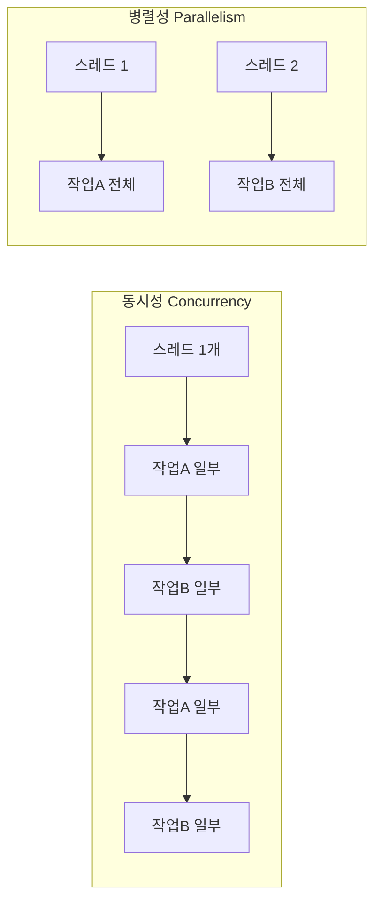
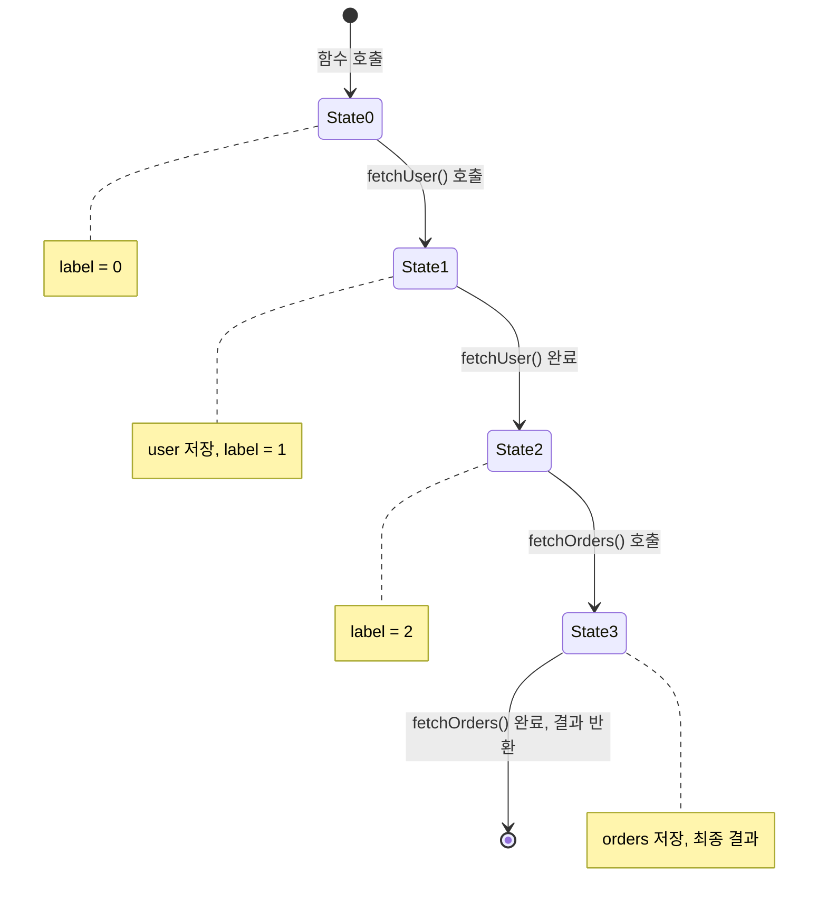
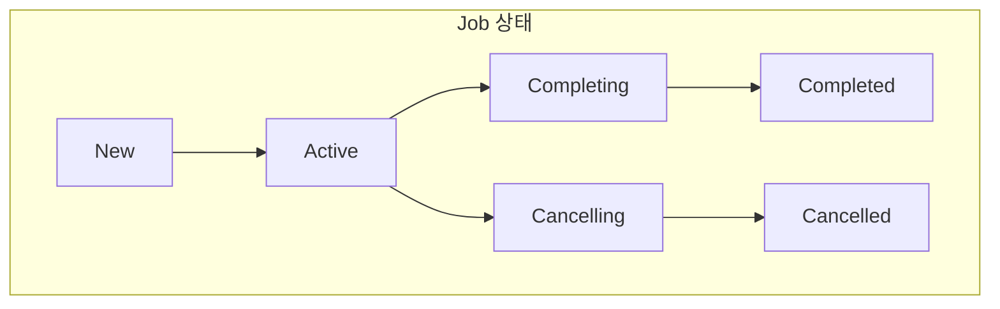
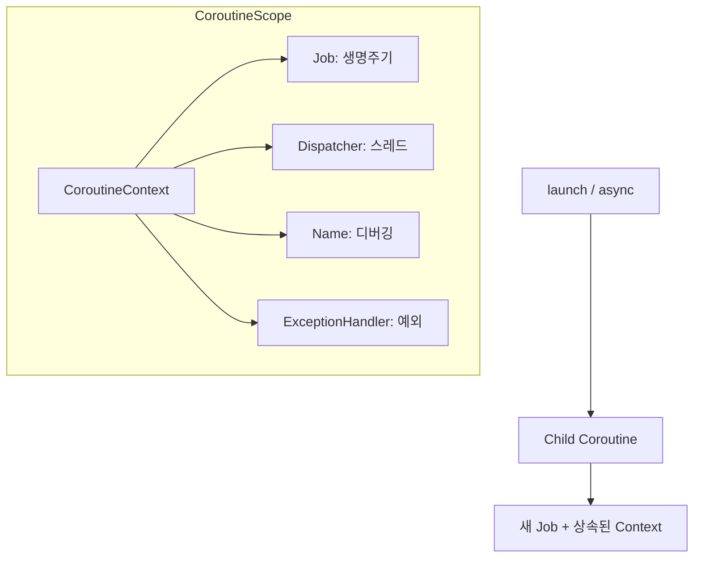
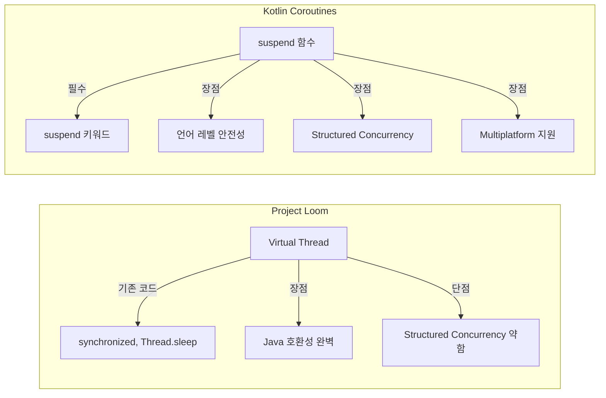

## Executive Summary

Kotlin Coroutines를 처음 접했을 때 솔직히 막막했습니다. `suspend` 키워드 하나 붙이면 마법처럼 비동기 처리가 된다는데, 그 마법의 정체가 뭔지 도통 감이 오지 않았습니다. "가볍다"는 말은 많이 들었지만, 왜 가벼운지, Thread와 뭐가 다른지 명확히 설명하지 못하는 제 자신이 답답했습니다.

이 글은 그 답답함을 해소하기 위해 파고든 기록입니다.

**핵심 내용:**

- **Coroutines의 실체**: `suspend` 함수가 컴파일되면 State Machine으로 변환됩니다. Thread를 점유하는 게 아니라 상태만 저장하고 스레드를 반납하는 구조입니다.
- **Thread 대비 6배 가벼운 이유**: 1MB 스택 대신 수백 바이트의 Continuation 객체만 할당합니다. Context Switch 비용도 OS 레벨 전환에 비해 상대적으로 가볍습니다.
- **RxJava vs Coroutines vs Project Loom**: 각각의 트레이드오프가 있습니다. RxJava는 강력한 연산자, Coroutines는 가독성, Loom은 기존 코드 호환성이 장점입니다.
- **프로덕션에서 실수하기 쉬운 부분**: `CancellationException`을 삼키면 취소 전파가 끊깁니다. `GlobalScope`는 Structured Concurrency를 깨뜨립니다.

---

## 잠깐, 코루틴이 뭔가요?

Coroutines를 처음 접했을 때 "비동기를 쉽게 해주는 거"라는 설명만 들었습니다. 그런데 비동기가 뭔지, Thread랑 뭐가 다른지 명확히 모르는 상태에서 들으니 더 헷갈렸습니다.

그래서 가장 기본적인 것부터 정리해봤습니다.

### 일상에서 찾는 코루틴의 개념

파스타를 만든다고 생각해 보겠습니다.

**순차적으로 요리하면:**
1. 물을 끓인다 (10분 대기)
2. 파스타를 삶는다 (8분 대기)
3. 소스를 만든다 (5분)
4. 플레이팅 (2분)

총 25분이 걸립니다. 물이 끓는 10분 동안 멍하니 서 있는 거죠.

**동시에 요리하면:**
1. 물을 올리고, 끓는 동안 소스 재료를 준비한다
2. 파스타를 삶으면서 소스를 만든다
3. 플레이팅

실제로는 15분 정도면 끝납니다. 한 작업이 "대기" 상태일 때 다른 작업을 하는 거죠.

프로그래밍에서도 마찬가지입니다. 외부 API 응답을 기다리는 동안 CPU가 놀고 있으면 낭비입니다. 그 시간에 다른 요청을 처리할 수 있습니다.

**코루틴이 하는 일이 바로 이겁니다:** "기다리는 동안 다른 일 하다가, 준비되면 다시 돌아와서 이어서 하기"

```kotlin
// 코루틴이 없으면 이렇게 됩니다
val user = api.fetchUser(id)     // 네트워크 응답까지 스레드가 멈춤
val orders = api.fetchOrders(id) // 또 멈춤
return UserData(user, orders)

// 코루틴을 쓰면
val user = api.fetchUser(id)     // 기다리는 동안 스레드 반납, 다른 일 가능
val orders = api.fetchOrders(id) // 마찬가지
return UserData(user, orders)    // 코드는 똑같이 생겼는데 효율이 다름
```

### 동시성(Concurrency) vs 병렬성(Parallelism)

이 두 개념이 처음에 많이 헷갈렸습니다. 자주 혼용되지만 다른 개념입니다.

**동시성(Concurrency):** 여러 작업을 **번갈아가며** 처리하는 것

커피숍에 바리스타가 1명인데 주문이 3개 들어왔다고 생각해보세요:
- 1번 주문 에스프레소 추출 시작 → 기다리는 동안
- 2번 주문 컵에 얼음 담기 →
- 3번 주문 우유 스팀 시작 →
- 1번 에스프레소 완성되면 마무리 →
- 이런 식으로 번갈아가며 처리

한 명이 여러 작업을 "동시에 진행 중"인 것처럼 보이게 합니다.

**병렬성(Parallelism):** 여러 작업을 **실제로 동시에** 처리하는 것

바리스타가 3명이면 각자 1개씩 동시에 만들 수 있습니다. 물리적으로 동시에 실행됩니다.



**코루틴은 주로 동시성을 제공합니다.** 하나의 스레드에서 여러 코루틴이 번갈아 실행될 수 있습니다. 물론 `Dispatchers.Default`처럼 여러 스레드를 쓰면 병렬 실행도 됩니다.

### Thread와 Coroutine, 뭐가 다른가요?

둘 다 "동시에 여러 일 하기"를 가능하게 해줍니다. 하지만 작동 방식이 다릅니다.

**Thread (스레드):**
- 운영체제(OS)가 관리합니다
- 각 스레드마다 약 1MB의 메모리(스택)가 필요합니다
- 스레드 간 전환(Context Switch)에 비용이 큽니다
- 10,000개 만들면? 시스템이 버티지 못합니다

**Coroutine (코루틴):**
- Kotlin 런타임이 관리합니다
- 각 코루틴은 수백 바이트만 필요합니다
- 전환 비용이 거의 없습니다
- 100,000개도 가능합니다

비유하자면:
- **Thread**: 직원을 새로 고용하는 것. 급여, 자리, 복지... 비용이 큽니다.
- **Coroutine**: 기존 직원에게 여러 업무를 맡기는 것. 한 업무가 대기 중이면 다른 업무를 합니다.

```kotlin
// Thread로 10,000개 작업
repeat(10_000) {
    Thread {
        Thread.sleep(1000)
        println("Thread $it done")
    }.start()
}
// 결과: OutOfMemoryError 또는 시스템 매우 느려짐

// Coroutine으로 100,000개 작업
runBlocking {
    repeat(100_000) {
        launch {
            delay(1000)  // 핵심: non-blocking suspend 함수
            println("Coroutine $it done")
        }
    }
}
// 결과: 문제없이 실행됨
```

> **주의**: 위 코루틴 예제가 작동하는 이유는 `delay()`가 **non-blocking suspend 함수**이기 때문입니다. `delay()` 대신 `Thread.sleep()`이나 블로킹 I/O를 사용하면 스레드 풀이 고갈되어 문제가 발생합니다. 코루틴이 가볍다는 건 "suspend 지점에서 스레드를 반납할 수 있을 때"라는 전제가 있습니다.

---

## Java vs Kotlin: 비동기 코드 비교

"Kotlin Coroutines가 좋다"는 말은 많이 들었는데, 직접 비교해보지 않으면 와닿지 않았습니다. 같은 기능을 Java와 Kotlin으로 구현해서 비교해봤습니다.

### 시나리오: 두 API를 병렬 호출 후 결합

사용자 정보와 주문 목록을 동시에 가져와서 합치는 간단한 작업입니다.

**Java - Thread 사용:**

```java
// Java Thread 방식
public UserData loadUserData(Long userId) throws InterruptedException {
    AtomicReference<User> userRef = new AtomicReference<>();
    AtomicReference<List<Order>> ordersRef = new AtomicReference<>();
    AtomicReference<Exception> errorRef = new AtomicReference<>();

    Thread userThread = new Thread(() -> {
        try {
            userRef.set(api.fetchUser(userId));
        } catch (Exception e) {
            errorRef.set(e);
        }
    });

    Thread ordersThread = new Thread(() -> {
        try {
            ordersRef.set(api.fetchOrders(userId));
        } catch (Exception e) {
            errorRef.set(e);
        }
    });

    userThread.start();
    ordersThread.start();
    userThread.join();  // 완료 대기
    ordersThread.join();

    if (errorRef.get() != null) {
        throw new RuntimeException(errorRef.get());
    }

    return new UserData(userRef.get(), ordersRef.get());
}
```

**Java - CompletableFuture 사용:**

```java
// Java CompletableFuture 방식
public CompletableFuture<UserData> loadUserData(Long userId) {
    CompletableFuture<User> userFuture = CompletableFuture
        .supplyAsync(() -> api.fetchUser(userId), executor);

    CompletableFuture<List<Order>> ordersFuture = CompletableFuture
        .supplyAsync(() -> api.fetchOrders(userId), executor);

    return userFuture
        .thenCombine(ordersFuture, (user, orders) -> new UserData(user, orders))
        .whenComplete((result, error) -> {
            if (error != null) {
                // 로깅만 하고, 예외는 자동으로 전파됨
                logger.error("Failed to load user data", error);
            }
        });
}
```

**Kotlin - Coroutines 사용:**

```kotlin
// Kotlin Coroutines 방식
// fetchUser, fetchOrders가 suspend 함수라고 가정합니다.
// (내부적으로 withContext(Dispatchers.IO)로 I/O 처리)
suspend fun loadUserData(userId: Long): UserData = coroutineScope {
    val user = async { api.fetchUser(userId) }
    val orders = async { api.fetchOrders(userId) }

    UserData(user.await(), orders.await())
}
```

### 코드 비교 분석

| 측면 | Java Thread | Java CompletableFuture | Kotlin Coroutines |
|------|-------------|------------------------|-------------------|
| 코드 줄 수 | ~25줄 | ~15줄 | ~5줄 |
| 에러 처리 | AtomicReference 수동 관리 | exceptionally 체인 | try-catch |
| 가독성 | 복잡함 | 함수형 체인 학습 필요 | 동기 코드와 유사 |
| 취소 처리 | interrupt 수동 관리 | 제한적 | 자동 전파 |
| 디버깅 | 스택 트레이스 복잡 | 람다 체인으로 불명확 | 명확한 스택 트레이스 |

Coroutines 코드가 압도적으로 짧고 읽기 쉽습니다. 마치 동기 코드처럼 위에서 아래로 읽히는데, 실제로는 비동기로 실행됩니다.

### 복잡한 시나리오: 순차 + 병렬 조합

더 복잡한 경우를 보겠습니다. 인증 → (사용자 정보 + 주문 병렬 조회) → 결과 반환

**Java CompletableFuture:**

```java
public CompletableFuture<UserData> loadUserDataWithAuth(String token) {
    return authService.validate(token)
        .thenCompose(authResult -> {
            if (!authResult.isValid()) {
                return CompletableFuture.failedFuture(
                    new AuthException("Invalid token")
                );
            }

            CompletableFuture<User> userFuture = CompletableFuture
                .supplyAsync(() -> api.fetchUser(authResult.getUserId()), executor);
            CompletableFuture<List<Order>> ordersFuture = CompletableFuture
                .supplyAsync(() -> api.fetchOrders(authResult.getUserId()), executor);

            return userFuture.thenCombine(ordersFuture, UserData::new);
        })
        .exceptionally(error -> {
            if (error.getCause() instanceof AuthException) {
                throw (AuthException) error.getCause();
            }
            logger.error("Failed", error);
            throw new RuntimeException(error);
        });
}
```

**Kotlin Coroutines:**

```kotlin
suspend fun loadUserDataWithAuth(token: String): UserData {
    val authResult = authService.validate(token)

    if (!authResult.isValid) {
        throw AuthException("Invalid token")
    }

    return coroutineScope {
        val user = async { api.fetchUser(authResult.userId) }
        val orders = async { api.fetchOrders(authResult.userId) }
        UserData(user.await(), orders.await())
    }
}
```

복잡도가 올라갈수록 차이가 더 벌어집니다. Coroutines는 "생각의 흐름대로" 코드를 쓸 수 있습니다.

---

## 왜 Kotlin은 Coroutines를 밀고 있는가

Kotlin이 2017년에 Coroutines를 도입한 이후로 계속 강조하고 있습니다. 특히 Android에서는 공식 권장 방식이 됐습니다. 왜일까요?

### Android 공식 권장 이유

Google이 Android에서 Coroutines를 권장하는 이유를 [공식 문서](https://developer.android.com/kotlin/coroutines)에서 찾아봤습니다:

1. **메인 스레드 안전성**: UI 스레드를 블로킹하지 않고 비동기 작업 처리
2. **구조화된 동시성**: Activity/Fragment 생명주기와 연동하여 자동 취소
3. **Jetpack 통합**: Room, Retrofit, WorkManager 등 공식 라이브러리가 Coroutines 지원

> Android Developers 문서에서는 "Coroutines는 Android에서 비동기 프로그래밍의 권장 솔루션"이라고 명시하고 있습니다. 자세한 내용은 [Kotlin coroutines on Android](https://developer.android.com/kotlin/coroutines) 가이드를 참고하세요.

```kotlin
// Activity에서의 안전한 사용
class UserActivity : AppCompatActivity() {
    override fun onCreate(savedInstanceState: Bundle?) {
        super.onCreate(savedInstanceState)

        // lifecycleScope: Activity가 종료되면 자동으로 취소됨
        lifecycleScope.launch {
            val user = userRepository.getUser(userId)
            binding.userName.text = user.name
        }
    }
}
```

`lifecycleScope`를 사용하면 Activity가 종료될 때 자동으로 코루틴이 취소됩니다. 메모리 누수나 크래시 걱정이 줄어듭니다.

### RxJava 대비 학습 곡선

RxJava도 강력한 비동기 라이브러리입니다. 하지만 진입 장벽이 높습니다.

**RxJava를 쓰려면 알아야 할 것들:**
- Observable, Single, Maybe, Completable, Flowable 차이
- 200개 이상의 연산자 (map, flatMap, switchMap, concatMap...)
- Scheduler 개념
- Backpressure 처리
- Hot/Cold Observable

**Coroutines를 쓰려면 알아야 할 것들:**
- suspend 키워드
- launch, async
- CoroutineScope
- Dispatcher

물론 깊이 들어가면 Coroutines도 복잡해집니다. 하지만 기본적인 사용은 훨씬 쉽습니다.

```kotlin
// RxJava: flatMap? concatMap? switchMap?
api.fetchUser(id)
    .flatMap { user -> api.fetchOrders(user.id) }
    .subscribeOn(Schedulers.io())
    .observeOn(AndroidSchedulers.mainThread())
    .subscribe(
        { orders -> showOrders(orders) },
        { error -> showError(error) }
    )

// Coroutines: 그냥 순서대로 쓰면 됨
// (아래 코드는 suspend 함수 또는 코루틴 스코프 내에서 실행됩니다.
//  fetchUser, fetchOrders가 suspend 함수이므로 내부적으로
//  적절한 Dispatcher에서 실행되어 메인 스레드를 블로킹하지 않습니다.)
val user = api.fetchUser(id)
val orders = api.fetchOrders(user.id)
showOrders(orders)
```

### Structured Concurrency의 장점

Coroutines의 핵심 철학인 "구조화된 동시성"은 에러 처리와 취소를 체계적으로 만듭니다.

```kotlin
// 구조화된 동시성 예시
suspend fun processUserData(userId: Long) = coroutineScope {
    val user = async { fetchUser(userId) }       // 자식 1
    val orders = async { fetchOrders(userId) }   // 자식 2
    val prefs = async { fetchPreferences(userId) }  // 자식 3

    // orders에서 예외 발생 시:
    // 1. user, prefs 자동 취소
    // 2. 부모(coroutineScope)에 예외 전파
    // 3. 호출자가 예외를 받음

    UserData(user.await(), orders.await(), prefs.await())
}
```

RxJava나 CompletableFuture에서는 이런 자동 취소가 되지 않습니다. 하나가 실패해도 나머지가 계속 실행되거나, 수동으로 취소 로직을 작성해야 합니다.

---

## Coroutines 기본 사용법

이제 실제로 어떻게 쓰는지 알아보겠습니다. 처음 쓰는 분들을 위한 기본 튜토리얼입니다.

### suspend 키워드란?

`suspend`는 "이 함수는 일시 중단될 수 있다"는 표시입니다.

```kotlin
// 일반 함수
fun normalFunction(): String {
    return "Hello"
}

// suspend 함수
suspend fun suspendFunction(): String {
    delay(1000)  // 1초 대기 (스레드 블로킹 없이)
    return "Hello"
}
```

`suspend` 함수는 **다른 `suspend` 함수 안에서만** 호출할 수 있습니다. 이게 처음엔 불편해 보이지만, 컴파일러가 비동기 코드를 추적할 수 있게 해주는 안전장치입니다.

```kotlin
// 컴파일 에러: suspend 함수를 일반 함수에서 호출 불가
fun main() {
    delay(1000)  // 에러!
}

// OK: suspend 함수에서 호출
suspend fun myFunction() {
    delay(1000)  // OK
}

// OK: 코루틴 빌더 안에서 호출
fun main() {
    runBlocking {
        delay(1000)  // OK
    }
}
```

### launch vs async

코루틴을 시작하는 두 가지 방법입니다.

**launch: 결과가 필요 없을 때**

```kotlin
runBlocking {
    launch {
        delay(1000)
        println("World")
    }
    println("Hello")
}
// 출력:
// Hello
// World
```

`launch`는 `Job`을 반환합니다. "이 작업이 실행 중이다/완료됐다/취소됐다" 정도만 알 수 있습니다.

**async: 결과가 필요할 때**

```kotlin
runBlocking {
    val result: Deferred<Int> = async {
        delay(1000)
        42
    }

    println("계산 중...")
    println("결과: ${result.await()}")  // 결과를 기다림
}
// 출력:
// 계산 중...
// 결과: 42
```

`async`는 `Deferred<T>`를 반환합니다. `await()`을 호출하면 결과를 받을 수 있습니다.

**병렬 실행 예시:**

```kotlin
suspend fun loadUserData(): UserData = coroutineScope {
    // 두 작업을 동시에 시작
    val userDeferred = async { fetchUser() }      // 1초 걸림
    val ordersDeferred = async { fetchOrders() }  // 1초 걸림

    // 둘 다 완료될 때까지 대기
    UserData(
        user = userDeferred.await(),
        orders = ordersDeferred.await()
    )
}
// 총 소요 시간: 약 1초 (2초가 아님!)
```

### runBlocking은 언제 쓰는가?

`runBlocking`은 일반 함수에서 코루틴 세계로 들어가는 "다리"입니다.

```kotlin
// main 함수에서 코루틴 시작
fun main() = runBlocking {
    val result = async { fetchData() }
    println(result.await())
}

// 테스트에서 사용
@Test
fun testSomething() = runBlocking {
    val result = myService.doSomething()
    assertEquals(expected, result)
}
```

**주의:** `runBlocking`은 현재 스레드를 블로킹합니다. 프로덕션 코드, 특히 Android 메인 스레드에서는 사용하면 안 됩니다.

```kotlin
// 나쁜 예: Android에서
class MainActivity : AppCompatActivity() {
    override fun onCreate(savedInstanceState: Bundle?) {
        super.onCreate(savedInstanceState)

        // 메인 스레드 블로킹! ANR 발생!
        runBlocking {
            val user = fetchUser()
        }
    }
}

// 좋은 예: Android에서
class MainActivity : AppCompatActivity() {
    override fun onCreate(savedInstanceState: Bundle?) {
        super.onCreate(savedInstanceState)

        lifecycleScope.launch {  // 비블로킹
            val user = fetchUser()
        }
    }
}
```

### 간단한 예제: 파일 다운로드

실제로 쓸 법한 예제를 하나 만들어봤습니다.

```kotlin
// 여러 파일을 병렬로 다운로드
suspend fun downloadFiles(urls: List<String>): List<File> = coroutineScope {
    urls.map { url ->
        async(Dispatchers.IO) {
            downloadFile(url)
        }
    }.awaitAll()  // 모든 다운로드 완료 대기
}

// 사용
fun main() = runBlocking {
    val urls = listOf(
        "https://example.com/file1.pdf",
        "https://example.com/file2.pdf",
        "https://example.com/file3.pdf"
    )

    println("다운로드 시작...")
    val startTime = System.currentTimeMillis()

    val files = downloadFiles(urls)

    val elapsed = System.currentTimeMillis() - startTime
    println("${files.size}개 파일 다운로드 완료! (${elapsed}ms)")
    // 순차 실행이었다면 3초, 병렬이라 약 1초
}
```

---

## 왜 Coroutines를 공부하게 됐는가

백엔드 개발을 하다 보면 비동기 처리를 피할 수 없습니다. 외부 API 호출, 데이터베이스 쿼리, 파일 I/O... 동기로 처리하면 스레드가 대기하는 시간이 너무 길어집니다.

처음에는 `CompletableFuture`로 해결했습니다. 그런데 코드가 점점 복잡해지면서 `.thenApply().thenCompose().exceptionally()` 체인이 끝없이 이어졌습니다. 가독성은 바닥을 치고, 디버깅할 때 스택 트레이스는 의미 없는 람다들로 가득 찼습니다.

RxJava도 써봤습니다. 강력하긴 한데, 200개가 넘는 연산자를 익히는 데만 한참 걸렸습니다. 새로운 팀원이 들어올 때마다 "이거 뭐예요?"라는 질문이 반복됐습니다.

그러다 Kotlin Coroutines를 만났습니다. 비동기 코드가 동기 코드처럼 읽히는 게 신선했습니다. 하지만 내부 동작이 궁금했습니다. "마법"이라고 넘기기엔 실제 프로덕션에서 문제가 생겼을 때 대응할 자신이 없었습니다.

---

## Coroutines 내부 구조: 마법의 정체

### suspend 함수는 어떻게 "멈췄다 다시 시작"하는가

`suspend` 키워드의 비밀은 **Continuation Passing Style (CPS)** 변환에 있습니다.

컴파일러가 `suspend` 함수를 만나면, 암묵적으로 `Continuation` 파라미터를 추가합니다. "이 함수가 끝나면 다음에 뭘 할지"를 명시적으로 전달하는 방식입니다.

```kotlin
// 우리가 작성하는 코드
suspend fun fetchUser(id: Long): User {
    delay(1000)
    return api.getUser(id)
}

// 컴파일러가 변환한 결과 (개념적)
fun fetchUser(id: Long, continuation: Continuation<User>): Any? {
    // 실제 결과 또는 COROUTINE_SUSPENDED 반환
}
```

여기서 `Continuation` 인터페이스를 보면:

```kotlin
public interface Continuation<in T> {
    public val context: CoroutineContext
    public fun resumeWith(result: Result<T>)
}
```

단 두 개의 멤버만 있습니다. `context`는 코루틴의 실행 환경이고, `resumeWith`는 "결과가 준비됐으니 이어서 실행해"라고 알려주는 메서드입니다.

### State Machine: 실제 변환 결과

`suspend` 함수가 다른 `suspend` 함수를 호출하면, 컴파일러는 **State Machine**으로 변환합니다. 이게 핵심입니다.

```kotlin
suspend fun loadUserData(userId: Long): UserData {
    val user = fetchUser(userId)      // suspension point 1
    val orders = fetchOrders(userId)  // suspension point 2
    return UserData(user, orders)
}
```

이 코드는 다음과 같은 State Machine으로 변환됩니다:



개념적인 디컴파일 코드를 보면 더 명확합니다:

```kotlin
// 컴파일러가 생성하는 State Machine (개념적)
class LoadUserDataStateMachine(
    completion: Continuation<Any?>
) : ContinuationImpl(completion) {
    var label = 0
    var user: User? = null   // 지역 변수가 필드로 승격
    var userId: Long = 0

    override fun invokeSuspend(result: Result<Any?>): Any? {
        when (label) {
            0 -> {
                // 초기 상태
                label = 1
                val fetchResult = fetchUser(userId, this)
                if (fetchResult == COROUTINE_SUSPENDED) {
                    return COROUTINE_SUSPENDED  // 스레드 반납
                }
                user = fetchResult as User
            }
            1 -> {
                // fetchUser 완료 후 재진입
                user = result.getOrThrow() as User
                label = 2
                val ordersResult = fetchOrders(userId, this)
                if (ordersResult == COROUTINE_SUSPENDED) {
                    return COROUTINE_SUSPENDED
                }
                return UserData(user!!, ordersResult as List<Order>)
            }
            2 -> {
                // fetchOrders 완료 후 재진입
                val orders = result.getOrThrow() as List<Order>
                return UserData(user!!, orders)
            }
        }
        throw IllegalStateException()
    }
}
```

여기서 중요한 점:

1. **지역 변수가 클래스 필드가 됩니다.** `user`와 `userId`가 State Machine의 필드로 저장됩니다.
2. **`label` 필드로 현재 상태를 추적합니다.** 재진입할 때 어디서부터 이어서 실행할지 알 수 있습니다.
3. **`COROUTINE_SUSPENDED`를 반환하면 스레드를 반납합니다.** 블로킹하지 않고 제어권을 돌려줍니다.

### 왜 Thread보다 6배 가벼운가

이제 "가볍다"는 말의 실체가 보입니다.

**Thread 생성 시:**
- 기본 스택 크기 1MB 할당
- OS 레벨 리소스 할당
- Thread 객체 + ThreadLocal 변수들

**Coroutine 생성 시:**
- State Machine 객체 (수백 바이트)
- Continuation 객체 (수십 바이트)
- 지역 변수를 필드로 저장하는 공간

다음은 Kotlin 커뮤니티에서 자주 인용되는 실험 결과입니다. 환경에 따라 수치가 달라질 수 있지만, 대략적인 비율은 일관되게 나타납니다:

| 동시 작업 수 | Thread 메모리 | Coroutine 메모리 | 비율 |
|--------------|---------------|------------------|------|
| 100 | ~12 MB | ~2 MB | ~6:1 |
| 1,000 | ~125 MB | ~21 MB | ~6:1 |
| 10,000 | Thread 생성 실패 | ~208 MB | - |

> **참고**: Vasiliy Zukanov의 [Kotlin Coroutines vs Threads Memory Benchmark](https://www.techyourchance.com/kotlin-coroutines-vs-threads-memory-benchmark/)에서 유사한 비율이 측정됐습니다. JVM 버전, OS, 힙 설정에 따라 절대값은 달라지지만, Coroutine이 Thread 대비 메모리 효율적이라는 추세는 동일합니다.

10,000개의 동시 작업을 Thread로 처리하려면 시스템이 버티지 못합니다. Coroutine은 가볍게 처리합니다.

Context Switch 비용도 차이가 큽니다:

```kotlin
// Thread Context Switch: 마이크로초 단위
// - OS 레벨 작업 (커널 모드 전환)
// - 레지스터, 스택 저장/복원

// Coroutine Switch: 상대적으로 훨씬 가벼움
// - User-space에서 State Machine 재진입
// - Dispatcher 스케줄링 + 컨텍스트 캡처 비용 포함
// - Thread 전환보다 오버헤드가 작음
```

Coroutine의 전환 비용이 "label 필드 변경만"이라고 단순화되기도 하는데, 실제로는 Dispatcher가 다음 실행을 스케줄링하고 CoroutineContext를 캡처하는 비용이 포함됩니다. 그럼에도 OS 레벨 Thread Context Switch에 비하면 상대적으로 가볍습니다.

---

## Context, Job, Dispatcher: 세 기둥의 관계

Coroutines를 이해하려면 세 가지 핵심 개념을 알아야 합니다. 처음에 이 관계가 헷갈렸는데, 정리하고 나니 명확해졌습니다.

### CoroutineContext: 실행 환경의 모음

```kotlin
public interface CoroutineContext {
    public operator fun <E : Element> get(key: Key<E>): E?
    public operator fun plus(context: CoroutineContext): CoroutineContext
    public fun minusKey(key: Key<*>): CoroutineContext
}
```

`CoroutineContext`는 요소들의 집합입니다. Map처럼 `+` 연산자로 결합하고, 키로 요소를 꺼낼 수 있습니다.

```kotlin
// Context 조합
val context = Dispatchers.IO + Job() + CoroutineName("DataLoader")

// 요소 추출
val dispatcher = context[ContinuationInterceptor]
val job = context[Job]
val name = context[CoroutineName]
```

### Job: 생명주기 관리자

Job은 코루틴의 생명주기를 제어합니다. 취소, 완료 상태 추적, 부모-자식 관계를 담당합니다.



중요한 건 **부모-자식 관계**입니다:

```kotlin
val parentJob = Job()
val scope = CoroutineScope(parentJob + Dispatchers.Default)

scope.launch {          // child1
    launch {            // grandchild
        delay(10000)
    }
}

scope.launch {          // child2
    delay(5000)
}

// 부모 취소 → 모든 자식 재귀적으로 취소
parentJob.cancel()
```

부모 Job을 취소하면 모든 자식 코루틴이 취소됩니다. 이게 **Structured Concurrency**의 핵심입니다.

### Dispatcher: 어느 스레드에서 실행할지

Dispatcher는 코루틴이 어떤 스레드에서 실행될지 결정합니다.

| Dispatcher | 용도 | 스레드 풀 크기 |
|------------|------|----------------|
| `Dispatchers.Default` | CPU 집약 작업 | CPU 코어 수 |
| `Dispatchers.IO` | I/O 블로킹 작업 | 최대 64개 |
| `Dispatchers.Main` | UI 스레드 | 1개 |
| `Dispatchers.Unconfined` | 제약 없음 | 호출 스레드 |

```kotlin
suspend fun loadData(): String {
    println("Start: ${Thread.currentThread().name}")  // main

    val data = withContext(Dispatchers.IO) {
        println("IO: ${Thread.currentThread().name}") // DefaultDispatcher-worker-1
        fetchFromNetwork()
    }

    println("After: ${Thread.currentThread().name}")  // main
    return data
}
```

`withContext`로 Dispatcher를 전환하면, 해당 블록은 지정된 스레드 풀에서 실행되고 완료 후 원래 Dispatcher로 돌아옵니다.

### 세 요소의 통합



```kotlin
val scope = CoroutineScope(
    SupervisorJob() +
    Dispatchers.Default +
    CoroutineName("MyApp") +
    CoroutineExceptionHandler { _, e -> log.error("Uncaught", e) }
)

scope.launch {
    // 이 코루틴의 Context:
    // - Job: 새로운 자식 Job (SupervisorJob을 parent로)
    // - Dispatcher: Dispatchers.Default (상속)
    // - Name: CoroutineName("MyApp") (상속)
    // - ExceptionHandler: 상속
}
```

주의할 점: **Job은 단순 상속이 아니라 "교체"됩니다.** 새로운 코루틴을 시작하면 새 Job이 생성되고, 부모의 Job을 `parent`로 설정합니다. 나머지 Context 요소들(Dispatcher, CoroutineName, ExceptionHandler)은 그대로 상속됩니다.

위 예제에서 `SupervisorJob()`을 사용했는데, 이건 일반 `Job()`과 다르게 동작합니다:

- **일반 Job**: 자식이 예외로 실패하면 부모에게 전파되고, 부모가 다른 모든 자식을 취소합니다.
- **SupervisorJob**: 자식의 실패가 부모나 형제에게 전파되지 않습니다. 각 자식이 독립적으로 실패합니다.

두 경우 모두 **부모가 취소되면 모든 자식이 취소**되는 건 동일합니다. 차이는 **자식 실패 시 전파 방향**입니다:

```kotlin
// 일반 Job: 한 자식 실패 → 모두 취소
val scope = CoroutineScope(Job())
scope.launch { throw Exception("Boom") }  // child1 실패
scope.launch { delay(10000) }             // child2도 취소됨

// SupervisorJob: 한 자식 실패 → 다른 자식은 계속
val scope = CoroutineScope(SupervisorJob())
scope.launch { throw Exception("Boom") }  // child1만 실패
scope.launch { delay(10000) }             // child2는 계속 실행
```

프로덕션에서는 상황에 따라 선택합니다. 독립적인 요청들을 처리하는 서버라면 `SupervisorJob`이 적합하고, 모든 작업이 성공해야 의미 있는 경우라면 일반 `Job`이 맞습니다.

---

## 다른 비동기 패턴과의 비교

### RxJava vs Coroutines

같은 시나리오를 두 방식으로 구현해 보면 차이가 명확합니다.

**시나리오: 두 API 호출 후 결합**

```kotlin
// RxJava
fun loadUserData(userId: Long): Single<UserData> {
    return Single.zip(
        api.fetchUser(userId).subscribeOn(Schedulers.io()),
        api.fetchOrders(userId).subscribeOn(Schedulers.io()),
        BiFunction { user, orders -> UserData(user, orders) }
    )
    .observeOn(AndroidSchedulers.mainThread())
    .doOnError { logger.error("Failed", it) }
}

// Coroutines
suspend fun loadUserData(userId: Long): UserData = coroutineScope {
    val user = async { api.fetchUser(userId) }
    val orders = async { api.fetchOrders(userId) }

    try {
        UserData(user.await(), orders.await())
    } catch (e: Exception) {
        logger.error("Failed", e)
        throw e
    }
}
```

Coroutines 버전이 더 익숙하게 읽힙니다. 일반적인 try-catch로 에러를 처리하고, 병렬 실행도 `async/await`으로 직관적입니다.

**트레이드오프 비교:**

| 측면 | RxJava | Coroutines |
|------|--------|------------|
| 학습 곡선 | 가파름 (200+ 연산자) | 완만함 |
| 가독성 | 함수형 체인 | 절차적 스타일 |
| 에러 처리 | `onError`, `onErrorReturn` | try-catch |
| 취소 | `Disposable` 수동 관리 | Structured Concurrency |
| Backpressure | `Flowable` 내장 | `Flow` + `buffer()` |
| 메모리 | 무거움 (Observable 체인) | 가벼움 (State Machine) |

**마이그레이션 전략:**

RxJava에서 Coroutines로 점진적으로 전환할 수 있습니다:

```kotlin
// kotlinx-coroutines-rx3 의존성 추가

// Observable → Flow 변환
val flow: Flow<User> = observable.asFlow()

// Single → suspend 함수
suspend fun getUser(): User = single.await()
```

### CompletableFuture vs Coroutines

```kotlin
// CompletableFuture
fun loadUserData(userId: Long): CompletableFuture<UserData> {
    val userFuture = CompletableFuture.supplyAsync(
        { api.fetchUser(userId) }, executorService
    )
    val ordersFuture = CompletableFuture.supplyAsync(
        { api.fetchOrders(userId) }, executorService
    )

    return userFuture.thenCombine(ordersFuture) { user, orders ->
        UserData(user, orders)
    }.exceptionally { error ->
        logger.error("Failed", error)
        throw error
    }
}

// Coroutines
suspend fun loadUserData(userId: Long): UserData = coroutineScope {
    val user = async { api.fetchUser(userId) }
    val orders = async { api.fetchOrders(userId) }
    UserData(user.await(), orders.await())
}
```

CompletableFuture의 문제점:
- `thenCombine`, `thenCompose`, `exceptionally` 체인이 길어지면 가독성 저하
- `cancel()` 메서드가 약함 (취소 전파가 제대로 안 됨)
- Executor 수동 관리 필요

### Project Loom (Virtual Threads) vs Coroutines

Java 21에서 도입된 Virtual Threads가 Coroutines를 대체할까요? 둘 다 써보면서 느낀 점을 정리했습니다.

```java
// Java Virtual Threads
void loadData() {
    try (var executor = Executors.newVirtualThreadPerTaskExecutor()) {
        var userTask = executor.submit(() -> fetchUser());
        var ordersTask = executor.submit(() -> fetchOrders());

        var user = userTask.get();
        var orders = ordersTask.get();
        return new UserData(user, orders);
    }
}
```

```kotlin
// Kotlin Coroutines
suspend fun loadData(): UserData = coroutineScope {
    val user = async { fetchUser() }
    val orders = async { fetchOrders() }
    UserData(user.await(), orders.await())
}
```

**성능 비교 (I/O Bound, 100만 요청):**

| 지표 | Virtual Threads | Coroutines |
|------|-----------------|------------|
| 처리량 | 매우 높음 | 약간 더 높음 |
| 메모리 | 낮음 | 더 낮음 |

극단적인 I/O 부하에서 Coroutines가 약간 우위를 보입니다. 하지만 실질적인 차이는 크지 않습니다.

**핵심 차이점:**



| 측면 | Virtual Threads | Coroutines |
|------|-----------------|------------|
| 학습 곡선 | 낮음 (기존 Thread API) | 중간 (`suspend` 키워드) |
| 안전성 | 동기화 문제 가능 | 더 안전 (`suspend` 강제) |
| 취소 | 약함 (interrupt) | 강력함 (취소 전파) |
| Java 호환성 | 완벽 | 중간 |
| Multiplatform | JVM만 | KMP 지원 |

**결론:** Loom이 널리 채택되더라도 Coroutines의 가치는 유지됩니다. 우아한 Structured Concurrency, 언어 레벨의 `suspend` 안전성, Multiplatform 지원은 Loom이 대체하기 어렵습니다.

---

## 프로덕션 레벨 패턴

실제 프로덕션에서 마주치는 패턴들입니다. 처음에 실수했던 부분들을 위주로 정리했습니다.

### 에러 핸들링: CancellationException을 삼키지 마세요

이 부분에서 많이 고민했습니다. 일반적인 try-catch 습관이 Coroutines에서는 문제가 됩니다.

```kotlin
// 잘못된 예
try {
    someCoroutineWork()
} catch (e: Exception) {  // CancellationException도 잡힘!
    logger.error("Error", e)
    // 코루틴 취소가 무시됨 → 취소 전파 끊김
}

// 올바른 예
try {
    someCoroutineWork()
} catch (e: CancellationException) {
    throw e  // 반드시 다시 던져야 함
} catch (e: Exception) {
    logger.error("Error", e)
}
```

`runCatching`도 같은 문제가 있습니다:

```kotlin
// 문제: runCatching도 CancellationException을 잡음
runCatching { someCoroutineWork() }
    .onFailure { logger.error("Error", it) }  // 취소를 에러로 로깅!

// 해결: suspend 함수를 지원하는 커스텀 확장 함수
suspend inline fun <T> runCatchingCancellable(
    block: suspend () -> T
): Result<T> {
    return try {
        Result.success(block())
    } catch (e: CancellationException) {
        throw e  // 취소는 반드시 전파
    } catch (e: Exception) {
        Result.failure(e)
    }
    // 참고: 의도적으로 Exception만 잡습니다.
    // Error(OutOfMemoryError 등)는 복구 불가능한 치명적 오류이므로
    // 잡지 않고 그대로 전파하는 게 올바른 처리입니다.
    // 표준 runCatching은 Throwable을 잡지만,
    // 비즈니스 로직에서는 Exception만 처리하는 게 더 안전합니다.
}

// 사용 예
suspend fun loadData(): Result<User> = runCatchingCancellable {
    api.fetchUser()  // suspend 함수 호출 가능
}
```

### coroutineScope vs supervisorScope

두 스코프의 차이를 이해하는 데 시간이 걸렸습니다.

```kotlin
// coroutineScope: 하나라도 실패하면 모두 취소
suspend fun loadAllData(): UserData = coroutineScope {
    val user = async { fetchUser() }
    val orders = async { fetchOrders() }
    val prefs = async { fetchPreferences() }

    // orders 실패 시 → user, prefs도 취소됨
    UserData(user.await(), orders.await(), prefs.await())
}

// supervisorScope: 실패해도 다른 작업 계속
suspend fun loadAllDataSafe(): UserData = supervisorScope {
    val user = async { runCatching { fetchUser() } }
    val orders = async { runCatching { fetchOrders() } }
    val prefs = async { runCatching { fetchPreferences() } }

    UserData(
        user = user.await().getOrNull() ?: User.guest(),
        orders = orders.await().getOrElse { emptyList() },
        prefs = prefs.await().getOrElse { defaultPrefs }
    )
}
```

**선택 기준:**
- 모든 데이터가 필수라면 → `coroutineScope`
- 일부 실패를 허용한다면 → `supervisorScope`

### 테스트: TestDispatcher 주입

Dispatcher를 하드코딩하면 테스트가 어려워집니다. 처음에 이걸 몰라서 고생했습니다.

```kotlin
// 나쁜 예
class UserRepository(private val api: UserApi) {
    suspend fun getUser(id: Long): User {
        return withContext(Dispatchers.IO) {  // 테스트 불가!
            api.fetchUser(id)
        }
    }
}

// 좋은 예
class UserRepository(
    private val api: UserApi,
    private val ioDispatcher: CoroutineDispatcher = Dispatchers.IO
) {
    suspend fun getUser(id: Long): User {
        return withContext(ioDispatcher) {
            api.fetchUser(id)
        }
    }
}

// 테스트
@Test
fun testGetUser() = runTest {
    val testDispatcher = StandardTestDispatcher(testScheduler)
    val repository = UserRepository(mockApi, testDispatcher)

    val result = repository.getUser(1L)
    assertEquals("John", result.name)
}
```

### 디버깅: Coroutine 이름 붙이기

프로덕션에서 문제가 생겼을 때 어떤 코루틴이 문제인지 찾기 어려웠습니다. `CoroutineName`을 붙이면 디버깅이 훨씬 쉬워집니다.

```kotlin
// JVM 옵션 추가
// -Dkotlinx.coroutines.debug

launch(CoroutineName("UserLoader")) {
    println("Running in ${Thread.currentThread().name}")
}

// 출력:
// Running in DefaultDispatcher-worker-1 @UserLoader#1
```

### 실전 패턴: Retry with Backoff

네트워크 요청이 간헐적으로 실패할 때 재시도 패턴이 필요합니다:

```kotlin
suspend fun <T> retryWithBackoff(
    times: Int = 3,
    initialDelay: Long = 100,
    maxDelay: Long = 1000,
    factor: Double = 2.0,
    block: suspend () -> T
): T {
    var currentDelay = initialDelay
    repeat(times - 1) { attempt ->
        try {
            return block()
        } catch (e: Exception) {
            if (e is CancellationException) throw e
            logger.warn("Attempt ${attempt + 1} failed", e)
        }
        delay(currentDelay)
        currentDelay = (currentDelay * factor).toLong().coerceAtMost(maxDelay)
    }
    return block()  // 마지막 시도
}

// 사용
suspend fun fetchUser(id: Long): User {
    return retryWithBackoff(times = 3) {
        api.getUser(id)
    }
}
```

### 실전 패턴: Timeout 적용

무한정 기다릴 수 없는 상황에서:

```kotlin
suspend fun loadWithTimeout(userId: Long): UserData? {
    return try {
        withTimeout(5000) {  // 5초 타임아웃
            coroutineScope {
                val user = async { fetchUser(userId) }
                val orders = async { fetchOrders(userId) }
                UserData(user.await(), orders.await())
            }
        }
    } catch (e: TimeoutCancellationException) {
        logger.warn("Timeout loading user data")
        null
    }
}
```

---

## 주의사항 및 안티패턴

프로덕션에서 실수하기 쉬운 부분들입니다.

### GlobalScope 사용 금지

```kotlin
// 절대 사용 금지
class UserRepository {
    fun loadUser(id: Long) {
        GlobalScope.launch {  // 누가 이 코루틴을 취소?
            val user = api.getUser(id)
        }
    }
}

// 좋은 예: Scope 주입
class UserRepository(private val scope: CoroutineScope) {
    fun loadUser(id: Long) {
        scope.launch {
            val user = api.getUser(id)
        }
    }
}
```

`GlobalScope`는 Structured Concurrency를 깨뜨립니다. 앱이 종료될 때까지 살아있을 수 있고, 누가 책임지고 취소할지 불명확합니다.

### Blocking 코드를 Default Dispatcher에서 실행하지 마세요

```kotlin
// 나쁜 예
suspend fun readFile(path: String): String {
    return withContext(Dispatchers.Default) {
        File(path).readText()  // 블로킹 I/O!
    }
}

// 좋은 예
suspend fun readFile(path: String): String {
    return withContext(Dispatchers.IO) {
        File(path).readText()
    }
}
```

`Dispatchers.Default`는 CPU 코어 수만큼의 스레드를 가집니다. 여기서 블로킹 I/O를 하면 전체 Default 풀이 막힐 수 있습니다.

### async의 예외는 await에서 터진다

```kotlin
val scope = CoroutineScope(SupervisorJob() + exceptionHandler)

scope.launch {
    val deferred = async {
        throw Exception("Error in async")
    }
    // 여기까지는 예외가 터지지 않음!
    // exceptionHandler로도 가지 않음

    try {
        deferred.await()  // 여기서 throw
    } catch (e: Exception) {
        // 여기서 처리해야 함
    }
}
```

`async`는 예외를 즉시 던지지 않고 `await()` 호출까지 미룹니다. `CoroutineExceptionHandler`도 `async`의 예외를 잡지 못합니다.

---

## 마치며

Coroutines를 깊이 파고들면서 "마법"이 아니라 정교하게 설계된 시스템임을 알게 됐습니다. State Machine으로의 변환, Continuation Passing Style, Structured Concurrency... 하나하나가 이유 있는 설계입니다.

처음에 막막했던 부분들이 이제는 자연스럽게 느껴집니다. 물론 아직 모르는 게 많습니다. APM 연동에서 Span 전파가 끊기는 문제라든지, 극단적인 부하에서의 최적화라든지. 이런 부분들은 계속 공부해 나가야 합니다.

이 글이 저처럼 Coroutines의 내부가 궁금했던 분들께 도움이 됐으면 합니다.

**핵심 Takeaways:**

1. **Coroutines는 State Machine입니다.** `suspend` 포인트마다 상태를 저장하고 스레드를 반납합니다.
2. **Thread 대비 6배 가볍습니다.** 1MB 스택 대신 수백 바이트의 Continuation 객체.
3. **Structured Concurrency를 지키세요.** `GlobalScope` 금지, Scope 주입.
4. **CancellationException을 삼키지 마세요.** 취소 전파가 끊깁니다.
5. **Dispatcher를 주입하세요.** 테스트 용이성과 유연성을 확보합니다.

---

## References

- [Kotlin Coroutines 공식 문서](https://kotlinlang.org/docs/coroutines-overview.html)
- [kotlinx.coroutines API Reference](https://kotlinlang.org/api/kotlinx.coroutines/)
- [KEEP Proposal - Coroutines](https://github.com/Kotlin/KEEP/blob/master/proposals/coroutines.md)
- [The Beginner's Guide to Kotlin Coroutine Internals - DoorDash Engineering](https://doordash.engineering/2021/11/09/the-beginners-guide-to-kotlin-coroutine-internals/)
- [Kotlin coroutines on Android - Android Developers](https://developer.android.com/kotlin/coroutines)
- [Best practices for coroutines in Android](https://developer.android.com/kotlin/coroutines/coroutines-best-practices)
- [Testing Kotlin coroutines on Android](https://developer.android.com/kotlin/coroutines/test)
- [Java Virtual Threads vs Kotlin Coroutines](https://dev.to/devsegur/java-virtual-threads-vs-kotlin-coroutines-4ma8)
- [Kotlin Coroutines vs Threads Memory Benchmark](https://www.techyourchance.com/kotlin-coroutines-vs-threads-memory-benchmark/)
