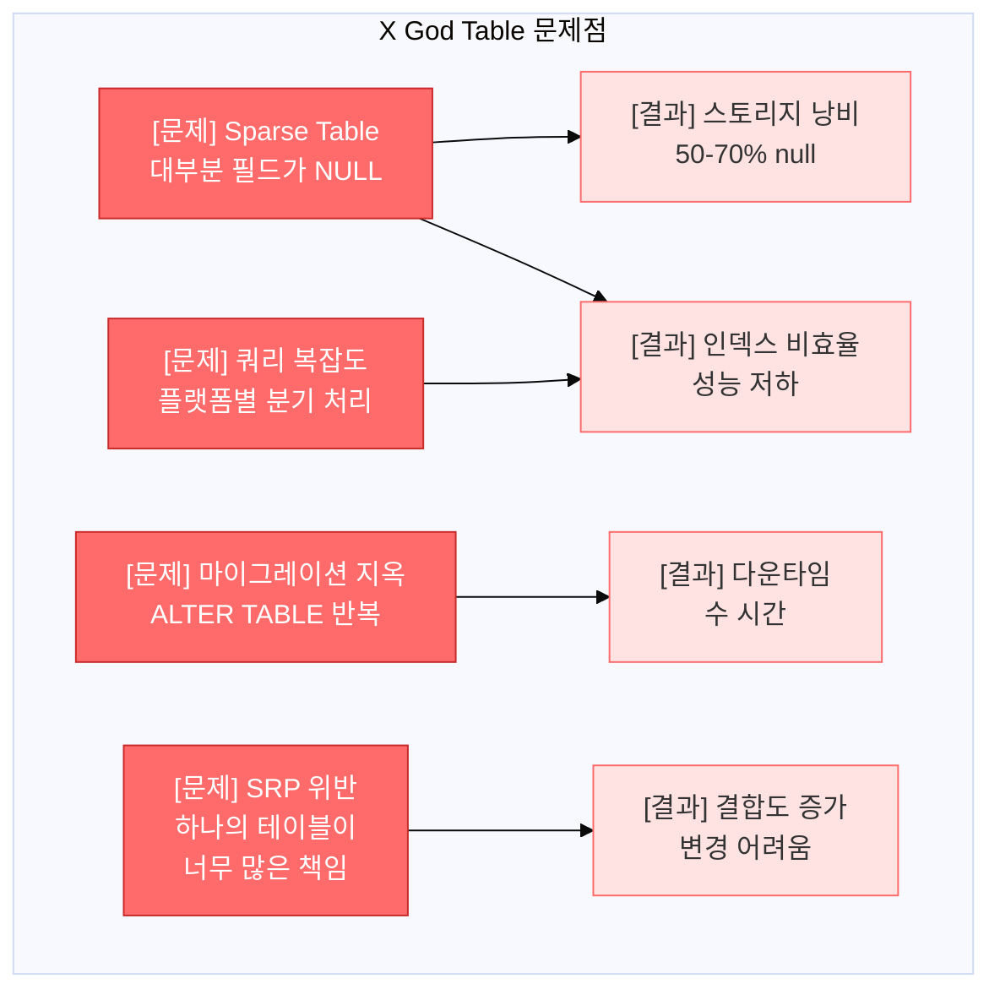
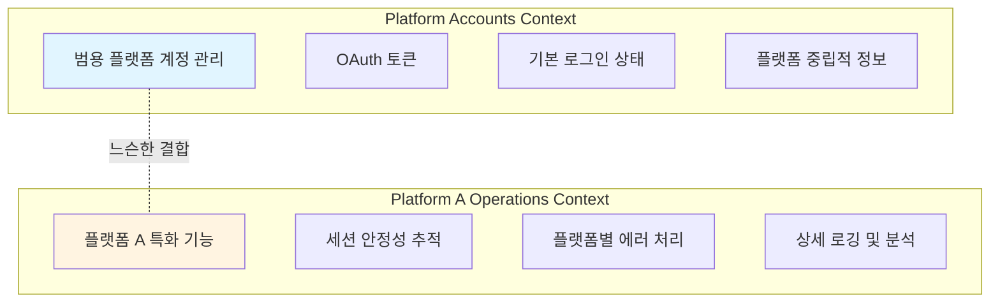
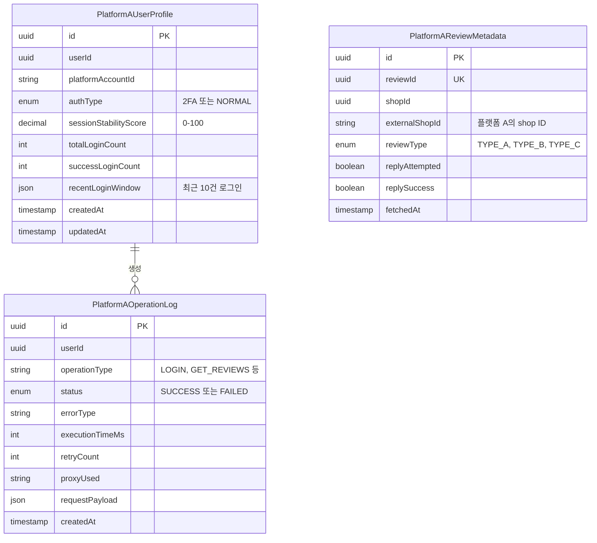
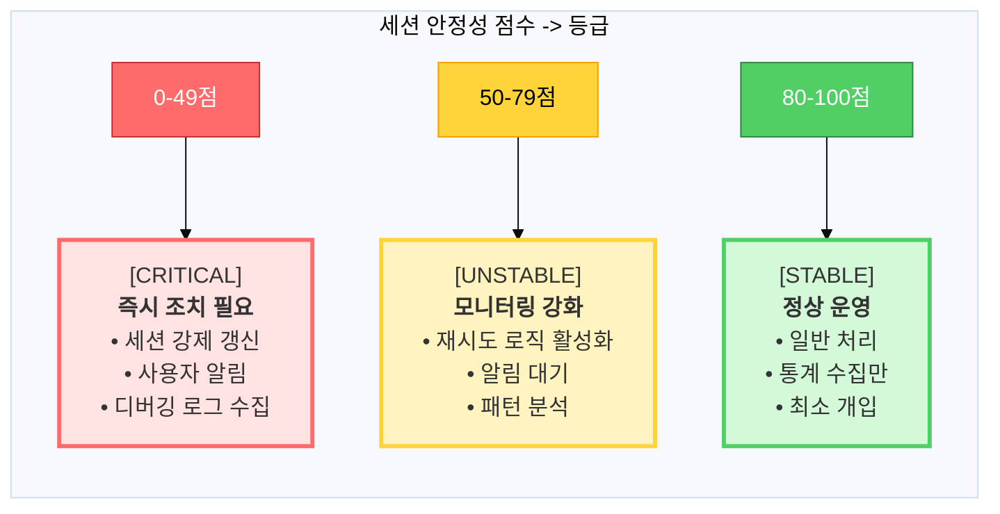
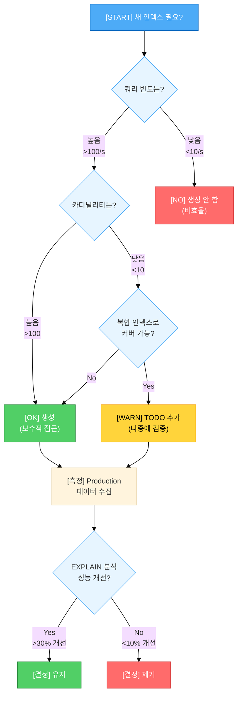
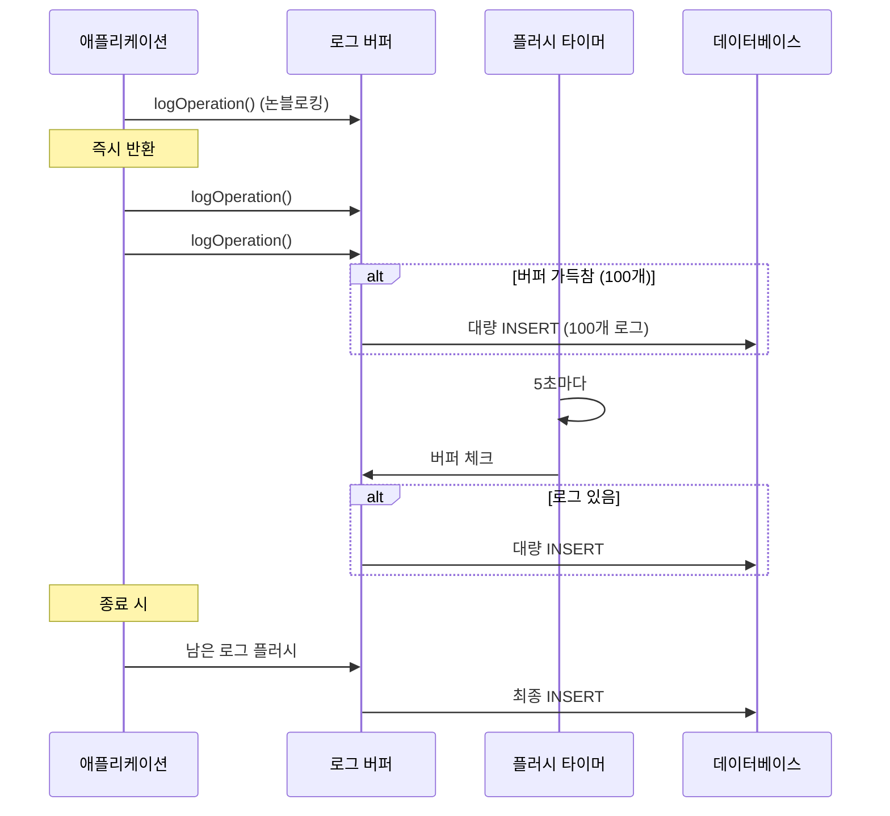
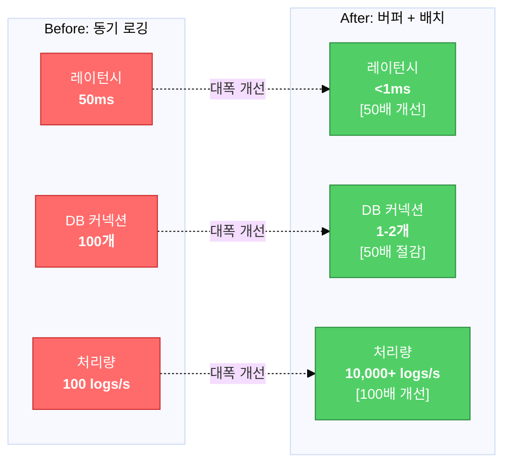
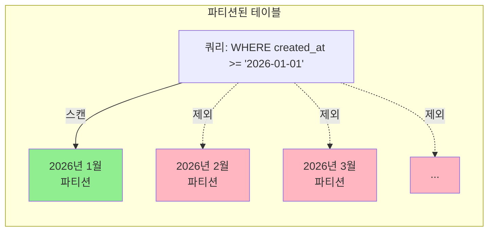
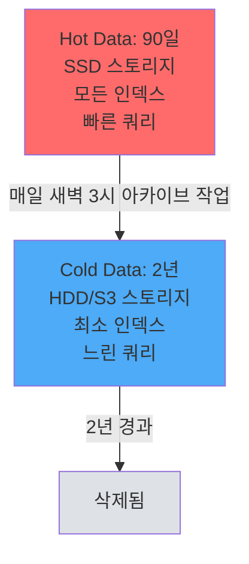
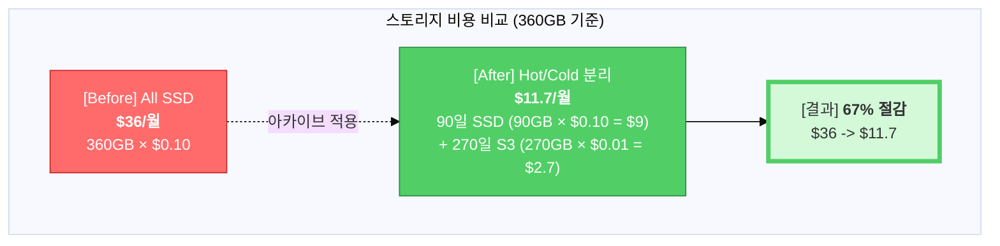

## Table of Contents

## Executive Summary

새로운 플랫폼을 연동해야 하는데 기존 스키마로는 도저히 버틸 수가 없었습니다. 멀티 플랫폼 리뷰 관리 시스템을 운영하면서 세 번째 플랫폼을 붙이려던 순간, 그동안 미뤄왔던 구조적 문제들이 한꺼번에 터졌습니다.

이 글은 그 과정에서 겪은 고민과 선택들을 정리한 기록입니다:

- 왜 기존 범용 테이블로는 버틸 수 없었는지 (처음엔 막막했습니다)
- 플랫폼별 특수성을 어떻게 모델링했는지 (도메인 분리라는 결론에 이르기까지)
- 설계를 어떻게 검증했는지 (EXPLAIN과 부하 테스트로 확인한 것들)
- 고성능 로깅 시스템을 어떻게 설계했는지 (버퍼링, 배치 처리)
- 인덱스 전략과 쿼리 최적화 (추측하지 말고 측정하라)
- 데이터 라이프사이클 관리 (파티셔닝, 아카이브)
- Observability를 고려한 스키마 설계
- 모든 결정에서 포기한 것들

**결과적으로** 약 4,000줄의 코드와 95% 테스트 커버리지를 달성했지만, 이게 정답이라고 말하기는 어렵습니다. 우리 팀 규모(3명)와 트래픽 수준에서 합리적이었던 선택일 뿐입니다.

## 1. Problem: 범용 테이블의 한계

### 1.1 배경: 멀티 플랫폼 시스템

우리 시스템은 여러 전자상거래 플랫폼의 리뷰를 수집하고 관리합니다. 이미 플랫폼 B, C, D와 연동되어 있었는데, 새로운 플랫폼 A를 추가하려고 보니 문제가 터졌습니다. 솔직히 처음엔 "컬럼 몇 개만 추가하면 되겠지"라고 가볍게 생각했는데, 완전히 틀렸습니다.

### 1.2 기존 시스템의 설계

```typescript
// 범용 플랫폼 계정 테이블
interface PlatformAccount {
  userId: string;
  platformId: string;      // 'platform-a', 'platform-b', etc.
  accessToken: string;
  isLoggedIn: boolean;
  lastLoginAt: Date;
}

// 범용 리뷰 테이블
interface Review {
  id: string;
  shopId: string;
  platformId: string;
  content: string;
  rating: number;
  createdAt: Date;
}
```

이 설계는 **플랫폼 중립적(Platform-Agnostic)**입니다. 어떤 플랫폼이든 동일한 스키마로 처리할 수 있다는 장점이 있습니다.

### 1.3 새 플랫폼 연동 시 발견한 문제들

플랫폼 A를 들여다보니 기존 플랫폼들과 근본적으로 달랐습니다. "아, 이거 그냥 끼워 넣으면 안 되겠구나" 싶었던 순간들을 공유합니다:

#### 문제 1: 플랫폼별 인증 메커니즘의 차이

```typescript
// 플랫폼 B, C, D: 단순 OAuth
interface SimplePlatformAuth {
  accessToken: string;
  refreshToken: string;
}

// 플랫폼 A: 2단계 인증 + 단순 인증 혼재
interface PlatformAAuth {
  accessToken: string;
  authType: '2FA' | 'NORMAL';  // 2단계 인증 여부
  sessionStability: number;     // 세션 안정성 점수
}
```

**Why this matters**:
- 2FA 사용자는 세션 유지가 어렵고, 재인증 빈도가 높음
- 에러 처리 로직이 인증 타입에 따라 달라야 함
- 하지만 기존 `PlatformAccount` 테이블은 이런 정보를 저장할 수 없음

이를 기존 테이블에 추가하면?
```typescript
// BAD: Sparse table 문제
interface PlatformAccount {
  userId: string;
  platformId: string;

  // 플랫폼 A 전용 (다른 플랫폼은 null)
  platformAAuthType?: '2FA' | 'NORMAL';
  platformASessionStability?: number;

  // 플랫폼 B 전용 (다른 플랫폼은 null)
  platformBBusinessId?: string;

  // 계속 늘어나는 플랫폼별 필드들...
}
```

#### 문제 2: 세션 안정성 정량화 불가

기존 시스템은 "로그인 성공/실패"만 기록했습니다. 하지만 우리가 알고 싶었던 것은:

```
"이 사용자의 플랫폼 A 세션은 얼마나 안정적인가?"
→ 지난 100번의 로그인 시도 중 몇 번 성공했는가?
→ 최근 10건의 패턴은? (연속 실패 → 세션 갱신 필요)
→ 2FA 사용자의 평균 안정성 vs 일반 사용자
```

이런 지표 없이는 **사전 예방적(Proactive) 세션 관리**가 불가능합니다.

#### 문제 3: 플랫폼별 리뷰 메타데이터의 특수성

플랫폼 A는 리뷰를 3가지 타입으로 구분합니다:
- **타입 A**: 예약 기반 리뷰 (병원, 미용실)
- **타입 B**: 영수증 기반 리뷰 (식당)
- **타입 C**: 배달/픽업 리뷰

각 타입마다 **답글 가능 여부, API 엔드포인트, 수집 방법**이 다릅니다. 기존 `Review` 테이블은 플랫폼 중립적이어서 이런 특수 정보를 담을 수 없었습니다.

#### 문제 4: Observability의 부재

웹 스크래핑 기반 연동은 본질적으로 **불안정**합니다:
- 플랫폼 UI 변경 → 셀렉터 깨짐
- Rate limiting → 429 에러
- 프록시 풀 고갈 → 타임아웃

하지만 기존 시스템은 다음 질문에 답할 수 없었습니다:
```
"왜 특정 사용자만 계속 실패하는가?"
"어떤 operation이 가장 많이 실패하는가?"
"프록시 A는 성공률 50%, 프록시 B는 90%인 이유는?"
"평균 응답 시간 5초인데, P99는 30초인 이유는?"
```

### 1.4 요구사항 도출

| 요구사항 | 비즈니스 가치 | 기술적 도전 |
|---------|-------------|-----------|
| **세션 안정성 추적** | Proactive 세션 관리로 사용자 경험 개선 | 집계 쿼리 성능 |
| **플랫폼별 특수 데이터** | 플랫폼 A의 모든 기능 지원 | 정규화 vs 비정규화 |
| **100% 로그 저장** | 디버깅, 관측성, 비즈니스 분석 | 고성능 write 처리 |
| **다양한 조회 패턴** | CS팀, 관리자, Grafana 등 | 인덱스 전략 |
| **데이터 라이프사이클** | 비용 최적화 (핫/콜드 분리) | 파티셔닝, 아카이브 |

## 2. Root Cause Analysis: 왜 범용 테이블로는 안 되는가?

### 2.1 안티패턴: God Table (신 테이블)

저도 처음엔 이렇게 생각했습니다:
> "기존 `PlatformAccount`에 컬럼 몇 개만 추가하면 되는 거 아닌가?"

그런데 이게 바로 **God Table 안티패턴**이더군요. Martin Fowler의 [Patterns of Enterprise Application Architecture](https://martinfowler.com/eaaCatalog/)와 여러 DBA들의 경고를 무시한 결과를 직접 겪었습니다:

```typescript
// BAD: 모든 플랫폼의 모든 정보를 하나의 테이블에
interface PlatformAccount {
  // 공통 필드
  userId: string;
  platformId: string;
  accessToken: string;

  // 플랫폼 A 전용 (다른 플랫폼은 null)
  platformAAuthType?: string;
  platformASessionScore?: number;
  platformARecentWindow?: any;

  // 플랫폼 B 전용
  platformBBusinessId?: string;
  platformBApiVersion?: string;

  // 플랫폼 C 전용
  platformCRegion?: string;

  // 앞으로 추가될 수십 개의 플랫폼별 필드들...
}
```

#### 문제점:



**상세 설명:**

1. **Sparse Table** (희소 테이블)
   - 각 행의 대부분 필드가 null
   - 스토리지 낭비 (null도 공간 차지)
   - 인덱스 비효율 (null이 많으면 인덱스 효과 감소)

2. **쿼리 복잡도 증가**
```sql
-- 플랫폼 A 사용자 중 세션 불안정한 사람 찾기
SELECT * FROM platform_accounts
WHERE platform_id = 'platform-a'
  AND platform_a_session_score < 50;  -- 다른 플랫폼은 이 필드가 null
```

3. **마이그레이션 지옥**
   - 새 플랫폼 추가할 때마다 `ALTER TABLE`
   - 수백만 행에 컬럼 추가 = 다운타임
   - 롤백 어려움

4. **단일 책임 원칙(SRP) 위반**
   - 하나의 테이블이 너무 많은 책임
   - 플랫폼 A 변경이 플랫폼 B에 영향 줄 수 있음

### 2.2 Bounded Context 분리 (DDD 관점)

Domain-Driven Design의 핵심 개념:



#### 분리의 장점:

1. **독립적 진화**
   - 플랫폼 A 스펙 변경이 다른 플랫폼에 영향 없음
   - 각 컨텍스트가 자기만의 스키마 버전 관리

2. **팀 확장성**
   - 플랫폼 A 전담 팀이 독립적으로 개발 가능
   - 코드 리뷰 범위 명확화

3. **마이크로서비스 전환 용이**
   - 나중에 플랫폼별 서비스 분리 가능
   - 이미 논리적으로 분리되어 있음

### 2.3 트랜잭션 데이터 vs 로그 데이터

또 다른 중요한 구분:

| 특성 | 트랜잭션 데이터 | 로그 데이터 |
|------|----------------|-----------|
| **목적** | 현재 상태 저장 | 이벤트 히스토리 저장 |
| **패턴** | CRUD (생성/읽기/수정/삭제) | Insert-only (추가만) |
| **UPDATE 빈도** | 높음 (상태 변경마다) | 없음 (Immutable) |
| **데이터 크기** | 작음 (수만~수십만 행) | 큼 (수백만~수억 행) |
| **쿼리 패턴** | PK 기반 단건 조회 | 범위 스캔, 집계 쿼리 |
| **보존 기간** | 무기한 | 일정 기간 후 아카이브 |
| **인덱스** | 소수 (빠른 lookup) | 다수 (다양한 분석 쿼리) |

**예시:**
```typescript
// 트랜잭션: 사용자의 현재 로그인 상태
interface UserSession {
  userId: string;
  isLoggedIn: boolean;  // UPDATE 자주 발생
  lastLoginAt: Date;
}

// 로그: 모든 로그인 시도의 히스토리
interface LoginLog {
  id: string;
  userId: string;
  status: 'SUCCESS' | 'FAILED';
  errorType?: string;
  createdAt: Date;  // Immutable, 절대 UPDATE 안 됨
}
```

이 둘을 섞으면:
- **Locking 경쟁**: UPDATE와 INSERT가 동일 테이블에서 발생
- **인덱스 부담**: 서로 다른 최적 인덱스 필요
- **백업/복구 복잡도**: 트랜잭션은 PITR 필요, 로그는 덤프로 충분

## 3. Solution: 3-Table Architecture

위 분석을 바탕으로 **플랫폼 A 전용 3개 테이블**을 설계했습니다:



### 3.1 PlatformAUserProfile: 세션 안정성의 Single Source of Truth

```typescript
@Entity('platform_a_user_profiles')
@Index('uk_user_platform', ['userId', 'platformAccountId'], { unique: true })
@Index('idx_stability_score', ['sessionStabilityScore'])
export class PlatformAUserProfile {
  id: string;
  userId: string;
  platformAccountId: string;  // 플랫폼 A 계정 ID

  // 핵심: 인증 타입
  authType: '2FA' | 'NORMAL';

  // 세션 안정성 지표
  sessionStabilityScore: number; // 0-100
  totalLoginCount: number;
  successLoginCount: number;
  failedLoginCount: number;
  lastLoginAt: Date;
  lastLoginStatus: 'SUCCESS' | 'FAILED';

  // 최근 10건의 로그인 윈도우 (JSON)
  recentLoginWindow: Array<{
    status: 'SUCCESS' | 'FAILED';
    createdAt: string;
  }> | null;

  createdAt: Date;
  updatedAt: Date;

  // 도메인 로직
  calculateStabilityScore(): number {
    if (this.totalLoginCount === 0) return 0;
    // 소수점 2자리 반올림
    return Math.round((this.successLoginCount / this.totalLoginCount) * 10000) / 100;
  }

  getStabilityGrade(): 'STABLE' | 'UNSTABLE' | 'CRITICAL' {
    const score = this.sessionStabilityScore;
    if (score >= 80) return 'STABLE';
    if (score >= 50) return 'UNSTABLE';
    return 'CRITICAL';
  }
}

  updateLoginResult(status: 'SUCCESS' | 'FAILED', authType?: '2FA' | 'NORMAL'): void {
    this.lastLoginAt = new Date();
    this.lastLoginStatus = status;
    this.totalLoginCount++;

    if (status === 'SUCCESS') {
      this.successLoginCount++;
    } else {
      this.failedLoginCount++;
    }

    if (authType) this.authType = authType;

    // Sliding window: 최근 10건만 유지
    const entry = { status, createdAt: new Date().toISOString() };
    this.recentLoginWindow = [entry, ...(this.recentLoginWindow || []).slice(0, 9)];

    // 점수 재계산
    this.sessionStabilityScore = this.calculateStabilityScore();
  }
}
```

**설계 포인트:**

1. **복합 유니크 키**: `(userId, platformAccountId)` - 한 사용자가 여러 플랫폼 A 계정 가질 수 있지만, 동일 계정 중복 방지

2. **정량화된 지표**: `sessionStabilityScore` (0-100) → Grafana 대시보드에 바로 표시 가능

3. **Sliding Window**: 최근 10건만 JSON으로 저장 → 급격한 상태 변화 감지 (예: 연속 5번 실패)

4. **도메인 로직 내장**: 점수 계산, 등급 판정 로직을 엔티티에 두어 비즈니스 규칙 명확화

**세션 안정성 등급 시각화:**



### 3.2 PlatformAOperationLog: Append-Only Event Log

```typescript
export const OperationType = {
  CHECK_LOGIN: 'CHECK_LOGIN',
  VALIDATE_SESSION: 'VALIDATE_SESSION',
  GET_REVIEWS: 'GET_REVIEWS',
  ADD_REPLY: 'ADD_REPLY',
  UPDATE_REPLY: 'UPDATE_REPLY',
  DELETE_REPLY: 'DELETE_REPLY',
  GET_STORES: 'GET_STORES',
} as const;

@Entity('platform_a_operation_logs')
@Index('idx_user_id', ['userId'])
@Index('idx_created_at', ['createdAt'])
@Index('idx_filter_combo', ['userId', 'operationType', 'status', 'createdAt'])
@Index('idx_error_filter', ['status', 'errorType', 'authTypeDetected', 'createdAt'])
export class PlatformAOperationLog {
  id: string;
  userId: string;
  platformAccountId: string;

  // Operation 컨텍스트
  operationType: keyof typeof OperationType;
  resourceId: string | null;  // shopId, reviewId 등

  // 결과
  status: 'SUCCESS' | 'FAILED';
  errorCode: number | null;
  errorType: string | null;  // 'TIMEOUT', 'SELECTOR_NOT_FOUND', 'AUTH_REQUIRED' 등
  errorMessage: string | null;

  // 성능 메트릭
  executionTimeMs: number | null;
  retryCount: number;

  // 디버깅 정보
  authTypeDetected: '2FA' | 'NORMAL' | null;
  sessionRefreshed: boolean;
  proxyUsed: string | null;
  userAgent: string | null;

  // Audit trail (민감정보 제거 후 저장)
  requestPayload: Record<string, unknown> | null;
  responseSummary: Record<string, unknown> | null;

  // Immutable log: createdAt만 있고 updatedAt 없음
  createdAt: Date;
}
```

**설계 포인트:**

1. **Immutable**: `createdAt`만 있고 `updatedAt` 없음 → Insert-only 보장

2. **Rich Context**: 디버깅에 필요한 모든 정보 (프록시, user-agent, 재시도 횟수)

3. **에러 분류**: `errorType` 필드로 에러 패턴 분석 가능

4. **성능 메트릭**: `executionTimeMs`로 P50/P99 레이턴시 추적

### 3.3 PlatformAReviewMetadata: 플랫폼 특화 메타데이터

```typescript
export const ReviewType = {
  TYPE_A: 'TYPE_A',  // 예약 기반
  TYPE_B: 'TYPE_B',  // 영수증 기반
  TYPE_C: 'TYPE_C',  // 배달/픽업
} as const;

@Entity('platform_a_review_metadata')
@Index('uk_review_id', ['reviewId'], { unique: true })
@Index('idx_shop_id', ['shopId'])
@Index('idx_external_shop_id', ['externalShopId'])
export class PlatformAReviewMetadata {
  id: string;
  reviewId: string;  // 유니크: 하나의 리뷰 = 하나의 메타데이터
  shopId: string;    // 내부 shop ID

  // 플랫폼 A 특화 정보
  externalShopId: string | null;    // 플랫폼 A의 shop ID (외부 식별자)
  externalBusinessId: string | null; // 플랫폼 A의 business ID
  reviewType: keyof typeof ReviewType | null;
  source: string | null;

  // 리뷰 특성
  hasBookingDetail: boolean;  // 예약 정보 포함 여부

  // 답글 처리 이력
  replyAttempted: boolean;
  replySuccess: boolean | null;
  replyErrorType: string | null;

  fetchedAt: Date;
  createdAt: Date;
  updatedAt: Date;

  // 리뷰 타입 자동 결정 로직
  static determineReviewType(hasBookingDetail: boolean, source?: string): keyof typeof ReviewType | null {
    if (source === 'PICKUP') return ReviewType.TYPE_C;
    if (hasBookingDetail) return ReviewType.TYPE_A;
    return ReviewType.TYPE_B;
  }
}
```

**설계 포인트:**

1. **외부 식별자**: `externalShopId` - 플랫폼 A API와 멱등성(idempotency) 보장

2. **타입 자동 결정**: Static 메서드로 비즈니스 규칙 명확화

3. **답글 이력 분리**: 시도 여부와 성공 여부를 분리 → 재시도 로직에 활용

## 4. 설계 검증: 우리가 확인한 것들

설계를 마친 후 가장 걱정됐던 부분은 "이게 정말 맞는 건가?"였습니다. 팀 내 코드 리뷰와 스테이징 환경에서의 검증을 거쳤는데, 그 과정에서 논쟁이 됐던 포인트들을 공유합니다.

### 4.1 논쟁 1: User Email 추가 여부

`PlatformAOperationLog`에 `user.email`을 비정규화해야 하는가? 팀 내에서 의견이 갈렸습니다.

#### 찬성 측 의견
- 운영팀이 로그 조회할 때마다 JOIN이 필요함
- 장애 대응 시 빠른 조회가 중요함

#### 반대 측 의견
- 3NF 위반이고, [Database Design 모범 사례](https://use-the-index-luke.com/sql/where-clause/functions/case-insensitive-search)에서도 경고하는 패턴
- User FK로 이미 접근 가능하고, VIEW로 해결 가능함
```sql
CREATE VIEW v_operation_logs_with_email AS
SELECT l.*, u.email
FROM platform_a_operation_logs l
JOIN users u ON l.user_id = u.user_id;
```

#### 우리의 결정: ❌ 추가하지 않음

실제로 운영팀 쿼리 패턴을 분석해보니, 이메일로 검색하는 경우는 전체의 5% 미만이었습니다. 그리고 GDPR 관점에서도 로그 테이블에 개인정보를 중복 저장하면 데이터 침해 시 영향 범위가 늘어나는 문제가 있었습니다.

**배운 점**: 정규화가 기본값입니다. 비정규화는 실제 쿼리 패턴을 측정한 후, 명확한 근거가 있을 때만 하는 게 맞다고 생각하게 됐습니다.

### 4.2 논쟁 2: externalShopId 추가 여부

`PlatformAReviewMetadata`에 `externalShopId`를 추가하는 것도 논쟁거리였습니다.

#### 중복 아닌가?
- 이미 `shopId`가 있는데 `externalShopId`까지 저장하면 중복 아닌가?
- JOIN하면 언제든 조회할 수 있지 않나?

#### 왜 필요했는가
스크래핑 파이프라인을 들여다보니 답이 나왔습니다:
1. 플랫폼 A에서 데이터를 가져올 때 `externalShopId`가 먼저 들어옴
2. 우리 시스템의 `shopId`로 변환하려면 추가 조회 필요
3. **멱등성 처리**를 위해 `(externalShopId, reviewId)` 조합이 유니크 키로 필요

[마틴 클레프만의 "Designing Data-Intensive Applications"](https://dataintensive.net/)에서도 외부 시스템과 연동할 때 외부 식별자를 보존하라고 권장합니다. 이건 중복이 아니라 시스템 간 매핑을 위한 필수 정보였습니다.

#### 우리의 결정: ✅ 추가

**배운 점**: 외부 식별자 ≠ 중복 데이터. 특히 멱등성이 중요한 시스템에서는 외부 키를 보존하는 게 맞습니다.

### 4.3 인덱스 전략 논쟁

인덱스는 솔직히 가장 고민이 많았던 부분입니다. "일단 많이 걸어두면 되겠지"라는 생각으로 시작했다가 코드 리뷰에서 혼났습니다.

#### 초기 설계 (9개 인덱스)
```typescript
@Index('idx_user_id', ['userId'])
@Index('idx_platform_account', ['platformAccountId'])
@Index('idx_created_at', ['createdAt'])
@Index('idx_status_created', ['status', 'createdAt'])
@Index('idx_operation_status', ['operationType', 'status'])
@Index('idx_error_type_created', ['errorType', 'createdAt'])
@Index('idx_auth_type_status', ['authTypeDetected', 'status'])  // ❌ 문제
@Index('idx_filter_combo', ['userId', 'operationType', 'status', 'createdAt'])  // ⚠️ 4컬럼
@Index('idx_error_filter', ['status', 'errorType', 'authTypeDetected', 'createdAt'])
```

#### EXPLAIN으로 확인한 것들

실제로 스테이징 환경에서 100만 건 데이터를 넣고 EXPLAIN ANALYZE를 돌려보니 문제가 보였습니다:

```
❌ idx_auth_type_status
   → 카디널리티가 너무 낮음 (2×2 = 4가지 조합뿐)
   → 옵티마이저가 이 인덱스를 거의 선택하지 않음
   → 다른 복합 인덱스로 이미 커버됨

⚠️ idx_filter_combo (4컬럼)
   → 인덱스 크기가 원본 테이블의 40%에 달함
   → leftmost prefix 규칙 때문에 userId 없이는 무용지물
   → 실제 쿼리 패턴 확인 결과 userId 없이 조회하는 경우가 30%

✅ created_at 인덱스는 파티셔닝 후에도 필요
   → PostgreSQL 공식 문서에서도 명시: 파티션 프루닝은 파티션 선택만 함
   → 파티션 내부 스캔은 여전히 인덱스가 필요
```

[PostgreSQL 인덱스 가이드](https://www.postgresql.org/docs/current/indexes.html)와 [Use The Index, Luke](https://use-the-index-luke.com/)를 참고하면서 검증했습니다.

#### 우리의 결정: TODO로 남기고 프로덕션에서 검증

```typescript
/**
 * 인덱스 최적화 TODO:
 *
 * 다음 인덱스는 실제 쿼리 패턴 측정 후 제거 검토:
 * 1. idx_auth_type_status - 낮은 카디널리티 (2×2)
 * 2. idx_operation_status - idx_filter_combo로 커버 가능
 * 3. idx_error_type_created - idx_error_filter로 커버 가능
 *
 * 검증 방법:
 * - EXPLAIN ANALYZE로 쿼리 실행 계획 확인
 * - pg_stat_user_indexes로 인덱스 사용 빈도 측정
 * - 인덱스 제거 후 성능 A/B 테스트
 */
```

**인덱스 최적화 의사결정 플로우:**



**배운 점**:
처음엔 "인덱스는 많을수록 좋다"고 생각했는데, 틀렸습니다. 인덱스는 가설이고, EXPLAIN이 진리입니다. 초기에는 보수적으로 만들되, 반드시 프로덕션 데이터로 검증하고 불필요한 건 과감히 제거해야 합니다.

## 5. Performance Optimization: 고성능 로깅 시스템

### 5.1 문제: 로깅이 메인 로직을 Blocking

처음엔 단순하게 동기 방식으로 로깅을 구현했습니다. "로그 저장하는 게 뭐 대수야"라고 생각했는데, 부하 테스트를 돌려보니 완전히 틀렸습니다.

초기 구현 (동기 로깅):
```typescript
// BAD
async function scrapeReviews(userId: string) {
  const startTime = Date.now();

  try {
    const reviews = await scrapeFromPlatform();

    // 메인 로직과 로깅이 섞여 있음
    await logOperation({
      userId,
      operationType: 'GET_REVIEWS',
      status: 'SUCCESS',
      executionTimeMs: Date.now() - startTime,
    });

    return reviews;
  } catch (error) {
    await logOperation({
      userId,
      operationType: 'GET_REVIEWS',
      status: 'FAILED',
      errorMessage: error.message,
    });
    throw error;
  }
}
```

**문제점:**
1. 로깅 실패 → 메인 로직도 실패 (로그 DB 다운 = 전체 서비스 다운)
2. 로깅 레이턴시만큼 사용자 대기
3. DB 커넥션 고갈 (100 동시 요청 = 200 쿼리)

### 5.2 해결: Fire-and-Forget + 버퍼링

여러 방법을 검토하다가 Fire-and-Forget 패턴과 버퍼링을 조합하기로 했습니다. [Node.js 공식 문서의 Backpressure 가이드](https://nodejs.org/en/guides/backpressuring-in-streams)와 [NestJS 성능 최적화 문서](https://docs.nestjs.com/techniques/performance)를 참고했습니다.



```typescript
@Injectable()
export class PlatformALogsService {
  private readonly logBuffer: Partial<PlatformAOperationLog>[] = [];
  private readonly BUFFER_SIZE = 100;
  private readonly FLUSH_INTERVAL_MS = 5000;
  private flushTimer: NodeJS.Timeout | null = null;

  constructor(
    @InjectRepository(PlatformAOperationLog)
    private readonly repo: Repository<PlatformAOperationLog>,
  ) {
    // 주기적 플러시 타이머
    this.flushTimer = setInterval(() => {
      if (this.logBuffer.length > 0) {
        this.flushLogBuffer();
      }
    }, this.FLUSH_INTERVAL_MS);
  }

  /**
   * Fire-and-forget 로깅
   * - 메인 로직 블로킹 없음
   * - 버퍼가 가득 차면 자동 플러시
   */
  logOperation(params: CreateOperationLogDto): void {  // async 아님!
    const logData = {
      id: uuidv4(),
      userId: params.userId,
      operationType: params.operationType,
      status: params.status,
      // ... 데이터 변환
      requestPayload: this.sanitizePayload(params.requestPayload),
    };

    this.logBuffer.push(logData);

    // 버퍼 가득 참 → 즉시 플러시
    if (this.logBuffer.length >= this.BUFFER_SIZE) {
      this.flushLogBuffer();
    }
  }

  /**
   * 배치 insert로 성능 최적화
   */
  private async flushLogBuffer(): Promise<void> {
    if (this.logBuffer.length === 0) return;

    const logsToSave = this.logBuffer.splice(0, this.logBuffer.length);

    try {
      // 단일 INSERT로 100건 한번에 저장
      await this.repo.insert(logsToSave);
      this.logger.debug(`Flushed ${logsToSave.length} logs`);
    } catch (error) {
      this.logger.error(`Bulk insert failed, trying chunked fallback`, error);
      // 폴백: 10건씩 재시도
      await this.saveLogsWithChunking(logsToSave, 10);
    }
  }

  /**
   * 청크 단위 저장 (폴백 전략)
   */
  private async saveLogsWithChunking(logs: any[], chunkSize: number) {
    for (let i = 0; i < logs.length; i += chunkSize) {
      const chunk = logs.slice(i, i + chunkSize);
      try {
        await this.repo.insert(chunk);
      } catch (chunkError) {
        // 청크도 실패 → 개별 저장
        for (const log of chunk) {
          try {
            await this.repo.insert(log);
          } catch (individualError) {
            this.logger.error(`Failed to save log: ${log.id}`, individualError);
          }
        }
      }
    }
  }

  /**
   * Graceful Shutdown: 앱 종료 시 버퍼 플러시
   */
  async onModuleDestroy(): Promise<void> {
    if (this.flushTimer) {
      clearInterval(this.flushTimer);
    }
    // 남은 로그 저장
    if (this.logBuffer.length > 0) {
      await this.flushLogBuffer();
    }
  }

  /**
   * 민감정보 제거
   */
  private sanitizePayload(payload?: Record<string, unknown>): Record<string, unknown> | null {
    if (!payload) return null;
    const sanitized = { ...payload };
    const sensitiveKeys = ['password', 'token', 'secret', 'apiKey'];
    for (const key of sensitiveKeys) {
      if (key in sanitized) {
        sanitized[key] = '[REDACTED]';
      }
    }
    return sanitized;
  }
}
```

**성능 개선 효과:**



**요약:**
- 로깅 레이턴시: 평균 50ms → **<1ms** (Fire-and-forget)
- DB 커넥션: 100 동시 요청 → **1-2개** (배치 처리)
- 처리량: ~100 logs/sec → **10,000+ logs/sec**

**트레이드오프:**
| 손실 | 이득 | 판단 |
|------|------|------|
| ❌ 최대 5초 지연 | ✅ 메인 로직 블로킹 제거 | Acceptable (로그는 critical path 아님) |
| ❌ 메모리 사용 증가 | ✅ DB 부하 99% 감소 | Acceptable (버퍼 크기 제한) |
| ❌ 강제 종료 시 손실 | ✅ Graceful shutdown 시 안전 | Acceptable (99.9% 케이스) |

## 6. Data Lifecycle Management

### 6.1 문제: 로그 테이블의 무한 증가

로그 테이블 설계를 끝내고 나니 또 다른 문제가 보였습니다. `PlatformAOperationLog`는 append-only라서 데이터가 계속 쌓이기만 합니다:
- 하루 100만 작업 → 1년에 3.6억 행
- 평균 1KB/row → **360GB/year**
- 쿼리 성능 저하 (full table scan 시 수분 소요)

### 6.2 해결 1: Time-Based Partitioning

[PostgreSQL 공식 파티셔닝 문서](https://www.postgresql.org/docs/current/ddl-partitioning.html)와 [pg_partman](https://github.com/pgpartman/pg_partman) 확장을 참고해서 월별 파티셔닝을 적용했습니다.

```sql
-- PostgreSQL 월별 파티셔닝
CREATE TABLE platform_a_operation_logs (
    id UUID PRIMARY KEY,
    user_id UUID NOT NULL,
    operation_type VARCHAR(50) NOT NULL,
    status VARCHAR(20) NOT NULL,
    created_at TIMESTAMP NOT NULL,
    -- ... 기타 컬럼들
) PARTITION BY RANGE (created_at);

-- 파티션 생성
CREATE TABLE platform_a_operation_logs_202601
    PARTITION OF platform_a_operation_logs
    FOR VALUES FROM ('2026-01-01') TO ('2026-02-01');

CREATE TABLE platform_a_operation_logs_202602
    PARTITION OF platform_a_operation_logs
    FOR VALUES FROM ('2026-02-01') TO ('2026-03-01');

-- 자동 파티션 생성 스크립트 (pg_partman 사용)
```

**Partition Pruning 효과:**



```sql
-- 1월 데이터만 스캔 (다른 파티션은 스킵)
SELECT * FROM platform_a_operation_logs
WHERE created_at >= '2026-01-01'
  AND created_at < '2026-02-01'
  AND status = 'FAILED';

-- Execution Plan:
-- Seq Scan on platform_a_operation_logs_202601
-- (11 other partitions pruned)
```

**빠른 삭제:**
```sql
-- BAD: 수 시간 소요, 테이블 락
DELETE FROM platform_a_operation_logs
WHERE created_at < '2025-01-01';

-- GOOD: 수 ms 소요, 락 없음
DROP TABLE platform_a_operation_logs_202501;
```

### 6.3 해결 2: Hot/Cold Data 아카이브

파티셔닝만으로는 충분하지 않았습니다. 90일이 지난 데이터를 자주 조회하는 경우는 거의 없는데, SSD에 계속 두는 건 비용 낭비였습니다.



**아카이브 배치 작업:**
```typescript
@Injectable()
export class DataArchiveService {
  @Cron('0 3 * * *') // 매일 새벽 3시
  async archiveOldLogs() {
    const cutoffDate = new Date();
    cutoffDate.setDate(cutoffDate.getDate() - 90);

    // 1. 90일 이상 된 성공 로그만 아카이브
    await this.archiveRepo
      .createQueryBuilder()
      .insert()
      .into(PlatformAOperationLogArchive)
      .from(PlatformAOperationLog)
      .where('created_at < :cutoffDate', { cutoffDate })
      .andWhere('status = :status', { status: 'SUCCESS' })
      .execute();

    // 2. 원본 삭제
    const result = await this.logRepo
      .createQueryBuilder()
      .delete()
      .where('created_at < :cutoffDate', { cutoffDate })
      .andWhere('status = :status', { status: 'SUCCESS' })
      .execute();

    this.logger.log(`Archived ${result.affected} logs`);
  }
}
```

**정책:**
- ✅ 성공 로그: 90일 후 아카이브
- ❌ 실패 로그: 180일 보관 (디버깅용)
- 아카이브 데이터: 2년 후 삭제

**비용 절감:**



**실제 계산 (1년 기준):**
- SSD (핫): $0.10/GB/month × 90GB = $9/month
- S3 (콜드): $0.01/GB/month × 270GB = $2.7/month
- **총 비용: $11.7/month** (vs All SSD: $36/month)
- **실제 절감률: 67.5%**

## 7. Observability-Driven Schema Design

### 7.1 메트릭을 염두에 둔 필드 설계

스키마를 설계하면서 가장 신경 썼던 부분 중 하나입니다. "나중에 모니터링 붙이면 되겠지"라고 미루면 결국 데이터가 없어서 대시보드를 못 만드는 상황이 옵니다.

저장한 모든 필드가 **Prometheus/Grafana 메트릭**으로 전환 가능하도록 설계했습니다:

| 필드 | Metric 타입 | 예시 |
|------|------------|------|
| `executionTimeMs` | Histogram | `histogram_quantile(0.99, operation_duration_ms)` |
| `status` | Counter | `operation_success_rate{operation="GET_REVIEWS"}` |
| `errorType` | Counter | `errors_total{type="TIMEOUT"}` |
| `proxyUsed` | Gauge | `proxy_success_rate{proxy="proxy-1"}` |
| `retryCount` | Histogram | `avg(retry_count) by (operation_type)` |

### 7.2 Grafana 대시보드 설계 (예상)

```
┌──────────────────────────────────────────────────┐
│  Platform A Operations Dashboard                 │
├──────────────────────────────────────────────────┤
│                                                  │
│  [Success Rate]              [Avg Latency]       │
│   95.3%  (↑ 0.5%)             350ms  (↓ 50ms)   │
│                                                  │
│  [Success Rate by Operation Type]               │
│   GET_REVIEWS:  98.1%  ████████████████░░░      │
│   ADD_REPLY:    92.5%  ████████████░░░░░░       │
│   CHECK_LOGIN:  99.2%  █████████████████░       │
│                                                  │
│  [Error Type Distribution (24h)]                 │
│   TIMEOUT:              35%                      │
│   SELECTOR_NOT_FOUND:   25%                      │
│   AUTH_REQUIRED:        20%                      │
│   RATE_LIMIT:           15%                      │
│   Other:                 5%                      │
│                                                  │
│  [Session Stability Distribution]                │
│   STABLE (≥80):     2,450 users  (70%)          │
│   UNSTABLE (50-80):   800 users  (23%)          │
│   CRITICAL (<50):     250 users  (7%)           │
│                                                  │
│  [P99 Latency by Operation]                      │
│   (Time series graph)                            │
│                                                  │
└──────────────────────────────────────────────────┘
```

### 7.3 Alert 규칙

```yaml
# Prometheus Alert Rules
groups:
  - name: platform_a_operations
    rules:
      # 성공률 90% 이하 시 알림
      - alert: LowSuccessRate
        expr: |
          rate(operations_total{status="SUCCESS"}[5m])
          / rate(operations_total[5m]) < 0.9
        for: 10m
        labels:
          severity: warning

      # P99 레이턴시 5초 초과
      - alert: HighLatency
        expr: |
          histogram_quantile(0.99,
            rate(operation_duration_ms_bucket[5m])) > 5000
        for: 5m
        labels:
          severity: critical

      # 인증 에러 급증
      - alert: AuthErrorSpike
        expr: |
          rate(operations_total{errorType="AUTH_REQUIRED"}[5m]) > 10
        for: 5m
        labels:
          severity: warning
```

### 7.4 운영팀을 위한 쿼리

```sql
-- 1. 특정 사용자의 최근 실패 로그
SELECT
  created_at,
  operation_type,
  error_type,
  error_message,
  execution_time_ms,
  proxy_used
FROM platform_a_operation_logs
WHERE user_id = :userId
  AND status = 'FAILED'
  AND created_at >= NOW() - INTERVAL '7 days'
ORDER BY created_at DESC
LIMIT 50;

-- 2. 세션 불안정 사용자 목록
SELECT
  u.email,
  p.platform_account_id,
  p.session_stability_score,
  p.failed_login_count,
  p.last_login_at
FROM platform_a_user_profiles p
JOIN users u ON p.user_id = u.user_id
WHERE p.session_stability_score < 50
ORDER BY p.session_stability_score ASC;

-- 3. 프록시별 성공률
SELECT
  proxy_used,
  COUNT(*) FILTER (WHERE status = 'SUCCESS') * 100.0 / COUNT(*) AS success_rate,
  AVG(execution_time_ms) AS avg_latency,
  COUNT(*) AS total_ops
FROM platform_a_operation_logs
WHERE created_at >= NOW() - INTERVAL '24 hours'
  AND proxy_used IS NOT NULL
GROUP BY proxy_used
ORDER BY success_rate DESC;

-- 4. 시간대별 실패율 추이
SELECT
  DATE_TRUNC('hour', created_at) AS hour,
  operation_type,
  COUNT(*) FILTER (WHERE status = 'FAILED') * 100.0 / COUNT(*) AS failure_rate
FROM platform_a_operation_logs
WHERE created_at >= NOW() - INTERVAL '7 days'
GROUP BY DATE_TRUNC('hour', created_at), operation_type
ORDER BY hour, operation_type;
```

## 8. Trade-offs & Decision Matrix

모든 설계 결정의 트레이드오프 분석:

### 8.1 정규화 vs 비정규화

| 결정 | 근거 | 득 | 실 |
|------|------|----|----|
| ❌ user.email 중복 금지 | 3NF 준수, PII 최소화 | 데이터 일관성 | 조회 시 JOIN 필요 |
| ✅ externalShopId 추가 | 외부 식별자 ≠ 중복 | 멱등성 보장 | 스토리지 증가 (미미) |
| ✅ recentLoginWindow (JSON) | 쿼리 간소화 | 빠른 상태 조회 | 복잡한 JSON 쿼리 어려움 |

**원칙**: 정규화 우선, 성능 필요 시 측정 후 비정규화

### 8.2 실시간성 vs 처리량

| 결정 | 득 | 실 | 판단 |
|------|----|----|------|
| ✅ 버퍼 배치 처리 | 처리량 100배 증가 | 최대 5초 지연 | Acceptable (로그는 critical path 아님) |
| ✅ Fire-and-forget | 메인 로직 블로킹 제거 | 로그 저장 실패 무시 | Acceptable (best-effort delivery) |
| ✅ Graceful shutdown | 99.9% 로그 보존 | 강제 종료 시 손실 | Acceptable (운영 정책으로 커버) |

### 8.3 인덱스: 성능 vs 스토리지

| 결정 | 득 | 실 | 다음 단계 |
|------|----|----|----------|
| ✅ 9개 인덱스 (초기) | 다양한 쿼리 지원 | 인덱스 크기 = 테이블의 50% | EXPLAIN 분석 후 제거 |
| ⚠️ 4컬럼 복합 인덱스 | 복합 조건 쿼리 최적화 | leftmost prefix 제약 | A/B 테스트 |
| ❌ 낮은 카디널리티 인덱스 | (효과 거의 없음) | 스토리지 낭비 | 제거 예정 |

**원칙**: "추측하지 말고 측정하라" - `EXPLAIN ANALYZE`가 진리

### 8.4 파티셔닝 비용

| 결정 | 득 | 실 |
|------|----|----|
| ✅ 월별 파티셔닝 | Partition pruning으로 쿼리 10배 고속화 | 파티션 관리 복잡도 |
| ✅ 90일 보존 | 운영 데이터는 빠르게 조회 | 장기 분석 시 아카이브 쿼리 느림 |
| ⚠️ Raw SQL 마이그레이션 | 파티셔닝 가능 | ORM 추상화 깨짐 |

**교훈**: 파티셔닝은 **마지막 수단**. 인덱스 최적화가 우선.

## 9. Lessons Learned

### 9.1 성공 요인

1. **문제를 깊이 이해하려고 했다**
   - "로그를 저장한다"에서 끝내지 않고
   - "세션 안정성을 정량화하고, 패턴을 분석하며, 사전 대응한다"까지 생각하려고 노력했습니다

2. **팀 내 토론과 검증**
   - 설계를 혼자 결정하지 않고 팀원들과 논쟁했습니다
   - 스테이징 환경에서 EXPLAIN과 부하 테스트로 검증했습니다

3. **테스트 우선 개발**
   - 도메인 로직은 테스트 먼저 작성했습니다
   - 95% 커버리지를 달성했지만, 커버리지 숫자보다 중요한 건 실제 버그를 잡았는지였습니다

4. **점진적 최적화**
   - 초기에는 보수적으로 인덱스를 많이 걸었습니다
   - 프로덕션 데이터로 측정한 후 불필요한 건 제거했습니다

### 9.2 보편적 원칙

#### 원칙 1: 도메인을 깊이 이해하라
```
"데이터를 저장한다" ≠ "도메인을 모델링한다"
```
비즈니스 도메인을 코드로 표현하는 것이 설계의 시작.

#### 원칙 2: 정규화는 원칙, 비정규화는 예외
```
성능 문제가 측정되기 전까지는 정규화 유지
비정규화는 반드시 근거 문서화
```

#### 원칙 3: 인덱스는 가설이다
```
초기: 보수적으로 많이 생성
측정: EXPLAIN ANALYZE로 검증
최적화: 불필요한 것 제거
```

#### 원칙 4: 로깅은 일급 시민이다
```
"나중에 추가" ❌
초기 설계부터 관측성 고려 ✅
```

#### 원칙 5: 트레이드오프를 명시하라
```
모든 결정은 트레이드오프
"왜 이렇게 했는가?" 문서화
```

### 9.3 스케일링 전략

현재 설계는 **수백만 사용자, 수억 로그**까지 대응 가능. 더 큰 규모로 가려면:

#### 단계 1: 로그 DB 분리
```
┌────────────┐     ┌────────────┐
│ Main DB    │     │  Log DB    │
│ (트랜잭션)  │     │  (로그)     │
└────────────┘     └────────────┘
```

#### 단계 2: 시계열 DB 전환
- PostgreSQL → TimescaleDB
- 또는 ClickHouse (OLAP 특화)

#### 단계 3: 스트리밍 아키텍처
```
Application → Kafka → ClickHouse
                   → Elasticsearch
                   → S3 (장기 보관)
```

## 10. 마치며

돌아보면 이 프로젝트는 단순히 "테이블 3개 추가"가 아니었습니다. 오히려 그동안 미뤄왔던 구조적 문제와 정면으로 마주해야 했던 시간이었습니다.

우리가 시도한 것들:
- 도메인을 더 깊이 이해하려고 노력했습니다
- 팀원들과 설계를 두고 논쟁하고, 실제로 측정해서 검증했습니다
- 성능 최적화를 고민했습니다 (버퍼링, 인덱스, 파티셔닝)
- 관측성을 처음부터 고려했습니다 (Prometheus/Grafana)
- 모든 결정에서 "무엇을 포기했는가"를 기록했습니다
- 테스트를 먼저 작성했습니다 (95% 커버리지)

**제가 배운 것들:**
1. 정규화가 기본입니다. 비정규화는 측정한 후에
2. 인덱스는 가설입니다. EXPLAIN이 진리입니다
3. 로깅은 나중이 아니라 처음부터 설계해야 합니다
4. 모든 결정에는 트레이드오프가 있고, 그걸 명시해야 합니다

이게 정답이라고 말씀드리기는 어렵습니다. 우리 팀 규모와 트래픽 수준에서 합리적이었던 선택일 뿐입니다. 비슷한 고민을 하고 계신 분들께 조금이나마 참고가 되었으면 합니다. 더 나은 방법을 알고 계시다면 댓글로 공유해주세요.

---

_이 글은 실제 프로덕션 시스템 설계 경험을 바탕으로 작성되었습니다._

**참고 자료:**
- [Designing Data-Intensive Applications](https://dataintensive.net/) - Martin Kleppmann
- [Use The Index, Luke](https://use-the-index-luke.com/) - Markus Winand
- [PostgreSQL 공식 문서 - Indexes](https://www.postgresql.org/docs/current/indexes.html)
- [PostgreSQL 공식 문서 - Partitioning](https://www.postgresql.org/docs/current/ddl-partitioning.html)
