## 목차

## 들어가며: 데이터가 쌓일수록 느려지는 INSERT

리뷰 수집 서비스를 운영하면서, 데이터가 쌓일수록 INSERT 성능이 **점진적으로 저하**되는 현상을 겪었습니다.

```log
[WARN] Slow Query: 150ms+
INSERT INTO reviews (id, shop_id, content, ...) VALUES (?, ?, ?, ...)
```

초기에는 문제가 없었지만, **인덱스 크기가 Buffer Pool을 초과**하는 시점부터 성능 저하가 가속화되었습니다.

| 데이터 크기 | INSERT TPS | P95 응답 시간 | Buffer Pool 상태 |
|------------|-----------|--------------|------------------|
| 100만 건 | 5,000+ | < 1ms | 인덱스 < BP |
| 500만 건 | 1,500 | 5ms | 인덱스 ≈ BP |
| 1,000만 건 | 400-800 | 20-50ms | **인덱스 > BP** |

테이블 구조는 평범했습니다:

```sql
CREATE TABLE reviews (
  id VARCHAR(36) PRIMARY KEY,  -- UUID v4
  shop_id VARCHAR(36),
  content TEXT,
  rating TINYINT,
  created_at DATETIME,
  INDEX idx_shop_created (shop_id, created_at)
);
```

범인은 **UUID v4 Primary Key**였습니다. 더 정확히 말하면, UUID의 **랜덤성**이 B+tree의 **Page Split**을 폭발적으로 유발하고 있었습니다.

이 글에서는 B+tree 인덱스의 내부 구조를 파고들어, **왜** 이런 일이 발생하는지, 그리고 **어떻게** 해결해야 하는지 설명하겠습니다.

---

## 1. B+tree 인덱스 구조 이해하기

### Clustered Index vs Secondary Index

이전 글에서 InnoDB의 Page 개념을 다뤘습니다. 인덱스는 이 Page들을 **B+tree 구조**로 연결한 것입니다.

**InnoDB Clustered Index (B+tree) 구조:**

```mermaid
graph LR
    subgraph "Root Level"
        R["Root Page<br/>PK 범위 포인터"]
    end

    subgraph "Internal Level"
        I1["Internal<br/>PK 1-500"]
        I2["Internal<br/>PK 501-1000"]
    end

    subgraph "Leaf Level - 실제 Row 데이터 저장"
        L1["Leaf 1<br/>PK 1-100"]
        L2["Leaf 2<br/>PK 101-500"]
        L3["Leaf 3<br/>PK 501-700"]
        L4["Leaf 4<br/>PK 701-1000"]
    end

    R --> I1
    R --> I2
    I1 --> L1
    I1 --> L2
    I2 --> L3
    I2 --> L4

    L1 <-.->|"Linked List"| L2
    L2 <-.-> L3
    L3 <-.-> L4
```

**구조 설명:**
- **Root → Internal → Leaf** 순서로 트리 탐색
- **Leaf 노드에만** 실제 데이터 저장 (B+tree 특징)
- Leaf 노드끼리 **양방향 Linked List**로 연결 → 범위 검색에 유리

### Clustered Index: 테이블 그 자체

**Clustered Index**는 일반적인 인덱스가 아닙니다. InnoDB에서 **테이블 데이터가 저장되는 방식 그 자체**입니다.

**왜 테이블당 1개만 존재할까?**

```mermaid
graph LR
    subgraph "Clustered Index = 테이블 물리적 구조"
        direction TB
        T["테이블 데이터"]
        T --> P1["Page: PK 1-100<br/>Row 1, Row 2, ... Row 100"]
        T --> P2["Page: PK 101-200<br/>Row 101, Row 102, ..."]
        T --> P3["Page: PK 201-300<br/>Row 201, Row 202, ..."]
    end
```

데이터는 **물리적으로 한 번만 저장**됩니다. Clustered Index는 이 데이터의 **정렬 순서**를 정의합니다.

- 책의 내용이 페이지 순서대로 **한 번만** 인쇄되는 것과 같습니다
- 같은 내용을 두 가지 순서로 인쇄하려면 책 두 권이 필요합니다
- 따라서 Clustered Index는 **테이블당 1개**만 존재할 수 있습니다

**Clustered Index 선택 규칙 (InnoDB):**

1. **PRIMARY KEY**가 있으면 → PK가 Clustered Index
2. PK가 없고 **NOT NULL UNIQUE Index**가 있으면 → 첫 번째 Unique Index 사용
3. 둘 다 없으면 → InnoDB가 내부적으로 **6-byte Row ID** 생성

```sql
-- Case 1: PK가 Clustered Index
CREATE TABLE users (
  id BIGINT PRIMARY KEY,  -- ← Clustered Index
  email VARCHAR(255) UNIQUE
);

-- Case 2: PK 없으면 첫 번째 NOT NULL UNIQUE가 Clustered
CREATE TABLE logs (
  log_id BIGINT NOT NULL UNIQUE,  -- ← Clustered Index
  message TEXT
);

-- Case 3: 둘 다 없으면 숨겨진 Row ID 생성 (비권장)
CREATE TABLE temp_data (
  data TEXT
);  -- InnoDB가 내부 Row ID로 Clustered Index 구성
```

### Secondary Index: PK를 가리키는 포인터

**Secondary Index**는 Clustered Index와 다르게 **별도의 B+tree**로 구성됩니다.

**왜 Secondary Index Leaf에는 PK가 저장될까?**

```mermaid
graph LR
    subgraph "Secondary Index: idx_email"
        direction TB
        SI["Secondary Index<br/>B+tree"]
        SI --> SL1["Leaf: aaa@...<br/>→ PK: 42"]
        SI --> SL2["Leaf: bbb@...<br/>→ PK: 17"]
        SI --> SL3["Leaf: zzz@...<br/>→ PK: 103"]
    end

    subgraph "Clustered Index: 테이블"
        direction TB
        CI["Clustered Index<br/>B+tree"]
        CI --> CL1["Leaf: PK 1-50<br/>실제 Row 데이터"]
        CI --> CL2["Leaf: PK 51-120<br/>실제 Row 데이터"]
    end

    SL1 -.->|"PK로 조회"| CL1
    SL2 -.->|"PK로 조회"| CL1
    SL3 -.->|"PK로 조회"| CL2
```

**두 가지 설계 대안과 InnoDB의 선택:**

| 방식 | 장점 | 단점 |
|------|------|------|
| **물리 주소 저장** | 조회 빠름 (1회 접근) | 데이터 이동 시 모든 Secondary Index 갱신 필요 |
| **PK 값 저장** (InnoDB) | 데이터 이동에 강함 | 조회 시 추가 탐색 필요 (2회 접근) |

InnoDB는 **PK 값을 저장**하는 방식을 선택했습니다:

- **Page Split, OPTIMIZE TABLE, 데이터 이동**이 발생해도 Secondary Index는 그대로
- 대신 SELECT 시 **Clustered Index를 한 번 더 탐색** (이를 "bookmark lookup"이라 함)
- 이 트레이드오프가 **INSERT 성능 vs SELECT 성능**에 영향을 줍니다

**Secondary Index가 PK를 포함하는 또 다른 이유:**

Secondary Index에서 **동일한 인덱스 키 값**을 가진 행들을 구분해야 합니다:

```sql
CREATE INDEX idx_status ON orders (status);

-- status = 'PENDING'인 주문이 1000개라면?
-- Secondary Index는 (status, PK) 쌍으로 구분
-- (PENDING, 1), (PENDING, 2), ..., (PENDING, 1000)
```

### Leaf 노드에 저장되는 내용 비교

| 인덱스 타입 | Leaf 노드 저장 내용 | 예시 |
|------------|-------------------|------|
| **Clustered Index** | **전체 Row 데이터** | `(id=1, name='Kim', email='kim@...', created_at=...)` |
| **Secondary Index** | **인덱스 컬럼 + PK** | `(email='kim@...', id=1)` |

```mermaid
graph TB
    subgraph "Clustered Index Leaf"
        CL["PK: 1<br/>name: 'Kim'<br/>email: 'kim@...'<br/>created_at: 2024-01-01<br/>... 모든 컬럼"]
    end

    subgraph "Secondary Index Leaf - idx_email"
        SL["email: 'kim@...'<br/>PK: 1"]
    end

    SL -.->|"PK로 전체 Row 조회"| CL
```

**실무적 의미:**

1. **Clustered Index 크기** = 테이블 데이터 크기
2. **Secondary Index 크기** = 인덱스 컬럼 + PK 크기
3. **PK가 크면** (예: UUID 36 bytes) → 모든 Secondary Index도 커짐

### InnoDB의 두 가지 인덱스 요약

| 특징 | Clustered Index | Secondary Index |
|------|-----------------|-----------------|
| **정의** | 테이블 데이터 저장 구조 | 별도의 B+tree |
| **구성** | PK + 전체 Row 데이터 | 인덱스 컬럼 + PK |
| **개수** | 테이블당 **1개** (물리적 정렬은 하나뿐) | 여러 개 가능 |
| **Leaf 노드** | 실제 데이터 저장 | PK 값만 저장 |
| **정렬** | PK 순서로 물리적 정렬 | 인덱스 컬럼 순서로 정렬 |
| **조회 비용** | O(log N) | O(log N) + Clustered 탐색 |

**핵심 포인트**: InnoDB에서 테이블 자체가 Clustered Index입니다. 테이블이 곧 B+tree입니다.

### Big-O 시간복잡도 비교

데이터베이스 성능을 이해하려면 각 작업의 시간복잡도를 알아야 합니다. 먼저 핵심 용어를 정리하겠습니다.

#### 용어 정리

**Point Query (포인트 쿼리)**
- **정의**: 정확히 **하나의 행**을 조회하는 쿼리
- **예시**: `SELECT * FROM users WHERE id = 123`
- **특징**: PK나 Unique Index를 사용, 결과는 0 또는 1개 행

**Range Query (범위 쿼리)**
- **정의**: **여러 행**을 범위로 조회하는 쿼리
- **예시**: `SELECT * FROM orders WHERE created_at BETWEEN '2024-01-01' AND '2024-12-31'`
- **특징**: 인덱스 범위 스캔, 결과는 K개 행

**Covering Index (커버링 인덱스)**
- **정의**: 쿼리에 필요한 **모든 컬럼이 인덱스에 포함**되어 있어, 테이블 접근 없이 인덱스만으로 쿼리를 완료하는 경우
- **예시**: 인덱스가 `(user_id, created_at)`일 때 `SELECT user_id, created_at FROM orders WHERE user_id = 123`
- **EXPLAIN 확인**: `Extra` 컬럼에 **"Using index"** 표시

```sql
-- Covering Index 예시
CREATE INDEX idx_user_created ON orders (user_id, created_at);

-- 이 쿼리는 Covering Index 사용 (테이블 접근 불필요)
SELECT user_id, created_at FROM orders WHERE user_id = 123;
-- EXPLAIN 결과: Extra = "Using index"

-- 이 쿼리는 Non-Covering (테이블 접근 필요)
SELECT user_id, created_at, total_amount FROM orders WHERE user_id = 123;
-- total_amount가 인덱스에 없으므로 Clustered Index 재조회 필요
```

#### 시간복잡도 비교표

| 작업 | Clustered Index | Secondary (Non-Covering) | Secondary (Covering) |
|------|----------------|-------------------------|---------------------|
| **Point Query** | **O(log N)** | 2 × O(log N) | O(log N) |
| **Range Query (K rows)** | O(log N + K) | O(log N + K×log N) | O(log N + K) |
| **INSERT (순차)** | O(log N) | O(log N) × M | - |
| **INSERT (랜덤)** | O(log N) + Split | O(log N) × M + Split | - |
| **UPDATE (비키 컬럼)** | O(log N) | 영향 없음 | - |
| **UPDATE (키 컬럼)** | 2 × O(log N) | O(log N) × 2 | - |
| **DELETE** | O(log N) × (M+1) | - | - |

> **N** = 테이블 행 수, **M** = Secondary Index 개수, **K** = 반환 행 수

#### 왜 Secondary Index가 2배 느린가?

```mermaid
graph LR
    Q["SELECT * FROM orders<br/>WHERE user_id = 123"]
    Q --> S1["1단계: Secondary Index 탐색<br/>user_id → PK 찾기<br/>O(log N)"]
    S1 --> S2["2단계: Clustered Index 탐색<br/>PK → 실제 Row 조회<br/>O(log N)"]
    S2 --> R["결과 반환"]
```

Secondary Index의 Leaf 노드에는 **PK 값만** 저장되어 있습니다. 따라서:

1. **Secondary Index 탐색**: user_id로 PK 찾기 → O(log N)
2. **Clustered Index 재탐색**: PK로 실제 Row 조회 → O(log N)
3. **총 비용**: 2 × O(log N)

**Covering Index를 사용하면** 2단계가 생략되어 O(log N)만으로 완료됩니다.

### B+tree의 특징

**일반 B-tree와의 차이:**

```mermaid
graph LR
    subgraph "B-tree 구조"
        BR["Root<br/>데이터 + 포인터"]
        BR --> BI1["Internal<br/>데이터 + 포인터"]
        BR --> BI2["Internal<br/>데이터 + 포인터"]
        BI1 --> BL1["Leaf"]
        BI1 --> BL2["Leaf"]
        BI2 --> BL3["Leaf"]
    end
```

- 모든 노드에 데이터 저장
- Leaf 노드 간 연결 없음
- 범위 검색 시 트리 재탐색 필요

```mermaid
graph LR
    subgraph "B+tree 구조"
        PR["Root<br/>포인터만"]
        PR --> PI1["Internal<br/>포인터만"]
        PR --> PI2["Internal<br/>포인터만"]
        PI1 --> PL1["Leaf<br/>모든 데이터"]
        PI1 --> PL2["Leaf<br/>모든 데이터"]
        PI2 --> PL3["Leaf<br/>모든 데이터"]
        PL1 <-.->|"Linked List"| PL2
        PL2 <-.-> PL3
    end
```

- Internal 노드는 포인터만 저장 → Fan-out 증가
- **Leaf 노드에만 데이터 저장**
- Leaf 노드가 양방향 Linked List로 연결 → **범위 검색에 최적화**

| 특징 | B-tree | B+tree |
|------|--------|---------|
| 데이터 위치 | 모든 노드 | **Leaf 노드만** |
| Leaf 연결 | 연결 없음 | **양방향 Linked List** |
| 범위 검색 | 트리 재탐색 필요 | **순차 스캔 가능** |
| 공간 효율 | Internal에도 데이터 | Internal은 포인터만 → **더 많은 fanout** |

### Fan-out과 Tree Height

**Fan-out**: 하나의 노드가 가리킬 수 있는 자식 노드 수

```sql
-- InnoDB Internal 노드 Entry 구조
┌─────────────────────────────────┐
│ Key (BIGINT): 8 bytes           │
│ Child Page Number: 4 bytes      │
│ Record Header: 약 5 bytes       │
│ Total: 약 17 bytes              │
└─────────────────────────────────┘

-- 페이지 가용 공간 계산
페이지 크기: 16,384 bytes
- FIL Header/Trailer: 46 bytes
- Page Header: 56 bytes
- Infimum/Supremum: 26 bytes
≈ 16,256 bytes 가용

BIGINT PK Fan-out ≈ 16,256 / 17 ≈ 950
UUID(16) Fan-out ≈ 16,256 / 25 ≈ 650
```

**Tree Height 계산:**

| Rows | BIGINT PK (fanout ~950) | UUID PK (fanout ~650) |
|------|------------------------|----------------------|
| 1만 | 2 | 2 |
| 100만 | **3** | **3** |
| 1억 | 3 | **4** ← 여기서 차이! |
| 10억 | 4 | 4 |

```
BIGINT: 950² = 90만, 950³ = 8.5억 → 1억건은 Height 3
UUID:   650² = 42만, 650³ = 2.7억 → 1억건은 Height 4
```

Height 3 vs 4의 차이는 **1 I/O**뿐입니다. 하지만 UUID의 진짜 문제는 **매 INSERT마다 Page Split이 발생**한다는 점입니다. 이는 높이와 무관하게 성능을 파괴합니다.

---

## 2. Page Split: INSERT 성능의 핵심

### Page Split이란?

페이지가 가득 찬 상태에서 새 레코드를 삽입해야 할 때, 페이지를 **분할**하는 과정입니다.

```mermaid
sequenceDiagram
    participant App as Application
    participant BP as Buffer Pool
    participant Disk as Disk

    Note over BP: Page A: 95% Full<br/>[1, 2, 3, ..., 100]

    App->>BP: INSERT id=50.5
    Note over BP: 공간 부족!

    BP->>BP: Page Split 시작
    Note over BP: 1. 새 Page B 할당
    Note over BP: 2. Page A의 절반을 Page B로 이동
    Note over BP: 3. 새 레코드 삽입
    Note over BP: 4. 부모 노드에 Page B 포인터 추가

    BP->>Disk: Page A 쓰기
    BP->>Disk: Page B 쓰기
    BP->>Disk: 부모 Page 쓰기

    Note over Disk: 3배의 I/O 발생!
```

**Page Split 비용:**

| 작업 | 디스크 I/O | 메모리 작업 |
|------|-----------|------------|
| 일반 INSERT | 0~1회 | 1 페이지 수정 |
| Page Split | **3회 이상** | 3+ 페이지 수정, 메모리 복사 |

### Sequential vs Random Insert

**MySQL 공식 문서**에 따르면:

> 새로운 레코드가 InnoDB clustered index에 삽입될 때, InnoDB는 미래의 삽입과 업데이트를 위해 페이지의 **1/16(6.25%)**을 비워둡니다.
>
> - **순차 삽입**: 페이지 활용률 **15/16 (93.75%)**
> - **무작위 삽입**: 페이지 활용률 **1/2 ~ 15/16 (50% ~ 93.75%)**


**왜 Random Insert가 공간 효율이 낮을까?**

UUID v4는 완전히 랜덤합니다:

```
550e8400-e29b-41d4-a716-446655440000
6ba7b810-9dad-11d1-80b4-00c04fd430c8
3f2504e0-4f89-11d3-9a0c-0305e82c3301
```

이 값들을 정렬하면 **어느 위치든** 삽입될 수 있습니다. 결과적으로:

1. **모든 페이지가 "Hot"**: 어떤 페이지든 수정 대상
2. **빈번한 Page Split**: 이미 50% 찬 페이지에 삽입 → 즉시 분할
3. **Buffer Pool 경쟁**: 모든 페이지를 메모리에 유지해야 함

### 실측 데이터: UUID v4 vs Auto Increment

[MySQL.rjweb.org의 벤치마크](https://mysql.rjweb.org/doc.php/uuid)에서 발췌:

```
테스트 환경: 1억 건 INSERT
Buffer Pool: 1GB (전체 인덱스 크기보다 작음)

Auto Increment:
- INSERT/sec: 8,000+
- Page Split: ~1,000회
- 디스크 활용률: 93%

UUID v4:
- INSERT/sec: 400 (20배 느림!)
- Page Split: ~50,000회 (50배 많음!)
- 디스크 활용률: 50%
```

**핵심 인사이트**: 인덱스가 Buffer Pool보다 커지는 순간, UUID의 성능은 급락합니다. 랜덤 접근으로 인해 **거의 모든 INSERT가 디스크 I/O를 유발**합니다.

> ⚠️ **Critical Threshold**
>
> - 인덱스 크기 < Buffer Pool: UUID 문제가 **숨겨져 있음**
> - 인덱스 크기 > Buffer Pool: UUID **재앙 시작**
>
> 이것이 "데이터가 쌓일수록 느려지는" 진짜 이유입니다.

---

## 3. UUID PK의 실제 문제점

### 문제 1: 저장 공간 2배 증가

| PK 타입 | 저장 크기 | 1억 건 기준 |
|---------|----------|-----------|
| BIGINT | 8 bytes | 800 MB |
| BINARY(16) | 16 bytes | 1.6 GB |
| VARCHAR(36) | 37 bytes | **3.7 GB** |

**Secondary Index 영향:**

모든 Secondary Index는 PK를 포함합니다:

```sql
-- UUID PK 사용 시
CREATE INDEX idx_shop ON reviews (shop_id);
-- 실제 저장: shop_id(36) + PK(36) = 72 bytes per entry

-- BIGINT PK 사용 시
-- 실제 저장: shop_id(36) + PK(8) = 44 bytes per entry
-- 38% 공간 절약!
```

### 문제 2: B+tree 높이 증가 가능성

PK 크기가 커지면 페이지당 Entry 수가 줄어듭니다:

```
BIGINT PK:
- Internal Entry: 8 + 6 = 14 bytes
- Fan-out: ~1,000
- 10억 rows → Height 3

UUID (BINARY 16) PK:
- Internal Entry: 16 + 6 = 22 bytes
- Fan-out: ~680
- 10억 rows → Height 4 (추가 1 I/O!)
```

### 문제 3: 캐시 효율성 저하

```mermaid
graph LR
    subgraph AUTO["Auto Increment - Hot Spot at Right Edge"]
        A1["Page 1<br/>Cold"]
        A2["Page 2<br/>Cold"]
        A3["..."]
        A4["Page 1000<br/>HOT"]
        A1 --- A2 --- A3 --- A4
    end

    subgraph UUID["UUID v4 - 전체가 Hot"]
        U1["Page 1<br/>Hot"]
        U2["Page 2<br/>Hot"]
        U3["..."]
        U4["Page 1000<br/>Hot"]
        U1 --- U2 --- U3 --- U4
    end
```

**Auto Increment**:
- 최신 페이지만 Hot → Buffer Pool에 쉽게 유지
- 오래된 데이터는 Cold → 제거되어도 영향 적음

**UUID v4**:
- 모든 페이지가 Hot → Buffer Pool 경쟁 심화
- 어떤 페이지든 제거되면 디스크 I/O 발생

### 문제 4: Change Buffer를 활용하지 못함

InnoDB의 **Change Buffer**는 Secondary Index의 Random Write를 버퍼링하여 성능을 개선합니다. 하지만 **Clustered Index(PK)는 Change Buffer를 사용하지 않습니다!**

```sql
-- Change Buffer 사용 조건
✅ 사용 가능:
   - Non-Unique Secondary Index의 INSERT/UPDATE/DELETE
   - 해당 페이지가 Buffer Pool에 없을 때

❌ 사용 불가:
   - Unique Index (중복 체크 필요)
   - Clustered Index (PK) ← UUID가 여기!
   - Full-Text Index
```

```mermaid
graph LR
    subgraph SEC["Secondary Index INSERT"]
        direction TB
        S1[INSERT] --> S2{Buffer Pool에<br/>페이지 있음?}
        S2 -->|No| S3[Change Buffer<br/>기록]
        S2 -->|Yes| S4[직접 수정]
        S3 -.->|"나중에 Merge"| S4
    end

    subgraph CLU["Clustered Index INSERT"]
        direction TB
        C1[INSERT] --> C2[무조건 즉시 처리]
        C2 --> C3[Page Split 가능]
    end

    SEC ~~~ CLU
```

**실무 영향**: UUID PK의 Random INSERT는 **Change Buffer로 해결 불가능**합니다. 이것이 UUID가 Secondary Index보다 PK에서 더 치명적인 이유입니다.

### 문제 5: Write Amplification (쓰기 증폭)

UUID v4 PK는 단순히 INSERT 성능만 낮추는 것이 아니라, **물리적 디스크 쓰기량**을 폭발적으로 증가시킵니다.

```mermaid
graph TB
    subgraph "Auto Increment PK"
        A1["1 INSERT"] --> A2["1~2 Page Write"]
        A2 --> A3["Clustered: 1 page"]
        A2 --> A4["Secondary 1: 1 page"]
        A2 --> A5["Secondary 2: 1 page"]
        AT["Total: 3 pages"]
    end

    subgraph "UUID v4 PK + Page Split"
        U1["1 INSERT"] --> U2["9+ Page Write!"]
        U2 --> U3["Clustered: 3 pages<br/>(Split)"]
        U2 --> U4["Secondary 1: 3 pages"]
        U2 --> U5["Secondary 2: 3 pages"]
        UT["Total: 9+ pages - 3배!"]
    end
```

**Write Amplification Factor (WAF) 계산:**

| 시나리오 | 논리적 쓰기 | 물리적 쓰기 | WAF |
|---------|-----------|-----------|-----|
| Auto Increment, Secondary 2개 | 1 row | ~3 pages | 3x |
| UUID v4, Secondary 2개 | 1 row | ~9 pages | **9x** |
| UUID v4, Secondary 5개 | 1 row | ~18 pages | **18x** |

**SSD 수명 영향:**

```
1억 건 INSERT 시 총 쓰기량:
- Auto Increment: 100M × 3 × 16KB = 4.8TB
- UUID v4 (5 Secondary): 100M × 18 × 16KB = 28.8TB

→ UUID v4는 SSD 수명을 6배 단축시킵니다!
```

---

## 4. 복합 인덱스: 컬럼 순서가 왜 중요한가?

PK 최적화만으로는 부족합니다. Secondary Index가 3개 이상인 테이블에서는 **복합 인덱스 설계 실수**가 더 큰 병목이 될 수 있습니다.

### Leftmost Prefix Rule

복합 인덱스는 **왼쪽부터 순서대로만** 사용됩니다.

```sql
CREATE INDEX idx_composite ON orders (
  customer_id,   -- Column 1
  order_date,    -- Column 2
  status         -- Column 3
);
```

**인덱스 활용 패턴:**

| WHERE 조건 | 인덱스 사용 | 사용되는 컬럼 |
|------------|-----------|--------------|
| `customer_id = 1` | ✅ | customer_id |
| `customer_id = 1 AND order_date = '2024-01-01'` | ✅ | customer_id, order_date |
| `customer_id = 1 AND order_date = '...' AND status = 'DONE'` | ✅ | 전체 |
| `order_date = '2024-01-01'` | ❌ | **없음** |
| `status = 'DONE'` | ❌ | **없음** |
| `customer_id = 1 AND status = 'DONE'` | ⚠️ | customer_id만 |

### B+tree 저장 방식 시각화

복합 인덱스는 **컬럼을 연결한 값**으로 정렬됩니다:


**핵심**: `customer_id = 1`을 찾으면 연속된 영역. 하지만 `status = 'DONE'`만 찾으면 **전체 스캔**해야 함.

### Range 조건의 함정

```sql
-- 인덱스: (last_name, first_name, birthday)

SELECT * FROM users
WHERE last_name = 'Kim'           -- Equality ✅
  AND first_name BETWEEN 'A' AND 'M'  -- Range ⚠️
  AND birthday = '1990-01-01';    -- 인덱스 사용 불가 ❌
```

**MySQL은 Range 조건을 만나면 그 이후 컬럼은 인덱스를 사용하지 않습니다.**

```
인덱스 사용: last_name, first_name
인덱스 미사용: birthday

EXPLAIN에서 key_len으로 확인 가능:
- last_name VARCHAR(50): 200 bytes (utf8mb4)
- first_name VARCHAR(50): 200 bytes
- key_len = 400 (birthday는 포함 안 됨)
```

### 최적의 컬럼 순서 전략

**원칙:**
1. **Equality 조건 컬럼을 앞에** 배치
2. **카디널리티가 높은 컬럼을 앞에** (선택성이 좋은 것)
3. **Range/ORDER BY 컬럼은 뒤에** 배치

```sql
-- ❌ 비효율적: Range가 앞에
CREATE INDEX idx_bad ON orders (order_date, customer_id, status);

-- ✅ 효율적: Equality가 앞에, Range가 뒤에
CREATE INDEX idx_good ON orders (customer_id, status, order_date);
```

### Covering Index: 테이블 접근 제거

**Covering Index**는 쿼리에 필요한 모든 컬럼을 인덱스에 포함시켜, **테이블 접근 없이** 인덱스만으로 쿼리를 처리합니다.

```sql
-- Non-Covering Index
CREATE INDEX idx_customer ON orders (customer_id);

SELECT customer_id, order_date, total_amount
FROM orders
WHERE customer_id = 100;

-- 실행 과정:
-- 1. idx_customer에서 PK 찾기
-- 2. PK로 테이블 접근 (Random I/O!)
-- 3. order_date, total_amount 읽기
```

```sql
-- Covering Index
CREATE INDEX idx_covering ON orders (
  customer_id,
  order_date,
  total_amount
);

-- 실행 과정:
-- 1. idx_covering만 스캔 → 끝!
-- EXPLAIN에서 "Using index" 표시
```

**성능 차이:**

| 시나리오 | Non-Covering | Covering | 개선 |
|---------|-------------|----------|------|
| 조회 10,000건 | 5초 (HDD) | 50ms | **100배** |
| 조회 10,000건 | 500ms (SSD) | 50ms | **10배** |

---

## 5. 대안: 시간 정렬 가능한 ID

### UUIDv7 (2024년 표준)

2024년 5월 IETF RFC 9562로 표준화된 **시간 정렬 가능한 UUID**입니다.

```
UUIDv7 구조 (128 bits):
┌──────────────────────────────────────────────────┐
│ unix_ts_ms (48 bits)                             │ → 시간순 정렬 가능!
├──────────────────────────────────────────────────┤
│ ver(4) │ rand_a (12 bits)                        │
├──────────────────────────────────────────────────┤
│ var(2) │ rand_b (62 bits)                        │
└──────────────────────────────────────────────────┘
```

**UUIDv4 vs UUIDv7:**

```
UUIDv4 (완전 랜덤):
550e8400-e29b-41d4-a716-446655440000
6ba7b810-9dad-11d1-80b4-00c04fd430c8
3f2504e0-4f89-11d3-9a0c-0305e82c3301
→ 정렬하면 완전히 뒤섞임

UUIDv7 (시간 기반):
018d3f3c-8c84-7890-abcd-123456789012  ← 2024-01-01 10:00:00
018d3f3c-9a12-7234-ef01-234567890123  ← 2024-01-01 10:00:01
018d3f3c-a7b3-7456-1234-345678901234  ← 2024-01-01 10:00:02
→ 시간순 정렬 유지!
```

### ULID (Universally Unique Lexicographically Sortable Identifier)

```
ULID 구조:
 01AN4Z07BY      79KA1307SR9X4MV3
├──────────┤    ├────────────────┤
 Timestamp        Randomness
  48 bits          80 bits

특징:
- Crockford's Base32 인코딩 (I, L, O, U 제외)
- 문자열로도 정렬 가능
- 26자리 (UUID의 36자리보다 짧음)
```

### Twitter Snowflake ID

Twitter(현 X)에서 개발한 **64-bit** 분산 ID 생성 방식입니다.

```
Snowflake ID 구조 (64 bits):
┌─────────────────────────────────────────────────────────────────┐
│ 0 │ Timestamp (41 bits)     │ DC(5) │ Worker(5) │ Seq(12)      │
└─────────────────────────────────────────────────────────────────┘

- Timestamp: 밀리초 (69년 사용 가능)
- Datacenter ID: 32개 데이터센터
- Worker ID: 데이터센터당 32개 머신
- Sequence: 밀리초당 4,096 ID

→ 초당 409만 6천 ID 생성 가능 (머신당)
```

### 성능 비교

```mermaid
graph LR
    subgraph "INSERT 성능 비교 - 1억 건"
        A[Auto Increment<br/>TPS: 8,000<br/>기준]
        B[UUIDv7<br/>TPS: 6,000<br/>-25%]
        C[ULID<br/>TPS: 6,500<br/>-19%]
        D[UUIDv4<br/>TPS: 400<br/>-95%!]
    end
```

| ID 타입 | 크기 | INSERT TPS | Page Fill | 특징 |
|---------|------|-----------|-----------|------|
| Auto Increment | 8 bytes | 8,000 | 93% | 단일 DB에서 최고 |
| Snowflake | 8 bytes | 7,500 | 90% | 분산 환경 최적 |
| ULID | 16 bytes | 6,500 | 85% | 문자열 정렬 가능 |
| UUIDv7 | 16 bytes | 6,000 | 80% | UUID 호환 필요 시 |
| UUIDv4 | 16 bytes | **400** | **50%** | ❌ 사용 금지 |

---

## 6. 글로벌 기업의 ID 전략

### Instagram: 샤딩 환경의 ID 생성

Instagram은 PostgreSQL 샤딩 환경에서 고유한 ID 생성 전략을 사용합니다.

```sql
-- Instagram ID 구조 (64 bits)
-- 41 bits: Timestamp
-- 13 bits: Shard ID (8,192개 샤드 지원)
-- 10 bits: Auto-increment (밀리초당 1,024 ID)

CREATE OR REPLACE FUNCTION next_id(OUT result bigint) AS $$
DECLARE
  our_epoch bigint := 1314220021721;
  seq_id bigint;
  now_millis bigint;
  shard_id int := 5;  -- 현재 샤드 ID
BEGIN
  SELECT nextval('table_id_seq') % 1024 INTO seq_id;
  SELECT FLOOR(EXTRACT(EPOCH FROM clock_timestamp()) * 1000) INTO now_millis;
  result := (now_millis - our_epoch) << 23;
  result := result | (shard_id << 10);
  result := result | seq_id;
END;
$$ LANGUAGE PLPGSQL;
```

**장점:**
- ZooKeeper 불필요 (샤드 ID가 이미 정해져 있음)
- 기존 PostgreSQL 기능만 사용
- 시간순 정렬 가능

### Flickr: Ticket Server

Flickr는 매우 단순하지만 효과적인 중앙 집중식 ID 생성을 사용합니다.

```sql
-- Ticket Server 1 (홀수)
SET auto_increment_increment = 2;
SET auto_increment_offset = 1;  -- 1, 3, 5, 7...

-- Ticket Server 2 (짝수)
SET auto_increment_increment = 2;
SET auto_increment_offset = 2;  -- 2, 4, 6, 8...

-- ID 요청
REPLACE INTO Tickets64 (stub) VALUES ('a');
SELECT LAST_INSERT_ID();
```

**2006년부터 18년 이상 프로덕션에서 운영** - "elegant하지 않지만 놀랍도록 잘 작동한다"고 Flickr 엔지니어가 언급.

### Shopify: Composite Primary Key

Shopify는 멀티테넌트 환경에서 **Composite Primary Key**를 활용합니다.

```sql
-- 기존: shop_id를 Foreign Key로
CREATE TABLE orders (
  id BIGINT PRIMARY KEY AUTO_INCREMENT,
  shop_id BIGINT,
  ...
);

-- 변경: shop_id를 PK에 포함
CREATE TABLE orders (
  shop_id BIGINT,
  id BIGINT AUTO_INCREMENT,
  PRIMARY KEY (shop_id, id),
  ...
);
```

**효과:**
- 같은 shop의 데이터가 물리적으로 인접
- 샤딩 시 자연스러운 파티션 키
- JOIN 성능 향상
- **쿼리 성능 5~6배 개선**

```sql
-- 변경 전: Index Seek → Key Lookup 반복
SELECT * FROM orders WHERE shop_id = 123 ORDER BY id DESC LIMIT 50;
-- Logical Reads: 1,250
-- Time: 45ms

-- 변경 후: 단일 Index Scan
-- Logical Reads: 50
-- Time: 8ms (5.6배 개선)
```

> "Data that is accessed together should be stored together."
> — Shopify Engineering

### Stripe: Prefixed Object ID

Stripe은 객체 타입을 구분할 수 있는 **Prefix**를 사용합니다:

```
ch_1A2B3C4D5E6F7G8H  → Charge
cus_1A2B3C4D5E6F7G8H → Customer
pi_1A2B3C4D5E6F7G8H  → Payment Intent
evt_1A2B3C4D5E6F7G8H → Event (시간 기반 컴포넌트 포함)
```

**특징:**
- ID만 보고 객체 타입 식별 가능
- 디버깅 용이
- 최대 255자까지 허용 (확장성 확보)

### 한국 기업 사례

#### 우아한형제들 (배민): 샤딩 전략

배민은 워크로드 특성에 따라 두 가지 샤딩 전략을 사용합니다.

**모듈러 샤딩** (실시간 배송 추적):
```java
// 24시간 TTL 데이터에 적합
int shardId = userId % NUM_SHARDS;
```
- 장점: 데이터 균등 분산
- 단점: 샤드 증설 시 재분배 필요

**레인지 샤딩** (주문 이력):
```java
// 지속 증가하는 데이터에 적합
if (userId < 1_000_000) return shard1;
else if (userId < 2_000_000) return shard2;
```
- 장점: 증설 시 재분배 불필요 (새 범위 추가만)
- 단점: Hot Shard 발생 가능성

#### 카카오: ADT 기반 무중단 샤드 재분배

기존 샤딩 방식의 한계를 ADT(Asynchronous Data Transfer)로 해결:

```
TableCrawlHandler: 기존 데이터 → INSERT IGNORE
BinlogHandler: 실시간 변경 → REPLACE/DELETE

동시 실행으로 무중단 마이그레이션 가능
```

**검증 전략:**
- 운영 중 PK 범위별 SELECT 비교
- 100% 신뢰도 요구 시 전수 조사 병행

---

## 7. 실무 튜닝 가이드

### innodb_fill_factor 설정

인덱스 빌드 시 페이지를 얼마나 채울지 결정합니다.

```sql
-- 기본값: 100 (100%)
SHOW VARIABLES LIKE 'innodb_fill_factor';

-- INSERT가 많은 워크로드
SET GLOBAL innodb_fill_factor = 80;
-- 효과: 20% 여유 공간 → Page Split 감소
-- 단점: 디스크 사용량 25% 증가
```

### MERGE_THRESHOLD 설정

페이지 병합을 트리거하는 임계값입니다.

```sql
-- 기본값: 50 (50% 미만이면 병합 시도)
-- 테이블 레벨 설정
CREATE TABLE orders (
  ...
) ENGINE=InnoDB COMMENT='MERGE_THRESHOLD=40';

-- 인덱스 레벨 설정
CREATE INDEX idx_name ON orders (name)
  COMMENT='MERGE_THRESHOLD=35';
```

**Merge-Split 사이클 문제:**
- 페이지가 49%로 떨어짐 → 병합
- 새 INSERT로 다시 분할
- 반복...

**해결**: `MERGE_THRESHOLD`를 낮춰서 병합을 덜 적극적으로

### Page Split 모니터링

```sql
-- Page Split 카운터 확인
SELECT NAME, COUNT
FROM INFORMATION_SCHEMA.INNODB_METRICS
WHERE NAME IN (
  'index_page_splits',
  'index_page_merge_attempts',
  'index_page_merge_successful'
);

-- 시간당 Page Split 계산
SELECT
  @prev := COUNT as current,
  @delta := COUNT - @prev as delta
FROM INFORMATION_SCHEMA.INNODB_METRICS
WHERE NAME = 'index_page_splits';

-- 권장: 시간당 1,000회 이하
```

### 인덱스 재구성 시점

**트리거 조건:**
1. Page Split이 시간당 10,000회 이상
2. 예상 대비 실제 테이블 크기가 2배 이상
3. 동일 쿼리 응답 시간이 2배 이상 증가

```sql
-- Online 재구성 (MySQL 5.6+)
ALTER TABLE orders ENGINE=InnoDB, ALGORITHM=INPLACE, LOCK=NONE;

-- 또는 pt-online-schema-change 사용 (서비스 중단 없음)
pt-online-schema-change \
  --alter "ENGINE=InnoDB" \
  D=mydb,t=orders \
  --execute
```

---

## 8. 우리의 해결책

### Before: UUID v4

```sql
CREATE TABLE reviews (
  id VARCHAR(36) PRIMARY KEY,  -- UUID v4
  shop_id VARCHAR(36),
  ...
);
```

**문제:**
- INSERT TPS: 200 (목표의 20%)
- Page Fill: 50%
- 디스크 사용량: 예상의 2배

### After: ULID + BINARY

```sql
CREATE TABLE reviews (
  id BINARY(16) PRIMARY KEY,  -- ULID → Binary 변환
  shop_id BINARY(16),
  ...
);

-- 애플리케이션에서 ULID 생성 후 Binary로 변환
-- TypeScript 예시
import { ulid } from 'ulid';

const id = ulid();  // "01ARZ3NDEKTSV4RRFFQ69G5FAV"
const binary = Buffer.from(decodeULID(id));  // 16 bytes
```

### 결과

| 지표 | Before | After | 개선 |
|------|--------|-------|------|
| INSERT TPS | 200 | 3,500 | **17.5배** |
| Page Fill Rate | 50% | 85% | +35%p |
| 디스크 사용량 | 20GB | 12GB | **40% 절감** |
| P99 Latency | 850ms | 45ms | **19배** |

---

## 9. 3분 안에 내 DB 진단하기

지금 당장 실행해볼 수 있는 진단 쿼리입니다.

### Step 1: 테이블 크기 확인

```sql
-- 테이블별 크기 확인
SELECT
  table_name,
  table_rows,
  ROUND(data_length / 1024 / 1024, 2) AS data_mb,
  ROUND(index_length / 1024 / 1024, 2) AS index_mb,
  ROUND((data_length + index_length) / 1024 / 1024, 2) AS total_mb
FROM information_schema.tables
WHERE table_schema = DATABASE()
ORDER BY total_mb DESC
LIMIT 10;
```

### Step 2: Row당 평균 크기 계산

```sql
-- Row 크기가 예상보다 2배 이상이면 Page Split 의심
SELECT
  table_name,
  ROUND(data_length / table_rows, 2) AS avg_row_size,
  CASE
    WHEN data_length / table_rows > 500 THEN '⚠️ 크기 확인 필요'
    ELSE '✅ 정상'
  END AS status
FROM information_schema.tables
WHERE table_schema = DATABASE()
  AND table_rows > 0
ORDER BY avg_row_size DESC;
```

### Step 3: Page Split 현황

```sql
-- Page Split 카운터 확인
SELECT
  NAME,
  COUNT,
  CASE
    WHEN NAME = 'index_page_splits' AND COUNT > 10000 THEN '⚠️ Split 과다'
    ELSE '✅ 정상'
  END AS status
FROM INFORMATION_SCHEMA.INNODB_METRICS
WHERE NAME IN (
  'index_page_splits',
  'index_page_merge_attempts',
  'index_page_merge_successful'
);
```

### Step 4: Buffer Pool vs 인덱스 크기

```sql
-- Buffer Pool 크기
SELECT VARIABLE_VALUE / 1024 / 1024 / 1024 AS buffer_pool_gb
FROM performance_schema.global_variables
WHERE VARIABLE_NAME = 'innodb_buffer_pool_size';

-- 인덱스 총 크기
SELECT ROUND(SUM(index_length) / 1024 / 1024 / 1024, 2) AS total_index_gb
FROM information_schema.tables
WHERE table_schema = DATABASE();

-- 결과: index_gb > buffer_pool_gb 이면 UUID 재앙 위험!
```

> 💡 **Action Items**
>
> 위 쿼리 실행 후:
> - [ ] PK 타입이 VARCHAR(36)인 테이블 확인
> - [ ] Page Split > 10,000인 테이블 리스트업
> - [ ] Buffer Pool < 인덱스 크기인 경우 확장 검토
> - [ ] UUID v4 → ULID/UUIDv7 마이그레이션 계획 수립

---

## 마치며

처음에 던졌던 질문으로 돌아가봅시다.

> "왜 데이터가 쌓일수록 INSERT가 느려졌을까?"

이제 답할 수 있습니다:

1. **UUID v4의 랜덤성**으로 B+tree 전체에 삽입 분산
2. **Page Split 폭발**로 I/O 3배 증가
3. **Buffer Pool 경쟁**으로 디스크 접근 급증
4. **50% Page Fill**로 공간 낭비

**핵심 원칙:**

| 상황 | 권장 ID 타입 |
|------|-------------|
| 단일 DB, 최고 성능 | Auto Increment (BIGINT) |
| 분산 시스템, 64-bit | Snowflake ID |
| UUID 호환 필요 | UUIDv7 |
| 문자열 정렬 필요 | ULID |
| **절대 금지** | **UUIDv4** |

다음 글에서는 **MySQL 쿼리 최적화: Execution Plan 완벽 분석**을 다루겠습니다. 같은 쿼리라도 EXPLAIN 결과를 어떻게 해석하느냐에 따라 10배 이상 성능 차이가 날 수 있습니다.

---

## 참고자료

### MySQL 공식 문서
- [MySQL 8.0 Reference Manual - The Physical Structure of an InnoDB Index](https://dev.mysql.com/doc/refman/8.4/en/innodb-physical-structure.html)
- [MySQL 8.0 Reference Manual - Sorted Index Builds](https://dev.mysql.com/doc/refman/8.4/en/sorted-index-builds.html)
- [MySQL 8.0 Reference Manual - Multiple-Column Indexes](https://dev.mysql.com/doc/en/multiple-column-indexes.html)
- [MySQL 8.0 Reference Manual - Configuring the Merge Threshold](https://dev.mysql.com/doc/refman/8.0/en/index-page-merge-threshold.html)
- [MySQL Worklog - InnoDB: make fill factor settable](https://dev.mysql.com/worklog/task/?id=6747)

### 기술 블로그
- [Jeremy Cole - B+Tree index structures in InnoDB](https://blog.jcole.us/2013/01/10/btree-index-structures-in-innodb/)
- [PlanetScale - The Problem with Using a UUID Primary Key in MySQL](https://planetscale.com/blog/the-problem-with-using-a-uuid-primary-key-in-mysql)
- [PlanetScale - B-trees and database indexes](https://planetscale.com/blog/btrees-and-database-indexes)
- [PlanetScale - Composite indexes](https://planetscale.com/learn/courses/mysql-for-developers/indexes/composite-indexes)
- [MySQL.rjweb.org - UUID Performance Breakthrough](https://mysql.rjweb.org/doc.php/uuid)

### 분산 ID 생성 전략
- [Instagram Engineering - Sharding & IDs at Instagram](https://instagram-engineering.com/sharding-ids-at-instagram-1cf5a71e5a5c)
- [Flickr Engineering - Ticket Servers: Distributed Unique Primary Keys on the Cheap](https://code.flickr.net/2010/02/08/ticket-servers-distributed-unique-primary-keys-on-the-cheap/)
- [Shopify Engineering - How to Introduce Composite Primary Keys in Rails](https://shopify.engineering/how-to-introduce-composite-primary-keys-in-rails)
- [Stripe - Object IDs Gist](https://gist.github.com/fnky/76f533366f75cf75802c8052b577e2a5)

### 한국 기업 기술 블로그
- [우아한형제들 - DB분산처리를 위한 sharding](https://woowabros.github.io/experience/2020/07/06/db-sharding.html)
- [카카오 - ADT 활용 예제: MySQL Shard 데이터 재분배](https://tech.kakao.com/2016/07/01/adt-mysql-shard-rebalancing/)

### UUID/ULID 표준
- [IETF RFC 9562 - UUIDv7 Specification](https://www.rfc-editor.org/rfc/rfc9562.html)
- [ULID Specification](https://github.com/ulid/spec)
- [Twitter Snowflake - GitHub Archive](https://github.com/twitter-archive/snowflake)

### 성능 분석
- [Vlad Mihalcea - Clustered Index](https://vladmihalcea.com/clustered-index/)
- [Percona - MySQL InnoDB Sorted Index Builds](https://www.percona.com/blog/mysql-innodb-sorted-index-builds/)
- [MinervaDB - How InnoDB Fill Factor Affects MySQL Performance](https://minervadb.xyz/how-innodb-fill-factor-affect-mysql-performance/)
