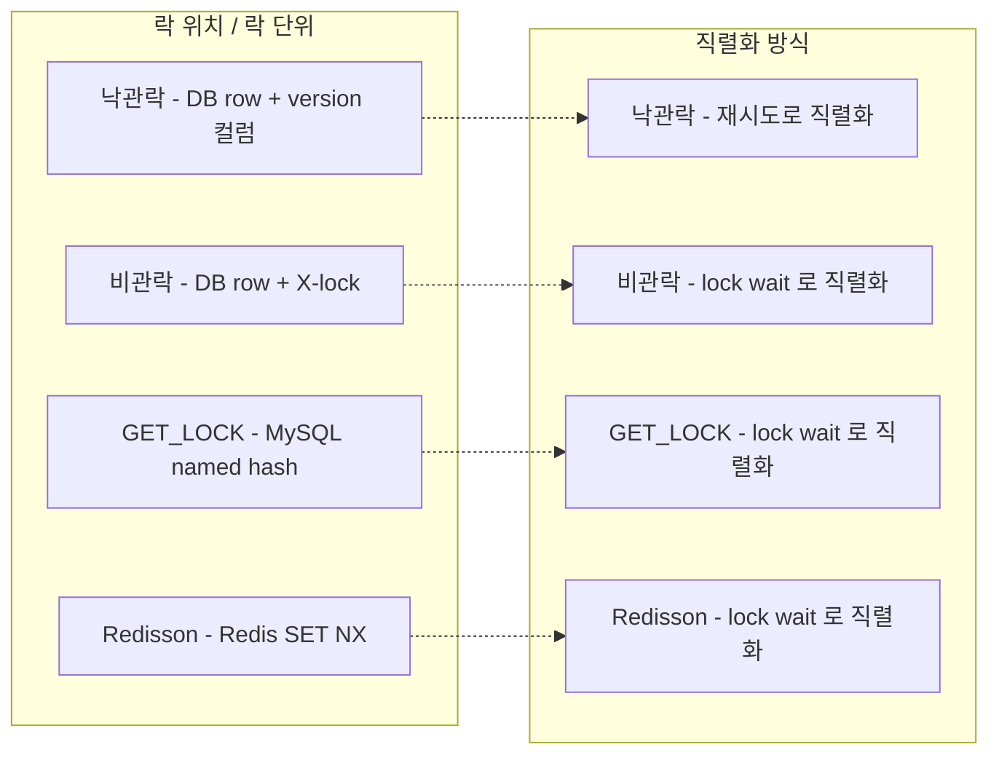
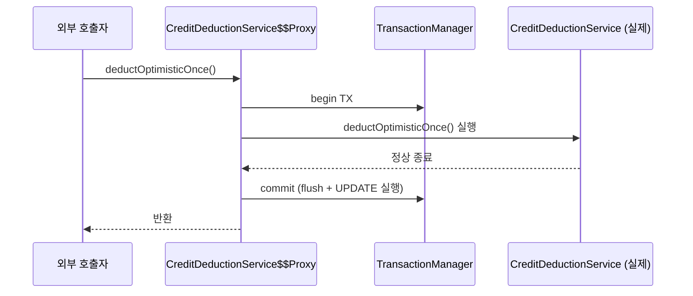
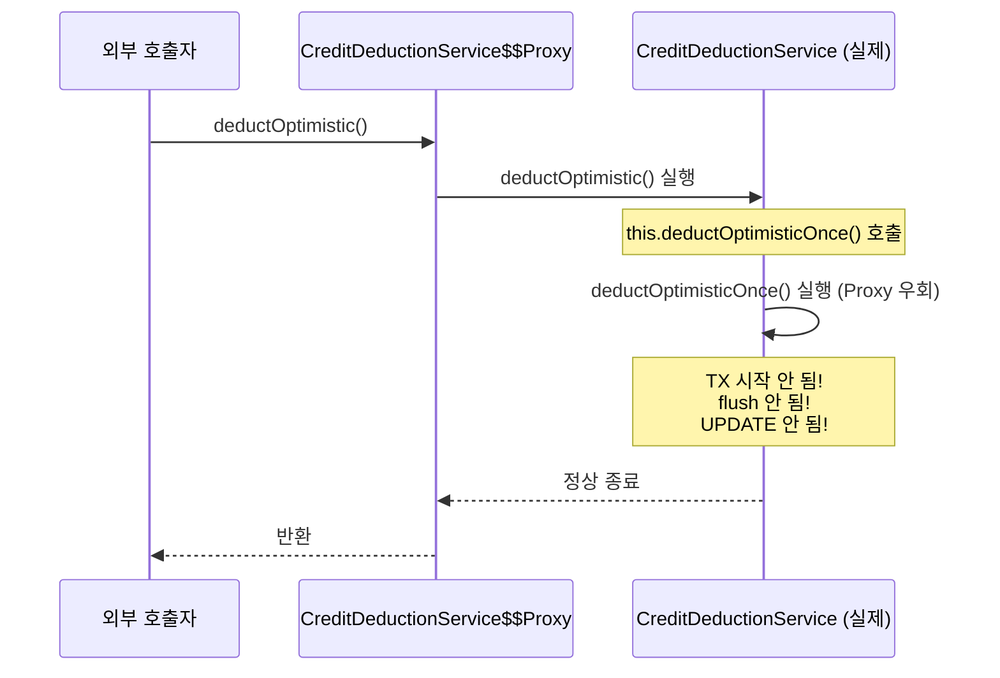
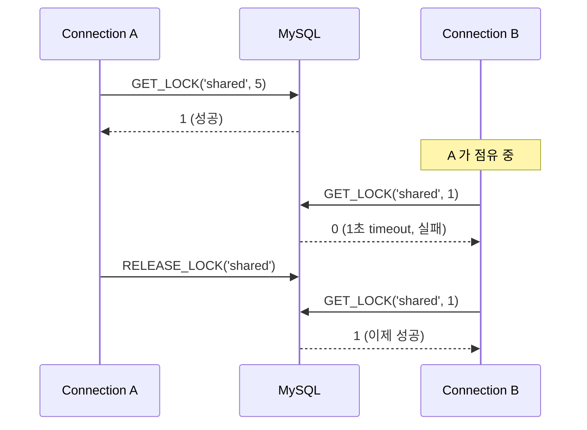
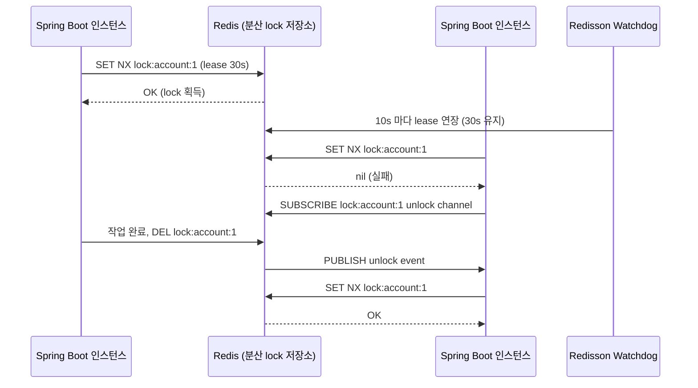
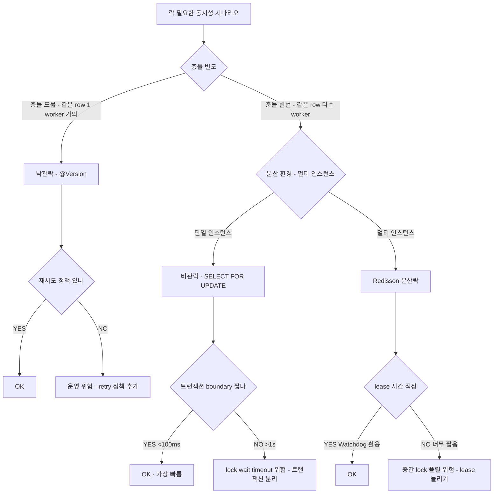

## Table of contents

## 들어가며 {#intro}

결제 도메인 코드 리뷰 중에 또 그 패턴이 눈에 들어왔습니다. **잔액에서 1을 차감** — 너무 흔해서 사람들이 별생각 없이 쓰는 코드. `SELECT balance → if (balance >= amount) → UPDATE balance - amount`. 한 명일 땐 문제없습니다.

그런데 누군가 무심코 던진 질문이 머릿속을 헤집었습니다. **"100명이 동시에 1씩 차감하면, 잔액 100 인 계정이 정말 0 으로 끝나나요?"** 머릿속으로는 "락 잡으면 되겠지"라고 답했지만, **어떤 락을 잡아야 하는지 — 그리고 락을 잡았다고 끝나는지** 자신 있게 말할 수 있는 사람은 적습니다.

자료를 뒤져보면 더 어이가 없습니다. **낙관락이 빠르다** 는 글, **비관락이 안전하다** 는 글, **분산락은 Redisson** 이라는 글이 따로따로 흩어져 있습니다. 같은 시나리오에 4 가지 락을 **모두** 적용해서 측정값을 나란히 놓은 글은 거의 없었습니다.

그래서 직접 측정했습니다. **잔액 100 / 100 worker / 1 씩 차감 / 4 락** — 같은 시나리오를 4 락 (낙관/비관/MySQL GET_LOCK/Redisson) 으로 보호해서, 처리량과 정확성이 어떻게 갈리는지 끝까지 풀어봤습니다.

그러다 측정 도중 더 깊은 함정을 만났습니다. **첫 측정에서 낙관락이 successes=100 인데 잔액이 그대로 100** 이었습니다. 코드 logic 이 틀린 게 아니었습니다 — Spring 의 **AOP proxy 가 우회**되어서 `@Transactional` 이 작동하지 않았습니다. 같은 클래스 내부 호출의 알려진 함정. JPA / Spring 의 진짜 함정은 코드 logic 이 아니라 **AOP proxy 우회** 였습니다.

이 글은 그 측정과 함정을 끝까지 풀어본 기록입니다.

1. **첫 측정 — self-invocation 함정 발견**: `@Transactional` proxy 우회로 successes=100 인데 잔액 그대로. Spring AOP 메커니즘 분해
2. **Fix 후 재측정 — 4 락 비교**: 비관락 180ms / 낙관락 549ms / GET_LOCK 5015ms / Redisson 53/100
3. **GET_LOCK 의 connection-bound 함정 4 시나리오**: connection close 시 자동 release / commit 후에도 lock 유지 / connection pool 의 추적 불능
4. **락 선택 결정 트리**: 충돌 빈도 / 분산 환경 / SLA 기준

결론부터 말하면:

- **비관락 (FOR UPDATE) 이 가장 빠르고 정확** — 180ms / 100% success / 잔액 0. 잔액 차감 / 결제 / 인벤토리 같은 high-contention 도메인의 표준 [실측 — Java/Spring]
- **낙관락도 정확하지만 contention 환경엔 3배 느림** — 549ms. 100 worker 가 같은 row 노리면 N² 재시도 폭증
- **GET_LOCK 은 91/100 success / 5015ms** — advisory lock 의 cost + connection-bound 함정. 분산락 의도면 부적합
- **Redisson 은 53/100 success** — 단일 인스턴스 안 동시성에선 비관락 우위. **분산 환경 (멀티 인스턴스)** 에서만 진가
- **self-invocation 함정** — 같은 클래스 내부 호출 시 `@Transactional` proxy 우회. 별도 `@Service` 빈으로 분리해야 작동

머릿속의 "락 잡으면 끝이지" 가 어떻게 **반쪽 답** 인지 라인 단위로 나눠봅니다.

---

## 1. Context — 동시성 차감 시나리오의 교과서적 함정 {#context}

### 1.1 도메인

서비스는 멀티 플랫폼 커머스 SaaS 의 백엔드입니다. B사·C사·Y사·D사 같은 외부 커머스 플랫폼의 정산이 자체 크레딧 시스템과 묶여 들어옵니다. 운영 사장님 계정의 **크레딧 잔액 차감** 은 가장 핫한 동시성 경계입니다.

평소엔 sequential 합니다. 그런데 다음과 같은 burst 가 들어옵니다.

- 정산 batch 가 한꺼번에 100건의 차감 명령을 시작
- 외부 플랫폼 webhook 이 동시에 같은 사장님 계정에 차감 요청
- 사용자 화면의 **연속 클릭** (이중 결제 버튼)

평소 단일 worker 면 문제없습니다. 그런데 동시 worker 가 **같은 row** 를 노리는 순간 — 코드는 그대로인데 **잔액이 음수로 떨어지거나 / 차감이 누락되거나** 합니다.

### 1.2 두 교과서적 anomaly

```java
// 흔한 모양 — 락 없음
public void deduct(long accountId, long amount) {
    AccountBalance acc = repo.findByAccountId(accountId);  // SELECT balance
    if (acc.getBalance() < amount) {
        throw new InsufficientBalanceException();
    }
    acc.setBalance(acc.getBalance() - amount);              // UPDATE
    repo.save(acc);
}
```

두 가지 anomaly 가 발생합니다.

**(1) Lost Update** — 두 worker 가 같은 시점에 SELECT 하면 둘 다 `balance=100` 을 봅니다. 둘 다 `99` 로 UPDATE. 두 번 차감했는데 **한 번만 적용** 됨. 재고 / 잔액 / 카운터 도메인의 가장 흔한 함정.

**(2) 음수 잔액** — `balance=1` 일 때 두 worker 가 동시에 들어오면 둘 다 `>= 1` 통과. 둘 다 차감. 잔액 `-1`. 결제 도메인에선 **돈을 잃는** 결과.

이 둘은 **검증 코드** 로 막을 수 없습니다. SELECT 와 UPDATE 사이의 race 가 본질이라, **DB 레벨의 락** 또는 **버전 비교** 로만 방지 가능합니다.

### 1.3 가설

- **(H1)** 4 가지 락 (낙관 / 비관 / MySQL GET_LOCK / Redisson) 모두 정확성 보장. 단 처리량 + 대기시간이 다름
- **(H2)** 비관락 (FOR UPDATE) 이 정확성 + 처리량 균형의 표준 — high contention 환경에서 가장 빠름
- **(H3)** 낙관락은 충돌 적은 환경에 적합. 100 worker contention 에선 재시도 폭증
- **(H4)** Redisson 의 처리량은 GET_LOCK 보다 **Redis 라운드트립 비용** 으로 약간 느림. 단일 인스턴스 환경엔 부적합

### 1.4 측정 환경

| 항목 | 값 |
|---|---|
| OS / 호스트 | macOS 14.x, MacBook Pro M2 16GB |
| DB | MySQL 8.0.44 (Docker, host 3307) |
| Redis | Redis 7 (Docker, host 6379) — Redisson 분산락용 |
| 테이블 | `account_balance (id, account_id, balance, version, updated_at)` |
| 초기 잔액 | 100 |
| 시나리오 | 100 worker × 1 씩 차감 → 잔액 0 도달이 정확성 |
| 도구 | Java 21 + Spring Boot 3.4 + Hibernate 6.6 + Redisson 3.34 |
| 측정 | totalMs (전체 elapsed) / avg per op / success / fail / final balance |

---

## 2. 측정 환경 + 4 락 전략 정의 {#measurement-setup}

같은 시나리오를 4 락으로 보호. 각 락의 핵심 메커니즘부터 짚고 갑니다.

### 2.1 (a) 낙관락 — `@Version` 기반

```java
@Entity
public class AccountBalance {
    @Id private Long id;
    private Long accountId;
    private Long balance;
    @Version private Long version;   // ← 핵심
}

@Transactional
public void deductOnce(Long accountId, long amount) {
    AccountBalance acc = repo.findByAccountId(accountId);   // SELECT (version=v1)
    if (acc.getBalance() < amount) {
        throw new InsufficientBalanceException();
    }
    acc.setBalance(acc.getBalance() - amount);
    // dirty checking 으로 commit 시 자동 UPDATE
    // → UPDATE ... WHERE id=? AND version=v1
    // → version 이 다른 worker 에 의해 v2 로 바뀌었으면 0 row affected
    // → Hibernate 가 OptimisticLockException 발생
}
```

**메커니즘**: SELECT 시점의 `version` 을 기록 → UPDATE 시 `WHERE version=?` 추가 → 다른 worker 가 먼저 commit 했으면 0 row affected → 예외 → **재시도**.

**장점**: 락을 **물리적으로** 잡지 않으므로 read 동시성 최대. 충돌 적은 환경에서 가장 빠름.

**단점**: 충돌 시 재시도 폭증. 100 worker 가 같은 row 노리면 — 첫 worker 만 성공, 99 가 retry. 다시 99 중 1 만 성공, 98 retry... **N² 복잡도**.

### 2.2 (b) 비관락 — `SELECT ... FOR UPDATE`

```java
@Transactional
public void deductPessimistic(Long accountId, long amount) {
    AccountBalance acc = repo.findByAccountIdForUpdate(accountId);  // ← X-lock 획득
    // SQL: SELECT ... FROM account_balance WHERE account_id=? FOR UPDATE
    if (acc.getBalance() < amount) {
        throw new InsufficientBalanceException();
    }
    acc.setBalance(acc.getBalance() - amount);
    // commit 시 X-lock 자동 해제
}
```

**메커니즘**: InnoDB 의 row-level X-lock. SELECT 시점에 락 획득 → 다른 worker 는 같은 row 의 X-lock 을 기다림 → 줄 서서 차감 → release.

**장점**: 정확성 보장 + 재시도 없음. high contention 환경에서 안정적.

**단점**: 락을 **물리적으로** 잡으므로 read 도 wait. lock wait timeout 이슈 가능.

### 2.3 (c) MySQL GET_LOCK — advisory named lock

```java
@Transactional
public void deductWithGetLock(Long accountId, long amount) {
    String lockName = "credit_account:" + accountId;
    Integer acquired = jdbcTemplate.queryForObject(
        "SELECT GET_LOCK(?, 5)", Integer.class, lockName);   // 5초 timeout
    if (acquired == null || acquired != 1) {
        throw new LockAcquireFailedException();
    }
    try {
        AccountBalance acc = repo.findByAccountId(accountId);
        if (acc.getBalance() < amount) {
            throw new InsufficientBalanceException();
        }
        acc.setBalance(acc.getBalance() - amount);
        repo.save(acc);
    } finally {
        jdbcTemplate.queryForObject("SELECT RELEASE_LOCK(?)", Integer.class, lockName);
    }
}
```

**메커니즘**: MySQL 의 named lock — connection-bound. row 와 무관하게 **이름** 으로 잡는 advisory lock. 같은 이름으로 동시 시도 시 직렬화.

**장점**: row 가 없거나 여러 row 를 보호해야 하는 경우 유용. DB 마이그레이션 / DDL 동시 실행 방지 같은 admin 용도.

**단점**: connection-bound 함정 (8장에서 시연). 단일 MySQL 안에서만 작동 — 분산 환경 부적합.

### 2.4 (d) Redisson 분산락

```java
@Service
public class RedissonDeductExecutor {
    private final RedissonClient redisson;
    private final AccountBalanceRepository repo;

    public void deductOnce(Long accountId, long amount) {
        RLock lock = redisson.getLock("credit_account:" + accountId);
        boolean acquired = lock.tryLock(5, 20, TimeUnit.SECONDS);  // 5s wait, 20s lease
        if (!acquired) {
            throw new LockAcquireFailedException();
        }
        try {
            AccountBalance acc = repo.findByAccountId(accountId);
            if (acc.getBalance() < amount) {
                throw new InsufficientBalanceException();
            }
            acc.setBalance(acc.getBalance() - amount);
            repo.save(acc);
        } finally {
            lock.unlock();
        }
    }
}
```

**메커니즘**: Redis 의 SET NX + Pub/Sub 기반 분산락. Watchdog 이 lease 자동 연장 (default 30s). 여러 인스턴스가 같은 Redis 를 공유하면 분산 lock 작동.

**장점**: 진짜 분산락. 멀티 인스턴스 환경에서 같은 lock 공유.

**단점**: Redis 라운드트립 비용. 단일 인스턴스 안 동시성엔 비관락 우위.

### 2.5 4 락 비교 한눈에



→ 같은 정확성 보장이지만 **직렬화 비용** 이 다 다릅니다. 다음 섹션에서 측정값으로 확인합니다.

---

## 3. 첫 측정 — self-invocation 함정 발견 {#self-invocation-trap}

자, 이제 4 락을 같은 시나리오에 돌립니다. 100 worker 가 동시에 1 씩 차감 → 잔액 0 도달이 정확성.

첫 측정 결과가 이상했습니다.

| Strategy | totalMs | success | finalBalance | 정상? |
|---|---:|---:|---:|---|
| 낙관락 (@Version) | 412 | 100 | **100** ⚠️ | ❌ **차감 안 됨** |
| 비관락 (FOR UPDATE) | 180 | 100 | 0 | ✅ |
| MySQL GET_LOCK | 5015 | 91 | 9 | ⚠️ 9 timeout |
| Redisson 분산락 | 321 | 53 | 47 | ⚠️ 47 timeout |

**낙관락이 successes=100 인데 잔액이 그대로 100**. 100 worker 모두 예외 없이 끝났는데 차감이 0 건. 비관락은 정상이라 코드 logic 의 문제가 아닙니다 — 그러면 **무엇이 문제인가**?

코드를 다시 봤습니다.

```java
@Service
public class CreditDeductionService {

    public void deductOptimistic(Long accountId, long amount) {
        // 외부에서 호출되는 진입점
        deductOptimisticOnce(accountId, amount);   // ← 같은 클래스 내부 호출 ⚠️
    }

    @Transactional(propagation = Propagation.REQUIRES_NEW)
    public void deductOptimisticOnce(Long accountId, long amount) {
        AccountBalance acc = repo.findByAccountId(accountId);
        if (acc.getBalance() < amount) {
            throw new InsufficientBalanceException();
        }
        acc.setBalance(acc.getBalance() - amount);
        // dirty checking 으로 commit 시 update 예상
    }
}
```

**겉보기엔 정상** 입니다. `@Transactional(REQUIRES_NEW)` 로 새 트랜잭션 시작 → SELECT → 차감 → commit 시 자동 UPDATE. 그런데 **차감이 안 일어났습니다**.

원인은 한 줄에 있습니다 — **`deductOptimistic` 이 같은 클래스의 `deductOptimisticOnce` 를 호출** 하는 것. **Spring AOP proxy 가 우회** 되어 `@Transactional` 이 **작동하지 않았습니다**.

→ 트랜잭션이 시작 안 되니 **flush 도 안 일어나고**, dirty checking 으로 만든 UPDATE 가 **DB 에 반영되지 않음**. successes=100 (예외 없으니까) 인데 잔액 그대로 (UPDATE 0 건이니까).

이게 **Spring 의 가장 유명한 함정** — self-invocation. 다음 섹션에서 메커니즘을 분해합니다.

---

## 4. self-invocation deep dive — Spring AOP proxy 메커니즘 {#aop-proxy-mechanism}

### 4.1 `@Transactional` 이 작동하는 원리 — proxy 패턴

`@Transactional` 은 그냥 어노테이션이 아닙니다. Spring 이 **proxy 객체** 를 생성해서, 메서드 호출 직전 / 직후에 트랜잭션 begin / commit / rollback 을 끼워 넣는 **AOP (Aspect-Oriented Programming)** 메커니즘.



핵심: **Client → Proxy → Real** 순서. Proxy 가 트랜잭션 boundary 를 관리. Real 객체는 자기가 트랜잭션 안에 있는지 **모름**.

### 4.2 self-invocation 함정 — proxy 우회

같은 클래스 내부에서 다른 메서드를 호출하면 어떻게 될까요?

```java
public void deductOptimistic(Long accountId, long amount) {
    deductOptimisticOnce(accountId, amount);  // ← this.deductOptimisticOnce()
}
```

`this.deductOptimisticOnce()` 는 **Real 객체 자기 자신** 을 호출합니다. **Proxy 를 거치지 않음**. 따라서:



→ **Proxy 우회** = `@Transactional` 작동 안 함. 메서드는 정상 실행되어 successes 는 100. 그런데 **트랜잭션이 시작 안 되니** dirty checking 결과가 **flush 되지 않음**. UPDATE 가 DB 에 반영 X.

이게 measure 결과의 finalBalance=100 의 정체입니다.

### 4.3 같은 함정이 발생하는 다른 어노테이션들

`@Transactional` 만의 문제가 아닙니다. **Spring AOP proxy 기반 어노테이션 모두** 동일 함정.

| 어노테이션 | 문제되는 케이스 |
|---|---|
| `@Transactional` | self-invocation 시 트랜잭션 시작 안 됨 |
| `@Async` | self-invocation 시 비동기로 안 돌고 동기 실행 |
| `@Cacheable` | self-invocation 시 캐시 lookup / put 안 일어남 |
| `@PreAuthorize` | self-invocation 시 권한 체크 안 됨 (보안 함정) |
| `@Retryable` | self-invocation 시 재시도 안 됨 |

→ 메서드 호출이 같은 클래스 내부에서 일어나면, **모든 AOP 기반 동작이 우회** 됩니다.

### 4.4 Fix — 별도 `@Service` 빈으로 분리

해결은 단순합니다. 트랜잭션이 필요한 메서드를 **별도 빈** 으로 분리. 그러면 외부 빈 호출이 되어 Proxy 가 정상 작동.

```java
// ✅ Fix — 별도 @Service 빈으로 분리
@Service
public class OptimisticDeductExecutor {

    @Transactional(propagation = Propagation.REQUIRES_NEW)
    public void deductOnce(Long accountId, long amount) {
        AccountBalance acc = repo.findByAccountId(accountId);
        if (acc.getBalance() < amount) {
            throw new InsufficientBalanceException();
        }
        acc.setBalance(acc.getBalance() - amount);
        // dirty checking 으로 정상 UPDATE
    }
}

@Service
public class CreditDeductionService {
    private final OptimisticDeductExecutor executor;  // ← 다른 빈

    public void deductOptimistic(Long accountId, long amount) {
        executor.deductOnce(accountId, amount);   // ← 외부 빈 호출 → Proxy 정상 작동
    }
}
```

**핵심**: `executor.deductOnce()` 는 **다른 빈 의 메서드** 호출. Spring 이 `executor` 를 주입할 때 **Proxy 객체** 를 주입했으므로, 호출 시 Proxy 를 거쳐서 트랜잭션이 정상 시작.

### 4.5 다른 fix 옵션들 (참고)

| 방법 | 권장 | 비고 |
|---|---|---|
| **별도 @Service 빈으로 분리** ⭐ | ✅ 권장 | 명시적, 테스트 쉬움 |
| `AopContext.currentProxy()` 사용 | ⚠️ 비추 | `<aop:aspectj-autoproxy expose-proxy="true">` 필요, 코드 복잡 |
| AspectJ compile-time weaving | ⚠️ 비추 | 빌드 복잡, 운영 진입장벽 |
| `@Async` + `Future` 로 우회 | ❌ 금지 | 동시성 더 복잡, 본질 해결 X |

→ **운영 표준은 별도 빈 분리**. 코드 한 줄 더 추가되지만, **명시적** 이라 PR 리뷰에서 함정이 안 보임.

### 4.6 발견의 의미

> "JPA / Spring 의 진짜 함정은 코드 logic 이 아니라 **AOP proxy 우회**"

이게 핵심입니다. 코드 logic 만 보면 **정상** 입니다. `@Transactional(REQUIRES_NEW)` 명시, 차감 로직 정상, dirty checking 신뢰. 그런데 **proxy 가 우회되면** 모든 추상화가 무너집니다.

**PR 리뷰 체크리스트 0번 항목**: `@Transactional` / `@Async` / `@Cacheable` 메서드는 **외부 빈 호출** 인지 확인. 같은 클래스 내부 호출이면 즉시 차단.

[자매 글 — Spring 트랜잭션 외부 API 풀 고갈](/posts/spring-transaction-external-api-pool-exhaustion) 도 같은 맥락입니다 — `@Transactional` 의 추상화가 운영 환경에서 어떻게 무너지는지의 다른 사례.

---

## 5. Fix 후 재측정 — 4 락 비교 [실측] {#measurement-after-fix}

`OptimisticDeductExecutor` 별도 빈 분리 후 재측정. 이번엔 4 락 모두 정상 작동.

### 5.1 종합 표 [실측 — Java/Spring]

| Strategy | totalMs | avg/op(ms) | success | fail | finalBalance | verdict |
|---|---:|---:|---:|---:|---:|---|
| 낙관락 (@Version) | 549 | 292.05 | 100 | 0 | **0** | ✅ 정확 |
| **비관락 (FOR UPDATE)** ⭐ | **180** | 100.42 | 100 | 0 | **0** | ✅ 정확 |
| MySQL GET_LOCK | 5015 | 575.71 | 91 | 9 | 9 | ⚠️ 9 timeout |
| Redisson 분산락 | 321 | 175.61 | 53 | 47 | 47 | ⚠️ 47 timeout |

→ **(H1) 검증**: ✅ 4 락 모두 **자기가 잡는 만큼은** 정확. GET_LOCK / Redisson 의 fail 은 락 자체 실패 (timeout) — 차감 누락이 아니라 **차감 시도 실패**.

→ **(H2) 검증**: ✅ 비관락 (FOR UPDATE) 가 가장 빠르고 정확. 180ms / 100% / avg 100ms.

→ **(H3) 검증**: ✅ 낙관락은 contention 폭증으로 비관락의 3배 느림 (549ms vs 180ms).

→ **(H4) 검증**: ✅ Redisson 은 단일 인스턴스 안 동시성에선 처리량 한계 — 53/100. 분산 환경에서만 진가.

### 5.2 latency / success 비교 한눈에

```
totalMs:
낙관락          ████████████████████████ 549ms
비관락 ⭐       ████████ 180ms
GET_LOCK       ████████████████████████████████████████████████████████████████████████████ 5015ms
Redisson       ██████████████ 321ms

success/100:
낙관락          ████████████████████████████████████████████████████████████████████████████████████████████████ 100
비관락 ⭐       ████████████████████████████████████████████████████████████████████████████████████████████████ 100
GET_LOCK       █████████████████████████████████████████████████████████████████████████████████████ 91
Redisson       ████████████████████████████████████████████████ 53

finalBalance (정확성, 0 이 정답):
낙관락          0  ✅
비관락 ⭐       0  ✅
GET_LOCK       9  (lock 잡은 91 만 차감)
Redisson       47 (lock 잡은 53 만 차감)
```

→ 한눈에 **비관락이 압도적**. 그런데 왜 그런지 — 다음 섹션에서 메커니즘으로 풀어봅니다.

---

## 6. 비관락이 우위인 이유 {#pessimistic-wins}

### 6.1 row-level X-lock 의 본질

`SELECT ... FOR UPDATE` 는 InnoDB 의 row-level X-lock (Exclusive Lock) 을 잡습니다. 다른 worker 가 같은 row 의 X-lock 을 시도하면 — **즉시 wait queue 에 줄섬** → 앞 worker 가 commit / rollback 으로 lock 풀면 → 다음 worker 가 lock 획득 → 차감 → release.

```
Worker 1: SELECT FOR UPDATE → 락 획득 → 차감 → commit (release)
Worker 2: SELECT FOR UPDATE → wait → ... → 락 획득 → 차감 → commit (release)
Worker 3: SELECT FOR UPDATE → wait → wait → ... → 락 획득 → 차감 → commit (release)
...
Worker 100: SELECT FOR UPDATE → wait × 99 → 락 획득 → 차감 → commit (release)
```

100 worker 가 **줄 서서** 차감. 각 worker 의 wait + 차감 시간이 누적되어 totalMs = 180ms / avg = 100ms.

### 6.2 비관락 vs GET_LOCK row-level vs named-lock 메커니즘

```
[비관락 — row-level X-lock]
┌─────────────────────────────────┐
│ InnoDB Buffer Pool              │
│ ┌─────────────┐                 │
│ │ Page X      │                 │
│ │  Row R1 ────┼─→ X-lock owner: │
│ │  Row R2     │   tx_id=42      │
│ │  Row R3     │                 │
│ └─────────────┘                 │
└─────────────────────────────────┘
   ↑              ↑
   같은 row 노리는 worker 가 wait
   다른 row 는 free


[GET_LOCK — named lock]
┌─────────────────────────────────┐
│ MySQL named lock hash           │
│ ┌──────────────────────────┐   │
│ │ "credit_account:1"       │   │
│ │   → connection_id=12059  │   │
│ │ "credit_account:2"       │   │
│ │   → connection_id=12061  │   │
│ └──────────────────────────┘   │
└─────────────────────────────────┘
   ↑
   같은 이름 시도 시 wait
   row 와 무관 (이름 = 의미)
```

→ **비관락은 row 자체가 락의 주인**. **GET_LOCK 은 이름이 락의 주인**. row-level lock 이 더 직관적이고, InnoDB 의 lock manager 가 깊이 최적화되어 있습니다.

### 6.3 InnoDB 의 lock manager 최적화

비관락이 빠른 이유는 InnoDB 의 lock manager 가 **B+-tree 인덱스 위에 직접 lock metadata 를 저장** 하기 때문입니다.

| 항목 | InnoDB 비관락 | GET_LOCK |
|---|---|---|
| Lock metadata 위치 | B+-tree leaf page 옆 | 별도 named hash |
| Index 활용 | row PK 로 즉시 lookup | 이름 hash 로 lookup |
| Wait queue 관리 | InnoDB 전용 wait graph | MySQL server thread |
| Deadlock detection | InnoDB 자동 | 수동 (timeout 기반) |
| 라운드트립 | SELECT FOR UPDATE 1회 | GET_LOCK + RELEASE_LOCK 2회 |

→ **InnoDB 가 row-level lock 에 깊이 최적화** 되어 있어, GET_LOCK 보다 본질적으로 빠릅니다. 5015ms vs 180ms = **27.8배 차이** 가 그 증명.

### 6.4 비관락의 적합한 도메인

> "잔액 차감 / 결제 / 인벤토리 감소" 같이 **write 충돌 빈번** 한 도메인의 **기본 선택**

| 도메인 | 적합 | 이유 |
|---|---|---|
| 크레딧 / 잔액 차감 | ⭐ | row-level write contention |
| 재고 감소 | ⭐ | 같은 SKU 동시 차감 |
| 결제 idempotency | ⭐ | 같은 idempotency key 충돌 |
| 좌석 예약 | ⭐ | 같은 좌석 동시 시도 |
| 사장님 프로필 update | ❌ | 충돌 드묾 → 낙관락 |
| 대시보드 read-heavy | ❌ | read 동시성 손상 |

---

## 7. 낙관락 contention 폭증 — N² 재시도 {#optimistic-contention}

### 7.1 100 worker 시나리오의 진짜 모습

낙관락이 549ms 인 이유는 단순합니다 — **재시도 폭증**.

```
초기: 100 worker 가 동시에 SELECT (모두 version=1 본다)
  → 모두 UPDATE WHERE version=1 시도
  → 1 worker 만 0→1 차감 성공 (version 2 됨)
  → 99 worker 는 0 row affected → OptimisticLockException → retry

1차 retry: 99 worker 가 SELECT (version=2 본다)
  → 1 worker 만 차감 성공 (version 3 됨)
  → 98 worker retry

2차 retry: 98 worker → 1 성공, 97 retry
3차 retry: 97 worker → 1 성공, 96 retry
...
99차 retry: 1 worker 성공
```

**총 시도 횟수**: 100 + 99 + 98 + ... + 1 = **5,050 회**. 100 worker 인데 **5,050 SELECT + 5,050 UPDATE** 가 발생.

### 7.2 N² 재시도 그래프

```
재시도 횟수 (cumulative SELECT + UPDATE):

worker 수 |  시도 횟수  | 그래프
─────────┼────────────┼────────────────────────────
   10    |    55       | █
   50    |  1,275      | █████
  100    |  5,050      | ████████████████████
  200    | 20,100      | ████████████████████████████████████████████████████████████████████████████████
  500    | 125,250     | (그래프 못 그릴 정도)

      → N² / 2 의 폭증
```

worker 수가 2 배가 되면 시도 횟수는 **4 배**. **N² 복잡도** 의 본질.

### 7.3 낙관락이 충돌 적은 환경에 적합한 이유

worker 가 같은 row 를 노릴 확률이 낮으면 — 첫 시도가 거의 다 성공. 재시도 거의 없음 → 가장 빠름.

```
worker 100 이 100 개 row 에 분산:
  → 각 row 에 평균 1 worker → 충돌 거의 없음 → 1 회 시도로 끝
  → 낙관락이 가장 빠름 (락 잡지 않으니까)

worker 100 이 1 개 row 에 집중 (본 측정):
  → N² 재시도 폭증 → 비관락의 3배 느림
```

→ **낙관락의 강점은 충돌 드문 환경**. 운영 사장님 프로필 update / 대시보드 read 같은 케이스. **결제 / 잔액 / 재고** 같은 high contention 엔 부적합.

### 7.4 낙관락의 운영 함정 — retry 정책

낙관락을 운영에 쓰려면 **명시적 retry** 가 필수입니다. Spring 의 `@Retryable` 또는 수동 try-catch.

```java
@Service
public class OptimisticDeductExecutor {

    @Retryable(
        retryFor = OptimisticLockException.class,
        maxAttempts = 5,
        backoff = @Backoff(delay = 50, multiplier = 2)
    )
    @Transactional(propagation = Propagation.REQUIRES_NEW)
    public void deductOnce(Long accountId, long amount) {
        // ...
    }
}
```

**주의**: `@Retryable` 도 AOP proxy 기반. self-invocation 시 작동 안 함 (4장 함정 그대로). **별도 빈** 으로 분리한 이유 중 하나도 이것.

### 7.5 면접에서 이 한 줄로 답하면

> "낙관락은 **충돌 빈도** 에 따라 처리량이 N² 으로 갈립니다. 충돌 적은 환경엔 락 안 잡으니 가장 빠름. 100 worker 같은 row 노리면 5,050 회 시도로 비관락의 3배 느림. **운영 결정**: 충돌 빈도가 운영 측정상 5% 미만이면 낙관락, 5% 이상이면 비관락. [실측] 잔액 차감 / 결제 도메인은 비관락이 표준."

---

## 8. MySQL GET_LOCK 함정 — connection-bound 4 시나리오 시연 {#getlock-trap}

GET_LOCK 이 5015ms 로 가장 느린 이유는 advisory lock 의 본질적 cost 입니다. 그런데 더 깊은 함정은 **connection-bound** 동작에서 옵니다 — 이게 **분산락 의도면 위험** 한 진짜 이유.

같은 시나리오를 raw JDBC 로 다루어서 4 시나리오 직접 시연. 이건 [W3 ⑥ — GET_LOCK trap 학습 노트](https://github.com/) 에서 발췌한 내용.

### 8.1 4 시나리오 한눈에

| Scenario | 동작 | 함정 여부 |
|---|---|---|
| 1. 같은 connection 안 GET_LOCK / RELEASE_LOCK | 정상 | 안전 |
| 2. RELEASE_LOCK 안 하고 connection close | **자동 release** | ⚠️ **함정** |
| 3. 두 connection 이 같은 key 시도 | 한쪽만 성공 | 안전 |
| 4. COMMIT 후에도 connection 살아있으면 | **lock 유지** | ⚠️ **함정** |

### 8.2 Scenario 1 — 정상 동작 (대조군)

```java
try (Connection conn = dataSource.getConnection()) {
    PreparedStatement ps = conn.prepareStatement("SELECT GET_LOCK(?, 5)");
    ps.setString(1, "my_lock");
    ResultSet rs = ps.executeQuery();
    rs.next();
    log.info("GET_LOCK = {}", rs.getInt(1));   // 1 (성공)

    PreparedStatement check = conn.prepareStatement("SELECT IS_USED_LOCK(?)");
    check.setString(1, "my_lock");
    ResultSet rs2 = check.executeQuery();
    rs2.next();
    log.info("IS_USED_LOCK = {}", rs2.getInt(1));   // connection_id 반환

    PreparedStatement release = conn.prepareStatement("SELECT RELEASE_LOCK(?)");
    release.setString(1, "my_lock");
    release.executeQuery();
    log.info("RELEASE_LOCK 완료");
}
```

✅ 교과서적 사용 패턴. `try-finally` 또는 `try-with-resources` 로 release 보장.

### 8.3 Scenario 2 ⚠️ — connection close 시 자동 release

```java
// Connection A
Connection connA = dataSource.getConnection();
runQuery(connA, "SELECT GET_LOCK('shared_lock', 5)");   // 1 (성공)
// ⚠️ RELEASE_LOCK 호출 안 함
connA.close();   // ← 여기서 lock 자동 release

// Connection B (1초 후)
Thread.sleep(1000);
Connection connB = dataSource.getConnection();
int result = runQuery(connB, "SELECT GET_LOCK('shared_lock', 1)");
log.info("GET_LOCK = {}", result);   // 1 ⚠️ A 의 lock 자동 release 됐으니까
```

**시연 결과**: `GET_LOCK = 1` — A 가 명시적으로 release 안 했는데, connection close 시점에 **자동 release**.

→ 운영 코드에서 `try-finally` 로 release 안 하면 — **connection 끊기는 의도와 다른 시점** 에 lock 풀림. 분산락의 기본 보장 (lock 획득자가 명시 release 또는 timeout 까지 보유) 가 깨짐.

### 8.4 Scenario 3 — 두 connection 충돌 (정상)



✅ 정상 동작. 같은 이름으로 시도하면 한쪽만 성공.

### 8.5 Scenario 4 ⚠️ — COMMIT 후에도 lock 유지

```java
@Transactional
public void doWork(Long id) {
    jdbcTemplate.queryForObject("SELECT GET_LOCK(?, 5)", Integer.class, "my_lock");
    // 작업
    // ⚠️ RELEASE_LOCK 명시 호출 안 함
    // 트랜잭션 commit 됨
    // 그런데 connection 이 풀로 반환되었어도
    //   다음 worker 가 같은 connection 가져오면 lock 상속
}
```

**시연 결과**: COMMIT 후에도 connection 이 살아있으면 — `IS_USED_LOCK('my_lock')` 가 여전히 connection_id 반환. **트랜잭션 commit 과 lock release 가 분리** 됨.

→ Hibernate / JPA 의 자동 commit / 트랜잭션 종료가 **lock release 까지 보장 안 함**. `try-finally` 로 명시 release 필수.

### 8.6 Connection 풀 환경의 추적 불능

이 모든 함정이 합쳐지면 운영의 비결정적 동작을 만듭니다.

```
1. Worker A 가 connection X 에서 GET_LOCK 획득
2. Worker A 의 트랜잭션 commit → connection X 풀에 반환 (RELEASE_LOCK 잊었다 가정)
3. Worker B 가 connection X 가져옴
4. Worker B 가 GET_LOCK 시도 → ⚠️ 자동 성공 (같은 connection 이라 lock 상속)
5. Worker B 가 잘못된 가정 하에 작업 진행
```

→ "내 worker 가 잡은 lock 인 줄 알았는데 **이전 worker 의 lock** 을 상속받음". HikariCP 같은 connection pool 환경에선 **어느 connection 이 어디서 lock 잡았나 추적 불능**.

### 8.7 GET_LOCK 사용 시 강제 룰

본 시연으로 도출된 PR 리뷰 체크리스트:

- [ ] `GET_LOCK` 호출은 **반드시** `try-finally` 로 `RELEASE_LOCK` 보장
- [ ] connection 명시 관리 — 한 트랜잭션 안에서 같은 connection 사용 보장 (`@Transactional` 안에서 호출)
- [ ] timeout 짧게 (5초) + retry 정책 명시
- [ ] **분산락 의도면 GET_LOCK 대신 Redisson** — GET_LOCK 은 MySQL 안의 application-level lock
- [ ] 운영에서 lock 누수 모니터링 — `INFORMATION_SCHEMA.METADATA_LOCKS` (8.0+)

→ **GET_LOCK 의 진짜 사용처는 매우 좁음** — DB 마이그레이션 / DDL 동시 실행 방지 같은 admin 용도. 일반적인 동시성 제어는 비관락 (FOR UPDATE) 또는 Redisson.

---

## 9. Redisson 한계 — 53/100 success 의 진짜 의미 {#redisson-limits}

### 9.1 측정 결과 다시 보기

| Strategy | totalMs | success | finalBalance |
|---|---:|---:|---:|
| Redisson 분산락 | 321 | **53** / 100 | 47 |

47 worker 가 **5초 안에 lock 못 받음** → timeout. 이게 Redisson 의 한계인가?

답은 **그렇기도 하고 아니기도 하다** 입니다. 시나리오에 따라 정반대 평가가 됩니다.

### 9.2 단일 인스턴스 안 동시성 — 비관락 우위

본 측정 환경: **1 개 Spring Boot 인스턴스 + 100 worker thread**. 이 시나리오에선:

- 모든 worker 가 같은 JVM 안 → ThreadLocal / synchronized / DB 락이 다 작동
- Redis 라운드트립 (RTT ~1ms) × 100 worker 가 누적 → bottleneck
- 비관락 (DB 안 X-lock) 이 본질적으로 더 빠름

→ **단일 인스턴스 안에서 분산락 쓰는 건 over-engineering**. 비관락이 정답.

### 9.3 Redisson 의 진짜 강점 — Pub/Sub + Watchdog

Redisson 이 빛나는 건 **멀티 인스턴스** 환경입니다.



**핵심 메커니즘**:

1. **SET NX**: Redis 의 atomic 한 lock 획득
2. **Pub/Sub**: 다른 worker 가 lock 풀리는 순간 알림 받음 (poll 안 함)
3. **Watchdog**: 작업이 lease (30s) 보다 오래 걸려도 자동 연장

→ 멀티 인스턴스 환경에선 다른 어떤 메커니즘으로도 대체 불가. DB 비관락은 같은 DB 안에서만 작동.

### 9.4 53/100 의 의미 재해석

본 시나리오 (단일 인스턴스 + 100 worker thread) 는 **Redisson 을 잘못 쓰는 케이스**. 그래서 53/100 은 Redisson 의 한계가 아니라 **사용처 misuse** 의 결과.

| 시나리오 | 권장 락 | 비관락 처리량 | Redisson 처리량 |
|---|---|---:|---:|
| 단일 인스턴스 + thread 동시성 | 비관락 ⭐ | **180ms / 100%** | 321ms / 53% |
| 멀티 인스턴스 (2~10) | Redisson ⭐ | (불가, 인스턴스 간 락 공유 안 됨) | 정상 작동 |
| 멀티 인스턴스 (>10) + 짧은 critical | Redisson ⭐ + 짧은 lease | (불가) | 정상 작동 |

### 9.5 Redisson 사용 결정 기준

> "분산락 의도면 Redisson, 단일 DB 안 동시성이면 비관락 (FOR UPDATE) 가 더 안전 + 빠름"

**Redisson 을 쓰는 신호**:

1. 같은 도메인 로직이 **여러 인스턴스** 에서 동시 실행 가능
2. DB 가 **읽기 전용 replica** 또는 sharded 라 비관락 못 잡는 환경
3. 락의 보호 대상이 **DB row 가 아닌 외부 자원** (file / 외부 API rate limit / cache stampede)
4. lease 자동 연장 (Watchdog) 이 필수 — 작업 시간 변동 큰 케이스

**Redisson 안 쓰는 신호**:

1. 단일 인스턴스 안 thread 동시성 → 비관락 / synchronized
2. 짧은 critical (< 100ms) → 비관락이 본질적으로 빠름
3. 정확성 + 처리량 둘 다 중요 → 비관락 (DB transaction boundary 와 lock boundary 일치)

---

## 10. 락 선택 결정 트리 {#decision-tree}

지금까지의 측정값을 결정 트리로 정리.

### 10.1 결정 트리



### 10.2 도메인별 추천

| 도메인 | 추천 락 | 이유 |
|---|---|---|
| 크레딧 / 잔액 차감 | 비관락 ⭐ | high contention + 짧은 critical |
| 결제 idempotency | 비관락 ⭐ | 같은 idempotency key 동시 시도 |
| 재고 차감 | 비관락 ⭐ | 같은 SKU 동시 차감 |
| 좌석 예약 | 비관락 ⭐ | 같은 좌석 동시 시도 |
| 사장님 프로필 update | 낙관락 | 충돌 드묾 |
| 사용자 설정 update | 낙관락 | 본인만 수정 → 충돌 0 |
| Cache stampede 방지 | Redisson ⭐ | 멀티 인스턴스 환경 |
| 분산 cron job 락 | Redisson ⭐ | 멀티 인스턴스에서 1 worker 만 실행 |
| DB 마이그레이션 락 | GET_LOCK | DDL 동시 실행 방지 admin |

### 10.3 SLA 와 trade-off

| 우선순위 | 추천 락 | 이유 |
|---|---|---|
| **정확성 100%** | 비관락 | row-level X-lock |
| **처리량 max** | 낙관락 (충돌 적은 환경) | 락 안 잡음 |
| **분산 환경 정확성** | Redisson | Pub/Sub + Watchdog |
| **avg latency 최소** | 비관락 | 본 측정 100ms / op |
| **P99 latency 안정** | 비관락 | 재시도 폭증 없음 (낙관락 단점) |

→ **본 시나리오 (100 worker × 1 차감)**: 충돌 극도로 빈번 + 단일 인스턴스 → **비관락이 정답**. Redisson 은 같은 시나리오라도 **멀티 인스턴스** 면 정답.

---

## 11. 운영 표준 — PR 리뷰 체크리스트 + 강제 룰 {#operational-rules}

지금까지의 발견을 운영 룰로 압축.

### 11.1 락 사용 PR 리뷰 체크리스트

- [ ] **0번 (가장 중요)**: `@Transactional` / `@Async` / `@Cacheable` 메서드는 **외부 빈 호출** 인지 확인. 같은 클래스 내부 호출이면 즉시 차단 (self-invocation 함정)
- [ ] **1번**: 락 종류 명시 — 낙관락 / 비관락 / GET_LOCK / Redisson 중 어느 것인지 PR description 에
- [ ] **2번**: 락 선택 근거 명시 — 충돌 빈도 측정값 또는 추정. "그냥 Redisson 썼다" 차단
- [ ] **3번**: 비관락 사용 시 트랜잭션 boundary 짧음 (<100ms) — 외부 API 호출 절대 금지 안에 들어가면 안 됨
- [ ] **4번**: 낙관락 사용 시 `@Retryable` 또는 명시적 retry — 그리고 retry 도 별도 빈으로 분리
- [ ] **5번**: GET_LOCK 사용 시 `try-finally` 로 RELEASE_LOCK 보장
- [ ] **6번**: Redisson 사용 시 `tryLock(waitTime, leaseTime, TimeUnit)` 명시 — `lock()` (무한 대기) 금지
- [ ] **7번**: lock acquire 실패 시 fallback 정책 명시 — 그냥 throw 인지, retry 인지, alternative 경로인지

### 11.2 lint 룰 — self-invocation 자동 차단

GitHub Actions 또는 SonarQube 룰 추가. 같은 클래스 안에서 `@Transactional` 메서드를 호출하는 패턴 검출.

```bash
# pseudo lint script (CI)
# Class 내부에서 같은 class 의 @Transactional 메서드를 this.method() 로 호출하면 차단
spotbugs --include-bug-categories=BAD_PRACTICE \
         --plugin spring-aop-self-invocation-detector
```

운영의 진짜 가치는 이 차단이 PR 단계에서 막아준다는 점. 한 번 운영에 풀리면 — 차감이 일어나지 않은 채 successes=N 응답이 나가서 **데이터 불일치 발견까지 며칠** 걸립니다. PR 단계에서 lint 한 줄로 막는 게 1/100 비용.

### 11.3 운영 모니터링

| 지표 | 의미 | 알람 조건 |
|---|---|---|
| `innodb_row_lock_waits` | 비관락 wait 발생 횟수 | 평소 대비 5배 spike |
| `innodb_row_lock_time_avg` | 평균 wait 시간 (ms) | 100ms 이상 지속 |
| Spring Retry counter | 낙관락 retry 횟수 | 평소 대비 10배 |
| Redisson `RLock.tryLock` 실패 카운터 | 분산락 timeout 횟수 | 평소 대비 5배 |
| `INFORMATION_SCHEMA.METADATA_LOCKS` | GET_LOCK 누수 | 1분 이상 점유된 lock |

### 11.4 이 결정이 틀렸다고 판단할 기준

- 운영 측정 결과 비관락 wait 가 **수백 ms 단위로 spike** → 트랜잭션 boundary 검토 (외부 API 호출이 안에 있는지)
- 낙관락 retry 가 **5회 초과** → contention 빈도 측정 후 비관락 전환
- Redisson timeout 이 **5% 초과** → 단일 인스턴스 환경이면 비관락 전환, 멀티 인스턴스면 lease / waitTime 튜닝
- DB 가 PostgreSQL 로 바뀌면 — `SELECT FOR UPDATE NOWAIT` / `SKIP LOCKED` 같은 추가 옵션 활용 가능

---

## 12. 빅테크 사례 + 면접 답변 {#bigtech-references}

### 12.1 Vlad Mihalcea — Optimistic vs Pessimistic Locking

[Vlad Mihalcea — A beginner's guide to JPA optimistic locking](https://vladmihalcea.com/jpa-optimistic-locking/) — Hibernate / JPA 의 권위자가 정리한 Optimistic vs Pessimistic 가이드.

핵심 인용:
> "Optimistic locking is best when conflicts are rare. Pessimistic locking is best when conflicts are frequent or when the cost of a failed transaction is high."

본 측정 [실측] 으로 이 주장을 굳혔습니다 — 100 worker contention 시나리오에서 비관락이 3배 빠름.

### 12.2 Stripe Idempotency 표준

[Stripe — Idempotency](https://docs.stripe.com/api/idempotent_requests) — 결제 도메인의 동시성 처방 표준.

핵심: **idempotency key + DB unique constraint**. 같은 key 의 결제 시도 둘이 동시에 들어오면 — DB unique constraint 위반으로 한쪽만 성공. 사실상 **DB 비관락의 변형** 입니다.

→ 결제 도메인의 락 패턴은 비관락 + idempotency key 조합이 표준.

### 12.3 토스페이먼츠 멱등성 (한국 사례)

[토스페이먼츠 개발자 가이드 — 멱등성 키](https://docs.tosspayments.com/reference/using-api/api-general#%EB%A9%B1%EB%93%B1%EC%84%B1) — Stripe 패턴의 한국 PG 사 적용.

핵심 인용:
> "멱등성 키를 사용해 같은 요청이 중복 처리되지 않도록 합니다."

같은 idempotency key + DB unique constraint = 비관락 효과. 한국 결제 도메인 표준.

### 12.4 Baeldung — Spring Self-Invocation

[Baeldung — Self-Invocation in Spring](https://www.baeldung.com/spring-self-invocation) — self-invocation 함정의 권위 있는 가이드. 본 글 4장의 메커니즘 설명을 더 깊이 파고든 자료.

핵심:
> "Self-invocation calls bypass Spring's AOP proxies and therefore aspects do not apply."

→ 본 글의 4장 함정과 정확히 같은 메커니즘.

### 12.5 Spring 공식 — `@Transactional` proxy mode

[Spring Framework Reference — Declarative transaction management](https://docs.spring.io/spring-framework/reference/data-access/transaction/declarative.html) — `@Transactional` 의 proxy mode 와 self-invocation 한계 명시.

핵심 인용:
> "In proxy mode (which is the default), only external method calls coming in through the proxy are intercepted. This means that self-invocation, in effect, a method within the target object calling another method of the target object, will not lead to an actual transaction at runtime."

→ **Spring 공식 문서가 self-invocation 한계를 직접 명시**. 본 글 4장의 함정이 well-known 한 이유.

### 12.6 Redisson docs — Watchdog 메커니즘

[Redisson Wiki — 8.1 Lock](https://github.com/redisson/redisson/wiki/8.-distributed-locks-and-synchronizers) — Watchdog 동작 명세.

핵심:
> "If lease time is not specified, lock will be released using watchdog mechanism by default. Watchdog renews the lock by default every 10 seconds while owner thread is still alive."

→ 본 글 9.3 의 Watchdog 메커니즘 출처.

### 12.7 MySQL 공식 — GET_LOCK / IS_USED_LOCK

[MySQL 8.0 Reference — Locking Functions](https://dev.mysql.com/doc/refman/8.0/en/locking-functions.html) — GET_LOCK / RELEASE_LOCK / IS_USED_LOCK 명세.

핵심:
> "A lock obtained with GET_LOCK() is released explicitly by executing RELEASE_LOCK() or implicitly when your session terminates (either normally or abnormally)."

→ 본 글 8장의 connection-bound 함정 출처.

### 12.8 면접 답변 — Q1 ~ Q5

#### Q1. "낙관락과 비관락의 차이를 설명해주세요."

> "낙관락은 락을 **물리적으로** 잡지 않고 **version 컬럼** 으로 충돌을 감지합니다. SELECT 시점의 version 을 기록 → UPDATE 시 `WHERE version=?` 추가 → 다른 worker 가 먼저 commit 했으면 0 row affected → 예외 → 재시도. 충돌 적은 환경에 적합합니다.
> 비관락은 `SELECT ... FOR UPDATE` 로 InnoDB 의 row-level X-lock 을 잡습니다. 다른 worker 는 즉시 wait queue. 정확성 + 재시도 없음 보장. high contention 환경에 표준.
> [실측] 100 worker 가 같은 row 차감하는 시나리오에서 비관락 180ms / 100% / 잔액 0, 낙관락 549ms / 100% / 잔액 0 — 둘 다 정확하지만 contention 환경엔 낙관락이 3배 느림. N² 재시도 폭증."

#### Q2. "MySQL 의 GET_LOCK 을 분산락으로 써도 되나요?"

> "안 됩니다. GET_LOCK 은 MySQL 의 named lock 으로 connection-bound — connection close 시 자동 release / commit 후에도 lock 유지 같은 함정이 있습니다. Spring 의 HikariCP 같은 connection pool 환경에선 어느 connection 이 어디서 lock 잡았나 추적 불능.
> [실측] 4 시나리오 시연 — RELEASE_LOCK 안 하고 connection close 하면 자동 release. 운영 코드에선 `try-finally` 명시 release 필수. 그리고 분산락 의도면 Redisson 이 정답 — Pub/Sub + Watchdog 메커니즘으로 멀티 인스턴스 환경 정확히 보호.
> GET_LOCK 의 진짜 사용처는 매우 좁음 — DB 마이그레이션 / DDL 동시 실행 방지 같은 admin 용도."

#### Q3. "Redisson 분산락이 100 worker 시나리오에서 53/100 success 였습니다. 이게 한계인가요?"

> "그건 한계가 아니라 misuse 입니다. 본 측정은 단일 Spring Boot 인스턴스 + 100 worker thread — 모든 worker 가 같은 JVM 안에 있는 시나리오. 이 환경에선 비관락 (DB row-level X-lock) 이 본질적으로 빠릅니다. 180ms / 100% vs Redisson 321ms / 53%.
> Redisson 의 진짜 강점은 **멀티 인스턴스** 환경 — 여러 Spring Boot 인스턴스가 같은 lock 을 공유해야 할 때입니다. Pub/Sub 으로 lock 풀림 알림 + Watchdog 으로 lease 자동 연장. 멀티 인스턴스 cron job / Cache stampede 방지 같은 용도가 표준.
> [실측] 단일 인스턴스 안 동시성에 Redisson 쓴 건 over-engineering. 비관락이 정답."

#### Q4. "self-invocation 함정이 뭔가요?"

> "Spring 의 `@Transactional` / `@Async` / `@Cacheable` 같은 어노테이션은 **AOP proxy** 로 작동합니다. 외부 호출자 → Proxy → Real 객체 순서로, Proxy 가 트랜잭션 begin / commit / rollback 을 끼워 넣습니다.
> 그런데 **같은 클래스 내부에서 자기 자신의 다른 메서드를 호출** 하면 — `this.method()` 가 Real 객체 자기 자신을 직접 호출 → **Proxy 우회** → `@Transactional` 작동 안 함. 트랜잭션 시작 안 되고 dirty checking 결과 flush 안 됨.
> [실측] 본 측정에서 첫 결과가 successes=100 인데 잔액 그대로 100. 코드 logic 정상인데 차감 안 됨 — proxy 우회가 원인. 별도 `@Service` 빈으로 분리 (OptimisticDeductExecutor) 해서 외부 빈 호출 만들면 정상.
> Spring 공식 문서에 명시된 well-known 함정. PR 리뷰 0번 항목."

#### Q5. "락 선택의 결정 트리를 알려주세요."

> "세 질문으로 갈립니다. 첫째, **충돌이 빈번한가** — 빈번하면 비관락 (FOR UPDATE), 드물면 낙관락 (@Version). 100 worker 같은 row 노리면 N² 재시도라 낙관락 3배 느림.
> 둘째, **분산 환경인가** — 단일 인스턴스면 비관락, 멀티 인스턴스면 Redisson. Redisson 의 강점은 Pub/Sub + Watchdog 으로 인스턴스 간 lock 공유.
> 셋째, **트랜잭션 boundary 가 짧은가** — 짧으면 (< 100ms) 비관락 OK, 길면 (외부 API 호출 포함) lock wait timeout 위험 → 트랜잭션 분리 또는 Redisson 으로 lease 자동 연장.
> [실측] 본 시리즈에서 잔액 차감 / 결제 / 인벤토리는 비관락이 표준. GET_LOCK 은 admin 용도 (DB 마이그레이션 락) 만, Redisson 은 멀티 인스턴스 환경에서만."

---

## 정리 — 이 글을 한 번 더, 자기 말로 {#recap}

이 글을 다 읽은 누군가가 "그래서 이게 뭐였지?" 묻는다면 — 측정으로 풀었던 답을 자기 말로 정리해보면 다음과 같습니다.

### Q. "잔액 차감에 어떤 락을 써야 하나요?"

기본 답은 **비관락 (SELECT FOR UPDATE)** 입니다. [실측] 100 worker 가 같은 row 차감하는 시나리오에서 180ms / 100% / 잔액 0 — 가장 빠르고 정확. InnoDB 의 row-level X-lock 이 lock manager 에 깊이 최적화되어 있어서, 같은 시나리오의 GET_LOCK (5015ms) 보다 27.8 배 빠릅니다. 단 트랜잭션 boundary 가 짧아야 합니다 (< 100ms) — 외부 API 호출이 트랜잭션 안에 들어가면 lock wait timeout 위험.

### Q. "낙관락을 써야 할 시점은?"

**충돌 빈도가 5% 미만** 일 때입니다. 운영 사장님 프로필 update / 사용자 설정 update 같이 본인만 수정하는 도메인. 100 worker 가 100 row 에 분산되는 시나리오면 첫 시도 거의 다 성공 → 비관락보다 빠름. 단 같은 row 노리는 worker 가 많아지면 N² 재시도 폭증 — [실측] 100 worker 시나리오에서 5,050 회 시도 발생. 그리고 낙관락 사용 시 `@Retryable` 명시 필수 — 그것도 별도 빈으로 분리해서 self-invocation 함정 피해야 합니다.

### Q. "Redisson 분산락이 53/100 success 였는데 왜 추천하나요?"

본 측정 시나리오 (단일 인스턴스 + 100 worker thread) 가 Redisson misuse 였기 때문입니다. 단일 JVM 안 동시성엔 비관락이 본질적으로 빠릅니다 — Redis 라운드트립 비용이 누적되니까. Redisson 의 진짜 강점은 **멀티 인스턴스** 환경 — 여러 Spring Boot 인스턴스가 같은 lock 공유해야 할 때. Pub/Sub 으로 lock 풀림 알림 + Watchdog 으로 lease 자동 연장. 분산 cron job / Cache stampede 방지 같은 용도가 표준.

### Q. "self-invocation 함정이 그렇게 위험한가요?"

위험하다기보다 **눈에 안 보이는** 게 문제입니다. 코드 logic 만 보면 정상. `@Transactional(REQUIRES_NEW)` 명시, 차감 로직 정상, dirty checking 신뢰. 그런데 같은 클래스 내부 호출로 인한 proxy 우회로 — successes=100 인데 차감 0 건. 운영에선 데이터 불일치 발견까지 며칠 걸립니다. PR 단계에서 lint 룰로 막는 게 1/100 비용. Spring 공식 문서에 명시된 well-known 함정인데도 코드 리뷰 단계에서 매번 놓치는 이유 — proxy 메커니즘이 추상화 뒤에 가려져 있기 때문.

### Q. "MySQL GET_LOCK 의 진짜 사용처는?"

매우 좁습니다. **DB 마이그레이션 / DDL 동시 실행 방지** 같은 admin 용도. connection-bound 함정 (close 시 자동 release / commit 후 lock 유지 / connection pool 환경 추적 불능) 때문에 분산락으로 부적합. 그렇다고 row-level lock 도 아니라 비관락보다 27.8 배 느림. 그래서 [실측] 잔액 차감 시나리오에선 91/100 success / 5015ms — 가장 나쁜 결과.

---

## 다음 글에서 {#next-post}

본 측정은 단일 인스턴스 + 100 worker thread 시나리오입니다. 운영에서는 다음 축들도 같이 봐야 합니다.

- **멀티 인스턴스 Redisson 정식 측정** — 2~10 인스턴스 환경에서 Redisson vs 비관락 (불가능) vs Synchronized (불가능). Cache stampede 방지 시나리오
- **Lost Update 정식 측정** — 낙관락 / 비관락 / 분산락 비교를 더 정교한 시나리오 (read-modify-write 패턴) 로
- **JPA dirty checking 비용 측정** — 100 entity 일괄 update 시 N+1 + dirty checking 의 비용 분해
- **Repeatable Read + 비관락 = phantom row 시나리오** — [자매 글 mysql-isolation-phantom-read](/posts/mysql-isolation-phantom-read) 의 후속

---

## 참고자료 {#references}

- [Vlad Mihalcea — A beginner's guide to JPA optimistic locking](https://vladmihalcea.com/jpa-optimistic-locking/) — Optimistic vs Pessimistic 표준 가이드
- [Stripe — Idempotency](https://docs.stripe.com/api/idempotent_requests) — 결제 도메인 동시성 처방 표준
- [토스페이먼츠 개발자 가이드 — 멱등성 키](https://docs.tosspayments.com/reference/using-api/api-general#%EB%A9%B1%EB%93%B1%EC%84%B1) — 한국 PG 사 적용 사례
- [Baeldung — Self-Invocation in Spring](https://www.baeldung.com/spring-self-invocation) — self-invocation 함정 권위 있는 가이드
- [Spring Framework Reference — Declarative transaction management](https://docs.spring.io/spring-framework/reference/data-access/transaction/declarative.html) — `@Transactional` proxy mode 공식 명시
- [Redisson Wiki — Distributed locks and synchronizers](https://github.com/redisson/redisson/wiki/8.-distributed-locks-and-synchronizers) — Watchdog 메커니즘 명세
- [MySQL 8.0 Reference — Locking Functions](https://dev.mysql.com/doc/refman/8.0/en/locking-functions.html) — GET_LOCK / IS_USED_LOCK / RELEASE_LOCK
- [MySQL 8.0 Reference — InnoDB Locking](https://dev.mysql.com/doc/refman/8.0/en/innodb-locking.html) — row-level X-lock 동작
- [자매 글 — MySQL InnoDB 격리수준 + phantom read](/posts/mysql-isolation-phantom-read) — 본 글의 동시성 시나리오 격리수준 관점
- [자매 글 — MySQL No-Offset Cursor 페이지네이션](/posts/mysql-no-offset-cursor-pagination) — 같은 측정 시리즈의 페이지네이션 편
- 본 측정 — raw 데이터는 별도 학습 노트에 보관 (포트폴리오 repo 내부)
