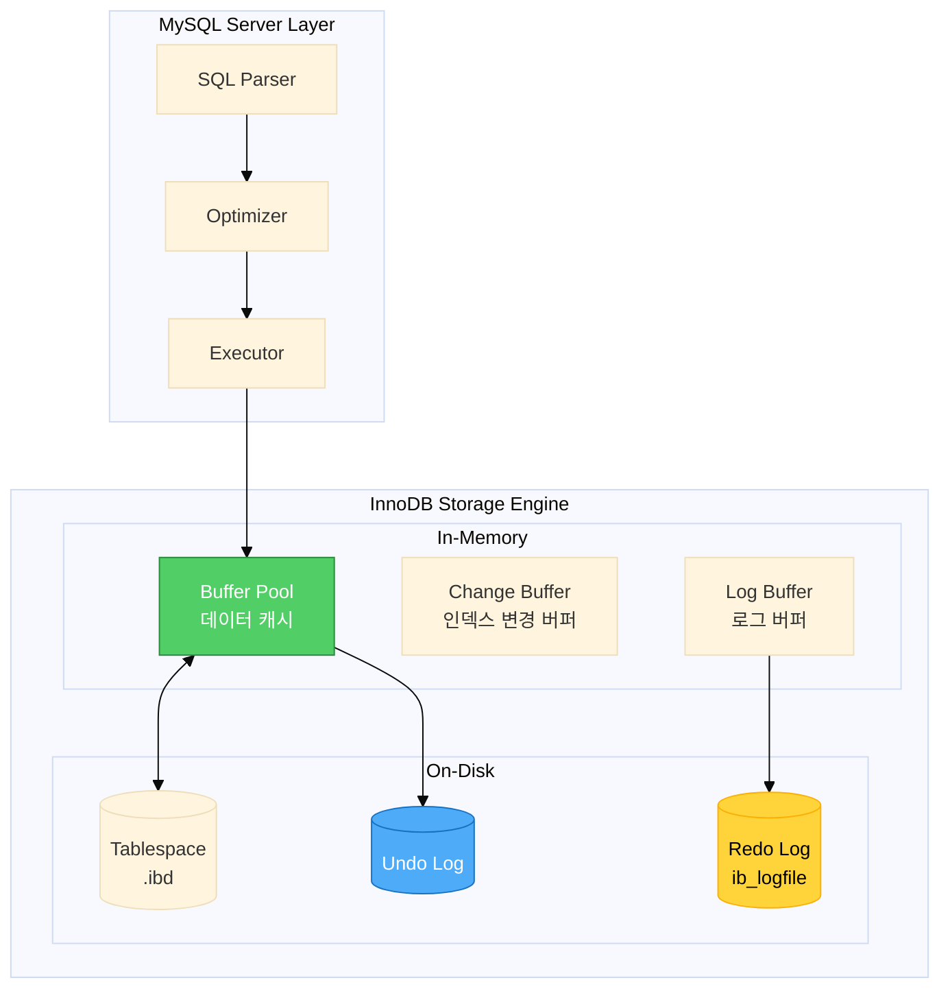
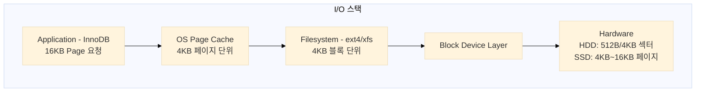
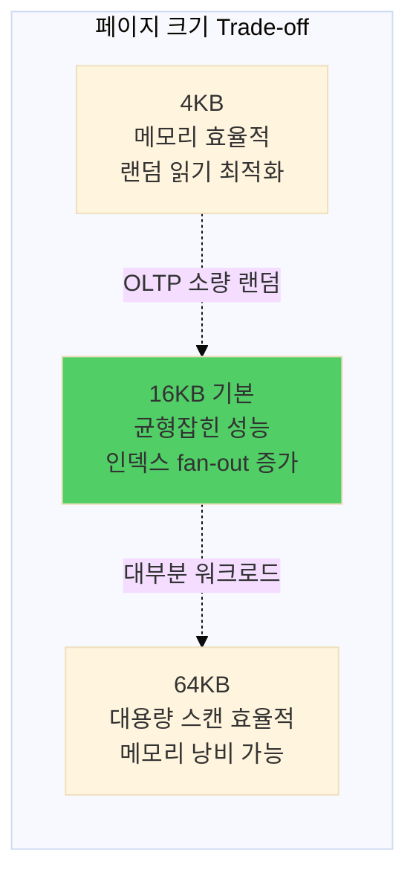
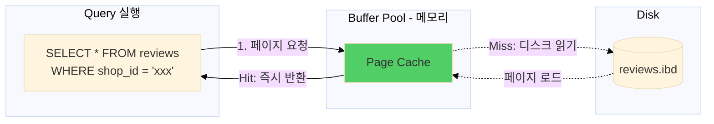
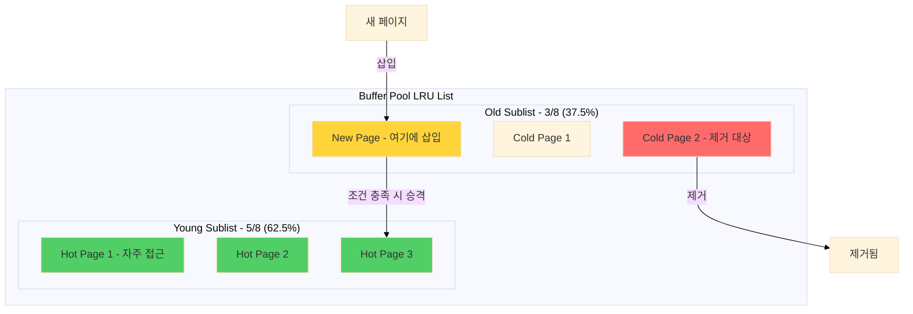
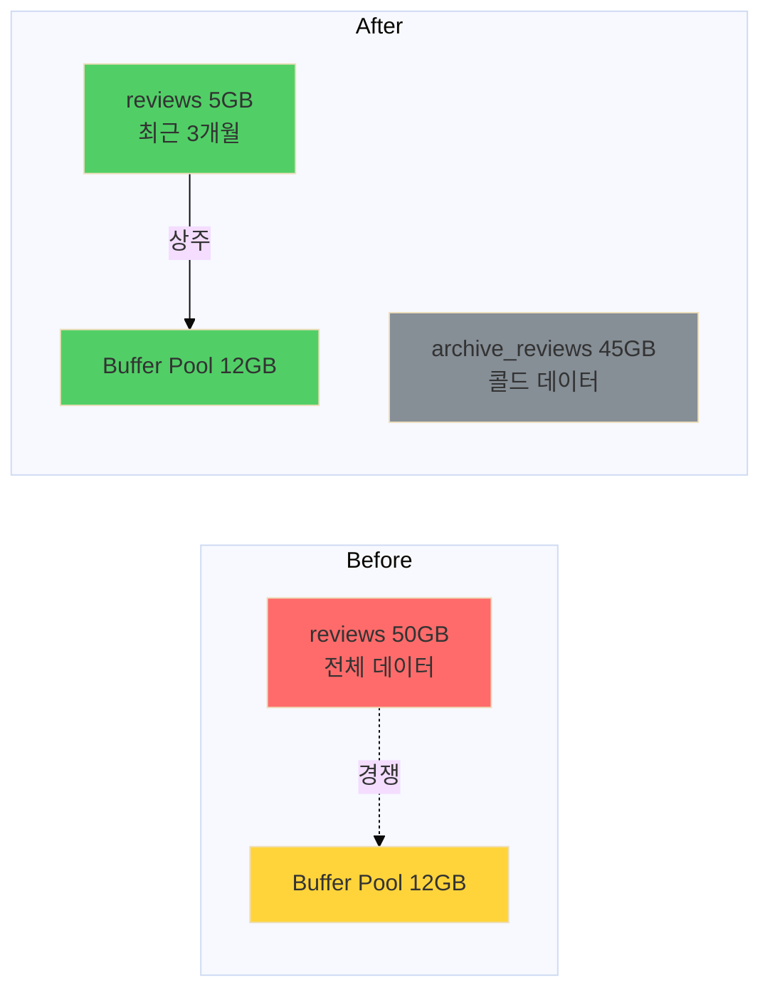
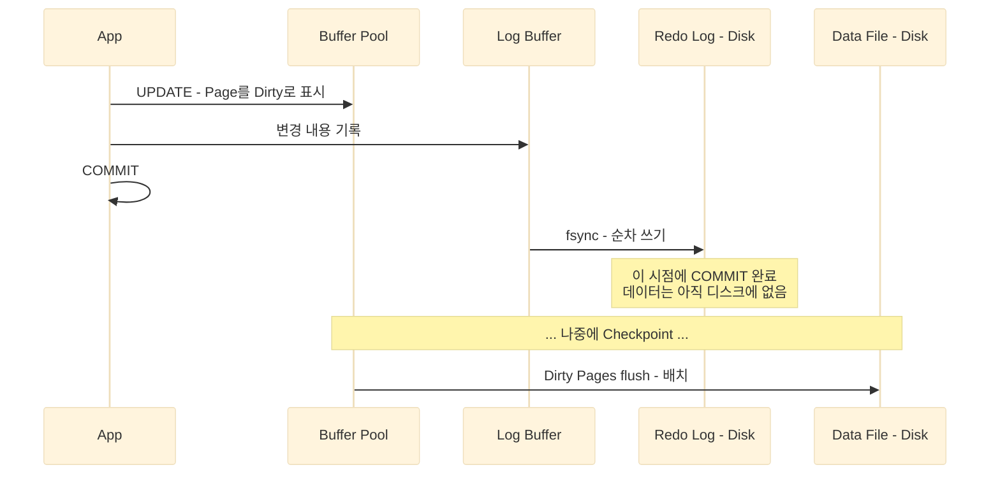
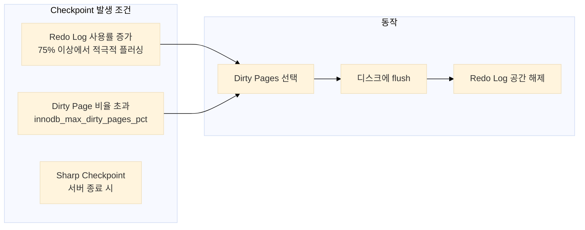
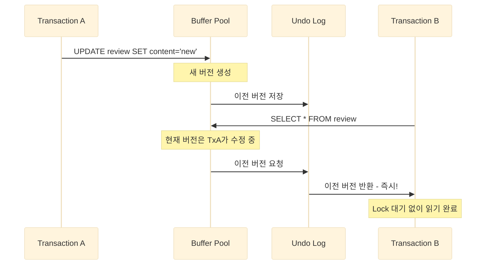
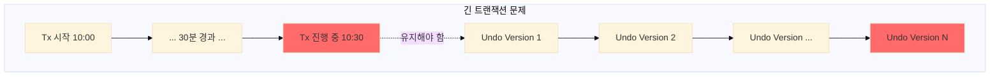

## 목차

## 들어가며: 3초의 미스터리

리뷰 관리 서비스를 운영하던 중이었습니다. 어느 순간부터 리뷰 조회 API 응답이 눈에 띄게 느려지기 시작했습니다.

```log
[WARN] Slow Query: 3,245ms
SELECT * FROM reviews WHERE shop_id = ? ORDER BY created_at DESC LIMIT 20
```

인덱스는 분명히 있었습니다. 쿼리도 단순했습니다. 실행 계획을 확인해봐도 인덱스를 잘 타고 있었죠. 그런데 왜 **3초**나 걸리는 걸까요?

답은 예상치 못한 곳에 있었습니다. 서버 모니터링에서 발견한 숫자:

```
Innodb_buffer_pool_hit_rate: 85%
```

"85%면 괜찮은 거 아닌가?"라고 생각했습니다. 하지만 아니었습니다. 나머지 15%가 **디스크 랜덤 I/O**를 유발하고 있었고, 데이터가 쌓이면서 그 15%의 영향이 점점 커지고 있었던 겁니다.

이 경험을 계기로 InnoDB 엔진의 내부 구조를 파고들기 시작했습니다. "인덱스를 걸면 빨라진다", "정규화를 해야 한다"는 말을 그냥 따르던 것에서, **왜** 그런지 이해하게 된 계기였습니다.

이 글에서는 InnoDB의 핵심 컴포넌트들을 살펴보고, 각각이 테이블 설계에 어떤 영향을 미치는지 공유하겠습니다.

---

## InnoDB 전체 구조

MySQL은 크게 **Server Layer**와 **Storage Engine Layer**로 나뉩니다.



각 컴포넌트의 역할을 이해하면, 왜 특정 설계가 성능에 영향을 주는지 자연스럽게 알게 됩니다.

---

## 1. Page: InnoDB의 기본 단위

본격적으로 Buffer Pool을 이야기하기 전에, **Page** 개념을 먼저 알아야 합니다.

### Page란 무엇인가?

InnoDB의 **Page(페이지)**는 데이터 저장 및 I/O의 기본 단위입니다. 기본 크기는 **16KB**이며, 모든 데이터와 인덱스는 이 페이지 단위로 관리됩니다.

**Page의 핵심 역할:**
- **I/O의 최소 단위**: 디스크에서 읽고 쓰는 최소 단위
- **Buffer Pool 관리 단위**: 메모리 캐싱의 기본 단위
- **B+-tree 노드**: 인덱스의 각 노드가 하나의 페이지

### 왜 1바이트를 읽어도 16KB를 읽을까?

이것은 하드웨어와 OS의 특성 때문입니다.



**하드웨어 계층의 제약:**

| 저장 장치 | 최소 읽기/쓰기 단위 | 특징 |
|----------|-------------------|------|
| HDD (전통) | 512 bytes (섹터) | 물리적 섹터 단위로만 접근 가능 |
| HDD (Advanced Format) | 4KB (섹터) | 최신 HDD의 표준 |
| SSD | 4KB~16KB (페이지) | NAND Flash 특성상 페이지 단위 접근 |
| NVMe SSD | 4KB~16KB | 더 빠르지만 동일한 제약 |

**핵심 인사이트**: 물리적으로 1바이트만 읽는 것은 불가능합니다. 디스크 헤드가 특정 위치로 이동하면(Seek), 최소한 섹터 하나 전체를 읽어야 합니다.

### 왜 16KB인가?

InnoDB가 16KB를 선택한 이유는 여러 Trade-off의 결과입니다:



| 페이지 크기 | 장점 | 단점 | 적합한 워크로드 |
|------------|------|------|----------------|
| **4KB** | 메모리 효율적, 랜덤 읽기 최소화 | 메타데이터 오버헤드, 인덱스 깊이 증가 | OLTP (소량 랜덤) |
| **16KB (기본)** | 균형잡힌 성능, 인덱스 fan-out 증가 | 일부 메모리 낭비 가능 | **대부분의 워크로드** |
| **64KB** | 대용량 스캔 효율적, 인덱스 깊이 감소 | 메모리 낭비, 캐시 오염 | OLAP (대량 순차 스캔) |

**Spatial Locality의 활용**: 같은 페이지 내의 인접한 레코드는 함께 접근될 가능성이 높습니다. 16KB를 한 번에 읽으면, 다음에 필요한 데이터가 이미 메모리에 있을 확률이 높아집니다.

### Page 내부 구조 상세

하나의 16KB 페이지는 위에서 아래로 다음 영역들로 구성됩니다:

| 영역 | 크기 | 역할 |
|------|------|------|
| **FIL Header** | 38 bytes | Checksum, Page Number, Previous/Next Page 포인터, LSN, Page Type |
| **INDEX Header** | 36 bytes | 레코드 수, Heap Top 위치, Page Level (리프=0) |
| **Infimum Record** | 13 bytes | 시스템 레코드 - 모든 키보다 작은 "최소값" |
| **Supremum Record** | 13 bytes | 시스템 레코드 - 모든 키보다 큰 "최대값" |
| **User Records** | 가변 | 실제 데이터. 삽입 순서로 저장되며, 아래 방향으로 성장 |
| **Free Space** | 가변 | 사용 가능한 공간. User Records와 Page Directory 사이 |
| **Page Directory** | 가변 | 4~8개 레코드마다 16비트 포인터. 위 방향으로 성장 |
| **FIL Trailer** | 8 bytes | Checksum (Header와 일치 검증), LSN 하위 32비트 |

> 참고: Jeremy Cole의 [The physical structure of InnoDB index pages](https://blog.jcole.us/2013/01/07/the-physical-structure-of-innodb-index-pages/)에서 더 상세한 구조를 확인할 수 있습니다.

**핵심 포인트:**

1. **Infimum & Supremum**: 모든 레코드는 이 두 시스템 레코드 사이에 연결됩니다. Infimum은 "어떤 레코드보다 작은 값", Supremum은 "어떤 레코드보다 큰 값"을 의미합니다.

2. **Page Directory**: 바이너리 서치를 위한 "희소 인덱스(sparse index)"입니다. 4~8개 레코드마다 하나의 슬롯을 만들어서, O(log n) 검색이 가능합니다.

3. **Two-way Growth**: User Records는 아래로, Page Directory는 위로 성장하여 중간의 Free Space에서 만납니다.

4. **Linked List**: 레코드는 물리적 순서와 무관하게 "next record" 포인터로 논리적 순서(키 순서)를 유지합니다.

### Record란 무엇인가?

**Record(레코드)**는 테이블의 한 **행(Row)**을 의미합니다. 하지만 실제 저장 형식은 우리가 생각하는 것보다 복잡합니다.

| 영역 | 크기 | 구성 요소 |
|------|------|----------|
| **Record Header** | 5 bytes | info bits (삭제 마크), n_owned (Page Directory용), heap number, record type, next record offset |
| **Hidden Columns** | 13~19 bytes | DB_TRX_ID (6B, 트랜잭션 ID), DB_ROLL_PTR (7B, Undo 포인터), DB_ROW_ID (6B, PK 없을 때만) |
| **User Columns** | 가변 | 실제 컬럼 데이터 (Column 1, Column 2, ...) |

**실제 계산 예시:**

**reviews 테이블 레코드 크기 계산 (VARCHAR(36) UUID PK 기준):**

| 구성 요소 | 크기 | 설명 |
|----------|------|------|
| Record Header | 5 bytes | 시스템 헤더 |
| DB_TRX_ID | 6 bytes | 트랜잭션 ID |
| DB_ROLL_PTR | 7 bytes | Undo 포인터 |
| UUID PK | 36 bytes | VARCHAR(36) |
| shop_id | 36 bytes | VARCHAR(36) |
| content | ~200 bytes | 리뷰 내용 (평균) |
| rating | 1 byte | TINYINT |
| created_at | 8 bytes | DATETIME |
| 기타 | ~50 bytes | 나머지 컬럼 |
| **합계** | **350~500 bytes** | |

- **한 페이지당 레코드 수**: 16,384 ÷ 500 ≈ **30~45개**

**BINARY(16) UUID로 최적화 시:**

| 변경 사항 | 결과 |
|----------|------|
| UUID 크기 | 36 → 16 bytes (-20 bytes) |
| 레코드 크기 | 약 300~400 bytes |
| 한 페이지당 레코드 수 | ~50개 |
| **I/O 감소** | **약 30%** |

---

## 2. Buffer Pool: InnoDB의 심장

### Buffer Pool이란?

Buffer Pool은 **페이지들을 메모리에 캐싱**하는 영역입니다. InnoDB에서 가장 중요한 메모리 구조입니다.



### 같은 쿼리를 두 번 실행하면 왜 빨라지는가?

이것이 Buffer Pool의 핵심 가치입니다.

**첫 번째 실행 (Cold Start):**

```sql
SELECT * FROM reviews WHERE shop_id = 123
```

| 단계 | 상태 | 소요 시간 |
|------|------|----------|
| Buffer Pool 확인 | **Miss** (페이지가 메모리에 없음) | - |
| B+-tree Root Page 읽기 | 디스크 I/O | ~0.1ms |
| B+-tree Internal Page 읽기 | 디스크 I/O | ~0.1ms |
| B+-tree Leaf Pages (10개) | 디스크 I/O | ~1ms |
| **Total** | | **~2-5ms** |

**두 번째 실행 (Warm Buffer Pool):**

```sql
SELECT * FROM reviews WHERE shop_id = 123  -- 동일 쿼리
```

| 단계 | 상태 | 소요 시간 |
|------|------|----------|
| Root Page 확인 | **Hit** (메모리에 있음) | ~0.001ms |
| Internal Page 확인 | **Hit** | ~0.001ms |
| Leaf Pages (10개) 확인 | **Hit** | ~0.01ms |
| **Total** | | **~0.1ms** (20~50배 빠름!) |

**성능 차이 요약:**

| 시나리오 | Buffer Pool Hit Rate | 평균 응답 시간 | 디스크 IOPS |
|---------|---------------------|---------------|------------|
| Cold Start | 0% | 50~150ms | 2000+ |
| Warming Up | 50% | 10~25ms | 500 |
| Hot | 99% | 0.5~2ms | 20 |
| Hot (99.9%) | 99.9% | 0.1~0.5ms | 5 |

> **권장 목표**: Buffer Pool Hit Rate **99% 이상**
>
> 하지만 주의: Hit Rate만으로는 부족합니다. Full Table Scan을 하면서도 99% Hit Rate를 기록할 수 있습니다. **Response Time**을 함께 모니터링해야 합니다.

### Query Cache vs Buffer Pool (중요!)

MySQL 8.0 이전 사용자들은 "Query Cache"와 혼동할 수 있습니다.

| 측면 | Query Cache (MySQL 5.7까지) | Buffer Pool |
|------|----------------------------|-------------|
| **캐시 단위** | 쿼리 결과 전체 (Result Set) | 페이지 (16KB) |
| **캐시 키** | SQL 문자열 (정확히 일치해야 함) | (space_id, page_no) |
| **재사용성** | 낮음 (쿼리가 조금만 달라도 Miss) | 높음 (페이지는 여러 쿼리가 공유) |
| **무효화** | 테이블 변경 시 전체 무효화 | 페이지 단위 관리 |
| **확장성** | 낮음 (글로벌 뮤텍스 경합) | 높음 (Instance로 분산) |

```sql
-- Query Cache에서는 이 두 쿼리가 별개로 캐싱됨
SELECT * FROM users WHERE id = 1;
SELECT * FROM users WHERE id = 2;

-- Buffer Pool에서는 같은 페이지를 공유 가능!
-- id=1과 id=2가 같은 페이지에 있다면, 두 번째 쿼리는 디스크 I/O 없이 실행
```

**Query Cache가 MySQL 8.0에서 제거된 이유:**
1. **글로벌 락 경합**: 멀티코어 환경에서 병목
2. **무효화 오버헤드**: 테이블 변경 시 관련 모든 캐시 삭제
3. **낮은 재사용성**: 실무에서 Cache Hit이 낮음
4. **대안의 우수성**: Application-level caching (Redis)이 더 효율적

### LRU 알고리즘: 왜 "개선된" LRU가 필요했나?

Buffer Pool이 가득 차면 어떤 페이지를 버릴지 결정해야 합니다. 가장 직관적인 방법은 **LRU (Least Recently Used)** 알고리즘입니다.

**기본 LRU 알고리즘:**

| 위치 | 페이지 | 상태 |
|------|--------|------|
| **Head** | Page A | 방금 접근됨 |
| | Page B | |
| | Page C | |
| | Page D | |
| **Tail** | Page Z | 오래전 접근 → 제거 대상 |

**동작 규칙:**
1. 페이지 접근 시 → 리스트 맨 앞(Head)으로 이동
2. 새 페이지 삽입 → 리스트 맨 앞에 추가
3. 공간 부족 시 → 리스트 맨 뒤(Tail) 제거

**문제: Full Table Scan이 Buffer Pool을 오염시킨다**

```sql
-- 분석용 대량 스캔 쿼리
SELECT AVG(rating), COUNT(*)
FROM reviews
WHERE created_at BETWEEN '2023-01-01' AND '2025-12-31';
```

이 쿼리가 수백만 페이지를 한 번 훑습니다:

| 시점 | Head | ... | Tail | 문제 |
|------|------|-----|------|------|
| **Before Scan** | Hot Page 1 (자주 사용) | Hot Page 2, 3, ... | Cold Page Z | 정상 |
| **During Scan** | Scan Page 999,999 (방금 읽음) | Scan Page 999,998, ... | Hot Page 1 | Hot Page가 Tail로 밀림 |
| **After Scan** | Scan Pages로 가득 참 | | Hot Pages 제거됨 | **성능 급락** |

**결과:**
- Buffer Pool이 Full Scan 페이지로 가득 참
- 자주 사용하는 Hot Pages가 모두 제거됨
- 이후 OLTP 쿼리들이 모두 디스크 I/O 발생

이 문제는 실제로 **MySQL Bug #45015** (2009년)로 보고되었습니다:

> "InnoDB buffer pool can be severely affected by table scans"

### InnoDB의 개선된 LRU: Midpoint Insertion Strategy

이 문제를 해결하기 위해 MySQL 5.1.41 (2009년 11월)에 **Midpoint Insertion Strategy**가 도입되었습니다.



**동작 메커니즘:**

1. **새 페이지 삽입**: Old Sublist의 Head (Midpoint)에 삽입
   - 아직 "Hot"으로 인정받지 못함

2. **시간 기반 승격 (핵심!)**:
   ```
   if (현재시각 - 페이지.첫접근시각) > innodb_old_blocks_time(기본 1000ms)
      AND 페이지가 다시 접근됨:
       → Young Sublist의 Head로 이동 (승격)
   ```

3. **제거**: Old Sublist의 Tail에서 제거
   - Full Scan으로 한 번만 읽힌 페이지는 1초 내에 제거됨

**Full Table Scan 시나리오 (개선된 LRU):**

| 시점 | Young Sublist (5/8) | Old Sublist (3/8) | 상태 |
|------|---------------------|-------------------|------|
| **Before Scan** | Hot Page 1, 2, 3, ... | 일부 Cold Pages | 정상 |
| **During Scan** | Hot Pages **유지** (보호됨) | Scan Pages 쌓임 | Young 보호 |
| **After Scan (1초 후)** | Hot Pages **유지** | Scan Pages 빠르게 제거됨 | 정상 복구 |

**결과:** Hot Pages는 Young Sublist에서 보호되고, Scan Pages는 Old에서 1초 내에 제거되어 OLTP 쿼리 성능이 유지됩니다.

**관련 MySQL 소스 코드** (`storage/innobase/buf/buf0lru.cc`):

```c
// 핵심 함수들
buf_LRU_make_block_young()    // 페이지를 Young으로 승격
buf_LRU_make_block_old()      // 새 페이지를 Old에 삽입
buf_page_peek_if_too_old()    // 승격 조건 검사 (시간 체크)
buf_LRU_get_free_block()      // LRU Tail에서 제거할 페이지 선택
```

### 실무 설정

```ini
# my.cnf

# Buffer Pool 크기 (전체 메모리의 70-80%)
innodb_buffer_pool_size = 12G

# Buffer Pool Instance 수 (락 경합 감소, 1GB당 1개 권장)
innodb_buffer_pool_instances = 8

# Old Sublist 비율 (기본: 37 = 3/8 ≈ 37.5%)
innodb_old_blocks_pct = 37

# 승격 대기 시간 (기본: 1000ms = 1초)
innodb_old_blocks_time = 1000

# 재시작 후 캐시 복구 (Buffer Pool Warming)
innodb_buffer_pool_dump_at_shutdown = ON
innodb_buffer_pool_load_at_startup = ON
```

### 실제 운영 사례: Working Set 최적화

> **핵심 원칙**: "테이블 전체가 아니라, 자주 접근하는 데이터(Working Set)가 Buffer Pool에 들어가야 한다"



**결과:**

| 지표 | Before | After | 개선 |
|------|--------|-------|------|
| Buffer Pool Hit Rate | 85% | 99.2% | +14.2%p |
| 리뷰 조회 P99 | 3,245ms | 45ms | **72배** |
| 디스크 IOPS | 2,500 | 150 | **94% 감소** |

### Buffer Pool 모니터링

```sql
-- Buffer Pool 상태 확인
SHOW GLOBAL STATUS LIKE 'Innodb_buffer_pool%';

-- 핵심 지표
Innodb_buffer_pool_read_requests: 100,000,000  -- 논리적 읽기 요청
Innodb_buffer_pool_reads: 800,000              -- 실제 디스크 읽기

-- Hit Rate 계산
-- Hit Rate = 1 - (reads / read_requests)
--          = 1 - (800,000 / 100,000,000)
--          = 99.2%

-- 더 상세한 모니터링
SELECT
  FORMAT(A.pages_dirty, 0) AS dirty_pages,
  FORMAT(B.pages_total, 0) AS total_pages,
  ROUND(A.pages_dirty / B.pages_total * 100, 2) AS dirty_pct
FROM
  (SELECT VARIABLE_VALUE AS pages_dirty
   FROM performance_schema.global_status
   WHERE VARIABLE_NAME = 'Innodb_buffer_pool_pages_dirty') A,
  (SELECT VARIABLE_VALUE AS pages_total
   FROM performance_schema.global_status
   WHERE VARIABLE_NAME = 'Innodb_buffer_pool_pages_total') B;
```

---

## 3. Dirty Page와 Checkpoint

### Dirty Page란?

Buffer Pool의 페이지는 두 가지 상태를 가집니다:

| 상태 | 조건 | 특징 |
|------|------|------|
| **Clean Page** | 메모리 버전 = 디스크 버전 | 언제든지 제거 가능 (oldest_modification = 0) |
| **Dirty Page** | 메모리 버전 ≠ 디스크 버전 | 아직 디스크에 쓰지 않은 변경사항이 있음. 디스크에 flush 전까지 제거 불가 (oldest_modification > 0) |

**페이지가 Dirty가 되는 시점:**

```sql
BEGIN;
SELECT * FROM users WHERE id = 123 FOR UPDATE;  -- 페이지 읽기 (Clean 상태)
UPDATE users SET name = 'John' WHERE id = 123;  -- 이 순간 Dirty로 전환!
COMMIT;
```

| 단계 | SQL | 페이지 상태 | 동작 |
|------|-----|-------------|------|
| 1 | `BEGIN` | - | 트랜잭션 시작 |
| 2 | `SELECT ... FOR UPDATE` | **Clean** | 페이지를 Buffer Pool로 로드 |
| 3 | `UPDATE` | **Dirty** | Buffer Pool에서만 수정. Redo Log에 변경 기록 |
| 4 | `COMMIT` | **Dirty (유지)** | Redo Log fsync로 내구성 보장. 페이지는 나중에 Checkpoint에서 flush |

**MySQL 소스 코드에서 Dirty Page 추적** (`buf_page_t` 구조체):

```c
class buf_page_t {
  // Dirty 상태 추적
  lsn_t oldest_modification;  // 0이면 Clean, >0이면 Dirty
  lsn_t newest_modification;  // 가장 최근 수정 LSN

  // ...
};
```

### 왜 Dirty Page를 바로 디스크에 안 쓰는가?

**1. Write Amplification 감소:**

시나리오: 같은 페이지를 3번 수정

| 방식 | 동작 | 디스크 쓰기 횟수 | 총 쓰기량 |
|------|------|-----------------|----------|
| **즉시 쓰기** | UPDATE → 디스크 (x3) | 3번 | 48KB |
| **Buffer Pool** | UPDATE → 메모리 (x3) → Checkpoint → 디스크 | **1번** | **16KB** (67% 감소) |

**2. Random I/O → Sequential I/O 변환:**

| 방식 | 트랜잭션 순서대로 쓰기 | Checkpoint에서 배치 쓰기 |
|------|----------------------|------------------------|
| **패턴** | Page X(위치A) → Page Y(위치Z) → Page Z(위치B) | Dirty Pages 모아서 정렬 후 쓰기 |
| **디스크 동작** | 매번 헤드 이동 (Random I/O) | 정렬된 순서로 쓰기 (효율적) |
| **HDD 성능** | ~100 IOPS | 100 MB/s 수준 |

---

## 4. Redo Log: 트랜잭션 내구성의 비밀

### 왜 Redo Log가 필요한가?

트랜잭션이 COMMIT되면, 데이터는 "영구적으로 저장"되어야 합니다. 하지만 Dirty Page를 매번 디스크에 쓰면 **랜덤 I/O**가 발생합니다.

InnoDB의 해결책: **WAL (Write-Ahead Logging)** - 먼저 로그에 쓰고, 나중에 데이터를 쓴다



### 왜 순차 I/O가 빠른가?


| I/O 패턴 | HDD | SSD |
|----------|-----|-----|
| 랜덤 I/O | ~100 IOPS | ~10,000 IOPS |
| 순차 I/O | ~100 MB/s | ~500 MB/s |

**Redo Log의 마법:**
- Buffer Pool의 Dirty 페이지를 바로 디스크에 쓰면 → **랜덤 I/O**
- Redo Log는 append-only 구조 → **순차 I/O**
- 나중에 Checkpoint에서 Dirty 페이지를 모아서 쓰기 → **배치 처리**

### Checkpoint: Dirty Page Flush

Checkpoint는 Dirty Page를 디스크에 쓰는 과정입니다.



**Adaptive Flushing (MySQL 5.6+):**

MySQL은 Redo Log 생성 속도를 모니터링하고, flush 속도를 자동으로 조절합니다:

| Redo Log 상태 | Flush 속도 | 목적 |
|---------------|-----------|------|
| 빠르게 쌓임 | 증가 | Redo Log 공간 확보 |
| 느리게 쌓임 | 감소 | 불필요한 I/O 방지 |

**목표**: Sharp Checkpoint 방지 (급격한 성능 저하 방지)

### innodb_flush_log_at_trx_commit: 내구성 vs 성능

COMMIT 시 Redo Log를 언제 디스크에 쓸지 결정합니다:

| 값 | 동작 | 내구성 | 성능 | 위험 시나리오 |
|----|------|-------|------|---------------|
| **1 (기본)** | 매 COMMIT마다 fsync | 최고 | 느림 | 없음 (ACID 완전 보장) |
| **2** | OS 버퍼까지만 write | 중간 | 중간 | OS/서버 장애 시 최대 1초 손실 |
| **0** | 1초마다 fsync | 낮음 | 빠름 | MySQL 장애 시에도 최대 1초 손실 |

**우리 서비스의 설정:**

```ini
# 리뷰 데이터는 중요하지만, 1초 손실은 허용 가능
# (외부 플랫폼에서 다시 수집 가능한 데이터)
innodb_flush_log_at_trx_commit = 2
```

왜 1이 아닌 2를 선택했는가?
- 리뷰 원본은 외부 플랫폼에 있음 (재수집 가능)
- OS 장애 시 최대 1초 데이터 손실 감수 (MySQL만 종료 시에는 안전)
- INSERT TPS 30% 향상

> **주의**: 값 2는 MySQL 프로세스만 비정상 종료되면 안전합니다 (OS가 버퍼를 flush). 하지만 OS나 서버 자체가 장애나면 데이터 손실 가능합니다.

---

## 5. Undo Log: MVCC와 일관된 읽기

### 읽기 잠금 없는 SELECT

**MVCC (Multi-Version Concurrency Control)**는 읽기 작업이 쓰기 작업을 블로킹하지 않도록 하는 메커니즘입니다.



**Without MVCC (Lock-based):**
- Transaction B는 Transaction A가 COMMIT할 때까지 대기
- 동시성 저하

**With MVCC (InnoDB):**
- Transaction B는 Undo Log에서 이전 버전을 읽음
- 락 대기 없이 즉시 반환
- 높은 동시성

### 긴 트랜잭션의 위험성

Undo Log는 **트랜잭션이 종료될 때까지 유지**됩니다.



**문제:**
- Undo Log 계속 증가 → 디스크 공간 부족
- 다른 트랜잭션이 긴 Undo 체인 탐색 → 읽기 성능 저하
- 최악의 경우 디스크 풀

**적용한 해결책:**

```typescript
// Bad: 긴 트랜잭션
async processAllReviews() {
  await this.dataSource.transaction(async (manager) => {
    for (const review of allReviews) {  // 수만 건
      await this.process(review, manager);
    }
    // 여기서 COMMIT - 수만 건 처리 후
  });
}

// Good: 배치 분할
async processAllReviews() {
  for (const batch of chunk(allReviews, 100)) {
    await this.dataSource.transaction(async (manager) => {
      for (const review of batch) {
        await this.process(review, manager);
      }
      // 100건마다 COMMIT - Undo 빠르게 정리
    });
  }
}
```

---

## 6. 설계 원칙 정리

InnoDB 아키텍처를 이해하면, 다음 설계 원칙들이 "왜" 필요한지 알게 됩니다:

| InnoDB 특성 | 원인 | 설계 원칙 | 실무 적용 |
|-------------|------|----------|---------------|
| 16KB Page | I/O 최소 단위 | 레코드 크기 최소화 | VARCHAR(36) → BINARY(16) 검토 |
| Buffer Pool | 메모리 캐시 | Working Set을 Buffer Pool에 | 오래된 데이터 Archive |
| LRU Young/Old | Full Scan 보호 | 분석 쿼리 분리 | Read Replica 사용 |
| Redo Log | 순차 쓰기 | COMMIT 비용 인식 | 배치 INSERT |
| Undo Log | MVCC | 짧은 트랜잭션 | 100건 단위 배치 |

---

## 마치며

처음에 던졌던 질문으로 돌아가봅시다.

> "왜 Buffer Pool Hit Rate가 85%인데 3초나 걸렸을까?"

이제 답할 수 있습니다:
- 15%의 Miss가 **디스크 랜덤 I/O**를 유발
- 50GB 테이블이 12GB Buffer Pool을 경쟁
- Hot 데이터가 자주 밀려나는 상황

이 원리들을 이해하고 적용한 결과:
- Buffer Pool Hit Rate: **85% → 99.2%**
- 리뷰 조회 P99: **3,245ms → 45ms**
- 디스크 IOPS: **2,500 → 150**

다음 글에서는 이 지식을 바탕으로 **B+-tree 인덱스 구조**를 파고들겠습니다. 왜 복합 인덱스의 컬럼 순서가 중요한지, 왜 UUID PK가 INSERT 성능에 영향을 주는지 "Page 분할" 관점에서 설명하겠습니다.

---

## 참고자료

### MySQL 공식 문서
- [MySQL 8.0 Reference Manual - InnoDB Architecture](https://dev.mysql.com/doc/refman/8.0/en/innodb-architecture.html)
- [MySQL 8.0 Reference Manual - Buffer Pool](https://dev.mysql.com/doc/refman/8.0/en/innodb-buffer-pool.html)
- [MySQL 8.0 Reference Manual - InnoDB On-Disk Structures](https://dev.mysql.com/doc/refman/8.0/en/innodb-on-disk-structures.html)
- [MySQL 8.0 Reference Manual - Making the Buffer Pool Scan Resistant](https://dev.mysql.com/doc/refman/8.0/en/innodb-performance-midpoint_insertion.html)

### 기술 블로그
- [The physical structure of InnoDB index pages - Jeremy Cole](https://blog.jcole.us/2013/01/07/the-physical-structure-of-innodb-index-pages/)
- [An In-Depth Analysis of Buffer Pool in InnoDB - Alibaba Cloud](https://www.alibabacloud.com/blog/an-in-depth-analysis-of-buffer-pool-in-innodb_601216)

### Percona 블로그
- [InnoDB Flushing in Action for Percona Server](https://www.percona.com/blog/innodb-flushing-in-action-for-percona-server-for-mysql/)
- [What MySQL buffer cache hit rate should you target](https://www.percona.com/blog/what-mysql-buffer-cache-hit-rate-should-you-target/)

### MySQL Bug Reports
- [MySQL Bug #45015: InnoDB buffer pool affected by table scans](https://bugs.mysql.com/bug.php?id=45015)
