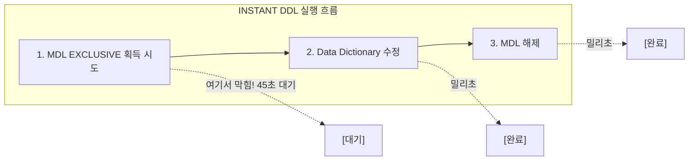
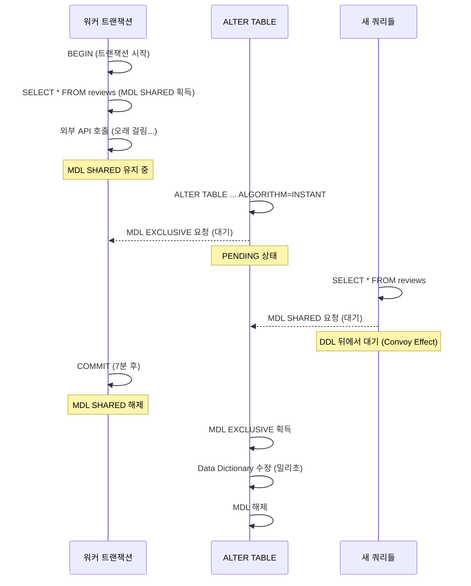
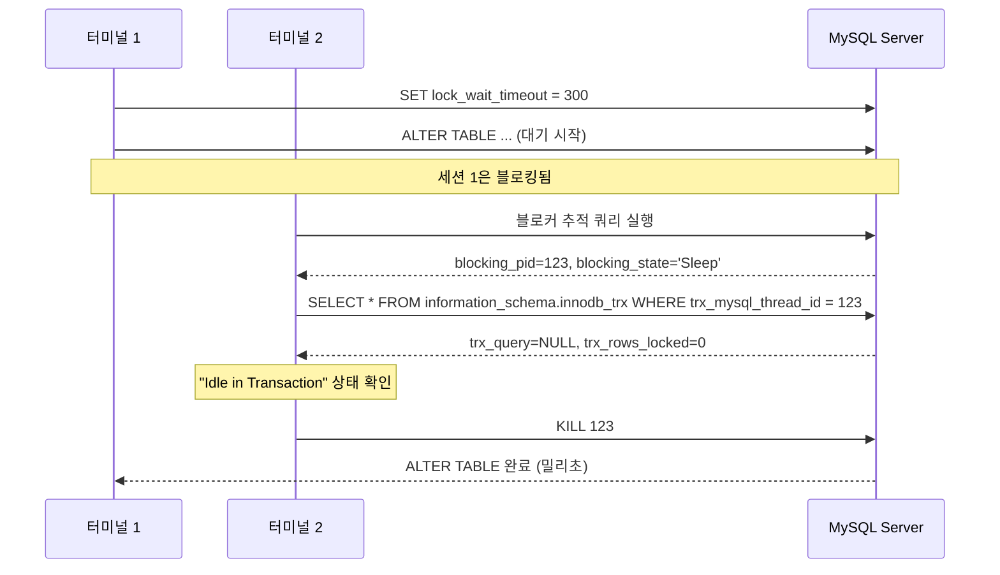
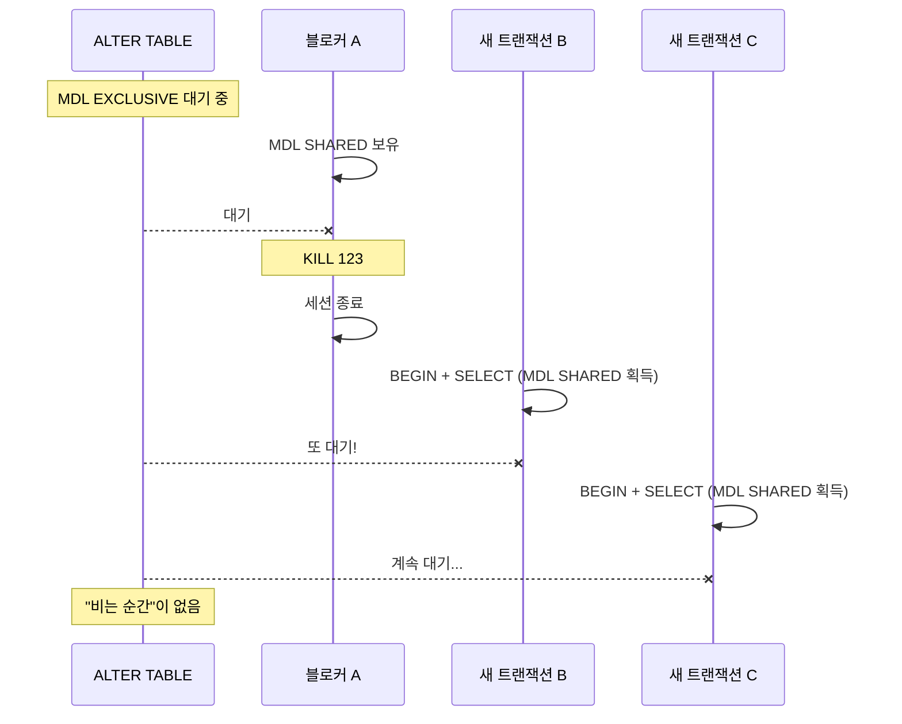

## Table of Contents

## Executive Summary

> **환경 정보**: Aurora MySQL 3.x (MySQL 8.0.39 호환), InnoDB, ROW_FORMAT=Dynamic
>
> **운영 제약**: 24/7 트래픽, 정기 유지보수 윈도우 없음, 피크 타임 DDL 금지 정책

"INSTANT DDL은 밀리초 만에 끝난다"는 말을 믿고 `ALGORITHM=INSTANT`로 ALTER TABLE을 실행했다. 45초 후 `Lock wait timeout exceeded` 에러가 떴다.

**처음 든 생각**: "INSTANT인데 왜 45초나 걸리지? 문서가 틀린 건가?"

**진짜 원인**: INSTANT DDL이 느린 게 아니었다. **DDL이 시작조차 못하고 MDL(Metadata Lock) 획득에서 막히고 있었다.**

**결과**: 블로커 세션(Idle in Transaction) 2개 KILL 후 **50ms 만에 DDL 완료**. INSTANT DDL의 진짜 실력은 MDL만 획득하면 나온다.

이 글에서 다루는 내용:
- INSTANT DDL도 MDL EXCLUSIVE가 필요하다는 사실
- **2-세션 진단 방법**: 왜 단일 세션으로는 블로커를 찾을 수 없는가
- **Idle in Transaction**: `trx_query=NULL`인데 왜 블로커인가
- **안전한 KILL 판단 기준**: 언제 세션을 죽여도 되는가
- 재발 방지 체크리스트

> **이론이 궁금하다면**: MDL의 내부 구조, Data Dictionary 아키텍처, Convoy Effect 등 깊은 이론은 ["운영 중 ALTER TABLE 한 줄이 서비스를 마비시킨 이유"](/posts/aurora-mysql-metadata-lock-deep-dive)에서 다룹니다.

---

## 1. 상황 재현: "INSTANT인데 왜 45초나 걸리지?"

### 1.1 시나리오

평화로운 오후, `reviews` 테이블에 컬럼을 추가하려고 했다.

```sql
-- 세션 타임아웃을 짧게 설정 (빠른 실패를 위해)
SET SESSION lock_wait_timeout = 45;

-- INSTANT DDL 실행
ALTER TABLE reviews
ADD COLUMN platform_order_id VARCHAR(50) NULL,
ALGORITHM=INSTANT;
```

45초 후:

```
ERROR 1205 (HY000): Lock wait timeout exceeded; try restarting transaction
```

### 1.2 처음의 잘못된 가설

"INSTANT DDL은 테이블 크기와 무관하게 밀리초 만에 끝난다"는 걸 알고 있었다. 그래서 처음엔 이렇게 생각했다:

- "테이블이 너무 커서 INSTANT가 안 되는 건가?"
- "MySQL 버전이 낮아서 INSTANT 지원이 안 되는 건가?"
- "INSTANT가 아니라 INPLACE로 fallback 된 건가?"

모두 틀렸다. **문제는 DDL 실행 속도가 아니라 DDL 시작 전 MDL 획득 단계**에 있었다.

---

## 2. 핵심 인사이트: INSTANT DDL도 MDL이 필요하다

### 2.1 INSTANT DDL의 실제 실행 과정



INSTANT DDL이 빠른 이유는 2번 단계(Data Dictionary 수정)가 밀리초 만에 끝나기 때문이다. 하지만 **1번 단계(MDL 획득)는 여전히 필요**하고, 여기서 막히면 INSTANT든 INPLACE든 상관없이 대기한다.

### 2.2 MDL 획득이 막히는 이유



핵심:
1. 누군가가 해당 테이블에 대해 **트랜잭션을 열고 커밋하지 않으면** MDL SHARED가 유지된다
2. ALTER TABLE은 MDL EXCLUSIVE가 필요하고, 이는 **모든 기존 MDL이 해제될 때까지 대기**한다
3. EXCLUSIVE가 대기 중이면 그 뒤의 **모든 요청(SELECT 포함)도 큐에서 대기**한다 (Convoy Effect)

---

## 3. 2-세션 진단 방법론

### 3.1 왜 단일 세션으로는 안 되는가

처음에 이렇게 시도했다:

```sql
-- ALTER TABLE을 실행한 같은 세션에서
SELECT * FROM performance_schema.metadata_locks
WHERE OBJECT_NAME = 'reviews';
```

결과: **빈 결과** 또는 **자기 자신만 보임**

왜? ALTER TABLE이 대기 중이면 **그 세션은 블로킹된 상태**라서 다른 쿼리를 실행할 수 없다. MySQL 클라이언트는 ALTER TABLE 결과를 기다리고 있다.

### 3.2 2-세션 진단 방법

> **사전 확인**: `metadata_locks` 테이블이 비활성화된 환경에서는 빈 결과가 나올 수 있다. 아래 쿼리로 활성화 여부를 확인하고, 필요 시 활성화한다.
> ```sql
> -- 활성화 여부 확인
> SELECT * FROM performance_schema.setup_instruments
> WHERE NAME = 'wait/lock/metadata/sql/mdl';
>
> -- 비활성화 상태라면 활성화 (SUPER 권한 필요)
> UPDATE performance_schema.setup_instruments
> SET ENABLED = 'YES', TIMED = 'YES'
> WHERE NAME = 'wait/lock/metadata/sql/mdl';
> ```
> **참고**: `performance_schema` 자체가 OFF인 환경(`performance_schema=OFF`)에서는 위 방법이 동작하지 않는다. 이 경우 `my.cnf`에서 `performance_schema=ON` 설정 후 재시작이 필요하다.

**세션 1** (터미널 1):
```sql
-- ALTER TABLE 실행 (대기 상태로 유지됨)
SET SESSION lock_wait_timeout = 300;  -- 5분으로 늘려서 진단 시간 확보
ALTER TABLE reviews ADD COLUMN test_col VARCHAR(50) NULL, ALGORITHM=INSTANT;
```

**세션 2** (터미널 2):
```sql
-- 블로커 추적 쿼리 실행
SELECT
    waiting.LOCK_TYPE AS waiting_lock,
    waiting_thd.PROCESSLIST_ID AS waiting_pid,
    waiting_thd.PROCESSLIST_TIME AS waiting_sec,
    blocking.LOCK_TYPE AS blocking_lock,
    blocking_thd.PROCESSLIST_ID AS blocking_pid,
    blocking_thd.PROCESSLIST_TIME AS blocking_sec,
    blocking_thd.PROCESSLIST_STATE AS blocking_state
FROM performance_schema.metadata_locks waiting
JOIN performance_schema.metadata_locks blocking
    ON waiting.OBJECT_SCHEMA = blocking.OBJECT_SCHEMA
    AND waiting.OBJECT_NAME = blocking.OBJECT_NAME
    AND waiting.LOCK_STATUS = 'PENDING'
    AND blocking.LOCK_STATUS = 'GRANTED'
JOIN performance_schema.threads waiting_thd
    ON waiting.OWNER_THREAD_ID = waiting_thd.THREAD_ID
JOIN performance_schema.threads blocking_thd
    ON blocking.OWNER_THREAD_ID = blocking_thd.THREAD_ID
WHERE waiting.OBJECT_TYPE = 'TABLE'
  AND waiting.OBJECT_SCHEMA = DATABASE()  -- 현재 DB로 한정 (동명 테이블 오탐 방지)
  AND waiting.OBJECT_NAME = 'reviews';
```

결과:
```
+---------------+-------------+------------+---------------+-------------+-------------+----------------+
| waiting_lock  | waiting_pid | waiting_sec| blocking_lock | blocking_pid| blocking_sec| blocking_state |
+---------------+-------------+------------+---------------+-------------+-------------+----------------+
| EXCLUSIVE     | 999         | 45         | SHARED_READ   | 123         | 420         | Sleep          |
+---------------+-------------+------------+---------------+-------------+-------------+----------------+
```

해석: **PID 123이 7분(420초) 동안 SHARED_READ를 잡고 Sleep 상태**. ALTER TABLE(PID 999)이 45초째 대기 중.

### 3.3 2-세션 진단 흐름 요약



---

## 4. "Idle in Transaction" - 진짜 범인 찾기

### 4.1 블로커 세션 상세 분석

블로커 PID를 찾았으면, 해당 트랜잭션의 상태를 확인한다:

```sql
SELECT
    trx_id,
    trx_state,
    trx_started,
    TIMESTAMPDIFF(SECOND, trx_started, NOW()) AS duration_sec,
    trx_mysql_thread_id,
    trx_query,
    trx_rows_locked,
    trx_rows_modified
FROM information_schema.innodb_trx
WHERE trx_mysql_thread_id = 123\G
```

결과:
```
         trx_id: 12345678
      trx_state: RUNNING
    trx_started: 2026-01-23 14:30:00
   duration_sec: 420
trx_mysql_thread_id: 123
      trx_query: NULL           ← 현재 실행 중인 쿼리 없음
trx_rows_locked: 0              ← Row Lock도 없음
trx_rows_modified: 0            ← 변경한 행도 없음
```

### 4.2 "아무것도 안 하는 것 같은데 왜 블로커인가?"

처음엔 혼란스러웠다:
- `trx_query = NULL`: 현재 실행 중인 쿼리가 없다
- `trx_rows_locked = 0`: Row Lock을 잡고 있지 않다
- `trx_rows_modified = 0`: 변경한 데이터도 없다

**그런데 왜 MDL은 보유하고 있는가?**

답: **MDL은 Row Lock과 독립적으로 동작**한다.

```sql
BEGIN;
SELECT * FROM reviews WHERE id = 1;  -- MDL SHARED 획득
-- 여기서 외부 API 호출 (5분 소요)
-- trx_query는 NULL이 됨 (SELECT 완료)
-- trx_rows_locked는 0 (SELECT는 Row Lock 안 잡음)
-- 하지만 MDL SHARED는 COMMIT/ROLLBACK 전까지 유지!
COMMIT;  -- 이때 MDL 해제
```

핵심:
- `trx_query = NULL`은 "현재 실행 중인 SQL이 없다"는 의미
- MDL은 **트랜잭션 단위**로 유지됨 (문장이 끝나도 트랜잭션이 열려있으면 유지)
- 이 상태를 **"Idle in Transaction"**이라고 부름

### 4.3 Idle in Transaction이 발생하는 전형적인 패턴

```typescript
// 안티패턴: 트랜잭션 안에서 외부 호출
async function processOrder(orderId: string) {
  await connection.beginTransaction();

  const order = await connection.query('SELECT * FROM orders WHERE id = ?', [orderId]);

  // 외부 API 호출 (수 초 ~ 수 분 소요)
  await paymentGateway.processPayment(order);  // ← 여기서 MDL 유지 중!

  await connection.query('UPDATE orders SET status = ? WHERE id = ?', ['paid', orderId]);
  await connection.commit();
}
```

문제:
- `SELECT` 완료 후 `processPayment` 중에는 `trx_query = NULL`
- 하지만 트랜잭션이 열려있으므로 MDL은 유지
- 이 상태에서 ALTER TABLE이 들어오면 대기

---

## 5. PENDING vs GRANTED 쿼리 구분

### 5.1 흔한 실수: PENDING만 찾기

처음에 이렇게 쿼리했다:

```sql
-- 잘못된 쿼리
SELECT * FROM performance_schema.metadata_locks
WHERE LOCK_STATUS = 'PENDING'
  AND OBJECT_NAME = 'reviews';
```

결과:
```
+------------+-------------+-----------+-------------+
| LOCK_TYPE  | LOCK_STATUS | OBJECT_NAME | OWNER_THREAD_ID |
+------------+-------------+-----------+-------------+
| EXCLUSIVE  | PENDING     | reviews   | 999         |
+------------+-------------+-----------+-------------+
```

"ALTER TABLE이 대기 중인 건 알겠는데, 누가 막고 있는지 모르겠다."

### 5.2 올바른 쿼리: GRANTED와 조인

**블로커는 GRANTED 상태**다. PENDING만 보면 "누가 막고 있는지" 알 수 없다.

```sql
-- 올바른 블로커 추적 쿼리
SELECT
    'WAITING' AS role,
    ml.LOCK_TYPE,
    ml.LOCK_STATUS,
    t.PROCESSLIST_ID,
    t.PROCESSLIST_TIME,
    t.PROCESSLIST_STATE,
    LEFT(t.PROCESSLIST_INFO, 50) AS query_snippet
FROM performance_schema.metadata_locks ml
JOIN performance_schema.threads t ON ml.OWNER_THREAD_ID = t.THREAD_ID
WHERE ml.OBJECT_SCHEMA = DATABASE()  -- 현재 DB로 한정
  AND ml.OBJECT_NAME = 'reviews'
  AND ml.LOCK_STATUS = 'PENDING'

UNION ALL

SELECT
    'BLOCKING' AS role,
    ml.LOCK_TYPE,
    ml.LOCK_STATUS,
    t.PROCESSLIST_ID,
    t.PROCESSLIST_TIME,
    t.PROCESSLIST_STATE,
    LEFT(t.PROCESSLIST_INFO, 50) AS query_snippet
FROM performance_schema.metadata_locks ml
JOIN performance_schema.threads t ON ml.OWNER_THREAD_ID = t.THREAD_ID
WHERE ml.OBJECT_SCHEMA = DATABASE()  -- 현재 DB로 한정
  AND ml.OBJECT_NAME = 'reviews'
  AND ml.LOCK_STATUS = 'GRANTED';
```

결과:
```
+----------+-------------+-------------+--------------+------------------+-------------------+---------------+
| role     | LOCK_TYPE   | LOCK_STATUS | PROCESSLIST_ID | PROCESSLIST_TIME | PROCESSLIST_STATE | query_snippet |
+----------+-------------+-------------+--------------+------------------+-------------------+---------------+
| WAITING  | EXCLUSIVE   | PENDING     | 999          | 45               | Waiting for mdl   | ALTER TABLE...|
| BLOCKING | SHARED_READ | GRANTED     | 123          | 420              | Sleep             | NULL          |
| BLOCKING | SHARED_READ | GRANTED     | 124          | 180              | Sleep             | NULL          |
+----------+-------------+-------------+--------------+------------------+-------------------+---------------+
```

이제 보인다: **PID 123(420초)과 PID 124(180초)가 블로커**다.

---

## 6. 안전한 KILL 판단 기준

### 6.1 KILL해도 되는 조건

모든 조건을 **동시에** 만족해야 안전:

| 조건 | 확인 방법 | 의미 |
|------|----------|------|
| `trx_rows_modified = 0` | innodb_trx | 변경한 데이터 없음 → ROLLBACK 비용 없음 |
| `trx_rows_locked = 0` | innodb_trx | Row Lock 없음 → 다른 트랜잭션 대기 없음 |
| `PROCESSLIST_STATE = 'Sleep'` | threads | 현재 쿼리 실행 중 아님 |
| `trx_query = NULL` | innodb_trx | 실행 중인 SQL 없음 |

### 6.2 안전한 KILL 대상 찾기 쿼리

```sql
SELECT
    t.PROCESSLIST_ID,
    TIMESTAMPDIFF(SECOND, trx.trx_started, NOW()) AS idle_seconds,
    trx.trx_rows_modified,
    trx.trx_rows_locked,
    t.PROCESSLIST_STATE,
    CONCAT('KILL ', t.PROCESSLIST_ID, ';') AS kill_command
FROM information_schema.innodb_trx trx
JOIN performance_schema.threads t
    ON trx.trx_mysql_thread_id = t.PROCESSLIST_ID
WHERE trx.trx_rows_modified = 0
  AND trx.trx_rows_locked = 0
  AND trx.trx_query IS NULL
  AND t.PROCESSLIST_STATE = 'Sleep'
  AND TIMESTAMPDIFF(SECOND, trx.trx_started, NOW()) > 60  -- 60초 이상 idle
ORDER BY idle_seconds DESC;
```

결과:
```
+----------------+--------------+-------------------+-----------------+-------------------+--------------+
| PROCESSLIST_ID | idle_seconds | trx_rows_modified | trx_rows_locked | PROCESSLIST_STATE | kill_command |
+----------------+--------------+-------------------+-----------------+-------------------+--------------+
| 123            | 420          | 0                 | 0               | Sleep             | KILL 123;    |
| 124            | 180          | 0                 | 0               | Sleep             | KILL 124;    |
+----------------+--------------+-------------------+-----------------+-------------------+--------------+
```

### 6.3 KILL 실행 및 결과 확인

```sql
-- 블로커 세션 종료
KILL 123;
KILL 124;
```

**터미널 1 결과** (ALTER TABLE 세션):
```
Query OK, 0 rows affected (0.05 sec)  -- KILL 후 50ms 만에 완료!
```

INSTANT DDL의 진짜 실력: MDL만 획득하면 **밀리초 만에 완료**.

### 6.4 KILL하면 안 되는 경우

```sql
-- 이런 트랜잭션은 KILL 금지!
SELECT
    t.PROCESSLIST_ID,
    trx.trx_rows_modified,
    trx.trx_rows_locked,
    LEFT(trx.trx_query, 100) AS current_query
FROM information_schema.innodb_trx trx
JOIN performance_schema.threads t
    ON trx.trx_mysql_thread_id = t.PROCESSLIST_ID
WHERE trx.trx_rows_modified > 0  -- 변경 사항 있음
   OR trx.trx_rows_locked > 0;   -- Row Lock 보유 중
```

| 상황 | KILL 시 영향 |
|------|-------------|
| `trx_rows_modified > 0` | ROLLBACK 발생, 변경사항 손실 |
| `trx_rows_locked > 0` | 다른 대기 트랜잭션에 영향 |
| `trx_query IS NOT NULL` | 실행 중인 쿼리 중단 |

---

## 7. 트래픽이 계속 들어오는 상황에서의 대응

### 7.1 "비는 순간"이 없는 문제

운영 환경에서는 블로커를 KILL해도 **즉시 새로운 트랜잭션이 MDL을 획득**할 수 있다:



### 7.2 짧은 윈도우 확보 전략

**방법 1: 낮은 lock_wait_timeout + 반복 시도**

```bash
#!/bin/bash
MAX_ATTEMPTS=10
TIMEOUT=3

for i in $(seq 1 $MAX_ATTEMPTS); do
    echo "Attempt $i..."
    mysql -e "SET SESSION lock_wait_timeout = $TIMEOUT; ALTER TABLE reviews ADD COLUMN test_col VARCHAR(50) NULL, ALGORITHM=INSTANT;" 2>&1

    if [ $? -eq 0 ]; then
        echo "Success on attempt $i"
        exit 0
    fi

    sleep 1
done

echo "Failed after $MAX_ATTEMPTS attempts"
```

**방법 2: pt-online-schema-change (트리거 기반)**

```bash
pt-online-schema-change \
    --alter "ADD COLUMN test_col VARCHAR(50) NULL" \
    --execute \
    --max-load "Threads_running=25" \
    h=aurora-writer.cluster-xxx.rds.amazonaws.com,D=mydb,t=reviews
```

**방법 3: Aurora Blue/Green 배포 (가장 안전)**

DDL은 Green 환경에서 실행하므로 Blue(운영)에는 영향이 적다. 단, 스위치오버 시 짧은 커넥션 끊김이 발생할 수 있으며, 다운타임은 [AWS 문서](https://docs.aws.amazon.com/AmazonRDS/latest/AuroraUserGuide/blue-green-deployments-switching.html)에 따르면 "typically under a minute"이나 워크로드에 따라 다를 수 있다.

### 7.3 선택 기준

| 상황 | 권장 방법 |
|------|----------|
| 트래픽 낮음, INSTANT 지원 | 방법 1 (반복 시도) |
| 트래픽 높음, INSTANT 지원 | 방법 1 + 새벽 시간대 |
| INSTANT 미지원 (인덱스 추가 등) | 방법 2 (pt-osc) 또는 방법 3 (Blue/Green) |
| 무중단 필수, 비용 여유 | 방법 3 (Blue/Green) |

---

## 8. 재발 방지 체크리스트

### 8.1 애플리케이션 레벨

- [ ] **트랜잭션 범위 최소화**: 외부 API 호출을 트랜잭션 밖으로
- [ ] **명시적 타임아웃**: 모든 트랜잭션에 타임아웃 설정
- [ ] **commit/rollback 보장**: finally 블록 또는 using 패턴 사용

```typescript
// Before (안티패턴)
async function process() {
    await db.beginTransaction();
    const data = await db.query('SELECT ...');
    await externalApi.call(data);  // ← 트랜잭션 안에서 외부 호출
    await db.commit();
}

// After (권장)
async function process() {
    const data = await db.query('SELECT ...');  // autocommit
    const result = await externalApi.call(data);  // 트랜잭션 밖

    await db.beginTransaction();
    try {
        await db.query('UPDATE ...', [result]);
        await db.commit();
    } catch (e) {
        await db.rollback();
        throw e;
    }
}
```

### 8.2 커넥션 풀 레벨

- [ ] **세션 반환 시 트랜잭션 초기화**

커넥션 풀 라이브러리에 따라 커넥션 반환 시 열린 트랜잭션 처리 방식이 다르다. **자동 ROLLBACK을 보장하지 않는 경우도 있으므로** 사용 중인 드라이버/ORM 문서를 반드시 확인해야 한다.

```typescript
// mysql2 풀: release 시 트랜잭션 처리 동작은 버전/설정에 따라 다를 수 있음
// 사용 전 반드시 해당 버전의 문서나 소스 확인 필요

// TypeORM: QueryRunner 사용 시 release() 호출 전 commit/rollback 필수
const queryRunner = dataSource.createQueryRunner();
await queryRunner.startTransaction();
try {
    await queryRunner.query('UPDATE ...');
    await queryRunner.commitTransaction();  // 명시적 commit
} catch (e) {
    await queryRunner.rollbackTransaction();  // 명시적 rollback
} finally {
    await queryRunner.release();  // 풀에 반환
}

// 주의: transaction() 데코레이터 사용 시에는 자동 처리됨
await dataSource.transaction(async (manager) => {
    await manager.query('UPDATE ...');
    // 성공 시 자동 commit, 예외 시 자동 rollback
});
```

**확인 포인트**: 사용 중인 ORM/드라이버의 커넥션 반환 동작을 문서에서 확인하고, 필요하면 `afterRelease` 훅으로 `ROLLBACK` 명시적 실행.

### 8.3 모니터링 레벨

- [ ] **장기 트랜잭션 알림 (60초 이상)**

```sql
-- 모니터링 쿼리: 60초 이상 실행 중인 트랜잭션
SELECT
    trx_mysql_thread_id,
    TIMESTAMPDIFF(SECOND, trx_started, NOW()) AS duration_sec,
    trx_query
FROM information_schema.innodb_trx
WHERE TIMESTAMPDIFF(SECOND, trx_started, NOW()) > 60;
```

- [ ] **MDL 대기 알림**

```sql
-- 모니터링 쿼리: MDL PENDING 상태
SELECT COUNT(*) AS pending_mdl_count
FROM performance_schema.metadata_locks
WHERE LOCK_STATUS = 'PENDING';
```

### 8.4 DDL 실행 전 체크리스트

- [ ] 피크 시간대 피하기
- [ ] `lock_wait_timeout` 세션 레벨 설정 (권장: 5-30초)
- [ ] 장기 실행 트랜잭션 확인
- [ ] INSTANT 지원 여부 확인
- [ ] 롤백 계획 수립
- [ ] 팀에 사전 공유

---

## 요약

| 증상 | 원인 | 해결 |
|------|------|------|
| INSTANT DDL timeout | MDL 획득 실패 | 블로커 KILL 또는 트래픽 윈도우 확보 |
| `trx_query = NULL`인데 블로커 | Idle in Transaction | 안전 조건 확인 후 KILL |
| 블로커를 찾을 수 없음 | 단일 세션 진단 | 2-세션 방법 사용 |
| KILL해도 계속 실패 | 새 트랜잭션 유입 | 반복 시도 또는 Online DDL 도구 |

**핵심 인사이트**: INSTANT DDL이 느린 게 아니다. DDL이 **시작조차 못하고 MDL 획득에서 막히고 있다**.

---

## References

**MySQL 공식 문서**
- [Metadata Locking](https://dev.mysql.com/doc/refman/8.0/en/metadata-locking.html) - MDL 동작 원리
- [Online DDL Operations](https://dev.mysql.com/doc/refman/8.0/en/innodb-online-ddl-operations.html) - INSTANT/INPLACE/COPY 지원 범위
- [INFORMATION_SCHEMA INNODB_TRX Table](https://dev.mysql.com/doc/refman/8.0/en/information-schema-innodb-trx-table.html) - 트랜잭션 상태 조회
- [Performance Schema metadata_locks Table](https://dev.mysql.com/doc/refman/8.0/en/performance-schema-metadata-locks-table.html) - MDL 모니터링
- [Server System Variables - lock_wait_timeout](https://dev.mysql.com/doc/refman/8.0/en/server-system-variables.html#sysvar_lock_wait_timeout) - MDL 타임아웃 설정

**Online DDL 도구**
- [Percona pt-online-schema-change](https://docs.percona.com/percona-toolkit/pt-online-schema-change.html) - 트리거 기반 Online DDL
- [GitHub gh-ost](https://github.com/github/gh-ost) - Binlog 기반 Online DDL

**AWS Aurora**
- [Aurora Blue/Green Deployments](https://docs.aws.amazon.com/AmazonRDS/latest/AuroraUserGuide/blue-green-deployments.html) - 무중단 스키마 변경

**관련 글**
- [운영 중 ALTER TABLE 한 줄이 서비스를 마비시킨 이유 - MySQL 메타데이터 잠금의 모든 것](/posts/aurora-mysql-metadata-lock-deep-dive) - MDL 이론 딥다이브
