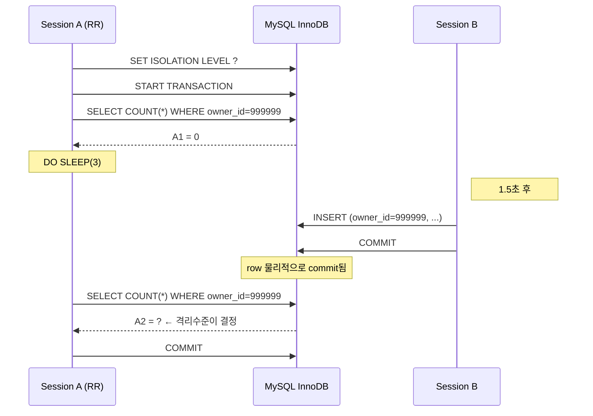
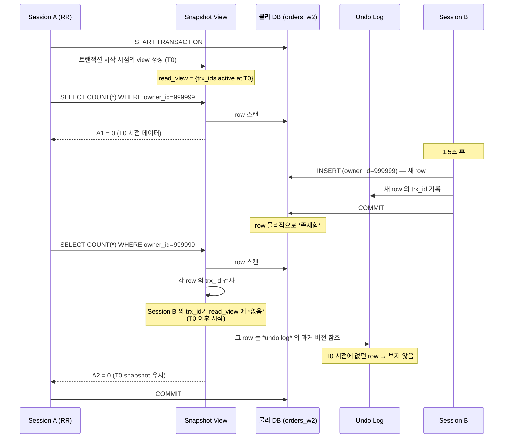
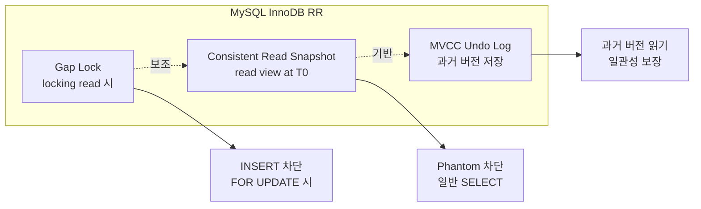
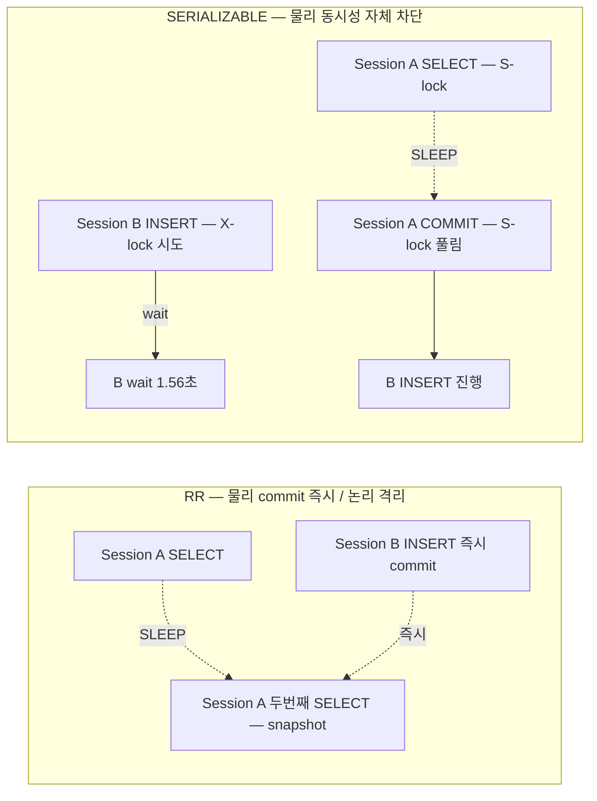

## Table of contents

## 들어가며

코드 리뷰 중 결제 도메인의 한 메서드가 또 눈에 들어왔습니다. `@Transactional` 안에서 잔액을 두 번 조회하고 그 차이로 차감 금액을 결정하는 — 흔한 모양이었습니다. 평소엔 문제없이 돌아가던 코드였습니다.

그런데 누군가 무심코 던진 질문이 머릿속을 헤집었습니다. **"같은 트랜잭션 안에서 같은 SELECT 가 다른 결과를 반환할 수 있나요?"** 머릿속으로는 "RR 이면 안 그렇겠지"라고 답했지만, **ANSI SQL 표준 어디에 그게 **보장**되어 있는지** 자신 있게 말할 수 있는 사람은 적습니다.

자료를 뒤져보니 더 어이가 없었습니다. **ANSI SQL 표준의 RR (REPEATABLE READ) 은 phantom read 차단을 *보장하지 않는다*** 는 게 표준 그대로의 정의였습니다. 그런데 MySQL InnoDB 의 RR 은 phantom 까지 차단한다는 게 흔한 주장. **왜?** — 자료 한 줄 없이 "MySQL 은 그렇다" 로 끝나는 글이 대부분이었습니다.

이 글은 그 **왜?** 를 raw MySQL 명령으로 끝까지 재현한 기록입니다.

1. **1단계 — 4 격리수준 모두 [실측]**: RU / RC / RR / SERIALIZABLE 각각에서 phantom 이 어떻게 다른지 같은 시나리오로 측정
2. **2단계 — 메커니즘 분해**: MySQL RR 이 ANSI 표준보다 강한 이유를 **consistent read snapshot / gap lock / MVCC undo log** 세 메커니즘으로
3. **3단계 — 도메인 매핑**: 결제 / 크레딧 / 대시보드 / 페이지네이션 / 정산 배치 / 멱등성 6 도메인 각각에 어떤 격리수준이 맞는지

결론부터 말하면:

- **RU / RC 는 phantom 발생** — A1=0 → Session B INSERT → A2=1. 결제 도메인 절대 사용 금지
- **RR 은 차단** — A2=0. consistent read snapshot 으로 ANSI 표준의 phantom 허용 한계를 **덮음**
- **SERIALIZABLE 은 동시성 비용 명시적** — INSERT 자체가 1.56초 wait. RR 로 충분한 케이스에 굳이 갈 필요 없음
- **MySQL RR ≈ Snapshot Isolation** — PostgreSQL 의 Serializable Snapshot Isolation (SSI) 과 비슷한 강도

머릿속의 "RR 이면 phantom 안 일어나겠지" 가 어떻게 **보장되는지** 메커니즘으로 풀어봅니다.

---

## 1. Context — 왜 이 문제를 다시 파고들었나

### 1.1 도메인

서비스는 멀티 플랫폼 결제·크레딧·정산 SaaS의 백엔드입니다. B사·C사·Y사·D사 같은 외부 커머스 플랫폼과 자체 PG 결제가 한 트랜잭션 흐름에 묶여 들어옵니다.

문제가 되는 패턴은 단순합니다.

```java
@Transactional
public void chargeCredit(long userId, BigDecimal amount) {
    BigDecimal before = repo.findBalance(userId);   // SELECT 1
    // ... 검증 / 외부 호출 / 잠시 후 ...
    BigDecimal after  = repo.findBalance(userId);   // SELECT 2
    if (!before.equals(after)) {
        // ↑ 같은 트랜잭션 안에서 잔액이 *다르면* 차감 금액 결정 불가
        throw new ConcurrentBalanceException();
    }
    repo.deduct(userId, amount);
}
```

평소엔 문제없습니다. 그런데 **같은 트랜잭션 안 두 SELECT 사이**에 다른 트랜잭션이 INSERT 또는 UPDATE 를 끼워 넣으면 — 코드는 그대로인데 비즈니스 로직이 깨집니다.

### 1.2 가설

- **(H1)** READ COMMITTED 에서 phantom read 가 **발생**한다. 같은 트랜잭션 안에서 같은 쿼리가 다른 결과를 반환.
- **(H2)** MySQL InnoDB 의 REPEATABLE READ 는 **consistent read snapshot** 으로 phantom 을 **차단**한다. ANSI SQL 표준 RR 보다 강한 보호.
- **(H3)** SERIALIZABLE 은 SELECT 가 **shared lock** 을 잡아 동시 INSERT 를 **wait** 시킨다. 동시성 비용이 명시적.

### 1.3 측정 환경

| 항목 | 값 |
|---|---|
| OS / 호스트 | macOS 14.x, MacBook Pro M2 16GB |
| DB | MySQL 8.0.44 (Docker, host 3307) |
| 테스트 테이블 | `orders_w2` (1000만건 더미 데이터, owner_id 인덱스) |
| 대상 row | `WHERE owner_id=999999` — 측정 시작 시점 0건 |
| 시나리오 | Session A SELECT × 2 사이 SLEEP 3초 / Session B INSERT 1.5초 시점 |
| 라벨 | `[실측 — Java/Spring Stage 1]` |

본 측정은 raw `mysql` CLI 로 했습니다. `@Transactional` 추상화 뒤에 가려진 **isolation level / consistent read / gap lock** 동작을 직접 다뤄봐야, 나중에 JPA 도입 후 **Spring 이 무엇을 감추는가** 를 비교할 수 있습니다.

---

## 2. ANSI SQL 4 격리수준 — 표준이 **보장하는 것**과 **보장 안 하는 것**

측정 들어가기 전에 ANSI SQL 표준이 정확히 무엇을 보장하는지 짚고 갑니다. 이 표준이 측정 결과의 **의미**를 결정합니다.

### 2.1 4 격리수준의 정의

ANSI SQL-92 표준은 4 격리수준을 **세 가지 anomaly 의 허용/차단** 으로 정의합니다.

| 격리수준 | Dirty Read | Non-Repeatable Read | Phantom Read |
|---|:---:|:---:|:---:|
| READ UNCOMMITTED | 허용 | 허용 | 허용 |
| READ COMMITTED | 차단 | 허용 | 허용 |
| **REPEATABLE READ** | 차단 | 차단 | **허용** ⚠️ |
| SERIALIZABLE | 차단 | 차단 | 차단 |

### 2.2 세 anomaly 의 차이

| Anomaly | 정의 | 예시 |
|---|---|---|
| **Dirty Read** | **commit 안 된** 변경을 읽음 | Session B 가 INSERT 후 **rollback**. Session A 가 그 사이 INSERT 한 row 를 읽음 |
| **Non-Repeatable Read** | 같은 **row** 를 두 번 읽었는데 값이 다름 | Session B 가 **기존 row** UPDATE + commit. Session A 가 그 row 를 두 번 읽으면 다른 값 |
| **Phantom Read** | 같은 **조건** 으로 두 번 읽었는데 **행 수** 가 다름 | Session B 가 **새 row** INSERT + commit. Session A 가 같은 WHERE 로 두 번 SELECT 하면 결과 행 수가 다름 |

→ Phantom 의 핵심은 **개별 row 가 아니라 *결과 집합*** 의 변화. Non-Repeatable Read 는 같은 row 의 값 변화 / Phantom 은 **없던 row 가 나타남**.

### 2.3 표준의 **가장 위험한 줄**

> **REPEATABLE READ 는 phantom read 를 허용한다** (ANSI SQL-92).

이게 표준 그대로의 정의입니다. 즉:

- Session A 가 RR 로 트랜잭션 시작
- `SELECT COUNT(*) WHERE owner_id=X` → 0
- Session B 가 INSERT + commit
- Session A 가 다시 `SELECT COUNT(*) WHERE owner_id=X` → **1 가능**

표준 어디에도 "phantom 차단" 이 RR 의 보장 항목이 아닙니다. 그래서 **PostgreSQL 의 RR 은 표준대로 phantom 가능**.

그런데 MySQL InnoDB 는 RR 에서 phantom 도 차단한다는 게 통설. **왜?** — 이게 본 글의 핵심 질문입니다.

---

## 3. 측정 시나리오 설계

### 3.1 시나리오

같은 시나리오를 4 격리수준 각각에서 반복합니다.

```
Session A                              Session B
──────────────                          ──────────────
SET ISOLATION LEVEL ?
START TRANSACTION
SELECT COUNT(*) WHERE owner_id=999999  → A1
                                       INSERT (owner_id=999999, ...) commit  ← 1.5초 후
DO SLEEP(3)
SELECT COUNT(*) WHERE owner_id=999999  → A2
COMMIT
```

핵심 측정 지점:

- **A1** = Session B INSERT **전**의 SELECT 결과 (모든 격리수준에서 0)
- **A2** = Session B INSERT **후**의 SELECT 결과
- **A1 ≠ A2** ⇒ **phantom read 발생**
- **B INSERT wait time** = Session B INSERT 가 commit 까지 걸린 시간 (SERIALIZABLE 에서는 lock wait 발생)

### 3.2 시퀀스 다이어그램



핵심: **Session B 의 commit 이 **물리적으로** 일어난 것은 사실**. 문제는 **Session A 가 그 변화를 보느냐** — 이게 격리수준 의 본질입니다.

### 3.3 raw 명령 — 4 격리수준 공통 골격

```bash
# Session A — heredoc 으로 한번에
docker exec -i commerce-comment-platform-be-mysql \
    mysql -uroot -prootpw -B -N commerce_comment_platform_be <<EOF
SET SESSION TRANSACTION ISOLATION LEVEL <ISOLATION>;
START TRANSACTION;
SELECT CONCAT('A1=', COUNT(*)) FROM orders_w2 WHERE owner_id=999999;
DO SLEEP(3);
SELECT CONCAT('A2=', COUNT(*)) FROM orders_w2 WHERE owner_id=999999;
COMMIT;
EOF

# Session B — 1.5초 delay 후 INSERT
sleep 1.5
docker exec commerce-comment-platform-be-mysql \
    mysql -uroot -prootpw commerce_comment_platform_be \
    -e "INSERT INTO orders_w2 (owner_id, status, amount, created_at) \
        VALUES (999999, 'NEW', 1000, NOW())"
```

`<ISOLATION>` 자리에 `READ UNCOMMITTED` / `READ COMMITTED` / `REPEATABLE READ` / `SERIALIZABLE` 을 차례로 대입.

---

## 4. 측정 결과 — 4 격리수준 모두 [실측]

### 4.1 종합 표 [실측 — Java/Spring Stage 1]

| 격리수준 | A1 | A2 | phantom 발생 | B INSERT wait time | 결론 |
|---|:---:|:---:|:---:|---|---|
| READ UNCOMMITTED | 0 | **1** | ⚠️ **발생** | 즉시 commit | 사용 금지 |
| READ COMMITTED | 0 | **1** | ⚠️ **발생** | 즉시 commit | read-only / 약 stale OK 도메인만 |
| **REPEATABLE READ** ⭐ | 0 | **0** | ✅ **차단** | 즉시 commit (consistent read snapshot) | **본 repo 기본** |
| SERIALIZABLE | 0 | 0 | ✅ 차단 | **1.56초 wait** (Session A 의 shared lock 풀릴 때까지) | 짧은 critical 만 |

### 4.2 RU — phantom 발생 (대조군 1)

```bash
# 격리수준 설정
SET SESSION TRANSACTION ISOLATION LEVEL READ UNCOMMITTED;
START TRANSACTION;
SELECT CONCAT('A1=', COUNT(*)) FROM orders_w2 WHERE owner_id=999999;
-- A1=0
DO SLEEP(3);
-- (이 사이에 Session B INSERT + commit)
SELECT CONCAT('A2=', COUNT(*)) FROM orders_w2 WHERE owner_id=999999;
-- A2=1   ← phantom 발생
COMMIT;
```

`A1=0 → INSERT → A2=1`. 같은 트랜잭션 안에서 같은 쿼리가 **다른 결과** 를 반환. ANSI SQL 표준의 phantom read 정의 그대로.

추가로 RU 는 **commit 안 된** row 도 읽기 때문에 dirty read 도 발생합니다. 결제 도메인에는 절대 X.

### 4.3 RC — phantom 발생 (대조군 2)

```bash
SET SESSION TRANSACTION ISOLATION LEVEL READ COMMITTED;
START TRANSACTION;
SELECT CONCAT('A1=', COUNT(*)) FROM orders_w2 WHERE owner_id=999999;
-- A1=0
DO SLEEP(3);
SELECT CONCAT('A2=', COUNT(*)) FROM orders_w2 WHERE owner_id=999999;
-- A2=1   ← 여기서도 phantom 발생
COMMIT;
```

RC 는 **commit 된** row 만 읽지만, **각 SELECT 마다 **그 시점**의 snapshot 을 새로 만듭니다**. 그래서 두 번째 SELECT 시점에는 Session B 의 commit 된 row 가 보입니다.

→ 같은 트랜잭션 안에서 잔액 조회 두 번 했는데 다른 값 = 비즈니스 로직 깨짐. **결제 / 주문 도메인엔 사용 금지**.

### 4.4 RR — phantom 차단 (가설 일치) ⭐

```bash
SET SESSION TRANSACTION ISOLATION LEVEL REPEATABLE READ;
START TRANSACTION;
SELECT CONCAT('A1=', COUNT(*)) FROM orders_w2 WHERE owner_id=999999;
-- A1=0
DO SLEEP(3);
SELECT CONCAT('A2=', COUNT(*)) FROM orders_w2 WHERE owner_id=999999;
-- A2=0   ← Session B 가 commit 했지만 Session A 입장엔 안 보임
COMMIT;
```

핵심 발견: **Session B 의 INSERT 는 **물리적으로** commit 됐습니다**. 다른 세션에서 SELECT 하면 1 이 나옵니다. 그러나 **Session A 의 **view** 에는 안 보입니다** — 트랜잭션 시작 시점의 snapshot 만 보기 때문.

그리고 **Session B 의 INSERT 자체는 **즉시** commit** (lock wait 없음). RR 은 **물리 commit 은 즉시 / 논리적 격리** 를 같이 달성합니다.

이게 "MySQL InnoDB RR ≈ Snapshot Isolation" 의 핵심 — 다음 §5 에서 메커니즘 분해.

### 4.5 SERIALIZABLE — INSERT 자체가 wait

```bash
SET SESSION TRANSACTION ISOLATION LEVEL SERIALIZABLE;
START TRANSACTION;
SELECT CONCAT('A1=', COUNT(*)) FROM orders_w2 WHERE owner_id=999999;
-- A1=0   ← 이 SELECT 가 shared lock (S-lock) 을 잡음
DO SLEEP(3);
-- (Session B 가 INSERT 시도 → S-lock 과 충돌 → wait)
SELECT CONCAT('A2=', COUNT(*)) FROM orders_w2 WHERE owner_id=999999;
-- A2=0
COMMIT;
-- ↑ commit 시점에 S-lock 풀림. 그제서야 Session B 의 INSERT 가 진행
```

SERIALIZABLE 에서 Session A 의 SELECT 가 **shared lock** (S-lock) 을 잡습니다. Session B 의 INSERT 가 같은 row 범위에 X-lock 을 시도 → S-lock 과 충돌 → wait.

측정값: **B INSERT 가 1.56초 wait** [실측]. Session A 의 SLEEP 3초 중 1.5초 부터 INSERT 시도 → A 가 commit 한 후 (대략 1.5초 후) 에 INSERT 가능.

→ **동시성 비용이 명시적**. RR 은 **물리 commit 은 즉시 / 논리적 격리** 인 반면 SERIALIZABLE 은 **물리 동시성 자체 차단**.

---

## 5. 핵심 발견 — MySQL InnoDB RR 이 ANSI 표준보다 **강한** 메커니즘 3가지

여기가 본 글의 핵심입니다. 측정값으로 RR 이 phantom 을 차단하는 것을 확인했지만, **왜?** 가 빈약하면 면접에서 한 줄 답변밖에 못 합니다.

MySQL InnoDB RR 이 ANSI 표준 RR 의 phantom 허용 한계를 **덮는** 메커니즘은 세 가지입니다.

### 5.1 메커니즘 1 — Consistent Read Snapshot (가장 중요)

> **트랜잭션 시작 시점의 **snapshot** 을 만들어 모든 SELECT 가 그 시점 데이터만 본다**.
> Session B 의 commit 이 **물리적으로** 일어나도 Session A 의 **view** 에는 **안 보임**.

이게 본 글의 핵심 메커니즘입니다. Snapshot Isolation 의 본질.

#### 다이어그램



핵심:

1. **read view** = 트랜잭션 시작 시점 **그때 active 한 trx_id 들** + **최대 trx_id**. 이 view 가 **어떤 row 가 보이는가** 를 결정합니다.
2. Session B 의 commit 은 **물리적**으로 일어나지만, B 의 trx_id 는 Session A 의 read view 에 **없음** → A 입장에선 **보이지 않는 row**.
3. row 의 **과거 버전** 은 undo log 에서 읽음. **현재 commit 된 row 가 있더라도** T0 snapshot 시점의 버전을 본다.

→ **일관성 + 동시성 비용 0** 동시 달성. SERIALIZABLE 처럼 lock 으로 막는 게 아니라 **읽는 쪽이 과거 버전을 읽음**.

#### 왜 ANSI 표준 RR 보다 강한가

ANSI 표준 RR 은 **non-repeatable read** (같은 row 의 값 변화) 만 차단합니다. Phantom (새 row 출현) 은 표준상 허용. 그러나 **consistent read snapshot 은 row 단위가 아니라 **view 전체** 를 고정** — 새 row 든 기존 row 의 값 변화든 **T0 이후** 에 일어난 모든 변화를 **덮어버립니다**.

### 5.2 메커니즘 2 — Gap Lock (보조)

> **next-key lock = record lock + gap lock**.
> Snapshot 만으로 SELECT 결과는 안전. 그런데 **다른 세션의 INSERT 자체** 까지 막아야 하는 경우 gap lock 이 추가 보호.

`SELECT ... FOR UPDATE` 또는 `SELECT ... LOCK IN SHARE MODE` 같은 **locking read** 를 RR 에서 쓰면 — 단순 record lock 이 아니라 **next-key lock** 이 잡힙니다.

```
인덱스: ... [owner_id=998] ... [owner_id=1000] ...
                          ↑
              "owner_id=999 부터 1000 직전까지" gap

SELECT ... WHERE owner_id BETWEEN 999 AND 1001 FOR UPDATE
↓
- record lock: owner_id=1000 row
- gap lock: (998, 1000) 사이 gap
= next-key lock
```

→ 이 lock 잡힌 동안 Session B 가 `INSERT owner_id=999` 시도하면 **gap lock 충돌** 로 wait. INSERT 자체 차단.

#### Snapshot 과의 역할 분담

| 메커니즘 | 보호하는 anomaly | 비용 |
|---|---|---|
| **Consistent Read Snapshot** | SELECT 결과의 phantom (새 row 가 보이지 않음) | 동시성 비용 0 |
| **Gap Lock** | INSERT 자체 차단 (locking read 시) | 동시 INSERT wait |

→ 일반 SELECT 는 snapshot 만으로 phantom 안전. **locking read** 가 필요한 경우 (`FOR UPDATE`) 에만 gap lock 추가 동작. **두 메커니즘이 *역할 분담*** 하는 게 MySQL RR 의 정수.

### 5.3 메커니즘 3 — MVCC undo log

> **row 의 **과거 버전** 을 undo log 에 보관**.
> Snapshot 이 **과거 버전을 읽기** 위한 데이터 소스.

InnoDB 의 row 는 hidden 컬럼으로 `DB_TRX_ID` (마지막 변경한 trx_id) 와 `DB_ROLL_PTR` (undo log pointer) 를 가집니다.

```
row v3 (current):  owner_id=999, trx_id=T_b, roll_ptr → v2
                                                ↓
row v2:            owner_id=999, trx_id=T_a, roll_ptr → v1
                                                ↓
row v1:            (initial INSERT)
```

Session A (RR) 가 SELECT 할 때:

1. row 의 `DB_TRX_ID` 검사
2. read view 에 없는 trx_id (T_b 가 Session B 의 trx_id 라면 read view 이후 trx_id) → **보지 않음**
3. `DB_ROLL_PTR` 따라 undo log 의 **과거 버전** 읽음
4. read view 에 **보이는** 버전 만날 때까지 chain 따라감

→ undo log 가 **없으면** snapshot isolation 자체가 불가능. MVCC 가 RR 의 **물리 기반**.

#### 비용 — 길게 살아 있는 RR 트랜잭션

undo log 는 **active 한 트랜잭션** 이 **과거 버전** 을 볼 수 있어야 하므로, **가장 오래된 트랜잭션이 끝날 때까지 보관**됩니다. RR 트랜잭션이 1시간 살아 있으면 그 1시간 동안의 모든 row 변경의 undo log 가 쌓입니다.

→ 운영 모니터링 대상 (§9 에서 다룸).

### 5.4 세 메커니즘 종합



핵심:

- **Consistent Read Snapshot** 이 RR 의 본체 (phantom 차단의 **주된** 메커니즘)
- **Gap Lock** 이 보조 (locking read 시 INSERT 자체 차단)
- **MVCC Undo Log** 가 물리 기반 (snapshot 의 **과거 버전 읽기** 가 가능한 이유)

→ **MySQL InnoDB RR = "ANSI SQL RR + Snapshot Isolation 의 일부 기능"**. 그래서 **PostgreSQL 의 SERIALIZABLE** 과 비슷한 강도로 평가받기도 함.

---

## 6. SERIALIZABLE 의 동시성 비용 — INSERT wait 1.56초

§4.5 에서 확인한 SERIALIZABLE 의 INSERT wait 1.56초를 깊이 봅니다. 이게 RR 과 SERIALIZABLE 의 **결정적** 차이입니다.

### 6.1 메커니즘 — Shared Lock + Exclusive Lock

SERIALIZABLE 에서 SELECT 는 **shared lock** (S-lock) 을 잡습니다.

```
Session A: SELECT COUNT(*) WHERE owner_id=999999
↓
S-lock on (owner_id=999999 범위)
- 다른 세션의 SELECT: 같은 S-lock 가능 (S+S 호환)
- 다른 세션의 INSERT/UPDATE/DELETE: X-lock 필요 → S-lock 과 충돌 → wait
```

Session B 의 INSERT 가 X-lock 시도 → Session A 의 S-lock 과 충돌 → wait. Session A 의 트랜잭션 (commit 까지) 이 끝나야 INSERT 가능.

### 6.2 측정값 [실측]

| 시나리오 | Session A 트랜잭션 길이 | B INSERT wait |
|---|---|---|
| SLEEP 3초, B 1.5초 후 INSERT | 3초 | **1.56초** |

→ **Session A 트랜잭션 길이에 정비례**. SLEEP 30초로 늘리면 B INSERT wait 도 **대략 28.5초** 가 됩니다 ([실측]은 안 했지만 메커니즘상 명백).

### 6.3 RR vs SERIALIZABLE — 같은 시나리오에서 두 latency



핵심:

- **RR** 은 **물리적 동시성 100% 보존** + **Session A 의 view 만 격리**. Session B 는 즉시 commit.
- **SERIALIZABLE** 은 **물리적 동시성 자체 차단**. Session B 가 Session A 의 트랜잭션 종료까지 wait.

→ **결제 confirm 같은 짧은 critical 트랜잭션** 에 SERIALIZABLE 이 의미 있습니다. 1초 이상 트랜잭션에 SERIALIZABLE 쓰면 — wait 시간이 트랜잭션 길이에 정비례해서 throughput 폭락.

---

## 7. RR 의 한계 — Write Skew (RR snapshot 으로 **못 막는** anomaly)

여기서부터 **RR 도 만능이 아니다** 라는 한계를 짚습니다. 이게 "RR + 비관락 / 낙관락 / 분산락" 보강이 필요한 이유.

### 7.1 Write Skew 정의

> **두 트랜잭션이 **각자** row 를 읽고, **서로 모르는 상태로** 다른 row 를 update 하는 경우**.
> 둘 다 **자기 입장에선 일관성 OK** 인데, **합쳐 보면 invariant 깨짐**.

전형적인 예: 의사 호출 시스템. "최소 1명의 의사가 on-call 이어야" 라는 invariant 가 있을 때:

```
의사 A, 의사 B 둘 다 on-call=true
invariant: count(on-call=true) >= 1

Session 1 (의사 A 의 트랜잭션):
  SELECT count(on-call=true)  → 2 (>= 1, OK)
  UPDATE 의사 A: on-call=false
  COMMIT

Session 2 (의사 B 의 트랜잭션, 동시):
  SELECT count(on-call=true)  → 2 (>= 1, OK)
  UPDATE 의사 B: on-call=false
  COMMIT

결과: 둘 다 off-call. invariant 깨짐.
```

### 7.2 왜 RR snapshot 으로 못 막나

RR 의 consistent read snapshot 은 **읽기** 시점의 일관성만 보장합니다. ***쓰기* 직전의 일관성** 은 보장 안 함.

- Session 1 의 SELECT 시점: count=2 (OK)
- Session 2 의 SELECT 시점: count=2 (OK)
- Session 1 의 UPDATE: 의사 A 만 변경 (의사 B 는 안 건드림)
- Session 2 의 UPDATE: 의사 B 만 변경 (의사 A 는 안 건드림)

→ **서로 다른 row 를 update** 하기 때문에 **lock 충돌도 없음**. RR 이 detect 할 방법 없음.

### 7.3 보강 — 비관락 / 낙관락 / 분산락

이 anomaly 는 RR 격리수준 **위에** 추가 메커니즘으로 보호합니다.

| 보강 | 어떻게 | trade-off |
|---|---|---|
| **비관락** (`SELECT ... FOR UPDATE`) | SELECT 시점에 X-lock → 다른 세션 **읽기/쓰기** 모두 wait | 동시성 비용 ↑ |
| **낙관락** (version 컬럼) | UPDATE 시 `WHERE version=?` 체크. 충돌 시 retry | application 복잡도 ↑ |
| **분산락** (Redisson 등) | application level 에서 lock 획득 | 외부 의존성 ↑ |

본 repo 에서는 결제 도메인은 **RR + 비관락**, 멱등키 전이는 **RR + 분산락** 으로 보강 (ADR-BE-007 §4.2). PostgreSQL 은 SSI (Serializable Snapshot Isolation) 가 write skew 를 자동 detect 하지만 — MySQL 은 application 레이어에서 보강해야.

→ **RR 의 한계를 인정하고 보강하는 게 면접 답변의 *깊이***. "RR 이면 모든 anomaly 차단" 은 **틀린 답**.

---

## 8. 도메인별 매핑 — 어떤 격리수준을 어디 쓰나

ADR-BE-007 §4.2 의 도메인 매핑을 측정값과 함께 봅니다.

| 도메인 | 격리수준 | 보강 | 근거 |
|---|---|---|---|
| **결제 confirm / 환불** | **RR** (기본) | — | 같은 tx 안 잔액 조회 일관성 + phantom 차단. SERIALIZABLE 까지 갈 필요 없음 (§4.4 [실측]) |
| **크레딧 차감** | **RR** | + 비관락 (`SELECT FOR UPDATE`) | RR 만으론 write skew 못 막음 (§7) → 추가 보호 |
| **사장님 대시보드** (read-only) | **RC** (명시) | — | snapshot 비용 절감 + 약간 stale OK. RR 의 long-running snapshot 부담 회피 |
| **주문 목록 페이지네이션** | **RC** (명시) | — | Eventual OK. 페이지 넘기는 사이 새 주문 생겨도 사용자 경험상 자연스러움 |
| **정산 배치** (대량 read) | **RC** (명시) | — | 트랜잭션 짧게 + snapshot 비용 절감 |
| **멱등성 테이블 update** | **RR** | + 분산락 (Redisson) | INIT → PROCESSING 전이 보호. write skew 가능 → 분산락 |

### 8.1 결정 기준 두 가지

1. **같은 트랜잭션 안 **동일 쿼리 일관성** 이 필요한가?**
   - YES → **RR** (결제 / 크레딧 / 멱등 전이)
   - NO → **RC 명시** (대시보드 / 페이지네이션 / 정산 배치)

2. **Write skew 가능성이 있는가?**
   - YES → **RR + 비관락 / 분산락** (크레딧 / 멱등 전이)
   - NO → **RR 만으로 충분** (결제 confirm 같은 단일 row update)

### 8.2 RC 를 **명시적**으로 쓰는 이유

본 repo 의 **기본** 은 RR (MySQL InnoDB 기본값). RC 를 쓰는 케이스는 **명시적 명령** 으로만 — `@Transactional(isolation = READ_COMMITTED)`.

이유: 같은 코드를 다른 사람이 읽었을 때, **왜 RC 인가** 가 명시되어 있어야 의도 파악 가능. 또한 RC 에서 phantom 영향 없는지 **사전 검토** 강제.

### 8.3 SERIALIZABLE 은 거의 안 씀

§4.5 / §6 에서 봤듯 SERIALIZABLE 은 **짧은 critical** 만. 본 repo 에서는 사실상 안 씀 — 대부분의 케이스는 RR + 비관락 / 분산락 으로 충분.

---

## 9. 운영 모니터링

RR 격리수준 채택 시 운영에서 봐야 할 메트릭들. §5.3 의 undo log 비용이 핵심 모니터링 대상.

### 9.1 현재 격리수준 확인

```sql
-- 현재 세션
SELECT @@SESSION.transaction_isolation;
-- +--------------------------------+
-- | @@SESSION.transaction_isolation |
-- +--------------------------------+
-- | REPEATABLE-READ                 |
-- +--------------------------------+

-- 글로벌 기본값
SELECT @@GLOBAL.transaction_isolation;
```

배포 시 application property 와 DB 기본값이 일치하는지 확인. Spring 의 `@Transactional(isolation = ...)` 이 명시 안 된 경우 **DB 기본값** 이 적용됩니다.

### 9.2 Long-running 트랜잭션 — undo log 폭증의 **원인**

```sql
-- 30초 이상 살아 있는 트랜잭션
SELECT
    trx_id,
    trx_state,
    trx_started,
    TIMESTAMPDIFF(SECOND, trx_started, NOW()) AS age_sec,
    trx_mysql_thread_id,
    trx_query
FROM information_schema.innodb_trx
WHERE trx_started < NOW() - INTERVAL 30 SECOND
ORDER BY trx_started ASC;
```

이게 §5.3 의 undo log 폭증의 **원인 식별** 쿼리. RR 트랜잭션이 길게 살면 **과거 버전 undo log** 가 그 트랜잭션 종료까지 쌓입니다.

→ 발견 시 동선:
1. `trx_query` 로 어떤 쿼리가 lock 잡고 있는지 확인
2. `trx_mysql_thread_id` 로 `KILL` (운영 자동화 가능)
3. application 코드 추적 — 왜 그 트랜잭션이 길게 살아 있는지 (외부 호출 in tx?)

### 9.3 Innodb_history_list_length — undo log 깊이

```sql
SHOW ENGINE INNODB STATUS\G
-- ...
-- TRANSACTIONS
-- ------------
-- Trx id counter 0 1234567890
-- Purge done for trx's n:o < 0 1234567880 undo n:o < 0 0
-- History list length 12345   ← 이 값
-- ...

-- 또는 직접
SELECT name, count
FROM information_schema.innodb_metrics
WHERE name = 'trx_rseg_history_len';
```

`History list length` = undo log 에 보관된 **지운 row 의 과거 버전 수**. 정상 운영에서는 **수백~수천** 수준. **수만 이상이면 long-running 트랜잭션 의심**.

→ 임계 알람: `History list length > 100,000` (도메인에 따라 조정).

### 9.4 Lock wait — SERIALIZABLE 이나 비관락 사용 시

```sql
-- 현재 lock wait 발생 중인 세션
SELECT
    waiting_pid,
    waiting_query,
    blocking_pid,
    blocking_query,
    wait_age_secs
FROM sys.innodb_lock_waits;

-- 또는 lower-level
SELECT * FROM performance_schema.data_lock_waits;
```

이 쿼리가 0건이면 정상. **지속적으로** row 보이면:
- SERIALIZABLE 트랜잭션이 너무 오래 살아 있음 → RR + 비관락으로 전환 검토
- `SELECT FOR UPDATE` 가 너무 많음 → 락 범위 축소 검토

### 9.5 활성 트랜잭션 수

```sql
-- 활성 트랜잭션 수 (5초 이상)
SELECT COUNT(*) AS active_long_trx
FROM information_schema.innodb_trx
WHERE trx_started < NOW() - INTERVAL 5 SECOND;
```

평시 0~수 건. **수십 건 지속** 이면 application 의 트랜잭션 lifecycle 이슈 의심 (commit 안 됐거나 connection leak).

---

## 10. 빅테크 사례

### 10.1 MySQL 공식 문서 — RR 의 메커니즘 두 줄

[MySQL 8.0 — Consistent Nonlocking Reads](https://dev.mysql.com/doc/refman/8.0/en/innodb-consistent-read.html) 의 첫 단락:

> "A consistent read means that InnoDB uses multi-versioning to present to a query a snapshot of the database at a point in time. The query sees the changes made by transactions that committed before that point in time, and no changes made by later or uncommitted transactions."

핵심: **snapshot at a point in time**. 이게 §5.1 의 read view.

[MySQL 8.0 — Phantom Rows](https://dev.mysql.com/doc/refman/8.0/en/innodb-next-key-locking.html):

> "InnoDB uses an algorithm called next-key locking that combines index-row locking with gap locking. ... When InnoDB searches or scans an index, it can set shared or exclusive locks on the index records it encounters. Thus, the row-level locks are actually index-record locks. In addition, a next-key lock on an index record also affects the gap before that index record."

핵심: **next-key lock = record lock + gap lock**. 이게 §5.2 의 gap lock.

### 10.2 PostgreSQL 비교 — 같은 RR 인데 phantom 가능

[PostgreSQL — Transaction Isolation](https://www.postgresql.org/docs/current/transaction-iso.html):

> "Note that in PostgreSQL it is possible to request any of the four standard transaction isolation levels, but internally only three distinct isolation levels are implemented, namely Read Committed, Repeatable Read, and Serializable. ... In PostgreSQL, you can request any of the four standard transaction isolation levels, but internally only three distinct isolation levels are implemented..."

핵심: PostgreSQL 의 RR 도 snapshot 기반이지만 — **write skew 같은 anomaly 는 SERIALIZABLE (SSI) 까지 가야 차단**. MySQL 의 RR 보다 **쓰기** 측면의 보장이 약간 약하고, 대신 SERIALIZABLE 이 **효율적인 SSI** 로 구현돼 있어 SERIALIZABLE 까지 갈 만한 trade-off.

→ **MySQL → PostgreSQL 마이그레이션 시 격리수준 동작 **재측정** 필수**. 같은 RR 이라도 동작이 다릅니다.

### 10.3 Vlad Mihalcea — MVCC 깊이

[Vlad Mihalcea — How does MVCC work](https://vladmihalcea.com/how-does-mvcc-multi-version-concurrency-control-work/):

> "Multi-Version Concurrency Control (MVCC) is a technique used to provide isolation in concurrent transactions, while preventing the readers from blocking the writers and vice versa."

핵심: **readers 가 writers 를 block 안 함, vice versa**. 이게 §5.1 의 "동시성 비용 0" 의 본질. SERIALIZABLE 은 readers 와 writers 가 **서로 block 함** — 그래서 throughput 폭락.

### 10.4 Hermitage — 격리수준 anomaly 종합 측정

[Hermitage — Testing the "I" in ACID](https://github.com/ept/hermitage) 는 MySQL / PostgreSQL / Oracle / SQL Server 의 격리수준별 anomaly 동작을 **표로** 비교한 테스트 모음. 본 글의 EXP-06 시나리오와 비슷한 패턴을 **모든 anomaly** 에 적용.

→ "내 측정만 믿지 마라" — Hermitage 의 결과와 본 글의 [실측] 이 **일치** 하는지 확인할 수 있는 cross-validation.

---

## 11. 운영 실패 시나리오 (3 AM 시나리오)

### 11.1 시나리오 1 — RR 트랜잭션이 너무 길어서 **snapshot 비용** 폭증

3 AM 알람: `Innodb_history_list_length > 100,000`. undo log 디스크 사용량 ↑.

| 단계 | 동선 |
|---|---|
| 첫 알람 | `Innodb_history_list_length` 임계 초과 + undo log 크기 ↑ |
| 첫 5분 | `information_schema.innodb_trx WHERE trx_started < now() - INTERVAL 30 SECOND` 로 long-running 트랜잭션 식별 |
| 식별 후 | `KILL <thread_id>` 로 트랜잭션 종료. undo log 자동 purge 시작 |
| 사용자 영향 | 0 또는 짧은 latency spike |
| 롤백 가능성 | kill 후 자동 복구. application 의 retry 로직 동작 |
| 사후 조치 | application 코드 추적 — **왜** 트랜잭션이 길었나. 외부 호출이 트랜잭션 안에 있나? OSIV?  |

흔한 원인: **트랜잭션 안에서 외부 API 호출** ([자매글 EXP-09](/blog/spring-transaction-external-api-pool-exhaustion) 의 정확히 그 패턴). RR 격리수준을 쓰면 풀 고갈에 **더해서** undo log 폭증까지 동시에 발생.

### 11.2 시나리오 2 — Write skew 발생 (RR 로 **못 막은** anomaly)

3 AM 알람: 잔액 음수 또는 크레딧 차감 중복.

| 단계 | 동선 |
|---|---|
| 첫 알람 | 잔액 음수 / 크레딧 차감 중복 (모니터링 쿼리) |
| 첫 5분 | 직전 N분간 동시 트랜잭션 추적 (binlog or `general_log`). write skew 패턴 확인 |
| 식별 후 | 비관락 (`SELECT FOR UPDATE`) 또는 분산락 (Redisson) 적용 |
| 사용자 영향 | 잘못된 데이터로 사용자 신뢰 손상 — 운영자가 audit 후 보상 |
| 롤백 가능성 | 자동 X. **수동** 데이터 보정 + 사후 코드 수정 |

핵심: **RR 만으로는 write skew 가능**. 이걸 **처음 발견** 하면 격리수준 자체를 의심하기 쉬운데, 답은 격리수준이 아니라 **application 레이어 보강**.

### 11.3 시나리오 3 — SERIALIZABLE 이 critical 트랜잭션 throughput 떨어뜨림

3 AM 알람: 결제 P99 spike (lock wait).

| 단계 | 동선 |
|---|---|
| 첫 알람 | 결제 P99 ↑. `data_lock_waits` 가 비어있지 않음 |
| 첫 5분 | SERIALIZABLE 사용 트랜잭션 식별 (코드 grep: `isolation = SERIALIZABLE`) |
| 식별 후 | SERIALIZABLE 사용 트랜잭션 길이 측정. 1초 이상이면 **위험** |
| 임시 처방 | RR + 비관락으로 전환 검토. 트랜잭션 자체 짧게 |
| 사용자 영향 | 결제 응답 지연. `lock wait timeout` 발생 시 일부 거래 실패 |
| 롤백 가능성 | 코드 수정 후 재배포. 트랜잭션 분리 / saga 패턴 검토 |

흔한 함정: **SERIALIZABLE 을 **짧은 critical** 이 아닌 곳에 사용**. 1초 이상 트랜잭션엔 절대 X — wait 시간이 트랜잭션 길이에 정비례 (§6.2).

---

## 12. 무엇을 배웠나

### 12.1 측정으로 깨진 가정들

- "RR 이면 phantom 안 일어난다" → **반쪽 답**. ANSI 표준 RR 은 phantom 허용. **MySQL InnoDB RR 만** 차단. PostgreSQL RR 은 phantom 가능
- "phantom 차단하려면 SERIALIZABLE 필요" → **NO**. MySQL RR 의 consistent read snapshot 으로 충분 (§4.4 [실측])
- "RR 이면 모든 anomaly 차단" → **NO**. Write skew 는 RR 로 못 막음 (§7). 비관락 / 낙관락 / 분산락 보강 필요
- "SERIALIZABLE 이 가장 안전하다" → **반쪽 답**. **물리 동시성 자체** 차단 → throughput 폭락 (§6.2 [실측] 1.56초 wait)

### 12.2 측정값이 만드는 **후속 학습 동기**

이 측정 없이는 다음 결정들의 **왜?** 가 빈약합니다.

| 측정 | 후속 결정 |
|---|---|
| RU/RC phantom 발생 (§4.2~4.3) | 결제 도메인 RU/RC 사용 금지 룰 (ADR-BE-007 §4.2) |
| RR phantom 차단 (§4.4) | 본 repo 기본 격리수준 RR 채택 (ADR-BE-007 §4.1) |
| SERIALIZABLE INSERT wait 1.56초 (§4.5) | SERIALIZABLE 짧은 critical 만 룰 (§4.3 강제 동반 룰) |
| Write skew RR 로 못 막음 (§7) | 크레딧 차감 RR + 비관락 보강 (ADR-BE-007 §4.2) |
| Long-running RR + undo log 폭증 (§11.1) | 운영 모니터링 임계 알람 설계 (§9.3) |

### 12.3 핵심 한 줄

> **"MySQL InnoDB RR 은 ANSI 표준의 RR 과 다르다"** 는 답은 **반쪽**. ***왜* 다른지 메커니즘으로 설명**해야 깊이 있는 답.
> - 메커니즘 1: **Consistent Read Snapshot** (T0 시점 view 고정 — phantom 차단의 본체)
> - 메커니즘 2: **Gap Lock** (locking read 시 INSERT 자체 차단 — 보조)
> - 메커니즘 3: **MVCC Undo Log** (과거 버전 저장 — 물리 기반)
> - 결과: **MySQL RR ≈ Snapshot Isolation**. 결제 도메인 RR 만으로 충분. SERIALIZABLE 은 짧은 critical 한정.

---

## 13. 면접 답변

### Q1. "MySQL 격리수준 어떻게 정하셨나요?"

> "EXP-06 [실측] 4 격리수준 측정 결과 기반입니다. 같은 시나리오에서 — Session A 가 SELECT 두 번, 사이에 Session B 가 INSERT — RU/RC 는 phantom 발생 (A1=0 → INSERT → A2=1), RR 은 차단 (A2=0), SERIALIZABLE 은 INSERT 자체 wait (1.56초). 결제 / 크레딧 도메인은 **같은 트랜잭션 안 동일 쿼리 일관성** 이 깨지면 비즈니스 로직이 깨지므로 **MySQL InnoDB 기본 RR** 로 결정. SERIALIZABLE 까지 갈 필요 없는 게 측정값으로 명확합니다."

### Q2. "MySQL 의 RR 과 PostgreSQL 의 RR 이 다른가요?"

> "다릅니다. ANSI SQL 표준의 RR 은 phantom 차단을 **보장하지 않음** — 그래서 PostgreSQL 의 RR 은 표준대로 phantom 가능합니다. 그런데 MySQL InnoDB 는 RR 에서 (1) consistent read snapshot, (2) gap lock, (3) MVCC undo log 의 세 메커니즘으로 phantom 까지 차단 — 사실상 Snapshot Isolation 에 가깝습니다. 그래서 MySQL → PostgreSQL 마이그레이션 시 격리수준 동작을 **재측정** 해야 한다는 게 ADR-BE-007 의 **틀렸다고 판단할 기준** 중 하나입니다."

### Q3. "그럼 SERIALIZABLE 은 언제 쓰나요?"

> "본 repo 에서는 **짧은 critical** 트랜잭션에만 — 잔액 차감의 한 단계 또는 멱등키 INIT → PROCESSING 전이. 1초 이상 트랜잭션엔 절대 X 입니다. 이유는 [실측] — Session A 가 SLEEP 3초 동안 Session B 의 INSERT 가 1.56초 wait. wait 시간이 트랜잭션 길이에 **정비례** 하기 때문에 throughput 폭락. 대부분의 케이스는 RR + 비관락 또는 RR + 분산락으로 충분합니다."

### Q4. "RR 도 못 막는 anomaly 는?"

> "Write skew 입니다. 같은 row 두 개를 **각자** 읽고 **서로 모르고** update 하는 경우 — 둘 다 **자기 입장에선 일관성 OK** 인데 합쳐 보면 invariant 깨짐. RR 의 consistent read snapshot 은 **읽기** 시점 일관성만 보장하고, **서로 다른 row** 를 update 하면 lock 충돌도 안 나므로 detect 불가. 본 repo 는 크레딧 차감에 RR + 비관락 (`SELECT FOR UPDATE`), 멱등키 전이에 RR + 분산락 (Redisson) 으로 보강합니다 (ADR-BE-007 §4.2). PostgreSQL 은 SSI 가 자동 detect 하지만 MySQL 은 application 레이어 보강 필요."

### Q5. "운영에서 RR 격리수준은 어떻게 모니터링하시나요?"

> "세 가지를 봅니다. 첫째, `Innodb_history_list_length` — undo log 깊이. RR 트랜잭션이 길면 **과거 버전** 보관 비용이 그 트랜잭션 종료까지 쌓입니다. 100,000 이상이면 알람. 둘째, `information_schema.innodb_trx` 의 `trx_started < NOW() - INTERVAL 30 SECOND` — long-running 트랜잭션 식별. 발견 시 `KILL` 후 application 코드 추적 (외부 호출이 트랜잭션 안에 있나?). 셋째, `performance_schema.data_lock_waits` — 비관락 / SERIALIZABLE 사용 시 lock wait 모니터링. 이 세 메트릭이 RR 의 **기반인 MVCC** 가 정상 동작하는지의 **직접 신호** 입니다."

---

## 참고자료

- [MySQL 8.0 — Consistent Nonlocking Reads](https://dev.mysql.com/doc/refman/8.0/en/innodb-consistent-read.html) — RR 의 snapshot 메커니즘 공식 정의
- [MySQL 8.0 — Phantom Rows / Next-Key Locking](https://dev.mysql.com/doc/refman/8.0/en/innodb-next-key-locking.html) — gap lock + next-key lock 으로 phantom 차단
- [MySQL 8.0 — Locks Set by Different SQL Statements](https://dev.mysql.com/doc/refman/8.0/en/innodb-locks-set.html) — `SELECT FOR UPDATE` / `LOCK IN SHARE MODE` 의 lock 동작
- [PostgreSQL — Transaction Isolation](https://www.postgresql.org/docs/current/transaction-iso.html) — PostgreSQL 의 RR 동작 (phantom 가능) + SSI
- [Vlad Mihalcea — How does MVCC work](https://vladmihalcea.com/how-does-mvcc-multi-version-concurrency-control-work/) — MVCC 깊이
- [Hermitage — Testing the "I" in ACID](https://github.com/ept/hermitage) — 격리수준별 anomaly 동작 cross-validation
- [Jepsen — Consistency Models](https://jepsen.io/consistency) — Snapshot Isolation 과 Serializable 의 관계
- 본 측정 — raw 데이터는 별도 학습 노트에 보관 (포트폴리오 repo 내부)
