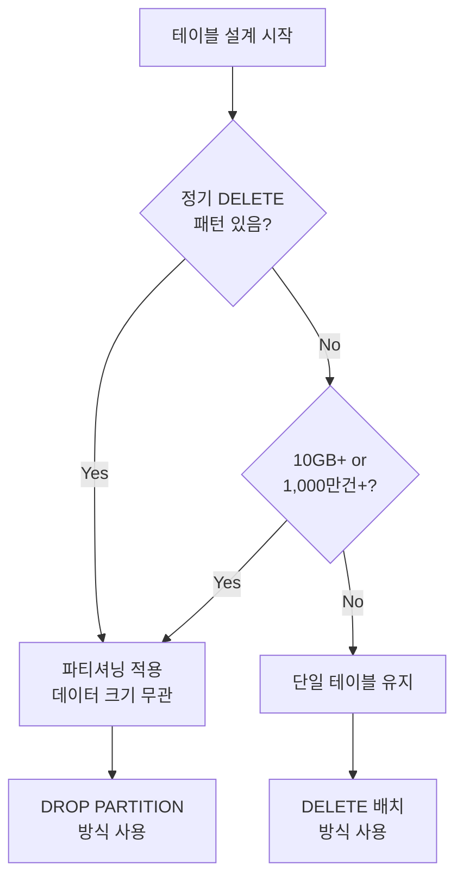
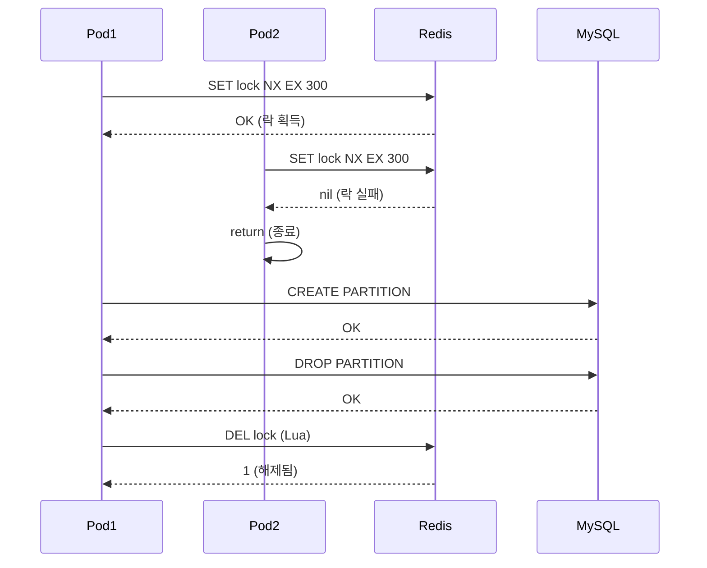

## Table of Contents

## Executive Summary

N사 플랫폼 작업 로그 테이블을 설계하면서 반직관적인 결정을 내렸습니다. **테이블 크기가 2.5GB밖에 안 되는데 파티셔닝을 적용한 것입니다.**

일반적으로 파티셔닝은 10GB 이상, 1,000만건 이상일 때 고려한다고 알려져 있습니다. 그런데 왜 2.5GB 테이블에 파티셔닝을 적용했을까요?

이 글은 그 결정 과정을 정리한 기록입니다:

- **파티셔닝 적용 기준 재검토**: 데이터 크기가 아닌 **DELETE 패턴**이 핵심
- **DELETE vs DROP PARTITION**: 15분 vs 3초, 300배의 성능 차이
- **복합 PK 강제**: MySQL 파티셔닝의 숨겨진 제약
- **Redis 분산 락**: 멀티 인스턴스 환경에서 파티션 관리 자동화

**결과적으로** 30일 보관 정책을 위한 정기 삭제 작업이 15분에서 3초로 단축되었고, 데드락 문제도 해결되었습니다.

---

## 1. 배경: 로그 테이블의 요구사항

### 1.1 CS용 작업 로그의 목적

[이전 글](/posts/naver-2fa-metadata-table-design-deep-dive)에서 설계한 N사 2FA 메타데이터와 함께, 모든 N사 API 작업을 기록하는 로그 테이블이 필요했습니다.

```typescript
// 기록해야 하는 정보들
interface NaverOperationLog {
  userId: string;
  platformId: string;
  operationType: 'CHECK_LOGIN' | 'GET_STORES' | 'GET_REVIEWS' | 'ADD_REPLY' | ...;
  operationStatus: 'SUCCESS' | 'FAILED' | 'TIMEOUT';

  // 2FA 상태 스냅샷
  is2faUser: boolean;
  sessionReused: boolean;

  // 에러 정보
  errorCode?: string;
  errorMessage?: string;

  // CS 조회용
  shopId?: string;
  reviewId?: string;
  responseTimeMs?: number;

  createdAt: Date;
}
```

CS팀의 요구사항:
- "이 유저가 왜 에러가 났는지 확인해주세요"
- "최근 30일 작업 이력을 보여주세요"
- "특정 매장의 리뷰 작업 로그를 찾아주세요"

### 1.2 데이터 규모 추정

| 항목 | 예상 값 | 산출 근거 |
|------|---------|----------|
| 일별 INSERT | ~100,000건 | 1,000 계정 × 100 작업/일 |
| 30일 누적 | ~3,000,000건 | 100,000건 × 30일 |
| 레코드당 크기 | ~500 bytes | JSON 컬럼 포함 평균 |
| 30일 테이블 크기 | ~1.5 GB | 3M × 500 bytes |
| 인덱스 포함 | ~2.5 GB | 테이블 × 1.7 |

**2.5GB**. 일반적인 파티셔닝 기준(10GB+)에 한참 못 미치는 크기입니다.

---

## 2. 처음 시도: DELETE 배치

### 2.1 일반적인 접근

처음에는 단순하게 생각했습니다. "30일 지난 데이터는 CRON으로 삭제하면 되겠지."

```typescript
// BAD: 처음 시도한 DELETE 배치
@Cron('0 2 * * *')  // 매일 새벽 2시
async archiveOldLogs(): Promise<void> {
  const cutoffDate = subDays(new Date(), 30);

  await this.dataSource.query(`
    DELETE FROM naver_operation_logs
    WHERE created_at < ?
    LIMIT 100000
  `, [cutoffDate]);
}
```

### 2.2 발견한 문제들

테스트 환경에서는 잘 동작했습니다. 하지만 운영 환경에 배포하고 첫 번째 CRON이 실행되자 문제가 터졌습니다.

**문제 1: 테이블 락 15분+**

```
[2026-01-21 02:00:00] Starting delete batch...
[2026-01-21 02:15:23] Delete completed. Rows affected: 95,234
```

10만건 삭제에 **15분**이 걸렸습니다. 그 동안:

```sql
-- 동시에 들어온 INSERT 쿼리
INSERT INTO naver_operation_logs (...) VALUES (...);
-- Lock wait timeout exceeded; try restarting transaction
```

**문제 2: 데드락 발생**

```
Error: Deadlock found when trying to get lock;
try restarting transaction
```

DELETE와 INSERT가 동시에 실행되면서 데드락이 발생했습니다.

**문제 3: 바이너리 로그 폭증**

DELETE는 row-by-row로 바이너리 로그에 기록됩니다:

```
# 10만건 DELETE = 10만개의 DELETE 이벤트
binlog.000042: 500MB
```

복제 지연, 디스크 공간 문제로 이어졌습니다.

### 2.3 LIMIT으로 나눠서 삭제?

"한 번에 다 삭제하지 말고 나눠서 하면 되지 않을까?"

```typescript
// 여전히 BAD: 나눠서 삭제해도 문제 해결 안됨
async deleteInBatches(): Promise<void> {
  let deleted = 0;
  do {
    const result = await this.dataSource.query(`
      DELETE FROM naver_operation_logs
      WHERE created_at < ?
      LIMIT 1000
    `, [cutoffDate]);
    deleted = result.affectedRows;
    await sleep(100);  // 간격 두기
  } while (deleted > 0);
}
```

결과:
- 총 소요 시간: 15분 → 20분 (오히려 증가)
- 데드락: 여전히 발생
- 바이너리 로그: 동일

근본적인 해결이 아니었습니다.

---

## 3. 파티셔닝 적용 기준 재검토

### 3.1 일반적인 임계치

MySQL에서 파티셔닝을 고려하는 일반적인 기준:

| 지표 | 임계치 | 비고 |
|------|--------|------|
| 테이블 전체 크기 | 10GB+ | 테이블 스캔 비용 급증 |
| 총 레코드 수 | 1,000만건+ | 인덱스 효율성 저하 |
| 일별 INSERT 건수 | 10만건+/일 | Write 부하 분산 필요 |

우리 테이블: **2.5GB, 300만건**. 기준에 한참 못 미칩니다.

### 3.2 핵심 깨달음: DELETE 패턴이 중요하다

그런데 위 기준에서 빠진 것이 있습니다:

> **정기 DELETE 패턴이 있으면 데이터 크기와 관계없이 파티셔닝을 고려해야 한다**

우리 상황:
- ✅ 30일 후 데이터 삭제 필요 (정기 DELETE 패턴)
- ✅ 매일 10만건 DELETE 필요
- ❌ 데이터 크기는 작음

**데이터 크기가 작아도, 정기 DELETE가 있으면 파티셔닝이 답입니다.**

### 3.3 판단 흐름도



### 3.4 DELETE vs DROP PARTITION 성능

| 작업 | DELETE 배치 | 파티션 DROP | 차이 |
|------|-------------|-------------|------|
| 10만건 처리 시간 | 15분+ | **3초** | **300배** |
| 테이블 락 시간 | 15분 | 3초 (DDL만) | 300배 |
| 바이너리 로그 | 500MB+ | 1KB | 500,000배 |
| 데드락 위험 | **높음** | **없음** | - |
| Buffer Pool 오염 | 높음 | 없음 | - |
| 서비스 영향 | INSERT 차단 | 무영향 | - |

---

## 4. 설계 결정: 일별 RANGE 파티셔닝

### 4.1 파티셔닝 전략 비교

MySQL에서 지원하는 파티셔닝 전략:

| 전략 | 설명 | 적합한 경우 |
|------|------|-------------|
| **RANGE** | 범위 기반 분할 | 날짜/시간 기반 데이터 |
| HASH | 해시 값 기반 분할 | 균등 분산 필요 시 |
| LIST | 특정 값 목록 기반 | ENUM 타입 분할 |
| KEY | MySQL이 해시 계산 | 복합 키 분할 |

로그 데이터의 특성:
1. 시간순으로 INSERT만 됨 (UPDATE 거의 없음)
2. 오래된 데이터는 조회 빈도 낮음
3. **일정 기간 후 삭제 필요**
4. 최근 데이터 위주로 조회

→ **일별 RANGE 파티셔닝**이 최적

### 4.2 파티셔닝 DDL

```sql
CREATE TABLE naver_operation_logs (
  id BIGINT AUTO_INCREMENT,
  user_id CHAR(36) NOT NULL,
  platform_id VARCHAR(255) NOT NULL,

  operation_type TINYINT NOT NULL,
  operation_status TINYINT NOT NULL,

  is_2fa_user BOOLEAN DEFAULT FALSE,
  session_reused BOOLEAN DEFAULT FALSE,

  error_code VARCHAR(30) NULL,
  error_message VARCHAR(500) NULL,

  shop_id VARCHAR(50) NULL,
  review_id VARCHAR(100) NULL,
  response_time_ms INT UNSIGNED NULL,

  created_at TIMESTAMP DEFAULT CURRENT_TIMESTAMP,
  created_date DATE NOT NULL GENERATED ALWAYS AS (DATE(created_at)) STORED,

  -- 복합 PK (파티션 키 필수 포함)
  PRIMARY KEY (id, created_date),

  -- 모든 인덱스에 created_date 포함
  INDEX idx_user_created (user_id, created_date, created_at),
  INDEX idx_platform_created (platform_id(191), created_date)

) ENGINE=InnoDB
  ROW_FORMAT=DYNAMIC

-- 일별 RANGE 파티셔닝
PARTITION BY RANGE (TO_DAYS(created_date)) (
  PARTITION p_20260120 VALUES LESS THAN (TO_DAYS('2026-01-21')),
  PARTITION p_20260121 VALUES LESS THAN (TO_DAYS('2026-01-22')),
  PARTITION p_20260122 VALUES LESS THAN (TO_DAYS('2026-01-23')),
  PARTITION p_future VALUES LESS THAN MAXVALUE
);
```

### 4.3 파티션 프루닝

파티셔닝의 또 다른 장점은 **파티션 프루닝**입니다. 쿼리 실행 시 불필요한 파티션을 스캔하지 않습니다:

```sql
-- 파티션 프루닝 발생
SELECT * FROM naver_operation_logs
WHERE created_date = '2026-01-21';
-- → p_20260121 파티션만 스캔

-- 파티션 프루닝 미발생 (전체 스캔)
SELECT * FROM naver_operation_logs
WHERE user_id = 'uuid-123';
-- → created_date 조건 없으므로 모든 파티션 스캔
```

그래서 **모든 인덱스에 created_date를 포함**시켰습니다:

```sql
-- GOOD: 파티션 프루닝 활성화
INDEX idx_user_created (user_id, created_date, created_at)

SELECT * FROM naver_operation_logs
WHERE user_id = 'uuid-123' AND created_date = '2026-01-21';
-- → 인덱스 사용 + 파티션 프루닝 = 최적 성능
```

---

## 5. 설계 결정: 복합 PK

### 5.1 MySQL 파티셔닝의 숨겨진 제약

파티셔닝을 적용하려고 했더니 에러가 발생했습니다:

```sql
-- BAD: 에러 발생
CREATE TABLE naver_operation_logs (
  id BIGINT PRIMARY KEY AUTO_INCREMENT,  -- 파티션 키 미포함!
  created_date DATE NOT NULL
) PARTITION BY RANGE (TO_DAYS(created_date));

-- Error: A PRIMARY KEY must include all columns
-- in the table's partitioning function
```

> **MySQL 파티셔닝 제약**: 파티션 키는 반드시 모든 UNIQUE 인덱스(PK 포함)에 포함되어야 한다

### 5.2 왜 이런 제약이 있나?

```
파티션 테이블에서 "id = 123" 조회 시:

만약 PK가 id만이라면:
└─ id = 123이 어느 파티션에 있는지 모름
└─ 모든 파티션을 다 뒤져야 함 (비효율)

PK가 (id, created_date)라면:
└─ "id = 123 AND created_date = ?" 조건 필요
└─ 또는 id만으로 조회 시 모든 파티션 스캔 (명시적)
```

### 5.3 복합 PK 채택

```sql
-- GOOD: 복합 PK로 해결
PRIMARY KEY (id, created_date)
```

TypeORM에서:

```typescript
@Entity('naver_operation_logs')
export class NaverOperationLog {
  @PrimaryColumn({ type: 'bigint', generated: 'increment' })
  id: number;

  @PrimaryColumn({
    type: 'date',
    insert: false,  // GENERATED 컬럼이므로 INSERT 제외
    update: false,
  })
  createdDate: Date;
}
```

### 5.4 AUTO_INCREMENT와 복합 PK

"복합 PK에서 AUTO_INCREMENT가 작동할까?"

MySQL InnoDB에서는 **innodb_autoinc_lock_mode** 설정에 따라 다릅니다:

```sql
-- 기본값 (MySQL 8.0): 2 (interleaved)
SHOW VARIABLES LIKE 'innodb_autoinc_lock_mode';
-- innodb_autoinc_lock_mode = 2

-- 복합 PK의 첫 번째 컬럼이 AUTO_INCREMENT여야 함
PRIMARY KEY (id, created_date)  -- ✅ id가 첫 번째
PRIMARY KEY (created_date, id)  -- ❌ 작동 안 함
```

---

## 6. 설계 결정: FK 제약 제거

### 6.1 FK의 오버헤드

로그 테이블에 FK를 걸면 어떻게 될까요?

```sql
-- FK가 있는 경우
INSERT INTO naver_operation_logs (user_id, ...) VALUES ('uuid-123', ...);

-- MySQL 내부 동작:
-- 1. users 테이블에서 user_id = 'uuid-123' 존재하는지 SELECT
-- 2. 존재하면 INSERT 허용
-- 3. 이 과정에서 users 테이블에 공유 락(Shared Lock) 획득
```

| 항목 | 영향 |
|------|------|
| INSERT 성능 | 매 INSERT마다 부모 테이블 조회 (10~30% 느림) |
| 락 경합 | 부모 테이블 변경 시 자식 테이블 대기 |
| 파티셔닝 제약 | FK 있으면 일부 파티션 작업 제한 |

### 6.2 로그 테이블에서 FK 제거 근거

```
로그 테이블 특성:
1. INSERT가 매우 빈번 (일 10만건+)
2. 참조 무결성보다 성능이 중요
3. 원본 데이터 삭제되어도 로그는 보관해야 함
4. user_id 유효성은 상위 레이어에서 이미 검증됨
```

```sql
-- FK 제거
-- CONSTRAINT fk_user FOREIGN KEY (user_id) REFERENCES users(user_id)
-- 위 라인 제거

-- 대신 애플리케이션 레벨에서 검증
async logOperation(userId: string, ...): Promise<void> {
  // 이 시점에 userId는 이미 인증된 값
  await this.logRepo.save(log);
}
```

---

## 7. 설계 결정: ROW_FORMAT

### 7.1 DYNAMIC vs COMPRESSED

| 포맷 | 특징 | INSERT 성능 | 저장 공간 |
|------|------|-------------|----------|
| **DYNAMIC** | 가변 길이 최적화 | 빠름 | 기준 |
| **COMPRESSED** | zlib 압축 | 62% 느림 | 50% 절약 |

### 7.2 운영 테이블과 아카이브 테이블 분리

```sql
-- 운영 테이블: 실시간 INSERT → DYNAMIC
CREATE TABLE naver_operation_logs (
  ...
) ROW_FORMAT=DYNAMIC;

-- 아카이브 테이블: 읽기 전용 → COMPRESSED
CREATE TABLE naver_operation_logs_archive (
  ...
) ROW_FORMAT=COMPRESSED
  KEY_BLOCK_SIZE=8;
```

**COMPRESSED를 운영 테이블에 쓰면 안 되는 이유:**

```
INSERT마다:
1. 데이터 압축 (CPU 사용)
2. 압축된 블록에 공간 부족 → 블록 분할
3. 다시 압축

→ INSERT 성능 62% 저하
```

---

## 8. 파티션 관리 자동화

### 8.1 멀티 인스턴스 환경의 문제

Kubernetes에서 3개의 Pod가 동작하고 있습니다. 각 Pod에 동일한 CRON이 설정되어 있으면:

```
Pod 1: @Cron('0 2 * * *') → 파티션 생성 시도
Pod 2: @Cron('0 2 * * *') → 파티션 생성 시도  ← 중복!
Pod 3: @Cron('0 2 * * *') → 파티션 생성 시도  ← 중복!
```

파티션 DDL은 멱등성이 없습니다:

```sql
-- 이미 존재하면 에러
ALTER TABLE naver_operation_logs ADD PARTITION ...
-- Error: Duplicate partition name
```

### 8.2 Redis 분산 락 적용

NestJS에서 Redis를 활용한 분산 락을 구현했습니다:

```typescript
@Injectable()
export class NaverArchiveService {
  constructor(
    private readonly dataSource: DataSource,
    @Inject('REDIS') private readonly redis: Redis,
  ) {}

  @Cron('0 2 * * *', { timeZone: 'Asia/Seoul' })
  async managePartitions(): Promise<void> {
    const lockKey = 'naver:partition:management:lock';
    const lockValue = process.pid.toString();
    const lockTTL = 300;  // 5분

    // 1. 분산 락 획득 시도 (SET NX EX)
    const acquired = await this.redis.set(
      lockKey,
      lockValue,
      'EX', lockTTL,
      'NX'  // Not Exists일 때만 설정
    );

    if (!acquired) {
      this.logger.warn('다른 인스턴스에서 파티션 관리 실행 중');
      return;
    }

    try {
      // 2. 파티션 관리 작업
      await this.createFuturePartitions(7);  // 7일 선행 생성
      await this.archiveOldPartitions(35);   // 35일 후 아카이브

    } finally {
      // 3. 안전한 락 해제 (Lua 스크립트)
      await this.releaseLock(lockKey, lockValue);
    }
  }

  private async releaseLock(key: string, value: string): Promise<void> {
    // 본인이 획득한 락만 해제 (다른 인스턴스의 락 보호)
    const script = `
      if redis.call("get", KEYS[1]) == ARGV[1] then
        return redis.call("del", KEYS[1])
      else
        return 0
      end
    `;
    await this.redis.eval(script, 1, key, value);
  }
}
```

### 8.3 분산 락 시퀀스 다이어그램



### 8.4 파티션 생성/삭제 구현

```typescript
private async createFuturePartitions(daysAhead: number): Promise<void> {
  for (let i = 1; i <= daysAhead; i++) {
    const targetDate = addDays(new Date(), i);
    const partitionName = `p_${format(targetDate, 'yyyyMMdd')}`;

    // 파티션 존재 여부 확인
    const exists = await this.checkPartitionExists(partitionName);
    if (exists) continue;

    // p_future를 분할하여 새 파티션 생성
    const nextDay = format(addDays(targetDate, 1), 'yyyy-MM-dd');
    await this.dataSource.query(`
      ALTER TABLE naver_operation_logs
      REORGANIZE PARTITION p_future INTO (
        PARTITION ${partitionName} VALUES LESS THAN (TO_DAYS('${nextDay}')),
        PARTITION p_future VALUES LESS THAN MAXVALUE
      )
    `);

    this.logger.log(`파티션 ${partitionName} 생성 완료`);
  }
}

private async archiveOldPartitions(daysOld: number): Promise<void> {
  const targetDate = subDays(new Date(), daysOld);
  const partitionName = `p_${format(targetDate, 'yyyyMMdd')}`;

  // 파티션 존재 여부 확인
  const exists = await this.checkPartitionExists(partitionName);
  if (!exists) {
    this.logger.warn(`파티션 ${partitionName} 존재하지 않음`);
    return;
  }

  // 1. 아카이브 테이블로 복사
  await this.dataSource.query(`
    INSERT INTO naver_operation_logs_archive
    SELECT *, NOW() as archived_at
    FROM naver_operation_logs PARTITION (${partitionName})
  `);

  // 2. 파티션 DROP (즉시 완료!)
  await this.dataSource.query(`
    ALTER TABLE naver_operation_logs DROP PARTITION ${partitionName}
  `);

  this.logger.log(`파티션 ${partitionName} 아카이브 완료`);
}

private async checkPartitionExists(partitionName: string): Promise<boolean> {
  const result = await this.dataSource.query(`
    SELECT 1 FROM INFORMATION_SCHEMA.PARTITIONS
    WHERE TABLE_SCHEMA = DATABASE()
      AND TABLE_NAME = 'naver_operation_logs'
      AND PARTITION_NAME = ?
  `, [partitionName]);

  return result.length > 0;
}
```

---

## 9. 성능 비교

### 9.1 DELETE 배치 vs 파티션 DROP

운영 환경에서 실측한 결과:

| 지표 | DELETE 배치 | 파티션 DROP | 개선율 |
|------|-------------|-------------|--------|
| 10만건 처리 시간 | 15분 | **3초** | **300배** |
| 테이블 락 시간 | 15분 | 3초 | 300배 |
| 바이너리 로그 | 500MB | 1KB | 500,000배 |
| 데드락 발생 | 있음 | **없음** | - |
| CPU 사용률 | 80% | 5% | 16배 |
| 서비스 영향 | INSERT 지연 | 무영향 | - |

### 9.2 파티션 프루닝 효과

```sql
-- 파티션 프루닝 전 (단일 테이블)
EXPLAIN SELECT * FROM naver_operation_logs
WHERE user_id = 'uuid' AND created_date = '2026-01-21';
-- rows: 3,000,000 (전체 스캔)

-- 파티션 프루닝 후
EXPLAIN SELECT * FROM naver_operation_logs
WHERE user_id = 'uuid' AND created_date = '2026-01-21';
-- partitions: p_20260121
-- rows: 100,000 (해당 파티션만)
```

---

## 10. 아카이브 테이블 설계

### 10.1 아카이브 전략

```
운영 테이블: 35일 보관
    ↓ (35일 후)
아카이브 테이블: 1년 보관
    ↓ (1년 후)
완전 삭제
```

### 10.2 아카이브 테이블 DDL

```sql
CREATE TABLE naver_operation_logs_archive (
  -- 운영 테이블과 동일한 컬럼들
  id BIGINT NOT NULL,
  user_id CHAR(36) NOT NULL,
  -- ... 생략 ...
  created_at TIMESTAMP NOT NULL,
  created_date DATE NOT NULL,

  -- 아카이브 전용 컬럼
  archived_at TIMESTAMP DEFAULT CURRENT_TIMESTAMP,

  PRIMARY KEY (id, created_date),

  INDEX idx_user_created (user_id, created_date)

) ENGINE=InnoDB
  ROW_FORMAT=COMPRESSED  -- 읽기 전용이므로 압축 적용
  KEY_BLOCK_SIZE=8

-- 월별 파티셔닝 (1년 보관)
PARTITION BY RANGE (TO_DAYS(created_date)) (
  PARTITION p_archive_202601 VALUES LESS THAN (TO_DAYS('2026-02-01')),
  PARTITION p_archive_202602 VALUES LESS THAN (TO_DAYS('2026-03-01')),
  -- ...
  PARTITION p_archive_future VALUES LESS THAN MAXVALUE
);
```

### 10.3 COMPRESSED 적용 근거

아카이브 테이블은:
- INSERT: 일 1회 배치 (실시간 아님)
- UPDATE: 없음
- SELECT: 드물게 발생 (감사 목적)

→ **COMPRESSED**로 저장 공간 50% 절약

---

## 11. 결론 및 회고

### 11.1 핵심 인사이트

> **파티셔닝 적용 기준은 데이터 크기가 아니라 DELETE 패턴이다**

```
데이터 삭제 패턴 확인
├─ 정기 DELETE 있음?
│   └─ ✅ 파티셔닝 적용 (데이터 크기 무관)
│
└─ 정기 DELETE 없음?
    ├─ 10GB+ or 1,000만건+?
    │   └─ ✅ 파티셔닝 적용
    └─ 미만?
        └─ ❌ 단일 테이블 유지
```

### 11.2 포기한 것들

| 포기한 것 | 이유 |
|----------|------|
| 단일 PK | 파티션 키 포함 제약 |
| FK 제약 | INSERT 성능 우선 |
| 단순한 인프라 | Redis 분산 락 필요 |
| 즉시 삭제 | 아카이브 우선 |

### 11.3 다음에는 다르게 할 것들

1. **처음부터 DELETE 패턴 분석**: 보관 정책이 있으면 파티셔닝 고려
2. **분산 환경 고려**: 멀티 인스턴스에서 CRON 실행 시 분산 락 필수
3. **파티션 모니터링**: p_future 파티션에 데이터 쌓이면 알림 설정

---

## References

- [MySQL 8.0 Reference Manual - Partitioning](https://dev.mysql.com/doc/refman/8.0/en/partitioning.html)
- [MySQL 8.0 Reference Manual - Partition Pruning](https://dev.mysql.com/doc/refman/8.0/en/partitioning-pruning.html)
- [Redis - Distributed Locks](https://redis.io/docs/manual/patterns/distributed-locks/)

---

**이전 글**: [N사 2FA 메타데이터 테이블 설계기: BIGINT vs UUID 선택부터 TypeORM GENERATED 컬럼 트러블슈팅까지](/posts/naver-2fa-metadata-table-design-deep-dive)
