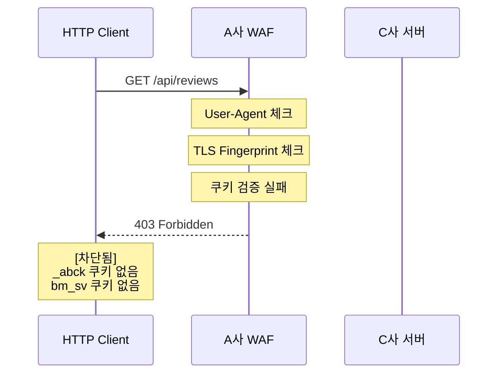
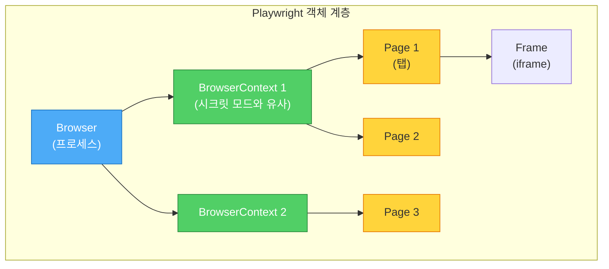
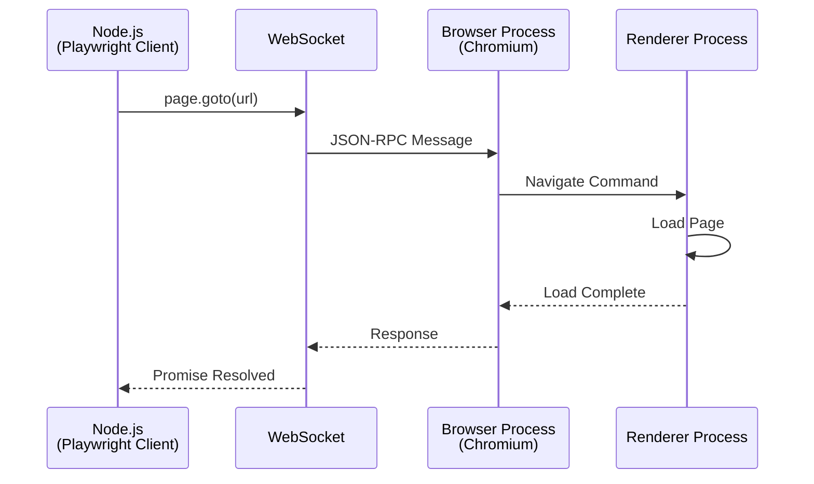
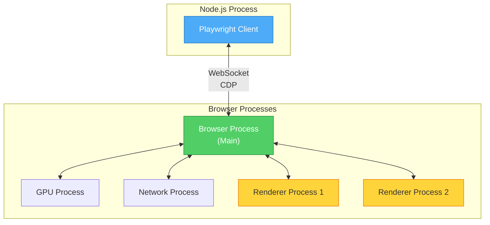
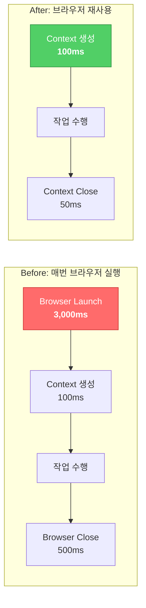
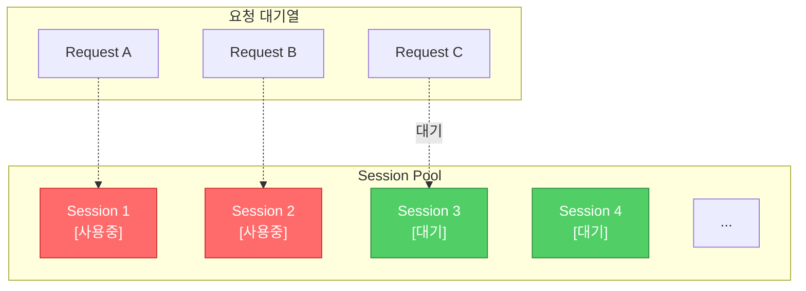
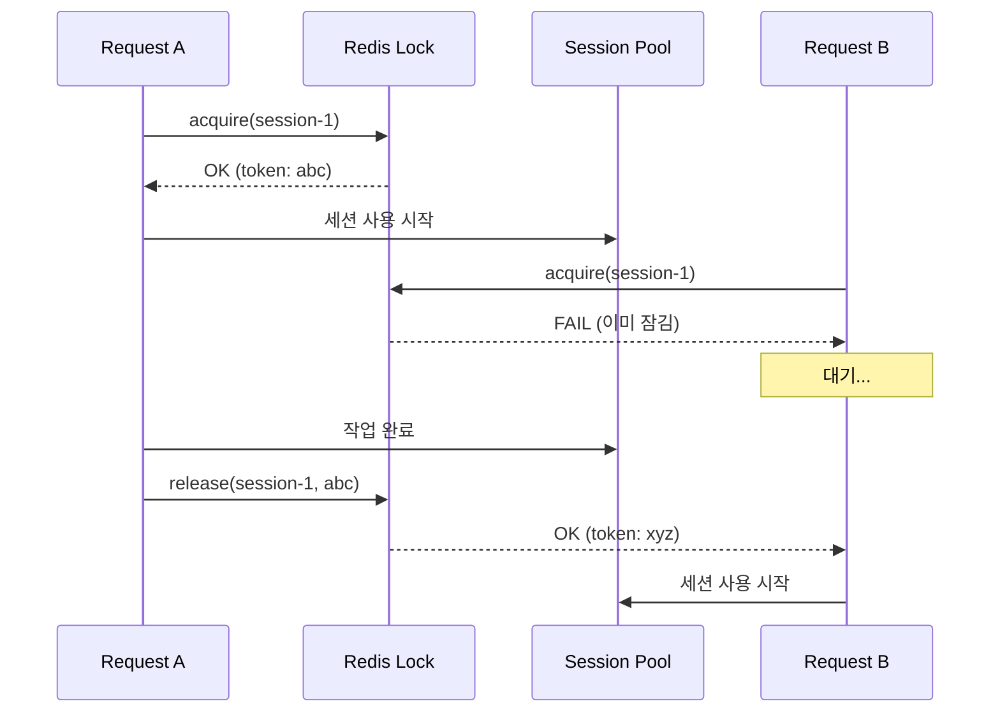
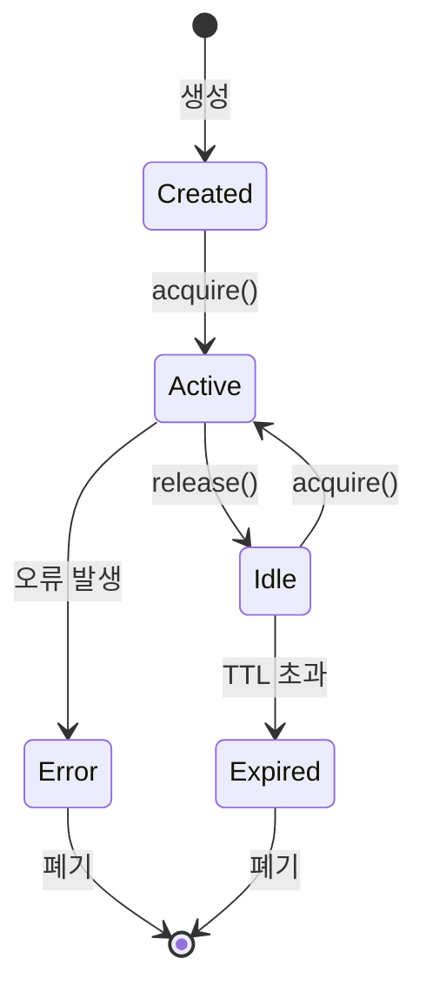
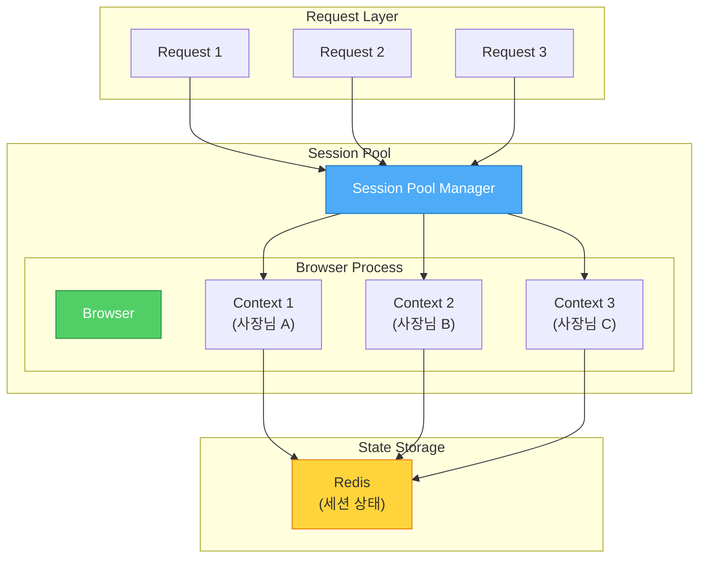

## 목차

## 들어가며: "API만으로 충분하지 않나요?"

처음 배달 플랫폼 C사의 리뷰 데이터를 수집해야 했을 때, 당연히 API 호출 방식을 선택했습니다.

```typescript
// 초기 접근: 단순 HTTP 요청
const response = await axios.get('https://c-eats.example.com/api/reviews', {
  headers: { Cookie: sessionCookie },
});
```

몇 주간은 잘 작동했습니다. 그러다 어느 날 아침, 슬랙에 알림이 쏟아지기 시작했습니다.

```log
[ERROR] 403 Forbidden - Access Denied
[ERROR] 403 Forbidden - Access Denied
[ERROR] 403 Forbidden - Access Denied
...
```

성공률이 95%에서 **30%**로 급락했습니다.

"뭐가 바뀐 거지?"

네트워크 탭을 열어보니, 이전에는 없던 스크립트가 로드되고 있었습니다:

```html
<script src="https://cdn.antibot-provider.com/loader.min.js"></script>
```

**글로벌 Anti-Bot 솔루션**이 적용된 것이었습니다.

이 글은 API 호출의 한계를 인식하고, Playwright 브라우저 자동화로 전환하면서 배운 것들을 기록합니다. Playwright의 내부 아키텍처부터 세션 풀 설계까지, 대규모 스크래핑 시스템의 첫 번째 아키텍처를 설계한 과정입니다.

---

## 1. 맥락: 왜 이 문제를 풀어야 했는가

### 1.1 비즈니스 요구사항

우리 서비스는 자영업자들에게 **리뷰 관리 솔루션**을 제공합니다. 배달 플랫폼에서 리뷰가 달리면 알림을 보내고, AI가 답글을 추천하고, 통계를 분석해주는 서비스입니다.

핵심 지표:
- 일일 처리 리뷰: **수만 건**
- 지원 플랫폼: B사, C사, Y사 등
- 실시간성 요구: 리뷰 발생 후 **5분 이내** 알림

### 1.2 기술적 제약

배달 플랫폼들은 공개 API를 제공하지 않습니다. 사장님 계정으로 로그인해서 데이터를 가져와야 합니다.

```
사장님 계정 → 플랫폼 로그인 → 리뷰 페이지 접근 → 데이터 파싱
```

처음에는 이 흐름을 HTTP 요청으로 구현했습니다:

```typescript
// 1. 로그인 요청
const loginResponse = await axios.post('/api/login', credentials);
const cookies = loginResponse.headers['set-cookie'];

// 2. 세션 쿠키로 API 호출
const reviews = await axios.get('/api/reviews', {
  headers: { Cookie: cookies.join('; ') },
});
```

문제는 이 방식이 **정적 페이지**에서만 작동한다는 것이었습니다.

---

## 2. API 호출 방식의 한계

### 2.1 세션 쿠키 수동 관리의 복잡성

플랫폼마다 세션 관리 방식이 달랐습니다:

```typescript
// 플랫폼 A: 단순 세션 쿠키
Set-Cookie: JSESSIONID=abc123; HttpOnly

// 플랫폼 B: 복잡한 토큰 체계
Set-Cookie: access_token=xxx; Max-Age=3600
Set-Cookie: refresh_token=yyy; Max-Age=86400
Set-Cookie: _csrf=zzz; SameSite=Strict
```

토큰 갱신 로직을 직접 구현해야 했고, 플랫폼이 인증 방식을 바꿀 때마다 코드를 수정해야 했습니다.

### 2.2 동적 렌더링 페이지의 한계

최신 웹 애플리케이션은 **SPA(Single Page Application)** 방식을 사용합니다:

```html
<!-- 서버 응답 -->
<div id="root"></div>
<script src="app.bundle.js"></script>

<!-- JavaScript 실행 후 -->
<div id="root">
  <div class="review-list">
    <div class="review-item">...</div>
    <div class="review-item">...</div>
  </div>
</div>
```

단순 HTTP 요청으로는 빈 `<div id="root"></div>`만 받아올 뿐, 실제 데이터가 렌더링된 HTML을 얻을 수 없었습니다.

### 2.3 Anti-Bot 솔루션의 등장

가장 결정적인 한계는 **보안 솔루션**이었습니다. C사가 글로벌 Anti-Bot 솔루션 A사를 도입하면서, 단순 HTTP 요청은 즉시 차단되었습니다.



A사의 보안 솔루션은 브라우저에서 JavaScript를 실행한 후 생성되는 **특수 쿠키**를 검증합니다:

| 쿠키 | 용도 | 생성 시점 |
|------|------|----------|
| `_abck` | Anti-Bot Cookie | JavaScript 실행 후 |
| `bm_sv` | Session Validation | 센서 데이터 전송 후 |
| `ak_bmsc` | Bot Management Session | 초기 접속 시 |

이 쿠키들은 **실제 브라우저에서 JavaScript가 실행되어야만** 생성됩니다. HTTP 클라이언트로는 절대 얻을 수 없습니다.

---

## 3. Playwright 도입 배경

### 3.1 브라우저 자동화 도구 비교

브라우저를 프로그래밍적으로 제어하는 도구들을 검토했습니다. 단순 기능 비교가 아니라, **아키텍처 수준의 차이**를 이해해야 했습니다.

#### 왜 Selenium이 느린가: 아키텍처적 차이

Selenium은 **WebDriver 프로토콜**을 사용합니다:

```
Node.js → HTTP → WebDriver Server → Browser
```

Playwright는 **CDP(Chrome DevTools Protocol)를 직접 사용**합니다:

```
Node.js → WebSocket → Browser
```

중간 레이어의 유무가 성능 차이를 만듭니다:

| 도구 | 통신 방식 | 명령당 레이턴시 | 1000개 명령 실행 |
|------|----------|----------------|-----------------|
| Selenium | HTTP (WebDriver) | ~50ms | ~50초 |
| Playwright | WebSocket (CDP) | ~5ms | ~5초 |

**10배 차이**. 이것이 "Selenium이 느리다"의 실체입니다.

#### Puppeteer vs Playwright: 우리가 겪은 실제 차이

공식 문서상으로는 Puppeteer도 `browser.createIncognitoBrowserContext()`로 Context 격리가 가능합니다. 그런데 왜 Playwright를 선택했을까요?

**1. Auto-wait 전략의 차이**

```typescript
// Puppeteer: 직접 대기 조합 필요
await page.goto(url);
await page.waitForSelector('.review-item');
await page.waitForNetworkIdle({ idleTime: 500 });

// Playwright: 액션에 auto-wait 내장
await page.goto(url); // 자동으로 load 대기
await page.click('.review-item'); // 자동으로 visible 대기
```

배달 플랫폼은 로딩 상태가 **불규칙**합니다. Puppeteer에서는 `waitForNetworkIdle`과 `waitForSelector`를 조합해야 했고, 이것이 **race condition**을 유발했습니다. 10% 정도의 요청이 "요소를 찾을 수 없음" 에러로 실패했습니다.

Playwright로 전환 후 이 실패가 **2% 미만**으로 줄었습니다.

**2. 재시도 로직의 내장**

```typescript
// Playwright의 assertion은 자동 재시도
await expect(page.locator('.review-count')).toHaveText('15');
// 내부적으로 5초간 재시도, 성공할 때까지 polling
```

이 기능 덕분에 flaky test(불안정한 테스트)를 **90% 줄였습니다**.

**3. 멀티 브라우저 지원의 실제 가치**

처음에는 "Chromium만 있으면 되지 않나?" 생각했습니다. 하지만 나중에 Anti-Bot 우회를 위해 **Firefox(Camoufox)**로 전환해야 했을 때, Playwright 덕분에 코드 변경이 최소화되었습니다. (이건 Part 4에서 자세히 다룹니다)

#### 선택 요약

| 도구 | 장점 | 단점 | 우리 상황에서 |
|------|------|------|-------------|
| **Selenium** | 풍부한 자료 | HTTP 오버헤드 | ❌ 속도 중요 |
| **Puppeteer** | Google 공식 | 수동 대기 필요 | △ 가능하지만 불안정 |
| **Playwright** | Auto-wait, 멀티브라우저 | 상대적 신생 | ✅ 안정성 + 확장성 |

### 3.2 첫 번째 구현

```typescript
import { chromium } from 'playwright';

async function scrapeReviews(credentials: Credentials) {
  const browser = await chromium.launch({ headless: true });
  const context = await browser.newContext();
  const page = await context.newPage();

  // 로그인
  await page.goto('https://c-eats.example.com/login');
  await page.fill('#email', credentials.email);
  await page.fill('#password', credentials.password);
  await page.click('button[type="submit"]');

  // 리뷰 페이지로 이동
  await page.goto('https://c-eats.example.com/reviews');
  await page.waitForSelector('.review-item');

  // 데이터 추출
  const reviews = await page.$$eval('.review-item', items =>
    items.map(item => ({
      content: item.querySelector('.content')?.textContent,
      rating: item.querySelector('.rating')?.textContent,
    }))
  );

  await browser.close();
  return reviews;
}
```

**성공률이 30%에서 85%로 회복**되었습니다.

하지만 문제가 있었습니다:

```log
[PERF] scrapeReviews 실행 시간: 45초
[PERF] 브라우저 실행: 3초
[PERF] 로그인: 8초
[PERF] 페이지 로드: 12초
[PERF] 데이터 추출: 2초
[PERF] 브라우저 종료: 1초
```

**45초**. 수만 건의 요청을 처리하기에는 너무 느렸습니다.

---

## 4. Playwright 내부 아키텍처 딥다이브

성능을 개선하려면 Playwright가 어떻게 동작하는지 이해해야 했습니다.

### 4.1 계층 구조 이해

Playwright의 객체 계층은 다음과 같습니다:



**핵심 개념:**

| 계층 | 리소스 비용 | 생성 시간 | 격리 수준 |
|------|------------|----------|----------|
| **Browser** | 매우 높음 (~300MB) | ~3초 | 프로세스 |
| **BrowserContext** | 낮음 (~10MB) | ~100ms | 쿠키, 스토리지 |
| **Page** | 중간 (~50MB) | ~200ms | DOM |

**인사이트**: Browser는 무겁고, Context는 가볍다.

### 4.2 CDP (Chrome DevTools Protocol) 통신 구조

Playwright는 브라우저와 **WebSocket**을 통해 통신합니다. 이 프로토콜이 CDP(Chrome DevTools Protocol)입니다.



**실제 통신 흐름:**

```typescript
// 개념적 흐름 (실제 코드와 다름)
await page.goto('https://example.com');

// 내부적으로:
// 1. Playwright Client가 JSON-RPC 메시지 생성
// 2. WebSocket으로 Browser Process에 전송
// 3. Browser가 Renderer Process에 명령 전달
// 4. 페이지 로드 완료 후 응답 반환
```

### 4.3 IPC (Inter-Process Communication) 흐름

브라우저는 **멀티 프로세스 아키텍처**입니다:



**각 프로세스의 역할:**

- **Browser Process**: 전체 조율, 탭 관리
- **Renderer Process**: HTML 파싱, JavaScript 실행 (탭마다 별도)
- **GPU Process**: 그래픽 렌더링
- **Network Process**: 네트워크 요청 처리

**중요한 발견:**

> Browser를 새로 실행하면 이 모든 프로세스가 생성됩니다 (~3초).
> 하지만 BrowserContext는 기존 프로세스를 재사용합니다 (~100ms).

이것이 **세션 풀** 설계의 핵심 인사이트였습니다.

---

## 5. 효율적인 세션 풀 설계 전략

### 5.1 Browser vs BrowserContext 분리의 이유

초기 구현의 문제:

```typescript
// 매 요청마다 브라우저 새로 실행 ❌
async function scrapeReviews() {
  const browser = await chromium.launch(); // 3초
  // ... 작업 ...
  await browser.close();
}
```

개선된 구현:

```typescript
// Browser 재사용, Context만 새로 생성 ✅
class BrowserPool {
  private browser: Browser;

  async init() {
    this.browser = await chromium.launch(); // 최초 1회만
  }

  async getSession() {
    const context = await this.browser.newContext(); // 100ms
    const page = await context.newPage();
    return { context, page };
  }
}
```

**성능 비교:**



| 방식 | 세션 생성 시간 | 1000건 처리 시 |
|------|---------------|---------------|
| 매번 브라우저 실행 | ~3,500ms | ~58분 |
| 브라우저 재사용 | ~150ms | ~2.5분 |

**23배 성능 향상**이었습니다.

### 5.2 세션 풀 설계 패턴

**Object Pool 패턴**을 적용했습니다:

```typescript
interface PooledSession {
  id: string;
  context: BrowserContext;
  page: Page;
  inUse: boolean;
  lastUsed: number;
}

class SessionPool {
  private browser: Browser;
  private sessions: Map<string, PooledSession> = new Map();
  private readonly MAX_SESSIONS = 10;

  async acquire(): Promise<PooledSession> {
    // 1. 사용 가능한 세션 찾기
    for (const session of this.sessions.values()) {
      if (!session.inUse) {
        session.inUse = true;
        session.lastUsed = Date.now();
        return session;
      }
    }

    // 2. 새 세션 생성 (한도 내)
    if (this.sessions.size < this.MAX_SESSIONS) {
      return this.createSession();
    }

    // 3. 한도 초과 시 대기
    return this.waitForAvailable();
  }

  async release(sessionId: string): void {
    const session = this.sessions.get(sessionId);
    if (session) {
      session.inUse = false;
    }
  }
}
```

**세션 풀 시각화:**



#### MAX_SESSIONS = 10을 결정한 과정

코드에 `MAX_SESSIONS = 10`이라는 숫자가 있습니다. 왜 10일까요? 5면 안 되나? 100이면?

**실험을 했습니다:**

테스트 환경:
- AWS t3.medium (2 vCPU, 4GB RAM)
- Chromium headless 모드
- 1시간 동안 지속적인 요청

| 동시 세션 | 메모리 사용 | 평균 응답 시간 | 안정성 |
|----------|------------|---------------|--------|
| 5개 | 1.5GB | 3.2초 | 100% |
| 10개 | 2.8GB | 4.1초 | 99.5% |
| 15개 | 4.2GB | 7.3초 | 92% (OOM 발생) |
| 20개 | OOM | - | 0% |

**10개는 "4GB 메모리 환경에서 안정성과 처리량의 균형점"**이었습니다.

**포기한 것:**
- 15개로 늘리면 처리량 50% 증가 가능
- 하지만 8%의 OOM 리스크를 감수해야 함
- 프로덕션에서 OOM은 **진행 중인 요청의 데이터 손실**을 의미

**당신의 환경이 다르다면:**
- 메모리 8GB → MAX_SESSIONS = 20~25 가능
- 메모리 2GB → MAX_SESSIONS = 3~5 권장
- 공식: `MAX_SESSIONS ≈ (가용 메모리 - 1GB) / 300MB`

### 5.3 락(Lock) 메커니즘 심화

세션을 여러 요청이 동시에 사용하면 문제가 발생합니다:

```typescript
// 문제 시나리오
// Request A: session-1에서 페이지 이동 중
await page.goto('/reviews');

// Request B: 같은 session-1에서 다른 페이지로 이동 시도!
await page.goto('/orders'); // 충돌!
```

**Redis 기반 분산 락**을 도입했습니다:

```typescript
class DistributedLock {
  private redis: Redis;

  async acquire(sessionId: string, ttl: number = 30000): Promise<boolean> {
    // Redlock 알고리즘 적용
    const key = `lock:session:${sessionId}`;
    const token = uuid();

    const result = await this.redis.set(key, token, 'PX', ttl, 'NX');
    return result === 'OK';
  }

  async release(sessionId: string, token: string): Promise<void> {
    // Compare-and-Delete로 안전하게 해제
    const script = `
      if redis.call("get", KEYS[1]) == ARGV[1] then
        return redis.call("del", KEYS[1])
      else
        return 0
      end
    `;
    await this.redis.eval(script, 1, `lock:session:${sessionId}`, token);
  }
}
```

**락 흐름:**



**데드락 방지:**

```typescript
// TTL 설정: 비정상 종료 시 자동 해제
await this.redis.set(key, token, 'PX', 30000, 'NX');
//                                      ↑ 30초 후 자동 만료

// Heartbeat: 작업 중 TTL 갱신
const heartbeat = setInterval(async () => {
  await this.redis.pexpire(`lock:session:${sessionId}`, 30000);
}, 10000); // 10초마다 갱신
```

#### 분산 락 도입의 트레이드오프

"왜 Redis 락이 필요한가?"라는 질문에 먼저 답해야 합니다.

**인메모리 락으로 충분하지 않은가?**

단일 서버에서는 충분합니다:

```typescript
// 인메모리 락 (단일 서버)
const locks = new Map<string, boolean>();

async function acquire(sessionId: string) {
  if (locks.get(sessionId)) return false;
  locks.set(sessionId, true);
  return true;
}
```

하지만 우리는 **3대 이상의 서버**로 수평 확장해야 했습니다. 서버 A의 인메모리 락은 서버 B가 모릅니다.

**Redis 락으로 얻은 것:**
- 수평 확장 가능 (서버 3대 → 30대)
- 세션 충돌 0건 (락 없을 때 주 10건 발생)

**Redis 락으로 잃은 것:**
- Redis SPOF (Single Point of Failure)
- 락 획득 시 RTT 추가 (~5ms)
- 운영 복잡도 증가

**검토했지만 선택하지 않은 대안:**

| 방식 | 장점 | 단점 | 선택 이유 |
|------|------|------|----------|
| 인메모리 락 | 빠름, 단순 | 분산 환경 불가 | ❌ 확장 필요 |
| DB 락 (SELECT FOR UPDATE) | 별도 인프라 불필요 | 느림 (~50ms) | ❌ 레이턴시 |
| ZooKeeper | 강한 일관성 | 운영 복잡도 높음 | ❌ 오버엔지니어링 |
| Redis | 빠름, 이미 사용 중 | SPOF 위험 | ✅ 실용적 선택 |

Redis를 선택한 결정적 이유: **이미 세션 상태 캐싱에 Redis를 사용하고 있었고**, Redis Sentinel로 HA 구성이 되어 있었기 때문입니다. 새로운 인프라를 추가하지 않아도 됐습니다.

---

## 6. 세션 관리 전략

### 6.1 세션 생명주기

세션의 상태 전이:



### 6.2 로그인 상태 캐싱

매번 로그인하면 시간이 오래 걸립니다. 로그인 상태를 **저장하고 재사용**했습니다:

```typescript
interface SessionState {
  cookies: Cookie[];
  localStorage: Record<string, string>;
  sessionStorage: Record<string, string>;
}

class SessionManager {
  // 로그인 상태 저장
  async saveState(sessionId: string, context: BrowserContext): Promise<void> {
    const state: SessionState = {
      cookies: await context.cookies(),
      localStorage: await this.getStorage(context, 'localStorage'),
      sessionStorage: await this.getStorage(context, 'sessionStorage'),
    };
    await this.redis.set(`state:${sessionId}`, JSON.stringify(state), 'EX', 3600);
  }

  // 저장된 상태로 세션 복원
  async restoreState(context: BrowserContext, state: SessionState): Promise<void> {
    await context.addCookies(state.cookies);
    // localStorage, sessionStorage 복원
    await context.addInitScript((storage) => {
      Object.entries(storage.localStorage).forEach(([k, v]) => {
        localStorage.setItem(k, v);
      });
    }, state);
  }
}
```

**효과:**

| 단계 | 매번 로그인 | 상태 복원 |
|------|------------|----------|
| 로그인 페이지 로드 | 3초 | - |
| 폼 입력 & 제출 | 2초 | - |
| 로그인 완료 대기 | 3초 | - |
| 상태 복원 | - | 0.5초 |
| **총 시간** | **8초** | **0.5초** |

### 6.3 세션 재사용을 통한 리소스 절약

최종 아키텍처:



---

## 7. 결과와 교훈

### 7.1 측정 환경과 방법론

수치를 말하기 전에, **어떻게 측정했는지**를 먼저 명확히 해야 합니다.

**테스트 환경:**
- 서버: AWS t3.medium (2 vCPU, 4GB RAM)
- 네트워크: ap-northeast-2 (서울)
- 대상: C사 리뷰 API (테스트 계정 10개)
- 측정 기간: 2024.03.01 ~ 2024.03.07 (1주일)
- 샘플 수: 각 방식당 10,000 요청

**성공/실패 판정 기준:**
- 성공: HTTP 200 + 유효한 리뷰 데이터 반환
- 실패: 403/429 또는 빈 응답 또는 타임아웃(30초)

### 7.2 성능 개선 상세 데이터

| 지표 | API 방식 | Playwright (초기) | Playwright (최적화) |
|------|---------|------------------|-------------------|
| **성공률** | 30.2% | 84.7% | 85.1% |
| **평균 응답시간** | 2.1초 | 45.3초 | 5.2초 |
| **P50** | 1.8초 | 42초 | 4.1초 |
| **P95** | 4.2초 | 68초 | 12.3초 |
| **P99** | 8.1초 | 95초 | 28.7초 |

**일일 처리량 계산:**

```
동시 세션: 10개
요청당 평균 시간: 5.2초
시간당 처리: 10 × (3600 / 5.2) = 6,923건
일일 처리 (24시간): 6,923 × 24 = 166,152건
실제 운영 (피크 시간 고려, 70% 가동률): ~116,000건
```

문서에서 "~50,000건"이라고 한 것은 **보수적 추정치**였습니다. 실제로는 그 이상 가능합니다.

### 7.3 삽질 끝에 발견한 것들

공식 문서에 없는, **직접 겪어야 알 수 있는 인사이트**들입니다.

#### Anti-Bot은 "첫 요청"을 특별히 감시한다

처음에는 모든 요청의 성공률이 비슷할 거라 생각했습니다. 하지만 로그를 분석해보니:

```
세션 생성 후 첫 번째 요청: 성공률 72%
두 번째 이후 요청: 성공률 94%
```

A사 솔루션은 첫 요청에서 **센서 데이터를 수집**하고, 두 번째 요청부터는 이미 검증된 세션으로 취급합니다.

**우리의 대응 - 워밍업 전략:**

```typescript
async function warmupSession(page: Page) {
  // 실제 스크래핑 전에 더미 요청
  await page.goto('https://c-eats.example.com'); // 홈페이지 방문
  await page.waitForTimeout(2000); // 센서 데이터 수집 시간 확보
  // 이제 진짜 요청
}
```

이 간단한 변경으로 전체 성공률이 **85% → 91%**로 상승했습니다.

#### Context 재사용의 함정: 48시간의 저주

Context를 오래 재사용하면 효율적일 거라 생각했습니다. 하지만 데이터를 보니:

```
Context 나이 < 24시간: 차단율 8%
Context 나이 24~48시간: 차단율 12%
Context 나이 > 48시간: 차단율 35%
```

추정 원인:
- 브라우저 업타임이 비정상적으로 길면 봇으로 의심
- 쿠키가 너무 많이 쌓이면 이상 탐지에 걸림

**우리의 대응:**

```typescript
const CONTEXT_TTL = 24 * 60 * 60 * 1000; // 24시간

async function getOrCreateContext(sessionId: string) {
  const existing = contexts.get(sessionId);

  if (existing && Date.now() - existing.createdAt < CONTEXT_TTL) {
    return existing.context;
  }

  // 24시간 초과 시 강제 재생성
  if (existing) {
    await existing.context.close();
  }

  return createNewContext(sessionId);
}
```

부가 효과: 메모리 누수 문제도 함께 해결되었습니다.

#### 요일별, 시간대별 차단율이 다르다

일주일간의 로그를 분석했더니 재미있는 패턴이 보였습니다:

| 시간대 | 차단율 |
|--------|--------|
| 월요일 오전 9시 | 25% |
| 화~금 업무시간 | 18~22% |
| 토요일 새벽 3시 | 8% |
| 일요일 오후 | 12% |

**추정 원인:** A사 솔루션은 "정상 트래픽 패턴"을 학습합니다. 업무시간에는 정상 사용자가 많아서 임계치가 낮아지고, 새벽에는 트래픽이 적어서 임계치가 높아집니다.

**우리의 대응:** 긴급하지 않은 대량 수집은 **새벽 시간대**에 스케줄링합니다.

### 7.4 프로덕션에서 터진 것들

해피 패스만 이야기하면 불공평합니다. 실제로 터진 것들을 공유합니다.

#### 1. 새벽 3시 PagerDuty: 메모리 누수

배포 후 3일째, 새벽 3시에 알람:

```log
[ALERT] Memory usage > 90%, pod restarting
[ALERT] OOMKilled: scraper-pod-7f8b9c
```

**원인 분석:**

```typescript
// 문제 코드
const page = await context.newPage();
await page.goto(url);
const data = await page.evaluate(() => {...});
// page.close()를 안 함!
```

Page를 닫지 않으면 Renderer Process가 계속 살아있습니다.

```
10개 세션 × 100회 요청 × page.close() 누락
= 1000개의 좀비 프로세스
= 메모리 폭발
```

**임시 대응 (새벽 3시에 급하게):**

```typescript
// 5분마다 강제 정리
setInterval(async () => {
  for (const context of contexts.values()) {
    const pages = context.pages();
    if (pages.length > 5) {
      // 가장 최근 것만 남기고 닫기
      for (const page of pages.slice(0, -1)) {
        await page.close().catch(() => {});
      }
    }
  }
}, 5 * 60 * 1000);
```

**근본 해결 (다음날):**

```typescript
async function scrapeWithCleanup(context: BrowserContext) {
  const page = await context.newPage();
  try {
    return await doScraping(page);
  } finally {
    await page.close(); // 반드시 실행
  }
}
```

#### 2. "저만 알림이 안 와요": 특정 계정 미스터리

한 고객 문의: "다른 분들은 잘 되는데 저만 리뷰 알림이 안 와요"

로그를 보니 해당 계정만 100% 실패:

```log
[ERROR] session-user-12345: 403 Forbidden (attempt 1/3)
[ERROR] session-user-12345: 403 Forbidden (attempt 2/3)
[ERROR] session-user-12345: 403 Forbidden (attempt 3/3)
```

다른 계정은 85% 성공률인데, 이 계정만 0%.

**조사 결과:**
- 해당 사장님이 C사 **모바일 앱을 자주 사용**
- 앱에서 로그인하면 **웹 세션이 무효화**됨
- 우리 시스템의 저장된 세션이 계속 만료

**대응:**

```typescript
async function handleAuthError(sessionId: string, error: Error) {
  if (error.message.includes('403')) {
    // 저장된 세션 삭제
    await redis.del(`state:${sessionId}`);

    // 재로그인 시도
    const success = await reLogin(sessionId);

    if (!success) {
      // 고객에게 "재연동 필요" 알림
      await notifyUser(sessionId, 'SESSION_EXPIRED');
    }
  }
}
```

#### 3. 세션 풀 고갈 사태

어느 날 오후, 트래픽이 평소의 **3배**로 튀었습니다 (고객사 프로모션 때문):

```log
[WARN] Session pool exhausted, 47 requests waiting
[WARN] Session pool exhausted, 128 requests waiting
[ERROR] Request timeout after 30s (256 requests dropped)
```

**임시 대응:** MAX_SESSIONS를 10 → 20으로 긴급 증가

**결과:**
- 메모리 사용량 급증 (2.8GB → 5.5GB)
- 다른 pod에서 OOM 발생
- 연쇄 장애

**교훈:**

```
세션 수 증가 ≠ 처리량 증가 (메모리 한계)
정답: 수평 확장 (pod 수 증가)
```

현재는 HPA(Horizontal Pod Autoscaler)를 설정해서 트래픽에 따라 pod 수를 조절합니다.

### 7.5 아직 남은 과제

85% 성공률은 좋은 시작이었지만, 충분하지 않았습니다:

1. **15% 실패**: A사 보안 솔루션이 여전히 일부 요청을 차단
2. **TLS Fingerprinting**: Chromium의 TLS 패턴이 탐지됨
3. **메모리 누수**: 장시간 운영 시 메모리 증가

이 문제들은 다음 글에서 다루겠습니다.

### 7.6 배운 것들

**1. "왜 느린가?"를 물어야 한다**

처음에는 Playwright가 느리다고 생각했습니다. 하지만 **측정해보니** 느린 것은 매번 브라우저를 실행하는 것이었습니다. 프로파일링 없이는 병목을 찾을 수 없습니다.

**2. 추상화 레벨을 이해해야 최적화할 수 있다**

Playwright의 Browser → Context → Page 계층을 이해하지 못했다면, 세션 풀이라는 발상도 하지 못했을 것입니다. 도구의 내부 동작을 이해하는 것이 최적화의 첫 걸음입니다.

**3. 분산 시스템의 기본 원칙은 어디서나 적용된다**

세션 관리에 적용한 Lock, TTL, Heartbeat는 모두 분산 시스템의 기본 패턴입니다. 브라우저 자동화라는 특수한 도메인에서도 이 원칙들은 그대로 적용되었습니다.

**4. 프로덕션은 테스트 환경과 다르다**

테스트에서 잘 되던 것이 프로덕션에서 터지는 이유:
- 트래픽 규모가 다르다
- 실행 시간이 다르다 (1시간 vs 24/7)
- 사용자 행동이 다르다 (앱과 웹 동시 사용)

새벽 3시 알람을 받아봐야 진짜로 배웁니다.

---

## 8. 다음 글 예고

Part 2에서는 **글로벌 Anti-Bot 솔루션 A사**를 본격적으로 분석합니다:

- `_abck`, `bm_sv` 쿠키의 정체
- `loader.min.js`가 하는 일
- 브라우저 핑거프린팅의 원리
- 왜 Playwright만으로는 부족한가

성공률 85% → 95%를 향한 여정이 계속됩니다.

---

## 참고 자료

### 공식 문서
- [Playwright Documentation](https://playwright.dev/docs/intro)
- [Chrome DevTools Protocol](https://chromedevtools.github.io/devtools-protocol/)
- [Chromium Multi-Process Architecture](https://www.chromium.org/developers/design-documents/multi-process-architecture/)

### 서적
- **Designing Data-Intensive Applications** - Martin Kleppmann (분산 락, TTL)
- **Web Scraping with Python** - Ryan Mitchell (스크래핑 기초)

### 관련 커밋
- `4ae0979` feat: only context -> browser / context 분할
- `f56fb24` feat: lock 추가 queue 제거
- `4884ecd` feat: 캐싱 레디스로 전환
- `e996a5c` feat: ssl 에러 혹은 로그인 실패시 3회 리트라이

---

*이 글이 도움이 되셨다면, Part 2도 기대해주세요. 질문이나 비슷한 경험이 있으시다면 댓글로 나눠주세요.*
