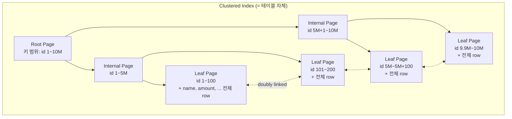
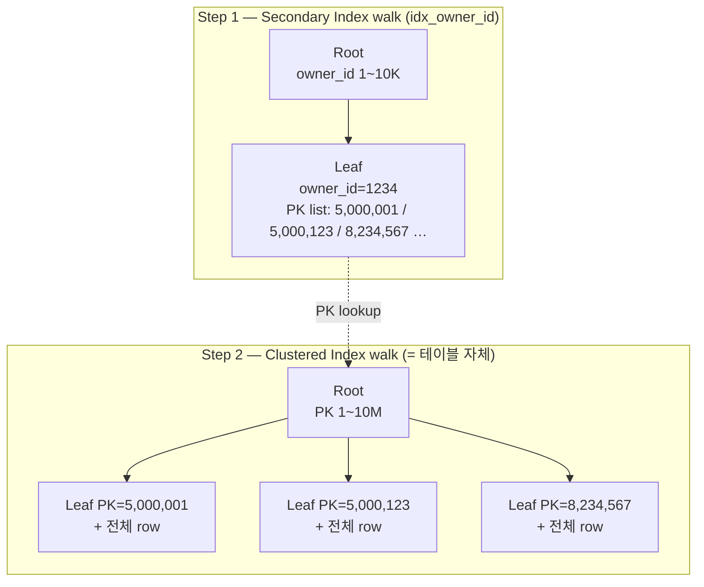
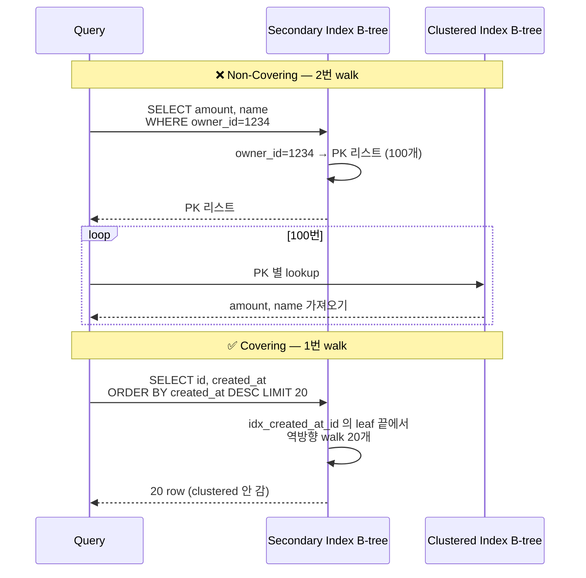
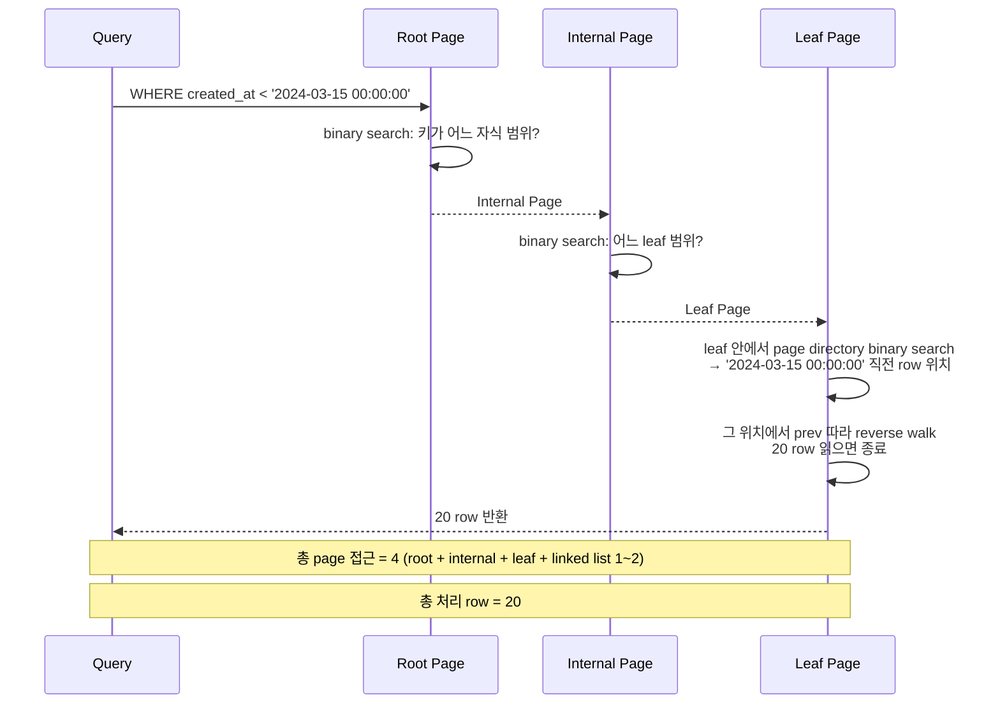
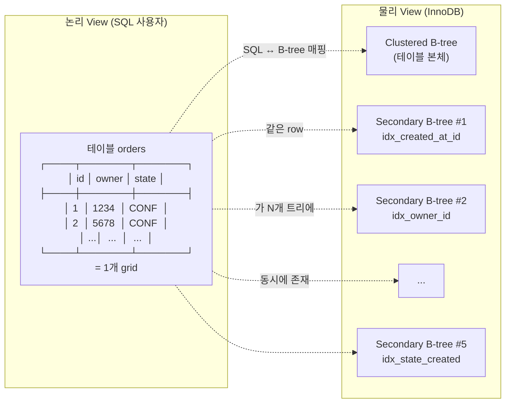

## Table of contents

## 들어가며 — 인덱스 안 걸어도 InnoDB 는 이미 B-tree 안에 row 를 정렬해서 저장한다 {#intro}

"테이블에 인덱스 안 걸면 어떻게 저장돼요?" 라는 질문을 면접에서 받았다고 가정해 봅니다. 흔한 답은 두 가지입니다.

1. "디스크에 INSERT 순서대로 쌓입니다."
2. "정렬 없이 들어간 순서대로 들어갑니다."

**둘 다 InnoDB 에선 틀린 답** 입니다. InnoDB 는 **인덱스를 안 걸어도** 이미 row 를 **B-tree 안에 정렬해서** 저장합니다. PK 가 명시되면 PK 가 그 트리의 키. PK 가 없으면 InnoDB 가 hidden ROWID 6-byte 를 자동으로 생성해서 그것을 키로 씁니다. **테이블에 인덱스 0개** 인 상황은 InnoDB 안에서는 **존재하지 않습니다**. 항상 B-tree 1개는 있습니다.

이 한 가지 사실이 흔들리면 다음 모든 게 같이 흔들립니다.

- "secondary index 는 어디로 가서 row 를 찾는가" — **물리 위치** 가 아니라 **PK** 를 가리킨다. **2번 lookup** 의 본질
- "covering index 가 빠른 이유" — **PK 까지 안 가도** leaf 안에 답이 있어서. 1번 lookup 으로 끝
- "DESC 정렬이 ASC 와 비슷하게 빠른 이유" — leaf 가 **양방향 linked list** 라서 거꾸로 walk 가능
- "OFFSET 이 건너뛸 수 없는 이유" — B-tree 가 **row 카운터를 안 가지기** 때문. 매 INSERT/DELETE 마다 카운터 갱신하면 lock 폭증
- "cursor 가 빠른 이유" — `WHERE created_at < ?` 가 B-tree 의 **binary search primitive** 를 트리거. root 에서 leaf 까지 한 번에 점프
- "인덱스 5개 = 쓰기 5배 비용" — 같은 테이블에 **B-tree 5개 + clustered 1개 = 6개** 가 동시에 존재하기 때문

이 글은 그 모든 한 줄을 **다이어그램 10개 + 1,000만 row [실측 — Java/Spring]** 로 끝까지 풀어봅니다.

- 자매글 [MySQL No-Offset Cursor 페이지네이션 — 1,000만 row에서 OFFSET 1M이 171ms / Cursor 0.30ms](/posts/mysql-no-offset-cursor-pagination/) 가 같은 측정을 **page 단위 운영 처방** 측면에서 다뤘다면, 본 글은 그 4개 개념 (covering / reverse / OFFSET / cursor) 을 **B-tree 메커니즘 + 다이어그램** 으로 **원리 차원** 에서 다시 봅니다. 두 글이 짝.
- 본 글의 입력 자산: 1,000만 row 적재 측정 (187K rows/s) + 5종 인덱스 cardinality + Q1~Q5 Before/After 측정.
- 본 글의 깊이: **L2-L3** (RDB Mastery 시리즈 1편 — **InnoDB 메커니즘 + 측정 + 빅테크 운영 회고 + 면접 답변**).

---

## 1. InnoDB 의 기본 단위 — Page (16KB) / Row / Index {#innodb-units-page-row-index}

### 1.1 page = InnoDB 의 **물리적 단위**

InnoDB 는 모든 데이터를 **page (16KB default)** 단위로 다룹니다. 디스크에서 읽을 때도 16KB, 메모리 (buffer pool) 에 올릴 때도 16KB, B-tree 의 노드도 16KB.

[MySQL 공식 — InnoDB Disk Layout](https://dev.mysql.com/doc/refman/8.0/en/innodb-disk-layout.html) 에 명시:

> "InnoDB stores all data in pages. The page size is fixed at 16KB by default and is determined by the `innodb_page_size` variable at the time the MySQL instance is initialized."

→ row 1개를 읽으려고 해도 InnoDB 는 **그 row 가 들어 있는 16KB page 전체** 를 읽습니다. 이게 **random I/O** 비용이 큰 이유. row 1개 = page 1개 = 16KB.

### 1.2 row = page 안의 record

page 안에는 여러 row 가 **PK 정렬 순서** 로 저장됩니다. 다이어그램 1 — page 한 장의 ASCII 배치.

```
┌──────────────────── page (16KB) ────────────────────┐
│ FIL Header (38B): checksum / page_no / prev / next  │
├─────────────────────────────────────────────────────┤
│ Page Header (56B): n_recs / free space / index_id   │
├─────────────────────────────────────────────────────┤
│ Infimum / Supremum (가상 record 2개)                │
├─────────────────────────────────────────────────────┤
│ User Records (실제 row 들 — PK 순으로 정렬)         │
│  ┌─────────────────────────────────────┐           │
│  │ Row #1: id=1001, name='A', amount=… │           │
│  ├─────────────────────────────────────┤           │
│  │ Row #2: id=1002, name='B', amount=… │           │
│  ├─────────────────────────────────────┤           │
│  │ Row #3: id=1003, name='C', amount=… │           │
│  └─────────────────────────────────────┘           │
│  ... ~100 row / page (row 크기에 따라)              │
├─────────────────────────────────────────────────────┤
│ Free Space (앞으로 INSERT 될 자리)                  │
├─────────────────────────────────────────────────────┤
│ Page Directory (slot 배열 — binary search 용)       │
├─────────────────────────────────────────────────────┤
│ FIL Trailer (8B): checksum 검증                     │
└─────────────────────────────────────────────────────┘
```

→ 다이어그램 1 해석. page 안의 user records 는 **PK 순으로 정렬되어 있습니다** (인덱스를 안 걸어도). page directory 는 page 안에서 **binary search** 가 가능하도록 sparse 한 slot 배열을 따로 둠. row 100개를 다 비교 안 하고 **log(N)** 비교로 page 안에서 row 1개를 찾을 수 있게 하는 구조.

`prev` / `next` 포인터는 **doubly-linked list** — 같은 레벨의 다른 page 와 연결됩니다. 이게 5장 의 reverse scan 의 물리적 기반.

[MySQL 공식 — InnoDB Page Structure](https://dev.mysql.com/doc/refman/8.0/en/innodb-row-format.html) + [Jeremy Cole — InnoDB Page Anatomy](https://blog.jcole.us/2013/01/07/the-physical-structure-of-innodb-index-pages/) 가 page 의 byte-level 분해를 가장 자세히 다룹니다.

### 1.3 인덱스 = page 들이 **B+-tree** 로 연결된 구조

지금까지 본 것을 한 줄로 다시 정리하면 — **page 는 InnoDB 의 16KB 물리 단위** 이고, 그 안에 **row 들이 PK 정렬된 채로** 들어 있고, 양옆 page 와 **prev / next 로 연결** 되어 있습니다. 이제 그 page 들이 **어떻게 부모-자식 관계로 묶여서 인덱스가 되는지**.

page 1장에 100개 row 가 들어가면 1,000만 row = page **10만 장**. 이 10만 장을 **B+-tree** 로 묶어서 **root → internal → leaf** 의 트리를 만듭니다. height 가 보통 3~4 — 1,000만 row 도 **page 3-4장만 읽으면** 임의의 row 1개에 도달.

이 점이 인덱스 설계의 **제1원칙**. **disk seek 횟수 = tree height + leaf scan**. 인덱스 hit 시 disk seek = 3~4. full scan 시 disk seek = 100K. 이 차이가 latency 1,000배~10,000배 의 본질.

→ buffer pool / log / undo 등 InnoDB 메모리·로깅 측면은 [MySQL InnoDB 아키텍처 이해](/posts/mysql-innodb-architecture-deep-dive/) 에서 다뤘으니 본 글에선 **index 구조** 에만 집중합니다.

---

## 2. 모든 InnoDB 테이블은 B-tree — Clustered Index {#clustered-index-table-as-btree}

### 2.0 정의 — **세 가지 의미가 한 문장에**

> **Clustered Index = 테이블의 데이터 자체가 키 순서로 정렬되어 저장된 B-tree 1개.**

이 한 문장에 세 가지가 결합:

- **① 데이터 자체** — leaf 가 전체 row (secondary 와 결정적 차이)
- **② 키 순서로 정렬** — physical layout 결정 (PK / UNIQUE NOT NULL / hidden ROWID 중 하나)
- **③ B-tree 1개** — 테이블당 정확히 하나 (반드시 존재)

→ 이 정의에서 다음이 모두 도출:

- "테이블에 인덱스 0개" 가 InnoDB 안에서 **불가능** — clustered 가 항상 존재
- "Full Table Scan = Clustered Index Full Scan" — 동의어
- "AUTO_INCREMENT = page split 적음" — 항상 마지막 leaf 에만 INSERT
- "Secondary index lookup = 2번 walk" — PK 거쳐서 clustered 까지

다음 2.1 절부터 이 세 가지를 차례로.

### 2.1 PK 가 있을 때: PK = clustered index = **테이블 자체**

InnoDB 의 첫 번째 **근본 사실** 은 이것입니다.

> "InnoDB 의 모든 테이블은 **clustered index** 로 저장됩니다. PK 가 정의되어 있으면 PK 가 clustered index 의 키. clustered index 의 leaf 노드는 **PK + 모든 컬럼 값** 을 담고 있어서 — **테이블 자체** 와 같습니다."

[MySQL 공식 — Clustered and Secondary Indexes](https://dev.mysql.com/doc/refman/8.0/en/innodb-index-types.html) 에 명시:

> "Each InnoDB table has a special index called the clustered index where the data for the rows is stored. Typically, the clustered index is synonymous with the primary key."

다이어그램 2 — clustered index B-tree 의 모양:



→ 다이어그램 2 해석. **leaf 노드 안에 전체 row** 가 들어 있다는 점이 핵심. PK 가 곧 row 의 물리적 위치를 결정합니다. PK 1과 PK 2는 **반드시 인접한 leaf** (또는 같은 leaf) 에 있고, PK 1과 PK 9,999,999는 **멀리 떨어진** leaf 에 있습니다. **테이블이 PK 순서로 물리적으로 정렬되어 있다** 는 말이 이 뜻.

### 2.2 PK 가 없을 때: hidden ROWID 6-byte 자동 생성

"PK 안 정의하면?" — InnoDB 가 6-byte hidden integer 를 자동 생성합니다. [MySQL 공식 — Clustered Index](https://dev.mysql.com/doc/refman/8.0/en/innodb-index-types.html) 명시:

> "If the table has no PRIMARY KEY or suitable UNIQUE index, InnoDB internally generates a hidden clustered index named GEN_CLUST_INDEX on a synthetic column containing row ID values. The rows are ordered by the ID that InnoDB assigns to the rows in such a table. The row ID is a 6-byte field that increases monotonically as new rows are inserted."

→ "PK 안 만들면 인덱스 없이 저장된다" 는 흔한 오해. **InnoDB 안에는 인덱스 0개 가 불가능합니다**. PK 없으면 hidden ROWID, UNIQUE NOT NULL 컬럼이 있으면 그게 우선. 항상 clustered index 1개는 있습니다.

이 hidden ROWID 의 함정은 *크기가 아닙니다* — 6 byte 라 BIGINT (8 byte) 보다 오히려 작습니다. 진짜 함정은 **application 에서 안 보인다** 는 것:

- **SQL 로 query 못함** — `WHERE _rowid = ?` 같은 form 안 됨. SELECT 결과에도 안 나옴
- **외부 참조 못함** — REST API 의 `/orders/123` 같은 경로, FK, 분산 sharding routing key 모두 *명시 PK* 가 있어야 가능
- **dump / restore 시 불안정** — hidden ROWID 는 InnoDB 내부 메타데이터라 백업·복원 / 다른 인스턴스 마이그레이션 시 값이 바뀔 수 있음

그래서 운영 표준은 항상 *명시적* PK. 그 중에서 `id BIGINT PRIMARY KEY AUTO_INCREMENT` 가 굳어진 이유는 **세 가지**:

1. **AUTO_INCREMENT = page split 회피**. 새 row 가 *항상 마지막 leaf* 에만 들어감 → clustered index 가 INSERT 순서로 정렬돼서 *page split 거의 없음*. UUID / 랜덤 PK 는 정반대 — 매 INSERT 마다 *임의의 leaf* 에 끼어 들어가서 fragmentation 폭증 (UUIDv7 / ULID 같은 정렬 가능 ID 가 등장한 배경).
2. **BIGINT = overflow 안전**. INT (4 byte, 부호 있는 ~21억 max) 는 빠르게 성장하는 도메인 (주문 / 이벤트 로그 / 트래킹) 에서 4~5년 안에 한계 도달. BIGINT (8 byte, ~9 quintillion) 는 사실상 무한. *"INT 로 시작했다가 BIGINT 로 ALTER"* 가 운영 사고 1순위 — 처음부터 BIGINT 로 시작하면 평생 안전.
3. **외부 시스템 호환**. JSON / Java long / TS bigint 모두 8-byte 정수 표준. 분산 시스템 / API 직렬화 / 캐시 key 등 모든 경계에서 일관된 타입.

→ 6-byte hidden ROWID 의 *공간 이득* 이 위 3가지 *운영 안정성* 보다 결코 크지 않습니다. 그래서 표준은 BIGINT.

### 2.3 .ibd 파일의 **진실** — 테이블 본체가 곧 B-tree page 들

InnoDB 의 한 테이블은 디스크에 **하나의 `.ibd` 파일** 로 저장됩니다 (`innodb_file_per_table=ON` 기본). 그 파일을 binary 로 열면 보이는 것 — **B-tree 의 page 들이 16KB 단위로 나열**:

```
orders.ibd 파일 구조 (1,000만 row, 약 1.6GB):
  Page 0   FSP Header (file space 메타)
  Page 1   IBUF Bitmap
  Page 2   INODE
  Page 3   Clustered Index Root         ← B-tree 시작점
  Page 4   Internal Page (id 1~5M)
  Page 5   Internal Page (id 5M+1~10M)
  Page 6   Leaf Page (id=1~100, + 전체 row 데이터)
  Page 7   Leaf Page (id=101~200, + 전체 row 데이터)
  ...
  Page N   Leaf Page (id=9.9M~10M)

  각 page = 정확히 16KB
```

→ "테이블에 데이터가 있다" = "이 .ibd 파일의 **clustered index leaf page** 안에 row 의 byte 가 있다" 와 **동의어**. 별도의 raw 데이터 파일이 **없습니다**. `mysqldump` 도 결국 이 leaf page 들을 walk 해서 row 단위로 직렬화하는 도구.

### 2.4 정리 — **full table scan = clustered index full scan**

clustered index 가 곧 테이블이라는 사실의 직접적 의미는 — "full table scan" 이라는 표현은 InnoDB 에서 **clustered index 의 leaf 를 처음부터 끝까지 walk** 하는 것을 뜻합니다. PK 순서로 walk. **PostgreSQL 의 heap scan** (저장 순서 walk) 과 다릅니다.

EXPLAIN 의 `type=ALL` = clustered index full scan. 이걸 11장 에서 다시 봅니다.

### 2.5 정리 — **Clustered Index = 1개, Secondary Index = N개**

지금까지 2 절이 다룬 게 **clustered index**. 외부 독자가 자주 혼동하는 부분:

- **Clustered Index** = 테이블당 **정확히 1개**. PK / UNIQUE NOT NULL / hidden ROWID 중 하나가 **반드시** 키. leaf 가 **전체 row**. **테이블 = clustered index** 가 동의어.
- **Secondary Index** = 0~N개 (선택적). `CREATE INDEX ...` 로 추가하는 **별도** B-tree. leaf 가 **PK 만** 가짐.

같은 테이블 `orders` 에 인덱스 5개 만들면:

- clustered 1개 (반드시) + secondary 5개 = **B-tree 6개 동시 존재**
- "테이블에 인덱스 N개" = secondary index N개를 의미. clustered 는 **기본값** 이라 셈에서 빠짐.

다음 3 절에서 secondary 의 **2번 lookup** 메커니즘.

---

## 3. Secondary Index — **PK 를 가리키는** 별도 B-tree {#secondary-index-pk-pointer}

### 3.1 secondary index 의 leaf 안에는 **PK 값** 이 들어 있다

`CREATE INDEX idx_owner_id ON orders (owner_id)` 를 만들면 — InnoDB 는 **새 B-tree** 를 별도로 만듭니다. 그 leaf 노드의 값은:

> `(owner_id 값, PK 값)`

물리 row 위치 (page id + slot id) **가 아닙니다**. **PK 값** 입니다. 이게 **2번 lookup** 의 본질.

다이어그램 3 — secondary index 와 clustered index 의 **2단계 관계**:



→ 다이어그램 3 해석. `WHERE owner_id = 1234 AND amount > 1000` 같은 쿼리:

1. **Step 1**: secondary index `idx_owner_id` 에서 owner_id=1234 인 leaf 를 찾음 → PK 들의 리스트 (5,000,001 / 5,000,123 / 8,234,567 …)
2. **Step 2**: 그 PK 들 **각각** 에 대해 clustered index 에서 한 번 더 lookup → leaf 의 **전체 row** 를 가져와서 amount > 1000 비교

이게 secondary index lookup 비용. PK 1개당 clustered index 한 번 더 — **2번 walk**. 운영 측면에서 이건 **random I/O 비용**. 만약 owner_id=1234 인 row 가 100개라면 — clustered index lookup 100번. 100개 row 가 **서로 다른 leaf page** 에 흩어져 있으면 page seek 100번.

### 3.2 PostgreSQL 과의 차이 — **heap TID** vs **PK**

PostgreSQL 의 secondary index 는 leaf 가 **heap tuple 의 물리 위치 (TID)** 를 가집니다. **1번 lookup**. PK 거치지 않고 heap 으로 직행.

[Use The Index, Luke! — Anatomy of an Index](https://use-the-index-luke.com/sql/anatomy) 가 이 차이를 가장 명확히 다룹니다.

| | InnoDB (MySQL) | PostgreSQL |
|---|---|---|
| secondary index leaf | (key, **PK**) | (key, **TID** = page+slot) |
| lookup 횟수 | 2번 (secondary → clustered) | 1번 (secondary → heap) |
| PK 변경 시 | secondary index 무영향 (PK 그대로면 OK) | (PG 는 PK 도 secondary 처럼 동작) |
| row 이동 시 (page split) | secondary index 무영향 | **모든 secondary index 갱신** (HOT 최적화로 일부 회피) |

→ trade-off. InnoDB 는 **PK 를 통한 1단 indirection** 으로 **row 이동 시 secondary 무영향** 의 이득을 얻고, **2번 lookup** 의 비용을 받음. PostgreSQL 은 그 반대. **둘 다 trade-off** 일 뿐 한쪽이 우월하지 않습니다.

### 3.3 PostgreSQL 의 **heap + index** 모델 — TID / page+slot / HOT 풀어 보기

이 차이의 **내부** 를 좀 더 풀어 봅니다. 외부 독자에게도 두 DB 의 trade-off 가 명확해지도록.

#### TID (Tuple Identifier)

PG 의 row 1개를 **물리적으로 가리키는** 좌표:

```
TID = (block_number, item_number)
    = (heap 파일의 N번째 8KB 페이지, 그 페이지 안의 K번째 slot)
```

InnoDB 에는 TID 같은 **직접 물리 주소 개념 자체가 없음**. PK 값으로 row 를 식별.

#### Heap (PG) vs Clustered (InnoDB)

| | InnoDB | PostgreSQL |
|---|---|---|
| 테이블 본체 | Clustered B-tree (PK 정렬) | Heap (정렬 **없음**) |
| 데이터 저장 | clustered leaf 안에 row | heap 의 page 안에 row (INSERT 순서) |
| 인덱스 leaf | (key, **PK**) | (key, **TID**) |
| Lookup | secondary → PK → clustered = **2번** | secondary → TID → heap = **1번** |

#### Page + Slot (PG heap 의 내부)

PG heap 의 page (8KB) 안:

```
Page Header (24B)
Item Pointer Array (slot)  ← page 위에서 아래로
  Slot 0: → tuple X
  Slot 1: → tuple Y
  Slot 2: → tuple Z
  ...
Free Space
Tuple Z (가변 길이)        ← page 아래에서 위로
Tuple Y
Tuple X
```

→ Slot 은 **간접 참조**. tuple 이 같은 page 안에서 이동해도 slot 만 갱신하면 됨 — TID `(page, slot)` 그대로 유효.

#### Row 이동 시 PG 가 **모든 secondary index** 갱신 이유

PG 의 UPDATE 는 in-place 가 아님 (MVCC):

1. 기존 tuple "삭제됨" 마크
2. 새 tuple 다른 위치에 INSERT — **새 TID**
3. 모든 index 의 leaf entry 가 **새 TID 로 갱신** 필요

**HOT (Heap-Only Tuple)** 최적화: 같은 page 안 + 인덱스 컬럼 unchanged → index 갱신 skip.

InnoDB 는 이 비용 **0** — secondary 가 PK 만 가리키니 row 이동 무영향.

→ trade-off 정리: PG 는 **1번 lookup** 이득 / **UPDATE 시 모든 index 갱신** 비용. InnoDB 는 **2번 lookup** 비용 / **UPDATE 가벼움** 이득.

### 3.4 [실측 — Java/Spring] — Q5 composite index 의 lookup 비용

측정한 Q5 (`WHERE owner_id=? AND state=? ORDER BY created_at DESC LIMIT 20`):

| 단계 | actual time |
|---|---|
| Before (인덱스 없음, full scan) | 1,497 ms |
| After (idx_owner_state_created composite) | **2.59 ms** (**577배** ↑) |

복합 인덱스 `(owner_id, state, created_at)` 의 leaf 안에 `(owner_id, state, created_at, PK)` 가 들어 있어서 — owner_id=1234 + state='CONFIRMED' 로 lookup 하면 **699개 row** 만 후보가 되고, 거기서 created_at 으로 reverse scan + LIMIT 20. PK 까지 가는 lookup 은 20번만 발생.

이게 "composite index 가 거의 covering 처럼 빠른 이유". leaf 에 PK 가 **공짜로** 따라다니므로 (created_at, id) 같은 순서 키를 만들면 자연스럽게 covering 됩니다.

### 3.5 쿼리 → 어느 path → 무엇을 읽는가

지금까지 3 절이 다룬 **secondary index lookup 메커니즘** 을 쿼리 예시로 매핑:

| 쿼리 | 어느 인덱스 / path | 무엇을 읽나 | lookup 횟수 |
|---|---|---|---|
| `SELECT * FROM orders WHERE id = 100` | clustered (PK lookup) | leaf = 전체 row | **1번** (자동 covering) |
| `SELECT * FROM orders` | clustered full scan | 모든 leaf | leaf 수만큼 |
| `SELECT id FROM orders WHERE owner_id = 1234` | secondary `idx_owner_id` 만 | leaf = (owner_id, PK) | **1번** (covering) |
| `SELECT amount FROM orders WHERE owner_id = 1234` | secondary → PK → clustered | leaf 에 amount 없음 → clustered 다시 | **2번** |
| `SELECT id, owner_id FROM orders WHERE owner_id = 1234` | secondary `idx_owner_id` 만 | leaf 에 다 있음 | **1번** (covering) |

→ EXPLAIN ANALYZE 의 `Using index` 는 **이 표 첫째 / 셋째 / 다섯째 케이스** 의 신호. `Using where` 만 있으면 둘째 / 넷째.

이 매핑을 머릿속에 두고 4 절의 covering index **정확한 정의** 로 넘어간다.

---

## 4. Covering Index — **PK 까지 안 가도 답이 있는** 인덱스 {#covering-index}

### 4.1 정의 — **인덱스 type 이 아니라 인덱스 × 쿼리 조합의 상태**

**Covering Index** = 쿼리가 **요구하는 모든 컬럼** 이 인덱스의 **leaf 안에 다 들어 있는 경우** 의 인덱스.

핵심 nuance — "Covering" 은 **인덱스의 type 이 아니라 쿼리에 대한 상태**. 같은 인덱스가:

- 쿼리 A 에는 covering (요구 컬럼이 다 leaf 에 있음)
- 쿼리 B 에는 non-covering (요구 컬럼이 leaf 에 부족)

```
인덱스 idx_owner (owner_id) — leaf 에 (owner_id, PK) 자동 포함

쿼리 A: SELECT id FROM orders WHERE owner_id = ?
  → 요구: {id=PK, owner_id} / leaf: {owner_id, PK}  → Covering ✅

쿼리 B: SELECT amount FROM orders WHERE owner_id = ?
  → 요구: {amount, owner_id} / leaf: {owner_id, PK}  → amount 없음 ❌
```

→ **인덱스 자체는 covering 인지 모름**. **쿼리 시점에** covering 여부 결정.

#### Composite Index 의 covering

```
idx_owner_state_amount (owner_id, state, amount)
leaf: (owner_id, state, amount, PK)

SELECT id, amount WHERE owner_id=? AND state=? → 다 leaf 에 있음 → covering ✅
```

→ **자주 쓰는 쿼리 분석 → 그 쿼리가 요구하는 모든 컬럼** 을 composite 로 묶어 covering 만들기.

#### PK 인덱스의 자동 covering

Clustered (PK) 의 leaf = **전체 row**. 따라서 **PK lookup 은 항상 자동 covering** (어떤 쿼리든). 단 "covering" 용어는 보통 **secondary index 의 효과** 를 말함.

#### EXPLAIN 신호

| Extra | 의미 |
|---|---|
| `Using index` | **Covering 성공** — secondary leaf 만으로 답 |
| `Using where` only | secondary → PK → clustered (2번 lookup) |

[MySQL 공식 — EXPLAIN Output](https://dev.mysql.com/doc/refman/8.0/en/explain-output.html#explain-extra-information) 의 Extra 컬럼에 `Using index` 가 보이면 **covering** 신호.

InnoDB 의 secondary index 는 **항상 PK 를 leaf 에 포함** 하므로 — `(created_at, id)` 인덱스는 `SELECT id, created_at FROM ...` 에 **자동 covering**. id 는 PK 라 어차피 들어 있고, created_at 도 인덱스 키라 들어 있음.

### 4.2 다이어그램 4 — covering vs non-covering walk



→ 다이어그램 4 해석. **Non-covering** = secondary index 에 답이 없으니 **PK 리스트** 받아서 clustered 한 번 더. row 100개면 page seek 최대 100번. **Covering** = secondary index leaf 만으로 답 완성. clustered 안 가서 page seek 절감.

### 4.3 [실측 — Java/Spring] Q3 — covering 의 가장 명확한 사례

Q3 (`SELECT id, created_at FROM orders_w2 ORDER BY created_at DESC LIMIT 20`):

| 단계 | actual time | 처리 row |
|---|---|---|
| Before (인덱스 없음 → filesort) | **1,609 ms** | 9,708,696 |
| After (idx_created_at_id 추가, covering reverse scan) | **0.65 ms** | 20 |

→ **2,476배 차이**. 이게 covering index 의 가장 명확한 효과.

EXPLAIN 의 핵심 한 줄:

```
type: index
key: idx_created_at_id
Extra: Using index; Backward index scan
```

`Using index` = covering. `Backward index scan` = leaf linked list 를 거꾸로 walk. 둘이 결합돼서 **9.7M row 정렬 → 20 row reverse walk** 로 줄임.

### 4.4 leftmost prefix 룰과의 결합

복합 인덱스 `(a, b, c)` 의 leaf 에는 `(a, b, c, PK)` 가 들어 있습니다. 그래서 다음 SELECT 가 covering:

- `SELECT a, b, c, PK ...` ✅
- `SELECT PK WHERE a = ? AND b = ?` ✅ (b 까지 prefix)
- `SELECT b WHERE a = ?` ✅
- `SELECT a, b WHERE c = ?` ❌ (c 만으로는 leftmost prefix 깨짐 → full index scan 필요)

→ "covering 인지" 와 "WHERE 가 효율적으로 좁히는지" 는 **별개의 질문**. covering 이어도 WHERE 가 leftmost prefix 안 맞으면 **전체 인덱스 scan** 필요.

자매글 [MySQL No-Offset Cursor 페이지네이션](/posts/mysql-no-offset-cursor-pagination/) 의 3.2장 단순 cursor 0.27ms / 3.3장 OR 분리 0.30ms 가 이 covering index 위에서 동작한 측정값. 같은 인덱스, 같은 1,000만 row, 다른 SQL 형태.

---

## 5. B-tree 의 물리적 walk — leaf 의 양방향 linked list {#btree-walk-leaf-linked-list}

### 5.1 leaf 노드는 **prev / next** 포인터로 연결

1장 의 page 헤더 안에 있는 `prev page id` / `next page id` 가 이 일을 합니다. B+-tree 의 leaf 들이 **doubly-linked list** 를 형성. 같은 레벨의 옆 page 로 **바로** 이동 가능.

다이어그램 5 — leaf 양방향 linked list:

```
                           Root
                          /   \
                    Internal   Internal
                    /    \      /    \
              Leaf 1 ↔ Leaf 2 ↔ Leaf 3 ↔ Leaf 4 ↔ Leaf 5
              (id=1~100) (101~200) (201~300) (301~400) (401~500)

              ──────── 정방향 (ASC) walk ────────→
              ←──────── 역방향 (DESC) walk ────────
```

→ 다이어그램 5 해석. leaf 1 의 next 는 leaf 2 의 page id. leaf 2 의 prev 는 leaf 1 의 page id. ASC 정렬 → 왼쪽 leaf 부터 next 따라 walk. DESC 정렬 → 오른쪽 leaf 부터 prev 따라 walk.

### 5.2 reverse scan (DESC) 비용 ≈ forward scan (ASC) 비용

[MySQL 공식 — Descending Indexes](https://dev.mysql.com/doc/refman/8.0/en/descending-indexes.html) (8.0+):

> "InnoDB supports descending index scans. With ascending index scans, the server scans index entries from low to high. With descending index scans, the server scans index entries from high to low. Performance is comparable for both directions."

→ 정/역 비용은 거의 같습니다. 단 **read-ahead** (예측 prefetch) 가 forward 에 약간 유리. 디스크에서 미리 다음 page 를 읽어두는 read-ahead 알고리즘이 forward 방향에 최적화돼 있어서 — 그래서 reverse 가 약간 (≤ 10%) 느릴 수 있음. 측정 차이는 미미.

### 5.3 자매글의 (b) 단순 cursor 0.27ms 가 이 메커니즘

자매글 3.2장 의 `WHERE created_at < ? ORDER BY created_at DESC LIMIT 20` 의 EXPLAIN ANALYZE 한 줄:

```
-> Limit: 20 row(s)
   -> Covering index range scan on orders_w2 using idx_created_at_id
      over (created_at < '2024-...') (reverse)
      (rows=20)
```

`(reverse)` 가 곧 leaf linked list 를 거꾸로 walk 한다는 신호. **rows=20** = 거꾸로 20번 next/prev 따라가서 끝. 1,000만 row 가 무관한 이유.

---

## 6. 4가지 walk 패턴 비교 {#four-walk-patterns}

B-tree 위에서 일어날 수 있는 walk 는 4가지입니다.

### 6.1 다이어그램 6 — 4가지 walk

```
┌──────────────────────────────────────────────────────────────┐
│ 1. Index Seek (point lookup)                                 │
│    Root → Internal → Leaf                                    │
│    cost: O(log N) = 3~4 page seek                            │
│    결과: row 1개                                              │
├──────────────────────────────────────────────────────────────┤
│ 2. Index Range Scan                                          │
│    Root → Internal → Leaf 시작점                              │
│    → leaf linked list 따라 N개 walk                          │
│    cost: O(log N + N) page                                   │
│    결과: 매칭 row 들                                          │
├──────────────────────────────────────────────────────────────┤
│ 3. Full Index Scan                                           │
│    Leaf 첫 번째 → linked list 끝까지                          │
│    cost: O(전체 leaf 수)                                     │
│    결과: 인덱스 전체 row                                      │
├──────────────────────────────────────────────────────────────┤
│ 4. Full Table Scan (= Clustered Index Full Scan)             │
│    Clustered Leaf 첫 번째 → 끝까지                            │
│    cost: O(전체 row 수)                                      │
│    결과: 모든 row + 모든 컬럼  (가장 비쌈)                   │
└──────────────────────────────────────────────────────────────┘
```

→ 다이어그램 6 해석:

| walk | 입구 | 출구 | 비용 |
|---|---|---|---|
| **Index Seek** (point lookup) | binary search 로 root → leaf | row 1개 | **O(log N) ≈ 3-4 page** |
| **Index Range Scan** | binary search 로 시작 leaf 점프 | leaf linked list walk M개 | **O(log N + M) page** |
| **Full Index Scan** | leaf 첫 번째 (linked list 헤드) | leaf 끝까지 | **O(leaf 수)** |
| **Full Table Scan** = Clustered Index Full Scan | clustered leaf 첫 번째 | 끝까지 + 전체 컬럼 | **가장 비쌈** |

### 6.2 [실측 — Java/Spring] 4가지 walk 매핑

측정한 5종 쿼리를 이 분류에 매핑:

| Q | walk 종류 | actual time |
|---|---|---|
| Q1 (`WHERE id = 5000000`) | **Index Seek** (PK point lookup) | 0.042 ms |
| Q2 (`WHERE created_at BETWEEN ... LIMIT 20`) | **Index Range Scan** (after) | 13.5 ms |
| Q3 (`ORDER BY created_at DESC LIMIT 20`) | **Index Range Scan + reverse + covering** | 0.65 ms |
| Q4 (`GROUP BY region_code`) | **Full Index Scan** (after — covering 인덱스라 작음) | 1,271 ms |
| Q5 (`WHERE owner_id=? AND state=? ...`) | **Index Seek (composite) + reverse range scan** | 2.59 ms |

→ Q4 GROUP BY 가 **full index scan 임에도** 1,271ms 걸리는 이유. 같은 region_code 4종이라 **9.7M leaf 전체** 를 walk + group aggregate. **full table scan (Before 2,249ms) 보다는** 빠르지만 — **full index scan 도 결국 leaf 모두 walk** 라 절대 시간은 큼.

---

## 7. OFFSET 의 한계 — **왜 모두 읽고 버리는가** {#offset-limit}

### 7.1 B-tree 는 **row 카운터를 안 가진다**

OFFSET 1,000,000 = "처음 1,000,000개 건너뛰고 그 다음 20개" — 직관적으로는 "그냥 1,000,001번째 row 위치를 알면 점프하면 되지" 라고 생각합니다. 그런데 InnoDB 는 **그 위치를 모릅니다**.

이유. B-tree 의 internal node 는 **키의 범위** 만 저장합니다. "id 1~5M 은 왼쪽 자식 / 5M+1~10M 은 오른쪽 자식" 같은 **키 분기 정보** 만. **"이 자식 트리 안에 row 가 몇 개" 정보는 안 가집니다**.

### 7.2 왜 카운터를 안 두는가 — **비용 > 이득**

"카운터 두면 OFFSET 빨라지지 않을까?" — 안 둡니다. 이유:

**매 INSERT 마다 root 까지 가는 **경로의 모든 internal node** 의 카운터를 +1 해야 합니다.** DELETE 도 마찬가지로 -1. height 4인 트리면 INSERT 1개 = 4개 node 의 카운터 갱신. 그런데 그 카운터가 **모든 트랜잭션의 lock 경합점** — 동시에 INSERT 100개 들어오면 root 의 카운터가 hot spot 이 되어 **lock 경합으로 throughput 폭락**.

OFFSET 빨라지는 이득보다 INSERT/DELETE 동시성 비용이 훨씬 큽니다. 그래서 **일반적인 B-tree 인덱스** (MySQL / PostgreSQL / Oracle / SQL Server 등) 는 ordinal-position 메타데이터를 유지하지 않습니다. B-tree 의 **근본 trade-off**.

[Use The Index, Luke! — No Offset](https://use-the-index-luke.com/no-offset) 이 OFFSET 의 본질적 한계 (B-tree 의 ordinal-position 부재) 를 가장 자세히 다룹니다.

### 7.3 다이어그램 7 — OFFSET 의 sequential walk + 버리기

```
OFFSET 1,000,000 LIMIT 20 의 walk:

Leaf 1 → Leaf 2 → ... → Leaf 9,999 → Leaf 10,000 → Leaf 10,001
   |                                                     |
   ↓                                                     ↓
[ 1,000,000 row 읽고 모두 버림 ]                  [ 20 row 읽음 → 반환 ]

총 page 접근 ≈ 10,001 page (16KB × 10,001 ≈ 160MB I/O 또는 buffer pool hit)
총 처리 row = 1,000,020
반환 row = 20
```

→ 다이어그램 7 해석. covering index 위에서 walk 해도 — leaf page 10,001장을 **순서대로** 읽어야 합니다. 처음 10,000장은 **읽고 버립니다**. InnoDB 는 **건너뛸 수 없습니다**.

### 7.4 [실측 — Java/Spring] OFFSET 1M = 171ms

자매글의 OFFSET 위치별 latency 측정 (**covering index 위에서**):

| OFFSET | actual time | rows scanned |
|---|---|---|
| 1,000 | 0.443 ms | 1,020 |
| 100,000 | 23.4 ms | 100,020 |
| **1,000,000** | **171 ms** | **1,000,020** |
| 5,000,000 | 765 ms | 5,000,020 |

→ **OFFSET 비용 = 읽고 버리는 row 수에 정확히 비례**. covering index 가 있어도 **건너뛸 수 없는** 본질적 한계. 자매글 2장 에서 page 단위 결과를 풀었으니 본 글에선 **왜 그런지** 의 B-tree 메커니즘만 정리.

---

## 8. Cursor 가 빠른 이유 — **binary search primitive** {#cursor-binary-search}

### 8.1 `WHERE created_at < ?` = B-tree 의 **진짜 primitive**

OFFSET 이 무너지는 이유와 cursor 가 빠른 이유는 **같은 동전의 양면** 입니다.

OFFSET 은 "N번째 위치" 라는 **서수 위치** 정보를 요구. B-tree 가 안 가짐 → 순차 walk 강제.

cursor `WHERE created_at < ?` 는 "이 키보다 작은 row" 라는 **키 비교** 정보를 요구. B-tree 가 **가장 잘하는** 일. binary search 로 root → internal → leaf 의 시작점 한 번에 점프.

다이어그램 8 — cursor 의 binary search 점프:



→ 다이어그램 8 해석. **page 접근 4장 / 처리 row 20개**. 1,000만 row 가 **무관한** 이유. cursor 가 "B-tree 의 모양" 그대로 동작하는 primitive 라서.

### 8.2 [실측 — Java/Spring] cursor 0.30ms

자매글 3.3장 의 OR 분리 cursor 측정:

| 방식 | actual time | rows scanned |
|---|---|---|
| OFFSET 1,000,000 | 171 ms | 1,000,020 |
| **OR 분리 cursor** | **0.30 ms** | **20** |

→ **약 570배 차이**. 차이의 본질이 7장 + 8장 의 두 다이어그램. OFFSET = 1M page seek (sequential walk). cursor = 4 page seek (binary search).

자매글에서 다룬 (a) row constructor 154ms / (b) 단순 cursor 0.27ms / (c) OR 분리 0.30ms 의 **세 형태 차이** 는 **옵티마이저가 push down 하느냐** 의 문제. **B-tree 메커니즘 자체** 는 cursor 가 push down 잘 되면 항상 binary search primitive. 본 글은 후자에 집중.

### 8.3 page-level 메커니즘 — **디스크 → buffer pool → record** 까지

cursor 가 빠른 **진짜 이유** 를 page 접근 횟수 차원에서:

#### Cursor `WHERE created_at < ? LIMIT 20`

1. Root → Internal → Leaf 시작점 (binary search, **3~4 page 접근**)
2. Leaf page 1장 (16KB) 안에 record ~100개
3. 그 page 안에서 LIMIT 20 만 디코딩 → 끝

→ 총 page 접근 **3~4개**, rows scanned = 20

#### OFFSET `LIMIT 20 OFFSET 1000000`

1. Root → leaf 시작점 (3~4 page)
2. Leaf 1 record 100개 → 카운트 후 **전부 버림**
3. Leaf 1.next → Leaf 2 (16KB 또 읽음)
4. ... (1만 번 반복)
5. Leaf 10000 도달 → 1M 카운트 완료
6. 다음 20개 디코딩 → 반환

→ 총 page 접근 **약 10,003개**, rows scanned = 1,000,020

#### 측정값과의 매핑

```
cursor 0.30ms = 약 4 page 접근 × buffer pool warm hit + LIMIT 20 record 디코딩
OFFSET 1M 171ms = 약 10,003 page 접근 + 1M record 디코딩 (대부분 시간)
```

#### Buffer pool / 디스크 layer

InnoDB 는 디스크 .ibd 파일 의 page 를 **직접** 안 읽음. 항상 **buffer pool** (메모리) 거침:

- Buffer pool hit (warm): ~0.001 ms / page
- Buffer pool miss (디스크 random read SSD): ~0.5~5 ms / page

→ 측정 환경의 buffer pool 이 **워밍업** 된 상태에서 cursor 의 4 page 가 모두 hit → 0.30ms 의 본질.

---

## 9. 다중 인덱스 — 같은 테이블에 **N개 B-tree** {#multiple-indexes}

### 9.1 인덱스 5개 = B-tree 6개 (clustered + 5)

본 시리즈 측정에서 만든 5종 인덱스:

```sql
CREATE INDEX idx_created_at_id        ON orders_w2 (created_at, id);
CREATE INDEX idx_region_code          ON orders_w2 (region_code);
CREATE INDEX idx_owner_state_created  ON orders_w2 (owner_id, state, created_at);
CREATE INDEX idx_state_created        ON orders_w2 (state, created_at);
CREATE INDEX idx_owner_id             ON orders_w2 (owner_id);
```

같은 테이블 `orders_w2` 에 — InnoDB 안에서는 **B-tree 6개** 가 동시에 존재합니다. clustered index 1개 (= 테이블 자체) + secondary index 5개.

다이어그램 9 — 같은 row 가 6개 B-tree 에 동시에 들어 있음:

```
┌──────────────────────────────────────────────────────────────────┐
│ Row 1개                                                           │
│   id=5,000,001 / owner=1234 / state='CONFIRMED' /                │
│   region='KR' / created_at='2024-...'                            │
└────────────────────────────┬─────────────────────────────────────┘
                             │ 같은 row 가 6개 B-tree 에 동시에 존재
                             │ (각 트리에 leaf entry 1개씩)
                             ▼
┌──────────────────────────────────────────────────────────────────┐
│  B-tree 1   Clustered (PK)            leaf: PK + 전체 row        │ ← 테이블 자체
├──────────────────────────────────────────────────────────────────┤
│  B-tree 2   idx_created_at_id         leaf: (created_at, PK)     │
├──────────────────────────────────────────────────────────────────┤
│  B-tree 3   idx_region_code           leaf: (region_code, PK)    │   (low cardinality)
├──────────────────────────────────────────────────────────────────┤
│  B-tree 4   idx_owner_state_created   leaf: (owner_id, state,    │   composite
│             (composite)                     created_at, PK)      │
├──────────────────────────────────────────────────────────────────┤
│  B-tree 5   idx_state_created         leaf: (state, created_at,  │
│                                              PK)                 │
├──────────────────────────────────────────────────────────────────┤
│  B-tree 6   idx_owner_id              leaf: (owner_id, PK)       │
└──────────────────────────────────────────────────────────────────┘

  → row 1개 = leaf entry 6개  (각 B-tree 에 1개씩)
  → INSERT 1건 = 6개 B-tree 모두 갱신   (write amplification)
  → DELETE 1건 = 6개 모두 갱신
  → UPDATE: 변경된 인덱스 컬럼이 속한 트리만 갱신 (PK 안 바뀌면 secondary 영향 적음)
```

→ 다이어그램 9 해석. row 1개 = leaf entry 6개 (각 B-tree 에 1개씩). INSERT 1번 = **6개 B-tree 모두 갱신**. DELETE 1번도 마찬가지.

### 9.2 인덱스 cardinality — 5종 인덱스 측정 [실측]

| 인덱스 | cardinality | 의미 |
|---|---|---|
| PRIMARY | 9,708,696 | id 가 거의 unique |
| idx_created_at_id | 9,708,696 | covering, 거의 unique |
| idx_region_code | **4** | 5종 region 이 균등 → 한 region 당 평균 ~2.4M row (selectivity 낮음) |
| idx_owner_state_created (owner) | 21,711 | 10,000명 owner 분포 |
| idx_owner_state_created (state) | 43,422 | 4종 state |
| idx_state_created (state) | 969 | state 4종 + created_at 시간대 |
| idx_owner_id | 12,585 | 10,000명 owner |

→ cardinality 가 4 (idx_region_code) 인 인덱스는 **거의 쓸모없음**. region_code='KR' 로 lookup 하면 평균 2.4M row 반환 → 옵티마이저가 **full table scan 으로 fallback** 할 가능성 높음. 인덱스가 있다고 무조건 빠르지 않은 이유.

### 9.3 쓰기 latency 비용 — write amplification

INSERT 1개의 비용:

| 인덱스 수 | INSERT 시 갱신 B-tree 수 | 상대 비용 |
|---|---|---|
| 0 (PK 만) | 1 (clustered) | 1× (baseline) |
| 1 secondary | 2 | 2× |
| 5 secondary | **6** | **6×** |

인덱스 **없는 상태** 적재 → 187K rows/s (53.5초 / 1,000만). 인덱스 5종 추가 후 같은 적재를 측정한다면 — 이론상 5~6배 느림. 운영의 표준 패턴이 **적재 시 인덱스 비활성 → 적재 후 활성** 인 이유. [MySQL 공식 — Bulk Data Loading for InnoDB Tables](https://dev.mysql.com/doc/refman/8.0/en/optimizing-innodb-bulk-data-loading.html) 권장.

### 9.4 storage 비용

인덱스 1개의 storage ≈ (key 컬럼 크기 + PK 크기) × row 수 × 1.5 (B-tree fill factor 와 page overhead).

본 시리즈 측정 기준 (대략):
- idx_created_at_id (8B + 8B) × 10M × 1.5 ≈ 240MB
- idx_owner_state_created (8 + 1 + 8 + 8) × 10M × 1.5 ≈ 375MB
- 5개 합 ≈ **1.3GB**

10GB 짜리 테이블에 인덱스 1.3GB. 인덱스가 buffer pool 점유 → **clustered index 의 buffer pool hit 율** 까지 영향. 인덱스 다이어트 (시리즈 6편) 에서 다룰 주제.

---

## 10. 논리 vs 물리 {#logical-vs-physical}

### 10.1 같은 테이블의 두 시점

SQL 사용자가 보는 **논리** view 와 InnoDB 가 보는 **물리** view 는 다릅니다.

다이어그램 10 — 논리 ↔ 물리 매핑:



→ 다이어그램 10 해석:

| 측면 | 논리 | 물리 |
|---|---|---|
| 테이블 | 1개 grid (행 × 컬럼) | **N개 B-tree** (clustered 1 + secondary N-1) |
| 행 (row) | 1개 record | N개 leaf entry (각 B-tree 에 1개씩) |
| 컬럼 | grid 의 한 열 | clustered leaf 의 한 필드 / secondary 인덱스 키 |
| 정렬 | `ORDER BY` 시 | clustered = PK 순 / secondary = 인덱스 키 순 |

### 10.2 무엇을 의미하는가

- "테이블 1개" 라는 SQL 의 추상이 — InnoDB 안에서는 **N개 B-tree**. 인덱스 추가는 **새 grid 추가가 아니라 새 B-tree 추가**.
- "행 1개 INSERT" 가 — InnoDB 안에서는 **N개 B-tree leaf 갱신**.
- "정렬된 결과" 가 — 적합한 인덱스가 있으면 **물리적으로 이미 정렬돼 있어서 walk 만** / 없으면 **filesort 로 메모리에서 정렬**.

이 매핑이 흔들리면 EXPLAIN 도 옵티마이저도 인덱스도 모두 흐려집니다.

---

## 11. Full Table Scan 의 의미 재정립 {#full-table-scan-redefined}

### 11.1 InnoDB 에선 **full table scan = clustered index full scan**

2장 의 의미를 한 번 더. `EXPLAIN` 의 `type=ALL` = 흔히 "full table scan" 이라고 부릅니다. 그런데 InnoDB 안에서 **물리적으로** 무슨 일이 일어나는지 보면:

- clustered index 의 leaf page 첫 번째 (PK 가장 작은 row 가 있는 page) 부터
- linked list 의 next 따라 끝까지 walk
- 모든 row 의 **모든 컬럼** 을 읽음

**= clustered index 의 full leaf scan**. PK 순서 walk. PostgreSQL 의 **heap full scan** (파일에 저장된 순서 walk, 정렬 없음) 과 달라요.

### 11.2 EXPLAIN type 컬럼 매핑

[MySQL 공식 — EXPLAIN Output (type)](https://dev.mysql.com/doc/refman/8.0/en/explain-output.html#explain-join-types):

| type | 의미 | 본 글의 walk |
|---|---|---|
| `const` / `eq_ref` | PK / unique 1 row | Index Seek |
| `ref` | secondary index = 동등 | Index Range Scan (좁은) |
| `range` | secondary index BETWEEN/`<` | Index Range Scan |
| `index` | full index scan (covering 시 leaf 만) | Full Index Scan |
| `ALL` | clustered index full leaf scan | **Full Table Scan = Clustered Full Scan** |

→ EXPLAIN `type=ALL` 보이면 **clustered index full leaf scan 일어나고 있다** 는 뜻. PostgreSQL 의 heap 처럼 **정렬 없는 random** walk 가 아니라 **PK 순서 walk**.

### 11.3 빅테크 사례 — LINE VISUAL EXPLAIN 으로 type=ALL 검출

[LINE Engineering — MySQL Workbench VISUAL EXPLAIN 으로 인덱스 동작 검증](https://engineering.linecorp.com/ko/blog/mysql-workbench-visual-explain-index) 가 type=ALL 을 시각화로 잡아내는 운영 도구를 다룹니다. EXPLAIN 텍스트 출력만 보면 놓치기 쉬운 **full table scan 진입** 을 그래픽으로 발견.

---

## 12. 빅테크 사례 + 면접 답변 {#bigtech-references}

### 12.1 빅테크 사례 (URL 검증 ≥ 6개)

| 출처 | 글 | 본 글의 어느 절와 연결 |
|---|---|---|
| 토스 SLASH24 | [Next 코어뱅킹 — Oracle→MySQL 전환 + InnoDB MVCC](https://haon.blog/article/toss-slash/next-core-banking/) | 2장 clustered index, 3장 secondary lookup |
| LINE Engineering | [MySQL Workbench VISUAL EXPLAIN](https://engineering.linecorp.com/ko/blog/mysql-workbench-visual-explain-index) | 11장 type=ALL 검출 |
| 카카오페이 | [JPA Transactional readOnly + set_option](https://tech.kakaopay.com/post/jpa-transactional-bri/) | 3장 secondary index + read 최적화 |
| Use The Index, Luke! | [Anatomy of an Index](https://use-the-index-luke.com/sql/anatomy) | 3장 InnoDB vs PG indirection |
| Use The Index, Luke! | [No Offset](https://use-the-index-luke.com/no-offset) | 7장 OFFSET 한계 |
| Vlad Mihalcea | [How does MVCC work](https://vladmihalcea.com/how-does-mvcc-multi-version-concurrency-control-work/) | 1장 InnoDB 기본 |
| Vlad Mihalcea | [Index Selectivity](https://vladmihalcea.com/index-selectivity-cardinality-postgresql-mysql/) | 9.2장 cardinality |
| Percona | [InnoDB Buffer Pool / B-tree](https://www.percona.com/blog/category/innodb/) | 1.3장 page seek |
| Discord | [Storing Billions of Messages](https://discord.com/blog/how-discord-stores-billions-of-messages) | 9장 다중 인덱스 → 분산 한계 |
| Jeremy Cole | [The physical structure of InnoDB index pages](https://blog.jcole.us/2013/01/07/the-physical-structure-of-innodb-index-pages/) | 1.2장 page byte-level |
| MySQL 공식 | [Clustered and Secondary Indexes](https://dev.mysql.com/doc/refman/8.0/en/innodb-index-types.html) | 2장 / 3장 |
| MySQL 공식 | [Descending Indexes](https://dev.mysql.com/doc/refman/8.0/en/descending-indexes.html) | 5.2장 reverse scan |

### 12.2 정리 — 이 글의 답을 자기 말로

이 글을 다 읽은 누군가가 *핵심 5가지 질문* 으로 정리해본다면 — 측정으로 풀었던 답을 자기 말로 풀면 다음과 같습니다.

#### Q. "테이블에 인덱스 안 걸면 InnoDB 는 어떻게 row 를 저장하나?"

InnoDB 는 **인덱스를 안 걸어도 이미 B-tree 에 정렬해서** 저장합니다. PK 가 정의되어 있으면 PK 가 clustered index 의 키 — clustered index 의 leaf 가 *전체 row* 를 담아서 *테이블 자체* 가 됩니다. PK 가 없으면 InnoDB 가 hidden ROWID 6-byte 를 자동으로 만들어서 그것이 clustered key. 그래서 *테이블에 인덱스 0개* 인 상황은 InnoDB 안에선 *불가능* — 항상 clustered index 1개는 존재합니다. "INSERT 순서대로 쌓인다" 는 흔한 오해 — 실제로는 *PK 순서로 물리적으로 정렬* 되어 있습니다.

#### Q. "secondary index 를 한 번 lookup 으로 못 끝내는 이유는?"

InnoDB 의 secondary index 는 leaf 에 *PK 값* 을 담습니다 — *물리 row 위치 (page+slot) 가 아니라*. 그래서 `WHERE owner_id=1234` 같은 쿼리는 (1) secondary index 에서 owner_id=1234 인 leaf 를 찾고 → PK 리스트 받아서 (2) 그 PK 들로 clustered index 에서 한 번 더 lookup — *2번 walk*. PostgreSQL 은 leaf 가 heap TID (물리 위치) 를 담아서 1번 lookup. 차이가 명확하지만 trade-off — InnoDB 는 row 가 page split 으로 이동해도 *PK 가 안 변하면 secondary index 무영향* 의 이득을 받고, PG 는 모든 secondary 를 갱신해야 함 (HOT 최적화로 일부 회피). 한쪽이 절대 우월하지 않은 *구조적 trade-off*.

#### Q. "Covering Index 가 왜 빠른가? 정의가 정확히 뭔가?"

Covering Index 는 *인덱스 type 이 아니라 인덱스 × 쿼리 조합의 상태* — secondary index 의 leaf 안에 *SELECT 가 요구하는 모든 컬럼* 이 들어 있으면 clustered index 안 가도 답이 나오는 *covering 상태*. **1번 lookup 으로 끝**. InnoDB 의 secondary index 는 *항상 PK 가 leaf 에 같이 들어 있어서* `(created_at, id)` 인덱스는 `SELECT id, created_at` 같은 쿼리에 자동 covering. EXPLAIN 의 `Using index` = covering 신호. 본 글의 측정에서 `ORDER BY created_at DESC LIMIT 20` 이 인덱스 없을 때 1,609ms (filesort) → covering reverse scan 후 0.65ms — **2,476배** 차이 ([실측 — Java/Spring]).

#### Q. "OFFSET 이 깊은 페이지에서 무너지는 *진짜* 이유는?"

B-tree 의 internal node 는 *키의 범위* 만 저장하고 *row 카운터를 안 가집니다*. 그래서 "N번째 row 위치" 를 *바로* 알 수 없고, 처음 leaf 부터 N개를 *순차로 읽고 버리는* 방법밖에 없음. 왜 카운터를 안 두냐 — 매 INSERT/DELETE 마다 root 까지 가는 *경로의 모든 node* 카운터를 갱신해야 해서, root 가 lock hot spot 이 되어 동시성 throughput 폭락. *비용 > 이득*. 일반적인 B-tree 인덱스 (MySQL/PG/Oracle/SQL Server) 가 동일한 한계를 가짐. 본 글의 측정에서 OFFSET 1M = 171ms (rows scanned 1,000,020) — *1M 개 읽고 버림* 의 본질 ([실측 — Java/Spring]).

#### Q. "인덱스 5개 추가 vs 0개 — *쓰기* 비용은 정확히 얼마나 차이?"

한 테이블에 인덱스 5개 = clustered 1 + secondary 5 = *B-tree 6개* 가 동시에 존재. INSERT 1건 = 6개 B-tree 의 leaf 갱신. DELETE 1건도 마찬가지. UPDATE 는 *변경된 인덱스 컬럼이 속한 트리* 만 갱신 (PK 안 바뀌면 secondary 영향 적음). 본 글의 환경에서 *인덱스 없는 상태* 적재가 187K rows/s (53.5초 / 1,000만) — 인덱스 5종 추가 후 같은 적재는 이론상 5~6배 느림. 운영 패턴이 *적재 시 인덱스 비활성 → 적재 후 활성* 인 이유. storage 도 1.3GB 추가 → buffer pool 점유로 clustered hit 율까지 영향. 그래서 *인덱스 다이어트* (sys.schema_unused_indexes / invisible index) 가 운영 표준 ([실측 — Java/Spring]).

---

## 13. 무엇을 배웠나 {#key-takeaways}

### 13.1 측정으로 깨진 가정들

- "인덱스 안 걸면 정렬 없이 들어간다" → **clustered index 안에서 PK 정렬되어 저장**
- "secondary index 가 row 위치를 직접 가리킨다" → **PK 를 가리킨다 → 2번 lookup**
- "covering index 는 별도 옵션" → **secondary index 가 **항상 PK 포함** 이라 자동 covering 가능**
- "DESC 가 ASC 보다 느리다" → **leaf 의 양방향 linked list 라 비용 ≈ 동일**
- "OFFSET 이 인덱스 위에선 빠르다" → **인덱스 위에서도 sequential walk + 버리기 강제 (1M = 171ms)**
- "인덱스 추가 = 읽기 빨라짐" → **읽기 빨라지지만 INSERT/DELETE 가 N+1배 느려지고 storage 도 늘어남**

### 13.2 핵심 한 줄

> **InnoDB 의 모든 테이블은 **이미 B-tree**. PK = clustered index = 테이블 자체. Secondary index 는 **PK 를 가리키는** 별도 B-tree → 2번 lookup. Covering index 는 **PK 까지 안 가도 답이 있는** 인덱스 → 1번 lookup. Reverse scan = leaf 의 양방향 linked list 거꾸로 walk. OFFSET 이 무너지는 이유 = B-tree 가 **row 카운터를 안 가져서** 순차 walk 강제. Cursor 가 빠른 이유 = `WHERE` 가 B-tree 의 **binary search primitive** 트리거. 다중 인덱스 = 같은 테이블에 **N개 B-tree**. 1,000만 row 환경에서 [실측] Q3 covering 2,476배 / Q5 composite 577배 / OFFSET 1M 171ms / cursor 0.30ms — 모두 한 가지 메커니즘에서 나옵니다.**

---

## 14. 다음 글 — 시리즈로 이어집니다 {#next-post}

본 글은 **RDB Mastery 시리즈 1편**. **index 의 내부 구조** 측면. 다음 편들에서:

- **2편 — 인덱스의 종류** (B-tree / Hash / Covering / Multi-valued / Functional). 본 글의 **clustered/secondary/covering** 위에 나머지 인덱스 종류를 분류
- **3편 — EXPLAIN ANALYZE 마스터**. Q2 역설 (인덱스 추가 후 느려진 케이스) + row constructor push down 함정 — **옵티마이저** 가 인덱스를 어떻게 선택하는지
- **4편 — 운영 ALTER 안전 패턴** (Online DDL / pt-osc / gh-ost). 본 글의 **N개 B-tree** 가 ALTER 시 어떻게 흔들리는지
- **5편 — 1:N 조인의 한계** (N+1 / EntityGraph / cursor + 1:N). 본 글의 **secondary lookup** 이 ORM 위에서 어떻게 폭증하는지
- **6편 — 인덱스 다이어트**. 본 글의 **N개 B-tree 비용** 을 운영에서 어떻게 회수하는지

자매글:
- [MySQL No-Offset Cursor 페이지네이션 — page 단위 측정](/posts/mysql-no-offset-cursor-pagination/) (본 글의 7장~8장 의 운영 처방)
- [B+tree 인덱스와 Page Split: UUID가 INSERT를 죽인다](/posts/mysql-btree-index-page-split-deep-dive/) (본 글의 1장 page 위에 **INSERT 시 page split** 메커니즘)
- [MySQL InnoDB 아키텍처 이해](/posts/mysql-innodb-architecture-deep-dive/) (본 글이 **index** 측면 / 자매글이 **buffer pool / log / undo** 측면)

---

## 참고자료 {#references}

### 공식 문서

- [MySQL — InnoDB Disk Layout](https://dev.mysql.com/doc/refman/8.0/en/innodb-disk-layout.html) — page 16KB 단위
- [MySQL — Clustered and Secondary Indexes](https://dev.mysql.com/doc/refman/8.0/en/innodb-index-types.html) — clustered index 정의 + hidden ROWID
- [MySQL — InnoDB Row Format](https://dev.mysql.com/doc/refman/8.0/en/innodb-row-format.html) — row 의 byte-level 배치
- [MySQL — Descending Indexes](https://dev.mysql.com/doc/refman/8.0/en/descending-indexes.html) — reverse scan
- [MySQL — EXPLAIN Output (type)](https://dev.mysql.com/doc/refman/8.0/en/explain-output.html#explain-join-types) — `type=ALL` 의미
- [MySQL — EXPLAIN ANALYZE](https://dev.mysql.com/doc/refman/8.0/en/explain.html#explain-analyze) — actual time / rows
- [MySQL — Bulk Data Loading for InnoDB](https://dev.mysql.com/doc/refman/8.0/en/optimizing-innodb-bulk-data-loading.html) — 적재 시 인덱스 비활성

### 빅테크 / 운영

- [토스 SLASH24 — Next 코어뱅킹](https://haon.blog/article/toss-slash/next-core-banking/) — Oracle→MySQL InnoDB MVCC
- [LINE — VISUAL EXPLAIN](https://engineering.linecorp.com/ko/blog/mysql-workbench-visual-explain-index) — type=ALL 검출
- [카카오페이 — JPA Transactional readOnly](https://tech.kakaopay.com/post/jpa-transactional-bri/) — read 최적화
- [Discord — Storing Billions of Messages](https://discord.com/blog/how-discord-stores-billions-of-messages) — RDB 한계 → 분산 전환 사례

### 교과서급

- [Use The Index, Luke! — Anatomy of an Index](https://use-the-index-luke.com/sql/anatomy) — InnoDB vs PG indirection
- [Use The Index, Luke! — No Offset](https://use-the-index-luke.com/no-offset) — OFFSET = anti-pattern
- [Vlad Mihalcea — MVCC / Index Selectivity](https://vladmihalcea.com/how-does-mvcc-multi-version-concurrency-control-work/)
- [Jeremy Cole — InnoDB Page Anatomy](https://blog.jcole.us/2013/01/07/the-physical-structure-of-innodb-index-pages/) — page 의 byte-level 분해
- [Percona — InnoDB Buffer Pool / B-tree](https://www.percona.com/blog/category/innodb/) — 운영 측면

### 알려진 한계

- [MySQL Bug #16247 — Row comparisons should use range scan](https://bugs.mysql.com/bug.php?id=16247) — row constructor push-down 의 알려진 옵티마이저 limitation (트래커는 현재 duplicate 처리). 본 글의 OFFSET 섹션과는 무관 — 자매글 [No-Offset Cursor 페이지네이션](/posts/mysql-no-offset-cursor-pagination#row-constructor-pushdown-failure)

본 측정의 raw 데이터는 별도 학습 노트에 보관 (포트폴리오 repo 내부). 1,000만 row 환경 / 인덱스 5종 cardinality / Q1~Q5 Before/After / OFFSET vs cursor 4점 측정.
