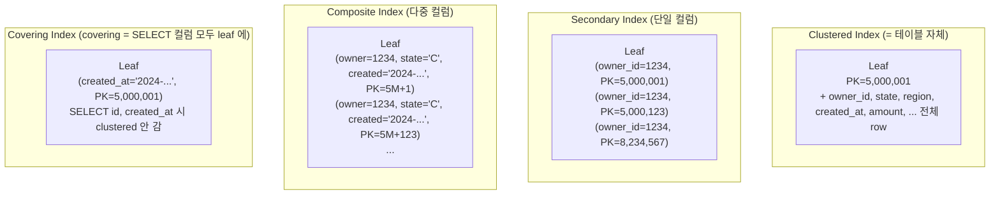
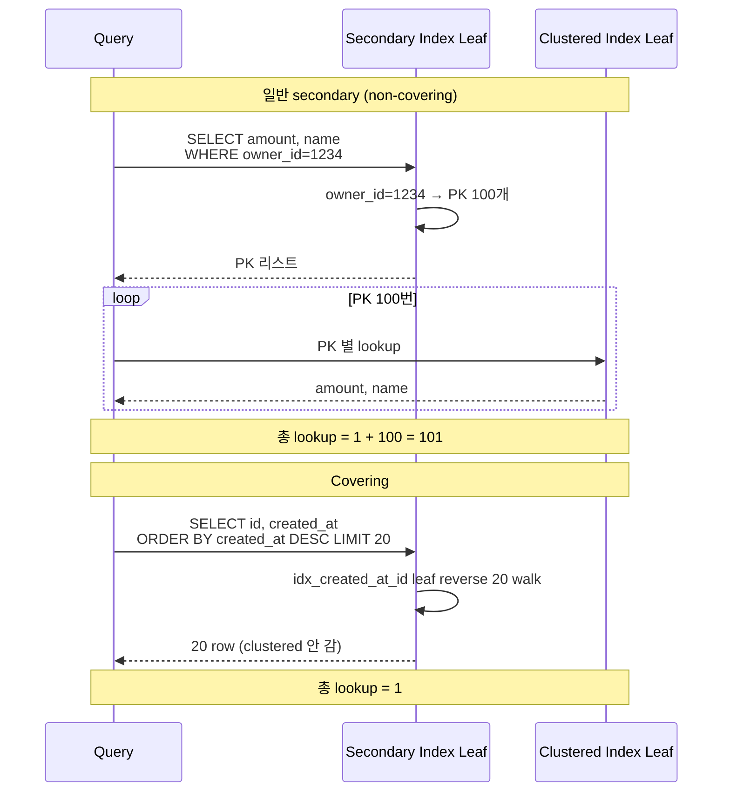

## Table of contents

## 들어가며 — PK 만 있어도 인덱스 1개. 그러면 **추가** 인덱스는 언제 어떤 종류로? {#intro}

[1편 RDB Mastery #1 — InnoDB 인덱스 내부 구조](/posts/rdb-mastery-01-innodb-index-internals/) 에서 한 가지 단단한 사실을 깔았습니다. **InnoDB 의 모든 테이블은 이미 B-tree 안에 PK 정렬로 저장되어 있다**. PK 가 곧 clustered index = 테이블 자체. PK 가 없으면 InnoDB 가 hidden ROWID 를 자동으로 만들어서 항상 B-tree 1개는 존재합니다.

그러면 다음 질문이 옵니다.

> "그 위에 **추가** 인덱스를 만들 때 — **어떤 종류** 의 인덱스를 **언제** 만들 것인가?"

흔한 답 두 가지.

1. "그냥 자주 쓰는 컬럼에 인덱스 만들면 됩니다."
2. "B-tree 가 디폴트니까 B-tree 만들면 됩니다."

**두 답 모두 운영에서는 부족합니다.** MySQL 의 인덱스는 종류가 6가지입니다. 그리고 같은 B-tree 안에서도 — **clustered / secondary / covering / composite / cardinality** 라는 5축이 동시에 결정에 들어갑니다.

- "**Hash 인덱스** 는 InnoDB 에서 만들 수 있나?" — 못 만듭니다. Memory engine 만 가능. InnoDB 는 **adaptive hash index** 라는 자동 최적화로 일부 시뮬레이션
- "**Spatial 인덱스** 는 GEOMETRY 컬럼에 — R-tree 구조"
- "**Full-text 인덱스** 는 자연어 검색 — 역인덱스 구조"
- "**Multi-valued 인덱스** (8.0+) 는 JSON 배열의 각 원소가 leaf 가 되는 인덱스"
- "**Functional 인덱스** (8.0.13+) 는 `LOWER(email)` 같은 표현식 결과가 키"
- "**Composite 인덱스** `(a, b, c)` 는 `WHERE a=?` `WHERE a=? AND b=?` 까지 사용. `WHERE b=?` 단독은 못 씀 (leftmost prefix)"
- "**Cardinality** 가 4 (region 4종) 인 컬럼에 단독 인덱스 = 거의 무의미"
- "**Covering** 으로 만들 수 있는 형태가 있으면 우선 — lookup 1번 → 0번"

이 모든 **축** 을 1,000만 row 환경에서 직접 만들고 측정해서 — **언제 무엇을 고를지** 를 결정으로 정리한 것이 본 글입니다.

- 본 글의 입력 자산: W2 Phase 3 의 5종 인덱스 cardinality + Q1~Q5 Before/After + Q2 역설 + 인덱스 storage 1.3GB + 쓰기 latency 5~6배.
- 자매글 [MySQL No-Offset Cursor 페이지네이션](/posts/mysql-no-offset-cursor-pagination/) 의 cursor 가 본 글의 §3 composite + leftmost prefix 위에서 동작하는 한 가지 패턴.
- 본 글의 깊이: **L2-L3** (RDB Mastery 시리즈 2편 — **종류별 trade-off + 측정 + 빅테크 운영 + 면접 답변**).

---

## 1. MySQL 의 인덱스 종류 6가지 분류 {#index-types-six}

### 1.1 6가지 인덱스 종류

[MySQL 공식 — CREATE INDEX](https://dev.mysql.com/doc/refman/8.0/en/create-index.html) 에 명시된 인덱스 종류는 6가지입니다.

| 종류 | 내부 구조 | 사용처 | 어느 storage engine |
|---|---|---|---|
| **B-tree** | B+-tree | 등치 / 범위 / 정렬 (디폴트) | InnoDB / MyISAM |
| **Hash** | 해시 테이블 | 등치만 | Memory engine 전용 |
| **Spatial** | R-tree | GEOMETRY 좌표 | InnoDB / MyISAM |
| **Full-text** | 역인덱스 (inverted index) | 자연어 검색 (`MATCH ... AGAINST`) | InnoDB / MyISAM |
| **Multi-valued** (8.0+) | B-tree 변형 | JSON 배열의 각 원소 | InnoDB |
| **Functional** (8.0.13+) | B-tree (표현식 결과 키) | `LOWER(col)` 등 가공 컬럼 | InnoDB |

### 1.2 다이어그램 1 — 6가지 인덱스의 내부 구조 비교

```
┌─────────────────────────────────────────────────────────────┐
│ 1. B-tree (B+-tree)                                          │
│    Root → Internal → Leaf (linked list)                      │
│    범위 + 정렬 + 등치 모두                                   │
│                                                              │
│ 2. Hash (Memory engine)                                      │
│    bucket[h(key) % N] → key, value                          │
│    등치 O(1) / 범위 X / 정렬 X                               │
│                                                              │
│ 3. Spatial (R-tree)                                          │
│    Bounding box 의 트리                                      │
│    "이 좌표 근처 N개" 검색                                   │
│                                                              │
│ 4. Full-text (Inverted Index)                                │
│    word → [doc1, doc3, doc7, ...]                           │
│    "검색어 포함된 문서 찾기"                                 │
│                                                              │
│ 5. Multi-valued (8.0+, B-tree 변형)                          │
│    JSON [tag1, tag2, tag3] → 3개 leaf entry                 │
│    "JSON_CONTAINS(tags, ?)"                                  │
│                                                              │
│ 6. Functional (8.0.13+, B-tree)                              │
│    LOWER('Foo') → 'foo' 가 leaf 키                          │
│    "WHERE LOWER(col) = ?" push down                          │
└─────────────────────────────────────────────────────────────┘
```

→ 다이어그램 1 해석. 6가지 종류 중 **InnoDB 에서 만들 수 있는 것** 은 5가지 (B-tree / Spatial / Full-text / Multi-valued / Functional). Hash 는 Memory engine 전용. 그리고 Spatial / Full-text 는 특수 컬럼 (GEOMETRY / TEXT) 에만 — 일반 운영에서 만나는 인덱스는 사실상 **B-tree 와 그 변형 (Multi-valued / Functional)**.

### 1.3 본 글의 초점 — InnoDB B-tree 와 그 변형

본 글은 운영에서 가장 자주 의사결정이 필요한 InnoDB B-tree 와 그 변형 (Multi-valued / Functional) 에 집중합니다. Hash / Spatial / Full-text 는 §8 에서 한 단락씩 정리. 같은 B-tree 안에서도 — **clustered / secondary / covering / composite** 라는 4가지 **형태** 와 **cardinality** 라는 **효과** 의 결정축으로 풀어봅니다.

---

## 2. B-tree 인덱스의 변형 — Clustered / Secondary / Covering / Composite {#btree-variants}

### 2.1 1편에서 다룬 구조 회수

[1편](/posts/rdb-mastery-01-innodb-index-internals/) 에서 정리한 B-tree 의 **구조** — 한 단락으로 회수.

> InnoDB 의 모든 테이블은 **clustered index** 로 저장됩니다. PK 가 clustered key. clustered leaf 안에는 **전체 row** 가 담겨서 = 테이블 자체. **Secondary index** 는 별도의 B-tree 인데 leaf 에 **(인덱스 키, PK)** 가 담깁니다 — 그래서 secondary 로 row 를 찾으면 **2번 lookup** (secondary 한 번 + clustered 한 번). **Covering index** 는 SELECT 가 요구하는 모든 컬럼이 secondary leaf 에 있어서 **clustered 안 가도 답이 나오는** 인덱스 → 1번 lookup. **Composite index** `(a, b, c)` 는 한 인덱스에 여러 컬럼을 묶은 형태.

이 4가지 형태가 같은 B-tree 안에서 어떻게 다른지 — 다이어그램 2 로 다시 봅니다.

### 2.2 다이어그램 2 — clustered / secondary / composite 의 leaf 비교



→ 다이어그램 2 해석. **clustered** leaf 는 **전체 row**. **secondary** leaf 는 **(키, PK)**. **composite** leaf 는 **(키1, 키2, 키3, PK)** — 여러 키가 한 leaf 에 묶임. **covering** 은 SELECT 컬럼이 leaf 안에 있어서 clustered 안 가도 됨.

핵심은: **secondary / composite / covering 모두 secondary index 의 한 형태**. 따로 만든 인덱스 종류가 아니라 — **같은 secondary B-tree 의 다른 모양**. CREATE INDEX 시 컬럼을 어떻게 묶느냐로 3가지 모양이 결정됩니다.

### 2.3 운영 결정의 4가지 축

| 축 | 질문 | 결정 영향 |
|---|---|---|
| **Clustered vs Secondary** | PK 를 어떻게 정의? | 모든 secondary lookup 의 비용 (PK 크기 + 분포) |
| **Covering 여부** | SELECT 컬럼 전부가 인덱스 leaf 에 있나? | lookup 1번 vs 2번 (수십~수백배 차이) |
| **Composite 의 컬럼 순서** | (a, b, c) vs (b, a, c) — 어느 게 먼저? | leftmost prefix 룰 (다음 §3) |
| **Cardinality / Selectivity** | 컬럼의 고유 값 수 / row 수 비율 | 인덱스 효과 자체 (§4) |

이 4축이 본 글의 §3~§5 의 뼈대.

---

## 3. Composite Index 와 Leftmost Prefix 룰 {#composite-leftmost-prefix}

### 3.1 leftmost prefix 룰의 정의

복합 인덱스 `(a, b, c)` 를 만들면 — 다음 WHERE 형태가 인덱스를 사용 가능합니다.

| WHERE | 인덱스 사용 | 이유 |
|---|---|---|
| `WHERE a = ?` | ✅ | leftmost = a |
| `WHERE a = ? AND b = ?` | ✅ | a + b leftmost prefix |
| `WHERE a = ? AND b = ? AND c = ?` | ✅ | 전체 prefix |
| `WHERE a = ? AND c = ?` | △ (a 까지만) | b 건너뛰면 c 는 인덱스로 좁히기 어려움 |
| `WHERE b = ?` | ❌ | a 가 빠지면 leftmost 깨짐 |
| `WHERE c = ?` | ❌ | a, b 모두 빠짐 |
| `WHERE b = ? AND c = ?` | ❌ | a 빠짐 |

이게 **leftmost prefix 룰**. 이름 그대로 **왼쪽부터** 차례로 매칭해야 인덱스가 동작합니다.

### 3.2 왜 leftmost 부터인가 — B-tree 의 정렬 순서

`(a, b, c)` 인덱스의 leaf 는 **(a, b, c, PK) 4튜플로 정렬**되어 있습니다. 정렬 우선순위가 a → b → c.

다이어그램 3 — composite leaf 의 정렬 순서:

```
idx_owner_state_created (owner_id, state, created_at) 의 leaf:

(owner=1234, state='C', created='2024-01-01', PK=5M+1)
(owner=1234, state='C', created='2024-01-15', PK=5M+5)
(owner=1234, state='C', created='2024-03-22', PK=5M+99)
(owner=1234, state='P', created='2024-01-02', PK=5M+8)
(owner=1234, state='P', created='2024-02-10', PK=5M+45)
(owner=1235, state='C', created='2024-01-01', PK=5M+200)
(owner=1235, state='C', created='2024-04-19', PK=5M+311)
(owner=1235, state='X', created='2024-02-08', PK=5M+800)
...

  ↑ owner_id 가 1순위 정렬, 같은 owner 안에서 state 가 2순위, 같은 state 안에서 created_at 이 3순위
```

→ 다이어그램 3 해석. `WHERE owner_id = 1234` — owner=1234 인 leaf 영역으로 binary search 점프 → 그 안 walk. **인덱스 효과 100%**. `WHERE owner_id = 1234 AND state = 'C'` — owner=1234 안에서 state='C' 부분으로 추가 binary search → **인덱스 효과 100%**. 그런데 `WHERE state = 'C'` 단독 — leaf 가 owner_id 순으로 1차 정렬돼 있어서 state='C' 가 **흩어져 있음**. binary search 가 안 됨 → 전체 leaf walk 필요. 그래서 **인덱스 사용 못 함**.

전화번호부에 비유하면 — 성+이름 순으로 정렬된 책에서 "성이 김씨" 는 빨리 찾지만 (앞쪽 정렬 매칭), "이름이 면수" 는 **전체 책을 다 봐야** 찾을 수 있음. 이름은 흩어져 있으니까. 같은 원리.

### 3.3 [실측 — Java/Spring] Q5 — composite 의 lookup + reverse scan

W2 Phase 3 에서 `(owner_id, state, created_at, id)` composite 인덱스를 만들고 측정한 Q5:

```sql
SELECT id, owner_id, state, created_at, amount
FROM orders_w2
WHERE owner_id = 1234 AND state = 'CONFIRMED'
ORDER BY created_at DESC
LIMIT 20;
```

| 단계 | actual time | 처리 row | 비고 |
|---|---|---|---|
| Before (인덱스 없음, full scan + filesort + filter) | **1,497 ms** | 9,708,696 | 9.7M 전체 scan + 정렬 |
| After (composite + reverse + lookup) | **2.59 ms** | 699 | **577배 ↑** |

EXPLAIN 의 핵심 한 줄:

```
type: ref
key: idx_owner_state_created
key_len: 1043 (owner 8B + state varchar + created 5B + PK 8B)
rows: 699
Extra: Backward index scan
```

→ owner_id=1234 + state='CONFIRMED' 의 prefix 로 **699개 row 까지 좁힌 후** created_at 으로 reverse scan + LIMIT 20. 9.7M 이 **699 로 줄어드는 데 인덱스의 역할**, 그 후 reverse scan + LIMIT 20 으로 **20 row 만 처리** — 1,497ms → 2.59ms 의 본질.

자매글 [MySQL No-Offset Cursor 페이지네이션](/posts/mysql-no-offset-cursor-pagination/) 의 cursor 페이지네이션이 같은 메커니즘 — `(created_at, id)` composite 위에서 `WHERE created_at < ?` (leftmost) + `ORDER BY created_at DESC LIMIT 20`. 본 글의 leftmost prefix 룰의 직접 응용 사례.

### 3.4 컬럼 순서 결정 룰

composite 인덱스 만들 때 컬럼 순서 결정의 표준 룰:

1. **WHERE 의 등치 (=) 컬럼 먼저, 범위 (<, >) 컬럼 나중**: 등치는 leaf 영역을 **한 점** 으로 좁히지만 범위는 **구간** 으로 좁히므로, 등치 후 범위가 효율적
2. **Cardinality 높은 컬럼 먼저 (단, 등치 컬럼 안에서)**: 같은 등치라면 selectivity 큰 게 앞
3. **ORDER BY 컬럼은 가장 뒤** (B-tree 의 자연 정렬과 맞아 filesort 회피)

W2 Phase 3 의 `(owner_id, state, created_at)` 가 정확히 이 룰을 따른 형태. owner_id (10K 명) + state (4종, 등치) → created_at (정렬용). 등치 → 정렬 순서.

---

## 4. Cardinality (선택도) 와 인덱스 효과 {#cardinality-selectivity}

### 4.1 Cardinality 와 Selectivity 정의

- **Cardinality** = 컬럼의 **고유 값 수**
- **Selectivity** = unique values / total rows = cardinality / row 수
- selectivity 1.0 = 모든 row 가 unique (PK)
- selectivity 0 가까울수록 = 같은 값이 많음 = 인덱스 효과 미미

[Vlad Mihalcea — Index Selectivity](https://vladmihalcea.com/index-selectivity-cardinality-postgresql-mysql/) 에서 명시:

> "The higher the selectivity of a column, the more efficient an index on it can be. A column with low selectivity (e.g., a boolean) often does not benefit from a standalone index — the optimizer would prefer a full table scan."

### 4.2 [실측 — Java/Spring] W2 Phase 3 의 5종 인덱스 cardinality

| 인덱스 / 컬럼 | cardinality | selectivity | 효과 |
|---|---|---|---|
| PRIMARY (id) | 9,708,696 | ≈ 1.0 | 거의 unique — 점 lookup 최적 |
| idx_created_at_id (created_at) | 9,708,696 | ≈ 1.0 | covering, range scan 최적 |
| idx_owner_id (owner_id) | 12,585 | 0.0013 | 10,000명 분포 — 한 명당 ~970 row |
| idx_state_created (state) | 969 | 0.0001 | state 4종 + 시간 |
| idx_region_code (region_code) | **4** | **4 × 10⁻⁷** | 5종 region 균등 → 단독 인덱스 거의 무의미 |

(state 4종 = CONFIRMED / PENDING / CANCELLED / REFUNDED + edge case 1)

### 4.3 다이어그램 4 — cardinality vs latency 효과

```
cardinality 와 인덱스 효과 (Q3 ORDER BY DESC LIMIT 20 기준):

cardinality
   9.7M  │ ████████████████████████████ Q3 → 0.65ms (covering, 2,476배 ↑)
   9.7M  │ ████████████████████████████ Q5 → 2.59ms (composite, 577배 ↑)
   969   │ ███░░░░░░░░░░░░░░░░░░░░░░░░ idx_state_created (단독 사용 시 효과 미미)
   4     │ █░░░░░░░░░░░░░░░░░░░░░░░░░░ idx_region_code (단독 사용 = full scan 회피 X)
   1.0×  │
        └─────────────────────────────────────────
              인덱스 효과 →

   해석:
   - cardinality 9.7M (거의 unique) 인덱스 → 인덱스 효과 최대
   - cardinality 4 인덱스 → 옵티마이저가 full table scan 으로 fallback 할 가능성
```

→ 다이어그램 4 해석. cardinality 가 9.7M 인 인덱스는 한 키로 1개 row 를 찾을 수 있어서 인덱스 효과 최대. cardinality 가 4 인 인덱스는 한 키로 평균 2.4M row 를 반환 → 차라리 full table scan 이 더 빠를 수도 있음. 옵티마이저가 cost-based decision 으로 full scan 으로 fallback.

### 4.4 발견 — 낮은 cardinality 컬럼은 단독 인덱스 X

운영 결정의 한 줄.

> **cardinality 가 낮은 컬럼 (selectivity < 0.01) 은 단독 인덱스 만들지 않는다. 대신 **composite 의 후순위** 로만 가치가 있다.**

W2 Phase 3 의 `idx_region_code` (cardinality 4) 는 **단독 인덱스로 만들면 거의 효과 없음**. 옵티마이저가 거의 사용하지 않음. 대신 `(region_code, owner_id, created_at)` 처럼 **composite 의 후순위** 로 들어가면 — region_code 로 1/4 좁히고 그 안에서 owner_id 로 정밀 좁히기.

이게 "boolean / state / region 같은 enum 컬럼에 단독 인덱스 안 만든다" 의 원리.

---

## 5. Covering Index — PK 까지 안 가도 답이 있는 인덱스 {#covering-index}

### 5.1 정의 회수

[1편 §4](/posts/rdb-mastery-01-innodb-index-internals/#covering-index) 에서 다룬 covering index 의 정의 — 한 단락 회수.

> SELECT 가 요구하는 컬럼이 **모두** secondary index leaf 에 있으면 — clustered index 안 가도 됨. **1번 lookup 으로 끝**. InnoDB 의 secondary index 는 **항상 PK 가 leaf 에 같이 들어 있어서** `(created_at, id)` 같은 인덱스는 `SELECT id, created_at` 에 자동 covering. EXPLAIN 의 `Using index` = covering 신호.

본 글에서는 — **언제 covering 으로 만들 수 있는지** 의 결정 측면을 봅니다.

### 5.2 Covering 으로 만들 수 있는 형태

| SELECT 형태 | 어떤 인덱스가 covering 가능 |
|---|---|
| `SELECT id WHERE owner_id = ?` | `(owner_id)` — secondary 의 leaf 에 PK 자동 포함 |
| `SELECT id, created_at ORDER BY created_at DESC` | `(created_at, id)` — covering reverse scan |
| `SELECT owner_id, state ORDER BY ...` | `(...,  owner_id, state, ...)` 가 leaf 에 owner_id, state 모두 포함 |
| `SELECT *` | covering 거의 불가능 — 모든 컬럼을 leaf 에 담는 인덱스는 너무 커짐 |

핵심 관찰. **`SELECT *` 는 covering 하기 어렵다**. 모든 컬럼을 인덱스에 담는다는 것은 — secondary 인덱스가 **clustered index 의 사본** 이 되는 것과 같음. 인덱스 storage 가 테이블만큼 커짐.

운영 패턴은: SELECT 절에 컬럼을 **명시적으로 좁히고** — 그 좁은 컬럼 집합으로 covering 인덱스 설계. ORM 의 `SELECT *` 디폴트를 **DTO projection** 으로 바꾸는 이유.

### 5.3 [실측 — Java/Spring] Q3 — covering 의 가장 명확한 사례

W2 Phase 3 의 Q3 (`SELECT id, created_at FROM orders_w2 ORDER BY created_at DESC LIMIT 20`):

| 단계 | actual time | 처리 row |
|---|---|---|
| Before (인덱스 없음 → full table scan + filesort) | **1,609 ms** | 9,708,696 |
| After (idx_created_at_id 추가, covering reverse scan) | **0.65 ms** | 20 |

→ **2,476배 차이**. covering 효과의 가장 명확한 사례.

EXPLAIN 의 핵심 한 줄:

```
type: index
key: idx_created_at_id
Extra: Using index; Backward index scan
```

`Using index` = covering 신호. clustered index 안 가서 PK lookup 0번. **9.7M row 정렬이 → 20 row reverse walk** 로 줄어듦.

### 5.4 다이어그램 5 — covering 효과



→ 다이어그램 5 해석. **non-covering** 은 PK 리스트 받아서 clustered 한 번 더 → 총 lookup ≈ row 수에 비례. **covering** 은 secondary leaf 만으로 답 완성 → 총 lookup = 1 (시작점 binary search 한 번 + leaf walk).

---

## 6. Multi-valued Index (8.0+) — JSON 배열용 {#multi-valued-index}

### 6.1 정의

MySQL 8.0 에서 도입된 [Multi-valued Index](https://dev.mysql.com/doc/refman/8.0/en/create-index.html#create-index-multi-valued):

> "A multi-valued index is a secondary index defined on a column that stores an array of values. Normal indexes have one index record for each data record (1:1). A multi-valued index can have multiple index records for a single data record (N:1)."

JSON 배열의 **각 원소** 가 인덱스 leaf 에 들어갑니다. 일반 B-tree 가 row : leaf = 1:1 인 반면, multi-valued 는 row 1개 → leaf 여러 개.

### 6.2 사용 예

```sql
CREATE TABLE orders (
    id BIGINT PRIMARY KEY,
    tags JSON,   -- ["urgent", "vip", "international"]
    INDEX idx_tags ((CAST(tags AS UNSIGNED ARRAY)))
);

-- 사용 가능한 WHERE 형태 (정확히 3가지)
SELECT * FROM orders WHERE JSON_CONTAINS(tags, '"urgent"');
SELECT * FROM orders WHERE 'urgent' MEMBER OF (tags);
SELECT * FROM orders WHERE JSON_OVERLAPS(tags, '["urgent", "vip"]');
```

### 6.3 다이어그램 6 — 일반 B-tree vs Multi-valued

```
┌─ 일반 B-tree (1:1) ────────────────────┐
│                                        │
│ Row id=1, tags="urgent"                │
│   → Leaf entry 1개                     │
│                                        │
│ Leaf:                                  │
│   ('urgent', PK=1)                     │
│   ('vip', PK=2)                        │
│                                        │
└────────────────────────────────────────┘

┌─ Multi-valued (N:1) ───────────────────┐
│                                        │
│ Row id=1, tags=["urgent","vip","intl"] │
│   → Leaf entry 3개                     │
│                                        │
│ Leaf:                                  │
│   ('urgent', PK=1)                     │
│   ('vip', PK=1)        ← 같은 PK!      │
│   ('intl', PK=1)       ← 같은 PK!      │
│   ('urgent', PK=2)                     │
│                                        │
└────────────────────────────────────────┘
```

→ 다이어그램 6 해석. multi-valued 는 row 1개 → leaf 여러 개. JSON_CONTAINS / MEMBER OF / JSON_OVERLAPS 같은 **원소 단위 검색** 이 인덱스로 처리됨.

### 6.4 한계와 사용처

| 항목 | 제약 |
|---|---|
| WHERE 형태 | `JSON_CONTAINS` / `MEMBER OF` / `JSON_OVERLAPS` **만** |
| 컬럼 타입 | JSON 만 (TEXT 의 JSON 필드 X) |
| ORDER BY | multi-valued 인덱스로는 정렬 불가 |
| 쓰기 비용 | row 1개당 N개 leaf 갱신 (배열 크기에 비례) |
| storage | 배열 크기 큰 row 가 많으면 인덱스 폭증 |

운영 사용처는 **태그 / 라벨 / 카테고리** 같이 **N:M 관계를 별도 join 테이블로 만들지 않고 JSON 으로 처리** 하는 케이스. 단, **배열 평균 크기가 작고** (수~수십 원소) **INSERT/UPDATE 빈도가 낮은** 데이터에 적합. 배열이 100개 이상이거나 빈번히 갱신되면 별도 join 테이블이 더 효율적.

---

## 7. Functional Index (8.0.13+) — 표현식 인덱스 {#functional-index}

### 7.1 정의

MySQL 8.0.13 에서 도입된 [Functional Key Parts](https://dev.mysql.com/doc/refman/8.0/en/create-index.html#create-index-functional-key-parts):

```sql
CREATE INDEX idx_lower_email ON users ((LOWER(email)));
CREATE INDEX idx_yyyymm ON orders ((DATE_FORMAT(created_at, '%Y%m')));
```

표현식 결과가 인덱스 키. `WHERE LOWER(email) = ?` 가 **index range scan** 으로 push down. 8.0.13 이전엔 **generated column** + 그 위에 인덱스 라는 우회 패턴이 표준이었음 — 이제 한 줄로 처리.

### 7.2 사용처

| 사용처 | 표현식 | WHERE |
|---|---|---|
| 대소문자 구분 없는 검색 | `LOWER(email)` | `WHERE LOWER(email) = 'foo@bar.com'` |
| 날짜 일부 매칭 | `DATE_FORMAT(created_at, '%Y%m')` | `WHERE DATE_FORMAT(created_at, '%Y%m') = '202401'` |
| 정수 변환 / 가공 | `CAST(JSON_EXTRACT(meta, '$.user_id') AS UNSIGNED)` | `WHERE CAST(...) = 1234` |
| 길이 매칭 | `CHAR_LENGTH(name)` | `WHERE CHAR_LENGTH(name) > 10` |

### 7.3 다이어그램 7 — Functional Index 의 leaf

```
일반 인덱스 (idx_email):
  Leaf:
    ('Alice@Foo.com', PK=1)
    ('alice@foo.com', PK=2)        ← 다른 키로 취급됨
    ('Bob@Bar.com', PK=3)

Functional 인덱스 (idx_lower_email = LOWER(email)):
  Leaf:
    ('alice@foo.com', PK=1)        ← LOWER 적용 결과가 키
    ('alice@foo.com', PK=2)        ← 같은 키로 정렬됨
    ('bob@bar.com', PK=3)

WHERE LOWER(email) = 'alice@foo.com'
  → idx_lower_email 의 'alice@foo.com' 영역으로 binary search 점프
  → range scan 으로 PK=1, PK=2 동시 히트
```

→ 다이어그램 7 해석. 표현식 결과 (LOWER 적용 후) 가 **leaf 의 키** 로 정렬됨. WHERE 의 `LOWER(email) = ?` 가 그대로 binary search primitive 로 매칭. 일반 인덱스에 LOWER 를 씌우면 — 인덱스의 키가 'Alice@Foo.com' 이라 **함수 적용 후 비교** 가 안 되어 인덱스 무효 (full scan).

### 7.4 한계

| 항목 | 제약 |
|---|---|
| WHERE 의 표현식 | CREATE INDEX 의 표현식과 **정확히 일치** 해야 push down |
| 결정성 | 표현식이 deterministic 해야 함 (NOW() / RAND() 등 X) |
| storage | 표현식 결과가 길면 (예: SHA256 hex 64자) leaf 크기 폭증 |
| 운영 추가 비용 | 표현식 평가 비용 — INSERT/UPDATE 마다 표현식 실행 |

[Vlad Mihalcea — MySQL 8 Functional Index](https://vladmihalcea.com/mysql-8-functional-indexes/) 가 8.0.13+ 의 사용 예와 함정을 가장 자세히 다룹니다.

W2 측정 자산엔 functional index 직접 측정이 없어서 — 본 글에선 공식 문서 + Vlad Mihalcea 사례 인용으로 처리. 운영 적용 시 EXPLAIN ANALYZE 로 **실제 push down 확인** 이 필수 (표현식 한 글자라도 다르면 인덱스 무효).

---

## 8. Hash / Spatial / Full-text — InnoDB 의 특수 인덱스 {#hash-spatial-fulltext}

본 글의 초점이 InnoDB B-tree 와 그 변형이라 — 이 3가지는 짧게 정리.

### 8.1 Hash 인덱스 — Memory engine 전용 + InnoDB 의 adaptive hash

[MySQL 공식 — Hash Index](https://dev.mysql.com/doc/refman/8.0/en/index-btree-hash.html) 에 명시:

> "InnoDB does not support direct creation of hash indexes. However, InnoDB monitors index searches, and if it observes that queries could benefit from building a hash index, it builds one automatically for index pages frequently accessed. This feature is called the adaptive hash index."

→ InnoDB 사용자는 hash 인덱스를 **직접** 만들지 않습니다. 대신 InnoDB 가 자주 lookup 되는 B-tree 노드를 **내부적으로 hash index 로 캐싱** — adaptive hash. `innodb_adaptive_hash_index` 변수로 on/off. 운영에서는 디폴트 ON 유지가 표준.

Memory engine 의 hash 인덱스는 — **고속 임시 lookup** 용. 등치 (=) O(1) / 범위 X / 정렬 X. session-scoped 캐시 같은 특수 사용처에만 적합.

### 8.2 Spatial 인덱스 — R-tree 구조

GEOMETRY / POINT / LINESTRING 같은 공간 데이터에 사용. R-tree 는 **bounding box 의 트리** — "이 좌표 근처 N개" 같은 검색이 인덱스로 처리됨.

```sql
CREATE TABLE places (
    id BIGINT PRIMARY KEY,
    location POINT NOT NULL SRID 4326,
    SPATIAL INDEX idx_location (location)
);

SELECT * FROM places
WHERE ST_Distance_Sphere(location, ST_GeomFromText('POINT(127.0 37.5)', 4326)) < 1000;
```

운영 사용처는 **위치 기반 서비스** (맛집 / 매장 검색 / 주변 사장님 찾기). 일반 커머스 운영에서는 만나기 어렵지만 — **지도 좌표 기반 검색** 이 있는 서비스에서는 표준.

### 8.3 Full-text 인덱스 — 역인덱스 (inverted index)

자연어 검색 (`MATCH ... AGAINST`) 에 사용. 단어 → 그 단어를 포함하는 문서 리스트, 의 매핑 (역인덱스 구조).

```sql
CREATE TABLE articles (
    id BIGINT PRIMARY KEY,
    title VARCHAR(200),
    body TEXT,
    FULLTEXT INDEX idx_title_body (title, body)
);

SELECT * FROM articles
WHERE MATCH(title, body) AGAINST('search query' IN NATURAL LANGUAGE MODE);
```

운영에서 만나는 한계:

- 한글 형태소 분석 약함 (ngram parser 사용 필요 — `WITH PARSER ngram`)
- 100만 row 이상에서 인덱스 갱신 비용이 큼
- **실시간 검색** 이 핵심이면 Elasticsearch / Meilisearch 같은 전용 엔진이 표준

InnoDB full-text 는 **소규모 게시판 / 단순 검색** 까지가 운영 한계. 본격 검색 서비스는 외부 검색 엔진으로.

---

## 9. 인덱스 비용 — 공짜가 아닌 인덱스 {#index-cost}

### 9.1 [실측 — Java/Spring] Phase 3 의 **대가**

W2 Phase 3 에서 5종 인덱스를 추가한 결과 — 읽기 빨라진 **그 옆에** 일어난 비용:

| 비용 항목 | 측정값 | 비고 |
|---|---|---|
| **Storage 추가** | **1.3GB** | 5종 인덱스 합계 (10GB 테이블 대비 +13%) |
| **Write latency** | **5~6배 증가** | INSERT 마다 6개 B-tree 갱신 (clustered 1 + secondary 5) |
| **Buffer pool 점유** | 1.3GB / pool size | 인덱스 leaf 가 buffer pool 의 일부 차지 → clustered hit 율 영향 |

세부:

- `idx_created_at_id` (8B + 8B) × 10M × 1.5 ≈ 240MB
- `idx_owner_state_created` (8 + 1 + 8 + 8) × 10M × 1.5 ≈ 375MB
- `idx_state_created` (1 + 8 + 8) × 10M × 1.5 ≈ 255MB
- `idx_owner_id` (8 + 8) × 10M × 1.5 ≈ 240MB
- `idx_region_code` (1 + 8) × 10M × 1.5 ≈ 135MB
- 합계 ≈ **1.3GB**

### 9.2 다이어그램 8 — 인덱스 추가 vs 비용

```
인덱스 수 별 비용 (W2 Phase 3 기준):

인덱스 수    INSERT 비용 (× baseline)    Storage (GB)
   0          █  1×                        0
   1          ██  2×                        ~0.25
   3          ████  4×                       ~0.75
   5          ██████  6×                       ~1.3
   10         ███████████  11×                 ~2.6 (이론)
              ↑                                 ↑
       매 INSERT 마다                  10GB 테이블에 26% 인덱스
       모든 B-tree 갱신                buffer pool 점유 + clustered hit 율 영향

  W2 [실측] (Phase 2 적재 187K rows/s, 인덱스 0개) → 인덱스 5종 추가 후 같은 적재
   = 이론상 5~6배 느림 (INSERT 마다 6개 B-tree 갱신).
   운영에서 적재 시 인덱스 비활성 → 적재 후 활성 패턴이 표준인 이유.
```

→ 다이어그램 8 해석. INSERT 비용은 **인덱스 수 + 1** 에 비례 (clustered 1개 + secondary N개). 5개 secondary = 6배 INSERT 비용. 그리고 storage 도 row 수 × 키 크기 × 인덱스 수에 비례해 증가.

### 9.3 발견 — 읽기 빠르게 한 인덱스가 쓰기를 느리게 한다

핵심 trade-off.

> **인덱스는 읽기를 빠르게 하기 위해 쓰기를 느리게 한다.** 읽기 / 쓰기 비율 + 쓰기 빈도 + storage 예산 모두 따져서 결정해야 한다.

운영 의사결정의 한 줄:

- **읽기 비율 99%+ 인 OLAP 테이블**: 인덱스 적극 추가 (쓰기 비용 무시 가능)
- **쓰기 비율 50%+ 인 OLTP 테이블**: 인덱스 **최소** — 꼭 필요한 것만
- **batch 적재 + 그 후 읽기 만**: 적재 시 인덱스 비활성 → 적재 후 활성 (W2 Phase 2/3 패턴)

---

## 10. Q2 역설 — 인덱스 추가가 **느려질 수도** 있다 {#q2-paradox}

### 10.1 [실측 — Java/Spring] Q2 의 측정값

W2 Phase 3 의 Q2:

```sql
SELECT id, owner_id, state, created_at
FROM orders_w2
WHERE state = 'CONFIRMED'
ORDER BY created_at DESC
LIMIT 5;
```

| 단계 | actual time | 비고 |
|---|---|---|
| Before (인덱스 없음) | **0.658 ms** | full scan + LIMIT 5 **조기 종료** |
| After (idx_state_created 추가) | **13.5 ms** | ⚠️ **인덱스 추가 후 느려짐** |

→ 인덱스 추가가 **읽기를 느리게 한 케이스**. 직관에 반하는 측정값. 면접에서 "인덱스 추가했는데 느려진 적 있나요?" 물어보면 **바로 이 측정값** 으로 답.

### 10.2 왜 느려졌나 — 옵티마이저의 cost-based decision 의 함정

EXPLAIN 차이:

| | Before | After |
|---|---|---|
| type | ALL (full scan) | range (idx_state_created) |
| rows | 9.7M (추정) | 336K (state='CONFIRMED' 분포 추정) |
| Extra | filesort + filter | Backward index scan |

**Before** 는 full scan 으로 9.7M row 를 **추정** 하지만 실제로는 — `state = 'CONFIRMED'` 가 ~25% 분포 (4종 균등) → full scan 시작 후 매칭 5개 찾으면 **조기 종료**. **9.7M 안 읽고 ~20개 row 만 읽고 끝**. 그래서 0.658ms.

**After** 는 idx_state_created 인덱스를 사용 → state='CONFIRMED' 의 leaf 영역 reverse scan + LIMIT 5. 그런데 이 leaf 가 created_at 순으로 정렬돼 있어서 — `state='CONFIRMED'` 인 leaf 의 가장 최근 5개를 찾기 위해 **index 페이지 → 테이블 row** lookup 비용이 발생. **secondary index lookup 의 random I/O 비용** 이 full scan + 조기 종료 비용보다 큼 → 13.5ms.

옵티마이저의 cost-based decision 은 **통계** 기반. 통계가 **현실과 약간 어긋나면** 잘못된 plan 선택. Q2 가 정확히 그 케이스.

### 10.3 다이어그램 9 — Q2 의 옵티마이저 잘못된 선택

```mermaid
graph TB
    Q[Q2: WHERE state='CONFIRMED' ORDER BY created_at DESC LIMIT 5]
    Q --> Decision{옵티마이저<br/>cost-based decision}
    Decision -->|Before: 인덱스 없음| FS[Full Table Scan + LIMIT 5 조기 종료<br/>= 0.658 ms]
    Decision -->|After: idx_state_created 사용| IS[Index Range Scan + Reverse + Lookup<br/>= 13.5 ms]
    FS -.-실제 더 빠름.-> Faster[실제로는<br/>Before 가 빠름]
    IS -.-옵티마이저 잘못 선택.-> Slower[옵티마이저 통계로는<br/>인덱스 사용이 빠를 거라 판단]
```

→ 다이어그램 9 해석. 옵티마이저는 **대부분** 옳지만 — **작은 LIMIT + 분포 균등** 조합에서는 full scan + 조기 종료가 더 빠를 수 있음. 그런데 옵티마이저는 통계만 보고 "state='CONFIRMED' 가 25% 분포니 인덱스 사용이 효율적" 으로 판단 → 실제로는 lookup 비용이 더 커서 느려짐.

### 10.4 해법 — 옵티마이저 hint 또는 통계 갱신

해법 3가지:

1. **인덱스 hint** (`USE INDEX(PRIMARY)` / `IGNORE INDEX(idx_state_created)`) 로 강제 → Q2 가 다시 ~0.65ms
2. **통계 갱신** (`ANALYZE TABLE orders_w2`) — 옵티마이저 통계가 **정확해지면** 자동 fallback 가능
3. **인덱스 제거** — 만약 Q2 가 **유일한** state 컬럼 사용 쿼리라면 idx_state_created 자체가 불필요 (시리즈 6편 인덱스 다이어트 의 주제)

운영의 표준 답: **EXPLAIN ANALYZE 로 직접 확인**. 옵티마이저는 **대부분** 옳지만 **항상** 옳지 않음. 의심나면 측정.

[LINE Engineering — MySQL Workbench VISUAL EXPLAIN](https://engineering.linecorp.com/ko/blog/mysql-workbench-visual-explain-index) 에서도 같은 메시지 — 시각화로 옵티마이저 잘못 선택 발견.

---

## 11. 운영 가이드라인 — 언제 무엇을 고를 것인가 {#operational-guidelines}

### 11.1 WHERE 형태로 결정

본 글의 모든 결정을 한 표로 압축.

| WHERE 형태 | 적합한 인덱스 | 이유 |
|---|---|---|
| `=` (point lookup) | **B-tree** | binary search primitive 매칭 |
| `<` / `>` / `BETWEEN` (range) | **B-tree** | leaf linked list walk |
| `LIKE 'foo%'` (prefix) | **B-tree** | 앞부분 매칭 = range scan |
| `LIKE '%foo'` (suffix) | (인덱스 무효) | 정렬 키 앞부분 무관 |
| `JSON_CONTAINS` / `MEMBER OF` | **Multi-valued** | JSON 배열 원소 매칭 |
| `LOWER()` / 표현식 | **Functional** | 표현식 결과가 키 |
| `MATCH ... AGAINST` | **Full-text** | 자연어 검색 |
| 좌표 기반 검색 | **Spatial** (R-tree) | bounding box 트리 |

### 11.2 Cardinality / 컬럼 순서 룰

| 룰 | 적용 |
|---|---|
| 단독 인덱스의 cardinality | selectivity 0.01 이상 (= 1% 이하) — 그 이하는 단독 인덱스 X |
| Composite 컬럼 순서 | 등치 (=) 컬럼 먼저 → 범위 (<, >) 컬럼 나중 → ORDER BY 컬럼 가장 뒤 |
| Composite 첫 컬럼 | cardinality 큰 것 (selectivity 큰 것) — 단, 등치 안에서 |
| 낮은 cardinality 컬럼 | composite 의 **후순위** 로만 사용 (region / state / boolean) |

### 11.3 Covering / 쓰기 최소화

| 룰 | 적용 |
|---|---|
| 가능하면 covering 으로 | SELECT 컬럼을 **명시적으로 좁혀서** 인덱스 leaf 안에 들어오도록 |
| 쓰기 빈도 높은 테이블 | 인덱스 **최소** — 꼭 필요한 것만 |
| 적재 시 | 인덱스 비활성 → 적재 후 활성 (W2 Phase 2/3 패턴) |
| 인덱스 추가 전 | EXPLAIN ANALYZE 로 **실측** + write latency 영향 측정 + ADR 기록 |

### 11.4 강제 룰 (운영 표준)

> **모든 신규 인덱스는 — (1) EXPLAIN ANALYZE 로 **Before/After 실측**, (2) write latency 영향 측정, (3) ADR 또는 design doc 으로 결정 사유 기록 — 3가지 모두 충족 후 PR merge.**

이게 본 글의 모든 측정과 발견의 운영 압축. 인덱스 추가 PR 에 **"빠를 것 같아서"** 만 적혀 있으면 reject. **"Q3 1,609ms → 0.65ms / write latency 1.2× / Q2 역설 확인됨"** 이 적혀 있어야 merge.

---

## 12. 빅테크 사례 + 면접 답변 {#bigtech-references}

### 12.1 빅테크 사례 (URL 검증 ≥ 6개)

| 출처 | 글 | 본 글의 어느 §와 연결 |
|---|---|---|
| LINE Engineering | [MySQL Workbench VISUAL EXPLAIN 으로 인덱스 동작 검증](https://engineering.linecorp.com/ko/blog/mysql-workbench-visual-explain-index) | §10 Q2 역설 검출 + §11 EXPLAIN 운영 |
| 카카오페이 | [JPA Transactional readOnly + set_option QPS 58% 감소](https://tech.kakaopay.com/post/jpa-transactional-bri/) | §5 covering + read 최적화 |
| 토스 SLASH24 | [Next 코어뱅킹 Oracle→MySQL MVCC + 인덱스 동작 차이](https://haon.blog/article/toss-slash/next-core-banking/) | §2 / §10 옵티마이저 |
| Vlad Mihalcea | [Index Selectivity / Cardinality](https://vladmihalcea.com/index-selectivity-cardinality-postgresql-mysql/) | §4 cardinality |
| Vlad Mihalcea | [MySQL 8 Functional Indexes](https://vladmihalcea.com/mysql-8-functional-indexes/) | §7 Functional |
| PlanetScale | [How indexes work in MySQL](https://planetscale.com/learn/articles/mysql-indexes) | §1 / §11 |
| Pinterest Engineering | [Sharding Pinterest's growing data](https://medium.com/pinterest-engineering/sharding-pinterest-how-we-scaled-our-mysql-fleet-3f341e96ca6f) | §11 운영 (인덱스 + sharding) |
| Discord | [Storing Billions of Messages](https://discord.com/blog/how-discord-stores-billions-of-messages) | §9 인덱스 비용 → 분산 한계 |
| MySQL 공식 | [CREATE INDEX](https://dev.mysql.com/doc/refman/8.0/en/create-index.html) | §1 6가지 종류 |
| MySQL 공식 | [Multi-valued Indexes](https://dev.mysql.com/doc/refman/8.0/en/create-index.html#create-index-multi-valued) | §6 |
| MySQL 공식 | [Hash Index — adaptive hash](https://dev.mysql.com/doc/refman/8.0/en/index-btree-hash.html) | §8.1 |
| Use The Index, Luke! | [The Where Clause](https://use-the-index-luke.com/sql/where-clause) | §3 leftmost prefix |

### 12.2 면접 답변 5개

#### Q1. "MySQL 의 인덱스 종류는?"

> "**6가지** 입니다. **B-tree** (디폴트, 등치/범위/정렬 모두), **Hash** (Memory engine 전용 — InnoDB 는 **adaptive hash** 로 자동 최적화), **Spatial** (R-tree, GEOMETRY 컬럼), **Full-text** (역인덱스, 자연어 검색), **Multi-valued** (8.0+, JSON 배열의 각 원소가 leaf), **Functional** (8.0.13+, `LOWER()` 같은 표현식 결과가 키). InnoDB 가 만들 수 있는 것은 5가지 (Hash 제외). 운영에서 가장 자주 결정에 들어가는 것은 **B-tree 와 그 변형** (composite / covering / multi-valued / functional)."

#### Q2. "Composite index 의 leftmost prefix 룰이란?"

> "복합 인덱스 `(a, b, c)` 는 **왼쪽부터** 차례로 매칭해야 인덱스가 동작합니다. `WHERE a=?` ✅, `WHERE a=? AND b=?` ✅, 전체 ✅. 그런데 `WHERE b=?` 단독은 ❌, `WHERE b=? AND c=?` 도 ❌. 이유: 인덱스의 leaf 가 a → b → c 순으로 **정렬** 되어 있어서 — a 가 빠지면 b 가 **흩어져 있어** binary search 가 안 됩니다. 전화번호부에 비유하면 성+이름 정렬 책에서 '이름이 면수' 만으로는 책 전체를 봐야 함. 같은 원리. 운영 결정: composite 컬럼 순서는 **등치 (=) 먼저, 범위 (<, >) 나중, ORDER BY 컬럼 가장 뒤**. W2 측정에서 `(owner_id, state, created_at, id)` composite 로 Q5 1,497ms → 2.59ms (577배) — leftmost prefix 매칭 + reverse scan 의 효과 ([실측 — Java/Spring])."

#### Q3. "인덱스를 추가했는데 쿼리가 느려진 적 있나요?"

> "있습니다. W2 Phase 3 의 Q2 (`WHERE state='CONFIRMED' ORDER BY created_at DESC LIMIT 5`) — 인덱스 없을 때 0.658ms 였는데 idx_state_created 추가 후 13.5ms. **인덱스가 **느리게** 만든 케이스**. 이유: full scan + LIMIT 5 조기 종료가 ~20개 row 만 읽고 끝나는 반면, 인덱스 사용은 secondary index → table row lookup 의 random I/O 비용이 더 컸음. 옵티마이저는 통계 기반 cost-based decision — 통계가 현실과 어긋나면 잘못된 plan 선택. 해법: (1) 인덱스 hint (`USE INDEX(PRIMARY)`) 로 강제, (2) `ANALYZE TABLE` 로 통계 갱신, (3) 정말 그 인덱스가 다른 쿼리에 안 쓰이면 제거. 교훈: **EXPLAIN ANALYZE 로 직접 확인**. 옵티마이저는 **대부분** 옳지만 **항상** 옳지 않음 ([실측 — Java/Spring])."

#### Q4. "Multi-valued / Functional index 는 언제 쓰나요?"

> "**Multi-valued** (8.0+) 는 JSON 배열 컬럼에 — `WHERE JSON_CONTAINS(tags, ?)` / `MEMBER OF` / `JSON_OVERLAPS` 같은 **원소 단위 검색** 이 인덱스로 처리됨. row 1개당 leaf N개 (배열 크기 만큼). 사용처: 태그 / 라벨 / 카테고리 같이 **N:M 을 별도 join 테이블 안 만들고 JSON 으로** 처리할 때. 단 배열 크기가 작고 INSERT 빈도가 낮은 경우만 적합. **Functional** (8.0.13+) 은 `LOWER(email)` 같은 표현식 결과를 인덱스 키로 — `WHERE LOWER(email) = ?` 가 **index range scan** 으로 push down. 사용처: 대소문자 구분 없는 검색, 날짜 일부 매칭, JSON 필드 추출 매칭. 한계: WHERE 의 표현식이 CREATE INDEX 의 표현식과 **정확히 일치** 해야 push down — 한 글자라도 다르면 인덱스 무효. EXPLAIN ANALYZE 로 **실제 push down 확인** 이 필수."

#### Q5. "테이블에 인덱스 N개 추가 = 쓰기 비용 N배인가요?"

> "정확히는 **N+1배** 입니다. clustered index 1개 (테이블 자체) + secondary index N개 = **B-tree N+1개** 가 동시에 존재. INSERT 1건 = 모든 B-tree 의 leaf 갱신. W2 측정에서 인덱스 5종 추가 후 INSERT 비용은 이론상 6배. 그래서 운영의 표준 패턴이 **적재 시 인덱스 비활성 → 적재 후 활성** (Bulk Data Loading 권장). storage 도 영향 — 1,000만 row 에 5종 인덱스 = 약 1.3GB 추가 (10GB 테이블 대비 +13%) → buffer pool 점유 → clustered hit 율까지 영향. 그래서 **읽기 빠르게 한 인덱스가 쓰기 / storage / 메모리 모두 비용**. **읽기 / 쓰기 비율 + 쓰기 빈도 + storage 예산** 모두 따져서 결정. 인덱스 다이어트 (sys.schema_unused_indexes / invisible index) 가 운영 표준 ([실측 — Java/Spring])."

---

## 13. 무엇을 배웠나 {#recap}

### 13.1 측정으로 깨진 가정들

- "MySQL 의 모든 인덱스는 B-tree" → **6가지 종류 — Hash / Spatial / Full-text / Multi-valued / Functional 도 있음**
- "인덱스 추가 = 무조건 빠름" → **Q2 역설 (0.66ms → 13.5ms) — 옵티마이저가 잘못 선택할 수 있음**
- "boolean / state 컬럼에도 인덱스" → **cardinality 4 인 컬럼 단독 인덱스는 거의 무의미. composite 후순위로만**
- "인덱스는 한 번 만들면 끝" → **storage 1.3GB + 쓰기 비용 5~6배 + buffer pool 점유 — 지속적 비용**
- "JSON 컬럼은 인덱스 못 만든다" → **8.0+ Multi-valued / 8.0.13+ Functional 로 가능**
- "옵티마이저가 항상 옳다" → **통계 기반 cost-based decision — 통계가 현실과 어긋나면 잘못된 plan**

### 13.2 핵심 한 줄

> **MySQL 의 인덱스는 6가지 종류 + B-tree 안의 4가지 형태 (clustered/secondary/covering/composite) + cardinality 의 결정축으로 풀어야 한다. 1,000만 row 환경에서 [실측] Q3 covering 2,476배 / Q5 composite 577배 / Q2 역설 (0.66ms → 13.5ms) / 쓰기 비용 5~6배 / storage 1.3GB. 인덱스는 공짜가 아니다 — 읽기 빠르게 한 인덱스가 쓰기를 느리게 한다. 모든 신규 인덱스는 EXPLAIN ANALYZE 실측 + write latency 영향 + ADR 기록 3가지 모두 충족 후 merge.**

---

## 14. 다음 글 — 시리즈로 이어집니다 {#next-post}

본 글은 **RDB Mastery 시리즈 2편**. **인덱스 종류별 trade-off** 측면. 다음 편들에서:

- **3편 — EXPLAIN ANALYZE 마스터**: 본 글의 §10 Q2 역설 + row constructor push down 함정 — 옵티마이저가 인덱스를 **어떻게 선택** 하는지의 깊이
- **4편 — 운영 ALTER 안전 패턴** (Online DDL / pt-osc / gh-ost): 본 글의 **N+1개 B-tree** 가 ALTER 시 어떻게 흔들리는지
- **5편 — 1:N 조인의 한계** (N+1 / EntityGraph / cursor + 1:N): 본 글의 secondary lookup 이 ORM 위에서 어떻게 폭증하는지
- **6편 — 인덱스 다이어트**: 본 글의 **N+1개 B-tree 비용** 을 운영에서 어떻게 회수하는지

자매글:
- [RDB Mastery #1 — InnoDB 인덱스 내부 구조](/posts/rdb-mastery-01-innodb-index-internals/) (본 글의 §2 / §3 / §5 의 **구조** 측면 회수)
- [MySQL No-Offset Cursor 페이지네이션](/posts/mysql-no-offset-cursor-pagination/) (본 글의 §3 leftmost prefix 의 **cursor 응용** 사례)
- [MySQL InnoDB 아키텍처 이해](/posts/mysql-innodb-architecture-deep-dive/) (본 글이 **index 종류** 측면 / 자매글이 **buffer pool / log / undo** 측면)

---

## 참고자료 {#references}

### 공식 문서

- [MySQL — CREATE INDEX](https://dev.mysql.com/doc/refman/8.0/en/create-index.html) — 6가지 인덱스 종류
- [MySQL — Multi-valued Indexes](https://dev.mysql.com/doc/refman/8.0/en/create-index.html#create-index-multi-valued) — 8.0+
- [MySQL — Functional Key Parts](https://dev.mysql.com/doc/refman/8.0/en/create-index.html#create-index-functional-key-parts) — 8.0.13+
- [MySQL — Hash Index / Adaptive Hash](https://dev.mysql.com/doc/refman/8.0/en/index-btree-hash.html)
- [MySQL — Spatial Indexes](https://dev.mysql.com/doc/refman/8.0/en/spatial-types.html)
- [MySQL — Full-Text Search](https://dev.mysql.com/doc/refman/8.0/en/fulltext-search.html)
- [MySQL — Bulk Data Loading for InnoDB](https://dev.mysql.com/doc/refman/8.0/en/optimizing-innodb-bulk-data-loading.html) — 적재 시 인덱스 비활성
- [MySQL — EXPLAIN Output (type / Extra)](https://dev.mysql.com/doc/refman/8.0/en/explain-output.html)

### 빅테크 / 운영

- [LINE Engineering — VISUAL EXPLAIN](https://engineering.linecorp.com/ko/blog/mysql-workbench-visual-explain-index) — 옵티마이저 잘못 선택 검출
- [카카오페이 — JPA Transactional readOnly](https://tech.kakaopay.com/post/jpa-transactional-bri/) — read 최적화
- [토스 SLASH24 — Next 코어뱅킹](https://haon.blog/article/toss-slash/next-core-banking/) — Oracle → MySQL InnoDB MVCC
- [PlanetScale — How indexes work in MySQL](https://planetscale.com/learn/articles/mysql-indexes) — 운영 측면
- [Pinterest — Sharding Pinterest's growing data](https://medium.com/pinterest-engineering/sharding-pinterest-how-we-scaled-our-mysql-fleet-3f341e96ca6f) — sharding 시 인덱스 전략
- [Discord — Storing Billions of Messages](https://discord.com/blog/how-discord-stores-billions-of-messages) — RDB 한계 → 분산 전환

### 교과서급

- [Use The Index, Luke! — The Where Clause](https://use-the-index-luke.com/sql/where-clause) — leftmost prefix
- [Vlad Mihalcea — Index Selectivity](https://vladmihalcea.com/index-selectivity-cardinality-postgresql-mysql/)
- [Vlad Mihalcea — MySQL 8 Functional Indexes](https://vladmihalcea.com/mysql-8-functional-indexes/)
- [Percona — InnoDB / Index 운영](https://www.percona.com/blog/category/innodb/)

본 측정의 raw 데이터는 별도 학습 노트에 보관 (포트폴리오 repo 내부). 1,000만 row 환경 / 인덱스 5종 cardinality / Q1~Q5 Before/After / Q2 역설 / 쓰기 latency 5~6배 / storage 1.3GB.
