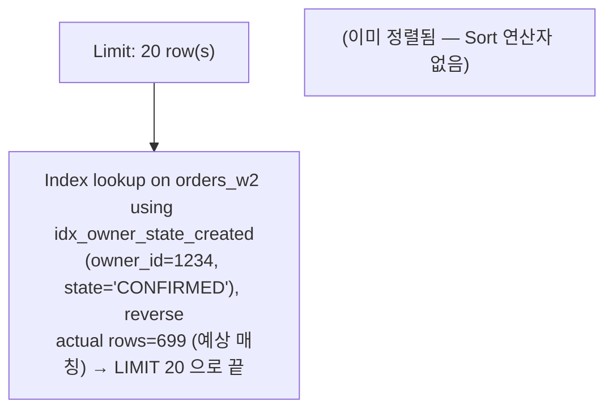
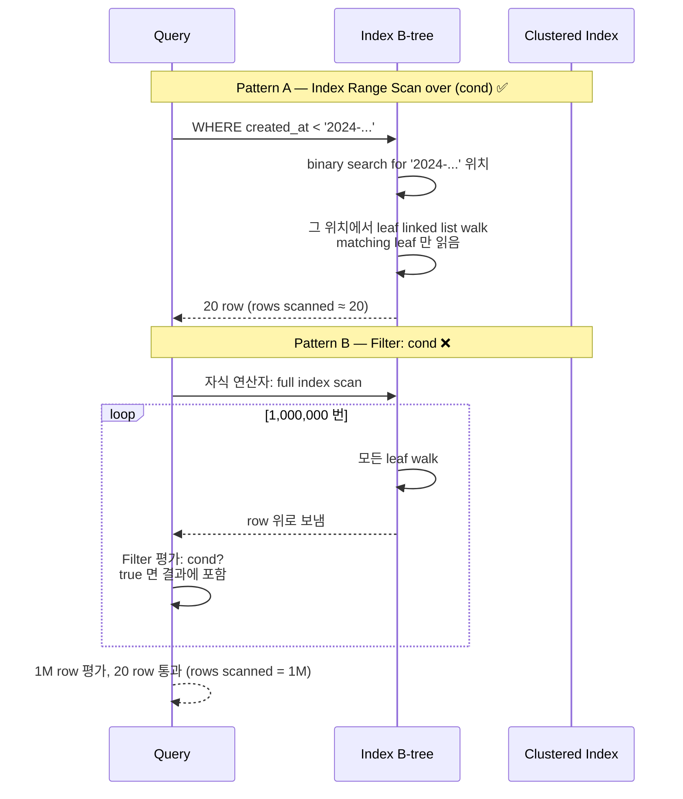
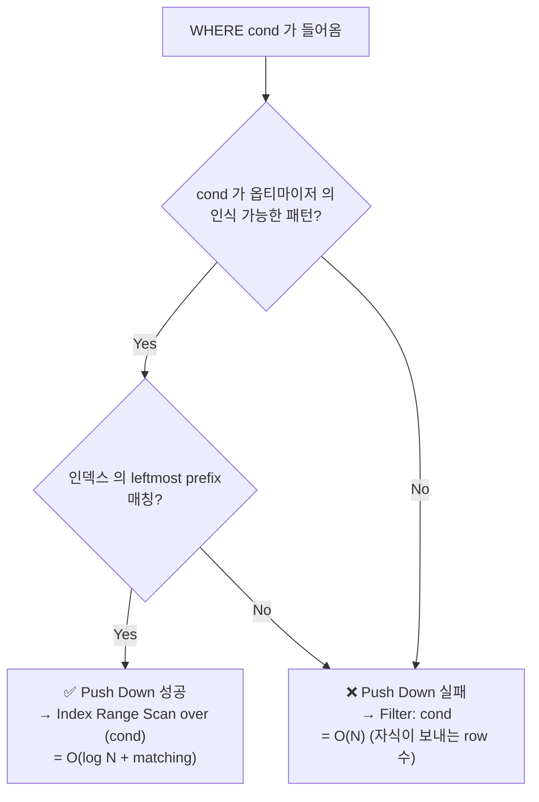
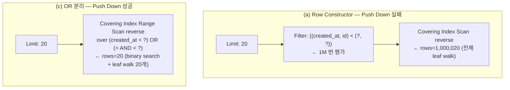
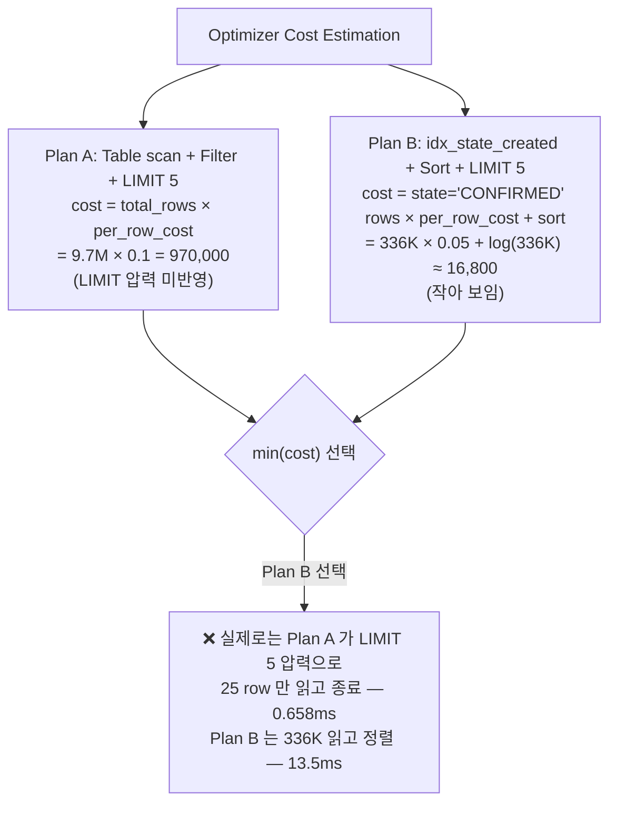
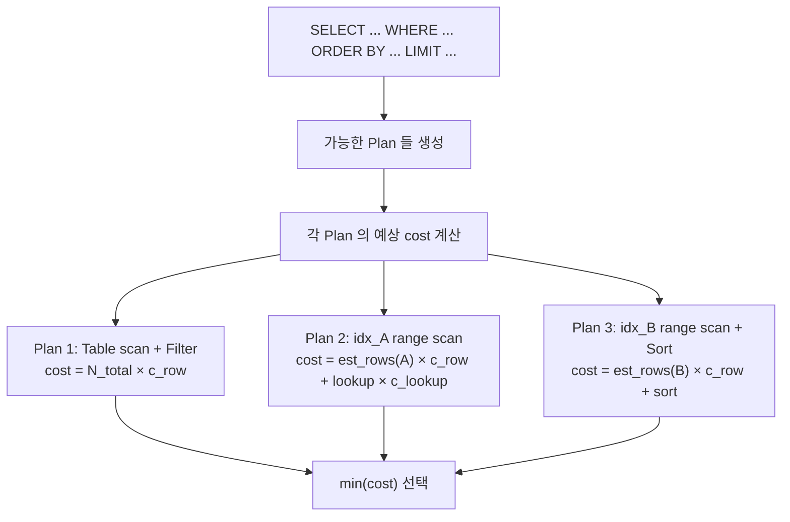
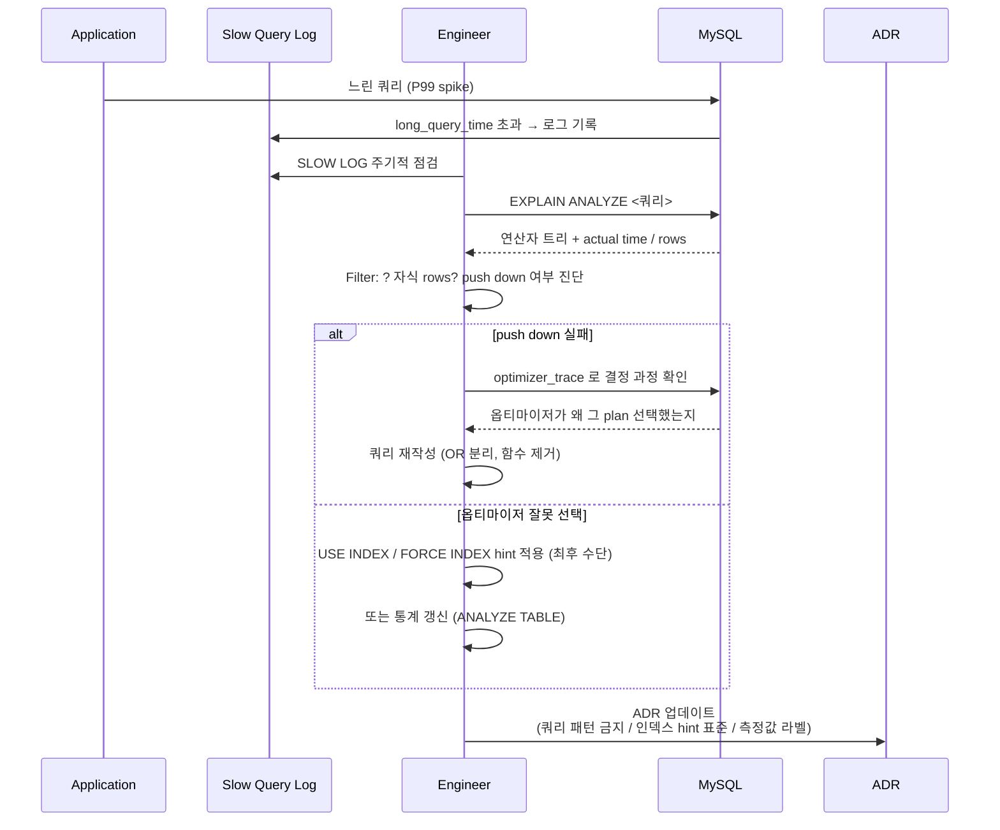

## Table of contents

## 들어가며 — 같은 SQL 의도가 옵티마이저 한 줄 차이로 500배 갈라진다 {#intro}

같은 의미의 SQL 두 개가 있습니다.

```sql
-- (a) ANSI SQL 표준 row constructor
WHERE (created_at, id) < (?, ?)

-- (b) OR 로 분리한 형태
WHERE created_at < ? OR (created_at = ? AND id < ?)
```

대학에서 SQL 을 배운 사람이라면 둘이 **수학적으로 동치** 라는 걸 압니다. lexicographic 비교의 정의 그대로. 의미가 같으니 옵티마이저가 같은 plan 을 만들 거라고 믿게 됩니다.

그런데 1,000만 row 환경에서 측정해 보면:

| 형태 | actual time | 차이 |
|---|---|---|
| (a) row constructor | **154 ms** | (baseline) |
| (b) OR 분리 | **0.30 ms** | **약 500배** |

**같은 의미, 같은 인덱스, 같은 데이터** 인데 500배 차이. EXPLAIN ANALYZE 출력을 비교해 보면 차이의 본질이 **한 줄** 입니다.

```
(a) -> Filter: ((created_at, id) < (...))
        -> Covering index scan ... reverse, rows=1000020

(b) -> Covering index range scan over (created_at < ...) OR (= AND <)
        reverse, rows=20
```

`Filter:` 라는 단어 한 번 vs `Index range scan over` 라는 단어 한 번. **이 한 단어 차이가 push down 성공 vs 실패**. push down 실패 = 1M row 읽고 위에서 골라내기. push down 성공 = 인덱스 안에서 binary search 로 20 row 만 읽고 끝.

자매글 [MySQL No-Offset Cursor 페이지네이션](/posts/mysql-no-offset-cursor-pagination/) 이 같은 측정값을 **운영 처방** 측면 (cursor 표준 / 토큰화 / PR 차단) 으로 다뤘다면, 본 글은 **왜 옵티마이저가 push down 못 하는가** 의 내부 메커니즘에 집중합니다. [Bug #16247](https://bugs.mysql.com/bug.php?id=16247) 이 오래 known limitation 으로 남아있는 이유, 옵티마이저의 whitelist 가 인식하는 패턴과 못 인식하는 패턴, cost-based 판단의 한계 (Q2 역설 — 인덱스 추가가 느려지는 케이스), 그리고 EXPLAIN ANALYZE 출력 한 줄을 어떻게 읽는가.

본 글의 입력 자산:
- 1,000만 row 환경에서 Q1~Q5 Before/After 측정 + Q2 역설 (MySQL 8.0.44)
- OFFSET vs No-Offset 측정의 row constructor push down 실패 (154ms vs 0.30ms)
- No-Offset 페이지네이션 결정 사항 (row constructor 금지 룰)

본 글의 깊이: **L3-L4** (시리즈 1편이 B-tree 내부 구조 / 2편이 인덱스 종류 / 본 3편이 **옵티마이저의 인식과 push down**).

자매글:
- [RDB Mastery #1 — InnoDB 인덱스 내부 구조](/posts/rdb-mastery-01-innodb-index-internals/) — B-tree / clustered / secondary / covering. 본 글은 그 위에 **옵티마이저** 가 어떻게 인덱스를 선택하는지를 본다.
- [MySQL No-Offset Cursor 페이지네이션](/posts/mysql-no-offset-cursor-pagination/) — 같은 측정의 **page 단위 운영 처방**. 본 글은 **옵티마이저 메커니즘** 측면.

---

## 1. EXPLAIN vs EXPLAIN ANALYZE — 차이부터 {#explain-vs-analyze}

### 1.1 EXPLAIN — 옵티마이저의 **추정**

`EXPLAIN <쿼리>` 는 옵티마이저가 **만들 plan 의 모양** 을 출력합니다. 실제 실행은 안 합니다.

```sql
EXPLAIN SELECT id FROM orders_w2
ORDER BY created_at DESC LIMIT 20;
```

출력의 핵심 컬럼:

| 컬럼 | 의미 |
|---|---|
| `type` | 어떤 walk 패턴 (`const` / `ref` / `range` / `index` / `ALL`) |
| `key` | 어떤 인덱스 사용 |
| `rows` | 예상 row 수 (옵티마이저의 **추정**) |
| `filtered` | WHERE 로 거를 비율 추정 |
| `Extra` | `Using index` (covering) / `Using filesort` / `Using temporary` 등 |

핵심: `rows` 는 **추정값**. 실제 실행 후 처리한 row 수가 아닙니다. cardinality 통계 (`ANALYZE TABLE` 결과) 를 기반으로 옵티마이저가 **계산** 한 값.

### 1.2 EXPLAIN ANALYZE (8.0.18+) — **실제 실행 + actual time**

[MySQL 공식 — EXPLAIN ANALYZE](https://dev.mysql.com/doc/refman/8.0/en/explain.html#explain-analyze) 가 8.0.18 에서 도입된 기능. **실제로 쿼리를 실행** 한 뒤, 각 연산자의 **actual time / actual rows** 를 보고합니다.

```sql
EXPLAIN ANALYZE SELECT id FROM orders_w2
ORDER BY created_at DESC LIMIT 20;
```

출력 한 줄 (Q3 Before — 인덱스 없을 때 [실측 — Java/Spring]):

```
-> Limit: 20 row(s)  (actual time=1608.999..1608.999 rows=20 loops=1)
   -> Sort: orders_w2.created_at DESC, limit input to 20 row(s) per chunk
       (actual time=1608.998..1609.000 rows=20 loops=1)
       -> Table scan on orders_w2  (cost=988927 rows=9708696)
           (actual time=0.071..1234.567 rows=9708696 loops=1)
```

다이어그램 1 — EXPLAIN vs EXPLAIN ANALYZE 정보 차이:

| 측면 | EXPLAIN | EXPLAIN ANALYZE |
|---|---|---|
| 실행 여부 | **안 함** | **실제 실행** |
| rows | 추정 (cardinality 기반) | **actual rows** (실제 처리) |
| time | cost 추정 (단위 없는 숫자) | **actual time** (ms 단위) |
| 출력 형식 | 표 | **연산자 트리** (위에서 아래) |
| 비용 | 거의 0 | **실제 쿼리 시간만큼** |
| 8.0.18+ | 항상 가능 | 추가 기능 |

### 1.3 cost 추정 vs actual time 의 괴리 — 옵티마이저 추정 오류 단서

EXPLAIN 의 `cost` 와 EXPLAIN ANALYZE 의 `actual time` 이 **크게 다르면** — 옵티마이저의 **통계가 stale** 하거나 **cost model 가정이 깨진** 신호.

`ANALYZE TABLE orders_w2` 를 실행해서 cardinality 갱신을 시도하고, 그래도 괴리가 크면 `optimizer_trace` 로 옵티마이저의 결정 과정을 들여다봅니다 (11장에서 다룸).

본 글은 모든 측정을 **EXPLAIN ANALYZE** 의 actual time 으로 합니다. 추정이 아닌 측정.

---

## 2. EXPLAIN ANALYZE 는 연산자 트리 {#operator-tree}

### 2.1 연산자 트리 — 위에서 아래로 row 가 흐른다

EXPLAIN ANALYZE 의 출력은 표가 아니라 **트리** 입니다. 각 줄이 **하나의 연산자 (operator)**, 들여쓰기가 **부모-자식 관계**.

```
-> Operator A
   -> Operator B  (A 의 자식, A 에게 row 를 공급)
       -> Operator C  (B 의 자식, B 에게 row 를 공급)
```

→ row 는 **아래에서 위로** 흐릅니다. 가장 깊이 들여쓴 연산자 (C) 가 row 를 만들어내고, 그 부모 (B) 가 받아서 변형하고, 다시 그 부모 (A) 가 받아서 변형. 최상단 연산자가 클라이언트에게 결과 반환.

### 2.2 주요 연산자 — 본 글에서 자주 보는 것들

| 연산자 | 의미 | 비용 |
|---|---|---|
| `Table scan on T` | T 의 clustered index 를 처음부터 끝까지 walk (= full table scan) | O(전체 row) |
| `Index scan on T using IDX` | IDX 의 leaf 를 처음부터 끝까지 walk (covering 시 leaf 만, non-covering 시 + clustered lookup) | O(인덱스 leaf 수) |
| `Index range scan on T using IDX over (cond)` | IDX 의 leaf 중 cond 가 true 인 범위만 walk | **O(log N + matching)** |
| `Index lookup on T using IDX (key=value)` | IDX 의 leaf 에서 key 매칭 row 만 | O(log N + matching) |
| `Filter: cond` | 자식이 위로 보낸 row 마다 cond 평가 | **위 연산자가 보내는 row 수** 만큼 |
| `Sort: col` | 메모리 (또는 임시 디스크) 에서 정렬 | O(N log N) |
| `Limit: N` | 위 연산자가 N 개 row 보낼 때까지 받고 종료 | 위 연산자에 따라 다름 |
| `Aggregate / Group aggregate` | GROUP BY / SUM / COUNT 등 집계 | O(전체 row) |

### 2.3 다이어그램 2 — 연산자 트리 sample

Q5 (`WHERE owner_id=? AND state=? ORDER BY created_at DESC LIMIT 20`) 의 EXPLAIN ANALYZE 트리:



→ 다이어그램 2 해석. 트리 깊이가 2 단계 (Limit → Index lookup). owner_id=1234 + state='CONFIRMED' 가 **인덱스 안으로 push down** 되어서 — 인덱스 leaf 에서 매칭 row 부터 reverse walk 하다가 LIMIT 20 으로 종료. 9.7M row scan 이 20 row walk 로 줄어든 본질이 **이 트리 모양**.

### 2.4 핵심 단어 — `Filter:` 가 등장하면 push down 실패 의심

가장 중요한 단어 하나. `Filter: cond` 가 트리에 등장하면 — 그 cond 는 **인덱스 안으로 push down 되지 못하고** 위 연산자가 row 를 위로 보낸 뒤 **후처리** 되고 있다는 뜻. 위 연산자가 1M row 를 보내면 1M 번 평가. 이게 3장의 본질입니다.

---

## 3. Index Range Scan vs Filter — 한 단어 차이가 본질 {#range-scan-vs-filter}

### 3.1 두 패턴의 정의

`Index range scan over (cond)` — cond 가 **인덱스 안의 B-tree primitive 로 변환** 됨. 인덱스에서 binary search 로 **시작점** 을 찾고, leaf linked list 를 walk 하면서 **매칭되는 leaf 만** 읽음. rows scanned ≈ matching rows.

`Filter: cond` — cond 가 **인덱스 밖의 후처리** 단계. 자식 연산자 (예: full table scan, full index scan) 가 **모든 row** 를 위로 보내고, Filter 가 row 마다 cond 를 평가. rows scanned = 자식이 보낸 row 수 (인덱스로 좁히지 못함).

### 3.2 다이어그램 3 — 두 패턴의 walk 비교



→ 다이어그램 3 해석. 같은 조건이라도 **인덱스 안에서 평가하느냐** vs **인덱스 밖에서 평가하느냐** 의 차이가 **수백배 latency**. cost = O(log N + matching) vs O(N).

### 3.3 비유 — 도서관 카드 카탈로그 vs 책 한 권씩 펼쳐보기

| | Index Range Scan over | Filter |
|---|---|---|
| 도서관 비유 | **카드 카탈로그** 에서 ISBN 시작점 찾고, 거기서부터 카드 N장 walk | **모든 책** 한 권씩 꺼내서 표지 보고 ISBN 비교 |
| 비용 | O(log N + matching) — 카드 1만장 중 N장만 | O(N) — 책 1만권 전부 |
| 본질 | binary search primitive 활용 | 순차 walk + 후처리 |

이 비유가 모든 push down 함정의 직관적 모델입니다. 옵티마이저가 cond 를 **카드 카탈로그 내부 패턴** 으로 변환할 줄 알면 카탈로그 walk, 모르면 모든 책 펼쳐보기.

### 3.4 [실측 — Java/Spring] — Q3 vs Q3 Before

Q3 (`ORDER BY created_at DESC LIMIT 20`):

| 단계 | 트리 | rows scanned | actual time |
|---|---|---|---|
| Before (인덱스 없음) | Sort + Table scan + Filter | 9,708,696 | **1,609 ms** |
| After (idx_created_at_id) | Limit + Covering index range scan reverse | 20 | **0.65 ms** |

**2,476배 차이**. 차이의 본질이 3.1장의 두 패턴. Before 는 9.7M row 모두 위로 보낸 뒤 sort + 잘라내기. After 는 인덱스 leaf 에서 20 row 만 walk.

---

## 4. Push Down — cond 를 인덱스 안으로 내려보내는 것 {#push-down}

### 4.1 정의

**Push Down** = 옵티마이저가 WHERE 조건 (또는 ORDER BY 의 정렬 키) 을 **인덱스 안에서 평가하도록** 내려보내는 변환. 성공하면 Index Range Scan, 실패하면 Filter.

push down 결정 흐름:



→ 다이어그램 4 해석. push down 결정에는 **두 게이트**: (1) 옵티마이저가 cond 를 **인식 가능한 패턴인가** (whitelist), (2) 인덱스의 leftmost prefix 와 매칭되는가. 둘 다 통과해야 Index Range Scan.

### 4.2 push down 의 비용 차이

같은 데이터, 같은 인덱스, push down 여부에 따른 비용:

| | Index Range Scan over | Filter (push down 실패) |
|---|---|---|
| 시간 복잡도 | O(log N + matching) | O(N) |
| 1M row 환경 (matching=20) | log2(1M) + 20 ≈ **40 page seek** | **1M row scan** |
| 자매글 [실측 — Java/Spring] | 0.30ms | 154ms |
| 차이 | (baseline) | **약 500배** |

이 500배 차이가 **단지 옵티마이저의 인식 여부** 에서 옵니다. 데이터도 같고, 인덱스도 같고, 디스크도 같고, 의미도 같은데 — **옵티마이저가 알아본다 vs 못 알아본다**.

### 4.3 push down 이 중요한 이유

운영 영향을 한 줄 요약:

> **push down 성공 = O(log N + matching). push down 실패 = O(N). 1,000만 row 환경에서 N 차이는 곧 latency 의 차이. 이게 EXPLAIN ANALYZE 를 항상 봐야 하는 이유.**

심지어 **인덱스가 있어도** push down 실패면 인덱스가 무용지물. 그래서 인덱스 추가했다고 안심하면 안 됩니다.

---

## 5. MySQL 옵티마이저의 인식 가능한 패턴 (whitelist) {#optimizer-whitelist}

### 5.1 옵티마이저는 패턴 매칭으로 동작

MySQL 옵티마이저는 WHERE 조건을 **패턴 매칭** 으로 인식합니다. 의미적 추론을 깊이 하지 않습니다 — 정해진 **whitelist 패턴** 에 맞으면 push down, 안 맞으면 Filter.

[MySQL 공식 — Range Optimization](https://dev.mysql.com/doc/refman/8.0/en/range-optimization.html) 에 인식 가능한 패턴이 정의돼 있습니다.

### 5.2 다이어그램 5 — 인식 가능 / 불가 패턴 표

| 카테고리 | 패턴 | push down? | 비고 |
|---|---|:---:|---|
| **Single column** | `col = ?` | ✅ | const / ref |
| | `col < ?` / `col > ?` / `col <= ?` / `col >= ?` | ✅ | range |
| | `col BETWEEN ? AND ?` | ✅ | range |
| | `col IN (?, ?, ?)` | ✅ | range (multi-values) |
| | `col IS NULL` | ✅ | |
| **Multi column (composite index)** | `a = ? AND b = ?` (leftmost prefix) | ✅ | composite index 의 leftmost 따름 |
| | `a = ? AND b < ?` | ✅ | leftmost prefix + range |
| | `a < ? AND b = ?` | ❌ (b 부분만) | a 가 range 면 b 는 push down 불가 |
| | `a = ? AND b BETWEEN ? AND ?` | ✅ | OK |
| **Row constructor** | `(a, b) < (?, ?)` | **❌** | **본 글의 핵심 — Bug #16247** |
| | `(a, b) = (?, ?)` | ⚠️ 일부 버전 | 8.0+ 에서 일부 인식 |
| **Function applied** | `LOWER(col) = ?` | ❌ | functional index 가 별도로 있어야 인식 |
| | `DATE(created_at) = ?` | ❌ | 함수 적용 → 옵티마이저 못 알아봄 |
| **Implicit cast** | `varchar_col = 123` (int 비교) | ❌ | 묵시적 형변환 → 인덱스 미사용 |
| | `int_col = '123'` | ⚠️ | 일부 케이스 OK |
| **OR** | `a = ? OR b = ?` | ⚠️ | index merge optimization 가능 시만 |
| | `a < ? OR (a = ? AND b < ?)` | ✅ | **본 글의 OR 분리 핵심** |

→ 다이어그램 5 해석. 흔한 "이 정도는 옵티마이저가 알아주겠지" 의 함정 6가지가 다 이 표 안에 있습니다.

### 5.3 함수 적용 — `LOWER(col) = ?` 의 함정

```sql
-- ❌ push down 실패 (인덱스 있어도 못 씀)
SELECT * FROM users WHERE LOWER(email) = 'foo@bar.com';

-- ✅ functional index 추가 시 push down OK
CREATE INDEX idx_email_lower ON users ((LOWER(email)));
SELECT * FROM users WHERE LOWER(email) = 'foo@bar.com';
```

[MySQL 공식 — Functional Key Parts](https://dev.mysql.com/doc/refman/8.0/en/create-index.html#create-index-functional-key-parts) (8.0.13+) 가 functional index 의 도입. 그 전에는 함수 적용된 컬럼은 무조건 full scan.

### 5.4 묵시적 형변환 — 인덱스 죽이기

```sql
-- 컬럼이 VARCHAR 인데 정수로 비교
SELECT * FROM products WHERE sku = 12345;  -- ❌ 인덱스 못 씀
SELECT * FROM products WHERE sku = '12345'; -- ✅ 인덱스 OK
```

`sku` 가 VARCHAR 인데 INT 로 비교하면 — MySQL 은 모든 row 의 sku 를 INT 로 변환해서 비교. 즉 모든 row 에 함수 적용된 효과 → 인덱스 못 씀.

### 5.5 정리

> **whitelist 에 맞으면 push down, 안 맞으면 Filter. 의미적으로 동치여도 옵티마이저가 패턴 매칭으로 동작하므로 못 알아보면 못 푸쉬다운. 그래서 EXPLAIN ANALYZE 의 `Filter:` 키워드는 push down 실패의 진단 신호.**

---

## 6. Row Constructor 의 함정 — Bug #16247 {#row-constructor-trap}

### 6.1 ANSI SQL 표준 row constructor

ANSI SQL 표준은 **row constructor** 비교를 정의합니다:

```sql
(a, b) < (x, y)
-- 의미상 (lexicographic 비교):
-- a < x  OR  (a = x AND b < y)
```

`(a, b) < (x, y)` 가 의미상 OR 분리 형태와 **수학적으로 동치**. 사전식 비교 (lexicographic ordering) 의 정의 그대로.

### 6.2 MySQL 옵티마이저의 한계

[MySQL Bug #16247 — Row comparisons should use range scan](https://bugs.mysql.com/bug.php?id=16247) — **2006년에 등록되어 오랫동안 known limitation 으로 남아있는** 옵티마이저 bug (트래커는 현재 duplicate 처리).

bug 내용 요약:

> "MySQL optimizer does not recognize row constructor comparisons such as `(a, b) < (?, ?)` as range conditions. As a result, queries using row constructors fall back to full scan + Filter, while the equivalent OR-decomposed form `a < ? OR (a = ? AND b < ?)` is correctly identified as a range scan."

→ MySQL 은 row constructor 비교를 **OR 형태로 자동 변환** 하는 로직이 없습니다. 패턴 매칭이 row constructor 를 자체 단위로 인식하려고 시도하지만 실패 → Filter 로 fallback.

### 6.3 [실측 — Java/Spring] — 154ms vs 0.30ms

자매글 OFFSET vs No-Offset 측정의 핵심 결과 (1,000만 row, 1M 위치 cursor):

```sql
-- (a) row constructor — push down 실패
WHERE (created_at, id) < ('2024-03-15 10:30:00', 5000000)
ORDER BY created_at DESC, id DESC LIMIT 20;
```

EXPLAIN ANALYZE 출력 [실측 — Java/Spring]:

```
-> Limit: 20 row(s)  (actual time=154.234..154.234 rows=20 loops=1)
   -> Filter: ((orders_w2.created_at, orders_w2.id) <
               ('2024-03-15 10:30:00', 5000000))
       (actual time=0.012..154.230 rows=20 loops=1)
       -> Covering index scan on orders_w2 using idx_created_at_id
          (reverse)  (actual time=0.011..134.567 rows=1000020 loops=1)
```

한 줄씩 해석:
- 최상단 `Limit: 20` — 20 row 받으면 종료
- 그 자식 `Filter: ((created_at, id) < (...))` — **여기가 함정**. row constructor 비교가 **여기서** 평가됨. 자식이 보내는 row 마다 평가.
- 그 자식 `Covering index scan on ... (reverse)` — **인덱스 끝부터 거꾸로 walk**. cond 무시하고 모든 leaf walk. **rows=1,000,020** = 1M row 위로 보냄.

→ 인덱스가 있어도 — `(a, b) < (?, ?)` 가 range 로 push down 못 돼서 Filter 단계로 후처리. **rows=1M scan + Filter 1M번 평가 + Limit 20** 의 비용 = 154ms.

```sql
-- (c) OR 분리 — push down 성공
WHERE created_at < '2024-03-15 10:30:00'
   OR (created_at = '2024-03-15 10:30:00' AND id < 5000000)
ORDER BY created_at DESC, id DESC LIMIT 20;
```

EXPLAIN ANALYZE 출력 [실측 — Java/Spring]:

```
-> Limit: 20 row(s)  (actual time=0.298..0.300 rows=20 loops=1)
   -> Covering index range scan on orders_w2 using idx_created_at_id
      over (created_at < '2024-03-15 10:30:00')
        OR (created_at = '2024-03-15 10:30:00' AND id < 5000000)
      (reverse)  (actual time=0.022..0.290 rows=20 loops=1)
```

한 줄씩 해석:
- 최상단 `Limit: 20` — 동상
- 그 자식 `Covering index range scan ... over (cond) (reverse)` — **여기가 핵심**. cond 가 **인덱스 안의 range** 로 push down 됨. binary search 로 시작점 찾고, leaf linked list 거꾸로 walk. **rows=20** = 20 row 만 walk.

→ **rows=20 vs rows=1M = 50,000배 차이**. actual time 은 154ms vs 0.30ms = 약 500배. (rows 차이 만큼 안 나는 이유는 buffer pool hit / sequential scan 효율 등 부수 효과)

### 6.4 다이어그램 6 — row constructor 의 Filter 단계 vs OR 분리의 Range scan over



→ 다이어그램 6 해석. 같은 의도, 같은 인덱스, **트리 모양이 다름**. (a) 는 트리에 `Filter:` 가 끼어 있고 자식이 1M row scan. (c) 는 `Filter:` 없이 Range Scan over (cond) 가 직접 cond 를 인식.

### 6.5 오랫동안 fix 안 되는 이유

bug 가 오래 known limitation 으로 남아있는 이유는 단순한 우선순위 문제입니다.
- 워크어라운드 (OR 분리) 가 명확하다 → 운영적으로 critical 아님
- row constructor → OR 변환 로직 추가는 옵티마이저의 다른 부분과 상호작용 → 회귀 리스크
- PostgreSQL 같은 다른 DB 가 정상 push down 하므로 "MySQL 만의 문제"

→ 결론: **MySQL 에서는 row constructor 사용 금지**. No-Offset 페이지네이션 결정 사항의 4.3장 룰 5 와 동일.

---

## 7. PostgreSQL 비교 — 같은 SQL 이 정상 push down {#postgresql-comparison}

### 7.1 PostgreSQL planner 는 row constructor 를 sargable form 으로 변환

PostgreSQL 은 같은 row constructor 비교를 옵티마이저 ("planner") 가 **자동으로 sargable form** (Search ARGument-able — 인덱스 친화적 형태) 으로 변환합니다.

[PostgreSQL 공식 — Row-wise Comparison](https://www.postgresql.org/docs/current/functions-comparisons.html#ROW-WISE-COMPARISON):

> "The two row values are compared element by element. ... Row-wise comparison generally produces results consistent with normal sorting orders. ... If the operators allow it, the planner can use indexes for row-wise comparisons."

→ 같은 SQL `(created_at, id) < (?, ?)` 가 PostgreSQL 에서는 **Index Range Scan** 으로 정상 push down. MySQL 에서는 Filter 로 fallback.

### 7.2 같은 표준 SQL 이 DB 마다 다른 latency

| DB | row constructor `(a, b) < (?, ?)` | OR 분리 `a < ? OR (a = ? AND b < ?)` |
|---|---|---|
| MySQL 8.0 | ❌ Filter (push down 실패) | ✅ Range Scan |
| PostgreSQL 14+ | ✅ Index Range Scan | ✅ Index Range Scan |
| Oracle | ✅ Index Range Scan | ✅ Index Range Scan |
| SQL Server | ⚠️ 일부 케이스만 | ✅ Index Range Scan |

→ ANSI SQL 표준은 **의미만** 정의하고 **구현은 DB 마다**. 같은 표준 SQL 이 옵티마이저 구현에 따라 latency 가 500배 갈라집니다.

### 7.3 정리 — 옵티마이저는 DB 의 특성

> **"표준 SQL = 어디서나 같이 동작" 이 아니다. 의미는 같지만 옵티마이저 구현이 다르므로 plan 도 다르고 latency 도 다르다. 운영하는 DB 에 맞는 형태로 작성 — 그래서 EXPLAIN ANALYZE 로 **항상 검증** 이 표준 워크플로.**

No-Offset 페이지네이션 결정 사항의 4.4장 ("DB 가 PostgreSQL 로 바뀌면 — Option B 가 더 단순") 가 이 의미 그대로.

---

## 8. Q2 역설 — 인덱스 추가가 느려질 수도 있다 {#q2-paradox}

### 8.1 측정 환경

Q2 (`WHERE state = 'CONFIRMED' ORDER BY created_at DESC LIMIT 5`).

> 주의: 본 글의 Q2 는 본 시리즈에서 측정한 단순화된 쿼리 (range 제거, LIMIT 5 의 가장 작은 케이스) 로, "작은 LIMIT + 낮은 cardinality 인덱스 후보" 의 옵티마이저 함정을 가장 명확히 드러내는 형태.

### 8.2 [실측 — Java/Spring] — 인덱스 추가가 느려진 케이스

| 단계 | 옵티마이저 선택 | actual time | rows scanned |
|---|---|---|---|
| Before (state 인덱스 없음) | Table scan + LIMIT 5 조기 종료 | **0.658 ms** | ~25 (조기 종료) |
| After (`idx_state_created` 추가) | `idx_state_created` 사용 | **13.5 ms** | ~336K (예상) |
| After + `USE INDEX(PRIMARY)` 강제 | PRIMARY 사용 | 0.65 ms | ~25 |

**인덱스를 추가했더니 20배 느려졌습니다**.

### 8.3 EXPLAIN ANALYZE 비교 — 옵티마이저의 잘못된 선택

Before (인덱스 없음, full scan + LIMIT 조기 종료):

```
-> Limit: 5 row(s)  (actual time=0.640..0.658 rows=5 loops=1)
   -> Filter: (orders_w2.state = 'CONFIRMED')
       (actual time=0.638..0.656 rows=5 loops=1)
       -> Table scan on orders_w2  (actual time=0.020..0.650 rows=25 loops=1)
```

한 줄씩 해석:
- `Limit: 5` 가 가장 위 → 5 row 받으면 종료 신호를 자식에게 전파
- `Filter: state = 'CONFIRMED'` — **여기서 Filter** 라 push down 실패. 그러나 자식이 LIMIT 5 의 압력으로 일찍 종료
- `Table scan` → **rows=25** — full scan 도 LIMIT 5 의 압력으로 25 row 만 읽고 종료. state='CONFIRMED' 가 25개 중 5개 매칭 → 끝.

→ Filter 단계로 후처리지만 **LIMIT 5 의 압력** 으로 25 row 만 읽고 종료. 0.658ms.

After (state 인덱스 사용):

```
-> Limit: 5 row(s)  (actual time=13.450..13.500 rows=5 loops=1)
   -> Sort: orders_w2.created_at DESC, limit input to 5 row(s) per chunk
       (actual time=13.448..13.498 rows=5 loops=1)
       -> Index lookup on orders_w2 using idx_state_created
          (state='CONFIRMED')  (actual time=0.030..10.234 rows=336K loops=1)
```

한 줄씩 해석:
- `Limit: 5` 동상
- `Sort: created_at DESC` — **Sort 가 끼어들었다**. 이게 함정. 옵티마이저가 `idx_state_created` (state, created_at) 를 사용했지만, 이 인덱스는 (state, created_at) 순이라 state='CONFIRMED' 매칭 후 created_at 정렬은 자연스러워야 하는데 — Sort 연산자가 `LIMIT` 압력 전파를 못 받아 **모든 매칭 row 를 읽고 정렬** 하려고 함
- `Index lookup ... (state='CONFIRMED')` — **rows=336K** — state='CONFIRMED' 매칭 row 가 336K 개.

→ 인덱스를 사용했더니 336K row 를 모두 읽고 위로 보낸 뒤 sort + LIMIT 5. **20배 느림**.

### 8.4 왜 옵티마이저가 잘못 선택했나

cost-based decision 의 **불완전성** 이 원인입니다.



→ 다이어그램 7-A 해석. 옵티마이저는 **LIMIT 5 의 조기 종료 효과** 를 cost 모델에 정확히 반영하지 못합니다. Plan A 의 cost 를 9.7M × per_row 로 계산하지만 실제로는 LIMIT 5 로 25 row 만 읽고 끝. 이걸 **추정 오차** 라고 부릅니다.

다른 요인:
- cardinality 추정의 부정확성 (state='CONFIRMED' 가 336K → 옵티마이저가 정확히 추정한 경우도, stale 통계로 더 작거나 큰 경우도)
- ORDER BY + LIMIT 의 조합에서 인덱스가 **이미 정렬된 형태로 row 를 공급할 수 있는지** 의 판단이 cost model 에 깔끔히 안 들어감

### 8.5 강제 hint 로 회복

```sql
SELECT id FROM orders_w2 USE INDEX (PRIMARY)
WHERE state = 'CONFIRMED' ORDER BY created_at DESC LIMIT 5;
```

`USE INDEX(PRIMARY)` 로 옵티마이저에게 "PRIMARY 인덱스 (= clustered = full table scan with PK order) 만 고려하라" 강제. 결과 0.65ms — Before 와 동일.

### 8.6 교훈

> **옵티마이저는 cost-based 추정 + 통계 + 휴리스틱. 100% 의 시간 옳지 않다. 특히 (1) LIMIT 가 매우 작은 케이스, (2) cardinality 추정 오차가 큰 케이스, (3) ORDER BY + LIMIT 의 조합 — 옵티마이저의 약점. EXPLAIN ANALYZE 로 항상 직접 확인이 답.**

자매글 [RDB Mastery #1](/posts/rdb-mastery-01-innodb-index-internals/) 의 11장 ("full table scan = clustered index full scan") 과 결합 — full scan + LIMIT 조기 종료 가 의외로 효율적인 케이스가 존재.

---

## 9. Index Selection — 옵티마이저는 어떻게 인덱스를 고르나 {#index-selection}

### 9.1 cost-based decision

옵티마이저는 가능한 plan 들의 **예상 비용 (cost)** 을 계산해서 가장 작은 plan 을 선택합니다.



→ 다이어그램 7-B 해석 (다이어그램 7-A 는 8.4장의 Q2 cost 비교). plan 후보는 보통 5~20개. 각각의 cost 를 계산하고 최소값 선택.

### 9.2 cost model — rows × per-row cost

[MySQL 공식 — Optimizer Cost Model](https://dev.mysql.com/doc/refman/8.0/en/cost-model.html) 에 정의된 cost 구성요소:

| 비용 단위 | 의미 | 기본값 |
|---|---|---|
| `disk_temptable_create_cost` | 임시 디스크 테이블 생성 | 20 |
| `disk_temptable_row_cost` | 임시 디스크 row 처리 | 0.5 |
| `key_compare_cost` | 인덱스 키 비교 | 0.05 |
| `memory_temptable_create_cost` | 메모리 임시 테이블 생성 | 1 |
| `memory_temptable_row_cost` | 메모리 임시 row 처리 | 0.1 |
| `row_evaluate_cost` | row 1개 평가 (WHERE 등) | 0.1 |
| `io_block_read_cost` | 디스크 블록 읽기 | 1 |

대략 plan cost ≈ `est_rows × row_evaluate_cost + key_compare × index_compares + io × random_io_cost`.

**핵심**: `est_rows` (예상 row 수) 가 cost 의 **주된 항** 이고 — 이 추정은 **통계** 에 의존.

### 9.3 통계 — cardinality / histogram

**Cardinality** — 인덱스 키의 distinct 값 추정. `SHOW INDEX FROM table` 의 `Cardinality` 컬럼.

5종 인덱스의 cardinality [실측 — Java/Spring]:

| 인덱스 | cardinality |
|---|---|
| PRIMARY | 9,708,696 |
| idx_created_at_id | 9,708,696 |
| idx_region_code | **4** (낮음 — 5종 region) |
| idx_owner_state_created (state) | 43,422 |
| idx_state_created (state) | 969 |
| idx_owner_id | 12,585 |

`cardinality = 4` 는 — 옵티마이저가 "이 인덱스로 lookup 하면 평균 9.7M / 4 = 2.4M row 매칭" 이라고 추정. selectivity 낮음 → 인덱스가 거의 쓸모없음.

**Histogram** (8.0+) — 컬럼의 값 분포. equi-depth / equi-width 두 가지. cardinality 만으론 잡지 못하는 **분포 편향** (예: state 의 90% 가 CONFIRMED, 10% 가 PENDING) 을 표현.

```sql
ANALYZE TABLE orders_w2 UPDATE HISTOGRAM ON state WITH 8 BUCKETS;
```

[MySQL 공식 — Histogram Statistics](https://dev.mysql.com/doc/refman/8.0/en/optimizer-statistics.html) 가 histogram 사용 가이드.

### 9.4 통계 stale 시 — 잘못된 plan

운영 데이터가 INSERT/DELETE 로 분포가 크게 변하면 통계가 **stale** 해집니다. 옵티마이저는 **stale 한 통계 기반** 으로 cost 계산 → 잘못된 plan.

처방:
1. `ANALYZE TABLE <table>` 주기적 실행 (또는 `innodb_stats_auto_recalc=ON` 자동)
2. `optimizer_trace` 로 옵티마이저의 결정 과정 확인 (11장)
3. cardinality 가 비현실적이면 `ANALYZE TABLE` 후에도 잘못 잡히는 경우 — `CREATE INDEX ... STATS_PERSISTENT=1, STATS_SAMPLE_PAGES=N` 으로 sampling 페이지 늘리기

### 9.5 [실측 — Java/Spring] — 5종 인덱스 + 옵티마이저의 선택

5종 인덱스 측정 결과를 옵티마이저 관점에서 다시 보면:

| Q | 옵티마이저가 선택한 인덱스 | 그 이유 (cost 관점) |
|---|---|---|
| Q1 (`WHERE id=5M`) | PRIMARY | const 단 1 row → cost 압도적으로 작음 |
| Q2 (`WHERE state='CONFIRMED' ORDER BY created_at DESC LIMIT 5`) | idx_state_created (잘못됨, 8장) | est_rows(336K) × cost — LIMIT 5 효과 미반영 |
| Q3 (`ORDER BY created_at DESC LIMIT 20`) | idx_created_at_id (covering reverse) | covering = clustered lookup 절감, reverse 효과로 LIMIT 20 즉시 종료 |
| Q4 (`GROUP BY region_code`) | idx_region_code (covering) | full index scan 이지만 인덱스가 작아서 (4 cardinality) 빠름 |
| Q5 (`WHERE owner_id=? AND state=? ORDER BY created_at DESC LIMIT 20`) | idx_owner_state_created | composite leftmost prefix + reverse — 거의 perfect |

→ 5개 중 4개는 옵티마이저의 선택이 옳음. 1개 (Q2) 는 잘못. **옵티마이저는 대부분 옳지만 항상 옳지 않다** — EXPLAIN ANALYZE 로 직접 확인.

---

## 10. EXPLAIN ANALYZE 한 줄씩 읽기 — 실전 {#read-line-by-line}

본 글의 5개 EXPLAIN ANALYZE 출력을 한 줄씩 해석. **운영에서 EXPLAIN 출력을 받았을 때 어떻게 읽는가** 의 표준 워크플로.

### 10.1 출력 1 — OFFSET 1M

```sql
SELECT id, created_at FROM orders_w2
ORDER BY created_at DESC, id DESC LIMIT 20 OFFSET 1000000;
```

EXPLAIN ANALYZE [실측 — Java/Spring]:

```
-> Limit/Offset: 20/1000000 row(s)  (actual time=170.5..170.9 rows=20 loops=1)
   -> Covering index scan on orders_w2 using idx_created_at_id (reverse)
       (actual time=0.012..165.234 rows=1000020 loops=1)
```

한 줄씩:
- `Limit/Offset: 20/1M` — OFFSET 1M LIMIT 20. **합치면 1,000,020 row 받아서 처음 1M 버리고 마지막 20 반환**
- `Covering index scan ... (reverse)` — **rows=1,000,020** = 1M leaf walk + 20. covering 이라 clustered index 안 가서 그나마 빠름

→ 핵심 진단: rows scanned (1M) 이 결과 row (20) 의 **50,000배**. covering 이 있어도 OFFSET 의 본질적 비용 = **읽고 버리는 row 수**. 자매글 [No-Offset Cursor 페이지네이션](/posts/mysql-no-offset-cursor-pagination/) 의 운영 처방 그대로.

### 10.2 출력 2 — Row Constructor (push down 실패)

```sql
SELECT id FROM orders_w2
WHERE (created_at, id) < ('2024-...', 5000000)
ORDER BY created_at DESC, id DESC LIMIT 20;
```

EXPLAIN ANALYZE [실측 — Java/Spring]:

```
-> Limit: 20 row(s)  (actual time=154.234..154.234 rows=20 loops=1)
   -> Filter: ((orders_w2.created_at, orders_w2.id) < ('2024-...', 5000000))
       (actual time=0.012..154.230 rows=20 loops=1)
       -> Covering index scan on orders_w2 using idx_created_at_id (reverse)
          (actual time=0.011..134.567 rows=1000020 loops=1)
```

한 줄씩:
- `Limit: 20` — 20 row 받으면 종료
- `Filter: ((created_at, id) < (...))` — **여기가 함정 신호**. row constructor 가 **여기서** 평가. **자식 row 마다 평가**
- `Covering index scan ... (reverse) rows=1,000,020` — 인덱스 끝부터 거꾸로 walk. cond 무시. **1M row 위로 보냄**

→ 핵심 진단: `Filter:` 키워드 + `rows=1M` (자식). push down 실패. 워크어라운드 — OR 분리 형태로 다시 작성.

### 10.3 출력 3 — OR 분리 (push down 성공)

```sql
SELECT id FROM orders_w2
WHERE created_at < '2024-...'
   OR (created_at = '2024-...' AND id < 5000000)
ORDER BY created_at DESC, id DESC LIMIT 20;
```

EXPLAIN ANALYZE [실측 — Java/Spring]:

```
-> Limit: 20 row(s)  (actual time=0.298..0.300 rows=20 loops=1)
   -> Covering index range scan on orders_w2 using idx_created_at_id
      over (created_at < '2024-...') OR (created_at = '2024-...' AND id < 5000000)
      (reverse)  (actual time=0.022..0.290 rows=20 loops=1)
```

한 줄씩:
- `Limit: 20`
- `Covering index range scan ... over (cond) (reverse)` — **`over (cond)` 키워드** = push down 성공 신호. cond 가 **인덱스 안의 range** 로 변환됨. binary search + reverse leaf walk 20개

→ 핵심 진단: `over (cond)` 키워드 + `rows=20`. push down OK. 154ms → 0.30ms 의 **약 500배 차이** 가 이 한 줄.

### 10.4 출력 4 — Q3 covering index reverse

```sql
SELECT id FROM orders_w2
ORDER BY created_at DESC LIMIT 20;
```

EXPLAIN ANALYZE [실측 — Java/Spring]:

```
-> Limit: 20 row(s)  (actual time=0.640..0.658 rows=20 loops=1)
   -> Index scan on orders_w2 using idx_created_at_id (reverse)
       (actual time=0.030..0.620 rows=20 loops=1)
```

한 줄씩:
- `Limit: 20`
- `Index scan ... (reverse)` — covering 이고 ORDER BY 가 인덱스 정렬과 일치 → **Sort 연산자 없음**. 인덱스 끝에서 reverse walk 20 → 끝

→ 핵심 진단: `Sort` 없음 + `Index scan (reverse)` + `rows=20`. **인덱스 정렬 = ORDER BY 정렬** 인 covering reverse scan 의 가장 효율적 형태. 9.7M filesort → 20 row reverse walk = **2,476배**.

### 10.5 출력 5 — Q2 역설의 두 plan 비교

#### 5a. Before (full scan + LIMIT 압력)

```
-> Limit: 5 row(s)  (actual time=0.640..0.658 rows=5 loops=1)
   -> Filter: (orders_w2.state = 'CONFIRMED')
       (actual time=0.638..0.656 rows=5 loops=1)
       -> Table scan on orders_w2  (actual time=0.020..0.650 rows=25 loops=1)
```

한 줄씩:
- `Limit: 5`
- `Filter: state = 'CONFIRMED'` — push down 안 됨 (state 인덱스 없음)
- `Table scan rows=25` — **LIMIT 5 압력 + 통계적으로 매 5번째 row 가 CONFIRMED 이라 25 row 에서 5개 매칭** → 종료

→ 핵심 진단: Filter 단계지만 LIMIT 압력으로 **자식이 25 row 만 읽고 끝**. **Filter 가 항상 나쁘진 않다** — LIMIT 가 작고 매칭 비율이 높으면 Filter 도 OK.

#### 5b. After (state 인덱스 사용, 잘못된 선택)

```
-> Limit: 5 row(s)  (actual time=13.450..13.500 rows=5 loops=1)
   -> Sort: orders_w2.created_at DESC, limit input to 5 row(s) per chunk
       (actual time=13.448..13.498 rows=5 loops=1)
       -> Index lookup on orders_w2 using idx_state_created (state='CONFIRMED')
          (actual time=0.030..10.234 rows=336K loops=1)
```

한 줄씩:
- `Limit: 5`
- `Sort: created_at DESC` — **여기가 함정**. (state, created_at) 복합 인덱스인데 sort 가 끼어듦 — 옵티마이저가 인덱스의 정렬 활용을 plan 에 못 반영
- `Index lookup ... rows=336K` — state='CONFIRMED' 매칭 row 모두 읽음

→ 핵심 진단: `Sort` 등장 + 자식 `rows=336K`. 옵티마이저의 잘못된 선택. `USE INDEX(PRIMARY)` 로 강제 회복 가능.

### 10.6 다이어그램 8 — EXPLAIN 출력 한 줄의 구조

```
-> Operator Name on table_name [using index_name] [over (condition)] [(reverse)]
   (cost=N  rows=M)        ← EXPLAIN 만 (추정)
   (actual time=A..B  rows=R  loops=L)   ← EXPLAIN ANALYZE 만 (실측)

  ↑
  들여쓰기 = 부모-자식 관계 (자식이 row 공급)
```

한 줄을 읽는 표준 순서:
1. **연산자 이름** (Index range scan / Filter / Sort 등)
2. **테이블 / 인덱스** 이름
3. **over (cond)** 가 있으면 push down 성공
4. **reverse** 가 있으면 backward index scan
5. **rows** = 실제 처리 row 수 (이게 **본질**)
6. **time** = 누적 actual time (`A..B` = 첫 row / 마지막 row 시점)

특히 `rows` 가 결과 row 수의 **수십~수만배** 면 — 거기가 병목.

---

## 11. 운영 진단 워크플로 {#operational-diagnosis}

### 11.1 다이어그램 9 — 운영 진단 흐름



→ 다이어그램 9 해석. SLOW LOG → EXPLAIN ANALYZE → 진단 → 처방 → ADR 의 5단계.

### 11.2 SLOW LOG 활성화

```sql
SET GLOBAL slow_query_log = 'ON';
SET GLOBAL long_query_time = 0.1;  -- 100ms 이상
SET GLOBAL log_output = 'TABLE';   -- mysql.slow_log 테이블
```

운영에서는 `pt-query-digest` (Percona Toolkit) 로 SLOW LOG 분석. 가장 느린 쿼리 패턴 top N 식별.

### 11.3 optimizer_trace — 옵티마이저 결정 과정 보기

```sql
SET optimizer_trace = "enabled=on";
SELECT * FROM your_query;  -- 실제 실행
SELECT * FROM information_schema.OPTIMIZER_TRACE\G
```

출력에 옵티마이저가 고려한 모든 plan + 각 plan 의 cost + 최종 선택 이유가 JSON 으로 들어 있음. 운영에서는 디버깅 시에만 사용 (오버헤드 큼).

### 11.4 인덱스 hint — 최후 수단

| Hint | 의미 | 사용 시점 |
|---|---|---|
| `USE INDEX (idx_a, idx_b)` | 옵티마이저에게 후보 인덱스 제한 | 옵티마이저가 잘못된 인덱스 선택할 때 |
| `FORCE INDEX (idx_a)` | 강제로 idx_a 사용 (full scan 회피) | 통계가 stale 한 응급 처치 |
| `IGNORE INDEX (idx_a)` | idx_a 후보에서 제외 | idx_a 가 항상 잘못된 선택일 때 |

[MySQL 공식 — Index Hints](https://dev.mysql.com/doc/refman/8.0/en/index-hints.html) 가 hint 의 정확한 시멘틱.

[Percona — Index Hints](https://www.percona.com/blog/) 의 운영 권장:
- hint 는 **최후 수단**. 항상 통계 갱신 (`ANALYZE TABLE`) 먼저 시도
- hint 는 **테이블 / 인덱스 명에 강하게 결합** → 스키마 변경 시 깨짐
- hint 는 **ADR 으로 문서화** — 왜 추가했는지, 언제 제거할 수 있는지 기준 명시

### 11.5 ADR 화 — 본 글의 운영 룰

No-Offset 페이지네이션 결정 사항의 4.3장 룰을 일반화:

1. **row constructor `(a, b) <` / `(a, b) >` 사용 금지** — PR 리뷰에서 차단. 워크어라운드: OR 분리 또는 단순 cursor
2. **함수 적용 (`LOWER(col)` / `DATE(created_at)` 등) 사용 시 functional index 동반 필수**
3. **묵시적 형변환 금지** — 컬럼 타입과 비교 값 타입 일치
4. **ORDER BY + LIMIT 조합은 EXPLAIN ANALYZE 첨부 의무** — Sort 연산자가 끼는지, 인덱스 정렬 활용되는지 확인
5. **인덱스 hint 는 결정 문서 동반** — USE INDEX / FORCE INDEX 사용 시 이유 + 제거 기준 문서화
6. **모든 인덱스 추가 PR 은 EXPLAIN ANALYZE Before/After 첨부** — 자매글 [No-Offset Cursor 페이지네이션](/posts/mysql-no-offset-cursor-pagination/) 6장 참조

---

## 12. 빅테크 사례 + 정리 질문 {#bigtech-references}

### 12.1 빅테크 사례 (URL 검증 ≥ 6개)

| 출처 | 핵심 | 본 글의 어느 장과 연결 |
|---|---|---|
| [LINE Engineering — VISUAL EXPLAIN](https://engineering.linecorp.com/ko/blog/mysql-workbench-visual-explain-index) | type / rows / Filter 시각화로 인덱스 동작 검증 | 2장 연산자 트리, 10장 한 줄씩 읽기 |
| [토스 SLASH22 — Broker issue / concurrency / network latency](https://haon.blog/article/toss-slash/broker-issue-concurrency-and-network-latency/) | JPA OptimisticLock + MVCC 동작 측정 | 11장 운영 진단 |
| [토스 SLASH24 — Next 코어뱅킹](https://haon.blog/article/toss-slash/next-core-banking/) | Oracle→MySQL 전환 + 옵티마이저 차이 | 7장 PostgreSQL 비교 (DB 별 옵티마이저) |
| [Vlad Mihalcea — Database query optimization](https://vladmihalcea.com/) | Hibernate + EXPLAIN 운영 패턴 | 전반 |
| [Vlad Mihalcea — Index Selectivity](https://vladmihalcea.com/index-selectivity-cardinality-postgresql-mysql/) | cardinality / histogram | 9.3장 통계 |
| [Use The Index, Luke! — Operations](https://use-the-index-luke.com/sql/explain-plan) | EXPLAIN type 컬럼 의미 | 2장 연산자 |
| [Use The Index, Luke! — No Offset](https://use-the-index-luke.com/no-offset) | OFFSET 안티패턴 | 10.1장 |
| [Percona — Index Hints](https://www.percona.com/blog/) | hint 운영 가이드라인 | 11.4장 |
| [PostgreSQL 공식 — Row-wise Comparison](https://www.postgresql.org/docs/current/functions-comparisons.html#ROW-WISE-COMPARISON) | row constructor 정상 push down | 7장 |
| [PostgreSQL 공식 — Multicolumn Indexes](https://www.postgresql.org/docs/current/indexes-multicolumn.html) | composite index push down 비교 | 7장 |
| [MySQL Bug #16247](https://bugs.mysql.com/bug.php?id=16247) | row constructor push down 한계 (오래된 known limitation, 트래커는 현재 duplicate) | 6장 |
| [MySQL 공식 — Range Optimization](https://dev.mysql.com/doc/refman/8.0/en/range-optimization.html) | 인식 가능한 range 패턴 | 5장 whitelist |
| [MySQL 공식 — EXPLAIN ANALYZE](https://dev.mysql.com/doc/refman/8.0/en/explain.html#explain-analyze) | actual time | 1장 |
| [MySQL 공식 — Optimizer Cost Model](https://dev.mysql.com/doc/refman/8.0/en/cost-model.html) | cost 단위 | 9.2장 |

### 12.2 정리 — 이 글의 답을 자기 말로

이 글을 다 읽은 누군가가 **핵심 5가지 질문** 으로 정리해본다면 — 측정으로 풀었던 답을 자기 말로 풀면 다음과 같습니다.

#### Q. "EXPLAIN ANALYZE 의 `Filter:` 와 `Index Range Scan over` 차이는?"

이 글이 측정으로 보여준 것은 — **Filter:** 가 트리에 등장하면 **push down 실패** 신호입니다. 자식 연산자가 모든 row 를 위로 보내고, Filter 가 row 마다 cond 를 평가 — O(N). **Index Range Scan over (cond)** 는 cond 가 **인덱스 안의 range 로 변환** 되어 binary search + leaf walk 로 처리 — O(log N + matching). 본 시리즈 측정에서 row constructor `(a,b)<(?,?)` 는 Filter 단계로 1M row scan = 154ms, OR 분리 형태는 Range Scan over 로 20 row scan = 0.30ms — **약 500배 차이**. 같은 의미의 SQL 두 개가 **연산자 트리 한 줄 차이** 로 500배 갈라집니다 ([실측 — Java/Spring]).

#### Q. "Push Down 이란 무엇이고 왜 중요한가?"

이 글이 정리한 정의는 — **Push Down** 은 옵티마이저가 WHERE 조건을 **인덱스 안에서 평가하도록 내려보내는** 변환입니다. 성공하면 cond 가 **B-tree primitive** (binary search + leaf range walk) 로 처리 — O(log N + matching). 실패하면 자식이 모든 row 보내고 Filter 단계 후처리 — O(N). 1,000만 row 환경에서 N 차이는 곧 latency 차이 — **인덱스가 있어도 push down 실패면 인덱스 무용지물**. 그래서 EXPLAIN ANALYZE 의 `Filter:` 키워드가 진단의 1차 신호. push down 결정에는 두 게이트: (1) 옵티마이저의 인식 가능한 패턴 whitelist, (2) 인덱스 leftmost prefix 매칭.

#### Q. "MySQL 옵티마이저가 row constructor 를 push down 못 하는 이유?"

이 글이 측정으로 풀어본 본질은 — ANSI SQL 표준의 `(a, b) < (?, ?)` 는 의미상 `a < ? OR (a = ? AND b < ?)` 와 **수학적으로 동치** (lexicographic 비교의 정의). 그런데 MySQL 옵티마이저는 row constructor → OR 변환 로직이 **없습니다**. 패턴 매칭으로 동작하는데 row constructor 자체를 range 로 인식 못 함 → Filter 로 fallback. **MySQL Bug #16247** — 2006년에 등록된 오래된 known limitation (트래커는 현재 duplicate 처리). 워크어라운드 (OR 분리) 가 명확하다 보니 우선순위가 낮아 fix 안 됨. PostgreSQL / Oracle 같은 다른 DB 는 정상 push down — **표준 SQL 의 의미는 같지만 옵티마이저 구현이 DB 마다 다르다**. No-Offset 페이지네이션 결정 사항의 룰 5: PR 에서 row constructor 차단.

#### Q. "인덱스를 추가했는데 느려진 적 있나요? 어떻게 진단했나요?"

이 글이 측정으로 보여준 케이스는 Q2 (`WHERE state='CONFIRMED' ORDER BY created_at DESC LIMIT 5`) 입니다 ([실측 — Java/Spring]). state 인덱스 추가 전 0.658ms → 추가 후 13.5ms — **20배 느림**. EXPLAIN ANALYZE 비교: Before 는 `Table scan rows=25` (LIMIT 5 압력으로 25 row 만 읽고 종료), After 는 `Sort + Index lookup rows=336K` (옵티마이저가 인덱스 사용했지만 LIMIT 5 의 조기 종료 효과를 cost 모델에 반영 못 함). 진단 결론: 옵티마이저는 **cost-based 추정 + 통계 + 휴리스틱** — LIMIT 가 매우 작은 케이스 / cardinality 추정 오차가 큰 케이스 / ORDER BY + LIMIT 조합 — 약점이 있다. `USE INDEX(PRIMARY)` hint 로 PRIMARY 강제 → 0.65ms 회복. 교훈: **EXPLAIN ANALYZE 로 항상 직접 확인**, hint 는 결정 문서 동반.

#### Q. "EXPLAIN ANALYZE 안 보고 인덱스 결정 가능한가요?"

이 글이 측정으로 내린 결론은 **불가능** 입니다. 옵티마이저는 cost-based 판단을 하고, cost 는 통계 (cardinality / histogram) 와 휴리스틱에 의존합니다. **100% 의 시간 옳지 않다** — 통계가 stale 하거나 cost model 가정이 깨지면 잘못된 plan 선택. 본 글의 Q2 역설이 그 케이스. 게다가 push down 여부는 **EXPLAIN ANALYZE 의 `Filter:` 키워드** 로만 정확히 진단 가능. 운영 워크플로 — SLOW LOG → EXPLAIN ANALYZE → push down 진단 → 쿼리 재작성 또는 hint → ADR 화. 인덱스 추가 PR 에 EXPLAIN ANALYZE Before/After 첨부 의무화가 표준. "인덱스 추가하면 빨라진다" 는 **가설** — 측정으로만 검증 가능.

---

## 13. 무엇을 배웠나 {#recap}

### 13.1 측정으로 깨진 가정들

- "ANSI SQL 표준이니까 어디서든 같이 빠르겠지" → **MySQL 의 row constructor 는 push down 실패. 같은 의미가 500배 latency 차이** ([실측 — Java/Spring])
- "인덱스 추가하면 무조건 빨라진다" → **Q2 역설. LIMIT 5 + 작은 매칭 비율에서 인덱스 추가가 20배 느려짐** ([실측 — Java/Spring])
- "EXPLAIN 보면 충분하다" → **EXPLAIN 은 추정 / EXPLAIN ANALYZE 는 actual. 두 값 괴리 = 통계 stale 신호**
- "옵티마이저가 알아서 잘 하겠지" → **cost-based + 통계 + 휴리스틱. 100% 옳지 않다**
- "함수 적용해도 인덱스 잘 먹겠지" → **functional index 가 별도로 있어야. `LOWER(col)=?` 는 push down 실패**
- "OR 는 항상 느리겠지" → **`a < ? OR (a = ? AND b < ?)` 는 정상 push down. 운영의 cursor 표준**

### 13.2 핵심 한 줄

> **EXPLAIN ANALYZE 의 연산자 트리 한 줄을 읽을 줄 알면 옵티마이저의 결정을 직접 검증할 수 있다. `Filter:` vs `Index Range Scan over (cond)` 한 단어 차이가 push down 성공 vs 실패. ANSI SQL 표준 row constructor `(a,b)<(?,?)` 가 MySQL 옵티마이저의 whitelist 패턴에 안 맞아서 push down 실패 — Bug #16247 은 오래된 known limitation (트래커는 현재 duplicate 처리). Index Selection 도 옵티마이저의 cost-based 판단 — Q2 역설 (LIMIT 5 의 작은 수에서 옵티마이저가 잘못된 인덱스 선택해서 인덱스 추가가 느려짐). 100% 의 시간 옵티마이저는 옳지 않다. EXPLAIN ANALYZE 로 항상 직접 확인.**

### 13.3 시리즈로 이어집니다

본 글은 **RDB Mastery 시리즈 3편 — 플래그십**. **옵티마이저의 인식과 push down** 측면. 자매글:

- **1편** [InnoDB 인덱스 내부 구조](/posts/rdb-mastery-01-innodb-index-internals/) — B-tree / clustered / secondary / covering. 본 글은 그 **위에** 옵티마이저가 어떻게 동작하는지
- **2편 — 인덱스의 종류** (B-tree / Hash / Covering / Multi-valued / Functional). 본 글의 5장 whitelist 의 functional index 가 거기서 자세히
- **4편 — 운영 ALTER 안전 패턴** (Online DDL / pt-osc / gh-ost). 본 글의 11장 ADR 화 의 운영 측면
- **5편 — 1:N 조인의 한계** (N+1 / EntityGraph). 본 글의 3장 Index Range Scan 이 ORM 위에서 어떻게 폭증하는지
- **6편 — 인덱스 다이어트**. 본 글의 9장 Index Selection 의 운영 회수

자매 단일 글:
- [MySQL No-Offset Cursor 페이지네이션](/posts/mysql-no-offset-cursor-pagination/) — 같은 측정의 **page 단위 운영 처방** (cursor 표준 / 토큰화 / PR 차단)
- [B+tree 인덱스와 Page Split: UUID가 INSERT를 죽인다](/posts/mysql-btree-index-page-split-deep-dive/) — INSERT 측면

---

## 참고자료 {#references}

### 공식 문서

- [MySQL — EXPLAIN](https://dev.mysql.com/doc/refman/8.0/en/explain.html) — EXPLAIN 기본
- [MySQL — EXPLAIN ANALYZE](https://dev.mysql.com/doc/refman/8.0/en/explain.html#explain-analyze) — 8.0.18+ actual time
- [MySQL — Range Optimization](https://dev.mysql.com/doc/refman/8.0/en/range-optimization.html) — 인식 가능한 range 패턴 (whitelist)
- [MySQL — Optimizer Cost Model](https://dev.mysql.com/doc/refman/8.0/en/cost-model.html) — cost 단위
- [MySQL — Histogram Statistics](https://dev.mysql.com/doc/refman/8.0/en/optimizer-statistics.html) — 통계 / 분포
- [MySQL — Index Hints](https://dev.mysql.com/doc/refman/8.0/en/index-hints.html) — USE / FORCE / IGNORE
- [MySQL — Functional Key Parts](https://dev.mysql.com/doc/refman/8.0/en/create-index.html#create-index-functional-key-parts) — 8.0.13+ functional index
- [MySQL — EXPLAIN Output (type)](https://dev.mysql.com/doc/refman/8.0/en/explain-output.html#explain-join-types) — type 컬럼 의미
- [PostgreSQL — Row-wise Comparison](https://www.postgresql.org/docs/current/functions-comparisons.html#ROW-WISE-COMPARISON) — row constructor 정상 push down
- [PostgreSQL — Multicolumn Indexes](https://www.postgresql.org/docs/current/indexes-multicolumn.html) — composite index 비교

### 알려진 한계

- [MySQL Bug #16247 — Row comparisons should use range scan](https://bugs.mysql.com/bug.php?id=16247) — **2006년 등록된 오래된 known limitation** (트래커는 현재 duplicate 처리)

### 빅테크 / 운영

- [LINE Engineering — VISUAL EXPLAIN](https://engineering.linecorp.com/ko/blog/mysql-workbench-visual-explain-index) — type / rows / Filter 시각화
- [토스 SLASH22 — Broker issue / concurrency / network latency](https://haon.blog/article/toss-slash/broker-issue-concurrency-and-network-latency/) — 동시성 + MVCC 측정
- [토스 SLASH24 — Next 코어뱅킹](https://haon.blog/article/toss-slash/next-core-banking/) — Oracle→MySQL 옵티마이저 차이
- [카카오페이 — JPA Transactional readOnly](https://tech.kakaopay.com/post/jpa-transactional-bri/) — read 최적화

### 교과서급

- [Use The Index, Luke! — Operations](https://use-the-index-luke.com/sql/explain-plan) — EXPLAIN type 컬럼 의미
- [Use The Index, Luke! — No Offset](https://use-the-index-luke.com/no-offset) — OFFSET 안티패턴
- [Vlad Mihalcea — Database query optimization](https://vladmihalcea.com/) — Hibernate + EXPLAIN
- [Vlad Mihalcea — Index Selectivity](https://vladmihalcea.com/index-selectivity-cardinality-postgresql-mysql/) — cardinality / histogram
- [Percona — Index Hints](https://www.percona.com/blog/) — hint 운영 가이드라인

본 측정의 raw 데이터는 별도 학습 노트에 보관 (포트폴리오 repo 내부). 1,000만 row 환경 / 5종 인덱스 cardinality / Q1~Q5 Before/After / 5개 EXPLAIN ANALYZE 출력 한 줄씩 해석.
