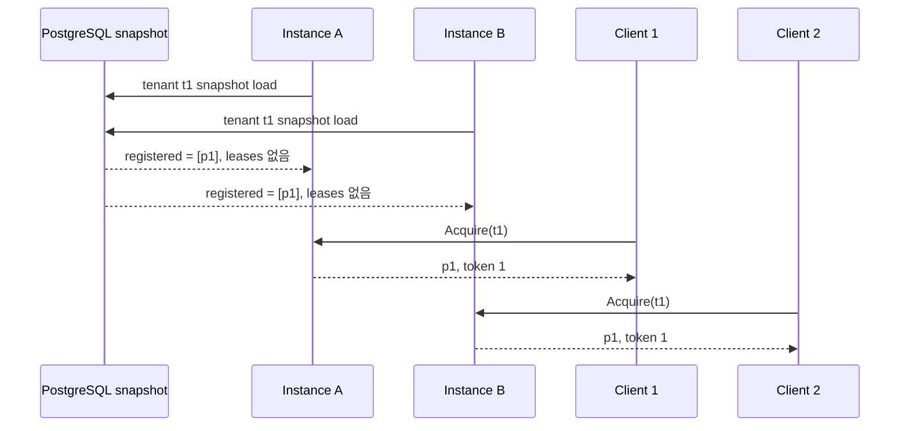
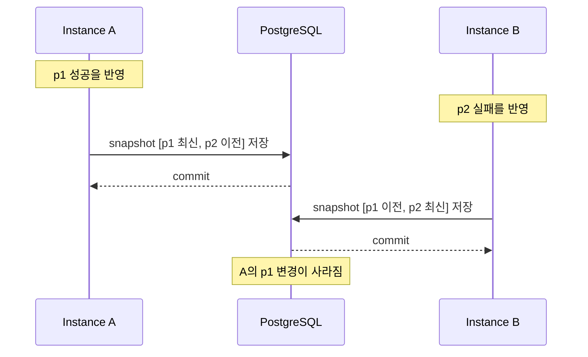

## Table of contents

> **TL;DR**
>
> 현재 `reputation-pool-cloud`는 한 인스턴스에서는 의도한 계약을 지킵니다. 하나의 `ResourcePool` 안에서 `ConcurrentHashMap.compute`가 같은 리소스의 lease를 직렬화하고, `AtomicLong`이 fencing token을 증가시킵니다.
>
> 그러나 인스턴스를 두 개로 늘리는 순간 map도 token counter도 둘로 나뉩니다. 두 인스턴스는 같은 PostgreSQL snapshot을 복원하지만 lease는 복원하지 않으므로, 같은 리소스를 모두 비어 있다고 판단해 각각 빌려줄 수 있습니다. 두 counter가 모두 0에서 시작하면 token도 둘 다 1입니다.
>
> checkpoint 역시 공유 상태 저장소가 아닙니다. 각 JVM의 전체 snapshot을 `DELETE → INSERT`로 교체하므로, 늦게 저장한 인스턴스가 먼저 저장된 인스턴스의 변경을 지울 수 있습니다. 메모리 budget과 tenant별 rate limit도 JVM마다 따로 계산돼 인스턴스 수만큼 실효 한도가 늘어납니다.
>
> 이 글은 실제 멀티인스턴스 운영 결과가 아닙니다. **현재 코드 경로로 구성한 결정적인 설계 반례**입니다. 지금은 단일 인스턴스라는 전제를 명시하는 것이 맞고, 고가용성이 필요해질 때의 1차 선택은 tenant마다 한 인스턴스만 상태를 소유하게 하는 sharding입니다. 다만 소유권 세대 번호까지 저장소 쓰기에 강제하지 않으면 장애 전환 중 옛 소유자가 다시 쓰는 문제는 남습니다.

### Evidence card

| 항목                 | 확인한 근거                                           |
| -------------------- | ----------------------------------------------------- |
| 현재 배포 전제       | 하나의 application instance와 하나의 JVM              |
| lease 배타성 범위    | `LeaseRegistry`의 JVM-local `ConcurrentHashMap`       |
| token 범위           | `LeaseRegistry` 인스턴스마다 생성되는 `AtomicLong`    |
| checkpoint 범위      | pool 전체 snapshot을 PostgreSQL에서 삭제 후 다시 삽입 |
| snapshot에 없는 상태 | 진행 중인 lease                                       |
| 함께 깨지는 제한     | JVM-local global budget, heap의 tenant token bucket   |
| 증거의 성격          | 코드 경로와 공개 issue #85로 만든 설계 반례           |
| 확인하지 않은 범위   | 실제 2-instance 부하·장애 전환·복구 시간 측정         |

---

## 0. 시작 — replica를 늘리는 것은 같은 프로그램을 한 번 더 실행하는 일이다

서버 요청이 많아지면 흔히 “인스턴스를 늘리자”고 말합니다. 지금 서버 프로그램을 한 개 실행하고 있다면 같은 프로그램을 두세 개 실행하고 load balancer가 요청을 나눠 보내는 방식입니다. 이것을 **수평 확장(horizontal scaling)**이라고 합니다.

CPU와 메모리를 더 큰 장비로 바꾸는 수직 확장과 달리, 수평 확장은 처리할 프로세스 자체를 늘립니다.

```text
단일 인스턴스

Client ──> Instance A
             └─ ResourcePool A

수평 확장

             ┌─> Instance A ── ResourcePool A
Client ── LB ┤
             └─> Instance B ── ResourcePool B
```

그림에서 두 `ResourcePool`은 이름만 같은 별도 Java 객체입니다. A의 heap에 있는 map과 B의 heap에 있는 map은 서로 보이지 않습니다. 단순한 stateless API라면 어느 인스턴스가 요청을 받아도 같은 DB를 읽고 답하면 됩니다. 하지만 `reputation-pool`은 현재 선택 판단과 lease를 JVM 메모리에 소유합니다.

따라서 질문은 “서버를 두 개 실행할 수 있는가”가 아닙니다.

> 같은 tenant의 상태를 두 프로세스가 동시에 소유해도 하나의 pool처럼 행동하는가?

현재 답은 **아니다**입니다.

<details>
<summary><b>수평 확장과 수직 확장은 무엇이 다른가</b> (펼치기)</summary>

수직 확장은 한 서버의 CPU나 메모리를 더 크게 만드는 방식입니다. 애플리케이션 프로세스가 하나라면 메모리 안의 lock과 counter도 계속 하나이므로 기존 동시성 계약을 유지하기 쉽습니다. 대신 장비 크기의 상한이 있고, 그 서버가 멈추면 대체할 프로세스가 없습니다.

수평 확장은 같은 애플리케이션 인스턴스를 여러 개 실행합니다. 처리량을 나누고 한 인스턴스 장애에 대비하기 좋지만, 프로세스마다 heap이 따로 생깁니다. 메모리에 저장한 session, lock, counter와 cache는 자동으로 공유되지 않습니다.

그래서 수평 확장 가능한 애플리케이션은 보통 다음 둘 중 하나를 택합니다.

- 요청 사이에 필요한 상태를 프로세스가 소유하지 않는 stateless 구조
- 상태를 소유할 인스턴스를 명확히 하나로 정하는 구조

`reputation-pool`은 아직 두 번째 구조의 “소유자를 정하는 장치”가 없으므로 단일 인스턴스가 정확성 조건입니다.

</details>

---

## 1. 한 JVM에서 지켜지는 배타성은 어디에서 오는가

`ResourcePool.acquire()`는 선택 가능한 후보를 고른 뒤 `LeaseRegistry.tryAcquire()`로 실제 사용권을 요청합니다. 핵심 상태는 다음 두 필드입니다.

```java
private final ConcurrentHashMap<ResourceId, Lease> active =
    new ConcurrentHashMap<>();
private final AtomicLong fencing = new AtomicLong();
```

같은 리소스에 여러 thread가 동시에 접근해도 `active.compute(resource, ...)`는 그 key의 변경을 원자적으로 수행합니다. 먼저 성공한 thread만 lease를 만들고, 나머지는 이미 사용 중인 lease를 봅니다.

```java
active.compute(resource, (key, current) -> {
    if (current == null || current.isExpired(now)) {
        created[0] = new Lease(
            resource,
            context,
            fencing.incrementAndGet(),
            now,
            now.plus(ttl)
        );
        return created[0];
    }
    return current;
});
```

이 구현이 보장하는 범위는 정확히 **이 map을 공유하는 thread들**입니다.

```text
한 JVM
Thread 1 ─┐
Thread 2 ─┼─> 같은 LeaseRegistry.active ─> 한 명만 성공
Thread 3 ─┘
```

인스턴스가 나뉘면 공유하는 map이 없습니다.

```text
Instance A ─> active A ─> p1은 비어 있음
Instance B ─> active B ─> p1은 비어 있음
```

각 map 안에서는 thread-safe하지만, 두 map을 합친 시스템은 같은 리소스를 동시에 비어 있다고 판단합니다. **thread-safe와 distributed-safe는 같은 말이 아닙니다.**

---

## 2. 두 인스턴스에서 같은 리소스가 두 번 대여되는 과정

다음은 운영 측정값이 아니라 현재 코드에서 도출한 실행 순서입니다. 임의의 scheduler 운에 기대지 않아도 각 단계가 정상적으로 성공합니다.



`ResourcePool.snapshot()`은 reputation cell, blocklist와 등록된 resource를 저장합니다. 진행 중인 lease는 runtime coordination이라는 이유로 의도적으로 포함하지 않습니다. `restore()` 직후에는 아무것도 빌려간 상태가 아닙니다.

이 선택은 단일 인스턴스 재시작에서는 이해할 수 있습니다. 죽은 프로세스의 lease를 그대로 복구하면 실제 사용자가 사라졌는데도 TTL까지 자원을 묶을 수 있기 때문입니다. 하지만 두 인스턴스가 동시에 같은 snapshot을 복원하면 둘 다 p1을 사용 가능하다고 봅니다.

| 시점             | Instance A가 보는 p1 | Instance B가 보는 p1 | 시스템 전체                |
| ---------------- | -------------------- | -------------------- | -------------------------- |
| 복원 직후        | free                 | free                 | free처럼 보이는 복제본 2개 |
| Client 1 acquire | token 1로 leased     | free                 | A만 사용 중이라고 앎       |
| Client 2 acquire | token 1로 leased     | token 1로 leased     | 같은 p1이 두 번 대여됨     |

두 요청 모두 자기 JVM 안에서는 계약을 위반하지 않았습니다. 문제는 **계약을 판단하는 상태가 두 벌**이라는 데 있습니다.

<details>
<summary><b>split-brain은 무엇인가</b> (펼치기)</summary>

Split-brain은 하나여야 할 상태의 주인이 둘로 갈라져 각자 자신이 올바른 주인이라고 행동하는 상황입니다.

이 글의 예에서는 A와 B 모두 같은 tenant의 최신 pool을 자신이 가지고 있다고 생각합니다. 서로의 lease를 볼 수 없으므로 둘 다 같은 p1을 빌려줍니다.

단순히 데이터가 잠시 다르다는 cache 불일치보다 강한 문제입니다. 두 인스턴스가 동시에 외부에 유효한 결정을 내리기 때문입니다. 프록시 계정이 동시 사용을 허용하지 않는다면 세션 충돌이나 차단으로 이어질 수 있고, “같은 리소스는 동시에 한 요청만 사용한다”는 pool의 핵심 계약도 깨집니다.

</details>

---

## 3. JVM-local fencing token은 다른 JVM을 막지 못한다

Fencing token은 “현재 사용권이 몇 번째 세대인지 나타내는 증가 번호”입니다. 오래된 작업이 늦게 도착했을 때 최신 번호보다 작으면 거부할 수 있습니다.

현재 구현에서 token은 같은 JVM 안의 stale `renew`와 `release`를 막습니다.

```text
token 7 lease 만료
token 8 새 lease 발급
늦게 도착한 release(token 7)
→ 현재 token 8과 다르므로 무시
```

이 계약은 유용합니다. 그러나 각 인스턴스가 자기 `AtomicLong`을 가지면 A와 B가 모두 token 1을 발급할 수 있습니다. 번호의 대소 관계 자체가 시스템 전체에서 존재하지 않습니다.

```text
Instance A: 0 → 1
Instance B: 0 → 1
```

여기서 counter만 PostgreSQL sequence로 바꿔 token 1과 2를 발급하면 문제가 모두 해결될까요? 아닙니다.

두 인스턴스가 같은 p1을 대여하는 double grant는 이미 일어났습니다. 또한 실제 p1을 사용하는 하위 시스템이 “마지막으로 본 token보다 작은 요청은 거부한다”는 검사를 하지 않으면, token 1을 가진 느린 작업도 계속 부수 효과를 만들 수 있습니다.

따라서 분산 환경의 fencing은 두 조건이 함께 필요합니다.

1. 모든 인스턴스가 비교 가능한 단조 증가 token을 발급한다.
2. 상태를 변경하는 최종 저장소나 resource가 낮은 token의 요청을 거부한다.

현재 token은 `LeaseRegistry` 내부의 갱신·반환 안전장치입니다. “외부 resource까지 오래된 작업을 차단하는 분산 fencing”이라고 부르면 현재 구현보다 강한 보장을 주장하게 됩니다.

<details>
<summary><b>fencing token과 단순 lock은 무엇이 다른가</b> (펼치기)</summary>

Lock은 지금 누가 작업할 차례인지 정합니다. 하지만 lock holder가 멈췄다가 늦게 깨어나는 상황까지 자동으로 막지는 못합니다.

```text
A가 lock 획득
→ A가 긴 정지 상태
→ lock TTL 만료
→ B가 새 lock 획득하고 작업
→ A가 다시 깨어나 오래된 작업 수행
```

A는 자신이 lock을 잃었다는 사실을 모를 수 있습니다. 이때 B에게 더 큰 token을 주고 최종 저장소가 token을 검사하면 A의 오래된 쓰기를 거부할 수 있습니다.

```text
A: token 41
B: token 42
저장소가 42를 이미 관찰
→ 뒤늦은 41의 쓰기 거부
```

Redis의 공식 distributed lock 문서도 correctness가 중요한 작업에서는 fencing token을 구현해야 한다고 명시합니다. 중요한 점은 token을 “발급”하는 데서 끝나지 않고, 부수 효과를 받는 쪽이 순서를 **강제**해야 한다는 것입니다.

</details>

---

## 4. checkpoint는 공유 상태가 아니라 한 JVM의 복구 사본이다

현재 PostgreSQL 저장은 한 pool의 전체 snapshot을 교체합니다.

```text
transaction begin
→ pool_id = t1의 cell 삭제
→ pool_id = t1의 blocklist 삭제
→ pool_id = t1의 registered resource 삭제
→ 현재 JVM snapshot 전체 삽입
→ snapshot metadata 갱신
transaction commit
```

한 인스턴스가 주기적으로 자기 상태를 복구용으로 저장할 때는 단순하고 일관된 방식입니다. 그러나 A와 B가 같은 tenant를 따로 변경하고 checkpoint하면 마지막 transaction이 앞선 변경을 덮어씁니다.



각 transaction 내부의 `DELETE → INSERT`는 원자적일 수 있습니다. 하지만 “누가 이 pool을 저장할 권한이 있는가”와 “내가 읽은 version 이후 다른 writer가 저장했는가”를 검사하지 않습니다. 현재 metadata에는 compare-and-set에 사용할 owner epoch나 snapshot version 조건이 없습니다.

PostgreSQL의 `REPEATABLE READ`도 이 문제의 답이 아닙니다. 그것은 한 transaction이 읽는 동안 일관된 snapshot을 보게 하는 격리 수준입니다. 서로 다른 두 JVM 중 어느 쪽이 tenant의 공식 writer인지 정하지는 않습니다.

<details>
<summary><b>전체 snapshot 교체와 row 단위 갱신은 무엇이 다른가</b> (펼치기)</summary>

전체 snapshot 교체는 메모리 상태 전체를 한 덩어리로 저장합니다. 구현과 복구가 단순하지만 writer가 둘이면 서로 다른 부분의 변경도 잃을 수 있습니다.

```text
A snapshot: p1=새 값, p2=옛 값
B snapshot: p1=옛 값, p2=새 값
```

B가 나중에 전체를 저장하면 p2만 갱신하려던 의도와 관계없이 p1도 옛 값으로 돌아갑니다.

Row 단위 갱신은 변경한 p2만 저장할 수 있지만 그것만으로 모든 문제가 해결되지는 않습니다. A와 B가 같은 p1을 동시에 갱신하면 version column, 조건부 update나 lock 같은 충돌 규칙이 여전히 필요합니다.

핵심은 저장 단위보다 먼저 **authoritative state가 어디에 있고, 동시에 몇 명이 쓸 수 있는가**를 결정하는 것입니다.

</details>

---

## 5. pool만이 아니라 budget과 rate limit도 함께 늘어난다

3편에서 JVM 전체 resource와 cell 수를 `GlobalResourceBudget`으로 제한하고 tenant별 token bucket으로 요청 폭주를 제한했습니다.

이름에 global이 들어가지만 정확한 범위는 한 JVM입니다.

```text
maxResources = 100,000

Instance A budget = 100,000
Instance B budget = 100,000
--------------------------------
system effective limit = 200,000
```

Rate limiter도 tenant별 bucket을 JVM heap에 보관합니다. 같은 tenant의 요청이 load balancer에서 A와 B로 나뉘면 두 bucket에서 각각 허용량을 받습니다. 인스턴스가 세 개면 설정값의 최대 세 배까지 통과할 수 있습니다.

| 계약                  | 단일 인스턴스          | 두 인스턴스              |
| --------------------- | ---------------------- | ------------------------ |
| 같은 resource의 lease | map 하나가 배타성 보장 | map 두 개가 각각 grant   |
| fencing token         | 한 counter에서 증가    | 같은 token 중복 가능     |
| memory budget         | JVM 전체 상한          | 상한이 최대 2배          |
| tenant rate limit     | tenant bucket 하나     | bucket 두 개             |
| checkpoint            | 유일한 writer          | whole-snapshot writer 둘 |

수평 확장을 lease 하나만 Redis로 옮기는 작업으로 끝낼 수 없는 이유입니다. **정확성의 범위가 JVM인 모든 상태를 목록화하고 각각 소유 모델을 정해야 합니다.**

---

## 6. sticky routing만으로 해결되지 않는다

가장 작은 변경처럼 보이는 방법은 load balancer가 tenant A의 요청을 항상 Instance A로 보내게 하는 것입니다. 이를 sticky routing 또는 affinity라고 부릅니다.

정상 상태에서는 한 tenant가 한 pool만 사용하므로 문제가 사라진 것처럼 보입니다. 그러나 routing 규칙은 상태 소유권 계약이 아닙니다.

- A가 응답하지 않을 때 load balancer가 B로 요청을 보낼 수 있습니다.
- 배포 중 새 instance로 routing이 먼저 바뀌고 A의 이전 요청이 계속 실행될 수 있습니다.
- routing table이 서로 다른 시점에 갱신되면 두 owner가 잠시 공존할 수 있습니다.
- A가 회복한 뒤 자신이 owner가 아니게 됐음을 모를 수 있습니다.

따라서 필요한 것은 “대부분 같은 곳으로 보낸다”가 아니라 다음 불변식입니다.

> 어느 순간에도 tenant의 쓰기 권한을 가진 owner는 하나이며, 옛 owner의 늦은 쓰기는 저장소가 거부한다.

---

## 7. 세 가지 재설계 방향을 비교했다

공개 issue #85에서는 세 가지 선택지를 남겼습니다.

### 7.1 tenant sharding — tenant마다 owner를 하나만 둔다

tenant ID를 기준으로 한 instance가 해당 pool을 소유합니다. 요청은 owner에게 routing하고, 다른 instance는 그 tenant의 in-memory pool을 만들지 않습니다.

```text
tenant A ─> Instance 1
tenant B ─> Instance 2
tenant C ─> Instance 1
```

장점은 현재 JDK-only core와 빠른 in-memory 판단을 유지한다는 것입니다. tenant 수가 늘면 서로 다른 instance로 분산할 수도 있습니다.

어려운 부분은 장애 전환입니다. Instance 1이 잠시 멈춘 사이 Instance 2가 A의 새 owner가 됐는데 1이 다시 살아나면 둘이 함께 쓸 수 있습니다. 그래서 저장소에 owner와 단조 증가 epoch를 기록하고, checkpoint와 상태 변경이 현재 epoch와 일치할 때만 성공하게 해야 합니다.

```text
owner epoch 17: Instance 1
장애 전환
owner epoch 18: Instance 2
Instance 1의 늦은 save(epoch 17)
→ 저장소에서 거부
```

현재 구조를 가장 적게 바꾸면서 tenant 단위로 확장할 수 있어 **고가용성이 실제 요구가 되는 시점의 1차 후보**입니다.

### 7.2 상태 외부화 — PostgreSQL이나 Redis를 authoritative state로 만든다

lease와 평판 상태의 진짜 원본을 공유 저장소로 옮기고, 모든 instance가 원자적 조건부 연산으로 접근합니다. 어떤 instance가 요청을 받아도 같은 상태를 봅니다.

장점은 애플리케이션 instance가 stateless에 가까워지고 routing 자유도가 높아진다는 것입니다. 반면 acquire hot path마다 network 왕복, transaction과 저장소 경합이 들어갑니다. 현재 core의 빠른 in-memory aggregate 경계도 크게 바뀝니다.

단순히 Redis를 추가한다는 말로는 부족합니다. acquire, renew, release, block과 report 각각에 어떤 원자성 조건이 필요한지 다시 명세해야 합니다.

### 7.3 single writer와 leader election — 한 instance만 쓰게 한다

여러 instance를 실행하되 leader 하나만 쓰기 요청과 checkpoint를 수행하고 나머지는 대기합니다. Kubernetes Lease처럼 공유 coordination record를 낙관적 동시성 제어로 갱신해 leader를 선출할 수 있습니다.

장점은 writer가 하나이므로 현재 모델을 이해하기 쉽다는 것입니다. 단점은 write 처리량을 여러 instance로 나누지 못하고, leader 전환 시간과 routing을 관리해야 한다는 점입니다.

Leader lease가 만료됐다는 사실만으로 옛 leader의 실행이 즉시 멈춘다는 보장은 없습니다. 저장소 write에도 leadership epoch를 전달하고 낮은 epoch를 거부해야 안전합니다.

### 7.4 결정 표

| 선택            | 현재 core 변경 | write 확장성 | 장애 전환 난이도 | hot path 비용         | 적합한 시점                                 |
| --------------- | -------------- | ------------ | ---------------- | --------------------- | ------------------------------------------- |
| tenant sharding | 낮음~중간      | tenant 단위  | 중간             | JVM-local 유지        | tenant가 충분히 많고 HA 필요                |
| 상태 외부화     | 높음           | 높음         | 저장소에 위임    | network·DB/Redis 비용 | 임의 instance routing과 강한 공유 상태 필요 |
| single writer   | 중간           | 낮음         | leader 전환 필요 | leader 내부는 빠름    | 처리량보다 빠른 failover가 중요             |

---

## 8. 지금의 결정 — 단일 인스턴스 한계를 숨기지 않는다

현재는 실제 멀티인스턴스 트래픽, 장애 전환 목표와 tenant 규모가 없습니다. 이 상태에서 Redis cluster나 consensus layer부터 추가하면 해결한 문제보다 운영할 시스템이 더 커질 수 있습니다.

그래서 지금 선택은 다음과 같습니다.

1. 배포 replica를 1로 유지합니다.
2. “thread-safe”를 “수평 확장 가능”으로 표현하지 않습니다.
3. budget, rate limit, lease와 checkpoint의 정확성 범위를 JVM으로 문서화합니다.
4. 두 번째 instance가 필요해지는 조건과 측정값을 먼저 정의합니다.
5. 그 시점에는 tenant sharding + owner epoch를 우선 검증합니다.

이것은 수평 확장을 포기한 것이 아니라 **필요하지 않은 분산 합의 비용을 미루면서 현재의 안전 경계를 명시한 결정**입니다.

### 재설계를 시작할 조건

- 단일 instance의 CPU·heap·처리량이 지속적으로 목표 상한에 도달한다.
- 배포 중 중단 시간을 허용할 수 없어 active-standby가 필요하다.
- 장애 복구 목표가 현재 instance 재기동 시간보다 짧다.
- tenant별 부하 차이가 커 tenant 단위 분산 효과가 분명하다.
- cross-instance 정확성을 검증할 failure-injection 환경을 준비할 수 있다.

---

## 9. 구현 전에 검증해야 할 실패 시나리오

어떤 선택을 하든 happy path test만으로는 부족합니다.

| 시나리오                                 | 확인할 불변식                               |
| ---------------------------------------- | ------------------------------------------- |
| owner가 checkpoint 중 정지               | 새 owner가 복구하고 옛 snapshot을 거부      |
| network partition 뒤 옛 owner 복귀       | 낮은 epoch의 write와 renew 거부             |
| 두 instance가 동시에 ownership 획득 시도 | 하나만 성공                                 |
| routing이 owner보다 늦게 갱신            | 요청 forwarding 또는 명시적 재시도          |
| lease 중 owner 장애                      | 중복 사용 허용 범위와 재획득 시점 명세      |
| rate-limit store 장애                    | fail-open과 fail-closed 중 선택한 정책 유지 |
| tenant 이동 중 report 도착               | 결과 유실·중복 반영 규칙 유지               |

특히 “동시에 leader가 하나뿐이다”만 검사해서는 부족합니다. 옛 leader가 멈췄다고 믿은 뒤 실제로는 실행을 계속하는 상황을 주입하고, 저장소가 옛 epoch를 거부하는지 확인해야 합니다.

---

## 10. 이 글이 증명한 것과 증명하지 않은 것

### 증명한 것

- 현재 lease 배타성은 하나의 `LeaseRegistry`를 공유하는 thread 범위입니다.
- snapshot에는 lease가 없으므로 두 instance는 같은 resource를 각각 free로 볼 수 있습니다.
- fencing counter, budget과 rate-limit bucket은 JVM마다 독립적입니다.
- whole-snapshot checkpoint에는 multi-writer 충돌을 막는 owner/version 조건이 없습니다.
- 따라서 동일 tenant를 두 active instance가 소유하는 구성은 현재 계약 밖입니다.

### 증명하지 않은 것

- 실제 운영에서 double grant가 발생한 빈도
- PostgreSQL checkpoint 충돌의 실측 유실률
- tenant sharding, Redis와 single writer의 실제 latency·비용
- 목표 RTO와 RPO를 만족하는 failover 시간
- 어떤 재설계가 프로덕션에서 최종적으로 가장 낫다는 결론

이 구분이 중요합니다. 코드를 읽어 필연적인 반례를 만들 수는 있지만, 아직 구현하지 않은 대안의 운영 성능까지 주장할 수는 없습니다.

---

## 11. FAQ

### Q. `ConcurrentHashMap`을 쓰는데 왜 같은 리소스가 두 번 대여되나요?

**A.** `ConcurrentHashMap`은 그 객체를 함께 사용하는 thread 사이의 원자성을 제공합니다. Instance A와 B는 서로 다른 JVM과 서로 다른 map을 가지므로 A의 lease가 B의 map에는 없습니다.

### Q. lease를 PostgreSQL에 저장하기만 하면 해결되나요?

**A.** 저장 위치만 바꾸는 것으로는 부족합니다. “아직 유효한 lease가 없을 때만 insert/update”라는 조건을 하나의 transaction 또는 원자적 statement로 실행해야 합니다. 만료, renew, release와 token 비교도 같은 저장소 계약으로 옮겨야 합니다.

### Q. PostgreSQL advisory lock을 tenant마다 잡으면 되지 않나요?

**A.** 후보가 될 수는 있지만 애플리케이션이 lock key 규칙과 session·transaction 수명을 정확히 지켜야 합니다. PostgreSQL 문서도 advisory lock의 의미는 애플리케이션이 정의하고 사용을 강제한다고 설명합니다. 또한 lock을 잡았다는 사실과 옛 작업의 늦은 외부 부수 효과를 막는 fencing은 별도 문제입니다.

### Q. StatefulSet을 사용하면 stateful 문제를 해결하나요?

**A.** StatefulSet은 Pod에 안정적인 identity, 순서와 storage 연결을 제공합니다. 어느 Pod가 특정 tenant의 유일한 writer인지, 옛 Pod의 쓰기를 어떻게 거부할지는 애플리케이션이 설계해야 합니다. 안정적인 이름은 ownership protocol 자체가 아닙니다.

### Q. 그러면 지금 architecture는 잘못된 것인가요?

**A.** 현재 배포 전제가 단일 instance이고 그 한계를 명시한다면 아닙니다. 잘못되는 시점은 상태 소유 모델을 바꾸지 않고 replica 수만 늘리면서 같은 정확성을 기대할 때입니다.

### Q. 왜 지금 바로 Redis를 도입하지 않나요?

**A.** 아직 cross-instance 처리량과 HA 요구가 측정되지 않았습니다. Redis를 넣으면 lease 원자성, 장애 정책, 데이터 영속성과 운영 대상이 새로 생깁니다. 요구가 확인되기 전에는 단일 owner가 더 단순하고 검증 가능한 선택입니다.

---

## 12. 다음 검증

다음 단계는 코드를 바로 분산화하는 것이 아닙니다.

1. 2-instance test harness에서 같은 tenant의 동시 acquire 반례를 실행 가능한 테스트로 고정합니다.
2. owner registry와 epoch를 포함한 tenant sharding prototype을 만듭니다.
3. owner 정지·network partition·늦은 checkpoint를 주입합니다.
4. failover 시간, 중복 grant와 유실 여부를 측정합니다.
5. 측정 결과가 요구를 만족하지 못할 때 상태 외부화와 single writer를 다시 비교합니다.

분산 시스템에서 어려운 부분은 server를 여러 개 띄우는 일이 아닙니다. **누가 상태의 진짜 주인인지, 주인이 바뀐 뒤 옛 주인의 행동을 어디에서 거부할지 정하는 일**입니다.

---

## References

### 프로젝트 근거

- [LeaseRegistry — JVM-local lease map과 fencing counter](https://github.com/PreAgile/reputation-pool/blob/fdb0115bc911c238e271cc5ccc3a3c841665a17d/reputation-pool-core/src/main/java/io/github/preagile/reputationpool/core/pool/LeaseRegistry.java)
- [ResourcePool — snapshot에 lease를 포함하지 않는 계약](https://github.com/PreAgile/reputation-pool/blob/fdb0115bc911c238e271cc5ccc3a3c841665a17d/reputation-pool-core/src/main/java/io/github/preagile/reputationpool/core/pool/ResourcePool.java)
- [PostgresResourceStore — pool 전체 snapshot 저장](https://github.com/PreAgile/reputation-pool/blob/fdb0115bc911c238e271cc5ccc3a3c841665a17d/reputation-pool-persistence/src/main/java/io/github/preagile/reputationpool/persistence/PostgresResourceStore.java)
- [Issue #85 — 멀티인스턴스 상태 소유 모델 spike](https://github.com/PreAgile/reputation-pool-cloud/issues/85)
- [GlobalResourceBudget — global의 범위가 한 JVM임을 명시](https://github.com/PreAgile/reputation-pool-cloud/blob/f83afaca5124e50d5405121317fa11dc9788624c/src/main/java/io/github/preagile/reputationpool/cloud/engine/GlobalResourceBudget.java)
- [RateLimiter — JVM heap의 tenant token bucket](https://github.com/PreAgile/reputation-pool-cloud/blob/f83afaca5124e50d5405121317fa11dc9788624c/src/main/java/io/github/preagile/reputationpool/cloud/security/RateLimiter.java)

### 공식 문서

- [Kubernetes Leases — leader election과 workload coordination](https://kubernetes.io/docs/concepts/architecture/leases/)
- [Kubernetes StatefulSet — stable identity가 제공하는 것과 한계](https://kubernetes.io/docs/concepts/workloads/controllers/statefulset/)
- [PostgreSQL Explicit Locking — application-defined advisory locks](https://www.postgresql.org/docs/current/explicit-locking.html#ADVISORY-LOCKS)
- [Redis Distributed Locks — correctness를 위한 fencing token 주의사항](https://redis.io/docs/latest/develop/clients/patterns/distributed-locks/)
