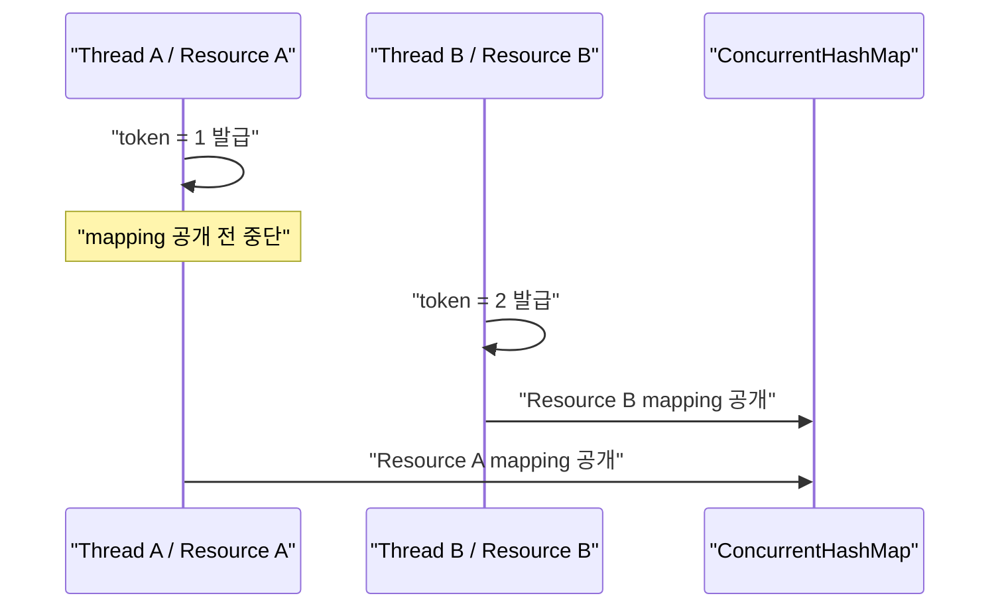
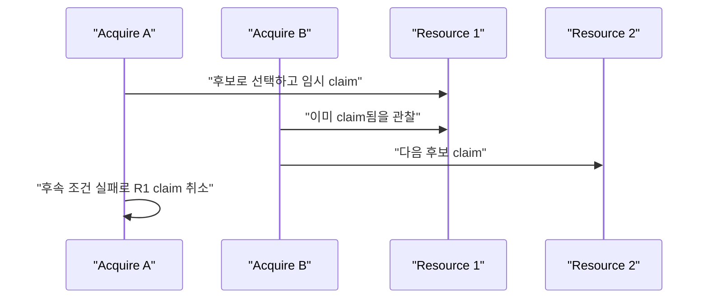

## Table of contents

> **TL;DR**
>
> `reputation-pool`에는 이미 32개 스레드가 한 리소스를 동시에 요청하는 테스트가 있었습니다. 테스트는 통과했지만, 통과한다는 사실만으로 모든 실행 순서가 안전하다고 말할 수는 없었습니다.
>
> Lincheck를 붙인 뒤 처음 마주한 것은 구현 결함이 아니라 **제가 너무 강하게 쓴 명세**였습니다.
>
> 1. fencing token은 전체 리소스 사이의 발급 순서를 보장하지 않는다.
> 2. 여러 후보 중 어떤 리소스를 `acquire`가 고르는지는 계약이 아니라 스케줄링 정책이다.
> 3. `block`과 경합하는 `acquire`는 안전하게 실패할 수 있으며, 이 허용 범위는 일반적인 선형화 명세로 표현하기 어렵다.
>
> 실패 trace에 맞춰 테스트를 약하게 만든 것이 아닙니다. 호출자가 실제로 관찰하고 의존할 수 있는 약속과, 우연히 관찰되는 실행 결과를 분리했습니다. 이후 `ConcurrentHashMap.compute`를 의도적으로 get-then-put으로 바꾸자 Lincheck는 두 요청이 동시에 lease를 획득하는 반례를 재현했습니다. 가장 큰 결과는 초록색 테스트가 아니라, **어디까지가 공개 계약인지 설명할 수 있게 된 것**이었습니다.

### Evidence card

| 항목               | 검증 근거                                             |
| ------------------ | ----------------------------------------------------- |
| 검증 대상          | `LeaseRegistry`, `ResourcePool`의 동시성 계약         |
| 기준 version       | `reputation-pool` PR #49, Lincheck 3.6, Java 25       |
| 검증 방법          | 모델 체킹 + stress + 의도적 mutation                  |
| 실제 반례          | get-then-put 변이에서 동일 리소스 double grant        |
| 수정된 명세        | token 순서는 리소스별 계약, 선택된 ID는 스케줄링 정책 |
| 확인한 범위        | 단일 JVM에서 공개한 operation과 설정한 탐색 범위      |
| 확인하지 않은 범위 | DB·네트워크·여러 process를 포함한 분산 배타성         |

---

## 0. 시작 — 테스트가 구현보다 명세를 먼저 깨뜨렸다

`reputation-pool`은 프록시, 계정, 세션처럼 평판이 변하는 리소스를 여러 요청에 빌려주는 코어 라이브러리입니다. 같은 프록시가 동시에 두 요청에 배정되면 둘의 행동이 섞이고, 한 요청의 차단이 다른 요청의 성공률까지 훼손할 수 있습니다.

그래서 `LeaseRegistry`에는 단순하지만 강한 불변식이 있습니다.

> 살아 있는 하나의 리소스에는 동시에 하나의 lease만 존재해야 한다.

구현은 `ConcurrentHashMap.compute`로 같은 키에 대한 확인과 등록을 한 번에 수행했습니다. 여기에 32개 스레드가 동시에 `tryAcquire`를 호출하고 정확히 하나만 성공하는 테스트도 있었습니다.

```java
active.compute(resource, (key, current) -> {
    if (current == null || current.isExpired(now)) {
        created[0] = new Lease(
            resource,
            context,
            fencing.incrementAndGet(),
            now,
            now.plus(ttl)
        );
        return created[0];
    }
    return current;
});
```

처음에는 이것으로 충분해 보였습니다. 하지만 이 테스트가 확인한 것은 **내 노트북에서 실행한 몇 번의 스케줄링에서 승자가 한 명이었다**는 사실뿐입니다. 운이 나쁘면 한 번도 만나지 않을 실행 순서를 어떻게 다룰지, 실패했을 때 그 순서를 어떻게 재현할지는 답하지 못했습니다.

Lincheck를 도입한 이유는 테스트 개수를 늘리기 위해서가 아니었습니다. 이 구현의 모든 동시 실행 결과를 순차 실행으로 설명할 수 있는지, 즉 **우리가 말하는 계약이 실제로 성립하는지** 확인하고 싶었습니다.

그런데 첫 실행부터 예상과 다른 일이 벌어졌습니다. 구현보다 명세가 먼저 기각됐습니다.

---

## 1. 왜 Lincheck에 계약을 증명해달라고 요청했나

Lincheck 테스트는 동시성 코드를 특별한 문법으로 다시 구현하지 않습니다. 실제 객체를 만들고, 외부에서 호출할 수 있는 연산을 `@Operation`으로 공개합니다.

```java
@Operation
public boolean tryAcquire() {
    return registry
        .tryAcquire(RESOURCE, CONTEXT, NOW, TTL)
        .isPresent();
}

@Operation
public boolean renew(@Param(name = "token") int token) {
    return registry.renew(RESOURCE, token, NOW, TTL).isPresent();
}

@Operation
public boolean release(@Param(name = "token") int token) {
    return registry.release(RESOURCE, token);
}

@Operation
public boolean isLeased() {
    return registry.isLeased(RESOURCE, NOW);
}
```

Lincheck는 이 연산들을 여러 스레드에 배치해 실행한 뒤, 관찰된 반환값을 같은 연산의 순차 실행 결과와 비교합니다. 동시 실행 결과를 설명할 수 있는 순차 순서가 하나도 없다면 최소 반례에 가까운 trace를 보여줍니다.

여기서 중요한 점이 있습니다. Lincheck는 코드에서 계약을 자동으로 발견하지 않습니다. **우리가 노출한 연산과 반환값이 곧 검사할 계약**입니다. 잘못된 가정을 연산에 포함하면 구현이 옳아도 실패합니다.

<details>
<summary><b>(입문) Lincheck는 무엇이고 실무에서 어떻게 사용하는가</b> (펼치기)</summary>

Lincheck는 JetBrains가 만든 JVM 동시성 테스트 프레임워크입니다. 동시성 자료구조나 상태 객체에 대해 다음 흐름으로 사용합니다.

1. 검사할 실제 객체를 테스트 필드로 둡니다.
2. 여러 스레드가 호출할 공개 연산을 `@Operation`으로 표시합니다.
3. 모델 체킹 또는 스트레스 전략으로 시나리오를 생성합니다.
4. 관찰된 결과가 순차 명세로 설명되는지 검사합니다.
5. 실패하면 어떤 연산이 어떤 순서로 겹쳤는지 trace를 확인합니다.

예를 들어 스택이라면 `push`, `pop`, `size`를 연산으로 공개할 수 있습니다. 두 스레드가 동시에 `push`와 `pop`을 수행한 결과가 정상적인 단일 스레드 실행 순서 중 어느 것과도 일치하지 않으면 동시성 계약 위반입니다.

실무에서는 다음과 같은 코드에 특히 잘 맞습니다.

- lock-free 또는 fine-grained lock을 사용한 자료구조
- 캐시의 원자적 갱신
- lease, lock, semaphore 같은 동시 접근 제어
- 여러 연산 사이의 상태 전이가 외부에 관찰되는 컴포넌트

반대로 데이터베이스, 메시지 브로커, 네트워크까지 포함한 분산 시스템 전체를 Lincheck 하나로 검증할 수는 없습니다. Lincheck는 한 JVM 안에서 검사 가능한 상태와 연산의 동시성 계약에 집중합니다.

이 프로젝트에서는 런타임 의존성을 JDK로만 유지하기 위해 Lincheck 3.6을 별도의 `lincheckTest` 테스트 소스셋에만 추가했습니다. 일반 빌드에서는 컴파일하고, 시간이 더 드는 실행은 CI의 별도 단계와 필요할 때의 로컬 명령으로 분리했습니다.

</details>

<details>
<summary><b>(입문) 선형화 가능성은 무엇을 의미하는가</b> (펼치기)</summary>

두 연산이 실제 시간에서는 겹칠 수 있습니다.

```text
Thread A: |------ tryAcquire ------|
Thread B:       |--- isLeased ---|
```

내부에서는 여러 명령이 실행되지만, 외부에서는 각 연산이 호출과 반환 사이의 어느 한순간에 완료된 것처럼 설명할 수 있어야 합니다. 이것을 <strong>선형화 가능성(linearizability)</strong>이라고 부릅니다.

위 실행의 반환값이 다음 둘 중 하나의 순차 실행으로 설명된다면 선형화할 수 있습니다.

1. `tryAcquire`가 먼저 완료되고 `isLeased`가 `true`를 봤다.
2. `isLeased`가 먼저 완료되어 `false`를 보고, 그 뒤 `tryAcquire`가 성공했다.

반면 같은 리소스에 대한 두 `tryAcquire`가 모두 `true`를 반환하면 어떤 순서로 놓아도 설명할 수 없습니다. 첫 번째 성공 뒤에는 살아 있는 lease가 있으므로 두 번째는 실패해야 하기 때문입니다.

또 하나의 조건은 실제 시간 순서를 존중하는 것입니다. A가 반환한 뒤 B가 호출됐다면 B를 A보다 앞에 놓아서는 안 됩니다. 이 조건 덕분에 선형화 가능성은 호출자가 체감하는 “원자적으로 동작한다”는 직관과 잘 맞습니다.

</details>

---

## 2. 실행할 때마다 달라지는 조건을 테스트에서 제외했다

동시 실행을 순차 실행과 비교하려면 같은 입력에는 같은 결과가 나와야 합니다. 하지만 `ResourcePool`에는 시간, 후보 선택, 이벤트 발행처럼 결과를 흔들 수 있는 요소가 있었습니다.

이 요소들은 동시성 구현이 올바른지와 관계없이 실행할 때마다 결과를 바꿀 수 있습니다. 예를 들어 테스트 도중 lease의 유효 시간이 끝나거나, 난수가 이번에는 A를 고르고 다음에는 B를 고르면 실패 원인이 동시성 제어인지 시간과 선택의 차이인지 구분하기 어렵습니다.

그래서 이번 테스트가 판단할 필요가 없는 세 가지 조건을 고정하거나 검사 대상에서 제외했습니다.

| 실행마다 달라질 수 있는 조건 | 테스트에서의 처리                   | 이유                                            |
| ---------------------------- | ----------------------------------- | ----------------------------------------------- |
| 현재 시각                    | 고정된 `Clock`과 `Instant` 사용     | 실행 도중 TTL이 만료되는 우연 제거              |
| 후보 선택                    | ID가 가장 작은 리소스를 고르는 전략 | 스케줄에 따라 난수 소비 순서가 바뀌는 문제 제거 |
| 이벤트 발행                  | no-op `EventSink` 사용              | 외부 부수 효과를 계약 검사에서 제외             |

특히 `new Random(42)`처럼 seed만 고정하는 것으로는 부족했습니다. 여러 스레드가 난수를 소비하면 **어떤 스레드가 먼저 난수를 가져가는지**가 실행 순서에 따라 달라집니다. 난수열은 같아도 각 호출에 배정되는 값은 달라집니다.

결국 Lincheck harness를 만드는 일은 테스트 어노테이션을 붙이는 작업보다, **검사하려는 동시성 계약과 그때그때 달라지는 실행 환경을 분리하는 작업**에 가까웠습니다. 시간이 인자로 주입되고 선택 전략이 교체 가능했기 때문에 프로덕션 코드를 테스트용으로 왜곡하지 않고 같은 조건을 반복해서 만들 수 있었습니다.

---

## 3. 첫 번째 기각 — fencing token은 전역 순서가 아니었다

여기서 말하는 fencing token은 **리소스를 빌릴 때마다 새로 발급되는 증가 번호**입니다. 예전 사용자가 뒤늦게 돌아와 현재 사용자의 lease를 해제하거나 연장하지 못하도록, 현재 lease와 같은 번호를 가진 요청만 변경을 허용합니다.

처음에는 여러 리소스를 하나의 테스트에 넣고 이 token 값까지 관찰했습니다. `AtomicLong`이 전역으로 증가하니 token 1을 받은 lease가 token 2를 받은 lease보다 먼저 공개됐을 것이라고 생각했습니다.

<details>
<summary><b>(입문) fencing token이란 무엇이고 왜 이 구조에 필요했나</b> (펼치기)</summary>

fencing token은 <strong>“지금 리소스를 사용할 차례가 누구인지 구분하는 번호표”</strong>라고 생각하면 이해하기 쉽습니다.

프록시 A를 요청 1이 빌렸다고 가정하겠습니다. 요청 1에는 token 7이 함께 발급됩니다. 그런데 요청 1이 네트워크 지연이나 긴 GC로 멈춘 사이 lease의 유효 시간이 끝났습니다. 시스템은 프록시 A를 요청 2에 다시 빌려주고 더 큰 번호인 token 8을 발급합니다.

이때 늦게 깨어난 요청 1이 자신이 여전히 사용자인 줄 알고 `renew`나 `release`를 호출할 수 있습니다. 리소스 ID만 확인한다면 요청 1의 뒤늦은 호출이 요청 2의 정상적인 lease를 변경해버립니다.

```text
요청 1이 A 획득: token 7
요청 1의 lease 만료
요청 2가 A 획득: token 8

요청 1이 token 7로 release → 현재 번호와 다르므로 거부
요청 2가 token 8로 release → 현재 번호와 같으므로 성공
```

그래서 `LeaseRegistry`는 리소스 ID뿐 아니라 token도 함께 비교합니다. token이 현재 lease의 번호와 같을 때만 `renew`와 `release`를 허용합니다. 오래된 사용자의 요청을 울타리 밖으로 밀어낸다는 의미에서 <strong>fencing</strong>이라는 이름을 사용합니다.

이 구조에 적합했던 이유는 세 가지입니다.

1. lease에는 TTL이 있어, 이전 사용자가 살아 있는 상태에서도 소유권이 다음 사용자에게 넘어갈 수 있습니다.
2. `release`와 `renew`는 자신이 획득할 때 받은 token을 그대로 돌려주므로 호출자의 소유권을 확인할 수 있습니다.
3. 같은 리소스에서는 token이 계속 증가하므로 오래된 lease와 새 lease를 명확히 구분할 수 있습니다.

다만 현재 token이 직접 보호하는 범위는 <strong>코어 내부의 lease 변경</strong>입니다. 외부 저장소의 쓰기까지 막으려면 그 저장소도 마지막 token을 기억하고 더 작은 token의 요청을 거절해야 합니다. 현재 구현만으로 네트워크 너머의 모든 오래된 쓰기를 차단한다고 말할 수는 없습니다.

</details>

Lincheck trace는 그 가정을 깨뜨렸습니다.



token은 `ConcurrentHashMap.compute` 내부에서 발급되지만, 새 mapping이 다른 스레드에 보이는 시점보다 앞섭니다. A가 token 1을 받은 직후 멈추고, 다른 bin을 사용하는 B가 token 2를 받은 뒤 먼저 mapping을 공개할 수 있습니다.

관찰 결과만 보면 token 순서는 A → B인데, mapping의 가시성 순서는 B → A입니다. 전역 token 순서와 전체 리소스의 공개 순서를 동시에 계약으로 삼으면 이를 설명할 순차 순서가 없습니다.

그렇다고 구현 버그는 아니었습니다. 이 시스템에서 fencing token이 해결해야 하는 문제는 **같은 리소스의 오래된 holder가 새 holder의 lease를 해제하거나 연장하지 못하게 하는 것**입니다. 서로 다른 프록시 A와 B의 token 대소 관계를 사용하는 호출자는 없습니다.

따라서 테스트를 두 개로 분리했습니다.

- 한 리소스 테스트에서는 `acquire`, `renew`, `release`와 token 일치 여부 전체를 검사한다.
- 여러 리소스 테스트에서는 token을 반환값에서 제거하고, 서로 독립적으로 획득 가능한지만 검사한다.

이것은 실패를 피하기 위해 검사를 약하게 만든 것이 아닙니다. **per-resource 계약을 global 계약으로 잘못 확장했던 부분을 제거한 것**입니다.

---

## 4. 두 번째 기각 — 어떤 리소스를 고르는지는 계약이 아니었다

다음 명세는 `ResourcePool.acquire`가 어떤 리소스를 반환했는지까지 순차 실행과 비교했습니다. 후보가 두 개라면 결정적인 `FirstByIdSelectionStrategy`가 항상 작은 ID를 선택할 것이라고 예상했습니다.

문제는 선택과 획득 사이에 경쟁이 있다는 점이었습니다.

<details>
<summary><b>(입문) claim은 무엇을 의미하는가</b> (펼치기)</summary>

이 글에서 claim은 여러 후보 중 하나를 골라 <strong>“이 리소스는 지금 내가 사용하겠다”고 임시로 점유하는 동작</strong>을 뜻합니다.

`acquire`는 후보를 찾는 것만으로 끝나지 않습니다. 후보를 찾은 뒤 다른 요청이 같은 리소스를 가져가지 못하도록 lease를 등록해야 합니다. 이 등록이 성공한 상태를 claim했다고 표현했습니다.

```text
후보 탐색 → 리소스 A 선택 → A를 claim → 차단 여부 재확인 → lease 반환
```

여기서 “임시”라는 말이 중요합니다. claim 뒤에 리소스가 차단됐다는 사실을 발견하면 등록했던 lease를 되돌리고 획득에 실패할 수 있습니다. 따라서 다른 스레드는 잠깐 존재했던 claim을 관찰했지만, 최종 상태에서는 그 claim이 사라진 상황을 만날 수 있습니다.

이 글에서는 새로운 도메인 개념을 추가하려는 것이 아니라, `ConcurrentHashMap.compute`로 lease 자리를 원자적으로 확보하는 짧은 구간을 설명하기 위해 claim이라는 표현을 사용합니다.

</details>



동시 실행 중에는 다른 요청의 **일시적인 claim**이 후보 선택에 영향을 줄 수 있습니다. 그 claim이 나중에 취소되더라도, 이미 다른 요청은 다음 후보를 선택했거나 안전하게 실패했을 수 있습니다.

여기서 지켜야 할 계약은 다음과 같았습니다.

- 성공한 요청끼리 같은 살아 있는 리소스를 동시에 소유하지 않는다.
- 반환된 lease는 유효하며 token 없는 호출자가 해제하거나 연장할 수 없다.
- 사용할 수 있는 후보가 경쟁 중이라는 이유로 특정 ID가 반드시 반환된다고 약속하지 않는다.

반대로 “항상 가장 작은 ID를 돌려준다”는 것은 단일 스레드에서의 선택 정책입니다. 동시성 안전 계약이 아닙니다. 이를 공개 계약으로 만들려면 선택부터 lease 등록까지 전체를 직렬화해야 하고, 그 비용은 이 코어가 택한 세밀한 원자 연산 설계와 충돌합니다.

이 실패를 통해 **결정적 테스트 전략은 재현성을 위한 장치이지, 동시 실행에서 반환할 리소스의 정체성까지 보장하는 장치가 아니다**라는 경계를 정리했습니다.

---

## 5. 세 번째 기각 — 안전한 실패를 허용해야 했다

가장 어려웠던 부분은 `block`과 `acquire`의 경쟁이었습니다.

리소스가 차단되는 도중 다른 스레드가 획득을 시도하면 코어는 낙관적으로 claim한 뒤 차단 상태를 다시 확인합니다. 차단됐다는 사실을 확인하면 claim을 되돌리고 실패를 반환합니다.

이때 세 번째 요청이 그 임시 claim을 관찰할 수 있습니다.

1. A가 리소스를 임시 claim합니다.
2. B는 A의 claim을 보고 획득에 실패합니다.
3. A는 동시에 완료된 `block`을 확인하고 claim을 취소합니다.
4. 최종 상태에는 holder가 없지만 A와 B가 모두 실패했습니다.

순차 실행이라면 비어 있는 리소스를 대상으로 한 두 acquire가 모두 실패하는 결과를 만들 수 없습니다. 따라서 이 기록은 일반적인 선형화 명세로 설명되지 않습니다.

하지만 안전성은 깨지지 않았습니다. 사용할 수 없을 가능성이 있는 리소스를 잘못 내주는 대신, 경쟁 중인 요청 하나가 **보수적으로 실패**했습니다. 기다리지 않고 획득 가능 여부만 반환하는 `tryLock()`처럼, 이번 호출이 실패하더라도 상위 계층이 다시 시도할 수 있게 한 선택입니다.

<details>
<summary><b>(입문) tryLock과 이 글에서 말하는 일시적 실패란 무엇인가</b> (펼치기)</summary>

일반적인 `lock()`은 다른 스레드가 lock을 가지고 있으면 내 차례가 올 때까지 기다립니다. 반면 Java의 `Lock.tryLock()`은 호출한 시점에 lock을 얻을 수 있으면 `true`, 얻지 못하면 기다리지 않고 `false`를 반환합니다.

```java
if (lock.tryLock()) {
    try {
        // 공유 자원 사용
    } finally {
        lock.unlock();
    }
} else {
    // 기다리지 않고 다른 작업을 하거나 나중에 재시도
}
```

예를 들어 A가 lock을 가지고 있을 때 B가 `tryLock()`을 호출하면 B는 즉시 실패할 수 있습니다. 바로 다음 순간 A가 lock을 반납해 최종 상태가 비어 있더라도, B가 호출했던 그 순간에는 획득할 수 없었기 때문입니다.

`ResourcePool.acquire`에서도 비슷한 관찰이 생깁니다. 다른 요청이 만든 임시 claim을 보고 한 요청이 실패할 수 있고, 직후 그 claim이 취소돼 리소스가 다시 비어 있을 수 있습니다. 실패한 요청은 기다리지 않고 빈 결과를 받아 다른 후보를 찾거나 재시도할 수 있습니다.

이 현상을 앞에서는 `spurious failure` 또는 `spurious denial`이라고 표현했지만, Java의 `tryLock()`이 아무 이유 없이 임의로 실패해도 된다는 뜻은 아닙니다. 정확히는 다음과 같은 <strong>경쟁 상황에서의 보수적인 일시적 실패</strong>를 뜻합니다.

- 호출 중에는 다른 요청의 점유가 관찰됐습니다.
- 그 점유는 호출이 끝날 무렵 취소될 수 있습니다.
- 최종 상태만 보면 획득할 수 있었던 것처럼 보이지만, 해당 호출은 안전하게 실패했습니다.

이 코어가 허용한 것도 이유 없는 무작위 실패가 아닙니다. 차단과 획득이 겹치는 짧은 경쟁 구간에서 잘못된 리소스를 내주는 것보다 실패를 반환하는 편을 택한 것입니다.

</details>

여기서 선택지는 두 가지였습니다.

| 선택                                          | 얻는 것                                        | 잃는 것                             |
| --------------------------------------------- | ---------------------------------------------- | ----------------------------------- |
| acquire와 block 전체를 하나의 lock으로 직렬화 | 모든 결과를 단순한 순차 명세로 설명 가능       | 병렬성과 현재의 원자 연산 경계      |
| 안전한 일시적 실패를 계약에 허용              | 세밀한 동시성 구조 유지, 차단 리소스 사용 방지 | 성공 가능했을 요청도 실패할 수 있음 |

이 코어는 후자를 선택했습니다. 평판이 훼손됐을 수 있는 프록시를 잘못 사용하는 것보다, 상위 계층이 다른 후보로 재시도할 수 있는 빈 결과가 더 안전했기 때문입니다.

대신 진짜 약속을 별도 테스트로 옮겼습니다.

> `block()`이 반환한 뒤 시작한 `acquire()`는 그 리소스를 획득할 수 없다.

이 속성은 `Lincheck.runConcurrentTest`에서 `block`의 반환을 flag로 기록하고, acquire가 시작하기 전에 그 flag를 관찰했는지 확인하는 방식으로 검사했습니다. 50,000번의 동시 실행에서 **차단 후 grant는 금지하되 spurious denial은 허용**했습니다.

---

## 6. 선형화만으로 볼 수 없는 운영 속성도 있었다

`acquire`는 claim한 직후 block 상태를 한 번 더 확인하고, 그사이에 차단됐다면 claim을 되돌립니다. 이 재확인을 제거해도 반환값만 보는 black-box history는 선형화할 수 있었습니다.

왜냐하면 차단과 거의 동시에 성공한 acquire를 다음처럼 설명할 수 있기 때문입니다.

> acquire가 block 직전에 선형화됐고, 반환만 조금 늦었다.

하지만 실제 운영에서는 차이가 있습니다. `block()`이 반환했다는 것은 운영자가 해당 프록시를 더 이상 사용하지 않겠다는 결정이 완료됐다는 뜻입니다. 그 뒤 in-flight acquire가 실제 스크래핑으로 넘어간다면 차단된 리소스가 한 번 더 사용됩니다.

이것은 단순한 반환값 history가 아니라 **claim 이후 실제 사용으로 전환되는 시점**에 관한 속성입니다. 그래서 두 종류의 테스트로 분리했습니다.

- Lincheck black-box 검사: lease 수명주기의 선형화 가능한 공개 결과
- 결정적 단위 테스트: 선택과 claim 사이를 의도적으로 열어, block 뒤의 재확인과 undo가 수행되는지 검사

이 구분은 도구의 한계를 인정한 결정이었습니다. 모든 동시성 속성을 “Lincheck로 증명했다”고 포장하는 대신, 관찰 가능한 계약과 내부 운영 안전장치를 각각 맞는 방식으로 검증했습니다.

<details>
<summary><b>(심도) 모델 체킹과 스트레스 모드를 함께 둔 이유</b> (펼치기)</summary>

프로젝트에서는 두 실행 전략을 모두 사용합니다.

| 전략      | 실행 방식                                            | 강점                                              | 한계                                                                                 |
| --------- | ---------------------------------------------------- | ------------------------------------------------- | ------------------------------------------------------------------------------------ |
| 모델 체킹 | Lincheck가 thread switch를 통제하며 실행 순서를 탐색 | 실패 순서를 재현하고 축소된 trace 제공            | 설정한 범위 안의 탐색이며, 순차 일관성 가정 때문에 저수준 메모리 오류를 놓칠 수 있음 |
| 스트레스  | 실제 JVM scheduler에서 연산을 반복                   | 실제 메모리 모델에서 나타나는 경쟁을 만날 수 있음 | 실패가 확률적이고 동일 순서 재현이 어려움                                            |

현재 기본값은 모델 체킹 25 iteration × 400 invocation, 스트레스 30 iteration × 3,000 invocation입니다. 더 깊은 검사가 필요하면 시스템 프로퍼티로 횟수를 올릴 수 있게 했습니다.

모델 체킹만 통과했다고 모든 가능한 실행을 수학적으로 증명한 것은 아닙니다. 반대로 스트레스 반복 횟수만 크게 늘린다고 특정 interleaving을 반드시 만나는 것도 아닙니다. 두 방식은 대체 관계가 아니라 서로 다른 사각지대를 보완합니다.

</details>

---

## 7. 테스트 자체가 정말 결함을 잡는지 변이로 확인했다

동시성 테스트는 복잡해 보인다는 이유만으로 신뢰하기 쉽습니다. 그래서 의도적으로 안전장치를 망가뜨려 보았습니다.

첫 번째 변이는 `ConcurrentHashMap.compute`를 get-then-put으로 바꾸는 것이었습니다.

```java
// 잘못된 형태: 확인과 등록 사이에 다른 스레드가 들어올 수 있다.
Lease current = active.get(resource);
if (current == null) {
    active.put(resource, newLease);
    return Optional.of(newLease);
}
```

두 스레드가 모두 `null`을 본 뒤 각각 값을 넣을 수 있습니다. Lincheck는 다음 의미의 최소 반례를 만들었습니다.

```text
Thread 1: tryAcquire() → true
Thread 2: tryAcquire() → true
```

어떤 순차 순서로도 설명할 수 없는 명백한 double grant입니다.

두 번째로 `acquire`의 blocklist 확인을 제거하자, `block()`이 이미 반환한 뒤 시작한 acquire가 성공하는 bypass 테스트가 수초 안에 실패했습니다.

테스트 코드에서도 결함을 하나 찾았습니다. 새 스레드 내부에서 던진 `AssertionError`는 JUnit 테스트 스레드까지 자동으로 전달되지 않습니다. 자식 스레드만 종료되고 테스트가 통과할 수 있었습니다. 그래서 결과를 `AtomicBoolean`에 기록하고 두 스레드를 `join`한 뒤 테스트 스레드에서 assertion을 수행하도록 바꿨습니다.

이 변이 검사는 “테스트가 있다”와 “테스트가 보호한다”의 차이를 확인하는 과정이었습니다.

---

## 8. 이 과정에서 수정된 계약

최종적으로 계약은 다음처럼 좁고 명확해졌습니다.

| 영역          | 보장하는 것                                            | 보장하지 않는 것                                |
| ------------- | ------------------------------------------------------ | ----------------------------------------------- |
| lease 배타성  | 같은 리소스의 살아 있는 holder는 최대 한 명            | 경쟁한 요청이 반드시 성공함                     |
| fencing token | 같은 리소스에서 stale token은 새 lease를 변경하지 못함 | 서로 다른 리소스 token의 공개 순서              |
| 후보 선택     | 반환된 리소스는 획득 시점의 안전 조건을 만족           | 동시 실행에서도 항상 가장 작은 ID를 반환        |
| block 경쟁    | block 반환 뒤 시작한 acquire는 grant되지 않음          | 경합 중인 acquire가 불필요하게 실패하지 않음    |
| 검증 범위     | 한 JVM 안의 bounded scenario에서 계약 위반 탐색        | 분산 배포, DB, 네트워크를 포함한 종단 간 안전성 |

처음 썼던 명세가 더 강했기 때문에 더 좋은 명세였던 것은 아닙니다. 구현도 호출자도 필요로 하지 않는 순서를 약속하면 이후 최적화를 막고, 우연한 실행 결과가 API 계약으로 굳습니다.

Lincheck가 준 가장 큰 도움은 race condition 하나를 찾은 것이 아니라 다음 질문을 피할 수 없게 만든 것이었습니다.

> 이 반환값은 호출자가 의존해도 되는가, 아니면 현재 구현에서 우연히 보이는가?

---

## 9. 자가진단 체크리스트와 의사결정 매트릭스

동시성 테스트를 추가하기 전에 다음 순서로 점검했습니다.

1. 공유 mutable state가 어디에 있는지 한곳으로 표시합니다.
2. 호출자가 관찰하는 operation, 반환값, 예외를 적습니다.
3. 반드시 지켜야 할 불변식과 허용 가능한 실패를 분리합니다.
4. 시간, 난수, 외부 이벤트처럼 순차 재생을 흔드는 요소를 주입 가능한 경계로 바꿉니다.
5. 실패 trace를 구현 결함과 과도한 명세 중 어디에 속하는지 분류합니다.
6. 원자 연산을 의도적으로 제거하는 변이로 테스트의 검출력을 확인합니다.
7. 검사 범위 밖의 운영 속성은 별도 테스트와 문서에 남깁니다.

### 의사결정 매트릭스 — 언제 어떤 테스트를 사용했나

Lincheck가 기존 테스트를 대체하지는 않았습니다.

| 질문                                               | 사용한 테스트                    |
| -------------------------------------------------- | -------------------------------- |
| 단일 연산의 입력·출력과 예외가 맞는가              | 단위 테스트                      |
| 다양한 상태 조합에서도 불변식이 유지되는가         | jqwik property test              |
| 저렴한 회귀 검사에서 경쟁이 드러나는가             | 32-thread stress smoke test      |
| 연산 조합의 결과를 순차 계약으로 설명할 수 있는가  | Lincheck 모델 체킹               |
| 실제 JVM 스케줄링에서도 문제가 나타나는가          | Lincheck stress                  |
| black-box 반환값으로 보이지 않는 undo가 수행되는가 | 결정적 hook을 사용한 단위 테스트 |

CI에서도 역할을 분리했습니다. 일반 `build`는 Lincheck 소스셋을 컴파일해 코드가 썩지 않게 하지만 실행은 별도 단계에서 수행합니다. 모델 체킹을 빠른 단위 테스트와 한 덩어리로 묶어 모든 로컬 피드백을 느리게 만들 필요는 없었습니다.

---

## 10. 한계 — “통과”를 증명으로 과장하지 않기

이 글에서 “증명”이라는 표현을 쓰고 싶어지는 순간이 많았습니다. 하지만 현재 결과가 말할 수 있는 범위는 더 좁습니다.

- 선언한 operation과 반환값만 검사합니다.
- 설정한 thread 수, operation 조합, iteration 범위 안에서 탐색합니다.
- 잘못 쓴 순차 명세를 기준으로도 일관되게 통과하거나 실패할 수 있습니다.
- DB의 transaction isolation, 여러 프로세스의 상태 공유, 네트워크 지연은 이 테스트의 범위 밖입니다.
- 모델 체킹과 스트레스 모두 가능한 모든 JVM 및 하드웨어 실행을 포괄하는 형식 검증은 아닙니다.

따라서 이 결과는 “동시성 문제가 없다”가 아니라 다음 수준의 근거입니다.

> 공개한 연산과 현재 탐색 범위에서는 관찰 결과를 정리된 순차 계약으로 설명할 수 있었고, 핵심 원자성을 의도적으로 제거했을 때 그 위반을 검출했다.

향후 `reputation-pool`을 여러 인스턴스로 수평 확장하면 JVM 내부 `ConcurrentHashMap`의 원자성만으로는 배타성을 유지할 수 없습니다. 그 문제는 저장소 수준의 lease와 fencing, 장애 시나리오를 포함한 별도의 계약이 필요합니다. 이 시리즈의 수평 확장 편에서 그 경계를 다룰 예정입니다.

---

## 11. FAQ

### Q. 32스레드 테스트가 있는데 Lincheck가 왜 필요한가요?

**A.** 스트레스 테스트는 실제 스레드 경쟁을 적은 비용으로 반복하는 기본 회귀 테스트로 유지했습니다. 하지만 운영체제와 JVM scheduler가 그때 만들어준 실행 순서만 확인하며, 실패해도 같은 순서를 다시 만들기 어렵습니다. Lincheck 모델 체킹은 스레드가 전환되는 지점을 통제하면서 다양한 실행 순서를 탐색하고, 실패한 순서를 trace로 보여줍니다. 따라서 기존 스트레스 테스트를 없앤 것이 아니라 서로 다른 약점을 보완하도록 함께 사용했습니다.

### Q. 실패한 명세를 약하게 바꾼 것은 테스트를 구현에 맞춘 것 아닌가요?

**A.** 실패했다는 이유만으로 조건을 제거하지 않았습니다. 먼저 그 조건을 실제 호출자가 관찰하고 의존하는지 확인했습니다. 서로 다른 리소스의 token 대소 관계와 경쟁 중 선택된 정확한 리소스 ID는 호출자가 사용하는 약속이 아니었습니다. 반면 같은 리소스를 두 요청에 동시에 내주는 문제와 `block` 반환 뒤의 획득은 실제 안전 문제이므로 그대로 검사했습니다. 이후 원자성을 의도적으로 제거했을 때 테스트가 실패하는지도 확인했습니다.

### Q. 왜 전체 pool을 한 번에 검사하지 않고 한 리소스로 줄였나요?

**A.** 한 리소스에서는 같은 key에 대한 `compute`가 차례대로 실행되므로 token 발급과 lease 등록을 하나의 계약으로 검사할 수 있습니다. 여러 리소스에서는 token이 발급된 순서와 각 lease가 다른 스레드에 보이는 순서가 달라질 수 있습니다. 이 전역 순서는 실제 기능에서 사용되지 않으므로 한 리소스의 token 계약과 여러 리소스의 독립성을 별도 테스트로 나눴습니다.

### Q. 획득할 수 있었는데도 일시적으로 실패하는 것은 품질 저하 아닌가요?

**A.** 가용성 측면에서는 비용이 맞습니다. 다만 이 시스템에서는 차단됐을 가능성이 있는 리소스를 잘못 내주는 것보다, 이번 요청을 실패시키고 상위 계층이 다른 후보로 재시도하게 하는 편이 안전합니다. 이런 실패가 자주 발생한다면 충돌률과 재시도 비용을 측정하고 직렬화 범위를 다시 검토해야 합니다. 아직 그 빈도를 운영에서 측정하지 않았으므로 이 글에서도 낮다고 단정하지 않았습니다.

### Q. Lincheck를 통과하면 thread-safe하다고 증명된 것인가요?

**A.** 아닙니다. 선언한 연산과 순차 명세, 설정한 실행 범위 안에서 계약을 위반하는 순서를 강하게 탐색했다는 근거입니다. 테스트에 포함하지 않은 부수 효과, 데이터베이스와 네트워크, 여러 서버가 함께 동작하는 분산 환경은 별도로 검증해야 합니다.

---

## 12. 마치며 — 강한 명세보다 정확한 명세

처음 기대한 결말은 “Lincheck를 도입했고 테스트가 통과했다”였습니다. 실제로 더 오래 남은 것은 실패한 세 개의 명세였습니다.

- 전역 순서라고 생각했던 것은 리소스별 순서였습니다.
- 계약이라고 생각했던 반환 ID는 스케줄링 정책이었습니다.
- 모든 호출이 성공 가능하면 성공해야 한다는 기대보다, 차단된 리소스를 내주지 않는 안전성이 우선이었습니다.

동시성 코드에서 구현은 `compute` 한 블록으로 짧았습니다. 어려운 부분은 그 코드가 외부에 무엇을 약속하는지 정확히 쓰는 일이었습니다.

Lincheck는 정답을 대신 정해주지 않았습니다. 다만 제가 쓴 정답이 실제 실행 결과와 맞지 않을 때, 얼버무릴 수 없는 순서표를 보여줬습니다. 그 trace를 구현의 버그인지 명세의 버그인지 분류하는 과정에서 비로소 공개 계약이 선명해졌습니다.

결국 이 작업의 산출물은 테스트 클래스 네 개가 아니었습니다.

> **호출자가 의존해도 되는 것과, 현재 구현에서 우연히 보이는 것을 구분한 설계 기록**이었습니다.

---

## References

### 공식 문서와 논문

- [JetBrains Lincheck 공식 저장소](https://github.com/JetBrains/lincheck)
- [Kotlin 공식 문서 — Lincheck guide](https://kotlinlang.org/docs/lincheck-guide.html)
- [Koval, Gruber, Kuksenko, Koval — A Practical Approach to Testing Concurrent Data Structures](https://link.springer.com/chapter/10.1007/978-3-031-37706-8_8)

### 프로젝트 설계와 검증 코드

- [reputation-pool PR #49 — LeaseRegistry와 ResourcePool의 Lincheck 선형화 테스트](https://github.com/PreAgile/reputation-pool/pull/49)
- [LeaseRegistryLincheckTest — 단일 리소스의 lease와 fencing 계약](https://github.com/PreAgile/reputation-pool/blob/main/reputation-pool-core/src/lincheckTest/java/io/github/preagile/reputationpool/core/pool/LeaseRegistryLincheckTest.java)
- [LeaseRegistryIndependenceLincheckTest — 여러 리소스의 독립성](https://github.com/PreAgile/reputation-pool/blob/main/reputation-pool-core/src/lincheckTest/java/io/github/preagile/reputationpool/core/pool/LeaseRegistryIndependenceLincheckTest.java)
- [ResourcePoolBlockBypassLincheckTest — block 반환 이후의 실시간 순서 계약](https://github.com/PreAgile/reputation-pool/blob/main/reputation-pool-core/src/lincheckTest/java/io/github/preagile/reputationpool/core/pool/ResourcePoolBlockBypassLincheckTest.java)
