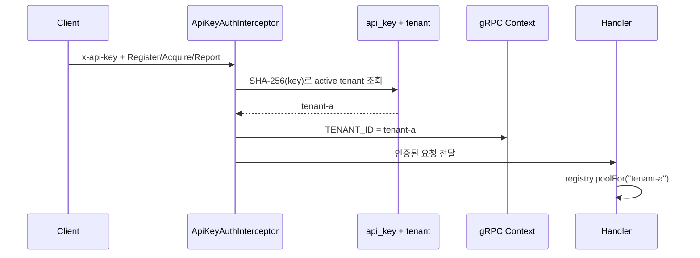

## Table of contents

> **TL;DR**
>
> `reputation-pool-cloud`를 여러 고객이 함께 사용하는 SaaS로 바꾸면서 처음 해결한 문제는 데이터 격리였습니다. API key를 tenant로 해석하고, 요청을 tenant별 `ResourcePool`로 라우팅하고, PostgreSQL의 모든 상태를 `pool_id`로 나눴습니다. tenant A가 등록한 프록시, lease와 감사 이벤트를 tenant B가 읽거나 변경할 수 없게 됐습니다.
>
> 하지만 **데이터가 섞이지 않는 것과 장애가 전파되지 않는 것은 다른 문제**였습니다.
>
> 모든 pool은 한 JVM의 heap, CPU와 gRPC 처리량을 공유했습니다. A가 수십만 개의 리소스와 평판 셀을 만들면 B의 데이터에는 접근하지 않아도 전체 프로세스를 OOM으로 죽일 수 있었습니다. A가 초당 수천 번 요청하면 B의 요청도 같은 스레드와 CPU를 두고 경쟁했습니다. 이것이 이 시스템에서 만난 noisy neighbor 문제였습니다.
>
> 대응도 자원 축별로 나눴습니다.
>
> 1. **상태 격리** — tenant별 pool, 저장 row, 이벤트와 감사 기록을 분리했습니다.
> 2. **메모리 보호** — JVM 전체의 리소스·셀 개수를 증분 counter로 제한했습니다.
> 3. **처리량 보호** — tenant별 token bucket으로 요청율과 순간 burst를 제한했습니다.
> 4. **lifecycle 회계** — 재시작 시 복원된 상태를 예산에 더하고, tenant 삭제 시 점유량을 반환했습니다.
>
> 이 설계가 완전한 tenant별 성능 보장을 제공하는 것은 아닙니다. 전역 메모리 예산은 먼저 사용한 tenant가 전부 소진할 수 있고, 현재 counter와 token bucket은 한 JVM 안에서만 정확합니다. 여러 인스턴스로 수평 확장하면 실효 한도가 인스턴스 수만큼 늘어나고 인메모리 pool 자체도 split-brain이 됩니다.
>
> 이번 설계의 결과는 “멀티테넌시를 완성했다”가 아닙니다. **무엇이 tenant별 상태이고 무엇이 공유 자원인지 목록으로 만들고, 각 공유 자원에 별도의 격리 계약을 붙였다**는 것입니다.

### Evidence card

| 항목               | 검증 근거                                                                                     |
| ------------------ | --------------------------------------------------------------------------------------------- |
| 검증 대상          | tenant routing, pool·DB·event 격리, JVM memory budget, tenant별 request rate limit            |
| 주요 변경          | cloud PR #27, #75, #92, #94, #95, #150, #151                                                  |
| 상태 격리 검증     | 2-tenant in-process gRPC + Testcontainers PostgreSQL                                          |
| 메모리 예산 검증   | CAS 단위 테스트, 200-thread 경쟁, gRPC `RESOURCE_EXHAUSTED` slice test                        |
| 요청율 검증        | token bucket 18 tests + tenant 격리·부분 잔량·200-thread mutation 확인                        |
| lifecycle 검증     | restore 점유 반영, delete 후 예산 반환, 상태 전이 CAS와 tenant별 checkpoint 실패 격리         |
| 현재 배포 전제     | 단일 application instance, 하나의 JVM                                                         |
| 확인하지 않은 범위 | cross-instance budget·rate limit, 분산 lease, tenant별 보장 처리량, 완전한 control-plane RBAC |

---

## 0. 시작 — 서로의 데이터는 볼 수 없지만 서로를 죽일 수 있었다

먼저 이 글에서 말하는 tenant가 무엇인지부터 설명해야 합니다.

`reputation-pool-cloud`는 프록시, 계정과 세션처럼 성공률이 변하는 리소스를 평가하고 빌려주는 SaaS입니다. 이 서비스를 회사 A와 회사 B가 함께 사용한다고 가정해보겠습니다. 두 회사는 같은 서버 프로그램을 사용하지만, 각 회사가 등록한 프록시와 성공·실패 기록은 서로 달라야 합니다.

이때 회사 A, 회사 B처럼 **하나의 SaaS를 함께 사용하면서도 자기 데이터와 권한의 경계를 가져야 하는 고객 단위**를 tenant라고 부릅니다. 여러 tenant를 하나의 서비스가 함께 처리하는 구조가 멀티테넌시입니다.

초기 cloud에는 tenant를 구분하는 API key가 있었지만, 실제 판단 엔진은 하나의 `ResourcePool`만 사용했습니다.

```text
tenant A ─┐
          ├─ 하나의 ResourcePool
tenant B ─┘
```

이 상태에서는 tenant를 인증해도 의미가 부족합니다. A가 등록한 프록시를 B의 `acquire`가 선택할 수 있고, B가 A의 lease token을 알게 되면 갱신을 시도할 수도 있습니다. 문 앞에서 신분증은 확인하지만 안에 들어온 뒤에는 모두가 같은 사물함을 쓰는 것과 같습니다.

그래서 tenant마다 pool과 저장 공간을 나눴습니다.

```text
tenant A ── ResourcePool A ── PostgreSQL rows(pool_id = A)
tenant B ── ResourcePool B ── PostgreSQL rows(pool_id = B)
```

이제 A의 요청은 A의 pool만 호출하고, checkpoint도 A의 row만 저장합니다. 이 단계까지 구현했을 때는 격리 문제의 큰 부분을 해결했다고 생각했습니다.

하지만 두 pool은 여전히 같은 JVM 프로세스 안에 있었습니다.

```text
하나의 JVM
├─ ResourcePool A ── 리소스 400,000개
├─ ResourcePool B ── 리소스 1,000개
└─ 공유 heap · CPU · gRPC thread · DB connection
```

A의 데이터가 B의 pool로 섞이지 않더라도 A가 heap을 전부 차지하면 JVM은 `OutOfMemoryError`로 종료될 수 있습니다. A가 요청을 너무 많이 보내면 B도 같은 CPU와 실행 자원을 기다립니다. B는 아무 잘못이 없지만 A의 사용 패턴 때문에 느려지거나 실패합니다.

이것이 **noisy neighbor**입니다. 같은 건물의 이웃이 내 방에 들어오지는 않지만, 전기와 수도를 과도하게 사용해 건물 전체에 영향을 주는 상황과 비슷합니다.

이 경험으로 격리를 두 질문으로 나눴습니다.

> tenant A가 tenant B의 상태를 읽거나 변경할 수 없는가?

> tenant A의 사용량이 tenant B의 가용성을 무너뜨릴 수 없는가?

첫 번째는 보안과 데이터 격리 문제입니다. 두 번째는 용량과 성능 격리 문제입니다. 둘 중 하나만 해결해서는 멀티테넌트 SaaS의 경계가 완성되지 않습니다.

<details>
<summary><b>멀티테넌시와 noisy neighbor는 어떤 관계인가</b> (펼치기)</summary>

멀티테넌트 시스템은 여러 고객이 애플리케이션, 데이터베이스, CPU나 메모리 같은 자원을 공유해 비용과 운영 복잡성을 줄입니다. 모든 고객에게 서버와 DB를 하나씩 제공하는 방식보다 자원 활용률이 높고 배포할 대상도 적습니다.

대신 공유하는 모든 자원에는 두 종류의 위험이 생깁니다.

1. **교차 tenant 접근** — 한 tenant가 다른 tenant의 데이터나 기능에 접근합니다.
2. **자원 경합** — 한 tenant의 높은 사용량이 다른 tenant의 성능과 가용성에 영향을 줍니다.

AWS의 SaaS tenant isolation 문서도 보안 경계와 noisy neighbor 대응을 모두 isolation의 문제로 설명합니다. Microsoft의 multitenant guidance 역시 공유 자원에서는 한 tenant의 활동이 다른 tenant의 성능을 떨어뜨릴 수 있다고 설명합니다.

물리 서버를 tenant마다 완전히 분리하면 두 위험을 크게 줄일 수 있지만 비용과 운영 대상이 늘어납니다. 반대로 모든 것을 공유하면 효율은 높지만 애플리케이션이 더 많은 격리 책임을 집니다.

`reputation-pool-cloud`는 현재 하나의 애플리케이션과 PostgreSQL을 여러 tenant가 공유하는 pooled model을 선택했습니다. 따라서 tenant ID를 모든 상태 접근의 축으로 사용하고, 공유 heap과 처리량에는 별도의 제한을 두어야 했습니다.

</details>

---

## 1. API key가 tenant가 되는 과정

클라이언트는 gRPC 요청의 metadata에 `x-api-key`를 보냅니다. metadata는 HTTP header처럼 요청 본문과 별도로 전달되는 부가 정보입니다.

서버의 `ApiKeyAuthInterceptor`는 실제 RPC handler가 실행되기 전에 이 key를 검사합니다.



원문 API key를 DB에 그대로 저장하거나 로그로 남기지 않습니다. key의 SHA-256 digest로 활성 tenant를 찾고, 성공하면 `TenantContext.TENANT_ID`에 tenant ID를 넣습니다.

여기서 gRPC `Context`는 여러 tenant가 공유하는 전역 변수와 다릅니다. 현재 요청의 실행 흐름에만 값을 전달하는 공간입니다. handler는 클라이언트가 요청 본문에 적어 보낸 tenant ID를 믿지 않고, 인증 과정에서 서버가 결정한 tenant를 읽습니다.

key가 없거나 틀리거나 폐기됐다면 모두 같은 `UNAUTHENTICATED`로 거부합니다. key가 실제로 존재하는지, 어느 tenant의 것인지 응답 차이로 추측하지 못하게 합니다. DB 장애로 key를 확인할 수 없을 때는 잘못된 key로 위장하지 않고 `UNAVAILABLE`을 반환해 운영 장애와 인증 실패를 구분합니다.

이 흐름의 핵심은 다음 한 줄입니다.

> tenant는 사용자가 선택하는 요청 parameter가 아니라, 서버가 인증 결과에서 결정하는 실행 context다.

<details>
<summary><b>interceptor와 gRPC Context는 무엇인가</b> (펼치기)</summary>

Interceptor는 실제 비즈니스 기능 앞이나 뒤에서 공통 처리를 수행하는 구성 요소입니다. Spring MVC의 filter나 middleware와 비슷합니다.

예를 들어 `Acquire` handler마다 다음 코드를 반복할 수도 있습니다.

```java
String key = headers.get(API_KEY);
String tenantId = tenantResolver.resolve(key);
ResourcePool pool = registry.poolFor(tenantId);
```

하지만 RPC가 늘어날수록 인증 누락 가능성이 커집니다. interceptor에서 모든 요청을 먼저 검사하면 인증되지 않은 요청은 handler에 도착하지 못합니다.

gRPC `Context`는 interceptor가 확인한 tenant를 이후 handler까지 전달합니다.

```java
Context context = Context.current()
    .withValue(TenantContext.TENANT_ID, tenantId);

return Contexts.interceptCall(context, call, headers, next);
```

handler는 `TenantContext.TENANT_ID.get()`으로 현재 호출의 tenant를 읽습니다. 별도의 static 전역 변수에 tenant를 넣으면 여러 요청이 동시에 실행될 때 값이 섞일 수 있지만, gRPC Context는 호출 실행 흐름에 묶여 전달됩니다.

</details>

---

## 2. pool을 나누는 것만으로는 네 가지 경계가 남는다

`PerTenantPoolRegistry`는 tenant ID마다 하나의 `ResourcePool`을 만들고 `ConcurrentHashMap`에 보관합니다.

```java
private final ConcurrentHashMap<String, ManagedPool> pools =
    new ConcurrentHashMap<>();

public ResourcePool poolFor(String tenantId) {
    return pools.computeIfAbsent(tenantId, this::build).pool();
}
```

`computeIfAbsent`를 사용하므로 같은 tenant의 첫 요청이 동시에 들어와도 하나의 `ManagedPool`만 cache됩니다. `ManagedPool`은 tenant ID, 인메모리 pool과 그 tenant 전용 store를 함께 가집니다.

하지만 “pool 하나를 tenant마다 만들었다”는 문장만으로 격리가 증명되지는 않습니다. 실제 요청과 상태가 이동하는 네 경로를 각각 확인해야 했습니다.

| 경계             | tenant별로 분리한 것                                  | 공유하는 것                      |
| ---------------- | ----------------------------------------------------- | -------------------------------- |
| 인메모리 상태    | `ResourcePool`, resource, cell, blocklist, lease      | JVM heap                         |
| 영속 상태        | `pool_id = tenantId`인 PostgreSQL row                 | DataSource, DB instance          |
| 실시간 이벤트    | `broadcaster.forPool(tenantId)` 구독                  | broadcaster 프로세스             |
| 감사·운영 데이터 | `auditTrail.forPool(tenantId)`, tenant-bound metering | alert와 저카디널리티 집계 metric |

### 2.1 인메모리 상태

gRPC service의 `pool()`은 인증된 tenant의 pool을 반환합니다.

```java
@Override
protected ResourcePool pool() {
    String tenantId = TenantContext.TENANT_ID.get();
    if (tenantId == null || tenantId.isBlank()) {
        throw new IllegalStateException(
            "no authenticated tenant on the gRPC context"
        );
    }
    return registry.poolFor(tenantId);
}
```

tenant가 없다면 `default` pool로 조용히 보내지 않습니다. 인증 배선이 깨진 오류이므로 요청을 실패시킵니다. 잘못된 fallback은 인증 누락을 정상 요청처럼 처리해 모든 tenant를 다시 하나의 pool로 모을 수 있기 때문입니다.

### 2.2 PostgreSQL 상태

각 tenant의 store는 `PostgresResourceStore(dataSource, clock, tenantId)`로 생성됩니다. 같은 DB와 같은 table을 사용하지만 모든 조회·저장의 `pool_id`가 tenant ID로 고정됩니다.

checkpoint는 tenant A의 snapshot을 저장할 때 A의 row만 교체해야 합니다. A의 저장 과정이 table 전체를 지우면 메모리 격리는 유지돼도 B의 durable state가 사라집니다. 그래서 실제 PostgreSQL을 사용하는 통합 테스트에서 A와 B를 차례로 checkpoint한 뒤 두 tenant의 row가 모두 남는지 확인했습니다.

### 2.3 event stream과 audit

초기 per-tenant pool 구현 뒤에도 이벤트 broadcaster와 audit trail은 전역이었습니다. 상태는 분리됐지만 A가 발생시킨 차단 이벤트가 B의 `SubscribeEvents` stream으로 흘러갈 수 있었습니다.

이를 다음처럼 emit과 subscribe 양쪽에서 같은 tenant ID로 묶었습니다.

```java
EventSink tenantSink = new CompositeEventSink(List.of(
    broadcaster.forPool(tenantId),
    auditTrail.forPool(tenantId),
    sharedSink,
    new TenantMeteringSink(tenantId, meterRecorder)
));
```

- emit할 때 A의 이벤트를 A namespace로 보냅니다.
- subscribe할 때 인증된 A를 `subscriptionPoolId()`로 선택합니다.
- audit 조회에는 `WHERE pool_id = ?`를 적용합니다.

한쪽만 적용하면 부족합니다. emit만 분리하고 subscribe가 전역이면 다른 stream을 구독할 수 있고, stream만 분리하고 audit query가 전역이면 과거 이벤트가 노출됩니다.

---

## 3. 존재 여부도 tenant 정보다

격리는 응답 body에서 다른 tenant의 데이터를 제거하는 것으로 끝나지 않습니다. 상태 code 차이도 정보가 될 수 있습니다.

예를 들어 tenant A의 관리 token으로 다음 두 주소를 호출한다고 가정하겠습니다.

```text
GET /api/tenants/real-tenant
GET /api/tenants/nonexistent-tenant
```

권한 검사를 DB 조회 뒤에 수행하면 실제 tenant에는 `403`, 없는 tenant에는 `404`를 반환할 수 있습니다. 공격자는 응답 차이만으로 어떤 tenant ID가 존재하는지 탐색할 수 있습니다.

그래서 tenant-scoped 경로는 존재를 조회하기 전에 token scope를 검사합니다.

```java
AdminTenant.requireScope(jwt, id);

return tenants.findById(id)
    .orElseThrow(() -> new ResponseStatusException(
        HttpStatus.NOT_FOUND,
        "tenant not found"
    ));
```

token 밖의 tenant를 요청하면 실제 존재 여부와 관계없이 먼저 `403`이 됩니다. 자기 scope 안에서 조회할 때만 `404`를 구분할 수 있습니다.

이 규칙은 단건 tenant 조회와 API key 발급·목록·폐기에 적용했습니다. 다만 현재 v1의 tenant 생성·전체 목록·suspend·reactivate·delete는 명시적으로 **운영자 전역 작업**입니다. 완전한 tenant별 관리자와 역할 체계는 아직 열린 issue #31의 범위입니다.

이 한계를 숨기지 않는 이유가 있습니다. “control plane도 tenant 격리가 끝났다”고 쓰면 현재 코드보다 강한 보안 계약을 공개하게 됩니다. 지금 정확한 계약은 다음과 같습니다.

- gRPC data plane과 tenant별 조회·API key 경로는 tenant scope를 강제합니다.
- tenant 생성·전체 목록·lifecycle은 단일 운영자 권한을 전제로 합니다.
- 여러 tenant 관리자가 직접 사용하는 SaaS로 열기 전에는 RBAC가 추가로 필요합니다.

<details>
<summary><b>data plane과 control plane은 무엇이 다른가</b> (펼치기)</summary>

Data plane은 고객의 실제 작업을 처리하는 경로입니다. 이 시스템에서는 프록시를 등록하고, 빌리고, 결과를 보고하고, 이벤트를 구독하는 gRPC API가 해당합니다.

Control plane은 서비스를 관리하는 경로입니다. tenant 생성, API key 발급, tenant suspend·delete와 대시보드 설정 같은 REST API가 해당합니다.

두 경로는 인증과 권한 요구가 다를 수 있습니다.

- data plane key는 특정 tenant의 실제 처리 요청만 수행합니다.
- 운영자 token은 tenant lifecycle 같은 관리 작업을 수행합니다.

“gRPC API가 tenant-safe하다”는 사실이 REST 관리 API도 tenant-safe하다는 뜻은 아닙니다. 공격 표면과 권한 모델이 다르기 때문에 각각의 endpoint를 따로 검사해야 합니다.

</details>

---

## 4. 데이터 격리가 OOM을 막아주지는 않는다

tenant별 pool을 만들면 A와 B의 Java 객체는 분리됩니다. 하지만 그 객체들이 올라가는 heap은 하나입니다.

`ResourcePool`에서 메모리를 계속 늘릴 수 있는 주요 상태는 두 가지였습니다.

1. 등록된 resource 집합
2. `(resource, context)` 조합마다 생성되는 reputation cell

context는 “이 리소스를 어떤 작업에서 사용했는가”를 나타냅니다. 같은 프록시라도 상품 조회와 주문 요청에서는 성공률이 다를 수 있으므로 별도의 cell을 가집니다.

```text
resource p1
├─ context: product-list  → cell 1
├─ context: order         → cell 2
└─ context: review        → cell 3
```

resource가 10만 개이고 context가 5개라면 최대 50만 개의 cell 조합이 생길 수 있습니다. tenant별 데이터가 완벽히 분리돼도 이 객체들이 같은 JVM에 쌓이면 전체 서비스가 함께 종료됩니다.

처음 issue의 이름은 “per-tenant 리소스 상한”이었습니다. 하지만 실제 요구사항에는 충돌이 있었습니다.

- tenant가 하나일 때는 JVM 용량을 최대한 사용할 수 있어야 합니다.
- tenant가 여러 개일 때는 전체 heap의 안전 한도를 넘어서는 안 됩니다.

tenant마다 10만 개로 고정하면 tenant가 하나뿐이어도 전체 용량을 활용하지 못합니다. 반대로 tenant별 상한을 너무 크게 잡으면 tenant 수가 늘어날 때 합계가 heap 한도를 넘습니다.

그래서 최종 구현은 tenant별 quota가 아니라 **JVM 전역 공유 예산**을 선택했습니다.

```text
maxResources = 100,000

tenant A: 70,000
tenant B: 20,000
tenant C: 10,000
--------------------
global:  100,000  → 다음 신규 등록 거부
```

tenant가 하나면 100,000개를 모두 사용할 수 있습니다. 여러 tenant가 있으면 먼저 사용한 만큼 전체의 남은 공간이 줄어듭니다. tenant 수가 바뀔 때 몫을 다시 계산할 필요가 없습니다.

여기서 중요한 한계가 있습니다.

> 전역 공유 예산은 JVM 전체의 OOM을 막지만 tenant별 공정한 몫을 보장하지 않는다.

A가 먼저 100,000개를 사용하면 B의 첫 신규 resource는 거부됩니다. 프로세스는 살아 있으므로 전체 장애는 피하지만, B의 가용성까지 보호한 것은 아닙니다. 진짜 tenant별 보장 용량이 필요하다면 “전역 상한 + tenant별 ceiling 또는 예약 용량”을 함께 설계해야 합니다.

이 글에서는 현재 구현을 noisy neighbor의 완전한 해결책이라고 부르지 않습니다. **메모리 축에서 blast radius를 OOM 전체 장애에서 신규 상태 생성 거부로 줄인 첫 방벽**이라고 부르겠습니다.

<details>
<summary><b>quota, ceiling과 global budget은 어떻게 다른가</b> (펼치기)</summary>

세 용어는 비슷하지만 보장하는 것이 다릅니다.

| 방식                | 예시                   | 보장하는 것                           | 포기하는 것                           |
| ------------------- | ---------------------- | ------------------------------------- | ------------------------------------- |
| tenant별 고정 quota | A 20개, B 20개         | 각 tenant의 최대 사용량이 명확함      | 유휴 tenant의 남는 용량을 쓰기 어려움 |
| tenant별 ceiling    | A는 최대 30개          | 특정 tenant의 독점을 제한             | 전체 합계 제한은 별도로 필요          |
| global budget       | 모든 tenant 합계 100개 | 프로세스 전체 점유가 상한을 넘지 않음 | tenant별 최소·최대 몫을 보장하지 않음 |

현재 `GlobalResourceBudget`은 세 번째 방식입니다. 한 tenant가 혼자일 때 100%를 사용할 수 있다는 요구를 우선했습니다.

향후 요금제별 보장 용량이 필요하다면 global budget만으로는 부족합니다. 예를 들어 전체 100개 안에서 A에 최소 20개를 예약하거나, free plan tenant는 최대 10개까지만 쓰게 하는 정책이 추가로 필요합니다.

</details>

---

## 5. hot path에서 전체 상태를 매번 세지 않았다

예산을 검사하는 가장 단순한 방법은 요청이 올 때마다 모든 tenant의 snapshot을 읽고 resource와 cell 개수를 합산하는 것입니다.

```text
요청 1건
→ tenant A snapshot 복사
→ tenant B snapshot 복사
→ tenant C snapshot 복사
→ 전체 개수 합산
→ 상한 비교
```

이 방식은 정확해 보이지만 매 `register`와 `report`의 비용이 전체 tenant와 상태 크기에 따라 늘어납니다. 더구나 core 0.5.0의 `ResourcePool.snapshot()`은 cell map과 registered set을 방어적으로 복사합니다. 단순 membership 확인을 위해 snapshot을 호출해도 상태 크기만큼 할당이 발생할 수 있습니다.

그래서 전체 합계를 매번 계산하지 않고 `AtomicLong` counter 두 개를 유지했습니다.

```java
private final AtomicLong resourceCount = new AtomicLong();
private final AtomicLong cellCount = new AtomicLong();
```

새 resource나 cell이 생길 때만 counter를 1 증가시킵니다. 상한의 마지막 한 자리를 여러 thread가 동시에 요청할 수 있으므로 “현재 값 확인”과 “1 증가”를 CAS loop 하나로 묶었습니다.

```java
private static boolean tryReserve(
    AtomicLong counter,
    long max
) {
    long current;
    do {
        current = counter.get();
        if (current >= max) {
            return false;
        }
    } while (!counter.compareAndSet(current, current + 1));
    return true;
}
```

두 thread가 `99 < 100`을 동시에 읽더라도 둘 다 100으로 바꾸지는 못합니다. 한쪽의 CAS만 성공하고, 다른 쪽은 갱신된 값을 다시 읽어 거부됩니다.

### 5.1 어느 RPC가 실제 상태를 늘리는지 다시 확인했다

처음에는 `acquire`도 새 cell을 만든다고 예상했습니다. 하지만 core 소스를 따라가 보니 `acquire`는 없는 cell을 scoring용 지역 객체로만 만들고 map에는 저장하지 않았습니다. 실제로 `cells.compute`를 통해 영속 상태를 늘리는 것은 `report`였습니다.

그래서 budget gate를 다음 두 곳에만 적용했습니다.

- `register` — 새로운 resource를 등록할 수 있습니다.
- `report` — 새로운 `(resource, context)` cell을 만들 수 있습니다.

`acquire`에 의미 없는 gate를 넣지 않았습니다. 설계 문서의 가정보다 실제 쓰기 지점을 기준으로 제한 위치를 정했습니다.

### 5.2 기존 상태의 재사용은 막지 않는다

예산이 가득 찼더라도 이미 등록된 resource의 재등록이나 기존 cell에 대한 report는 새로운 메모리를 만들지 않습니다. 이런 요청까지 거부하면 상한에 도달한 순간 기존 pool의 정상 운영도 중단됩니다.

따라서 요청 대상이 새 상태인지 먼저 확인합니다.

```text
이미 존재함
→ counter 변경 없음
→ core 호출

새 상태임
→ budget 예약 성공
   → core 호출
→ budget 예약 실패
   → RESOURCE_EXHAUSTED
   → core는 호출하지 않음
```

현재 구현은 이 membership 확인에 tenant pool의 snapshot을 사용합니다. 전체 tenant를 합산하지는 않지만, 한 tenant의 snapshot 복사 비용은 여전히 hot path에 남습니다. core에 allocation 없는 `containsResource`·`containsCell` 같은 presence API를 공개하거나 admission hook을 개선하는 것이 다음 경계 후보입니다.

---

## 6. counter는 생성만 세면 반드시 틀어진다

증분 counter는 빠른 대신 실제 상태가 바뀌는 모든 lifecycle을 정확히 따라가야 합니다. 이 설계에서 가장 위험했던 부분은 정상 요청이 아니라 **재시작과 삭제**였습니다.

### 6.1 재시작 — 상태는 복원됐는데 counter는 0

JVM이 재시작하면 `AtomicLong`은 0에서 시작합니다. 반면 PostgreSQL에 저장된 pool snapshot은 다시 heap으로 복원됩니다.

```text
재시작 직후

실제 heap: resource 80,000개
counter:   resource 0개
limit:     resource 100,000개
```

이 상태에서 counter만 믿으면 신규 resource 100,000개를 더 허용해 실제 점유는 180,000개가 됩니다. OOM 방벽이 재시작할 때마다 초기화되는 셈입니다.

그래서 `PoolLifecycle.start()`가 각 tenant의 snapshot을 복원하면서 resource와 cell 개수를 함께 합산하고, 트래픽을 받기 전에 budget에 반영합니다.

```java
long restoredResources = 0;
long restoredCells = 0;

for (String tenantId : registry.knownTenantIds()) {
    Optional<PoolSnapshot> loaded = store.load();
    if (loaded.isPresent()) {
        PoolSnapshot snapshot = loaded.get();
        pool.restore(snapshot);
        restoredResources += snapshot.registered().size();
        restoredCells += snapshot.cells().size();
    }
}

budget.accountForExisting(
    restoredResources,
    restoredCells
);
```

복원된 상태가 이미 상한보다 많아도 버리지 않습니다. 이미 heap에 올라온 실제 점유이므로 counter에 정직하게 기록하고, 이후 신규 생성만 거부합니다.

### 6.2 삭제 — heap에서 사라졌는데 counter는 그대로

tenant를 삭제하면 pool을 registry에서 제거하고 DB row도 지웁니다. 이때 counter를 줄이지 않으면 사라진 상태가 영원히 예산을 차지합니다.

```text
A 삭제 전: counter 100, 실제 100
A 삭제 후: counter 100, 실제 20
```

다른 tenant는 heap에 80만큼 여유가 있어도 `RESOURCE_EXHAUSTED`를 받습니다. tenant 생성과 삭제를 반복하면 결국 아무 상태가 없어도 예산이 가득 찬 것처럼 보입니다.

삭제는 다음 순서로 처리합니다.

1. 삭제 직전 A의 snapshot에서 resource·cell 개수를 기록합니다.
2. A의 인메모리 pool을 먼저 evict해 신규 트래픽을 끊습니다.
3. PostgreSQL의 tenant-scoped row를 한 transaction에서 삭제하고 tenant를 `DELETED` tombstone으로 남깁니다.
4. DB 삭제가 실제로 성공한 뒤에만 budget을 반환합니다.

DB transaction보다 먼저 counter를 줄이면 삭제가 실패했는데도 가짜 여유 공간이 생깁니다. 반대로 삭제가 commit된 뒤 반환하면 실패 중에는 보수적으로 덜 허용할 뿐, 실제보다 더 많이 허용하지 않습니다.

<details>
<summary><b>tombstone과 compare-and-set 상태 전이는 왜 필요한가</b> (펼치기)</summary>

Tombstone은 tenant row를 완전히 지우지 않고 `DELETED` 상태로 남기는 방식입니다. 이미 삭제된 tenant ID였다는 사실과 terminal 상태를 보존할 수 있습니다.

tenant lifecycle은 다음 전이만 허용합니다.

```text
ACTIVE ──→ SUSPENDED
   │           │
   └──────┬────┘
          ↓
       DELETED
```

동시에 `reactivate`와 `delete`가 실행되면 둘 다 이전 상태를 읽고 서로의 변경을 덮어쓸 수 있습니다. 특히 delete가 만든 terminal 상태를 늦게 도착한 reactivate가 `ACTIVE`로 되돌리면 삭제된 데이터가 다시 서비스되는 모순이 생깁니다.

그래서 DB update에 예상한 이전 상태를 조건으로 포함합니다.

```sql
UPDATE tenant
SET status = 'deleted'
WHERE id = ?
  AND status = 'active';
```

영향받은 row가 0이면 다른 요청이 먼저 상태를 바꾼 것입니다. 실제 상태를 다시 읽어 같은 목표 상태면 멱등 성공으로 처리하고, 다른 상태면 `409 Conflict`로 재시도를 요구합니다. 이것이 tenant lifecycle에서 사용한 compare-and-set입니다.

</details>

---

## 7. 메모리 개수를 막아도 요청 폭주는 남는다

resource와 cell 상한은 heap의 무한 성장을 막습니다. 하지만 A가 이미 존재하는 resource에 `acquire`를 초당 수천 번 호출하면 새로운 메모리를 거의 만들지 않고도 CPU, gRPC 처리량과 DB connection에 부하를 줄 수 있습니다.

```text
memory budget
└─ 새 resource/cell 생성량을 제한

request rate limit
└─ 단위 시간당 처리 요청 수를 제한
```

두 제한은 서로 대체할 수 없습니다.

외부 data plane을 열기 전, tenant별 token bucket rate limiter를 추가했습니다. 기본 가설값은 초당 10개, 순간 burst 50개였습니다. 이 값은 운영 측정에서 나온 최적값이 아니므로 문서에도 튜닝 대상이라고 명시했습니다.

### 7.1 왜 token bucket인가

스크래퍼의 요청은 항상 일정한 간격으로 오지 않습니다. 작업이 시작될 때 결과가 몰려 짧은 burst가 생길 수 있습니다. 평균 요청율은 제한하되 순간적인 정상 burst까지 모두 거부하고 싶지는 않았습니다.

Token bucket은 tenant마다 token이 담긴 통을 하나 둡니다.

```text
bucket capacity = 50
refill rate     = 10 tokens / second
request cost    = 1 token
```

- token이 있으면 하나를 소비하고 요청을 허용합니다.
- 시간이 지나면 정해진 속도로 token이 보충됩니다.
- bucket 용량을 넘겨 쌓이지 않으므로 무제한 burst는 불가능합니다.
- tenant마다 bucket이 다르므로 A의 소진이 B의 token을 줄이지 않습니다.

슬라이딩 윈도우처럼 요청마다 timestamp를 저장하지 않아 tenant당 상태가 상수 크기라는 장점도 있었습니다.

### 7.2 인증보다 rate limit가 먼저 실행되면 안 된다

Rate limiter는 현재 tenant ID를 알아야 올바른 bucket을 선택할 수 있습니다. 따라서 interceptor 순서가 정확성 요구사항입니다.

```text
1. ApiKeyAuthInterceptor
   API key → TenantContext

2. RateLimitInterceptor
   TenantContext → tenant별 bucket

3. ReputationAdvisorService
   tenant별 pool 호출
```

순서가 뒤집히면 rate limiter가 tenant를 찾지 못합니다. 이 구현은 tenant context가 없을 때 정상 인증 오류 처리를 방해하지 않도록 통과시키므로, 잘못된 순서는 예외를 내는 대신 **조용히 제한을 꺼버릴 수 있습니다**. 그래서 두 interceptor에 명시적인 order를 부여했습니다.

### 7.3 제한기 오류는 fail-open하되 조용히 숨기지 않는다

인증과 tenant 권한은 실패 시 요청을 닫는 fail-closed가 맞습니다. 하지만 rate limiter는 보안 경계가 아니라 용량 보호 장치입니다.

제한기 내부 오류 하나로 모든 정상 tenant 요청을 중단시키는 비용이 더 크다고 판단해 예외 시 요청을 통과시키는 fail-open을 선택했습니다. 대신 다음 신호를 남깁니다.

- 전용 error counter 증가
- ERROR log 기록
- 제한기 오류 alert

“거부가 0건”이라는 결과만 보면 모든 요청이 상한 이내인지, 제한기가 고장 나 아예 검사하지 않는지 구분할 수 없습니다. 그래서 정상 거부 metric과 limiter error metric을 분리했습니다.

<details>
<summary><b>token bucket과 Retry-After는 실제로 어떻게 계산되는가</b> (펼치기)</summary>

예를 들어 초당 0.1 token을 보충하는 bucket에 현재 0.5 token이 남았다고 가정하겠습니다. 요청 하나를 처리하려면 1 token이 필요하므로 0.5 token이 부족합니다.

```text
부족한 token = 1.0 - 0.5 = 0.5
보충 속도    = 0.1 token / second
대기 시간    = 0.5 / 0.1 = 5 seconds
```

서버는 거부 응답에 최소 1초 이상의 `retry-after`를 제공합니다. 0초를 반환하면 클라이언트가 즉시 재시도해 rate limiter가 오히려 tight loop의 방아쇠가 될 수 있습니다.

부분 잔량을 계산에 포함하는 것이 중요합니다. 기존 테스트가 token이 정확히 0인 경계만 검사했을 때 `retryAfter(tokens)`를 `retryAfter(0)`으로 잘못 바꿔도 통과했습니다. 잔량이 0.5인 중간값 테스트를 추가한 뒤에야 이 변이를 잡을 수 있었습니다.

</details>

---

## 8. 격리는 happy path가 아니라 교차 경로로 증명했다

“tenant A와 B의 pool 객체가 다르다”는 단정 하나로는 부족합니다. 실제로 침범할 수 있는 동작을 시도하고 실패하는지 확인해야 합니다.

### 8.1 상태 격리

2-tenant in-process gRPC 테스트에서 다음을 확인했습니다.

1. A가 resource `a1`을 등록합니다.
2. B가 `acquire`해도 `a1`을 받을 수 없습니다.
3. A가 얻은 lease를 B가 renew할 수 없습니다.
4. A subscriber는 A event만 받고 B event는 받지 않습니다.

실제 PostgreSQL 통합 테스트에서는 A와 B의 checkpoint를 모두 저장한 뒤 한 tenant의 저장이 다른 tenant row를 지우지 않는지 확인했습니다.

### 8.2 전역 budget의 동시성

상한 20개에 200 thread를 동시에 진입시켰습니다. 모든 thread가 준비된 뒤 같은 latch에서 출발하게 해 마지막 예산을 경쟁시켰고, 성공 수와 counter가 정확히 20인지 확인했습니다.

이 테스트가 검증하는 불변식은 처리 순서가 아닙니다.

> 동시 요청 수와 관계없이 성공한 신규 예약의 합은 global budget을 넘지 않는다.

gRPC slice test에서는 예산 초과 시 `RESOURCE_EXHAUSTED`가 반환되고 core의 `register`·`report`가 실제로 호출되지 않는지도 확인했습니다. 기존 resource와 cell의 재사용은 예산이 소진돼도 통과해야 합니다.

### 8.3 token bucket의 tenant 격리와 동시성

Rate limiter 테스트는 다음 변이를 일부러 심어 검출력을 확인했습니다.

| 의도적으로 심은 오류                        | 테스트 결과                                       |
| ------------------------------------------- | ------------------------------------------------- |
| 모든 tenant가 bucket 하나를 공유            | tenant 격리 테스트가 검출                         |
| 새 bucket을 burst가 아니라 1 token으로 시작 | fresh tenant burst 테스트가 검출                  |
| refill 시각을 bucket별이 아니라 전역 공유   | tenant별 refill 테스트가 검출                     |
| `retryAfter`를 잔량 0으로만 계산            | 기존 테스트는 놓침, 부분 잔량 테스트 추가 후 검출 |
| `synchronized` 제거                         | 기존 단일 thread 테스트는 놓침, 경쟁 테스트 추가  |

동시성 테스트는 처음에 burst 20, thread 200으로 만들었지만 lock 제거 변이를 세 번 중 한 번만 잡았습니다. 대부분의 thread가 이미 빈 bucket을 보고 쓰기 없는 거부 경로로 빠졌기 때문입니다.

burst를 150으로 높여 더 많은 thread가 `tokens -= 1`을 경쟁하게 하고 5회 반복했습니다.

| 실행 대상          | 결과                |
| ------------------ | ------------------- |
| 정상 코드 5회      | 5/5 통과, 오탐 0    |
| lock 제거 변이 5회 | 5/5 실패, 변이 검출 |

이 수치는 thread-safe를 수학적으로 증명하지 않습니다. 다만 “동시성 테스트가 있다”는 문장이 아니라, 어떤 고장에 민감한지 직접 확인한 근거입니다.

### 8.4 검증 시나리오별 baseline과 결과

이 글에서는 latency benchmark를 수행하지 않았습니다. 대신 변경 전 구조에서 허용되던 교차 tenant 동작과 제한이 없던 상태를 baseline으로 두고, 변경 후 계약을 실제 테스트에서 관찰했습니다.

| 시나리오                          | 변경 전 baseline                                  | 변경 후 관찰한 결과                                        |
| --------------------------------- | ------------------------------------------------- | ---------------------------------------------------------- |
| A 등록 resource를 B가 acquire     | 하나의 pool을 공유하므로 선택 가능                | B pool에는 A resource가 없어 grant되지 않음                |
| A lease를 B가 renew               | 하나의 lease registry를 공유하므로 접근 가능      | B의 독립 pool에서는 해당 lease를 찾지 못함                 |
| A event를 구독 중인 B가 수신      | 전역 broadcaster라 교차 수신 가능                 | emit·subscribe가 같은 tenant namespace로 묶여 B는 미수신   |
| A checkpoint 뒤 B checkpoint      | tenant 조건이 없으면 서로의 row를 교체할 수 있음  | 실제 PostgreSQL에서 A·B의 `pool_id` row가 각각 유지됨      |
| resource 상한 20, 동시 요청 200개 | process-wide 생성 제한 없음                       | 성공 20개, counter 20에서 멈춤                             |
| A가 global resource budget 소진   | JVM이 허용하는 데까지 계속 증가                   | B의 신규 등록은 `RESOURCE_EXHAUSTED`, core는 호출되지 않음 |
| A가 token을 모두 소비             | tenant별 요청 제한이 없어 공유 처리량을 계속 사용 | B는 독립 bucket의 full burst를 그대로 사용                 |
| rate limiter lock 제거 변이       | 기존 단일 thread 테스트는 모두 통과               | 경쟁 강도를 조정한 뒤 변이 5/5 검출, 정상 코드 오탐 0/5    |

이 표의 결과는 격리 계약과 counter 불변식에 대한 관찰입니다. 실제 운영 traffic에서 P99 latency나 tenant별 CPU 점유가 얼마나 개선됐다는 뜻은 아닙니다.

---

## 9. 실패를 tenant별로 격리하는 lifecycle

Noisy neighbor는 트래픽이 많을 때만 발생하지 않습니다. 한 tenant의 DB row가 손상되거나 checkpoint가 실패할 때 전체 tenant 반복문을 중단시키는 것도 장애 전파입니다.

`PoolLifecycle`은 restore와 checkpoint를 tenant별로 순회하되 예외를 각 tenant 경계에서 잡습니다.

```text
restore A → 성공
restore B → DB 오류, 기록하고 건너뜀
restore C → 계속 실행
```

B의 실패 때문에 C의 pool까지 복원되지 않는 일을 막습니다. checkpoint도 같은 방식으로 한 tenant의 저장 실패가 다른 tenant의 durable state 갱신을 막지 않게 합니다.

하지만 예외를 삼키는 것만으로는 운영 가능한 격리가 아닙니다. 로그를 놓치면 B의 checkpoint가 계속 실패해도 메모리에서는 정상 서비스되다가 재시작 후 오래된 상태로 돌아갈 수 있습니다.

그래서 다음을 별도 신호로 기록합니다.

- tenant restore failure counter
- 모든 tenant가 성공한 마지막 checkpoint round의 시각
- 마지막 완전 성공 이후 경과 시간

“다른 tenant는 계속 서비스된다”와 “실패한 tenant의 내구성이 나빠졌다”를 동시에 관찰해야 합니다. 장애 전파를 막는다는 이유로 원래 장애를 숨기면 안 됩니다.

---

## 10. 현재 보장하는 것과 아직 보장하지 않는 것

이 글에서 가장 중요한 표입니다.

| 항목            | 현재 보장                                 | 남은 한계                                           |
| --------------- | ----------------------------------------- | --------------------------------------------------- |
| gRPC pool 상태  | 인증된 tenant별 `ResourcePool`            | 한 JVM heap은 공유                                  |
| PostgreSQL 상태 | `pool_id = tenantId` row 격리             | DB instance·connection pool은 공유                  |
| event·audit     | emit, subscribe, query를 tenant별 scope   | global alert·집계 metric은 의도적으로 공유          |
| API key 경로    | 다른 tenant 접근 403, 존재 여부 비노출    | tenant 생성·목록·lifecycle은 v1 운영자 전역 작업    |
| memory          | JVM 전체 resource·cell 상한               | tenant별 최소 몫·공정성 없음                        |
| request rate    | tenant별 token bucket                     | 장시간 stream은 unary 요청 수와 다른 자원 축        |
| restart·delete  | 복원 점유 반영, 삭제 후 budget 반환       | 비정상 종료 중 lifecycle 중간 상태의 운영 복구 필요 |
| scale-out       | 단일 process 안의 atomic counter와 bucket | 여러 instance에서는 상한이 instance 수만큼 늘어남   |

### 10.1 “global”은 배포 전체가 아니라 현재 JVM이다

`GlobalResourceBudget`의 global은 모든 tenant를 합친다는 뜻이지 모든 서버 instance를 합친다는 뜻이 아닙니다. `AtomicLong`은 현재 JVM heap에만 존재합니다.

Rate limiter의 bucket도 마찬가지입니다. instance를 세 개 띄우면 각 instance가 초당 10개를 허용해 실효 상한은 최대 초당 30개가 됩니다.

더 큰 문제는 budget만이 아닙니다. 현재 `ResourcePool`과 lease fencing token도 instance local입니다. 같은 tenant 요청이 두 instance로 분산되면 두 pool이 같은 resource를 동시에 grant하고, 각자 checkpoint로 PostgreSQL row를 덮어쓸 수 있습니다.

이 문제는 열린 issue #85에서 다음 선택지를 검토하고 있습니다.

- tenant를 특정 instance에 고정하는 sharding
- 상태를 Redis나 PostgreSQL로 외부화
- single writer와 leader election

이 글에서는 단일 JVM 구현을 분산 환경에서도 안전하다고 확장해 주장하지 않습니다.

### 10.2 stream은 요청 한 건이지만 오래 산다

`SubscribeEvents`는 연결을 한 번 맺은 뒤 오랫동안 유지할 수 있습니다. unary RPC rate limiter가 시작 요청 한 건만 세면 tenant가 stream을 많이 열어 connection과 observer를 계속 점유하는 문제는 별도로 남습니다.

따라서 요청율과 동시 stream 수는 다른 quota여야 합니다.

- 요청율: 일정 시간에 몇 번 호출하는가
- 동시성: 지금 몇 개의 연결과 작업을 점유하고 있는가

현재 발행 기준 main에서 tenant별 request rate limit은 merge됐지만, 동시 stream 상한은 이 글의 완료 근거에 포함하지 않습니다.

---

## 11. 자가진단 체크리스트

기존 SaaS가 tenant-safe한지 확인할 때 table에 `tenant_id`가 있는지만 보지 않습니다.

1. tenant ID가 요청 parameter가 아니라 인증 결과에서 결정되는지 확인합니다.
2. cache key, in-memory map과 background job에도 tenant namespace가 포함되는지 찾습니다.
3. DB의 read, update, delete와 checkpoint가 모두 tenant 조건을 사용하는지 확인합니다.
4. 실시간 event의 emit, subscribe와 과거 audit query를 각각 검사합니다.
5. 권한 검사보다 존재 조회가 먼저 실행되어 403/404 차이를 노출하지 않는지 확인합니다.
6. tenant별 상태를 나눈 뒤에도 공유하는 heap, CPU, thread, connection과 queue를 목록으로 만듭니다.
7. 각 공유 자원에 global safety limit과 tenant fairness limit 중 무엇이 필요한지 구분합니다.
8. 증분 counter가 restart, restore, delete와 rollback을 따라가는지 확인합니다.
9. limiter가 인증 뒤에 실행되는지, 오류 시 fail-open·fail-closed 중 어느 쪽인지 기록합니다.
10. 단일 process의 보장을 deployment 전체 보장으로 잘못 설명하지 않았는지 확인합니다.
11. 한 tenant의 restore·checkpoint 실패가 반복문 전체를 중단시키지 않는지 확인합니다.
12. 실패를 격리하면서도 metric과 alert로 관찰할 수 있는지 확인합니다.

### 의사결정 매트릭스

| 상황                                         | 우선 검토할 대응                                       |
| -------------------------------------------- | ------------------------------------------------------ |
| 다른 tenant의 row·cache가 노출될 수 있음     | 인증 기반 tenant context + 모든 상태 key의 namespace   |
| tenant 하나가 heap을 무한히 늘릴 수 있음     | global memory budget + 필요 시 tenant ceiling          |
| tenant 하나의 요청 폭주가 CPU를 차지함       | tenant별 token bucket + 거부·오류 metric               |
| tenant마다 보장 처리량이 필요함              | 예약 quota·weighted fairness 또는 dedicated tier       |
| 긴 stream·job이 실행 자원을 오래 점유함      | tenant별 동시성 semaphore와 lifecycle 정리             |
| tenant 수가 많아 shared DB contention이 커짐 | tenant sharding, partitioning 또는 deployment stamp    |
| 규제상 물리적 격리가 필요함                  | tenant별 DB·instance를 갖는 silo model                 |
| 여러 application instance로 확장해야 함      | distributed limiter보다 먼저 pool state ownership 결정 |

---

## 12. 한계

이 글은 실제 구현과 merge된 PR을 바탕으로 하지만 다음을 증명하지 않습니다.

1. **운영 traffic에서 적정 상한을 측정하지 않았습니다.** resource 100,000개, cell 500,000개와 rate 10 req/s·burst 50은 안전한 운영값으로 실측된 수치가 아니라 시작 가설입니다.
2. **tenant별 메모리 공정성을 보장하지 않습니다.** global budget은 OOM을 막지만 먼저 온 tenant의 독점을 허용합니다.
3. **CPU·DB·connection pool의 tenant별 보장량을 제공하지 않습니다.** 요청율 제한은 간접 방어이며 작업별 실제 비용 차이를 반영하지 않습니다.
4. **control plane RBAC가 완성되지 않았습니다.** 현재 일부 lifecycle 작업은 단일 운영자 모델입니다.
5. **다중 instance를 지원하지 않습니다.** counter, token bucket, pool과 fencing token이 process local입니다.
6. **모든 stream과 background task의 동시성 quota가 완료된 것은 아닙니다.**
7. **동시성 테스트는 선언한 조건에서 반례를 찾는 근거입니다.** 가능한 모든 scheduler 실행을 증명하지 않습니다.

이 한계를 측정하지 않은 채 “noisy neighbor를 해결했다”고 쓰는 것은 현재 코드보다 강한 주장입니다. 지금 말할 수 있는 것은 메모리 폭증을 전체 OOM 대신 신규 생성 거부로 바꾸고, tenant별 요청 burst가 다른 tenant의 bucket을 소진하지 않게 했다는 범위입니다.

---

## 13. FAQ

### Q. tenant마다 `ResourcePool`을 만들었으면 완전히 격리된 것 아닌가요?

**A.** 상태 객체의 논리적 격리는 됐지만 물리 자원은 공유합니다. pool A와 B는 다른 Java 객체여도 같은 JVM heap과 CPU를 사용합니다. DB row가 나뉘어도 같은 connection pool과 DB instance를 사용합니다. 격리는 하나의 boolean이 아니라 상태, 메모리, 처리량, 저장소와 운영 권한마다 따로 정의해야 합니다.

### Q. 왜 처음부터 tenant별 고정 quota를 두지 않았나요?

**A.** 당시 요구사항은 tenant가 하나면 JVM 용량을 100% 사용할 수 있어야 한다는 것이었습니다. 고정 quota는 유휴 용량을 남깁니다. 그래서 우선 전체 OOM을 막는 global budget을 선택했습니다. 다만 이 선택은 tenant별 공정성을 포기합니다. 실제 상품에서 보장 용량이 필요해지면 global budget 위에 tenant ceiling이나 예약 quota를 추가해야 합니다.

### Q. global budget이면 noisy neighbor가 해결된 것 아닌가요?

**A.** 아닙니다. A가 예산을 전부 차지하면 JVM은 살아 있지만 B의 신규 resource는 거부됩니다. blast radius는 줄었지만 공정한 서비스는 아닙니다. 요청율에는 tenant별 token bucket을 두었지만 CPU cost가 큰 요청과 작은 요청을 모두 1개로 세는 한계도 있습니다.

### Q. 왜 예산 초과 시 기존 요청까지 전부 막지 않나요?

**A.** 이미 존재하는 resource의 acquire와 기존 cell report는 pool 크기를 늘리지 않습니다. OOM 방벽의 목적은 신규 상태 생성을 제한하는 것이므로 기존 상태의 정상 사용까지 막을 이유가 없습니다. 제한 목적과 무관한 요청을 거부하면 상한 도달 순간 서비스 전체가 멈춥니다.

### Q. rate limiter는 왜 fail-open인가요?

**A.** 인증과 권한은 실패했을 때 접근을 막아야 하지만 rate limiter는 가용성 보조 장치입니다. limiter 내부 오류로 모든 정상 요청을 막는 피해가 더 크다고 판단했습니다. 대신 error counter, ERROR log와 alert를 남겨 “모두 정상이라 거부가 없는 상태”와 “limiter가 고장 나 거부가 없는 상태”를 구분합니다.

### Q. Redis를 쓰면 여러 instance 문제도 바로 해결되지 않나요?

**A.** rate counter만 Redis로 옮기면 분산 rate limit은 만들 수 있습니다. 하지만 현재 pool, lease와 fencing token도 instance local입니다. limiter만 분산시켜도 같은 resource의 이중 grant와 checkpoint split-brain은 남습니다. 먼저 tenant별 상태를 어느 instance가 소유하는지 결정한 뒤 그 모델에 맞춰 budget과 limiter를 배치해야 합니다.

### Q. tenant ID를 모든 event 객체에 넣는 편이 더 단순하지 않나요?

**A.** 가능한 선택입니다. 현재는 core의 `PoolEvent`를 SaaS tenant 개념으로 오염시키지 않기 위해 어느 pool이 event를 emit했는지 cloud 배선에서 tenant를 붙였습니다. 이 방식은 core를 중립적으로 유지하지만 emit·subscribe·audit의 배선을 모두 정확히 맞춰야 합니다. 다른 host도 tenant 개념을 공통으로 필요로 하게 된다면 공개 event envelope을 재검토할 수 있습니다.

---

## 14. 마치며 — 격리는 table column이 아니라 공유 자원의 목록이었다

처음에는 tenant ID를 DB row에 추가하고 pool을 나누면 멀티테넌시가 완성된다고 생각했습니다.

실제로는 격리해야 할 경계가 계속 나타났습니다.

- API key가 어느 tenant인지 결정하는 인증 경계
- 요청을 어느 pool로 보낼지 정하는 routing 경계
- checkpoint와 delete가 어느 row를 바꿀지 정하는 persistence 경계
- event를 누가 발생시켰고 누가 구독할지 정하는 stream 경계
- 모든 tenant가 함께 사용하는 heap의 총량 경계
- 한 tenant의 burst가 다른 tenant의 처리량을 빼앗지 않게 하는 rate 경계
- restart와 delete 뒤에도 counter를 실제 상태와 맞추는 lifecycle 경계

이 과정에서 가장 크게 수정된 생각은 다음이었습니다.

> 데이터가 섞이지 않는다는 사실만으로 tenant가 격리됐다고 말할 수 없다. 다른 tenant의 행동이 내 가용성을 바꿀 수 있다면 공유 자원의 계약이 하나 더 필요하다.

그렇다고 모든 tenant에 별도 서버를 제공하는 것이 항상 답은 아닙니다. 공유 구조는 비용과 운영 효율을 얻는 대신 애플리케이션이 더 많은 경계를 책임지는 선택입니다.

현재 구현은 단일 JVM에서 그 책임의 일부를 명시했습니다. 상태는 tenant별로 나누고, heap 총량과 요청율에는 서로 다른 방벽을 두고, 복원과 삭제도 회계에 포함했습니다.

다음 한계는 이미 보입니다. 여러 instance가 같은 tenant 상태를 동시에 소유하는 순간 현재의 pool, lease, budget과 rate limit 계약이 함께 깨집니다. 다음 수평 확장 편에서는 이 단일 JVM 전제가 정확히 어디서 깨지고, tenant sharding·상태 외부화·single writer 중 무엇을 선택해야 하는지 다루겠습니다.

---

## References

### 프로젝트 설계와 구현

- [reputation-pool-cloud PR #27 — tenant별 pool과 PostgreSQL 상태 격리](https://github.com/PreAgile/reputation-pool-cloud/pull/27)
- [reputation-pool-cloud PR #75 — audit·event stream tenant scope](https://github.com/PreAgile/reputation-pool-cloud/pull/75)
- [reputation-pool-cloud PR #92 — control plane tenant scope와 존재 비노출](https://github.com/PreAgile/reputation-pool-cloud/pull/92)
- [reputation-pool-cloud PR #94 — JVM global resource budget](https://github.com/PreAgile/reputation-pool-cloud/pull/94)
- [reputation-pool-cloud PR #95 — tenant lifecycle과 delete cascade](https://github.com/PreAgile/reputation-pool-cloud/pull/95)
- [reputation-pool-cloud PR #150 — tenant별 token bucket rate limit](https://github.com/PreAgile/reputation-pool-cloud/pull/150)
- [reputation-pool-cloud PR #151 — rate limiter mutation·동시성 검증](https://github.com/PreAgile/reputation-pool-cloud/pull/151)
- [reputation-pool-cloud issue #31 — 아직 열린 control-plane RBAC](https://github.com/PreAgile/reputation-pool-cloud/issues/31)
- [reputation-pool-cloud issue #85 — 아직 열린 multi-instance 상태 소유 모델](https://github.com/PreAgile/reputation-pool-cloud/issues/85)

### 공식 개념 자료

- [AWS SaaS Tenant Isolation Strategies — Isolation: security or noisy neighbor?](https://docs.aws.amazon.com/whitepapers/latest/saas-tenant-isolation-strategies/isolation-security-or-noisy-neighbor.html)
- [Microsoft Azure Architecture Center — Noisy Neighbor antipattern](https://learn.microsoft.com/en-us/azure/architecture/antipatterns/noisy-neighbor/noisy-neighbor)
- [Microsoft Azure Architecture Center — Tenancy models](https://learn.microsoft.com/en-us/azure/architecture/guide/multitenant/considerations/tenancy-models)
- [gRPC — Status Codes](https://grpc.io/docs/guides/status-codes/)
