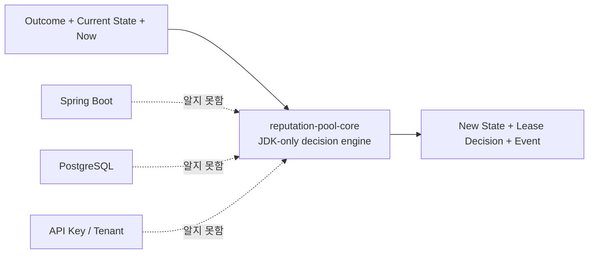
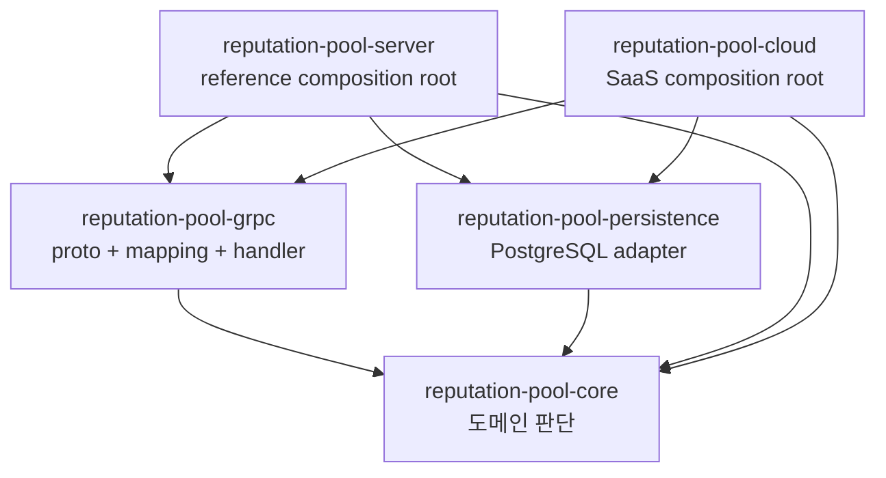
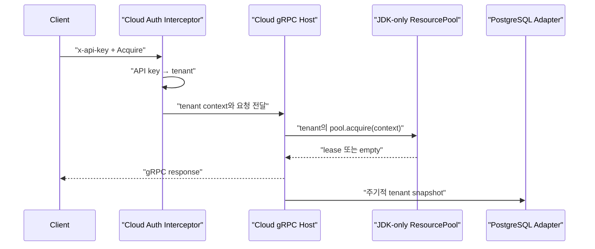

## Table of contents

> **TL;DR**
>
> `reputation-pool`을 SaaS로 제공하면서 처음 정한 경계는 단순했습니다.
>
> - 리소스의 점수·차단·선택·lease 판단은 공개 코어에 둔다.
> - 인증·테넌트·과금·대시보드·배포는 SaaS에 둔다.
>
> 그러나 실제 cloud를 만들자 중간이 비어 있었습니다. `advisor.proto`, wire-domain 변환, gRPC handler가 reference server 안에 묶여 있어 cloud가 코드를 복사해야 했습니다. 코어와 SaaS를 나눴지만 **재사용해야 할 전송 경계는 나누지 못한 것**입니다.
>
> 이를 `reputation-pool-grpc`라는 공개 모듈로 추출했습니다. 이후 reference server와 cloud는 같은 gRPC 계약과 handler를 사용하고, cloud는 Spring 등록·인증된 tenant routing·운영 제한만 덧붙입니다.
>
> 이 글의 결론은 “코어를 순수하게 만들면 SaaS가 얇아진다”가 아닙니다. SaaS에는 여전히 많은 코드가 필요합니다. 다만 **판단 규칙의 복잡성과 판매·운영의 복잡성이 서로를 오염시키지 않도록 변화의 이유가 다른 코드를 분리했다**는 것이 핵심입니다.

---

## 0. 시작 — 복사해야만 재사용할 수 있다면 경계가 잘못된 것이다

공개 `reputation-pool`에는 이미 실행 가능한 reference server가 있었습니다. gRPC로 리소스를 등록하고, 빌리고, 결과를 보고하고, lease를 갱신하거나 반환할 수 있었습니다.

SaaS인 `reputation-pool-cloud`도 같은 기능이 필요했습니다. 차이는 실행 환경이었습니다.

- reference server는 공개 엔진을 직접 실행해볼 수 있는 최소 서버입니다.
- cloud는 Spring Boot 위에서 인증, tenant routing, PostgreSQL, 운영 지표와 대시보드를 함께 제공합니다.

처음에는 reference server의 `advisor.proto`와 handler 코드를 cloud로 복사했습니다. 빠르게 동작을 확인하기에는 쉬운 선택이었습니다. 하지만 두 저장소에 같은 계약이 생긴 순간 다음 문제가 시작됐습니다.

```text
reputation-pool-server/advisor.proto
reputation-pool-cloud/advisor.proto
```

한쪽에 RPC 필드를 추가하면 다른 쪽도 따라 바꿔야 합니다. mapping의 예외 처리가 달라질 수 있고, event stream 종료 방식도 서로 달라질 수 있습니다. 이름은 같은 API인데 host에 따라 동작이 달라지는 **계약 드리프트**가 생길 구조였습니다.

“cloud는 core를 의존하니 중복이 아니다”라고 말할 수도 없었습니다. 판단 엔진만 공유했을 뿐, 그 엔진을 외부에 노출하는 공식 어댑터는 공유하지 않았기 때문입니다.

결국 첫 구현을 버리고 경계를 다시 그렸습니다.

---

## 1. 왜 코어를 JDK-only로 분리했나

`reputation-pool-core`가 답하는 질문은 좁습니다.

> 현재 상태와 이번 결과, 현재 시각이 주어졌을 때 이 리소스의 다음 상태와 대여 가능 여부는 무엇인가?

코어에는 `ReputationEngine`, `ResourcePool`, `LeaseRegistry`, `SelectionStrategy`와 불변 도메인 값이 있습니다. 반면 다음 질문에는 답하지 않습니다.

- 요청을 보낸 사용자는 누구인가?
- 사용자가 어느 tenant에 속하는가?
- 상태를 PostgreSQL 어느 row에 저장하는가?
- API 호출량을 어떻게 과금하는가?
- 경보를 Slack이나 webhook으로 보낼 것인가?
- 대시보드에서 어떤 그래프를 보여줄 것인가?

이 질문들을 제외한 이유는 중요하지 않아서가 아닙니다. **변경되는 이유가 다르기 때문**입니다.

평판 계산식은 실패 유형과 회복 정책이 바뀔 때 수정됩니다. 인증 코드는 키 관리 정책이 바뀔 때 수정되고, persistence는 DB schema와 장애 복구 요구가 바뀔 때 수정됩니다. 이들을 한 모듈에 두면 SaaS 요구사항 하나가 판단 엔진의 배포와 검증 범위까지 흔듭니다.

그래서 core의 main runtime은 JDK API만 사용합니다. Spring, gRPC, JDBC, JSON 라이브러리를 모릅니다.



여기서 JDK-only는 “외부 라이브러리는 나쁘다”는 선언이 아닙니다. 코어가 실행 환경에 관해 알아야 할 내용을 의도적으로 제한한 **아키텍처 제약**입니다.

<details>
<summary><b>(입문) JDK-only와 zero runtime dependency는 정확히 무엇인가</b> (펼치기)</summary>

JDK-only는 코어의 실제 실행 코드가 Java 표준 라이브러리만 사용한다는 뜻입니다. 예를 들어 `java.time.Clock`, `java.util.concurrent.ConcurrentHashMap`, `java.util.random.RandomGenerator`는 사용할 수 있지만 Spring의 `@Service`, Jackson의 `ObjectMapper`, JDBC 구현체에는 의존하지 않습니다.

그렇다고 테스트에서도 외부 도구를 쓰지 않는다는 뜻은 아닙니다. 이 프로젝트는 테스트에서 JUnit, jqwik, AssertJ, ArchUnit, Lincheck와 PIT를 사용합니다. 이 도구들은 코어 jar를 사용하는 애플리케이션의 runtime classpath에는 포함되지 않습니다.

```text
애플리케이션 runtime
└─ reputation-pool-core
   └─ JDK

core 테스트 실행
├─ JUnit
├─ jqwik
├─ Lincheck
├─ ArchUnit
└─ PIT
```

이 제약으로 얻고 싶었던 것은 jar 크기 자체가 아니었습니다.

1. Spring이 없는 CLI와 다른 JVM host에서도 같은 판단 로직을 사용합니다.
2. 현재 시각과 난수를 주입해 같은 입력을 반복 검증할 수 있습니다.
3. 프레임워크 upgrade와 도메인 정책 변경의 배포 이유를 분리합니다.
4. core API에 `DataSource`, HTTP request, tenant session 같은 host 개념이 새어 들어오는 것을 막습니다.

반대로 모든 프로젝트에 필요한 제약은 아닙니다. 한 애플리케이션에서만 쓰이고 도메인과 framework 수명이 동일하다면 모듈 분리 비용이 더 클 수 있습니다. 이 프로젝트에서는 공개 라이브러리, reference server, SaaS라는 세 소비자가 생겼기 때문에 비용을 감수할 이유가 있었습니다.

</details>

---

## 2. 처음 그린 경계 — core와 server만으로는 부족했다

초기 공개 저장소는 역할을 다음처럼 나눴습니다.

| 모듈                          | 책임                                     |
| ----------------------------- | ---------------------------------------- |
| `reputation-pool-core`        | 판단, 선택, lease, blocklist, event 생성 |
| `reputation-pool-persistence` | snapshot과 audit event의 PostgreSQL 저장 |
| `reputation-pool-server`      | gRPC 서버 실행과 전체 조립               |

문제는 `reputation-pool-server`가 두 역할을 동시에 가지고 있었다는 점입니다.

1. 실행 가능한 애플리케이션을 시작하는 composition root
2. 모든 JVM host가 재사용해야 할 gRPC 계약과 adapter

서버를 실행하는 방식은 host마다 달라도 됩니다. reference server는 raw gRPC `ServerBuilder`를 사용할 수 있고, cloud는 Spring의 `@GrpcService`로 등록할 수 있습니다.

하지만 다음 코드는 host마다 달라질 이유가 없었습니다.

- `advisor.proto`
- protobuf message와 domain 값의 변환
- RPC 입력을 decode하고 core를 한 번 호출한 뒤 응답으로 encode하는 handler
- pool event를 gRPC stream으로 전달하는 broadcaster
- 여러 `EventSink`로 fan-out하는 composite

이 코드가 server 실행 파일 안에 있으니 cloud가 의존할 수 없었습니다. 실행 애플리케이션 전체를 라이브러리처럼 가져오는 것도 잘못이고, 필요한 클래스만 복사하는 것도 잘못이었습니다.

<details>
<summary><b>(입문) composition root와 adapter는 어떻게 다른가</b> (펼치기)</summary>

<strong>Adapter</strong>는 서로 다른 표현을 연결합니다. 이 프로젝트의 gRPC adapter는 protobuf 요청을 core의 `ResourceId`, `Context`, `Outcome`으로 바꾸고, core의 결과를 다시 protobuf 응답으로 바꿉니다.

<strong>Composition root</strong>는 애플리케이션 시작 지점에서 실제 구현들을 선택하고 연결합니다.

```text
Clock은 system UTC를 사용한다
ResourceStore는 PostgreSQL 구현을 사용한다
EventSink는 audit + metrics + broadcaster를 묶는다
gRPC service를 9093 port에 등록한다
```

adapter의 변환 규칙은 여러 host가 공유할 수 있습니다. 반면 composition root는 배포 환경에 따라 달라집니다. Spring Boot는 객체를 bean으로 조립하고 lifecycle을 관리하지만, 작은 reference server는 이를 직접 생성할 수 있습니다.

초기 구조에서는 이 두 역할이 `reputation-pool-server`에 함께 있었습니다. cloud가 필요했던 것은 adapter였지만, 가져올 수 있는 단위는 실행 서버였습니다. 이것이 중간 모듈을 추출하게 된 이유입니다.

</details>

---

## 3. 경계를 다시 그리다 — reputation-pool-grpc 추출

PR #66에서 `reputation-pool-grpc` 모듈을 새로 만들었습니다.

옮긴 대상은 다음과 같습니다.

- `advisor.proto`
- `ProtoMapping`
- `ReputationAdvisorService`
- `EventBroadcaster`
- `CompositeEventSink`

그 뒤 의존성 방향은 다음처럼 바뀌었습니다.



중요한 점은 화살표가 반대로 향하지 않는다는 것입니다.

- core는 gRPC가 있는지 모릅니다.
- core는 Spring cloud가 자신을 사용한다는 사실도 모릅니다.
- gRPC 모듈은 core의 공개 타입을 알고 wire format으로 변환합니다.
- server와 cloud는 필요한 adapter를 선택해 조립합니다.

`reputation-pool-grpc`의 `ReputationAdvisorService`는 특정 framework annotation을 가지지 않습니다. cloud는 이를 상속하고 `@GrpcService`로 등록합니다.

```java
@GrpcService
public class ReputationAdvisorService
    extends io.github.preagile.reputationpool.grpc.ReputationAdvisorService {

    private final TenantPoolRegistry registry;

    @Override
    protected ResourcePool pool() {
        String tenantId = TenantContext.TENANT_ID.get();
        return registry.poolFor(tenantId);
    }
}
```

공통 base는 decode → core 호출 → encode를 담당합니다. cloud가 추가하는 핵심은 인증된 요청을 어느 tenant pool로 보낼지 결정하는 일입니다.

이 추출 뒤 reference server도 기존 내부 복사본을 제거하고 같은 공개 모듈을 소비했습니다. 한쪽만 새 모듈을 사용했다면 여전히 두 계약이 남았을 것입니다.

---

## 4. 무엇을 core에 넣고 무엇을 host에 남겼나

경계를 정할 때 “재사용할 것인가”만 묻지 않았습니다. 재사용 가능해 보여도 core가 책임져서는 안 되는 기능이 있습니다.

다음 네 질문을 사용했습니다.

1. 이 규칙이 없으면 도메인 불변식이 깨지는가?
2. 실행 환경이 바뀌어도 같은 규칙이어야 하는가?
3. 판단에 필요한 입력으로 표현할 수 있는가?
4. 특정 고객·배포·판매 정책 때문에 바뀌는가?

그 결과는 다음과 같습니다.

| 기능                        | 위치                         | 이유                                  |
| --------------------------- | ---------------------------- | ------------------------------------- |
| 점수와 cooldown 계산        | core                         | 실행 환경과 무관한 판단 규칙          |
| lease 배타성과 fencing      | core                         | 같은 리소스의 중복 대여를 막는 불변식 |
| 후보 선택 전략              | core의 interface와 기본 구현 | 판단 과정의 교체 가능한 정책          |
| 상태 저장 계약              | core의 port                  | core가 필요로 하지만 구현 방식은 모름 |
| PostgreSQL snapshot/audit   | persistence adapter          | DB와 schema에 종속                    |
| protobuf 변환과 RPC handler | gRPC adapter                 | 전송 형식에 종속되지만 host 간 공유   |
| API key 인증                | cloud                        | SaaS 접근 정책                        |
| tenant별 pool routing       | cloud                        | 고객 격리와 상품 구조                 |
| 사용량 집계와 제한          | cloud                        | 운영·과금 정책                        |
| dashboard·alert·backup      | cloud                        | 서비스 운영 책임                      |

여기서 port를 core에 둔 것은 persistence를 core에 넣었다는 의미가 아닙니다. core는 “snapshot을 저장하고 불러올 수 있어야 한다”는 필요만 interface로 표현합니다. PostgreSQL을 사용할지 파일을 사용할지는 바깥 adapter가 결정합니다.

<details>
<summary><b>(입문) port와 adapter, 의존성 역전은 무엇인가</b> (펼치기)</summary>

코어가 PostgreSQL에 직접 저장한다면 다음과 같은 방향이 됩니다.

```text
core → JDBC → PostgreSQL
```

이 구조에서는 DB가 없는 환경에서 core를 사용하기 어렵고, 저장 기술을 바꾸면 core도 수정해야 합니다.

대신 core 안에 필요한 동작만 interface로 둡니다.

```java
public interface ResourceStore {
    Optional<PoolSnapshot> load();
    void save(PoolSnapshot snapshot);
}
```

그리고 바깥 모듈이 이를 구현합니다.

```text
core ← ResourceStore 계약 ← PostgresResourceStore
```

소스 코드의 import 방향을 보면 persistence module이 core를 의존합니다. 하지만 실행 중에는 core가 `ResourceStore`를 호출합니다. 세부 기술이 핵심 정책을 향해 의존하도록 방향을 뒤집었기 때문에 <strong>의존성 역전</strong>이라고 부릅니다.

- port: core가 필요로 하는 동작의 경계
- adapter: 그 경계를 특정 기술로 구현하거나 외부 표현과 연결하는 코드
- host: 실제 adapter들을 선택해 실행 가능한 서비스로 조립하는 애플리케이션

</details>

---

## 5. thin host는 코드가 적다는 뜻이 아니었다

“cloud는 thin host로 만든다”고 하면 생성자 몇 줄만 있는 애플리케이션을 떠올리기 쉽습니다. 실제 `reputation-pool-cloud`에는 인증, tenant lifecycle, metering, metrics, alert, dashboard, backup과 운영 제어 코드가 있습니다.

그렇다면 더 이상 thin host가 아닌 것일까요?

이 프로젝트에서 thin의 기준은 코드 줄 수가 아닙니다.

> core가 이미 내린 도메인 결정을 cloud가 다시 구현하지 않는다.

cloud의 `EngineConfiguration`은 공개 artifact를 Spring bean으로 조립합니다.

```java
@Bean
Function<String, ResourceStore> resourceStoreFactory(
        DataSource dataSource,
        Clock clock
) {
    return tenantId ->
        new PostgresResourceStore(dataSource, clock, tenantId);
}
```

`ApiKeyAuthInterceptor`는 API key를 tenant로 해석해 gRPC `Context`에 넣습니다. gRPC service는 그 tenant의 `ResourcePool`을 찾습니다. 이후 점수 계산과 lease 판단은 다시 core가 담당합니다.



인증 실패와 DB 장애를 판단 엔진에 알려 “점수를 낮출지” 묻지 않습니다. 반대로 core의 cooldown 공식을 cloud controller에서 다시 계산하지 않습니다. 각 복잡성이 자기 이유로 존재하는 상태가 thin host의 의미였습니다.

---

## 6. SaaS가 반드시 소유해야 했던 책임

core를 재사용한다고 해서 SaaS의 책임까지 공개 라이브러리에 밀어 넣을 수는 없습니다.

### 6.1 인증과 tenant 식별

API key가 없거나 유효하지 않으면 `UNAUTHENTICATED`로 요청을 거절합니다. 유효한 key는 tenant ID로 변환되어 gRPC `Context`에 저장됩니다.

core에는 `tenantId`가 없습니다. core 관점에서는 자신이 하나의 독립된 pool을 관리할 뿐입니다. 어느 pool을 선택할지는 host의 책임입니다.

### 6.2 tenant별 상태와 lifecycle

cloud는 tenant마다 `ResourcePool`과 tenant namespace를 가진 `PostgresResourceStore`를 만듭니다. 시작할 때 복원하고, 주기적으로 checkpoint하며, 종료 전에 마지막 snapshot을 저장합니다.

이 lifecycle은 순수 판단 규칙이 아닙니다. process 시작과 종료, DB 장애, 운영 주기에 관한 정책이므로 host에 남겼습니다.

### 6.3 공용 JVM의 자원 보호

여러 tenant pool이 같은 process heap을 사용하므로 한 tenant가 resource와 reputation cell을 계속 늘리면 전체 서비스가 영향을 받습니다. cloud는 `register`와 `report` 앞에서 process 전체 budget을 검사합니다.

이는 core의 “resource를 등록할 수 있는가”라는 도메인 규칙이 아니라, 현재 SaaS 배포 구조에서 공유 메모리를 보호하는 운영 규칙입니다.

### 6.4 관측성과 판매 기능

Prometheus metric, webhook alert, 사용량 집계, dashboard, admin JWT와 API key lifecycle은 SaaS가 소유합니다. OSS 사용자가 반드시 같은 운영 stack과 판매 정책을 받아들일 이유가 없습니다.

---

## 7. 공유 모듈을 추출해 실제로 확인한 것

모듈을 나눈 뒤 “컴파일된다”에서 검증을 끝내지 않았습니다.

검증 시나리오와 관찰 결과를 다음처럼 남겼습니다.

| 검증 시나리오                | 확인한 결과                                          | 이 검증이 필요했던 이유                               |
| ---------------------------- | ---------------------------------------------------- | ----------------------------------------------------- |
| 공개 저장소 전체 build       | server가 내부 복사본 없이 새 gRPC 모듈을 사용        | compile dependency와 source 이동 누락 확인            |
| `ProtoMapping` mutation test | 25개 mutation 중 생존 0개                            | mapping test가 단순 실행만 하는지 확인                |
| Maven publication dry run    | gRPC artifact와 dependency가 publication 대상에 포함 | 로컬 project dependency로만 우연히 동작하는 상태 방지 |
| cloud Docker round trip      | `Register → Acquire → granted: true`                 | 실제 Spring 등록·gRPC runtime·DB 조립 확인            |
| 인증 포함 container 호출     | key 없음은 `UNAUTHENTICATED`, 유효 key는 grant       | interceptor가 실제 RPC 앞에서 동작하는지 확인         |

cloud Docker round trip은 다음 경로로 실행했습니다.

```text
Docker PostgreSQL 기동
→ cloud application 기동
→ 공유 gRPC service 등록 확인
→ Register RPC
→ Acquire RPC
→ granted: true
```

뒤이은 인증 PR에서는 실제 container에 key 없이 호출하면 `UNAUTHENTICATED`, 올바른 key를 넣고 `Register → Acquire`하면 grant되는 경로를 확인했습니다.

이 검증이 중요했던 이유는 모듈 경계가 Gradle dependency graph에서만 맞고 runtime에서는 깨질 수 있기 때문입니다. 실제로 gRPC와 protobuf는 host가 가져오는 transitive dependency의 version이 어긋나면 `NoClassDefFoundError`나 `AbstractMethodError`가 발생할 수 있습니다. 현재 cloud는 gRPC BOM으로 관련 모듈을 같은 version에 맞추고, 공개 artifact 0.5.0을 Maven Central에서 소비합니다.

---

## 8. 경계를 나눈 대가

좋아진 점만 기록하면 다음 설계에서 같은 판단을 재사용하기 어렵습니다.

### 8.1 release 순서가 생겼다

공유 계약을 바꾸려면 공개 artifact를 먼저 release하고, cloud가 새 version을 소비해야 합니다. 한 저장소에서 동시에 고치던 때보다 느립니다.

하지만 이 순서는 호환성을 확인하게 만드는 gate이기도 합니다. cloud의 임시 요구로 공개 계약을 즉시 깨뜨리기 어려워졌습니다.

### 8.2 framework 중립 API에도 확장 지점이 필요했다

초기 gRPC base service는 하나의 pool만 받았습니다. 멀티테넌시가 생기면서 cloud는 호출마다 다른 pool을 선택해야 했고, `pool()` hook이 필요해졌습니다. tenant별 event stream을 위해 `subscriptionPoolId()` hook도 공개 모듈에 추가했습니다.

framework를 모른다고 해서 host 요구를 전혀 모르는 API가 되는 것은 아닙니다. 여러 host가 공유할 수 있는 최소 확장 지점을 공개 계약으로 설계해야 했습니다.

### 8.3 cloud에서 일부 변환이 중복됐다

공용 JVM budget을 적용하려면 core에 위임하기 전에 요청이 새 resource나 cell을 만들지 확인해야 합니다. 그런데 `ProtoMapping`의 일부 decode 기능은 외부 subclass에서 사용할 수 없었습니다. cloud service에는 budget 검사에 필요한 최소 decode가 중복됐습니다.

이것은 현재 경계의 마찰입니다. 곧바로 모든 mapping을 public으로 열기보다 다음을 관찰해야 합니다.

- 다른 host도 같은 사전 검사가 필요한가?
- base service에 admission hook을 두는 편이 나은가?
- budget 자체를 core 정책으로 옮기면 특정 SaaS 운영 모델이 core에 침투하지 않는가?

한 번의 중복만으로 추상화를 넓히지 않았습니다. 반복되는 두 번째 사용 사례가 생길 때 공개 seam을 다시 설계할 수 있습니다.

### 8.4 “JDK-only”가 목적이 되면 잘못된 추상화가 생긴다

표준 라이브러리만 쓴다는 목표를 지키려고 필요한 adapter까지 직접 구현한다면 오히려 유지보수 비용이 커집니다. 그래서 gRPC와 PostgreSQL 코드는 각각 별도 공개 모듈에서 검증된 라이브러리를 사용합니다.

순수해야 하는 것은 판단 엔진의 경계입니다. 시스템 전체가 외부 의존성 없이 동작해야 한다는 뜻은 아닙니다.

---

## 9. 자가진단 체크리스트와 의사결정 매트릭스

기존 애플리케이션에서 core와 host의 경계를 나눌 때 다음 순서로 확인할 수 있습니다.

1. 같은 판단 규칙이 두 controller나 두 서비스에 복사되어 있는지 찾습니다.
2. 그 규칙의 입력에 HTTP request, DB connection, framework context가 섞여 있는지 확인합니다.
3. 현재 시각, 난수, 외부 상태를 값이나 interface로 주입할 수 있는지 확인합니다.
4. 다른 host가 재사용해야 할 adapter가 실행 애플리케이션 안에 갇혀 있는지 찾습니다.
5. 모듈을 나눈 뒤 source import 방향이 core를 향하는지 확인합니다.
6. 컴파일뿐 아니라 실제 transport와 저장소를 통과하는 round trip을 검증합니다.
7. 새 추상화 때문에 release 순서와 호환성 비용이 얼마나 늘어나는지 기록합니다.

### 의사결정 매트릭스

| 상황                                                  | 권장 경계                               |
| ----------------------------------------------------- | --------------------------------------- |
| 한 서비스만 사용하고 framework와 도메인의 수명이 같다 | 먼저 package 경계로 충분한지 검토       |
| 같은 판단 로직을 batch, server, SaaS가 함께 사용      | framework 중립 core 모듈 검토           |
| transport 변환이 여러 host에서 반복됨                 | 공유 adapter 모듈 추출                  |
| 인증·과금·tenant 정책이 고객별로 바뀜                 | SaaS host에 유지                        |
| DB 종류가 달라도 같은 상태 계약을 사용                | core에 port, 외부에 persistence adapter |
| 첫 사용 사례에서 한 줄이 중복됨                       | 성급한 public abstraction보다 중복 관찰 |
| 여러 host에서 같은 확장 요구가 반복됨                 | 공유 모듈에 최소 hook 또는 port 추가    |

---

## 10. 한계 — 현재 경계가 영구적인 답은 아니다

현재 구조는 한 JVM 안에 tenant별 `ResourcePool`을 두고 cloud가 routing합니다. 따라서 다음 변화가 생기면 경계를 다시 검토해야 합니다.

- pool을 여러 process에 분산할 때
- lease 소유권을 DB나 별도 coordinator로 옮길 때
- Java가 아닌 client가 core 판단을 로컬에서 실행해야 할 때
- admission control이 여러 host의 공통 요구가 될 때
- gRPC 이외의 transport에서 동일 handler semantics를 공유해야 할 때

특히 수평 확장에서는 JDK 내부 `ConcurrentHashMap`의 원자성이 process 밖으로 이어지지 않습니다. 이 문제를 cloud에 lock 몇 줄 추가하는 방식으로 덮으면 배타성 계약이 host마다 달라집니다. 분산 lease가 core 계약인지 별도 coordination adapter의 책임인지 다시 정해야 합니다.

따라서 현재 모듈 구조를 “완성된 클린 아키텍처”라고 부르지 않습니다. 지금 확인된 세 소비자와 단일 process 배포에서 변화의 이유를 가장 잘 분리한 현재의 답입니다.

---

## 11. FAQ

### Q. Spring Boot를 core에서 사용하면 개발 속도가 더 빠르지 않나요?

**A.** 한 애플리케이션만 만들 때는 그럴 수 있습니다. 이 프로젝트에는 공개 라이브러리, reference server, SaaS라는 서로 다른 소비자가 있습니다. core에서 Spring type을 사용하면 모든 소비자가 같은 framework 수명주기와 dependency를 받아들여야 합니다. 대신 cloud의 조립과 운영 기능에서는 Spring Boot를 적극적으로 사용합니다.

### Q. zero dependency가 성능을 위한 선택인가요?

**A.** 직접적인 성능 최적화가 목적은 아닙니다. 실행 환경과 판단 규칙을 분리하고, framework 없이 검증하고, 여러 host에서 재사용하기 위한 제약입니다. 이 글에서는 dependency 제거 전후의 성능을 측정하지 않았으므로 더 빠르다고 주장하지 않습니다.

### Q. gRPC 모듈도 외부 dependency가 많은데 공개 core 원칙과 충돌하지 않나요?

**A.** 충돌하지 않습니다. JDK-only 제약은 판단 엔진인 `reputation-pool-core`의 runtime 경계에 적용합니다. gRPC adapter가 protobuf와 grpc-java를 사용하는 것은 역할에 필요한 의존성입니다. 중요한 것은 그 dependency가 core 안쪽으로 역류하지 않는 것입니다.

### Q. thin host인데 cloud 코드가 많은 것은 설계 실패 아닌가요?

**A.** thin은 코드량이 아니라 책임의 중복 여부를 뜻합니다. cloud는 인증·tenant lifecycle·metering·관측성·배포처럼 SaaS가 반드시 소유해야 할 코드가 많습니다. 실패는 이 기능들이 많은 것이 아니라, 점수 계산이나 lease 판단을 cloud가 다시 구현해 공개 core와 다른 결과를 만드는 것입니다.

### Q. 처음부터 gRPC 모듈을 예상하지 못한 것이 문제 아닌가요?

**A.** 첫 구조가 부족했던 것은 맞습니다. 다만 실제 두 번째 host가 생기기 전에 모든 adapter를 미리 분리했다면 사용되지 않는 추상화를 만들 가능성도 있었습니다. cloud에서 실제 복사가 발생한 시점에 공유 대상과 host별 차이가 구체적으로 드러났고, 그 근거로 모듈을 추출했습니다.

### Q. 공개 core와 상용 cloud의 기준은 어떻게 정했나요?

**A.** 리소스 평판을 판단하고 안전하게 빌려주는 일반 문제와 여러 host가 재사용할 계약·adapter는 공개 영역에 둡니다. 특정 SaaS의 tenant 운영, 인증, dashboard, metering, 배포와 판매 기능은 cloud에 둡니다. 단순히 수익이 될 것 같은 기능을 닫는 기준이 아니라, 일반화 가능한 엔진과 특정 서비스 운영 책임의 차이를 기준으로 삼았습니다.

---

## 12. 마치며 — 얇게 만든 것은 코드가 아니라 변경의 연결이었다

처음에는 core만 분리하면 SaaS가 자연스럽게 얇아질 것이라고 생각했습니다. 실제로는 transport adapter라는 두 번째 경계가 필요했습니다.

reference server 안에 갇힌 gRPC 코드를 cloud가 복사했던 일은 경계가 잘못됐다는 가장 구체적인 신호였습니다. 이를 공개 모듈로 옮기자 server와 cloud가 하나의 wire 계약을 공유하게 됐고, cloud에는 tenant routing과 운영 정책만 남길 수 있었습니다.

그렇다고 cloud가 작은 애플리케이션이 된 것은 아닙니다. 인증, 격리, 저장, checkpoint, metering, alert, dashboard와 배포는 여전히 복잡합니다. 이 복잡성은 SaaS가 책임져야 합니다.

분리로 얻은 것은 코드 수의 감소보다 다음 관계였습니다.

> **평판 판단을 바꿔야 하는 이유와 SaaS 운영을 바꿔야 하는 이유가 서로의 내부 구현까지 끌고 가지 않는다.**

그리고 이 경계도 완성본은 아닙니다. 멀티테넌시가 `pool()`과 event subscription hook을 요구했고, 공용 자원 budget은 사전 검사 seam의 부족함을 드러냈습니다. 다음 요구가 생기면 다시 경계를 조정해야 합니다.

좋은 모듈 경계는 처음부터 모든 미래를 맞히는 선이 아니었습니다. 복사가 시작되는 지점, 변경 이유가 섞이는 지점, host마다 계약이 달라지는 지점을 발견했을 때 **근거를 가지고 다시 그을 수 있는 선**에 가까웠습니다.

---

## References

### 프로젝트 설계와 구현

- [reputation-pool — 공개 JDK-only core와 adapter 저장소](https://github.com/PreAgile/reputation-pool)
- [reputation-pool-cloud — 공개 core를 소비하는 SaaS host](https://github.com/PreAgile/reputation-pool-cloud)
- [reputation-pool PR #66 — gRPC surface를 공유 모듈로 추출](https://github.com/PreAgile/reputation-pool/pull/66)
- [reputation-pool-cloud PR #20 — 공유 gRPC 모듈을 소비하는 thin host](https://github.com/PreAgile/reputation-pool-cloud/pull/20)
- [reputation-pool-cloud PR #22 — API key 인증과 tenant 식별 seam](https://github.com/PreAgile/reputation-pool-cloud/pull/22)
- [reputation-pool-grpc build — 공개 계약 모듈의 dependency 방향](https://github.com/PreAgile/reputation-pool/blob/main/reputation-pool-grpc/build.gradle.kts)
- [Cloud ReputationAdvisorService — tenant routing과 운영 budget 확장](https://github.com/PreAgile/reputation-pool-cloud/blob/main/src/main/java/io/github/preagile/reputationpool/cloud/grpc/ReputationAdvisorService.java)

### 공식 개념 자료

- [Martin Fowler — Inversion of Control Containers and the Dependency Injection pattern](https://martinfowler.com/articles/injection.html)
- [gRPC — Introduction to gRPC](https://grpc.io/docs/what-is-grpc/introduction/)
