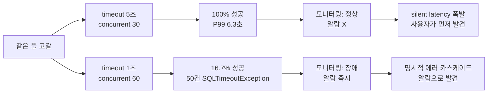
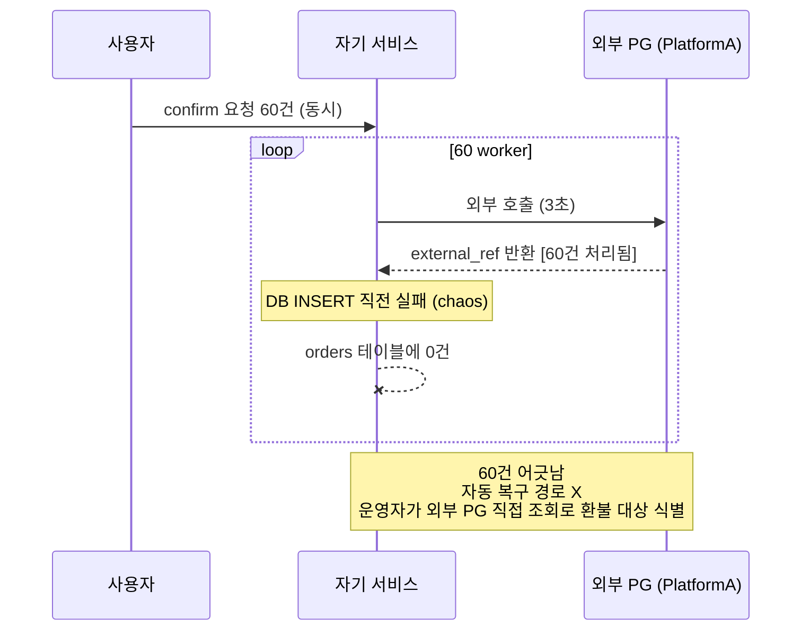
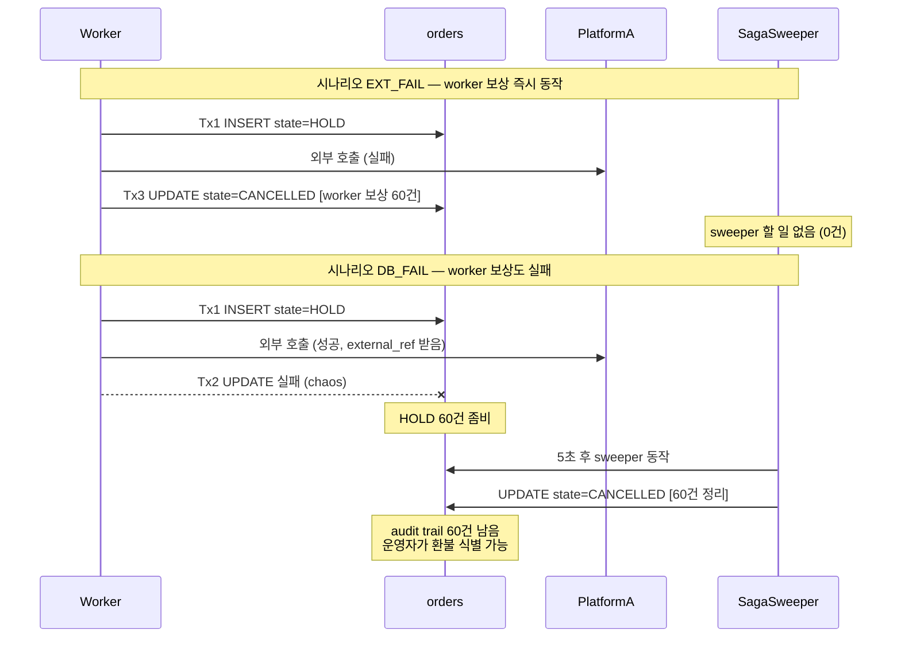
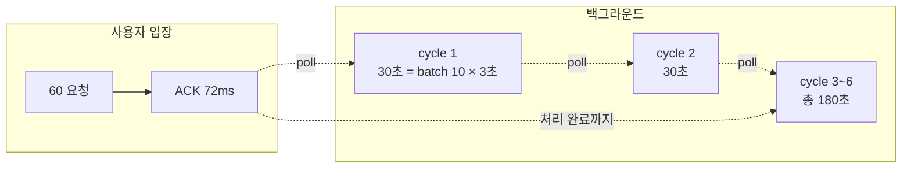

## Table of contents

## 들어가며

코드 리뷰 중 결제 도메인의 한 메서드가 눈에 들어왔습니다. `@Transactional` 안에서 외부 PG에 confirm 요청을 보내고, 그 결과로 `payment` 테이블을 UPDATE 하는 — 흔한 모양이었습니다. 평소 200ms 응답이라 문제없이 돌아가던 코드였습니다.

그런데 같은 코드의 외부 호출이 3초로 늘면 어떻게 될까요. 풀 사이즈 10에 동시 60 요청이 들어오면? 머릿속으로는 "풀 고갈 나겠지"라고 답했지만, **얼마나 빨리 / 어떤 모습으로 / 어떤 알람으로 잡힐지** 자신 있게 말할 수 있는 사람은 적습니다.

그리고 더 어려운 질문이 따라옵니다 — **"그럼 어떻게 분리할까?"** "트랜잭션과 외부 호출을 분리하라"는 답은 흔한데, 결제처럼 *외부 호출 결과로 저장 여부가 결정되는* 도메인에선 단순 분리가 정합성을 깹니다. 어떻게 깨지는지, 그리고 처방으로 흔히 쓰이는 **Saga** 와 **Outbox** 패턴이 *진짜로* 그 문제를 푸는지 — 측정 없이는 자신 있게 말하기 어렵습니다.

이 글은 그 두 질문을 raw JDBC로 끝까지 재현한 기록입니다.

1. **1단계 — 풀 고갈 재현**: 트랜잭션 안 외부 호출이 풀을 어떻게 잡아먹는지 두 run으로 메커니즘 분해
2. **2단계 — 처방 비교**: 분리하면 끝인가 — **단순 분리 / Saga / Outbox** 세 패턴을 60 worker × 9 chaos 시나리오로 비교

결론부터 말하면:

- **단순 분리**는 풀 고갈을 풀어주지만 *정합성을 깬다* — 60건 어긋남이라는 측정값으로 잡혔습니다
- **Saga** 의 3중 안전망(보상 → sweeper → reconciliation)이 *시간 흐름으로 어떻게 작동하는지* 두 시나리오로 검증
- **Outbox** 의 "ACK 가 빠르다" 는 *사용자 인지 metric* 한정 — 처리 완료까지의 시간은 외부 호출에 묶여 평균 93초로 늘어납니다. 같은 측정값에서 어떤 metric 을 보느냐로 결론이 갈리는 게 패턴 C 의 본질

머릿속의 "분리하면 되겠지"가 어떻게 깨지는지 라인 단위로 나눠봅니다.

---

## 1. Context — 왜 이 문제를 다시 파고들었나

### 1.1 도메인

서비스는 멀티 플랫폼 리뷰·결제 SaaS의 백엔드입니다. B사·C사·Y사·D사 같은 외부 커머스 플랫폼과 자체 PG 결제가 한 트랜잭션 흐름에 묶여 들어옵니다.

문제가 되는 패턴은 단순합니다.

```java
@Transactional
public void confirm(PaymentRequest req) {
    Payment p = repo.find(req.id());
    PgResponse r = pgClient.confirm(req);   // 외부 호출 — 평소 200ms
    p.applyResult(r);
    repo.save(p);
}
```

평소엔 문제없습니다. 그런데 외부 PG가 어떤 이유로 3초로 느려지는 시점에 동시 결제가 풀 사이즈를 넘으면 — 코드는 그대로인데 시스템이 무너집니다.

### 1.2 가설

- (H1) 풀 점유 시간 = 외부 호출 길이
- (H2) `connection-timeout`이 *외부 호출 길이 × wave 수*보다 짧으면 fail-fast, 길면 silent latency 폭발

### 1.3 측정 환경

| 항목 | 값 |
|---|---|
| OS / 호스트 | macOS 14.x, MacBook Pro M2 16GB |
| DB | MySQL 8.0.44 (Docker, host 3307) |
| 앱 | Java 21, Spring Boot 3.4.1, **raw JDBC** (JPA 미도입 — 의도된 학습 환경) |
| HikariCP | maxPoolSize=10, minIdle=2 |
| 외부 호출 | `Thread.sleep(extDelay)` — NDA상 외부 PG는 PlatformA로 추상화 |
| 부하 | `ExecutorService` N worker, 3-latch (ready/go/done) 동시 시작 |
| 관측 | `HikariPoolMXBean` (active/idle/awaiting), 0.5초 폴링 |

JPA를 일부러 안 썼습니다. `@Transactional` 추상화 뒤에 가려진 *connection borrow / commit / rollback / close* 동작을 직접 다뤄봐야, 나중에 JPA 도입 후 *Spring 이 무엇을 감추는가* 를 비교할 수 있습니다.

---

## 2. 1단계 — 풀 고갈을 두 가지 모습으로 재현

같은 풀 고갈인데 `connection-timeout` 값에 따라 시스템이 *완전히 다른* 모습으로 보입니다. 두 run으로 비교했습니다.

### 2.1 Run #1 — silent latency 폭발

**파라미터**: pool=10, **timeout=5,000ms**, concurrent=30, extDelay=2,000ms

| 지표 | 값 |
|---|---|
| OK | **30/30 (100%)** |
| Pool timeout | 0 |
| 총 소요 | 6,351 ms |
| Latency P50 / P90 / P99 | 2,200 / 4,300 / **6,350 ms** |
| 풀 stats peak | active=10 / awaiting=20 (지속 6초) |

요청 30건이 깔끔하게 *3개의 wave*로 처리됐습니다.

| Wave | 처리 건수 | latency 범위 | 의미 |
|---|---|---|---|
| 1 | 10 | 2,000~2,300 ms | 즉시 connection 획득 |
| 2 | 10 | 4,000~4,400 ms | 2초 대기 후 |
| 3 | 10 | 6,000~6,400 ms | 4초 대기 후 |

→ **모니터링이 success rate만 보면 "정상"**. 그런데 사용자는 *6초간 느려졌다*고 느낍니다. 가장 위험한 모습 — 알람이 안 울리는 풀 고갈.

### 2.2 Run #2 — fail-fast

**파라미터**: pool=10, **timeout=1,000ms**, concurrent=60, extDelay=3,000ms

| 지표 | 값 |
|---|---|
| OK | **10/60 (16.7%)** |
| Pool timeout | **50** |
| 총 소요 | 3,304 ms |
| 성공분 latency | 3,031~3,302 ms (단일 wave) |
| 실패분 timeout | 1,003~1,016 ms (모두 1초 안에 spike) |

이번엔 `timeout(1초) < extDelay(3초)`라서 첫 wave 10건만 통과하고 나머지 50건이 정확히 1초 시점에 `SQLTimeoutException`으로 죽었습니다.

**이론치와 비교**:
- Throughput 상한 = pool / extDelay = 10/3s = **3.33 req/s** [이론]
- 실측 = 10 / 3.30s = **3.03 req/s** ⇒ 이론치의 91%
- 통과율 = pool / concurrent = 10/60 = **16.7%** ⇒ 실측 정확 일치

### 2.3 두 run의 본질적 차이 — 운영팀이 받는 신호



→ "fail-fast가 안전"이라는 흔한 답은 **반쪽**입니다. timeout 길게 잡으면 풀 고갈을 *지연*으로 발현시키고, 짧게 잡으면 *에러*로 발현시킬 뿐 — **본질은 같은 풀 고갈**.

<details>
<summary><b>HikariCP의 awaitingConnection 메트릭이 진짜 신호인 이유</b> (펼치기)</summary>

`success_rate` 도 `error_rate` 도 Run #1을 정상으로 봅니다. **`awaitingConnection > 0`이 유일한 직접 신호**입니다.

```java
HikariPoolMXBean.getThreadsAwaitingConnection()
```

이 한 줄 메트릭이 풀 고갈의 진실. 두 run에서 모두 `awaiting > 0`이 *수 초간 지속*됐습니다.

운영에서 흔한 함정은 **timeout 을 너무 길게 잡는 것**입니다. 30초 / 60초 같이 잡으면 풀 고갈이 *알람으로 안 보이고*, 사용자 P99가 폭발해서야 발견됩니다. 그런데 timeout 을 짧게 잡으면 — 평소엔 외부 호출이 200ms 라 문제없다가 — 외부 의존성 SLA 가 깨질 때 즉시 fail-fast 카스케이드. 두 정책 모두 모니터링이 깊어야 안전합니다.

**Hikari 공식 가이드 기준**:
- `connection-timeout`: 30초 권장 (pool 획득 대기). 본 측정은 학습 목적상 1초/5초로 의도 변형.
- `awaitingConnection > 0`: 평시 0이어야 정상. 1 이상이 *지속* 되면 풀 고갈.
- `active == max`: 100% 사용률. 일시적은 OK, 지속적은 풀 사이즈 재검토.

</details>

---

## 3. 세 가지 처방 — 단순 분리 / Saga / Outbox

1단계가 "문제 측정"이라면, 여기서부터는 *처방 측정*입니다. 세 패턴을 같은 부하 (`concurrent=60, extDelay=3,000ms, pool=10, timeout=1,000ms` — 1단계의 fail-fast run 과 동일)로 측정했습니다.

각 패턴 × 3가지 chaos 모드 = **9 시나리오**:
- `OFF`: 정상
- `DB_FAIL_AFTER_EXTERNAL`: 외부 호출 성공 후 DB 저장 직전 강제 실패 — *운영 사고 시나리오*
- `EXTERNAL_FAIL`: 외부 호출 자체 실패 — 보상/재시도 검증

각 패턴마다 *개념 → 코드 → 테스트 → 측정* 순서로 보겠습니다.

---

### 3.1 단순 분리 (Simple Split)

#### 개념

```
1) (트랜잭션 X) 외부 API 호출
2) (Tx) DB 저장
```

가장 직관적인 답. "트랜잭션과 외부 호출을 분리하라"는 흔한 조언이 정확히 이 모양입니다.

<details>
<summary><b>단순 분리는 언제 안전한가</b> (펼치기)</summary>

단순 분리가 안전하려면 *둘 중 하나*는 만족해야 합니다:

1. **외부 호출이 멱등이고 부분 실패 시 재시도로 자연 복구** — 외부 OAuth 토큰 캐시 갱신, 통계 캐시 등. 외부 OK / DB 실패 시 클라이언트가 재시도하면 같은 결과.
2. **부분 실패가 도메인적으로 허용** — 알림 한 번 빠져도 사업적 손실 X.

결제·주문·환불 같이 *부분 실패가 사고로 직결되는* 도메인에는 부적합. 본 글의 3.1.4 절 측정으로 그 부적합성을 60건 어긋남으로 직접 확인합니다.

[Microsoft Compensating Transaction Pattern](https://learn.microsoft.com/en-us/azure/architecture/patterns/compensating-transaction) 의 첫 단락도 같은 말을 합니다: "분산 트랜잭션이 없는 환경에서 *각 단계의 실패에 보상*하는 패턴이 필요" — 단순 분리는 *보상 단계가 없다는* 점에서 구조적으로 약합니다.

</details>

#### 코드 — 어떻게 짰나

`PatternARunner.java` (raw JDBC):

```java
public void handle(int requestId) {
    String idemKey = "A-" + UUID.randomUUID();

    // 1) 외부 호출 — 풀 점유 X
    String externalRef = platformA.call(idemKey);

    // 2) Tx — INSERT
    try (Connection c = ds.getConnection()) {
        if (cfg.chaos == ChaosMode.DB_FAIL_AFTER_EXTERNAL) {
            // 외부는 성공 / 자기 DB 저장 강제 실패 (운영 사고 시뮬)
            counters.inconsistent.incrementAndGet();
            return;
        }
        insertOrder(c, requestId, idemKey, externalRef);
        counters.ok.incrementAndGet();
    }
}
```

핵심 invariant: **외부 호출이 트랜잭션 *밖*에서 일어난다**. connection 은 INSERT 1회 (~5ms) 만 점유.

#### 어떻게 테스트했나

3가지 chaos 모드로 60 worker 동시 실행:

```bash
./gradlew :runExp09b --args="pattern=A chaos=false totalTimeout=60"          # 정상
./gradlew :runExp09b --args="pattern=A chaos=db_fail totalTimeout=60"        # DB 실패
./gradlew :runExp09b --args="pattern=A chaos=external_fail totalTimeout=60"  # 외부 실패
```

각 시나리오 직후 DB 상태 확인:

```sql
SELECT pattern, state, COUNT(*) FROM orders GROUP BY pattern, state;
```

#### 측정 결과 — 단순 분리

| chaos | OK | Inconsistent | ExtFail | P99 (ms) | DB orders | 외부 idem 캐시 |
|---|---|---|---|---|---|---|
| OFF | **60** | 0 | 0 | 3,071 | 60 CONFIRMED | 60 |
| **DB_FAIL** | 0 | **60** ⚠️ | 0 | — | **0** | **60** |
| EXT_FAIL | 0 | 0 | 60 | — | 0 | 0 |

#### 발견 — 정합성 사고를 60건의 어긋남으로 잡았다

`DB_FAIL` 시나리오가 핵심입니다. **외부에는 60건 거래 / 자기 DB 에는 0건** — 사용자 카드는 60장 차징됐는데 자기 시스템엔 주문이 없습니다.



**자동 복구 경로 0**. 운영자가 외부 PG를 직접 조회해서 60건을 *수동으로* 환불하거나 *수동으로* INSERT 해야 합니다. 결제 도메인에 단순 분리는 절대 금지라는 게 — 60건이라는 숫자로 명확해졌습니다.

대조군 (`EXT_FAIL`)에서는 자기 DB가 깨끗합니다 (외부 호출이 throw하므로 INSERT까지 못 감). 패턴의 *유일한* 안전 케이스 — 그러나 운영의 위험은 `DB_FAIL` 한 곳입니다.

→ **풀 점유는 풀렸지만 정합성을 새로 깼다**. 다음 두 패턴은 이 정합성 문제를 어떻게 푸는가에 대한 답입니다.

---

### 3.2 Saga (Reserve-Confirm)

#### 개념

> Saga 는 *분산 트랜잭션 없는 환경에서* 각 단계의 실패에 *보상 트랜잭션*으로 정합성을 보장하는 패턴입니다.
> 본 글의 변형은 **Reserve-Confirm** — 외부 호출 *전*에 DB 에 "예약(HOLD)" trace 를 남기고, 결과에 따라 confirm 또는 cancel 트랜잭션을 발행합니다.

```
(Tx1) reserve  — orders state=HOLD INSERT
(트랜잭션 X) 외부 API 호출 (idempotency key 동반)
  성공 → (Tx2) confirm  — state=CONFIRMED
  실패 → (Tx3) cancel   — state=CANCELLED (보상)
+ 별도 sweeper thread — N초 초과 HOLD 자동 RELEASE
```

핵심은 **외부 호출 *전*에 예약 trace 를 남긴다**는 것입니다. 그래야 어떤 단계에서 죽어도 추적 가능.

<details>
<summary><b>Saga 패턴 더 깊이 — Choreography vs Orchestration, 보상 트랜잭션, Stripe·토스 표준</b> (펼치기)</summary>

**Saga 의 두 가지 변형**:

| 변형 | 흐름 | 본 글에서 |
|---|---|---|
| **Orchestration** | 중앙 코디네이터가 각 step + compensation step 를 명시적으로 호출 | 이 모양 — `PatternBRunner.handle()` 메서드가 코디네이터 |
| **Choreography** | 각 서비스가 이벤트로 다음 step 트리거. 코디네이터 없음 | 메시지 브로커가 들어오는 후속 단계에서 검토 |

[microservices.io — Saga](https://microservices.io/patterns/data/saga.html) 가 두 변형의 trade-off 를 설명합니다 — Orchestration 은 *상태 추적*이 쉽지만 *코디네이터가 단일 장애점*. Choreography 는 *서비스 결합도가 낮지만 흐름이 코드 여러 곳에 분산*.

본 글은 단일 서비스 안의 학습이라 Orchestration. 메시지 브로커 도입 후 분산 환경에선 Choreography 로 진화 검토.

**보상 트랜잭션 (Compensating Transaction)**:

[Microsoft Compensating Transaction Pattern](https://learn.microsoft.com/en-us/azure/architecture/patterns/compensating-transaction) 정의 — *이전 작업의 효과를 *논리적으로 취소*하는 작업*. 주의:

- 물리적 롤백이 아니라 *비즈니스 로직 차원의 취소*. 예: 결제 confirm 의 보상은 환불 호출 (DB UPDATE 가 아니라 외부 시스템 호출).
- 보상 *자체가 실패할 수 있다*는 가정이 핵심 — 이게 본 글의 sweeper 가 필요한 이유.
- 멱등성 동반 — 보상 호출이 중복돼도 같은 결과여야 함.

**Stripe·토스 표준의 idempotency key 4종 결합**:

[Stripe Engineering — Idempotency](https://stripe.com/blog/idempotency) 와 [토스페이먼츠 — 멱등성](https://docs.tosspayments.com/blog/what-is-idempotency) 의 표준 패턴:

1. **Idempotency Key** (V4 UUID, HTTP header) — 본 글의 `idemKey`
2. **Payment Intent / 도메인 row** — 본 글의 `orders` (state ENUM)
3. **Webhook 처리도 멱등화** — 본 글 범위 밖
4. **Reconciliation 배치** — 일 1회 외부 PG 와 자기 DB 대사

본 글은 1~2번까지 다룹니다. 3~4번은 후속 글에서 다룰 예정.

**왜 *Reserve* 단계가 핵심인가**:

만약 외부 호출 *후* INSERT 라면? → 외부 호출 성공 → JVM crash → DB 에 흔적 없음 → *자기 시스템은 영원히 모름* = 단순 분리와 동일한 정합성 문제.

외부 호출 *전* HOLD INSERT 면 → HOLD row 가 진실의 원천 (audit trail) → 어떤 단계에서 죽어도 추적 가능. 이게 Saga 가 단순 분리 대비 *유일하게 추가하는 것*입니다.

</details>

#### 코드 — 어떻게 짰나

`PatternBRunner.java` 의 핵심 흐름:

```java
public void handle(int requestId) {
    String idemKey = "B-" + UUID.randomUUID();

    // Tx1 — reserve (HOLD INSERT)
    long orderId = reserve(requestId, idemKey);

    // 트랜잭션 X — 외부 호출
    String externalRef;
    try {
        externalRef = platformA.call(idemKey);
    } catch (Exception e) {
        // Tx3 — 보상 (CANCELLED)
        cancel(orderId);
        counters.compensated.incrementAndGet();
        return;
    }

    // Tx2 — confirm
    confirm(orderId, externalRef);
    counters.ok.incrementAndGet();
}
```

만료 sweeper (`SagaSweeper.java`) — 별도 thread:

```sql
UPDATE orders SET state='CANCELLED'
WHERE state='HOLD' AND pattern='B'
  AND created_at < (CURRENT_TIMESTAMP(3) - INTERVAL ? MICROSECOND)
```

→ N초 초과 HOLD row 를 자동 정리. 학습 목적상 5초 임계 (운영은 PG timeout 보다 길게).

#### 어떻게 테스트했나

`PatternBRunner` + `SagaSweeper` 동시에 동작. 3 chaos 모드:

```bash
./gradlew :runExp09b --args="pattern=B chaos=false"          # 정상
./gradlew :runExp09b --args="pattern=B chaos=db_fail"        # confirm 실패 → sweeper 로 정리
./gradlew :runExp09b --args="pattern=B chaos=external_fail"  # 외부 실패 → 보상 즉시
```

핵심 검증 지점:

- `chaos=false`: 60 worker 모두 confirm → orders.B.CONFIRMED=60
- `chaos=db_fail`: confirm 실패 → HOLD 좀비 60건 → sweeper 가 5초 후 CANCELLED 로 정리
- `chaos=external_fail`: 외부 throw → catch 블록의 cancel() 즉시 동작 → CANCELLED 60건

#### 측정 결과 — Saga

| chaos | OK | Compensated | sweeper | P99 (ms) | DB orders |
|---|---|---|---|---|---|
| OFF | **60** | 0 | 0 | 3,106 | 60 CONFIRMED |
| DB_FAIL | 0 | 0 | **60** | — | 60 CANCELLED |
| EXT_FAIL | 0 | **60** | 0 | — | 60 CANCELLED |

#### 발견 — 3중 안전망이 *시간 흐름*으로 작동

Saga 의 정합성 보장은 **두 시나리오를 같이 봐야** 의미가 보입니다.



| 시나리오 | worker 보상 | sweeper | 최종 DB |
|---|---|---|---|
| EXT_FAIL | **60건** 즉시 | 0건 | B.CANCELLED=60 |
| DB_FAIL | 0건 (실패) | **60건** | B.CANCELLED=60 |

→ **두 안전망이 *차례로* 동작**. 한 시나리오만 보면 절반만 검증한 셈입니다.

그리고 **단순 분리와 결정적 차이** — `DB_FAIL` 시나리오에서도 자기 DB에 60건 audit trail이 남는다는 점:

| | 단순 분리 / DB_FAIL | **Saga / DB_FAIL** |
|---|---|---|
| 외부 처리 | 60건 | 60건 |
| **자기 DB 흔적** | **0건** | **60건 CANCELLED** |
| 환불 대상 식별 | 외부 PG 직접 조회 필요 | `WHERE state='CANCELLED'` 한 줄 |
| 운영 부담 | 외부 ↔ 자기 DB 매핑 직접 | audit trail 로 자동 |

**운영 비용 1/10**의 차이가 이 audit trail 한 가지에서 옵니다 — 보상 트랜잭션이 실패해도 *기록*은 남는다는 게 Saga 의 진짜 가치입니다.

<details>
<summary><b>audit trail 이 정확히 무엇인가</b> (펼치기)</summary>

본 글에서 *audit trail* 이라는 단어를 여러 번 썼는데 정의 없이 썼습니다. 명확히 풀면:

**일반 정의**: *어떤 일이 언제 누구에 의해 일어났는지를 시간순으로 추적 가능하게 남긴 흔적*. 회계·금융·보안 분야의 정식 용어.

**본 글 맥락**: `orders` 테이블의 *row 자체* + `state` 컬럼 + `created_at` / `updated_at` 타임스탬프.

```sql
SELECT id, state, idem_key, created_at, updated_at FROM orders WHERE pattern='B';
```

```
id  state       idem_key       created_at        updated_at
1   CANCELLED   B-aaaa-...     22:30:12.345      22:30:17.891
2   CANCELLED   B-bbbb-...     22:30:12.347      22:30:17.892
... (60건 모두)
```

이 60건 row 자체가 audit trail. 각 row 가:
- 주문이 실제 존재했음 (`created_at`)
- 어떤 상태 변화를 거쳤는지 (HOLD → CANCELLED, `updated_at` 이 sweeper 동작 시각)
- 어떤 idempotency key 로 외부 호출했는지

**왜 운영에 중요한가**:

1. **외부 시스템 의존성 제거** — 환불 대상을 자기 DB *안에서만* 식별 가능. 외부 PG API 가 *마침 그때 다운*이라도 `WHERE state='CANCELLED'` 는 문제없이 동작.
2. **시간 흐름 추적** — 사고 시각 / 영향 범위 / 평균 복구 시간 같은 운영 metric 산출.
3. **법적 / 규제 요구사항** — 결제 도메인은 ISO 27001 / SOC 2 / PCI-DSS 같은 표준에서 audit trail 이 *요구사항*. "거래 X 가 일어났음을 6개월 후에도 증명 가능해야".
4. **디스커버리 가능성** — 운영자가 *모르는* 사고도 정기 쿼리로 발견. 사용자가 신고하기 *전*에.

**강한 audit trail vs 약한 audit trail**:

| 형태 | 어떻게 | 본 글의 Saga 와 |
|---|---|---|
| **상태머신** (본 글) | state 컬럼 변경. 마지막 상태만 보임 | ✅ 본 글 |
| **상태 변경 로그** | `order_state_history` 별도 테이블에 *모든 전이* INSERT | ↑ 더 강함 |
| **Event Sourcing** | append-only event log. 모든 도메인 사건을 이벤트로 저장 후 상태 재생성 | 가장 강한 형태 |

본 글의 Saga 는 *최소한의* audit trail. 운영에서 더 강한 추적이 필요하면 상태 변경 로그 또는 Event Sourcing 으로 진화.

</details>

---

### 3.3 Outbox (Transactional Outbox)

#### 개념

> Outbox 는 *도메인 row + 외부 호출 의도(outbox row)* 를 **같은 트랜잭션** 안에서 INSERT 하고, 별도 워커가 outbox 를 폴링해서 외부 호출을 비동기로 수행하는 패턴입니다.
> 사용자에겐 즉시 ACK, 외부 호출은 워커가 *나중에* 처리.

```
(Tx1) orders(state=PENDING) + outbox(event=CALL_PLATFORM_A) — 같은 connection
사용자에게 즉시 ACK
별도 thread poller — outbox poll → (트랜잭션 X) 외부 호출 → (Tx2) state=CONFIRMED + outbox row DELETE
```

<details>
<summary><b>Outbox 패턴 더 깊이 — 왜 같은 트랜잭션, FOR UPDATE SKIP LOCKED, Polling vs CDC</b> (펼치기)</summary>

**왜 *같은 트랜잭션*이 핵심 invariant 인가**:

만약 도메인 INSERT → 따로 메시지 큐 publish 라면? → DB commit 후 publish 직전 crash 시 *도메인은 PENDING 으로 박히고 큐는 누락* = 외부 호출 영원히 안 됨.

같은 트랜잭션 안에서 INSERT 하면 *둘 다 commit 또는 둘 다 rollback* — 한 쪽만 성공하는 케이스 *원천 차단*. 그래서 *outbox 가 진실의 원천*.

[microservices.io — Transactional Outbox](https://microservices.io/patterns/data/transactional-outbox.html) 가 첫 단락에 강조하는 게 정확히 이것: "Use a transactional outbox to *atomically* update the database and publish a message".

**FOR UPDATE SKIP LOCKED 의 의미** (MySQL 8.0+, PostgreSQL 9.5+):

```sql
SELECT id, order_id, idem_key, retry_count
FROM outbox
WHERE locked_until IS NULL OR locked_until < NOW()
ORDER BY id LIMIT ?
FOR UPDATE SKIP LOCKED
```

- `FOR UPDATE` — 행 단위 락
- **`SKIP LOCKED`** — 락 잡힌 행은 *건너뛴다* → 다른 poller 가 다른 row 잡음 = **분산 처리 안전**
- `locked_until` 필드 — poller 가 죽었을 때 N초 후 다른 poller 가 *시간 기반*으로 회수

→ **단일 poller 학습**으로 짰지만 코드는 **멀티 poller 안전**. ShedLock 같은 분산 락 도입 시 자연스럽게 확장됩니다.

**Polling vs CDC 진화**:

| 방식 | 도구 | trade-off |
|---|---|---|
| Polling (본 글) | Spring `@Scheduled` 또는 별도 thread | 단순 / lag = 폴링 주기 |
| **CDC** (Change Data Capture) | Debezium + Kafka | 즉시 (ms) / 인프라 복잡도 ↑ |

본 글은 200ms 폴링. 운영에서 lag 요구사항이 커지면 폴링 주기를 늘리고 (DB 부하 ↓), ms 단위 lag 가 필요하면 CDC 로 진화하는 게 일반적인 경로.

**멀티 인스턴스에서의 outbox**:

대형 사례에서는 *partition key* 를 outbox 에 추가해서 멀티 인스턴스 poller 가 각자 다른 partition 만 처리. 단일 락(ShedLock 등) 기반보다 throughput 이 큽니다.

</details>

#### 코드 — 어떻게 짰나

`PatternCRunner.java` (worker 측 — 즉시 ACK):

```java
public void handle(int requestId) {
    String idemKey = "C-" + UUID.randomUUID();

    try (Connection c = ds.getConnection()) {
        c.setAutoCommit(false);
        long orderId = insertPendingOrder(c, requestId, idemKey);
        insertOutboxRow(c, orderId, idemKey, requestId);
        c.commit();   // ← 한 트랜잭션 안에서 둘 다 커밋
        counters.ok.incrementAndGet();
    }
}
```

`OutboxPoller.java` (별도 thread — 외부 호출 + confirm):

```java
private void processBatch() {
    List<Row> claimed = claim();   // FOR UPDATE SKIP LOCKED
    for (Row row : claimed) {
        String externalRef = platformA.call(row.idemKey);  // 트랜잭션 X
        confirm(row.orderId, externalRef, row.id);          // (Tx2) UPDATE + DELETE
    }
}
```

학습 목적상 **별도 thread** 로 짰습니다 — Spring `@Scheduled` 추상화 뒤에 가려진 thread lifecycle / 동시성 / 종료 처리를 직접 다뤄보려고요.

#### 어떻게 테스트했나

worker (60건 ACCEPT) + poller (별도 thread) 동시 동작. 3 chaos 모드:

```bash
./gradlew :runExp09b --args="pattern=C chaos=false totalTimeout=180"          # 정상 (drain 끝남)
./gradlew :runExp09b --args="pattern=C chaos=db_fail totalTimeout=180"        # confirm 50% 실패 → 자동 재시도
./gradlew :runExp09b --args="pattern=C chaos=external_fail totalTimeout=30"   # 외부 영구 실패 → outbox 누적
```

핵심 검증:

- `chaos=false`: 모든 row CONFIRMED (단 처리 완료까지의 시간이 cycle 누적)
- `chaos=db_fail`: orderId 짝수 confirm 실패 → bumpRetry → 다음 cycle 재시도 → 결국 처리됨
- `chaos=external_fail`: 외부 호출 throw → retry_count 증가만 → outbox 누적 (운영 알람 신호)

처리 완료 latency 측정은 SQL 로:

```sql
SELECT
  state,
  COUNT(*) AS cnt,
  MIN(TIMESTAMPDIFF(MICROSECOND, created_at, updated_at) DIV 1000) AS min_ms,
  ROUND(AVG(TIMESTAMPDIFF(MICROSECOND, created_at, updated_at) DIV 1000), 0) AS avg_ms,
  MAX(TIMESTAMPDIFF(MICROSECOND, created_at, updated_at) DIV 1000) AS max_ms
FROM orders WHERE pattern='C' GROUP BY state;
```

#### 측정 결과 — Outbox

| chaos | ACK ok | ACK P99 (ms) | poller processed | poller retries | DB 최종 |
|---|---|---|---|---|---|
| OFF | **60** | **72** ⭐ | 60 | 0 | 60 CONFIRMED |
| DB_FAIL | 60 | 67 | 9 (180초 timeout) | 50 | 9 CONFIRMED + 51 PENDING |
| EXT_FAIL | 60 | 66 | 0 | 19 | 60 PENDING (outbox 누적) |

**처리 완료 latency 분포** (`chaos=false`, totalTimeout=200, 60건 모두 처리):

| 지표 | 값 |
|---|---|
| min | 3,233 ms |
| **avg** | **92,573 ms ≈ 93초** |
| **max** | **181,935 ms ≈ 182초** |

#### 발견 — *두 latency* 가 같은 측정값에서 갈린다

처음 분석에서 *ACK P99 72ms* 만 보고 "Outbox 가 빠르다" 로 결론냈는데, 다시 보니 **불공정한 비교**였습니다. 단순 분리·Saga 의 P99 (3,071/3,106ms) 는 *외부 호출 + DB 쓰기까지 끝난* 시점인데, Outbox 의 72ms 는 *외부 호출이 아직 일어나지 않은* ACK 까지의 시간 — 단위가 다른 metric 을 나란히 놓은 셈입니다.

**같은 시나리오에서 두 latency 를 분리**:

| Latency 종류 | 값 | 의미 |
|---|---|---|
| ACK P99 (사용자 인지) | **72ms** | 사용자가 "처리 중" 응답 받기까지 |
| 처리 완료 min | 3,233ms | 첫 cycle row (외부 호출 1회만) |
| **처리 완료 avg** | **92,573ms ≈ 93초** | 60건 평균 |
| **처리 완료 max** | **181,935ms ≈ 182초** | 마지막 cycle row |



→ ACK metric 만 보면 "Outbox 가 빠르다" 는 결론이 나오지만, **처리 완료 metric 으로는 평균 93초** — 단순 분리·Saga (3초) 보다 30배 느립니다. **같은 측정값에서 어떤 metric 을 보느냐로 결론이 정반대**로 갈립니다.

이게 Outbox 의 진짜 trade-off — **응답 시간을 외부 호출에서 분리하는 *대가*로 *처리 완료까지의 시간*이 더 길어진다**. 결제 confirm 처럼 사용자가 *처리 완료 응답을 기다리는* 도메인엔 부적합 — *응답이 빠르지만 결제가 진짜 끝났는지 모르는 상태*가 된다는 뜻. 알림·메일처럼 *ACK 만 받으면 OK* 인 도메인용.

#### 추가 발견 — 외부 영구 장애 시 *모니터링 사각지대*

`chaos=EXT_FAIL` 시나리오는 운영 함정을 직접 보여줍니다:

```
ACK P99 66ms          ← 사용자에겐 정상 응답
processed: 0          ← 실제 처리 0
pending: 60           ← outbox 누적
retries: 19           ← poller 19번 시도, 모두 실패
```

사용자에겐 100% 정상으로 보이는데 비즈니스는 0% 처리 — 운영팀이 *outbox 깊이*를 모니터링하지 않으면 영원히 못 봅니다.

```sql
-- 운영 알람의 직접 신호
SELECT COUNT(*) FROM outbox WHERE retry_count > 5;
```

이 쿼리 한 줄이 알람의 근거 — Hikari `awaitingConnection` 과 똑같은 위치에 있는 메트릭입니다. 패턴이 다를 뿐 *직접 신호가 필요한 건 같다*는 걸 측정으로 봤습니다.

---

## 4. 세 패턴 종합 비교

### 4.1 두 latency 축 분리 — 가장 중요한 비교 표

| 패턴 | 사용자 응답 latency | 처리 완료 latency | 둘이 같음? |
|---|---|---|---|
| **단순 분리** | 3,071 ms | 3,071 ms | ✅ 같음 (동기) |
| **Saga** | 3,106 ms | 3,106 ms | ✅ 같음 (동기) |
| **Outbox** | **72 ms (ACK)** | **avg 92,573 ms / max 181,935 ms** | ❌ **분리됨 (비동기)** |

→ Outbox 의 "ACK 72ms" 는 *사용자 인지 metric* 한정. 처리 완료 metric 으로는 평균 93초 — 단순 분리·Saga 보다 오히려 느립니다. **어떤 metric 을 보느냐**가 결론을 결정합니다.

### 4.2 정합성 보장

| 패턴 | DB_FAIL 시 | EXT_FAIL 시 | 자동 복구 |
|---|---|---|---|
| **단순 분리** | **60건 어긋남** ⚠️ | 안전 (대조군) | 없음 — 운영자 수동 |
| **Saga** | sweeper 60건 정리 | 보상 60건 즉시 | 보상 → sweeper → reconciliation 3중 |
| **Outbox** | 자동 재시도 | 무한 retry → 알람 | poller 자동 |

### 4.3 풀 점유 시간

| 패턴 | Tx 1회당 풀 점유 | wave 누적 P99 (60 worker) |
|---|---|---|
| 분리 안 함 (1단계 baseline) | ~3,000 ms (외부 호출 동안) | 6,350 ms (3 wave) |
| **단순 분리** | ~5 ms (INSERT) | 3,071 ms |
| **Saga** | ~5 ms × 2 (reserve+confirm) | 3,106 ms |
| **Outbox** | ~10 ms (orders+outbox 한 Tx) | 72 ms (ACK) / 92,573 ms (처리 완료 avg) |

→ 모든 패턴이 풀 timeout 0건. 1단계 fail-fast run 의 50건 timeout 사라짐.

### 4.4 Saga vs Outbox — 본질적으로 무엇이 다른가

세 패턴 비교에서 단순 분리는 워낙 단순합니다. 헷갈리는 건 **Saga 와 Outbox** — 둘 다 외부 호출을 안전하게 다루고, 둘 다 audit trail 을 남기고, 둘 다 idempotency key 를 동반합니다. 그러나 본질적으로 다른 패턴입니다.

#### 어디에 기록하나

| 패턴 | 기록 위치 | 본 글 코드 |
|---|---|---|
| **Saga** | 도메인 row 자체 (`orders.state` ENUM) | HOLD / CONFIRMED / CANCELLED |
| **Outbox** | 도메인 row + **별도 outbox 테이블** 둘 다 | `orders` (state) + `outbox` (이벤트 메시지) |

→ Saga 는 *별도 테이블 없음*. 도메인 row 의 state 만으로 진행 추적. Outbox 가 *외부 발행을 위한 별도 테이블*을 두는 패턴.

#### 4가지 축으로 비교

| 축 | **Saga** | **Outbox** |
|---|---|---|
| 동기 / 비동기 | **동기** (워커가 외부 응답까지 기다림) | **비동기** (워커는 outbox INSERT 까지만, 외부 호출은 별도 thread) |
| 외부 호출이 *도메인 결정에 관여*하나 | **관여** — 외부 결과로 confirm 또는 cancel 결정 | **관여 X** — outbox INSERT 시점에 도메인 결정 이미 끝남 |
| 트랜잭션 구조 | **분리** (Tx1 reserve / Tx2 confirm 또는 Tx3 cancel) | **통합** (orders + outbox 한 Tx) |
| 실패 복구 | **보상 트랜잭션** (이전 단계 *되돌리기*) | **재시도** (다음 cycle 다시 시도) |
| 사용자 응답 시점 | 외부 호출 끝나야 응답 | outbox INSERT 직후 ACK |
| 정합성 | **Strong** (즉시 일관성) | **Eventual** (시간 후 일관성) |

#### 가장 본질적 차이 — 한 줄

> **Saga 는 "비즈니스 흐름 전체의 일관성"** 을 보장합니다.
> ("결제 = 외부 차징 + 자기 DB 기록 둘 다 완료 또는 둘 다 취소")
>
> **Outbox 는 "도메인 변경과 외부 발행을 *원자적*으로 묶기"** 를 보장합니다.
> ("주문 INSERT 됐으면 메시지도 *반드시* 발행")

목적이 다른 패턴인데, 둘 다 *외부 호출을 다루는 도메인*에 쓰여서 헷갈립니다.

#### 보상 트랜잭션 vs 재시도 — *다른 종류*의 복구

이게 두 패턴의 가장 깊은 차이입니다.

**Saga 의 보상 트랜잭션** — 외부 호출이 *이미 성공한 후* 자기 DB 단계가 실패한 경우, **외부 시스템에 *되돌리는* 작업**.

```
Tx1: orders state=HOLD INSERT  ✅
외부 호출: PG 차징 ✅           ← 외부 시스템에 *진짜로 일어남*
Tx2: orders state=CONFIRMED ❌  ← 자기 DB 실패
↓
보상: PG 환불 호출              ← 외부 시스템 *되돌리기*
Tx3: orders state=CANCELLED ✅
```

**Outbox 의 재시도** — 외부 호출이 *아직 일어나지 않음* 또는 *시도했지만 실패*. **같은 호출을 *다시 시도***.

```
Tx1: orders state=PENDING + outbox INSERT  ✅
외부 호출: 알림 발송 ❌                       ← 외부 자체가 실패 (아직 발송 안 됨)
↓
재시도: 다음 cycle 에 같은 외부 호출 시도    ← *같은* 작업 반복
재시도: 또 시도... ✅                         ← 외부 복구 후 성공
Tx2: orders state=CONFIRMED + outbox DELETE
```

| | Saga 의 보상 | Outbox 의 재시도 |
|---|---|---|
| 외부 시스템 상태 | **이미 일어남** (rollback 못 함) | 아직 안 일어남 또는 실패 |
| 복구 작업 종류 | **역방향 비즈니스 작업** (환불, 취소) | **같은 작업 반복** |
| 멱등 키 역할 | "되돌릴 거래 식별" | "중복 처리 방지" |
| 코드 복잡도 | 보상 메서드 별도 작성 (`cancel()` 같은) | 재시도 로직만 (별도 비즈니스 코드 X) |

핵심: **Saga 의 보상은 *역방향 비즈니스 코드* 가 필요**하고 (PG 환불 호출 같은 별도 메서드), **Outbox 의 재시도는 *같은 외부 호출을 그냥 반복*** 하면 됨 (멱등 키만 있으면 안전).

#### 결정 기준 — 어떤 패턴 고르나

세 가지 질문으로 갈립니다:

1. **외부 호출이 *비즈니스 결정에 직접 관여*하나?**
   - YES (PG 응답으로 주문 확정 여부 결정) → **Saga**
   - NO (도메인 결정은 이미 났고 *부수적* 외부 호출) → **Outbox**

2. **사용자가 *처리 완료 응답*을 기다리는가?**
   - YES → **Saga**
   - NO ("처리 중" ACK 만 받으면 됨) → **Outbox**

3. **외부 시스템에 *이미 일어난 일을 되돌려야* 할 가능성이 있나?**
   - YES (환불 가능성) → **Saga** (보상 메커니즘 필수)
   - NO (재시도로 충분) → **Outbox**

#### 본 글 측정으로 본 차이 — 같은 외부 실패가 어떻게 다른가

`EXT_FAIL` 시나리오에서 두 패턴이 외부 영구 장애를 *다르게* 다룹니다:

| | Saga / EXT_FAIL | Outbox / EXT_FAIL |
|---|---|---|
| 외부 호출 결과 | 60건 모두 실패 | 60건 모두 실패 |
| 자기 DB 처리 | **즉시 보상 60건** (state=CANCELLED) | **outbox 60건 누적** (state=PENDING) |
| 사용자 응답 | "결제 실패" 명확 (60건 EXTERNAL_FAIL) | "처리 중" ACK (외부 장애 *숨김 가능*) |
| 운영 신호 | 60건 보상 처리 → 외부 다운 알람 | outbox 누적 → *다른* 알람 (`COUNT > 임계`) |

→ 같은 외부 실패라도 **사용자에게 보이는 모습**과 **운영팀이 받는 신호**가 완전히 다릅니다.

#### 공통점도 짚자

목적은 다르지만 공통점도 많습니다 — 그래서 헷갈리기 쉬움:

| 공통점 | 의미 |
|---|---|
| 분산 트랜잭션 회피 | 둘 다 외부 시스템과 자기 DB 를 *2PC 로 묶지 않고* 정합성 보장 |
| idempotency key 필수 | 둘 다 외부 호출에 멱등 키 동반 (재시도 / 보상 모두 안전하게) |
| audit trail | 둘 다 자기 DB 에 *흔적*을 남김 (Saga 는 state, Outbox 는 outbox row) |
| 풀 점유 시간 짧음 | 둘 다 외부 호출이 *DB 트랜잭션 밖*에서 일어남 |

#### 한 줄 요약

> **Saga = "비즈니스 흐름의 단계별 일관성을 *보상*으로 보장"**
>   외부 결과가 *비즈니스 결정에 관여*할 때 (결제·주문)
>
> **Outbox = "도메인 변경과 외부 발행을 *원자적*으로 + *재시도*로 자동 복구"**
>   외부 호출이 *부수 효과*일 때 (알림·이벤트)

---

## 5. 도메인 매핑 — 어떤 패턴을 어디 쓰나

| 도메인 시나리오 | 멱등 | 부분 실패 허용 | Consistency | **선택 패턴** | 근거 측정 |
|---|:---:|:---:|---|---|---|
| **결제 confirm (PG 차징)** | 멱등 (idem key) | 불허 | Strong | **Saga** | 단순 분리 60건 어긋남 / Saga sweeper 60건 |
| 크레딧 차감 (외부 잔액 → 차감) | 멱등 | 불허 | Strong | **Saga** | 동상 |
| 환불 (외부 PG 환불) | 멱등 | 불허 | Strong | **Saga** | 동상 |
| **알림 발송** (이메일·메시지) | 멱등 | 허용 | Eventual | **Outbox** | ACK 72ms — 사용자 응답 분리 |
| 댓글 자동응답 발행 (외부 큐) | 멱등 | 허용 | Eventual | **Outbox** | 동상 |
| 외부 OAuth 토큰 캐시 | 멱등 | 허용 | Eventual | 단순 분리 | 정상 케이스 P99 3,071ms |
| 통계·캐시 갱신 | 임의 | 허용 | Eventual | 단순 분리 | 동상 |

→ **결제·주문류는 Saga**, **알림류는 Outbox**, **캐시류만 단순 분리**.

핵심 결정 기준 두 가지:
1. **사용자가 *처리 완료* 응답을 기다리는가** — YES → Saga (또는 동기 분리), NO → Outbox
2. **부분 실패가 사고로 직결되는가** — YES → Saga, NO → 단순 분리 가능

---

## 6. 운영 실패 시나리오 (3 AM 시나리오)

### 6.1 외부 PG가 평소 200ms → 5초로 늘었다

| 패턴 | 어떤 알람? | 첫 5분 동선 | 사용자 영향 |
|---|---|---|---|
| 분리 안 함 | Hikari `awaiting > 0` + P99 spike | 풀 고갈 식별 → 외부 status page → 코드 롤백 옵션 X | 모든 결제 응답 지연 또는 카스케이드 timeout |
| **Saga** | 외부 PG timeout + HOLD row 만료 sweeper 빈도 ↑ | Hikari 정상 → PG status → `SELECT COUNT(*) FROM orders WHERE state='HOLD'` | 결제 응답 지연만. 다른 API 정상 |
| **Outbox** | outbox row 누적 알람 (`COUNT > 임계`) | poller 워커 정상 → PG status → outbox 깊이 모니터링 | ACK는 정상. 알림 발송이 지연 |

### 6.2 Saga 보상 트랜잭션이 *또* 실패

`PlatformA에 처리됨 / 자기 DB cancel 트랜잭션 deadlock` 같은 케이스.

- 첫 알람: `state=HOLD AND created_at > 5분 전` 임계 알람 (sweeper 미동작 의심)
- 동선:
  1. DB 상태 확인 (lock wait timeout / deadlock 추적)
  2. reserveId 의 외부 PG 상태 직접 조회 (idem key 로 GET) — 처리 여부 확정
  3. 처리됨 → 자기 DB 수동 CONFIRMED + audit log
  4. 처리 안 됨 → 자기 DB 수동 CANCELLED
  5. reconciliation 일 1회 배치로 추후 자동 검증
- = **3중 안전망의 *3번째*: reconciliation**. 보상 → sweeper → reconciliation.

### 6.3 Outbox poller가 죽음

- 첫 알람: outbox row 수 급증
- 동선: poller 프로세스 상태 → 재시작 → 누적된 row 자동 처리
- = 멱등 외부 호출이라 재시도해도 안전 — 패턴 C의 진짜 가치는 이 *자동 복구*에 있음

---

## 7. 무엇을 배웠나

### 7.1 측정으로 깨진 가정들

- "트랜잭션 분리만 하면 끝" → **NO** (단순 분리 / DB_FAIL 의 60건 어긋남)
- "fail-fast 가 안전" → **반쪽 답** (timeout 정책에 따라 운영팀이 받는 신호 정반대)
- "Outbox 의 ACK 72ms 만 보면 빠르다" → **사용자 인지 metric 한정**. 처리 완료 metric 으로는 평균 93초로 단순 분리·Saga 보다 더 느림. 측정의 *어떤 metric*을 보느냐로 결론이 정반대
- "Saga 는 너무 비싸다" → **사용자 latency 차이 무시 가능** (3,071 vs 3,106 ms)

### 7.2 측정값이 만드는 *후속 학습 동기*

이 측정 없이는 다음 결정들의 *왜?* 가 빈약합니다.

| 측정 | 후속 결정 |
|---|---|
| Outbox / OFF processed=59 (180초) | 멀티 poller (ShedLock) 도입 동기 |
| 단순 분리 / DB_FAIL Inconsist=60 | idempotency_records + reconciliation 도입 (Stripe·토스 표준) |
| Saga / DB_FAIL sweeper=60 | sweeper 임계값 결정 (외부 PG timeout 보다 길게) |
| Outbox / EXT_FAIL pending=60 | outbox 깊이 알람 임계 결정 |

### 7.3 핵심 한 줄

> **"트랜잭션 안 외부 호출을 분리하라"** 는 답은 정확히 *반쪽*. **어디로 분리하느냐**가 도메인을 결정합니다.
> - 결제·주문 → **Saga** (외부 호출 *전*에 audit trail + 보상 + sweeper)
> - 알림·메일 → **Outbox** (사용자 응답 분리, 단 처리 완료는 더 느림)
> - 캐시·OAuth → **단순 분리** (외부 호출이 멱등이고 부분 실패 허용 시만)

---

## 8. 다음 글에서

본 측정은 raw JDBC 환경에서 했습니다. JPA 도입 후 같은 패턴을 `@Transactional(REQUIRES_NEW)`로 재구현하면 — 코드는 1/3 라인이지만 *Spring 이 무엇을 감추는가*가 달라집니다. 다음 글에서:

- `@Transactional` 전파 트랩 (`UnexpectedRollbackException` 재현)
- OSIV=true / false 에서 풀 점유가 어디에서 다시 나타나나
- Saga 보상 트랜잭션이 또 실패하면 (3중 안전망의 *3번째*: reconciliation 배치)

---

## 참고자료

- [HikariCP 공식 문서 — Pool Sizing](https://github.com/brettwooldridge/HikariCP/wiki/About-Pool-Sizing) — 풀 사이즈 결정 공식
- [Stripe Engineering — Idempotency in Distributed Systems](https://stripe.com/blog/idempotency) — idempotency key 4종 결합
- [토스페이먼츠 — 멱등성이 뭔가요?](https://docs.tosspayments.com/blog/what-is-idempotency) — 결제 도메인의 멱등 표준
- [microservices.io — Saga Pattern](https://microservices.io/patterns/data/saga.html) — Choreography vs Orchestration
- [microservices.io — Transactional Outbox](https://microservices.io/patterns/data/transactional-outbox.html) — 같은 트랜잭션 invariant
- [Microsoft — Compensating Transaction Pattern](https://learn.microsoft.com/en-us/azure/architecture/patterns/compensating-transaction) — 보상 트랜잭션 정의
- [AWS — Saga Pattern in Cloud Design](https://docs.aws.amazon.com/prescriptive-guidance/latest/cloud-design-patterns/saga.html) — 보상 + 만료 처리
- [네이버 D2 — Commons DBCP 이해하기](https://d2.naver.com/helloworld/5102792) — 풀 사이즈 + TPS 계산
- 본 측정 — raw 데이터는 별도 학습 노트에 보관 (포트폴리오 repo 내부)
