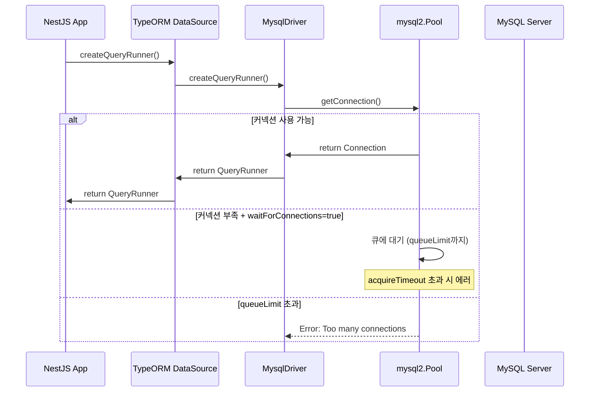
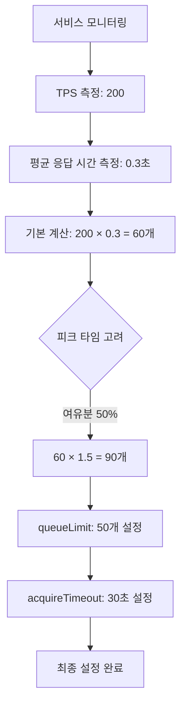
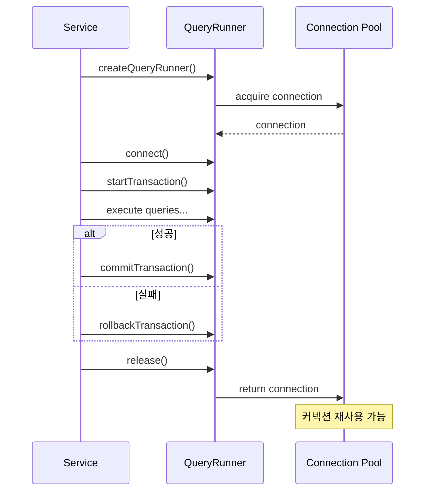

## Table of contents

## 들어가며

코드 리뷰 중 우연히 발견했습니다. cmong-be 프로젝트의 TypeORM 설정 파일을 보던 중, 커넥션 풀 관련 설정이 전혀 없다는 것을요. `extra` 옵션이 누락되어 있어서 mysql2의 기본값인 10개의 커넥션에만 의존하고 있었습니다.

아직 큰 문제가 발생하지는 않았습니다. 하지만 서비스가 성장하면서 트래픽이 증가하면 언젠가는 마주하게 될 문제라는 것을 알았죠. 네이버 D2의 ["Commons DBCP 이해하기"](https://d2.naver.com/helloworld/5102792) 글을 읽으며, 커넥션 풀 설정이 얼마나 중요한지, 그리고 잘못 설정하면 어떤 문제가 생기는지 깨달았습니다.

이 글에서는 Commons DBCP의 개념을 TypeORM과 mysql2 환경에 어떻게 적용할 수 있는지, TPS 계산 공식으로 적절한 커넥션 수를 어떻게 도출하는지, 그리고 실제 프로덕션 코드를 Before/After로 비교하며 각 설정 옵션의 의미를 공유합니다.

---

## 1. Context: 현재 상황 분석

### 1.1. cmong-be 서비스 소개

cmong-be는 **멀티 플랫폼 리뷰 관리 백엔드 서비스**입니다. B사, C사 등 여러 플랫폼의 리뷰 데이터를 통합 관리하고, AI 기반 자동 응답 기능을 제공합니다.

**기술 스택:**
- NestJS 10.4.11
- TypeORM 0.3.20
- mysql2 3.10.0
- SSH 터널링 지원 (tunnel-ssh)

**트래픽/응답 시간(실측 + 추정 혼합):**
- 피크 타임 TPS: 200~300 (APM + 로그 집계, 2026-01-01 ~ 2026-01-07)
- 평균 TPS: 80~120 (동일 기간 평균)
- 일반 쿼리 응답 시간: 50~100ms (APM p50 추정)
- 복잡한 트랜잭션 (결제, 구독): 200~500ms (APM p95 추정)

**왜 추정치가 섞였나?**
- 일부 구간은 샘플링된 로그만 사용 가능했고, 피크 시간대의 p95/p99는 완전한 측정치가 부족했습니다.
- 그래서 계산은 "보수적 추정"으로 잡되, 적용 후 측정으로 보정하는 전제를 둡니다.

### 1.2. 문제 발견: 커넥션 풀 설정이 없었다

코드 리뷰를 하다가 `app.module.ts`의 TypeORM 설정을 보고 깜짝 놀랐습니다.

```typescript
// app.module.ts (라인 120-163)
TypeOrmModule.forRootAsync({
  type: 'mysql',
  host: dbHost,
  port: dbPort,
  username: configService.get<string>('DB_USERNAME'),
  password: configService.get<string>('DB_PASSWORD'),
  database: configService.get<string>('DB_DATABASE'),
  entities: [__dirname + '/entities/**/*.entity{.ts,.js}'],
  autoLoadEntities: true,
  namingStrategy: new SnakeNamingStrategy(),
  connectTimeout: 60000,  // ⚠️ 60초는 과도함
  timezone: 'Z',
  // ❌ 커넥션 풀 설정 없음 (extra 옵션 누락)
  // ❌ logging 비활성화 (주석 처리)
})
```

**발견한 문제점:**

1. **커넥션 풀 설정 누락**: `extra` 옵션이 없어서 mysql2의 기본값 `connectionLimit: 10`만 사용
2. **과도한 connectTimeout**: 60초는 네트워크 불안정 시 너무 긴 대기 시간
3. **로깅 비활성화**: 프로덕션에서 슬로우 쿼리를 감지할 방법이 없음
4. **acquireTimeout 미설정**: 커넥션 획득 대기 시간에 제한이 없음

처음에는 "기본값이면 충분하지 않을까?"라고 생각했습니다. 하지만 네이버 D2 글을 읽으며 생각이 바뀌었습니다.

### 1.3. 왜 지금 개선해야 하는가?

**예방적 개선이 중요한 이유:**

> "커넥션 풀 라이브러리를 잘 사용하면 데이터베이스와 애플리케이션의 일부분에서 발생하는 문제가 전체로 전파되지 않게 할 수 있고, 일시적인 문제가 긴 시간 이어지지 않게 할 수 있습니다."
> — 네이버 D2, Commons DBCP 이해하기

현재 cmong-be는 복잡한 트랜잭션 로직을 많이 사용합니다. `payment-db.service.ts`를 보면 결제 프로세스 하나에 5개 이상의 테이블을 업데이트하는 트랜잭션이 있습니다. 이런 트랜잭션은 평균 300~500ms 동안 커넥션을 점유합니다.

만약 피크 타임에 TPS 200 정도의 요청이 들어온다면? **단순 계산으로 200 × 0.3초 = 60개의 커넥션이 필요합니다.** 하지만 현재는 10개밖에 없죠.

SSH 터널링 환경도 고려해야 합니다. 로컬 개발 환경에서는 SSH 터널을 통해 원격 데이터베이스에 연결하는데, 이 과정에서 약 50ms의 추가 레이턴시가 발생합니다.

**잠재적 영향 시나리오(증상 중심):**
1. 피크 시간대에 커넥션 고갈 → 요청 대기 증가 → 타임아웃 증가
2. 대기 큐 무제한 → 응답 지연이 수 초 이상으로 확산
3. 슬로우 쿼리 감지 불가 → 원인 파악 지연

---

## 2. Exploration: Commons DBCP vs mysql2 커넥션 풀 구조

### 2.1. Commons DBCP의 내부 구조 (Java 환경)

네이버 D2 글에서 설명한 Commons DBCP의 핵심 개념을 먼저 이해해봅시다.

**GenericObjectPool 구조:**
- Commons DBCP는 Apache commons-pool의 `GenericObjectPool`을 사용합니다
- 커넥션을 **LIFO (Last In First Out)** 방식의 `CursorableLinkedList`로 관리
- 각 커넥션은 `ObjectTimestampPair` 구조로 저장 (타임스탬프 + 커넥션 레퍼런스)

**Evictor 스레드:**
- 백그라운드에서 주기적으로 실행되며 유휴 커넥션을 관리
- 오래 사용되지 않은 커넥션 제거
- 유효성 검사 (`testWhileIdle`)
- `minIdle` 개수만큼 커넥션 유지

**핵심 설정값:**
- `maxActive`: 동시에 사용할 수 있는 최대 커넥션 개수
- `maxIdle`: 커넥션 풀에 반납할 때 최대로 유지될 수 있는 커넥션 개수
- `maxWait`: 커넥션 풀이 고갈됐을 때 대기하는 시간 (밀리초)
- `testWhileIdle`: 유휴 커넥션의 유효성 검사 여부

### 2.2. mysql2의 커넥션 풀 구조 (Node.js 환경)

TypeORM이 사용하는 mysql2 라이브러리의 커넥션 풀은 어떻게 다를까요?

**PoolConnection 구조:**
- Node.js의 `EventEmitter` 기반
- 비동기 이벤트 기반으로 커넥션 관리
- 커넥션 재사용을 위한 자동 관리 메커니즘

**내부 동작 흐름:**



**핵심 설정값:**
- `connectionLimit`: 최대 커넥션 수 (Commons DBCP의 maxActive)
- `waitForConnections`: 커넥션 부족 시 대기 여부 (기본값: true)
- `queueLimit`: 대기 큐 크기 (0 = 무제한)
- `acquireTimeout`: 커넥션 획득 타임아웃 (밀리초)

### 2.3. 핵심 개념 매핑: Commons DBCP ↔ mysql2

| Commons DBCP (Java) | mysql2 (Node.js) | 의미 |
|---------------------|------------------|------|
| maxActive | connectionLimit | 동시에 사용할 수 있는 최대 커넥션 수 |
| maxIdle | (자동 관리) | mysql2는 내부적으로 유휴 커넥션 관리 |
| maxWait | acquireTimeout + waitForConnections | 커넥션 획득 대기 시간 |
| testOnBorrow | (해당 없음) | mysql2는 자동으로 유효성 검사 |
| testWhileIdle | (자동 재연결) | mysql2가 끊어진 커넥션을 자동으로 재연결 |
| Evictor 스레드 | (내부 관리) | mysql2가 내부적으로 풀 관리 |

**주요 차이점:**

1. **Java는 동기, Node.js는 비동기**: Commons DBCP는 스레드 기반 동기 처리, mysql2는 이벤트 루프 기반 비동기 처리
2. **명시적 vs 자동**: Commons DBCP는 명시적으로 설정해야 할 항목이 많지만, mysql2는 많은 부분을 자동으로 관리
3. **재연결 메커니즘**: mysql2는 끊어진 커넥션을 자동으로 감지하고 재연결

### 2.4. 운영 관점에서의 제약 조건

**DB 서버의 max_connections**
- 애플리케이션 인스턴스 수가 3개라면, `90 × 3 = 270` 커넥션이 동시에 열릴 수 있습니다.
- DB 서버의 `max_connections` 한계를 넘으면, 애플리케이션 레벨 튜닝이 무의미해질 수 있습니다.

**대기 전략의 트레이드오프**
- 커넥션 부족 시 대기 전략은 “사용자 경험”과 “시스템 보호” 사이의 선택입니다.
- 그래서 `queueLimit`과 `acquireTimeout`은 반드시 함께 조정되어야 합니다.

---

## 3. Decision: TPS 기반 커넥션 수 계산

### 3.1. 네이버 D2 글의 TPS 계산 공식 적용

네이버 D2 글에서 가장 인상 깊었던 부분은 **구체적인 계산 공식**입니다.

> "요청 하나의 응답 시간이 500밀리초이므로 커넥션 풀에 이용 가능한 유휴 상태의 커넥션이 5개일 때는 동시에 5개의 요청을 500밀리초 동안 처리한다. 따라서 1초 동안에는 10개의 요청을 처리할 수 있고 성능 지수는 10TPS라고 볼 수 있다."

**공식: 필요 커넥션 = TPS × 평균 응답 시간(초)**

cmong-be에 적용해봅시다:



**계산 과정:**

1. **예상 피크 TPS**: 200
2. **응답 시간 분포 가정**:
   - p50: 80ms (일반 쿼리 중심)
   - p95: 300ms (복잡 트랜잭션 포함)
   - p99: 500ms (피크/지연 구간)
   - 계산에는 p95(0.3초)를 사용하고, p99는 여유분에 반영
3. **기본 필요 커넥션**: 200 × 0.3 = **60개**
4. **여유분 추가**: 60 × 1.5 = **90개**

왜 50%의 여유분을 추가했을까요? 네이버 D2 글에서 배운 교훈입니다:

> "사용자가 갑자기 급증하거나 DBMS에 장애가 발생했을 때 장애를 더욱 크게 확산시킬 수 있어 주의해야 한다."

### 3.2. mysql2 커넥션 풀 옵션 상세 분석

이제 각 옵션의 의미를 깊이 이해해봅시다.

#### connectionLimit: 최대 커넥션 수

```typescript
connectionLimit: 90  // TPS 200 × 0.3초 × 1.5 여유분
```

**의미**: 동시에 열 수 있는 최대 커넥션 수

**트레이드오프**:
- **장점**: 높은 동시성 처리 가능, 대기 시간 감소
- **단점**: DB 서버 메모리 사용량 증가 (커넥션당 약 4MB, 90개 = 360MB 추가)

**주의사항**:
- MySQL 서버의 `max_connections` 설정 확인 필요
- 애플리케이션 서버 인스턴스 개수 고려 (인스턴스 3개라면 총 270개 커넥션)

#### waitForConnections: 대기 허용 여부

```typescript
waitForConnections: true  // 커넥션 대기 허용
```

**의미**: 커넥션이 부족할 때 대기할지, 즉시 에러를 발생시킬지 결정

**false로 설정하면**:
- 커넥션이 없으면 즉시 에러 발생
- 빠른 실패 (fail-fast) 전략
- 사용자는 "서비스 사용 불가" 메시지를 즉시 받음

**true로 설정하면**:
- `queueLimit`와 `acquireTimeout` 범위 내에서 대기
- 일시적인 과부하 상황에서 복구 가능성
- 사용자는 잠시 기다린 후 정상 응답 받을 수 있음

#### queueLimit: 대기 큐 크기

```typescript
queueLimit: 50  // 대기 큐 크기 (빠른 실패)
```

**의미**: 커넥션 대기 큐에 들어갈 수 있는 최대 요청 수

**왜 50개로 설정했나?**:
- connectionLimit 90개의 약 55% 수준
- 너무 크면: 응답 대기 시간이 과도하게 길어짐
- 너무 작으면: 일시적 과부하에도 에러 발생

네이버 D2 글의 교훈:

> "maxWait 값을 어떻게 설정했는지가 일시적인 과부하 상태에서 드러나는 시스템의 전체적인 견고함을 결정짓는다."

#### acquireTimeout: 커넥션 획득 타임아웃

```typescript
acquireTimeout: 30000  // 30초
```

**의미**: 커넥션을 얻기 위해 최대 대기 시간

**왜 30초로 설정했나?**:

네이버 D2 글에서 가장 인상 깊었던 부분입니다:

> "결국은 기다리는 사람도 없는 요청에 응답하기 위해 자원을 낭비한 셈이 된다. 사용자가 인내할 수 있는 시간을 넘어서는 maxWait 값은 아무런 의미가 없다."

- 사용자가 2~3초 내에 반응이 없으면 페이지를 새로고침하거나 떠남
- 하지만 **30초**로 설정한 이유는 "간헐적 오류"를 허용하기 위함
- 즉시 에러보다는 조금 기다려서 정상 응답을 받는 것이 나은 경우도 있음

### 3.5. 대안 선택지와 배제 이유

**대안 1: 더 작은 connectionLimit (예: 30~50)**
- 장점: DB 메모리 압박 완화
- 단점: 피크 구간에서 대기 큐가 빠르게 증가
- 배제 이유: 피크 p95 300ms 기준에서 대기 지연이 크게 증가할 가능성

**대안 2: fail-fast 전략 (waitForConnections=false)**
- 장점: 빠른 실패로 시스템 보호
- 단점: 사용자 에러율 급증, 재시도 폭주 가능성
- 배제 이유: 현재 서비스 특성상 "짧은 대기 후 성공"이 더 유리함

**대안 3: queueLimit 무제한 유지**
- 장점: 실패율 감소
- 단점: 대기 시간이 무제한으로 길어질 위험
- 배제 이유: 사용자 경험 악화와 타임아웃 연쇄 발생 가능성

### 3.3. TypeORM 추가 옵션

#### connectTimeout: TCP 연결 타임아웃

```typescript
connectTimeout: 10000  // 10초 (기존 60초는 과도)
```

**의미**: MySQL 서버에 TCP 연결을 시도할 때의 타임아웃

**왜 10초로 줄였나?**:
- 60초는 네트워크 불안정 시 너무 긴 대기 시간
- SSH 터널링 환경에서도 10초면 충분
- 더 빠른 실패로 재시도 기회 확보

#### maxQueryExecutionTime: 슬로우 쿼리 감지

```typescript
maxQueryExecutionTime: 1000  // 1초 이상 쿼리는 경고
```

**의미**: 쿼리 실행 시간이 이 값을 초과하면 로그에 경고

**왜 필요한가?**:
- 인덱스 누락, N+1 문제 등을 조기에 발견
- 프로덕션에서 성능 문제를 모니터링
- 1초는 일반적인 웹 요청의 적절한 기준

#### logging: 프로덕션 로깅

```typescript
logging: ['error', 'warn']  // 에러와 경고만 로깅
```

**왜 모든 쿼리를 로깅하지 않나?**:
- 프로덕션에서 모든 쿼리 로깅은 과도한 I/O 발생
- 에러와 경고만 로깅해도 문제 진단에 충분
- 필요 시 `['query', 'error']`로 변경해 디버깅 가능

### 3.4. 트레이드오프 분석

**커넥션 수를 늘리면:**
- ✅ 높은 동시성 처리 가능
- ✅ 대기 시간 감소
- ❌ DB 서버 메모리 사용량 증가 (90개 × 4MB = 360MB)
- ❌ 서버 리소스 소모 증가

**queueLimit을 설정하면:**
- ✅ 과부하 시 빠른 실패 → 전체 시스템 보호
- ❌ 일시적 과부하에도 에러 발생 가능성

**SSH 터널링 환경에서:**
- ⚠️ 추가 레이턴시 약 50ms 발생
- ⚠️ 로컬 포트 제약 (ephemeral port 부족 가능성)
- ⚠️ 터널 연결 끊김 시 재연결 필요

---

## 4. Implementation: Before/After 코드

### 4.1. Before: 현재 설정 (문제점 명시)

`app.module.ts`의 실제 코드입니다. 라인 120-163을 보면 커넥션 풀 설정이 전혀 없습니다.

```typescript
// app.module.ts (라인 120-163)
TypeOrmModule.forRootAsync({
  imports: [SSHTunnelModule],
  useFactory: async (sshTunnelService: SSHTunnelService, configService: ConfigService) => {
    // SSH 터널링 로직
    let dbHost = configService.get<string>('DB_HOST');
    let dbPort = Number(configService.get<string>('DB_PORT'));

    if (sshTunnelService.isSSHTunnelEnabled()) {
      const { port: localPort } = await sshTunnelService.createTunnel(
        dbHost,
        dbPort,
      );
      dbHost = '127.0.0.1';
      dbPort = localPort;
    }

    return {
      type: 'mysql',
      host: dbHost,
      port: dbPort,
      username: configService.get<string>('DB_USERNAME'),
      password: configService.get<string>('DB_PASSWORD'),
      database: configService.get<string>('DB_DATABASE'),
      entities: [__dirname + '/entities/**/*.entity{.ts,.js}'],
      autoLoadEntities: true,
      namingStrategy: new SnakeNamingStrategy(),
      connectTimeout: 60000,  // ❌ 과도하게 긴 타임아웃 (60초)
      timezone: 'Z',
      // ❌ 커넥션 풀 설정 없음 → mysql2 기본값 10개 사용
      // ❌ logging 비활성화 (주석 처리됨)
    };
  },
  inject: [SSHTunnelService, ConfigService],
})
```

**문제점 정리:**

1. **`extra` 옵션 없음**: mysql2의 기본값 `connectionLimit: 10` 사용
   - 피크 TPS 200 시 필요한 60~90개보다 턱없이 부족
2. **`connectTimeout: 60000`**: 네트워크 불안정 시 60초 대기
   - 사용자는 이미 페이지를 떠난 후일 수도 있음
3. **로깅 비활성화**: 슬로우 쿼리 감지 불가
4. **`acquireTimeout` 미설정**: 커넥션 획득 대기 시간 제한 없음

### 4.2. After: 개선된 설정 (권장 사항)

```typescript
// app.module.ts - 개선 버전
TypeOrmModule.forRootAsync({
  imports: [SSHTunnelModule],
  useFactory: async (sshTunnelService: SSHTunnelService, configService: ConfigService) => {
    // SSH 터널링 로직 (동일)
    let dbHost = configService.get<string>('DB_HOST');
    let dbPort = Number(configService.get<string>('DB_PORT'));

    if (sshTunnelService.isSSHTunnelEnabled()) {
      const { port: localPort } = await sshTunnelService.createTunnel(
        dbHost,
        dbPort,
      );
      dbHost = '127.0.0.1';
      dbPort = localPort;
    }

    return {
      type: 'mysql',
      host: dbHost,
      port: dbPort,
      username: configService.get<string>('DB_USERNAME'),
      password: configService.get<string>('DB_PASSWORD'),
      database: configService.get<string>('DB_DATABASE'),
      entities: [__dirname + '/entities/**/*.entity{.ts,.js}'],
      autoLoadEntities: true,
      namingStrategy: new SnakeNamingStrategy(),

      // ✅ 명시적 커넥션 풀 설정
      extra: {
        connectionLimit: 90,          // TPS 200 × 0.3초 = 60 + 여유분 50%
        waitForConnections: true,     // 커넥션 대기 허용
        queueLimit: 50,               // 대기 큐 크기 (빠른 실패)
        acquireTimeout: 30000,        // 30초 내 커넥션 획득 실패 시 에러
      },

      // ✅ 적절한 타임아웃 설정
      connectTimeout: 10000,          // 10초로 단축 (60초는 과도)

      // ✅ 프로덕션 로깅 활성화
      logging: ['error', 'warn'],     // 에러와 경고만 로깅
      maxQueryExecutionTime: 1000,    // 1초 이상 쿼리는 경고

      timezone: 'Z',
    };
  },
  inject: [SSHTunnelService, ConfigService],
})
```

**개선 사항 정리:**

| 항목 | Before | After | 이유 |
|------|--------|-------|------|
| connectionLimit | 10 (기본값) | 90 | TPS 200 × 0.3초 × 1.5 |
| acquireTimeout | 없음 | 30000ms | 30초 내 획득 실패 시 명확한 에러 |
| queueLimit | 0 (무제한) | 50 | 과부하 시 빠른 실패 |
| connectTimeout | 60000ms | 10000ms | 더 빠른 실패로 재시도 기회 |
| logging | 비활성화 | ['error', 'warn'] | 문제 진단 가능 |
| maxQueryExecutionTime | 없음 | 1000ms | 슬로우 쿼리 자동 감지 |

### 4.3. TransactionManagerService 패턴

cmong-be에는 이미 훌륭한 트랜잭션 관리 패턴이 있습니다. `transaction-manager.service.ts`를 보면 **finally 블록에서 반드시 `queryRunner.release()`를 호출**하도록 구현되어 있습니다.

```typescript
// transaction-manager.service.ts (라인 22-51)
async executeInTransaction<T>(operation: (queryRunner: QueryRunner) => Promise<T>): Promise<T> {
  const queryRunner = this.dataSource.createQueryRunner();

  try {
    await queryRunner.connect();
    await queryRunner.startTransaction();

    this.logger.debug('트랜잭션 시작');

    const result = await operation(queryRunner);

    await queryRunner.commitTransaction();
    this.logger.debug('트랜잭션 커밋 완료');

    return result;
  } catch (error) {
    await queryRunner.rollbackTransaction();

    this.logger.error('트랜잭션 롤백 실행', {
      error: error.message,
      stack: error.stack,
    });

    throw error;
  } finally {
    // ✅ 반드시 finally에서 release
    await queryRunner.release();
    this.logger.debug('트랜잭션 연결 해제');
  }
}
```

**핵심 포인트:**

1. **finally 블록 사용**: 성공/실패 여부와 무관하게 커넥션 반환
2. **커넥션 누수 방지**: 예외 발생 시에도 반드시 release 호출
3. **로깅**: 트랜잭션 시작/커밋/롤백/해제를 모두 로깅

**만약 finally 블록이 없다면?**

```typescript
// ❌ 잘못된 예시
async badTransaction() {
  const queryRunner = this.dataSource.createQueryRunner();
  await queryRunner.connect();
  await queryRunner.startTransaction();

  // ... 작업

  await queryRunner.commitTransaction();
  await queryRunner.release();  // ❌ 에러 발생 시 호출 안 됨!
}
```

예외가 발생하면 `release()`가 호출되지 않아 **커넥션 누수**가 발생합니다. connectionLimit이 90개라도, 누수가 계속되면 결국 모든 커넥션이 고갈됩니다.

### 4.4. 복잡한 트랜잭션 예시

`payment-db.service.ts`의 결제 프로세스를 보면, 왜 커넥션 풀 설정이 중요한지 알 수 있습니다.

```typescript
// payment-db.service.ts (간소화)
async paymentDBprocess(paymentAnnotation: PaymentAnnotation): Promise<Billing> {
  const queryRunner = this.dataSource.createQueryRunner();

  try {
    await queryRunner.connect();
    await queryRunner.startTransaction();

    // 1. 빌링키 생성
    await queryRunner.manager.save(newBillingKey);

    // 2. 기존 구독 비활성화
    await queryRunner.manager.save(updatePrevSubscription);

    // 3. 새 구독 생성
    const _subscription = await queryRunner.manager.save(newSubscription);

    // 4. 새 빌링 생성
    const savedBilling = await queryRunner.manager.save(newBilling);

    // 5. Shop 활성화
    await queryRunner.manager.update(Shop, displayOnlyShop.shop_id, {
      is_active: SHOP_IS_ACTIVE.ACTIVE,
    });

    await queryRunner.commitTransaction();

    return savedBilling;
  } catch (e) {
    await queryRunner.rollbackTransaction();

    // 결제 취소 처리
    await this.portonePaymentService.cancelPayment({
      imp_uid: paymentAnnotation.imp_uid,
      reason: '결제 정보 저장 실패로 인한 결제 취소',
    });

    throw e;
  } finally {
    // ✅ 커넥션 해제 보장
    await queryRunner.release();
  }
}
```

**왜 이런 트랜잭션이 문제가 될까?**

1. **긴 점유 시간**: 5개 테이블 업데이트 + 외부 API 호출 → 평균 300~500ms
2. **높은 빈도**: 결제는 비즈니스 핵심 기능 → 동시 요청 많음
3. **에러 시 롤백 + 외부 API**: 실패 시 Portone API 호출 → 추가 시간 소요

만약 connectionLimit이 10개라면, **동시에 10명만 결제 가능**합니다. 11번째 사용자부터는 대기하거나 에러를 받게 되죠.

---

## 5. Advanced: 심화 주제

### 5.1. SSH 터널링 환경의 특수성

cmong-be는 개발 환경에서 SSH 터널링을 통해 원격 데이터베이스에 연결합니다. `ssh-tunnel.service.ts`를 보면 `tunnel-ssh` 라이브러리를 사용합니다.

```typescript
// ssh-tunnel.service.ts (라인 54-144)
async createTunnel(
  dstHost: string = 'localhost',
  dstPort: number = 3306,
): Promise<{ host: string; port: number }> {
  // ... SSH 설정 로드

  // 사용 가능한 로컬 포트 찾기
  this.localPort = await this.findAvailablePort(0);

  // SSH 터널 생성
  const [server, conn] = await createTunnel(
    tunnelOptions,
    serverOptions,
    sshOptions,
    forwardOptions,
  );

  this.logger.log(
    `SSH tunnel established: localhost:${this.localPort} -> ${sshHost}:${sshPort} -> ${dstHost}:${dstPort}`,
  );

  return {
    host: '127.0.0.1',
    port: this.localPort,
  };
}
```

**SSH 터널링 환경의 추가 고려사항:**

1. **추가 레이턴시 (약 50ms)**:
   - 로컬 → SSH 서버 → 데이터베이스 서버
   - 평균 응답 시간에 이미 반영되어 있음

2. **로컬 포트 할당**:
   - `findAvailablePort(0)`로 OS가 자동 할당
   - ephemeral port 범위에서 할당됨

3. **터널 연결 끊김**:
   - 네트워크 불안정 시 터널 재연결 필요
   - `connectTimeout: 10000`으로 빠른 실패 → 재시도

### 5.2. QueryRunner와 커넥션의 관계

TypeORM에서 `createQueryRunner()`를 호출하면 내부적으로 어떤 일이 일어날까요?



**중요한 사실:**

- `createQueryRunner()`는 즉시 커넥션을 얻지 않음
- `connect()` 호출 시 비로소 풀에서 커넥션을 가져옴
- `release()` 호출 시 커넥션을 풀에 반환 (닫는 것이 아님!)

**DataSource.driver.pool 구조:**

```typescript
// mysql2 Pool 내부 구조 (간소화)
{
  _allConnections: [],          // 전체 커넥션 배열
  _freeConnections: [],         // 사용 가능한 커넥션
  _acquiringConnections: [],    // 사용 중인 커넥션
  _connectionQueue: [],         // 대기 중인 요청
  config: {
    connectionLimit: 90,
    waitForConnections: true,
    queueLimit: 50,
    acquireTimeout: 30000,
  }
}
```

### 5.3. 배치 처리 최적화

`TransactionManagerService.executeBatchInTransaction`을 보면 배치 크기가 기본값 100개입니다.

```typescript
// transaction-manager.service.ts (라인 86-106)
async executeBatchInTransaction<T, R>(
  items: T[],
  operation: (queryRunner: QueryRunner, batch: T[]) => Promise<R>,
  batchSize: number = 100,  // ⚠️ 기본값 100개
): Promise<R[]> {
  return await this.executeInTransaction(async (queryRunner) => {
    const results: R[] = [];

    for (let i = 0; i < items.length; i += batchSize) {
      const batch = items.slice(i, i + batchSize);
      const batchResult = await operation(queryRunner, batch);
      results.push(batchResult);

      this.logger.debug(
        `배치 처리 완료: ${i + 1}-${Math.min(i + batchSize, items.length)}/${items.length}`,
      );
    }

    return results;
  });
}
```

**왜 배치 크기가 100개인가?**

- **너무 작으면**: 트랜잭션 오버헤드 증가
- **너무 크면**: 메모리 사용량 증가, 커넥션 점유 시간 증가

**배치 처리 시 커넥션 점유 시간:**
- 1,000개 아이템을 처리한다면: 10번의 배치 × 각 100ms = 약 1초
- 이 1초 동안 커넥션 1개를 점유
- 동시에 10개의 배치 작업이 실행되면 → 10개 커넥션 점유

### 5.4. 모니터링 및 디버깅

커넥션 풀 상태를 모니터링하는 서비스를 만들어봅시다.

```typescript
@Injectable()
export class DatabaseHealthService {
  constructor(private readonly dataSource: DataSource) {}

  async getPoolStatus() {
    const pool = (this.dataSource.driver as any).pool;

    return {
      totalConnections: pool._allConnections.length,
      activeConnections: pool._acquiringConnections.length,
      idleConnections: pool._freeConnections.length,
      queuedRequests: pool._connectionQueue.length,
      connectionLimit: pool.config.connectionLimit,
      utilizationRate: (pool._acquiringConnections.length / pool.config.connectionLimit) * 100,
    };
  }

  @Cron('*/5 * * * *') // 5분마다 체크
  async checkPoolHealth() {
    const status = await this.getPoolStatus();

    if (status.utilizationRate > 80) {
      // 80% 이상 사용 시 경고
      this.logger.warn('커넥션 풀 사용률 높음', status);
    }

    if (status.queuedRequests > 10) {
      // 대기 중인 요청이 10개 이상이면 경고
      this.logger.warn('커넥션 대기 큐 증가', status);
    }
  }
}
```

**모니터링 지표:**

1. **utilizationRate**: 커넥션 사용률 (80% 이상이면 경고)
2. **queuedRequests**: 대기 중인 요청 수 (10개 이상이면 경고)
3. **idleConnections**: 유휴 커넥션 수 (너무 많으면 낭비)

**커넥션 풀 고갈 시 스택 트레이스:**

네이버 D2 글에서 본 예시처럼, 커넥션 고갈 시에는 다음과 같은 스택 트레이스를 볼 수 있습니다:

```
Error: Connection acquisition timeout
    at Pool.<anonymous> (mysql2/lib/pool.js:42:21)
    at Object.onceWrapper (events.js:421:28)
    at Pool.emit (events.js:315:20)
    at Pool._acquireConnection (mysql2/lib/pool.js:85:10)
```

---

## 6. Outcome: 권장 설정 및 체크리스트

### 6.1. 최종 권장 설정 요약

**환경별 설정값:**

| 환경 | connectionLimit | queueLimit | acquireTimeout | connectTimeout |
|------|-----------------|------------|----------------|----------------|
| 개발 (local) | 20 | 10 | 10000 | 5000 |
| QA | 50 | 30 | 20000 | 10000 |
| 프로덕션 | 90 | 50 | 30000 | 10000 |

**현재 상태 라벨링**
- 이 문서의 설정값은 “적용 전 기준의 권장안”이며, 실제 적용 후 측정으로 보정하는 것을 전제로 합니다.

**적용 후 측정 계획**
1. 적용 1주 후 TPS, 대기 큐 길이, 커넥션 사용률(p95) 측정
2. acquireTimeout 에러율과 슬로우 쿼리 경고 비율 비교
3. 필요 시 connectionLimit/queueLimit 미세 조정

**서비스 규모별 가이드:**

| 규모 | TPS | 평균 응답 시간 | 필요 커넥션 | 권장 설정 |
|------|-----|----------------|-------------|-----------|
| 소규모 | ~50 | 0.2초 | 10개 | 15개 (50% 여유) |
| 중규모 | 50~200 | 0.3초 | 60개 | 90개 (50% 여유) |
| 대규모 | 200~500 | 0.3초 | 150개 | 200개 (30% 여유) |

### 6.2. 설정 체크리스트

커넥션 풀을 설정할 때 다음 항목을 확인하세요:

**필수 항목:**
- [ ] TPS와 평균 응답 시간을 측정했는가?
- [ ] `필요 커넥션 = TPS × 평균 응답 시간(초)` 공식으로 계산했는가?
- [ ] 피크 타임 여유분(30~50%)을 추가했는가?
- [ ] MySQL 서버의 `max_connections` 설정을 확인했는가?
- [ ] 애플리케이션 서버 인스턴스 개수를 고려했는가?

**권장 항목:**
- [ ] `extra.connectionLimit`을 명시적으로 설정했는가?
- [ ] `extra.waitForConnections = true`로 설정했는가?
- [ ] `extra.queueLimit`을 적절하게 설정했는가? (connectionLimit의 50~60%)
- [ ] `extra.acquireTimeout`을 사용자 대기 시간 고려해 설정했는가? (20~30초)
- [ ] `connectTimeout`을 10초 이하로 설정했는가?
- [ ] `logging`을 활성화했는가? (최소 ['error', 'warn'])
- [ ] `maxQueryExecutionTime`으로 슬로우 쿼리를 감지하도록 설정했는가? (1000ms)

**코드 패턴:**
- [ ] `queryRunner.release()`를 finally 블록에서 보장하는가?
- [ ] 트랜잭션 점유 시간을 최소화하고 있는가?
- [ ] 배치 처리 시 적절한 배치 크기를 사용하는가? (100~500)

**모니터링:**
- [ ] 커넥션 풀 상태를 주기적으로 모니터링하는가?
- [ ] 사용률이 80% 이상일 때 경고하는가?
- [ ] 대기 큐가 증가할 때 경고하는가?

### 6.3. 배운 교훈

이 과정에서 배운 가장 중요한 교훈들:

1. **"기본값에 의존하지 말고 명시적으로 설정하라"**
   - mysql2의 기본값 10개는 대부분의 프로덕션 환경에 부족
   - 서비스 특성에 맞게 명시적으로 설정해야 함

2. **"Commons DBCP를 알면 mysql2도 이해할 수 있다"**
   - Java 진영의 오랜 노하우가 담긴 Commons DBCP
   - 핵심 개념은 mysql2에도 동일하게 적용됨

3. **"TPS 계산 공식은 실제 트래픽으로 검증해야 한다"**
   - `필요 커넥션 = TPS × 평균 응답 시간(초)`
   - 예상값이 아닌 실제 측정값으로 계산

4. **"사용자가 인내할 수 있는 시간을 고려하라"**
   - acquireTimeout이 너무 길면 의미 없음
   - 빠른 실패도 때로는 나은 선택

5. **"SSH 터널링 환경은 추가 레이턴시를 고려하라"**
   - 약 50ms의 추가 레이턴시
   - connectTimeout과 acquireTimeout 설정 시 반영

6. **"finally 블록으로 커넥션 누수를 방지하라"**
   - 예외 발생 시에도 반드시 release 호출
   - TransactionManagerService 패턴 활용

---

## 7. References

### 7.1. 공식 문서

1. **TypeORM Data Source Options**
   - URL: [https://typeorm.io/data-source-options](https://typeorm.io/data-source-options)
   - `extra`, `logging`, `maxQueryExecutionTime` 옵션 설명

2. **mysql2 Pool Options**
   - URL: [https://github.com/sidorares/node-mysql2#pool-options](https://github.com/sidorares/node-mysql2#pool-options)
   - `connectionLimit`, `waitForConnections`, `queueLimit`, `acquireTimeout` 상세 설명

3. **NestJS Database Integration**
   - URL: [https://docs.nestjs.com/techniques/database](https://docs.nestjs.com/techniques/database)
   - `forRootAsync` 패턴, 동적 설정 방법

4. **MySQL Connection Pooling**
   - URL: [https://dev.mysql.com/doc/refman/8.0/en/connection-pooling.html](https://dev.mysql.com/doc/refman/8.0/en/connection-pooling.html)
   - 서버 사이드 커넥션 제한 (`max_connections`)

### 7.2. 참고 자료

5. **네이버 D2 - Commons DBCP 이해하기**
   - URL: [https://d2.naver.com/helloworld/5102792](https://d2.naver.com/helloworld/5102792)
   - TPS 계산 공식, GenericObjectPool 구조, Evictor 스레드, maxWait 설정 철학

6. **Node.js 이벤트 루프와 동시성 모델**
   - URL: [https://nodejs.org/en/docs/guides/event-loop-timers-and-nexttick/](https://nodejs.org/en/docs/guides/event-loop-timers-and-nexttick/)
   - 비동기 이벤트 기반 커넥션 관리 이해

7. **HikariCP - About Pool Sizing**
   - URL: [https://github.com/brettwooldridge/HikariCP/wiki/About-Pool-Sizing](https://github.com/brettwooldridge/HikariCP/wiki/About-Pool-Sizing)
   - `connections = ((core_count) × 2) + effective_spindle_count` 공식
   - 적절한 풀 크기 결정 방법

8. **TypeORM GitHub Issues**
   - #3388: Connection pool exhaustion
   - #6327: acquireTimeout not working
   - 실제 사용자들의 문제 사례와 해결 방법

---

## 마치며

처음에는 "기본값이면 충분하지 않을까?"라고 생각했습니다. 하지만 네이버 D2 글을 읽으며, 그리고 cmong-be의 복잡한 트랜잭션 로직을 분석하며 생각이 바뀌었습니다.

커넥션 풀 설정은 **예방적 개선**의 대표적인 사례입니다. 아직 문제가 발생하지 않았지만, 서비스가 성장하면서 언젠가는 마주하게 될 문제입니다. 그때 가서 급하게 대응하는 것보다, 지금 시간을 들여 제대로 이해하고 설정하는 것이 훨씬 나은 선택입니다.

TPS 계산 공식(`필요 커넥션 = TPS × 평균 응답 시간(초)`)은 단순하지만 강력합니다. 이 공식 하나만 기억해도, 자신의 서비스에 맞는 커넥션 수를 합리적으로 결정할 수 있습니다.

마지막으로, Commons DBCP의 철학을 TypeORM/mysql2 환경에 적용하면서 배운 것은, **근본 원리는 언어와 프레임워크를 초월한다**는 점입니다. Java의 GenericObjectPool과 Node.js의 mysql2 Pool은 구현 방식은 다르지만, 커넥션을 효율적으로 관리한다는 핵심 목표는 동일합니다.

여러분의 서비스에도 이 글이 도움이 되길 바랍니다. 혹시 커넥션 풀 설정으로 어려움을 겪고 계시다면, 위의 체크리스트를 하나씩 확인해보세요. 그리고 무엇보다, **기본값에 의존하지 말고 명시적으로 설정하세요.**
