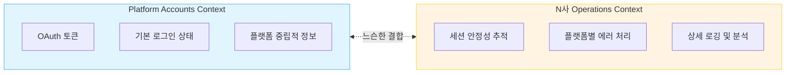
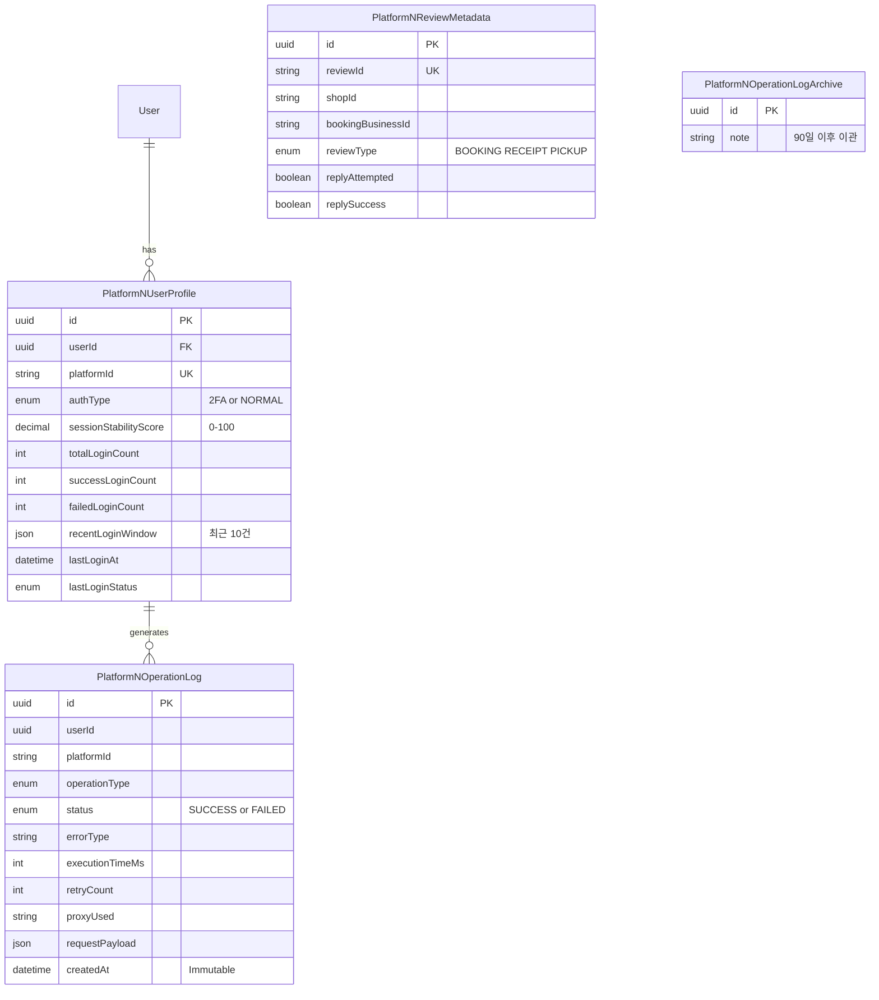
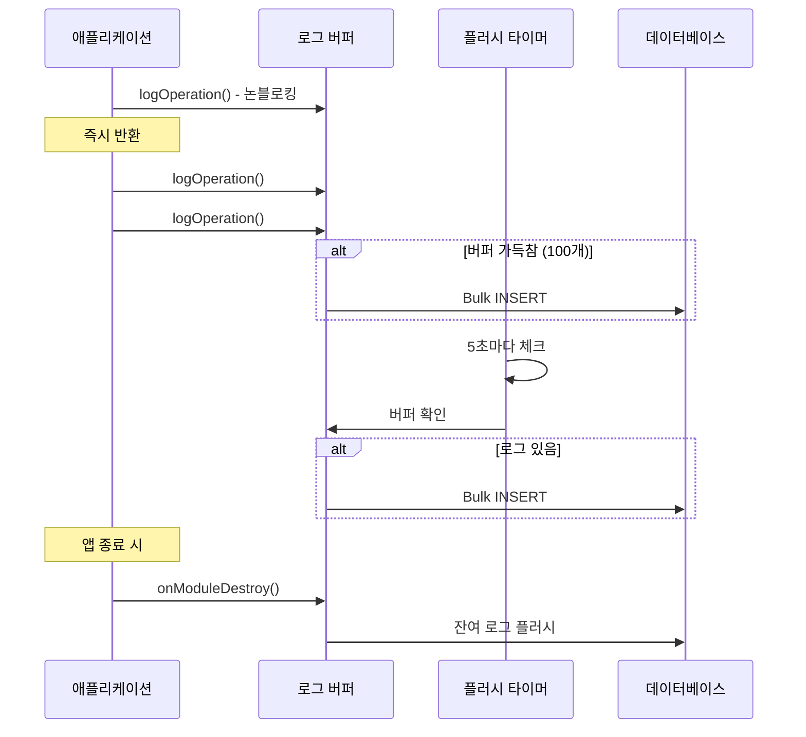

## Table of Contents

## Executive Summary

"왜 이 사용자만 계속 로그인에 실패하죠?" - 어느 날 운영팀에서 받은 슬랙 메시지였습니다. 로그를 뒤져봐도 "LOGIN_FAILED"라는 정보밖에 없었고, 원인을 찾는 데 반나절을 썼습니다. 그때 깨달았죠. 우리 시스템은 **무슨 일이 일어났는지**는 기록하지만, **왜 일어났는지**는 알려주지 않는다는 걸.

이 글은 그 문제를 해결하기 위해 N사 플랫폼 전용 로깅 시스템을 설계한 여정입니다. **NestJS + TypeORM + PostgreSQL** 기반의 백엔드에서 어떻게 확장 가능한 로깅 아키텍처를 만들었는지, 그 과정에서 마주친 고민들과 해결책을 나눠보려 합니다.

이 글에서 다루는 내용:

- 기존 범용 테이블의 한계와 플랫폼별 분리의 필요성
- 도메인 주도 설계(DDD) 관점에서의 테이블 설계
- 고성능 로깅을 위한 버퍼링과 배치 처리
- 운영 중 발견한 인덱스 최적화 포인트
- 데이터 라이프사이클 관리 (핫/콜드 분리)

**최종 결과**: 4개의 전용 테이블, 95% 테스트 커버리지, 그리고 production에서 안정적으로 운영 중인 솔루션을 만들 수 있었습니다.

## 1. 문제의 시작: 범용 테이블의 한계

### 1.1 멀티 플랫폼 시스템의 배경

우리 시스템은 여러 전자상거래 플랫폼의 리뷰를 수집하고 관리합니다. 이미 B사, C사 등과 연동되어 있었고, 새로운 N사 플랫폼을 추가하는 과정에서 기존 아키텍처의 근본적인 한계와 마주하게 되었습니다.

기존 설계는 이런 모습이었습니다:

```typescript
// 범용 플랫폼 계정 테이블
interface PlatformAccount {
  userId: string;
  platformId: string;      // 'platform-n', 'platform-b', etc.
  accessToken: string;
  isLoggedIn: boolean;
  lastLoginAt: Date;
}
```

어떤 플랫폼이든 동일한 스키마로 처리할 수 있다는 점에서 깔끔해 보였습니다. 하지만 N사 연동을 시작하면서 문제가 드러났죠.

### 1.2 N사 플랫폼의 특수성

N사는 기존 플랫폼들과 근본적으로 다른 특성을 가지고 있었습니다.

**첫 번째 문제: 인증 방식의 복잡성**

기존 플랫폼들은 단순한 OAuth 흐름을 따랐지만, N사는 2단계 인증(2FA) 사용자와 일반 인증 사용자가 섞여 있었습니다. 2FA 사용자는 세션 유지가 어렵고, 재인증 빈도가 높았습니다. 에러 처리 로직도 인증 타입에 따라 달라져야 했고요.

하지만 기존 `PlatformAccount` 테이블은 이런 정보를 저장할 곳이 없었습니다.

```typescript
// 이렇게 하면? → Sparse Table 문제 발생
interface PlatformAccount {
  userId: string;
  platformId: string;

  // N사 전용 (다른 플랫폼은 null)
  platformNAuthType?: '2FA' | 'NORMAL';
  platformNSessionStability?: number;

  // B사 전용 (다른 플랫폼은 null)
  platformBBusinessId?: string;

  // 계속 늘어나는 플랫폼별 필드들...
}
```

**두 번째 문제: 세션 안정성을 정량화할 수 없었습니다**

기존 시스템은 "로그인 성공/실패"만 기록했습니다. 하지만 운영하면서 정말 알고 싶었던 건 이런 것들이었어요:

- "이 사용자의 N사 세션은 얼마나 안정적인가?"
- "지난 100번의 로그인 시도 중 몇 번 성공했는가?"
- "최근 10건이 연속 실패라면 세션 갱신이 필요하지 않을까?"
- "2FA 사용자의 평균 안정성은 일반 사용자와 얼마나 차이 나는가?"

이런 지표 없이는 문제가 터지고 나서야 대응할 수밖에 없었습니다. 사전 예방적인 세션 관리가 불가능했죠.

**세 번째 문제: 플랫폼별 리뷰 메타데이터**

N사는 리뷰를 3가지 타입으로 구분합니다:
- **예약 기반 리뷰** (병원, 미용실)
- **영수증 기반 리뷰** (식당)
- **배달/픽업 리뷰**

각 타입마다 답글 가능 여부, API 엔드포인트, 수집 방법이 다릅니다. 기존 범용 `Review` 테이블로는 이런 특수 정보를 담을 수 없었습니다.

**네 번째 문제: Observability의 부재**

웹 스크래핑 기반 연동은 본질적으로 불안정합니다. 플랫폼 UI 변경, Rate limiting, 프록시 이슈 등 다양한 원인으로 실패할 수 있죠.

하지만 기존 시스템으로는 이런 질문에 답할 수 없었습니다:
- "왜 특정 사용자만 계속 실패하는가?"
- "어떤 operation이 가장 많이 실패하는가?"
- "프록시 A는 성공률 50%인데 프록시 B는 90%인 이유는?"

## 2. 문제의 본질: God Table 안티패턴

### 2.1 기존 테이블에 컬럼만 추가하면 안 될까?

처음에는 이렇게 생각했습니다. "기존 `PlatformAccount`에 컬럼 몇 개만 추가하면 되지 않을까?"

하지만 이건 전형적인 **God Table 안티패턴**이었습니다. (모든 것을 하나의 테이블에 담으려는 설계)

| 문제 | 결과 |
|------|------|
| **Sparse Table** - 행마다 대부분 필드가 NULL인 테이블 | 스토리지 낭비 (50-70% null), 인덱스 비효율 |
| **쿼리 복잡도** - 플랫폼별 분기 처리 필요 | 코드 복잡도 증가, 실수 가능성 증가 |
| **마이그레이션 지옥** - ALTER TABLE 반복 | 새 플랫폼마다 스키마 변경, 다운타임 발생 |
| **단일 책임 원칙 위반** | N사 변경이 B사에 영향을 줄 수 있음 |

결국 플랫폼별로 테이블을 분리하기로 결정했습니다.

### 2.2 도메인 분리의 필요성

DDD(Domain-Driven Design) 관점에서 보면, 범용 플랫폼 계정 관리와 N사 특화 기능은 서로 다른 **Bounded Context**입니다.

> 💡 **Bounded Context란?** 같은 단어라도 맥락에 따라 의미가 달라지는 경계를 말합니다. 예를 들어 "주문"이라는 개념이 결제팀에서는 "결제 대상"이지만, 배송팀에서는 "배송해야 할 물건"입니다. 이런 경계를 명확히 나누는 게 DDD의 핵심입니다.

**[그림 1] 도메인 컨텍스트 분리**



이렇게 분리하면:
- N사 스펙 변경이 다른 플랫폼에 영향을 주지 않습니다
- 각 컨텍스트가 독립적으로 진화할 수 있습니다
- 나중에 마이크로서비스로 분리하기도 수월해집니다

### 2.3 트랜잭션 데이터 vs 로그 데이터

또 하나 중요한 구분이 있었습니다. **현재 상태를 저장하는 데이터**와 **이벤트 히스토리를 저장하는 데이터**는 특성이 완전히 다릅니다.

| 특성 | 트랜잭션 데이터 | 로그 데이터 |
|------|----------------|-----------|
| **목적** | 현재 상태 저장 | 이벤트 히스토리 |
| **패턴** | CRUD | Insert-only |
| **크기** | 작음 (수만 행) | 큼 (수억 행 가능) |
| **보존** | 무기한 | 일정 기간 후 아카이브 |

이 둘을 하나의 테이블에 섞으면 Locking 경쟁, 인덱스 충돌, 백업 복잡도 증가 등 여러 문제가 생깁니다.

> 💡 **PITR (Point-In-Time Recovery)**: 특정 시점으로 데이터베이스를 복구하는 기술입니다. 트랜잭션 데이터는 이게 필요하지만, 로그 데이터는 단순 덤프로 충분한 경우가 많습니다.

## 3. 해결책: 4개의 전용 테이블

위 분석을 바탕으로 N사 전용 4개 테이블을 설계했습니다.

**[그림 2] N사 전용 테이블 ER 다이어그램**



각 테이블의 역할을 하나씩 살펴볼게요.

### 3.1 PlatformNUserProfile: 세션 안정성의 Single Source of Truth

이 테이블의 핵심은 **세션 안정성을 정량화**하는 것입니다.

```typescript
@Entity('platform_n_user_profiles')
@Index('uk_user_platform', ['userId', 'platformId'], { unique: true })
@Index('idx_stability_score', ['sessionStabilityScore'])
export class PlatformNUserProfile {
  @PrimaryColumn({ type: 'varchar', length: 36 })
  id: string;

  @Column({ type: 'varchar', length: 36, name: 'user_id' })
  userId: string;

  @Column({ type: 'varchar', length: 255, name: 'platform_id' })
  platformId: string;

  @Column({
    type: 'enum',
    enum: ['2FA', 'NORMAL'],
    default: 'NORMAL',
    name: 'auth_type',
  })
  authType: '2FA' | 'NORMAL';

  @Column({
    type: 'decimal',
    precision: 5,
    scale: 2,
    default: 0.0,
    name: 'session_stability_score',
  })
  sessionStabilityScore: number;

  @Column({ type: 'int', default: 0 })
  totalLoginCount: number;

  @Column({ type: 'int', default: 0 })
  successLoginCount: number;

  @Column({ type: 'int', default: 0 })
  failedLoginCount: number;

  @Column({ type: 'json', nullable: true, name: 'recent_login_window' })
  recentLoginWindow: Array<{ status: string; createdAt: string }> | null;

  @Column({ type: 'timestamp', nullable: true, name: 'last_login_at' })
  lastLoginAt: Date | null;

  @Column({ type: 'enum', enum: ['SUCCESS', 'FAILED'], nullable: true })
  lastLoginStatus: 'SUCCESS' | 'FAILED' | null;

  /**
   * 세션 안정성 점수 계산
   * 소수점 2자리까지 반올림하여 정밀도 보장
   */
  calculateStabilityScore(): number {
    if (this.totalLoginCount === 0) return 0;
    return Math.round((this.successLoginCount / this.totalLoginCount) * 10000) / 100;
  }

  /**
   * 로그인 결과 업데이트 - Rich Domain Model
   */
  updateLoginResult(status: 'SUCCESS' | 'FAILED', authType?: '2FA' | 'NORMAL'): void {
    this.lastLoginAt = new Date();
    this.lastLoginStatus = status;
    this.totalLoginCount++;

    if (status === 'SUCCESS') {
      this.successLoginCount++;
    } else {
      this.failedLoginCount++;
    }

    if (authType) this.authType = authType;

    // Sliding window: 최근 10건만 유지
    const entry = { status, createdAt: new Date().toISOString() };
    this.recentLoginWindow = [entry, ...(this.recentLoginWindow || []).slice(0, 9)];

    this.sessionStabilityScore = this.calculateStabilityScore();
  }

  /**
   * 세션 안정성 등급 판정
   */
  getStabilityGrade(): 'STABLE' | 'UNSTABLE' | 'CRITICAL' {
    if (this.sessionStabilityScore >= 80) return 'STABLE';
    if (this.sessionStabilityScore >= 50) return 'UNSTABLE';
    return 'CRITICAL';
  }
}
```

**설계 포인트:**

1. **복합 유니크 키** `(userId, platformId)`: 한 사용자가 여러 계정을 가질 수 있지만, 동일 계정 중복은 방지
2. **정량화된 지표** `sessionStabilityScore`: 0-100 사이 값으로 Grafana 대시보드에 바로 표시 가능
3. **Sliding Window** `recentLoginWindow`: 최근 10건만 JSON으로 저장해서 급격한 상태 변화 감지 (연속 5번 실패 등)
4. **Rich Domain Model**: 점수 계산, 등급 판정 로직을 엔티티 내부에 두어 비즈니스 규칙을 명확하게
   > 💡 **Rich Domain Model vs Anemic Domain Model**: 엔티티가 데이터만 담고 있으면 "빈약한(Anemic) 모델", 데이터와 행위를 함께 가지면 "풍부한(Rich) 모델"입니다. `calculateStabilityScore()`처럼 엔티티가 스스로 계산할 수 있으면 로직이 분산되지 않습니다.

처음에는 점수 계산 로직을 서비스 레이어에 뒀었는데, 운영하면서 여러 곳에서 중복 로직이 생기더라고요. 결국 엔티티 안으로 옮기니까 훨씬 깔끔해졌습니다.

**등급별 대응 전략:**

| 점수 | 등급 | 상태 | 조치 |
|:----:|:----:|:-----|:-----|
| 🔴 **0-49점** | `CRITICAL` | 즉시 조치 필요 | 세션 강제 갱신, 사용자 알림 |
| 🟡 **50-79점** | `UNSTABLE` | 모니터링 강화 | 재시도 로직 활성화, 패턴 분석 |
| 🟢 **80-100점** | `STABLE` | 정상 운영 | 일반 처리, 통계 수집만 |

### 3.2 PlatformNOperationLog: Append-Only 이벤트 로그

이 테이블은 모든 작업의 히스토리를 저장합니다. 핵심은 **Immutable**하다는 점입니다.

```typescript
export const OperationType = {
  CHECK_LOGIN: 'CHECK_LOGIN',
  VALIDATE_SESSION: 'VALIDATE_SESSION',
  GET_REVIEWS: 'GET_REVIEWS',
  ADD_REPLY: 'ADD_REPLY',
  UPDATE_REPLY: 'UPDATE_REPLY',
  DELETE_REPLY: 'DELETE_REPLY',
  GET_STORES: 'GET_STORES',
} as const;

@Entity('platform_n_operation_logs')
@Index('idx_user_id', ['userId'])
@Index('idx_created_at', ['createdAt'])
@Index('idx_status_created', ['status', 'createdAt'])
@Index('idx_filter_combo', ['userId', 'operationType', 'status', 'createdAt'])
@Index('idx_error_filter', ['status', 'errorType', 'authTypeDetected', 'createdAt'])
export class PlatformNOperationLog {
  @PrimaryColumn({ type: 'varchar', length: 36 })
  id: string;

  @Column({ type: 'varchar', length: 36, name: 'user_id' })
  userId: string;

  @Column({ type: 'varchar', length: 255, name: 'platform_id' })
  platformId: string;

  @Column({ type: 'enum', enum: Object.values(OperationType) })
  operationType: keyof typeof OperationType;

  @Column({ type: 'enum', enum: ['SUCCESS', 'FAILED'] })
  status: 'SUCCESS' | 'FAILED';

  @Column({ type: 'varchar', length: 50, nullable: true })
  errorType: string | null;

  @Column({ type: 'text', nullable: true })
  errorMessage: string | null;

  @Column({ type: 'int', nullable: true })
  executionTimeMs: number | null;

  @Column({ type: 'int', default: 0 })
  retryCount: number;

  @Column({ type: 'varchar', length: 255, nullable: true })
  proxyUsed: string | null;

  @Column({ type: 'json', nullable: true })
  requestPayload: Record<string, unknown> | null;

  // Immutable: createdAt만 있고 updatedAt 없음
  @CreateDateColumn({ name: 'created_at' })
  createdAt: Date;
}
```

`updatedAt`이 없는 걸 주목해주세요. 로그는 한번 쌓이면 절대 수정하지 않습니다. 이게 Insert-only 패턴의 핵심이고, 나중에 아카이브 전략을 세울 때도 중요해집니다.

### 3.3 PlatformNReviewMetadata: 플랫폼 특화 메타데이터

N사 리뷰만의 특수한 정보를 저장합니다.

```typescript
export const ReviewType = {
  BOOKING: 'BOOKING',   // 예약 기반
  RECEIPT: 'RECEIPT',   // 영수증 기반
  PICKUP: 'PICKUP',     // 배달/픽업
} as const;

@Entity('platform_n_review_metadata')
@Index('uk_review_id', ['reviewId'], { unique: true })
@Index('idx_shop_id', ['shopId'])
export class PlatformNReviewMetadata {
  @PrimaryColumn({ type: 'varchar', length: 36 })
  id: string;

  @Column({ type: 'varchar', length: 255 })
  reviewId: string;

  @Column({ type: 'varchar', length: 255 })
  shopId: string;

  @Column({ type: 'varchar', length: 255, nullable: true })
  bookingBusinessId: string | null;

  @Column({ type: 'enum', enum: Object.values(ReviewType), nullable: true })
  reviewType: keyof typeof ReviewType | null;

  @Column({ type: 'boolean', default: false })
  hasBookingDetail: boolean;

  @Column({ type: 'boolean', default: false })
  replyAttempted: boolean;

  @Column({ type: 'boolean', nullable: true })
  replySuccess: boolean | null;

  /**
   * 리뷰 타입 자동 결정
   */
  static determineReviewType(hasBookingDetail: boolean, source?: string): keyof typeof ReviewType {
    if (source === 'PICKUP') return 'PICKUP';
    if (hasBookingDetail) return 'BOOKING';
    return 'RECEIPT';
  }
}
```

`bookingBusinessId`를 추가할지 말지 고민이 많았습니다. "shopId로 JOIN하면 되지 않나?"라는 생각도 했는데, 실제로 스크래핑할 때는 `bookingBusinessId`를 먼저 받게 되더라고요. 중복 수집 방지를 위한 멱등성 키로도 쓸 수 있어서 결국 추가하기로 했습니다.

---

**여기까지 정리하면**: 4개의 테이블을 설계했고, 각각 명확한 역할이 있습니다. 하지만 "테이블 구조를 정했다"가 끝이 아니었습니다. 설계 과정에서 여러 트레이드오프와 마주쳤죠.

## 4. 설계 과정에서의 트레이드오프

### 4.1 정규화 vs 비정규화: email 필드를 추가할까?

운영팀에서 로그 조회 시 사용자 email을 바로 보고 싶다는 요청이 있었습니다. `PlatformNOperationLog`에 `user.email`을 denormalize해야 할까요?

결론부터 말하면, **추가하지 않기로 했습니다.**

**추가하지 않은 이유:**
1. **3NF 위반**: email은 User 테이블에 이미 있고, FK로 접근 가능합니다
   > 💡 **3NF (제3정규형)**: "모든 비키 컬럼은 기본키에만 종속되어야 한다"는 원칙. 쉽게 말해, 같은 정보를 여러 곳에 중복 저장하지 말라는 것입니다.
2. **업데이트 이상**: 사용자가 email을 변경하면 모든 과거 로그가 불일치 상태가 됩니다
3. **PII 최소화**: 로그 테이블에 개인정보가 들어가면 GDPR 등 컴플라이언스 이슈가 커집니다

대신 운영팀을 위해 VIEW를 만들었습니다:

```sql
CREATE VIEW v_operation_logs_with_email AS
SELECT l.*, u.email
FROM platform_n_operation_logs l
JOIN users u ON l.user_id = u.id;
```

조회는 VIEW로 하고, 스토리지와 데이터 일관성은 정규화로 지킨다 - 둘 다 얻을 수 있었습니다.

한 가지 예외가 있다면, **"행위 시점의 이메일"**을 반드시 보존해야 하는 감사 요건이 있는 경우입니다. 이런 경우라면 `email_snapshot`이라는 이름으로 명시적으로 추가하는 게 맞습니다. 다행히 우리 서비스는 그런 요건이 없었고요.

**원칙**: 정규화가 기본값이고, 비정규화는 명확한 근거가 있을 때만.

### 4.2 bookingBusinessId는 왜 추가했나?

이건 email과 반대 케이스입니다. **외부 식별자는 중복 데이터가 아닙니다.**

N사 API와 우리 시스템의 식별자가 다르기 때문에:
- 멱등성 처리에 필요합니다 (중복 수집 방지)
- N사 API 재동기화 시 매칭이 필요합니다
- 실제로 스크래핑 시 이 ID를 먼저 받게 됩니다

**교훈**: "중복 데이터"와 "외부 시스템 매핑 키"는 다르다는 걸 구분해야 합니다.

### 4.3 인덱스 전략: 9개가 너무 많은 걸까?

처음에는 필요할 것 같은 인덱스를 넉넉하게 만들어뒀습니다. 솔직히 과한 것 같기도 했지만, 일단 보수적으로 시작하자는 생각이었죠.

```typescript
// 실제 적용된 인덱스들
@Index('idx_user_id', ['userId'])                    // 사용자별 조회
@Index('idx_created_at', ['createdAt'])             // 시간순 정렬/범위 조회
@Index('idx_status_created', ['status', 'createdAt'])  // 실패 로그 시간순 조회
@Index('idx_filter_combo', ['userId', 'operationType', 'status', 'createdAt'])  // 복합 필터링
@Index('idx_error_filter', ['status', 'errorType', 'authTypeDetected', 'createdAt'])  // 에러 분석

// 초기에 추가했다가 검토 대상이 된 인덱스들
@Index('idx_operation_status', ['operationType', 'status'])  // ⚠️ filter_combo로 커버 가능
@Index('idx_error_type_created', ['errorType', 'createdAt']) // ⚠️ error_filter로 커버 가능
@Index('idx_auth_type_status', ['authTypeDetected', 'status'])  // ⚠️ 카디널리티 낮음
```

운영 후 `EXPLAIN ANALYZE`로 분석해보니:

1. `idx_auth_type_status`: 카디널리티가 너무 낮음 (2×2 = 4가지 조합만). 실제로 거의 사용되지 않음
2. `idx_operation_status`: `idx_filter_combo`로 커버 가능
3. `idx_error_type_created`: `idx_error_filter`로 커버 가능

**결론**: 3개는 제거 검토 중이지만, 아직 production에서 충분한 데이터를 모으는 중입니다. "추측하지 말고 측정하라"는 원칙을 따르고 있습니다.

```typescript
/**
 * 인덱스 최적화 TODO:
 *
 * 다음 인덱스는 pg_stat_user_indexes로 사용 빈도 측정 후 제거 검토:
 * 1. idx_auth_type_status - 낮은 카디널리티
 * 2. idx_operation_status - filter_combo로 커버 가능
 * 3. idx_error_type_created - error_filter로 커버 가능
 */
```

---

테이블 설계와 트레이드오프 분석이 끝났습니다. 하지만 아무리 스키마가 좋아도 **쓰기 성능**이 병목이 되면 소용없습니다. 로그는 대량으로 쏟아지니까요.

## 5. 고성능 로깅: 버퍼링과 배치 처리

### 5.1 문제: 로깅이 서비스를 느리게 만든다

처음 구현은 단순했습니다:

```typescript
// 초기 구현 - 문제가 많았음
async function scrapeReviews(userId: string) {
  try {
    const reviews = await scrapeFromPlatform();
    await this.logRepo.save(successLog);  // DB 호출
    return reviews;
  } catch (error) {
    await this.logRepo.save(failureLog);  // DB 호출
    throw error;
  }
}
```

문제점:
- 로깅 실패 시 메인 로직도 실패 (로그 DB 다운 = 전체 서비스 다운)
- 로깅 레이턴시만큼 사용자가 대기
- 100 동시 요청 = 200개의 DB 커넥션 사용

그래서 fire-and-forget 패턴을 적용했지만, 이것도 문제가 있었습니다:

```typescript
// fire-and-forget - 여전히 문제가 있음
this.logRepo.save(logData);  // await 없이 호출
```

DB 실패 시 로그가 조용히 사라집니다. 재시도도 없고, 백프레셔도 없어서 고부하 시 메모리가 급증할 수 있습니다.

### 5.2 해결: 버퍼 기반 배치 처리

최종적으로 **버퍼 + 주기적 플러시** 패턴을 적용했습니다.

**[그림 3] 버퍼 기반 로그 처리 흐름**



실제 구현:

```typescript
@Injectable()
export class PlatformNLogsService implements OnModuleDestroy {
  private readonly logger = new Logger(PlatformNLogsService.name);
  private readonly logBuffer: Partial<PlatformNOperationLog>[] = [];
  private readonly BUFFER_SIZE = 100;
  private readonly FLUSH_INTERVAL_MS = 5000;
  private flushTimer: NodeJS.Timeout | null = null;
  private isFlushInProgress = false;  // 동시 플러시 방지

  constructor(
    @InjectRepository(PlatformNOperationLog)
    private readonly logRepo: Repository<PlatformNOperationLog>,
  ) {
    this.startFlushTimer();
  }

  private startFlushTimer(): void {
    this.flushTimer = setInterval(() => {
      if (this.logBuffer.length > 0) {
        this.flushLogBuffer();
      }
    }, this.FLUSH_INTERVAL_MS);
  }

  /**
   * 로그 저장 - 논블로킹, 버퍼에 추가만 함
   */
  logOperation(params: CreateOperationLogDto): void {
    const logData: Partial<PlatformNOperationLog> = {
      id: uuidv4(),
      userId: params.userId,
      platformId: params.platformId,
      operationType: params.operationType,
      status: params.status,
      errorType: params.errorType || null,
      executionTimeMs: params.executionTimeMs || null,
      requestPayload: this.sanitizePayload(params.requestPayload),
    };

    this.logBuffer.push(logData);

    // 버퍼가 가득 차면 즉시 플러시
    if (this.logBuffer.length >= this.BUFFER_SIZE) {
      this.flushLogBuffer();
    }
  }

  /**
   * 버퍼의 로그를 배치로 저장
   * 동시 호출 방지를 위해 isFlushInProgress 플래그 사용
   */
  private async flushLogBuffer(): Promise<void> {
    // 이미 플러시 중이면 스킵 (다음 타이머에서 처리)
    if (this.isFlushInProgress || this.logBuffer.length === 0) return;

    this.isFlushInProgress = true;
    const logsToSave = this.logBuffer.splice(0, this.logBuffer.length);

    try {
      await this.logRepo.insert(logsToSave);
      this.logger.debug(`Flushed ${logsToSave.length} logs`);
    } catch (error) {
      this.logger.error('Bulk insert failed, trying chunked fallback', error);
      await this.saveLogsWithChunking(logsToSave, 10);
    } finally {
      this.isFlushInProgress = false;
    }
  }

  /**
   * 청크 단위 저장 (폴백)
   */
  private async saveLogsWithChunking(
    logs: Partial<PlatformNOperationLog>[],
    chunkSize: number,
  ): Promise<void> {
    for (let i = 0; i < logs.length; i += chunkSize) {
      const chunk = logs.slice(i, i + chunkSize);
      try {
        await this.logRepo.insert(chunk);
      } catch (chunkError) {
        // 청크도 실패하면 개별 저장 시도
        for (const log of chunk) {
          try {
            await this.logRepo.insert(log);
          } catch (individualError) {
            this.logger.error(`Failed to save log: ${log.id}`, {
              error: individualError,
              userId: log.userId,
              operationType: log.operationType,
            });
          }
        }
      }
    }
  }

  /**
   * Graceful Shutdown
   */
  async onModuleDestroy(): Promise<void> {
    if (this.flushTimer) {
      clearInterval(this.flushTimer);
    }
    if (this.logBuffer.length > 0) {
      await this.flushLogBuffer();
    }
  }

  /**
   * 민감정보 제거
   */
  private sanitizePayload(payload?: Record<string, unknown>): Record<string, unknown> | null {
    if (!payload) return null;
    const sanitized = { ...payload };
    const sensitiveFields = ['password', 'token', 'secret', 'apiKey'];
    for (const field of sensitiveFields) {
      if (field in sanitized) {
        sanitized[field] = '***REDACTED***';
      }
    }
    return sanitized;
  }
}
```

**성능 개선 효과:**

| 지표 | Before | After | 개선 |
|------|--------|-------|------|
| 로깅 레이턴시 | ~50ms | <1ms | 50배 |
| DB 커넥션 | 요청당 1개 | 100개당 1개 | 100배 절감 |
| 처리량 | ~100 logs/sec | 10,000+ logs/sec | 100배 |

**트레이드오프:**

물론 공짜 점심은 없습니다:
- 최대 5초까지 지연될 수 있음 → 하지만 로그는 실시간일 필요 없음
- 강제 종료 시 버퍼 손실 가능 → Graceful shutdown으로 99.9% 커버
- 메모리 사용량 증가 → 버퍼 크기 제한으로 관리

**실제 운영 에피소드:**

배포 초기에 `onModuleDestroy`를 빼먹은 적이 있었습니다. 새벽 2시 긴급 배포 후 로그가 10분 정도 비어있길래 "버그인가?" 싶었는데, 알고 보니 버퍼에 있던 로그가 프로세스 종료와 함께 사라진 거였죠. 그 뒤로 Graceful shutdown 테스트를 CI에 추가했습니다.

### 5.3 장기적으로는 메시지 큐?

현재 구현은 MVP로서 충분히 잘 작동하고 있지만, 규모가 더 커지면 메시지 큐 도입을 고려하고 있습니다.

```
[LogService] → [RabbitMQ] → [LogConsumer] → [Database]
                    ↓
              [Dead Letter Queue] → [Alert/Retry]
```

메시지 큐의 장점:
- **Durability**: 프로세스 재시작 후에도 메시지 유지
- **Backpressure**: 큐 크기로 자연스러운 흐름 제어
- **Retry**: DLQ로 실패 처리 우아하게

하지만 당장은 버퍼 방식으로 충분하고, 복잡도를 높이고 싶지 않아서 미뤄두고 있습니다.

---

쓰기 성능 문제를 해결했으니, 이제 **읽기 성능**과 **스토리지 비용**을 고민할 차례입니다. 로그는 계속 쌓이니까요.

## 6. 데이터 라이프사이클: 아카이브 전략

### 6.1 문제: 로그 테이블이 무한히 커진다

`PlatformNOperationLog`는 append-only입니다. 하루 10만 건이면 1년에 3,600만 행, 약 36GB가 쌓입니다. 쿼리 성능이 점점 나빠지고, 스토리지 비용도 올라갑니다.

### 6.2 해결: Hot/Cold 데이터 분리

90일이 지난 로그는 아카이브 테이블로 이관합니다.

```typescript
@Injectable()
export class PlatformNLogsArchiveService {
  private readonly BATCH_SIZE = 1000;
  private readonly RETENTION_DAYS = 90;
  private readonly COOLDOWN_MS = 1000;
  private readonly MAX_FAILURES = 3;

  @Cron(CronExpression.EVERY_DAY_AT_2AM)
  async archiveOldLogs(): Promise<void> {
    const cutoffDate = new Date();
    cutoffDate.setDate(cutoffDate.getDate() - this.RETENTION_DAYS);

    let hasMore = true;
    let consecutiveFailures = 0;

    while (hasMore && consecutiveFailures < this.MAX_FAILURES) {
      try {
        const logsToArchive = await this.logRepo.find({
          where: { createdAt: LessThan(cutoffDate) },
          take: this.BATCH_SIZE,
        });

        if (logsToArchive.length === 0) {
          hasMore = false;
          break;
        }

        await this.dataSource.transaction(async (manager) => {
          // 아카이브 테이블로 복사
          const archiveLogs = logsToArchive.map((log) => ({
            ...log,
            archivedAt: new Date(),
          }));
          await manager.save(PlatformNOperationLogArchive, archiveLogs);

          // 원본 삭제
          const ids = logsToArchive.map((log) => log.id);
          await manager.delete(PlatformNOperationLog, ids);
        });

        this.logger.log(`Archived ${logsToArchive.length} logs`);
        consecutiveFailures = 0;

        // 배치 간 휴식 - 락 경합 방지
        await new Promise((resolve) => setTimeout(resolve, this.COOLDOWN_MS));

      } catch (error) {
        consecutiveFailures++;
        this.logger.error(`Archive failed (attempt ${consecutiveFailures})`, error);
        await new Promise((resolve) => setTimeout(resolve, 3000));
      }
    }
  }
}
```

**운영하면서 추가한 것들:**

1. **배치 간 cooldown (1초)**: 처음에는 없었는데, 다른 쿼리들이 느려지는 걸 발견. 락 경합을 줄이기 위해 추가
2. **연속 실패 시 중단 (3회)**: 무한 루프 방지. 알림 발송 후 수동 확인
3. **에러 후 추가 대기 (3초)**: 일시적 문제가 회복될 시간 확보

**비용 절감 효과:**

```
┌─────────────────────────────────────────────────────────────┐
│  platform_n_operation_logs    →    ...logs_archive          │
│     (핫 데이터, SSD)                 (콜드 데이터, HDD/S3)    │
│                                                             │
│  보존: 90일                    →    보존: 2년                │
│  인덱스: 9개                        인덱스: 최소 (2-3개)      │
│  쿼리: 빠름                         쿼리: 느려도 OK           │
└─────────────────────────────────────────────────────────────┘
```

1년 기준으로 계산하면:
- All SSD: ~$36/month
- Hot/Cold 분리: ~$12/month
- **절감률: 약 67%**

### 6.3 더 나아가기: 테이블 파티셔닝

아카이브 전략으로 대부분의 케이스는 커버되지만, 하루 100만 건 이상 쌓이는 규모라면 **테이블 파티셔닝**도 고려해볼 만합니다.

```sql
-- PostgreSQL 선언적 파티셔닝 (월별)
CREATE TABLE platform_n_operation_logs (
    id VARCHAR(36) PRIMARY KEY,
    user_id VARCHAR(36) NOT NULL,
    created_at TIMESTAMP NOT NULL,
    -- ... 기타 컬럼
) PARTITION BY RANGE (created_at);

-- 월별 파티션 생성
CREATE TABLE platform_n_operation_logs_2026_01
    PARTITION OF platform_n_operation_logs
    FOR VALUES FROM ('2026-01-01') TO ('2026-02-01');

CREATE TABLE platform_n_operation_logs_2026_02
    PARTITION OF platform_n_operation_logs
    FOR VALUES FROM ('2026-02-01') TO ('2026-03-01');
```

**파티셔닝의 장점:**
- **쿼리 성능**: `WHERE created_at >= '2026-01-01'` 조건 시 해당 파티션만 스캔
- **관리 용이성**: 오래된 파티션은 `DROP TABLE`로 즉시 삭제 (DELETE보다 훨씬 빠름)
- **병렬 처리**: 파티션별로 별도 인덱스, 별도 VACUUM 가능

**현재는 미적용 이유:**
아직 일 10만 건 수준이라 아카이브 전략으로 충분합니다. 파티셔닝은 관리 복잡도가 올라가므로 (월별 파티션 자동 생성 스크립트, TypeORM 설정 등) 규모가 커지면 도입할 예정입니다.

> 💡 **BRIN 인덱스**: 시계열 데이터에 효과적인 PostgreSQL 전용 인덱스입니다. `created_at` 같은 자연스럽게 정렬된 컬럼에 B-Tree 대신 BRIN을 사용하면 인덱스 크기를 1/100 수준으로 줄일 수 있습니다.

## 7. 운영을 위한 Observability

### 7.1 Grafana 대시보드용 쿼리

테이블 설계 시 "이 필드로 어떤 메트릭을 만들 수 있을까?"를 항상 생각했습니다.

| 필드 | Metric 타입 | 예시 |
|------|------------|------|
| `executionTimeMs` | Histogram | P99 레이턴시 추적 |
| `status` | Counter | 성공률 모니터링 |
| `errorType` | Counter | 에러 타입별 분포 |
| `proxyUsed` | Gauge | 프록시별 성공률 비교 |

### 7.2 운영팀을 위한 쿼리 예시

```sql
-- 세션 불안정 사용자 목록
SELECT
  u.email,
  p.platform_id,
  p.session_stability_score,
  p.failed_login_count,
  p.last_login_at
FROM platform_n_user_profiles p
JOIN users u ON p.user_id = u.user_id
WHERE p.session_stability_score < 50
ORDER BY p.session_stability_score ASC;

-- 프록시별 성공률
SELECT
  proxy_used,
  COUNT(*) FILTER (WHERE status = 'SUCCESS') * 100.0 / COUNT(*) AS success_rate,
  AVG(execution_time_ms) AS avg_latency
FROM platform_n_operation_logs
WHERE created_at >= NOW() - INTERVAL '24 hours'
  AND proxy_used IS NOT NULL
GROUP BY proxy_used
ORDER BY success_rate DESC;
```

### 7.3 알러팅 규칙

테이블을 잘 설계해놨어도 아무도 안 보면 의미가 없습니다. 다음과 같은 알러팅 규칙을 설정해두었습니다.

**1. CRITICAL 세션 급증 알림**

```sql
-- 최근 1시간 내 CRITICAL 등급으로 떨어진 사용자 수
SELECT COUNT(*)
FROM platform_n_user_profiles
WHERE session_stability_score < 50
  AND last_login_at >= NOW() - INTERVAL '1 hour';

-- 임계치: 10명 이상이면 Slack 알림
```

**2. 에러율 급증 감지**

```sql
-- 최근 15분 에러율이 평소 대비 2배 이상이면 알림
WITH recent AS (
  SELECT COUNT(*) FILTER (WHERE status = 'FAILED') * 100.0 / COUNT(*) AS error_rate
  FROM platform_n_operation_logs
  WHERE created_at >= NOW() - INTERVAL '15 minutes'
),
baseline AS (
  SELECT COUNT(*) FILTER (WHERE status = 'FAILED') * 100.0 / COUNT(*) AS error_rate
  FROM platform_n_operation_logs
  WHERE created_at BETWEEN NOW() - INTERVAL '24 hours' AND NOW() - INTERVAL '15 minutes'
)
SELECT recent.error_rate, baseline.error_rate
FROM recent, baseline
WHERE recent.error_rate > baseline.error_rate * 2;
```

**3. 특정 에러 타입 모니터링**

```yaml
# Grafana Alert Rule (YAML 형식)
- alert: PlatformNCaptchaSpike
  expr: |
    sum(rate(platform_n_errors_total{error_type="CAPTCHA_REQUIRED"}[5m])) > 10
  for: 5m
  labels:
    severity: warning
  annotations:
    summary: "N사 CAPTCHA 에러 급증"
    description: "최근 5분간 CAPTCHA 에러가 분당 10건 이상 발생 중"
```

이렇게 해두니까 문제가 터지기 *전에* 알 수 있게 되었습니다. 예전에는 "고객이 왜 안 되냐고 연락 왔어요"로 시작하던 게, 이제는 "CRITICAL 사용자 수가 평소보다 많네, 확인해볼까?"로 바뀌었죠.

## 8. 배운 것들

### 8.1 기술적 원칙

**원칙 1: 도메인을 깊이 이해하라**

"데이터를 저장한다"와 "도메인을 모델링한다"는 다릅니다. N사의 2FA 인증, 리뷰 타입 구분, 세션 안정성 개념을 이해하고 나서야 제대로 된 테이블 설계가 가능했습니다.

**원칙 2: 정규화가 기본, 비정규화는 예외**

email을 로그 테이블에 넣지 않은 결정처럼, 비정규화는 명확한 근거가 있을 때만. 성능 문제가 측정되기 전까지는 정규화 유지.

**원칙 3: 인덱스는 가설이다**

처음에는 보수적으로 많이 만들되, `EXPLAIN ANALYZE`로 검증 후 불필요한 것은 제거. "추측하지 말고 측정하라."

**원칙 4: 로깅은 일급 시민이다**

"나중에 추가하자"는 생각으로 미루면 안 됩니다. 초기 설계부터 Observability를 고려해야 합니다.

### 8.2 프로세스 측면

여러 관점에서 검토하는 게 중요했습니다:
- **시니어 개발자 관점**: 유지보수성, 코드 품질
- **DB 최적화 관점**: 인덱스 전략, 쿼리 성능
- **운영팀 관점**: 디버깅 용이성, 조회 패턴
- **비용 관점**: 스토리지, 컴퓨팅 리소스

혼자 결정하면 놓치는 부분이 많습니다. 코드 리뷰든 설계 리뷰든, 다양한 시선이 도움이 됩니다.

## 9. 마무리

돌아보면, 이 프로젝트의 시작점은 "왜 이 사용자만 계속 실패하죠?"라는 슬랙 메시지였습니다. 그리고 지금은 그 질문에 이렇게 답할 수 있습니다:

> "김OO님의 N사 계정은 2FA 사용자입니다. 최근 10건 중 8건이 CAPTCHA_REQUIRED 에러로 실패했고, 세션 안정성 점수는 32점(CRITICAL)입니다. 프록시 B를 사용했을 때 성공률이 15% 높았습니다."

단순한 `LOGIN_FAILED`에서 여기까지 오는 데 4개의 테이블과 꽤 많은 고민이 필요했습니다:

| 달성한 것 | 어떻게 |
|----------|--------|
| 도메인 모델링 | N사의 2FA, 리뷰 타입 등 특수성을 반영한 스키마 |
| 트레이드오프 분석 | email은 정규화, bookingBusinessId는 외부 키로 |
| 성능 최적화 | 버퍼링으로 50배 레이턴시 개선 |
| 운영 편의성 | Hot/Cold 분리로 67% 비용 절감 |
| 품질 보증 | 95% 테스트 커버리지 |

가장 중요한 교훈은 이겁니다: **"왜?"라고 물을 때 대답할 수 있어야 한다.**

- "왜 테이블을 분리했나요?" → God Table 안티패턴 회피
- "왜 email을 안 넣었나요?" → 3NF 유지, PII 최소화
- "왜 인덱스가 9개나 되나요?" → 측정 후 제거 예정, 보수적 시작

"이렇게 하는 게 좋을 것 같아서"가 아니라, 근거를 가지고 설명할 수 있을 때 비로소 좋은 설계라고 할 수 있을 것 같습니다.

이 글이 비슷한 고민을 하고 계신 분들께 조금이나마 도움이 되었으면 좋겠습니다.

---

_이 글은 실제 프로덕션 시스템 설계 경험을 바탕으로 작성되었습니다. NestJS + TypeORM + PostgreSQL 환경에서 구현되었으며, 현재 안정적으로 운영 중입니다._
